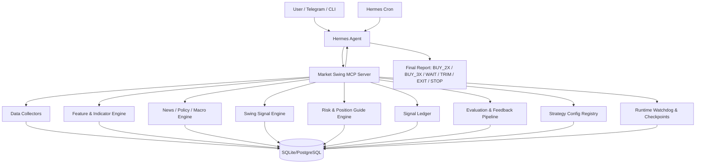

# Hermes Market Swing MCP 개발 계획서

## 1. 개요

이 문서는 Hermes Agent에 연결할 `Market Swing MCP Server`의 개발 계획서다. 목표는 BTC와 미국 지수 2~3배 롱 ETF를 대상으로, 스윙 관점에서 매수 가능 여부, 2배/3배 선택, 손절 조건, 익절 조건, 보유 포지션 관리 가이드를 생성하는 개인용 시장 판단 시스템을 만드는 것이다.

초기 목표는 자동 주문이 아니다. 먼저 데이터 수집, 지표 계산, 뉴스/매크로 해석, 신호 기록, 사후 평가, 텔레그램 리포트까지 구현한다. 주문 연동은 마지막 단계의 선택 사항이며, 기본값은 승인 기반 수동 실행으로 둔다.

주요 대상 상품은 다음과 같다.

| 구분 | 실제 매수 후보 | 판단 기준 |
| --- | --- | --- |
| 나스닥100 | QLD, TQQQ | QQQ, NDX, NQ futures |
| S&P500 | SSO, UPRO | SPY, SPX, ES futures |
| 반도체 | SOXL | SMH, SOXX, SOX, NVDA, AVGO, AMD |
| BTC | BTC coin-m long | BTC spot/futures, funding, OI |

최종 출력은 다음 액션 중 하나다.

```text
BUY_3X       강한 상승 스윙 진입 가능
BUY_2X       상승 스윙 가능하지만 변동성/이벤트 리스크 존재
BUY_WATCH    매수 후보이나 확인 필요
WAIT         관망
TRIM         일부 익절 또는 리스크 축소
EXIT         전량 청산 권고
STOP         진입 논리 무효화
BLOCK        신규 롱 금지
```

## 2. 시스템 정의

### 2.1 시스템의 역할

이 시스템은 Hermes Agent의 MCP 도구 서버로 동작한다. Hermes는 대화, 텔레그램, 크론, 메모리, 멀티모달 판단, 최종 설명 생성을 담당한다. MCP 서버는 데이터 수집, 지표 계산, 스코어링, 라벨링, 백테스트, 피드백 계산을 담당한다.

```text
Hermes Agent:
- Codex OAuth 또는 다른 LLM provider 사용
- 텔레그램/CLI에서 질문 수신
- 크론으로 정기 리포트 실행
- MCP 도구 호출
- 최종 설명과 판단 요약 생성

Market Swing MCP Server:
- 가격/매크로/뉴스/이벤트 데이터 수집
- 지표 계산
- 스윙 신호 계산
- 매수/손절/익절 가이드 생성
- 신호 기록
- 결과 라벨링
- 스코어링 성능 평가
- 개선 후보 제안
```

### 2.2 핵심 원칙

1. 숫자 계산은 코드가 한다.
2. LLM은 자료 해석, 충돌 판단, 설명 생성에 쓴다.
3. 레버리지 ETF는 장기 보유 자산이 아니라 스윙 전술 자산으로 본다.
4. 레버리지 ETF 판단은 ETF 자체보다 기초지수 기준으로 한다.
5. 신호는 반드시 기록하고, 일정 시간이 지난 뒤 실제 결과로 채점한다.
6. 스코어링 변경은 즉시 실전 반영하지 않고 Champion/Challenger 방식으로 검증한다.
7. 자동 주문은 MVP 범위에서 제외한다.
8. 새 기능은 단독 실행 가능한 하네스와 fixture를 우선 설계한다.

### 2.2.1 하네스 엔지니어링 원칙

Halo Swing은 외부 데이터, LLM 해석, 지표 계산, 스코어링이 결합되는 시스템이다. 따라서 기능을 바로 큰 에이전트 흐름에 붙이지 않고, 각 모듈을 작고 재현 가능한 실행 하네스로 감싼다.

```text
목표:
- 다음 LLM/Codex 세션이 안전하게 수정할 수 있는 작업 발판 제공
- live API 없이도 주요 판단 로직 재현
- 스코어링 변경 전후 결과 비교
- LLM prompt/output 변경의 회귀 탐지
```

필수 하네스:

```text
1. tool harness
   - 각 MCP tool을 Hermes 없이 직접 실행
   - 입력 JSON fixture -> 출력 JSON golden 비교

2. data harness
   - market/news/macro 수집기를 live/replay 모드로 분리
   - 외부 API 장애 시 fixture로 테스트 가능

3. indicator harness
   - OHLCV fixture -> RSI/DMI/ADX/MA/ATR expected output

4. scoring harness
   - feature fixture -> score/action/stop/take-profit expected output

5. labeling harness
   - price path fixture -> triple barrier outcome/MFE/MAE expected output

6. report harness
   - MCP structured output -> Hermes-facing report snapshot
```

원칙:

```text
- live API 테스트는 smoke로만 사용한다.
- 핵심 로직 검증은 deterministic fixture를 우선한다.
- LLM 출력은 가능하면 schema로 고정하고 snapshot/golden test를 둔다.
- 하네스가 없는 기능은 완료로 보지 않는다.
```

### 2.2.2 가상 개발팀 게이트

Codex 환경에서 지속형 멀티에이전트 팀이 항상 제공된다고 가정하지 않는다. 대신 각 작업은 아래 역할 관점의 산출물과 체크를 남긴다.

```text
Dev:
- 기능 구현
- 최소 실행 하네스
- 단위 테스트 또는 smoke command

DevOps:
- 로컬 개발 환경과 의존성 관리
- MCP 서버 실행 명령과 smoke command 관리
- Hermes MCP config 예시와 운영 가이드 관리
- secrets/.env 취급 원칙 확인

QC:
- fixture/golden test
- replay/live smoke 분리
- 회귀 가능성 기록

CTO:
- 아키텍처 일관성
- 과최적화/데이터 누수/리스크 예산 검토
- MVP 범위와 자동주문 금지선 확인

Docs Gardener:
- SSOT 변경 여부 확인
- CONTEXT/WORKING 갱신
- 중복 문서와 오래된 링크 제거
```

완료 정의:

```text
작업 완료 = 코드가 돌아감 + DevOps 실행 경로가 있음 + 하네스가 있음 + QC 재현 가능 + CTO 관점 리스크 확인 + 문서 상태 최신
```

### 2.3 주요 질문

시스템은 매번 다음 질문에 답해야 한다.

```text
1. 지금 지수 레버리지 롱을 살 수 있는 구간인가?
2. 산다면 2배가 적절한가, 3배가 적절한가?
3. 진입 논리가 깨지는 손절 조건은 무엇인가?
4. 익절 또는 일부 청산 조건은 무엇인가?
5. 보유 중이라면 유지, 축소, 전량 청산 중 무엇인가?
6. 이번 판단의 신뢰도와 약점은 무엇인가?
7. 과거 비슷한 신호는 실제로 어떻게 됐는가?
```

## 3. 아키텍처

### 3.1 전체 구조



### 3.2 MCP 서버 계층

```text
market_swing_mcp/
  app/
    server.py
    config.py
    schemas.py
    tools/
      market_snapshot.py
      macro_snapshot.py
      event_calendar.py
      news_bundle.py
      indicators.py
      chart_render.py
      swing_score.py
      trade_guide.py
      position_review.py
      feedback.py
    data/
      prices.py
      macro.py
      news.py
      events.py
      filings.py
    engines/
      feature_engine.py
      indicator_engine.py
      scoring_engine.py
      risk_engine.py
      labeler.py
      evaluator.py
      optimizer.py
    storage/
      db.py
      migrations/
    runtime/
      checkpoints.py
      watchdog.py
      journal.py
    reports/
      templates.py
  tests/
  requirements.txt
  .env.example
  README.md
```

### 3.3 MCP 도구 목록

| 도구 | 역할 |
| --- | --- |
| `get_market_snapshot` | QQQ, SPY, SMH, SOXX, BTC 등 가격/추세 요약 |
| `get_macro_snapshot` | VIX, VXN, DXY, 금리, 유가, 금 등 매크로 상태 |
| `get_event_calendar` | FOMC, CPI, PCE, NFP, 실적, 국채입찰 일정 |
| `get_news_bundle` | Fed, Treasury, White House, EIA, Iran, AI/반도체 뉴스 수집 |
| `calculate_indicators` | RSI, DMI/ADX, MA, ATR, gap, support/resistance 계산 |
| `render_chart` | 기초자산 차트 PNG 생성 |
| `score_leverage_swing` | 2배/3배 롱 ETF 매수 가능성 점수화 |
| `generate_trade_guide` | 진입/손절/익절/시간손절 가이드 생성 |
| `evaluate_position` | 보유 포지션의 유지/축소/청산 판단 |
| `record_signal` | 생성된 신호를 ledger에 저장 |
| `label_signal_outcome` | 신호 발생 후 결과 라벨링 |
| `evaluate_score_performance` | 스코어링 성능 리포트 |
| `suggest_weight_update` | 가중치/임계값 개선 후보 제안 |
| `compare_champion_challenger` | 현행 모델과 후보 모델 비교 |

### 3.3.1 설정, 상태, 감시 원칙

스코어링 가중치와 임계값은 코드에 하드코딩하지 않는다. 초기에는 JSON 파일로 시작하고, 운영 이력이 쌓이면 DB의 `strategy_config`/`model_registry`와 연결한다.

```text
원칙:
- 모든 신호는 config_version과 config_hash를 가진다.
- feedback pipeline은 active 설정을 직접 덮어쓰지 않고 candidate/challenger만 만든다.
- active 설정 변경은 명시적 승인 또는 별도 promotion 절차를 거친다.
- JSON 설정은 schema validation, bounds check, sum check를 통과해야 한다.
- 런타임 checkpoint와 재현용 입력 snapshot은 분리해서 저장한다.
- 메모리 덤프, logs, checkpoint, runtime artifact는 git에 커밋하지 않는다.
```

초기 JSON 설정 예시:

```json
{
  "config_id": "leverage_swing_default",
  "version": "0.1.0",
  "status": "champion",
  "target_universe": ["TQQQ", "QLD", "UPRO", "SSO", "SOXL", "BTC"],
  "weights": {
    "trend": 0.25,
    "momentum": 0.20,
    "volatility": 0.20,
    "macro": 0.15,
    "event_risk": 0.10,
    "theme": 0.10
  },
  "thresholds": {
    "buy_3x": 0.68,
    "buy_2x": 0.52,
    "block": 0.30
  },
  "risk": {
    "max_3x_event_risk": 0.35,
    "time_barrier_days": 10
  }
}
```

watchdog는 장기 실행 안정성을 위한 내부 감시 레이어다.

```text
감시 대상:
- memory_rss_mb 또는 프로세스 메모리 사용량
- run queue length / stale job
- 반복 예외와 재시도 폭증
- null/NaN/Inf 비율 증가
- 비정상적으로 큰 evidence bundle 또는 feature payload
- config hash mismatch
- checkpoint 지연 또는 실패

동작:
- warning event 기록
- 현재 run journal에 상태 추가
- 필요 시 checkpoint 저장
- hard limit 초과 시 신규 live 작업 차단 또는 graceful shutdown 요청
```

24/7 운영 안정성은 내부 watchdog와 외부 supervisor를 함께 사용한다. MCP 서버는 가능한 한 얇고 재시작 가능한 프로세스로 유지하고, 장시간 작업은 run journal/checkpoint로 복구 가능하게 만든다.

```text
필수 운영 가드레일:
- process supervisor: launchd/systemd/Hermes runner 등에서 restart policy와 crash-loop backoff 설정
- liveness/readiness: health_check와 runtime status를 분리
- memory budget: soft/hard RSS limit, cache TTL, max in-memory artifact size
- bounded queue: max queue length, stale job timeout, duplicate run lock
- timeout: live API, browser/news/PDF parsing, chart rendering, LLM call 각각에 deadline 설정
- retry policy: exponential backoff + jitter, max retry, provider별 rate limit
- circuit breaker: 외부 API 장애/429/5xx가 반복되면 live call을 임시 차단하고 replay/cache로 degraded mode
- idempotency: cron/report/labeling job은 run_id와 idempotency key로 중복 실행 방지
- atomic persistence: checkpoint와 JSON config는 temp file 작성 후 rename 또는 DB transaction 사용
- disk retention: logs/state/checkpoints/artifacts TTL과 최대 용량 제한
- alerting: critical watchdog_event는 Telegram 또는 운영 채널로 알림
- graceful degradation: 데이터 일부 장애 시 BUY 신호를 강제하지 않고 WAIT/BLOCK 또는 stale-data warning 출력
```

메모리 오버플로우 방지를 위한 기본 설계:

```text
- 뉴스/문서/차트 artifact는 메모리에 오래 들고 있지 않고 file/ref 기반으로 전달
- 대형 PDF/뉴스 번들은 chunk 단위 처리
- LLM/Hermes로 넘기는 context는 evidence card summary 중심으로 제한
- cache는 LRU/TTL과 max_items/max_bytes를 함께 둠
- job 종료 후 큰 객체와 임시 파일을 명시적으로 정리
- watchdog가 memory_rss_mb 증가 추세를 감시하고 soft limit에서는 checkpoint, hard limit에서는 신규 작업 차단
```

### 3.4 저장소 모델

초기에는 SQLite로 시작하고, 데이터가 쌓이면 PostgreSQL로 이전한다.

#### `feature_store`

신호 발생 당시의 모든 입력값을 저장한다.

```text
id
timestamp
symbol
underlying
timeframe
price
returns
rsi
plus_di
minus_di
adx
atr
ma_20
ma_50
ma_200
vix
vxn
dxy
us_2y
us_10y
oil
breadth_score
theme_score
event_risk_score
news_score
raw_features_json
```

#### `signal_ledger`

모든 판단을 기록한다.

```text
id
timestamp
model_version
config_version
config_hash
asset
underlying
action
final_score
p_take_profit
p_stop_loss
expected_r
entry_reference
stop_reference
take_profit_reference
time_barrier_days
component_scores_json
reason_json
guide_json
```

#### `label_store`

신호 이후 실제 결과를 저장한다.

```text
id
signal_id
label_timestamp
outcome
return_1d
return_3d
return_5d
return_10d
mfe
mae
hit_take_profit
hit_stop_loss
hit_time_exit
first_barrier_hit
realized_r
```

#### `model_registry`

스코어링 버전을 관리한다.

```text
model_version
created_at
status              champion / challenger / archived
weights_json
thresholds_json
feature_set_hash
notes
```

#### `strategy_config`

가중치와 임계값 설정을 버전 관리한다. 초기 JSON 파일과 DB 레코드가 같은 hash를 갖도록 관리한다.

```text
config_id
version
status              champion / challenger / archived
created_at
promoted_at
config_hash
target_universe_json
weights_json
thresholds_json
risk_json
validation_status
notes
```

#### `run_journal`

각 실행 단위의 입력, 출력, 오류, 사용 설정을 기록한다.

```text
run_id
started_at
finished_at
run_type            scheduled_report / user_question / labeling / evaluation
status              started / succeeded / failed / cancelled
config_hash
input_refs_json
output_refs_json
error_json
watchdog_summary_json
```

#### `state_checkpoint`

장기 실행 작업의 복구 가능한 중간 상태를 저장한다.

```text
checkpoint_id
run_id
created_at
checkpoint_type     graceful_shutdown / periodic / before_live_call / before_report
state_ref
state_hash
size_bytes
ttl_expires_at
```

#### `watchdog_event`

메모리 한계, 반복 오류, 비정상 값 등을 감시한 결과를 저장한다.

```text
event_id
run_id
timestamp
severity            info / warning / critical
metric_name
metric_value
threshold_value
action_taken
details_json
```

#### `position_journal`

사용자가 실제 진입한 포지션을 수동 또는 반자동으로 기록한다.

```text
id
asset
entry_time
entry_price
size
leverage_type       2x / 3x / btc_coin_m
thesis
stop_plan
take_profit_plan
exit_time
exit_price
exit_reason
notes
```

### 3.5 P1 Storage/Schema Decision Log

> 상태: CTO `DECISION_LOG_GO` recorded. P1 DTO/storage contract 작업을 시작할 수 있다. Migration/repository 코드는 각 하위 gate 승인 전까지 작성하지 않는다.

P1의 첫 목표는 시장 데이터 수집이 아니라, 향후 모든 신호를 재현하고 감사할 수 있는 저장 계약을 먼저 확정하는 것이다. 스키마는 대시보드 편의를 먼저 최적화하지 않고, 다음 두 질문에 답할 수 있어야 한다.

```text
1. 특정 signal_id 하나를 입력하면 당시 판단을 완전히 재현할 수 있는가?
2. 최신 actionable report를 만들 때 필요한 핵심 필드를 빠르게 조회할 수 있는가?
```

#### 3.5.1 팀별 sign-off matrix

| Gate | FE | DB | BE | QC | DevOps | Docs | CTO |
| --- | --- | --- | --- | --- | --- | --- | --- |
| decision_log | report/read model 승인 | table/index/constraint 승인 | DTO/repository boundary 승인 | acceptance criteria 승인 | path/artifact policy 승인 | SSOT 위치 승인 | 최종 go/no-go |
| dto_contract | report fields 승인 | column/ref mapping 승인 | DTO schema 승인 | golden fixture 승인 | no local path leak 확인 | fixture 위치 확인 | DTO_CONTRACT_GO |
| migration | no UI-only table 확인 | DDL/idempotency 승인 | migration runner 승인 | tmp_path test 승인 | no committed DB 확인 | README command 검증 | MIGRATION_GO |
| repository | report read 가능 확인 | query/index 확인 | replay API 승인 | replay fixture 승인 | connection lifecycle 확인 | docs update 확인 | REPOSITORY_GO |
| docs_devops | report command 문구 확인 | backup note 확인 | harness command 확인 | final verification 확인 | retention note 확인 | SSOT/WORKING 정리 | P1 close 판단 |

#### 3.5.1.1 Decision log sign-off record

기록일: 2026-04-29

| Team | Sign-off | Scope | Notes |
| --- | --- | --- | --- |
| FE | signed off | `latest_signal_report`, stale/degraded warning, report/read model | Semantic report fields are sufficient for Telegram/report first use. Dashboard-specific views remain deferred. |
| DB | signed off | field classification, initial table direction, index/constraint planning | DDL remains blocked until `MIGRATION_GO`; PostgreSQL portability notes remain required in P1 implementation. |
| BE | signed off | DTO boundary, replay contract, repository boundary, `record_signal_bundle` transaction | Repository code must not hide unresolved schema rules; DTO tests come before DB code. |
| QC | signed off | DTO golden fixtures, migration idempotency, missing-link structured errors, tmp_path SQLite isolation | P1 tests must prove no repo `data/` writes and no live API dependency. |
| DevOps | signed off | SQLite/artifact path policy, no committed DB artifacts, backup/retention notes | Artifact refs must be portable; backup tooling is deferred. |
| Docs Gardener | signed off | SSOT decision log location, WORKING pointer, no duplicated schema truth | This section is the canonical P1 schema decision source. |
| CTO | `DECISION_LOG_GO` | final architecture go/no-go | Decision log is approved for P1 DTO/storage contract work. Migration/repository code still requires `MIGRATION_GO` and `REPOSITORY_GO`. |

#### 3.5.2 확정된 설계 방향

```text
storage_style:
- indexed relational core columns
- JSON detail for flexible replay payloads
- artifact_ref for large files and external/raw evidence

priority:
1. replay/audit
2. Telegram/report read model
3. future dashboard/materialized views

deferred:
- watchdog_event table until runtime watchdog implementation starts
- dashboard-specific summary/materialized views
- market provider-specific raw tables
- backup tooling implementation
```

#### 3.5.3 Field classification policy

Indexed columns로 둘 필드:

```text
- identifiers: signal_id, run_id, feature_snapshot_id, evidence_id, config_hash
- timestamps: created_at, observed_at, started_at, finished_at
- market keys: asset, underlying, timeframe
- state/action: action, status, degraded_mode
- scoring keys: final_score, config_hash
- freshness: data_freshness_status, stale_after
```

DTO-derived fields로 둘 필드:

```text
- action_label
- risk_summary
- invalidation_summary
- data_warnings
- reason_summary
```

JSON detail로 둘 필드:

```text
- reason_json
- guide_json
- component_scores_json
- raw_features_json
- raw_evidence_json
- error_json
```

Artifact/reference로 둘 필드:

```text
- chart_ref
- pdf_ref
- news_ref
- evidence_source_ref
```

규칙:

```text
- report/list filtering에 필요한 값은 JSON 안에만 넣지 않는다.
- detailed explanation과 raw payload는 JSON/ref로 둔다.
- absolute local path는 DB에 영구 저장하지 않는다.
- artifact_ref는 type + relative/ref path + metadata로 표현하고, 절대 경로 해석은 runtime/devops layer에서 한다.
```

#### 3.5.4 DTO contracts

`latest_signal_report`는 “지금 무엇을 해야 하는가?”에 답하는 최소 리포트 DTO다.

```text
required:
- signal_id
- created_at
- asset
- underlying
- timeframe
- action
- action_label
- final_score
- confidence
- entry_summary
- stop_summary
- take_profit_summary
- invalidation_summary
- risk_summary
- data_freshness_status
- degraded_mode
- data_warnings
- config_hash

optional:
- reason_summary
- evidence_summary
- label_status
- chart_ref
```

`signal_replay_bundle`은 특정 신호를 재현하기 위한 DTO다.

```text
input:
- signal_id

must_return:
- signal_ledger record
- feature_store snapshot
- evidence_card refs/cards used at decision time
- strategy_config by config_hash
- run_journal context
- label_store outcome if available

missing_link_policy:
- missing required replay link returns structured error code
- partial replay must not silently succeed
```

`storage_health`는 DB 스모크와 migration 상태를 위한 DTO다.

```text
required:
- status
- driver
- database_kind
- migration_count
- latest_migration
- domain_tables_present
- live_data_required
```

#### 3.5.5 Initial table direction

Decision log 승인 후 첫 migration 후보:

```text
schema_migrations
strategy_config
run_journal
feature_store
evidence_card
signal_ledger
label_store
artifact_ref
```

각 테이블은 다음 목적을 만족해야 한다.

```text
strategy_config:
- config_hash로 어떤 가중치/임계값을 썼는지 재현
- champion/challenger/archive 상태 추적

run_journal:
- cron/user/evaluation 실행 단위 추적
- idempotency_key와 status 관리

feature_store:
- 신호 발생 당시 수치 feature snapshot 저장
- replay와 labeling의 기준 입력

evidence_card:
- 뉴스/정책/차트/PDF 등 판단 근거의 구조화 요약
- raw artifact는 artifact_ref로 분리

signal_ledger:
- 최종 action/score/entry/stop/take-profit/guide 저장
- config_hash, feature_snapshot_id, evidence refs, run_id 연결

label_store:
- triple barrier outcome, MFE/MAE, realized_r 저장
- signal_ledger와 1:N 또는 1:1 정책은 P1에서 확정

artifact_ref:
- chart/pdf/news/raw evidence 파일 또는 외부 ref를 저장
- portable ref만 저장하고 local absolute path는 피함
```

#### 3.5.6 Replay and write contracts

첫 replay query:

```text
get_signal_replay_bundle(signal_id)
```

반환해야 하는 것:

```text
- signal_ledger row
- linked feature_store snapshot
- linked evidence_card records
- linked artifact_ref records when present
- strategy_config by config_hash
- run_journal context
- label_store outcome if present
```

첫 transaction use case:

```text
record_signal_bundle
```

한 transaction에 포함할 것:

```text
- run_journal row or existing run_id validation
- feature_store snapshot
- evidence_card refs
- signal_ledger row
```

idempotency:

```text
- run_id/idempotency_key는 unique constraint 후보
- config_hash는 strategy_config에서 unique 후보
- replay에 필요한 foreign key/ref 무결성은 migration 전 결정
```

#### 3.5.7 P1 coding gate

코드 작성 전 반드시 확정할 것:

```text
- ID 정책: UUID/ULID/text id 중 선택
- timestamp 정책: UTC ISO-8601 text 또는 epoch milliseconds 중 선택
- initial table list
- indexed columns vs JSON detail vs artifact_ref 구분
- unique constraints and indexes
- migration naming/idempotency rules
- FE/DB/BE/QC/DevOps/Docs sign-off
- CTO `DECISION_LOG_GO`
```

NO-GO:

```text
- decision log 없이 migration 작성
- `MIGRATION_GO` 없이 migration/DDL 작성
- `REPOSITORY_GO` 없이 repository persistence 작성
- DTO가 live API나 DB를 요구
- 테스트가 repo data/에 DB 파일 생성
- signal/report가 searchable core columns 없이 JSON blob에만 저장
- repository layer가 미확정 schema rule을 숨김
- README에 검증되지 않은 DB command 추가
```

### 3.6 P1 DTO Contract Next Action Plan

> 상태: team plan and CTO synthesis recorded. `DTO_CONTRACT_GO` 전에는 DTO 코드, fixture, test를 작성하지 않는다.

`DECISION_LOG_GO` 이후 첫 구현 후보는 SQLite가 아니라 DTO contract다. 이 단계는 향후 migration과 repository가 의존할 계약을 먼저 실행 가능한 테스트로 고정하기 위한 준비 단계다.

#### 3.6.1 목표

```text
1. latest_signal_report, signal_replay_bundle, storage_health 계약을 구현 가능한 수준으로 고정한다.
2. 정상/성능저하(degraded)/replay/health golden fixture를 준비한다.
3. DTO 검증은 live API, Hermes transport, SQLite 파일 없이 오프라인으로 가능해야 한다.
4. migration/DDL/repository persistence는 계속 금지한다.
```

#### 3.6.2 승인 후 예상 write scope

`DTO_CONTRACT_GO`가 승인되면 다음 파일만 첫 구현 범위로 삼는다.

```text
src/halo_swing_mcp/contracts.py
tests/golden/latest_signal_report.json
tests/golden/signal_replay_bundle.json
tests/golden/storage_health.json
tests/test_contracts.py
```

금지 범위:

```text
- SQLite migration files
- repository persistence code
- live market/news/API adapters
- repo data/ writes
- Hermes transport dependency
```

#### 3.6.3 팀별 최종 계획

FE:

```text
- latest_signal_report required/optional fields를 확인한다.
- action, risk, invalidation, entry, stop, take-profit, freshness를 사람이 읽을 수 있는 리포트 의미로 유지한다.
- stale/degraded 상황에서도 action과 warning이 명확한 fixture를 요구한다.
- dashboard-only 필드는 이번 게이트에서 제외한다.
```

DB:

```text
- 각 DTO 필드를 indexed column, DTO-derived field, JSON detail, artifact_ref 중 하나로 매핑할 수 있어야 한다.
- 이 매핑은 migration 설계 입력일 뿐이며 DDL 작성은 하지 않는다.
- signal_id, run_id, config_hash, created_at, asset, timeframe, action, final_score, data_freshness_status는 future searchable field로 유지한다.
```

BE:

```text
- Pydantic DTO 모델을 DB/MCP/Hermes import 없이 정의한다.
- action/status/freshness/degraded/missing replay error 값은 enum 또는 literal로 제한한다.
- fixture와 동일한 deterministic JSON serialization을 제공한다.
- DTO는 repository abstraction을 만들지 않는다.
```

QC:

```text
- normal report, degraded report, replay bundle, storage_health fixture를 검증한다.
- missing required field와 invalid enum negative test를 포함한다.
- 테스트가 live API, SQLite 파일, repo data/ write를 요구하지 않는지 확인한다.
```

DevOps:

```text
- fixture에는 absolute local path를 넣지 않는다.
- artifact ref는 portable relative/external ref 형태로 둔다.
- database_url, cron, service supervisor는 이 테스트에 필요하지 않아야 한다.
```

Docs Gardener:

```text
- SSOT는 계약 의도와 gate 조건만 유지한다.
- WORKING은 팀별 상세 검토 trace를 보관한다.
- 코드 구현 후에는 code/test를 실행 가능한 계약으로 보고 문서 중복을 줄인다.
```

#### 3.6.4 팀간 크로스 체크 결과

1차 크로스 체크에서 나온 수정:

```text
- FE -> BE: action enum 외에 action_label/risk_summary/invalidation_summary/entry/stop/take-profit summary가 필요하다.
- BE -> FE: display copy는 durable contract가 아니므로 semantic field로 제한한다.
- DB -> BE: 모든 DTO 필드는 향후 storage mapping이 가능해야 한다.
- QC -> BE: happy path 외에 missing field와 invalid enum negative test가 필요하다.
- DevOps -> QC: fixture에 absolute local path가 들어가면 안 된다.
- Docs -> all: SSOT는 요약, WORKING은 상세 trace로 역할을 분리한다.
```

2차 크로스 체크에서 확정한 보완:

```text
- degraded report fixture도 action, confidence, warning, invalidation guidance를 포함한다.
- fixture는 투자 판단의 정답이 아니라 계약 필드 존재와 검증 규칙만 테스트한다.
- artifact_ref fixture는 ref_type/ref 형태로 두고 로컬 절대 경로를 피한다.
- DTO 이름은 domain 중심으로 유지하고 storage portability는 mapping notes에서 다룬다.
- 이번 slice는 contracts, fixtures, tests로 제한한다.
```

#### 3.6.5 CTO 종합

```text
call: READY_FOR_DTO_CONTRACT_GO_REVIEW

DTO_CONTRACT_GO 승인 조건:
- latest_signal_report가 action/risk/invalidation/entry/stop/take-profit/freshness/degraded 상태를 표현한다.
- signal_replay_bundle이 replay 필수 링크와 missing-link structured error를 표현한다.
- storage_health가 migration 상태와 live_data_required=false를 표현한다.
- golden/negative tests가 오프라인에서 실행 가능하다.
- fixture에 absolute local path가 없다.

NO-GO:
- migration/DDL/repository persistence가 이번 slice에 포함됨
- live API, Hermes transport, MCP server import, SQLite file이 DTO test에 필요함
- degraded 상태를 report DTO로 표현할 수 없음
- fixture가 로컬 머신 경로나 현재 시각에 의존함
```

### 3.7 P1 DTO_CONTRACT_GO Approval Packet

> 상태: team cross-check complete. CTO recommendation is GO for the narrow DTO contract slice, but code remains blocked until explicit `DTO_CONTRACT_GO`.

이 섹션은 `3.6 P1 DTO Contract Next Action Plan`을 실제 구현 승인 직전 관점에서 재검토한 결과다. 승인 범위는 DTO 모델, fixture, offline test에 한정한다.

#### 3.7.1 팀별 최종 개발 계획

FE:

```text
- normal/degraded latest_signal_report fixture가 action, score, confidence, entry, stop, take-profit, risk, invalidation, freshness, warnings를 표현하는지 확인한다.
- action_label과 summary들은 사람용 report 의미를 담되, dashboard-only 필드는 제외한다.
- BUY/WAIT/TRIM/EXIT/STOP의 전체 taxonomy는 scoring phase로 미룬다.
```

DB:

```text
- 각 DTO 필드를 future indexed column, DTO-derived field, JSON detail, artifact_ref 중 하나로 분류한다.
- 이번 gate에서는 DDL, index, migration runner를 작성하지 않는다.
- action은 durable/searchable 값으로, action_label은 DTO-derived 값으로 본다.
```

BE:

```text
- Pydantic DTO, enum/literal, deterministic JSON serialization만 구현 대상으로 본다.
- DTO module은 MCP server, Hermes, DB, live API를 import하지 않아야 한다.
- replay missing-link error는 code, message, missing_ref_type, missing_ref_id를 가진 구조로 둔다.
```

QC:

```text
- normal/degraded/replay/health golden fixture를 검증한다.
- missing required field와 invalid enum negative test를 포함한다.
- validation failure는 전체 에러 문구가 아니라 field/error category 중심으로 검증한다.
- fixture absolute-path scan을 포함한다.
```

DevOps:

```text
- fixture에는 /Users, file://, machine-specific path, current timestamp를 넣지 않는다.
- artifact_ref는 ref_type/ref 형태의 portable ref만 허용한다.
- background service, cron, Hermes runtime, SQLite file 없이 테스트 가능해야 한다.
```

Docs Gardener:

```text
- SSOT는 gate와 scope만 유지한다.
- WORKING은 상세 trace를 유지한다.
- 구현 후에는 code/test를 실행 가능한 계약으로 보고 문서 중복을 줄인다.
```

#### 3.7.2 팀간 크로스 체크 결과

1차 보완:

```text
- FE 요청: report summary 필드가 빠지면 사람용 swing guide가 약하다.
- BE 보완: summary 필드는 DTO에 포함하되 presentation copy는 formatter로 미룬다.
- DB 요청: DTO field가 future storage category로 분류되어야 한다.
- QC 요청: happy path 외에 negative validation과 absolute-path scan을 포함한다.
- DevOps 요청: fixture는 portable/local-test ready까지만 약속하고 CI-integrated라고 쓰지 않는다.
```

2차 보완:

```text
- action은 durable indexed 후보, action_label은 DTO-derived로 분리한다.
- summary 필드는 required DTO field지만 storage mapping은 derived 또는 JSON detail이 될 수 있다.
- negative test는 Pydantic 메시지 전문이 아니라 validation 실패와 field/category를 확인한다.
- deterministic JSON dump 옵션을 테스트 기준으로 둔다.
- DTO_CONTRACT_GO는 전체 P1이 아니라 contracts/fixtures/tests만 승인한다.
```

#### 3.7.3 CTO 종합

```text
call: READY_TO_MARK_DTO_CONTRACT_GO
recommendation: GO, if the scope remains narrow

DTO_CONTRACT_GO 승인 시 허용:
- src/halo_swing_mcp/contracts.py
- tests/golden/latest_signal_report.json
- tests/golden/latest_signal_report_degraded.json
- tests/golden/signal_replay_bundle.json
- tests/golden/storage_health.json
- tests/test_contracts.py

승인 후 구현 순서:
1. enum/literal과 DTO model 정의
2. normal/degraded/replay/health golden fixture 작성
3. round-trip serialization test 작성
4. negative validation test 작성
5. fixture absolute-path scan 작성
6. health_check, pytest, ruff 실행

계속 금지:
- migrations
- SQLite connection/repository persistence
- market/news adapters
- scoring engine
- Hermes runtime integration

NO-GO:
- DTO slice가 migration/repository/adapters로 확장됨
- 테스트가 network, DB file, Hermes, MCP transport에 의존함
- fixture가 absolute local path 또는 current-time dependency를 포함함
- degraded report나 replay missing-link error를 표현할 수 없음
```

### 3.8 P1 DTO_CONTRACT_GO Sign-Off Execution Plan

> 상태: all teams ready for CTO sign-off. Code remains blocked until CTO records explicit `DTO_CONTRACT_GO`.

이 섹션은 `DTO_CONTRACT_GO`를 실제로 기록하기 전 마지막 실행 절차다. 추가 설계 확장이 아니라, 승인 시 바로 구현할 좁은 범위와 반려 조건을 확인한다.

#### 3.8.1 팀별 최종 사인오프 계획

FE:

```text
- normal/degraded report fixture가 first swing guide에 충분한 semantic field를 갖는지 확인한다.
- degraded report는 confidence가 낮아진 이유와 영향을 받는 guidance field를 드러내야 한다.
- copywriting 품질은 테스트 진리가 아니며, semantic field 존재와 범주만 사인오프한다.
```

DB:

```text
- DTO field별 future storage category mapping을 준비한다.
- mapping은 indexed column, DTO-derived field, JSON detail, artifact_ref 수준에 머문다.
- migration column name, DDL, index name은 MIGRATION_GO까지 확정하지 않는다.
```

BE:

```text
- contracts.py는 isolated Pydantic contract module로 구현 가능해야 한다.
- server/storage/Hermes/network import 없이 validation과 serialization이 가능해야 한다.
- replay missing-link error는 code, message, missing_ref_type, missing_ref_id를 포함한다.
```

QC:

```text
- round-trip serialization, degraded fixture, negative validation, absolute-path scan을 테스트한다.
- Pydantic 전체 에러 문구가 아니라 validation failure와 field/category를 확인한다.
- contract test 후 repo 아래 .sqlite/.sqlite3 DB artifact가 없는지 확인한다.
```

DevOps:

```text
- fixture는 portable ref와 fixed ISO-8601 UTC timestamp만 사용한다.
- /Users/, file://, ~/, drive-like absolute path, generated current timestamp는 금지한다.
- env var, service, cron, Hermes runtime, SQLite file이 필요하면 NO-GO다.
```

Docs Gardener:

```text
- SSOT는 sign-off readiness와 gate만 기록한다.
- WORKING은 상세 trace와 next_atomic_step을 유지한다.
- DTO_CONTRACT_GO 전까지 code remains blocked 문구를 유지한다.
```

#### 3.8.2 팀간 크로스 체크 결과

1차 보완:

```text
- FE -> QC: degraded fixture는 warning뿐 아니라 영향을 받는 decision field도 포함해야 한다.
- QC -> FE: 테스트는 주관적 유용성이 아니라 required field와 allowed category를 검증한다.
- DB -> BE: field classification은 DTO field name 기준으로 남긴다.
- BE -> DB: classification은 category-level이며 migration column name을 고정하지 않는다.
- DevOps -> QC: absolute-path scan은 /Users/, file://, ~/, drive-like roots를 포함한다.
- Docs -> all: 이 섹션은 승인 기록이 아니라 승인 직전 readiness 기록이다.
```

2차 보완:

```text
- degraded report 요구사항은 semantic requirement로만 문서화하고 copywriting으로 확장하지 않는다.
- contract tests 후 DB artifact pattern만 확인하고 pytest cache 같은 일반 cache는 금지하지 않는다.
- fixed ISO-8601 UTC timestamp는 허용하되 current-time generation은 금지한다.
- 다음 판단은 추가 계획이 아니라 DTO_CONTRACT_GO 또는 change request다.
```

#### 3.8.3 CTO 종합

```text
call: FINAL_READY_FOR_DTO_CONTRACT_GO
recommendation: GO

근거:
- 모든 팀이 contracts/fixtures/tests라는 좁은 범위에 합의했다.
- migration/DDL/repository/adapters/scoring/Hermes runtime은 여전히 잠겨 있다.
- QC/DevOps가 offline, deterministic, portable fixture 조건을 검증할 수 있다.
- degraded report와 replay missing-link error가 계약 범위에 포함되어 있다.

DTO_CONTRACT_GO 승인 시 바로 허용:
- src/halo_swing_mcp/contracts.py
- tests/golden/latest_signal_report.json
- tests/golden/latest_signal_report_degraded.json
- tests/golden/signal_replay_bundle.json
- tests/golden/storage_health.json
- tests/test_contracts.py

승인 직후 구현 순서:
1. enum/literal과 DTO model 정의
2. normal/degraded/replay/health fixture 작성
3. deterministic round-trip serialization test 작성
4. negative validation test 작성
5. fixture absolute-path scan과 no-DB-artifact check 작성
6. health_check, pytest, ruff 실행

계속 금지:
- migration/DDL until MIGRATION_GO
- repository persistence until REPOSITORY_GO
- market/news adapters
- scoring engine
- Hermes runtime integration

NO-GO:
- action taxonomy를 더 넓히기로 결정하는 경우
- DTO slice가 contracts/fixtures/tests 밖으로 확장되는 경우
- fixture portability 또는 offline-test 조건을 완화하는 경우
```

### 3.9 P1 DTO Contract Implementation Plan After GO

> 상태: CTO `DTO_CONTRACT_GO` recorded. The approved DTO contract slice may be implemented. Migration/repository work remains blocked.

이 섹션은 `DTO_CONTRACT_GO`가 기록되는 즉시 수행할 첫 코드 slice를 정의한다. 추가 설계 확장이 아니라, contracts/fixtures/tests만 구현하는 계획이다.

#### 3.9.0 Gate record

```text
gate: DTO_CONTRACT_GO
recorded_at: 2026-04-29
recorded_by: CTO
status: approved_for_implementation
scope: contracts.py, golden fixtures, offline contract tests only
```

#### 3.9.1 구현 범위

허용 범위:

```text
- src/halo_swing_mcp/contracts.py
- tests/golden/latest_signal_report.json
- tests/golden/latest_signal_report_degraded.json
- tests/golden/signal_replay_bundle.json
- tests/golden/storage_health.json
- tests/test_contracts.py
```

계속 금지:

```text
- migration/DDL
- SQLite connection
- repository persistence
- market/news adapters
- scoring engine
- Hermes runtime integration
```

#### 3.9.2 팀별 최종 구현 계획

FE:

```text
- normal/degraded latest_signal_report fixture가 first swing guide semantic fields를 포함하는지 확인한다.
- degraded fixture는 data_warnings와 영향을 받는 risk/invalidation guidance를 포함한다.
- presentation formatting, dashboard, Telegram copy는 제외한다.
```

DB:

```text
- future searchable fields가 DTO에서 사라지지 않았는지 확인한다.
- storage classification은 category-level로만 유지하고 DDL/column name은 정하지 않는다.
- ArtifactRef는 portable ref_type/ref 구조를 사용한다.
```

BE:

```text
- isolated Pydantic contracts.py만 production code로 추가한다.
- server/config/storage/Hermes/network import는 금지한다.
- LatestSignalReport, SignalReplayBundle, StorageHealth, ArtifactRef, ReplayMissingLinkError를 구현 대상으로 본다.
- deterministic serialization 또는 parsed JSON comparison을 테스트한다.
```

QC:

```text
- golden round-trip, degraded fixture, missing required field, invalid enum test를 작성한다.
- fixture absolute-path scan을 추가한다.
- contract test 후 repo 아래 .sqlite/.sqlite3 artifact가 없는지 확인한다.
- 투자 판단 정답성은 테스트하지 않는다.
```

DevOps:

```text
- fixture는 fixed ISO-8601 UTC timestamp를 사용한다.
- /Users/, file://, ~/, drive-like absolute path, generated current time은 금지한다.
- 새 env var, service, cron, data directory, Hermes runtime dependency는 만들지 않는다.
```

Docs Gardener:

```text
- SSOT/WORKING에 explicit DTO_CONTRACT_GO가 기록된 상태를 유지한다.
- 구현 후 docs는 code/tests를 executable contract로 참조하고 중복 field prose를 줄인다.
- MIGRATION_GO와 REPOSITORY_GO는 계속 blocked로 유지한다.
```

#### 3.9.3 팀간 크로스 체크 결과

1차 보완:

```text
- FE -> BE: normal/degraded fixture 모두 summary field가 채워져야 한다.
- BE -> FE: 테스트는 final prose style이 아니라 field/type/category를 확인한다.
- DB -> BE: ArtifactRef는 portable ref_type/ref 구조여야 한다.
- BE -> DB: storage classification은 domain model을 오염시키지 않게 docs/tests 수준으로 둔다.
- QC -> BE: JSON 비교는 deterministic dump 또는 parsed JSON comparison으로 한다.
- DevOps -> QC: path scan은 absolute/local path와 DB artifact pattern만 겨냥한다.
- Docs -> all: DTO_CONTRACT_GO가 명시 기록된 현재 상태와 좁은 구현 범위를 함께 유지한다.
```

2차 보완:

```text
- degraded fixture는 warning과 impacted guidance를 함께 포함한다.
- runtime path root policy는 DevOps/storage gate로 미루고, 지금은 absolute path만 금지한다.
- 정확한 enum 목록은 code/tests가 GO 이후 executable source가 된다.
- 다음 단계는 추가 대형 계획이 아니라 승인된 코드 구현과 검증이다.
```

#### 3.9.4 CTO 종합

```text
call: DTO_CONTRACT_GO
recommendation: implement the approved DTO contract slice immediately

근거:
- 구현 범위가 contracts/fixtures/tests로 좁다.
- report usefulness, future storage mapping, offline QC, fixture portability가 모두 반영됐다.
- migration/repository/adapters/scoring/Hermes runtime은 계속 gate로 막혀 있다.

실행 순서:
1. contracts.py 구현
2. normal/degraded/replay/health fixture 작성
3. round-trip/negative/path-scan/no-DB-artifact tests 작성
4. health_check, pytest, ruff 실행

NO-GO:
- contracts/fixtures/tests 밖으로 범위가 확장됨
- tests가 network, DB file, Hermes, MCP transport, current time에 의존함
- fixture가 local absolute path를 포함함
```

### 3.10 P1 DTO Contract Execution Plan

> 상태: `DTO_CONTRACT_GO` recorded. Next action is implementation and verification of the approved DTO contract slice.

이 섹션은 실제 구현자가 따라야 할 작업 순서와 팀별 검토 결과를 요약한다. 승인 범위는 3.9와 동일하며, 여섯 파일을 넘기려면 CTO gate를 다시 열어야 한다.

#### 3.10.1 팀별 상세 실행 계획

FE:

```text
- normal/degraded latest_signal_report fixture가 first swing guide semantic fields를 포함하는지 확인한다.
- entry_summary, stop_summary, take_profit_summary, invalidation_summary, risk_summary는 required로 유지한다.
- degraded fixture는 degraded_mode=true, data_warnings, lower confidence, impacted guidance를 포함한다.
- UI layout, Telegram copy, dashboard fields는 제외한다.
```

DB:

```text
- DTO가 future searchable fields를 보존하는지 확인한다.
- SignalReplayBundle은 signal, feature_snapshot, evidence_cards, strategy_config, run_journal, label_outcome, missing_links를 구조화한다.
- SQL, sqlite3, database_url, repository, migration, table/column naming은 금지한다.
- ArtifactRef는 portable ref_type/ref 구조를 사용한다.
```

BE:

```text
- contracts.py에 Pydantic DTO와 enum/literal만 추가한다.
- LatestSignalReport, SignalReplayBundle, StorageHealth, ArtifactRef, ReplayMissingLinkError를 구현한다.
- server/config/storage/Hermes/network import는 금지한다.
- JSON comparison은 canonical dump 또는 parsed JSON comparison으로 안정화한다.
```

QC:

```text
- normal/degraded/replay/health golden round-trip tests를 작성한다.
- missing required field와 invalid enum negative tests를 작성한다.
- degraded confidence < normal confidence를 검증한다.
- new JSON fixtures의 모든 nested string을 path-scan하고, repo 아래 .sqlite/.sqlite3 artifact가 없는지 확인한다.
```

DevOps:

```text
- fixture는 fixed ISO-8601 UTC timestamp를 사용한다.
- https:// external ref는 허용하고 file://, /Users/, ~/, drive-like absolute path는 금지한다.
- env var, cron, supervisor, Hermes runtime, DB path, data directory 요구사항을 추가하지 않는다.
```

Docs Gardener:

```text
- WORKING은 구현 결과와 검증 결과만 갱신한다.
- 코드 구현 후 docs는 code/tests를 executable contract로 참조하고 중복 field prose를 줄인다.
- MIGRATION_GO와 REPOSITORY_GO는 계속 blocked로 유지한다.
```

#### 3.10.2 팀간 크로스 체크 결과

1차 보완:

```text
- FE -> BE: report summary fields는 required로 유지한다.
- BE -> FE: tests는 final prose style이 아니라 structure/category를 검증한다.
- DB -> BE: replay bundle은 opaque JSON blob이 아니라 구조화된 DTO여야 한다.
- BE -> DB: domain DTO names를 쓰고 table/column names는 migration gate로 미룬다.
- QC -> BE: negative tests는 missing required field와 invalid enum을 포함한다.
- DevOps -> QC: path scan은 new JSON fixtures와 DB artifact extension check로 나눈다.
- Docs -> all: approved write scope는 CTO 재승인 전까지 여섯 파일 그대로 유지한다.
```

2차 보완:

```text
- degraded fixture는 degraded_mode=true, data_warnings, normal보다 낮은 confidence를 포함한다.
- path scan은 nested JSON string까지 검사한다.
- https:// external ref는 허용하고 file:// 및 local absolute path는 금지한다.
- fixtures는 required field를 모두 포함하고 tests는 parsed/canonical JSON으로 비교한다.
- 구현 순서는 contracts.py -> fixtures -> tests -> verification이다.
```

#### 3.10.3 CTO 종합

```text
call: IMPLEMENT_DTO_CONTRACT_SLICE_NOW
recommendation: proceed with implementation

실행 순서:
1. src/halo_swing_mcp/contracts.py 생성
2. normal/degraded/replay/health golden fixtures 생성
3. tests/test_contracts.py 생성
4. health_check, pytest, ruff 실행
5. WORKING에 구현/검증 결과 기록

hard_limits:
- migration/DDL 금지
- repository persistence 금지
- adapter/scoring/Hermes runtime code 금지
- CTO가 gate를 다시 열기 전까지 approved write scope 여섯 파일만 수정
```

### 3.11 P1 Contracts.py First Execution Step Plan

> 상태: ready to implement `src/halo_swing_mcp/contracts.py` as execution-order step 1.

이 섹션은 3.10 실행 순서의 첫 항목만 다룬다. 목표는 fixture/test 작성 전에 isolated Pydantic contract module을 안전하게 만드는 것이다.

#### 3.11.1 팀별 상세 계획

FE:

```text
- LatestSignalReport는 normal/degraded swing report를 표현할 수 있어야 한다.
- entry_summary, stop_summary, take_profit_summary, invalidation_summary, risk_summary는 required로 유지한다.
- degraded_mode와 data_warnings는 required field로 둔다.
- UI layout, Telegram copy, dashboard-specific field는 금지한다.
```

DB:

```text
- replay/report identifiers와 future searchable fields는 명시 field로 둔다.
- action은 durable value, action_label은 report-derived value로 분리한다.
- SignalReplayBundle은 signal, feature_snapshot, evidence_cards, strategy_config, run_journal, label_outcome, missing_links를 named fields로 가진다.
- SQL, sqlite3, table/column names, repository/migration vocabulary는 금지한다.
```

BE:

```text
- contracts.py에는 Pydantic model과 enum/literal만 둔다.
- ArtifactRef, ReplayMissingLinkError, LatestSignalReport, SignalReplayBundle, StorageHealth를 구현한다.
- server/config/storage/Hermes/network import는 금지한다.
- required field에는 default를 두지 않고, now()/utcnow() default도 금지한다.
```

QC:

```text
- missing required field와 invalid enum validation이 다음 test step에서 가능해야 한다.
- defaults가 required data 누락을 숨기면 안 된다.
- Pydantic error string 전체가 아니라 field/category 중심으로 검증 가능해야 한다.
```

DevOps:

```text
- module import는 file IO, env read, network call, settings load를 하지 않는다.
- timestamp는 caller/fixture가 제공하며 contracts.py가 현재 시각을 만들지 않는다.
- ArtifactRef는 path를 resolve하지 않는 plain data object다.
```

Docs Gardener:

```text
- docs는 contract intent만 남기고 exact model truth는 code/tests에 둔다.
- contracts.py 구현 후 WORKING에 구현 결과를 기록한다.
- 다음 단계는 golden fixture creation이다.
```

#### 3.11.2 팀간 크로스 체크 결과

1차 보완:

```text
- FE -> BE: report summary fields는 required로 유지한다.
- BE -> FE: action enum은 BUY_2X, BUY_3X, WAIT, TRIM, EXIT, STOP을 지원하되 strategy logic은 넣지 않는다.
- DB -> BE: SignalReplayBundle은 opaque JSON blob이 아니라 named sections를 가진다.
- BE -> DB: evolving raw details는 JSON-compatible dict 안에 둘 수 있다.
- QC -> BE: required fields에는 defaults를 두지 않는다.
- DevOps -> BE: current-time default_factory는 금지한다.
- Docs -> all: exact enum/model truth는 구현 후 code/tests가 가진다.
```

2차 보완:

```text
- LatestSignalReport는 degraded_mode와 data_warnings를 required로 가진다.
- data_warnings는 normal report에서 empty list일 수 있지만 field 자체는 required다.
- ArtifactRef metadata의 local path 금지는 다음 fixture path-scan test가 담당한다.
- https evidence refs는 허용하고 file/local refs 금지는 fixture test에서 검증한다.
- Pydantic serialization test는 raw string order가 아니라 parsed/canonical payload를 비교한다.
```

#### 3.11.3 CTO 종합

```text
call: IMPLEMENT_CONTRACTS_PY_FIRST
recommendation: proceed

실행 순서:
1. src/halo_swing_mcp/contracts.py 생성
2. server/config/storage/Hermes/network와 독립 유지
3. DTO/enums를 required field 중심으로 정의
4. current-time default와 runtime side effect 금지
5. contracts.py import check
6. 다음 단계로 golden fixtures 작성

hard_limits:
- 이 단계에서는 contracts.py만 구현한다.
- migration/repository/adapters/scoring/Hermes code 금지
- 새 dependency 추가 금지
```

### 3.12 P1 Contracts.py Model Spec Plan

> 상태: ready to implement `contracts.py` from the concrete model spec.

이 섹션은 `src/halo_swing_mcp/contracts.py` 구현 직전의 모델 스펙을 확정한다. 다음 턴의 추천 액션은 추가 계획이 아니라 이 스펙대로 코드 구현이다.

#### 3.12.1 팀별 상세 계획

FE:

```text
- LatestSignalReport required fields:
  signal_id, created_at, asset, underlying, timeframe, action, action_label,
  final_score, confidence, entry_summary, stop_summary, take_profit_summary,
  invalidation_summary, risk_summary, data_freshness_status, degraded_mode,
  data_warnings, config_hash
- Optional fields: reason_summary, evidence_summary, label_status, chart_ref
- TradeAction은 BUY_2X, BUY_3X, WAIT, TRIM, EXIT, STOP을 포함한다.
- UI layout, Telegram copy, dashboard field는 금지한다.
```

DB:

```text
- identifiers와 future searchable fields는 explicit DTO field로 유지한다.
- timestamps는 first pass에서 caller-supplied UTC ISO-8601 string으로 둔다.
- SignalReplayBundle은 signal, feature_snapshot, evidence_cards, strategy_config, run_journal, label_outcome, missing_links named sections를 가진다.
- section 내부 detail은 JSON-compatible dict/list를 허용하되 top-level replay bundle은 opaque blob으로 만들지 않는다.
- SQL/table/column/migration vocabulary는 금지한다.
```

BE:

```text
- contracts.py에는 stdlib typing/enum과 Pydantic만 사용한다.
- public names:
  TradeAction, DataFreshnessStatus, SignalStatus, ArtifactRefType, ReplayErrorCode,
  ArtifactRef, ReplayMissingLinkError, LatestSignalReport, SignalReplayBundle, StorageHealth
- Pydantic model은 extra fields를 forbid한다.
- required field에는 default를 두지 않는다.
- now()/utcnow()/default_factory current time은 금지한다.
```

QC:

```text
- missing required field와 invalid enum test가 다음 단계에서 명확해야 한다.
- data_warnings는 required list[str]이며 normal fixture에서는 []를 넣을 수 있다.
- validation은 filesystem/env/current time에 의존하지 않는다.
- serialization test는 raw string order가 아니라 parsed/canonical payload를 비교한다.
```

DevOps:

```text
- no new dependency.
- module import는 file IO, env read, network call, path resolution을 하지 않는다.
- ArtifactRef는 ref_type/ref/metadata plain data이며 local path existence를 확인하지 않는다.
- timestamp parsing/normalization은 first pass에서 하지 않고 fixture test가 fixed UTC string을 강제한다.
```

Docs Gardener:

```text
- 이 섹션은 구현 스펙이며, 구현 후 exact truth는 contracts.py와 tests가 가진다.
- WORKING에는 구현 결과와 import-check 결과만 기록한다.
- 다음 단계는 golden fixture creation이다.
```

#### 3.12.2 팀간 크로스 체크 결과

1차 보완:

```text
- FE -> BE: leveraged swing workflow를 위해 BUY_2X/BUY_3X를 TradeAction에 포함한다.
- BE -> FE: speculative action은 추가하지 않는다.
- DB -> BE: SignalReplayBundle은 named top-level sections를 가져야 한다.
- BE -> DB: evolving detail은 각 section 내부 dict/list로 둔다.
- QC -> BE: required fields에는 defaults를 두지 않는다.
- DevOps -> BE: Python 3.11 baseline은 확인됐지만, 구현은 단순성을 우선한다.
- Docs -> all: LatestSignalReport는 SSOT 3.5 DTO contract와 정렬한다.
```

2차 보완:

```text
- data_warnings는 required list[str]; normal fixture는 [], degraded fixture는 non-empty list를 사용한다.
- confidence는 numeric field로 두고 range validation은 단순하면 코드에서, 아니면 fixture/test에서 다룬다.
- timestamp는 string field로 두고 UTC ISO-8601 expectation만 문서화한다.
- exact enum/model truth는 구현 후 contracts.py와 tests가 가진다.
```

#### 3.12.3 CTO 종합

```text
call: IMPLEMENT_CONTRACTS_PY_FROM_MODEL_SPEC
recommendation: proceed with code implementation next

required public names:
- TradeAction
- DataFreshnessStatus
- SignalStatus
- ArtifactRefType
- ReplayErrorCode
- ArtifactRef
- ReplayMissingLinkError
- LatestSignalReport
- SignalReplayBundle
- StorageHealth

implementation rules:
- use Pydantic BaseModel with extra fields forbidden
- keep timestamps as caller-supplied UTC ISO-8601 strings in first pass
- keep contracts.py independent from server/config/storage/Hermes/network
- add no new dependency
- implement only src/halo_swing_mcp/contracts.py in this step

next action after code:
- import-check contracts.py
- then prepare or implement golden fixtures
```

### 3.13 P1 Contracts.py Implementation Work Order

> 상태: final work order ready. Next action is code implementation of `src/halo_swing_mcp/contracts.py`.

이 섹션은 추가 설계가 아니라 구현 지시서다. 다음 액션은 이 순서대로 `contracts.py`를 작성하고 import-check를 수행하는 것이다.

#### 3.13.1 팀별 상세 계획

FE:

```text
- LatestSignalReport는 3.12 required/optional field list를 그대로 따른다.
- TradeAction string value는 BUY_2X, BUY_3X, WAIT, TRIM, EXIT, STOP의 uppercase value를 사용한다.
- confidence는 0..1 범위로 제한하고, final_score는 scoring scale 확정 전까지 float만 둔다.
- action_label과 action 관계 validator는 아직 두지 않는다.
```

DB:

```text
- SignalReplayBundle은 named sections를 가진다:
  signal, feature_snapshot, evidence_cards, strategy_config, run_journal, label_outcome, missing_links
- section 내부는 JSON-compatible dict/list를 허용한다.
- label_outcome은 optional이다.
- SQL, sqlite3, database_url, repository, migration, table, column vocabulary/import는 금지한다.
```

BE:

```text
- file order:
  1. imports
  2. StrictBaseModel with ConfigDict(extra="forbid")
  3. enums
  4. ArtifactRef and ReplayMissingLinkError
  5. LatestSignalReport, SignalReplayBundle, StorageHealth
  6. __all__
- imports는 stdlib enum/typing과 pydantic만 사용한다.
- Field는 static constraints/metadata에만 사용하고 default_factory는 금지한다.
```

QC:

```text
- required fields에는 default를 두지 않는다.
- optional fields만 None default를 가진다.
- data_warnings는 required list[str]다.
- enum/range/missing field validation이 다음 test step에서 명확해야 한다.
```

DevOps:

```text
- module import는 IO/env/network/current-time side effect가 없어야 한다.
- timestamp fields는 str로 둔다.
- ArtifactRef.ref는 str이며 path/URL existence validation은 하지 않는다.
- requirements.txt는 변경하지 않는다.
```

Docs Gardener:

```text
- 구현 후 WORKING에는 file created와 import-check result만 기록한다.
- docs는 full code를 복제하지 않는다.
- 다음 단계는 golden fixture creation이다.
```

#### 3.13.2 팀간 크로스 체크 결과

1차 보완:

```text
- FE -> BE: TradeAction casing은 fixture 안정성을 위해 uppercase로 한다.
- DB -> BE: SignalReplayBundle은 named sections plus internal dict/list 형태로 둔다.
- QC -> BE: chart_ref는 ArtifactRef | None으로 둔다.
- DevOps -> BE: Field는 static metadata/constraints만 허용하고 dynamic default는 금지한다.
- Docs -> all: confidence range는 simple Field constraint로 둔다.
```

2차 보완:

```text
- confidence는 0..1 constraint, final_score는 unconstrained float.
- action/action_label 관계 validator는 아직 두지 않는다.
- ArtifactRef.ref는 plain str이며 path/URL safety는 fixture path-scan test가 담당한다.
- __all__을 포함해 public contract names를 명확히 한다.
- 다음 액션은 추가 계획이 아니라 contracts.py 구현이다.
```

#### 3.13.3 CTO 종합

```text
call: IMPLEMENT_CONTRACTS_PY_NOW
recommendation: proceed to code without another planning cycle

exact work order:
1. add src/halo_swing_mcp/contracts.py only
2. implement StrictBaseModel
3. implement enums with uppercase string values
4. implement ArtifactRef and ReplayMissingLinkError
5. implement LatestSignalReport, SignalReplayBundle, StorageHealth
6. add __all__
7. run import-check

hard_limits:
- no fixtures/tests in this first file-only step unless the user explicitly asks for the whole DTO slice
- no migration/repository/adapters/scoring/Hermes code
- no dependency changes
```

### 3.14 P1 Contracts.py File Creation Checklist

> 상태: final checklist ready. Next action is to create `src/halo_swing_mcp/contracts.py`.

이 섹션은 실행순서 1번의 마지막 체크포인트다. 다음 응답은 범위 변경이 없다면 추가 계획이 아니라 `contracts.py` 생성이어야 한다.

#### 3.14.1 팀별 상세 체크리스트

FE:

```text
- LatestSignalReport includes all required fields from 3.12.
- Optional report enrichments default to None: reason_summary, evidence_summary, label_status, chart_ref.
- chart_ref is ArtifactRef | None.
- TradeAction uses uppercase values: BUY_2X, BUY_3X, WAIT, TRIM, EXIT, STOP.
- No UI/Telegram/dashboard-only fields.
```

DB:

```text
- SignalReplayBundle uses named sections, not one opaque replay blob.
- ReplayMissingLinkError has code, message, missing_ref_type, missing_ref_id.
- missing_ref_id may be None.
- ArtifactRef has ref_type, ref, metadata.
- No sqlite3/SQL/repository/migration/table/column/database_url vocabulary or imports.
```

BE:

```text
- File order: imports, StrictBaseModel, enums, small models, main DTOs, __all__.
- StrictBaseModel uses ConfigDict(extra="forbid").
- confidence uses Field(ge=0, le=1); final_score remains unconstrained float.
- default_factory is allowed only for safe empty collections such as ArtifactRef.metadata.
- current-time, IO, env, network, settings, and path resolution are forbidden.
```

QC:

```text
- Required fields have no defaults.
- data_warnings is required list[str] and must be supplied by fixtures later.
- Optional fields default only to None.
- Enum fields are real enums.
- Extra fields are forbidden.
```

DevOps:

```text
- No new dependency.
- Import is side-effect free.
- ArtifactRef.ref is plain str and does not validate path/URL existence.
- ArtifactRefType includes CHART, PDF, NEWS, EXTERNAL, OTHER.
- Local/file path bans are enforced later by fixture path-scan tests.
```

Docs Gardener:

```text
- This is the final planning checkpoint for contracts.py creation.
- After code, WORKING records file-created and import-check result only.
- Next planned step remains golden fixture creation.
```

#### 3.14.2 팀간 크로스 체크 결과

1차 보완:

```text
- FE -> BE: chart_ref must be ArtifactRef | None.
- BE -> FE: optional report enrichments default to None.
- DB -> BE: ReplayMissingLinkError needs structured missing ref fields.
- BE -> DB: missing_ref_id may be None.
- QC -> BE: mutable empty metadata must not use a raw {} default.
- DevOps -> QC: Field(default_factory=dict) is allowed only for empty metadata, not time/state.
- Docs -> all: default_factory ban is narrowed to dynamic/time/state factories.
```

2차 보완:

```text
- data_warnings remains required and has no default; fixtures must supply [] or non-empty list.
- ArtifactRef.metadata may use Field(default_factory=dict).
- ArtifactRefType includes CHART, PDF, NEWS, EXTERNAL, OTHER.
- ref string remains unconstrained; fixture tests later block local/file refs.
- next action is implementation, not further planning.
```

#### 3.14.3 CTO 종합

```text
call: CREATE_CONTRACTS_PY_NOW
recommendation: implement now

exact next action:
1. add src/halo_swing_mcp/contracts.py
2. run:
   PYTHONPATH=src ./.venv/bin/python -c "from halo_swing_mcp.contracts import LatestSignalReport"
3. update WORKING with file-created and import-check result

hard_limits:
- no fixtures/tests in this file-only action
- no migration/repository/adapters/scoring/Hermes code
- no dependency changes
- no further planning unless user changes scope
```

### 3.15 P1 Contracts.py Create Action Final Sign-Off

> 상태: all teams signed. Next action is implementation, not further planning.

이 섹션은 실행순서 1번 `contracts.py` 생성의 최종 사인오프다. 범위 변경이 없다면 다음 응답은 파일 생성과 import-check여야 한다.

#### 3.15.1 팀별 최종 사인오프

```text
FE: signed, provided LatestSignalReport fields and TradeAction scope do not change.
DB: signed, provided SignalReplayBundle stays structured and no schema vocabulary appears.
BE: signed, provided implementation touches only contracts.py and follows the agreed file order.
QC: signed, provided every public model inherits StrictBaseModel and required fields stay required.
DevOps: signed, provided import is side-effect free and requirements.txt is unchanged.
Docs Gardener: signed, provided this is the final planning artifact for this action.
```

#### 3.15.2 팀간 크로스 체크 결과

1차 보완:

```text
- final_score remains unconstrained float; scoring scale is deferred.
- all public models inherit StrictBaseModel.
- metadata remains plain dict and path safety is handled by fixture tests later.
- import-check must use the approved venv/PYTHONPATH command.
- CTO synthesis must close planning for this action.
```

2차 보완:

```text
- no validator ties action_label to action yet.
- post-code docs update goes to WORKING current state unless scope changes.
- MIGRATION_GO and REPOSITORY_GO remain locked.
- Field(default_factory=dict) is allowed only for empty metadata, not dynamic/time/state values.
- next assistant action should implement contracts.py.
```

#### 3.15.3 CTO 종합

```text
call: CREATE_CONTRACTS_PY_NOW_FINAL
recommendation: implement immediately

final order:
1. add src/halo_swing_mcp/contracts.py
2. run:
   PYTHONPATH=src ./.venv/bin/python -c "from halo_swing_mcp.contracts import LatestSignalReport"
3. update WORKING with file-created and import-check result
4. move to golden fixture creation

hard_limits:
- no further planning for contracts.py creation unless user changes scope
- no fixtures/tests in this action
- no migration/repository/adapters/scoring/Hermes code
- no dependency changes
```

### 3.16 P1 Golden Fixture Creation Plan

> 상태: next action defined after `contracts.py` creation. Create four golden JSON fixtures next.

이 섹션은 실행순서 2번인 golden fixture creation의 팀별 계획과 CTO 종합이다. 이 단계는 JSON fixture만 만든다.

#### 3.16.1 팀별 상세 계획

FE:

```text
- normal latest_signal_report fixture: BUY_2X, degraded_mode=false, empty data_warnings.
- degraded latest_signal_report fixture: WAIT, degraded_mode=true, non-empty data_warnings, lower confidence.
- both fixtures include entry/stop/take-profit/invalidation/risk summaries.
- prose is semantic example data, not final UI/Telegram copy.
```

DB:

```text
- signal_replay_bundle includes signal, feature_snapshot, evidence_cards, strategy_config, run_journal, label_outcome, missing_links.
- stable IDs include signal_id, run_id, feature_snapshot_id, config_hash.
- timestamps use fixed UTC ISO-8601 strings.
- no SQL/table/schema details.
```

BE:

```text
- fixture keys match contracts.py Pydantic field names.
- enum values match uppercase contract enum strings.
- optional fields may use useful examples or null.
- fixtures should be ready for model_validate/model_validate_json tests.
```

QC:

```text
- degraded confidence < normal confidence.
- degraded data_warnings is non-empty.
- storage_health reflects no DB implementation yet: migration_count=0, latest_migration=null, domain_tables_present=[], live_data_required=false.
- fixture values support future negative tests but do not assert trading correctness.
```

DevOps:

```text
- no /Users, file://, ~/, drive roots, .sqlite, .sqlite3 strings.
- https:// external refs are allowed.
- no generated current timestamp; use fixed UTC strings.
- no new directories beyond approved tests/golden files.
```

Docs Gardener:

```text
- docs record fixture intent only.
- fixture JSON lives only under tests/golden.
- after creation, WORKING records created files and validation status.
- next step is tests/test_contracts.py.
```

#### 3.16.2 팀간 크로스 체크 결과

1차 보완:

```text
- normal uses BUY_2X and degraded uses WAIT for clear contrast.
- enum values must match contracts.py exactly.
- replay fixture includes config_hash and run_id for traceability.
- degraded warning and lower confidence must be testable.
- use https:// refs in first fixtures to avoid local path ambiguity.
- SSOT records intent only, not full JSON.
```

2차 보완:

```text
- fixture trade values are deterministic examples, not investment correctness.
- summaries mention distinct entry/stop/take-profit/invalidation concepts.
- first artifact refs use external https refs; local artifact root policy is deferred.
- storage_health explicitly reflects no DB implementation yet.
- next action is four JSON fixtures only.
```

#### 3.16.3 CTO 종합

```text
call: CREATE_GOLDEN_FIXTURES_NEXT
recommendation: proceed with fixture creation

exact next action:
1. create tests/golden/latest_signal_report.json
2. create tests/golden/latest_signal_report_degraded.json
3. create tests/golden/signal_replay_bundle.json
4. create tests/golden/storage_health.json

hard_limits:
- no tests/test_contracts.py in this action unless user asks to implement the whole remaining DTO slice
- no migration/repository/adapters/scoring/Hermes code
- no dependency changes
```

### 3.17 P1 Golden Fixture Work Order

> 상태: work order ready. Next action is creating the four approved golden JSON fixture files.

이 섹션은 실행순서 2번을 실제 파일 작성 지시서로 구체화한다. 이 단계는 fixture JSON만 만든다.

#### 3.17.1 팀별 상세 계획

FE:

```text
- latest_signal_report.json: action=BUY_2X, action_label="Buy 2x swing", confidence=0.72, degraded_mode=false, data_warnings=[].
- latest_signal_report_degraded.json: action=WAIT, action_label="Wait", confidence=0.38, degraded_mode=true, data_warnings non-empty.
- both report fixtures include entry_summary, stop_summary, take_profit_summary, invalidation_summary, risk_summary.
- prose is semantic example data, not final UI/Telegram copy.
```

DB:

```text
- signal_replay_bundle.json includes signal, feature_snapshot, evidence_cards, strategy_config, run_journal, label_outcome, missing_links.
- signal and strategy_config share the same config_hash.
- stable IDs include signal_id, run_id, feature_snapshot_id.
- label_outcome is null and missing_links is [] in the complete replay example.
- no schema/table/SQL details.
```

BE:

```text
- fixture keys match contracts.py field names exactly.
- enum values use uppercase strings from contracts.py.
- timestamps are fixed UTC strings such as 2026-04-29T13:30:00Z.
- storage_health.json: status=ok, driver=sqlite, database_kind=sqlite, migration_count=0, latest_migration=null, domain_tables_present=[], live_data_required=false.
- JSON uses two-space indentation.
```

QC:

```text
- degraded confidence < normal confidence.
- normal data_warnings is [] and degraded data_warnings is non-empty.
- every required LatestSignalReport field is present in both report fixtures.
- fixture values support future tests but do not assert trading correctness.
```

DevOps:

```text
- refs use https://example.invalid/... and must not be fetched.
- no /Users, file://, ~/, drive roots, .sqlite, .sqlite3 strings.
- no current timestamp generation.
- create only the four approved JSON files.
```

Docs Gardener:

```text
- docs record fixture intent only.
- full JSON payloads live only in tests/golden.
- after creation, WORKING records created files and JSON validity check.
- next step is tests/test_contracts.py.
```

#### 3.17.2 팀간 크로스 체크 결과

1차 보완:

```text
- degraded fixture uses WAIT, confidence 0.38, two warnings, and stricter risk/invalidation text.
- config_hash appears in both signal and strategy_config.
- numeric feature values are examples, not final feature schema.
- example.invalid refs are reserved non-fetch examples.
- storage_health explicitly reflects no DB implementation yet.
```

2차 보완:

```text
- normal chart_ref uses CHART ArtifactRef with https://example.invalid/artifacts/halo-swing-chart.png.
- degraded chart_ref is null.
- JSON keys are manually ordered close to model field order for readability.
- latest_migration is JSON null, not empty string.
- tests must never fetch example.invalid refs.
```

#### 3.17.3 CTO 종합

```text
call: CREATE_GOLDEN_FIXTURE_FILES_NOW
recommendation: proceed with four JSON fixture files

exact next action:
1. create tests/golden/latest_signal_report.json
2. create tests/golden/latest_signal_report_degraded.json
3. create tests/golden/signal_replay_bundle.json
4. create tests/golden/storage_health.json
5. run JSON validity check
6. update WORKING with created files and JSON check result

hard_limits:
- no tests/test_contracts.py in this action
- no migration/repository/adapters/scoring/Hermes code
- no dependency changes
```

### 3.18 P1 Golden Fixture Create Action Final Sign-Off

> 상태: all teams signed. Next action is fixture file creation, not further planning.

이 섹션은 실행순서 2번 golden fixture creation의 최종 사인오프다. 범위 변경이 없다면 다음 응답은 네 JSON 파일 생성과 JSON validity check여야 한다.

#### 3.18.1 팀별 최종 사인오프

```text
FE: signed, provided normal/degraded report semantic contrast is preserved.
DB: signed, provided replay fixture remains structured and traceable.
BE: signed, provided fixtures match current contracts.py without code changes.
QC: signed, provided degraded-vs-normal checks and required-field validation are possible later.
DevOps: signed, provided fixtures use portable example.invalid refs and fixed timestamps.
Docs Gardener: signed, provided this is the final planning artifact for fixture creation.
```

#### 3.18.2 팀간 크로스 체크 결과

1차 보완:

```text
- normal/degraded summaries should be distinct but future tests must not assert exact prose.
- evidence_cards includes two example cards: macro_policy and market_technical.
- example.invalid refs are used consistently and must not be fetched.
- evidence card values are examples, not final schema.
- CTO synthesis closes planning and moves to file creation.
```

2차 보완:

```text
- fixture payloads remain synthetic through fixed IDs/timestamps/example.invalid refs, without adding non-contract synthetic marker fields.
- storage_health represents target sqlite driver with migration_count=0 and no domain tables.
- JSON validity check uses .venv Python, not jq or another dependency.
- next assistant action should create files and run JSON validity check.
```

#### 3.18.3 CTO 종합

```text
call: CREATE_GOLDEN_FIXTURE_FILES_NOW_FINAL
recommendation: implement immediately

final order:
1. create tests/golden/latest_signal_report.json
2. create tests/golden/latest_signal_report_degraded.json
3. create tests/golden/signal_replay_bundle.json
4. create tests/golden/storage_health.json
5. run JSON validity check with .venv Python
6. update WORKING with created files and JSON validity result

hard_limits:
- no further planning for fixture creation unless user changes scope
- no tests/test_contracts.py in this action
- no migration/repository/adapters/scoring/Hermes code
- no dependency changes
```

### 3.19 P1 Contract Tests Creation Plan

> 상태: next action defined after golden fixtures. Create `tests/test_contracts.py` next.

이 섹션은 실행순서 3번인 DTO contract tests 생성 계획이다. 목표는 `contracts.py`와 golden fixtures를 executable contract로 고정하는 것이다.

#### 3.19.1 팀별 상세 계획

FE:

```text
- normal/degraded LatestSignalReport fixtures를 validate한다.
- normal action은 TradeAction.BUY_2X, degraded action은 TradeAction.WAIT로 확인한다.
- degraded confidence < normal confidence를 확인한다.
- entry/stop/take-profit/invalidation/risk summary fields가 모두 non-empty string인지 확인한다.
- exact prose나 투자 정답성은 테스트하지 않는다.
```

DB:

```text
- SignalReplayBundle fixture를 validate한다.
- named sections가 유지되는지 확인한다.
- signal.config_hash == strategy_config.config_hash를 확인한다.
- signal.run_id와 run_journal.run_id가 존재하고 일치하는지 확인한다.
- DB/migration/repository/sqlite connection test는 작성하지 않는다.
```

BE:

```text
- json/pathlib로 fixture를 load한다.
- LatestSignalReport, SignalReplayBundle, StorageHealth로 model validation한다.
- model_dump(mode="json")와 parsed JSON payload를 비교한다.
- invalid enum negative test를 추가한다.
- missing required field negative test를 추가한다.
```

QC:

```text
- four fixtures positive round-trip tests를 작성한다.
- latest_signal_report에서 signal_id 제거 시 validation failure를 확인한다.
- action을 HOLD로 바꿨을 때 validation failure를 확인한다.
- four golden fixture files의 nested string을 path-scan한다.
- repo 아래 .sqlite/.sqlite3 artifact가 없는지 확인한다.
```

DevOps:

```text
- tests는 offline이고 dependency-neutral이어야 한다.
- example.invalid refs를 fetch하지 않는다.
- no jq, browser, cron, env, DB, service dependency.
- no data/artifact directory creation.
```

Docs Gardener:

```text
- implementation 후 WORKING에 tests created와 verification result를 기록한다.
- docs는 test intent만 기록하고 test code를 복제하지 않는다.
- 다음 단계는 DTO slice sign-off 후 MIGRATION_GO planning이다.
```

#### 3.19.2 팀간 크로스 체크 결과

1차 보완:

```text
- exact summary prose는 테스트하지 않고 non-empty field/type만 확인한다.
- model_dump(mode="json")를 parsed fixture payload와 비교한다.
- path scan은 four new golden fixtures에만 적용한다.
- no-DB-artifact check는 DTO stage guard로 유지한다.
- docs는 test code를 복제하지 않는다.
```

2차 보완:

```text
- degraded-vs-normal comparison은 두 report fixtures를 같은 test에서 validate한 뒤 수행한다.
- action comparison은 raw string이 아니라 TradeAction enum과 비교한다.
- repo root는 Path(__file__).resolve().parents[1]로 계산한다.
- DB artifact scan은 ROOT.rglob("*.sqlite")와 ROOT.rglob("*.sqlite3")로 제한한다.
- path scan helper는 /Users/, file://, ~/, drive-root prefix를 검사한다.
```

#### 3.19.3 CTO 종합

```text
call: CREATE_CONTRACT_TESTS_NEXT
recommendation: proceed with tests/test_contracts.py

exact next action:
1. create tests/test_contracts.py
2. run PYTHONPATH=src ./.venv/bin/python -m pytest
3. run PYTHONPATH=src ./.venv/bin/python -m ruff check .
4. run health_check
5. update WORKING with test creation and verification result

hard_limits:
- no migration/repository/adapters/scoring/Hermes code
- no dependency changes
- no DB files or data directory creation
```

### 3.20 P1 Contract Tests Work Order

> 상태: work order ready. Next action is creating `tests/test_contracts.py`.

이 섹션은 실행순서 3번을 실제 테스트 파일 작성 지시서로 구체화한다.

#### 3.20.1 팀별 상세 계획

FE:

```text
- test_latest_signal_report_fixtures_validate_and_contrast 작성.
- normal/degraded report fixtures를 LatestSignalReport로 validate.
- normal.action == TradeAction.BUY_2X, degraded.action == TradeAction.WAIT.
- degraded.confidence < normal.confidence.
- SUMMARY_FIELDS tuple로 entry/stop/take-profit/invalidation/risk summary가 non-empty string인지 확인.
- exact prose나 투자 정답성은 테스트하지 않는다.
```

DB:

```text
- test_signal_replay_bundle_fixture_validates_and_preserves_links 작성.
- SignalReplayBundle fixture validate.
- replay payload expected keys는 subset check로 확인.
- signal.config_hash == strategy_config.config_hash.
- signal.run_id == run_journal.run_id.
- evidence_cards length >= 2.
- sqlite/DB/repository import 금지.
```

BE:

```text
- ROOT, GOLDEN_DIR, load_json helper 작성.
- assert_round_trip helper는 model.model_validate(payload).model_dump(mode="json")를 parsed JSON과 비교한다.
- four fixtures round-trip tests 작성.
- missing required field negative test: latest_signal_report에서 signal_id 제거.
- invalid enum negative test: action=HOLD.
- pytest.raises(ValidationError) 사용.
```

QC:

```text
- recursive string walker로 fixture nested string 검사.
- path scan flags: /Users/, file://, strings starting with ~/, drive-root regex ^[A-Za-z]:[\\/], .sqlite, .sqlite3.
- path scan은 four DTO golden fixtures 전체에 적용.
- ROOT.rglob("*.sqlite"), ROOT.rglob("*.sqlite3")로 DB artifact가 없는지 확인.
```

DevOps:

```text
- imports는 stdlib json/re/pathlib, pytest, pydantic.ValidationError, contracts만 사용한다.
- example.invalid refs를 fetch하지 않는다.
- jq/shell/network/env/browser/DB/service dependency 금지.
- no persistent local state.
```

Docs Gardener:

```text
- 구현 후 WORKING에 tests/test_contracts.py created와 verification result 기록.
- docs는 test code를 복제하지 않는다.
- 다음 단계는 DTO contract slice sign-off.
- MIGRATION_GO와 REPOSITORY_GO는 계속 blocked.
```

#### 3.20.2 팀간 크로스 체크 결과

1차 보완:

```text
- SUMMARY_FIELDS tuple을 명시한다.
- summary check는 helper loop로 normal/degraded 모두 검사한다.
- replay expected keys는 exact equality가 아니라 subset check로 한다.
- drive-root regex는 ^[A-Za-z]:[\\/]로 단순화한다.
- tilde path는 strings starting with ~/만 잡는다.
- tests passing 후 WORKING next step은 DTO slice sign-off다.
```

2차 보완:

```text
- normal.data_warnings == []와 degraded.data_warnings truthy를 확인한다.
- no-DB-artifact check는 DTO-stage guard이며 MIGRATION_GO 이후 수정 가능하다.
- path scan은 four DTO golden fixtures 전체를 검사한다.
- 다음 액션은 tests/test_contracts.py 생성과 검증 실행이다.
```

#### 3.20.3 CTO 종합

```text
call: CREATE_TEST_CONTRACTS_FILE_NOW
recommendation: proceed with tests/test_contracts.py

exact next action:
1. create tests/test_contracts.py
2. run PYTHONPATH=src ./.venv/bin/python -m pytest
3. run PYTHONPATH=src ./.venv/bin/python -m ruff check .
4. run PYTHONPATH=src ./.venv/bin/python -m halo_swing_mcp.harness health_check
5. update WORKING with test creation and verification result

hard_limits:
- no migration/repository/adapters/scoring/Hermes code
- no dependency changes
- no DB files or data directory creation
```

### 3.21 Offline MVP Tool Implementation Record

> 상태: implemented. 사용자 지시로 P0/P1 이후의 핵심 MCP 판단 경로를
> live API 없이 재현 가능한 offline MVP로 먼저 연결했다.

구현 범위:

```text
- deterministic fixture market/macro/event/news source
- pure Python RSI, DMI/ADX, MA, ATR, gap/support/resistance calculation
- strategy_config JSON, version, config_hash, champion/challenger separation
- leverage swing scoring for QLD/TQQQ/SSO/UPRO/SOXL/BTC universe
- trade guide with entry, stop, take-profit, invalidation, risk summary
- position review action: WAIT/TRIM/EXIT/STOP
- local JSONL signal ledger runtime adapter
- triple barrier outcome labeling with MFE/MAE/realized_R
- score performance and champion/challenger comparison
- dependency-free PNG chart renderer
- FastMCP tool registration and parameterized CLI harness
```

Reusable design boundaries:

```text
fixtures.py       deterministic replay source
indicators.py     calculation engine with no MCP/Hermes dependency
strategy.py       config hashing and validation
tools/market.py   market, macro, events, news, chart tool facade
tools/scoring.py  score, guide, position, feedback tool facade
tools/recording.py runtime ledger and labeler facade
harness.py        generic JSON-input CLI command runner
```

운영 제한:

```text
- default mode is fixture/replay; live API adapters are not implemented yet
- automatic order execution remains out of MVP scope
- SQLite migrations and repository persistence remain a later hardening path
- runtime ledgers/charts are ignored artifacts and must not be committed
```

검증 기준:

```bash
PYTHONPATH=src ./.venv/bin/python -m pytest
PYTHONPATH=src ./.venv/bin/python -m ruff check .
PYTHONPATH=src ./.venv/bin/python -m halo_swing_mcp.harness health_check
PYTHONPATH=src ./.venv/bin/python -m halo_swing_mcp.harness score_leverage_swing --input-json '{"asset":"TQQQ"}'
PYTHONPATH=src ./.venv/bin/python -m halo_swing_mcp.harness record_signal --input-json '{"ledger_path":"state/signal_ledger.jsonl"}'
PYTHONPATH=src ./.venv/bin/python -m halo_swing_mcp.harness label_signal_outcome --input-json '{"ledger_path":"state/signal_ledger.jsonl"}'
```

### 3.22 Audit Log And Web Viewer Record

> 상태: implemented. 감사 가능성을 위해 tool execution audit를 runtime
> JSONL로 남기고, 로컬 웹 UI에서 조회할 수 있게 했다.

설계:

```text
audit.py             append-only audit JSONL, redaction, filtering, summary
tools/audit_tools.py MCP/CLI read tools: get_audit_log, get_audit_summary
harness.py           every CLI command writes success/failure audit events
server.py            MCP tool wrappers write success audit events
audit_web.py         local HTTP UI and JSON API for audit events
tests/test_audit.py  redaction, filtering, harness audit, web payload coverage
```

Audit event contract:

```text
schema_version
event_id
occurred_at
actor
action
resource_type
resource_id
outcome
correlation_id
details
```

Security and operations:

```text
- details are recursively redacted for api_key, authorization, cookie,
  credential, password, secret, and token fields
- runtime audit logs belong under ignored paths such as state/audit_log.jsonl
- tests use tmp_path or /private/tmp and must not create repo state artifacts
- web viewer is local-only by default: 127.0.0.1
- audit logging does not add dependencies, live APIs, broker code, or DB schema
```

Web viewer command:

```bash
PYTHONPATH=src ./.venv/bin/python -m halo_swing_mcp.audit_web --host 127.0.0.1 --port 8765 --audit-log-path state/audit_log.jsonl
```

JSON API:

```text
GET /api/events?limit=100&resource_id=score_leverage_swing&outcome=success
GET /api/summary
```

## 4. 개발 순서

### Phase 0. 프로젝트 초기화

목표: MCP 서버 개발을 위한 기본 구조를 만든다.

결과물:

```text
- Python 프로젝트 생성
- MCP 서버 실행 진입점
- 환경변수 로딩
- SQLite 연결
- 기본 테스트 환경
- Hermes 연결 예시 config
```

### Phase 1. 시장 데이터와 지표 엔진

목표: QQQ, SPY, SMH/SOXX, BTC 가격 데이터를 가져오고 기본 지표를 계산한다.

결과물:

```text
- get_market_snapshot
- calculate_indicators
- RSI, DMI/ADX, MA, ATR 계산
- gap/support/resistance 기본 탐지
- feature_store 저장
```

### Phase 2. 레버리지 ETF 스윙 판단 엔진

목표: 2배/3배 레버리지 ETF의 스윙 매수/관망/청산 가이드를 만든다.

결과물:

```text
- score_leverage_swing
- generate_trade_guide
- strategy_config JSON 로드/검증
- BUY_2X / BUY_3X / WAIT / TRIM / EXIT / STOP 판단
- QQQ/SPY/SOX 기준 진입/손절/익절 조건 생성
```

### Phase 3. 매크로/이벤트 필터

목표: VIX, VXN, DXY, 금리, 유가, 주요 경제 이벤트를 반영한다.

결과물:

```text
- get_macro_snapshot
- get_event_calendar
- event danger window 계산
- CPI/FOMC/NFP/빅테크 실적 전 매수금지 로직
```

### Phase 4. 뉴스/정책/지정학 엔진

목표: Fed, Treasury, White House, EIA, Iran, AI/반도체 뉴스가 스윙 판단에 미치는 영향을 점수화한다.

결과물:

```text
- get_news_bundle
- evidence card 생성
- news_score
- policy_score
- geopolitical_score
- AI/semiconductor theme_score
```

### Phase 5. 신호 기록과 결과 라벨링

목표: 모든 신호를 저장하고, 일정 시간이 지난 뒤 결과를 자동 라벨링한다.

결과물:

```text
- record_signal
- label_signal_outcome
- triple barrier labeling
- MFE/MAE 계산
- stop/take-profit/time-exit 판정
- 신호별 config_version/config_hash 추적
- run_journal 기록
```

### Phase 6. 스코어링 피드백 파이프라인

목표: 스코어링이 실제로 유효했는지 자동 평가한다.

결과물:

```text
- evaluate_score_performance
- score bin calibration
- component attribution
- ablation test
- suggest_weight_update
- compare_champion_challenger
- strategy_config challenger 후보 생성
```

### Phase 7. Hermes 통합

목표: Hermes에서 MCP 서버를 호출하고 텔레그램/크론으로 리포트를 받는다.

결과물:

```text
- ~/.hermes/config.yaml MCP 등록 예시
- 미국장 전/중/후 cron prompt
- 텔레그램 리포트 포맷
- 보유 포지션 리뷰 프롬프트
- periodic checkpoint
- runtime watchdog
```

### Phase 8. 멀티모달 판단 확장

목표: 차트 이미지, PDF, 표, 뉴스 캡처 등 멀티모달 자료를 Hermes 판단에 포함한다.

결과물:

```text
- render_chart
- chart image artifact
- PDF/문서 요약 입력
- evidence card에 modality 저장
- Hermes 최종 멀티모달 리포트
```

### Phase 9. 선택 사항: 주문 연동

목표: 브로커/거래소 연동을 붙이되 기본값은 수동 승인으로 유지한다.

결과물:

```text
- broker/exchange connector
- read-only portfolio sync
- order preview
- approval-required execution
- emergency kill switch
```

## 5. 각 순서에 맞는 상세 개발 계획

### Phase 0 상세 계획: 프로젝트 초기화

작업:

```text
1. `market_swing_mcp` 프로젝트 생성
2. `.venv` 기반 `requirements.txt` 작성
3. MCP 서버 실행 명령 정의
4. `.env.example` 작성
5. 기본 health check 도구 작성
6. MCP tool 직접 실행용 CLI/test harness 작성
7. fixture/golden test 디렉터리 생성
8. DevOps 개발환경/Hermes 설정 가이드 작성
9. P1 storage/schema 설계 범위 확정
```

완료 기준:

```text
- `.venv` 기반 MCP 서버 명령 실행 가능
- Hermes MCP config에 등록 가능
- `health_check` 호출 시 정상 응답
- `health_check`를 Hermes 없이 CLI/test harness로 검증 가능
- `tests/fixtures/`와 golden output 구조 존재
- DevOps 가이드에 로컬 설치, smoke, Hermes MCP 설정 절차가 존재
- SQLite/schema는 P1에서 feature_store, signal_ledger, strategy_config, runtime observability를 함께 보고 설계
```

P0 storage/schema 범위:

```text
P0에서는 SQLite skeleton과 도메인 스키마를 만들지 않는다.
P1 시작 시 storage/schema architecture review를 먼저 수행한다.
이때 feature_store, signal_ledger, label_store, strategy_config, run_journal, checkpoint, watchdog_event를 함께 검토한다.
```

Phase 0 Hermes 설정 예시:

```yaml
mcp_servers:
  market_swing:
    type: stdio
    command: "./.venv/bin/python"
    args: ["-m", "halo_swing_mcp.server"]
    env:
      PYTHONPATH: "src"
    tools:
      include:
        - health_check
    resources: false
```

시장/매크로/뉴스 API key와 추가 도구 등록은 해당 phase 구현 후 DevOps 가이드와 함께 확장한다.

### Phase 1 상세 계획: 시장 데이터와 지표 엔진

작업:

```text
1. OHLCV 수집기 구현
2. QQQ, SPY, SMH, SOXX, BTC 기본 심볼 지원
3. 일봉, 4시간봉, 1시간봉 지원
4. RSI 계산
5. DMI/ADX 계산
6. MA 10/20/50/200 계산
7. ATR 계산
8. gap, previous swing high/low 탐지
9. feature_store 저장
10. OHLCV fixture 기반 indicator harness 작성
```

주의:

```text
- 레버리지 ETF 신호 계산은 TQQQ/QLD 가격보다 QQQ 기준을 우선한다.
- SOXL은 SOXX/SMH/SOX와 주요 반도체 주도주를 함께 본다.
- BTC는 24시간장이므로 미국장 기준 이벤트와 별도 시간축을 둔다.
```

완료 기준:

```text
- `calculate_indicators("QQQ", "1d")` 정상 응답
- `get_market_snapshot(["QQQ", "SPY", "SMH", "BTC"])` 정상 응답
- 지표 계산 테스트 통과
- fixture 기반 indicator golden test 통과
```

### Phase 2 상세 계획: 레버리지 ETF 스윙 판단 엔진

작업:

```text
1. trend_score 계산
2. pullback_score 계산
3. volatility_score 계산
4. breadth_score 계산
5. theme_score 계산
6. event_risk_score 결합
7. strategy_config JSON schema validation
8. config_hash 생성과 score output 연결
9. 최종 swing_score 생성
10. 2배/3배 선택 로직 작성
11. 진입/손절/익절 가이드 생성
```

초기 룰:

```text
BUY_3X:
- trend_score 강함
- volatility_score 양호
- event_risk 낮음
- QQQ/SPY가 50일선 위
- VIX/VXN 하락 또는 안정

BUY_2X:
- 추세는 살아 있으나 변동성 또는 이벤트 리스크가 중간

WAIT:
- 점수 중립 또는 충돌 많음

BLOCK:
- VIX 급등, DXY 급등, 금리 급등, 이벤트 직전, 200일선 하회
```

초기 출력:

```json
{
  "asset": "TQQQ",
  "underlying": "QQQ",
  "config_version": "0.1.0",
  "config_hash": "sha256:...",
  "action": "BUY_2X",
  "score": 0.52,
  "p_take_profit": null,
  "p_stop_loss": null,
  "entry": "QQQ 전일 고점 회복 시 분할 진입",
  "stop": ["QQQ 전저점 이탈", "VIX 재급등", "3거래일 내 반등 실패"],
  "take_profit": ["QQQ 갭 메움", "직전 저항", "RSI 70 이상 + +DI 과열"]
}
```

완료 기준:

```text
- QLD/TQQQ/SSO/UPRO/SOXL에 대한 기본 가이드 생성
- 손절/익절 조건이 반드시 포함됨
- 신호 이유와 약점이 함께 반환됨
- 어떤 strategy_config로 나온 신호인지 재현 가능함
```

### Phase 3 상세 계획: 매크로/이벤트 필터

작업:

```text
1. VIX, VXN, DXY, 2Y, 10Y, oil 데이터 수집
2. 전일 대비/5일 변화율 계산
3. 이벤트 캘린더 구조 생성
4. 이벤트 위험 시간대 계산
5. 매수금지 필터 구현
```

이벤트 위험 시간대:

```text
FOMC:
- 발표 24시간 전 신규 3X 금지
- 발표 4시간 전 신규 2X 금지
- 발표 후 첫 30~60분 관망

CPI/PCE/NFP:
- 발표 전날 종가 이후 신규 3X 금지
- 발표 전 4시간 신규 2X 금지
- 발표 후 변동성 진정 확인

빅테크 실적:
- NVDA, MSFT, AAPL, AMZN, GOOGL, META, AVGO 등 발표 전 관련 상품 리스크 축소
```

완료 기준:

```text
- `get_event_calendar(days=14)` 정상 응답
- `get_macro_snapshot()` 정상 응답
- 이벤트 직전 BUY_3X가 자동 차단됨
```

### Phase 4 상세 계획: 뉴스/정책/지정학 엔진

작업:

```text
1. Fed 공식 RSS/발표 수집
2. Treasury 발표 수집
3. White House 발표 수집
4. EIA 에너지/유가 관련 발표 수집
5. 주요 뉴스 RSS 수집
6. Iran/Hormuz/oil shock 키워드 분류
7. AI/semiconductor leadership 분류
8. Evidence Card 생성
```

Evidence Card 스키마:

```json
{
  "source": "FOMC statement",
  "modality": "text_or_pdf",
  "asset_scope": ["QQQ", "TQQQ", "QLD", "BTC"],
  "time_horizon": "swing",
  "bias": "risk_off",
  "strength": 0.72,
  "confidence": 0.81,
  "summary": "연준 문구가 예상보다 매파적",
  "buy_impact": "block",
  "sell_impact": "trim_or_exit",
  "invalidating_condition": "금리/DXY 하락 전환"
}
```

완료 기준:

```text
- `get_news_bundle(topic="macro")` 정상 응답
- 뉴스별 bias, strength, confidence 반환
- 신호 엔진이 news_score를 사용할 수 있음
```

### Phase 5 상세 계획: 신호 기록과 결과 라벨링

작업:

```text
1. record_signal 구현
2. 신호 발생 당시 feature snapshot 저장
3. signal_ledger에 config_version/config_hash 저장
4. run_journal 저장
5. triple barrier labeler 구현
6. MFE/MAE 계산
7. 1/3/5/10일 결과 업데이트
8. label_store 저장
```

라벨 종류:

```text
TAKE_PROFIT_FIRST
STOP_LOSS_FIRST
TIME_EXIT
NO_DATA
INVALIDATED_BY_EVENT
```

완료 기준:

```text
- 과거 신호 하나를 넣고 outcome 자동 계산 가능
- stop/take-profit/time barrier 중 무엇이 먼저 맞았는지 계산 가능
- 신호와 실행 기록이 config_hash로 재현 가능
```

### Phase 6 상세 계획: 스코어링 피드백 파이프라인

작업:

```text
1. score bin별 성과 계산
2. score calibration 계산
3. component attribution 계산
4. ablation test 구현
5. Champion/Challenger 평가
6. 개선 후보 strategy_config JSON 생성
7. config validation과 bounds check
8. promotion report 생성
```

리포트 예시:

```text
최근 30개 BUY_2X 신호:
- TAKE_PROFIT_FIRST: 18
- STOP_LOSS_FIRST: 7
- TIME_EXIT: 5
- 평균 realized R: 0.42
- 0.60 이상 점수 구간이 0.40~0.60 구간보다 성과 우수

문제:
- theme_score가 높은 구간에서 실제 손절률 증가
- volatility_score 가중치 부족

제안:
- 3X 임계값 0.60 → 0.68
- volatility weight 0.20 → 0.25
- theme weight 0.10 → 0.07
```

완료 기준:

```text
- `evaluate_score_performance(days=90)` 리포트 생성
- `suggest_weight_update()`가 후보를 생성
- 후보는 challenger로만 등록되고 champion은 자동 변경되지 않음
- 후보 JSON은 validation을 통과해야 하며 active 설정을 직접 덮어쓰지 않음
```

### Phase 7 상세 계획: Hermes 통합

작업:

```text
1. Hermes MCP config 작성
2. 텔레그램 gateway 설정
3. 미국장 전 리포트 cron 작성
4. 미국장 중 위험감시 cron 작성
5. 미국장 마감 후 리뷰 cron 작성
6. 포지션 리뷰 프롬프트 작성
7. run journal과 checkpoint 저장 주기 설정
8. watchdog memory/error/stale-job 감시 설정
```

크론 예시:

```text
Every weekday at 8:30am New York time,
use market_swing MCP to check QQQ, SPY, SMH, SOXX, VIX, VXN, DXY, rates, oil,
then send me a leveraged ETF swing guide on Telegram.
Include BUY_2X/BUY_3X/WAIT, stop conditions, take-profit conditions, and key risks.
```

완료 기준:

```text
- 텔레그램으로 장전 리포트 수신
- 수동 질문 "오늘 TQQQ 살 자리야?"에 응답
- 보유 포지션 리뷰 가능
- 장기 실행 중 checkpoint/watchdog event가 기록됨
```

### Phase 8 상세 계획: 멀티모달 확장

작업:

```text
1. chart renderer 구현
2. QQQ/SPY/SOX/BTC 차트 PNG 생성
3. PDF/이미지 파일 경로를 evidence card에 연결
4. Hermes가 차트 이미지를 최종 판단에 포함하도록 프롬프트 작성
5. 차트 이미지 판단과 코드 지표 계산의 충돌 감지
```

주의:

```text
- 차트 이미지에서 지표값을 추정하지 않는다.
- 지표값은 코드 계산값을 사용한다.
- 이미지 분석은 갭, 저항, 추세선, 시각적 맥락 확인에 사용한다.
```

완료 기준:

```text
- `render_chart("QQQ", "1d")`가 PNG 경로 반환
- Hermes 리포트에 차트 이미지와 수치 지표가 함께 반영됨
```

### Phase 9 상세 계획: 주문 연동

작업:

```text
1. 브로커/거래소 read-only 연동
2. 실제 보유 포지션 자동 인식
3. order preview 생성
4. approval-required 주문 실행
5. kill switch 구현
```

초기 제한:

```text
- 자동 신규 주문 금지
- 자동 물타기 금지
- 자동 주문은 사용자가 명시적으로 승인할 때만 가능
- API key는 trade 권한과 withdraw 권한을 분리
```

완료 기준:

```text
- 포지션 조회 가능
- 주문 미리보기 가능
- 승인 없이는 주문 실행 불가
```

## 6. 부록: 계산 관련 근거

### A. RSI

RSI는 평균 상승폭과 평균 하락폭의 비율로 모멘텀 과열/과매도를 측정한다.

```text
RS = average_gain / average_loss
RSI = 100 - 100 / (1 + RS)
```

사용:

```text
RSI 30 이하:
- 과매도 후보
- 단독 매수 신호가 아니라 반등 후보 조건

RSI 65~75 이상:
- 과열 후보
- 단독 매도 신호가 아니라 익절 보조 조건
```

### B. DMI / ADX

DMI는 상승 방향 움직임과 하락 방향 움직임을 비교한다.

```text
up_move = high_t - high_{t-1}
down_move = low_{t-1} - low_t

+DM = up_move if up_move > down_move and up_move > 0 else 0
-DM = down_move if down_move > up_move and down_move > 0 else 0

TR = max(
  high_t - low_t,
  abs(high_t - close_{t-1}),
  abs(low_t - close_{t-1})
)

+DI = 100 * smoothed(+DM) / smoothed(TR)
-DI = 100 * smoothed(-DM) / smoothed(TR)
DX = 100 * abs(+DI - -DI) / (+DI + -DI)
ADX = smoothed(DX)
```

사용:

```text
-DI 급등:
- 하락 압력 강함
- 과매도 클러스터 후보
- 반전 확인 없이 바로 매수하면 위험

+DI 급등:
- 상승 압력 강함
- 보유 롱의 익절 보조 신호
- 강한 추세에서는 조기매도 위험도 존재
```

### C. ATR

ATR은 변동성 기반 손절폭 계산에 사용한다.

```text
ATR = moving_average(TR, n)
```

손절 후보:

```text
stop_price = entry_price - k * ATR
```

레버리지 ETF는 기초자산 기준 손절을 우선한다.

```text
TQQQ 손절 기준:
- TQQQ 가격 자체보다 QQQ 전저점/ATR/MA 이탈 기준 우선
```

### D. 이동평균과 추세 필터

초기 추세 조건:

```text
상승 추세:
- close > MA50
- MA20 slope > 0
- close > MA200

주의 구간:
- close < MA50
- MA20 slope < 0

매수 금지 후보:
- close < MA200
- MA50 < MA200
```

### E. 갭과 저항

갭 메움은 스윙 익절 후보로 사용한다.

```text
gap_up:
previous_high < current_low

gap_down:
previous_low > current_high
```

익절 후보:

```text
- 직전 갭 하단/상단
- 직전 swing high
- 50일선 또는 200일선 재접근
- 이전 대량거래 구간
```

### F. Triple Barrier Labeling

신호의 성공 여부는 단순히 N일 뒤 수익률로 판단하지 않는다. 손절선과 익절선 중 무엇을 먼저 맞았는지 본다.

```text
upper_barrier = entry_price * (1 + take_profit_pct)
lower_barrier = entry_price * (1 - stop_loss_pct)
time_barrier = entry_time + N trading days
```

결과:

```text
TAKE_PROFIT_FIRST:
- upper_barrier를 먼저 터치

STOP_LOSS_FIRST:
- lower_barrier를 먼저 터치

TIME_EXIT:
- 시간 장벽까지 둘 다 미도달
```

이 방식은 스윙 매매의 경로 의존성을 반영한다.

### G. MFE / MAE

MFE는 신호 이후 최대 유리 이동폭, MAE는 최대 불리 이동폭이다.

```text
MFE = max(price_path - entry_price) / entry_price
MAE = min(price_path - entry_price) / entry_price
```

롱 기준:

```text
MFE가 크고 MAE가 작으면 좋은 신호
MFE가 작고 MAE가 크면 나쁜 신호
```

### H. 기대값

R 단위 손익을 사용한다.

```text
R = 손실 위험 1단위
realized_R = realized_pnl / initial_risk
expected_R = p_win * avg_win_R - p_loss * avg_loss_R
```

실행 조건:

```text
expected_R > 0
p_stop_loss가 과도하게 높지 않음
MFE/MAE 비율 양호
```

### I. 점수에서 확률로 전환

초기에는 룰 기반 점수를 사용한다.

```text
raw_score =
  trend_score * w_trend
+ macro_score * w_macro
+ volatility_score * w_volatility
+ breadth_score * w_breadth
+ theme_score * w_theme
+ event_risk_score * w_event
```

이후 데이터가 쌓이면 확률 모델로 전환한다.

```text
p_take_profit = model(features)
p_stop_loss = model(features)
expected_R = p_take_profit * avg_win_R - p_stop_loss * avg_loss_R
```

초기 후보:

```text
- Logistic Regression
- Gradient Boosting
- Random Forest
- XGBoost/LightGBM
```

주의:

```text
- 신호 수가 적을 때 복잡한 모델 금지
- 먼저 룰 기반 + 캘리브레이션 리포트로 시작
```

### J. 스코어 캘리브레이션

점수 구간별 실제 성과를 비교한다.

```text
score 0.30~0.40: 성공률 x%
score 0.40~0.50: 성공률 y%
score 0.50~0.60: 성공률 z%
score 0.60 이상: 성공률 w%
```

좋은 스코어링은 점수가 높을수록 실제 성과도 좋아야 한다.

문제 신호:

```text
0.70 이상 신호가 0.40대 신호보다 성과가 나쁨
→ 가중치 또는 feature 정의 문제
```

### K. Ablation Test

모듈별 기여도를 확인한다.

```text
full_model
minus_trend_score
minus_macro_score
minus_volatility_score
minus_theme_score
minus_event_risk_score
```

해석:

```text
특정 모듈 제거 후 성과가 좋아짐
→ 해당 모듈이 노이즈이거나 가중치 과대

특정 모듈 제거 후 손절률 증가
→ 해당 모듈은 리스크 방어에 기여
```

### L. Champion / Challenger

자동 개선은 실전 모델에 바로 반영하지 않는다.

```text
Champion:
- 현재 실사용 모델

Challenger:
- 새 가중치/임계값 후보

Shadow:
- 실제 알림에는 쓰지 않고 뒤에서만 결과 비교
```

승격 조건 예시:

```text
- 최소 30~100개 신호
- 최소 4~8주 검증
- realized_R 개선
- stop_loss_first 비율 감소
- 3X 신호의 drawdown 악화 없음
```

### M. 레버리지 ETF 복리 효과

2배/3배 ETF는 일일 수익률 배수를 목표로 한다. 보유기간이 길어지면 기초지수의 단순 배수와 달라질 수 있다.

기초지수 일별 수익률이 `r_t`이고 레버리지가 `L`이면 이론상 레버리지 ETF 경로는 다음과 같다.

```text
leveraged_return_path = product(1 + L * r_t) - 1
underlying_simple_multiple = L * (product(1 + r_t) - 1)
```

두 값은 일반적으로 같지 않다. 변동성이 높고 횡보할수록 레버리지 ETF는 불리해질 수 있다.

관련 참고:

```text
- SEC Leveraged and Inverse ETF Bulletin
  https://www.investor.gov/introduction-investing/general-resources/news-alerts/alerts-bulletins/investor-alerts/sec

- FINRA Leveraged and Inverse ETPs
  https://www.finra.org/investors/insights/lowdown-leveraged-and-inverse-exchange-traded-products
```

### N. 2배와 3배 선택 기준

초기 규칙:

```text
BUY_3X:
- trend_score 높음
- volatility_score 양호
- event_risk 낮음
- expected_R 충분히 높음
- 예상 보유기간 짧음

BUY_2X:
- 추세는 양호하지만 변동성 또는 이벤트 리스크 존재
- 예상 보유기간이 더 길 수 있음
- 3X의 MAE가 너무 큼

WAIT:
- expected_R 낮음
- p_stop_loss 높음
- event danger window
```

### O. 리스크 예산

포지션 크기는 신호 강도가 아니라 손실 가능액 기준으로 정한다.

```text
risk_amount = account_equity * risk_budget_pct
position_size = risk_amount / abs(entry_price - stop_price)
```

레버리지 ETF에서는 기초자산 기준 손절폭을 ETF 예상 손실폭으로 변환한다.

```text
estimated_etf_loss_pct ≈ leverage * underlying_stop_pct
```

단, 실제 ETF 가격, 슬리피지, 갭, 변동성 drag를 고려해 보수적으로 잡는다.

### P. 과최적화 방지 근거

백테스트 최적화는 선택 편향과 과최적화 위험이 크다. 특히 여러 파라미터와 여러 전략을 반복 비교하면 우연히 좋아 보이는 조합이 쉽게 나온다.

따라서 다음 원칙을 적용한다.

```text
- 파라미터 변경은 제한적으로
- out-of-sample 성능 우선
- walk-forward 검증
- Champion/Challenger shadow 검증
- Deflated Sharpe Ratio 또는 유사한 보수적 성과 지표 검토
- 단일 장세에서 맞춘 룰을 전체 장세에 적용하지 않음
```

관련 참고:

```text
- Bailey, Borwein, López de Prado, Zhu, The Probability of Backtest Overfitting
  https://papers.ssrn.com/sol3/papers.cfm?abstract_id=2326253

- Bailey, López de Prado, The Deflated Sharpe Ratio
  https://papers.ssrn.com/sol3/papers.cfm?abstract_id=2460551
```

### Q. 초기 스코어링 예시

초기 룰 기반 스코어:

```text
index_swing_score =
  trend_score        * 0.25
+ macro_score        * 0.20
+ volatility_score   * 0.20
+ breadth_score      * 0.15
+ theme_score        * 0.10
+ event_risk_score   * 0.10
```

초기 판단:

```text
score >= 0.60:
  BUY_3X 후보

0.35 <= score < 0.60:
  BUY_2X 후보

0.10 <= score < 0.35:
  BUY_WATCH

-0.10 <= score < 0.10:
  WAIT

score < -0.10:
  BLOCK 또는 EXIT 검토
```

향후 개선:

```text
- score를 확률로 캘리브레이션
- p_take_profit, p_stop_loss, expected_R 중심으로 판단 변경
- 룰 기반 점수는 feature 또는 prior로 사용
```

### R. Hermes 최종 리포트 포맷

```text
대상: QLD / TQQQ
판단: BUY_2X
신뢰도: 중간

근거:
- QQQ 50일선 방어
- VIX 하락 전환
- DXY/금리 급등 진정
- AI/반도체 주도주 회복

진입:
- QQQ가 전일 고점 회복 시 분할 진입

손절:
- QQQ 전저점 이탈
- VIX 재급등
- 진입 후 3거래일 내 반등 실패

익절:
- QQQ 갭 메움
- 직전 저항 도달
- RSI 70 이상 + +DI 과열

주의:
- FOMC/CPI/NFP 이벤트가 가까우면 3X 금지
- 2X 우선, 3X는 변동성 추가 하락 확인 후
```

## 3.23 Full Goal Stage A Foundation Record - 2026-05-09

### A. 목적

전체 목표 구현을 시작하기 전에 서버, CLI, health metadata가 서로 다른 도구 목록을 가지지 않도록 공용 레지스트리를 추가했다.

### B. 구현 결과

```text
status: verified
gate_packet: docs/gates/FULL_GOAL_IMPLEMENTATION_PLAN_2026-05-09.md
implemented:
  - src/halo_swing_mcp/tool_registry.py
  - registry-backed health_check
  - registry-backed CLI harness calls
  - registry-backed MCP server wrapper bodies
  - tests/test_tool_registry.py
```

기존 디자인 패턴은 변경하지 않았다. FastMCP 공개 래퍼 함수와 시그니처는 그대로 유지하고, 내부 payload 호출만 공용 레지스트리를 통해 실행하도록 정리했다.

### C. 감사 가능성

```text
verification:
  - PYTHONPATH=src ./.venv/bin/python -m pytest -> 36 passed
  - PYTHONPATH=src ./.venv/bin/python -m ruff check . -> passed
  - PYTHONPATH=src ./.venv/bin/python -m halo_swing_mcp.harness health_check --audit-log-path /private/tmp/halo_swing_registry_verify.jsonl -> passed
```

### D. 경계 조건

```text
not_added:
  - live data dependencies
  - broker/order execution
  - database migrations
  - committed runtime state, data, artifacts, or logs
```

다음 단계는 Stage B replay provider interface 또는 Stage C repository contract 중 하나를 선택해 진행한다. live API, DB migration, Hermes/Telegram, broker scope는 별도 승인 전까지 blocked 상태로 유지한다.
