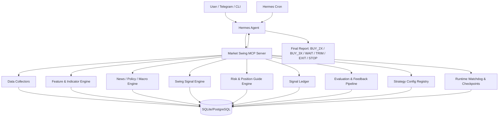

# Hermes Market Swing MCP 개발 계획서

## 1. 개요

이 문서는 Hermes Agent에 연결할 `Market Swing MCP Server`의 개발 계획서다. 목표는 BTC와 미국 지수 2~3배 롱 ETF를 대상으로, 스윙 관점에서 매수 가능 여부, 2배/3배 선택, 손절 조건, 익절 조건, 보유 포지션 관리 가이드를 생성하는 개인용 시장 판단 시스템을 만드는 것이다.

초기 목표는 자동 주문이 아니다. 먼저 데이터 수집, 지표 계산, 뉴스/매크로 해석, 신호 기록, 사후 평가, 텔레그램 리포트까지 구현한다. 주문 연동은 마지막 단계의 선택 사항이며, 기본값은 승인 기반 수동 실행으로 둔다.

주요 대상 상품은 다음과 같다.

| 구분 | 실제 매수 후보 | 판단 기준 |
| --- | --- | --- |
| 나스닥100 | QLD, TQQQ | QQQ, NDX, NQ futures |
| S&P500 | SSO, UPRO | SPY, SPX, ES futures |
| 반도체 | SOXL | SMH, SOXX, SOX, NVDA, AVGO, AMD |
| BTC | BTC coin-m long | BTC spot/futures, funding, OI |

최종 출력은 다음 액션 중 하나다.

```text
BUY_3X       강한 상승 스윙 진입 가능
BUY_2X       상승 스윙 가능하지만 변동성/이벤트 리스크 존재
BUY_WATCH    매수 후보이나 확인 필요
WAIT         관망
TRIM         일부 익절 또는 리스크 축소
EXIT         전량 청산 권고
STOP         진입 논리 무효화
BLOCK        신규 롱 금지
```

## 3.722 API Key Operator Checklist Provider Recovery Blocker Gate Record - 2026-05-17

### A. 목적

fake API key로 `run_api_key_pipeline_smoke`를 실행하면 provider recovery가 필요한데도
`api_key_operator_checklist.ready=true`, `blocking_step_count=0`으로 보일 수 있다.
이번 slice는 provider/network 실패 복구가 필요한 경우 operator checklist의 다음
blocking action을 `recover_failed_providers`로 승격해, 사용자가 API 키만 넣은 뒤
one-shot smoke 결과만 보고도 바로 다음 rerun command를 실행할 수 있게 한다.

### B. 구현 결과

```text
status: verified
implemented:
  - provider recovery required state now appends a recover_failed_providers operator checklist step with status pending
  - api_key_operator_checklist ready becomes false and next_blocking_action points to recover_failed_providers when provider recovery is required
  - recover_failed_providers carries recovery_smoke_command, recovery_smoke_available, provider_recovery_item_count, and next_provider_recovery_action without secret values
  - no-recovery ready/blocked setup paths keep existing operator checklist behavior and step counts
  - README and DevOps setup guide document recover_failed_providers as the recovery blocking step
  - tests/test_setup_docs.py asserts recover_failed_providers, blocking_step_names, and next_blocking_action
```

### C. 경계 조건

```text
not_added:
  - new live_adapters path
  - broker or order submission
  - Telegram send call
  - Hermes runtime call
  - scheduler
  - DB migration or repository persistence
  - committed runtime artifact
  - automatic .env mutation
  - exception message, URL, API key value, or secret value output
```

### D. 감사 검증

```text
verification:
  - diff -u .codex/tasks/current.json docs/codex-task.json: passed
  - python -m json.tool for task contract and portable mirror: passed
  - git diff --check: passed
  - focused readiness/setup docs pytest: 4 passed
  - fake Polygon/FRED/NewsAPI run_api_key_pipeline_smoke CLI: exit 0 with provider recovery required, recover_failed_providers next_blocking_action, and no secrets
  - full pytest: 775 passed
  - ruff check: passed
  - health_check harness: passed
```

## 3.721 API Key Operator Checklist Provider Recovery Gate Record - 2026-05-17

### A. 목적

`api_key_provider_recovery_checklist`는 실패 provider별 rerunnable command를
제공하지만, 사용자가 주로 보는 `api_key_operator_checklist`에는 provider recovery
상태와 다음 recovery action이 직접 연결되어 있지 않다. 이번 slice는 API-key-only
연동 점검 후 provider/network 실패가 발생했을 때 operator checklist에서도
`provider_recovery_required`와 다음 no-secret recovery command를 바로 확인하게 한다.

### B. 구현 결과

```text
status: verified
implemented:
  - api_key_operator_checklist now exposes provider_recovery_status, provider_recovery_required, provider_recovery_item_count, next_provider_recovery_action, and provider_recovery_checklist
  - next_provider_recovery_action mirrors the first no-secret recovery checklist item, including recovery_smoke_command and recovery_smoke_available
  - fixture-default/no-key setup keeps provider recovery fields ok/false/zero/null without changing setup blockers
  - README and DevOps setup guide document the operator checklist provider recovery fields
  - tests/test_setup_docs.py asserts the operator checklist recovery field names
```

### C. 경계 조건

```text
not_added:
  - new live_adapters path
  - broker or order submission
  - Telegram send call
  - Hermes runtime call
  - scheduler
  - DB migration or repository persistence
  - committed runtime artifact
  - automatic .env mutation
  - exception message, URL, API key value, or secret value output
```

### D. 감사 검증

```text
verification:
  - diff -u .codex/tasks/current.json docs/codex-task.json: passed
  - python -m json.tool for task contract and portable mirror: passed
  - git diff --check: passed
  - focused readiness/setup docs pytest: 4 passed
  - full pytest: 775 passed
  - ruff check: passed
  - health_check harness: passed
```

## 3.720 API Key Provider Recovery Checklist Docs Gate Record - 2026-05-17

### A. 목적

`run_api_key_pipeline_smoke` top-level `api_key_provider_recovery_checklist`는
실패 provider error row와 재실행 smoke command를 한 행으로 묶지만, README와 DevOps
setup guide는 아직 이 최신 체크리스트 필드명을 설명하지 않는다. 이번 slice는
API-key-only setup 사용자가 키를 넣고 one-shot smoke를 실행한 뒤
`api_key_provider_recovery_checklist`만 보고 어떤 provider smoke를 다시 실행할지
판단할 수 있게 문서화하고, 문서 테스트로 필드명이 계속 유지되게 한다.

### B. 구현 결과

```text
status: verified
implemented:
  - README now documents api_key_provider_recovery_checklist and api_key_provider_recovery_checklist.v1 as the one-row-per-failed-provider recovery triage payload
  - DevOps setup guide now documents recovery_smoke_command and recovery_smoke_available for no-secret provider smoke reruns
  - tests/test_setup_docs.py asserts the checklist field names so setup docs stay aligned with one-shot smoke payloads
  - no source behavior changed
```

### C. 경계 조건

```text
not_added:
  - source behavior change
  - new live_adapters path
  - broker or order submission
  - Telegram send call
  - Hermes runtime call
  - scheduler
  - DB migration or repository persistence
  - committed runtime artifact
  - automatic .env mutation
  - exception message, URL, API key value, or secret value output
```

### D. 감사 검증

```text
verification:
  - diff -u .codex/tasks/current.json docs/codex-task.json: passed
  - python -m json.tool for task contract and portable mirror: passed
  - git diff --check: passed
  - focused setup docs pytest: 1 passed
  - setup docs pytest: 8 passed
  - full pytest: 775 passed
  - ruff check: passed
  - health_check harness: passed
```

## 3.719 API Key Provider Recovery Checklist Gate Record - 2026-05-17

### A. 목적

`provider_error_summaries`와 `provider_recovery_smokes`는 각각 실패 metadata와
재실행 command를 제공하지만, 사용자가 provider별로 어떤 실패와 어떤 command가
대응되는지 보려면 두 목록을 머릿속에서 매칭해야 한다. 이번 slice는
`run_api_key_pipeline_smoke` top-level에 no-secret provider recovery checklist를
추가해, 각 실패 provider의 error metadata와 rerunnable smoke command를 한 행에서
확인하게 한다.

### B. 구현 결과

```text
status: verified
implemented:
  - run_api_key_pipeline_smoke now exposes api_key_provider_recovery_checklist with one row per provider_error_summary
  - each recovery checklist row pairs provider_family, provider, smoke_command_name, exception_type, next_setup_action, and the matching no-secret recovery smoke command
  - fake-key one-shot smoke runs surface three checklist rows for market, macro, and news provider failures
  - fixture-default/no-key smoke paths keep the recovery checklist ok/empty when no provider error summaries exist
  - recovery checklist rows do not include exception messages, URLs, API key values, or secret values
```

### C. 경계 조건

```text
not_added:
  - new live_adapters path
  - broker or order submission
  - Telegram send call
  - Hermes runtime call
  - scheduler
  - DB migration or repository persistence
  - committed runtime artifact
  - automatic .env mutation
  - exception message, URL, API key value, or secret value output
```

### D. 감사 검증

```text
verification:
  - diff -u .codex/tasks/current.json docs/codex-task.json: passed
  - python -m json.tool for task contract and portable mirror: passed
  - git diff --check: passed
  - focused provider recovery checklist readiness pytest: 2 passed
  - full pytest: 775 passed
  - ruff check: passed
  - health_check harness: passed
  - fake Polygon/FRED/NewsAPI run_api_key_pipeline_smoke CLI: exit 0 with three no-secret recovery checklist rows
  - run_api_key_pipeline_smoke fixture-default CLI: exit 0; recovery checklist ok/empty while setup remains blocked at prepare_dotenv
```

## 3.718 API Key Provider Recovery Docs Gate Record - 2026-05-17

### A. 목적

API-key one-shot smoke payload는 provider error summary, compact failed-provider
fields, and provider recovery smoke commands를 제공하지만 README와 DevOps setup guide는
아직 최신 필드명을 설명하지 않는다. 이번 slice는 사용자가 API 키를 넣고
`run_api_key_pipeline_smoke`를 실행한 뒤 어떤 필드로 실패 provider와 재실행 command를
찾아야 하는지 문서화하고, 문서 테스트로 이 필드명이 계속 유지되게 한다.

### B. 구현 결과

```text
status: verified
implemented:
  - README now documents provider error summary, failed-provider compact fields, and provider recovery smoke command fields for API-key one-shot smoke outputs
  - DevOps setup guide now documents the same no-secret recovery fields and how they support API-key-only live integration triage
  - tests/test_setup_docs.py asserts the new field names so docs stay aligned with readiness payloads
  - no source behavior changed
```

### C. 경계 조건

```text
not_added:
  - source behavior change
  - new live_adapters path
  - broker or order submission
  - Telegram send call
  - Hermes runtime call
  - scheduler
  - DB migration or repository persistence
  - committed runtime artifact
  - automatic .env mutation
  - exception message, URL, API key value, or secret value output
```

### D. 감사 검증

```text
verification:
  - diff -u .codex/tasks/current.json docs/codex-task.json: passed
  - python -m json.tool for task contract and portable mirror: passed
  - git diff --check: passed
  - focused setup docs pytest: 1 passed
  - setup docs pytest: 8 passed
  - full pytest: 775 passed
  - ruff check: passed
  - health_check harness: passed
```

## 3.717 API Key Provider Recovery Smoke Commands Gate Record - 2026-05-17

### A. 목적

첫 provider recovery smoke command는 one-shot smoke 실패 후 가장 빠른 다음 action을
보여주지만, Polygon, FRED, NewsAPI가 동시에 실패하면 나머지 provider 재검증 command를
다시 `provider_smoke_plan`에서 찾아야 한다. 이번 slice는 실패한 모든 provider의
runnable recovery smoke command 목록을 live-data smoke와 API-key pipeline one-shot
출력 상단에 노출해, API 키 입력 후 provider별 재실행 순서를 바로 확인하게 한다.

### B. 구현 결과

```text
status: verified
implemented:
  - run_live_data_smoke now exposes provider_recovery_smokes and provider_recovery_smoke_count by matching every provider error summary smoke_command_name to provider_smoke_plan
  - run_api_key_pipeline_smoke now mirrors provider_recovery_smokes and provider_recovery_smoke_count in live_data_smoke_summary and top-level one-shot output
  - fake-key one-shot smoke runs surface three recovery smoke commands for market, macro, and news provider failures
  - ok and fixture-default/no-key smoke paths keep provider_recovery_smokes empty and provider_recovery_smoke_count=0 when no provider error summaries exist
  - provider recovery smoke commands are copied only from existing no-secret provider_smoke_plan command metadata
```

### C. 경계 조건

```text
not_added:
  - new live_adapters path
  - broker or order submission
  - Telegram send call
  - Hermes runtime call
  - scheduler
  - DB migration or repository persistence
  - committed runtime artifact
  - automatic .env mutation
  - exception message, URL, API key value, or secret value output
```

### D. 감사 검증

```text
verification:
  - diff -u .codex/tasks/current.json docs/codex-task.json: passed
  - python -m json.tool for task contract and portable mirror: passed
  - git diff --check: passed
  - focused provider recovery smoke commands readiness pytest: 2 passed
  - full pytest: 775 passed
  - ruff check: passed
  - health_check harness: passed
  - fake Polygon/FRED/NewsAPI run_api_key_pipeline_smoke CLI: exit 0 with provider_recovery_smoke_count=3 and no secrets
  - run_api_key_pipeline_smoke fixture-default CLI: exit 0; provider_recovery_smokes empty while setup remains blocked at prepare_dotenv
```

## 3.716 API Key Provider Recovery Smoke Command Gate Record - 2026-05-17

### A. 목적

API-key one-shot smoke가 provider 실패를 compact fields로 보여주더라도, 사용자가
해당 provider만 다시 검증하려면 `provider_smoke_plan`에서 같은
`smoke_command_name`을 찾아 command를 직접 매칭해야 한다. 이번 slice는 첫 provider
failure에 대응하는 runnable provider smoke command를 live-data smoke와 API-key
pipeline one-shot 출력 상단에 노출해, API 키 입력 후 실패한 provider만 바로 재실행할
수 있게 한다.

### B. 구현 결과

```text
status: verified
implemented:
  - run_live_data_smoke now exposes next_provider_recovery_smoke and next_provider_recovery_smoke_command_name by matching the first provider error summary smoke_command_name to provider_smoke_plan
  - run_api_key_pipeline_smoke now mirrors the recovery smoke command fields in live_data_smoke_summary and top-level one-shot output
  - fake-key one-shot smoke runs surface the get_market_snapshot_live_smoke recovery command for the first failed provider
  - ok and fixture-default/no-key smoke paths keep recovery smoke command fields null when no provider error summaries exist
  - recovery smoke command fields are copied only from existing no-secret provider_smoke_plan command metadata
```

### C. 경계 조건

```text
not_added:
  - new live_adapters path
  - broker or order submission
  - Telegram send call
  - Hermes runtime call
  - scheduler
  - DB migration or repository persistence
  - committed runtime artifact
  - automatic .env mutation
  - exception message, URL, API key value, or secret value output
```

### D. 감사 검증

```text
verification:
  - diff -u .codex/tasks/current.json docs/codex-task.json: passed
  - python -m json.tool for task contract and portable mirror: passed
  - git diff --check: passed
  - focused provider recovery smoke command readiness pytest: 2 passed
  - full pytest: 775 passed
  - ruff check: passed
  - health_check harness: passed
  - fake Polygon/FRED/NewsAPI run_api_key_pipeline_smoke CLI: exit 0 with next_provider_recovery_smoke and no secrets
  - run_api_key_pipeline_smoke fixture-default CLI: exit 0; recovery smoke command fields null while setup remains blocked at prepare_dotenv
```

## 3.715 API Key Provider Error Compact Summary Gate Record - 2026-05-17

### A. 목적

`provider_error_summaries`는 provider별 recovery metadata를 보존하지만, 사용자가
one-shot smoke 출력에서 실패 provider 목록과 첫 번째 조치를 빠르게 보려면 배열을 직접
읽어야 한다. 이번 slice는 live-data smoke와 API-key pipeline one-shot 출력에 compact
failed-provider summary를 추가해, API 키만 넣고 실행한 뒤 어떤 provider가 실패했는지와
첫 recovery action을 상단에서 바로 확인하게 한다.

### B. 구현 결과

```text
status: verified
implemented:
  - run_live_data_smoke now exposes failed_provider_families, failed_provider_count, first_provider_error_summary, and next_provider_recovery_action derived from provider_error_summaries
  - run_api_key_pipeline_smoke now mirrors the compact fields in live_data_smoke_summary and top-level one-shot output
  - fake-key one-shot smoke runs surface failed_provider_families=[market, macro, news], failed_provider_count=3, and next_provider_recovery_action=verify_provider_credentials_or_network
  - ok and fixture-default/no-key smoke paths keep compact failed-provider fields empty or null when no provider error summaries exist
  - compact fields do not include exception messages, URLs, API key values, or secret values
```

### C. 경계 조건

```text
not_added:
  - new live_adapters path
  - broker or order submission
  - Telegram send call
  - Hermes runtime call
  - scheduler
  - DB migration or repository persistence
  - committed runtime artifact
  - automatic .env mutation
  - exception message, URL, API key value, or secret value output
```

### D. 감사 검증

```text
verification:
  - diff -u .codex/tasks/current.json docs/codex-task.json: passed
  - python -m json.tool for task contract and portable mirror: passed
  - git diff --check: passed
  - focused compact provider error readiness pytest: 2 passed
  - full pytest: 775 passed
  - ruff check: passed
  - health_check harness: passed
  - fake Polygon/FRED/NewsAPI run_api_key_pipeline_smoke CLI: exit 0 with compact failed-provider fields and no secrets
  - run_api_key_pipeline_smoke fixture-default CLI: exit 0; compact failed-provider fields empty/null while setup remains blocked at prepare_dotenv
```

## 3.714 API Key Live Data Smoke Provider Error Summary Gate Record - 2026-05-17

### A. 목적

개별 provider smoke conflict payload에는 provider/recovery metadata가 들어가지만,
사용자가 주로 실행하는 `run_live_data_smoke`와 `run_api_key_pipeline_smoke` 요약에서는
각 provider의 `error_summary`를 상단에서 바로 찾기 어렵다. 이번 slice는 live-data
smoke 계층과 API-key pipeline summary 계층에 no-secret `provider_error_summaries`를
노출해, 어떤 provider smoke가 실패했는지와 다음 조치를 한 번에 확인하게 한다.

### B. 구현 결과

```text
status: verified
implemented:
  - run_live_data_smoke now returns provider_error_summaries and provider_error_summary_count collected from market, macro, and news provider conflict payloads
  - run_api_key_pipeline_smoke live_data_smoke_summary now mirrors provider_error_summaries and provider_error_summary_count from the live-data smoke payload
  - fake-key one-shot smoke runs surface three no-secret provider recovery summaries with provider_family, provider, smoke_command_name, next_setup_action, and exception_type
  - ok and fixture-default/no-key smoke paths keep provider_error_summaries empty when no provider error summaries exist
  - provider error summaries do not include exception messages, URLs, API key values, or secret values
```

### C. 경계 조건

```text
not_added:
  - new live_adapters path
  - broker or order submission
  - Telegram send call
  - Hermes runtime call
  - scheduler
  - DB migration or repository persistence
  - committed runtime artifact
  - automatic .env mutation
  - exception message, URL, API key value, or secret value output
```

### D. 감사 검증

```text
verification:
  - diff -u .codex/tasks/current.json docs/codex-task.json: passed
  - python -m json.tool for task contract and portable mirror: passed
  - git diff --check: passed
  - focused provider error summary readiness pytest: 2 passed
  - fake Polygon/FRED/NewsAPI run_live_data_smoke CLI: exit 0 with provider_error_summary_count=3 and no secrets
  - fake Polygon/FRED/NewsAPI run_api_key_pipeline_smoke CLI: exit 0 with live_data_smoke_summary provider_error_summary_count=3 and no secrets
  - full pytest: 775 passed
  - ruff check: passed
  - health_check harness: passed
  - run_api_key_pipeline_smoke fixture-default CLI: exit 0; provider_error_summaries empty while setup remains blocked at prepare_dotenv
```

## 3.713 API Key Provider Smoke Recovery Metadata Gate Record - 2026-05-17

### A. 목적

사용자가 API key를 넣고 provider별 smoke를 실행했을 때 DNS, 인증, quota, provider
장애 등으로 실패하면 현재 conflict payload는 exception type은 보여주지만, 상단
`error_summary`만 보고 어떤 provider family의 어떤 smoke가 실패했는지와 다음 조치가
무엇인지 빠르게 구분하기 어렵다. 이번 slice는 individual provider smoke failure
payload에 no-secret provider/recovery metadata를 추가한다.

### B. 구현 결과

```text
status: verified
implemented:
  - get_market_snapshot live provider exception error_summary includes provider_family=market, provider=polygon, smoke_command_name=get_market_snapshot_live_smoke, next_setup_action=verify_provider_credentials_or_network, and provider-route network policy
  - get_macro_snapshot live provider exception error_summary includes provider_family=macro, provider=fred, smoke_command_name=get_macro_snapshot_live_smoke, next_setup_action=verify_provider_credentials_or_network, and provider-route network policy
  - get_news_bundle live provider exception error_summary includes provider_family=news, provider=newsapi, smoke_command_name=get_news_bundle_live_smoke, next_setup_action=verify_provider_credentials_or_network, and provider-route network policy
  - conflict payloads still return no exception message, URL, API key value, or secret value
  - provider smoke conflict payloads remain non-mutating and declare live/network boundaries
```

### C. 경계 조건

```text
not_added:
  - new live_adapters path
  - broker or order submission
  - Telegram send call
  - Hermes runtime call
  - scheduler
  - DB migration or repository persistence
  - committed runtime artifact
  - automatic .env mutation
  - exception message, URL, API key value, or secret value output
```

### D. 감사 검증

```text
verification:
  - diff -u .codex/tasks/current.json docs/codex-task.json: passed
  - python -m json.tool for task contract and portable mirror: passed
  - git diff --check: passed
  - focused provider smoke recovery pytest: 3 passed
  - fake Polygon/FRED/NewsAPI provider smoke CLIs: exit 0 with recovery metadata and no secrets
  - full pytest: 773 passed
  - ruff check: passed
  - health_check harness: passed
  - run_api_key_pipeline_smoke fixture-default CLI: exit 0
```

## 3.712 API Key Pipeline Operator Checklist Exported Env Bypass Gate Record - 2026-05-17

### A. 목적

`API_KEY_EXPORTED_ENV_DOTENV_BYPASS_GATE` 이후 exported environment에 Polygon,
FRED, NewsAPI key가 모두 있으면 setup steps와 `next_operator_action`은
`run_provider_smokes`를 가리킨다. 그러나 top-level `api_key_operator_checklist`는
repo-root `.env`가 없다는 이유로 `prepare_dotenv`를 `next_blocking_action`으로 남길
수 있다. 이번 slice는 사용자가 API key를 이미 환경변수로 넣은 경우 operator checklist도
동일하게 setup-ready 상태를 보고하게 한다.

### B. 구현 결과

```text
status: verified
implemented:
  - top-level api_key_operator_checklist treats prepare_dotenv as ready when exported API keys make ready_to_run_live_smoke true
  - exported POLYGON_API_KEY, FRED_API_KEY, and NEWS_API_KEY without repo-root .env produce ready=true, empty blocking_step_names, blocking_step_count=0, next_blocking_step=null, and next_blocking_action=null
  - current_step remains run_provider_smokes and ready_step_names includes prepare_dotenv, fill_live_data_api_keys, run_provider_smokes, and run_api_key_pipeline_smoke
  - blocked no-key fixture-default setup still reports prepare_dotenv as the next blocking action
  - API-key-only setup payloads remain non-mutating and no-secret
```

### C. 경계 조건

```text
not_added:
  - new live_adapters path
  - broker or order submission
  - Telegram send call
  - Hermes runtime call
  - scheduler
  - DB migration or repository persistence
  - committed runtime artifact
  - automatic .env mutation
  - secret value output
```

### D. 감사 검증

```text
verification:
  - diff -u .codex/tasks/current.json docs/codex-task.json: passed
  - python -m json.tool for task contract and portable mirror: passed
  - git diff --check: passed
  - focused operator-checklist pytest: 1 passed
  - no-key plus exported-env checklist regression pytest: 2 passed
  - exported fake-key API-key pipeline CLI: exit 0; operator checklist ready=true with no blocking action
  - full pytest: 773 passed
  - ruff check: passed
  - health_check harness: passed
  - run_api_key_pipeline_smoke fixture-default CLI: exit 0
```

## 3.707 API Key Exported Env Dotenv Bypass Gate Record - 2026-05-17

### A. 목적

API key가 이미 exported environment에 모두 설정되어 있으면 live-data setup은 준비된
상태지만, repo-root `.env` 파일이 없다는 이유로 `next_operator_action`이 여전히
`prepare_dotenv`를 가리킬 수 있었다. 이번 slice는 사용자가 API key를 환경변수로
이미 넣은 경우 `.env` 복사를 다음 blocker로 보이지 않게 해, API-key-only 연동의
실제 다음 action이 provider smoke 실행으로 드러나게 한다.

### B. 구현 결과

```text
status: verified
implemented:
  - fully configured exported live-data API keys make live_data_setup_steps.next_step run_provider_smokes even when repo-root .env is absent
  - exported-key setup keeps dotenv_file_status.copy_required visible for operators who prefer .env, but prepare_dotenv is no longer the next blocker
  - next_operator_action becomes run_provider_smokes and includes provider smoke command payloads without secret values
  - blocked no-key setup still points to prepare_dotenv when .env is absent and remains non-mutating
  - README and DevOps guide document that exported env keys can satisfy setup without copying .env
  - no live_adapters, broker/order code, Telegram send, Hermes runtime call, migration, repository persistence, scheduler, committed runtime artifact, automatic .env mutation, or secret value output changes added
```

### C. 경계 조건

```text
not_added:
  - new live_adapters path
  - broker or order submission
  - Telegram send call
  - Hermes runtime call
  - scheduler
  - DB migration or repository persistence
  - committed runtime artifact
  - automatic .env mutation
  - secret value output
```

### D. 감사 검증

```text
verification:
  - diff -u .codex/tasks/current.json docs/codex-task.json: passed
  - PYTHONPATH=src ./.venv/bin/python -m json.tool .codex/tasks/current.json: passed
  - PYTHONPATH=src ./.venv/bin/python -m json.tool docs/codex-task.json: passed
  - git diff --check: passed
  - focused readiness/setup-docs pytest: 6 passed
  - exported-env CLI smoke with fake POLYGON_API_KEY/FRED_API_KEY/NEWS_API_KEY: next_step=run_provider_smokes and next_operator_action=run_provider_smokes without secret values
  - PYTHONPATH=src ./.venv/bin/python -m pytest: 763 passed
  - PYTHONPATH=src ./.venv/bin/python -m ruff check .: passed
  - PYTHONPATH=src ./.venv/bin/python -m halo_swing_mcp.harness health_check: passed
  - run_api_key_pipeline_smoke fixture-default path: exit 0, blocked at prepare_dotenv, no secrets returned
```

## 3.708 API Key Pipeline Sub-Smoke Exception Gate Record - 2026-05-17

### A. 목적

API key가 설정되어 live provider가 선택되면 one-shot pipeline smoke가 실제 network/provider
call을 수행한다. 이때 DNS, provider auth, quota, transient network failure 같은 예외가
발생하면 `run_api_key_pipeline_smoke`가 no-secret `conflict` payload를 반환하지 못하고
예외로 종료될 수 있었다. 이번 slice는 API-key-only 연동 확인 경로가 실패 상황에서도
다음 조치 가능한 구조화 payload를 반환하도록 한다.

### B. 구현 결과

```text
status: verified
implemented:
  - run_api_key_pipeline_smoke catches live-data, signal-workflow, and recording sub-smoke exceptions and returns status=conflict
  - exception summaries include sub-smoke name and exception type but do not include exception messages, URLs, API key values, or secret values
  - exported API-key setup summaries remain ready when provider/network sub-smokes fail, with next_operator_action still pointing to run_provider_smokes
  - failed sub-smoke summaries expose error_summary and failed checks instead of crashing the harness
  - README and DevOps guide document no-secret conflict payload behavior for provider/network failures
  - no live_adapters, broker/order code, Telegram send, Hermes runtime call, migration, repository persistence, scheduler, committed runtime artifact, automatic .env mutation, or secret value output changes added
```

### C. 경계 조건

```text
not_added:
  - new live_adapters path
  - broker or order submission
  - Telegram send call
  - Hermes runtime call
  - scheduler
  - DB migration or repository persistence
  - committed runtime artifact
  - automatic .env mutation
  - secret value output
  - exception message, URL, or API key serialization
```

### D. 감사 검증

```text
verification:
  - diff -u .codex/tasks/current.json docs/codex-task.json: passed
  - PYTHONPATH=src ./.venv/bin/python -m json.tool .codex/tasks/current.json: passed
  - PYTHONPATH=src ./.venv/bin/python -m json.tool docs/codex-task.json: passed
  - git diff --check: passed
  - focused readiness/setup-docs pytest: 7 passed
  - fake API-key pipeline CLI with provider DNS failure: exit 0, status=conflict, sub-smoke error_summary returned exception_type only, no exception message/URL/API key value
  - PYTHONPATH=src ./.venv/bin/python -m pytest: 764 passed
  - PYTHONPATH=src ./.venv/bin/python -m ruff check .: passed
  - PYTHONPATH=src ./.venv/bin/python -m halo_swing_mcp.harness health_check: passed
  - run_api_key_pipeline_smoke fixture-default path: exit 0, blocked at prepare_dotenv, no secrets returned
```

## 3.709 API Key Provider Smoke Exception Payload Gate Record - 2026-05-17

### A. 목적

`next_operator_action`은 API key가 준비되면 개별 provider smoke 명령
(`get_market_snapshot`, `get_macro_snapshot`, `get_news_bundle`)을 안내한다. 그러나
이 명령들이 live provider 네트워크/provider 예외에서 Python traceback으로 종료되면,
사용자가 API key만 넣고 연동 상태를 확인하는 경로가 끊긴다. 이번 slice는 개별 provider
smoke도 one-shot pipeline과 같이 no-secret `conflict` payload를 반환하게 한다.

### B. 구현 결과

```text
status: verified
implemented:
  - get_market_snapshot returns status=conflict no-secret payloads for selected Polygon provider exceptions
  - get_macro_snapshot returns status=conflict no-secret payloads for selected FRED provider exceptions
  - get_news_bundle returns status=conflict no-secret payloads for selected NewsAPI provider exceptions
  - provider smoke error summaries include tool name and exception type only
  - fixture/offline provider exceptions are still raised
  - README and DevOps setup guide document individual provider smoke conflict payload behavior
```

### C. 경계 조건

```text
not_added:
  - new live_adapters path
  - broker or order submission
  - Telegram send call
  - Hermes runtime call
  - scheduler
  - DB migration or repository persistence
  - committed runtime artifact
  - automatic .env mutation
  - secret value output
  - exception message, URL, or API key serialization
```

### D. 감사 검증

```text
verification:
  - diff -u .codex/tasks/current.json docs/codex-task.json: passed
  - python -m json.tool for task contract and portable mirror: passed
  - git diff --check: passed
  - focused pytest: 6 passed
  - full pytest: 768 passed
  - ruff check: passed
  - health_check harness: passed
  - run_api_key_pipeline_smoke fixture-default CLI: exit 0
  - fake-key get_market_snapshot/get_macro_snapshot/get_news_bundle CLIs: exit 0 with no-secret status=conflict payloads
```

## 3.710 API Key Dotenv Precedence Metadata Gate Record - 2026-05-17

### A. 목적

API-key-only setup payload의 `dotenv.precedence` metadata가 실제 runtime dotenv 로딩
순서를 정확히 설명해야 한다. 현재 env loader는 exported environment variables를 먼저 보고,
그 다음 launch-directory `.env`가 repo-root `.env`보다 우선한다. 이번 slice는
`get_live_data_api_key_status`의 metadata를 이 실제 순서와 맞춰, 사용자가 API key만 넣고
연동할 때 어떤 `.env` 값이 적용되는지 오해하지 않게 한다.

### B. 구현 결과

```text
status: verified
implemented:
  - get_live_data_api_key_status dotenv.precedence now reports exported environment variables, launch-directory .env, repo-root .env
  - runtime dotenv loading behavior remains unchanged
  - tests prove launch-directory .env overrides repo-root .env after exported env values
  - API-key setup payloads remain non-mutating and no-secret
```

### C. 경계 조건

```text
not_added:
  - new live_adapters path
  - broker or order submission
  - Telegram send call
  - Hermes runtime call
  - scheduler
  - DB migration or repository persistence
  - committed runtime artifact
  - automatic .env mutation
  - secret value output
  - runtime dotenv loading behavior change
```

### D. 감사 검증

```text
verification:
  - diff -u .codex/tasks/current.json docs/codex-task.json: passed
  - python -m json.tool for task contract and portable mirror: passed
  - git diff --check: passed
  - focused env/readiness pytest: 2 passed
  - full pytest: 770 passed
  - ruff check: passed
  - health_check harness: passed
  - run_api_key_pipeline_smoke fixture-default CLI: exit 0
```

## 3.711 API Key Provider Route Family Live Boundary Gate Record - 2026-05-17

### A. 목적

`get_live_data_provider_route`는 API key가 어떤 provider wrapper를 선택했는지 네트워크
호출 없이 보여준다. 그러나 FRED 또는 NewsAPI key만 설정된 부분 setup에서는 해당
provider family가 live smoke를 실행할 수 있는데도 route entry가 base fixture provider의
`data_mode`/`live_data_required`를 그대로 보여줄 수 있다. 이번 slice는 selected
FRED/NewsAPI route entry가 family-level live boundary를 정확히 보고하게 한다.

### B. 구현 결과

```text
status: verified
implemented:
  - selected FredMacroDataProvider route entries report data_mode=live and live_data_required=true when a macro API key selects FRED
  - selected NewsApiDataProvider route entries report data_mode=live and live_data_required=true when a news API key selects NewsAPI
  - fixture base route entries remain fixture/no-network/no-live
  - route inspection remains no-network and no-secret
  - provider runtime semantics remain unchanged
```

### C. 경계 조건

```text
not_added:
  - new live_adapters path
  - broker or order submission
  - Telegram send call
  - Hermes runtime call
  - scheduler
  - DB migration or repository persistence
  - committed runtime artifact
  - automatic .env mutation
  - secret value output
  - provider network call during route inspection
  - provider runtime behavior change
```

### D. 감사 검증

```text
verification:
  - diff -u .codex/tasks/current.json docs/codex-task.json: passed
  - python -m json.tool for task contract and portable mirror: passed
  - git diff --check: passed
  - focused provider-route pytest: 2 passed
  - full pytest: 772 passed
  - ruff check: passed
  - health_check harness: passed
  - run_api_key_pipeline_smoke fixture-default CLI: exit 0
```

## 3.706 API Key Pipeline Readiness Next Operator Action Gate Record - 2026-05-17

### A. 목적

`readiness_summary`는 API-key setup 상태와 다음 step 이름을 보여주지만, 실제 다음 local
action payload는 별도 top-level `next_operator_action`을 확인해야 했다. 이번 slice는
broader integration gate 상태와 API-key-only setup 상태를 함께 보는 compact summary 안에
no-secret `next_operator_action`을 mirror해, 사용자가 API key 입력 후 다음 실행 action을
바로 확인할 수 있게 한다.

### B. 구현 결과

```text
status: verified
implemented:
  - top-level readiness_summary mirrors the same no-secret next_operator_action as the pipeline payload
  - ready API-key setup readiness_summary points to run_provider_smokes and includes the provider smoke action payload
  - blocked setup readiness_summary points to prepare_dotenv and includes the copy command action payload
  - blocked or partial setup paths remain non-mutating and return no secret values
  - README and DevOps guide document readiness_summary next_operator_action visibility separately from broader integration gates
  - no live_adapters, broker/order code, Telegram send, Hermes runtime call, migration, repository persistence, scheduler, committed runtime artifact, automatic .env mutation, or secret value output changes added
```

### C. 경계 조건

```text
not_added:
  - new live_adapters path
  - broker or order submission
  - Telegram send call
  - Hermes runtime call
  - scheduler
  - DB migration or repository persistence
  - committed runtime artifact
  - automatic .env mutation
  - secret value output
```

### D. 감사 검증

```text
verification:
  - diff -u .codex/tasks/current.json docs/codex-task.json: passed
  - PYTHONPATH=src ./.venv/bin/python -m json.tool .codex/tasks/current.json: passed
  - PYTHONPATH=src ./.venv/bin/python -m json.tool docs/codex-task.json: passed
  - git diff --check: passed
  - focused readiness/setup-docs pytest: 5 passed
  - PYTHONPATH=src ./.venv/bin/python -m pytest: 762 passed
  - PYTHONPATH=src ./.venv/bin/python -m ruff check .: passed
  - PYTHONPATH=src ./.venv/bin/python -m halo_swing_mcp.harness health_check: passed
  - run_api_key_pipeline_smoke fixture-default path: exit 0, blocked at prepare_dotenv, readiness_summary mirrored next_operator_action, no secrets returned
```

## 3.705 API Key Pipeline Readiness Setup Status Gate Record - 2026-05-17

### A. 목적

`readiness_summary`는 broader integration readiness만 보여줘서, API key setup이 준비되어도
다른 gate 때문에 `status=blocked`로 보일 수 있었다. 이번 slice는 API-key-only 연동 상태를
상위 readiness summary 안에서도 별도 필드로 보여줘, API key 입력 후 다음 local action을
integration gate 상태와 혼동하지 않게 한다.

### B. 구현 결과

```text
status: verified
implemented:
  - top-level readiness_summary exposes api_key_setup_status, api_key_status, provider_route_status, ready_to_run_live_smoke, next_setup_step, and next_operator_action_name
  - ready API-key setup shows ready status and run_provider_smokes as the next setup step
  - blocked setup shows blocked API-key status and prepare_dotenv as the next setup step
  - README and DevOps guide document readiness_summary API-key setup status separately from broader integration gates
  - no runtime .env mutation, secret value output, live adapter, broker, DB, Telegram, or Hermes runtime changes added
```

### C. 경계 조건

```text
not_added:
  - new live_adapters path
  - broker or order submission
  - Telegram send call
  - Hermes runtime call
  - scheduler
  - DB migration or repository persistence
  - committed runtime artifact
  - automatic .env mutation
  - secret value output
```

### D. 감사 검증

```text
verification:
  - diff -u .codex/tasks/current.json docs/codex-task.json -> passed
  - PYTHONPATH=src ./.venv/bin/python -m json.tool .codex/tasks/current.json -> passed
  - PYTHONPATH=src ./.venv/bin/python -m json.tool docs/codex-task.json -> passed
  - git diff --check -> passed
  - PYTHONPATH=src ./.venv/bin/python -m pytest tests/test_readiness.py::test_live_data_api_key_status_reports_blocked_defaults tests/test_readiness.py::test_live_data_api_key_status_accepts_repo_dotenv_aliases_without_secret_values tests/test_readiness.py::test_run_api_key_pipeline_smoke_combines_fake_live_smokes tests/test_readiness.py::test_run_api_key_pipeline_smoke_flags_fixture_defaults_without_keys tests/test_setup_docs.py::test_devops_guide_shows_dotenv_key_only_live_data_setup -q -> 5 passed
  - PYTHONPATH=src ./.venv/bin/python -m pytest -> 762 passed
  - PYTHONPATH=src ./.venv/bin/python -m ruff check . -> passed
  - PYTHONPATH=src ./.venv/bin/python -m halo_swing_mcp.harness health_check -> passed
  - PYTHONPATH=src ./.venv/bin/python -m halo_swing_mcp.harness run_api_key_pipeline_smoke --input-json '{"asset":"TQQQ","timeframe":"swing_3d_10d","symbols":["QQQ"],"topic":"macro"}' --no-audit -> exit 0; fixture-default local setup remained blocked at prepare_dotenv, readiness_summary reported api_key_setup_status=blocked and next_setup_step=prepare_dotenv, and no secrets were returned
```

## 3.704 API Key Pipeline Setup Status Next Provider Smoke Object Gate Record - 2026-05-17

### A. 목적

`setup_status_summary`에는 다음 provider smoke command name이 보이지만, 실제 실행할
command object는 여전히 더 자세한 command summary나 checklist를 읽어야 했다. 이번 slice는
compact setup status만 봐도 API key 입력 후 첫 provider smoke command를 바로 실행할 수
있도록 no-secret `next_provider_smoke` object를 함께 노출한다.

### B. 구현 결과

```text
status: verified
implemented:
  - top-level setup_status_summary exposes next_provider_smoke and next_provider_smoke_command_name
  - ready setup status shows the first ready provider smoke command object and name
  - blocked setup status returns next_provider_smoke=null and next_provider_smoke_command_name=null
  - README and DevOps guide document setup_status_summary next-provider-smoke object visibility in the API-key setup path
  - no runtime .env mutation, secret value output, live adapter, broker, DB, Telegram, or Hermes runtime changes added
```

### C. 경계 조건

```text
not_added:
  - new live_adapters path
  - broker or order submission
  - Telegram send call
  - Hermes runtime call
  - scheduler
  - DB migration or repository persistence
  - committed runtime artifact
  - automatic .env mutation
  - secret value output
```

### D. 감사 검증

```text
verification:
  - diff -u .codex/tasks/current.json docs/codex-task.json -> passed
  - PYTHONPATH=src ./.venv/bin/python -m json.tool .codex/tasks/current.json -> passed
  - PYTHONPATH=src ./.venv/bin/python -m json.tool docs/codex-task.json -> passed
  - git diff --check -> passed
  - PYTHONPATH=src ./.venv/bin/python -m pytest tests/test_readiness.py::test_live_data_api_key_status_reports_blocked_defaults tests/test_readiness.py::test_live_data_api_key_status_accepts_repo_dotenv_aliases_without_secret_values tests/test_readiness.py::test_run_api_key_pipeline_smoke_combines_fake_live_smokes tests/test_readiness.py::test_run_api_key_pipeline_smoke_flags_fixture_defaults_without_keys tests/test_setup_docs.py::test_devops_guide_shows_dotenv_key_only_live_data_setup -q -> 5 passed
  - PYTHONPATH=src ./.venv/bin/python -m pytest -> 762 passed
  - PYTHONPATH=src ./.venv/bin/python -m ruff check . -> passed
  - PYTHONPATH=src ./.venv/bin/python -m halo_swing_mcp.harness health_check -> passed
  - PYTHONPATH=src ./.venv/bin/python -m halo_swing_mcp.harness run_api_key_pipeline_smoke --input-json '{"asset":"TQQQ","timeframe":"swing_3d_10d","symbols":["QQQ"],"topic":"macro"}' --no-audit -> exit 0; fixture-default local setup remained blocked at prepare_dotenv, setup_status_summary.next_provider_smoke and next_provider_smoke_command_name returned null, and no secrets were returned
```

## 3.703 API Key Pipeline Setup Status Next Provider Smoke Gate Record - 2026-05-17

### A. 목적

상위 `api_key_command_summary`와 `api_key_operator_checklist`에는 첫 provider smoke가
보이지만, 더 짧은 상위 `setup_status_summary`만 보는 경우 다음 provider smoke 대상
이름을 알 수 없었다. 이번 slice는 API key 입력 후 상태 요약만으로도 다음 provider
smoke command name을 알 수 있게 no-secret `next_provider_smoke_command_name`을 추가한다.

### B. 구현 결과

```text
status: verified
implemented:
  - top-level setup_status_summary exposes next_provider_smoke_command_name
  - ready setup status shows the first ready provider smoke command name
  - blocked setup status returns next_provider_smoke_command_name=null
  - README and DevOps guide document setup_status_summary next-provider-smoke visibility in the API-key setup path
  - no runtime .env mutation, secret value output, live adapter, broker, DB, Telegram, or Hermes runtime changes added
```

### C. 경계 조건

```text
not_added:
  - new live_adapters path
  - broker or order submission
  - Telegram send call
  - Hermes runtime call
  - scheduler
  - DB migration or repository persistence
  - committed runtime artifact
  - automatic .env mutation
  - secret value output
```

### D. 감사 검증

```text
verification:
  - diff -u .codex/tasks/current.json docs/codex-task.json -> passed
  - PYTHONPATH=src ./.venv/bin/python -m json.tool .codex/tasks/current.json -> passed
  - PYTHONPATH=src ./.venv/bin/python -m json.tool docs/codex-task.json -> passed
  - git diff --check -> passed
  - PYTHONPATH=src ./.venv/bin/python -m pytest tests/test_readiness.py::test_live_data_api_key_status_reports_blocked_defaults tests/test_readiness.py::test_live_data_api_key_status_accepts_repo_dotenv_aliases_without_secret_values tests/test_readiness.py::test_run_api_key_pipeline_smoke_combines_fake_live_smokes tests/test_readiness.py::test_run_api_key_pipeline_smoke_flags_fixture_defaults_without_keys tests/test_setup_docs.py::test_devops_guide_shows_dotenv_key_only_live_data_setup -q -> 5 passed
  - PYTHONPATH=src ./.venv/bin/python -m pytest -> 762 passed
  - PYTHONPATH=src ./.venv/bin/python -m ruff check . -> passed
  - PYTHONPATH=src ./.venv/bin/python -m halo_swing_mcp.harness health_check -> passed
  - PYTHONPATH=src ./.venv/bin/python -m halo_swing_mcp.harness run_api_key_pipeline_smoke --input-json '{"asset":"TQQQ","timeframe":"swing_3d_10d","symbols":["QQQ"],"topic":"macro"}' --no-audit -> exit 0; fixture-default local setup remained blocked at prepare_dotenv, setup_status_summary.next_provider_smoke_command_name returned null, and no secrets were returned
```

## 3.702 API Key Pipeline Next Provider Smoke Command Gate Record - 2026-05-17

### A. 목적

`live_data_setup_summary` 안에서는 첫 provider smoke command가 보이지만, one-shot
`run_api_key_pipeline_smoke` 사용자는 상위 `api_key_command_summary`와
`api_key_operator_checklist`만 보고 다음 명령을 찾는 경우가 많다. 이번 slice는 API key
입력 후 첫 provider smoke command를 상위 payload에서도 바로 실행할 수 있게
no-secret `next_provider_smoke`와 `next_provider_smoke_command_name`을 추가한다.

### B. 구현 결과

```text
status: verified
implemented:
  - top-level api_key_command_summary exposes next_provider_smoke and next_provider_smoke_command_name
  - top-level api_key_operator_checklist run_provider_smokes step exposes the same no-secret next_provider_smoke command object
  - blocked or partial setup paths remain non-mutating and do not return secret values
  - README and DevOps guide document top-level next_provider_smoke visibility in the API-key setup path
  - no runtime .env mutation, secret value output, live adapter, broker, DB, Telegram, or Hermes runtime changes added
```

### C. 경계 조건

```text
not_added:
  - new live_adapters path
  - broker or order submission
  - Telegram send call
  - Hermes runtime call
  - scheduler
  - DB migration or repository persistence
  - committed runtime artifact
  - automatic .env mutation
  - secret value output
```

### D. 감사 검증

```text
verification:
  - diff -u .codex/tasks/current.json docs/codex-task.json -> passed
  - PYTHONPATH=src ./.venv/bin/python -m json.tool .codex/tasks/current.json -> passed
  - PYTHONPATH=src ./.venv/bin/python -m json.tool docs/codex-task.json -> passed
  - git diff --check -> passed
  - PYTHONPATH=src ./.venv/bin/python -m pytest tests/test_readiness.py::test_live_data_api_key_status_reports_blocked_defaults tests/test_readiness.py::test_live_data_api_key_status_accepts_repo_dotenv_aliases_without_secret_values tests/test_readiness.py::test_run_api_key_pipeline_smoke_combines_fake_live_smokes tests/test_readiness.py::test_run_api_key_pipeline_smoke_flags_fixture_defaults_without_keys tests/test_setup_docs.py::test_devops_guide_shows_dotenv_key_only_live_data_setup -q -> 5 passed
  - PYTHONPATH=src ./.venv/bin/python -m pytest -> 762 passed
  - PYTHONPATH=src ./.venv/bin/python -m ruff check . -> passed
  - PYTHONPATH=src ./.venv/bin/python -m halo_swing_mcp.harness health_check -> passed
  - PYTHONPATH=src ./.venv/bin/python -m halo_swing_mcp.harness run_api_key_pipeline_smoke --input-json '{"asset":"TQQQ","timeframe":"swing_3d_10d","symbols":["QQQ"],"topic":"macro"}' --no-audit -> exit 0; fixture-default local setup remained blocked at prepare_dotenv, top-level provider smoke fields returned null, and no secrets were returned
```

## 3.701 Live Data Next Provider Smoke Command Gate Record - 2026-05-17

### A. 목적

API key가 준비된 상태의 다음 action은 `run_provider_smokes`로 맞춰졌지만, 사용자가
실제로 첫 번째 provider smoke를 실행하려면 `provider_smokes` 목록을 직접 읽어야 했다.
이번 slice는 ready `run_provider_smokes` step과 `next_operator_action`에 no-secret
`next_provider_smoke` command object를 추가해, API key 입력 후 첫 provider smoke command를
바로 실행할 수 있게 한다.

### B. 구현 결과

```text
status: verified
implemented:
  - ready run_provider_smokes setup step exposes next_provider_smoke and next_provider_smoke_command_name
  - ready next_operator_action exposes the same no-secret next_provider_smoke command object
  - blocked or partial setup paths remain non-mutating and do not return secret values
  - README and DevOps guide document next_provider_smoke in the ready API-key setup path
  - no runtime .env mutation, secret value output, live adapter, broker, DB, Telegram, or Hermes runtime changes added
```

### C. 경계 조건

```text
not_added:
  - new live_adapters path
  - broker or order submission
  - Telegram send call
  - Hermes runtime call
  - scheduler
  - DB migration or repository persistence
  - committed runtime artifact
  - automatic .env mutation
  - secret value output
```

### D. 감사 검증

```text
verification:
  - diff -u .codex/tasks/current.json docs/codex-task.json -> passed
  - PYTHONPATH=src ./.venv/bin/python -m json.tool .codex/tasks/current.json -> passed
  - PYTHONPATH=src ./.venv/bin/python -m json.tool docs/codex-task.json -> passed
  - git diff --check -> passed
  - PYTHONPATH=src ./.venv/bin/python -m pytest tests/test_readiness.py::test_live_data_api_key_status_reports_blocked_defaults tests/test_readiness.py::test_live_data_api_key_status_accepts_repo_dotenv_aliases_without_secret_values tests/test_readiness.py::test_run_api_key_pipeline_smoke_combines_fake_live_smokes tests/test_readiness.py::test_run_api_key_pipeline_smoke_flags_fixture_defaults_without_keys tests/test_setup_docs.py::test_devops_guide_shows_dotenv_key_only_live_data_setup -q -> 5 passed
  - PYTHONPATH=src ./.venv/bin/python -m pytest -> 762 passed
  - PYTHONPATH=src ./.venv/bin/python -m ruff check . -> passed
  - PYTHONPATH=src ./.venv/bin/python -m halo_swing_mcp.harness health_check -> passed
  - PYTHONPATH=src ./.venv/bin/python -m halo_swing_mcp.harness run_api_key_pipeline_smoke --input-json '{"asset":"TQQQ","timeframe":"swing_3d_10d","symbols":["QQQ"],"topic":"macro"}' --no-audit -> exit 0; fixture-default local setup remained blocked at prepare_dotenv, provider smoke step returned next_provider_smoke=null, and no secrets were returned
```

## 3.700 Live Data Next Action Provider Smokes Gate Record - 2026-05-17

### A. 목적

`live_data_setup_steps`에는 provider smoke 단계가 추가됐지만, API key가 모두 준비된
상태의 `next_step`과 `next_operator_action`은 여전히 one-shot pipeline smoke를 먼저
가리켰다. 이 상태에서는 사용자가 API key만 채운 뒤 provider별 live boundary smoke를
건너뛰기 쉽다. 이번 slice는 ready 상태의 다음 local action을 `run_provider_smokes`로
고정하고, provider smoke가 끝난 뒤 `run_api_key_pipeline_smoke`로 넘어가도록 no-secret
action payload를 맞춘다.

### B. 구현 결과

```text
status: verified
implemented:
  - ready live_data_setup_steps next_step is run_provider_smokes
  - ready next_operator_action exposes provider smoke commands and next_after_action=run_api_key_pipeline_smoke
  - pending fill_live_data_api_keys next_after_action points to run_provider_smokes
  - setup_status_summary and operator checklist current_step reflect run_provider_smokes when API keys are ready
  - README and DevOps guide document provider smokes as the next action before the one-shot smoke
  - no runtime .env mutation, secret value output, live adapter, broker, DB, Telegram, or Hermes runtime changes added
```

### C. 경계 조건

```text
not_added:
  - new live_adapters path
  - broker or order submission
  - Telegram send call
  - Hermes runtime call
  - scheduler
  - DB migration or repository persistence
  - committed runtime artifact
  - automatic .env mutation
  - secret value output
```

### D. 감사 검증

```text
verification:
  - diff -u .codex/tasks/current.json docs/codex-task.json -> passed
  - PYTHONPATH=src ./.venv/bin/python -m json.tool .codex/tasks/current.json -> passed
  - PYTHONPATH=src ./.venv/bin/python -m json.tool docs/codex-task.json -> passed
  - git diff --check -> passed
  - PYTHONPATH=src ./.venv/bin/python -m pytest tests/test_readiness.py::test_live_data_api_key_status_reports_blocked_defaults tests/test_readiness.py::test_live_data_api_key_status_accepts_repo_dotenv_aliases_without_secret_values tests/test_readiness.py::test_run_api_key_pipeline_smoke_combines_fake_live_smokes tests/test_readiness.py::test_run_api_key_pipeline_smoke_flags_fixture_defaults_without_keys tests/test_setup_docs.py::test_devops_guide_shows_dotenv_key_only_live_data_setup -q -> 5 passed
  - PYTHONPATH=src ./.venv/bin/python -m pytest -> 762 passed
  - PYTHONPATH=src ./.venv/bin/python -m ruff check . -> passed
  - PYTHONPATH=src ./.venv/bin/python -m halo_swing_mcp.harness health_check -> passed
  - PYTHONPATH=src ./.venv/bin/python -m halo_swing_mcp.harness run_api_key_pipeline_smoke --input-json '{"asset":"TQQQ","timeframe":"swing_3d_10d","symbols":["QQQ"],"topic":"macro"}' --no-audit -> exit 0; fixture-default local setup remained blocked at prepare_dotenv and returned the provider-smoke setup path without secrets
```

## 3.699 Live Data Setup Steps Provider Smokes Gate Record - 2026-05-17

### A. 목적

API-key-only setup은 사용자가 `.env`에 API key를 채운 뒤 provider별 smoke를 먼저
확인하고 one-shot pipeline smoke로 넘어가야 한다. 기존 top-level
`api_key_operator_checklist`와 `provider_smoke_plan`은 provider smoke 단계를 보여주지만,
공통 `live_data_setup_steps`는 `.env` 준비, API key 입력, one-shot smoke 3단계만
나열했다. 이번 slice는 `live_data_setup_steps`에도 `run_provider_smokes` 단계를 추가해
live data, signal workflow, recording, pipeline smoke summary가 같은 no-secret setup
순서를 공유하게 한다.

### B. 구현 결과

```text
status: verified
implemented:
  - live_data_setup_steps includes run_provider_smokes between fill_live_data_api_keys and run_api_key_pipeline_smoke
  - provider-smoke setup step exposes no-secret provider smoke commands, counts, and readiness
  - stage summaries report setup_step_count=4
  - README and DevOps guide document provider smoke verification in the API-key-only setup path
  - no runtime .env mutation, secret value output, live adapter, broker, DB, Telegram, or Hermes runtime changes added
```

### C. 경계 조건

```text
not_added:
  - new live_adapters path
  - broker or order submission
  - Telegram send call
  - Hermes runtime call
  - scheduler
  - DB migration or repository persistence
  - committed runtime artifact
  - automatic .env mutation
  - secret value output
```

### D. 감사 검증

```text
verification:
  - diff -u .codex/tasks/current.json docs/codex-task.json -> passed
  - PYTHONPATH=src ./.venv/bin/python -m json.tool .codex/tasks/current.json -> passed
  - PYTHONPATH=src ./.venv/bin/python -m json.tool docs/codex-task.json -> passed
  - git diff --check -> passed
  - PYTHONPATH=src ./.venv/bin/python -m pytest tests/test_readiness.py::test_live_data_api_key_status_reports_blocked_defaults tests/test_readiness.py::test_live_data_api_key_status_accepts_repo_dotenv_aliases_without_secret_values tests/test_readiness.py::test_run_api_key_pipeline_smoke_combines_fake_live_smokes tests/test_readiness.py::test_run_api_key_pipeline_smoke_flags_fixture_defaults_without_keys tests/test_setup_docs.py::test_devops_guide_shows_dotenv_key_only_live_data_setup -q -> 5 passed
  - PYTHONPATH=src ./.venv/bin/python -m pytest -> 762 passed
  - PYTHONPATH=src ./.venv/bin/python -m ruff check . -> passed
  - PYTHONPATH=src ./.venv/bin/python -m halo_swing_mcp.harness health_check -> passed
  - PYTHONPATH=src ./.venv/bin/python -m halo_swing_mcp.harness run_api_key_pipeline_smoke --input-json '{"asset":"TQQQ","timeframe":"swing_3d_10d","symbols":["QQQ"],"topic":"macro"}' --no-audit -> exit 0; fixture-default local setup returned blocked API-key setup with run_provider_smokes and setup_step_count=4 without secrets
```

## 3.698 API Key Provider Key Alignment Gate Record - 2026-05-17

### A. 목적

API-key-only setup은 readiness payload가 안내하는 env key를 사용자가 `.env`에 채우면
provider factory가 같은 key를 읽어 live provider를 auto-select해야 한다. readiness
`dotenv_template`의 accepted key와 실제 provider auto-select env key constant가 어긋나면
사용자가 key만 넣어도 fixture provider에 머무를 수 있다. 이번 slice는 offline test로
readiness accepted live-data key와 provider auto-select key constant의 정합성을 고정한다.

### B. 구현 결과

```text
status: verified
implemented:
  - readiness dotenv_template accepted live-data env keys are asserted against provider auto-select env key constants
  - the new provider key alignment test is offline, reads no secret values, and does not mutate .env or local state
  - no runtime .env mutation, secret value output, live adapter, broker, DB, Telegram, or Hermes runtime changes added
```

### C. 경계 조건

```text
not_added:
  - new live_adapters path
  - broker or order submission
  - Telegram send call
  - Hermes runtime call
  - scheduler
  - DB migration or repository persistence
  - committed runtime artifact
  - automatic .env mutation
  - secret value output
```

### D. 감사 검증

```text
verification:
  - diff -u .codex/tasks/current.json docs/codex-task.json -> passed
  - PYTHONPATH=src ./.venv/bin/python -m json.tool .codex/tasks/current.json -> passed
  - PYTHONPATH=src ./.venv/bin/python -m json.tool docs/codex-task.json -> passed
  - git diff --check -> passed
  - PYTHONPATH=src ./.venv/bin/python -m pytest tests/test_env_template.py::test_env_example_live_data_keys_match_readiness_dotenv_template tests/test_env_template.py::test_readiness_live_data_keys_match_provider_auto_select_keys tests/test_readiness.py::test_run_api_key_pipeline_smoke_combines_fake_live_smokes tests/test_readiness.py::test_run_api_key_pipeline_smoke_flags_fixture_defaults_without_keys tests/test_setup_docs.py::test_devops_guide_shows_dotenv_key_only_live_data_setup -q -> 5 passed
  - PYTHONPATH=src ./.venv/bin/python -m pytest -> 762 passed
  - PYTHONPATH=src ./.venv/bin/python -m ruff check . -> passed
  - PYTHONPATH=src ./.venv/bin/python -m halo_swing_mcp.harness health_check -> passed
  - PYTHONPATH=src ./.venv/bin/python -m halo_swing_mcp.harness run_api_key_pipeline_smoke --input-json '{"asset":"TQQQ","timeframe":"swing_3d_10d","symbols":["QQQ"],"topic":"macro"}' --no-audit -> exit 0; fixture-default local setup returned blocked API-key setup and no secrets
```

## 3.697 API Key Env Template Alignment Gate Record - 2026-05-17

### A. 목적

API-key-only setup은 `.env.example`을 `.env`로 복사한 뒤 key 값을 채우는 흐름이다.
readiness payload의 `dotenv_template`과 repo-root `.env.example`의 live-data key slot이
어긋나면 사용자가 API key만 넣어도 provider auto-select가 실패할 수 있다. 이번 slice는
offline test로 `.env.example`의 blank live-data API-key slot이 readiness
`dotenv_template`의 preferred/accepted env key와 계속 일치하도록 고정한다.

### B. 구현 결과

```text
status: verified
implemented:
  - .env.example blank live-data API-key slots are asserted against readiness dotenv_template preferred and accepted env keys
  - the new env-template alignment test is offline, reads no secret values, and does not mutate .env or local state
  - no runtime .env mutation, secret value output, live adapter, broker, DB, Telegram, or Hermes runtime changes added
```

### C. 경계 조건

```text
not_added:
  - new live_adapters path
  - broker or order submission
  - Telegram send call
  - Hermes runtime call
  - scheduler
  - DB migration or repository persistence
  - committed runtime artifact
  - automatic .env mutation
  - secret value output
```

### D. 감사 검증

```text
verification:
  - diff -u .codex/tasks/current.json docs/codex-task.json -> passed
  - PYTHONPATH=src ./.venv/bin/python -m json.tool .codex/tasks/current.json -> passed
  - PYTHONPATH=src ./.venv/bin/python -m json.tool docs/codex-task.json -> passed
  - git diff --check -> passed
  - PYTHONPATH=src ./.venv/bin/python -m pytest tests/test_env_template.py::test_env_example_live_data_keys_match_readiness_dotenv_template tests/test_readiness.py::test_run_api_key_pipeline_smoke_combines_fake_live_smokes tests/test_readiness.py::test_run_api_key_pipeline_smoke_flags_fixture_defaults_without_keys tests/test_setup_docs.py::test_devops_guide_shows_dotenv_key_only_live_data_setup -q -> 4 passed
  - PYTHONPATH=src ./.venv/bin/python -m pytest -> 761 passed
  - PYTHONPATH=src ./.venv/bin/python -m ruff check . -> passed
  - PYTHONPATH=src ./.venv/bin/python -m halo_swing_mcp.harness health_check -> passed
  - PYTHONPATH=src ./.venv/bin/python -m halo_swing_mcp.harness run_api_key_pipeline_smoke --input-json '{"asset":"TQQQ","timeframe":"swing_3d_10d","symbols":["QQQ"],"topic":"macro"}' --no-audit -> exit 0; fixture-default local setup returned blocked API-key setup and no secrets
```

## 3.696 API Key Pipeline Operator Checklist Progress Gate Record - 2026-05-17

### A. 목적

`run_api_key_pipeline_smoke` top-level `api_key_operator_checklist`는 blocking step과
next action을 보여주지만, 사용자가 API-key-only setup 진행률을 보려면 step status를
직접 세야 한다. 이번 slice는 checklist 최상위에 no-secret `ready_step_names`,
`ready_step_count`, `blocking_step_count`를 추가해 `.env` 준비, API key 입력,
provider smoke, one-shot smoke 중 몇 단계가 ready인지 바로 확인하게 한다.

### B. 구현 결과

```text
status: verified
implemented:
  - run_api_key_pipeline_smoke top-level api_key_operator_checklist includes ready_step_names, ready_step_count, and blocking_step_count
  - ready fake-live and blocked fixture-default tests assert checklist progress counts and ready step names without secret values
  - README and DevOps guide document checklist progress fields in pipeline smoke payloads
```

### C. 경계 조건

```text
not_added:
  - new live_adapters path
  - broker or order submission
  - Telegram send call
  - Hermes runtime call
  - scheduler
  - DB migration or repository persistence
  - committed runtime artifact
  - automatic .env mutation
  - secret value output
```

### D. 감사 검증

```text
verification:
  - diff -u .codex/tasks/current.json docs/codex-task.json -> passed
  - PYTHONPATH=src ./.venv/bin/python -m json.tool .codex/tasks/current.json -> passed
  - PYTHONPATH=src ./.venv/bin/python -m json.tool docs/codex-task.json -> passed
  - git diff --check -> passed
  - PYTHONPATH=src ./.venv/bin/python -m pytest tests/test_readiness.py::test_run_api_key_pipeline_smoke_combines_fake_live_smokes tests/test_readiness.py::test_run_api_key_pipeline_smoke_flags_fixture_defaults_without_keys tests/test_setup_docs.py::test_devops_guide_shows_dotenv_key_only_live_data_setup -q -> 3 passed
  - PYTHONPATH=src ./.venv/bin/python -m pytest -> 760 passed
  - PYTHONPATH=src ./.venv/bin/python -m ruff check . -> passed
  - PYTHONPATH=src ./.venv/bin/python -m halo_swing_mcp.harness health_check -> passed
  - PYTHONPATH=src ./.venv/bin/python -m halo_swing_mcp.harness run_api_key_pipeline_smoke --input-json '{"asset":"TQQQ","timeframe":"swing_3d_10d","symbols":["QQQ"],"topic":"macro"}' --no-audit -> exit 0; fixture-default local setup returned api_key_operator_checklist ready_step_count=0, blocking_step_count=4, and no ready step names without secrets
```

## 3.695 API Key Pipeline Operator Checklist Next-Action Gate Record - 2026-05-17

### A. 목적

`run_api_key_pipeline_smoke` top-level `api_key_operator_checklist`는 첫 번째로
막힌 step name을 보여주지만, operator가 실행할 command나 key 입력 guidance를 보려면
여전히 `steps` 배열을 찾아야 한다. 이번 slice는 checklist 최상위에 no-secret
`next_blocking_action`을 추가해 첫 번째 blocking setup action의 command 또는 key
guidance를 바로 확인하게 한다.

### B. 구현 결과

```text
status: verified
implemented:
  - run_api_key_pipeline_smoke top-level api_key_operator_checklist includes next_blocking_action
  - ready fake-live path asserts next_blocking_action is null and blocked fixture-default path asserts prepare_dotenv action details without secret values
  - README and DevOps guide document checklist next_blocking_action in pipeline smoke payloads
```

### C. 경계 조건

```text
not_added:
  - new live_adapters path
  - broker or order submission
  - Telegram send call
  - Hermes runtime call
  - scheduler
  - DB migration or repository persistence
  - committed runtime artifact
  - automatic .env mutation
  - secret value output
```

### D. 감사 검증

```text
verification:
  - diff -u .codex/tasks/current.json docs/codex-task.json -> passed
  - PYTHONPATH=src ./.venv/bin/python -m json.tool .codex/tasks/current.json -> passed
  - PYTHONPATH=src ./.venv/bin/python -m json.tool docs/codex-task.json -> passed
  - git diff --check -> passed
  - PYTHONPATH=src ./.venv/bin/python -m pytest tests/test_readiness.py::test_run_api_key_pipeline_smoke_combines_fake_live_smokes tests/test_readiness.py::test_run_api_key_pipeline_smoke_flags_fixture_defaults_without_keys tests/test_setup_docs.py::test_devops_guide_shows_dotenv_key_only_live_data_setup -q -> 3 passed
  - PYTHONPATH=src ./.venv/bin/python -m pytest -> 760 passed
  - PYTHONPATH=src ./.venv/bin/python -m ruff check . -> passed
  - PYTHONPATH=src ./.venv/bin/python -m halo_swing_mcp.harness health_check -> passed
  - PYTHONPATH=src ./.venv/bin/python -m halo_swing_mcp.harness run_api_key_pipeline_smoke --input-json '{"asset":"TQQQ","timeframe":"swing_3d_10d","symbols":["QQQ"],"topic":"macro"}' --no-audit -> exit 0; fixture-default local setup returned api_key_operator_checklist next_blocking_action name=prepare_dotenv and command=cp .env.example .env without secrets
```

## 3.694 API Key Pipeline Operator Checklist Blocking-Step Gate Record - 2026-05-17

### A. 목적

`run_api_key_pipeline_smoke` top-level payload의 `api_key_operator_checklist`는
API-key-only local setup 순서를 보여주지만, 사용자가 첫 번째로 막힌 action을 찾으려면
각 step status를 훑어야 한다. 이번 slice는 checklist 최상위에 no-secret
`ready`, `blocking_step_names`, `next_blocking_step`을 추가해 `.env` 준비, API key
입력, provider smoke, one-shot smoke 중 다음 blocking action을 바로 확인하게 한다.

### B. 구현 결과

```text
status: verified
implemented:
  - run_api_key_pipeline_smoke top-level api_key_operator_checklist includes ready, blocking_step_names, and next_blocking_step
  - ready fake-live and blocked fixture-default tests assert checklist readiness and first blocking setup step without secret values
  - README and DevOps guide document checklist ready/blocking fields in pipeline smoke payloads
```

### C. 경계 조건

```text
not_added:
  - new live_adapters path
  - broker or order submission
  - Telegram send call
  - Hermes runtime call
  - scheduler
  - DB migration or repository persistence
  - committed runtime artifact
  - automatic .env mutation
  - secret value output
```

### D. 감사 검증

```text
verification:
  - diff -u .codex/tasks/current.json docs/codex-task.json -> passed
  - PYTHONPATH=src ./.venv/bin/python -m json.tool .codex/tasks/current.json -> passed
  - PYTHONPATH=src ./.venv/bin/python -m json.tool docs/codex-task.json -> passed
  - git diff --check -> passed
  - PYTHONPATH=src ./.venv/bin/python -m pytest tests/test_readiness.py::test_run_api_key_pipeline_smoke_combines_fake_live_smokes tests/test_readiness.py::test_run_api_key_pipeline_smoke_flags_fixture_defaults_without_keys tests/test_setup_docs.py::test_devops_guide_shows_dotenv_key_only_live_data_setup -q -> 3 passed
  - PYTHONPATH=src ./.venv/bin/python -m pytest -> 760 passed
  - PYTHONPATH=src ./.venv/bin/python -m ruff check . -> passed
  - PYTHONPATH=src ./.venv/bin/python -m halo_swing_mcp.harness health_check -> passed
  - PYTHONPATH=src ./.venv/bin/python -m halo_swing_mcp.harness run_api_key_pipeline_smoke --input-json '{"asset":"TQQQ","timeframe":"swing_3d_10d","symbols":["QQQ"],"topic":"macro"}' --no-audit -> exit 0; fixture-default local setup returned api_key_operator_checklist ready=false, next_blocking_step=prepare_dotenv, and blocking step names without secrets
```

## 3.693 API Key Pipeline Operator Checklist Gate Record - 2026-05-17

### A. 목적

`run_api_key_pipeline_smoke` top-level payload에는 setup status, required keys,
commands가 각각 보이지만 사용자가 어떤 순서로 실행해야 하는지는 여전히 여러 summary를
조합해야 한다. 이번 slice는 one-shot pipeline 결과 최상단에 no-secret
`api_key_operator_checklist`를 추가해 `.env` 준비, API key 입력, provider smoke,
one-shot smoke 순서를 바로 확인하게 한다.

### B. 구현 결과

```text
status: verified
implemented:
  - run_api_key_pipeline_smoke includes top-level api_key_operator_checklist built from setup, requirements, and command summaries
  - ready fake-live and blocked fixture-default tests assert ordered checklist steps without secret values
  - README and DevOps guide document top-level api_key_operator_checklist in pipeline smoke payloads
```

### C. 경계 조건

```text
not_added:
  - new live_adapters path
  - broker or order submission
  - Telegram send call
  - Hermes runtime call
  - scheduler
  - DB migration or repository persistence
  - committed runtime artifact
  - automatic .env mutation
  - secret value output
```

### D. 감사 검증

```text
verification:
  - diff -u .codex/tasks/current.json docs/codex-task.json -> passed
  - PYTHONPATH=src ./.venv/bin/python -m json.tool .codex/tasks/current.json -> passed
  - PYTHONPATH=src ./.venv/bin/python -m json.tool docs/codex-task.json -> passed
  - git diff --check -> passed
  - PYTHONPATH=src ./.venv/bin/python -m pytest tests/test_readiness.py::test_run_api_key_pipeline_smoke_combines_fake_live_smokes tests/test_readiness.py::test_run_api_key_pipeline_smoke_flags_fixture_defaults_without_keys tests/test_setup_docs.py::test_devops_guide_shows_dotenv_key_only_live_data_setup -q -> 3 passed
  - PYTHONPATH=src ./.venv/bin/python -m pytest -> 760 passed
  - PYTHONPATH=src ./.venv/bin/python -m ruff check . -> passed
  - PYTHONPATH=src ./.venv/bin/python -m halo_swing_mcp.harness health_check -> passed
  - PYTHONPATH=src ./.venv/bin/python -m halo_swing_mcp.harness run_api_key_pipeline_smoke --input-json '{"asset":"TQQQ","timeframe":"swing_3d_10d","symbols":["QQQ"],"topic":"macro"}' --no-audit -> exit 0; fixture-default local setup returned top-level api_key_operator_checklist with prepare_dotenv, fill_live_data_api_keys, run_provider_smokes, and run_api_key_pipeline_smoke steps without secrets
```

## 3.692 API Key Pipeline Top-Level Commands Gate Record - 2026-05-17

### A. 목적

`run_api_key_pipeline_smoke` top-level payload에는 필요한 key와 provider smoke command
name은 보이지만, 실제 copy command, provider smoke command, next smoke command,
one-shot smoke command는 nested summary를 열어야 확인할 수 있다. 이번 slice는 one-shot
pipeline 결과 최상단에 no-secret `api_key_command_summary`를 추가해 사용자가 API 키만
넣고 바로 실행할 로컬 명령들을 한 곳에서 확인하게 한다.

### B. 구현 결과

```text
status: verified
implemented:
  - run_api_key_pipeline_smoke includes top-level api_key_command_summary copied from live_data_setup_summary command fields
  - ready fake-live and blocked fixture-default tests assert dotenv copy, provider smoke, next smoke, and one-shot smoke commands without secret values
  - README and DevOps guide document top-level api_key_command_summary in pipeline smoke payloads
```

### C. 경계 조건

```text
not_added:
  - new live_adapters path
  - broker or order submission
  - Telegram send call
  - Hermes runtime call
  - scheduler
  - DB migration or repository persistence
  - committed runtime artifact
  - automatic .env mutation
  - secret value output
```

### D. 감사 검증

```text
verification:
  - diff -u .codex/tasks/current.json docs/codex-task.json -> passed
  - PYTHONPATH=src ./.venv/bin/python -m json.tool .codex/tasks/current.json -> passed
  - PYTHONPATH=src ./.venv/bin/python -m json.tool docs/codex-task.json -> passed
  - git diff --check -> passed
  - PYTHONPATH=src ./.venv/bin/python -m pytest tests/test_readiness.py::test_run_api_key_pipeline_smoke_combines_fake_live_smokes tests/test_readiness.py::test_run_api_key_pipeline_smoke_flags_fixture_defaults_without_keys tests/test_setup_docs.py::test_devops_guide_shows_dotenv_key_only_live_data_setup -q -> 3 passed
  - PYTHONPATH=src ./.venv/bin/python -m pytest -> 760 passed
  - PYTHONPATH=src ./.venv/bin/python -m ruff check . -> passed
  - PYTHONPATH=src ./.venv/bin/python -m halo_swing_mcp.harness health_check -> passed
  - PYTHONPATH=src ./.venv/bin/python -m halo_swing_mcp.harness run_api_key_pipeline_smoke --input-json '{"asset":"TQQQ","timeframe":"swing_3d_10d","symbols":["QQQ"],"topic":"macro"}' --no-audit -> exit 0; fixture-default local setup returned top-level api_key_command_summary with dotenv copy, provider smoke, next smoke, and one-shot smoke commands without secrets
```

## 3.691 API Key Pipeline Top-Level Requirements Gate Record - 2026-05-17

### A. 목적

`run_api_key_pipeline_smoke` top-level payload에는 setup status와 next action은
보이지만, 실제로 어떤 provider env key를 채워야 하는지와 accepted alias, configured
alias name, provider smoke command name은 nested setup actions를 열어야 확인할 수 있다.
이번 slice는 one-shot pipeline 결과 최상단에 no-secret
`api_key_requirements_summary`를 추가해 사용자가 API 키만 넣어 연동할 때 필요한 key
목록과 provider별 smoke 확인 경로를 바로 확인하게 한다.

### B. 구현 결과

```text
status: verified
implemented:
  - run_api_key_pipeline_smoke includes top-level api_key_requirements_summary copied from provider setup actions
  - ready fake-live and blocked fixture-default tests assert required keys, accepted aliases, configured aliases, setup statuses, and smoke command names without secret values
  - README and DevOps guide document top-level api_key_requirements_summary in pipeline smoke payloads
```

### C. 경계 조건

```text
not_added:
  - new live_adapters path
  - broker or order submission
  - Telegram send call
  - Hermes runtime call
  - scheduler
  - DB migration or repository persistence
  - committed runtime artifact
  - automatic .env mutation
  - secret value output
```

### D. 감사 검증

```text
verification:
  - diff -u .codex/tasks/current.json docs/codex-task.json -> passed
  - PYTHONPATH=src ./.venv/bin/python -m json.tool .codex/tasks/current.json -> passed
  - PYTHONPATH=src ./.venv/bin/python -m json.tool docs/codex-task.json -> passed
  - git diff --check -> passed
  - PYTHONPATH=src ./.venv/bin/python -m pytest tests/test_readiness.py::test_run_api_key_pipeline_smoke_combines_fake_live_smokes tests/test_readiness.py::test_run_api_key_pipeline_smoke_flags_fixture_defaults_without_keys tests/test_setup_docs.py::test_devops_guide_shows_dotenv_key_only_live_data_setup -q -> 3 passed
  - PYTHONPATH=src ./.venv/bin/python -m pytest -> 760 passed
  - PYTHONPATH=src ./.venv/bin/python -m ruff check . -> passed
  - PYTHONPATH=src ./.venv/bin/python -m halo_swing_mcp.harness health_check -> passed
  - PYTHONPATH=src ./.venv/bin/python -m halo_swing_mcp.harness run_api_key_pipeline_smoke --input-json '{"asset":"TQQQ","timeframe":"swing_3d_10d","symbols":["QQQ"],"topic":"macro"}' --no-audit -> exit 0; fixture-default local setup returned top-level api_key_requirements_summary with required env keys, accepted aliases, provider smoke command names, and no secrets
```

## 3.690 API Key Pipeline Top-Level Setup Status Gate Record - 2026-05-17

### A. 목적

`run_api_key_pipeline_smoke`의 top-level payload에는 다음 로컬 작업인
`next_operator_action`은 보이지만, API-key-only setup readiness와 provider family
count, next smoke command name은 여전히 nested `live_data_setup_summary`를 열어야
확인할 수 있다. 이번 slice는 one-shot pipeline 결과 최상단에 no-secret
`setup_status_summary`를 추가해 API 키만 넣고 실행했을 때 ready/blocked 이유와 다음
검증 명령을 더 빨리 확인하게 한다.

### B. 구현 결과

```text
status: verified
implemented:
  - run_api_key_pipeline_smoke includes top-level setup_status_summary copied from live_data_setup_summary
  - ready fake-live and blocked fixture-default tests assert setup_status_summary without secret values
  - README and DevOps guide document top-level setup_status_summary in pipeline smoke payloads
```

### C. 경계 조건

```text
not_added:
  - new live_adapters path
  - broker or order submission
  - Telegram send call
  - Hermes runtime call
  - scheduler
  - DB migration or repository persistence
  - committed runtime artifact
  - automatic .env mutation
  - secret value output
```

### D. 감사 검증

```text
verification:
  - diff -u .codex/tasks/current.json docs/codex-task.json -> passed
  - PYTHONPATH=src ./.venv/bin/python -m json.tool .codex/tasks/current.json -> passed
  - PYTHONPATH=src ./.venv/bin/python -m json.tool docs/codex-task.json -> passed
  - git diff --check -> passed
  - PYTHONPATH=src ./.venv/bin/python -m pytest tests/test_readiness.py::test_run_api_key_pipeline_smoke_combines_fake_live_smokes tests/test_readiness.py::test_run_api_key_pipeline_smoke_flags_fixture_defaults_without_keys tests/test_setup_docs.py::test_devops_guide_shows_dotenv_key_only_live_data_setup -q -> 3 passed
  - PYTHONPATH=src ./.venv/bin/python -m pytest -> 760 passed
  - PYTHONPATH=src ./.venv/bin/python -m ruff check . -> passed
  - PYTHONPATH=src ./.venv/bin/python -m halo_swing_mcp.harness health_check -> passed
  - PYTHONPATH=src ./.venv/bin/python -m halo_swing_mcp.harness run_api_key_pipeline_smoke --input-json '{"asset":"TQQQ","timeframe":"swing_3d_10d","symbols":["QQQ"],"topic":"macro"}' --no-audit -> exit 0; fixture-default local setup returned top-level setup_status_summary with status=blocked, provider count 0/3, next_setup_step=prepare_dotenv, and no secrets
```

## 3.689 API Key Pipeline Top-Level Next Operator Action Gate Record - 2026-05-17

### A. 목적

`run_api_key_pipeline_smoke`의 sub-smoke summary에는 `next_operator_action`이 보이지만,
top-level payload에는 직접 보이지 않았다. 이번 slice는 one-shot pipeline 결과 최상단에도
no-secret `next_operator_action`을 추가해 사용자가 nested summary를 열기 전에 다음 로컬
작업을 바로 확인하게 한다.

### B. 구현 결과

```text
status: verified
implemented:
  - run_api_key_pipeline_smoke includes top-level next_operator_action copied from live_data_setup_summary
  - ready fake-live and blocked fixture-default tests assert top-level next_operator_action without secret values
  - README and DevOps guide document top-level next_operator_action in pipeline smoke payloads
```

### C. 경계 조건

```text
not_added:
  - new live_adapters path
  - broker or order submission
  - Telegram send call
  - Hermes runtime call
  - scheduler
  - DB migration or repository persistence
  - committed runtime artifact
  - automatic .env mutation
  - secret value output
```

### D. 감사 검증

```text
verification:
  - diff -u .codex/tasks/current.json docs/codex-task.json -> passed
  - PYTHONPATH=src ./.venv/bin/python -m json.tool .codex/tasks/current.json -> passed
  - PYTHONPATH=src ./.venv/bin/python -m json.tool docs/codex-task.json -> passed
  - git diff --check -> passed
  - PYTHONPATH=src ./.venv/bin/python -m pytest tests/test_readiness.py::test_run_api_key_pipeline_smoke_combines_fake_live_smokes tests/test_readiness.py::test_run_api_key_pipeline_smoke_flags_fixture_defaults_without_keys tests/test_setup_docs.py::test_devops_guide_shows_dotenv_key_only_live_data_setup -q -> 3 passed
  - PYTHONPATH=src ./.venv/bin/python -m pytest -> 760 passed
  - PYTHONPATH=src ./.venv/bin/python -m ruff check . -> passed
  - PYTHONPATH=src ./.venv/bin/python -m halo_swing_mcp.harness health_check -> passed
  - PYTHONPATH=src ./.venv/bin/python -m halo_swing_mcp.harness run_api_key_pipeline_smoke --input-json '{"asset":"TQQQ","timeframe":"swing_3d_10d","symbols":["QQQ"],"topic":"macro"}' --no-audit -> exit 0; fixture-default local setup returned conflict until .env/API keys are configured, with top-level next_operator_action=prepare_dotenv and no secrets
```

## 3.688 API Key Pipeline Stage Next Operator Action Gate Record - 2026-05-17

### A. 목적

`next_operator_action`은 API-key status와 setup summary에 추가됐지만,
`run_api_key_pipeline_smoke`의 개별 sub-smoke summary에서는 직접 보이지 않았다. 이번
slice는 live data, signal workflow, recording sub-smoke summary에도 같은 no-secret
next action을 추가해 pipeline 결과만으로 각 단계의 다음 로컬 작업을 확인하게 한다.

### B. 구현 결과

```text
status: verified
implemented:
  - run_api_key_pipeline_smoke live data, signal workflow, and recording sub-smoke summaries include next_operator_action
  - ready fake-live and blocked fixture-default tests assert stage-level next_operator_action without secret values
  - README and DevOps guide document stage-level next_operator_action in pipeline summaries
```

### C. 경계 조건

```text
not_added:
  - new live_adapters path
  - broker or order submission
  - Telegram send call
  - Hermes runtime call
  - scheduler
  - DB migration or repository persistence
  - committed runtime artifact
  - automatic .env mutation
  - secret value output
```

### D. 감사 검증

```text
verification:
  - diff -u .codex/tasks/current.json docs/codex-task.json -> passed
  - PYTHONPATH=src ./.venv/bin/python -m json.tool .codex/tasks/current.json -> passed
  - PYTHONPATH=src ./.venv/bin/python -m json.tool docs/codex-task.json -> passed
  - git diff --check -> passed
  - PYTHONPATH=src ./.venv/bin/python -m pytest tests/test_readiness.py::test_run_api_key_pipeline_smoke_combines_fake_live_smokes tests/test_readiness.py::test_run_api_key_pipeline_smoke_flags_fixture_defaults_without_keys tests/test_setup_docs.py::test_devops_guide_shows_dotenv_key_only_live_data_setup -q -> 3 passed
  - PYTHONPATH=src ./.venv/bin/python -m pytest -> 760 passed
  - PYTHONPATH=src ./.venv/bin/python -m ruff check . -> passed
  - PYTHONPATH=src ./.venv/bin/python -m halo_swing_mcp.harness health_check -> passed
  - PYTHONPATH=src ./.venv/bin/python -m halo_swing_mcp.harness run_api_key_pipeline_smoke --input-json '{"asset":"TQQQ","timeframe":"swing_3d_10d","symbols":["QQQ"],"topic":"macro"}' --no-audit -> passed, blocked fixture defaults returned next_operator_action in each sub-smoke summary without secrets
```

## 3.687 Live Data Next Operator Action Gate Record - 2026-05-17

### A. 목적

API-key setup payload는 dotenv 상태, setup steps, provider smoke plan을 각각 제공하지만,
사용자가 지금 당장 수행할 단일 next action은 한 필드로 모이지 않았다. 이번 slice는
no-secret `next_operator_action`을 추가해 `.env` 복사, API key 입력, one-shot smoke 실행
중 현재 필요한 다음 로컬 작업을 payload만으로 확인하게 한다.

### B. 구현 결과

```text
status: verified
implemented:
  - get_live_data_api_key_status includes next_operator_action for copy-dotenv, fill-key, or run-smoke guidance
  - live_data_setup_summary exposes the same next_operator_action in setup checklist and smoke setup payloads
  - blocked defaults and ready repo-dotenv paths assert next_operator_action without secret values
  - README and DevOps guide document next_operator_action in API-key setup payloads
```

### C. 경계 조건

```text
not_added:
  - new live_adapters path
  - broker or order submission
  - Telegram send call
  - Hermes runtime call
  - scheduler
  - DB migration or repository persistence
  - committed runtime artifact
  - automatic .env mutation
  - secret value output
```

### D. 감사 검증

```text
verification:
  - diff -u .codex/tasks/current.json docs/codex-task.json -> passed
  - PYTHONPATH=src ./.venv/bin/python -m json.tool .codex/tasks/current.json -> passed
  - PYTHONPATH=src ./.venv/bin/python -m json.tool docs/codex-task.json -> passed
  - git diff --check -> passed
  - PYTHONPATH=src ./.venv/bin/python -m pytest tests/test_readiness.py::test_live_data_api_key_status_reports_blocked_defaults tests/test_readiness.py::test_live_data_api_key_status_accepts_repo_dotenv_aliases_without_secret_values tests/test_readiness.py::test_integration_setup_checklist_reports_blocked_defaults tests/test_readiness.py::test_integration_setup_checklist_uses_repo_root_env_without_secret_exposure tests/test_setup_docs.py::test_devops_guide_shows_dotenv_key_only_live_data_setup -q -> 5 passed
  - PYTHONPATH=src ./.venv/bin/python -m pytest -> 760 passed
  - PYTHONPATH=src ./.venv/bin/python -m ruff check . -> passed
  - PYTHONPATH=src ./.venv/bin/python -m halo_swing_mcp.harness health_check -> passed
  - PYTHONPATH=src ./.venv/bin/python -m halo_swing_mcp.harness get_integration_setup_checklist --no-audit -> passed, blocked fixture defaults returned live_data_setup_summary.next_operator_action without secrets
```

## 3.686 API Key Pipeline Stage Provider Smoke Plan Gate Record - 2026-05-17

### A. 목적

`provider_smoke_plan`은 API-key status와 setup summary에 추가됐지만,
`run_api_key_pipeline_smoke`의 개별 sub-smoke summary에서는 직접 보이지 않았다. 이번
slice는 live data, signal workflow, recording sub-smoke summary에 `provider_smoke_plan`
요약과 provider smoke count fields를 추가해 pipeline 결과만으로도 provider smoke
readiness와 final one-shot status를 확인하게 한다.

### B. 구현 결과

```text
status: verified
implemented:
  - run_api_key_pipeline_smoke live data, signal workflow, and recording sub-smoke summaries include provider_smoke_plan
  - sub-smoke summaries include provider_smoke_count, ready_provider_smoke_count, and blocked_provider_smoke_count
  - ready fake-live and blocked fixture-default tests assert stage-level provider_smoke_plan without secret values
  - README and DevOps guide document stage-level provider_smoke_plan fields in pipeline summaries
```

### C. 경계 조건

```text
not_added:
  - new live_adapters path
  - broker or order submission
  - Telegram send call
  - Hermes runtime call
  - scheduler
  - DB migration or repository persistence
  - committed runtime artifact
  - automatic .env mutation
  - secret value output
```

### D. 감사 검증

```text
verification:
  - diff -u .codex/tasks/current.json docs/codex-task.json -> passed
  - PYTHONPATH=src ./.venv/bin/python -m json.tool .codex/tasks/current.json -> passed
  - PYTHONPATH=src ./.venv/bin/python -m json.tool docs/codex-task.json -> passed
  - git diff --check -> passed
  - PYTHONPATH=src ./.venv/bin/python -m pytest tests/test_readiness.py::test_run_api_key_pipeline_smoke_combines_fake_live_smokes tests/test_readiness.py::test_run_api_key_pipeline_smoke_flags_fixture_defaults_without_keys tests/test_setup_docs.py::test_devops_guide_shows_dotenv_key_only_live_data_setup -q -> 3 passed
  - PYTHONPATH=src ./.venv/bin/python -m pytest -> 760 passed
  - PYTHONPATH=src ./.venv/bin/python -m ruff check . -> passed
  - PYTHONPATH=src ./.venv/bin/python -m halo_swing_mcp.harness health_check -> passed
  - PYTHONPATH=src ./.venv/bin/python -m halo_swing_mcp.harness run_api_key_pipeline_smoke --input-json '{"asset":"TQQQ","timeframe":"swing_3d_10d","symbols":["QQQ"],"topic":"macro"}' --no-audit -> passed, blocked fixture defaults returned provider_smoke_plan in each sub-smoke summary without secrets
```

## 3.685 Live Data Provider Smoke Plan Gate Record - 2026-05-17

### A. 목적

Provider별 smoke command는 `provider_setup_actions` 안에 포함됐지만, provider smoke들을
어떤 상태와 순서로 실행하고 마지막 one-shot pipeline smoke가 준비됐는지 한 구조에서
요약하지 않았다. 이번 slice는 no-secret `provider_smoke_plan`을 추가해 API key 입력 후
provider smoke readiness와 최종 pipeline smoke 상태를 payload만으로 확인하게 한다.

### B. 구현 결과

```text
status: verified
implemented:
  - get_live_data_api_key_status and live_data_setup_summary include provider_smoke_plan with per-provider smoke readiness, commands, and final pipeline smoke status
  - blocked defaults and ready repo-dotenv paths assert provider_smoke_plan without leaking secret values
  - README and DevOps guide document provider_smoke_plan in API-key setup payloads
```

### C. 경계 조건

```text
not_added:
  - new live_adapters path
  - broker or order submission
  - Telegram send call
  - Hermes runtime call
  - scheduler
  - DB migration or repository persistence
  - committed runtime artifact
  - automatic .env mutation
  - secret value output
```

### D. 감사 검증

```text
verification:
  - diff -u .codex/tasks/current.json docs/codex-task.json -> passed
  - PYTHONPATH=src ./.venv/bin/python -m json.tool .codex/tasks/current.json -> passed
  - PYTHONPATH=src ./.venv/bin/python -m json.tool docs/codex-task.json -> passed
  - git diff --check -> passed
  - PYTHONPATH=src ./.venv/bin/python -m pytest tests/test_readiness.py::test_live_data_api_key_status_reports_blocked_defaults tests/test_readiness.py::test_live_data_api_key_status_accepts_repo_dotenv_aliases_without_secret_values tests/test_readiness.py::test_integration_setup_checklist_reports_blocked_defaults tests/test_readiness.py::test_integration_setup_checklist_uses_repo_root_env_without_secret_exposure tests/test_setup_docs.py::test_devops_guide_shows_dotenv_key_only_live_data_setup -q -> 5 passed
  - PYTHONPATH=src ./.venv/bin/python -m pytest -> 760 passed
  - PYTHONPATH=src ./.venv/bin/python -m ruff check . -> passed
  - PYTHONPATH=src ./.venv/bin/python -m halo_swing_mcp.harness health_check -> passed
  - PYTHONPATH=src ./.venv/bin/python -m halo_swing_mcp.harness get_integration_setup_checklist --no-audit -> passed
```

## 3.684 Provider Setup Action Smoke Commands Gate Record - 2026-05-17

### A. 목적

`provider_setup_actions`는 provider별 preferred key와 다음 action을 보여주지만, 실제로
실행할 provider smoke command는 이름만 노출했다. 이번 slice는 no-secret `smoke_command`
객체를 각 provider action에 포함해 사용자가 API key를 채운 뒤 payload에서 바로 다음
provider smoke 명령과 기대 live contract/checks를 확인하게 한다.

### B. 구현 결과

```text
status: verified
implemented:
  - provider_setup_actions include no-secret smoke_command objects with command, expected live contract/checks, and safety metadata
  - API-key status, setup checklist, and pipeline fixture-default paths assert smoke_command propagation without leaking secret values
  - README and DevOps guide document provider_setup_actions smoke_command usage
```

### C. 경계 조건

```text
not_added:
  - new live_adapters path
  - broker or order submission
  - Telegram send call
  - Hermes runtime call
  - scheduler
  - DB migration or repository persistence
  - committed runtime artifact
  - automatic .env mutation
  - secret value output
```

### D. 감사 검증

```text
verification:
  - diff -u .codex/tasks/current.json docs/codex-task.json -> passed
  - PYTHONPATH=src ./.venv/bin/python -m json.tool .codex/tasks/current.json -> passed
  - PYTHONPATH=src ./.venv/bin/python -m json.tool docs/codex-task.json -> passed
  - git diff --check -> passed
  - PYTHONPATH=src ./.venv/bin/python -m pytest tests/test_readiness.py::test_live_data_api_key_status_reports_blocked_defaults tests/test_readiness.py::test_integration_setup_checklist_reports_blocked_defaults tests/test_readiness.py::test_run_api_key_pipeline_smoke_flags_fixture_defaults_without_keys tests/test_setup_docs.py::test_devops_guide_shows_dotenv_key_only_live_data_setup -q -> 4 passed
  - PYTHONPATH=src ./.venv/bin/python -m pytest -> 760 passed
  - PYTHONPATH=src ./.venv/bin/python -m ruff check . -> passed
  - PYTHONPATH=src ./.venv/bin/python -m halo_swing_mcp.harness health_check -> passed
  - PYTHONPATH=src ./.venv/bin/python -m halo_swing_mcp.harness get_integration_setup_checklist --no-audit -> passed
```

## 3.683 API Key Pipeline Stage Provider Actions Gate Record - 2026-05-17

### A. 목적

`live_data_setup_summary`는 provider별 setup action을 제공하지만,
`run_api_key_pipeline_smoke`의 개별 live data, signal workflow, recording sub-smoke
summary에는 아직 이 정보를 요약하지 않았다. 이번 slice는 각 sub-smoke summary에
`provider_setup_actions`와 `provider_setup_action_count`를 추가해 one-shot pipeline에서
막힌 stage가 provider별 어떤 key/action을 요구하는지 바로 보이게 한다.

### B. 구현 결과

```text
status: verified
implemented:
  - run_api_key_pipeline_smoke live data, signal workflow, and recording sub-smoke summaries include provider_setup_actions and provider_setup_action_count
  - ready fake-live and blocked fixture-default paths assert stage-level provider_setup_actions without leaking secret values
  - README and DevOps guide document stage-level provider_setup_actions in pipeline summaries
```

### C. 경계 조건

```text
not_added:
  - new live_adapters path
  - broker or order submission
  - Telegram send call
  - Hermes runtime call
  - scheduler
  - DB migration or repository persistence
  - committed runtime artifact
  - automatic .env mutation
  - secret value output
```

### D. 감사 검증

```text
verification:
  - diff -u .codex/tasks/current.json docs/codex-task.json -> passed
  - PYTHONPATH=src ./.venv/bin/python -m json.tool .codex/tasks/current.json -> passed
  - PYTHONPATH=src ./.venv/bin/python -m json.tool docs/codex-task.json -> passed
  - git diff --check -> passed
  - PYTHONPATH=src ./.venv/bin/python -m pytest tests/test_readiness.py::test_run_api_key_pipeline_smoke_combines_fake_live_smokes tests/test_readiness.py::test_run_api_key_pipeline_smoke_flags_fixture_defaults_without_keys tests/test_setup_docs.py::test_devops_guide_shows_dotenv_key_only_live_data_setup -q -> 3 passed
  - PYTHONPATH=src ./.venv/bin/python -m pytest -> 760 passed
  - PYTHONPATH=src ./.venv/bin/python -m ruff check . -> passed
  - PYTHONPATH=src ./.venv/bin/python -m halo_swing_mcp.harness health_check -> passed
  - PYTHONPATH=src ./.venv/bin/python -m halo_swing_mcp.harness run_api_key_pipeline_smoke --input-json '{"asset":"TQQQ","timeframe":"swing_3d_10d","symbols":["QQQ"],"topic":"macro"}' --no-audit -> passed
```

## 3.682 Live Data Setup Summary Provider Actions Gate Record - 2026-05-17

### A. 목적

Provider별 setup action은 `get_live_data_api_key_status.providers`에 추가됐지만,
checklist와 smoke payload에서 공통으로 쓰는 `live_data_setup_summary`에는 아직 전파되지
않았다. 이번 slice는 `provider_setup_actions`를 summary에 추가해 checklist, live smoke,
signal workflow smoke, recording smoke에서도 provider별 preferred key와 다음 action을
확인하게 한다.

### B. 구현 결과

```text
status: verified
implemented:
  - live_data_setup_summary includes provider_setup_actions for market, macro, and news with preferred_env_key, setup_status, next_setup_action, dotenv_target_path, and smoke_command_name
  - blocked defaults and ready repo-dotenv checklist paths assert provider_setup_actions without leaking secret values
  - README and DevOps guide document provider_setup_actions in setup summaries
```

### C. 경계 조건

```text
not_added:
  - new live_adapters path
  - broker or order submission
  - Telegram send call
  - Hermes runtime call
  - scheduler
  - DB migration or repository persistence
  - committed runtime artifact
  - automatic .env mutation
  - secret value output
```

### D. 감사 검증

```text
verification:
  - diff -u .codex/tasks/current.json docs/codex-task.json -> passed
  - PYTHONPATH=src ./.venv/bin/python -m json.tool .codex/tasks/current.json -> passed
  - PYTHONPATH=src ./.venv/bin/python -m json.tool docs/codex-task.json -> passed
  - git diff --check -> passed
  - PYTHONPATH=src ./.venv/bin/python -m pytest tests/test_readiness.py::test_integration_setup_checklist_reports_blocked_defaults tests/test_readiness.py::test_integration_setup_checklist_uses_repo_root_env_without_secret_exposure tests/test_setup_docs.py::test_devops_guide_shows_dotenv_key_only_live_data_setup -q -> 3 passed
  - PYTHONPATH=src ./.venv/bin/python -m pytest -> 760 passed
  - PYTHONPATH=src ./.venv/bin/python -m ruff check . -> passed
  - PYTHONPATH=src ./.venv/bin/python -m halo_swing_mcp.harness health_check -> passed
  - PYTHONPATH=src ./.venv/bin/python -m halo_swing_mcp.harness get_integration_setup_checklist --no-audit -> passed
```

## 3.681 API Key Provider Setup Actions Gate Record - 2026-05-17

### A. 목적

API-key status payload는 provider별 configured 여부와 accepted key 목록을 제공하지만,
각 provider 항목 자체에는 사용자가 바로 따라야 할 preferred `.env` key와 다음 setup
action이 없었다. 이번 slice는 provider별 no-secret setup fields를 추가해 market,
macro, news 각각에 어떤 key를 채우거나 어떤 smoke를 실행해야 하는지 payload만으로
확인하게 한다.

### B. 구현 결과

```text
status: verified
implemented:
  - get_live_data_api_key_status provider entries include preferred_env_key, setup_status, next_setup_action, dotenv_target_path, and no-secret example values
  - blocked defaults and ready repo-dotenv alias paths assert provider-level setup action fields without leaking secret values
  - README and DevOps guide document provider-level preferred_env_key and next_setup_action fields
```

### C. 경계 조건

```text
not_added:
  - new live_adapters path
  - broker or order submission
  - Telegram send call
  - Hermes runtime call
  - scheduler
  - DB migration or repository persistence
  - committed runtime artifact
  - automatic .env mutation
  - secret value output
```

### D. 감사 검증

```text
verification:
  - diff -u .codex/tasks/current.json docs/codex-task.json -> passed
  - PYTHONPATH=src ./.venv/bin/python -m json.tool .codex/tasks/current.json -> passed
  - PYTHONPATH=src ./.venv/bin/python -m json.tool docs/codex-task.json -> passed
  - git diff --check -> passed
  - PYTHONPATH=src ./.venv/bin/python -m pytest tests/test_readiness.py::test_live_data_api_key_status_reports_blocked_defaults tests/test_readiness.py::test_live_data_api_key_status_accepts_repo_dotenv_aliases_without_secret_values tests/test_setup_docs.py::test_devops_guide_shows_dotenv_key_only_live_data_setup -q -> 3 passed
  - PYTHONPATH=src ./.venv/bin/python -m pytest -> 760 passed
  - PYTHONPATH=src ./.venv/bin/python -m ruff check . -> passed
  - PYTHONPATH=src ./.venv/bin/python -m halo_swing_mcp.harness health_check -> passed
  - PYTHONPATH=src ./.venv/bin/python -m halo_swing_mcp.harness get_live_data_api_key_status --no-audit -> passed
```

## 3.680 API Key Pipeline Stage Setup Steps Gate Record - 2026-05-17

### A. 목적

`run_api_key_pipeline_smoke`는 상위 payload에서 API-key setup 순서를 보여주지만,
개별 live data, signal workflow, recording sub-smoke summary에서는 stage-level
provider progress와 next smoke command만 노출했다. 이번 slice는 각 sub-smoke summary에
`live_data_setup_steps`, `next_setup_step`, `setup_step_count`를 추가해 어느 단계에서
막혔는지와 다음 API-key setup action을 한 화면에서 확인하게 한다.

### B. 구현 결과

```text
status: verified
implemented:
  - run_api_key_pipeline_smoke live data, signal workflow, and recording sub-smoke summaries include live_data_setup_steps, next_setup_step, and setup_step_count
  - ready fake-live and blocked fixture-default paths assert stage-level setup step fields without leaking secret values
  - README and DevOps guide document stage-level live_data_setup_steps and next_setup_step fields
```

### C. 경계 조건

```text
not_added:
  - new live_adapters path
  - broker or order submission
  - Telegram send call
  - Hermes runtime call
  - scheduler
  - DB migration or repository persistence
  - committed runtime artifact
  - automatic .env mutation
  - secret value output
```

### D. 감사 검증

```text
verification:
  - diff -u .codex/tasks/current.json docs/codex-task.json -> passed
  - PYTHONPATH=src ./.venv/bin/python -m json.tool .codex/tasks/current.json -> passed
  - PYTHONPATH=src ./.venv/bin/python -m json.tool docs/codex-task.json -> passed
  - git diff --check -> passed
  - PYTHONPATH=src ./.venv/bin/python -m pytest tests/test_readiness.py::test_run_api_key_pipeline_smoke_combines_fake_live_smokes tests/test_readiness.py::test_run_api_key_pipeline_smoke_flags_fixture_defaults_without_keys tests/test_setup_docs.py::test_devops_guide_shows_dotenv_key_only_live_data_setup -q -> 3 passed
  - PYTHONPATH=src ./.venv/bin/python -m pytest -> 760 passed
  - PYTHONPATH=src ./.venv/bin/python -m ruff check . -> passed
  - PYTHONPATH=src ./.venv/bin/python -m halo_swing_mcp.harness health_check -> passed
  - PYTHONPATH=src ./.venv/bin/python -m halo_swing_mcp.harness run_api_key_pipeline_smoke --input-json '{"asset":"TQQQ","timeframe":"swing_3d_10d","symbols":["QQQ"],"topic":"macro"}' --no-audit -> passed
```

## 3.679 Live Data Setup Steps Gate Record - 2026-05-17

### A. 목적

API-key setup payload는 dotenv 상태, key template, provider 진행률, smoke command를
제공하지만, 사용자가 따라야 할 순서를 한 구조에서 제공하지 않았다. 이번 slice는 no-write
`live_data_setup_steps`를 추가해 `prepare_dotenv`, `fill_live_data_api_keys`,
`run_api_key_pipeline_smoke` 순서를 명시하고, 현재 `next_step`과 각 step status를
반환한다.

### B. 구현 결과

```text
status: verified
implemented:
  - get_live_data_api_key_status includes live_data_setup_steps with ordered prepare_dotenv, fill_live_data_api_keys, and run_api_key_pipeline_smoke steps
  - live_data_setup_summary exposes the same setup steps for checklist and smoke setup payloads
  - README and DevOps guide document live_data_setup_steps in API-key setup payloads
```

### C. 경계 조건

```text
not_added:
  - new live_adapters path
  - broker or order submission
  - Telegram send call
  - Hermes runtime call
  - scheduler
  - DB migration or repository persistence
  - committed runtime artifact
  - automatic .env mutation
  - secret value output
```

### D. 감사 검증

```text
verification:
  - diff -u .codex/tasks/current.json docs/codex-task.json -> passed
  - PYTHONPATH=src ./.venv/bin/python -m json.tool .codex/tasks/current.json -> passed
  - PYTHONPATH=src ./.venv/bin/python -m json.tool docs/codex-task.json -> passed
  - git diff --check -> passed
  - PYTHONPATH=src ./.venv/bin/python -m pytest tests/test_readiness.py::test_live_data_api_key_status_reports_blocked_defaults tests/test_readiness.py::test_live_data_api_key_status_accepts_repo_dotenv_aliases_without_secret_values tests/test_readiness.py::test_integration_setup_checklist_reports_blocked_defaults tests/test_readiness.py::test_integration_setup_checklist_uses_repo_root_env_without_secret_exposure tests/test_setup_docs.py::test_devops_guide_shows_dotenv_key_only_live_data_setup -q -> 5 passed
  - PYTHONPATH=src ./.venv/bin/python -m pytest -> 760 passed
  - PYTHONPATH=src ./.venv/bin/python -m ruff check . -> passed
  - PYTHONPATH=src ./.venv/bin/python -m halo_swing_mcp.harness health_check -> passed
  - PYTHONPATH=src ./.venv/bin/python -m halo_swing_mcp.harness get_live_data_api_key_status --no-audit -> passed
  - PYTHONPATH=src ./.venv/bin/python -m halo_swing_mcp.harness get_integration_setup_checklist --no-audit -> passed
```

## 3.678 Live Data Dotenv Setup Action Gate Record - 2026-05-17

### A. 목적

`dotenv_file_status`는 `.env.example`과 `.env` 존재 여부를 보여주지만, `.env`가 없을
때 다음 repo-local 준비 action을 구조화해서 제공하지 않았다. 이번 slice는 payload가
자동으로 파일을 쓰지 않으면서도 `next_action`, `copy_command`, `fill_keys_after_copy`
metadata를 반환해, 사용자가 API key를 넣기 전 필요한 `.env` 준비 단계를 바로 확인하게
한다.

### B. 구현 결과

```text
status: verified
implemented:
  - dotenv_file_status includes next_action, copy_command, and fill_keys_after_copy metadata without reading or returning .env secret values
  - copy_command uses repo-relative .env.example and .env paths and is marked as a user-run local mutation, while the payload itself remains no-write
  - README and DevOps guide document dotenv_file_status setup action hints
```

### C. 경계 조건

```text
not_added:
  - new live_adapters path
  - broker or order submission
  - Telegram send call
  - Hermes runtime call
  - scheduler
  - DB migration or repository persistence
  - committed runtime artifact
  - automatic .env mutation
  - secret value output
```

### D. 감사 검증

```text
verification:
  - diff -u .codex/tasks/current.json docs/codex-task.json -> passed
  - PYTHONPATH=src ./.venv/bin/python -m json.tool .codex/tasks/current.json -> passed
  - PYTHONPATH=src ./.venv/bin/python -m json.tool docs/codex-task.json -> passed
  - git diff --check -> passed
  - PYTHONPATH=src ./.venv/bin/python -m pytest tests/test_readiness.py::test_live_data_api_key_status_reports_blocked_defaults tests/test_readiness.py::test_live_data_api_key_status_accepts_repo_dotenv_aliases_without_secret_values tests/test_readiness.py::test_integration_setup_checklist_reports_blocked_defaults tests/test_readiness.py::test_integration_setup_checklist_uses_repo_root_env_without_secret_exposure tests/test_setup_docs.py::test_devops_guide_shows_dotenv_key_only_live_data_setup -q -> 5 passed
  - PYTHONPATH=src ./.venv/bin/python -m pytest -> 760 passed
  - PYTHONPATH=src ./.venv/bin/python -m ruff check . -> passed
  - PYTHONPATH=src ./.venv/bin/python -m halo_swing_mcp.harness health_check -> passed
  - PYTHONPATH=src ./.venv/bin/python -m halo_swing_mcp.harness get_live_data_api_key_status --no-audit -> passed
  - PYTHONPATH=src ./.venv/bin/python -m halo_swing_mcp.harness get_integration_setup_checklist --no-audit -> passed
```

## 3.677 Live Data Dotenv File Status Gate Record - 2026-05-17

### A. 목적

API-key setup payload는 repo-root `.env`에 채울 key template을 보여주지만, 사용자가
`.env.example`을 `.env`로 준비했는지 여부는 payload에서 바로 확인할 수 없었다. 이번
slice는 no-write `dotenv_file_status`를 추가해 `.env.example`과 `.env`의 repo-relative
존재 상태, copy 필요 여부, mutation/secret 반환 여부를 구조화해서 보여준다.

### B. 구현 결과

```text
status: verified
implemented:
  - get_live_data_api_key_status includes dotenv_file_status with repo-relative source/target paths, target_exists, source_exists, copy_required, and no secret values
  - live_data_setup_summary exposes the same dotenv_file_status for checklist and smoke setup payloads
  - README and DevOps guide document dotenv_file_status in API-key setup payloads
```

### C. 경계 조건

```text
not_added:
  - new live_adapters path
  - broker or order submission
  - Telegram send call
  - Hermes runtime call
  - scheduler
  - DB migration or repository persistence
  - committed runtime artifact
  - .env mutation
  - secret value output
```

### D. 감사 검증

```text
verification:
  - diff -u .codex/tasks/current.json docs/codex-task.json -> passed
  - PYTHONPATH=src ./.venv/bin/python -m json.tool .codex/tasks/current.json -> passed
  - PYTHONPATH=src ./.venv/bin/python -m json.tool docs/codex-task.json -> passed
  - git diff --check -> passed
  - PYTHONPATH=src ./.venv/bin/python -m pytest tests/test_readiness.py::test_live_data_api_key_status_reports_blocked_defaults tests/test_readiness.py::test_live_data_api_key_status_accepts_repo_dotenv_aliases_without_secret_values tests/test_readiness.py::test_integration_setup_checklist_reports_blocked_defaults tests/test_readiness.py::test_integration_setup_checklist_uses_repo_root_env_without_secret_exposure tests/test_setup_docs.py::test_devops_guide_shows_dotenv_key_only_live_data_setup -q -> 5 passed
  - PYTHONPATH=src ./.venv/bin/python -m pytest -> 760 passed
  - PYTHONPATH=src ./.venv/bin/python -m ruff check . -> passed
  - PYTHONPATH=src ./.venv/bin/python -m halo_swing_mcp.harness health_check -> passed
  - PYTHONPATH=src ./.venv/bin/python -m halo_swing_mcp.harness get_live_data_api_key_status --no-audit -> passed
  - PYTHONPATH=src ./.venv/bin/python -m halo_swing_mcp.harness get_integration_setup_checklist --no-audit -> passed
```

## 3.676 API Key Pipeline Stage Provider Progress Gate Record - 2026-05-17

### A. 목적

`run_api_key_pipeline_smoke`의 최상위 `live_data_setup_summary`는 provider family 진행률을
보여주지만, live data, signal workflow, recording 하위 smoke summary에는 status와 next
command만 있어 stage별 진행률을 보려면 다시 중첩 payload를 따라가야 했다. 이번 slice는
각 하위 summary에 `provider_family_summary`를 추가해 API key를 넣은 뒤 어느 stage가
market/macro/news setup progress를 보고 있는지 바로 확인하게 한다.

### B. 구현 결과

```text
status: verified
implemented:
  - run_api_key_pipeline_smoke sub-smoke summaries include provider_family_summary from live_data_setup_summary
  - stage summaries expose configured provider family count, required provider family count, and missing provider families without secret values
  - README and DevOps guide document provider_family_summary in API-key pipeline stage summaries
```

### C. 경계 조건

```text
not_added:
  - new live_adapters path
  - broker or order submission
  - Telegram send call
  - Hermes runtime call
  - scheduler
  - DB migration or repository persistence
  - committed runtime artifact
  - secret value output
```

### D. 감사 검증

```text
verification:
  - diff -u .codex/tasks/current.json docs/codex-task.json -> passed
  - PYTHONPATH=src ./.venv/bin/python -m json.tool .codex/tasks/current.json -> passed
  - PYTHONPATH=src ./.venv/bin/python -m json.tool docs/codex-task.json -> passed
  - git diff --check -> passed
  - PYTHONPATH=src ./.venv/bin/python -m pytest tests/test_readiness.py::test_run_api_key_pipeline_smoke_combines_fake_live_smokes tests/test_readiness.py::test_run_api_key_pipeline_smoke_flags_fixture_defaults_without_keys tests/test_setup_docs.py::test_devops_guide_shows_dotenv_key_only_live_data_setup -q -> 3 passed
  - PYTHONPATH=src ./.venv/bin/python -m pytest -> 760 passed
  - PYTHONPATH=src ./.venv/bin/python -m ruff check . -> passed
  - PYTHONPATH=src ./.venv/bin/python -m halo_swing_mcp.harness health_check -> passed
  - PYTHONPATH=src ./.venv/bin/python -m halo_swing_mcp.harness run_api_key_pipeline_smoke --input-json '{"asset":"TQQQ","timeframe":"swing_3d_10d","symbols":["QQQ"],"topic":"macro"}' --no-audit -> passed, status conflict without API keys as expected
```

## 3.675 Live Data Setup Provider Progress Gate Record - 2026-05-17

### A. 목적

`get_live_data_api_key_status`는 `provider_family_summary`를 반환하지만, checklist와
smoke payload들이 공통으로 노출하는 `live_data_setup_summary`에는 같은 provider family
진행률 구조가 없었다. 이번 slice는 `live_data_setup_summary`에
`provider_family_summary`를 추가해 API key를 넣은 뒤 어느 provider family가 configured
또는 missing인지 checklist, live data smoke, API-key pipeline smoke에서 바로 확인하게 한다.

### B. 구현 결과

```text
status: verified
implemented:
  - live_data_setup_summary includes provider_family_summary with required, configured, and missing provider families plus configured count
  - checklist, live data smoke, and API-key pipeline smoke paths expose the same setup provider progress without secret values
  - README and DevOps guide document provider_family_summary in live_data_setup_summary payloads
```

### C. 경계 조건

```text
not_added:
  - new live_adapters path
  - broker or order submission
  - Telegram send call
  - Hermes runtime call
  - scheduler
  - DB migration or repository persistence
  - committed runtime artifact
  - secret value output
```

### D. 감사 검증

```text
verification:
  - diff -u .codex/tasks/current.json docs/codex-task.json -> passed
  - PYTHONPATH=src ./.venv/bin/python -m json.tool .codex/tasks/current.json -> passed
  - PYTHONPATH=src ./.venv/bin/python -m json.tool docs/codex-task.json -> passed
  - git diff --check -> passed
  - PYTHONPATH=src ./.venv/bin/python -m pytest tests/test_readiness.py::test_integration_setup_checklist_reports_blocked_defaults tests/test_readiness.py::test_run_live_data_smoke_executes_and_validates_with_fake_live_payloads tests/test_readiness.py::test_run_live_data_smoke_flags_fixture_payloads_without_keys tests/test_readiness.py::test_run_api_key_pipeline_smoke_combines_fake_live_smokes tests/test_readiness.py::test_run_api_key_pipeline_smoke_flags_fixture_defaults_without_keys tests/test_readiness.py::test_integration_setup_checklist_uses_repo_root_env_without_secret_exposure tests/test_setup_docs.py::test_devops_guide_shows_dotenv_key_only_live_data_setup -q -> 7 passed
  - PYTHONPATH=src ./.venv/bin/python -m pytest -> 760 passed
  - PYTHONPATH=src ./.venv/bin/python -m ruff check . -> passed
  - PYTHONPATH=src ./.venv/bin/python -m halo_swing_mcp.harness health_check -> passed
  - PYTHONPATH=src ./.venv/bin/python -m halo_swing_mcp.harness get_integration_setup_checklist --no-audit -> passed
  - PYTHONPATH=src ./.venv/bin/python -m halo_swing_mcp.harness run_api_key_pipeline_smoke --input-json '{"asset":"TQQQ","timeframe":"swing_3d_10d","symbols":["QQQ"],"topic":"macro"}' --no-audit -> passed, status conflict without API keys as expected
```

## 3.674 API Key Status Provider Progress Gate Record - 2026-05-17

### A. 목적

`get_live_data_api_key_status`는 provider별 configured 상태를 담지만, 사용자가 전체
live data setup 진행률을 한눈에 보려면 provider map을 직접 해석해야 했다. 이번 slice는
`provider_family_summary`를 추가해 required/configured/missing provider family와 configured
count를 구조화해 반환한다.

### B. 구현 결과

```text
status: verified
implemented:
  - get_live_data_api_key_status includes provider_family_summary with required, configured, and missing provider families plus configured count
  - blocked defaults report zero configured families and ready repo-dotenv alias paths report market, macro, and news configured without secret values
  - README and DevOps guide document provider_family_summary in get_live_data_api_key_status payloads
```

### C. 경계 조건

```text
not_added:
  - new live_adapters path
  - broker or order submission
  - Telegram send call
  - Hermes runtime call
  - scheduler
  - DB migration or repository persistence
  - committed runtime artifact
  - secret value output
```

### D. 감사 검증

```text
verification:
  - diff -u .codex/tasks/current.json docs/codex-task.json -> passed
  - PYTHONPATH=src ./.venv/bin/python -m json.tool .codex/tasks/current.json -> passed
  - PYTHONPATH=src ./.venv/bin/python -m json.tool docs/codex-task.json -> passed
  - git diff --check -> passed
  - PYTHONPATH=src ./.venv/bin/python -m pytest tests/test_readiness.py::test_live_data_api_key_status_reports_blocked_defaults tests/test_readiness.py::test_live_data_api_key_status_accepts_repo_dotenv_aliases_without_secret_values tests/test_setup_docs.py::test_devops_guide_shows_dotenv_key_only_live_data_setup -q -> 3 passed
  - PYTHONPATH=src ./.venv/bin/python -m pytest -> 760 passed
  - PYTHONPATH=src ./.venv/bin/python -m ruff check . -> passed
  - PYTHONPATH=src ./.venv/bin/python -m halo_swing_mcp.harness health_check -> passed
  - PYTHONPATH=src ./.venv/bin/python -m halo_swing_mcp.harness get_live_data_api_key_status --no-audit -> passed
```

## 3.673 API Key Status Dotenv Template Gate Record - 2026-05-17

### A. 목적

`live_data_setup_summary.next_smoke_command`가 blocked 상태에서
`get_live_data_api_key_status`를 가리키지만, 해당 API key status payload 자체에는 아직
repo-root `.env`에 채울 template entry가 없었다. 이번 slice는 API key status payload에도
no-secret `dotenv_template`를 포함해, 사용자가 다음 명령만 실행해도 어떤 `.env` key를
채울지 확인할 수 있게 한다.

### B. 구현 결과

```text
status: verified
implemented:
  - get_live_data_api_key_status includes dotenv_template with repo-root .env target, .env.example source, preferred placeholder entries, accepted aliases, and no secret values
  - blocked defaults and ready repo-dotenv alias paths expose the same no-secret dotenv_template
  - README and DevOps guide document dotenv_template in get_live_data_api_key_status payloads
```

### C. 경계 조건

```text
not_added:
  - new live_adapters path
  - broker or order submission
  - Telegram send call
  - Hermes runtime call
  - scheduler
  - DB migration or repository persistence
  - committed runtime artifact
  - secret value output
```

### D. 감사 검증

```text
verification:
  - diff -u .codex/tasks/current.json docs/codex-task.json -> passed
  - PYTHONPATH=src ./.venv/bin/python -m json.tool .codex/tasks/current.json -> passed
  - PYTHONPATH=src ./.venv/bin/python -m json.tool docs/codex-task.json -> passed
  - git diff --check -> passed
  - PYTHONPATH=src ./.venv/bin/python -m pytest tests/test_readiness.py::test_live_data_api_key_status_reports_blocked_defaults tests/test_readiness.py::test_live_data_api_key_status_accepts_repo_dotenv_aliases_without_secret_values tests/test_setup_docs.py::test_devops_guide_shows_dotenv_key_only_live_data_setup -q -> 3 passed
  - PYTHONPATH=src ./.venv/bin/python -m pytest -> 760 passed
  - PYTHONPATH=src ./.venv/bin/python -m ruff check . -> passed
  - PYTHONPATH=src ./.venv/bin/python -m halo_swing_mcp.harness health_check -> passed
  - PYTHONPATH=src ./.venv/bin/python -m halo_swing_mcp.harness get_live_data_api_key_status --no-audit -> passed
```

## 3.672 API Key Dotenv Template Summary Gate Record - 2026-05-17

### A. 목적

`live_data_setup_summary`는 API-key readiness, provider route, 다음 smoke 명령을
보여주지만, payload 자체에는 사용자가 repo-root `.env`에 어떤 placeholder entry를 채워야
하는지 구조화해서 담지 않았다. 이번 slice는 no-secret `dotenv_template`를 추가해,
API-key-only setup payload만으로 `.env.example`에서 `.env`로 옮겨 채울 live data key
entry를 확인할 수 있게 한다.

### B. 구현 결과

```text
status: verified
implemented:
  - live_data_setup_summary includes dotenv_template with repo-root .env target, .env.example source, preferred placeholder entries, accepted aliases, and no secret values
  - setup checklist and API-key pipeline smoke expose the same no-secret dotenv_template in blocked fixture defaults
  - README and DevOps guide document dotenv_template in live_data_setup_summary payloads
```

### C. 경계 조건

```text
not_added:
  - new live_adapters path
  - broker or order submission
  - Telegram send call
  - Hermes runtime call
  - scheduler
  - DB migration or repository persistence
  - committed runtime artifact
  - secret value output
```

### D. 감사 검증

```text
verification:
  - diff -u .codex/tasks/current.json docs/codex-task.json -> passed
  - PYTHONPATH=src ./.venv/bin/python -m json.tool .codex/tasks/current.json -> passed
  - PYTHONPATH=src ./.venv/bin/python -m json.tool docs/codex-task.json -> passed
  - git diff --check -> passed
  - PYTHONPATH=src ./.venv/bin/python -m pytest tests/test_readiness.py::test_integration_setup_checklist_reports_blocked_defaults tests/test_readiness.py::test_run_api_key_pipeline_smoke_flags_fixture_defaults_without_keys tests/test_setup_docs.py::test_devops_guide_shows_dotenv_key_only_live_data_setup -q -> 3 passed
  - PYTHONPATH=src ./.venv/bin/python -m pytest -> 760 passed
  - PYTHONPATH=src ./.venv/bin/python -m ruff check . -> passed
  - PYTHONPATH=src ./.venv/bin/python -m halo_swing_mcp.harness health_check -> passed
  - PYTHONPATH=src ./.venv/bin/python -m halo_swing_mcp.harness get_integration_setup_checklist --no-audit -> passed
```

## 3.671 API Key Pipeline Stage Setup Summary Gate Record - 2026-05-17

### A. 목적

`run_api_key_pipeline_smoke`는 live data, signal workflow, recording smoke를 한 번에
실행하지만, 하위 smoke summary는 각 단계의 setup readiness를 축약해서 보여주지 않았다.
이번 slice는 하위 summary에 stage-level `live_data_setup_summary` 상태 필드를 추가해,
one-shot API-key smoke output만 봐도 어느 단계가 setup-ready인지 확인할 수 있게 한다.

### B. 구현 결과

```text
status: verified
implemented:
  - run_api_key_pipeline_smoke sub-smoke summaries include live_data_setup_summary_status, ready_to_run_live_smoke, provider_route_status, and next_smoke_command_name when available
  - ready fake pipeline smoke reports each stage setup summary ready with next_smoke_command run_api_key_pipeline_smoke
  - fixture defaults remain blocked with ReplayMarketDataProvider route evidence and no secret values
  - README and DevOps guide document stage-level setup summary fields in pipeline smoke payloads
```

### C. 경계 조건

```text
not_added:
  - new live_adapters path
  - broker or order submission
  - Telegram send call
  - Hermes runtime call
  - scheduler
  - DB migration or repository persistence
  - committed runtime artifact
  - secret value output
```

### D. 감사 검증

```text
verification:
  - diff -u .codex/tasks/current.json docs/codex-task.json -> passed
  - PYTHONPATH=src ./.venv/bin/python -m json.tool .codex/tasks/current.json -> passed
  - PYTHONPATH=src ./.venv/bin/python -m json.tool docs/codex-task.json -> passed
  - git diff --check -> passed
  - PYTHONPATH=src ./.venv/bin/python -m pytest tests/test_readiness.py::test_run_api_key_pipeline_smoke_combines_fake_live_smokes tests/test_readiness.py::test_run_api_key_pipeline_smoke_flags_fixture_defaults_without_keys tests/test_setup_docs.py::test_devops_guide_shows_dotenv_key_only_live_data_setup -q -> 3 passed
  - PYTHONPATH=src ./.venv/bin/python -m pytest -> 760 passed
  - PYTHONPATH=src ./.venv/bin/python -m ruff check . -> passed
  - PYTHONPATH=src ./.venv/bin/python -m halo_swing_mcp.harness health_check -> passed
  - PYTHONPATH=src ./.venv/bin/python -m halo_swing_mcp.harness run_api_key_pipeline_smoke --input-json '{"asset":"TQQQ","timeframe":"swing_3d_10d","symbols":["QQQ"],"topic":"macro"}' --no-audit -> passed
```

## 3.670 Live Recording Setup Summary Gate Record - 2026-05-17

### A. 목적

`run_live_recording_smoke`는 API-key-backed signal이 `record_signal`까지 전달되는지
확인하지만, setup readiness와 provider route evidence는 별도 명령이나 상위 pipeline
smoke에서 확인해야 했다. 이번 slice는 recording smoke payload 자체에
`live_data_setup_summary`를 포함해, 기록 단계 smoke를 직접 실행해도 API-key setup 상태와
다음 smoke 명령을 확인할 수 있게 한다.

### B. 구현 결과

```text
status: verified
implemented:
  - run_live_recording_smoke includes live_data_setup_summary derived from get_live_data_provider_route
  - ready fake recording smoke reports ready_to_run_live_smoke true and next_smoke_command run_api_key_pipeline_smoke
  - fixture defaults remain blocked with ReplayMarketDataProvider route evidence and no secret values
  - README and DevOps guide document live_data_setup_summary in recording smoke payloads
```

### C. 경계 조건

```text
not_added:
  - new live_adapters path
  - broker or order submission
  - Telegram send call
  - Hermes runtime call
  - scheduler
  - DB migration or repository persistence
  - committed runtime artifact
  - secret value output
```

### D. 감사 검증

```text
verification:
  - diff -u .codex/tasks/current.json docs/codex-task.json -> passed
  - PYTHONPATH=src ./.venv/bin/python -m json.tool .codex/tasks/current.json -> passed
  - PYTHONPATH=src ./.venv/bin/python -m json.tool docs/codex-task.json -> passed
  - git diff --check -> passed
  - PYTHONPATH=src ./.venv/bin/python -m pytest tests/test_readiness.py::test_run_live_recording_smoke_executes_with_fake_live_metadata tests/test_readiness.py::test_run_live_recording_smoke_uses_ephemeral_ledger_by_default tests/test_setup_docs.py::test_devops_guide_shows_dotenv_key_only_live_data_setup -q -> 3 passed
  - PYTHONPATH=src ./.venv/bin/python -m pytest -> 760 passed
  - PYTHONPATH=src ./.venv/bin/python -m ruff check . -> passed
  - PYTHONPATH=src ./.venv/bin/python -m halo_swing_mcp.harness health_check -> passed
  - PYTHONPATH=src ./.venv/bin/python -m halo_swing_mcp.harness run_live_recording_smoke --input-json '{"asset":"TQQQ","timeframe":"swing_3d_10d"}' --no-audit -> passed
```

## 3.669 Live Signal Workflow Setup Summary Gate Record - 2026-05-17

### A. 목적

`run_live_signal_workflow_smoke`는 API-key-backed scoring, trade guide, position
review, latest signal report 경계를 확인하지만, setup readiness와 provider route
evidence는 별도 명령이나 상위 smoke에서 확인해야 했다. 이번 slice는 workflow smoke
payload 자체에 `live_data_setup_summary`를 포함해, 직접 workflow smoke를 실행해도
API-key setup 상태와 다음 smoke 명령을 확인할 수 있게 한다.

### B. 구현 결과

```text
status: verified
implemented:
  - run_live_signal_workflow_smoke includes live_data_setup_summary derived from get_live_data_provider_route
  - ready fake workflow smoke reports ready_to_run_live_smoke true and next_smoke_command run_api_key_pipeline_smoke
  - fixture defaults remain blocked with ReplayMarketDataProvider route evidence and no secret values
  - README and DevOps guide document live_data_setup_summary in workflow smoke payloads
```

### C. 경계 조건

```text
not_added:
  - new live_adapters path
  - broker or order submission
  - Telegram send call
  - Hermes runtime call
  - scheduler
  - DB migration or repository persistence
  - committed runtime artifact
  - secret value output
```

### D. 감사 검증

```text
verification:
  - diff -u .codex/tasks/current.json docs/codex-task.json -> passed
  - PYTHONPATH=src ./.venv/bin/python -m json.tool .codex/tasks/current.json -> passed
  - PYTHONPATH=src ./.venv/bin/python -m json.tool docs/codex-task.json -> passed
  - git diff --check -> passed
  - PYTHONPATH=src ./.venv/bin/python -m pytest tests/test_readiness.py::test_run_live_signal_workflow_smoke_executes_with_fake_live_metadata tests/test_readiness.py::test_run_live_signal_workflow_smoke_flags_fixture_defaults_without_keys tests/test_setup_docs.py::test_devops_guide_shows_dotenv_key_only_live_data_setup -q -> passed
  - PYTHONPATH=src ./.venv/bin/python -m pytest -> passed
  - PYTHONPATH=src ./.venv/bin/python -m ruff check . -> passed
  - PYTHONPATH=src ./.venv/bin/python -m halo_swing_mcp.harness health_check -> passed
  - PYTHONPATH=src ./.venv/bin/python -m halo_swing_mcp.harness run_live_signal_workflow_smoke --input-json '{"asset":"TQQQ","timeframe":"swing_3d_10d"}' --no-audit -> passed
```

## 3.668 Live Data Setup Next Smoke Gate Record - 2026-05-17

### A. 목적

`live_data_setup_summary`가 readiness와 provider route를 보여주더라도, 사용자가 다음에
어떤 smoke 명령을 실행해야 하는지 직접 판단해야 했다. 이번 slice는 summary에
`ready_to_run_live_smoke`와 `next_smoke_command`를 추가해, API-key-only setup payload가
다음 안전한 로컬 확인 명령을 직접 알려주게 한다.

### B. 구현 결과

```text
status: verified
implemented:
  - live_data_setup_summary includes ready_to_run_live_smoke and next_smoke_command
  - blocked fixture defaults point next_smoke_command at get_live_data_api_key_status without network calls
  - ready fake API-key paths point next_smoke_command at run_api_key_pipeline_smoke without returning secret values
  - fixture defaults remain blocked with ReplayMarketDataProvider route evidence
  - README and DevOps guide document ready_to_run_live_smoke and next_smoke_command in live_data_setup_summary
```

### C. 경계 조건

```text
not_added:
  - new live_adapters path
  - broker or order submission
  - Telegram send call
  - Hermes runtime call
  - scheduler
  - DB migration or repository persistence
  - committed runtime artifact
  - secret value output
```

### D. 감사 검증

```text
verification:
  - diff -u .codex/tasks/current.json docs/codex-task.json -> passed
  - PYTHONPATH=src ./.venv/bin/python -m json.tool .codex/tasks/current.json -> passed
  - PYTHONPATH=src ./.venv/bin/python -m json.tool docs/codex-task.json -> passed
  - git diff --check -> passed
  - PYTHONPATH=src ./.venv/bin/python -m pytest tests/test_readiness.py::test_integration_setup_checklist_reports_blocked_defaults tests/test_readiness.py::test_run_live_data_smoke_executes_and_validates_with_fake_live_payloads tests/test_readiness.py::test_run_api_key_pipeline_smoke_combines_fake_live_smokes tests/test_setup_docs.py::test_devops_guide_shows_dotenv_key_only_live_data_setup -q -> 4 passed
  - PYTHONPATH=src ./.venv/bin/python -m pytest -> 760 passed
  - PYTHONPATH=src ./.venv/bin/python -m ruff check . -> passed
  - PYTHONPATH=src ./.venv/bin/python -m halo_swing_mcp.harness health_check -> passed
  - PYTHONPATH=src ./.venv/bin/python -m halo_swing_mcp.harness get_integration_setup_checklist --no-audit -> passed, blocked summary next_smoke_command points at get_live_data_api_key_status as expected
```

## 3.667 Live Data Smoke Setup Summary Gate Record - 2026-05-17

### A. 목적

`run_live_data_smoke`는 API-key-backed market/macro/news smoke를 직접 실행하는
첫 provider-level 확인 명령이지만, setup readiness 요약은 별도 명령이나 상위 smoke에서
확인해야 했다. 이번 slice는 live data smoke payload 자체에 `live_data_setup_summary`를
포함해, API key를 채운 뒤 provider smoke 한 번으로 API-key readiness와 provider route
evidence를 같이 확인할 수 있게 한다.

### B. 구현 결과

```text
status: verified
implemented:
  - run_live_data_smoke includes live_data_setup_summary derived from get_live_data_api_key_status and provider_route
  - summary shows API-key readiness, provider route status, selected provider classes, missing keys, and run_api_key_pipeline_smoke command without returning secret values
  - fixture defaults remain blocked with ReplayMarketDataProvider route evidence
  - README and DevOps guide document live_data_setup_summary in live data smoke payloads
```

### C. 경계 조건

```text
not_added:
  - new live_adapters path
  - broker or order submission
  - Telegram send call
  - Hermes runtime call
  - scheduler
  - DB migration or repository persistence
  - committed runtime artifact
  - secret value output
```

### D. 감사 검증

```text
verification:
  - diff -u .codex/tasks/current.json docs/codex-task.json -> passed
  - PYTHONPATH=src ./.venv/bin/python -m json.tool .codex/tasks/current.json -> passed
  - PYTHONPATH=src ./.venv/bin/python -m json.tool docs/codex-task.json -> passed
  - git diff --check -> passed
  - PYTHONPATH=src ./.venv/bin/python -m pytest tests/test_readiness.py::test_run_live_data_smoke_executes_and_validates_with_fake_live_payloads tests/test_readiness.py::test_run_live_data_smoke_flags_fixture_payloads_without_keys tests/test_setup_docs.py::test_devops_guide_shows_dotenv_key_only_live_data_setup -q -> 3 passed
  - PYTHONPATH=src ./.venv/bin/python -m pytest -> 760 passed
  - PYTHONPATH=src ./.venv/bin/python -m ruff check . -> passed
  - PYTHONPATH=src ./.venv/bin/python -m halo_swing_mcp.harness health_check -> passed
  - PYTHONPATH=src ./.venv/bin/python -m halo_swing_mcp.harness run_live_data_smoke --input-json '{"symbols":["QQQ"],"topic":"macro"}' --no-audit -> passed, status conflict with blocked live_data_setup_summary without API keys as expected
```

## 3.666 Integration Smoke Setup Summary Gate Record - 2026-05-17

### A. 목적

`run_integration_smoke`는 readiness와 live data smoke를 한 payload로 묶지만,
API-key readiness와 provider route setup 상태를 별도 요약으로 바로 보여주지는 않았다.
이번 slice는 integration smoke payload에도 `live_data_setup_summary`를 포함해, 사용자가
API key를 채운 뒤 readiness와 live data smoke를 한 번에 확인하면서 setup 상태와 provider
route evidence를 같이 볼 수 있게 한다.

### B. 구현 결과

```text
status: verified
implemented:
  - run_integration_smoke includes live_data_setup_summary derived from get_live_data_api_key_status and live data smoke provider_route
  - summary shows API-key readiness, provider route status, selected provider classes, missing keys, and run_api_key_pipeline_smoke command without returning secret values
  - fixture defaults remain blocked with ReplayMarketDataProvider route evidence
  - README and DevOps guide document live_data_setup_summary in integration smoke payloads
```

### C. 경계 조건

```text
not_added:
  - new live_adapters path
  - broker or order submission
  - Telegram send call
  - Hermes runtime call
  - scheduler
  - DB migration or repository persistence
  - committed runtime artifact
  - secret value output
```

### D. 감사 검증

```text
verification:
  - diff -u .codex/tasks/current.json docs/codex-task.json -> passed
  - PYTHONPATH=src ./.venv/bin/python -m json.tool .codex/tasks/current.json -> passed
  - PYTHONPATH=src ./.venv/bin/python -m json.tool docs/codex-task.json -> passed
  - git diff --check -> passed
  - PYTHONPATH=src ./.venv/bin/python -m pytest tests/test_readiness.py::test_run_integration_smoke_combines_readiness_and_live_data_smoke tests/test_readiness.py::test_run_integration_smoke_keeps_fixture_default_blocked_without_side_effects tests/test_setup_docs.py::test_devops_guide_shows_dotenv_key_only_live_data_setup -q -> 3 passed
  - PYTHONPATH=src ./.venv/bin/python -m pytest -> 760 passed
  - PYTHONPATH=src ./.venv/bin/python -m ruff check . -> passed
  - PYTHONPATH=src ./.venv/bin/python -m halo_swing_mcp.harness health_check -> passed
  - PYTHONPATH=src ./.venv/bin/python -m halo_swing_mcp.harness run_integration_smoke --input-json '{"symbols":["QQQ"],"topic":"macro"}' --no-audit -> passed, status blocked with blocked live_data_setup_summary without API keys as expected
```

## 3.665 API-Key Pipeline Setup Summary Gate Record - 2026-05-17

### A. 목적

`get_integration_setup_checklist`가 setup summary를 제공해도, 사용자가 최종 확인으로
`run_api_key_pipeline_smoke`만 실행하면 API-key readiness와 provider route setup 상태를
별도로 다시 찾아야 했다. 이번 slice는 one-shot API-key pipeline smoke payload에도
`live_data_setup_summary`를 포함해, API key만 채운 뒤 한 명령으로 setup 상태와 smoke
결과를 같이 확인할 수 있게 한다.

### B. 구현 결과

```text
status: verified
implemented:
  - run_api_key_pipeline_smoke includes live_data_setup_summary derived from get_live_data_api_key_status and live data smoke provider_route
  - pipeline executed_tools includes get_live_data_api_key_status and the summary shows API-key readiness, provider route status, selected provider classes, missing keys, and run_api_key_pipeline_smoke command without returning secret values
  - fixture defaults remain blocked with ReplayMarketDataProvider route evidence
  - README and DevOps guide document live_data_setup_summary in pipeline smoke payloads
```

### C. 경계 조건

```text
not_added:
  - new live_adapters path
  - broker or order submission
  - Telegram send call
  - Hermes runtime call
  - scheduler
  - DB migration or repository persistence
  - committed runtime artifact
  - secret value output
```

### D. 감사 검증

```text
verification:
  - diff -u .codex/tasks/current.json docs/codex-task.json -> passed
  - PYTHONPATH=src ./.venv/bin/python -m json.tool .codex/tasks/current.json -> passed
  - PYTHONPATH=src ./.venv/bin/python -m json.tool docs/codex-task.json -> passed
  - git diff --check -> passed
  - PYTHONPATH=src ./.venv/bin/python -m pytest tests/test_readiness.py::test_run_api_key_pipeline_smoke_combines_fake_live_smokes tests/test_readiness.py::test_run_api_key_pipeline_smoke_flags_fixture_defaults_without_keys tests/test_setup_docs.py::test_devops_guide_shows_dotenv_key_only_live_data_setup -q -> 3 passed
  - PYTHONPATH=src ./.venv/bin/python -m pytest -> 760 passed
  - PYTHONPATH=src ./.venv/bin/python -m ruff check . -> passed
  - PYTHONPATH=src ./.venv/bin/python -m halo_swing_mcp.harness health_check -> passed
  - PYTHONPATH=src ./.venv/bin/python -m halo_swing_mcp.harness run_api_key_pipeline_smoke --input-json '{"asset":"TQQQ","timeframe":"swing_3d_10d","symbols":["QQQ"],"topic":"macro"}' --no-audit -> passed, status conflict with blocked live_data_setup_summary without API keys as expected
```

## 3.664 Live Data Setup Summary Gate Record - 2026-05-16

### A. 목적

사용자가 API key를 `.env`에 채운 뒤 첫 확인 명령으로 `get_integration_setup_checklist`를
실행했을 때, live data 준비 상태와 실제 provider route를 따로 여러 명령으로 조합해야
했다. 이번 slice는 checklist payload에 no-network `live_data_setup_summary`를 추가해
API-key readiness, provider route status, selected provider classes, missing keys,
그리고 one-shot pipeline smoke 명령을 한 번에 보여준다.

### B. 구현 결과

```text
status: verified
implemented:
  - get_integration_setup_checklist includes live_data_setup_summary derived from get_live_data_api_key_status and get_live_data_provider_route
  - summary shows API-key readiness, provider route status, selected provider classes, missing keys, and run_api_key_pipeline_smoke command without returning secret values
  - fixture defaults remain blocked with ReplayMarketDataProvider route evidence
  - README and DevOps guide document live_data_setup_summary in setup checklist payloads
```

### C. 경계 조건

```text
not_added:
  - new live_adapters path
  - broker or order submission
  - Telegram send call
  - Hermes runtime call
  - scheduler
  - DB migration or repository persistence
  - committed runtime artifact
  - secret value output
```

### D. 감사 검증

```text
verification:
  - diff -u .codex/tasks/current.json docs/codex-task.json -> passed
  - PYTHONPATH=src ./.venv/bin/python -m json.tool .codex/tasks/current.json -> passed
  - PYTHONPATH=src ./.venv/bin/python -m json.tool docs/codex-task.json -> passed
  - git diff --check -> passed
  - PYTHONPATH=src ./.venv/bin/python -m pytest tests/test_readiness.py::test_integration_setup_checklist_reports_blocked_defaults tests/test_readiness.py::test_integration_setup_checklist_uses_repo_root_env_without_secret_exposure tests/test_setup_docs.py::test_devops_guide_shows_dotenv_key_only_live_data_setup -q -> 3 passed
  - PYTHONPATH=src ./.venv/bin/python -m pytest -> 760 passed
  - PYTHONPATH=src ./.venv/bin/python -m ruff check . -> passed
  - PYTHONPATH=src ./.venv/bin/python -m halo_swing_mcp.harness health_check -> passed
  - PYTHONPATH=src ./.venv/bin/python -m halo_swing_mcp.harness get_integration_setup_checklist --no-audit -> passed, status blocked with live_data_setup_summary fixture route without API keys as expected
```

## 3.663 Integration Smoke Provider Route Summary Gate Record - 2026-05-16

### A. 목적

`run_integration_smoke`가 readiness와 live data smoke를 한 payload로 묶어도, 최상위
결과만 보면 어떤 provider factory route가 선택됐는지 바로 보이지 않았다. 이번 slice는
nested live data smoke의 `provider_route` evidence를 `provider_route_summary`로
노출해 사용자가 API key만 채운 뒤 integration smoke 한 번으로 선택된 route를 확인할 수
있게 한다.

### B. 구현 결과

```text
status: verified
implemented:
  - run_integration_smoke includes provider_route_summary derived from run_live_data_smoke provider_route
  - integration smoke remains non-mutating and does not start Hermes, send Telegram, submit orders, or return secrets
  - fixture defaults remain blocked with ReplayMarketDataProvider route evidence
  - README and DevOps guide document provider route summary in integration smoke payloads
```

### C. 경계 조건

```text
not_added:
  - new live_adapters path
  - broker or order submission
  - Telegram send call
  - Hermes runtime call
  - scheduler
  - DB migration or repository persistence
  - committed runtime artifact
  - secret value output
```

### D. 감사 검증

```text
verification:
  - diff -u .codex/tasks/current.json docs/codex-task.json -> passed
  - PYTHONPATH=src ./.venv/bin/python -m json.tool .codex/tasks/current.json -> passed
  - PYTHONPATH=src ./.venv/bin/python -m json.tool docs/codex-task.json -> passed
  - git diff --check -> passed
  - PYTHONPATH=src ./.venv/bin/python -m pytest tests/test_readiness.py::test_run_integration_smoke_combines_readiness_and_live_data_smoke tests/test_readiness.py::test_run_integration_smoke_keeps_fixture_default_blocked_without_side_effects -q -> 2 passed
  - PYTHONPATH=src ./.venv/bin/python -m pytest -> 760 passed
  - PYTHONPATH=src ./.venv/bin/python -m ruff check . -> passed
  - PYTHONPATH=src ./.venv/bin/python -m halo_swing_mcp.harness health_check -> passed
  - PYTHONPATH=src ./.venv/bin/python -m halo_swing_mcp.harness run_integration_smoke --input-json '{"symbols":["QQQ"],"topic":"macro"}' --no-audit -> passed, status blocked with blocked provider route summary without API keys as expected
```

## 3.662 Live Data Smoke Route Evidence Gate Record - 2026-05-16

### A. 목적

별도 `get_live_data_provider_route` 명령으로 route를 확인할 수 있어도, 사용자가 실제
API-key smoke를 실행했을 때 그 결과 payload 안에 같은 route evidence가 남아야
나중에 어떤 provider factory 경로로 검증했는지 재현할 수 있다. 이번 slice는
`run_live_data_smoke`와 `run_api_key_pipeline_smoke`에 no-network provider route
evidence를 포함한다.

### B. 구현 결과

```text
status: verified
implemented:
  - run_live_data_smoke includes no-network provider_route evidence from the actual provider factory
  - run_api_key_pipeline_smoke includes provider_route_summary and checks provider route readiness
  - fixture defaults remain offline and conflict without pretending API-key integration passed
  - provider route evidence returns provider and env key names only, never secret values
  - README and DevOps guide document provider route evidence in smoke payloads
```

### C. 경계 조건

```text
not_added:
  - new live_adapters path
  - broker or order submission
  - Telegram send call
  - Hermes runtime call
  - scheduler
  - DB migration or repository persistence
  - committed runtime artifact
  - secret value output
```

### D. 감사 검증

```text
verification:
  - diff -u .codex/tasks/current.json docs/codex-task.json -> passed
  - PYTHONPATH=src ./.venv/bin/python -m json.tool .codex/tasks/current.json -> passed
  - PYTHONPATH=src ./.venv/bin/python -m json.tool docs/codex-task.json -> passed
  - git diff --check -> passed
  - PYTHONPATH=src ./.venv/bin/python -m pytest tests/test_readiness.py::test_run_live_data_smoke_executes_and_validates_with_fake_live_payloads tests/test_readiness.py::test_run_live_data_smoke_flags_fixture_payloads_without_keys tests/test_readiness.py::test_run_api_key_pipeline_smoke_combines_fake_live_smokes tests/test_readiness.py::test_run_api_key_pipeline_smoke_flags_fixture_defaults_without_keys -q -> 4 passed
  - PYTHONPATH=src ./.venv/bin/python -m pytest -> 760 passed
  - PYTHONPATH=src ./.venv/bin/python -m ruff check . -> passed
  - PYTHONPATH=src ./.venv/bin/python -m halo_swing_mcp.harness health_check -> passed
  - PYTHONPATH=src ./.venv/bin/python -m halo_swing_mcp.harness run_live_data_smoke --input-json '{"symbols":["QQQ"],"topic":"macro"}' --no-audit -> passed, status conflict with fixture route without API keys as expected
  - PYTHONPATH=src ./.venv/bin/python -m halo_swing_mcp.harness run_api_key_pipeline_smoke --input-json '{"asset":"TQQQ","timeframe":"swing_3d_10d","symbols":["QQQ"],"topic":"macro"}' --no-audit -> passed, status conflict with blocked provider route without API keys as expected
```

## 3.661 Live Data Provider Route Gate Record - 2026-05-16

### A. 목적

API-key 상태 도구가 key alias를 직접 검사하는 것만으로는 실제 provider factory가 같은
경로를 선택한다는 증거가 약하다. 이번 slice는 `get_live_data_provider_route`를 추가해
`get_market_data_provider`가 API key만으로 Polygon, FRED, NewsAPI provider route를
선택하는지 네트워크 호출 없이 보여준다.

### B. 구현 결과

```text
status: verified
implemented:
  - get_live_data_provider_route is registered for MCP and harness use
  - tool reports actual provider factory route without calling provider networks
  - route shows fixture default when no API keys are configured
  - route shows Polygon, FRED, and NewsAPI selected when supported API-key aliases are configured
  - tool returns provider and env key names only, never secret values
  - README and DevOps guide document the no-network provider route command
```

### C. 경계 조건

```text
not_added:
  - new live_adapters path
  - broker or order submission
  - Telegram send call
  - Hermes runtime call
  - scheduler
  - DB migration or repository persistence
  - committed runtime artifact
  - provider network call during route inspection
  - secret value output
```

### D. 감사 검증

```text
verification:
  - diff -u .codex/tasks/current.json docs/codex-task.json -> passed
  - PYTHONPATH=src ./.venv/bin/python -m json.tool .codex/tasks/current.json -> passed
  - PYTHONPATH=src ./.venv/bin/python -m json.tool docs/codex-task.json -> passed
  - git diff --check -> passed
  - PYTHONPATH=src ./.venv/bin/python -m pytest tests/test_providers.py::test_describe_market_data_provider_route_reports_fixture_default tests/test_providers.py::test_describe_market_data_provider_route_reports_full_api_key_route tests/test_readiness.py::test_live_data_provider_route_reports_blocked_defaults tests/test_readiness.py::test_live_data_provider_route_accepts_api_key_aliases_without_secret_values tests/test_tool_registry.py::test_tool_registry_matches_mvp_contract_and_health_capabilities tests/test_setup_docs.py -q -> 13 passed
  - PYTHONPATH=src ./.venv/bin/python -m pytest -> 760 passed
  - PYTHONPATH=src ./.venv/bin/python -m ruff check . -> passed
  - PYTHONPATH=src ./.venv/bin/python -m halo_swing_mcp.harness health_check -> passed
  - PYTHONPATH=src ./.venv/bin/python -m halo_swing_mcp.harness get_live_data_provider_route --no-audit -> passed, status blocked with fixture route without API keys as expected
```

## 3.660 Live Data API-Key Status Gate Record - 2026-05-16

### A. 목적

사용자가 API key를 채운 뒤 바로 provider smoke를 호출하기 전에, Polygon/FRED/NewsAPI
각 provider family가 어떤 지원 alias로 준비됐는지 비밀값 없이 확인할 수 있어야 한다.
이번 slice는 `get_live_data_api_key_status`를 추가해 exported env와 `.env` 기반 API-key
상태를 네트워크 호출 없이 보고하고, 누락된 provider family와 다음 one-shot smoke command를
명확히 반환한다.

### B. 구현 결과

```text
status: verified
implemented:
  - get_live_data_api_key_status is registered for MCP and harness use
  - tool reports Polygon, FRED, and NewsAPI API-key readiness from supported env and dotenv aliases without network calls
  - tool returns configured alias names only, never secret values
  - tool includes missing provider families and the one-shot API-key pipeline smoke command
  - fixture defaults remain offline and blocked without pretending live integration is configured
  - README and DevOps guide document the no-network API-key status command
```

### C. 경계 조건

```text
not_added:
  - new live_adapters path
  - broker or order submission
  - Telegram send call
  - Hermes runtime call
  - scheduler
  - DB migration or repository persistence
  - committed runtime artifact
  - secret value output
```

### D. 감사 검증

```text
verification:
  - diff -u .codex/tasks/current.json docs/codex-task.json -> passed
  - PYTHONPATH=src ./.venv/bin/python -m json.tool .codex/tasks/current.json -> passed
  - PYTHONPATH=src ./.venv/bin/python -m json.tool docs/codex-task.json -> passed
  - git diff --check -> passed
  - PYTHONPATH=src ./.venv/bin/python -m pytest tests/test_readiness.py::test_live_data_api_key_status_reports_blocked_defaults tests/test_readiness.py::test_live_data_api_key_status_accepts_repo_dotenv_aliases_without_secret_values tests/test_readiness.py::test_integration_setup_checklist_reports_blocked_defaults tests/test_tool_registry.py::test_tool_registry_matches_mvp_contract_and_health_capabilities tests/test_setup_docs.py -q -> 12 passed
  - PYTHONPATH=src ./.venv/bin/python -m pytest -> 756 passed
  - PYTHONPATH=src ./.venv/bin/python -m ruff check . -> passed
  - PYTHONPATH=src ./.venv/bin/python -m halo_swing_mcp.harness health_check -> passed
  - PYTHONPATH=src ./.venv/bin/python -m halo_swing_mcp.harness get_live_data_api_key_status --no-audit -> passed, status blocked without API keys as expected
```

## 3.659 API-Key Pipeline Smoke Gate Record - 2026-05-16

### A. 목적

사용자가 API key를 채운 뒤 provider smoke, signal/report workflow smoke, recording
smoke를 각각 따로 실행하지 않아도 전체 live data 판단 경로를 한 번에 검증할 수 있어야
한다. 이번 slice는 `run_api_key_pipeline_smoke`를 추가해 readiness, live data smoke,
signal workflow smoke, recording smoke를 합치고, API-key-backed live data 경계가 전체
pipeline에서 통과했을 때만 `ok`를 반환하도록 한다.

### B. 구현 결과

```text
status: verified
implemented:
  - run_api_key_pipeline_smoke is registered for MCP and harness use
  - runner combines get_integration_readiness, run_live_data_smoke, run_live_signal_workflow_smoke, and run_live_recording_smoke
  - runner returns ok only when live data readiness is ready and live data, workflow, and recording smokes all pass
  - fixture defaults remain offline and produce conflict rather than pretending API-key integration passed
  - runner starts no Hermes runtime, sends no Telegram message, submits no order, writes no retained state by default, and returns no secrets
  - setup checklist, README, and DevOps guide document the one-shot API-key pipeline smoke command after API keys are filled
```

### C. 경계 조건

```text
not_added:
  - new live_adapters path
  - broker or order submission
  - Telegram send call
  - Hermes runtime call
  - scheduler
  - DB migration or repository persistence
  - committed runtime artifact
```

### D. 감사 검증

```text
verification:
  - diff -u .codex/tasks/current.json docs/codex-task.json -> passed
  - PYTHONPATH=src ./.venv/bin/python -m json.tool .codex/tasks/current.json -> passed
  - PYTHONPATH=src ./.venv/bin/python -m json.tool docs/codex-task.json -> passed
  - git diff --check -> passed
  - PYTHONPATH=src ./.venv/bin/python -m pytest tests/test_readiness.py::test_run_api_key_pipeline_smoke_combines_fake_live_smokes tests/test_readiness.py::test_run_api_key_pipeline_smoke_flags_fixture_defaults_without_keys tests/test_readiness.py::test_integration_setup_checklist_reports_blocked_defaults tests/test_tool_registry.py::test_tool_registry_matches_mvp_contract_and_health_capabilities -q -> 4 passed
  - PYTHONPATH=src ./.venv/bin/python -m pytest -> 754 passed
  - PYTHONPATH=src ./.venv/bin/python -m ruff check . -> passed
  - PYTHONPATH=src ./.venv/bin/python -m halo_swing_mcp.harness health_check -> passed
  - PYTHONPATH=src ./.venv/bin/python -m halo_swing_mcp.harness run_api_key_pipeline_smoke --input-json '{"asset":"TQQQ","timeframe":"swing_3d_10d","symbols":["QQQ"],"topic":"macro"}' --no-audit -> passed, status conflict without API keys as expected
```

## 3.658 Live Recording Smoke Gate Record - 2026-05-16

### A. 목적

사용자가 API key를 넣어 live signal을 만들 수 있어도, 그 signal이 `record_signal`의
JSONL recording path에서 live run-journal metadata를 보존하는지 한 번에 확인할 수
있어야 한다. 이번 slice는 `run_live_recording_smoke`를 추가해 signal 생성 후 기록까지
검증하고, 기본값은 ephemeral ledger를 사용해 runtime artifact를 남기지 않도록 한다.

### B. 구현 결과

```text
status: verified
implemented:
  - run_live_recording_smoke is registered for MCP and harness use
  - runner generates a signal and records it through record_signal
  - runner returns ok only when the generated signal and stored run_journal preserve live_data_required and network_call metadata
  - default runner uses an ephemeral ledger and leaves no committed runtime artifact
  - caller-supplied ledger_path is supported for an explicit retained local smoke ledger
  - fixture defaults remain offline and produce conflict rather than pretending live recording passed
  - setup checklist, README, and DevOps guide document the one-shot live recording smoke command after API keys are filled
```

### C. 경계 조건

```text
not_added:
  - new live_adapters path
  - broker or order submission
  - Telegram send call
  - Hermes runtime call
  - scheduler
  - DB migration or repository persistence
  - committed runtime artifact
```

### D. 감사 검증

```text
verification:
  - diff -u .codex/tasks/current.json docs/codex-task.json -> passed
  - PYTHONPATH=src ./.venv/bin/python -m json.tool .codex/tasks/current.json -> passed
  - PYTHONPATH=src ./.venv/bin/python -m json.tool docs/codex-task.json -> passed
  - git diff --check -> passed
  - PYTHONPATH=src ./.venv/bin/python -m pytest tests/test_readiness.py::test_run_live_recording_smoke_executes_with_fake_live_metadata tests/test_readiness.py::test_run_live_recording_smoke_uses_ephemeral_ledger_by_default tests/test_readiness.py::test_run_live_recording_smoke_can_use_caller_supplied_ledger tests/test_tool_registry.py::test_tool_registry_matches_mvp_contract_and_health_capabilities -q -> 4 passed
  - PYTHONPATH=src ./.venv/bin/python -m pytest -> 752 passed
  - PYTHONPATH=src ./.venv/bin/python -m ruff check . -> passed
  - PYTHONPATH=src ./.venv/bin/python -m halo_swing_mcp.harness health_check -> passed
  - PYTHONPATH=src ./.venv/bin/python -m halo_swing_mcp.harness run_live_recording_smoke --input-json '{"asset":"TQQQ","timeframe":"swing_3d_10d"}' --no-audit -> passed, status conflict without API keys as expected
```

## 3.657 Live Signal Workflow Smoke Gate Record - 2026-05-16

### A. 목적

provider 단위 `run_live_data_smoke`만으로는 API key를 넣은 뒤 실제 swing 판단
workflow까지 live boundary가 이어지는지 한 번에 확인하기 어렵다. 이번 slice는
`run_live_signal_workflow_smoke`를 추가해 `score_leverage_swing`,
`generate_trade_guide`, `evaluate_position`, `generate_latest_signal_report`가
API-key-backed live data metadata를 보존하는지 검증한다.

### B. 구현 결과

```text
status: verified
implemented:
  - run_live_signal_workflow_smoke is registered for MCP and harness use
  - runner executes score_leverage_swing, generate_trade_guide, evaluate_position, and generate_latest_signal_report
  - runner returns ok only when scoring, guide, position review, and report preserve live_data_required metadata and signal source network_call metadata
  - runner returns compact summaries instead of full report payloads
  - fixture defaults remain offline and produce conflict rather than pretending live integration passed
  - setup checklist, README, and DevOps guide document the one-shot workflow smoke command after API keys are filled
```

### C. 경계 조건

```text
not_added:
  - new live_adapters path
  - broker or order submission
  - Telegram send call
  - Hermes runtime call
  - scheduler
  - DB migration or repository persistence
  - committed runtime artifact
```

### D. 감사 검증

```text
verification:
  - diff -u .codex/tasks/current.json docs/codex-task.json -> passed
  - PYTHONPATH=src ./.venv/bin/python -m json.tool .codex/tasks/current.json -> passed
  - PYTHONPATH=src ./.venv/bin/python -m json.tool docs/codex-task.json -> passed
  - git diff --check -> passed
  - PYTHONPATH=src ./.venv/bin/python -m pytest tests/test_readiness.py::test_run_live_signal_workflow_smoke_executes_with_fake_live_metadata tests/test_readiness.py::test_run_live_signal_workflow_smoke_flags_fixture_defaults_without_keys tests/test_readiness.py::test_integration_setup_checklist_reports_blocked_defaults tests/test_tool_registry.py::test_tool_registry_matches_mvp_contract_and_health_capabilities -q -> 4 passed
  - PYTHONPATH=src ./.venv/bin/python -m pytest -> 749 passed
  - PYTHONPATH=src ./.venv/bin/python -m ruff check . -> passed
  - PYTHONPATH=src ./.venv/bin/python -m halo_swing_mcp.harness health_check -> passed
  - PYTHONPATH=src ./.venv/bin/python -m halo_swing_mcp.harness run_live_signal_workflow_smoke --input-json '{"asset":"TQQQ","timeframe":"swing_3d_10d"}' --no-audit -> passed, status conflict without API keys as expected
```

## 3.656 Live Recording Source Metadata Gate Record - 2026-05-16

### A. 목적

사용자가 API key를 넣어 live market/macro/news data로 만든 signal을 JSONL ledger에
기록하면, recording 계층도 live data boundary를 보존해야 한다. 이번 slice는
`record_signal`이 supplied signal, generated feature snapshot, generated news bundle의
`live_data_required`와 `network_call` 값을 합산해 stored run journal, contract, top-level
response에 반영하도록 고정한다.

### B. 구현 결과

```text
status: verified
implemented:
  - record_signal computes recording live_data_required from the supplied signal, feature snapshot, and news bundle
  - run_journal live_data_required and network_call preserve the recording source live boundary
  - top-level record_signal live_data_required and run_journal_contract network_call reflect the stored JSONL record returned by append_if_absent
  - fixture defaults and existing JSONL recording behavior remain offline and unchanged
  - fake live signal and generated live snapshot tests prove propagation without real network or API keys
```

### C. 경계 조건

```text
not_added:
  - new live_adapters path
  - broker or order submission
  - Telegram send call
  - Hermes runtime call
  - DB migration or repository persistence
  - committed runtime artifact
```

### D. 감사 검증

```text
verification:
  - diff -u .codex/tasks/current.json docs/codex-task.json -> passed
  - PYTHONPATH=src ./.venv/bin/python -m json.tool .codex/tasks/current.json -> passed
  - PYTHONPATH=src ./.venv/bin/python -m json.tool docs/codex-task.json -> passed
  - git diff --check -> passed
  - PYTHONPATH=src ./.venv/bin/python -m pytest tests/test_mvp_tools.py::test_record_label_and_evaluate_ledger tests/test_mvp_tools.py::test_record_signal_preserves_live_source_metadata -q -> 2 passed
  - PYTHONPATH=src ./.venv/bin/python -m pytest -> 747 passed
  - PYTHONPATH=src ./.venv/bin/python -m ruff check . -> passed
  - PYTHONPATH=src ./.venv/bin/python -m halo_swing_mcp.harness health_check -> passed
```

## 3.655 Live Report Payload Boundary Metadata Gate Record - 2026-05-16

### A. 목적

사용자가 API key를 넣어 live market/macro/news data로 scoring을 만든 뒤 report를
생성하면, report payload도 live data boundary를 보존해야 한다. 이번 slice는
`generate_latest_signal_report`와 `generate_position_review_report`의 top-level
`live_data_required` 및 payload guard가 nested source payload의 live boundary를
반영하도록 고정한다.

### B. 구현 결과

```text
status: verified
implemented:
  - generate_latest_signal_report top-level live_data_required follows the source signal live_data_required value
  - generate_position_review_report top-level live_data_required follows the position review live_data_required value
  - report and position payload guards compare live_data_required against the expected nested source value instead of hard-coded false
  - fixture defaults and golden report remain offline and unchanged
  - fake live signal and position review tests prove propagation without real network or API keys
```

### C. 경계 조건

```text
not_added:
  - new live_adapters path
  - broker or order submission
  - Telegram send call
  - Hermes runtime call
  - DB migration or repository persistence
  - committed runtime artifact
```

### D. 감사 검증

```text
verification:
  - diff -u .codex/tasks/current.json docs/codex-task.json -> passed
  - PYTHONPATH=src ./.venv/bin/python -m json.tool .codex/tasks/current.json -> passed
  - PYTHONPATH=src ./.venv/bin/python -m json.tool docs/codex-task.json -> passed
  - git diff --check -> passed
  - PYTHONPATH=src ./.venv/bin/python -m pytest tests/test_reporting.py::test_latest_signal_report_propagates_live_signal_boundary tests/test_reporting.py::test_position_review_report_propagates_live_review_boundary tests/test_reporting.py::test_latest_signal_report_snapshot_matches_golden -q -> 3 passed
  - PYTHONPATH=src ./.venv/bin/python -m pytest -> 746 passed
  - PYTHONPATH=src ./.venv/bin/python -m ruff check . -> passed
  - PYTHONPATH=src ./.venv/bin/python -m halo_swing_mcp.harness health_check -> passed
```

## 3.654 Live Scoring Source Metadata Gate Record - 2026-05-16

### A. 목적

사용자가 market/macro/news API key를 넣으면 scoring 계층도 live provider가 반환한
입력을 사용한다. 하지만 `score_leverage_swing`, `generate_trade_guide`,
`evaluate_position`이 live 입력 여부를 상위 payload와 contract/guard에 전파하지
않으면 downstream report, audit, Hermes prompt consumer가 live boundary를 잘못
해석할 수 있다. 이번 slice는 scoring source metadata를 명시한다.

### B. 구현 결과

```text
status: verified
implemented:
  - score_leverage_swing reports source_data_contract with per-source network_call and live_data_required metadata
  - score_leverage_swing top-level live_data_required and news_usage_contract live_data_required reflect market, macro, and news inputs
  - generate_trade_guide and evaluate_position propagate signal live_data_required into their contracts, guards, and top-level payloads
  - fixture defaults remain offline with no_live_data_required guards passing
  - fake live source metadata test proves propagation without real network or API keys
```

### C. 경계 조건

```text
not_added:
  - new live_adapters path
  - broker or order submission
  - Telegram send call
  - Hermes runtime call
  - DB migration or repository persistence
  - committed runtime artifact
```

### D. 감사 검증

```text
verification:
  - diff -u .codex/tasks/current.json docs/codex-task.json -> passed
  - PYTHONPATH=src ./.venv/bin/python -m json.tool .codex/tasks/current.json -> passed
  - PYTHONPATH=src ./.venv/bin/python -m json.tool docs/codex-task.json -> passed
  - git diff --check -> passed
  - PYTHONPATH=src ./.venv/bin/python -m pytest tests/test_mvp_tools.py::test_score_and_trade_guide_include_risk_controls tests/test_mvp_tools.py::test_scoring_tools_propagate_live_source_metadata -q -> 2 passed
  - PYTHONPATH=src ./.venv/bin/python -m pytest -> 744 passed
  - PYTHONPATH=src ./.venv/bin/python -m ruff check . -> passed
  - PYTHONPATH=src ./.venv/bin/python -m halo_swing_mcp.harness health_check -> passed
```

## 3.653 Live Indicator Boundary Metadata Gate Record - 2026-05-16

### A. 목적

사용자가 market API key를 넣으면 `calculate_indicators`도 API-key-backed provider가
반환한 OHLCV를 사용한다. 그런데 nested contract가 fixture-only metadata를 유지하면
downstream smoke/audit 소비자가 live data boundary를 잘못 해석할 수 있다. 이번 slice는
indicator payload의 `timeframe_contract`와 `swing_level_contract`가 live provider
사용 여부에 맞춰 `network_call`과 `live_data_required`를 선언하도록 고정한다.

### B. 구현 결과

```text
status: verified
implemented:
  - calculate_indicators fixture defaults remain network_call=false and live_data_required=false
  - calculate_indicators live provider path reports network_call=true and live_data_required=true in nested contracts
  - fake live Polygon provider test proves metadata without real network or API keys
  - live indicator metadata does not return API-key values
```

### C. 경계 조건

```text
not_added:
  - new live_adapters path
  - broker or order submission
  - Telegram send call
  - Hermes runtime call
  - DB migration or repository persistence
  - secret value exposure
```

### D. 감사 검증

```text
verification:
  - diff -u .codex/tasks/current.json docs/codex-task.json -> passed
  - PYTHONPATH=src ./.venv/bin/python -m json.tool .codex/tasks/current.json -> passed
  - PYTHONPATH=src ./.venv/bin/python -m json.tool docs/codex-task.json -> passed
  - git diff --check -> passed
  - PYTHONPATH=src ./.venv/bin/python -m pytest tests/test_providers.py::test_calculate_indicators_declares_live_provider_boundaries tests/test_mvp_tools.py::test_calculate_indicators_returns_required_swing_values -q -> 2 passed
  - PYTHONPATH=src ./.venv/bin/python -m pytest -> 743 passed
  - PYTHONPATH=src ./.venv/bin/python -m ruff check . -> passed
  - PYTHONPATH=src ./.venv/bin/python -m halo_swing_mcp.harness health_check -> passed
```

## 3.652 Integration Environment Smoke Runner Gate Record - 2026-05-16

### A. 목적

사용자가 `.env`에 API key/config 값을 넣은 뒤 현재 환경이 어디까지 준비됐는지와
live data smoke가 어떤 상태인지 한 번에 확인할 수 있어야 한다. 이번 slice는
offline integration readiness와 `run_live_data_smoke` 결과를 한 payload로 묶는
`run_integration_smoke` tool을 추가한다.

### B. 구현 결과

```text
status: verified
implemented:
  - run_integration_smoke is registered for MCP and harness use
  - the runner returns integration readiness plus run_live_data_smoke output in one payload
  - the runner keeps hermes_runtime_started=false, telegram_send_call=false, send_call=false, order_submission=false, and secret_values_returned=false
  - the runner reports network_call only from live data smoke behavior and never mutates local state
  - tests prove fake live-data smoke can be combined with readiness and fixture defaults remain blocked without side effects
  - health and MVP golden tool manifests include run_integration_smoke
  - README and DevOps setup docs describe the one-shot integration smoke command after filling .env
```

### C. 경계 조건

```text
not_added:
  - new live adapter module
  - broker or order submission
  - Telegram send call
  - Hermes runtime call
  - DB migration or repository persistence
  - secret value exposure
```

### D. 감사 검증

```text
verification:
  - diff -u .codex/tasks/current.json docs/codex-task.json -> passed
  - PYTHONPATH=src ./.venv/bin/python -m json.tool .codex/tasks/current.json -> passed
  - PYTHONPATH=src ./.venv/bin/python -m json.tool docs/codex-task.json -> passed
  - git diff --check -> passed
  - PYTHONPATH=src ./.venv/bin/python -m pytest tests/test_readiness.py::test_run_integration_smoke_combines_readiness_and_live_data_smoke tests/test_readiness.py::test_run_integration_smoke_keeps_fixture_default_blocked_without_side_effects tests/test_tool_registry.py::test_tool_registry_matches_mvp_contract_and_health_capabilities -q -> 3 passed
  - PYTHONPATH=src ./.venv/bin/python -m pytest -> 742 passed
  - PYTHONPATH=src ./.venv/bin/python -m ruff check . -> passed
  - PYTHONPATH=src ./.venv/bin/python -m halo_swing_mcp.harness health_check -> passed
  - PYTHONPATH=src ./.venv/bin/python -m halo_swing_mcp.harness run_integration_smoke --input-json '{"symbols":["QQQ"],"topic":"all"}' --no-audit -> passed, fixture default returned status blocked with network_call=false, hermes_runtime_started=false, telegram_send_call=false, order_submission=false, and secret_values_returned=false
```

## 3.651 Live Data Smoke Runner Gate Record - 2026-05-16

### A. 목적

API key를 넣은 뒤 market/macro/news smoke를 각각 실행하고 validator에 다시
묶어 넣는 절차는 실수 여지가 있다. 이번 slice는 한 번의 harness/MCP 호출로
`get_market_snapshot`, `get_macro_snapshot`, `get_news_bundle`을 실행하고
`validate_live_data_smoke_result`까지 수행하는 `run_live_data_smoke` tool을
추가한다.

### B. 구현 결과

```text
status: verified
implemented:
  - run_live_data_smoke is registered for MCP and harness use
  - the runner executes get_market_snapshot, get_macro_snapshot, and get_news_bundle then validates the combined payload with validate_live_data_smoke_result
  - the runner reports read-only/no-send/no-order/no-secret boundaries and declares network_call according to returned smoke payload contracts
  - tests prove fake live payloads pass and fixture/replay payloads are flagged without real API keys or live network
  - health and MVP golden tool manifests include run_live_data_smoke
  - README and DevOps setup docs describe the one-shot smoke runner after filling API keys
```

### C. 경계 조건

```text
not_added:
  - new live adapter module
  - broker or order submission
  - Telegram send call
  - Hermes runtime call
  - DB migration or repository persistence
  - secret value exposure
```

### D. 감사 검증

```text
verification:
  - diff -u .codex/tasks/current.json docs/codex-task.json -> passed
  - PYTHONPATH=src ./.venv/bin/python -m json.tool .codex/tasks/current.json -> passed
  - PYTHONPATH=src ./.venv/bin/python -m json.tool docs/codex-task.json -> passed
  - git diff --check -> passed
  - PYTHONPATH=src ./.venv/bin/python -m pytest tests/test_readiness.py::test_run_live_data_smoke_executes_and_validates_with_fake_live_payloads tests/test_readiness.py::test_run_live_data_smoke_flags_fixture_payloads_without_keys tests/test_tool_registry.py::test_tool_registry_matches_mvp_contract_and_health_capabilities -q -> 3 passed
  - PYTHONPATH=src ./.venv/bin/python -m pytest -> 740 passed
  - PYTHONPATH=src ./.venv/bin/python -m ruff check . -> passed
  - PYTHONPATH=src ./.venv/bin/python -m halo_swing_mcp.harness health_check -> passed
  - PYTHONPATH=src ./.venv/bin/python -m halo_swing_mcp.harness run_live_data_smoke --input-json '{"symbols":["QQQ"],"topic":"all"}' --no-audit -> passed, fixture default returned status conflict with network_call=false and secret_values_returned=false
```

## 3.650 Live Data Smoke Result Validator Gate Record - 2026-05-16

### A. 목적

사용자가 API key를 넣고 live smoke command를 실행한 뒤 결과가 live boundary를
제대로 선언했는지 사람이 직접 눈으로만 확인해야 했다. 이번 slice는 market,
macro, news smoke 출력 payload를 입력받아 live_data/network/guard metadata와
secret-return policy를 offline으로 검증하는 `validate_live_data_smoke_result`
tool을 추가한다.

### B. 구현 결과

```text
status: verified
implemented:
  - validate_live_data_smoke_result is registered for MCP and harness use
  - the validator accepts market, macro, and news smoke outputs and checks live_data_required/network_call/live guard metadata
  - the validator keeps network_call=false, send_call=false, order_submission=false, and secret_values_returned=false
  - tests prove live-shaped payloads pass and fixture/replay payloads are flagged without live network or real API keys
  - health and MVP golden tool manifests include validate_live_data_smoke_result
  - README and DevOps setup docs describe validating smoke outputs after running API-key-backed commands
```

### C. 경계 조건

```text
not_added:
  - live network call from the validator
  - new live adapter module
  - broker or order submission
  - Telegram send call
  - Hermes runtime call
  - DB migration or repository persistence
  - secret value exposure
```

### D. 감사 검증

```text
verification:
  - diff -u .codex/tasks/current.json docs/codex-task.json -> passed
  - PYTHONPATH=src ./.venv/bin/python -m json.tool .codex/tasks/current.json -> passed
  - PYTHONPATH=src ./.venv/bin/python -m json.tool docs/codex-task.json -> passed
  - git diff --check -> passed
  - PYTHONPATH=src ./.venv/bin/python -m pytest tests/test_readiness.py::test_validate_live_data_smoke_result_accepts_live_boundaries tests/test_readiness.py::test_validate_live_data_smoke_result_flags_fixture_payloads tests/test_tool_registry.py::test_tool_registry_matches_mvp_contract_and_health_capabilities -q -> 3 passed
  - PYTHONPATH=src ./.venv/bin/python -m pytest -> 738 passed
  - PYTHONPATH=src ./.venv/bin/python -m ruff check . -> passed
  - PYTHONPATH=src ./.venv/bin/python -m halo_swing_mcp.harness health_check -> passed
  - PYTHONPATH=src ./.venv/bin/python -m halo_swing_mcp.harness validate_live_data_smoke_result --input-json '{"market_snapshot":{"live_data_required":true,"market_snapshot_contract":{"live_data_required":true,"network_call":true},"market_snapshot_guard":{"status":"ok","checks":[{"name":"live_data_boundary_declared","passed":true}]}}}' --no-audit -> passed, status ok with network_call=false and secret_values_returned=false
```

## 3.649 Live Data Smoke Checklist Gate Record - 2026-05-16

### A. 목적

사용자가 `.env`에 API key를 넣은 뒤 실제 market/macro/news live provider를
어떤 명령으로 확인해야 하는지 checklist payload가 구조화해서 안내하지 않았다.
이번 slice는 `get_integration_setup_checklist`에 live data smoke command metadata를
추가해 API-key-backed 연동 확인 경로를 repo-local harness 명령으로 고정한다.

### B. 구현 결과

```text
status: verified
implemented:
  - get_integration_setup_checklist includes live_data_smoke_commands for market, macro, and news
  - each smoke command is a repo-local harness command that does not mutate local state, start Hermes, send Telegram, submit orders, or return secrets
  - smoke command metadata declares that network calls happen only when matching API keys select live providers
  - tests cover the checklist schema and command metadata without using live network or real API keys
  - README and DevOps setup docs show how to use the checklist and live smoke commands after filling .env
```

### C. 경계 조건

```text
not_added:
  - new live adapter module
  - broker or order submission
  - Telegram send call
  - Hermes runtime call
  - DB migration or repository persistence
  - secret value exposure
```

### D. 감사 검증

```text
verification:
  - diff -u .codex/tasks/current.json docs/codex-task.json -> passed
  - PYTHONPATH=src ./.venv/bin/python -m json.tool .codex/tasks/current.json -> passed
  - PYTHONPATH=src ./.venv/bin/python -m json.tool docs/codex-task.json -> passed
  - git diff --check -> passed
  - PYTHONPATH=src ./.venv/bin/python -m pytest tests/test_readiness.py::test_integration_setup_checklist_reports_blocked_defaults tests/test_setup_docs.py::test_devops_guide_shows_dotenv_key_only_live_data_setup -q -> 2 passed
  - PYTHONPATH=src ./.venv/bin/python -m pytest -> 736 passed
  - PYTHONPATH=src ./.venv/bin/python -m ruff check . -> passed
  - PYTHONPATH=src ./.venv/bin/python -m halo_swing_mcp.harness health_check -> passed
  - PYTHONPATH=src ./.venv/bin/python -m halo_swing_mcp.harness get_integration_setup_checklist --no-audit -> passed, live_data_smoke_commands present with no secret values returned
```

## 3.648 Live News Bundle Boundary Gate Record - 2026-05-16

### A. 목적

NewsAPI key가 있으면 `get_news_bundle`이 live evidence card를 만들 수 있지만,
source/score contract에는 secret-return policy가 명시되어 있지 않았다. 이번 slice는
fixture/replay news와 API-key-backed NewsAPI bundle의 live-data, network, secret
boundary를 market/macro tool과 같은 수준으로 선언한다.

### B. 구현 결과

```text
status: verified
implemented:
  - get_news_bundle source and score contracts include secret_values_returned=false
  - fixture/replay news payloads keep no_live_collection and no_network_call checks
  - API-key-backed NewsAPI payloads declare live_data_required=true and network_call=true with live_data_boundary_declared and network_call_declared checks
  - tests prove fake NewsAPI bundle output returns live boundary metadata without exposing API-key values
  - README and DevOps setup docs describe the news live boundary guard
```

### C. 경계 조건

```text
not_added:
  - new live adapter module
  - broker or order submission
  - Telegram send call
  - Hermes runtime call
  - DB migration or repository persistence
  - secret value exposure
```

### D. 감사 검증

```text
verification:
  - diff -u .codex/tasks/current.json docs/codex-task.json -> passed
  - PYTHONPATH=src ./.venv/bin/python -m json.tool .codex/tasks/current.json -> passed
  - PYTHONPATH=src ./.venv/bin/python -m json.tool docs/codex-task.json -> passed
  - git diff --check -> passed
  - PYTHONPATH=src ./.venv/bin/python -m pytest tests/test_providers.py -q -> 20 passed
  - PYTHONPATH=src ./.venv/bin/python -m pytest -> 736 passed
  - PYTHONPATH=src ./.venv/bin/python -m ruff check . -> passed
  - PYTHONPATH=src ./.venv/bin/python -m halo_swing_mcp.harness health_check -> passed
```

## 3.647 Live Macro Snapshot Boundary Gate Record - 2026-05-16

### A. 목적

FRED API key가 있으면 macro provider가 live snapshot을 만들 수 있지만,
`get_macro_snapshot`에는 market/news tool처럼 boundary guard가 없었다. 이번 slice는
fixture/replay macro와 API-key-backed FRED macro의 network/live-data boundary를
명시하는 `macro_filter_guard`를 추가한다.

### B. 구현 결과

```text
status: verified
implemented:
  - get_macro_snapshot includes macro_filter_guard
  - fixture/replay macro payloads keep network_call=false and live_data_required=false with no_live_data_required and no_network_call checks
  - API-key-backed FRED macro payloads declare network_call=true and live_data_required=true with live_data_boundary_declared and network_call_declared checks
  - tests cover fake FRED live macro tool output without exposing API-key values
  - README and DevOps setup docs document the macro live boundary guard
```

### C. 경계 조건

```text
not_added:
  - new live adapter module
  - broker or order submission
  - Telegram send call
  - Hermes runtime call
  - DB migration or repository persistence
  - secret value exposure
```

### D. 감사 검증

```text
verification:
  - diff -u .codex/tasks/current.json docs/codex-task.json -> passed
  - PYTHONPATH=src ./.venv/bin/python -m json.tool .codex/tasks/current.json -> passed
  - PYTHONPATH=src ./.venv/bin/python -m json.tool docs/codex-task.json -> passed
  - git diff --check -> passed
  - PYTHONPATH=src ./.venv/bin/python -m pytest tests/test_providers.py -q -> 20 passed
  - PYTHONPATH=src ./.venv/bin/python -m pytest -> 736 passed
  - PYTHONPATH=src ./.venv/bin/python -m ruff check . -> passed
  - PYTHONPATH=src ./.venv/bin/python -m halo_swing_mcp.harness health_check -> passed
```

## 3.646 Live Market Snapshot Boundary Gate Record - 2026-05-16

### A. 목적

API key만 넣으면 live provider가 선택되는 경로는 마련되어 있지만,
`get_market_snapshot` contract는 provider가 live일 때도 `network_call=false`로
고정되어 있었다. 실제 연동 준비 목표와 맞추려면 fixture/replay 기본값은 그대로
offline으로 유지하면서, API-key-backed market provider가 활성화된 경우에는
network/live-data boundary를 명시적으로 선언해야 한다.

### B. 구현 결과

```text
status: verified
implemented:
  - get_market_snapshot default fixture/replay payloads still report network_call=false and live_data_required=false
  - API-key-backed live market provider payloads now report network_call=true and live_data_required=true in market_snapshot_contract
  - live market snapshot guard reports ok with live_data_boundary_declared instead of conflicting on the default no-live guard
  - tests cover fake live Polygon path without exposing API-key values
  - README and DevOps setup docs document the live market snapshot boundary declaration
```

### C. 경계 조건

```text
not_added:
  - new live adapter module
  - broker or order submission
  - Telegram send call
  - Hermes runtime call
  - DB migration or repository persistence
  - secret value exposure
```

### D. 감사 검증

```text
verification:
  - diff -u .codex/tasks/current.json docs/codex-task.json -> passed
  - PYTHONPATH=src ./.venv/bin/python -m json.tool .codex/tasks/current.json -> passed
  - PYTHONPATH=src ./.venv/bin/python -m json.tool docs/codex-task.json -> passed
  - git diff --check -> passed
  - PYTHONPATH=src ./.venv/bin/python -m pytest tests/test_providers.py -q -> 19 passed
  - PYTHONPATH=src ./.venv/bin/python -m pytest -> 735 passed
  - PYTHONPATH=src ./.venv/bin/python -m ruff check . -> passed
  - PYTHONPATH=src ./.venv/bin/python -m halo_swing_mcp.harness health_check -> passed
```

## 3.645 Integration Setup Checklist Tool Gate Record - 2026-05-16

### A. 목적

사용자가 API key와 로컬 config 값을 넣으면 실제 연동 준비 상태까지 갈 수 있도록
`get_integration_readiness`가 이미 gate별 readiness evidence를 계산한다. 다만
운영자가 다음에 채워야 하는 `.env` 키와 로컬 harness 명령을 구조화된 도구
출력으로 확인할 수 있는 경로가 부족했다. 이번 slice는
`get_integration_setup_checklist`를 MCP/server/CLI harness에 등록해 readiness
상태를 deterministic setup checklist로 변환한다.

### B. 구현 결과

```text
status: verified
implemented:
  - get_integration_setup_checklist is callable through the shared registry, CLI harness, MCP server wrapper, health capabilities, and MVP manifest
  - checklist returns schema_version, readiness_status, next_actions, env requirements, local setup commands, durable gate requirements, and offline guardrails
  - checklist maps readiness evidence into configured booleans without returning secret values or raw env values
  - checklist keeps MIGRATION_GO and REPOSITORY_GO as durable gate requirements instead of dotenv-only approvals
  - README and DevOps setup docs describe the setup checklist command as offline and non-mutating
```

### C. 경계 조건

```text
not_added:
  - order submission
  - Binance network call
  - Telegram send call
  - Hermes runtime call
  - secret value exposure
  - DB migration or repository persistence
  - broker path changes
  - dotenv mutation or credential file writes
```

### D. 감사 검증

```text
verification:
  - diff -u .codex/tasks/current.json docs/codex-task.json -> passed
  - PYTHONPATH=src ./.venv/bin/python -m json.tool .codex/tasks/current.json -> passed
  - PYTHONPATH=src ./.venv/bin/python -m json.tool docs/codex-task.json -> passed
  - PYTHONPATH=src ./.venv/bin/python -m json.tool tests/golden/health_check.json -> passed
  - PYTHONPATH=src ./.venv/bin/python -m json.tool tests/golden/mvp_tool_contracts.json -> passed
  - git diff --check -> passed
  - PYTHONPATH=src ./.venv/bin/python -m pytest tests/test_health_check.py tests/test_readiness.py tests/test_tool_registry.py tests/test_mvp_tools.py tests/test_setup_docs.py -q -> 279 passed
  - PYTHONPATH=src ./.venv/bin/python -m pytest -> 734 passed
  - PYTHONPATH=src ./.venv/bin/python -m ruff check . -> passed
  - PYTHONPATH=src ./.venv/bin/python -m halo_swing_mcp.harness health_check -> passed
  - PYTHONPATH=src ./.venv/bin/python -m halo_swing_mcp.harness get_integration_setup_checklist --no-audit -> passed, status blocked with offline setup requirements and no secret values returned
```

## 3.644 Env-Backed Integration Readiness Smoke Gate Record - 2026-05-16

### A. 목적

사용자는 실제 연동을 API key와 로컬 설정값만 넣으면 준비 상태까지 도달할 수
있도록 요구했다. 기존 slice들은 Hermes registration, Binance passphrase,
trade-only attestation, live-order approval을 각각 env/dotenv에서 읽도록 만들었다.
이번 slice는 repo-root `.env` 하나로 Hermes, Telegram, live data, Binance testnet
read-only, live-order submission readiness evidence가 모두 통과되는지 오프라인
회귀 테스트로 고정한다. 단, `MIGRATION_GO`와 `REPOSITORY_GO`는 durable gate가
아직 승인되지 않았으므로 계속 blocked 상태여야 한다.

### B. 구현 결과

```text
status: verified
implemented:
  - repo-root .env can provide Hermes config/registration, Telegram token/gateway, live data API keys, Binance encrypted credential path, live trading, passphrase confirmation, trade-only attestation, and live-order approval without public readiness inputs
  - get_integration_readiness marks Hermes, Telegram, live_data, Binance testnet read-only, and live_order_submission ready from that local dotenv setup
  - migration and repository gates remain blocked without explicit durable MIGRATION_GO and REPOSITORY_GO approval
  - readiness output still returns no secret values, no Telegram send, no Hermes runtime start, no network call, and no order submission
  - README and DevOps setup docs describe the local all-env readiness smoke boundary
```

### C. 경계 조건

```text
not_added:
  - order submission
  - Binance network call
  - Telegram send call
  - Hermes runtime call
  - secret value exposure
  - DB migration or repository persistence
  - broker path changes
```

### D. 감사 검증

```text
verification:
  - diff -u .codex/tasks/current.json docs/codex-task.json -> passed
  - PYTHONPATH=src ./.venv/bin/python -m json.tool .codex/tasks/current.json -> passed
  - PYTHONPATH=src ./.venv/bin/python -m json.tool docs/codex-task.json -> passed
  - git diff --check -> passed
  - PYTHONPATH=src ./.venv/bin/python -m pytest tests/test_readiness.py tests/test_setup_docs.py -q -> 58 passed
  - PYTHONPATH=src ./.venv/bin/python -m ruff check tests/test_readiness.py tests/test_setup_docs.py -> passed
  - PYTHONPATH=src ./.venv/bin/python -m pytest -> 730 passed
  - PYTHONPATH=src ./.venv/bin/python -m ruff check . -> passed
  - PYTHONPATH=src ./.venv/bin/python -m halo_swing_mcp.harness health_check -> passed
```

## 3.643 Binance Live-Order Approval Env Flag Gate Record - 2026-05-16

### A. 목적

Live order submission readiness의 explicit approval은 실제 주문 제출 함수의
confirmation guard와 별개인 readiness evidence다. 기존에는 public input으로만
전달할 수 있었기 때문에 `.env` 중심 로컬 설정 재현성이 부족했다. 이번 slice는
`HALO_SWING_BINANCE_LIVE_ORDER_APPROVED=true`를 local env/dotenv에서 읽되,
`execute_btc_order`의 `CONFIRM_BTC_BINANCE_COINM_ORDER` 확인 문자열, live trading
env flag, credential/passphrase, risk guard 요구는 그대로 유지한다.

### B. 구현 결과

```text
status: verified
implemented:
  - get_integration_readiness accepts HALO_SWING_BINANCE_LIVE_ORDER_APPROVED=true from exported env or local dotenv when the public input is omitted
  - explicit live_order_approved input still overrides the environment flag
  - invalid HALO_SWING_BINANCE_LIVE_ORDER_APPROVED values are rejected before Binance credential status reads
  - .env.example includes a blank HALO_SWING_BINANCE_LIVE_ORDER_APPROVED placeholder
  - README and DevOps setup docs describe the non-secret live-order approval readiness flag and preserve execute_btc_order confirmation requirements
  - tests lock env-backed live-order approval readiness without exposing secrets or implying order submission
```

### C. 경계 조건

```text
not_added:
  - order submission
  - Binance network call
  - passphrase persistence
  - real secret values
  - Telegram send call
  - Hermes runtime call
  - DB migration or repository persistence
  - broker path changes
```

### D. 감사 검증

```text
verification:
  - diff -u .codex/tasks/current.json docs/codex-task.json -> passed
  - PYTHONPATH=src ./.venv/bin/python -m json.tool .codex/tasks/current.json -> passed
  - PYTHONPATH=src ./.venv/bin/python -m json.tool docs/codex-task.json -> passed
  - git diff --check -> passed
  - PYTHONPATH=src ./.venv/bin/python -m pytest tests/test_readiness.py tests/test_env_template.py tests/test_setup_docs.py -q -> 64 passed
  - PYTHONPATH=src ./.venv/bin/python -m halo_swing_mcp.harness save_binance_credentials --input-json '{"api_key":"abcde12345key","api_secret":"super-secret","passphrase":"local-passphrase","credentials_path":"/private/tmp/halo_swing_binance_live_order_approval_env.enc.json"}' --no-audit -> passed, safe credential status returned without secret values
  - HALO_SWING_BINANCE_ENABLE_LIVE_TRADING=true HALO_SWING_BINANCE_LIVE_ORDER_APPROVED=true HALO_SWING_BINANCE_PASSPHRASE_CONFIRMED=true HALO_SWING_BINANCE_TRADE_ONLY_PERMISSION_ATTESTED=true PYTHONPATH=src ./.venv/bin/python -m halo_swing_mcp.harness get_integration_readiness --input-json '{"binance_credentials_path":"/private/tmp/halo_swing_binance_live_order_approval_env.enc.json"}' --no-audit -> passed, live-order readiness ready while order_submission=false and confirmation requirement remains explicit
  - PYTHONPATH=src ./.venv/bin/python -m pytest -> 728 passed
  - PYTHONPATH=src ./.venv/bin/python -m ruff check . -> passed
  - PYTHONPATH=src ./.venv/bin/python -m halo_swing_mcp.harness health_check -> passed
```

## 3.642 Binance Trade-Only Attestation Env Flag Gate Record - 2026-05-16

### A. 목적

Live order submission readiness는 Binance console에서 key가 COIN-M
trade-only이고 withdraw/transfer permission이 꺼져 있다는 operator attestation을
요구한다. 이 값은 비밀이 아니지만 기존에는 public input으로만 전달할 수 있었다.
이번 slice는 `HALO_SWING_BINANCE_TRADE_ONLY_PERMISSION_ATTESTED=true`를
local env/dotenv에서 읽어 readiness를 재현할 수 있게 하되, 주문 제출은 계속
explicit live-order approval과 confirmation guard 뒤에 둔다.

### B. 구현 결과

```text
status: verified
implemented:
  - get_integration_readiness accepts HALO_SWING_BINANCE_TRADE_ONLY_PERMISSION_ATTESTED=true from exported env or local dotenv when the public input is omitted
  - explicit binance_trade_only_permission_attested input still overrides the environment flag
  - invalid HALO_SWING_BINANCE_TRADE_ONLY_PERMISSION_ATTESTED values are rejected before Binance credential status reads
  - .env.example includes a blank HALO_SWING_BINANCE_TRADE_ONLY_PERMISSION_ATTESTED placeholder
  - README and DevOps setup docs describe the non-secret Binance trade-only/no-withdraw attestation flag without enabling order submission
  - tests lock env-backed Binance live-order attestation readiness without exposing secrets
```

### C. 경계 조건

```text
not_added:
  - order submission approval
  - Binance network call
  - passphrase persistence
  - real secret values
  - Telegram send call
  - Hermes runtime call
  - DB migration or repository persistence
  - broker path changes
```

### D. 감사 검증

```text
verification:
  - diff -u .codex/tasks/current.json docs/codex-task.json -> passed
  - PYTHONPATH=src ./.venv/bin/python -m json.tool .codex/tasks/current.json -> passed
  - PYTHONPATH=src ./.venv/bin/python -m json.tool docs/codex-task.json -> passed
  - git diff --check -> passed
  - PYTHONPATH=src ./.venv/bin/python -m pytest tests/test_readiness.py tests/test_env_template.py tests/test_setup_docs.py -q -> 60 passed
  - PYTHONPATH=src ./.venv/bin/python -m halo_swing_mcp.harness save_binance_credentials --input-json '{"api_key":"abcde12345key","api_secret":"super-secret","passphrase":"local-passphrase","credentials_path":"/private/tmp/halo_swing_binance_attestation_env.enc.json"}' --no-audit -> passed, safe credential status returned without secret values
  - HALO_SWING_BINANCE_ENABLE_LIVE_TRADING=true HALO_SWING_BINANCE_PASSPHRASE_CONFIRMED=true HALO_SWING_BINANCE_TRADE_ONLY_PERMISSION_ATTESTED=true PYTHONPATH=src ./.venv/bin/python -m halo_swing_mcp.harness get_integration_readiness --input-json '{"binance_credentials_path":"/private/tmp/halo_swing_binance_attestation_env.enc.json"}' --no-audit -> passed, live-order gate remained blocked only on explicit_live_order_approval with order_submission=false
  - PYTHONPATH=src ./.venv/bin/python -m pytest -> 724 passed
  - PYTHONPATH=src ./.venv/bin/python -m ruff check . -> passed
  - PYTHONPATH=src ./.venv/bin/python -m halo_swing_mcp.harness health_check -> passed
```

## 3.641 Binance Passphrase Confirmation Env Flag Gate Record - 2026-05-16

### A. 목적

Binance testnet read-only smoke readiness는 encrypted credential과 수동
passphrase 준비 확인을 둘 다 요구한다. Credential path는 `.env`에서 재현할 수
있지만, passphrase 준비 확인은 public input으로만 전달할 수 있었다. 이번 slice는
passphrase 자체를 저장하지 않고, non-secret boolean
`HALO_SWING_BINANCE_PASSPHRASE_CONFIRMED=true`만 local env/dotenv에서 읽어
readiness를 재현할 수 있게 한다.

### B. 구현 결과

```text
status: verified
implemented:
  - get_integration_readiness accepts HALO_SWING_BINANCE_PASSPHRASE_CONFIRMED=true from exported env or local dotenv when the public input is omitted
  - explicit binance_passphrase_confirmed input still overrides the environment flag
  - invalid HALO_SWING_BINANCE_PASSPHRASE_CONFIRMED values are rejected before Binance credential status reads
  - .env.example includes a blank HALO_SWING_BINANCE_PASSPHRASE_CONFIRMED placeholder
  - README and DevOps setup docs describe the non-secret Binance passphrase confirmation flag without storing the passphrase
  - tests lock env-backed Binance read-only smoke passphrase readiness without exposing secrets
```

### C. 경계 조건

```text
not_added:
  - passphrase persistence
  - real secret values
  - Binance network call
  - Telegram send call
  - Hermes runtime call
  - DB migration or repository persistence
  - broker path changes
  - order submission
```

### D. 감사 검증

```text
verification:
  - diff -u .codex/tasks/current.json docs/codex-task.json -> passed
  - PYTHONPATH=src ./.venv/bin/python -m json.tool .codex/tasks/current.json -> passed
  - PYTHONPATH=src ./.venv/bin/python -m json.tool docs/codex-task.json -> passed
  - git diff --check -> passed
  - PYTHONPATH=src ./.venv/bin/python -m pytest tests/test_readiness.py tests/test_env_template.py tests/test_setup_docs.py -q -> 56 passed
  - PYTHONPATH=src ./.venv/bin/python -m halo_swing_mcp.harness save_binance_credentials --input-json '{"api_key":"abcde12345key","api_secret":"super-secret","passphrase":"local-passphrase","credentials_path":"/private/tmp/halo_swing_binance_passphrase_env.enc.json"}' --no-audit -> passed, safe credential status returned without secret values
  - HALO_SWING_BINANCE_PASSPHRASE_CONFIRMED=true PYTHONPATH=src ./.venv/bin/python -m halo_swing_mcp.harness get_integration_readiness --input-json '{"binance_credentials_path":"/private/tmp/halo_swing_binance_passphrase_env.enc.json"}' --no-audit -> passed, Binance testnet read-only gate ready without storing passphrase
  - PYTHONPATH=src ./.venv/bin/python -m pytest -> 720 passed
  - PYTHONPATH=src ./.venv/bin/python -m ruff check . -> passed
  - PYTHONPATH=src ./.venv/bin/python -m halo_swing_mcp.harness health_check -> passed
```

## 3.640 Hermes Registration Env Flag Gate Record - 2026-05-16

### A. 목적

Hermes readiness는 `HALO_SWING_HERMES_CONFIG_PATH`를 `.env`에서 읽을 수
있지만, MCP config 등록 완료 여부는 public input으로만 전달할 수 있었다. 사용자가
repo-root `.env`에 비밀이 아닌 로컬 설정값을 채워 readiness를 재현할 수 있도록,
`HALO_SWING_HERMES_MCP_CONFIG_REGISTERED=true`를 지원한다.

### B. 구현 결과

```text
status: verified
implemented:
  - get_integration_readiness accepts HALO_SWING_HERMES_MCP_CONFIG_REGISTERED=true from exported env or local dotenv when the public input is omitted
  - explicit hermes_mcp_config_registered input still overrides the environment flag
  - invalid HALO_SWING_HERMES_MCP_CONFIG_REGISTERED values are rejected before Binance credential status reads
  - .env.example includes a blank HALO_SWING_HERMES_MCP_CONFIG_REGISTERED placeholder
  - README and DevOps setup docs describe the non-secret Hermes registration flag
  - tests lock env-backed Hermes readiness without exposing secrets
```

### C. 경계 조건

```text
not_added:
  - real secret values
  - Hermes runtime call
  - Telegram send call
  - network call during readiness
  - DB migration or repository persistence
  - broker path changes
  - order submission
```

### D. 감사 검증

```text
verification:
  - diff -u .codex/tasks/current.json docs/codex-task.json -> passed
  - PYTHONPATH=src ./.venv/bin/python -m json.tool .codex/tasks/current.json -> passed
  - PYTHONPATH=src ./.venv/bin/python -m json.tool docs/codex-task.json -> passed
  - git diff --check -> passed
  - PYTHONPATH=src ./.venv/bin/python -m pytest tests/test_readiness.py tests/test_env_template.py tests/test_setup_docs.py -q -> 51 passed
  - HALO_SWING_HERMES_CONFIG_PATH=/private/tmp/halo_swing_hermes_test_config.yaml HALO_SWING_HERMES_MCP_CONFIG_REGISTERED=true PYTHONPATH=src ./.venv/bin/python -m halo_swing_mcp.harness get_integration_readiness --input-json '{"binance_credentials_path":"/private/tmp/halo_swing_missing_credentials.enc.json"}' --no-audit -> passed, Hermes gate ready without secret values
  - PYTHONPATH=src ./.venv/bin/python -m pytest -> 715 passed
  - PYTHONPATH=src ./.venv/bin/python -m ruff check . -> passed
  - PYTHONPATH=src ./.venv/bin/python -m halo_swing_mcp.harness health_check -> passed
```

## 3.639 Dotenv Disable Precedence Gate Record - 2026-05-16

### A. 목적

Dotenv precedence는 exported env, launch-directory `.env`, repo-root `.env`
순서로 문서화되어 있다. `HALO_SWING_DISABLE_DOTENV`도 같은 규칙을 따라야 하지만,
dotenv에 `true`가 있으면 exported `false` 같은 상위 우선순위 값이 무시될 수 있었다.
이번 slice는 disable flag 판정도 동일한 precedence로 맞춘다.

### B. 구현 결과

```text
status: verified
implemented:
  - exported HALO_SWING_DISABLE_DOTENV=false overrides repo-root dotenv true
  - launch-directory HALO_SWING_DISABLE_DOTENV=false overrides repo-root dotenv true
  - repo-root or launch-directory HALO_SWING_DISABLE_DOTENV=true still disables dotenv loading when no higher-precedence false is set
  - tests/test_env.py locks disable flag precedence
```

### C. 경계 조건

```text
not_added:
  - committed .env file
  - real secret values
  - network call
  - Telegram send call
  - Hermes runtime call
  - DB migration or repository persistence
  - broker path changes
  - order submission
```

### D. 감사 검증

```text
verification:
  - diff -u .codex/tasks/current.json docs/codex-task.json -> passed
  - PYTHONPATH=src ./.venv/bin/python -m json.tool .codex/tasks/current.json -> passed
  - PYTHONPATH=src ./.venv/bin/python -m json.tool docs/codex-task.json -> passed
  - git diff --check -> passed
  - PYTHONPATH=src ./.venv/bin/python -m pytest tests/test_env.py -q -> passed
  - PYTHONPATH=src ./.venv/bin/python -m pytest -> passed
  - PYTHONPATH=src ./.venv/bin/python -m ruff check . -> passed
  - PYTHONPATH=src ./.venv/bin/python -m halo_swing_mcp.harness health_check -> passed
```

## 3.638 Dotenv Disable Flag Gate Record - 2026-05-16

### A. 목적

Setup docs는 `HALO_SWING_DISABLE_DOTENV=true`를 isolated offline run에 쓰라고
안내하지만, 기존 구현은 exported environment variable만 인식했다. 사용자가
`.env` 중심으로 설정을 관리하는 흐름과 맞도록 repo-root `.env` 또는
launch-directory `.env`에 둔 disable flag도 dotenv 로딩 차단 신호로 인정하고,
`.env.example`에 blank placeholder를 추가한다.

### B. 구현 결과

```text
status: verified
implemented:
  - HALO_SWING_DISABLE_DOTENV=true disables dotenv loading when exported
  - HALO_SWING_DISABLE_DOTENV=true disables dotenv loading when set in repo-root .env
  - HALO_SWING_DISABLE_DOTENV=true disables dotenv loading when set in launch-directory .env
  - .env.example exposes a blank HALO_SWING_DISABLE_DOTENV placeholder
  - README and DevOps guide say the isolation flag may be exported or set in .env
  - tests lock dotenv disable behavior, env template placeholder, and setup docs text
```

### C. 경계 조건

```text
not_added:
  - committed .env file
  - real secret values
  - network call
  - Telegram send call
  - Hermes runtime call
  - DB migration or repository persistence
  - broker path changes
  - order submission
```

### D. 감사 검증

```text
verification:
  - diff -u .codex/tasks/current.json docs/codex-task.json -> passed
  - PYTHONPATH=src ./.venv/bin/python -m json.tool .codex/tasks/current.json -> passed
  - PYTHONPATH=src ./.venv/bin/python -m json.tool docs/codex-task.json -> passed
  - git diff --check -> passed
  - PYTHONPATH=src ./.venv/bin/python -m pytest tests/test_env.py tests/test_env_template.py tests/test_setup_docs.py -q -> passed
  - PYTHONPATH=src ./.venv/bin/python -m pytest -> passed
  - PYTHONPATH=src ./.venv/bin/python -m ruff check . -> passed
  - PYTHONPATH=src ./.venv/bin/python -m halo_swing_mcp.harness health_check -> passed
```

## 3.637 Setup Docs Dotenv Gate Record - 2026-05-16

### A. 목적

Repo-root `.env` fallback과 `HALO_SWING_DISABLE_DOTENV`가 구현됐지만 README와
DevOps setup guide는 아직 `export` 중심 설명에 머물러 있었다. 사용자가
`.env.example`을 repo-root `.env`로 복사해 API key만 채우는 흐름을 정확히 알 수
있도록 setup 문서를 구현과 맞추고 문서 회귀 테스트로 고정한다.

### B. 구현 결과

```text
status: verified
implemented:
  - README explains repo-root .env setup and dotenv precedence
  - README mentions HALO_SWING_DISABLE_DOTENV=true for isolated offline runs
  - DevOps guide documents exported env, launch-directory .env, and repo-root .env precedence
  - DevOps guide shows key-only dotenv examples for Polygon, FRED, and NewsAPI
  - tests/test_setup_docs.py locks the setup docs contract
```

### C. 경계 조건

```text
not_added:
  - committed .env file
  - real secret values
  - source code changes
  - network call
  - Telegram send call
  - Hermes runtime call
  - DB migration or repository persistence
  - broker path changes
  - order submission
```

### D. 감사 검증

```text
verification:
  - diff -u .codex/tasks/current.json docs/codex-task.json -> passed
  - PYTHONPATH=src ./.venv/bin/python -m json.tool .codex/tasks/current.json -> passed
  - PYTHONPATH=src ./.venv/bin/python -m json.tool docs/codex-task.json -> passed
  - git diff --check -> passed
  - PYTHONPATH=src ./.venv/bin/python -m pytest tests/test_setup_docs.py -q -> passed
  - PYTHONPATH=src ./.venv/bin/python -m pytest -> passed
  - PYTHONPATH=src ./.venv/bin/python -m ruff check . -> passed
  - PYTHONPATH=src ./.venv/bin/python -m halo_swing_mcp.harness health_check -> passed
```

## 3.636 Repo Root Env Fallback Gate Record - 2026-05-16

### A. 목적

Hermes나 MCP runner가 repository root가 아닌 working directory에서 server를 시작해도,
사용자가 repo-root `.env`에 API key와 설정값을 넣은 흐름이 유지되어야 한다. 이번
slice는 pydantic settings와 직접 alias lookup이 동일한 dotenv resolution을 쓰게
하고, exported environment variable의 우선순위는 보존한다.

### B. 구현 결과

```text
status: verified
implemented:
  - src/halo_swing_mcp/env.py resolves both repo-root .env and current working directory .env
  - exported environment variables keep precedence over dotenv values
  - current working directory .env can override repo-root .env for launch-local overrides
  - HALO_SWING_DISABLE_DOTENV disables dotenv loading for isolated offline runs
  - get_settings uses the shared dotenv file list
  - provider auto-selection checks HALO_SWING_* and provider-specific API-key aliases from dotenv values
  - tests cover repo-root .env provider auto-selection when cwd differs
  - tests cover repo-root .env readiness for Hermes, Telegram, and live data when cwd differs
  - pytest disables dotenv loading by default so local operator secrets cannot trigger live network providers
```

### C. 경계 조건

```text
not_added:
  - committed .env file
  - real secret values
  - mutation of os.environ from .env
  - network call during readiness
  - Telegram send call
  - Hermes runtime call
  - DB migration or repository persistence
  - broker path changes
  - order submission
```

### D. 감사 검증

```text
verification:
  - diff -u .codex/tasks/current.json docs/codex-task.json -> passed
  - PYTHONPATH=src ./.venv/bin/python -m json.tool .codex/tasks/current.json -> passed
  - PYTHONPATH=src ./.venv/bin/python -m json.tool docs/codex-task.json -> passed
  - git diff --check -> passed
  - PYTHONPATH=src ./.venv/bin/python -m pytest tests/test_env.py tests/test_providers.py tests/test_readiness.py -q -> passed
  - PYTHONPATH=src ./.venv/bin/python -m pytest -> passed
  - PYTHONPATH=src ./.venv/bin/python -m ruff check . -> passed
  - PYTHONPATH=src ./.venv/bin/python -m halo_swing_mcp.harness health_check -> passed
```

## 3.635 Local Env Alias Loading Gate Record - 2026-05-16

### A. 목적

사용자는 `.env.example`을 `.env`로 복사한 뒤 API key나 Telegram/Hermes 설정값을
채우는 흐름을 기대한다. 기존 설정 모델은 일부 `HALO_SWING_` 필드를 `.env`에서
읽지만, readiness와 provider alias 확인은 여러 값을 `os.environ`에서만 읽었다.
이번 slice는 로컬 `.env` alias를 직접 읽어 readiness와 provider auto-selection에
반영하되, secret 값을 반환 payload나 전역 환경변수에 노출하지 않는다.

### B. 구현 결과

```text
status: verified
implemented:
  - src/halo_swing_mcp/env.py reads ignored local .env values without mutating os.environ
  - provider auto-selection checks local .env aliases for Polygon, FRED, and NewsAPI keys
  - readiness checks local .env aliases for Hermes config path, Telegram delivery, and live data keys
  - tests cover .env-only readiness for Hermes/Telegram/live data without serializing secrets
  - tests cover .env-only provider auto-selection without DATA_MODE live flags
```

### C. 경계 조건

```text
not_added:
  - committed .env file
  - real secret values
  - mutation of os.environ from .env
  - network call during readiness
  - Telegram send call
  - Hermes runtime call
  - DB migration or repository persistence
  - broker path changes
  - order submission
```

### D. 감사 검증

```text
verification:
  - diff -u .codex/tasks/current.json docs/codex-task.json -> passed
  - PYTHONPATH=src ./.venv/bin/python -m json.tool .codex/tasks/current.json -> passed
  - PYTHONPATH=src ./.venv/bin/python -m json.tool docs/codex-task.json -> passed
  - git diff --check -> passed
  - PYTHONPATH=src ./.venv/bin/python -m pytest tests/test_providers.py tests/test_readiness.py -q -> passed
  - PYTHONPATH=src ./.venv/bin/python -m pytest -> passed
  - PYTHONPATH=src ./.venv/bin/python -m ruff check . -> passed
  - PYTHONPATH=src ./.venv/bin/python -m halo_swing_mcp.harness health_check -> passed
```

## 3.634 Telegram Env Template Gate Record - 2026-05-16

### A. 목적

Telegram readiness는 bot token alias 또는 gateway alias 중 하나를 지원하지만,
`.env.example`에는 bot token placeholder만 있었다. 사용자가 Telegram delivery
준비값을 `.env`에 채우기 쉽게, readiness alias와 맞는 blank placeholder를
추가하고 테스트로 고정한다.

### B. 구현 결과

```text
status: verified
implemented:
  - .env.example includes blank HALO_SWING_TELEGRAM_BOT_TOKEN and TELEGRAM_BOT_TOKEN placeholders
  - .env.example includes blank HALO_SWING_TELEGRAM_GATEWAY and HALO_SWING_TELEGRAM_GATEWAY_URL placeholders
  - tests/test_env_template.py locks Telegram delivery placeholders to blank secret-free values
  - no Telegram send behavior or credential storage was added
  - task contract and portable mirror point at this Telegram env-template gate
```

### C. 경계 조건

```text
not_added:
  - real secret values
  - Telegram send call
  - Telegram credential storage
  - source code changes
  - new data provider
  - network call during readiness
  - Hermes runtime call
  - DB migration or repository persistence
  - broker path changes
  - order submission
```

### D. 감사 검증

```text
verification:
  - diff -u .codex/tasks/current.json docs/codex-task.json -> passed
  - PYTHONPATH=src ./.venv/bin/python -m json.tool .codex/tasks/current.json -> passed
  - PYTHONPATH=src ./.venv/bin/python -m json.tool docs/codex-task.json -> passed
  - git diff --check -> passed
  - PYTHONPATH=src ./.venv/bin/python -m pytest tests/test_env_template.py tests/test_readiness.py -q -> passed
  - PYTHONPATH=src ./.venv/bin/python -m pytest -> passed
  - PYTHONPATH=src ./.venv/bin/python -m ruff check . -> passed
  - PYTHONPATH=src ./.venv/bin/python -m halo_swing_mcp.harness health_check -> passed
```

## 3.633 Env Template Storage Gate Alignment Record - 2026-05-16

### A. 목적

`MIGRATION_GO`와 `REPOSITORY_GO`가 아직 기록되지 않았는데 `.env.example`이
`data/halo_swing.sqlite3` 같은 SQLite 경로를 제안하면 사용자가 승인되지 않은
storage path를 활성화할 수 있다. Database URL placeholder를 blank로 유지하고,
그 계약을 테스트로 고정한다.

### B. 구현 결과

```text
status: verified
implemented:
  - .env.example leaves HALO_SWING_DATABASE_URL blank until MIGRATION_GO and REPOSITORY_GO
  - .env.example no longer includes data/halo_swing sqlite paths
  - tests/test_env_template.py locks the blank database URL and no-data-path contract
  - task contract and portable mirror point at this env-template storage gate alignment
```

### C. 경계 조건

```text
not_added:
  - database URL value
  - SQLite file
  - migration or repository code
  - source code changes
  - new data provider
  - network call during readiness
  - Telegram send call
  - Hermes runtime call
  - broker path changes
  - order submission
```

### D. 감사 검증

```text
verification:
  - diff -u .codex/tasks/current.json docs/codex-task.json -> passed
  - PYTHONPATH=src ./.venv/bin/python -m json.tool .codex/tasks/current.json -> passed
  - PYTHONPATH=src ./.venv/bin/python -m json.tool docs/codex-task.json -> passed
  - git diff --check -> passed
  - PYTHONPATH=src ./.venv/bin/python -m pytest tests/test_env_template.py -q -> passed
  - PYTHONPATH=src ./.venv/bin/python -m pytest -> passed
  - PYTHONPATH=src ./.venv/bin/python -m ruff check . -> passed
  - PYTHONPATH=src ./.venv/bin/python -m halo_swing_mcp.harness health_check -> passed
```

## 3.632 Env Template Contract Test Gate Record - 2026-05-16

### A. 목적

`.env.example`의 live data API-key placeholder가 이후 변경으로 빠지거나 실제
secret-looking 값으로 채워지는 일을 막기 위해 regression test를 추가한다. 이
테스트는 사용자가 API key만 채우면 provider auto-select가 가능하다는 local setup
계약을 계산 가능한 하네스로 고정한다.

### B. 구현 결과

```text
status: verified
implemented:
  - tests/test_env_template.py asserts live data API-key placeholders exist and are blank
  - tests/test_env_template.py asserts DATA_MODE live flags stay commented optional examples
  - tests/test_env_template.py asserts sensitive placeholder values are not committed
  - task contract and portable mirror point at this env-template contract test gate
```

### C. 경계 조건

```text
not_added:
  - real secret values
  - source code changes
  - new data provider
  - network call during readiness
  - Telegram send call
  - Hermes runtime call
  - DB migration or repository persistence
  - broker path changes
  - order submission
```

### D. 감사 검증

```text
verification:
  - diff -u .codex/tasks/current.json docs/codex-task.json -> passed
  - PYTHONPATH=src ./.venv/bin/python -m json.tool .codex/tasks/current.json -> passed
  - PYTHONPATH=src ./.venv/bin/python -m json.tool docs/codex-task.json -> passed
  - git diff --check -> passed
  - PYTHONPATH=src ./.venv/bin/python -m pytest tests/test_env_template.py tests/test_providers.py tests/test_readiness.py -q -> passed
  - PYTHONPATH=src ./.venv/bin/python -m pytest -> passed
  - PYTHONPATH=src ./.venv/bin/python -m ruff check . -> passed
  - PYTHONPATH=src ./.venv/bin/python -m halo_swing_mcp.harness health_check -> passed
```

## 3.631 Live Data Env Template Gate Record - 2026-05-16

### A. 목적

사용자가 `.env.example`을 복사해 API key만 채우면 구현된 live data provider가
자동 선택될 수 있도록, live data key alias placeholder를 template에 맞춘다.
Template은 실제 secret 값을 포함하지 않고 blank placeholder만 제공한다.

### B. 구현 결과

```text
status: verified
implemented:
  - .env.example now includes blank Polygon market key placeholders
  - .env.example now includes blank FRED macro key placeholders
  - .env.example now includes blank NewsAPI key placeholders
  - .env.example states blank keys preserve fixture-backed offline defaults
  - .env.example states DATA_MODE live flags are optional and not required for API-key auto-select
  - task contract and portable mirror point at this env-template gate
```

### C. 경계 조건

```text
not_added:
  - real secret values
  - source code changes
  - test behavior changes
  - new data provider
  - network call during readiness
  - Telegram send call
  - Hermes runtime call
  - DB migration or repository persistence
  - broker path changes
  - order submission
```

### D. 감사 검증

```text
verification:
  - diff -u .codex/tasks/current.json docs/codex-task.json -> passed
  - PYTHONPATH=src ./.venv/bin/python -m json.tool .codex/tasks/current.json -> passed
  - PYTHONPATH=src ./.venv/bin/python -m json.tool docs/codex-task.json -> passed
  - git diff --check -> passed
  - PYTHONPATH=src ./.venv/bin/python -m pytest tests/test_providers.py tests/test_readiness.py -q -> passed
  - PYTHONPATH=src ./.venv/bin/python -m ruff check . -> passed
  - PYTHONPATH=src ./.venv/bin/python -m halo_swing_mcp.harness health_check -> passed
```

## 3.630 Live Data API-Key Setup Docs Gate Record - 2026-05-16

### A. 목적

사용자가 실제 live data 연동을 설정할 때 `*_DATA_MODE=live`까지 필수로 넣어야
한다고 오해하지 않도록 README와 DevOps setup guide를 현재 구현과 맞춘다. 구현된
Polygon/FRED/NewsAPI provider는 지원되는 API-key alias가 있으면 자동 선택된다.

### B. 구현 결과

```text
status: verified
implemented:
  - README now says live data providers auto-select from supported API-key aliases
  - DevOps setup guide now shows API-key-only setup commands for Polygon, FRED, and NewsAPI
  - docs state optional DATA_MODE env values are accepted for explicit operator intent/source validation
  - docs preserve that no-key defaults remain fixture-backed and offline
  - task contract and portable mirror point at this setup-docs gate
```

### C. 경계 조건

```text
not_added:
  - source code changes
  - test behavior changes
  - new data provider
  - network call during readiness
  - Telegram send call
  - Hermes runtime call
  - DB migration or repository persistence
  - broker path changes
  - order submission
```

### D. 감사 검증

```text
verification:
  - diff -u .codex/tasks/current.json docs/codex-task.json -> passed
  - PYTHONPATH=src ./.venv/bin/python -m json.tool .codex/tasks/current.json -> passed
  - PYTHONPATH=src ./.venv/bin/python -m json.tool docs/codex-task.json -> passed
  - git diff --check -> passed
  - PYTHONPATH=src ./.venv/bin/python -m pytest tests/test_providers.py tests/test_readiness.py -q -> passed
  - PYTHONPATH=src ./.venv/bin/python -m ruff check . -> passed
  - PYTHONPATH=src ./.venv/bin/python -m halo_swing_mcp.harness health_check -> passed
```

## 3.629 Docs Live Provider State Alignment Gate Record - 2026-05-16

### A. 목적

`LIVE_PROVIDER_API_KEY_AUTO_SELECT_GATE` 이후 현재 실행 상태 문서가 더 이상
`*_DATA_MODE=live`를 필수 전제로 오해하지 않도록 정리한다. 역사적 gate 기록은
그 시점의 evidence로 유지하고, 현재 `WORKING.md` state만 API-key auto-select
동작과 맞춘다.

### B. 구현 결과

```text
status: verified
implemented:
  - current WORKING done_means now says market, macro, and news live providers auto-select by API-key aliases
  - current WORKING done_means no longer claims live_data readiness requires live mode env values
  - current WORKING offline_mvp state now says live collection remains unavailable only without user-provided API keys
  - task contract and portable mirror point at this docs alignment gate
  - historical gate records remain preserved as historical evidence
```

### C. 경계 조건

```text
not_added:
  - source code changes
  - test behavior changes
  - new data provider
  - network call during readiness
  - Telegram send call
  - Hermes runtime call
  - DB migration or repository persistence
  - broker path changes
  - order submission
```

### D. 감사 검증

```text
verification:
  - diff -u .codex/tasks/current.json docs/codex-task.json -> passed
  - PYTHONPATH=src ./.venv/bin/python -m json.tool .codex/tasks/current.json -> passed
  - PYTHONPATH=src ./.venv/bin/python -m json.tool docs/codex-task.json -> passed
  - git diff --check -> passed
  - PYTHONPATH=src ./.venv/bin/python -m pytest tests/test_providers.py tests/test_readiness.py -q -> passed
  - PYTHONPATH=src ./.venv/bin/python -m ruff check . -> passed
  - PYTHONPATH=src ./.venv/bin/python -m halo_swing_mcp.harness health_check -> passed
```

## 3.628 Live Provider API-Key Auto-Select Gate Record - 2026-05-16

### A. 목적

사용자가 실제 연동을 켤 때 별도 mode env까지 기억하지 않아도 되도록, 구현된 live
data provider는 지원되는 API-key alias가 있으면 자동 선택되게 한다. API key가
없으면 기존처럼 fixture-backed offline 기본값을 유지한다.

### B. 구현 결과

```text
status: verified
implemented:
  - Polygon market provider auto-selects when HALO_SWING_MARKET_DATA_API_KEY or POLYGON_API_KEY is configured
  - FRED macro provider auto-selects when HALO_SWING_MACRO_API_KEY, HALO_SWING_FRED_API_KEY, or FRED_API_KEY is configured
  - NewsAPI provider auto-selects when HALO_SWING_NEWS_API_KEY or NEWS_API_KEY is configured
  - source env validation remains attached to explicit live mode; API-key-only auto-select uses the implemented default provider
  - explicit live modes without API keys still fail with existing missing-key errors
  - no-key defaults remain fixture-backed and offline
  - get_integration_readiness reports live_data ready from implemented API-key aliases without requiring live mode env values
  - readiness, audit, and registry tests clear settings cache around env-mutating tests so default calls remain offline
```

### C. 경계 조건

```text
not_added:
  - new data provider
  - network call during readiness
  - Telegram send call
  - Hermes runtime call
  - DB migration or repository persistence
  - broker path changes
  - order submission
```

### D. 감사 검증

```text
verification:
  - PYTHONPATH=src ./.venv/bin/python -m pytest tests/test_providers.py tests/test_readiness.py -q -> 51 passed
  - PYTHONPATH=src ./.venv/bin/python -m ruff check src/halo_swing_mcp/providers.py src/halo_swing_mcp/tools/readiness.py tests/test_providers.py tests/test_readiness.py tests/test_audit.py -> passed
  - PYTHONPATH=src ./.venv/bin/python -m pytest -> 691 passed
  - PYTHONPATH=src ./.venv/bin/python -m ruff check . -> passed
  - PYTHONPATH=src ./.venv/bin/python -m halo_swing_mcp.harness health_check -> passed
```

## 3.627 Live Data Readiness Mode Alignment Gate Record - 2026-05-16

### A. 목적

live_data readiness가 API-key presence만으로 ready가 될 수 있었지만, 실제
provider 선택은 `HALO_SWING_MARKET_DATA_MODE=live`,
`HALO_SWING_MACRO_DATA_MODE=live`, `HALO_SWING_NEWS_DATA_MODE=live`와 구현된
API-key alias를 함께 요구한다. readiness가 실제 provider 활성화 조건과 같은
경계를 보도록 정렬한다.

### B. 구현 결과

```text
status: verified
implemented:
  - env-backed market live_data readiness now requires live mode plus market API key alias
  - env-backed macro live_data readiness now requires live mode plus macro API key alias
  - env-backed news live_data readiness now requires live mode plus news API key alias
  - API keys without live modes remain blocked with live-mode missing reasons
  - live modes without API keys remain blocked with API-key missing reasons
  - explicit optional configured booleans preserve existing public readiness behavior
  - readiness and audit outputs remain secret-free and do not include env key names or values
  - default readiness remains offline and performs no network calls
```

### C. 경계 조건

```text
not_added:
  - new data provider
  - network call during readiness
  - Telegram send call
  - Hermes runtime call
  - DB migration or repository persistence
  - broker path changes
  - order submission
```

### D. 감사 검증

```text
verification:
  - PYTHONPATH=src ./.venv/bin/python -m pytest tests/test_readiness.py::test_integration_readiness_reports_blocked_defaults tests/test_readiness.py::test_integration_readiness_env_secrets_are_boolean_only tests/test_readiness.py::test_integration_readiness_env_secret_aliases_are_boolean_only tests/test_readiness.py::test_integration_readiness_accepts_project_macro_api_key_alias tests/test_readiness.py::test_integration_readiness_requires_live_modes_with_api_keys tests/test_readiness.py::test_integration_readiness_requires_api_keys_with_live_modes tests/test_readiness.py::test_integration_readiness_ignores_unimplemented_market_api_key_aliases tests/test_readiness.py::test_integration_readiness_ignores_invalid_env_secret_values_without_exposure tests/test_readiness.py::test_integration_readiness_live_data_source_env_values_do_not_imply_keys tests/test_readiness.py::test_integration_readiness_ignores_unsupported_live_data_source_env_values tests/test_readiness.py::test_integration_readiness_ignores_invalid_live_data_source_env_values tests/test_audit.py::test_harness_integration_readiness_audit_redacts_env_secrets tests/test_audit.py::test_mcp_server_integration_readiness_audit_redacts_env_secrets -q -> 13 passed
  - PYTHONPATH=src ./.venv/bin/python -m pytest tests/test_readiness.py -q -> 36 passed
  - PYTHONPATH=src ./.venv/bin/python -m ruff check src/halo_swing_mcp/tools/readiness.py tests/test_readiness.py tests/test_audit.py -> passed
  - PYTHONPATH=src ./.venv/bin/python -m halo_swing_mcp.harness get_integration_readiness -> passed, live_data next_action requires live modes and API keys
  - PYTHONPATH=src ./.venv/bin/python -m pytest -> 687 passed
  - PYTHONPATH=src ./.venv/bin/python -m ruff check . -> passed
  - PYTHONPATH=src ./.venv/bin/python -m halo_swing_mcp.harness health_check -> passed
```

## 3.626 Live Data Readiness Missing Reason Alignment Gate Record - 2026-05-16

### A. 목적

live_data readiness가 API-key required로 바뀐 뒤에도 missing reason과
next_actions가 아직 source/API-key decision 문구를 사용했다. 사용자가 어떤 값을
넣어야 하는지 명확히 알 수 있도록 missing reason을 API-key 중심으로 정렬한다.

### B. 구현 결과

```text
status: verified
implemented:
  - missing market live data readiness now reports market_ohlcv_api_key
  - missing macro live data readiness now reports macro_api_key
  - missing news live data readiness now reports news_api_key
  - get_integration_readiness next_actions mirrors these missing reasons
  - missing reasons remain non-secret and do not include env key names or values
  - default readiness remains offline and performs no network calls
```

### C. 경계 조건

```text
not_added:
  - new data provider
  - network call during readiness
  - Telegram send call
  - Hermes runtime call
  - DB migration or repository persistence
  - broker path changes
  - order submission
```

### D. 감사 검증

```text
verification:
  - PYTHONPATH=src ./.venv/bin/python -m pytest tests/test_readiness.py::test_integration_readiness_reports_blocked_defaults tests/test_readiness.py::test_live_data_readiness_requires_market_macro_and_news_sources tests/test_readiness.py::test_integration_readiness_ignores_unimplemented_market_api_key_aliases tests/test_readiness.py::test_integration_readiness_live_data_source_env_values_do_not_imply_keys tests/test_readiness.py::test_integration_readiness_ignores_invalid_live_data_source_env_values -q -> 5 passed
  - PYTHONPATH=src ./.venv/bin/python -m ruff check src/halo_swing_mcp/tools/readiness.py tests/test_readiness.py -> passed
  - PYTHONPATH=src ./.venv/bin/python -m halo_swing_mcp.harness get_integration_readiness -> passed, live_data next_action requires market_ohlcv_api_key, macro_api_key, and news_api_key
  - rg -n "source_or_api_key_decision" src/halo_swing_mcp/tools/readiness.py tests/test_readiness.py .codex/tasks/current.json docs/codex-task.json -> no matches
  - PYTHONPATH=src ./.venv/bin/python -m pytest -> 685 passed
  - PYTHONPATH=src ./.venv/bin/python -m ruff check . -> passed
  - PYTHONPATH=src ./.venv/bin/python -m halo_swing_mcp.harness health_check -> passed
```

## 3.625 Live Data Readiness API-Key Required Gate Record - 2026-05-16

### A. 목적

사용자가 API key/config 값만 넣으면 실제 연동 가능한 상태가 되도록 readiness를
실제 provider 요구사항과 맞춘다. Source env 이름만으로는 provider live 호출이
동작하지 않으므로, live_data readiness는 구현된 API-key alias가 있을 때만
준비 상태로 본다.

### B. 구현 결과

```text
status: verified
implemented:
  - market live_data readiness requires HALO_SWING_MARKET_DATA_API_KEY or POLYGON_API_KEY
  - macro live_data readiness requires HALO_SWING_MACRO_API_KEY, FRED_API_KEY, or HALO_SWING_FRED_API_KEY
  - news live_data readiness requires NEWS_API_KEY or HALO_SWING_NEWS_API_KEY
  - source env values alone no longer mark live_data ready
  - source env key names and values remain absent from serialized readiness output
  - default readiness remains offline and performs no network calls
```

### C. 경계 조건

```text
not_added:
  - new data provider
  - network call during readiness
  - Telegram send call
  - Hermes runtime call
  - DB migration or repository persistence
  - broker path changes
  - order submission
```

### D. 감사 검증

```text
verification:
  - PYTHONPATH=src ./.venv/bin/python -m pytest tests/test_readiness.py::test_integration_readiness_env_secrets_are_boolean_only tests/test_readiness.py::test_integration_readiness_env_secret_aliases_are_boolean_only tests/test_readiness.py::test_integration_readiness_live_data_source_env_values_do_not_imply_keys tests/test_readiness.py::test_integration_readiness_ignores_unsupported_live_data_source_env_values -q -> 4 passed
  - PYTHONPATH=src ./.venv/bin/python -m ruff check src/halo_swing_mcp/tools/readiness.py tests/test_readiness.py -> passed
  - HALO_SWING_MARKET_DATA_SOURCE=polygon HALO_SWING_MACRO_SOURCE=fred HALO_SWING_NEWS_SOURCE=newsapi PYTHONPATH=src ./.venv/bin/python -m halo_swing_mcp.harness get_integration_readiness -> passed, live_data blocked because source names alone are not API keys
  - HALO_SWING_MARKET_DATA_API_KEY=market-secret HALO_SWING_MACRO_API_KEY=macro-secret HALO_SWING_NEWS_API_KEY=news-secret PYTHONPATH=src ./.venv/bin/python -m halo_swing_mcp.harness get_integration_readiness -> passed, live_data ready without serialized env key names or values
  - PYTHONPATH=src ./.venv/bin/python -m pytest -> 685 passed
  - PYTHONPATH=src ./.venv/bin/python -m ruff check . -> passed
  - PYTHONPATH=src ./.venv/bin/python -m halo_swing_mcp.harness health_check -> passed
```

## 3.624 Live Data Readiness Source Value Alignment Gate Record - 2026-05-16

### A. 목적

사용자가 source config 값을 넣었을 때 readiness가 실제 구현된 provider 이름과
어긋나지 않게 한다. 현재 구현된 live data sources는 market `polygon`, macro
`fred`, news `newsapi`이므로, source env 값도 이 이름과 일치할 때만 준비
신호로 본다.

### B. 구현 결과

```text
status: verified
implemented:
  - HALO_SWING_MARKET_DATA_SOURCE is configured only when it matches polygon
  - HALO_SWING_MACRO_SOURCE is configured only when it matches fred
  - HALO_SWING_NEWS_SOURCE is configured only when it matches newsapi
  - source env checks trim and lowercase valid provider names
  - unsupported source env values do not mark live_data ready and are not serialized
  - API-key readiness aliases still work through their existing secret-free boolean checks
  - default readiness remains offline and performs no network calls
```

### C. 경계 조건

```text
not_added:
  - new data provider
  - network call during readiness
  - Telegram send call
  - Hermes runtime call
  - DB migration or repository persistence
  - broker path changes
  - order submission
```

### D. 감사 검증

```text
verification:
  - PYTHONPATH=src ./.venv/bin/python -m pytest tests/test_readiness.py::test_integration_readiness_live_data_source_env_values_are_boolean_only tests/test_readiness.py::test_integration_readiness_ignores_unsupported_live_data_source_env_values tests/test_readiness.py::test_integration_readiness_ignores_invalid_live_data_source_env_values -q -> 3 passed
  - PYTHONPATH=src ./.venv/bin/python -m ruff check src/halo_swing_mcp/tools/readiness.py tests/test_readiness.py -> passed
  - HALO_SWING_MARKET_DATA_SOURCE=alpaca HALO_SWING_MACRO_SOURCE=bea HALO_SWING_NEWS_SOURCE=rss PYTHONPATH=src ./.venv/bin/python -m halo_swing_mcp.harness get_integration_readiness -> passed, live_data blocked on all unsupported source values
  - HALO_SWING_MARKET_DATA_SOURCE=' polygon ' HALO_SWING_MACRO_SOURCE=' FRED ' HALO_SWING_NEWS_SOURCE=' newsapi ' PYTHONPATH=src ./.venv/bin/python -m halo_swing_mcp.harness get_integration_readiness -> passed, live_data ready without serialized source names or values
  - PYTHONPATH=src ./.venv/bin/python -m pytest -> 685 passed
  - PYTHONPATH=src ./.venv/bin/python -m ruff check . -> passed
  - PYTHONPATH=src ./.venv/bin/python -m halo_swing_mcp.harness health_check -> passed
```

## 3.623 Live Data Readiness Market Source Alignment Gate Record - 2026-05-16

### A. 목적

사용자가 API key/config 값만 넣으면 실제 연동되는 범위와 readiness가 어긋나지
않게 한다. 현재 구현된 market OHLCV live provider는 Polygon이므로, 아직
구현되지 않은 Alpaca/Tiingo 키만으로 market live data가 준비됐다고 표시하지
않는다.

### B. 구현 결과

```text
status: verified
implemented:
  - get_integration_readiness no longer treats ALPACA_API_KEY or TIINGO_API_KEY values alone as implemented market live data readiness
  - get_integration_readiness still treats HALO_SWING_MARKET_DATA_API_KEY and POLYGON_API_KEY as implemented market live data readiness signals
  - audit and runtime checkpoint secret-boundary tests now include HALO_SWING_MACRO_API_KEY
  - readiness, audit, and runtime checkpoint outputs keep live data env names and values out of serialized payloads
  - default readiness remains offline and performs no network calls
```

### C. 경계 조건

```text
not_added:
  - Alpaca or Tiingo provider
  - network call during readiness
  - Telegram send call
  - Hermes runtime call
  - DB migration or repository persistence
  - broker path changes
  - order submission
```

### D. 감사 검증

```text
verification:
  - PYTHONPATH=src ./.venv/bin/python -m pytest tests/test_readiness.py::test_integration_readiness_env_secret_aliases_are_boolean_only tests/test_readiness.py::test_integration_readiness_ignores_unimplemented_market_api_key_aliases -q -> 2 passed
  - PYTHONPATH=src ./.venv/bin/python -m pytest tests/test_audit.py::test_harness_integration_readiness_audit_redacts_env_secrets tests/test_audit.py::test_mcp_server_integration_readiness_audit_redacts_env_secrets tests/test_audit.py::test_audit_read_surfaces_preserve_readiness_env_secret_boundary tests/test_audit.py::test_audit_summary_surfaces_preserve_readiness_env_secret_boundary tests/test_runtime_guard.py::test_runtime_checkpoint_readiness_snapshot_does_not_persist_env_secrets -q -> 5 passed
  - PYTHONPATH=src ./.venv/bin/python -m ruff check src/halo_swing_mcp/tools/readiness.py tests/test_readiness.py tests/test_audit.py tests/test_runtime_guard.py -> passed
  - ALPACA_API_KEY=alpaca-secret TIINGO_API_KEY=tiingo-secret HALO_SWING_MACRO_API_KEY=macro-secret HALO_SWING_NEWS_API_KEY=news-secret PYTHONPATH=src ./.venv/bin/python -m halo_swing_mcp.harness get_integration_readiness -> passed, live_data blocked on market_ohlcv_source_or_api_key_decision
  - POLYGON_API_KEY=polygon-secret HALO_SWING_MACRO_API_KEY=macro-secret HALO_SWING_NEWS_API_KEY=news-secret PYTHONPATH=src ./.venv/bin/python -m halo_swing_mcp.harness get_integration_readiness -> passed, live_data ready without serialized secret names or values
  - PYTHONPATH=src ./.venv/bin/python -m pytest -> 684 passed
  - PYTHONPATH=src ./.venv/bin/python -m ruff check . -> passed
  - PYTHONPATH=src ./.venv/bin/python -m halo_swing_mcp.harness health_check -> passed
```

## 3.622 Live Data Readiness Macro Alias Gate Record - 2026-05-16

### A. 목적

사용자가 API key/config 값만 넣으면 실제 macro 연동 준비 상태도 정확히
표시되도록 readiness를 provider와 맞춘다. FRED provider는
`HALO_SWING_MACRO_API_KEY`를 project-specific alias로 이미 수용하므로,
`get_integration_readiness`도 같은 env를 macro live data source signal로
인식해야 한다.

### B. 구현 결과

```text
status: verified
implemented:
  - get_integration_readiness treats HALO_SWING_MACRO_API_KEY as a configured macro live data source signal
  - readiness output keeps macro API-key env names and values out of serialized payloads
  - blank or control-character HALO_SWING_MACRO_API_KEY values do not mark macro live data ready
  - default readiness remains offline and performs no network calls
```

### C. 경계 조건

```text
not_added:
  - network call during readiness
  - Telegram send call
  - Hermes runtime call
  - DB migration or repository persistence
  - broker path changes
  - order submission
```

### D. 감사 검증

```text
verification:
  - PYTHONPATH=src ./.venv/bin/python -m pytest tests/test_readiness.py::test_integration_readiness_accepts_project_macro_api_key_alias tests/test_readiness.py::test_integration_readiness_ignores_invalid_env_secret_values_without_exposure tests/test_readiness.py::test_integration_readiness_env_secret_aliases_are_boolean_only -q -> 3 passed
  - PYTHONPATH=src ./.venv/bin/python -m ruff check src/halo_swing_mcp/tools/readiness.py tests/test_readiness.py -> passed
  - HALO_SWING_MARKET_DATA_API_KEY=market-secret HALO_SWING_MACRO_API_KEY=macro-secret HALO_SWING_NEWS_API_KEY=news-secret PYTHONPATH=src ./.venv/bin/python -m halo_swing_mcp.harness get_integration_readiness -> passed, live_data ready without serialized secret names or values
  - PYTHONPATH=src ./.venv/bin/python -m pytest -> 683 passed
  - PYTHONPATH=src ./.venv/bin/python -m ruff check . -> passed
  - PYTHONPATH=src ./.venv/bin/python -m halo_swing_mcp.harness health_check -> passed
  - git diff --check -> passed
  - diff -u .codex/tasks/current.json docs/codex-task.json -> passed
  - ./.venv/bin/python -m json.tool .codex/tasks/current.json -> passed
  - ./.venv/bin/python -m json.tool docs/codex-task.json -> passed
  - git status --short -- data artifacts src/halo_swing_mcp/broker src/halo_swing_mcp/live_adapters migrations -> passed
  - git status --short --ignored state -> ignored local state/ only
  - stop_guard.py -> passed
```

## 3.621 Live News API-Key Provider Gate Record - 2026-05-16

### A. 목적

사용자가 API key/config 값만 넣으면 실제 news 연동이 가능한 방향으로 진행한다.
이번 slice는 NewsAPI provider를 기존 MarketDataProvider boundary 뒤에 추가한다.
기본 실행은 계속 fixture/replay offline이며, live news는 명시 env로만 켜진다.

### B. 구현 결과

```text
status: verified
implemented:
  - NewsApiDataProvider added as a wrapper behind MarketDataProvider
  - HALO_SWING_NEWS_DATA_MODE=live selects live news-card behavior
  - HALO_SWING_NEWS_API_KEY or NEWS_API_KEY supplies the API key
  - provider maps NewsAPI articles to evidence-card shaped payloads
  - get_news_bundle marks NewsAPI cards as live collection with network_call=true
  - get_news_bundle returns an ok source-policy guard for explicit NewsAPI live collection
  - default provider and market/macro/event/news fixture behavior stay offline
  - provider tests cover missing key, provider selection, NewsAPI parsing, live bundle marking, and no returned secret values
```

### C. 경계 조건

```text
not_added:
  - scheduler or cron runner
  - Telegram send call
  - Hermes runtime call
  - DB migration or repository persistence
  - broker path changes
  - order submission
```

### D. 감사 검증

```text
verification:
  - PYTHONPATH=src ./.venv/bin/python -m pytest tests/test_providers.py tests/test_mvp_tools.py::test_market_macro_event_and_news_tools_are_offline -q -> 13 passed
  - PYTHONPATH=src ./.venv/bin/python -m ruff check src/halo_swing_mcp/config.py src/halo_swing_mcp/providers.py src/halo_swing_mcp/tools/market.py tests/test_providers.py -> passed
  - PYTHONPATH=src ./.venv/bin/python -m pytest -> 682 passed
  - PYTHONPATH=src ./.venv/bin/python -m ruff check . -> passed
  - PYTHONPATH=src ./.venv/bin/python -m halo_swing_mcp.harness health_check -> passed
  - PYTHONPATH=src ./.venv/bin/python -m halo_swing_mcp.harness get_integration_readiness -> passed, status blocked as expected
  - git diff --check -> passed
  - diff -u .codex/tasks/current.json docs/codex-task.json -> passed
  - ./.venv/bin/python -m json.tool .codex/tasks/current.json -> passed
  - ./.venv/bin/python -m json.tool docs/codex-task.json -> passed
  - git status --short -- data artifacts src/halo_swing_mcp/broker src/halo_swing_mcp/live_adapters migrations -> passed
  - git status --short --ignored state -> ignored local state/ only
  - stop_guard.py -> passed
```

## 3.620 Live Macro API-Key Provider Gate Record - 2026-05-16

### A. 목적

사용자가 API key/config 값만 넣으면 실제 macro 연동이 가능한 방향으로 진행한다.
이번 slice는 FRED macro provider를 기존 MarketDataProvider boundary 뒤에 추가한다.
기본 실행은 계속 fixture/replay offline이며, live macro는 명시 env로만 켜진다.

### B. 구현 결과

```text
status: verified
implemented:
  - FredMacroDataProvider added as a wrapper behind MarketDataProvider
  - HALO_SWING_MACRO_DATA_MODE=live selects live macro snapshot behavior
  - HALO_SWING_MACRO_API_KEY, HALO_SWING_FRED_API_KEY, or FRED_API_KEY supplies the API key
  - macro provider fetches VIX, VXN, dollar, 2Y, 10Y, and WTI series from FRED observations
  - default provider and market/news/event fixture behavior stay offline
  - provider tests cover missing key, provider selection, FRED macro parsing, and no returned secret values
```

### C. 경계 조건

```text
not_added:
  - news live adapter
  - scheduler or cron runner
  - Telegram send call
  - Hermes runtime call
  - DB migration or repository persistence
  - broker path changes
  - order submission
```

### D. 감사 검증

```text
verification:
  - PYTHONPATH=src ./.venv/bin/python -m pytest tests/test_providers.py tests/test_mvp_tools.py::test_market_macro_event_and_news_tools_are_offline -q -> 9 passed
  - PYTHONPATH=src ./.venv/bin/python -m ruff check src/halo_swing_mcp/config.py src/halo_swing_mcp/providers.py src/halo_swing_mcp/tools/market.py tests/test_providers.py -> passed
  - PYTHONPATH=src ./.venv/bin/python -m pytest -> 678 passed
  - PYTHONPATH=src ./.venv/bin/python -m ruff check . -> passed
  - PYTHONPATH=src ./.venv/bin/python -m halo_swing_mcp.harness health_check -> passed
  - PYTHONPATH=src ./.venv/bin/python -m halo_swing_mcp.harness get_integration_readiness -> passed, status blocked as expected
  - git diff --check -> passed
  - diff -u .codex/tasks/current.json docs/codex-task.json -> passed
  - ./.venv/bin/python -m json.tool .codex/tasks/current.json -> passed
  - ./.venv/bin/python -m json.tool docs/codex-task.json -> passed
  - git status --short -- data artifacts src/halo_swing_mcp/broker src/halo_swing_mcp/live_adapters migrations -> passed
  - git status --short --ignored state -> ignored local state/ only
  - stop_guard.py -> passed
```

## 2. 시스템 정의

### 2.1 시스템의 역할

이 시스템은 Hermes Agent의 MCP 도구 서버로 동작한다. Hermes는 대화, 텔레그램, 크론, 메모리, 멀티모달 판단, 최종 설명 생성을 담당한다. MCP 서버는 데이터 수집, 지표 계산, 스코어링, 라벨링, 백테스트, 피드백 계산을 담당한다.

```text
Hermes Agent:
- Codex OAuth 또는 다른 LLM provider 사용
- 텔레그램/CLI에서 질문 수신
- 크론으로 정기 리포트 실행
- MCP 도구 호출
- 최종 설명과 판단 요약 생성

Market Swing MCP Server:
- 가격/매크로/뉴스/이벤트 데이터 수집
- 지표 계산
- 스윙 신호 계산
- 매수/손절/익절 가이드 생성
- 신호 기록
- 결과 라벨링
- 스코어링 성능 평가
- 개선 후보 제안
```

### 2.2 핵심 원칙

1. 숫자 계산은 코드가 한다.
2. LLM은 자료 해석, 충돌 판단, 설명 생성에 쓴다.
3. 레버리지 ETF는 장기 보유 자산이 아니라 스윙 전술 자산으로 본다.
4. 레버리지 ETF 판단은 ETF 자체보다 기초지수 기준으로 한다.
5. 신호는 반드시 기록하고, 일정 시간이 지난 뒤 실제 결과로 채점한다.
6. 스코어링 변경은 즉시 실전 반영하지 않고 Champion/Challenger 방식으로 검증한다.
7. 자동 주문은 MVP 범위에서 제외한다.
8. 새 기능은 단독 실행 가능한 하네스와 fixture를 우선 설계한다.

### 2.2.1 하네스 엔지니어링 원칙

Halo Swing은 외부 데이터, LLM 해석, 지표 계산, 스코어링이 결합되는 시스템이다. 따라서 기능을 바로 큰 에이전트 흐름에 붙이지 않고, 각 모듈을 작고 재현 가능한 실행 하네스로 감싼다.

```text
목표:
- 다음 LLM/Codex 세션이 안전하게 수정할 수 있는 작업 발판 제공
- live API 없이도 주요 판단 로직 재현
- 스코어링 변경 전후 결과 비교
- LLM prompt/output 변경의 회귀 탐지
```

필수 하네스:

```text
1. tool harness
   - 각 MCP tool을 Hermes 없이 직접 실행
   - 입력 JSON fixture -> 출력 JSON golden 비교

2. data harness
   - market/news/macro 수집기를 live/replay 모드로 분리
   - 외부 API 장애 시 fixture로 테스트 가능

3. indicator harness
   - OHLCV fixture -> RSI/DMI/ADX/MA/ATR expected output

4. scoring harness
   - feature fixture -> score/action/stop/take-profit expected output

5. labeling harness
   - price path fixture -> triple barrier outcome/MFE/MAE expected output

6. report harness
   - MCP structured output -> Hermes-facing report snapshot
```

원칙:

```text
- live API 테스트는 smoke로만 사용한다.
- 핵심 로직 검증은 deterministic fixture를 우선한다.
- LLM 출력은 가능하면 schema로 고정하고 snapshot/golden test를 둔다.
- 하네스가 없는 기능은 완료로 보지 않는다.
```

### 2.2.2 가상 개발팀 게이트

Codex 환경에서 지속형 멀티에이전트 팀이 항상 제공된다고 가정하지 않는다. 대신 각 작업은 아래 역할 관점의 산출물과 체크를 남긴다.

```text
Dev:
- 기능 구현
- 최소 실행 하네스
- 단위 테스트 또는 smoke command

DevOps:
- 로컬 개발 환경과 의존성 관리
- MCP 서버 실행 명령과 smoke command 관리
- Hermes MCP config 예시와 운영 가이드 관리
- secrets/.env 취급 원칙 확인

QC:
- fixture/golden test
- replay/live smoke 분리
- 회귀 가능성 기록

CTO:
- 아키텍처 일관성
- 과최적화/데이터 누수/리스크 예산 검토
- MVP 범위와 자동주문 금지선 확인

Docs Gardener:
- SSOT 변경 여부 확인
- CONTEXT/WORKING 갱신
- 중복 문서와 오래된 링크 제거
```

완료 정의:

```text
작업 완료 = 코드가 돌아감 + DevOps 실행 경로가 있음 + 하네스가 있음 + QC 재현 가능 + CTO 관점 리스크 확인 + 문서 상태 최신
```

### 2.3 주요 질문

시스템은 매번 다음 질문에 답해야 한다.

```text
1. 지금 지수 레버리지 롱을 살 수 있는 구간인가?
2. 산다면 2배가 적절한가, 3배가 적절한가?
3. 진입 논리가 깨지는 손절 조건은 무엇인가?
4. 익절 또는 일부 청산 조건은 무엇인가?
5. 보유 중이라면 유지, 축소, 전량 청산 중 무엇인가?
6. 이번 판단의 신뢰도와 약점은 무엇인가?
7. 과거 비슷한 신호는 실제로 어떻게 됐는가?
```

## 3. 아키텍처

### 3.1 전체 구조



### 3.2 MCP 서버 계층

```text
market_swing_mcp/
  app/
    server.py
    config.py
    schemas.py
    tools/
      market_snapshot.py
      macro_snapshot.py
      event_calendar.py
      news_bundle.py
      indicators.py
      chart_render.py
      swing_score.py
      trade_guide.py
      position_review.py
      feedback.py
    data/
      prices.py
      macro.py
      news.py
      events.py
      filings.py
    engines/
      feature_engine.py
      indicator_engine.py
      scoring_engine.py
      risk_engine.py
      labeler.py
      evaluator.py
      optimizer.py
    storage/
      db.py
      migrations/
    runtime/
      checkpoints.py
      watchdog.py
      journal.py
    reports/
      templates.py
  tests/
  requirements.txt
  .env.example
  README.md
```

### 3.3 MCP 도구 목록

| 도구 | 역할 |
| --- | --- |
| `get_market_snapshot` | QQQ, SPY, SMH, SOXX, BTC 등 가격/추세 요약 |
| `get_macro_snapshot` | VIX, VXN, DXY, 금리, 유가, 금 등 매크로 상태 |
| `get_event_calendar` | FOMC, CPI, PCE, NFP, 실적, 국채입찰 일정 |
| `get_news_bundle` | Fed, Treasury, White House, EIA, Iran, AI/반도체 뉴스 수집 |
| `calculate_indicators` | RSI, DMI/ADX, MA, ATR, gap, support/resistance 계산 |
| `render_chart` | 기초자산 차트 PNG 생성 |
| `score_leverage_swing` | 2배/3배 롱 ETF 매수 가능성 점수화 |
| `generate_trade_guide` | 진입/손절/익절/시간손절 가이드 생성 |
| `evaluate_position` | 보유 포지션의 유지/축소/청산 판단 |
| `record_signal` | 생성된 신호를 ledger에 저장 |
| `label_signal_outcome` | 신호 발생 후 결과 라벨링 |
| `evaluate_score_performance` | 스코어링 성능 리포트 |
| `suggest_weight_update` | 가중치/임계값 개선 후보 제안 |
| `compare_champion_challenger` | 현행 모델과 후보 모델 비교 |

### 3.3.1 설정, 상태, 감시 원칙

스코어링 가중치와 임계값은 코드에 하드코딩하지 않는다. 초기에는 JSON 파일로 시작하고, 운영 이력이 쌓이면 DB의 `strategy_config`/`model_registry`와 연결한다.

```text
원칙:
- 모든 신호는 config_version과 config_hash를 가진다.
- feedback pipeline은 active 설정을 직접 덮어쓰지 않고 candidate/challenger만 만든다.
- active 설정 변경은 명시적 승인 또는 별도 promotion 절차를 거친다.
- JSON 설정은 schema validation, bounds check, sum check를 통과해야 한다.
- 런타임 checkpoint와 재현용 입력 snapshot은 분리해서 저장한다.
- 메모리 덤프, logs, checkpoint, runtime artifact는 git에 커밋하지 않는다.
```

초기 JSON 설정 예시:

```json
{
  "config_id": "leverage_swing_default",
  "version": "0.1.0",
  "status": "champion",
  "target_universe": ["TQQQ", "QLD", "UPRO", "SSO", "SOXL", "BTC"],
  "weights": {
    "trend": 0.25,
    "momentum": 0.20,
    "volatility": 0.20,
    "macro": 0.15,
    "event_risk": 0.10,
    "theme": 0.10
  },
  "thresholds": {
    "buy_3x": 0.68,
    "buy_2x": 0.52,
    "block": 0.30
  },
  "risk": {
    "max_3x_event_risk": 0.35,
    "time_barrier_days": 10
  }
}
```

watchdog는 장기 실행 안정성을 위한 내부 감시 레이어다.

```text
감시 대상:
- memory_rss_mb 또는 프로세스 메모리 사용량
- run queue length / stale job
- 반복 예외와 재시도 폭증
- null/NaN/Inf 비율 증가
- 비정상적으로 큰 evidence bundle 또는 feature payload
- config hash mismatch
- checkpoint 지연 또는 실패

동작:
- warning event 기록
- 현재 run journal에 상태 추가
- 필요 시 checkpoint 저장
- hard limit 초과 시 신규 live 작업 차단 또는 graceful shutdown 요청
```

24/7 운영 안정성은 내부 watchdog와 외부 supervisor를 함께 사용한다. MCP 서버는 가능한 한 얇고 재시작 가능한 프로세스로 유지하고, 장시간 작업은 run journal/checkpoint로 복구 가능하게 만든다.

```text
필수 운영 가드레일:
- process supervisor: launchd/systemd/Hermes runner 등에서 restart policy와 crash-loop backoff 설정
- liveness/readiness: health_check와 runtime status를 분리
- memory budget: soft/hard RSS limit, cache TTL, max in-memory artifact size
- bounded queue: max queue length, stale job timeout, duplicate run lock
- timeout: live API, browser/news/PDF parsing, chart rendering, LLM call 각각에 deadline 설정
- retry policy: exponential backoff + jitter, max retry, provider별 rate limit
- circuit breaker: 외부 API 장애/429/5xx가 반복되면 live call을 임시 차단하고 replay/cache로 degraded mode
- idempotency: cron/report/labeling job은 run_id와 idempotency key로 중복 실행 방지
- atomic persistence: checkpoint와 JSON config는 temp file 작성 후 rename 또는 DB transaction 사용
- disk retention: logs/state/checkpoints/artifacts TTL과 최대 용량 제한
- alerting: critical watchdog_event는 Telegram 또는 운영 채널로 알림
- graceful degradation: 데이터 일부 장애 시 BUY 신호를 강제하지 않고 WAIT/BLOCK 또는 stale-data warning 출력
```

메모리 오버플로우 방지를 위한 기본 설계:

```text
- 뉴스/문서/차트 artifact는 메모리에 오래 들고 있지 않고 file/ref 기반으로 전달
- 대형 PDF/뉴스 번들은 chunk 단위 처리
- LLM/Hermes로 넘기는 context는 evidence card summary 중심으로 제한
- cache는 LRU/TTL과 max_items/max_bytes를 함께 둠
- job 종료 후 큰 객체와 임시 파일을 명시적으로 정리
- watchdog가 memory_rss_mb 증가 추세를 감시하고 soft limit에서는 checkpoint, hard limit에서는 신규 작업 차단
```

### 3.4 저장소 모델

초기에는 SQLite로 시작하고, 데이터가 쌓이면 PostgreSQL로 이전한다.

#### `feature_store`

신호 발생 당시의 모든 입력값을 저장한다.

```text
id
timestamp
symbol
underlying
timeframe
price
returns
rsi
plus_di
minus_di
adx
atr
ma_20
ma_50
ma_200
vix
vxn
dxy
us_2y
us_10y
oil
breadth_score
theme_score
event_risk_score
news_score
raw_features_json
```

#### `signal_ledger`

모든 판단을 기록한다.

```text
id
timestamp
model_version
config_version
config_hash
asset
underlying
action
final_score
p_take_profit
p_stop_loss
expected_r
entry_reference
stop_reference
take_profit_reference
time_barrier_days
component_scores_json
reason_json
guide_json
```

#### `label_store`

신호 이후 실제 결과를 저장한다.

```text
id
signal_id
label_timestamp
outcome
return_1d
return_3d
return_5d
return_10d
mfe
mae
hit_take_profit
hit_stop_loss
hit_time_exit
first_barrier_hit
realized_r
```

#### `model_registry`

스코어링 버전을 관리한다.

```text
model_version
created_at
status              champion / challenger / archived
weights_json
thresholds_json
feature_set_hash
notes
```

#### `strategy_config`

가중치와 임계값 설정을 버전 관리한다. 초기 JSON 파일과 DB 레코드가 같은 hash를 갖도록 관리한다.

```text
config_id
version
status              champion / challenger / archived
created_at
promoted_at
config_hash
target_universe_json
weights_json
thresholds_json
risk_json
validation_status
notes
```

#### `run_journal`

각 실행 단위의 입력, 출력, 오류, 사용 설정을 기록한다.

```text
run_id
started_at
finished_at
run_type            scheduled_report / user_question / labeling / evaluation
status              started / succeeded / failed / cancelled
config_hash
input_refs_json
output_refs_json
error_json
watchdog_summary_json
```

#### `state_checkpoint`

장기 실행 작업의 복구 가능한 중간 상태를 저장한다.

```text
checkpoint_id
run_id
created_at
checkpoint_type     graceful_shutdown / periodic / before_live_call / before_report
state_ref
state_hash
size_bytes
ttl_expires_at
```

#### `watchdog_event`

메모리 한계, 반복 오류, 비정상 값 등을 감시한 결과를 저장한다.

```text
event_id
run_id
timestamp
severity            info / warning / critical
metric_name
metric_value
threshold_value
action_taken
details_json
```

#### `position_journal`

사용자가 실제 진입한 포지션을 수동 또는 반자동으로 기록한다.

```text
id
asset
entry_time
entry_price
size
leverage_type       2x / 3x / btc_coin_m
thesis
stop_plan
take_profit_plan
exit_time
exit_price
exit_reason
notes
```

### 3.5 P1 Storage/Schema Decision Log

> 상태: CTO `DECISION_LOG_GO` recorded. P1 DTO/storage contract 작업을 시작할 수 있다. Migration/repository 코드는 각 하위 gate 승인 전까지 작성하지 않는다.

P1의 첫 목표는 시장 데이터 수집이 아니라, 향후 모든 신호를 재현하고 감사할 수 있는 저장 계약을 먼저 확정하는 것이다. 스키마는 대시보드 편의를 먼저 최적화하지 않고, 다음 두 질문에 답할 수 있어야 한다.

```text
1. 특정 signal_id 하나를 입력하면 당시 판단을 완전히 재현할 수 있는가?
2. 최신 actionable report를 만들 때 필요한 핵심 필드를 빠르게 조회할 수 있는가?
```

#### 3.5.1 팀별 sign-off matrix

| Gate | FE | DB | BE | QC | DevOps | Docs | CTO |
| --- | --- | --- | --- | --- | --- | --- | --- |
| decision_log | report/read model 승인 | table/index/constraint 승인 | DTO/repository boundary 승인 | acceptance criteria 승인 | path/artifact policy 승인 | SSOT 위치 승인 | 최종 go/no-go |
| dto_contract | report fields 승인 | column/ref mapping 승인 | DTO schema 승인 | golden fixture 승인 | no local path leak 확인 | fixture 위치 확인 | DTO_CONTRACT_GO |
| migration | no UI-only table 확인 | DDL/idempotency 승인 | migration runner 승인 | tmp_path test 승인 | no committed DB 확인 | README command 검증 | MIGRATION_GO |
| repository | report read 가능 확인 | query/index 확인 | replay API 승인 | replay fixture 승인 | connection lifecycle 확인 | docs update 확인 | REPOSITORY_GO |
| docs_devops | report command 문구 확인 | backup note 확인 | harness command 확인 | final verification 확인 | retention note 확인 | SSOT/WORKING 정리 | P1 close 판단 |

#### 3.5.1.1 Decision log sign-off record

기록일: 2026-04-29

| Team | Sign-off | Scope | Notes |
| --- | --- | --- | --- |
| FE | signed off | `latest_signal_report`, stale/degraded warning, report/read model | Semantic report fields are sufficient for Telegram/report first use. Dashboard-specific views remain deferred. |
| DB | signed off | field classification, initial table direction, index/constraint planning | DDL remains blocked until `MIGRATION_GO`; PostgreSQL portability notes remain required in P1 implementation. |
| BE | signed off | DTO boundary, replay contract, repository boundary, `record_signal_bundle` transaction | Repository code must not hide unresolved schema rules; DTO tests come before DB code. |
| QC | signed off | DTO golden fixtures, migration idempotency, missing-link structured errors, tmp_path SQLite isolation | P1 tests must prove no repo `data/` writes and no live API dependency. |
| DevOps | signed off | SQLite/artifact path policy, no committed DB artifacts, backup/retention notes | Artifact refs must be portable; backup tooling is deferred. |
| Docs Gardener | signed off | SSOT decision log location, WORKING pointer, no duplicated schema truth | This section is the canonical P1 schema decision source. |
| CTO | `DECISION_LOG_GO` | final architecture go/no-go | Decision log is approved for P1 DTO/storage contract work. Migration/repository code still requires `MIGRATION_GO` and `REPOSITORY_GO`. |

#### 3.5.2 확정된 설계 방향

```text
storage_style:
- indexed relational core columns
- JSON detail for flexible replay payloads
- artifact_ref for large files and external/raw evidence

priority:
1. replay/audit
2. Telegram/report read model
3. future dashboard/materialized views

deferred:
- watchdog_event table until runtime watchdog implementation starts
- dashboard-specific summary/materialized views
- market provider-specific raw tables
- backup tooling implementation
```

#### 3.5.3 Field classification policy

Indexed columns로 둘 필드:

```text
- identifiers: signal_id, run_id, feature_snapshot_id, evidence_id, config_hash
- timestamps: created_at, observed_at, started_at, finished_at
- market keys: asset, underlying, timeframe
- state/action: action, status, degraded_mode
- scoring keys: final_score, config_hash
- freshness: data_freshness_status, stale_after
```

DTO-derived fields로 둘 필드:

```text
- action_label
- risk_summary
- invalidation_summary
- data_warnings
- reason_summary
```

JSON detail로 둘 필드:

```text
- reason_json
- guide_json
- component_scores_json
- raw_features_json
- raw_evidence_json
- error_json
```

Artifact/reference로 둘 필드:

```text
- chart_ref
- pdf_ref
- news_ref
- evidence_source_ref
```

규칙:

```text
- report/list filtering에 필요한 값은 JSON 안에만 넣지 않는다.
- detailed explanation과 raw payload는 JSON/ref로 둔다.
- absolute local path는 DB에 영구 저장하지 않는다.
- artifact_ref는 type + relative/ref path + metadata로 표현하고, 절대 경로 해석은 runtime/devops layer에서 한다.
```

#### 3.5.4 DTO contracts

`latest_signal_report`는 “지금 무엇을 해야 하는가?”에 답하는 최소 리포트 DTO다.

```text
required:
- signal_id
- created_at
- asset
- underlying
- timeframe
- action
- action_label
- final_score
- confidence
- entry_summary
- stop_summary
- take_profit_summary
- invalidation_summary
- risk_summary
- data_freshness_status
- degraded_mode
- data_warnings
- config_hash

optional:
- reason_summary
- evidence_summary
- label_status
- chart_ref
```

`signal_replay_bundle`은 특정 신호를 재현하기 위한 DTO다.

```text
input:
- signal_id

must_return:
- signal_ledger record
- feature_store snapshot
- evidence_card refs/cards used at decision time
- strategy_config by config_hash
- run_journal context
- label_store outcome if available

missing_link_policy:
- missing required replay link returns structured error code
- partial replay must not silently succeed
```

`storage_health`는 DB 스모크와 migration 상태를 위한 DTO다.

```text
required:
- status
- driver
- database_kind
- migration_count
- latest_migration
- domain_tables_present
- live_data_required
```

#### 3.5.5 Initial table direction

Decision log 승인 후 첫 migration 후보:

```text
schema_migrations
strategy_config
run_journal
feature_store
evidence_card
signal_ledger
label_store
artifact_ref
```

각 테이블은 다음 목적을 만족해야 한다.

```text
strategy_config:
- config_hash로 어떤 가중치/임계값을 썼는지 재현
- champion/challenger/archive 상태 추적

run_journal:
- cron/user/evaluation 실행 단위 추적
- idempotency_key와 status 관리

feature_store:
- 신호 발생 당시 수치 feature snapshot 저장
- replay와 labeling의 기준 입력

evidence_card:
- 뉴스/정책/차트/PDF 등 판단 근거의 구조화 요약
- raw artifact는 artifact_ref로 분리

signal_ledger:
- 최종 action/score/entry/stop/take-profit/guide 저장
- config_hash, feature_snapshot_id, evidence refs, run_id 연결

label_store:
- triple barrier outcome, MFE/MAE, realized_r 저장
- signal_ledger와 1:N 또는 1:1 정책은 P1에서 확정

artifact_ref:
- chart/pdf/news/raw evidence 파일 또는 외부 ref를 저장
- portable ref만 저장하고 local absolute path는 피함
```

#### 3.5.6 Replay and write contracts

첫 replay query:

```text
get_signal_replay_bundle(signal_id)
```

반환해야 하는 것:

```text
- signal_ledger row
- linked feature_store snapshot
- linked evidence_card records
- linked artifact_ref records when present
- strategy_config by config_hash
- run_journal context
- label_store outcome if present
```

첫 transaction use case:

```text
record_signal_bundle
```

한 transaction에 포함할 것:

```text
- run_journal row or existing run_id validation
- feature_store snapshot
- evidence_card refs
- signal_ledger row
```

idempotency:

```text
- run_id/idempotency_key는 unique constraint 후보
- config_hash는 strategy_config에서 unique 후보
- replay에 필요한 foreign key/ref 무결성은 migration 전 결정
```

#### 3.5.7 P1 coding gate

코드 작성 전 반드시 확정할 것:

```text
- ID 정책: UUID/ULID/text id 중 선택
- timestamp 정책: UTC ISO-8601 text 또는 epoch milliseconds 중 선택
- initial table list
- indexed columns vs JSON detail vs artifact_ref 구분
- unique constraints and indexes
- migration naming/idempotency rules
- FE/DB/BE/QC/DevOps/Docs sign-off
- CTO `DECISION_LOG_GO`
```

NO-GO:

```text
- decision log 없이 migration 작성
- `MIGRATION_GO` 없이 migration/DDL 작성
- `REPOSITORY_GO` 없이 repository persistence 작성
- DTO가 live API나 DB를 요구
- 테스트가 repo data/에 DB 파일 생성
- signal/report가 searchable core columns 없이 JSON blob에만 저장
- repository layer가 미확정 schema rule을 숨김
- README에 검증되지 않은 DB command 추가
```

### 3.6 P1 DTO Contract Next Action Plan

> 상태: team plan and CTO synthesis recorded. `DTO_CONTRACT_GO` 전에는 DTO 코드, fixture, test를 작성하지 않는다.

`DECISION_LOG_GO` 이후 첫 구현 후보는 SQLite가 아니라 DTO contract다. 이 단계는 향후 migration과 repository가 의존할 계약을 먼저 실행 가능한 테스트로 고정하기 위한 준비 단계다.

#### 3.6.1 목표

```text
1. latest_signal_report, signal_replay_bundle, storage_health 계약을 구현 가능한 수준으로 고정한다.
2. 정상/성능저하(degraded)/replay/health golden fixture를 준비한다.
3. DTO 검증은 live API, Hermes transport, SQLite 파일 없이 오프라인으로 가능해야 한다.
4. migration/DDL/repository persistence는 계속 금지한다.
```

#### 3.6.2 승인 후 예상 write scope

`DTO_CONTRACT_GO`가 승인되면 다음 파일만 첫 구현 범위로 삼는다.

```text
src/halo_swing_mcp/contracts.py
tests/golden/latest_signal_report.json
tests/golden/signal_replay_bundle.json
tests/golden/storage_health.json
tests/test_contracts.py
```

금지 범위:

```text
- SQLite migration files
- repository persistence code
- live market/news/API adapters
- repo data/ writes
- Hermes transport dependency
```

#### 3.6.3 팀별 최종 계획

FE:

```text
- latest_signal_report required/optional fields를 확인한다.
- action, risk, invalidation, entry, stop, take-profit, freshness를 사람이 읽을 수 있는 리포트 의미로 유지한다.
- stale/degraded 상황에서도 action과 warning이 명확한 fixture를 요구한다.
- dashboard-only 필드는 이번 게이트에서 제외한다.
```

DB:

```text
- 각 DTO 필드를 indexed column, DTO-derived field, JSON detail, artifact_ref 중 하나로 매핑할 수 있어야 한다.
- 이 매핑은 migration 설계 입력일 뿐이며 DDL 작성은 하지 않는다.
- signal_id, run_id, config_hash, created_at, asset, timeframe, action, final_score, data_freshness_status는 future searchable field로 유지한다.
```

BE:

```text
- Pydantic DTO 모델을 DB/MCP/Hermes import 없이 정의한다.
- action/status/freshness/degraded/missing replay error 값은 enum 또는 literal로 제한한다.
- fixture와 동일한 deterministic JSON serialization을 제공한다.
- DTO는 repository abstraction을 만들지 않는다.
```

QC:

```text
- normal report, degraded report, replay bundle, storage_health fixture를 검증한다.
- missing required field와 invalid enum negative test를 포함한다.
- 테스트가 live API, SQLite 파일, repo data/ write를 요구하지 않는지 확인한다.
```

DevOps:

```text
- fixture에는 absolute local path를 넣지 않는다.
- artifact ref는 portable relative/external ref 형태로 둔다.
- database_url, cron, service supervisor는 이 테스트에 필요하지 않아야 한다.
```

Docs Gardener:

```text
- SSOT는 계약 의도와 gate 조건만 유지한다.
- WORKING은 팀별 상세 검토 trace를 보관한다.
- 코드 구현 후에는 code/test를 실행 가능한 계약으로 보고 문서 중복을 줄인다.
```

#### 3.6.4 팀간 크로스 체크 결과

1차 크로스 체크에서 나온 수정:

```text
- FE -> BE: action enum 외에 action_label/risk_summary/invalidation_summary/entry/stop/take-profit summary가 필요하다.
- BE -> FE: display copy는 durable contract가 아니므로 semantic field로 제한한다.
- DB -> BE: 모든 DTO 필드는 향후 storage mapping이 가능해야 한다.
- QC -> BE: happy path 외에 missing field와 invalid enum negative test가 필요하다.
- DevOps -> QC: fixture에 absolute local path가 들어가면 안 된다.
- Docs -> all: SSOT는 요약, WORKING은 상세 trace로 역할을 분리한다.
```

2차 크로스 체크에서 확정한 보완:

```text
- degraded report fixture도 action, confidence, warning, invalidation guidance를 포함한다.
- fixture는 투자 판단의 정답이 아니라 계약 필드 존재와 검증 규칙만 테스트한다.
- artifact_ref fixture는 ref_type/ref 형태로 두고 로컬 절대 경로를 피한다.
- DTO 이름은 domain 중심으로 유지하고 storage portability는 mapping notes에서 다룬다.
- 이번 slice는 contracts, fixtures, tests로 제한한다.
```

#### 3.6.5 CTO 종합

```text
call: READY_FOR_DTO_CONTRACT_GO_REVIEW

DTO_CONTRACT_GO 승인 조건:
- latest_signal_report가 action/risk/invalidation/entry/stop/take-profit/freshness/degraded 상태를 표현한다.
- signal_replay_bundle이 replay 필수 링크와 missing-link structured error를 표현한다.
- storage_health가 migration 상태와 live_data_required=false를 표현한다.
- golden/negative tests가 오프라인에서 실행 가능하다.
- fixture에 absolute local path가 없다.

NO-GO:
- migration/DDL/repository persistence가 이번 slice에 포함됨
- live API, Hermes transport, MCP server import, SQLite file이 DTO test에 필요함
- degraded 상태를 report DTO로 표현할 수 없음
- fixture가 로컬 머신 경로나 현재 시각에 의존함
```

### 3.7 P1 DTO_CONTRACT_GO Approval Packet

> 상태: team cross-check complete. CTO recommendation is GO for the narrow DTO contract slice, but code remains blocked until explicit `DTO_CONTRACT_GO`.

이 섹션은 `3.6 P1 DTO Contract Next Action Plan`을 실제 구현 승인 직전 관점에서 재검토한 결과다. 승인 범위는 DTO 모델, fixture, offline test에 한정한다.

#### 3.7.1 팀별 최종 개발 계획

FE:

```text
- normal/degraded latest_signal_report fixture가 action, score, confidence, entry, stop, take-profit, risk, invalidation, freshness, warnings를 표현하는지 확인한다.
- action_label과 summary들은 사람용 report 의미를 담되, dashboard-only 필드는 제외한다.
- BUY/WAIT/TRIM/EXIT/STOP의 전체 taxonomy는 scoring phase로 미룬다.
```

DB:

```text
- 각 DTO 필드를 future indexed column, DTO-derived field, JSON detail, artifact_ref 중 하나로 분류한다.
- 이번 gate에서는 DDL, index, migration runner를 작성하지 않는다.
- action은 durable/searchable 값으로, action_label은 DTO-derived 값으로 본다.
```

BE:

```text
- Pydantic DTO, enum/literal, deterministic JSON serialization만 구현 대상으로 본다.
- DTO module은 MCP server, Hermes, DB, live API를 import하지 않아야 한다.
- replay missing-link error는 code, message, missing_ref_type, missing_ref_id를 가진 구조로 둔다.
```

QC:

```text
- normal/degraded/replay/health golden fixture를 검증한다.
- missing required field와 invalid enum negative test를 포함한다.
- validation failure는 전체 에러 문구가 아니라 field/error category 중심으로 검증한다.
- fixture absolute-path scan을 포함한다.
```

DevOps:

```text
- fixture에는 /Users, file://, machine-specific path, current timestamp를 넣지 않는다.
- artifact_ref는 ref_type/ref 형태의 portable ref만 허용한다.
- background service, cron, Hermes runtime, SQLite file 없이 테스트 가능해야 한다.
```

Docs Gardener:

```text
- SSOT는 gate와 scope만 유지한다.
- WORKING은 상세 trace를 유지한다.
- 구현 후에는 code/test를 실행 가능한 계약으로 보고 문서 중복을 줄인다.
```

#### 3.7.2 팀간 크로스 체크 결과

1차 보완:

```text
- FE 요청: report summary 필드가 빠지면 사람용 swing guide가 약하다.
- BE 보완: summary 필드는 DTO에 포함하되 presentation copy는 formatter로 미룬다.
- DB 요청: DTO field가 future storage category로 분류되어야 한다.
- QC 요청: happy path 외에 negative validation과 absolute-path scan을 포함한다.
- DevOps 요청: fixture는 portable/local-test ready까지만 약속하고 CI-integrated라고 쓰지 않는다.
```

2차 보완:

```text
- action은 durable indexed 후보, action_label은 DTO-derived로 분리한다.
- summary 필드는 required DTO field지만 storage mapping은 derived 또는 JSON detail이 될 수 있다.
- negative test는 Pydantic 메시지 전문이 아니라 validation 실패와 field/category를 확인한다.
- deterministic JSON dump 옵션을 테스트 기준으로 둔다.
- DTO_CONTRACT_GO는 전체 P1이 아니라 contracts/fixtures/tests만 승인한다.
```

#### 3.7.3 CTO 종합

```text
call: READY_TO_MARK_DTO_CONTRACT_GO
recommendation: GO, if the scope remains narrow

DTO_CONTRACT_GO 승인 시 허용:
- src/halo_swing_mcp/contracts.py
- tests/golden/latest_signal_report.json
- tests/golden/latest_signal_report_degraded.json
- tests/golden/signal_replay_bundle.json
- tests/golden/storage_health.json
- tests/test_contracts.py

승인 후 구현 순서:
1. enum/literal과 DTO model 정의
2. normal/degraded/replay/health golden fixture 작성
3. round-trip serialization test 작성
4. negative validation test 작성
5. fixture absolute-path scan 작성
6. health_check, pytest, ruff 실행

계속 금지:
- migrations
- SQLite connection/repository persistence
- market/news adapters
- scoring engine
- Hermes runtime integration

NO-GO:
- DTO slice가 migration/repository/adapters로 확장됨
- 테스트가 network, DB file, Hermes, MCP transport에 의존함
- fixture가 absolute local path 또는 current-time dependency를 포함함
- degraded report나 replay missing-link error를 표현할 수 없음
```

### 3.8 P1 DTO_CONTRACT_GO Sign-Off Execution Plan

> 상태: all teams ready for CTO sign-off. Code remains blocked until CTO records explicit `DTO_CONTRACT_GO`.

이 섹션은 `DTO_CONTRACT_GO`를 실제로 기록하기 전 마지막 실행 절차다. 추가 설계 확장이 아니라, 승인 시 바로 구현할 좁은 범위와 반려 조건을 확인한다.

#### 3.8.1 팀별 최종 사인오프 계획

FE:

```text
- normal/degraded report fixture가 first swing guide에 충분한 semantic field를 갖는지 확인한다.
- degraded report는 confidence가 낮아진 이유와 영향을 받는 guidance field를 드러내야 한다.
- copywriting 품질은 테스트 진리가 아니며, semantic field 존재와 범주만 사인오프한다.
```

DB:

```text
- DTO field별 future storage category mapping을 준비한다.
- mapping은 indexed column, DTO-derived field, JSON detail, artifact_ref 수준에 머문다.
- migration column name, DDL, index name은 MIGRATION_GO까지 확정하지 않는다.
```

BE:

```text
- contracts.py는 isolated Pydantic contract module로 구현 가능해야 한다.
- server/storage/Hermes/network import 없이 validation과 serialization이 가능해야 한다.
- replay missing-link error는 code, message, missing_ref_type, missing_ref_id를 포함한다.
```

QC:

```text
- round-trip serialization, degraded fixture, negative validation, absolute-path scan을 테스트한다.
- Pydantic 전체 에러 문구가 아니라 validation failure와 field/category를 확인한다.
- contract test 후 repo 아래 .sqlite/.sqlite3 DB artifact가 없는지 확인한다.
```

DevOps:

```text
- fixture는 portable ref와 fixed ISO-8601 UTC timestamp만 사용한다.
- /Users/, file://, ~/, drive-like absolute path, generated current timestamp는 금지한다.
- env var, service, cron, Hermes runtime, SQLite file이 필요하면 NO-GO다.
```

Docs Gardener:

```text
- SSOT는 sign-off readiness와 gate만 기록한다.
- WORKING은 상세 trace와 next_atomic_step을 유지한다.
- DTO_CONTRACT_GO 전까지 code remains blocked 문구를 유지한다.
```

#### 3.8.2 팀간 크로스 체크 결과

1차 보완:

```text
- FE -> QC: degraded fixture는 warning뿐 아니라 영향을 받는 decision field도 포함해야 한다.
- QC -> FE: 테스트는 주관적 유용성이 아니라 required field와 allowed category를 검증한다.
- DB -> BE: field classification은 DTO field name 기준으로 남긴다.
- BE -> DB: classification은 category-level이며 migration column name을 고정하지 않는다.
- DevOps -> QC: absolute-path scan은 /Users/, file://, ~/, drive-like roots를 포함한다.
- Docs -> all: 이 섹션은 승인 기록이 아니라 승인 직전 readiness 기록이다.
```

2차 보완:

```text
- degraded report 요구사항은 semantic requirement로만 문서화하고 copywriting으로 확장하지 않는다.
- contract tests 후 DB artifact pattern만 확인하고 pytest cache 같은 일반 cache는 금지하지 않는다.
- fixed ISO-8601 UTC timestamp는 허용하되 current-time generation은 금지한다.
- 다음 판단은 추가 계획이 아니라 DTO_CONTRACT_GO 또는 change request다.
```

#### 3.8.3 CTO 종합

```text
call: FINAL_READY_FOR_DTO_CONTRACT_GO
recommendation: GO

근거:
- 모든 팀이 contracts/fixtures/tests라는 좁은 범위에 합의했다.
- migration/DDL/repository/adapters/scoring/Hermes runtime은 여전히 잠겨 있다.
- QC/DevOps가 offline, deterministic, portable fixture 조건을 검증할 수 있다.
- degraded report와 replay missing-link error가 계약 범위에 포함되어 있다.

DTO_CONTRACT_GO 승인 시 바로 허용:
- src/halo_swing_mcp/contracts.py
- tests/golden/latest_signal_report.json
- tests/golden/latest_signal_report_degraded.json
- tests/golden/signal_replay_bundle.json
- tests/golden/storage_health.json
- tests/test_contracts.py

승인 직후 구현 순서:
1. enum/literal과 DTO model 정의
2. normal/degraded/replay/health fixture 작성
3. deterministic round-trip serialization test 작성
4. negative validation test 작성
5. fixture absolute-path scan과 no-DB-artifact check 작성
6. health_check, pytest, ruff 실행

계속 금지:
- migration/DDL until MIGRATION_GO
- repository persistence until REPOSITORY_GO
- market/news adapters
- scoring engine
- Hermes runtime integration

NO-GO:
- action taxonomy를 더 넓히기로 결정하는 경우
- DTO slice가 contracts/fixtures/tests 밖으로 확장되는 경우
- fixture portability 또는 offline-test 조건을 완화하는 경우
```

### 3.9 P1 DTO Contract Implementation Plan After GO

> 상태: CTO `DTO_CONTRACT_GO` recorded. The approved DTO contract slice may be implemented. Migration/repository work remains blocked.

이 섹션은 `DTO_CONTRACT_GO`가 기록되는 즉시 수행할 첫 코드 slice를 정의한다. 추가 설계 확장이 아니라, contracts/fixtures/tests만 구현하는 계획이다.

#### 3.9.0 Gate record

```text
gate: DTO_CONTRACT_GO
recorded_at: 2026-04-29
recorded_by: CTO
status: approved_for_implementation
scope: contracts.py, golden fixtures, offline contract tests only
```

#### 3.9.1 구현 범위

허용 범위:

```text
- src/halo_swing_mcp/contracts.py
- tests/golden/latest_signal_report.json
- tests/golden/latest_signal_report_degraded.json
- tests/golden/signal_replay_bundle.json
- tests/golden/storage_health.json
- tests/test_contracts.py
```

계속 금지:

```text
- migration/DDL
- SQLite connection
- repository persistence
- market/news adapters
- scoring engine
- Hermes runtime integration
```

#### 3.9.2 팀별 최종 구현 계획

FE:

```text
- normal/degraded latest_signal_report fixture가 first swing guide semantic fields를 포함하는지 확인한다.
- degraded fixture는 data_warnings와 영향을 받는 risk/invalidation guidance를 포함한다.
- presentation formatting, dashboard, Telegram copy는 제외한다.
```

DB:

```text
- future searchable fields가 DTO에서 사라지지 않았는지 확인한다.
- storage classification은 category-level로만 유지하고 DDL/column name은 정하지 않는다.
- ArtifactRef는 portable ref_type/ref 구조를 사용한다.
```

BE:

```text
- isolated Pydantic contracts.py만 production code로 추가한다.
- server/config/storage/Hermes/network import는 금지한다.
- LatestSignalReport, SignalReplayBundle, StorageHealth, ArtifactRef, ReplayMissingLinkError를 구현 대상으로 본다.
- deterministic serialization 또는 parsed JSON comparison을 테스트한다.
```

QC:

```text
- golden round-trip, degraded fixture, missing required field, invalid enum test를 작성한다.
- fixture absolute-path scan을 추가한다.
- contract test 후 repo 아래 .sqlite/.sqlite3 artifact가 없는지 확인한다.
- 투자 판단 정답성은 테스트하지 않는다.
```

DevOps:

```text
- fixture는 fixed ISO-8601 UTC timestamp를 사용한다.
- /Users/, file://, ~/, drive-like absolute path, generated current time은 금지한다.
- 새 env var, service, cron, data directory, Hermes runtime dependency는 만들지 않는다.
```

Docs Gardener:

```text
- SSOT/WORKING에 explicit DTO_CONTRACT_GO가 기록된 상태를 유지한다.
- 구현 후 docs는 code/tests를 executable contract로 참조하고 중복 field prose를 줄인다.
- MIGRATION_GO와 REPOSITORY_GO는 계속 blocked로 유지한다.
```

#### 3.9.3 팀간 크로스 체크 결과

1차 보완:

```text
- FE -> BE: normal/degraded fixture 모두 summary field가 채워져야 한다.
- BE -> FE: 테스트는 final prose style이 아니라 field/type/category를 확인한다.
- DB -> BE: ArtifactRef는 portable ref_type/ref 구조여야 한다.
- BE -> DB: storage classification은 domain model을 오염시키지 않게 docs/tests 수준으로 둔다.
- QC -> BE: JSON 비교는 deterministic dump 또는 parsed JSON comparison으로 한다.
- DevOps -> QC: path scan은 absolute/local path와 DB artifact pattern만 겨냥한다.
- Docs -> all: DTO_CONTRACT_GO가 명시 기록된 현재 상태와 좁은 구현 범위를 함께 유지한다.
```

2차 보완:

```text
- degraded fixture는 warning과 impacted guidance를 함께 포함한다.
- runtime path root policy는 DevOps/storage gate로 미루고, 지금은 absolute path만 금지한다.
- 정확한 enum 목록은 code/tests가 GO 이후 executable source가 된다.
- 다음 단계는 추가 대형 계획이 아니라 승인된 코드 구현과 검증이다.
```

#### 3.9.4 CTO 종합

```text
call: DTO_CONTRACT_GO
recommendation: implement the approved DTO contract slice immediately

근거:
- 구현 범위가 contracts/fixtures/tests로 좁다.
- report usefulness, future storage mapping, offline QC, fixture portability가 모두 반영됐다.
- migration/repository/adapters/scoring/Hermes runtime은 계속 gate로 막혀 있다.

실행 순서:
1. contracts.py 구현
2. normal/degraded/replay/health fixture 작성
3. round-trip/negative/path-scan/no-DB-artifact tests 작성
4. health_check, pytest, ruff 실행

NO-GO:
- contracts/fixtures/tests 밖으로 범위가 확장됨
- tests가 network, DB file, Hermes, MCP transport, current time에 의존함
- fixture가 local absolute path를 포함함
```

### 3.10 P1 DTO Contract Execution Plan

> 상태: `DTO_CONTRACT_GO` recorded. Next action is implementation and verification of the approved DTO contract slice.

이 섹션은 실제 구현자가 따라야 할 작업 순서와 팀별 검토 결과를 요약한다. 승인 범위는 3.9와 동일하며, 여섯 파일을 넘기려면 CTO gate를 다시 열어야 한다.

#### 3.10.1 팀별 상세 실행 계획

FE:

```text
- normal/degraded latest_signal_report fixture가 first swing guide semantic fields를 포함하는지 확인한다.
- entry_summary, stop_summary, take_profit_summary, invalidation_summary, risk_summary는 required로 유지한다.
- degraded fixture는 degraded_mode=true, data_warnings, lower confidence, impacted guidance를 포함한다.
- UI layout, Telegram copy, dashboard fields는 제외한다.
```

DB:

```text
- DTO가 future searchable fields를 보존하는지 확인한다.
- SignalReplayBundle은 signal, feature_snapshot, evidence_cards, strategy_config, run_journal, label_outcome, missing_links를 구조화한다.
- SQL, sqlite3, database_url, repository, migration, table/column naming은 금지한다.
- ArtifactRef는 portable ref_type/ref 구조를 사용한다.
```

BE:

```text
- contracts.py에 Pydantic DTO와 enum/literal만 추가한다.
- LatestSignalReport, SignalReplayBundle, StorageHealth, ArtifactRef, ReplayMissingLinkError를 구현한다.
- server/config/storage/Hermes/network import는 금지한다.
- JSON comparison은 canonical dump 또는 parsed JSON comparison으로 안정화한다.
```

QC:

```text
- normal/degraded/replay/health golden round-trip tests를 작성한다.
- missing required field와 invalid enum negative tests를 작성한다.
- degraded confidence < normal confidence를 검증한다.
- new JSON fixtures의 모든 nested string을 path-scan하고, repo 아래 .sqlite/.sqlite3 artifact가 없는지 확인한다.
```

DevOps:

```text
- fixture는 fixed ISO-8601 UTC timestamp를 사용한다.
- https:// external ref는 허용하고 file://, /Users/, ~/, drive-like absolute path는 금지한다.
- env var, cron, supervisor, Hermes runtime, DB path, data directory 요구사항을 추가하지 않는다.
```

Docs Gardener:

```text
- WORKING은 구현 결과와 검증 결과만 갱신한다.
- 코드 구현 후 docs는 code/tests를 executable contract로 참조하고 중복 field prose를 줄인다.
- MIGRATION_GO와 REPOSITORY_GO는 계속 blocked로 유지한다.
```

#### 3.10.2 팀간 크로스 체크 결과

1차 보완:

```text
- FE -> BE: report summary fields는 required로 유지한다.
- BE -> FE: tests는 final prose style이 아니라 structure/category를 검증한다.
- DB -> BE: replay bundle은 opaque JSON blob이 아니라 구조화된 DTO여야 한다.
- BE -> DB: domain DTO names를 쓰고 table/column names는 migration gate로 미룬다.
- QC -> BE: negative tests는 missing required field와 invalid enum을 포함한다.
- DevOps -> QC: path scan은 new JSON fixtures와 DB artifact extension check로 나눈다.
- Docs -> all: approved write scope는 CTO 재승인 전까지 여섯 파일 그대로 유지한다.
```

2차 보완:

```text
- degraded fixture는 degraded_mode=true, data_warnings, normal보다 낮은 confidence를 포함한다.
- path scan은 nested JSON string까지 검사한다.
- https:// external ref는 허용하고 file:// 및 local absolute path는 금지한다.
- fixtures는 required field를 모두 포함하고 tests는 parsed/canonical JSON으로 비교한다.
- 구현 순서는 contracts.py -> fixtures -> tests -> verification이다.
```

#### 3.10.3 CTO 종합

```text
call: IMPLEMENT_DTO_CONTRACT_SLICE_NOW
recommendation: proceed with implementation

실행 순서:
1. src/halo_swing_mcp/contracts.py 생성
2. normal/degraded/replay/health golden fixtures 생성
3. tests/test_contracts.py 생성
4. health_check, pytest, ruff 실행
5. WORKING에 구현/검증 결과 기록

hard_limits:
- migration/DDL 금지
- repository persistence 금지
- adapter/scoring/Hermes runtime code 금지
- CTO가 gate를 다시 열기 전까지 approved write scope 여섯 파일만 수정
```

### 3.11 P1 Contracts.py First Execution Step Plan

> 상태: ready to implement `src/halo_swing_mcp/contracts.py` as execution-order step 1.

이 섹션은 3.10 실행 순서의 첫 항목만 다룬다. 목표는 fixture/test 작성 전에 isolated Pydantic contract module을 안전하게 만드는 것이다.

#### 3.11.1 팀별 상세 계획

FE:

```text
- LatestSignalReport는 normal/degraded swing report를 표현할 수 있어야 한다.
- entry_summary, stop_summary, take_profit_summary, invalidation_summary, risk_summary는 required로 유지한다.
- degraded_mode와 data_warnings는 required field로 둔다.
- UI layout, Telegram copy, dashboard-specific field는 금지한다.
```

DB:

```text
- replay/report identifiers와 future searchable fields는 명시 field로 둔다.
- action은 durable value, action_label은 report-derived value로 분리한다.
- SignalReplayBundle은 signal, feature_snapshot, evidence_cards, strategy_config, run_journal, label_outcome, missing_links를 named fields로 가진다.
- SQL, sqlite3, table/column names, repository/migration vocabulary는 금지한다.
```

BE:

```text
- contracts.py에는 Pydantic model과 enum/literal만 둔다.
- ArtifactRef, ReplayMissingLinkError, LatestSignalReport, SignalReplayBundle, StorageHealth를 구현한다.
- server/config/storage/Hermes/network import는 금지한다.
- required field에는 default를 두지 않고, now()/utcnow() default도 금지한다.
```

QC:

```text
- missing required field와 invalid enum validation이 다음 test step에서 가능해야 한다.
- defaults가 required data 누락을 숨기면 안 된다.
- Pydantic error string 전체가 아니라 field/category 중심으로 검증 가능해야 한다.
```

DevOps:

```text
- module import는 file IO, env read, network call, settings load를 하지 않는다.
- timestamp는 caller/fixture가 제공하며 contracts.py가 현재 시각을 만들지 않는다.
- ArtifactRef는 path를 resolve하지 않는 plain data object다.
```

Docs Gardener:

```text
- docs는 contract intent만 남기고 exact model truth는 code/tests에 둔다.
- contracts.py 구현 후 WORKING에 구현 결과를 기록한다.
- 다음 단계는 golden fixture creation이다.
```

#### 3.11.2 팀간 크로스 체크 결과

1차 보완:

```text
- FE -> BE: report summary fields는 required로 유지한다.
- BE -> FE: action enum은 BUY_2X, BUY_3X, WAIT, TRIM, EXIT, STOP을 지원하되 strategy logic은 넣지 않는다.
- DB -> BE: SignalReplayBundle은 opaque JSON blob이 아니라 named sections를 가진다.
- BE -> DB: evolving raw details는 JSON-compatible dict 안에 둘 수 있다.
- QC -> BE: required fields에는 defaults를 두지 않는다.
- DevOps -> BE: current-time default_factory는 금지한다.
- Docs -> all: exact enum/model truth는 구현 후 code/tests가 가진다.
```

2차 보완:

```text
- LatestSignalReport는 degraded_mode와 data_warnings를 required로 가진다.
- data_warnings는 normal report에서 empty list일 수 있지만 field 자체는 required다.
- ArtifactRef metadata의 local path 금지는 다음 fixture path-scan test가 담당한다.
- https evidence refs는 허용하고 file/local refs 금지는 fixture test에서 검증한다.
- Pydantic serialization test는 raw string order가 아니라 parsed/canonical payload를 비교한다.
```

#### 3.11.3 CTO 종합

```text
call: IMPLEMENT_CONTRACTS_PY_FIRST
recommendation: proceed

실행 순서:
1. src/halo_swing_mcp/contracts.py 생성
2. server/config/storage/Hermes/network와 독립 유지
3. DTO/enums를 required field 중심으로 정의
4. current-time default와 runtime side effect 금지
5. contracts.py import check
6. 다음 단계로 golden fixtures 작성

hard_limits:
- 이 단계에서는 contracts.py만 구현한다.
- migration/repository/adapters/scoring/Hermes code 금지
- 새 dependency 추가 금지
```

### 3.12 P1 Contracts.py Model Spec Plan

> 상태: ready to implement `contracts.py` from the concrete model spec.

이 섹션은 `src/halo_swing_mcp/contracts.py` 구현 직전의 모델 스펙을 확정한다. 다음 턴의 추천 액션은 추가 계획이 아니라 이 스펙대로 코드 구현이다.

#### 3.12.1 팀별 상세 계획

FE:

```text
- LatestSignalReport required fields:
  signal_id, created_at, asset, underlying, timeframe, action, action_label,
  final_score, confidence, entry_summary, stop_summary, take_profit_summary,
  invalidation_summary, risk_summary, data_freshness_status, degraded_mode,
  data_warnings, config_hash
- Optional fields: reason_summary, evidence_summary, label_status, chart_ref
- TradeAction은 BUY_2X, BUY_3X, WAIT, TRIM, EXIT, STOP을 포함한다.
- UI layout, Telegram copy, dashboard field는 금지한다.
```

DB:

```text
- identifiers와 future searchable fields는 explicit DTO field로 유지한다.
- timestamps는 first pass에서 caller-supplied UTC ISO-8601 string으로 둔다.
- SignalReplayBundle은 signal, feature_snapshot, evidence_cards, strategy_config, run_journal, label_outcome, missing_links named sections를 가진다.
- section 내부 detail은 JSON-compatible dict/list를 허용하되 top-level replay bundle은 opaque blob으로 만들지 않는다.
- SQL/table/column/migration vocabulary는 금지한다.
```

BE:

```text
- contracts.py에는 stdlib typing/enum과 Pydantic만 사용한다.
- public names:
  TradeAction, DataFreshnessStatus, SignalStatus, ArtifactRefType, ReplayErrorCode,
  ArtifactRef, ReplayMissingLinkError, LatestSignalReport, SignalReplayBundle, StorageHealth
- Pydantic model은 extra fields를 forbid한다.
- required field에는 default를 두지 않는다.
- now()/utcnow()/default_factory current time은 금지한다.
```

QC:

```text
- missing required field와 invalid enum test가 다음 단계에서 명확해야 한다.
- data_warnings는 required list[str]이며 normal fixture에서는 []를 넣을 수 있다.
- validation은 filesystem/env/current time에 의존하지 않는다.
- serialization test는 raw string order가 아니라 parsed/canonical payload를 비교한다.
```

DevOps:

```text
- no new dependency.
- module import는 file IO, env read, network call, path resolution을 하지 않는다.
- ArtifactRef는 ref_type/ref/metadata plain data이며 local path existence를 확인하지 않는다.
- timestamp parsing/normalization은 first pass에서 하지 않고 fixture test가 fixed UTC string을 강제한다.
```

Docs Gardener:

```text
- 이 섹션은 구현 스펙이며, 구현 후 exact truth는 contracts.py와 tests가 가진다.
- WORKING에는 구현 결과와 import-check 결과만 기록한다.
- 다음 단계는 golden fixture creation이다.
```

#### 3.12.2 팀간 크로스 체크 결과

1차 보완:

```text
- FE -> BE: leveraged swing workflow를 위해 BUY_2X/BUY_3X를 TradeAction에 포함한다.
- BE -> FE: speculative action은 추가하지 않는다.
- DB -> BE: SignalReplayBundle은 named top-level sections를 가져야 한다.
- BE -> DB: evolving detail은 각 section 내부 dict/list로 둔다.
- QC -> BE: required fields에는 defaults를 두지 않는다.
- DevOps -> BE: Python 3.11 baseline은 확인됐지만, 구현은 단순성을 우선한다.
- Docs -> all: LatestSignalReport는 SSOT 3.5 DTO contract와 정렬한다.
```

2차 보완:

```text
- data_warnings는 required list[str]; normal fixture는 [], degraded fixture는 non-empty list를 사용한다.
- confidence는 numeric field로 두고 range validation은 단순하면 코드에서, 아니면 fixture/test에서 다룬다.
- timestamp는 string field로 두고 UTC ISO-8601 expectation만 문서화한다.
- exact enum/model truth는 구현 후 contracts.py와 tests가 가진다.
```

#### 3.12.3 CTO 종합

```text
call: IMPLEMENT_CONTRACTS_PY_FROM_MODEL_SPEC
recommendation: proceed with code implementation next

required public names:
- TradeAction
- DataFreshnessStatus
- SignalStatus
- ArtifactRefType
- ReplayErrorCode
- ArtifactRef
- ReplayMissingLinkError
- LatestSignalReport
- SignalReplayBundle
- StorageHealth

implementation rules:
- use Pydantic BaseModel with extra fields forbidden
- keep timestamps as caller-supplied UTC ISO-8601 strings in first pass
- keep contracts.py independent from server/config/storage/Hermes/network
- add no new dependency
- implement only src/halo_swing_mcp/contracts.py in this step

next action after code:
- import-check contracts.py
- then prepare or implement golden fixtures
```

### 3.13 P1 Contracts.py Implementation Work Order

> 상태: final work order ready. Next action is code implementation of `src/halo_swing_mcp/contracts.py`.

이 섹션은 추가 설계가 아니라 구현 지시서다. 다음 액션은 이 순서대로 `contracts.py`를 작성하고 import-check를 수행하는 것이다.

#### 3.13.1 팀별 상세 계획

FE:

```text
- LatestSignalReport는 3.12 required/optional field list를 그대로 따른다.
- TradeAction string value는 BUY_2X, BUY_3X, WAIT, TRIM, EXIT, STOP의 uppercase value를 사용한다.
- confidence는 0..1 범위로 제한하고, final_score는 scoring scale 확정 전까지 float만 둔다.
- action_label과 action 관계 validator는 아직 두지 않는다.
```

DB:

```text
- SignalReplayBundle은 named sections를 가진다:
  signal, feature_snapshot, evidence_cards, strategy_config, run_journal, label_outcome, missing_links
- section 내부는 JSON-compatible dict/list를 허용한다.
- label_outcome은 optional이다.
- SQL, sqlite3, database_url, repository, migration, table, column vocabulary/import는 금지한다.
```

BE:

```text
- file order:
  1. imports
  2. StrictBaseModel with ConfigDict(extra="forbid")
  3. enums
  4. ArtifactRef and ReplayMissingLinkError
  5. LatestSignalReport, SignalReplayBundle, StorageHealth
  6. __all__
- imports는 stdlib enum/typing과 pydantic만 사용한다.
- Field는 static constraints/metadata에만 사용하고 default_factory는 금지한다.
```

QC:

```text
- required fields에는 default를 두지 않는다.
- optional fields만 None default를 가진다.
- data_warnings는 required list[str]다.
- enum/range/missing field validation이 다음 test step에서 명확해야 한다.
```

DevOps:

```text
- module import는 IO/env/network/current-time side effect가 없어야 한다.
- timestamp fields는 str로 둔다.
- ArtifactRef.ref는 str이며 path/URL existence validation은 하지 않는다.
- requirements.txt는 변경하지 않는다.
```

Docs Gardener:

```text
- 구현 후 WORKING에는 file created와 import-check result만 기록한다.
- docs는 full code를 복제하지 않는다.
- 다음 단계는 golden fixture creation이다.
```

#### 3.13.2 팀간 크로스 체크 결과

1차 보완:

```text
- FE -> BE: TradeAction casing은 fixture 안정성을 위해 uppercase로 한다.
- DB -> BE: SignalReplayBundle은 named sections plus internal dict/list 형태로 둔다.
- QC -> BE: chart_ref는 ArtifactRef | None으로 둔다.
- DevOps -> BE: Field는 static metadata/constraints만 허용하고 dynamic default는 금지한다.
- Docs -> all: confidence range는 simple Field constraint로 둔다.
```

2차 보완:

```text
- confidence는 0..1 constraint, final_score는 unconstrained float.
- action/action_label 관계 validator는 아직 두지 않는다.
- ArtifactRef.ref는 plain str이며 path/URL safety는 fixture path-scan test가 담당한다.
- __all__을 포함해 public contract names를 명확히 한다.
- 다음 액션은 추가 계획이 아니라 contracts.py 구현이다.
```

#### 3.13.3 CTO 종합

```text
call: IMPLEMENT_CONTRACTS_PY_NOW
recommendation: proceed to code without another planning cycle

exact work order:
1. add src/halo_swing_mcp/contracts.py only
2. implement StrictBaseModel
3. implement enums with uppercase string values
4. implement ArtifactRef and ReplayMissingLinkError
5. implement LatestSignalReport, SignalReplayBundle, StorageHealth
6. add __all__
7. run import-check

hard_limits:
- no fixtures/tests in this first file-only step unless the user explicitly asks for the whole DTO slice
- no migration/repository/adapters/scoring/Hermes code
- no dependency changes
```

### 3.14 P1 Contracts.py File Creation Checklist

> 상태: final checklist ready. Next action is to create `src/halo_swing_mcp/contracts.py`.

이 섹션은 실행순서 1번의 마지막 체크포인트다. 다음 응답은 범위 변경이 없다면 추가 계획이 아니라 `contracts.py` 생성이어야 한다.

#### 3.14.1 팀별 상세 체크리스트

FE:

```text
- LatestSignalReport includes all required fields from 3.12.
- Optional report enrichments default to None: reason_summary, evidence_summary, label_status, chart_ref.
- chart_ref is ArtifactRef | None.
- TradeAction uses uppercase values: BUY_2X, BUY_3X, WAIT, TRIM, EXIT, STOP.
- No UI/Telegram/dashboard-only fields.
```

DB:

```text
- SignalReplayBundle uses named sections, not one opaque replay blob.
- ReplayMissingLinkError has code, message, missing_ref_type, missing_ref_id.
- missing_ref_id may be None.
- ArtifactRef has ref_type, ref, metadata.
- No sqlite3/SQL/repository/migration/table/column/database_url vocabulary or imports.
```

BE:

```text
- File order: imports, StrictBaseModel, enums, small models, main DTOs, __all__.
- StrictBaseModel uses ConfigDict(extra="forbid").
- confidence uses Field(ge=0, le=1); final_score remains unconstrained float.
- default_factory is allowed only for safe empty collections such as ArtifactRef.metadata.
- current-time, IO, env, network, settings, and path resolution are forbidden.
```

QC:

```text
- Required fields have no defaults.
- data_warnings is required list[str] and must be supplied by fixtures later.
- Optional fields default only to None.
- Enum fields are real enums.
- Extra fields are forbidden.
```

DevOps:

```text
- No new dependency.
- Import is side-effect free.
- ArtifactRef.ref is plain str and does not validate path/URL existence.
- ArtifactRefType includes CHART, PDF, NEWS, EXTERNAL, OTHER.
- Local/file path bans are enforced later by fixture path-scan tests.
```

Docs Gardener:

```text
- This is the final planning checkpoint for contracts.py creation.
- After code, WORKING records file-created and import-check result only.
- Next planned step remains golden fixture creation.
```

#### 3.14.2 팀간 크로스 체크 결과

1차 보완:

```text
- FE -> BE: chart_ref must be ArtifactRef | None.
- BE -> FE: optional report enrichments default to None.
- DB -> BE: ReplayMissingLinkError needs structured missing ref fields.
- BE -> DB: missing_ref_id may be None.
- QC -> BE: mutable empty metadata must not use a raw {} default.
- DevOps -> QC: Field(default_factory=dict) is allowed only for empty metadata, not time/state.
- Docs -> all: default_factory ban is narrowed to dynamic/time/state factories.
```

2차 보완:

```text
- data_warnings remains required and has no default; fixtures must supply [] or non-empty list.
- ArtifactRef.metadata may use Field(default_factory=dict).
- ArtifactRefType includes CHART, PDF, NEWS, EXTERNAL, OTHER.
- ref string remains unconstrained; fixture tests later block local/file refs.
- next action is implementation, not further planning.
```

#### 3.14.3 CTO 종합

```text
call: CREATE_CONTRACTS_PY_NOW
recommendation: implement now

exact next action:
1. add src/halo_swing_mcp/contracts.py
2. run:
   PYTHONPATH=src ./.venv/bin/python -c "from halo_swing_mcp.contracts import LatestSignalReport"
3. update WORKING with file-created and import-check result

hard_limits:
- no fixtures/tests in this file-only action
- no migration/repository/adapters/scoring/Hermes code
- no dependency changes
- no further planning unless user changes scope
```

### 3.15 P1 Contracts.py Create Action Final Sign-Off

> 상태: all teams signed. Next action is implementation, not further planning.

이 섹션은 실행순서 1번 `contracts.py` 생성의 최종 사인오프다. 범위 변경이 없다면 다음 응답은 파일 생성과 import-check여야 한다.

#### 3.15.1 팀별 최종 사인오프

```text
FE: signed, provided LatestSignalReport fields and TradeAction scope do not change.
DB: signed, provided SignalReplayBundle stays structured and no schema vocabulary appears.
BE: signed, provided implementation touches only contracts.py and follows the agreed file order.
QC: signed, provided every public model inherits StrictBaseModel and required fields stay required.
DevOps: signed, provided import is side-effect free and requirements.txt is unchanged.
Docs Gardener: signed, provided this is the final planning artifact for this action.
```

#### 3.15.2 팀간 크로스 체크 결과

1차 보완:

```text
- final_score remains unconstrained float; scoring scale is deferred.
- all public models inherit StrictBaseModel.
- metadata remains plain dict and path safety is handled by fixture tests later.
- import-check must use the approved venv/PYTHONPATH command.
- CTO synthesis must close planning for this action.
```

2차 보완:

```text
- no validator ties action_label to action yet.
- post-code docs update goes to WORKING current state unless scope changes.
- MIGRATION_GO and REPOSITORY_GO remain locked.
- Field(default_factory=dict) is allowed only for empty metadata, not dynamic/time/state values.
- next assistant action should implement contracts.py.
```

#### 3.15.3 CTO 종합

```text
call: CREATE_CONTRACTS_PY_NOW_FINAL
recommendation: implement immediately

final order:
1. add src/halo_swing_mcp/contracts.py
2. run:
   PYTHONPATH=src ./.venv/bin/python -c "from halo_swing_mcp.contracts import LatestSignalReport"
3. update WORKING with file-created and import-check result
4. move to golden fixture creation

hard_limits:
- no further planning for contracts.py creation unless user changes scope
- no fixtures/tests in this action
- no migration/repository/adapters/scoring/Hermes code
- no dependency changes
```

### 3.16 P1 Golden Fixture Creation Plan

> 상태: next action defined after `contracts.py` creation. Create four golden JSON fixtures next.

이 섹션은 실행순서 2번인 golden fixture creation의 팀별 계획과 CTO 종합이다. 이 단계는 JSON fixture만 만든다.

#### 3.16.1 팀별 상세 계획

FE:

```text
- normal latest_signal_report fixture: BUY_2X, degraded_mode=false, empty data_warnings.
- degraded latest_signal_report fixture: WAIT, degraded_mode=true, non-empty data_warnings, lower confidence.
- both fixtures include entry/stop/take-profit/invalidation/risk summaries.
- prose is semantic example data, not final UI/Telegram copy.
```

DB:

```text
- signal_replay_bundle includes signal, feature_snapshot, evidence_cards, strategy_config, run_journal, label_outcome, missing_links.
- stable IDs include signal_id, run_id, feature_snapshot_id, config_hash.
- timestamps use fixed UTC ISO-8601 strings.
- no SQL/table/schema details.
```

BE:

```text
- fixture keys match contracts.py Pydantic field names.
- enum values match uppercase contract enum strings.
- optional fields may use useful examples or null.
- fixtures should be ready for model_validate/model_validate_json tests.
```

QC:

```text
- degraded confidence < normal confidence.
- degraded data_warnings is non-empty.
- storage_health reflects no DB implementation yet: migration_count=0, latest_migration=null, domain_tables_present=[], live_data_required=false.
- fixture values support future negative tests but do not assert trading correctness.
```

DevOps:

```text
- no /Users, file://, ~/, drive roots, .sqlite, .sqlite3 strings.
- https:// external refs are allowed.
- no generated current timestamp; use fixed UTC strings.
- no new directories beyond approved tests/golden files.
```

Docs Gardener:

```text
- docs record fixture intent only.
- fixture JSON lives only under tests/golden.
- after creation, WORKING records created files and validation status.
- next step is tests/test_contracts.py.
```

#### 3.16.2 팀간 크로스 체크 결과

1차 보완:

```text
- normal uses BUY_2X and degraded uses WAIT for clear contrast.
- enum values must match contracts.py exactly.
- replay fixture includes config_hash and run_id for traceability.
- degraded warning and lower confidence must be testable.
- use https:// refs in first fixtures to avoid local path ambiguity.
- SSOT records intent only, not full JSON.
```

2차 보완:

```text
- fixture trade values are deterministic examples, not investment correctness.
- summaries mention distinct entry/stop/take-profit/invalidation concepts.
- first artifact refs use external https refs; local artifact root policy is deferred.
- storage_health explicitly reflects no DB implementation yet.
- next action is four JSON fixtures only.
```

#### 3.16.3 CTO 종합

```text
call: CREATE_GOLDEN_FIXTURES_NEXT
recommendation: proceed with fixture creation

exact next action:
1. create tests/golden/latest_signal_report.json
2. create tests/golden/latest_signal_report_degraded.json
3. create tests/golden/signal_replay_bundle.json
4. create tests/golden/storage_health.json

hard_limits:
- no tests/test_contracts.py in this action unless user asks to implement the whole remaining DTO slice
- no migration/repository/adapters/scoring/Hermes code
- no dependency changes
```

### 3.17 P1 Golden Fixture Work Order

> 상태: work order ready. Next action is creating the four approved golden JSON fixture files.

이 섹션은 실행순서 2번을 실제 파일 작성 지시서로 구체화한다. 이 단계는 fixture JSON만 만든다.

#### 3.17.1 팀별 상세 계획

FE:

```text
- latest_signal_report.json: action=BUY_2X, action_label="Buy 2x swing", confidence=0.72, degraded_mode=false, data_warnings=[].
- latest_signal_report_degraded.json: action=WAIT, action_label="Wait", confidence=0.38, degraded_mode=true, data_warnings non-empty.
- both report fixtures include entry_summary, stop_summary, take_profit_summary, invalidation_summary, risk_summary.
- prose is semantic example data, not final UI/Telegram copy.
```

DB:

```text
- signal_replay_bundle.json includes signal, feature_snapshot, evidence_cards, strategy_config, run_journal, label_outcome, missing_links.
- signal and strategy_config share the same config_hash.
- stable IDs include signal_id, run_id, feature_snapshot_id.
- label_outcome is null and missing_links is [] in the complete replay example.
- no schema/table/SQL details.
```

BE:

```text
- fixture keys match contracts.py field names exactly.
- enum values use uppercase strings from contracts.py.
- timestamps are fixed UTC strings such as 2026-04-29T13:30:00Z.
- storage_health.json: status=ok, driver=sqlite, database_kind=sqlite, migration_count=0, latest_migration=null, domain_tables_present=[], live_data_required=false.
- JSON uses two-space indentation.
```

QC:

```text
- degraded confidence < normal confidence.
- normal data_warnings is [] and degraded data_warnings is non-empty.
- every required LatestSignalReport field is present in both report fixtures.
- fixture values support future tests but do not assert trading correctness.
```

DevOps:

```text
- refs use https://example.invalid/... and must not be fetched.
- no /Users, file://, ~/, drive roots, .sqlite, .sqlite3 strings.
- no current timestamp generation.
- create only the four approved JSON files.
```

Docs Gardener:

```text
- docs record fixture intent only.
- full JSON payloads live only in tests/golden.
- after creation, WORKING records created files and JSON validity check.
- next step is tests/test_contracts.py.
```

#### 3.17.2 팀간 크로스 체크 결과

1차 보완:

```text
- degraded fixture uses WAIT, confidence 0.38, two warnings, and stricter risk/invalidation text.
- config_hash appears in both signal and strategy_config.
- numeric feature values are examples, not final feature schema.
- example.invalid refs are reserved non-fetch examples.
- storage_health explicitly reflects no DB implementation yet.
```

2차 보완:

```text
- normal chart_ref uses CHART ArtifactRef with https://example.invalid/artifacts/halo-swing-chart.png.
- degraded chart_ref is null.
- JSON keys are manually ordered close to model field order for readability.
- latest_migration is JSON null, not empty string.
- tests must never fetch example.invalid refs.
```

#### 3.17.3 CTO 종합

```text
call: CREATE_GOLDEN_FIXTURE_FILES_NOW
recommendation: proceed with four JSON fixture files

exact next action:
1. create tests/golden/latest_signal_report.json
2. create tests/golden/latest_signal_report_degraded.json
3. create tests/golden/signal_replay_bundle.json
4. create tests/golden/storage_health.json
5. run JSON validity check
6. update WORKING with created files and JSON check result

hard_limits:
- no tests/test_contracts.py in this action
- no migration/repository/adapters/scoring/Hermes code
- no dependency changes
```

### 3.18 P1 Golden Fixture Create Action Final Sign-Off

> 상태: all teams signed. Next action is fixture file creation, not further planning.

이 섹션은 실행순서 2번 golden fixture creation의 최종 사인오프다. 범위 변경이 없다면 다음 응답은 네 JSON 파일 생성과 JSON validity check여야 한다.

#### 3.18.1 팀별 최종 사인오프

```text
FE: signed, provided normal/degraded report semantic contrast is preserved.
DB: signed, provided replay fixture remains structured and traceable.
BE: signed, provided fixtures match current contracts.py without code changes.
QC: signed, provided degraded-vs-normal checks and required-field validation are possible later.
DevOps: signed, provided fixtures use portable example.invalid refs and fixed timestamps.
Docs Gardener: signed, provided this is the final planning artifact for fixture creation.
```

#### 3.18.2 팀간 크로스 체크 결과

1차 보완:

```text
- normal/degraded summaries should be distinct but future tests must not assert exact prose.
- evidence_cards includes two example cards: macro_policy and market_technical.
- example.invalid refs are used consistently and must not be fetched.
- evidence card values are examples, not final schema.
- CTO synthesis closes planning and moves to file creation.
```

2차 보완:

```text
- fixture payloads remain synthetic through fixed IDs/timestamps/example.invalid refs, without adding non-contract synthetic marker fields.
- storage_health represents target sqlite driver with migration_count=0 and no domain tables.
- JSON validity check uses .venv Python, not jq or another dependency.
- next assistant action should create files and run JSON validity check.
```

#### 3.18.3 CTO 종합

```text
call: CREATE_GOLDEN_FIXTURE_FILES_NOW_FINAL
recommendation: implement immediately

final order:
1. create tests/golden/latest_signal_report.json
2. create tests/golden/latest_signal_report_degraded.json
3. create tests/golden/signal_replay_bundle.json
4. create tests/golden/storage_health.json
5. run JSON validity check with .venv Python
6. update WORKING with created files and JSON validity result

hard_limits:
- no further planning for fixture creation unless user changes scope
- no tests/test_contracts.py in this action
- no migration/repository/adapters/scoring/Hermes code
- no dependency changes
```

### 3.19 P1 Contract Tests Creation Plan

> 상태: next action defined after golden fixtures. Create `tests/test_contracts.py` next.

이 섹션은 실행순서 3번인 DTO contract tests 생성 계획이다. 목표는 `contracts.py`와 golden fixtures를 executable contract로 고정하는 것이다.

#### 3.19.1 팀별 상세 계획

FE:

```text
- normal/degraded LatestSignalReport fixtures를 validate한다.
- normal action은 TradeAction.BUY_2X, degraded action은 TradeAction.WAIT로 확인한다.
- degraded confidence < normal confidence를 확인한다.
- entry/stop/take-profit/invalidation/risk summary fields가 모두 non-empty string인지 확인한다.
- exact prose나 투자 정답성은 테스트하지 않는다.
```

DB:

```text
- SignalReplayBundle fixture를 validate한다.
- named sections가 유지되는지 확인한다.
- signal.config_hash == strategy_config.config_hash를 확인한다.
- signal.run_id와 run_journal.run_id가 존재하고 일치하는지 확인한다.
- DB/migration/repository/sqlite connection test는 작성하지 않는다.
```

BE:

```text
- json/pathlib로 fixture를 load한다.
- LatestSignalReport, SignalReplayBundle, StorageHealth로 model validation한다.
- model_dump(mode="json")와 parsed JSON payload를 비교한다.
- invalid enum negative test를 추가한다.
- missing required field negative test를 추가한다.
```

QC:

```text
- four fixtures positive round-trip tests를 작성한다.
- latest_signal_report에서 signal_id 제거 시 validation failure를 확인한다.
- action을 HOLD로 바꿨을 때 validation failure를 확인한다.
- four golden fixture files의 nested string을 path-scan한다.
- repo 아래 .sqlite/.sqlite3 artifact가 없는지 확인한다.
```

DevOps:

```text
- tests는 offline이고 dependency-neutral이어야 한다.
- example.invalid refs를 fetch하지 않는다.
- no jq, browser, cron, env, DB, service dependency.
- no data/artifact directory creation.
```

Docs Gardener:

```text
- implementation 후 WORKING에 tests created와 verification result를 기록한다.
- docs는 test intent만 기록하고 test code를 복제하지 않는다.
- 다음 단계는 DTO slice sign-off 후 MIGRATION_GO planning이다.
```

#### 3.19.2 팀간 크로스 체크 결과

1차 보완:

```text
- exact summary prose는 테스트하지 않고 non-empty field/type만 확인한다.
- model_dump(mode="json")를 parsed fixture payload와 비교한다.
- path scan은 four new golden fixtures에만 적용한다.
- no-DB-artifact check는 DTO stage guard로 유지한다.
- docs는 test code를 복제하지 않는다.
```

2차 보완:

```text
- degraded-vs-normal comparison은 두 report fixtures를 같은 test에서 validate한 뒤 수행한다.
- action comparison은 raw string이 아니라 TradeAction enum과 비교한다.
- repo root는 Path(__file__).resolve().parents[1]로 계산한다.
- DB artifact scan은 ROOT.rglob("*.sqlite")와 ROOT.rglob("*.sqlite3")로 제한한다.
- path scan helper는 /Users/, file://, ~/, drive-root prefix를 검사한다.
```

#### 3.19.3 CTO 종합

```text
call: CREATE_CONTRACT_TESTS_NEXT
recommendation: proceed with tests/test_contracts.py

exact next action:
1. create tests/test_contracts.py
2. run PYTHONPATH=src ./.venv/bin/python -m pytest
3. run PYTHONPATH=src ./.venv/bin/python -m ruff check .
4. run health_check
5. update WORKING with test creation and verification result

hard_limits:
- no migration/repository/adapters/scoring/Hermes code
- no dependency changes
- no DB files or data directory creation
```

### 3.20 P1 Contract Tests Work Order

> 상태: work order ready. Next action is creating `tests/test_contracts.py`.

이 섹션은 실행순서 3번을 실제 테스트 파일 작성 지시서로 구체화한다.

#### 3.20.1 팀별 상세 계획

FE:

```text
- test_latest_signal_report_fixtures_validate_and_contrast 작성.
- normal/degraded report fixtures를 LatestSignalReport로 validate.
- normal.action == TradeAction.BUY_2X, degraded.action == TradeAction.WAIT.
- degraded.confidence < normal.confidence.
- SUMMARY_FIELDS tuple로 entry/stop/take-profit/invalidation/risk summary가 non-empty string인지 확인.
- exact prose나 투자 정답성은 테스트하지 않는다.
```

DB:

```text
- test_signal_replay_bundle_fixture_validates_and_preserves_links 작성.
- SignalReplayBundle fixture validate.
- replay payload expected keys는 subset check로 확인.
- signal.config_hash == strategy_config.config_hash.
- signal.run_id == run_journal.run_id.
- evidence_cards length >= 2.
- sqlite/DB/repository import 금지.
```

BE:

```text
- ROOT, GOLDEN_DIR, load_json helper 작성.
- assert_round_trip helper는 model.model_validate(payload).model_dump(mode="json")를 parsed JSON과 비교한다.
- four fixtures round-trip tests 작성.
- missing required field negative test: latest_signal_report에서 signal_id 제거.
- invalid enum negative test: action=HOLD.
- pytest.raises(ValidationError) 사용.
```

QC:

```text
- recursive string walker로 fixture nested string 검사.
- path scan flags: /Users/, file://, strings starting with ~/, drive-root regex ^[A-Za-z]:[\\/], .sqlite, .sqlite3.
- path scan은 four DTO golden fixtures 전체에 적용.
- ROOT.rglob("*.sqlite"), ROOT.rglob("*.sqlite3")로 DB artifact가 없는지 확인.
```

DevOps:

```text
- imports는 stdlib json/re/pathlib, pytest, pydantic.ValidationError, contracts만 사용한다.
- example.invalid refs를 fetch하지 않는다.
- jq/shell/network/env/browser/DB/service dependency 금지.
- no persistent local state.
```

Docs Gardener:

```text
- 구현 후 WORKING에 tests/test_contracts.py created와 verification result 기록.
- docs는 test code를 복제하지 않는다.
- 다음 단계는 DTO contract slice sign-off.
- MIGRATION_GO와 REPOSITORY_GO는 계속 blocked.
```

#### 3.20.2 팀간 크로스 체크 결과

1차 보완:

```text
- SUMMARY_FIELDS tuple을 명시한다.
- summary check는 helper loop로 normal/degraded 모두 검사한다.
- replay expected keys는 exact equality가 아니라 subset check로 한다.
- drive-root regex는 ^[A-Za-z]:[\\/]로 단순화한다.
- tilde path는 strings starting with ~/만 잡는다.
- tests passing 후 WORKING next step은 DTO slice sign-off다.
```

2차 보완:

```text
- normal.data_warnings == []와 degraded.data_warnings truthy를 확인한다.
- no-DB-artifact check는 DTO-stage guard이며 MIGRATION_GO 이후 수정 가능하다.
- path scan은 four DTO golden fixtures 전체를 검사한다.
- 다음 액션은 tests/test_contracts.py 생성과 검증 실행이다.
```

#### 3.20.3 CTO 종합

```text
call: CREATE_TEST_CONTRACTS_FILE_NOW
recommendation: proceed with tests/test_contracts.py

exact next action:
1. create tests/test_contracts.py
2. run PYTHONPATH=src ./.venv/bin/python -m pytest
3. run PYTHONPATH=src ./.venv/bin/python -m ruff check .
4. run PYTHONPATH=src ./.venv/bin/python -m halo_swing_mcp.harness health_check
5. update WORKING with test creation and verification result

hard_limits:
- no migration/repository/adapters/scoring/Hermes code
- no dependency changes
- no DB files or data directory creation
```

### 3.21 Offline MVP Tool Implementation Record

> 상태: implemented. 사용자 지시로 P0/P1 이후의 핵심 MCP 판단 경로를
> live API 없이 재현 가능한 offline MVP로 먼저 연결했다.

구현 범위:

```text
- deterministic fixture market/macro/event/news source
- pure Python RSI, DMI/ADX, MA, ATR, gap/support/resistance calculation
- strategy_config JSON, version, config_hash, champion/challenger separation
- leverage swing scoring for QLD/TQQQ/SSO/UPRO/SOXL/BTC universe
- trade guide with entry, stop, take-profit, invalidation, risk summary
- position review action: WAIT/TRIM/EXIT/STOP
- local JSONL signal ledger runtime adapter
- triple barrier outcome labeling with MFE/MAE/realized_R
- score performance and champion/challenger comparison
- dependency-free PNG chart renderer
- FastMCP tool registration and parameterized CLI harness
```

Reusable design boundaries:

```text
fixtures.py       deterministic replay source
indicators.py     calculation engine with no MCP/Hermes dependency
strategy.py       config hashing and validation
tools/market.py   market, macro, events, news, chart tool facade
tools/scoring.py  score, guide, position, feedback tool facade
tools/recording.py runtime ledger and labeler facade
harness.py        generic JSON-input CLI command runner
```

운영 제한:

```text
- default mode is fixture/replay; live API adapters are not implemented yet
- automatic order execution remains out of MVP scope
- SQLite migrations and repository persistence remain a later hardening path
- runtime ledgers/charts are ignored artifacts and must not be committed
```

검증 기준:

```bash
PYTHONPATH=src ./.venv/bin/python -m pytest
PYTHONPATH=src ./.venv/bin/python -m ruff check .
PYTHONPATH=src ./.venv/bin/python -m halo_swing_mcp.harness health_check
PYTHONPATH=src ./.venv/bin/python -m halo_swing_mcp.harness score_leverage_swing --input-json '{"asset":"TQQQ"}'
PYTHONPATH=src ./.venv/bin/python -m halo_swing_mcp.harness record_signal --input-json '{"ledger_path":"state/signal_ledger.jsonl"}'
PYTHONPATH=src ./.venv/bin/python -m halo_swing_mcp.harness label_signal_outcome --input-json '{"ledger_path":"state/signal_ledger.jsonl"}'
```

### 3.22 Audit Log And Web Viewer Record

> 상태: implemented. 감사 가능성을 위해 tool execution audit를 runtime
> JSONL로 남기고, 로컬 웹 UI에서 조회할 수 있게 했다.

설계:

```text
audit.py             append-only audit JSONL, redaction, filtering, summary
tools/audit_tools.py MCP/CLI read tools: get_audit_log, get_audit_summary
harness.py           every CLI command writes success/failure audit events
server.py            MCP tool wrappers write success audit events
audit_web.py         local HTTP UI and JSON API for audit events
tests/test_audit.py  redaction, filtering, harness audit, web payload coverage
```

Audit event contract:

```text
schema_version
event_id
occurred_at
actor
action
resource_type
resource_id
outcome
correlation_id
details
```

Security and operations:

```text
- details are recursively redacted for api_key, authorization, cookie,
  credential, password, secret, and token fields
- runtime audit logs belong under ignored paths such as state/audit_log.jsonl
- tests use tmp_path or /private/tmp and must not create repo state artifacts
- web viewer is local-only by default: 127.0.0.1
- audit logging does not add dependencies, live APIs, broker code, or DB schema
```

Web viewer command:

```bash
PYTHONPATH=src ./.venv/bin/python -m halo_swing_mcp.audit_web --host 127.0.0.1 --port 8765 --audit-log-path state/audit_log.jsonl
```

JSON API:

```text
GET /api/events?limit=100&resource_id=score_leverage_swing&outcome=success
GET /api/summary
```

## 4. 개발 순서

### Phase 0. 프로젝트 초기화

목표: MCP 서버 개발을 위한 기본 구조를 만든다.

결과물:

```text
- Python 프로젝트 생성
- MCP 서버 실행 진입점
- 환경변수 로딩
- SQLite 연결
- 기본 테스트 환경
- Hermes 연결 예시 config
```

### Phase 1. 시장 데이터와 지표 엔진

목표: QQQ, SPY, SMH/SOXX, BTC 가격 데이터를 가져오고 기본 지표를 계산한다.

결과물:

```text
- get_market_snapshot
- calculate_indicators
- RSI, DMI/ADX, MA, ATR 계산
- gap/support/resistance 기본 탐지
- feature_store 저장
```

### Phase 2. 레버리지 ETF 스윙 판단 엔진

목표: 2배/3배 레버리지 ETF의 스윙 매수/관망/청산 가이드를 만든다.

결과물:

```text
- score_leverage_swing
- generate_trade_guide
- strategy_config JSON 로드/검증
- BUY_2X / BUY_3X / WAIT / TRIM / EXIT / STOP 판단
- QQQ/SPY/SOX 기준 진입/손절/익절 조건 생성
```

### Phase 3. 매크로/이벤트 필터

목표: VIX, VXN, DXY, 금리, 유가, 주요 경제 이벤트를 반영한다.

결과물:

```text
- get_macro_snapshot
- get_event_calendar
- event danger window 계산
- CPI/FOMC/NFP/빅테크 실적 전 매수금지 로직
```

### Phase 4. 뉴스/정책/지정학 엔진

목표: Fed, Treasury, White House, EIA, Iran, AI/반도체 뉴스가 스윙 판단에 미치는 영향을 점수화한다.

결과물:

```text
- get_news_bundle
- evidence card 생성
- news_score
- policy_score
- geopolitical_score
- AI/semiconductor theme_score
```

### Phase 5. 신호 기록과 결과 라벨링

목표: 모든 신호를 저장하고, 일정 시간이 지난 뒤 결과를 자동 라벨링한다.

결과물:

```text
- record_signal
- label_signal_outcome
- triple barrier labeling
- MFE/MAE 계산
- stop/take-profit/time-exit 판정
- 신호별 config_version/config_hash 추적
- run_journal 기록
```

### Phase 6. 스코어링 피드백 파이프라인

목표: 스코어링이 실제로 유효했는지 자동 평가한다.

결과물:

```text
- evaluate_score_performance
- score bin calibration
- component attribution
- ablation test
- suggest_weight_update
- compare_champion_challenger
- strategy_config challenger 후보 생성
```

### Phase 7. Hermes 통합

목표: Hermes에서 MCP 서버를 호출하고 텔레그램/크론으로 리포트를 받는다.

결과물:

```text
- ~/.hermes/config.yaml MCP 등록 예시
- 미국장 전/중/후 cron prompt
- 텔레그램 리포트 포맷
- 보유 포지션 리뷰 프롬프트
- periodic checkpoint
- runtime watchdog
```

### Phase 8. 멀티모달 판단 확장

목표: 차트 이미지, PDF, 표, 뉴스 캡처 등 멀티모달 자료를 Hermes 판단에 포함한다.

결과물:

```text
- render_chart
- chart image artifact
- PDF/문서 요약 입력
- evidence card에 modality 저장
- Hermes 최종 멀티모달 리포트
```

### Phase 9. 선택 사항: 주문 연동

목표: 브로커/거래소 연동을 붙이되 기본값은 수동 승인으로 유지한다.

결과물:

```text
- broker/exchange connector
- read-only portfolio sync
- order preview
- approval-required execution
- emergency kill switch
```

## 5. 각 순서에 맞는 상세 개발 계획

### Phase 0 상세 계획: 프로젝트 초기화

작업:

```text
1. `market_swing_mcp` 프로젝트 생성
2. `.venv` 기반 `requirements.txt` 작성
3. MCP 서버 실행 명령 정의
4. `.env.example` 작성
5. 기본 health check 도구 작성
6. MCP tool 직접 실행용 CLI/test harness 작성
7. fixture/golden test 디렉터리 생성
8. DevOps 개발환경/Hermes 설정 가이드 작성
9. P1 storage/schema 설계 범위 확정
```

완료 기준:

```text
- `.venv` 기반 MCP 서버 명령 실행 가능
- Hermes MCP config에 등록 가능
- `health_check` 호출 시 정상 응답
- `health_check`를 Hermes 없이 CLI/test harness로 검증 가능
- `tests/fixtures/`와 golden output 구조 존재
- DevOps 가이드에 로컬 설치, smoke, Hermes MCP 설정 절차가 존재
- SQLite/schema는 P1에서 feature_store, signal_ledger, strategy_config, runtime observability를 함께 보고 설계
```

P0 storage/schema 범위:

```text
P0에서는 SQLite skeleton과 도메인 스키마를 만들지 않는다.
P1 시작 시 storage/schema architecture review를 먼저 수행한다.
이때 feature_store, signal_ledger, label_store, strategy_config, run_journal, checkpoint, watchdog_event를 함께 검토한다.
```

Phase 0 Hermes 설정 예시:

```yaml
mcp_servers:
  market_swing:
    type: stdio
    command: "./.venv/bin/python"
    args: ["-m", "halo_swing_mcp.server"]
    env:
      PYTHONPATH: "src"
    tools:
      include:
        - health_check
    resources: false
```

시장/매크로/뉴스 API key와 추가 도구 등록은 해당 phase 구현 후 DevOps 가이드와 함께 확장한다.

### Phase 1 상세 계획: 시장 데이터와 지표 엔진

작업:

```text
1. OHLCV 수집기 구현
2. QQQ, SPY, SMH, SOXX, BTC 기본 심볼 지원
3. 일봉, 4시간봉, 1시간봉 지원
4. RSI 계산
5. DMI/ADX 계산
6. MA 10/20/50/200 계산
7. ATR 계산
8. gap, previous swing high/low 탐지
9. feature_store 저장
10. OHLCV fixture 기반 indicator harness 작성
```

주의:

```text
- 레버리지 ETF 신호 계산은 TQQQ/QLD 가격보다 QQQ 기준을 우선한다.
- SOXL은 SOXX/SMH/SOX와 주요 반도체 주도주를 함께 본다.
- BTC는 24시간장이므로 미국장 기준 이벤트와 별도 시간축을 둔다.
```

완료 기준:

```text
- `calculate_indicators("QQQ", "1d")` 정상 응답
- `get_market_snapshot(["QQQ", "SPY", "SMH", "BTC"])` 정상 응답
- 지표 계산 테스트 통과
- fixture 기반 indicator golden test 통과
```

### Phase 2 상세 계획: 레버리지 ETF 스윙 판단 엔진

작업:

```text
1. trend_score 계산
2. pullback_score 계산
3. volatility_score 계산
4. breadth_score 계산
5. theme_score 계산
6. event_risk_score 결합
7. strategy_config JSON schema validation
8. config_hash 생성과 score output 연결
9. 최종 swing_score 생성
10. 2배/3배 선택 로직 작성
11. 진입/손절/익절 가이드 생성
```

초기 룰:

```text
BUY_3X:
- trend_score 강함
- volatility_score 양호
- event_risk 낮음
- QQQ/SPY가 50일선 위
- VIX/VXN 하락 또는 안정

BUY_2X:
- 추세는 살아 있으나 변동성 또는 이벤트 리스크가 중간

WAIT:
- 점수 중립 또는 충돌 많음

BLOCK:
- VIX 급등, DXY 급등, 금리 급등, 이벤트 직전, 200일선 하회
```

초기 출력:

```json
{
  "asset": "TQQQ",
  "underlying": "QQQ",
  "config_version": "0.1.0",
  "config_hash": "sha256:...",
  "action": "BUY_2X",
  "score": 0.52,
  "p_take_profit": null,
  "p_stop_loss": null,
  "entry": "QQQ 전일 고점 회복 시 분할 진입",
  "stop": ["QQQ 전저점 이탈", "VIX 재급등", "3거래일 내 반등 실패"],
  "take_profit": ["QQQ 갭 메움", "직전 저항", "RSI 70 이상 + +DI 과열"]
}
```

완료 기준:

```text
- QLD/TQQQ/SSO/UPRO/SOXL에 대한 기본 가이드 생성
- 손절/익절 조건이 반드시 포함됨
- 신호 이유와 약점이 함께 반환됨
- 어떤 strategy_config로 나온 신호인지 재현 가능함
```

### Phase 3 상세 계획: 매크로/이벤트 필터

작업:

```text
1. VIX, VXN, DXY, 2Y, 10Y, oil 데이터 수집
2. 전일 대비/5일 변화율 계산
3. 이벤트 캘린더 구조 생성
4. 이벤트 위험 시간대 계산
5. 매수금지 필터 구현
```

이벤트 위험 시간대:

```text
FOMC:
- 발표 24시간 전 신규 3X 금지
- 발표 4시간 전 신규 2X 금지
- 발표 후 첫 30~60분 관망

CPI/PCE/NFP:
- 발표 전날 종가 이후 신규 3X 금지
- 발표 전 4시간 신규 2X 금지
- 발표 후 변동성 진정 확인

빅테크 실적:
- NVDA, MSFT, AAPL, AMZN, GOOGL, META, AVGO 등 발표 전 관련 상품 리스크 축소
```

완료 기준:

```text
- `get_event_calendar(days=14)` 정상 응답
- `get_macro_snapshot()` 정상 응답
- 이벤트 직전 BUY_3X가 자동 차단됨
```

### Phase 4 상세 계획: 뉴스/정책/지정학 엔진

작업:

```text
1. Fed 공식 RSS/발표 수집
2. Treasury 발표 수집
3. White House 발표 수집
4. EIA 에너지/유가 관련 발표 수집
5. 주요 뉴스 RSS 수집
6. Iran/Hormuz/oil shock 키워드 분류
7. AI/semiconductor leadership 분류
8. Evidence Card 생성
```

Evidence Card 스키마:

```json
{
  "source": "FOMC statement",
  "modality": "text_or_pdf",
  "asset_scope": ["QQQ", "TQQQ", "QLD", "BTC"],
  "time_horizon": "swing",
  "bias": "risk_off",
  "strength": 0.72,
  "confidence": 0.81,
  "summary": "연준 문구가 예상보다 매파적",
  "buy_impact": "block",
  "sell_impact": "trim_or_exit",
  "invalidating_condition": "금리/DXY 하락 전환"
}
```

완료 기준:

```text
- `get_news_bundle(topic="macro")` 정상 응답
- 뉴스별 bias, strength, confidence 반환
- 신호 엔진이 news_score를 사용할 수 있음
```

### Phase 5 상세 계획: 신호 기록과 결과 라벨링

작업:

```text
1. record_signal 구현
2. 신호 발생 당시 feature snapshot 저장
3. signal_ledger에 config_version/config_hash 저장
4. run_journal 저장
5. triple barrier labeler 구현
6. MFE/MAE 계산
7. 1/3/5/10일 결과 업데이트
8. label_store 저장
```

라벨 종류:

```text
TAKE_PROFIT_FIRST
STOP_LOSS_FIRST
TIME_EXIT
NO_DATA
INVALIDATED_BY_EVENT
```

완료 기준:

```text
- 과거 신호 하나를 넣고 outcome 자동 계산 가능
- stop/take-profit/time barrier 중 무엇이 먼저 맞았는지 계산 가능
- 신호와 실행 기록이 config_hash로 재현 가능
```

### Phase 6 상세 계획: 스코어링 피드백 파이프라인

작업:

```text
1. score bin별 성과 계산
2. score calibration 계산
3. component attribution 계산
4. ablation test 구현
5. Champion/Challenger 평가
6. 개선 후보 strategy_config JSON 생성
7. config validation과 bounds check
8. promotion report 생성
```

리포트 예시:

```text
최근 30개 BUY_2X 신호:
- TAKE_PROFIT_FIRST: 18
- STOP_LOSS_FIRST: 7
- TIME_EXIT: 5
- 평균 realized R: 0.42
- 0.60 이상 점수 구간이 0.40~0.60 구간보다 성과 우수

문제:
- theme_score가 높은 구간에서 실제 손절률 증가
- volatility_score 가중치 부족

제안:
- 3X 임계값 0.60 → 0.68
- volatility weight 0.20 → 0.25
- theme weight 0.10 → 0.07
```

완료 기준:

```text
- `evaluate_score_performance(days=90)` 리포트 생성
- `suggest_weight_update()`가 후보를 생성
- 후보는 challenger로만 등록되고 champion은 자동 변경되지 않음
- 후보 JSON은 validation을 통과해야 하며 active 설정을 직접 덮어쓰지 않음
```

### Phase 7 상세 계획: Hermes 통합

작업:

```text
1. Hermes MCP config 작성
2. 텔레그램 gateway 설정
3. 미국장 전 리포트 cron 작성
4. 미국장 중 위험감시 cron 작성
5. 미국장 마감 후 리뷰 cron 작성
6. 포지션 리뷰 프롬프트 작성
7. run journal과 checkpoint 저장 주기 설정
8. watchdog memory/error/stale-job 감시 설정
```

크론 예시:

```text
Every weekday at 8:30am New York time,
use market_swing MCP to check QQQ, SPY, SMH, SOXX, VIX, VXN, DXY, rates, oil,
then send me a leveraged ETF swing guide on Telegram.
Include BUY_2X/BUY_3X/WAIT, stop conditions, take-profit conditions, and key risks.
```

완료 기준:

```text
- 텔레그램으로 장전 리포트 수신
- 수동 질문 "오늘 TQQQ 살 자리야?"에 응답
- 보유 포지션 리뷰 가능
- 장기 실행 중 checkpoint/watchdog event가 기록됨
```

### Phase 8 상세 계획: 멀티모달 확장

작업:

```text
1. chart renderer 구현
2. QQQ/SPY/SOX/BTC 차트 PNG 생성
3. PDF/이미지 파일 경로를 evidence card에 연결
4. Hermes가 차트 이미지를 최종 판단에 포함하도록 프롬프트 작성
5. 차트 이미지 판단과 코드 지표 계산의 충돌 감지
```

주의:

```text
- 차트 이미지에서 지표값을 추정하지 않는다.
- 지표값은 코드 계산값을 사용한다.
- 이미지 분석은 갭, 저항, 추세선, 시각적 맥락 확인에 사용한다.
```

완료 기준:

```text
- `render_chart("QQQ", "1d")`가 PNG 경로 반환
- Hermes 리포트에 차트 이미지와 수치 지표가 함께 반영됨
```

### Phase 9 상세 계획: 주문 연동

작업:

```text
1. 브로커/거래소 read-only 연동
2. 실제 보유 포지션 자동 인식
3. order preview 생성
4. approval-required 주문 실행
5. kill switch 구현
```

초기 제한:

```text
- 자동 신규 주문 금지
- 자동 물타기 금지
- 자동 주문은 사용자가 명시적으로 승인할 때만 가능
- API key는 trade 권한과 withdraw 권한을 분리
```

완료 기준:

```text
- 포지션 조회 가능
- 주문 미리보기 가능
- 승인 없이는 주문 실행 불가
```

## 6. 부록: 계산 관련 근거

### A. RSI

RSI는 평균 상승폭과 평균 하락폭의 비율로 모멘텀 과열/과매도를 측정한다.

```text
RS = average_gain / average_loss
RSI = 100 - 100 / (1 + RS)
```

사용:

```text
RSI 30 이하:
- 과매도 후보
- 단독 매수 신호가 아니라 반등 후보 조건

RSI 65~75 이상:
- 과열 후보
- 단독 매도 신호가 아니라 익절 보조 조건
```

### B. DMI / ADX

DMI는 상승 방향 움직임과 하락 방향 움직임을 비교한다.

```text
up_move = high_t - high_{t-1}
down_move = low_{t-1} - low_t

+DM = up_move if up_move > down_move and up_move > 0 else 0
-DM = down_move if down_move > up_move and down_move > 0 else 0

TR = max(
  high_t - low_t,
  abs(high_t - close_{t-1}),
  abs(low_t - close_{t-1})
)

+DI = 100 * smoothed(+DM) / smoothed(TR)
-DI = 100 * smoothed(-DM) / smoothed(TR)
DX = 100 * abs(+DI - -DI) / (+DI + -DI)
ADX = smoothed(DX)
```

사용:

```text
-DI 급등:
- 하락 압력 강함
- 과매도 클러스터 후보
- 반전 확인 없이 바로 매수하면 위험

+DI 급등:
- 상승 압력 강함
- 보유 롱의 익절 보조 신호
- 강한 추세에서는 조기매도 위험도 존재
```

### C. ATR

ATR은 변동성 기반 손절폭 계산에 사용한다.

```text
ATR = moving_average(TR, n)
```

손절 후보:

```text
stop_price = entry_price - k * ATR
```

레버리지 ETF는 기초자산 기준 손절을 우선한다.

```text
TQQQ 손절 기준:
- TQQQ 가격 자체보다 QQQ 전저점/ATR/MA 이탈 기준 우선
```

### D. 이동평균과 추세 필터

초기 추세 조건:

```text
상승 추세:
- close > MA50
- MA20 slope > 0
- close > MA200

주의 구간:
- close < MA50
- MA20 slope < 0

매수 금지 후보:
- close < MA200
- MA50 < MA200
```

### E. 갭과 저항

갭 메움은 스윙 익절 후보로 사용한다.

```text
gap_up:
previous_high < current_low

gap_down:
previous_low > current_high
```

익절 후보:

```text
- 직전 갭 하단/상단
- 직전 swing high
- 50일선 또는 200일선 재접근
- 이전 대량거래 구간
```

### F. Triple Barrier Labeling

신호의 성공 여부는 단순히 N일 뒤 수익률로 판단하지 않는다. 손절선과 익절선 중 무엇을 먼저 맞았는지 본다.

```text
upper_barrier = entry_price * (1 + take_profit_pct)
lower_barrier = entry_price * (1 - stop_loss_pct)
time_barrier = entry_time + N trading days
```

결과:

```text
TAKE_PROFIT_FIRST:
- upper_barrier를 먼저 터치

STOP_LOSS_FIRST:
- lower_barrier를 먼저 터치

TIME_EXIT:
- 시간 장벽까지 둘 다 미도달
```

이 방식은 스윙 매매의 경로 의존성을 반영한다.

### G. MFE / MAE

MFE는 신호 이후 최대 유리 이동폭, MAE는 최대 불리 이동폭이다.

```text
MFE = max(price_path - entry_price) / entry_price
MAE = min(price_path - entry_price) / entry_price
```

롱 기준:

```text
MFE가 크고 MAE가 작으면 좋은 신호
MFE가 작고 MAE가 크면 나쁜 신호
```

### H. 기대값

R 단위 손익을 사용한다.

```text
R = 손실 위험 1단위
realized_R = realized_pnl / initial_risk
expected_R = p_win * avg_win_R - p_loss * avg_loss_R
```

실행 조건:

```text
expected_R > 0
p_stop_loss가 과도하게 높지 않음
MFE/MAE 비율 양호
```

### I. 점수에서 확률로 전환

초기에는 룰 기반 점수를 사용한다.

```text
raw_score =
  trend_score * w_trend
+ macro_score * w_macro
+ volatility_score * w_volatility
+ breadth_score * w_breadth
+ theme_score * w_theme
+ event_risk_score * w_event
```

이후 데이터가 쌓이면 확률 모델로 전환한다.

```text
p_take_profit = model(features)
p_stop_loss = model(features)
expected_R = p_take_profit * avg_win_R - p_stop_loss * avg_loss_R
```

초기 후보:

```text
- Logistic Regression
- Gradient Boosting
- Random Forest
- XGBoost/LightGBM
```

주의:

```text
- 신호 수가 적을 때 복잡한 모델 금지
- 먼저 룰 기반 + 캘리브레이션 리포트로 시작
```

### J. 스코어 캘리브레이션

점수 구간별 실제 성과를 비교한다.

```text
score 0.30~0.40: 성공률 x%
score 0.40~0.50: 성공률 y%
score 0.50~0.60: 성공률 z%
score 0.60 이상: 성공률 w%
```

좋은 스코어링은 점수가 높을수록 실제 성과도 좋아야 한다.

문제 신호:

```text
0.70 이상 신호가 0.40대 신호보다 성과가 나쁨
→ 가중치 또는 feature 정의 문제
```

### K. Ablation Test

모듈별 기여도를 확인한다.

```text
full_model
minus_trend_score
minus_macro_score
minus_volatility_score
minus_theme_score
minus_event_risk_score
```

해석:

```text
특정 모듈 제거 후 성과가 좋아짐
→ 해당 모듈이 노이즈이거나 가중치 과대

특정 모듈 제거 후 손절률 증가
→ 해당 모듈은 리스크 방어에 기여
```

### L. Champion / Challenger

자동 개선은 실전 모델에 바로 반영하지 않는다.

```text
Champion:
- 현재 실사용 모델

Challenger:
- 새 가중치/임계값 후보

Shadow:
- 실제 알림에는 쓰지 않고 뒤에서만 결과 비교
```

승격 조건 예시:

```text
- 최소 30~100개 신호
- 최소 4~8주 검증
- realized_R 개선
- stop_loss_first 비율 감소
- 3X 신호의 drawdown 악화 없음
```

### M. 레버리지 ETF 복리 효과

2배/3배 ETF는 일일 수익률 배수를 목표로 한다. 보유기간이 길어지면 기초지수의 단순 배수와 달라질 수 있다.

기초지수 일별 수익률이 `r_t`이고 레버리지가 `L`이면 이론상 레버리지 ETF 경로는 다음과 같다.

```text
leveraged_return_path = product(1 + L * r_t) - 1
underlying_simple_multiple = L * (product(1 + r_t) - 1)
```

두 값은 일반적으로 같지 않다. 변동성이 높고 횡보할수록 레버리지 ETF는 불리해질 수 있다.

관련 참고:

```text
- SEC Leveraged and Inverse ETF Bulletin
  https://www.investor.gov/introduction-investing/general-resources/news-alerts/alerts-bulletins/investor-alerts/sec

- FINRA Leveraged and Inverse ETPs
  https://www.finra.org/investors/insights/lowdown-leveraged-and-inverse-exchange-traded-products
```

### N. 2배와 3배 선택 기준

초기 규칙:

```text
BUY_3X:
- trend_score 높음
- volatility_score 양호
- event_risk 낮음
- expected_R 충분히 높음
- 예상 보유기간 짧음

BUY_2X:
- 추세는 양호하지만 변동성 또는 이벤트 리스크 존재
- 예상 보유기간이 더 길 수 있음
- 3X의 MAE가 너무 큼

WAIT:
- expected_R 낮음
- p_stop_loss 높음
- event danger window
```

### O. 리스크 예산

포지션 크기는 신호 강도가 아니라 손실 가능액 기준으로 정한다.

```text
risk_amount = account_equity * risk_budget_pct
position_size = risk_amount / abs(entry_price - stop_price)
```

레버리지 ETF에서는 기초자산 기준 손절폭을 ETF 예상 손실폭으로 변환한다.

```text
estimated_etf_loss_pct ≈ leverage * underlying_stop_pct
```

단, 실제 ETF 가격, 슬리피지, 갭, 변동성 drag를 고려해 보수적으로 잡는다.

### P. 과최적화 방지 근거

백테스트 최적화는 선택 편향과 과최적화 위험이 크다. 특히 여러 파라미터와 여러 전략을 반복 비교하면 우연히 좋아 보이는 조합이 쉽게 나온다.

따라서 다음 원칙을 적용한다.

```text
- 파라미터 변경은 제한적으로
- out-of-sample 성능 우선
- walk-forward 검증
- Champion/Challenger shadow 검증
- Deflated Sharpe Ratio 또는 유사한 보수적 성과 지표 검토
- 단일 장세에서 맞춘 룰을 전체 장세에 적용하지 않음
```

관련 참고:

```text
- Bailey, Borwein, López de Prado, Zhu, The Probability of Backtest Overfitting
  https://papers.ssrn.com/sol3/papers.cfm?abstract_id=2326253

- Bailey, López de Prado, The Deflated Sharpe Ratio
  https://papers.ssrn.com/sol3/papers.cfm?abstract_id=2460551
```

### Q. 초기 스코어링 예시

초기 룰 기반 스코어:

```text
index_swing_score =
  trend_score        * 0.25
+ macro_score        * 0.20
+ volatility_score   * 0.20
+ breadth_score      * 0.15
+ theme_score        * 0.10
+ event_risk_score   * 0.10
```

초기 판단:

```text
score >= 0.60:
  BUY_3X 후보

0.35 <= score < 0.60:
  BUY_2X 후보

0.10 <= score < 0.35:
  BUY_WATCH

-0.10 <= score < 0.10:
  WAIT

score < -0.10:
  BLOCK 또는 EXIT 검토
```

향후 개선:

```text
- score를 확률로 캘리브레이션
- p_take_profit, p_stop_loss, expected_R 중심으로 판단 변경
- 룰 기반 점수는 feature 또는 prior로 사용
```

### R. Hermes 최종 리포트 포맷

```text
대상: QLD / TQQQ
판단: BUY_2X
신뢰도: 중간

근거:
- QQQ 50일선 방어
- VIX 하락 전환
- DXY/금리 급등 진정
- AI/반도체 주도주 회복

진입:
- QQQ가 전일 고점 회복 시 분할 진입

손절:
- QQQ 전저점 이탈
- VIX 재급등
- 진입 후 3거래일 내 반등 실패

익절:
- QQQ 갭 메움
- 직전 저항 도달
- RSI 70 이상 + +DI 과열

주의:
- FOMC/CPI/NFP 이벤트가 가까우면 3X 금지
- 2X 우선, 3X는 변동성 추가 하락 확인 후
```

## 3.23 Full Goal Stage A Foundation Record - 2026-05-09

### A. 목적

전체 목표 구현을 시작하기 전에 서버, CLI, health metadata가 서로 다른 도구 목록을 가지지 않도록 공용 레지스트리를 추가했다.

### B. 구현 결과

```text
status: verified
gate_packet: docs/gates/FULL_GOAL_IMPLEMENTATION_PLAN_2026-05-09.md
implemented:
  - src/halo_swing_mcp/tool_registry.py
  - registry-backed health_check
  - registry-backed CLI harness calls
  - registry-backed MCP server wrapper bodies
  - tests/test_tool_registry.py
```

기존 디자인 패턴은 변경하지 않았다. FastMCP 공개 래퍼 함수와 시그니처는 그대로 유지하고, 내부 payload 호출만 공용 레지스트리를 통해 실행하도록 정리했다.

### C. 감사 가능성

```text
verification:
  - PYTHONPATH=src ./.venv/bin/python -m pytest -> 36 passed
  - PYTHONPATH=src ./.venv/bin/python -m ruff check . -> passed
  - PYTHONPATH=src ./.venv/bin/python -m halo_swing_mcp.harness health_check --audit-log-path /private/tmp/halo_swing_registry_verify.jsonl -> passed
```

### D. 경계 조건

```text
not_added:
  - live data dependencies
  - broker/order execution
  - database migrations
  - committed runtime state, data, artifacts, or logs
```

다음 단계는 Stage B replay provider interface 또는 Stage C repository contract 중 하나를 선택해 진행한다. live API, DB migration, Hermes/Telegram, broker scope는 별도 승인 전까지 blocked 상태로 유지한다.

## 3.24 Full Goal Stage B Replay Provider Record - 2026-05-09

### A. 목적

live adapter를 추가하기 전에 deterministic fixture/replay 데이터 접근을 provider 경계 뒤로 이동했다. 이 단계는 live API, credential, dependency, broker, DB 변경 없이 진행했다.

### B. 구현 결과

```text
status: verified
gate_packet: docs/gates/FULL_GOAL_IMPLEMENTATION_PLAN_2026-05-09.md
implemented:
  - src/halo_swing_mcp/providers.py
  - MarketDataProvider protocol
  - ReplayMarketDataProvider
  - provider-backed market snapshot, macro snapshot, event calendar, news bundle
  - provider-backed indicator and chart data reads
  - tests/test_providers.py
```

기존 디자인 패턴은 변경하지 않았다. public tool 함수와 payload shape는 유지하고, fixture 데이터 접근만 provider boundary 뒤로 이동했다.

### C. 감사 가능성

```text
verification:
  - PYTHONPATH=src ./.venv/bin/python -m pytest -> 38 passed
  - PYTHONPATH=src ./.venv/bin/python -m ruff check . -> passed
  - PYTHONPATH=src ./.venv/bin/python -m halo_swing_mcp.harness get_market_snapshot --input-json '{"symbols":["QQQ","TQQQ"]}' --audit-log-path /private/tmp/halo_swing_provider_verify.jsonl -> passed
```

### D. 남은 결정

live provider 구현은 아직 blocked 상태다.

```text
decision_needed_before_live:
  - OHLCV provider source
  - macro data source
  - news/feed source
  - API key configuration policy
  - timeout/retry/circuit-breaker policy
```

## 3.25 BTC-Only Binance Auto-Trading Scope Record - 2026-05-09

### A. 결정

자동거래 범위는 BTC 전용으로 제한한다. 거래소/API는 Binance COIN-M Futures API를 사용한다.

```text
approved_scope:
  exchange: binance_coin_m_futures
  symbol: BTCUSD_PERP
  automatic_trading_assets:
    - BTC
blocked:
  - non-BTC automatic trading
  - Binance Spot order execution
  - USDⓈ-M futures order execution
  - non-Binance execution
```

### B. 구현 결과

```text
status: guarded_preview_and_execution_path_verified
implemented:
  - src/halo_swing_mcp/binance_btc.py
  - preview_btc_order tool
  - execute_btc_order tool
  - BTCUSD_PERP-only validation
  - Binance HMAC SHA256 signed order query helper
  - default testnet mode
  - default live trading disabled mode
```

### C. 실행 가드

`execute_btc_order`는 다음 조건을 모두 만족하지 않으면 주문을 제출하지 않고 `blocked` payload를 반환한다.

```text
required_for_submission:
  - symbol is BTCUSD_PERP
  - confirm is CONFIRM_BTC_BINANCE_COINM_ORDER
  - HALO_SWING_BINANCE_ENABLE_LIVE_TRADING=true
  - encrypted Binance credentials are configured locally
  - credential_passphrase is provided at execution time
defaults:
  - HALO_SWING_BINANCE_TESTNET=true
```

### D. 감사 가능성

```text
verification:
  - PYTHONPATH=src ./.venv/bin/python -m pytest -> 50 passed
  - PYTHONPATH=src ./.venv/bin/python -m ruff check . -> passed
  - PYTHONPATH=src ./.venv/bin/python -m halo_swing_mcp.harness preview_btc_order --input-json '{"side":"BUY","quantity":"1"}' --audit-log-path /private/tmp/halo_swing_coinm_verify.jsonl -> passed
```

### E. 남은 결정

실제 Binance 연결 주문 제출 전 다음 결정이 필요하다.

```text
decision_needed:
  - 첫 연결 실행을 testnet only로 제한할지 여부
  - 운영 전 passphrase 운용 절차
```

## 3.26 BTC COIN-M Admin And Encrypted Credential Record - 2026-05-09

### A. 결정

Binance 거래 API key는 관리 페이지에서 입력하고, local state 파일에 암호화해서 저장한다. repository에는 credential 파일을 커밋하지 않는다.

### B. 구현 결과

```text
status: verified
implemented:
  - src/halo_swing_mcp/secret_store.py
  - src/halo_swing_mcp/risk_settings.py
  - src/halo_swing_mcp/trading_admin_web.py
  - encrypted Binance credential save/status tools
  - BTC risk settings/status/reset tools
  - local-only trading admin page
  - passphrase audit redaction
```

### C. 암호화 방식

```text
credential_file: state/binance_credentials.enc.json
algorithm: Fernet
kdf: PBKDF2HMAC-SHA256
iterations: 390000
secret_display_policy:
  - API secret is never returned
  - API key is returned only as a masked hint
  - passphrase is never persisted
```

### D. 관리 페이지

```text
command:
  PYTHONPATH=src ./.venv/bin/python -m halo_swing_mcp.trading_admin_web --host 127.0.0.1 --port 8766

url:
  http://127.0.0.1:8766

local_only:
  true
```

관리 페이지에서 설정할 수 있는 항목:

```text
- Binance COIN-M API key / secret encrypted local storage
- max_notional_usd_per_order
- max_daily_order_count
- max_daily_loss_usd
- coinm_contract_size_usd
- daily counter reset
```

### E. 감사 가능성

```text
verification:
  - PYTHONPATH=src ./.venv/bin/python -m pytest -> 50 passed
  - PYTHONPATH=src ./.venv/bin/python -m ruff check . -> passed
  - PYTHONPATH=src ./.venv/bin/python -m halo_swing_mcp.harness save_binance_credentials --input-json '{"api_key":"abcde12345key","api_secret":"super-secret","passphrase":"local-passphrase","credentials_path":"/private/tmp/halo_swing_binance_credentials.enc.json"}' --audit-log-path /private/tmp/halo_swing_coinm_verify.jsonl -> passed
  - GET http://127.0.0.1:8766/api/status -> passed
```

## 3.27 BTC COIN-M Read-Only Connection And Safety Flow Record - 2026-05-09

### A. 운영 정책

```text
policy:
  first_connected_execution: testnet_only
  passphrase_handling: manual_input_only
  passphrase_persistence: forbidden
  live_order_submission_default: blocked
```

`HALO_SWING_BINANCE_FORCE_TESTNET_EXECUTION=true`가 기본값이다. 이 값이 켜진 상태에서 `HALO_SWING_BINANCE_TESTNET=false`이면 `execute_btc_order`는 `testnet_only_policy`로 차단된다.

### B. 구현 결과

```text
status: implemented_not_live_smoked
implemented:
  - check_binance_coinm_connectivity tool
  - get_binance_coinm_account_snapshot tool
  - Binance COIN-M public server time call
  - BTCUSD_PERP exchangeInfo symbol lookup
  - signed read-only balance query
  - signed read-only BTCUSD position query
  - management page connectivity button
  - management page read-only account snapshot form
  - management page order preview form
```

### C. Binance COIN-M endpoints

```text
public:
  - GET /dapi/v1/time
  - GET /dapi/v1/exchangeInfo
signed_read_only:
  - GET /dapi/v1/balance
  - GET /dapi/v1/positionRisk?pair=BTCUSD
trade:
  - POST /dapi/v1/order
```

### D. 남은 검증

사용자 요청에 따라 full test/live smoke는 다음 검증 단계에서 진행한다.

```text
not_run_now:
  - pytest
  - Binance live/testnet network smoke
run_now:
  - PYTHONPATH=src ./.venv/bin/python -m ruff check . -> passed
  - PYTHONPATH=src ./.venv/bin/python -m compileall -q src -> passed
needed_later:
  - check_binance_coinm_connectivity with network
  - get_binance_coinm_account_snapshot with testnet credentials
  - preview form browser check
  - testnet-only blocked execution check
```

## 3.28 Stage C JSONL Signal Repository Contract Record - 2026-05-10

### A. 목적

SQLite/PostgreSQL migration 전 단계로, 기존 runtime JSONL signal ledger를
명시적인 repository contract 뒤로 이동했다. 이 단계는 DB schema, DDL,
repository-backed database persistence, live API 없이 진행했다.

### B. 구현 결과

```text
status: verified
implemented:
  - src/halo_swing_mcp/signal_repository.py
  - SignalLedgerRepository protocol
  - JsonlSignalLedgerRepository
  - repository-backed record_signal tool path
  - repository-backed label_signal_outcome tool path
  - repository-backed evaluate_score_performance ledger path
  - tests/test_signal_repository.py
```

`record_signal`, `label_signal_outcome`, `evaluate_score_performance`의 public
payload shape는 유지했다. 테스트는 `tmp_path` ledger만 사용하며 repository
아래 `data/`, `state/`, DB 파일을 생성하지 않는다.

### C. 감사 가능성

```text
verification:
  - PYTHONPATH=src ./.venv/bin/python -m pytest -> 53 passed
  - PYTHONPATH=src ./.venv/bin/python -m ruff check . -> passed
  - PYTHONPATH=src ./.venv/bin/python -m halo_swing_mcp.harness health_check -> passed
  - CLI smoke for record_signal, label_signal_outcome, evaluate_score_performance with /private/tmp JSONL ledger -> passed
```

### D. 경계 조건

```text
not_added:
  - SQLite migrations
  - DDL or schema runner
  - DB connection code
  - live market/news adapters
  - committed runtime state, data, artifacts, or logs
```

다음 단계 후보는 Stage D runtime watchdog/retention 또는 Stage G Binance
testnet read-only smoke다. Binance smoke는 네트워크와 testnet credential이
준비된 뒤에만 실행한다.

## 3.29 Stage D Runtime Watchdog And Retention Record - 2026-05-10

### A. 목적

Hermes cron이나 장기 실행 작업을 붙이기 전에, local JSONL runtime artifact가
무한히 커지지 않도록 보존 한계를 두고 반복 실패를 degraded mode로 드러내는
최소 runtime guard를 추가했다.

### B. 구현 결과

```text
status: verified
implemented:
  - src/halo_swing_mcp/runtime_guard.py
  - src/halo_swing_mcp/tools/runtime.py
  - get_runtime_status MCP/CLI tool
  - JSONL retention inspect/apply helper
  - watchdog event payload contract
  - repeated tool failure degraded-mode evaluation
  - tests/test_runtime_guard.py
```

기본값:

```text
runtime_retention_max_records: 1000
runtime_retention_max_bytes: 5000000
runtime_failure_window: 20
runtime_failure_threshold: 3
```

`get_runtime_status`는 기본적으로 상태를 점검만 한다. `apply_retention=true`를
명시한 경우에만 지정된 audit log와 signal ledger JSONL에 보존 정책을 적용한다.

### C. 감사 가능성

```text
verification:
  - PYTHONPATH=src ./.venv/bin/python -m pytest -> 57 passed
  - PYTHONPATH=src ./.venv/bin/python -m ruff check . -> passed
  - PYTHONPATH=src ./.venv/bin/python -m halo_swing_mcp.harness health_check -> passed
  - PYTHONPATH=src ./.venv/bin/python -m halo_swing_mcp.harness get_runtime_status --input-json '{"audit_log_path":"/private/tmp/halo_swing_runtime_guard_audit.jsonl","ledger_path":"/private/tmp/halo_swing_runtime_guard_ledger.jsonl","apply_retention":true,"max_records":2,"max_bytes":10000,"failure_window":4,"failure_threshold":3}' --audit-log-path /private/tmp/halo_swing_runtime_guard_audit.jsonl -> passed
```

### D. 경계 조건

```text
not_added:
  - background scheduler
  - external supervisor configuration
  - Telegram alerting
  - DB watchdog_event table
  - SQLite migration or DB connection
  - committed runtime logs/state/artifacts
```

다음 단계 후보는 Stage E Hermes/Telegram 환경 확인, Stage G Binance testnet
read-only smoke, 또는 DB migration gate 전 retention/watchdog persistence
정책 확정이다.

## 3.30 Stage E Report Harness Record - 2026-05-10

### A. 목적

실제 Hermes/Telegram 환경 설정 전에, MCP scoring output을 Hermes가 소비할 수
있는 최신 신호 리포트 snapshot으로 변환하는 deterministic report harness를
추가했다. 이 단계는 Hermes 설치, Telegram credential, scheduler 없이 진행했다.

### B. 구현 결과

```text
status: verified
implemented:
  - src/halo_swing_mcp/tools/reporting.py
  - generate_latest_signal_report MCP/CLI tool
  - tests/golden/hermes_latest_signal_report.json
  - tests/test_reporting.py
  - report prompt contract metadata
  - report text snapshot
```

`generate_latest_signal_report`는 `score_leverage_swing` 결과를
`LatestSignalReport` DTO로 검증한 뒤 다음 항목을 포함한 snapshot을 반환한다.

```text
- action
- confidence
- entry
- stop
- take_profit
- cautions
- data_warnings
- source_signal_ref
- prompt_contract
```

### C. 감사 가능성

```text
verification:
  - PYTHONPATH=src ./.venv/bin/python -m pytest tests/test_reporting.py tests/test_health_check.py tests/test_tool_registry.py tests/test_mvp_tools.py -> 21 passed
  - PYTHONPATH=src ./.venv/bin/python -m ruff check src/halo_swing_mcp/tools/reporting.py tests/test_reporting.py -> passed
  - PYTHONPATH=src ./.venv/bin/python -m pytest -> 61 passed
  - PYTHONPATH=src ./.venv/bin/python -m ruff check . -> passed
  - PYTHONPATH=src ./.venv/bin/python -m halo_swing_mcp.harness health_check -> passed
  - PYTHONPATH=src ./.venv/bin/python -m halo_swing_mcp.harness generate_latest_signal_report --input-json '{"asset":"TQQQ"}' --audit-log-path /private/tmp/halo_swing_report_harness_audit.jsonl -> passed
```

### D. 경계 조건

```text
not_added:
  - Hermes runtime configuration on this machine
  - Telegram credentials or gateway
  - scheduler or cron runner
  - live data adapter
  - committed runtime report artifact
```

실제 Hermes/Telegram 연결과 알림 전송은 사용자 환경 결정과 credential 준비 후
진행한다.

## 3.31 Stage F Optional Chart Ref And Code Guard Record - 2026-05-10

### A. 목적

Hermes 멀티모달 리포트에서 차트 이미지를 사용할 수 있도록, deterministic report
harness에 선택형 chart artifact ref를 연결했다. 차트 이미지는 시각적 맥락만
제공하고 RSI/DMI/손절/익절 값은 코드 계산값이 권위라는 guard를 함께 반환한다.

### B. 구현 결과

```text
status: verified
implemented:
  - generate_latest_signal_report include_chart option
  - generate_latest_signal_report chart_timeframe option
  - generate_latest_signal_report chart_output_dir option
  - latest_signal_report.chart_ref population
  - chart_code_guard payload
  - tests/test_reporting.py chart ref and guard coverage
```

동작:

```text
include_chart=false:
  - default deterministic report snapshot remains unchanged
  - no chart artifact is written

include_chart=true:
  - render_chart is called for the report underlying
  - chart PNG is written to the caller-provided output directory
  - latest_signal_report.chart_ref is populated
  - chart_code_guard verifies chart symbol and offline renderer path
```

### C. 감사 가능성

```text
verification:
  - PYTHONPATH=src ./.venv/bin/python -m pytest tests/test_reporting.py -> 6 passed
  - PYTHONPATH=src ./.venv/bin/python -m ruff check src/halo_swing_mcp/tools/reporting.py tests/test_reporting.py src/halo_swing_mcp/server.py -> passed
  - PYTHONPATH=src ./.venv/bin/python -m pytest -> 63 passed
  - PYTHONPATH=src ./.venv/bin/python -m ruff check . -> passed
  - PYTHONPATH=src ./.venv/bin/python -m halo_swing_mcp.harness health_check -> passed
  - PYTHONPATH=src ./.venv/bin/python -m halo_swing_mcp.harness generate_latest_signal_report --input-json '{"asset":"TQQQ","include_chart":true,"chart_output_dir":"/private/tmp/halo_swing_chart_ref_guard"}' --audit-log-path /private/tmp/halo_swing_chart_ref_guard_audit.jsonl -> passed
```

### D. 경계 조건

```text
not_added:
  - live Hermes multimodal call
  - image/PDF interpretation by LLM inside MCP
  - committed chart artifact
  - live data adapter
```

정기 리포트에서 chart를 기본 포함할지 여부는 Hermes runtime과 사용자 선호가
확정된 뒤 결정한다.

## 3.32 P1 Migration Gate Readiness Record - 2026-05-10

### A. 목적

P1 storage/schema 작업의 다음 hard gate인 `MIGRATION_GO`를 열기 전에, DTO
계약과 JSONL repository contract를 기준으로 migration 정책과 검증 조건을
문서화했다. 이 기록은 readiness packet이며, `MIGRATION_GO` 자체는 아직
recorded가 아니다.

### B. 산출물

```text
status: readiness_recorded_no_go
gate_packet:
  - docs/gates/P1_MIGRATION_GATE_READINESS_2026-05-10.md
recommended_defaults:
  id_policy: text
  timestamp_policy: utc_iso8601_text
  initial_tables:
    - schema_migrations
    - strategy_config
    - run_journal
    - feature_store
    - evidence_card
    - artifact_ref
    - signal_ledger
    - label_store
  label_store_policy: one_signal_to_many_labels
  watchdog_event_table: deferred
```

### C. 승인 전 계속 금지

```text
not_approved_yet:
  - migrations/
  - DDL
  - schema runner
  - SQLite connection code
  - repository-backed DB persistence
  - repo data/state DB artifact
```

### D. 필요한 결정

CTO/user는 다음 항목을 승인, 수정, 또는 반려해야 한다.

```text
- text id policy
- UTC ISO-8601 text timestamp policy
- initial table list
- unique constraints and indexes
- migration naming/idempotency rules
- watchdog_event persistence deferral
```

승인 전까지 `MIGRATION_GO`와 `REPOSITORY_GO`는 계속 blocked 상태다.

## 3.33 Offline Integration Readiness Harness Record - 2026-05-10

### A. 목적

Hermes/Telegram, DB migration/repository, Binance testnet smoke, live data
adapter가 각각 어떤 사용자 결정이나 로컬 설정 때문에 막혀 있는지 네트워크 호출
없이 확인하는 readiness harness를 추가했다.

### B. 구현 결과

```text
status: verified
implemented:
  - src/halo_swing_mcp/tools/readiness.py
  - get_integration_readiness MCP/CLI tool
  - tests/test_readiness.py
  - health capability registration
  - README and DevOps guide command
```

확인 대상:

```text
- Hermes config path
- Telegram token/gateway configured flag
- MIGRATION_GO / REPOSITORY_GO approval flags
- Binance testnet read-only credential and manual passphrase confirmation prerequisites
- live data source/API-key readiness
```

보안/운영 원칙:

```text
- no network calls
- no secret values returned
- manual Binance passphrase availability is represented only as a boolean confirmation
- no scheduler added
- no live adapter added
- no migration/DDL/DB connection added
```

### C. 감사 가능성

```text
verification:
  - PYTHONPATH=src ./.venv/bin/python -m pytest tests/test_readiness.py tests/test_health_check.py tests/test_tool_registry.py tests/test_mvp_tools.py -> 22 passed
  - PYTHONPATH=src ./.venv/bin/python -m ruff check src/halo_swing_mcp/tools/readiness.py tests/test_readiness.py src/halo_swing_mcp/server.py src/halo_swing_mcp/tool_registry.py -> passed
  - PYTHONPATH=src ./.venv/bin/python -m pytest -> 71 passed
  - PYTHONPATH=src ./.venv/bin/python -m ruff check . -> passed
  - PYTHONPATH=src ./.venv/bin/python -m halo_swing_mcp.harness health_check --no-audit -> passed
  - PYTHONPATH=src ./.venv/bin/python -m halo_swing_mcp.harness get_integration_readiness --audit-log-path /private/tmp/halo_swing_readiness_audit.jsonl -> passed
```

### D. 다음 결정

`get_integration_readiness` 결과를 보고 사용자는 다음 중 하나를 선택해야 한다.

```text
- Hermes config path 제공
- Telegram credential/gateway 제공
- MIGRATION_GO 승인 또는 migration policy 수정
- Binance testnet credential/passphrase 준비 후 read-only smoke 실행
- live data source/API-key 결정
```

## 3.34 Full Goal Completion Audit Record - 2026-05-10

### A. 목적

전체 목표를 완료로 오인하지 않도록, `halo-swing-development-plan.md`의 Phase
0-9 요구와 gate 산출물을 실제 파일, 테스트, harness, 차단 조건에 매핑했다.

### B. 산출물

```text
audit_packet:
  - docs/gates/FULL_GOAL_COMPLETION_AUDIT_2026-05-10.md
status: not_complete_blocked_by_user_or_environment_decisions
```

추가 보강:

```text
- QLD/TQQQ/SSO/UPRO/SOXL 기본 trade guide fixture coverage
- high event risk blocks new 3x entry coverage
- get_news_bundle explicit score fields:
  - news_score
  - policy_score
  - geopolitical_score
  - ai_semiconductor_theme_score
```

### C. 결론

현재 offline/default-safe scope는 계속 확장 및 검증됐지만, 전체 목표는 아직
완료가 아니다. 남은 항목은 Hermes/Telegram 환경, Binance testnet credential,
live data source/API-key, `MIGRATION_GO`, `REPOSITORY_GO`, live order approval
중 하나의 사용자 결정이 있어야 진행된다.

### D. 감사 검증

```text
verification:
  - PYTHONPATH=src ./.venv/bin/python -m pytest -> 71 passed
  - PYTHONPATH=src ./.venv/bin/python -m ruff check . -> passed
  - PYTHONPATH=src ./.venv/bin/python -m halo_swing_mcp.harness health_check --no-audit -> passed
  - PYTHONPATH=src ./.venv/bin/python -m halo_swing_mcp.harness evaluate_score_performance --no-audit -> passed
  - PYTHONPATH=src ./.venv/bin/python -m halo_swing_mcp.harness get_integration_readiness --audit-log-path /private/tmp/halo_swing_readiness_audit.jsonl -> passed
  - git diff --check -> passed
  - blocked artifact audit -> passed
```

## 3.70 Phase 6 Deflated Sharpe Proxy Contract Record - 2026-05-10

### A. 목적

Phase 6 과최적화 방지 근거의 `Deflated Sharpe Ratio 또는 유사한 보수적 성과
지표 검토` 요구를 오프라인 fixture 평가 payload로 고정했다. 정확한 Deflated Sharpe
Ratio를 구현했다고 과장하지 않고, fixture realized_R 평균/표준편차와 후보 trial
penalty를 결합한 `deflated_sharpe_proxy.v1` 보수 지표를 `overfit_guard`에 추가했다.

### B. 구현 결과

```text
status: verified
implemented:
  - deflated_sharpe_proxy.v1 contract
  - sharpe_like_realized_r based on fixture realized_R mean/stddev
  - multiple_testing_penalty based on fixture asset trial count and sample size
  - explicit exact_deflated_sharpe_ratio false marker
  - promotion_allowed false
  - overfit_guard check deflated_sharpe_proxy_positive
```

동작:

```text
evaluate_score_performance(days=90):
  - overfit_guard.deflated_sharpe_proxy.schema_version: deflated_sharpe_proxy.v1
  - exact_deflated_sharpe_ratio: false
  - sharpe_like_realized_r: 0.7161
  - multiple_testing_penalty: 0.4229
  - deflated_sharpe_proxy: 0.2932
  - promotion_allowed: false
```

### C. 경계 조건

```text
not_added:
  - exact Deflated Sharpe Ratio implementation
  - real out-of-sample dataset
  - durable strategy repository
  - automatic champion promotion
```

정확한 DSR과 실데이터 기반 모델 승격은 `REPOSITORY_GO`, live data source 결정, 명시
승인 이후 별도 gate에서 진행한다.

### D. 감사 검증

```text
verification:
  - PYTHONPATH=src ./.venv/bin/python -m pytest tests/test_mvp_tools.py -> 20 passed
  - PYTHONPATH=src ./.venv/bin/python -m ruff check src/halo_swing_mcp/tools/scoring.py tests/test_mvp_tools.py -> passed
  - PYTHONPATH=src ./.venv/bin/python -m halo_swing_mcp.harness evaluate_score_performance --input-json '{"days":90}' --no-audit -> passed, deflated_sharpe_proxy.v1 present
  - PYTHONPATH=src ./.venv/bin/python -m pytest -> 91 passed
  - PYTHONPATH=src ./.venv/bin/python -m ruff check . -> passed
  - PYTHONPATH=src ./.venv/bin/python -m halo_swing_mcp.harness health_check --no-audit -> passed
  - PYTHONPATH=src ./.venv/bin/python -m halo_swing_mcp.harness get_integration_readiness --audit-log-path /private/tmp/halo_swing_readiness_audit.jsonl -> passed, status blocked as expected
  - git diff --check -> passed
  - blocked artifact audit -> passed
  - git status --short --ignored state -> ignored local state only
```

## 3.69 Phase 4 News Source Policy Contract Record - 2026-05-10

### A. 목적

Phase 4 상세 계획의 `Fed 공식 RSS/발표`, `Treasury 발표`, `White House 발표`,
`EIA 에너지/유가`, `Iran/Hormuz/oil shock`, `AI/semiconductor leadership`
source taxonomy를 live RSS/API 없이 fixture-backed public payload 계약으로
고정했다. 점수 필드는 이미 존재했지만 source coverage가 payload 계약으로
검증되지 않았으므로 `news_source_policy.v1`을 추가했다.

### B. 구현 결과

```text
status: verified
implemented:
  - news_source_policy.v1 contract
  - source_group metadata on evidence cards
  - Fed/Treasury/White House/EIA/Iran-Hormuz/AI-semiconductor fixture coverage
  - source_group_counts payload
  - no_live_collection and no_network_call guards
```

동작:

```text
get_news_bundle(topic="all"):
  - news_source_policy_contract.schema_version: news_source_policy.v1
  - covered_source_groups: ai_semiconductor/eia/fed/iran_hormuz/oil_market/treasury/white_house
  - news_source_policy_guard.status: ok
  - news_score: 0.53
```

### C. 경계 조건

```text
not_added:
  - live RSS/API collection
  - external source credentials
  - scheduler
  - Telegram sends
```

실제 source collection과 API-key policy는 live data source 결정 이후 별도 gate에서
연결한다.

### D. 감사 검증

```text
verification:
  - PYTHONPATH=src ./.venv/bin/python -m pytest tests/test_mvp_tools.py tests/test_reporting.py -> 34 passed
  - PYTHONPATH=src ./.venv/bin/python -m ruff check src/halo_swing_mcp/fixtures.py src/halo_swing_mcp/tools/market.py tests/test_mvp_tools.py tests/test_reporting.py -> passed
  - PYTHONPATH=src ./.venv/bin/python -m halo_swing_mcp.harness get_news_bundle --input-json '{"topic":"all"}' --no-audit -> passed, news_source_policy.v1 covers required source groups
  - PYTHONPATH=src ./.venv/bin/python -m pytest -> 91 passed
  - PYTHONPATH=src ./.venv/bin/python -m ruff check . -> passed
  - PYTHONPATH=src ./.venv/bin/python -m halo_swing_mcp.harness health_check --no-audit -> passed
  - PYTHONPATH=src ./.venv/bin/python -m halo_swing_mcp.harness get_integration_readiness --audit-log-path /private/tmp/halo_swing_readiness_audit.jsonl -> passed, status blocked as expected
  - git diff --check -> passed
  - blocked artifact audit -> passed
  - git status --short --ignored state -> ignored local state/ only
```

## 3.619 Live Market Data API-Key Provider Gate Record - 2026-05-14

### A. 목적

사용자 지시로 실제 연동은 사용자가 API key/config 값만 넣으면 연결 가능한
방향으로 진행한다. 첫 slice는 market OHLCV live source를 provider boundary 뒤에
추가하되, 기본 실행과 테스트는 계속 fixture/replay offline 경로를 사용한다.

### B. 구현 결과

```text
status: verified
implemented:
  - PolygonMarketDataProvider added behind MarketDataProvider boundary
  - HALO_SWING_MARKET_DATA_MODE=live selects the Polygon provider
  - HALO_SWING_MARKET_DATA_API_KEY or POLYGON_API_KEY supplies the API key
  - default get_market_data_provider remains ReplayMarketDataProvider
  - get_integration_readiness live_data evidence now reports live_adapter_added=true
  - provider tests cover missing key, provider selection, Polygon OHLCV parsing, and no returned secret values
```

### C. 경계 조건

```text
not_added:
  - macro live adapter
  - news live adapter
  - scheduler or cron runner
  - Telegram send call
  - Hermes runtime call
  - DB migration or repository persistence
  - broker path changes
  - order submission
```

### D. 감사 검증

```text
verification:
  - PYTHONPATH=src ./.venv/bin/python -m pytest tests/test_providers.py tests/test_readiness.py -q -> 36 passed
  - PYTHONPATH=src ./.venv/bin/python -m ruff check src/halo_swing_mcp/config.py src/halo_swing_mcp/providers.py src/halo_swing_mcp/tools/readiness.py tests/test_providers.py tests/test_readiness.py -> passed
  - PYTHONPATH=src ./.venv/bin/python -m pytest -> 675 passed
  - PYTHONPATH=src ./.venv/bin/python -m ruff check . -> passed
  - PYTHONPATH=src ./.venv/bin/python -m halo_swing_mcp.harness health_check -> passed
  - PYTHONPATH=src ./.venv/bin/python -m halo_swing_mcp.harness get_integration_readiness -> passed, status blocked as expected with live_adapter_added=true
  - git diff --check -> passed
  - diff -u .codex/tasks/current.json docs/codex-task.json -> passed
  - ./.venv/bin/python -m json.tool .codex/tasks/current.json -> passed
  - ./.venv/bin/python -m json.tool docs/codex-task.json -> passed
  - git status --short -- data artifacts src/halo_swing_mcp/broker src/halo_swing_mcp/live_adapters migrations -> passed
  - git status --short --ignored state -> ignored local state/ only
  - stop_guard.py -> passed
```

## 3.68 Phase 3 Event Policy Contract Record - 2026-05-10

### A. 목적

Phase 3 상세 계획의 `CPI/FOMC/NFP/빅테크 실적 전 매수금지 로직` 요구를
fixture-backed public payload 계약으로 고정했다. 기존 danger window 계약은
CPI/FOMC/EARNINGS를 드러냈지만 NFP taxonomy coverage가 명시되지 않았으므로,
NFP fixture와 `event_policy.v1` guard를 추가했다.

### B. 구현 결과

```text
status: verified
implemented:
  - event_policy.v1 contract
  - NFP fixture event added to policy taxonomy
  - CPI/FOMC/NFP/EARNINGS required coverage guard
  - buy restriction policy documents blocks_3x_before_hours and blocks_2x_before_hours
  - no_live_data_required and no_network_call guards
```

동작:

```text
get_event_calendar(days=14):
  - event_policy_contract.schema_version: event_policy.v1
  - event_policy_contract.covered_event_types: CPI/EARNINGS/FOMC/NFP
  - event_policy_guard.status: ok
  - event_window_summary.next_event_id: evt_20260512_cpi
```

### C. 경계 조건

```text
not_added:
  - live event calendar source
  - scheduler
  - Telegram sends
  - live market adapters
```

실제 이벤트 feed와 정확한 경제 캘린더 source는 live data source 결정 이후 별도
gate에서 연결한다.

### D. 감사 검증

```text
verification:
  - PYTHONPATH=src ./.venv/bin/python -m pytest tests/test_mvp_tools.py tests/test_providers.py -> 22 passed
  - PYTHONPATH=src ./.venv/bin/python -m ruff check src/halo_swing_mcp/fixtures.py src/halo_swing_mcp/tools/market.py tests/test_mvp_tools.py -> passed
  - PYTHONPATH=src ./.venv/bin/python -m halo_swing_mcp.harness get_event_calendar --input-json '{"days":14}' --no-audit -> passed, event_policy.v1 covers CPI/EARNINGS/FOMC/NFP
  - PYTHONPATH=src ./.venv/bin/python -m pytest -> 91 passed
  - PYTHONPATH=src ./.venv/bin/python -m ruff check . -> passed
  - PYTHONPATH=src ./.venv/bin/python -m halo_swing_mcp.harness health_check --no-audit -> passed
  - PYTHONPATH=src ./.venv/bin/python -m halo_swing_mcp.harness get_integration_readiness --audit-log-path /private/tmp/halo_swing_readiness_audit.jsonl -> passed, status blocked as expected
  - git diff --check -> passed
  - blocked artifact audit -> passed
  - git status --short --ignored state -> ignored local state/ only
```

## 3.67 Phase 2 Position Management Contract Record - 2026-05-10

### A. 목적

Phase 2 상세 계획과 MCP 도구 목록의 `BUY_2X / BUY_3X / WAIT / TRIM /
EXIT / STOP 판단`, `evaluate_position`, `보유 포지션의 유지/축소/청산 판단`
요구를 public payload 계약으로 고정했다. 실제 주문 실행은 Phase 9 승인 전까지
금지하고, 포지션 판단은 numeric fields의 구조화 결과가 source of truth가 되도록
`position_management.v1`을 추가했다.

### B. 구현 결과

```text
status: verified
implemented:
  - position_management.v1 contract
  - WAIT/TRIM/EXIT/STOP allowed action set
  - maintain/trim/exit/stop position state set
  - numeric_authority marker for position decision fields
  - signal/config trace fields
  - no_order_submission and no_live_data_required guards
```

동작:

```text
evaluate_position(asset="TQQQ", entry_price=100, current_price=114, size=3):
  - action: TRIM
  - position_state: trim
  - unrealized_return_pct: 14.0
  - position_management_contract.schema_version: position_management.v1
  - position_management_contract.order_submission: false
  - position_management_guard.status: ok
```

### C. 경계 조건

```text
not_added:
  - order submission
  - live market adapters
  - scheduler/automatic position review
  - Telegram sends
```

실제 주문 제출과 자동 포지션 리뷰 전송은 Phase 7/9 환경 설정 및 명시 승인 이후
진행한다.

### D. 감사 검증

```text
verification:
  - PYTHONPATH=src ./.venv/bin/python -m pytest tests/test_mvp_tools.py tests/test_reporting.py -> 34 passed
  - PYTHONPATH=src ./.venv/bin/python -m ruff check src/halo_swing_mcp/tools/scoring.py tests/test_mvp_tools.py tests/test_reporting.py -> passed
  - PYTHONPATH=src ./.venv/bin/python -m halo_swing_mcp.harness evaluate_position --input-json '{"asset":"TQQQ","entry_price":100,"current_price":114,"size":3}' --no-audit -> passed, position_management.v1 present
  - PYTHONPATH=src ./.venv/bin/python -m pytest -> 91 passed
  - PYTHONPATH=src ./.venv/bin/python -m ruff check . -> passed
  - PYTHONPATH=src ./.venv/bin/python -m halo_swing_mcp.harness health_check --no-audit -> passed
  - PYTHONPATH=src ./.venv/bin/python -m halo_swing_mcp.harness get_integration_readiness --audit-log-path /private/tmp/halo_swing_readiness_audit.jsonl -> passed, status blocked as expected
  - git diff --check -> passed
  - blocked artifact audit -> passed
  - git status --short --ignored state -> ignored local state/ only
```

## 3.66 Phase 5 Label Metric Window Contract Record - 2026-05-10

### A. 목적

Phase 5 상세 계획과 부록의 `triple barrier labeling`, `MFE/MAE 계산`,
`realized_R` 요구를 public label payload 계약으로 더 엄격하게 고정했다. MFE와
MAE는 전체 price_path가 아니라 time barrier 안의 가격 경로만 사용해야 하므로,
`price_path[:time_barrier_days]` 기준을 코드와 테스트로 명시했다.

### B. 구현 결과

```text
status: verified
implemented:
  - signal_label_outcome.v1 metric fields
  - MFE/MAE scoped to price_path[:time_barrier_days]
  - realized_r unit declared as stop_loss_risk
  - barrier field list in label contract
  - regression case proving post-barrier prices do not alter TIME_EXIT metrics
```

동작:

```text
label_signal_outcome(price_path=[+1%, +2%, +25%], time_barrier_days=2):
  - outcome: TIME_EXIT
  - hit_index: 1
  - mfe: 0.02
  - mae: 0.01
  - realized_r: 0.4
  - label_contract.mfe_mae_window: price_path[:time_barrier_days]
```

### C. 경계 조건

```text
not_added:
  - DB-backed label_store
  - live market adapters
  - scheduler/automatic relabel jobs
  - repository persistence
```

DB-backed label persistence는 `MIGRATION_GO`와 `REPOSITORY_GO` 이후 별도 gate에서
진행한다.

### D. 감사 검증

```text
verification:
  - PYTHONPATH=src ./.venv/bin/python -m pytest tests/test_mvp_tools.py tests/test_signal_repository.py -> 22 passed
  - PYTHONPATH=src ./.venv/bin/python -m ruff check src/halo_swing_mcp/tools/recording.py tests/test_mvp_tools.py -> passed
  - PYTHONPATH=src ./.venv/bin/python -m halo_swing_mcp.harness label_signal_outcome --input-json '{"price_path":[570.611014,576.260628,706.20175],"time_barrier_days":2,"stop_loss_pct":0.05,"take_profit_pct":0.10}' --no-audit -> passed, signal_label_outcome.v1 metric window present
  - PYTHONPATH=src ./.venv/bin/python -m pytest -> 91 passed
  - PYTHONPATH=src ./.venv/bin/python -m ruff check . -> passed
  - PYTHONPATH=src ./.venv/bin/python -m halo_swing_mcp.harness health_check --no-audit -> passed
  - PYTHONPATH=src ./.venv/bin/python -m halo_swing_mcp.harness get_integration_readiness --audit-log-path /private/tmp/halo_swing_readiness_audit.jsonl -> passed, status blocked as expected
  - git diff --check -> passed
  - blocked artifact audit -> passed
  - git status --short --ignored state -> ignored local state/ only
```

## 3.65 Phase 1 Market Snapshot Contract Record - 2026-05-10

### A. 목적

Phase 1 상세 계획의 `get_market_snapshot`, `QQQ, SPY, SMH/SOXX, BTC 가격
데이터`, `feature_store 저장` 요구를 live adapter나 DB 없이 public payload 계약으로
고정했다. core fixture universe에 SOXX를 명시 포함하고, feature_store persistence는
`MIGRATION_GO`와 `REPOSITORY_GO` 전까지 비활성 상태로 드러낸다.

### B. 구현 결과

```text
status: verified
implemented:
  - market_snapshot.v1 contract
  - QQQ/SPY/SMH/SOXX/BTC core fixture universe
  - data_freshness_status/degraded_mode/data_warnings markers
  - required snapshot fields list
  - feature_store persistence blocked until MIGRATION_GO and REPOSITORY_GO
  - no_live_data_required guard
```

동작:

```text
get_market_snapshot(["QQQ", "SPY", "SMH", "SOXX", "BTC"]):
  - market_snapshot_contract.schema_version: market_snapshot.v1
  - market_snapshot_contract.core_assets: QQQ/SPY/SMH/SOXX/BTC
  - market_snapshot_contract.feature_store_persistence: false
  - market_snapshot_guard.status: ok
```

### C. 경계 조건

```text
not_added:
  - feature_store persistence
  - live market adapters
  - DB migrations
  - repository persistence
```

실제 feature_store 저장은 `MIGRATION_GO`와 `REPOSITORY_GO` 이후 별도 gate에서
진행한다.

### D. 감사 검증

```text
verification:
  - PYTHONPATH=src ./.venv/bin/python -m pytest tests/test_mvp_tools.py tests/test_providers.py -> 21 passed
  - PYTHONPATH=src ./.venv/bin/python -m ruff check src/halo_swing_mcp/tools/market.py tests/test_mvp_tools.py -> passed
  - PYTHONPATH=src ./.venv/bin/python -m halo_swing_mcp.harness get_market_snapshot --input-json '{"symbols":["QQQ","SPY","SMH","SOXX","BTC"]}' --no-audit -> passed, market_snapshot.v1 and SOXX core coverage present
  - PYTHONPATH=src ./.venv/bin/python -m pytest -> 90 passed
  - PYTHONPATH=src ./.venv/bin/python -m ruff check . -> passed
  - PYTHONPATH=src ./.venv/bin/python -m halo_swing_mcp.harness health_check --no-audit -> passed
  - PYTHONPATH=src ./.venv/bin/python -m halo_swing_mcp.harness get_integration_readiness --audit-log-path /private/tmp/halo_swing_readiness_audit.jsonl -> passed, status blocked as expected
  - git diff --check -> passed
  - blocked artifact audit -> passed
  - git status --short --ignored state -> ignored local state/ only
```

## 3.64 Phase 2 Trade Guide Time-Exit Contract Record - 2026-05-10

### A. 목적

Phase 2 상세 계획과 MCP 도구 목록의 `generate_trade_guide` 요구 중
`진입/손절/익절/시간손절 가이드 생성`을 public payload 계약으로 고정했다. 기존
guide는 진입, stop, take-profit, invalidation을 제공했지만 시간손절을 독립 필드로
고정하지 않았으므로, `time_exit_conditions`와 `trade_guide.v1` guard를 추가했다.

### B. 구현 결과

```text
status: verified
implemented:
  - trade_guide.v1 contract
  - time_exit_conditions guide field
  - required guide fields list
  - config_version/config_hash trace
  - no_order_submission guard
  - no_live_data_required guard
```

동작:

```text
generate_trade_guide("TQQQ"):
  - guide.time_exit_conditions: present
  - trade_guide_contract.schema_version: trade_guide.v1
  - trade_guide_contract.time_barrier_days: strategy_config risk value
  - trade_guide_contract.config_hash_matches_signal: true
  - trade_guide_guard.status: ok
```

### C. 경계 조건

```text
not_added:
  - live market/news/macro adapters
  - DB migrations
  - order submission
  - Hermes/Telegram sends
```

시간손절은 guide 계약과 fixture 기반 검증까지만 추가했다. 실제 주문 청산이나
알림 전송은 live order/Hermes/Telegram 승인 이후 별도 gate에서 진행한다.

### D. 감사 검증

```text
verification:
  - PYTHONPATH=src ./.venv/bin/python -m pytest tests/test_mvp_tools.py -> 19 passed
  - PYTHONPATH=src ./.venv/bin/python -m ruff check src/halo_swing_mcp/tools/scoring.py tests/test_mvp_tools.py -> passed
  - PYTHONPATH=src ./.venv/bin/python -m halo_swing_mcp.harness generate_trade_guide --input-json '{"asset":"TQQQ"}' --no-audit -> passed, trade_guide.v1 and time_exit_conditions present
  - PYTHONPATH=src ./.venv/bin/python -m pytest -> 90 passed
  - PYTHONPATH=src ./.venv/bin/python -m ruff check . -> passed
  - PYTHONPATH=src ./.venv/bin/python -m halo_swing_mcp.harness health_check --no-audit -> passed
  - PYTHONPATH=src ./.venv/bin/python -m halo_swing_mcp.harness get_integration_readiness --audit-log-path /private/tmp/halo_swing_readiness_audit.jsonl -> passed, status blocked as expected
  - git diff --check -> passed
  - blocked artifact audit -> passed
  - git status --short --ignored state -> ignored local state/ only
```

## 3.63 Phase 6 Challenger Config Contract Record - 2026-05-10

### A. 목적

Phase 6 상세 계획의 `suggest_weight_update`, `strategy_config challenger 후보
생성`, `후보는 challenger로만 등록되고 champion은 자동 변경되지 않음` 요구를 public
payload 계약으로 고정했다. challenger 후보는 validation을 통과해야 하지만 shadow
mode에 머물며, OOS 검증과 명시 승인이 필요하다.

### B. 구현 결과

```text
status: verified
implemented:
  - challenger_config.v1 contract
  - candidate_status challenger marker
  - champion_unchanged flag
  - approval_required and shadow_validation_required flags
  - out_of_sample_required flag
  - auto_promotion_allowed false guard
  - config hash match with generated challenger
```

동작:

```text
suggest_weight_update():
  - challenger_contract.schema_version: challenger_config.v1
  - challenger_contract.candidate_status: challenger
  - challenger_contract.champion_unchanged: true
  - challenger_contract.auto_promotion_allowed: false
  - validation.config_hash_matches: true
```

### C. 경계 조건

```text
not_added:
  - durable strategy repository
  - automatic champion promotion
  - live market/news/macro adapters
  - DB migrations
```

실제 challenger promotion은 `REPOSITORY_GO`와 명시 승인 이후 진행한다.

### D. 감사 검증

```text
verification:
  - PYTHONPATH=src ./.venv/bin/python -m pytest tests/test_mvp_tools.py -> 19 passed
  - PYTHONPATH=src ./.venv/bin/python -m ruff check src/halo_swing_mcp/tools/scoring.py tests/test_mvp_tools.py -> passed
  - PYTHONPATH=src ./.venv/bin/python -m halo_swing_mcp.harness suggest_weight_update --no-audit -> passed, challenger_config.v1 present
  - PYTHONPATH=src ./.venv/bin/python -m pytest -> 90 passed
  - PYTHONPATH=src ./.venv/bin/python -m ruff check . -> passed
  - PYTHONPATH=src ./.venv/bin/python -m halo_swing_mcp.harness health_check --no-audit -> passed
  - PYTHONPATH=src ./.venv/bin/python -m halo_swing_mcp.harness get_integration_readiness --audit-log-path /private/tmp/halo_swing_readiness_audit.jsonl -> passed, status blocked as expected
  - git diff --check -> passed
  - blocked artifact audit -> passed
  - git status --short --ignored state -> ignored local state/ only
```

## 3.62 Phase 7 Telegram Format Contract Record - 2026-05-10

### A. 목적

Phase 7 상세 계획의 `텔레그램 리포트 포맷` 요구를 실제 Telegram send나
credential 없이 `delivery_contract`와 `delivery_preview`에 명시했다. 리포트 텍스트는
section separator로 나뉘고, Telegram chunk는 1-based index를 사용하며, send call은
명시적으로 false다.

### B. 구현 결과

```text
status: verified
implemented:
  - telegram_report_format.v1 delivery contract
  - schema marker in delivery_preview Telegram channel
  - section_separator contract
  - 1-based chunk indexing contract
  - send_call false contract
  - guard check for declared Telegram format schema
```

동작:

```text
generate_latest_signal_report(asset="TQQQ"):
  - delivery_contract.channels.telegram.schema_version: telegram_report_format.v1
  - delivery_preview.channels.telegram.schema_version: telegram_report_format.v1
  - delivery_preview.channels.telegram.section_separator: blank line
  - delivery_preview.channels.telegram.chunk_indexing: 1_based
  - delivery_preview.channels.telegram.send_call: false
```

### C. 경계 조건

```text
not_added:
  - Telegram send call
  - Telegram credentials
  - Hermes runtime configuration
  - scheduler
```

실제 Telegram delivery는 Telegram credential/gateway 결정 이후 진행한다.

### D. 감사 검증

```text
verification:
  - PYTHONPATH=src ./.venv/bin/python -m pytest tests/test_reporting.py tests/test_mvp_tools.py -> 33 passed
  - PYTHONPATH=src ./.venv/bin/python -m ruff check src/halo_swing_mcp/tools/reporting.py tests/test_reporting.py -> passed
  - PYTHONPATH=src ./.venv/bin/python -m halo_swing_mcp.harness generate_latest_signal_report --input-json '{"asset":"TQQQ"}' --no-audit -> passed, telegram_report_format.v1 present
  - PYTHONPATH=src ./.venv/bin/python -m pytest -> 90 passed
  - PYTHONPATH=src ./.venv/bin/python -m ruff check . -> passed
  - PYTHONPATH=src ./.venv/bin/python -m halo_swing_mcp.harness health_check --no-audit -> passed
  - PYTHONPATH=src ./.venv/bin/python -m halo_swing_mcp.harness get_integration_readiness --audit-log-path /private/tmp/halo_swing_readiness_audit.jsonl -> passed, status blocked as expected
  - git diff --check -> passed
  - blocked artifact audit -> passed
  - git status --short --ignored state -> ignored local state/ only
```

## 3.61 Phase 8 Chart Artifact Contract Record - 2026-05-10

### A. 목적

Phase 8 상세 계획의 `chart renderer 구현`, `render_chart("QQQ", "1d")가 PNG
경로 반환`, `chart image artifact` 요구를 `render_chart` public payload에서
검증 가능하게 했다. PNG 파일 생성 자체뿐 아니라 artifact ref type, PNG signature,
offline stdlib renderer, no-live-data 조건을 `chart_artifact.v1` 계약과 guard로
고정한다.

### B. 구현 결과

```text
status: verified
implemented:
  - chart_artifact.v1 render_chart contract
  - chart_artifact_guard payload
  - PNG signature verification
  - CHART artifact_ref type guard
  - offline stdlib renderer guard
  - no-live-data guard
```

동작:

```text
render_chart(symbol="QQQ", timeframe="1d"):
  - chart_artifact_contract.schema_version: chart_artifact.v1
  - chart_artifact_guard.status: ok
  - artifact_ref.ref_type: CHART
  - artifact_ref.metadata.renderer: stdlib_png
```

### C. 경계 조건

```text
not_added:
  - committed chart artifact
  - live chart renderer
  - Hermes multimodal upload
  - scheduler
```

차트 artifact는 호출자가 지정한 runtime/ignored path에 생성하며 repo에 커밋하지
않는다.

### D. 감사 검증

```text
verification:
  - PYTHONPATH=src ./.venv/bin/python -m pytest tests/test_mvp_tools.py tests/test_reporting.py -> 33 passed
  - PYTHONPATH=src ./.venv/bin/python -m ruff check src/halo_swing_mcp/tools/market.py tests/test_mvp_tools.py -> passed
  - PYTHONPATH=src ./.venv/bin/python -m halo_swing_mcp.harness render_chart --input-json '{"symbol":"QQQ","timeframe":"1d","output_dir":"/private/tmp/halo_swing_chart_artifact_contract"}' --no-audit -> passed, chart_artifact.v1 present
  - PYTHONPATH=src ./.venv/bin/python -m pytest -> 90 passed
  - PYTHONPATH=src ./.venv/bin/python -m ruff check . -> passed
  - PYTHONPATH=src ./.venv/bin/python -m halo_swing_mcp.harness health_check --no-audit -> passed
  - PYTHONPATH=src ./.venv/bin/python -m halo_swing_mcp.harness get_integration_readiness --audit-log-path /private/tmp/halo_swing_readiness_audit.jsonl -> passed, status blocked as expected
  - git diff --check -> passed
  - blocked artifact audit -> passed
  - git status --short --ignored state -> ignored local state/ only
```

## 3.60 Phase 2 Strategy Config Contract Record - 2026-05-10

### A. 목적

Phase 2 상세 계획의 `strategy_config JSON schema validation`,
`config_hash 생성과 score output 연결`, `어떤 strategy_config로 나온 신호인지
재현 가능` 요구를 `score_leverage_swing` public payload에 명시적으로 반영했다.
DB-backed strategy repository 없이 fixture champion config의 구조, bounds, weight
sum, threshold order, hash reproducibility를 `strategy_config.v1` 계약으로 검증한다.

### B. 구현 결과

```text
status: verified
implemented:
  - strategy_config.v1 validation contract
  - required sections validation
  - weight sum and bounds checks
  - threshold order checks
  - risk bounds checks
  - config hash match exposed in score_leverage_swing
```

동작:

```text
score_leverage_swing(asset="TQQQ"):
  - strategy_config_contract.schema_version: strategy_config.v1
  - strategy_config_contract.valid: true
  - strategy_config_contract.weight_sum: 1.0
  - strategy_config_contract.config_hash_matches_signal: true
```

### C. 경계 조건

```text
not_added:
  - DB-backed strategy_config repository
  - migrations
  - automatic champion promotion
  - external config service
```

durable strategy_config repository는 `REPOSITORY_GO` 이후 진행한다.

### D. 감사 검증

```text
verification:
  - PYTHONPATH=src ./.venv/bin/python -m pytest tests/test_mvp_tools.py tests/test_providers.py -> 21 passed
  - PYTHONPATH=src ./.venv/bin/python -m ruff check src/halo_swing_mcp/strategy.py src/halo_swing_mcp/tools/scoring.py tests/test_mvp_tools.py -> passed
  - PYTHONPATH=src ./.venv/bin/python -m halo_swing_mcp.harness score_leverage_swing --input-json '{"asset":"TQQQ"}' --no-audit -> passed, strategy_config_contract present
  - PYTHONPATH=src ./.venv/bin/python -m pytest -> 90 passed
  - PYTHONPATH=src ./.venv/bin/python -m ruff check . -> passed
  - PYTHONPATH=src ./.venv/bin/python -m halo_swing_mcp.harness health_check --no-audit -> passed
  - PYTHONPATH=src ./.venv/bin/python -m halo_swing_mcp.harness get_integration_readiness --audit-log-path /private/tmp/halo_swing_readiness_audit.jsonl -> passed, status blocked as expected
  - git diff --check -> passed
  - blocked artifact audit -> passed
  - git status --short --ignored state -> ignored local state/ only
```

## 3.59 Phase 1 Swing Level Contract Record - 2026-05-10

### A. 목적

Phase 1 상세 계획의 `gap, previous swing high/low 탐지` 요구를
`calculate_indicators` public payload에 명시적으로 반영했다. 기존
`support_20`, `resistance_20`, `recent_gaps`는 유지하고, 이전 swing high/low와
계산 lookback metadata를 `swing_levels.v1` 계약으로 고정했다.

### B. 구현 결과

```text
status: verified
implemented:
  - swing_levels.v1 calculate_indicators contract
  - previous_swing_high and previous_swing_low fields
  - previous swing high/low timestamps
  - 20-bar support/resistance lookback metadata
  - gap detection lookback metadata
```

동작:

```text
calculate_indicators(symbol="QQQ", timeframe="1d"):
  - swing_level_contract.schema_version: swing_levels.v1
  - support_20 and resistance_20 present
  - previous_swing_high and previous_swing_low present
  - recent_gaps present
```

### C. 경계 조건

```text
not_added:
  - live OHLCV source
  - feature_store persistence
  - live market credentials
  - DB migrations
```

feature_store persistence는 `MIGRATION_GO`와 `REPOSITORY_GO` 이후 진행한다.

### D. 감사 검증

```text
verification:
  - PYTHONPATH=src ./.venv/bin/python -m pytest tests/test_mvp_tools.py tests/test_providers.py -> 20 passed
  - PYTHONPATH=src ./.venv/bin/python -m ruff check src/halo_swing_mcp/indicators.py tests/test_mvp_tools.py -> passed
  - PYTHONPATH=src ./.venv/bin/python -m halo_swing_mcp.harness calculate_indicators --input-json '{"symbol":"QQQ","timeframe":"1d"}' --no-audit -> passed, swing_level_contract present
  - PYTHONPATH=src ./.venv/bin/python -m pytest -> 89 passed
  - PYTHONPATH=src ./.venv/bin/python -m ruff check . -> passed
  - PYTHONPATH=src ./.venv/bin/python -m halo_swing_mcp.harness health_check --no-audit -> passed
  - PYTHONPATH=src ./.venv/bin/python -m halo_swing_mcp.harness get_integration_readiness --audit-log-path /private/tmp/halo_swing_readiness_audit.jsonl -> passed, status blocked as expected
  - git diff --check -> passed
  - blocked artifact audit -> passed
  - git status --short --ignored state -> ignored local state/ only
```

## 3.58 Phase 5 Run Journal Contract Record - 2026-05-10

### A. 목적

Phase 5 상세 계획의 `run_journal 저장` 요구를 DB migration 없이 JSONL
`record_signal` 계약으로 고정했다. 신호 저장 시 같은 record 안에 run id,
signal id, config version/hash, idempotency key, no-network/no-DB guard를 가진
`run_journal.v1` 항목을 함께 저장한다.

### B. 구현 결과

```text
status: verified
implemented:
  - run_journal.v1 record_signal contract
  - run_id and signal_id traceability
  - config_version and config_hash traceability
  - idempotency_key for duplicate-safe journal records
  - no-network/no-DB/no-secret guard fields
```

동작:

```text
record_signal:
  - run_journal.schema_version: run_journal.v1
  - run_journal.run_id == signal.run_id
  - run_journal.signal_id == signal.signal_id
  - run_journal.config_hash == signal.config_hash
  - run_journal_contract.storage: jsonl_signal_ledger_record
```

### C. 경계 조건

```text
not_added:
  - DB-backed run_journal table
  - migrations
  - scheduler
  - live repository persistence
```

DB-backed run_journal은 `MIGRATION_GO`와 `REPOSITORY_GO` 이후 진행한다.

### D. 감사 검증

```text
verification:
  - PYTHONPATH=src ./.venv/bin/python -m pytest tests/test_mvp_tools.py tests/test_signal_repository.py -> 20 passed
  - PYTHONPATH=src ./.venv/bin/python -m ruff check src/halo_swing_mcp/tools/recording.py tests/test_mvp_tools.py -> passed
  - PYTHONPATH=src ./.venv/bin/python -m halo_swing_mcp.harness record_signal --input-json '{"ledger_path":"/private/tmp/halo_swing_run_journal_ledger.jsonl"}' --no-audit -> passed, run_journal.v1 present
  - PYTHONPATH=src ./.venv/bin/python -m pytest -> 89 passed
  - PYTHONPATH=src ./.venv/bin/python -m ruff check . -> passed
  - PYTHONPATH=src ./.venv/bin/python -m halo_swing_mcp.harness health_check --no-audit -> passed
  - PYTHONPATH=src ./.venv/bin/python -m halo_swing_mcp.harness get_integration_readiness --audit-log-path /private/tmp/halo_swing_readiness_audit.jsonl -> passed, status blocked as expected
  - git diff --check -> passed
  - blocked artifact audit -> passed
  - git status --short --ignored state -> ignored local state/ only
```

## 3.57 Phase 4 News Score Usage Contract Record - 2026-05-10

### A. 목적

Phase 4 완료 기준의 `news_score`, `policy_score`, `geopolitical_score`,
`AI/semiconductor theme_score`와 "신호 엔진이 news_score를 사용할 수 있음" 요구를
명시 계약으로 고정했다. 기존 `average_strength` 보조 필드는 유지하되,
스코어링의 theme component는 explicit `news_score` 필드를 authority로 읽는다.

### B. 구현 결과

```text
status: verified
implemented:
  - news_score.v1 get_news_bundle contract
  - news_score_usage.v1 score_leverage_swing contract
  - required news/policy/geopolitical/AI semiconductor score fields
  - score_leverage_swing theme component uses explicit news_score
  - monkeypatch coverage proves average_strength is not the scoring authority
```

동작:

```text
get_news_bundle(topic="all"):
  - news_score_contract.schema_version: news_score.v1
  - news_score, policy_score, geopolitical_score, ai_semiconductor_theme_score

score_leverage_swing(asset="TQQQ"):
  - news_usage_contract.schema_version: news_score_usage.v1
  - news_usage_contract.news_score_field: news_score
  - news_usage_contract.used_in_component: theme
```

### C. 경계 조건

```text
not_added:
  - live news/RSS/API collector
  - live market/news/macro adapter
  - external source policy
  - DB persistence
```

실제 뉴스/RSS/API source는 live data source/API-key 정책 결정 이후 연결한다.

### D. 감사 검증

```text
verification:
  - PYTHONPATH=src ./.venv/bin/python -m pytest tests/test_mvp_tools.py tests/test_providers.py -> 20 passed
  - PYTHONPATH=src ./.venv/bin/python -m ruff check src/halo_swing_mcp/tools/market.py src/halo_swing_mcp/tools/scoring.py tests/test_mvp_tools.py -> passed
  - PYTHONPATH=src ./.venv/bin/python -m halo_swing_mcp.harness get_news_bundle --input-json '{"topic":"all"}' --no-audit -> passed, news_score_contract present
  - PYTHONPATH=src ./.venv/bin/python -m halo_swing_mcp.harness score_leverage_swing --input-json '{"asset":"TQQQ"}' --no-audit -> passed, news_usage_contract present
  - PYTHONPATH=src ./.venv/bin/python -m pytest -> 89 passed
  - PYTHONPATH=src ./.venv/bin/python -m ruff check . -> passed
  - PYTHONPATH=src ./.venv/bin/python -m halo_swing_mcp.harness health_check --no-audit -> passed
  - PYTHONPATH=src ./.venv/bin/python -m halo_swing_mcp.harness get_integration_readiness --audit-log-path /private/tmp/halo_swing_readiness_audit.jsonl -> passed, status blocked as expected
  - git diff --check -> passed
  - blocked artifact audit -> passed
  - git status --short --ignored state -> ignored local state/ only
```

## 3.56 Phase 3 Macro Filter Contract Record - 2026-05-10

### A. 목적

Phase 3 상세 계획의 `VIX, VXN, DXY, 2Y, 10Y, oil 데이터`와
`전일 대비/5일 변화율`, `매수금지 필터` 요구를 public `get_macro_snapshot`
계약에 명시적으로 반영했다. live macro source 없이 fixture indicator의 현재값과
5일 변화를 기준으로 신규 롱/3x/2x 차단 플래그를 계산한다.

### B. 구현 결과

```text
status: verified
implemented:
  - macro_filter.v1 contract
  - macro_filter_summary.v1 summary
  - required VIX, VXN, DXY, 2Y, 10Y, and WTI oil indicator coverage
  - 5-day change risk trigger classification
  - blocks_new_longs_now, blocks_new_3x_now, and blocks_new_2x_now flags
  - score_leverage_swing macro block handling
```

동작:

```text
get_macro_snapshot():
  - macro_filter_contract.required_indicators: vix, vxn, dxy, us_2y, us_10y, oil_wti
  - macro_filter_summary.risk_triggers: deterministic fixture trigger list
  - macro_filter_summary.blocks_new_longs_now: false in current fixture
  - macro_filter_summary.live_data_required: false
```

### C. 경계 조건

```text
not_added:
  - live macro data source
  - live market/news/macro adapter
  - scheduled macro refresh
  - DB persistence
```

실제 FRED/market macro source는 live data source/API-key 정책 결정 이후 연결한다.

### D. 감사 검증

```text
verification:
  - PYTHONPATH=src ./.venv/bin/python -m pytest tests/test_mvp_tools.py tests/test_providers.py -> 19 passed
  - PYTHONPATH=src ./.venv/bin/python -m ruff check src/halo_swing_mcp/tools/market.py src/halo_swing_mcp/tools/scoring.py tests/test_mvp_tools.py -> passed
  - PYTHONPATH=src ./.venv/bin/python -m halo_swing_mcp.harness get_macro_snapshot --no-audit -> passed, macro_filter_summary present
  - PYTHONPATH=src ./.venv/bin/python -m pytest -> 88 passed
  - PYTHONPATH=src ./.venv/bin/python -m ruff check . -> passed
  - PYTHONPATH=src ./.venv/bin/python -m halo_swing_mcp.harness health_check --no-audit -> passed
  - PYTHONPATH=src ./.venv/bin/python -m halo_swing_mcp.harness get_integration_readiness --audit-log-path /private/tmp/halo_swing_readiness_audit.jsonl -> passed, status blocked as expected
  - git diff --check -> passed
  - blocked artifact audit -> passed
  - git status --short --ignored state -> ignored local state/ only
```

## 3.55 Phase 3 Event Danger Window Contract Record - 2026-05-10

### A. 목적

Phase 3 상세 계획의 `event danger window 계산` 요구를 public
`get_event_calendar` 계약에 명시적으로 반영했다. live calendar source 없이
fixture event의 `scheduled_at`, `blocks_3x_before_hours`,
`blocks_2x_before_hours`를 기준으로 현재 시점에서 신규 3x/2x 진입 차단 여부를
계산한다.

### B. 구현 결과

```text
status: verified
implemented:
  - event_danger_window.v1 per-event contract
  - event_danger_window_summary.v1 summary contract
  - hours_until_event calculation from fixture as_of
  - blocks_new_3x_now and blocks_new_2x_now flags
  - blocking_3x_event_ids and blocking_2x_event_ids summary lists
  - explicit no-network/no-live-data contract
```

동작:

```text
get_event_calendar(days=14):
  - event_window_contract.schema_version: event_danger_window.v1
  - event_window_summary.schema_version: event_danger_window_summary.v1
  - event_window_summary.next_event_id: evt_20260512_cpi
  - events[*].danger_window.live_data_required: false
```

### C. 경계 조건

```text
not_added:
  - live macro/event calendar source
  - live market/news/macro adapter
  - scheduled event refresh
  - DB persistence
```

실제 경제지표/실적 캘린더 feed는 live data source/API-key 정책 결정 이후
연결한다.

### D. 감사 검증

```text
verification:
  - PYTHONPATH=src ./.venv/bin/python -m pytest tests/test_mvp_tools.py tests/test_providers.py -> 18 passed
  - PYTHONPATH=src ./.venv/bin/python -m ruff check src/halo_swing_mcp/tools/market.py tests/test_mvp_tools.py -> passed
  - PYTHONPATH=src ./.venv/bin/python -m halo_swing_mcp.harness get_event_calendar --input-json '{"days":14}' --no-audit -> passed, event_window_summary.next_event_id evt_20260512_cpi
  - PYTHONPATH=src ./.venv/bin/python -m pytest -> 87 passed
  - PYTHONPATH=src ./.venv/bin/python -m ruff check . -> passed
  - PYTHONPATH=src ./.venv/bin/python -m halo_swing_mcp.harness health_check --no-audit -> passed
  - PYTHONPATH=src ./.venv/bin/python -m halo_swing_mcp.harness get_integration_readiness --audit-log-path /private/tmp/halo_swing_readiness_audit.jsonl -> passed, status blocked as expected
  - git diff --check -> passed
  - blocked artifact audit -> passed
  - git status --short --ignored state -> ignored local state/ only
```

## 3.54 Phase 5 Label Outcome Contract Record - 2026-05-10

### A. 목적

Phase 5 상세 계획의 label 종류에 포함된 `NO_DATA`와
`INVALIDATED_BY_EVENT`를 public `label_signal_outcome` 계약에서 생성 가능하게
했다. 기존 triple-barrier 기본 동작은 유지하고, 명시 입력이 있는 경우에만
non-price label을 반환한다.

### B. 구현 결과

```text
status: verified
implemented:
  - label_signal_outcome invalidated_by_event input
  - label_signal_outcome invalidating_event_id metadata
  - NO_DATA outcome for explicit empty price_path
  - INVALIDATED_BY_EVENT outcome
  - signal_label_outcome.v1 label_contract
  - JSONL append support for non-price labels
```

지원 label outcome:

```text
TAKE_PROFIT_FIRST
STOP_LOSS_FIRST
TIME_EXIT
NO_DATA
INVALIDATED_BY_EVENT
```

### C. 경계 조건

```text
not_added:
  - DB-backed label_store
  - scheduled label updater
  - live market data lookup
  - migrations
```

### D. 감사 검증

```text
verification:
  - PYTHONPATH=src ./.venv/bin/python -m pytest tests/test_mvp_tools.py tests/test_signal_repository.py tests/test_tool_registry.py -> 23 passed
  - PYTHONPATH=src ./.venv/bin/python -m ruff check src/halo_swing_mcp/tools/recording.py src/halo_swing_mcp/server.py tests/test_mvp_tools.py -> passed
  - PYTHONPATH=src ./.venv/bin/python -m halo_swing_mcp.harness label_signal_outcome --input-json '{"invalidated_by_event":true,"invalidating_event_id":"evt_fixture_cpi"}' --no-audit -> passed, outcome INVALIDATED_BY_EVENT
  - PYTHONPATH=src ./.venv/bin/python -m pytest -> 87 passed
  - PYTHONPATH=src ./.venv/bin/python -m ruff check . -> passed
  - PYTHONPATH=src ./.venv/bin/python -m halo_swing_mcp.harness health_check --no-audit -> passed
  - PYTHONPATH=src ./.venv/bin/python -m halo_swing_mcp.harness label_signal_outcome --input-json '{"price_path":[]}' --no-audit -> passed, outcome NO_DATA
  - PYTHONPATH=src ./.venv/bin/python -m halo_swing_mcp.harness get_integration_readiness --audit-log-path /private/tmp/halo_swing_readiness_audit.jsonl -> passed, status blocked as expected
  - git diff --check -> passed
  - blocked artifact audit -> passed
  - git status --short --ignored state -> ignored local state/ only
```

## 3.53 Phase 2 Component Score Contract Record - 2026-05-10

### A. 목적

Phase 2 상세 계획의 `pullback_score 계산`과 `breadth_score 계산` 요구를
`score_leverage_swing` payload의 `component_scores`에 명시적으로 반영했다.
live breadth data source 없이 fixture 지표와 deterministic proxy로 계산하며,
기존 champion weight와 자동 promotion 동작은 변경하지 않는다.

### B. 구현 결과

```text
status: verified
implemented:
  - component_scores.pullback
  - component_scores.breadth
  - required_component_scores MVP contract
  - 0..1 bounds coverage for required component scores
```

현재 required component set:

```text
trend
pullback
momentum
breadth
volatility
macro
event_safety
event_risk
theme
```

### C. 경계 조건

```text
not_added:
  - live breadth data source
  - live market/news/macro adapter
  - automatic strategy promotion
  - DB persistence
```

### D. 감사 검증

```text
verification:
  - PYTHONPATH=src ./.venv/bin/python -m pytest tests/test_mvp_tools.py tests/test_reporting.py -> 29 passed
  - PYTHONPATH=src ./.venv/bin/python -m ruff check src/halo_swing_mcp/tools/scoring.py tests/test_mvp_tools.py -> passed
  - PYTHONPATH=src ./.venv/bin/python -m halo_swing_mcp.harness score_leverage_swing --input-json '{"asset":"TQQQ"}' --no-audit -> passed, component_scores includes pullback and breadth
  - PYTHONPATH=src ./.venv/bin/python -m pytest -> 86 passed
  - PYTHONPATH=src ./.venv/bin/python -m ruff check . -> passed
  - PYTHONPATH=src ./.venv/bin/python -m halo_swing_mcp.harness health_check --no-audit -> passed
  - PYTHONPATH=src ./.venv/bin/python -m halo_swing_mcp.harness get_integration_readiness --audit-log-path /private/tmp/halo_swing_readiness_audit.jsonl -> passed, status blocked as expected
  - git diff --check -> passed
  - blocked artifact audit -> passed
  - git status --short --ignored state -> ignored local state/ only
```

## 3.52 Phase 1 Timeframe Fixture Contract Record - 2026-05-10

### A. 목적

Phase 1의 `일봉, 4시간봉, 1시간봉 지원` 요구를 live OHLCV adapter 없이
fixture/replay provider 계약으로 고정했다. 기존 `calculate_indicators`의
`timeframe` 인자를 단순 echo가 아니라 provider가 검증하고 bars에 반영하는 값으로
만들었다.

### B. 구현 결과

```text
status: verified
implemented:
  - supported_timeframes: 1d, 4h, 1h
  - replay provider supported_timeframes contract
  - fixture OHLCV generation by timeframe
  - latest_bar.timeframe
  - calculate_indicators.timeframe_contract
  - unsupported timeframe validation
  - render_chart and market snapshot use requested fixture timeframe
```

`timeframe_contract`는 요청 timeframe, 지원 목록, provider 지원 여부,
fixture replay default, live_data_required=false를 포함한다.

### C. 경계 조건

```text
not_added:
  - live OHLCV source
  - feature_store persistence
  - live market data credentials
  - DB migrations
```

### D. 감사 검증

```text
verification:
  - PYTHONPATH=src ./.venv/bin/python -m pytest tests/test_mvp_tools.py tests/test_providers.py -> 17 passed
  - PYTHONPATH=src ./.venv/bin/python -m ruff check src/halo_swing_mcp/fixtures.py src/halo_swing_mcp/providers.py src/halo_swing_mcp/indicators.py src/halo_swing_mcp/tools/market.py tests/test_mvp_tools.py tests/test_providers.py -> passed
  - PYTHONPATH=src ./.venv/bin/python -m halo_swing_mcp.harness calculate_indicators --input-json '{"symbol":"QQQ","timeframe":"4h"}' --no-audit -> passed, timeframe_contract.provider_supports_timeframe true
  - PYTHONPATH=src ./.venv/bin/python -m pytest -> 86 passed
  - PYTHONPATH=src ./.venv/bin/python -m ruff check . -> passed
  - PYTHONPATH=src ./.venv/bin/python -m halo_swing_mcp.harness health_check --no-audit -> passed
  - PYTHONPATH=src ./.venv/bin/python -m halo_swing_mcp.harness calculate_indicators --input-json '{"symbol":"QQQ","timeframe":"1h"}' --no-audit -> passed, timeframe_contract.provider_supports_timeframe true
  - PYTHONPATH=src ./.venv/bin/python -m halo_swing_mcp.harness get_integration_readiness --audit-log-path /private/tmp/halo_swing_readiness_audit.jsonl -> passed, status blocked as expected
  - git diff --check -> passed
  - blocked artifact audit -> passed
  - git status --short --ignored state -> ignored local state/ only
```

## 3.51 Phase 7 Cron Prompt Pack Record - 2026-05-10

### A. 목적

Phase 7의 `미국장 전/중/후 cron prompt` 요구를 실제 scheduler, Telegram send,
Hermes runtime 없이 오프라인 MCP 계약으로 고정했다. 이 단계는 Hermes에 붙일
prompt 템플릿과 실행 입력을 만들지만, cron을 설치하거나 메시지를 보내지는 않는다.

### B. 구현 결과

```text
status: verified
implemented:
  - generate_cron_prompt_pack MCP/CLI tool
  - hermes_cron_prompt_pack.v1 schema marker
  - pre_market_swing_report prompt template
  - intraday_risk_watch prompt template
  - post_market_review prompt template
  - position_review prompt template
  - idempotency_key_template metadata
  - cron_prompt_contract
  - cron_prompt_guard
```

각 prompt는 해당 MCP 도구와 `input_json`, `schedule_hint`, 기대 섹션,
`delivery_preview.channels.telegram.chunks` 참조를 포함한다.

### C. 경계 조건

```text
not_added:
  - scheduler or cron runner
  - Telegram send call
  - Telegram credential storage
  - Hermes runtime configuration
  - live order submission
```

`cron_prompt_contract`는 `scheduler_added=false`, `cron_runner_added=false`,
`network_call=false`, `telegram_send=false`, `order_submission=false`를 명시한다.

### D. 감사 검증

```text
verification:
  - PYTHONPATH=src ./.venv/bin/python -m pytest tests/test_reporting.py tests/test_tool_registry.py tests/test_health_check.py -> 22 passed
  - PYTHONPATH=src ./.venv/bin/python -m ruff check src/halo_swing_mcp/tools/reporting.py src/halo_swing_mcp/tool_registry.py src/halo_swing_mcp/server.py tests/test_reporting.py -> passed
  - PYTHONPATH=src ./.venv/bin/python -m halo_swing_mcp.harness generate_cron_prompt_pack --input-json '{"asset":"TQQQ"}' --no-audit -> passed, cron_prompt_guard.status ok
  - PYTHONPATH=src ./.venv/bin/python -m pytest -> 85 passed
  - PYTHONPATH=src ./.venv/bin/python -m ruff check . -> passed
  - PYTHONPATH=src ./.venv/bin/python -m halo_swing_mcp.harness health_check --no-audit -> passed, generate_cron_prompt_pack advertised
  - PYTHONPATH=src ./.venv/bin/python -m halo_swing_mcp.harness get_integration_readiness --audit-log-path /private/tmp/halo_swing_readiness_audit.jsonl -> passed, status blocked as expected
  - git diff --check -> passed
  - blocked artifact audit -> passed
  - git status --short --ignored state -> ignored local state/ only
```

## 3.50 Phase 6 Walk-Forward OOS Guard Record - 2026-05-10

### A. 목적

Phase 6의 `out-of-sample 성능 우선`, `walk-forward 검증`, `Champion/Challenger
shadow 검증`, `과최적화 방지` 원칙을 오프라인 fixture 리포트에 더 명시적으로
반영했다. 이 단계는 live data, durable repository, 자동 promotion 없이
`evaluate_score_performance(days=90)`의 설명력과 검증 표면만 넓힌다.

### B. 구현 결과

```text
status: verified
implemented:
  - 18-sample deterministic 90-day fixture replay
  - out_of_sample_report asset_breakdown
  - out_of_sample_report regime_breakdown
  - walk_forward_report rolling fixture folds
  - overfit_guard fixture checks
  - conservative_realized_r_ratio
  - MVP golden required_sections update
```

`overfit_guard`는 다음 조건을 확인한다.

```text
checks:
  - minimum_fixture_size >= 12
  - out_of_sample_ready
  - walk_forward_ready
  - positive_walk_forward_fold_rate >= 0.67
  - multi_regime_fixture_coverage >= 3 regimes
```

### C. 경계 조건

```text
not_added:
  - durable strategy repository
  - real out-of-sample dataset ingestion
  - live market/news/macro adapter
  - automatic champion promotion
```

이 리포트는 challenger promotion의 증거를 보강하지만, promotion은 계속 명시적
승인을 요구한다.

### D. 감사 검증

```text
verification:
  - PYTHONPATH=src ./.venv/bin/python -m pytest tests/test_mvp_tools.py -> 14 passed
  - PYTHONPATH=src ./.venv/bin/python -m ruff check src/halo_swing_mcp/tools/scoring.py tests/test_mvp_tools.py -> passed
  - PYTHONPATH=src ./.venv/bin/python -m halo_swing_mcp.harness evaluate_score_performance --input-json '{"days":90}' --no-audit -> passed, sample_size 18, walk_forward_report.ready true, overfit_guard.status ok
  - PYTHONPATH=src ./.venv/bin/python -m pytest -> 83 passed
  - PYTHONPATH=src ./.venv/bin/python -m ruff check . -> passed
  - PYTHONPATH=src ./.venv/bin/python -m halo_swing_mcp.harness health_check --no-audit -> passed
  - PYTHONPATH=src ./.venv/bin/python -m halo_swing_mcp.harness get_integration_readiness --audit-log-path /private/tmp/halo_swing_readiness_audit.jsonl -> passed, status blocked as expected
  - git diff --check -> passed
  - blocked artifact audit -> passed
  - git status --short --ignored state -> ignored local state/ only
```

## 3.49 Phase 9 Position-Aware Preview Record - 2026-05-10

### A. 목적

Phase 9의 `실제 보유 포지션 자동 인식`과 `order preview 생성` 사이를 오프라인
계약으로 연결했다. `preview_btc_order`는 이제 caller-supplied
`portfolio_snapshot`을 받으면 주문이 현재 BTC 포지션을 여는지, 늘리는지,
줄이는지, 닫는지, 또는 반대로 전환하는지 `position_effect`로 표시한다.

### B. 구현 결과

```text
status: verified
implemented:
  - preview_btc_order portfolio_snapshot parameter
  - btc_order_position_effect.v1 schema marker
  - current_contracts
  - order_contracts
  - signed_order_contracts
  - projected_contracts
  - effect classification
  - reduce_only_does_not_increase_or_flip guard
```

효과 분류:

```text
flat + BUY  -> opens_long
flat + SELL -> opens_short
long + BUY  -> increases_long
long + SELL -> reduces_long / closes_long / flips_long_to_short
short + SELL -> increases_short
short + BUY  -> reduces_short / closes_short / flips_short_to_long
```

### C. 경계 조건

```text
not_added:
  - live order submission
  - live Binance read-only smoke
  - non-BTC broker scope
  - credential passphrase automation
```

이 기능은 order preview의 설명력을 높이는 dry-run 계약이다. 주문 제출 경로는 계속
confirmation, env flag, risk limit, credential/passphrase, testnet policy, kill switch
guard를 통과해야 한다.

### D. 감사 검증

```text
verification:
  - PYTHONPATH=src ./.venv/bin/python -m pytest tests/test_binance_btc.py tests/test_health_check.py tests/test_tool_registry.py -> 26 passed
  - PYTHONPATH=src ./.venv/bin/python -m ruff check src/halo_swing_mcp/binance_btc.py src/halo_swing_mcp/server.py tests/test_binance_btc.py -> passed
  - PYTHONPATH=src ./.venv/bin/python -m halo_swing_mcp.harness preview_btc_order --input-json '{"side":"SELL","quantity":"1","portfolio_snapshot":{"schema_version":"binance_coinm_portfolio_snapshot.v1","status":"ok","exchange":"binance_coin_m_futures","symbol":"BTCUSD_PERP","snapshot_source":"caller_supplied","btc_position":{"symbol":"BTCUSD_PERP","position_state":"long","position_amt_contracts":"3","contract_size_usd":"100","estimated_notional_usd":"300"},"portfolio_sync_contract":{"read_only":true,"order_submission":false,"network_call":false,"credential_required":false,"secret_values_returned":false,"raw_snapshot_returned":false},"guard":{"status":"ok","checks":[]},"live_data_required":false}}' --no-audit -> passed, position_effect.effect reduces_long
  - PYTHONPATH=src ./.venv/bin/python -m pytest -> 83 passed
  - PYTHONPATH=src ./.venv/bin/python -m ruff check . -> passed
  - PYTHONPATH=src ./.venv/bin/python -m halo_swing_mcp.harness health_check --no-audit -> passed
  - PYTHONPATH=src ./.venv/bin/python -m halo_swing_mcp.harness get_integration_readiness --audit-log-path /private/tmp/halo_swing_readiness_audit.jsonl -> passed, status blocked as expected
  - git diff --check -> passed
  - blocked artifact audit -> passed
  - git status --short --ignored state -> ignored local state/ only
```

## 3.48 Phase 9 Offline Portfolio Snapshot Record - 2026-05-10

### A. 목적

Phase 9의 `read-only portfolio sync`와 `포지션 조회 가능` 요구를 live Binance
credential 없이도 검증할 수 있도록, caller-supplied Binance COIN-M balance/position
payload를 BTC-only portfolio snapshot으로 정규화하는 오프라인 경로를 추가했다.
실제 Binance testnet read-only smoke는 credential/passphrase가 준비된 뒤 별도 실행한다.

### B. 구현 결과

```text
status: verified
implemented:
  - normalize_binance_coinm_account_snapshot MCP/CLI tool
  - binance_coinm_portfolio_snapshot.v1 schema marker
  - portfolio_sync_contract
  - BTCUSD_PERP-only position normalization
  - normalized balance rows
  - position_detected flag
  - guard btc_only_position_scope
  - guard read_only_no_order_submission
  - guard no_network_call
  - guard secret_values_not_returned
```

동작:

```text
normalize_binance_coinm_account_snapshot:
  - accepts caller-supplied balance rows
  - accepts caller-supplied Binance COIN-M position rows
  - normalizes only BTCUSD_PERP into btc_position
  - estimates notional from COIN-M contract size
  - does not require credentials
  - does not call networks
  - does not submit orders
```

### C. 경계 조건

```text
not_added:
  - live Binance read-only smoke
  - credential passphrase automation
  - live order approval
  - non-BTC broker scope
```

실제 `get_binance_coinm_account_snapshot` live smoke는 encrypted testnet credential과
manual passphrase가 제공된 뒤 진행한다.

### D. 감사 검증

```text
verification:
  - PYTHONPATH=src ./.venv/bin/python -m pytest tests/test_binance_btc.py tests/test_health_check.py tests/test_tool_registry.py -> 24 passed
  - PYTHONPATH=src ./.venv/bin/python -m ruff check src/halo_swing_mcp/binance_btc.py src/halo_swing_mcp/tool_registry.py src/halo_swing_mcp/server.py tests/test_binance_btc.py -> passed
  - PYTHONPATH=src ./.venv/bin/python -m halo_swing_mcp.harness normalize_binance_coinm_account_snapshot --input-json '{"balance":[{"asset":"BTC","balance":"0.25000000","availableBalance":"0.20000000","crossWalletBalance":"0.24000000","crossUnPnl":"0.01000000"}],"positions":[{"symbol":"BTCUSD_PERP","positionAmt":"3","entryPrice":"90000","markPrice":"92000","unRealizedProfit":"0.0065","liquidationPrice":"65000","leverage":"2","marginType":"cross","positionSide":"BOTH"}],"as_of":"2026-05-10T00:00:00Z","coinm_contract_size_usd":100}' --no-audit -> passed
  - PYTHONPATH=src ./.venv/bin/python -m pytest -> 81 passed
  - PYTHONPATH=src ./.venv/bin/python -m ruff check . -> passed
  - PYTHONPATH=src ./.venv/bin/python -m halo_swing_mcp.harness health_check --no-audit -> passed
  - PYTHONPATH=src ./.venv/bin/python -m halo_swing_mcp.harness get_integration_readiness --audit-log-path /private/tmp/halo_swing_readiness_audit.jsonl -> passed, status blocked as expected
  - git diff --check -> passed
  - blocked artifact audit -> passed
```

## 3.47 Phase 8 Multimodal Report Context Record - 2026-05-10

### A. 목적

Phase 8의 chart image artifact, PDF/문서 요약 evidence, Hermes 최종
멀티모달 리포트 요구를 live Hermes multimodal call 없이 연결했다.
`generate_latest_signal_report`는 chart ref나 `extra_evidence_cards`가 있을 때
offline `multimodal_context`를 반환한다.

### B. 구현 결과

```text
status: verified
implemented:
  - generate_latest_signal_report extra_evidence_cards parameter
  - multimodal_context.v1 schema marker
  - multimodal_context.numeric_authority latest_signal_report
  - multimodal_context.artifact_refs
  - multimodal_context.modality_counts
  - multimodal_context.evidence_cards
  - multimodal_context.guard
  - guard no_hermes_multimodal_call
  - guard no_network_call
  - guard non_chart_artifact_refs_are_portable
  - guard extra_cards_have_modality
  - guard extra_cards_have_summary
```

동작:

```text
generate_latest_signal_report(include_chart=true, extra_evidence_cards=[...]):
  - latest_signal_report remains numeric authority
  - chart artifact is linked as CHART context
  - caller-supplied document evidence is linked as PDF/document context
  - Hermes multimodal call is not executed
  - Telegram send is not executed
  - raw artifacts are not embedded
```

### C. 경계 조건

```text
not_added:
  - live Hermes multimodal call
  - real PDF/image parsing
  - Telegram send
  - committed evidence artifacts
```

실제 Hermes 최종 멀티모달 판단은 Hermes config, runtime, evidence source 정책 승인
뒤 별도 gate에서 연결한다. 이 단계는 MCP가 Hermes에 넘길 수 있는 구조화된
offline context 계약만 고정한다.

### D. 감사 검증

```text
verification:
  - PYTHONPATH=src ./.venv/bin/python -m pytest tests/test_reporting.py tests/test_health_check.py tests/test_tool_registry.py -> 20 passed
  - PYTHONPATH=src ./.venv/bin/python -m ruff check src/halo_swing_mcp/tools/reporting.py src/halo_swing_mcp/server.py tests/test_reporting.py -> passed
  - PYTHONPATH=src ./.venv/bin/python -m halo_swing_mcp.harness generate_latest_signal_report --input-json '{"asset":"TQQQ","include_chart":true,"chart_output_dir":"/private/tmp/halo_swing_multimodal_report","extra_evidence_cards":[{"evidence_id":"manual_document_summary","category":"manual_document","source":"manual:document_summary","modality":"pdf_summary","observed_at":"2026-05-08T20:00:00Z","asset_scope":["QQQ","TQQQ"],"bias":"slightly_bullish","strength":0.57,"confidence":0.68,"summary":"FOMC minutes summary says policy remains restrictive but stable.","summary_truncated":false,"buy_impact":"context_only","sell_impact":"context_only","invalidating_condition":"Document summary becomes stale or contradicted.","artifact_ref":{"ref_type":"PDF","ref":"artifact://documents/fomc-minutes-summary.pdf","metadata":{"description":"Caller-supplied document summary reference","portable":true,"parsed_by_mcp":false}}}]}' --no-audit -> passed, multimodal_context.status ok
  - PYTHONPATH=src ./.venv/bin/python -m pytest -> 80 passed
  - PYTHONPATH=src ./.venv/bin/python -m ruff check . -> passed
  - PYTHONPATH=src ./.venv/bin/python -m halo_swing_mcp.harness health_check --no-audit -> passed
  - PYTHONPATH=src ./.venv/bin/python -m halo_swing_mcp.harness get_integration_readiness --audit-log-path /private/tmp/halo_swing_readiness_audit.jsonl -> passed, status blocked as expected
  - git diff --check -> passed
  - blocked artifact audit -> passed
```

## 3.46 Phase 8 Document Summary Input Record - 2026-05-10

### A. 목적

Phase 8의 `PDF/문서 요약 입력` 요구를 live Hermes multimodal call이나 MCP
내부 PDF parsing 없이 먼저 고정했다. 호출자가 이미 요약한 PDF/문서 내용을
`create_document_evidence_card`로 전달하면, MCP는 이를 portable
`artifact_ref`가 달린 evidence card로 정규화한다.

### B. 구현 결과

```text
status: verified
implemented:
  - create_document_evidence_card MCP/CLI tool
  - document_evidence_card.v1 schema marker
  - document_summary_input_contract
  - document_summary_input_guard
  - evidence_card.modality default pdf_summary
  - evidence_card.artifact_ref portable ref metadata
  - modality_counts
  - artifact_refs
  - multimodal_evidence_guard
  - tests/golden/health_check.json capability coverage
  - tests/golden/mvp_tool_contracts.json required tool coverage
  - tests/test_mvp_tools.py document summary input contract coverage
```

동작:

```text
create_document_evidence_card:
  - accepts caller-supplied summary text
  - accepts portable artifact_ref such as artifact://documents/example.pdf
  - does not read local files
  - does not parse PDFs
  - does not call networks
  - does not return raw documents
```

### C. 경계 조건

```text
not_added:
  - live Hermes multimodal call
  - real PDF/image parsing
  - local file reads
  - committed evidence artifacts
```

실제 PDF/image parsing과 Hermes multimodal 판단은 Hermes/runtime 및 live evidence
정책 승인 뒤 별도 gate에서 진행한다.

### D. 감사 검증

```text
verification:
  - PYTHONPATH=src ./.venv/bin/python -m pytest tests/test_mvp_tools.py tests/test_health_check.py tests/test_tool_registry.py -> 22 passed
  - PYTHONPATH=src ./.venv/bin/python -m ruff check src/halo_swing_mcp/tools/market.py src/halo_swing_mcp/tool_registry.py src/halo_swing_mcp/server.py tests/test_mvp_tools.py -> passed
  - PYTHONPATH=src ./.venv/bin/python -m halo_swing_mcp.harness create_document_evidence_card --input-json '{"summary":"FOMC minutes summary says policy remains restrictive but stable.","artifact_ref":"artifact://documents/fomc-minutes-summary.pdf","asset_scope":["QQQ","TQQQ"],"bias":"slightly_bullish","strength":0.57,"confidence":0.68}' --no-audit -> passed
  - PYTHONPATH=src ./.venv/bin/python -m pytest -> 79 passed
  - PYTHONPATH=src ./.venv/bin/python -m ruff check . -> passed
  - PYTHONPATH=src ./.venv/bin/python -m halo_swing_mcp.harness health_check --no-audit -> passed
  - PYTHONPATH=src ./.venv/bin/python -m halo_swing_mcp.harness get_integration_readiness --audit-log-path /private/tmp/halo_swing_readiness_audit.jsonl -> passed, status blocked as expected
  - git diff --check -> passed
  - blocked artifact audit -> passed
```

## 3.45 Phase 6 Score Calibration Record - 2026-05-10

### A. 목적

Phase 6 상세 계획의 `score bin calibration` 요구를 `score_bins`와 설명 문구에
만 의존하지 않고, `evaluate_score_performance`의 명시적
`score_calibration` 섹션으로 고정했다. 이 섹션은 fixture label 기준으로
점수 구간별 기대 take-profit rate와 실제 take-profit rate를 비교한다.

### B. 구현 결과

```text
status: verified
implemented:
  - evaluate_score_performance score_calibration section
  - per-bin avg_score
  - per-bin expected_take_profit_rate
  - per-bin realized_take_profit_rate
  - per-bin avg_realized_r
  - per-bin calibration_error
  - largest_abs_calibration_error
  - score_bin_order_check
  - take_profit_rate_order_check
  - tests/golden/mvp_tool_contracts.json requires score_calibration
  - tests/test_mvp_tools.py calibration contract coverage
```

동작:

```text
evaluate_score_performance(days=90):
  - score_calibration.available: true
  - score_calibration.score_bin_order_check: higher_scores_outperform
  - score_calibration.take_profit_rate_order_check: higher_scores_higher_take_profit_rate
  - score_calibration.largest_abs_calibration_error is present
```

### C. 경계 조건

```text
not_added:
  - strategy repository persistence
  - DB connection
  - live data adapter
  - automatic champion promotion
```

이 calibration은 offline fixture evidence다. 실제 운영 calibration은 repository
및 live/replay dataset 정책 승인 뒤 확장한다.

### D. 감사 검증

```text
verification:
  - PYTHONPATH=src ./.venv/bin/python -m pytest tests/test_mvp_tools.py tests/test_tool_registry.py -> 18 passed
  - PYTHONPATH=src ./.venv/bin/python -m ruff check src/halo_swing_mcp/tools/scoring.py tests/test_mvp_tools.py -> passed
  - PYTHONPATH=src ./.venv/bin/python -m halo_swing_mcp.harness evaluate_score_performance --input-json '{"days":90}' --no-audit -> passed
  - PYTHONPATH=src ./.venv/bin/python -m pytest -> 78 passed
  - PYTHONPATH=src ./.venv/bin/python -m ruff check . -> passed
  - PYTHONPATH=src ./.venv/bin/python -m halo_swing_mcp.harness health_check --no-audit -> passed
  - PYTHONPATH=src ./.venv/bin/python -m halo_swing_mcp.harness get_integration_readiness --audit-log-path /private/tmp/halo_swing_readiness_audit.jsonl -> passed, status blocked as expected
  - git diff --check -> passed
  - blocked artifact audit -> passed
```

## 3.44 Phase 7 Runtime Checkpoint Record - 2026-05-10

### A. 목적

Phase 7 운영 통합에서 요구되는 runtime checkpoint를 Hermes runtime,
Telegram send, scheduler 없이 수동 MCP/CLI 도구로 먼저 고정했다. 목적은
현재 runtime guard 상태와 통합 readiness 상태를 append-only JSONL로 남겨
나중에 cron/Hermes 연결을 붙이더라도 동일한 checkpoint contract를 재사용하는
것이다.

### B. 구현 결과

```text
status: verified
implemented:
  - HALO_SWING_RUNTIME_CHECKPOINT_PATH setting
  - record_runtime_checkpoint MCP/CLI tool
  - runtime_checkpoint.v1 schema marker
  - checkpoint_id, created_at, run_id
  - runtime_status, degraded_mode, watchdog, resources snapshot
  - readiness_status and readiness_next_actions snapshot
  - checkpoint_contract append_only_jsonl=true
  - checkpoint_contract scheduler_added=false
  - checkpoint_contract network_call=false
  - checkpoint_contract secret_values_returned=false
  - tests/test_runtime_guard.py checkpoint append coverage
```

### C. 경계 조건

```text
not_added:
  - Hermes runtime registration
  - Telegram send
  - scheduler or cron runner
  - network call
  - credential or secret value output
  - committed checkpoint artifact
```

체크포인트 파일은 기본적으로 `state/runtime_checkpoints.jsonl`에 append되며
`state/`처럼 ignored runtime 위치에 둔다. 테스트와 smoke는 `/private/tmp`
경로를 사용했다.

### D. 감사 검증

```text
verification:
  - PYTHONPATH=src ./.venv/bin/python -m pytest tests/test_runtime_guard.py tests/test_health_check.py tests/test_tool_registry.py -> 13 passed
  - PYTHONPATH=src ./.venv/bin/python -m ruff check src/halo_swing_mcp/tools/runtime.py src/halo_swing_mcp/runtime_guard.py src/halo_swing_mcp/tool_registry.py src/halo_swing_mcp/server.py tests/test_runtime_guard.py -> passed
  - PYTHONPATH=src ./.venv/bin/python -m halo_swing_mcp.harness record_runtime_checkpoint --input-json '{"checkpoint_path":"/private/tmp/halo_swing_runtime_checkpoints.jsonl","audit_log_path":"/private/tmp/halo_swing_checkpoint_audit.jsonl","ledger_path":"/private/tmp/halo_swing_checkpoint_ledger.jsonl","run_id":"manual_smoke"}' --no-audit -> passed
  - PYTHONPATH=src ./.venv/bin/python -m pytest -> 78 passed
  - PYTHONPATH=src ./.venv/bin/python -m ruff check . -> passed
  - PYTHONPATH=src ./.venv/bin/python -m halo_swing_mcp.harness health_check --no-audit -> passed
  - PYTHONPATH=src ./.venv/bin/python -m halo_swing_mcp.harness get_integration_readiness --audit-log-path /private/tmp/halo_swing_readiness_audit.jsonl -> passed, status blocked as expected
  - git diff --check -> passed
  - blocked artifact audit -> passed
```

## 3.35 Phase 6 Offline Attribution And Ablation Record - 2026-05-10

### A. 목적

스코어링 피드백 파이프라인의 MVP 검증 범위를 score bin 요약에서 component
attribution, ablation, promotion report까지 확장했다. 이 단계는 live data,
DB repository, champion 자동 승격 없이 fixture 기반으로만 진행했다.

### B. 구현 결과

```text
status: verified
implemented:
  - evaluate_score_performance component_attribution
  - evaluate_score_performance ablation_report
  - compare_champion_challenger promotion_report
  - recorded ledger evaluation passes signal component_scores through to performance evaluation
  - tests/test_mvp_tools.py Phase 6 contract coverage
  - tests/golden/mvp_tool_contracts.json performance_fixture contract
```

### C. 경계 조건

```text
not_added:
  - automatic champion promotion
  - strategy repository persistence
  - DB connection
  - live data adapter
```

durable strategy repository와 대규모 out-of-sample 평가는 `REPOSITORY_GO` 또는
별도 live/replay 데이터 정책 이후 진행한다.

### D. 감사 검증

```text
verification:
  - PYTHONPATH=src ./.venv/bin/python -m pytest -> 70 passed
  - PYTHONPATH=src ./.venv/bin/python -m ruff check . -> passed
  - PYTHONPATH=src ./.venv/bin/python -m halo_swing_mcp.harness evaluate_score_performance --no-audit -> passed
  - PYTHONPATH=src ./.venv/bin/python -m halo_swing_mcp.harness health_check --no-audit -> passed
  - PYTHONPATH=src ./.venv/bin/python -m halo_swing_mcp.harness get_integration_readiness --audit-log-path /private/tmp/halo_swing_readiness_audit.jsonl -> passed
  - git diff --check -> passed
  - blocked artifact audit -> passed
```

## 3.36 Report Delivery Contract Guard Record - 2026-05-10

### A. 목적

실제 Telegram/Hermes 연결 전에, deterministic report snapshot이 전달 채널별
계약과 자체 guard를 갖도록 보강했다. 이 단계는 네트워크 전송, Telegram token,
Hermes runtime, scheduler 없이 진행했다.

### B. 구현 결과

```text
status: verified
implemented:
  - generate_latest_signal_report delivery_contract
  - telegram plain-text max length and required section contract
  - hermes structured JSON plus text contract
  - cron intent metadata
  - report_contract_guard
  - tests/golden/hermes_latest_signal_report.json snapshot coverage
  - tests/test_reporting.py delivery/guard coverage
```

### C. 경계 조건

```text
not_added:
  - Telegram send call
  - Hermes runtime configuration
  - scheduler/cron runner
  - credential storage
```

실제 메시지 전송은 Hermes config path와 Telegram credential/gateway 결정 이후
진행한다.

### D. 감사 검증

```text
verification:
  - PYTHONPATH=src ./.venv/bin/python -m pytest tests/test_reporting.py tests/test_mvp_tools.py tests/test_health_check.py tests/test_tool_registry.py -> 27 passed
  - PYTHONPATH=src ./.venv/bin/python -m ruff check src/halo_swing_mcp/tools/reporting.py tests/test_reporting.py -> passed
  - PYTHONPATH=src ./.venv/bin/python -m pytest -> 70 passed
  - PYTHONPATH=src ./.venv/bin/python -m ruff check . -> passed
  - PYTHONPATH=src ./.venv/bin/python -m halo_swing_mcp.harness generate_latest_signal_report --input-json '{"asset":"TQQQ"}' --no-audit -> passed
  - PYTHONPATH=src ./.venv/bin/python -m halo_swing_mcp.harness health_check --no-audit -> passed
  - PYTHONPATH=src ./.venv/bin/python -m halo_swing_mcp.harness get_integration_readiness --audit-log-path /private/tmp/halo_swing_readiness_audit.jsonl -> passed
  - git diff --check -> passed
  - blocked artifact audit -> passed
```

## 3.37 Report Intent Variant Guard Record - 2026-05-10

### A. 목적

Phase 7의 장전/장중/마감 리포트 의도를 live scheduler 없이 deterministic
report payload에 고정했다. `generate_latest_signal_report`는 이제 report intent를
받고, intent별 필수 섹션이 실제 payload에 포함됐는지 guard로 검증한다.

### B. 구현 결과

```text
status: verified
implemented:
  - report_intent parameter
  - pre_market_swing_report intent contract
  - intraday_risk_watch intent contract
  - post_market_review intent contract
  - report_intent_contract payload
  - intent_required_sections_present guard
  - report_intent_is_supported guard
  - tests/test_reporting.py cron intent coverage
```

### C. 경계 조건

```text
not_added:
  - scheduler/cron runner
  - Telegram send call
  - Hermes runtime configuration
```

### D. 감사 검증

```text
verification:
  - PYTHONPATH=src ./.venv/bin/python -m pytest tests/test_reporting.py tests/test_health_check.py tests/test_tool_registry.py -> 15 passed
  - PYTHONPATH=src ./.venv/bin/python -m ruff check src/halo_swing_mcp/tools/reporting.py src/halo_swing_mcp/server.py tests/test_reporting.py -> passed
  - PYTHONPATH=src ./.venv/bin/python -m pytest -> 71 passed
  - PYTHONPATH=src ./.venv/bin/python -m ruff check . -> passed
  - PYTHONPATH=src ./.venv/bin/python -m halo_swing_mcp.harness generate_latest_signal_report --input-json '{"asset":"TQQQ","report_intent":"post_market_review"}' --no-audit -> passed
  - PYTHONPATH=src ./.venv/bin/python -m halo_swing_mcp.harness health_check --no-audit -> passed
  - PYTHONPATH=src ./.venv/bin/python -m halo_swing_mcp.harness get_integration_readiness --audit-log-path /private/tmp/halo_swing_readiness_audit.jsonl -> passed
  - git diff --check -> passed
  - blocked artifact audit -> passed
```

## 3.38 Position Review Report Record - 2026-05-10

### A. 목적

Phase 7의 보유 포지션 리뷰를 live scheduler, Telegram send, Hermes runtime 없이
오프라인 MCP/CLI tool로 고정했다. 이 리포트는 기존 `evaluate_position` 계산을
Hermes/Telegram이 소비할 수 있는 구조화 payload와 plain-text 요약으로 감싼다.

### B. 구현 결과

```text
status: verified
implemented:
  - generate_position_review_report MCP/CLI tool
  - position_review numeric authority delivery contract
  - position review prompt contract
  - Position / Decision / Rationale / Stop / Take Profit / Risk sections
  - position_review_guard
  - tests/test_reporting.py direct and harness coverage
```

계약:

```text
schema_version: hermes_position_review.v1
numeric_authority: position_review
trigger: manual_or_scheduled_position_check
decision_focus: hold_trim_exit_or_stop_review
network_call: false
order_submission: false
```

### C. 경계 조건

```text
not_added:
  - Telegram send call
  - Hermes runtime configuration
  - scheduler/cron runner
  - order submission
  - live market adapter
```

실제 보유 포지션 스케줄링과 메시지 전송은 Hermes config path와
Telegram credential/gateway 결정 이후 진행한다.

### D. 감사 검증

```text
verification:
  - PYTHONPATH=src ./.venv/bin/python -m pytest tests/test_reporting.py tests/test_health_check.py tests/test_tool_registry.py tests/test_mvp_tools.py -> 30 passed
  - PYTHONPATH=src ./.venv/bin/python -m ruff check src/halo_swing_mcp/tools/reporting.py src/halo_swing_mcp/server.py src/halo_swing_mcp/tool_registry.py tests/test_reporting.py -> passed
  - PYTHONPATH=src ./.venv/bin/python -m pytest -> 73 passed
  - PYTHONPATH=src ./.venv/bin/python -m ruff check . -> passed
  - PYTHONPATH=src ./.venv/bin/python -m halo_swing_mcp.harness health_check --no-audit -> passed
  - PYTHONPATH=src ./.venv/bin/python -m halo_swing_mcp.harness generate_position_review_report --input-json '{"asset":"TQQQ","entry_price":100,"current_price":114,"size":3}' --no-audit -> passed
  - PYTHONPATH=src ./.venv/bin/python -m halo_swing_mcp.harness get_integration_readiness --audit-log-path /private/tmp/halo_swing_readiness_audit.jsonl -> passed
  - git diff --check -> passed
  - blocked artifact audit -> passed
```

## 3.39 Report Delivery Preview Record - 2026-05-10

### A. 목적

실제 Telegram send나 Hermes runtime 설정 전에, 리포트 payload가 어떤 메시지로
전달될지 오프라인에서 확인할 수 있도록 `delivery_preview`를 추가했다. 이 작업은
전송 실행이 아니라 preview와 guard만 제공한다.

### B. 구현 결과

```text
status: verified
implemented:
  - generate_latest_signal_report.delivery_preview
  - generate_position_review_report.delivery_preview
  - Hermes payload_ref metadata
  - Telegram message chunk preview
  - Telegram max_chars guard
  - Telegram chunk text preservation guard
  - tests/test_reporting.py section-boundary split coverage
```

동작:

```text
delivery_preview.channels.hermes:
  - format
  - numeric_authority
  - payload_ref
  - network_call: false

delivery_preview.channels.telegram:
  - max_chars
  - overflow_policy
  - message_count
  - fits_single_message
  - chunks
  - network_call: false
```

### C. 경계 조건

```text
not_added:
  - Telegram send call
  - Telegram credential storage
  - Hermes runtime configuration
  - scheduler/cron runner
```

### D. 감사 검증

```text
verification:
  - PYTHONPATH=src ./.venv/bin/python -m pytest tests/test_reporting.py -> 10 passed
  - PYTHONPATH=src ./.venv/bin/python -m pytest tests/test_reporting.py tests/test_health_check.py tests/test_tool_registry.py tests/test_mvp_tools.py -> 31 passed
  - PYTHONPATH=src ./.venv/bin/python -m ruff check src/halo_swing_mcp/tools/reporting.py tests/test_reporting.py src/halo_swing_mcp/server.py src/halo_swing_mcp/tool_registry.py -> passed
  - PYTHONPATH=src ./.venv/bin/python -m pytest -> 74 passed
  - PYTHONPATH=src ./.venv/bin/python -m ruff check . -> passed
  - PYTHONPATH=src ./.venv/bin/python -m halo_swing_mcp.harness health_check --no-audit -> passed
  - PYTHONPATH=src ./.venv/bin/python -m halo_swing_mcp.harness generate_latest_signal_report --input-json '{"asset":"TQQQ"}' --no-audit -> passed
  - PYTHONPATH=src ./.venv/bin/python -m halo_swing_mcp.harness generate_position_review_report --input-json '{"asset":"TQQQ","entry_price":100,"current_price":114,"size":3}' --no-audit -> passed
  - PYTHONPATH=src ./.venv/bin/python -m halo_swing_mcp.harness get_integration_readiness --audit-log-path /private/tmp/halo_swing_readiness_audit.jsonl -> passed
  - git diff --check -> passed
  - blocked artifact audit -> passed
```

## 3.40 Report Evidence Guard Record - 2026-05-10

### A. 목적

Hermes/Telegram으로 넘기는 최신 신호 리포트가 과도한 evidence summary나
암묵적인 충돌 신호를 포함하지 않도록 `evidence_contract`,
`evidence_context`, `evidence_guard`를 추가했다. 이 작업은 live evidence 수집이
아니라 deterministic report contract hardening이다.

### B. 구현 결과

```text
status: verified
implemented:
  - generate_latest_signal_report.evidence_contract
  - generate_latest_signal_report.evidence_context
  - generate_latest_signal_report.evidence_guard
  - reason_summary max length guard
  - evidence_summary max length guard
  - event_risk_vs_long_bias conflict flag
  - mixed_component_signal conflict flag
  - risk warning reflection check against Cautions section
```

동작:

```text
evidence_contract:
  - max_reason_summary_chars
  - max_evidence_summary_chars
  - max_conflict_flags
  - required_conflict_fields

evidence_context:
  - reason_summary
  - evidence_summary
  - risk_warnings
  - component_extremes
  - conflict_flags

evidence_guard:
  - summary length checks
  - conflict flag field checks
  - conflict acknowledgement check
  - risk warning reflection check
```

### C. 경계 조건

```text
not_added:
  - live evidence adapter
  - live news/RSS/API collector
  - Hermes runtime configuration
  - Telegram send call
```

### D. 감사 검증

```text
verification:
  - PYTHONPATH=src ./.venv/bin/python -m pytest tests/test_reporting.py -> 11 passed
  - PYTHONPATH=src ./.venv/bin/python -m pytest tests/test_reporting.py tests/test_health_check.py tests/test_tool_registry.py tests/test_mvp_tools.py -> 32 passed
  - PYTHONPATH=src ./.venv/bin/python -m ruff check src/halo_swing_mcp/tools/reporting.py tests/test_reporting.py src/halo_swing_mcp/server.py src/halo_swing_mcp/tool_registry.py -> passed
  - PYTHONPATH=src ./.venv/bin/python -m pytest -> 75 passed
  - PYTHONPATH=src ./.venv/bin/python -m ruff check . -> passed
  - PYTHONPATH=src ./.venv/bin/python -m halo_swing_mcp.harness health_check --no-audit -> passed
  - PYTHONPATH=src ./.venv/bin/python -m halo_swing_mcp.harness generate_latest_signal_report --input-json '{"asset":"TQQQ"}' --no-audit -> passed
  - PYTHONPATH=src ./.venv/bin/python -m halo_swing_mcp.harness get_integration_readiness --audit-log-path /private/tmp/halo_swing_readiness_audit.jsonl -> passed
  - git diff --check -> passed
  - blocked artifact audit -> passed
```

## 3.41 Phase 6 OOS Fixture Report Record - 2026-05-10

### A. 목적

Phase 6 완료 기준의 `evaluate_score_performance(days=90)` 계약을 오프라인
fixture로 보강했다. 실제 durable strategy repository나 live/replay dataset 없이,
deterministic fixture window에서 in-sample/OOS split과 promotion readiness를
검증한다.

### B. 구현 결과

```text
status: verified
implemented:
  - evaluate_score_performance days parameter
  - deterministic 90-day fixture sample expansion
  - evaluation_window metadata
  - out_of_sample_report
  - compare_champion_challenger promotion_report OOS readiness fields
  - evaluate_recorded_score_performance days passthrough
  - MCP server wrapper days parameter
  - tests/test_mvp_tools.py OOS contract coverage
```

동작:

```text
evaluate_score_performance(days=90):
  - sample_source: fixture_replay
  - sample_size: 12
  - out_of_sample_report.ready: true
  - score_bin_order_check: higher_scores_outperform
  - promotion_policy: explicit approval still required
```

### C. 경계 조건

```text
not_added:
  - strategy repository persistence
  - DB connection
  - live data adapter
  - automatic champion promotion
```

실제 대규모 OOS dataset과 durable strategy repository는 `REPOSITORY_GO` 또는
live/replay 데이터 정책 승인 뒤 진행한다.

### D. 감사 검증

```text
verification:
  - PYTHONPATH=src ./.venv/bin/python -m pytest tests/test_mvp_tools.py tests/test_tool_registry.py -> 18 passed
  - PYTHONPATH=src ./.venv/bin/python -m ruff check src/halo_swing_mcp/tools/scoring.py src/halo_swing_mcp/tools/recording.py src/halo_swing_mcp/server.py tests/test_mvp_tools.py -> passed
  - PYTHONPATH=src ./.venv/bin/python -m halo_swing_mcp.harness evaluate_score_performance --input-json '{"days":90}' --no-audit -> passed
  - PYTHONPATH=src ./.venv/bin/python -m halo_swing_mcp.harness compare_champion_challenger --no-audit -> passed
  - PYTHONPATH=src ./.venv/bin/python -m pytest -> 75 passed
  - PYTHONPATH=src ./.venv/bin/python -m ruff check . -> passed
  - PYTHONPATH=src ./.venv/bin/python -m halo_swing_mcp.harness health_check --no-audit -> passed
  - PYTHONPATH=src ./.venv/bin/python -m halo_swing_mcp.harness get_integration_readiness --audit-log-path /private/tmp/halo_swing_readiness_audit.jsonl -> passed
  - git diff --check -> passed
  - blocked artifact audit -> passed
```

## 3.42 Phase 8 Evidence Modality Record - 2026-05-10

### A. 목적

Phase 8의 "evidence card에 modality 저장"과 "PDF/이미지 파일 경로를 evidence
card에 연결" 요구를 live Hermes multimodal call 없이 metadata 계약으로 보강했다.
fixture evidence card는 이제 `modality`와 portable `artifact_ref`를 포함한다.

### B. 구현 결과

```text
status: verified
implemented:
  - NEWS_FIXTURES modality fields
  - NEWS_FIXTURES portable artifact_ref fields
  - get_news_bundle modality_counts
  - get_news_bundle artifact_refs
  - get_news_bundle multimodal_evidence_guard
  - signal_replay_bundle evidence card modality fixture
  - tests/test_mvp_tools.py multimodal evidence contract coverage
  - tests/test_providers.py provider payload coverage
  - tests/test_contracts.py replay bundle modality coverage
```

동작:

```text
get_news_bundle(topic="all"):
  - evidence_cards[*].modality
  - evidence_cards[*].artifact_ref
  - artifact_refs
  - modality_counts
  - multimodal_evidence_guard.status: ok
```

### C. 경계 조건

```text
not_added:
  - live Hermes multimodal call
  - real PDF/image parsing
  - live evidence adapter
  - committed evidence artifacts
```

### D. 감사 검증

```text
verification:
  - PYTHONPATH=src ./.venv/bin/python -m pytest tests/test_mvp_tools.py tests/test_providers.py tests/test_contracts.py -> 28 passed
  - PYTHONPATH=src ./.venv/bin/python -m ruff check src/halo_swing_mcp/fixtures.py src/halo_swing_mcp/tools/market.py tests/test_mvp_tools.py tests/test_providers.py tests/test_contracts.py -> passed
  - PYTHONPATH=src ./.venv/bin/python -m halo_swing_mcp.harness get_news_bundle --input-json '{"topic":"all"}' --no-audit -> passed
  - PYTHONPATH=src ./.venv/bin/python -m pytest -> 75 passed
  - PYTHONPATH=src ./.venv/bin/python -m ruff check . -> passed
  - PYTHONPATH=src ./.venv/bin/python -m halo_swing_mcp.harness health_check --no-audit -> passed
  - PYTHONPATH=src ./.venv/bin/python -m halo_swing_mcp.harness get_integration_readiness --audit-log-path /private/tmp/halo_swing_readiness_audit.jsonl -> passed
  - git diff --check -> passed
  - blocked artifact audit -> passed
```

## 3.43 Phase 9 Emergency Kill Switch Record - 2026-05-10

### A. 목적

Phase 9 주문 연동 요구의 `emergency kill switch`를 local BTC COIN-M risk
setting으로 구현했다. 이 스위치가 켜져 있으면 confirmation string이 제공돼도
`execute_btc_order`는 주문 제출 전에 차단된다.

### B. 구현 결과

```text
status: verified
implemented:
  - BtcRiskSettings.emergency_kill_switch_enabled
  - update_btc_risk_settings emergency_kill_switch_enabled parameter
  - get_btc_risk_status includes kill switch state
  - validate_btc_order_limits emergency kill switch check
  - execute_btc_order blocked_reason emergency_kill_switch_enabled
  - trading admin risk settings checkbox and status metric
  - tests/test_binance_btc.py kill switch coverage
```

동작:

```text
emergency_kill_switch_enabled=false:
  - existing confirmation/env/risk/credential guards still apply

emergency_kill_switch_enabled=true:
  - preview risk.valid: false
  - execute_btc_order status: blocked
  - blocked_reason: emergency_kill_switch_enabled
  - credential passphrase is not required to reach this block
```

### C. 경계 조건

```text
not_added:
  - live order submission approval
  - non-BTC broker support
  - withdrawal permission handling
  - credential passphrase automation
```

### D. 감사 검증

```text
verification:
  - PYTHONPATH=src ./.venv/bin/python -m pytest tests/test_binance_btc.py tests/test_tool_registry.py -> 20 passed
  - PYTHONPATH=src ./.venv/bin/python -m ruff check src/halo_swing_mcp/risk_settings.py src/halo_swing_mcp/binance_btc.py src/halo_swing_mcp/server.py src/halo_swing_mcp/trading_admin_web.py tests/test_binance_btc.py -> passed
  - PYTHONPATH=src ./.venv/bin/python -m halo_swing_mcp.harness update_btc_risk_settings --input-json '{"emergency_kill_switch_enabled":true,"settings_path":"/private/tmp/halo_swing_kill_switch_settings.json"}' --no-audit -> passed
  - PYTHONPATH=src ./.venv/bin/python -m halo_swing_mcp.harness execute_btc_order --input-json '{"confirm":"CONFIRM_BTC_BINANCE_COINM_ORDER","settings_path":"/private/tmp/halo_swing_kill_switch_settings.json"}' --no-audit -> passed, blocked_reason emergency_kill_switch_enabled
  - PYTHONPATH=src ./.venv/bin/python -m pytest -> 77 passed
  - PYTHONPATH=src ./.venv/bin/python -m ruff check . -> passed
  - PYTHONPATH=src ./.venv/bin/python -m halo_swing_mcp.harness health_check --no-audit -> passed
  - PYTHONPATH=src ./.venv/bin/python -m halo_swing_mcp.harness get_integration_readiness --audit-log-path /private/tmp/halo_swing_readiness_audit.jsonl -> passed
  - git diff --check -> passed
  - blocked artifact audit -> passed
```

## 3.71 Phase 9 Credential Permission Policy Contract Record - 2026-05-10

### A. 목적

Phase 9 주문 연동 요구 중 `API key는 trade 권한과 withdraw 권한을 분리` 조건을
비밀값 없이 검증 가능한 public contract로 고정했다. 실제 Binance console 권한은
네트워크로 자동 확인하지 않고 operator attestation으로 남기되, 모든 credential
status와 order preview payload가 trade-only/no-withdraw 정책을 드러내도록 했다.

### B. 구현 결과

```text
status: verified
implemented:
  - binance_credential_policy.v1
  - get_binance_credentials_status credential_policy
  - preview_btc_order execution_guard.credential_policy
  - trade_permission_required=true
  - withdraw_permission_allowed=false
  - passphrase_handling=manual_input_only
  - passphrase_persistence=forbidden
  - secret_values_returned=false
  - passphrase_persisted=false
```

### C. 경계 조건

```text
not_added:
  - Binance console permission network verification
  - live Binance read-only smoke
  - live order submission approval
  - credential passphrase automation
```

### D. 감사 검증

```text
verification:
  - PYTHONPATH=src ./.venv/bin/python -m pytest tests/test_binance_btc.py -> 19 passed
  - PYTHONPATH=src ./.venv/bin/python -m ruff check src/halo_swing_mcp/binance_btc.py src/halo_swing_mcp/secret_store.py tests/test_binance_btc.py -> passed
  - PYTHONPATH=src ./.venv/bin/python -m halo_swing_mcp.harness get_binance_credentials_status --no-audit -> passed, binance_credential_policy.v1 present
  - PYTHONPATH=src ./.venv/bin/python -m halo_swing_mcp.harness preview_btc_order --input-json '{"side":"BUY","quantity":"1"}' --no-audit -> passed, execution_guard credential_policy present
  - PYTHONPATH=src ./.venv/bin/python -m pytest -> 92 passed
  - PYTHONPATH=src ./.venv/bin/python -m ruff check . -> passed
  - PYTHONPATH=src ./.venv/bin/python -m halo_swing_mcp.harness health_check --no-audit -> passed
  - PYTHONPATH=src ./.venv/bin/python -m halo_swing_mcp.harness get_integration_readiness --audit-log-path /private/tmp/halo_swing_readiness_audit.jsonl -> passed, status blocked as expected
  - git diff --check -> passed
  - blocked artifact audit -> passed
```

## 3.72 Phase 9 Live Order Readiness Gate Record - 2026-05-10

### A. 목적

전체 목표의 남은 blocker인 `live order approval`을 readiness payload에서 독립
gate로 추적하도록 했다. 이 단계는 실주문을 승인하거나 실행하지 않고, 실주문 전
필수 조건이 빠졌을 때 무엇이 빠졌는지만 비밀값 없이 보고한다.

### B. 구현 결과

```text
status: verified
implemented:
  - get_integration_readiness.gates.live_order_submission
  - explicit_live_order_approval missing reason
  - HALO_SWING_BINANCE_ENABLE_LIVE_TRADING=true missing reason
  - encrypted_binance_credentials missing reason
  - manual_credential_passphrase_at_order_time missing reason
  - binance_console_trade_only_no_withdraw_attestation missing reason
  - emergency_kill_switch_enabled evidence
  - order_submission=false
  - network_call=false
```

`live_order_submission`이 ready가 되려면 다음 조건이 모두 필요하다.

```text
required:
  - live_order_approved=true
  - HALO_SWING_BINANCE_ENABLE_LIVE_TRADING=true
  - encrypted Binance credentials are configured
  - binance_passphrase_confirmed=true
  - binance_trade_only_permission_attested=true
  - testnet-only policy is compatible
  - emergency_kill_switch_enabled=false
```

### C. 경계 조건

```text
not_added:
  - live order submission
  - Binance network call
  - credential passphrase automation
  - Binance console permission auto-verification
```

### D. 감사 검증

```text
verification:
  - PYTHONPATH=src ./.venv/bin/python -m pytest tests/test_readiness.py -> 5 passed
  - PYTHONPATH=src ./.venv/bin/python -m ruff check src/halo_swing_mcp/tools/readiness.py src/halo_swing_mcp/server.py tests/test_readiness.py -> passed
  - PYTHONPATH=src ./.venv/bin/python -m halo_swing_mcp.harness get_integration_readiness --no-audit -> passed, live_order_submission blocked with explicit missing approvals
  - PYTHONPATH=src ./.venv/bin/python -m pytest -> 93 passed
  - PYTHONPATH=src ./.venv/bin/python -m ruff check . -> passed
  - PYTHONPATH=src ./.venv/bin/python -m halo_swing_mcp.harness health_check --no-audit -> passed
  - PYTHONPATH=src ./.venv/bin/python -m halo_swing_mcp.harness get_integration_readiness --audit-log-path /private/tmp/halo_swing_readiness_audit.jsonl -> passed, status blocked as expected and live_order_submission gate present
  - git diff --check -> passed
  - blocked artifact audit -> passed
```

## 3.73 Live Data Source Readiness Gate Record - 2026-05-10

### A. 목적

전체 목표의 남은 blocker인 `live data source/API-key` 결정을 market OHLCV,
macro, news로 분리해 readiness payload에 고정했다. 이 단계는 live adapter,
API key 저장, 네트워크 호출을 추가하지 않고 어떤 source 결정이 빠졌는지만
비밀값 없이 보고한다.

### B. 구현 결과

```text
status: verified
implemented:
  - live_data_source_readiness.v1
  - market_ohlcv_source_or_api_key_decision missing reason
  - macro_source_or_api_key_decision missing reason
  - news_source_or_api_key_decision missing reason
  - non-secret readiness inputs for market/macro/news source decisions
  - environment presence checks without returning key values
  - live_adapter_added=false
  - network_call=false
  - secret_values_returned=false
```

### C. 경계 조건

```text
not_added:
  - live market/news/macro adapter
  - API key persistence
  - network call
  - scheduler or unattended collection
```

### D. 감사 검증

```text
verification:
  - PYTHONPATH=src ./.venv/bin/python -m pytest tests/test_readiness.py -> 6 passed
  - PYTHONPATH=src ./.venv/bin/python -m ruff check src/halo_swing_mcp/tools/readiness.py src/halo_swing_mcp/server.py tests/test_readiness.py -> passed
  - PYTHONPATH=src ./.venv/bin/python -m halo_swing_mcp.harness get_integration_readiness --no-audit -> passed, live_data blocked with market/macro/news missing reasons
  - PYTHONPATH=src ./.venv/bin/python -m pytest -> 94 passed
  - PYTHONPATH=src ./.venv/bin/python -m ruff check . -> passed
  - PYTHONPATH=src ./.venv/bin/python -m halo_swing_mcp.harness health_check --no-audit -> passed
  - PYTHONPATH=src ./.venv/bin/python -m halo_swing_mcp.harness get_integration_readiness --audit-log-path /private/tmp/halo_swing_readiness_audit.jsonl -> passed, live_data_source_readiness.v1 present and status blocked as expected
  - git diff --check -> passed
  - blocked artifact audit -> passed
```

## 3.74 Telegram Delivery Readiness Gate Record - 2026-05-11

### A. 목적

전체 목표의 남은 blocker인 `Telegram credential/gateway` 결정을 readiness
payload에서 비밀값 없이 추적하도록 했다. 이 단계는 Telegram 메시지를 보내거나
credential 저장소를 추가하지 않고, bot token 또는 gateway 준비 여부와
delivery preview 기반 전송 원칙만 보고한다.

### B. 구현 결과

```text
status: verified
implemented:
  - telegram_delivery_readiness.v1
  - telegram_bot_token_or_gateway missing reason
  - telegram_bot_token_configured non-secret input
  - telegram_gateway_configured non-secret input
  - delivery_preview_available=true
  - telegram_report_format_schema=telegram_report_format.v1
  - send_call=false
  - network_call=false
  - credential_storage_added=false
  - secret_values_returned=false
```

### C. 경계 조건

```text
not_added:
  - Telegram send call
  - Telegram credential storage
  - Hermes runtime configuration
  - scheduler or unattended delivery
```

### D. 감사 검증

```text
verification:
  - PYTHONPATH=src ./.venv/bin/python -m pytest tests/test_readiness.py -> 7 passed
  - PYTHONPATH=src ./.venv/bin/python -m ruff check src/halo_swing_mcp/tools/readiness.py src/halo_swing_mcp/server.py tests/test_readiness.py -> passed
  - PYTHONPATH=src ./.venv/bin/python -m halo_swing_mcp.harness get_integration_readiness --no-audit -> passed, telegram_delivery_readiness.v1 present and blocked without token/gateway
  - PYTHONPATH=src ./.venv/bin/python -m pytest -> 95 passed
  - PYTHONPATH=src ./.venv/bin/python -m ruff check . -> passed
  - PYTHONPATH=src ./.venv/bin/python -m halo_swing_mcp.harness health_check --no-audit -> passed
  - PYTHONPATH=src ./.venv/bin/python -m halo_swing_mcp.harness get_integration_readiness --audit-log-path /private/tmp/halo_swing_readiness_audit.jsonl -> passed, telegram_delivery_readiness.v1 present and status blocked as expected
  - git diff --check -> passed
  - blocked artifact audit -> passed
```

## 3.75 Hermes MCP Config Readiness Gate Record - 2026-05-11

### A. 목적

전체 목표의 남은 blocker인 `Hermes config path`를 더 엄격하게 추적하도록
readiness payload를 보강했다. 이제 단순 파일 존재만으로 ready가 되지 않고,
Hermes 설정 파일 경로와 MCP 등록 확인을 분리해 보고한다. 이 단계는 Hermes를
실행하거나 설정 파일을 수정하지 않는다.

### B. 구현 결과

```text
status: verified
implemented:
  - hermes_mcp_config_readiness.v1
  - hermes_config_path missing reason
  - hermes_mcp_config_registration missing reason
  - mcp_server_name=halo_swing_mcp
  - transport=stdio
  - server_module=halo_swing_mcp.server
  - server_command=PYTHONPATH=src ./.venv/bin/python -m halo_swing_mcp.server
  - runtime_started=false
  - network_call=false
  - secret_values_returned=false
```

### C. 경계 조건

```text
not_added:
  - Hermes runtime registration
  - Hermes process start
  - scheduler or unattended delivery
  - credential storage
```

### D. 감사 검증

```text
verification:
  - PYTHONPATH=src ./.venv/bin/python -m pytest tests/test_readiness.py -> 8 passed
  - PYTHONPATH=src ./.venv/bin/python -m ruff check src/halo_swing_mcp/tools/readiness.py src/halo_swing_mcp/server.py tests/test_readiness.py -> passed
  - PYTHONPATH=src ./.venv/bin/python -m halo_swing_mcp.harness get_integration_readiness --no-audit -> passed, hermes_mcp_config_readiness.v1 present and blocked without config path/registration
  - PYTHONPATH=src ./.venv/bin/python -m pytest -> 96 passed
  - PYTHONPATH=src ./.venv/bin/python -m ruff check . -> passed
  - PYTHONPATH=src ./.venv/bin/python -m halo_swing_mcp.harness health_check --no-audit -> passed
  - PYTHONPATH=src ./.venv/bin/python -m halo_swing_mcp.harness get_integration_readiness --audit-log-path /private/tmp/halo_swing_readiness_audit.jsonl -> passed, hermes_mcp_config_readiness.v1 present and status blocked as expected
  - git diff --check -> passed
  - blocked artifact audit -> passed
```

## 3.76 Phase 6 Extended OOS Fixture Window Record - 2026-05-11

### A. 목적

Phase 6의 `out-of-sample 성능 우선` 요구를 운영 DB나 live dataset 없이 한 단계
더 검증하기 위해, 기존 90일 deterministic fixture 평가를 보존하면서 180일
fixture replay 창을 추가했다. 이 단계는 실제 repository, live data adapter,
자동 champion promotion을 추가하지 않는다.

### B. 구현 결과

```text
status: verified
implemented:
  - fixture_oos_window.v1 evaluation_window metadata
  - deterministic 180-day fixture replay
  - 34-sample days=180 fixture set
  - supported_fixture_windows_days=[90, 180]
  - requested_window_coverage_ratio
  - requested_window_supported
  - live_data_required=false
  - repository_required=false
  - network_call=false
```

동작:

```text
evaluate_score_performance(days=90):
  - sample_size: 18
  - evaluation_window.schema_version: fixture_oos_window.v1
  - requested_window_supported: true

evaluate_score_performance(days=180):
  - sample_size: 34
  - sample_age_range_days_ago.oldest: 178
  - requested_window_coverage_ratio: 0.9889
  - requested_window_supported: true
  - walk_forward_report.ready: true
  - overfit_guard.status: ok
```

### C. 경계 조건

```text
not_added:
  - durable strategy repository
  - real out-of-sample dataset ingestion
  - live market/news/macro adapter
  - automatic champion promotion
```

180일 fixture는 promotion 근거를 보강하는 offline evidence일 뿐이며, 실제
strategy 승격은 계속 명시적 승인과 repository/live-data gate를 요구한다.

### D. 감사 검증

```text
verification:
  - PYTHONPATH=src ./.venv/bin/python -m pytest tests/test_mvp_tools.py -q -> 21 passed
  - PYTHONPATH=src ./.venv/bin/python -m ruff check src/halo_swing_mcp/tools/scoring.py tests/test_mvp_tools.py -> passed
  - PYTHONPATH=src ./.venv/bin/python -m halo_swing_mcp.harness evaluate_score_performance --input-json '{"days":90}' --no-audit -> passed, sample_size 18 and fixture_oos_window.v1 present
  - PYTHONPATH=src ./.venv/bin/python -m halo_swing_mcp.harness evaluate_score_performance --input-json '{"days":180}' --no-audit -> passed, sample_size 34, walk_forward_report.ready true, overfit_guard.status ok
  - PYTHONPATH=src ./.venv/bin/python -m pytest -> 97 passed
  - PYTHONPATH=src ./.venv/bin/python -m ruff check . -> passed
  - PYTHONPATH=src ./.venv/bin/python -m halo_swing_mcp.harness health_check --no-audit -> passed
  - PYTHONPATH=src ./.venv/bin/python -m halo_swing_mcp.harness get_integration_readiness --audit-log-path /private/tmp/halo_swing_readiness_audit.jsonl -> passed, status blocked as expected
  - git diff --check -> passed
  - blocked artifact audit -> passed
  - git status --short --ignored state -> ignored local state/ only
```

## 3.77 Report Intent Output Variant Record - 2026-05-11

### A. 목적

기존 report intent 계약은 `pre_market_swing_report`, `intraday_risk_watch`,
`post_market_review`를 구분했지만, 실제 `sections`와 Telegram required sections는
기본 리포트와 거의 같은 구조였다. 이번 slice는 Hermes/Telegram runtime 호출 없이
intent별 출력 섹션과 Telegram 계약을 실제로 분기한다.

### B. 구현 결과

```text
status: verified
implemented:
  - pre_market_swing_report keeps full report sections
  - intraday_risk_watch sections: Target, Decision, Stop, Cautions
  - post_market_review sections: Target, Decision, Reasons, Take Profit, Cautions
  - delivery_contract.channels.telegram.required_sections follows report_intent
  - report_contract_guard validates intent-specific required sections
  - default golden latest signal report remains unchanged
```

동작:

```text
generate_latest_signal_report(report_intent="intraday_risk_watch"):
  - text includes Stop and Cautions
  - text excludes Entry and Take Profit blocks
  - telegram.required_sections: Target, Decision, Stop, Cautions

generate_latest_signal_report(report_intent="post_market_review"):
  - text includes Reasons, Take Profit, Cautions
  - text excludes Entry and Stop blocks
  - telegram.required_sections: Target, Decision, Reasons, Take Profit, Cautions
```

### C. 경계 조건

```text
not_added:
  - scheduler or cron runner
  - Telegram send call
  - Hermes runtime call
  - live data adapter
  - order submission
```

### D. 감사 검증

```text
verification:
  - PYTHONPATH=src ./.venv/bin/python -m pytest tests/test_reporting.py -q -> 14 passed
  - PYTHONPATH=src ./.venv/bin/python -m ruff check src/halo_swing_mcp/tools/reporting.py tests/test_reporting.py -> passed
  - PYTHONPATH=src ./.venv/bin/python -m halo_swing_mcp.harness generate_latest_signal_report --input-json '{"asset":"TQQQ","report_intent":"intraday_risk_watch"}' --no-audit -> passed, sections Target/Decision/Stop/Cautions and telegram required_sections aligned
  - PYTHONPATH=src ./.venv/bin/python -m halo_swing_mcp.harness generate_latest_signal_report --input-json '{"asset":"TQQQ","report_intent":"post_market_review"}' --no-audit -> passed, sections Target/Decision/Reasons/Take Profit/Cautions and telegram required_sections aligned
  - PYTHONPATH=src ./.venv/bin/python -m pytest -> 97 passed
  - PYTHONPATH=src ./.venv/bin/python -m ruff check . -> passed
  - PYTHONPATH=src ./.venv/bin/python -m halo_swing_mcp.harness health_check --no-audit -> passed
  - PYTHONPATH=src ./.venv/bin/python -m halo_swing_mcp.harness get_integration_readiness --audit-log-path /private/tmp/halo_swing_readiness_audit.jsonl -> passed, status blocked as expected
```

## 3.78 Phase 6 Feedback Tool Manifest Record - 2026-05-11

### A. 목적

Phase 6 상세 계획은 `evaluate_score_performance`, `suggest_weight_update`,
`compare_champion_challenger`를 공개 feedback tool로 명시한다. `health_check`
golden에는 세 tool이 모두 광고되고 있었지만, `tests/golden/mvp_tool_contracts.json`
의 `required_tools`에는 `suggest_weight_update`가 빠져 있었다. 이번 slice는
manifest와 health capability 검증을 맞춘다.

### B. 구현 결과

```text
status: verified
implemented:
  - MVP required_tools includes suggest_weight_update
  - Phase 6 feedback trio manifest check
  - health_check capability coverage for evaluate_score_performance, suggest_weight_update, compare_champion_challenger
  - challenger_config.v1 harness smoke remains guarded
```

### C. 경계 조건

```text
not_added:
  - champion auto-promotion
  - durable strategy repository
  - DB connection
  - live data adapter
```

### D. 감사 검증

```text
verification:
  - PYTHONPATH=src ./.venv/bin/python -m pytest tests/test_mvp_tools.py -q -> 22 passed
  - ./.venv/bin/ruff check tests/test_mvp_tools.py -> passed
  - PYTHONPATH=src ./.venv/bin/python -m halo_swing_mcp.harness health_check --no-audit -> passed, suggest_weight_update advertised
  - PYTHONPATH=src ./.venv/bin/python -m halo_swing_mcp.harness suggest_weight_update --no-audit -> passed, challenger_config.v1 present
  - PYTHONPATH=src ./.venv/bin/python -m pytest -> 98 passed
  - ./.venv/bin/ruff check . -> passed
  - PYTHONPATH=src ./.venv/bin/python -m halo_swing_mcp.harness get_integration_readiness --audit-log-path /private/tmp/halo_swing_readiness_audit.jsonl -> passed, status blocked as expected
```

## 3.79 Phase 7 Runtime Tool Manifest Record - 2026-05-11

### A. 목적

Phase 7 운영 안정성 목표는 `get_runtime_status`와
`record_runtime_checkpoint`를 health capability로 광고하고 실제 harness로
검증한다. 그러나 MVP contract manifest에는 두 runtime tool이 빠져 있어
health subset 검증이 이 공개 runtime surface를 명시적으로 요구하지 않았다.
이번 slice는 runtime/status checkpoint tool을 manifest에 고정한다.

### B. 구현 결과

```text
status: verified
implemented:
  - MVP required_tools includes get_runtime_status
  - MVP required_tools includes record_runtime_checkpoint
  - Phase 7 runtime tool manifest check
  - health_check capability coverage for runtime status and checkpoint tools
```

### C. 경계 조건

```text
not_added:
  - scheduler or cron runner
  - Telegram send call
  - Hermes runtime registration
  - DB watchdog_event table
  - committed runtime artifacts
```

### D. 감사 검증

```text
verification:
  - PYTHONPATH=src ./.venv/bin/python -m pytest tests/test_mvp_tools.py tests/test_runtime_guard.py -q -> 28 passed
  - PYTHONPATH=src ./.venv/bin/python -m ruff check tests/test_mvp_tools.py tests/test_runtime_guard.py -> passed
  - PYTHONPATH=src ./.venv/bin/python -m halo_swing_mcp.harness health_check --no-audit -> passed, get_runtime_status and record_runtime_checkpoint advertised
  - PYTHONPATH=src ./.venv/bin/python -m halo_swing_mcp.harness get_runtime_status --input-json '{"audit_log_path":"/private/tmp/halo_swing_runtime_manifest_audit.jsonl","ledger_path":"/private/tmp/halo_swing_runtime_manifest_ledger.jsonl"}' --no-audit -> passed, watchdog.v1 and retention resources present
  - PYTHONPATH=src ./.venv/bin/python -m pytest -> 99 passed
  - PYTHONPATH=src ./.venv/bin/python -m ruff check . -> passed
  - PYTHONPATH=src ./.venv/bin/python -m halo_swing_mcp.harness get_integration_readiness --audit-log-path /private/tmp/halo_swing_readiness_audit.jsonl -> passed, status blocked as expected
```

## 3.80 Phase 9 BTC Tool Manifest Record - 2026-05-11

### A. 목적

Phase 9 주문 연동 surface는 `health_check`에 광고되고 별도 테스트도 있었지만,
`tests/golden/mvp_tool_contracts.json`의 `required_tools`에는 BTC risk,
credential, account, preview, execution tool들이 빠져 있었다. 이번 slice는
주문 제출을 열지 않고, guarded BTC public tool surface만 manifest에 고정한다.

### B. 구현 결과

```text
status: verified
implemented:
  - MVP required_tools includes BTC risk settings tools
  - MVP required_tools includes encrypted Binance credential save/status tools
  - MVP required_tools includes Binance COIN-M connectivity/account tools
  - MVP required_tools includes normalize_binance_coinm_account_snapshot
  - MVP required_tools includes preview_btc_order
  - MVP required_tools includes execute_btc_order
  - Phase 9 BTC tool manifest check
```

### C. 경계 조건

```text
not_added:
  - Binance network smoke without credentials
  - live order submission
  - credential passphrase automation
  - live adapter
  - broker package
```

### D. 감사 검증

```text
verification:
  - PYTHONPATH=src ./.venv/bin/python -m pytest tests/test_mvp_tools.py tests/test_binance_btc.py -q -> 43 passed
  - PYTHONPATH=src ./.venv/bin/python -m ruff check tests/test_mvp_tools.py tests/test_binance_btc.py -> passed
  - PYTHONPATH=src ./.venv/bin/python -m halo_swing_mcp.harness health_check --no-audit -> passed, Phase 9 BTC tools advertised
  - PYTHONPATH=src ./.venv/bin/python -m halo_swing_mcp.harness preview_btc_order --input-json '{"side":"BUY","quantity":"1"}' --no-audit -> passed, preview only with btc_order_execution_guard.v1 and no order submission
  - PYTHONPATH=src ./.venv/bin/python -m pytest -> 100 passed
  - PYTHONPATH=src ./.venv/bin/python -m ruff check . -> passed
  - PYTHONPATH=src ./.venv/bin/python -m halo_swing_mcp.harness get_integration_readiness --audit-log-path /private/tmp/halo_swing_readiness_audit.jsonl -> passed, status blocked as expected
```

## 3.81 Health Capability Manifest Parity Record - 2026-05-11

### A. 목적

`health_check`가 광고하는 public tool surface와
`tests/golden/mvp_tool_contracts.json`의 `required_tools`가 드리프트되지 않도록
동등성 검증으로 강화했다. 이전 상태에서는 모든 advertised tool 중
`health_check`만 manifest에서 빠져 있었다.

### B. 구현 결과

```text
status: verified
implemented:
  - MVP required_tools includes health_check
  - test_health_check_advertises_mvp_tools now asserts exact capability parity
  - manifest covers all 35 advertised public tools
  - future health/tool manifest drift fails tests directly
```

### C. 경계 조건

```text
not_added:
  - live data adapter
  - scheduler or cron runner
  - Telegram send call
  - Hermes runtime registration
  - live order submission
```

### D. 감사 검증

```text
verification:
  - PYTHONPATH=src ./.venv/bin/python -m pytest tests/test_mvp_tools.py tests/test_health_check.py -q -> 27 passed
  - PYTHONPATH=src ./.venv/bin/python -m ruff check tests/test_mvp_tools.py tests/test_health_check.py -> passed
  - PYTHONPATH=src ./.venv/bin/python -m halo_swing_mcp.harness health_check --no-audit -> passed, 35 capabilities advertised
  - manifest/health parity check -> passed, manifest_equals_health true and count 35
  - PYTHONPATH=src ./.venv/bin/python -m pytest -> 100 passed
  - PYTHONPATH=src ./.venv/bin/python -m ruff check . -> passed
  - PYTHONPATH=src ./.venv/bin/python -m halo_swing_mcp.harness get_integration_readiness --audit-log-path /private/tmp/halo_swing_readiness_audit.jsonl -> passed, status blocked as expected
```

## 3.82 Audit Tool Payload Contract Record - 2026-05-11

### A. 목적

감사 도구는 redaction과 harness audit event 기록을 이미 검증하고 있었지만,
`get_audit_log`와 `get_audit_summary` 응답 자체에는 schema marker와
no-network/no-secret evidence가 없었다. 이번 slice는 audit read tool payload를
명시 계약으로 고정한다.

### B. 구현 결과

```text
status: verified
implemented:
  - get_audit_log schema_version: audit_log.v1
  - get_audit_summary schema_version: audit_summary.v1
  - audit payload network_call=false
  - audit payload secret_values_returned=false
  - mvp_tool_contracts audit_fixture schemas and required payload fields
```

### C. 경계 조건

```text
not_added:
  - external audit sink
  - DB audit table
  - network call
  - secret value output
  - committed runtime artifact
```

### D. 감사 검증

```text
verification:
  - PYTHONPATH=src ./.venv/bin/python -m pytest tests/test_audit.py -q -> 5 passed
  - PYTHONPATH=src ./.venv/bin/python -m ruff check src/halo_swing_mcp/tools/audit_tools.py tests/test_audit.py -> passed
  - PYTHONPATH=src ./.venv/bin/python -m halo_swing_mcp.harness get_audit_summary --input-json '{"audit_log_path":"/private/tmp/halo_swing_audit_contract.jsonl"}' --no-audit -> passed, audit_summary.v1 present
  - PYTHONPATH=src ./.venv/bin/python -m halo_swing_mcp.harness get_audit_log --input-json '{"audit_log_path":"/private/tmp/halo_swing_audit_contract.jsonl","limit":5}' --no-audit -> passed, audit_log.v1 present
  - PYTHONPATH=src ./.venv/bin/python -m pytest -> 100 passed
  - PYTHONPATH=src ./.venv/bin/python -m ruff check . -> passed
  - PYTHONPATH=src ./.venv/bin/python -m halo_swing_mcp.harness health_check --no-audit -> passed
  - PYTHONPATH=src ./.venv/bin/python -m halo_swing_mcp.harness get_integration_readiness --audit-log-path /private/tmp/halo_swing_readiness_audit.jsonl -> passed, status blocked as expected
```

## 3.83 MCP Server Wrapper Parity Record - 2026-05-11

### A. 목적

`health_check`, MVP manifest, CLI harness는 shared tool registry 기준으로
정합성을 갖췄지만, 실제 Hermes MCP 연결면인 `server.py`의 `@mcp.tool()`
decorator 집합이 별도로 드리프트될 수 있었다. 이번 slice는 public registry에
있는 모든 도구가 실제 MCP server wrapper로 정확히 노출되고, 여분의 wrapper도
생기지 않도록 오프라인 계약 테스트를 강화한다.

### B. 구현 결과

```text
status: verified
implemented:
  - tests/test_tool_registry.py parses src/halo_swing_mcp/server.py with ast
  - @mcp.tool() wrapper names are asserted equal to tool_registry.tool_names()
  - every decorated MCP wrapper remains callable on halo_swing_mcp.server
  - future registry/server public-surface drift fails deterministic tests
```

### C. 경계 조건

```text
not_added:
  - Hermes runtime registration
  - scheduler or cron runner
  - Telegram send call
  - live adapter
  - live order submission
```

### D. 감사 검증

```text
verification:
  - PYTHONPATH=src ./.venv/bin/python -m pytest tests/test_tool_registry.py -q -> 5 passed
  - PYTHONPATH=src ./.venv/bin/python -m ruff check tests/test_tool_registry.py -> passed
  - PYTHONPATH=src ./.venv/bin/python -m pytest -> 100 passed
  - PYTHONPATH=src ./.venv/bin/python -m ruff check . -> passed
  - PYTHONPATH=src ./.venv/bin/python -m halo_swing_mcp.harness health_check --no-audit -> passed
  - PYTHONPATH=src ./.venv/bin/python -m halo_swing_mcp.harness get_integration_readiness --audit-log-path /private/tmp/halo_swing_readiness_audit.jsonl -> passed, status blocked as expected
```

## 3.84 MCP Server Dispatch Parity Record - 2026-05-11

### A. 목적

`@mcp.tool()` wrapper 이름이 registry와 같아도, wrapper 내부 문자열 dispatch가
다른 registry tool을 호출하면 Hermes MCP surface가 잘못된 tool 결과를 반환할 수
있다. 이번 slice는 wrapper 이름뿐 아니라 `_audited_tool_call`,
`_call_registered_tool`, `call_tool`의 첫 번째 문자열 인자가 wrapper 함수명과
정확히 일치하도록 테스트를 강화한다.

### B. 구현 결과

```text
status: verified
implemented:
  - tests/test_tool_registry.py exposes _mcp_tool_functions helper
  - registry dispatch helper calls are discovered with ast.walk
  - every @mcp.tool wrapper must dispatch only to its matching registry tool name
  - future wrapper string dispatch drift fails deterministic tests
```

### C. 경계 조건

```text
not_added:
  - Hermes runtime registration
  - scheduler or cron runner
  - Telegram send call
  - live adapter
  - live order submission
```

### D. 감사 검증

```text
verification:
  - PYTHONPATH=src ./.venv/bin/python -m pytest tests/test_tool_registry.py -q -> 6 passed
  - PYTHONPATH=src ./.venv/bin/python -m ruff check tests/test_tool_registry.py -> passed
  - PYTHONPATH=src ./.venv/bin/python -m pytest -> 101 passed
  - PYTHONPATH=src ./.venv/bin/python -m ruff check . -> passed
  - PYTHONPATH=src ./.venv/bin/python -m halo_swing_mcp.harness health_check --no-audit -> passed
  - PYTHONPATH=src ./.venv/bin/python -m halo_swing_mcp.harness get_integration_readiness --audit-log-path /private/tmp/halo_swing_readiness_audit.jsonl -> passed, status blocked as expected
```

## 3.85 MCP Server Payload Parity Record - 2026-05-11

### A. 목적

MCP wrapper는 Hermes 쪽 public tool 인자를 수동 payload dict로 변환한다.
wrapper 이름과 dispatch 문자열이 맞아도, 특정 파라미터가 payload에서 빠지거나
다른 변수로 바인딩되면 실제 MCP 호출 결과가 CLI/registry 호출과 달라질 수 있다.
이번 slice는 `server.py` wrapper 파라미터와 registry payload key/binding을
오프라인 AST 테스트로 고정한다.

### B. 구현 결과

```text
status: verified
implemented:
  - tests/test_tool_registry.py extracts @mcp.tool wrapper parameters with ast
  - literal payload dict keys are extracted from wrapper bodies
  - payload keys must exactly match wrapper parameters
  - every payload key must be bound from the same-named parameter variable
  - future missing or swapped MCP wrapper payload fields fail deterministic tests
```

### C. 경계 조건

```text
not_added:
  - Hermes runtime registration
  - scheduler or cron runner
  - Telegram send call
  - live adapter
  - live order submission
```

### D. 감사 검증

```text
verification:
  - PYTHONPATH=src ./.venv/bin/python -m pytest tests/test_tool_registry.py -q -> 7 passed
  - PYTHONPATH=src ./.venv/bin/python -m ruff check tests/test_tool_registry.py -> passed
  - PYTHONPATH=src ./.venv/bin/python -m pytest -> 102 passed
  - PYTHONPATH=src ./.venv/bin/python -m ruff check . -> passed
  - PYTHONPATH=src ./.venv/bin/python -m halo_swing_mcp.harness health_check --no-audit -> passed
  - PYTHONPATH=src ./.venv/bin/python -m halo_swing_mcp.harness get_integration_readiness --audit-log-path /private/tmp/halo_swing_readiness_audit.jsonl -> passed, status blocked as expected
```

## 3.86 MCP Server Signature Parity Record - 2026-05-11

### A. 목적

MCP wrapper payload가 wrapper 파라미터와 일치하더라도, registry에 연결된 실제
구현 함수 signature가 바뀌면 MCP wrapper가 새 인자를 받지 못하거나 더 이상
존재하지 않는 인자를 노출할 수 있다. 이번 slice는 `ToolSpec.function`의 callable
signature와 `server.py`의 `@mcp.tool()` wrapper 파라미터를 직접 비교해 MCP
surface와 구현 함수 계약의 드리프트를 막는다.

### B. 구현 결과

```text
status: verified
implemented:
  - tests/test_tool_registry.py imports inspect for registered callable signatures
  - wrapper parameter sets are compared with ToolSpec.function parameter sets
  - var-keyword catchall parameters are ignored for health_check compatibility
  - future implementation signature drift without MCP wrapper update fails deterministic tests
```

### C. 경계 조건

```text
not_added:
  - Hermes runtime registration
  - scheduler or cron runner
  - Telegram send call
  - live adapter
  - live order submission
```

### D. 감사 검증

```text
verification:
  - PYTHONPATH=src ./.venv/bin/python -m pytest tests/test_tool_registry.py -q -> 8 passed
  - PYTHONPATH=src ./.venv/bin/python -m ruff check tests/test_tool_registry.py -> passed
  - PYTHONPATH=src ./.venv/bin/python -m pytest -> 103 passed
  - PYTHONPATH=src ./.venv/bin/python -m ruff check . -> passed
  - PYTHONPATH=src ./.venv/bin/python -m halo_swing_mcp.harness health_check --no-audit -> passed
  - PYTHONPATH=src ./.venv/bin/python -m halo_swing_mcp.harness get_integration_readiness --audit-log-path /private/tmp/halo_swing_readiness_audit.jsonl -> passed, status blocked as expected
```

## 3.87 Tool Registry Spec Invariants Record - 2026-05-11

### A. 목적

`TOOL_REGISTRY`는 `TOOL_SPECS` tuple에서 dict로 생성된다. 이 구조에서는 tool
name이 중복되면 dict 생성 시 마지막 항목이 앞 항목을 덮을 수 있으므로, set 기반
검증만으로는 중복 spec을 직접 잡기 어렵다. 이번 slice는 public tool registry의
기본 불변식, 순서, metadata 완전성을 테스트로 고정한다.

### B. 구현 결과

```text
status: verified
implemented:
  - tests/test_tool_registry.py imports TOOL_SPECS
  - duplicate ToolSpec names fail tests directly
  - TOOL_SPECS order, tool_names order, and TOOL_REGISTRY insertion order must match
  - TOOL_REGISTRY must reference the same ToolSpec objects from TOOL_SPECS
  - every ToolSpec requires callable function and nonempty description
  - audit_enabled and live_data_required metadata must be boolean values
```

### C. 경계 조건

```text
not_added:
  - live data adapter
  - scheduler or cron runner
  - Telegram send call
  - Hermes runtime registration
  - live order submission
```

### D. 감사 검증

```text
verification:
  - PYTHONPATH=src ./.venv/bin/python -m pytest tests/test_tool_registry.py -q -> 9 passed
  - PYTHONPATH=src ./.venv/bin/python -m ruff check tests/test_tool_registry.py -> passed
  - PYTHONPATH=src ./.venv/bin/python -m pytest -> 104 passed
  - PYTHONPATH=src ./.venv/bin/python -m ruff check . -> passed
  - PYTHONPATH=src ./.venv/bin/python -m halo_swing_mcp.harness health_check --no-audit -> passed
  - PYTHONPATH=src ./.venv/bin/python -m halo_swing_mcp.harness get_integration_readiness --audit-log-path /private/tmp/halo_swing_readiness_audit.jsonl -> passed, status blocked as expected
```

## 3.88 MVP Manifest Registry Parity Record - 2026-05-11

### A. 목적

`tests/golden/mvp_tool_contracts.json`의 `required_tools`는 public MVP tool
surface의 manifest다. 이전 `tests/test_tool_registry.py`는 이 manifest가 registry의
부분집합인지 확인했고, health capability parity가 별도 테스트에서 동등성을
검증했다. 이번 slice는 manifest와 shared registry를 직접 비교해 health_check를
경유하지 않고도 public tool manifest drift를 잡는다.

### B. 구현 결과

```text
status: verified
implemented:
  - tests/test_tool_registry.py now asserts MVP required_tools == tool_names()
  - registry/manifest parity includes ordering, not only set membership
  - health_check capability parity remains in the same test
  - future MVP manifest extra/missing/reordered tools fail deterministic tests
```

### C. 경계 조건

```text
not_added:
  - live data adapter
  - scheduler or cron runner
  - Telegram send call
  - Hermes runtime registration
  - live order submission
```

### D. 감사 검증

```text
verification:
  - PYTHONPATH=src ./.venv/bin/python -m pytest tests/test_tool_registry.py -q -> 9 passed
  - PYTHONPATH=src ./.venv/bin/python -m ruff check tests/test_tool_registry.py -> passed
  - PYTHONPATH=src ./.venv/bin/python -m pytest -> 104 passed
  - PYTHONPATH=src ./.venv/bin/python -m ruff check . -> passed
  - PYTHONPATH=src ./.venv/bin/python -m halo_swing_mcp.harness health_check --no-audit -> passed
  - PYTHONPATH=src ./.venv/bin/python -m halo_swing_mcp.harness get_integration_readiness --audit-log-path /private/tmp/halo_swing_readiness_audit.jsonl -> passed, status blocked as expected
```

## 3.89 Report Intent Prompt Contract Record - 2026-05-11

### A. 목적

Report intent별 output section과 Telegram required sections는 이미 분기됐지만,
`prompt_contract.must_include`와 `report_contract_guard`의 prompt coverage는 기본
pre-market report 기준을 계속 사용했다. 이 상태에서는 `intraday_risk_watch`가
Entry/Take Profit을 의도적으로 제외해도 prompt contract는 여전히 해당 항목을
요구한다. 이번 slice는 prompt contract를 실제 intent별 required sections에 맞춘다.

### B. 구현 결과

```text
status: verified
implemented:
  - pre_market_swing_report prompt terms remain action/confidence/entry/stop/take_profit/risk/data_warnings
  - intraday_risk_watch prompt terms are action/confidence/stop/risk/data_warnings
  - post_market_review prompt terms are action/confidence/take_profit/risk/data_warnings
  - report_contract_guard checks prompt terms from intent required sections
  - intent tests assert non-empty sections, Telegram text preservation, and 1-based chunks
```

### C. 경계 조건

```text
not_added:
  - scheduler or cron runner
  - Telegram send call
  - Hermes runtime call
  - live data adapter
  - order submission
```

### D. 감사 검증

```text
verification:
  - PYTHONPATH=src ./.venv/bin/python -m pytest tests/test_reporting.py -q -> 14 passed
  - PYTHONPATH=src ./.venv/bin/python -m ruff check src/halo_swing_mcp/tools/reporting.py tests/test_reporting.py -> passed
  - PYTHONPATH=src ./.venv/bin/python -m pytest tests/test_health_check.py tests/test_tool_registry.py -q -> 12 passed
  - PYTHONPATH=src ./.venv/bin/python -m pytest -> 104 passed
  - PYTHONPATH=src ./.venv/bin/python -m ruff check . -> passed
  - PYTHONPATH=src ./.venv/bin/python -m halo_swing_mcp.harness generate_latest_signal_report --input-json '{"asset":"TQQQ","report_intent":"intraday_risk_watch"}' --no-audit -> passed, prompt terms action/confidence/stop/risk/data_warnings
  - PYTHONPATH=src ./.venv/bin/python -m halo_swing_mcp.harness generate_latest_signal_report --input-json '{"asset":"TQQQ","report_intent":"post_market_review"}' --no-audit -> passed, prompt terms action/confidence/take_profit/risk/data_warnings
  - PYTHONPATH=src ./.venv/bin/python -m halo_swing_mcp.harness health_check --no-audit -> passed
  - PYTHONPATH=src ./.venv/bin/python -m halo_swing_mcp.harness get_integration_readiness --audit-log-path /private/tmp/halo_swing_readiness_audit.jsonl -> passed, status blocked as expected
  - git diff --check -> passed
  - blocked artifact audit -> passed
```

## 3.90 Cron Prompt Intent Alignment Record - 2026-05-11

### A. 목적

`generate_cron_prompt_pack`는 Hermes 쪽 스케줄 prompt template를 생성하지만,
guard가 각 report prompt의 `input_json.report_intent`와 `expected_sections`가
실제 `REPORT_INTENTS` 계약과 일치하는지 직접 검증하지 않았다. 이번 slice는 cron
prompt pack이 intent별 latest-signal report 계약과 드리프트되지 않도록 guard와
테스트를 강화한다.

### B. 구현 결과

```text
status: verified
implemented:
  - cron_prompt_guard checks report prompt input_json.report_intent == prompt name
  - cron_prompt_guard checks prompt expected_sections == REPORT_INTENTS required_sections
  - cron_prompt_guard checks position_review prompt is absent when include_position_review=false
  - tests generate latest signal reports from cron prompt input_json and compare required sections
  - tests cover include_position_review=false without scheduler, Telegram send, network call, or order submission
```

### C. 경계 조건

```text
not_added:
  - scheduler or cron runner
  - Telegram send call
  - Hermes runtime call
  - live data adapter
  - order submission
```

### D. 감사 검증

```text
verification:
  - PYTHONPATH=src ./.venv/bin/python -m pytest tests/test_reporting.py -q -> 15 passed
  - PYTHONPATH=src ./.venv/bin/python -m ruff check src/halo_swing_mcp/tools/reporting.py tests/test_reporting.py -> passed
  - PYTHONPATH=src ./.venv/bin/python -m halo_swing_mcp.harness generate_cron_prompt_pack --input-json '{"asset":"TQQQ","include_position_review":false}' --no-audit -> passed, no position_review prompt and no side effects
  - PYTHONPATH=src ./.venv/bin/python -m pytest -> 105 passed
  - PYTHONPATH=src ./.venv/bin/python -m ruff check . -> passed
  - PYTHONPATH=src ./.venv/bin/python -m halo_swing_mcp.harness health_check --no-audit -> passed
  - PYTHONPATH=src ./.venv/bin/python -m halo_swing_mcp.harness get_integration_readiness --audit-log-path /private/tmp/halo_swing_readiness_audit.jsonl -> passed, status blocked as expected
  - git diff --check -> passed
  - blocked artifact audit -> passed
  - git status --short --ignored state -> ignored local state/ only
```

## 3.91 Phase 6 Unsupported Fixture Window Guard Record - 2026-05-11

### A. 목적

`evaluate_score_performance(days=365)`처럼 fixture가 실제로 충분히 덮지 못하는 긴
window 요청이 들어와도, 반환 payload가 이를 지원된 full-window OOS 검증처럼
보이게 해서는 안 된다. 이번 slice는 fixture coverage 한계를 명시해 긴 요청을
unsupported 상태로 드러낸다.

### B. 구현 결과

```text
status: verified
implemented:
  - evaluation_window exposes available_fixture_window_days
  - evaluation_window exposes minimum_supported_coverage_ratio
  - evaluation_window exposes requested_window_gap_days
  - evaluation_window exposes coverage_status
  - evaluation_window exposes unsupported_reason
  - MVP contract records unsupported_window_days=365
  - tests assert days=365 is not included in supported_fixture_windows_days
```

### C. 경계 조건

```text
not_added:
  - repository persistence
  - live OOS dataset loader
  - live data adapter
  - scheduler or cron runner
  - order submission
```

### D. 감사 검증

```text
verification:
  - PYTHONPATH=src ./.venv/bin/python -m pytest tests/test_mvp_tools.py -q -> 25 passed
  - PYTHONPATH=src ./.venv/bin/python -m ruff check src/halo_swing_mcp/tools/scoring.py tests/test_mvp_tools.py -> passed
  - PYTHONPATH=src ./.venv/bin/python -m halo_swing_mcp.harness evaluate_score_performance --input-json '{"days":365}' --no-audit -> passed, coverage_status unsupported_requested_window
  - PYTHONPATH=src ./.venv/bin/python -m pytest -> 106 passed
  - PYTHONPATH=src ./.venv/bin/python -m ruff check . -> passed
  - PYTHONPATH=src ./.venv/bin/python -m halo_swing_mcp.harness health_check --no-audit -> passed
  - PYTHONPATH=src ./.venv/bin/python -m halo_swing_mcp.harness get_integration_readiness --audit-log-path /private/tmp/halo_swing_readiness_audit.jsonl -> passed, status blocked as expected
  - git diff --check -> passed
  - blocked artifact audit -> passed
  - git status --short --ignored state -> ignored local state/ only
```

## 3.92 Report Data Warning Guard Record - 2026-05-11

### A. 목적

기존 report evidence guard는 risk warning이 Cautions에 반영되는지 검증했지만,
degraded/stale 상태의 `data_warnings` 반영 여부는 직접 guard하지 않았다. 이번
slice는 degraded latest signal report가 Telegram/Hermes preview에서 데이터 품질
경고를 숨기지 않도록 Cautions reflection check를 추가한다.

### B. 구현 결과

```text
status: verified
implemented:
  - evidence_guard adds data_warnings_reflected_in_cautions when data_warnings are present
  - degraded latest_signal_report fixture drives report sections and evidence guard coverage
  - data_quality_caveat conflict flag remains acknowledged for degraded reports
  - normal report snapshot remains unchanged when data_warnings is empty
```

### C. 경계 조건

```text
not_added:
  - scheduler or cron runner
  - Telegram send call
  - Hermes runtime call
  - live data adapter
  - order submission
```

### D. 감사 검증

```text
verification:
  - PYTHONPATH=src ./.venv/bin/python -m pytest tests/test_reporting.py -q -> 16 passed
  - PYTHONPATH=src ./.venv/bin/python -m ruff check src/halo_swing_mcp/tools/reporting.py tests/test_reporting.py -> passed
  - PYTHONPATH=src ./.venv/bin/python -m halo_swing_mcp.harness generate_latest_signal_report --input-json '{"asset":"TQQQ"}' --no-audit -> passed, normal report snapshot unchanged
  - PYTHONPATH=src ./.venv/bin/python -m pytest -> 107 passed
  - PYTHONPATH=src ./.venv/bin/python -m ruff check . -> passed
  - PYTHONPATH=src ./.venv/bin/python -m halo_swing_mcp.harness health_check --no-audit -> passed
  - PYTHONPATH=src ./.venv/bin/python -m halo_swing_mcp.harness get_integration_readiness --audit-log-path /private/tmp/halo_swing_readiness_audit.jsonl -> passed, status blocked as expected
  - git diff --check -> passed
  - blocked artifact audit -> passed
  - git status --short --ignored state -> ignored local state/ only
```

## 3.93 Report Telegram Section Guard Record - 2026-05-11

### A. 목적

Report intent별 section과 Telegram `required_sections` 정합성은 테스트에서
검증되고 있었지만, `report_contract_guard` 자체에는 delivery contract의 Telegram
required sections가 선택된 report intent와 같은지 확인하는 check가 없었다. 이번
slice는 payload 내부 guard로 이 정합성을 고정한다.

### B. 구현 결과

```text
status: verified
implemented:
  - report_contract_guard adds telegram_required_sections_match_intent
  - intent report tests assert guard expected and actual sections match the selected intent
  - Hermes latest signal report golden snapshot includes the guard check
```

### C. 경계 조건

```text
not_added:
  - scheduler or cron runner
  - Telegram send call
  - Hermes runtime call
  - live data adapter
  - order submission
```

### D. 감사 검증

```text
verification:
  - PYTHONPATH=src ./.venv/bin/python -m pytest tests/test_reporting.py -q -> 16 passed
  - PYTHONPATH=src ./.venv/bin/python -m ruff check src/halo_swing_mcp/tools/reporting.py tests/test_reporting.py -> passed
  - PYTHONPATH=src ./.venv/bin/python -m halo_swing_mcp.harness generate_latest_signal_report --input-json '{"asset":"TQQQ","report_intent":"intraday_risk_watch"}' --no-audit -> passed, telegram_required_sections_match_intent present
  - PYTHONPATH=src ./.venv/bin/python -m halo_swing_mcp.harness generate_latest_signal_report --input-json '{"asset":"TQQQ","report_intent":"post_market_review"}' --no-audit -> passed, telegram_required_sections_match_intent present
  - PYTHONPATH=src ./.venv/bin/python -m pytest -> 107 passed
  - PYTHONPATH=src ./.venv/bin/python -m ruff check . -> passed
  - PYTHONPATH=src ./.venv/bin/python -m halo_swing_mcp.harness health_check --no-audit -> passed
  - PYTHONPATH=src ./.venv/bin/python -m halo_swing_mcp.harness get_integration_readiness --audit-log-path /private/tmp/halo_swing_readiness_audit.jsonl -> passed, status blocked as expected
  - git diff --check -> passed
  - blocked artifact audit -> passed
  - git status --short --ignored state -> ignored local state/ only
```

## 3.94 Position Review Telegram Section Guard Record - 2026-05-11

### A. 목적

Position review report는 Telegram `required_sections`를 `POSITION_REVIEW_SECTIONS`로
설정하지만, `position_review_guard`가 delivery contract와
`position_review_contract.required_sections`의 동등성을 직접 검증하지 않았다. 이번
slice는 position review payload 내부 guard로 이 정합성을 고정한다.

### B. 구현 결과

```text
status: verified
implemented:
  - position_review_guard adds telegram_required_sections_match_position_review
  - position review tests assert Telegram required_sections match position_review_contract required_sections
  - position review harness payload exposes the guard check
```

### C. 경계 조건

```text
not_added:
  - scheduler or cron runner
  - Telegram send call
  - Hermes runtime call
  - live data adapter
  - order submission
```

### D. 감사 검증

```text
verification:
  - PYTHONPATH=src ./.venv/bin/python -m pytest tests/test_reporting.py -q -> 16 passed
  - PYTHONPATH=src ./.venv/bin/python -m ruff check src/halo_swing_mcp/tools/reporting.py tests/test_reporting.py -> passed
  - PYTHONPATH=src ./.venv/bin/python -m halo_swing_mcp.harness generate_position_review_report --input-json '{"asset":"TQQQ","entry_price":100,"current_price":114,"size":3}' --no-audit -> passed, telegram_required_sections_match_position_review present
  - PYTHONPATH=src ./.venv/bin/python -m pytest -> 107 passed
  - PYTHONPATH=src ./.venv/bin/python -m ruff check . -> passed
  - PYTHONPATH=src ./.venv/bin/python -m halo_swing_mcp.harness health_check --no-audit -> passed
  - PYTHONPATH=src ./.venv/bin/python -m halo_swing_mcp.harness get_integration_readiness --audit-log-path /private/tmp/halo_swing_readiness_audit.jsonl -> passed, status blocked as expected
  - git diff --check -> passed
  - blocked artifact audit -> passed
  - git status --short --ignored state -> ignored local state/ only
```

## 3.95 Delivery Preview No-Send Guard Record - 2026-05-11

### A. 목적

`delivery_contract`와 Telegram preview payload에는 `send_call=false`가 선언되어
있었지만, `delivery_preview.guard`가 전송 부작용 없음 자체를 독립 check로 고정하지는
않았다. 이번 slice는 보고서/포지션 리뷰/분할 preview 경로 모두에서 preview가
Telegram 전송을 시도하지 않는다는 계약을 payload 내부 guard로 노출한다.

### B. 구현 결과

```text
status: verified
implemented:
  - delivery_preview guard adds delivery_preview_has_no_send_side_effect
  - latest signal report and position review report tests assert the no-send guard passes
  - Telegram section-boundary split preview test asserts chunked previews stay no-send
  - Hermes latest signal report golden snapshot includes the guard check
```

### C. 경계 조건

```text
not_added:
  - scheduler or cron runner
  - Telegram send call
  - Hermes runtime call
  - live data adapter
  - order submission
```

### D. 감사 검증

```text
verification:
  - PYTHONPATH=src ./.venv/bin/python -m pytest tests/test_reporting.py -q -> 16 passed
  - PYTHONPATH=src ./.venv/bin/python -m ruff check src/halo_swing_mcp/tools/reporting.py tests/test_reporting.py -> passed
  - PYTHONPATH=src ./.venv/bin/python -m halo_swing_mcp.harness generate_latest_signal_report --input-json '{"asset":"TQQQ"}' --no-audit -> passed, delivery_preview_has_no_send_side_effect present
  - PYTHONPATH=src ./.venv/bin/python -m pytest -> 107 passed
  - PYTHONPATH=src ./.venv/bin/python -m ruff check . -> passed
  - PYTHONPATH=src ./.venv/bin/python -m halo_swing_mcp.harness health_check --no-audit -> passed
  - PYTHONPATH=src ./.venv/bin/python -m halo_swing_mcp.harness get_integration_readiness --audit-log-path /private/tmp/halo_swing_readiness_audit.jsonl -> passed, status blocked as expected
  - git diff --check -> passed
  - blocked artifact audit -> passed
  - git status --short --ignored state -> ignored local state/ only
```

## 3.96 Delivery Preview Hermes Payload Guard Record - 2026-05-11

### A. 목적

Hermes delivery preview는 `structured_json_plus_text` 형식으로 구조화 payload를
참조하지만, 기존 `delivery_preview.guard`는 Telegram chunk와 side effect 중심으로만
검증했다. 이번 slice는 Hermes preview가 실제 structured payload key를 `payload_ref`로
가리키고, numeric authority도 같은 structured payload를 기준으로 삼는지 payload
내부 guard로 고정한다.

### B. 구현 결과

```text
status: verified
implemented:
  - delivery_preview guard adds hermes_payload_ref_matches_structured_payload
  - delivery_preview guard adds hermes_numeric_authority_matches_payload_ref
  - guard checks read the actual generated preview channel payloads
  - latest signal report, position review report, and chunked preview tests assert the Hermes guard checks pass
  - Hermes latest signal report golden snapshot includes the guard checks
```

### C. 경계 조건

```text
not_added:
  - scheduler or cron runner
  - Telegram send call
  - Hermes runtime call
  - live data adapter
  - order submission
```

### D. 감사 검증

```text
verification:
  - PYTHONPATH=src ./.venv/bin/python -m pytest tests/test_reporting.py -q -> 16 passed
  - PYTHONPATH=src ./.venv/bin/python -m ruff check src/halo_swing_mcp/tools/reporting.py tests/test_reporting.py -> passed
  - PYTHONPATH=src ./.venv/bin/python -m halo_swing_mcp.harness generate_latest_signal_report --input-json '{"asset":"TQQQ"}' --no-audit -> passed, hermes_payload_ref_matches_structured_payload present
  - PYTHONPATH=src ./.venv/bin/python -m pytest -> 107 passed
  - PYTHONPATH=src ./.venv/bin/python -m ruff check . -> passed
  - PYTHONPATH=src ./.venv/bin/python -m halo_swing_mcp.harness health_check --no-audit -> passed
  - PYTHONPATH=src ./.venv/bin/python -m halo_swing_mcp.harness get_integration_readiness --audit-log-path /private/tmp/halo_swing_readiness_audit.jsonl -> passed, status blocked as expected
  - git diff --check -> passed
  - blocked artifact audit -> passed
  - git status --short --ignored state -> ignored local state/ only
```

## 3.97 Telegram Preview Required Sections Guard Record - 2026-05-11

### A. 목적

Telegram delivery contract는 report intent 또는 position review contract의
`required_sections`를 들고 있지만, 기존 `delivery_preview.guard`는 preview text/chunks가
그 섹션 헤더를 실제로 포함하는지 직접 검증하지 않았다. 이번 slice는 Telegram preview가
선택된 delivery contract의 required section을 누락하지 않도록 payload 내부 guard로
고정한다.

### B. 구현 결과

```text
status: verified
implemented:
  - delivery_preview guard adds telegram_required_sections_present_in_preview
  - guard reconstructs Telegram chunks and verifies every required section header is present
  - report intent tests assert required section headers match the selected intent
  - position review and chunked preview tests assert required section presence remains guarded
  - Hermes latest signal report golden snapshot includes the guard check
```

### C. 경계 조건

```text
not_added:
  - scheduler or cron runner
  - Telegram send call
  - Hermes runtime call
  - live data adapter
  - order submission
```

### D. 감사 검증

```text
verification:
  - PYTHONPATH=src ./.venv/bin/python -m pytest tests/test_reporting.py -q -> 16 passed
  - PYTHONPATH=src ./.venv/bin/python -m ruff check src/halo_swing_mcp/tools/reporting.py tests/test_reporting.py -> passed
  - PYTHONPATH=src ./.venv/bin/python -m halo_swing_mcp.harness generate_latest_signal_report --input-json '{"asset":"TQQQ"}' --no-audit -> passed, telegram_required_sections_present_in_preview present
  - PYTHONPATH=src ./.venv/bin/python -m pytest -> 107 passed
  - PYTHONPATH=src ./.venv/bin/python -m ruff check . -> passed
  - PYTHONPATH=src ./.venv/bin/python -m halo_swing_mcp.harness health_check --no-audit -> passed
  - PYTHONPATH=src ./.venv/bin/python -m halo_swing_mcp.harness get_integration_readiness --audit-log-path /private/tmp/halo_swing_readiness_audit.jsonl -> passed, status blocked as expected
  - git diff --check -> passed
  - blocked artifact audit -> passed
  - git status --short --ignored state -> ignored local state only
```

## 3.98 Telegram Preview Unrequested Sections Guard Record - 2026-05-11

### A. 목적

Telegram preview가 required section을 포함하는지만 확인하면, intent별로 제외되어야
하는 known section이 함께 섞이는 드리프트를 payload guard가 직접 잡지 못한다. 이번
slice는 selected report intent 또는 position review contract에 포함되지 않은 known
report/position section header가 Telegram preview text/chunks에 나타나지 않도록
guard를 추가한다.

### B. 구현 결과

```text
status: verified
implemented:
  - delivery_preview guard adds telegram_unrequested_sections_absent_from_preview
  - guard compares preview text against known report and position review section headers
  - report intent tests assert unrequested known sections are absent for each intent
  - position review and chunked preview tests assert the absence guard passes
  - Hermes latest signal report golden snapshot includes the guard check
```

### C. 경계 조건

```text
not_added:
  - scheduler or cron runner
  - Telegram send call
  - Hermes runtime call
  - live data adapter
  - order submission
```

### D. 감사 검증

```text
verification:
  - PYTHONPATH=src ./.venv/bin/python -m pytest tests/test_reporting.py -q -> 16 passed
  - PYTHONPATH=src ./.venv/bin/python -m ruff check src/halo_swing_mcp/tools/reporting.py tests/test_reporting.py -> passed
  - PYTHONPATH=src ./.venv/bin/python -m halo_swing_mcp.harness generate_latest_signal_report --input-json '{"asset":"TQQQ"}' --no-audit -> passed, telegram_unrequested_sections_absent_from_preview present
  - PYTHONPATH=src ./.venv/bin/python -m pytest -> 107 passed
  - PYTHONPATH=src ./.venv/bin/python -m ruff check . -> passed
  - PYTHONPATH=src ./.venv/bin/python -m halo_swing_mcp.harness health_check --no-audit -> passed
  - PYTHONPATH=src ./.venv/bin/python -m halo_swing_mcp.harness get_integration_readiness --audit-log-path /private/tmp/halo_swing_readiness_audit.jsonl -> passed, status blocked as expected
  - git diff --check -> passed
  - blocked artifact audit -> passed
  - git status --short --ignored state -> ignored local state only
```

## 3.99 Telegram Preview Chunk Index Guard Record - 2026-05-11

### A. 목적

Telegram preview payload는 `chunk_indexing=1_based`를 선언하고 각 chunk에 `index`를
담지만, 기존 `delivery_preview.guard`가 실제 chunk index sequence까지 직접 검증하지는
않았다. 이번 slice는 Telegram chunk metadata와 실제 chunk index 배열이 1부터
연속으로 정렬되는지 payload guard로 고정한다.

### B. 구현 결과

```text
status: verified
implemented:
  - delivery_preview guard adds telegram_chunks_are_1_based_sequential
  - guard compares chunk_indexing metadata with actual chunk index sequence
  - latest signal, report intent, position review, and split-preview tests assert the chunk index guard passes
  - Hermes latest signal report golden snapshot includes the guard check
```

### C. 경계 조건

```text
not_added:
  - scheduler or cron runner
  - Telegram send call
  - Hermes runtime call
  - live data adapter
  - order submission
```

### D. 감사 검증

```text
verification:
  - PYTHONPATH=src ./.venv/bin/python -m pytest tests/test_reporting.py -q -> 16 passed
  - PYTHONPATH=src ./.venv/bin/python -m ruff check src/halo_swing_mcp/tools/reporting.py tests/test_reporting.py -> passed
  - PYTHONPATH=src ./.venv/bin/python -m halo_swing_mcp.harness generate_latest_signal_report --input-json '{"asset":"TQQQ"}' --no-audit -> passed, telegram_chunks_are_1_based_sequential present
  - PYTHONPATH=src ./.venv/bin/python -m pytest -> 107 passed
  - PYTHONPATH=src ./.venv/bin/python -m ruff check . -> passed
  - PYTHONPATH=src ./.venv/bin/python -m halo_swing_mcp.harness health_check --no-audit -> passed
  - PYTHONPATH=src ./.venv/bin/python -m halo_swing_mcp.harness get_integration_readiness --audit-log-path /private/tmp/halo_swing_readiness_audit.jsonl -> passed, status blocked as expected
  - git diff --check -> passed
  - blocked artifact audit -> passed
  - git status --short --ignored state -> ignored local state only
```

## 3.100 Telegram Preview Message Count Guard Record - 2026-05-11

### A. 목적

Telegram preview payload는 `message_count`와 `fits_single_message`를 노출하지만,
기존 guard는 이 metadata가 실제 `chunks` 배열과 일치하는지 직접 확인하지 않았다.
이번 slice는 Telegram preview metadata가 실제 chunk count와 단일 메시지 여부를
정확히 반영하는지 payload guard로 고정한다.

### B. 구현 결과

```text
status: verified
implemented:
  - delivery_preview guard adds telegram_message_count_matches_chunks
  - delivery_preview guard adds telegram_single_message_flag_matches_chunk_count
  - latest signal, report intent, position review, and split-preview tests assert the message count guards pass
  - Hermes latest signal report golden snapshot includes the guard checks
```

### C. 경계 조건

```text
not_added:
  - scheduler or cron runner
  - Telegram send call
  - Hermes runtime call
  - live data adapter
  - order submission
```

### D. 감사 검증

```text
verification:
  - PYTHONPATH=src ./.venv/bin/python -m pytest tests/test_reporting.py -q -> 16 passed
  - PYTHONPATH=src ./.venv/bin/python -m ruff check src/halo_swing_mcp/tools/reporting.py tests/test_reporting.py -> passed
  - PYTHONPATH=src ./.venv/bin/python -m halo_swing_mcp.harness generate_latest_signal_report --input-json '{"asset":"TQQQ"}' --no-audit -> passed, telegram_message_count_matches_chunks present
  - PYTHONPATH=src ./.venv/bin/python -m pytest -> 107 passed
  - PYTHONPATH=src ./.venv/bin/python -m ruff check . -> passed
  - PYTHONPATH=src ./.venv/bin/python -m halo_swing_mcp.harness health_check --no-audit -> passed
  - PYTHONPATH=src ./.venv/bin/python -m halo_swing_mcp.harness get_integration_readiness --audit-log-path /private/tmp/halo_swing_readiness_audit.jsonl -> passed, status blocked as expected
  - git diff --check -> passed
  - blocked artifact audit -> passed
  - git status --short --ignored state -> ignored local state only
```

## 3.101 Telegram Preview Section Separator Guard Record - 2026-05-11

### A. 목적

Telegram preview payload는 `section_separator`를 노출하지만, 기존 guard는 chunk
재조합에서 이 declared separator가 원문을 보존하는지 직접 확인하지 않았다. 이번
slice는 Telegram preview chunk text를 declared `section_separator`로 재조합했을 때
원문과 일치하는지 payload guard로 고정한다.

### B. 구현 결과

```text
status: verified
implemented:
  - delivery_preview guard adds telegram_section_separator_preserves_preview_text
  - guard reconstructs chunk text using the declared Telegram section_separator
  - latest signal, report intent, position review, and split-preview tests assert the section separator guard passes
  - Hermes latest signal report golden snapshot includes the guard check
```

### C. 경계 조건

```text
not_added:
  - scheduler or cron runner
  - Telegram send call
  - Hermes runtime call
  - live data adapter
  - order submission
```

### D. 감사 검증

```text
verification:
  - PYTHONPATH=src ./.venv/bin/python -m pytest tests/test_reporting.py -q -> 16 passed
  - PYTHONPATH=src ./.venv/bin/python -m ruff check src/halo_swing_mcp/tools/reporting.py tests/test_reporting.py -> passed
  - PYTHONPATH=src ./.venv/bin/python -m halo_swing_mcp.harness generate_latest_signal_report --input-json '{"asset":"TQQQ"}' --no-audit -> passed, telegram_section_separator_preserves_preview_text present
  - PYTHONPATH=src ./.venv/bin/python -m pytest -> 107 passed
  - PYTHONPATH=src ./.venv/bin/python -m ruff check . -> passed
  - PYTHONPATH=src ./.venv/bin/python -m halo_swing_mcp.harness health_check --no-audit -> passed
  - PYTHONPATH=src ./.venv/bin/python -m halo_swing_mcp.harness get_integration_readiness --audit-log-path /private/tmp/halo_swing_readiness_audit.jsonl -> passed, status blocked as expected
  - git diff --check -> passed
  - blocked artifact audit -> passed
  - git status --short --ignored state -> ignored local state only
```

## 3.102 Telegram Preview Overflow Policy Guard Record - 2026-05-11

### A. 목적

Telegram delivery contract는 `overflow_policy=split_on_section_boundary`를 선언하지만,
기존 guard는 다중 chunk preview에서 continuation chunk가 실제 section boundary에서
시작하는지 검증하지 않았다. 이번 slice는 overflow policy 선언과 실제 chunk boundary
동작을 payload guard로 연결한다.

### B. 구현 결과

```text
status: verified
implemented:
  - delivery_preview guard adds telegram_overflow_policy_splits_on_section_boundary
  - guard verifies split_on_section_boundary policy and continuation chunk section starts
  - split-preview test asserts continuation chunks start at required section headers
  - Hermes latest signal report golden snapshot includes the guard check
```

### C. 경계 조건

```text
not_added:
  - scheduler or cron runner
  - Telegram send call
  - Hermes runtime call
  - live data adapter
  - order submission
```

### D. 감사 검증

```text
verification:
  - PYTHONPATH=src ./.venv/bin/python -m pytest tests/test_reporting.py -q -> 16 passed
  - PYTHONPATH=src ./.venv/bin/python -m ruff check src/halo_swing_mcp/tools/reporting.py tests/test_reporting.py -> passed
  - PYTHONPATH=src ./.venv/bin/python -m halo_swing_mcp.harness generate_latest_signal_report --input-json '{"asset":"TQQQ"}' --no-audit -> passed, telegram_overflow_policy_splits_on_section_boundary present
  - PYTHONPATH=src ./.venv/bin/python -m pytest -> 107 passed
  - PYTHONPATH=src ./.venv/bin/python -m ruff check . -> passed
  - PYTHONPATH=src ./.venv/bin/python -m halo_swing_mcp.harness health_check --no-audit -> passed
  - PYTHONPATH=src ./.venv/bin/python -m halo_swing_mcp.harness get_integration_readiness --audit-log-path /private/tmp/halo_swing_readiness_audit.jsonl -> passed, status blocked as expected
  - git diff --check -> passed
  - blocked artifact audit -> passed
  - git status --short --ignored state -> ignored local state only
```

## 3.103 Telegram Preview Chunk Char-Count Guard Record - 2026-05-11

### A. 목적

Telegram preview chunk는 `chars` metadata를 포함하지만, 기존 guard는 이 값이 실제
chunk text 길이와 일치하는지 직접 확인하지 않았다. 이번 slice는 chunk별 char count
metadata와 실제 text length를 payload guard로 고정해 Telegram delivery preview의
무결성을 강화한다.

### B. 구현 결과

```text
status: verified
implemented:
  - delivery_preview guard adds telegram_chunk_char_counts_match_text
  - guard compares each chunk chars metadata with len(chunk.text)
  - latest signal, report intent, position review, and split-preview tests assert the char-count guard passes
  - Hermes latest signal report golden snapshot includes the guard check
```

### C. 경계 조건

```text
not_added:
  - scheduler or cron runner
  - Telegram send call
  - Hermes runtime call
  - live data adapter
  - order submission
```

### D. 감사 검증

```text
verification:
  - PYTHONPATH=src ./.venv/bin/python -m pytest tests/test_reporting.py -q -> 16 passed
  - PYTHONPATH=src ./.venv/bin/python -m ruff check src/halo_swing_mcp/tools/reporting.py tests/test_reporting.py -> passed
  - PYTHONPATH=src ./.venv/bin/python -m halo_swing_mcp.harness generate_latest_signal_report --input-json '{"asset":"TQQQ"}' --no-audit -> passed, telegram_chunk_char_counts_match_text present
  - PYTHONPATH=src ./.venv/bin/python -m pytest -> 107 passed
  - PYTHONPATH=src ./.venv/bin/python -m ruff check . -> passed
  - PYTHONPATH=src ./.venv/bin/python -m halo_swing_mcp.harness health_check --no-audit -> passed
  - PYTHONPATH=src ./.venv/bin/python -m halo_swing_mcp.harness get_integration_readiness --audit-log-path /private/tmp/halo_swing_readiness_audit.jsonl -> passed, status blocked as expected
  - git diff --check -> passed
  - blocked artifact audit -> passed
  - git status --short --ignored state -> ignored local state only
```

## 3.104 Telegram Preview Nonempty Chunk Guard Record - 2026-05-11

### A. 목적

Telegram preview는 전송 전 메시지 chunk를 노출한다. 기존 guard는 chunk size와
metadata 일치를 확인했지만, 빈 chunk가 생성되지 않는다는 조건을 직접 고정하지는
않았다. 이번 slice는 각 Telegram chunk가 nonempty text와 양수 `chars` 값을 갖는지
payload guard로 검증한다.

### B. 구현 결과

```text
status: verified
implemented:
  - delivery_preview guard adds telegram_chunks_are_nonempty
  - guard checks each chunk has nonempty text and chars > 0
  - latest signal, report intent, position review, and split-preview tests assert the nonempty chunk guard passes
  - Hermes latest signal report golden snapshot includes the guard check
```

### C. 경계 조건

```text
not_added:
  - scheduler or cron runner
  - Telegram send call
  - Hermes runtime call
  - live data adapter
  - order submission
```

### D. 감사 검증

```text
verification:
  - PYTHONPATH=src ./.venv/bin/python -m pytest tests/test_reporting.py -q -> 16 passed
  - PYTHONPATH=src ./.venv/bin/python -m ruff check src/halo_swing_mcp/tools/reporting.py tests/test_reporting.py -> passed
  - PYTHONPATH=src ./.venv/bin/python -m halo_swing_mcp.harness generate_latest_signal_report --input-json '{"asset":"TQQQ"}' --no-audit -> passed, telegram_chunks_are_nonempty present
  - PYTHONPATH=src ./.venv/bin/python -m pytest -> 107 passed
  - PYTHONPATH=src ./.venv/bin/python -m ruff check . -> passed
  - PYTHONPATH=src ./.venv/bin/python -m halo_swing_mcp.harness health_check --no-audit -> passed
  - PYTHONPATH=src ./.venv/bin/python -m halo_swing_mcp.harness get_integration_readiness --audit-log-path /private/tmp/halo_swing_readiness_audit.jsonl -> passed, status blocked as expected
  - git diff --check -> passed
  - blocked artifact audit -> passed
  - git status --short --ignored state -> ignored local state only
```

## 3.105 Position Review Max Chars Contract Guard Record - 2026-05-11

### A. 목적

`position_review_guard`의 `telegram_text_fits_single_message` check가 Telegram
delivery contract의 `max_chars` 대신 하드코딩된 `3900`을 사용하고 있었다. 이 상태는
delivery contract가 바뀔 때 guard가 contract drift를 놓칠 수 있으므로, position
review text length 검증을 delivery contract 값으로 고정한다.

### B. 구현 결과

```text
status: verified
implemented:
  - position_review_guard telegram_text_fits_single_message uses delivery_contract channels.telegram.max_chars
  - position review test asserts expected_max_chars matches the delivery contract
  - position review test asserts actual_chars matches generated text length
```

### C. 경계 조건

```text
not_added:
  - scheduler or cron runner
  - Telegram send call
  - Hermes runtime call
  - live data adapter
  - order submission
```

### D. 감사 검증

```text
verification:
  - PYTHONPATH=src ./.venv/bin/python -m pytest tests/test_reporting.py -q -> 16 passed
  - PYTHONPATH=src ./.venv/bin/python -m ruff check src/halo_swing_mcp/tools/reporting.py tests/test_reporting.py -> passed
  - PYTHONPATH=src ./.venv/bin/python -m halo_swing_mcp.harness generate_position_review_report --input-json '{"asset":"TQQQ","entry_price":100,"current_price":114,"size":3}' --no-audit -> passed, telegram_text_fits_single_message expected_max_chars matches delivery contract
  - PYTHONPATH=src ./.venv/bin/python -m pytest -> 107 passed
  - PYTHONPATH=src ./.venv/bin/python -m ruff check . -> passed
  - PYTHONPATH=src ./.venv/bin/python -m halo_swing_mcp.harness health_check --no-audit -> passed
  - PYTHONPATH=src ./.venv/bin/python -m halo_swing_mcp.harness get_integration_readiness --audit-log-path /private/tmp/halo_swing_readiness_audit.jsonl -> passed, status blocked as expected
  - git diff --check -> passed
  - blocked artifact audit -> passed
  - git status --short --ignored state -> ignored local state only
```

## 3.106 Delivery Contract No-Send Guard Record - 2026-05-11

### A. 목적

`delivery_preview`는 이미 Telegram preview에 `send_call=false`를 검증하지만,
상위 `report_contract_guard`와 `position_review_guard`는 delivery contract 자체가
send side effect를 갖지 않는다는 조건을 직접 고정하지 않았다. 이번 slice는
리포트/포지션 리뷰 guard 양쪽에서 delivery channel별 `send_call` 값을 검사해,
Hermes/Telegram 전달 계약이 preview 생성만 수행하고 전송을 하지 않는다는 조건을
계약 레벨에서 확인한다.

### B. 구현 결과

```text
status: verified
implemented:
  - report_contract_guard adds delivery_contract_has_no_send_side_effect
  - position_review_guard adds delivery_contract_has_no_send_side_effect
  - latest signal, report intent, and position review tests assert the no-send delivery contract guard passes
  - Hermes latest signal report golden snapshot includes the no-send delivery contract guard check
```

### C. 경계 조건

```text
not_added:
  - scheduler or cron runner
  - Telegram send call
  - Hermes runtime call
  - live data adapter
  - order submission
```

### D. 감사 검증

```text
verification:
  - PYTHONPATH=src ./.venv/bin/python -m pytest tests/test_reporting.py -q -> 16 passed
  - PYTHONPATH=src ./.venv/bin/python -m ruff check src/halo_swing_mcp/tools/reporting.py tests/test_reporting.py -> passed
  - PYTHONPATH=src ./.venv/bin/python -m halo_swing_mcp.harness generate_latest_signal_report --input-json '{"asset":"TQQQ"}' --no-audit -> passed, delivery_contract_has_no_send_side_effect present
  - PYTHONPATH=src ./.venv/bin/python -m halo_swing_mcp.harness generate_position_review_report --input-json '{"asset":"TQQQ","entry_price":100,"current_price":114,"size":3}' --no-audit -> passed, delivery_contract_has_no_send_side_effect present
  - PYTHONPATH=src ./.venv/bin/python -m pytest -> 107 passed
  - PYTHONPATH=src ./.venv/bin/python -m ruff check . -> passed
  - PYTHONPATH=src ./.venv/bin/python -m halo_swing_mcp.harness health_check --no-audit -> passed
  - PYTHONPATH=src ./.venv/bin/python -m halo_swing_mcp.harness get_integration_readiness --audit-log-path /private/tmp/halo_swing_readiness_audit.jsonl -> passed, status blocked as expected
  - git diff --check -> passed
  - blocked artifact audit -> passed
  - git status --short --ignored state -> ignored local state only
```

## 3.107 Report Contract Numeric Authority Guard Record - 2026-05-11

### A. 목적

`delivery_preview`는 Hermes preview의 `payload_ref`와 `numeric_authority` 일치를 이미
검증하고, position review guard도 `position_review` numeric authority를 직접
확인한다. 반면 `report_contract_guard`는 최신 시그널 리포트의 Hermes delivery
contract가 `latest_signal_report`를 numeric authority로 삼는지 직접 확인하지 않았다.
이번 slice는 report contract guard 레벨에서 이 조건을 고정해, LLM/Hermes 텍스트가
구조화된 최신 시그널 payload를 숫자 권위로 사용한다는 계약을 명시적으로 검증한다.

### B. 구현 결과

```text
status: verified
implemented:
  - report_contract_guard adds delivery_numeric_authority_is_latest_signal_report
  - latest signal and report intent tests assert the report guard numeric authority check passes
  - Hermes latest signal report golden snapshot includes the numeric authority guard check
```

### C. 경계 조건

```text
not_added:
  - scheduler or cron runner
  - Telegram send call
  - Hermes runtime call
  - live data adapter
  - order submission
```

### D. 감사 검증

```text
verification:
  - PYTHONPATH=src ./.venv/bin/python -m pytest tests/test_reporting.py -q -> 16 passed
  - PYTHONPATH=src ./.venv/bin/python -m ruff check src/halo_swing_mcp/tools/reporting.py tests/test_reporting.py -> passed
  - PYTHONPATH=src ./.venv/bin/python -m halo_swing_mcp.harness generate_latest_signal_report --input-json '{"asset":"TQQQ"}' --no-audit -> passed, delivery_numeric_authority_is_latest_signal_report present
  - PYTHONPATH=src ./.venv/bin/python -m pytest -> 107 passed
  - PYTHONPATH=src ./.venv/bin/python -m ruff check . -> passed
  - PYTHONPATH=src ./.venv/bin/python -m halo_swing_mcp.harness health_check --no-audit -> passed
  - PYTHONPATH=src ./.venv/bin/python -m halo_swing_mcp.harness get_integration_readiness --audit-log-path /private/tmp/halo_swing_readiness_audit.jsonl -> passed, status blocked as expected
  - git diff --check -> passed
  - blocked artifact audit -> passed
  - git status --short --ignored state -> ignored local state only
```

## 3.108 Report Text Numeric Field Guard Record - 2026-05-11

### A. 목적

Hermes/Telegram delivery contract는 code-calculated structured payload를 numeric
authority로 삼도록 선언되어 있다. 그러나 상위 guard가 생성된 report text 자체가
핵심 구조화 필드, 즉 action/confidence/final_score 또는 position review의
action/position_state/unrealized_return_pct를 실제로 반영하는지 직접 확인하지는
않았다. 이번 slice는 report text가 구조화 numeric authority 필드를 포함하는지
계약 guard로 고정한다.

### B. 구현 결과

```text
status: verified
implemented:
  - report_contract_guard adds report_text_reflects_latest_signal_numeric_fields
  - position_review_guard adds position_review_text_reflects_review_numeric_fields
  - latest signal, report intent, and position review tests assert text reflects structured numeric fields
  - Hermes latest signal report golden snapshot includes the report text numeric field guard check
```

### C. 경계 조건

```text
not_added:
  - scheduler or cron runner
  - Telegram send call
  - Hermes runtime call
  - live data adapter
  - order submission
```

### D. 감사 검증

```text
verification:
  - PYTHONPATH=src ./.venv/bin/python -m pytest tests/test_reporting.py -q -> 16 passed
  - PYTHONPATH=src ./.venv/bin/python -m ruff check src/halo_swing_mcp/tools/reporting.py tests/test_reporting.py -> passed
  - PYTHONPATH=src ./.venv/bin/python -m halo_swing_mcp.harness generate_latest_signal_report --input-json '{"asset":"TQQQ"}' --no-audit -> passed, report_text_reflects_latest_signal_numeric_fields present
  - PYTHONPATH=src ./.venv/bin/python -m halo_swing_mcp.harness generate_position_review_report --input-json '{"asset":"TQQQ","entry_price":100,"current_price":114,"size":3}' --no-audit -> passed, position_review_text_reflects_review_numeric_fields present
  - PYTHONPATH=src ./.venv/bin/python -m pytest -> 107 passed
  - PYTHONPATH=src ./.venv/bin/python -m ruff check . -> passed
  - PYTHONPATH=src ./.venv/bin/python -m halo_swing_mcp.harness health_check --no-audit -> passed
  - PYTHONPATH=src ./.venv/bin/python -m halo_swing_mcp.harness get_integration_readiness --audit-log-path /private/tmp/halo_swing_readiness_audit.jsonl -> passed, status blocked as expected
  - git diff --check -> passed
  - blocked artifact audit -> passed
  - git status --short --ignored state -> ignored local state only
```

## 3.109 Cron Prompt Tool/Input Schema Guard Record - 2026-05-11

### A. 목적

`generate_cron_prompt_pack`는 Hermes가 호출할 MCP tool prompt와 `input_json`을
생성한다. 기존 guard는 report intent와 expected section alignment를 검증했지만,
각 prompt가 대상 tool에 맞는 `tool_name`과 입력 key 집합을 사용하는지는 직접
고정하지 않았다. 이번 slice는 latest signal prompt는
`generate_latest_signal_report`와 `asset/timeframe/report_intent` 입력만 사용하고,
position review prompt는 `generate_position_review_report`와 `asset` 입력만
사용하도록 guard를 추가한다.

### B. 구현 결과

```text
status: verified
implemented:
  - cron_prompt_guard adds report_prompt_tool_and_input_schema_match
  - cron_prompt_guard adds position_review_prompt_tool_and_input_schema_match
  - cron prompt tests assert latest signal prompts use asset/timeframe/report_intent inputs
  - cron prompt tests assert position review prompt uses asset-only input and remains absent when excluded
```

### C. 경계 조건

```text
not_added:
  - scheduler or cron runner
  - Telegram send call
  - Hermes runtime call
  - live data adapter
  - order submission
```

### D. 감사 검증

```text
verification:
  - PYTHONPATH=src ./.venv/bin/python -m pytest tests/test_reporting.py -q -> 16 passed
  - PYTHONPATH=src ./.venv/bin/python -m ruff check src/halo_swing_mcp/tools/reporting.py tests/test_reporting.py -> passed
  - PYTHONPATH=src ./.venv/bin/python -m halo_swing_mcp.harness generate_cron_prompt_pack --input-json '{"asset":"TQQQ"}' --no-audit -> passed, report_prompt_tool_and_input_schema_match present
  - PYTHONPATH=src ./.venv/bin/python -m halo_swing_mcp.harness generate_cron_prompt_pack --input-json '{"asset":"TQQQ","include_position_review":false}' --no-audit -> passed, position_review schema guard actual empty
  - PYTHONPATH=src ./.venv/bin/python -m pytest -> 107 passed
  - PYTHONPATH=src ./.venv/bin/python -m ruff check . -> passed
  - PYTHONPATH=src ./.venv/bin/python -m halo_swing_mcp.harness health_check --no-audit -> passed
  - PYTHONPATH=src ./.venv/bin/python -m halo_swing_mcp.harness get_integration_readiness --audit-log-path /private/tmp/halo_swing_readiness_audit.jsonl -> passed, status blocked as expected
  - git diff --check -> passed
  - blocked artifact audit -> passed
  - git status --short --ignored state -> ignored local state only
```

## 3.110 Cron Prompt Idempotency Key Guard Record - 2026-05-11

### A. 목적

Cron prompt pack은 실제 scheduler를 추가하지 않고 Hermes가 호출할 prompt template와
`idempotency_key_template` metadata를 제공한다. 기존 payload에는 key template가
있었지만 guard가 prompt identity와 asset, 날짜 placeholder의 일치를 직접 검증하지
않았다. 이번 slice는 중복 실행 방지 metadata가 prompt name과 asset을 기준으로
결정적 형식 `halo_swing:{prompt}:{asset}:{yyyy_mm_dd}`를 따르는지 고정한다.

### B. 구현 결과

```text
status: verified
implemented:
  - cron_prompt_guard adds idempotency_key_templates_match_prompt_identity
  - cron prompt tests assert each template matches prompt name, asset, and yyyy_mm_dd placeholder
  - excluded position review cron prompt path still verifies report prompt idempotency keys
```

### C. 경계 조건

```text
not_added:
  - scheduler or cron runner
  - Telegram send call
  - Hermes runtime call
  - live data adapter
  - order submission
```

### D. 감사 검증

```text
verification:
  - PYTHONPATH=src ./.venv/bin/python -m pytest tests/test_reporting.py -q -> 16 passed
  - PYTHONPATH=src ./.venv/bin/python -m ruff check src/halo_swing_mcp/tools/reporting.py tests/test_reporting.py -> passed
  - PYTHONPATH=src ./.venv/bin/python -m halo_swing_mcp.harness generate_cron_prompt_pack --input-json '{"asset":"TQQQ"}' --no-audit -> passed, idempotency_key_templates_match_prompt_identity present
  - PYTHONPATH=src ./.venv/bin/python -m halo_swing_mcp.harness generate_cron_prompt_pack --input-json '{"asset":"TQQQ","include_position_review":false}' --no-audit -> passed, idempotency_key_templates_match_prompt_identity present
  - PYTHONPATH=src ./.venv/bin/python -m pytest -> 107 passed
  - PYTHONPATH=src ./.venv/bin/python -m ruff check . -> passed
  - PYTHONPATH=src ./.venv/bin/python -m halo_swing_mcp.harness health_check --no-audit -> passed
  - PYTHONPATH=src ./.venv/bin/python -m halo_swing_mcp.harness get_integration_readiness --audit-log-path /private/tmp/halo_swing_readiness_audit.jsonl -> passed, status blocked as expected
  - git diff --check -> passed
  - blocked artifact audit -> passed
  - git status --short --ignored state -> ignored local state only
```

## 3.111 Cron Prompt Manual Setup Guard Record - 2026-05-11

### A. 목적

Cron prompt pack은 실제 scheduler를 추가하지 않는 대신, unattended 실행 전에 사람이
설정해야 하는 운영 전제 조건을 `manual_setup_required_before_unattended_run`에
노출한다. 기존 contract에는 Hermes config path, Telegram gateway, duplicate run
lock, runtime checkpoint, watchdog alert destination 항목이 있었지만 guard가 이
목록을 직접 검증하지는 않았다. 이번 slice는 scheduler 추가 없이도 unattended cron
전제 조건이 누락되지 않도록 payload guard로 고정한다.

### B. 구현 결과

```text
status: verified
implemented:
  - cron_prompt_guard adds manual_setup_requirements_declared_before_unattended_run
  - guard requires Hermes config path, Telegram gateway, duplicate run lock, runtime checkpoint path, and watchdog alert destination prerequisites
  - cron prompt tests assert manual setup requirements are present for default and position-review-excluded prompt packs
```

### C. 경계 조건

```text
not_added:
  - scheduler or cron runner
  - Telegram send call
  - Hermes runtime call
  - live data adapter
  - order submission
```

### D. 감사 검증

```text
verification:
  - PYTHONPATH=src ./.venv/bin/python -m pytest tests/test_reporting.py -q -> 16 passed
  - PYTHONPATH=src ./.venv/bin/python -m ruff check src/halo_swing_mcp/tools/reporting.py tests/test_reporting.py -> passed
  - PYTHONPATH=src ./.venv/bin/python -m halo_swing_mcp.harness generate_cron_prompt_pack --input-json '{"asset":"TQQQ"}' --no-audit -> passed, manual_setup_requirements_declared_before_unattended_run present
  - PYTHONPATH=src ./.venv/bin/python -m halo_swing_mcp.harness generate_cron_prompt_pack --input-json '{"asset":"TQQQ","include_position_review":false}' --no-audit -> passed, manual_setup_requirements_declared_before_unattended_run present
  - PYTHONPATH=src ./.venv/bin/python -m pytest -> 107 passed
  - PYTHONPATH=src ./.venv/bin/python -m ruff check . -> passed
  - PYTHONPATH=src ./.venv/bin/python -m halo_swing_mcp.harness health_check --no-audit -> passed
  - PYTHONPATH=src ./.venv/bin/python -m halo_swing_mcp.harness get_integration_readiness --audit-log-path /private/tmp/halo_swing_readiness_audit.jsonl -> passed, status blocked as expected
  - git diff --check -> passed
  - blocked artifact audit -> passed
  - git status --short --ignored state -> ignored local state only
```

## 3.112 Cron Prompt No-Secret Credential Guard Record - 2026-05-11

### A. 목적

`generate_cron_prompt_pack`는 Hermes prompt template를 생성하지만, 실제 Telegram
credential/gateway 설정은 사용자 환경 결정 이후에만 가능하다. 기존 contract에는
`telegram_credentials_required=false`와 `secret_values_returned=false`가 있었지만
guard가 이 조건을 직접 검증하지 않았다. 이번 slice는 cron prompt 생성이 Telegram
credential을 요구하지 않고 secret 값을 반환하지 않는다는 조건을 guard로 고정한다.

### B. 구현 결과

```text
status: verified
implemented:
  - cron_prompt_guard adds cron_prompt_contract_requires_no_credentials_or_secrets
  - guard verifies telegram_credentials_required=false and secret_values_returned=false
  - cron prompt tests assert no credential requirement or secret return for default and position-review-excluded prompt packs
```

### C. 경계 조건

```text
not_added:
  - scheduler or cron runner
  - Telegram send call
  - Hermes runtime call
  - live data adapter
  - order submission
  - Telegram credential storage
```

### D. 감사 검증

```text
verification:
  - PYTHONPATH=src ./.venv/bin/python -m pytest tests/test_reporting.py -q -> 16 passed
  - PYTHONPATH=src ./.venv/bin/python -m ruff check src/halo_swing_mcp/tools/reporting.py tests/test_reporting.py -> passed
  - PYTHONPATH=src ./.venv/bin/python -m halo_swing_mcp.harness generate_cron_prompt_pack --input-json '{"asset":"TQQQ"}' --no-audit -> passed, cron_prompt_contract_requires_no_credentials_or_secrets present
  - PYTHONPATH=src ./.venv/bin/python -m halo_swing_mcp.harness generate_cron_prompt_pack --input-json '{"asset":"TQQQ","include_position_review":false}' --no-audit -> passed, cron_prompt_contract_requires_no_credentials_or_secrets present
  - PYTHONPATH=src ./.venv/bin/python -m pytest -> 107 passed
  - PYTHONPATH=src ./.venv/bin/python -m ruff check . -> passed
  - PYTHONPATH=src ./.venv/bin/python -m halo_swing_mcp.harness health_check --no-audit -> passed
  - PYTHONPATH=src ./.venv/bin/python -m halo_swing_mcp.harness get_integration_readiness --audit-log-path /private/tmp/halo_swing_readiness_audit.jsonl -> passed, status blocked as expected
  - git diff --check -> passed
  - blocked artifact audit -> passed
  - git status --short --ignored state -> ignored local state only
```

## 3.113 Cron Prompt Name Set Guard Record - 2026-05-11

### A. 목적

Cron prompt guard는 기존에 필수 report intent가 포함되는지만 확인했다. 이 상태에서는
알 수 없는 추가 prompt name이 섞여도 다른 check를 통과할 수 있다. 이번 slice는
prompt name set이 supported report intents와 optional `position_review`만 정확히
포함하도록 guard를 추가해, Hermes prompt pack의 실행 대상 표면을 좁게 고정한다.

### B. 구현 결과

```text
status: verified
implemented:
  - cron_prompt_guard adds prompt_names_match_contract_and_position_option
  - guard verifies prompt names exactly match supported report intents plus optional position_review
  - cron prompt tests assert default prompt set includes position_review and excluded prompt set omits it
```

### C. 경계 조건

```text
not_added:
  - scheduler or cron runner
  - Telegram send call
  - Hermes runtime call
  - live data adapter
  - order submission
  - Telegram credential storage
```

### D. 감사 검증

```text
verification:
  - PYTHONPATH=src ./.venv/bin/python -m pytest tests/test_reporting.py -q -> 16 passed
  - PYTHONPATH=src ./.venv/bin/python -m ruff check src/halo_swing_mcp/tools/reporting.py tests/test_reporting.py -> passed
  - PYTHONPATH=src ./.venv/bin/python -m halo_swing_mcp.harness generate_cron_prompt_pack --input-json '{"asset":"TQQQ"}' --no-audit -> passed, prompt_names_match_contract_and_position_option present
  - PYTHONPATH=src ./.venv/bin/python -m halo_swing_mcp.harness generate_cron_prompt_pack --input-json '{"asset":"TQQQ","include_position_review":false}' --no-audit -> passed, prompt_names_match_contract_and_position_option present
  - PYTHONPATH=src ./.venv/bin/python -m pytest -> 107 passed
  - PYTHONPATH=src ./.venv/bin/python -m ruff check . -> passed
  - PYTHONPATH=src ./.venv/bin/python -m halo_swing_mcp.harness health_check --no-audit -> passed
  - PYTHONPATH=src ./.venv/bin/python -m halo_swing_mcp.harness get_integration_readiness --audit-log-path /private/tmp/halo_swing_readiness_audit.jsonl -> passed, status blocked as expected
  - git diff --check -> passed
  - blocked artifact audit -> passed
  - git status --short --ignored state -> ignored local state only
```

## 3.114 Cron Prompt Schedule Hint Guard Record - 2026-05-11

### A. 목적

`generate_cron_prompt_pack`의 prompt template는 각 report intent별 실행 시간대
힌트를 포함한다. 기존 guard는 prompt name set까지 고정했지만, name이 맞아도
`schedule_hint`가 다른 intent와 바뀌면 Hermes cron 설정자가 잘못된 시간대에 실행할
수 있다. 이번 slice는 report intent contract와 optional `position_review` 계약에
맞는 `schedule_hint`를 guard로 고정한다.

### B. 구현 결과

```text
status: verified
implemented:
  - cron_prompt_guard adds prompt_schedule_hints_match_contract
  - guard verifies report prompt schedule hints match REPORT_INTENTS
  - guard verifies optional position_review uses manual_or_scheduled_position_check
  - cron prompt tests assert default and position-review-excluded schedule hint maps
```

### C. 경계 조건

```text
not_added:
  - scheduler or cron runner
  - Telegram send call
  - Hermes runtime call
  - live data adapter
  - order submission
  - Telegram credential storage
```

### D. 감사 검증

```text
verification:
  - PYTHONPATH=src ./.venv/bin/python -m pytest tests/test_reporting.py -q -> 16 passed
  - PYTHONPATH=src ./.venv/bin/python -m ruff check src/halo_swing_mcp/tools/reporting.py tests/test_reporting.py -> passed
  - PYTHONPATH=src ./.venv/bin/python -m halo_swing_mcp.harness generate_cron_prompt_pack --input-json '{"asset":"TQQQ"}' --no-audit -> passed, prompt_schedule_hints_match_contract present
  - PYTHONPATH=src ./.venv/bin/python -m halo_swing_mcp.harness generate_cron_prompt_pack --input-json '{"asset":"TQQQ","include_position_review":false}' --no-audit -> passed, prompt_schedule_hints_match_contract present
  - PYTHONPATH=src ./.venv/bin/python -m pytest -> 107 passed
  - PYTHONPATH=src ./.venv/bin/python -m ruff check . -> passed
  - PYTHONPATH=src ./.venv/bin/python -m halo_swing_mcp.harness health_check --no-audit -> passed
  - PYTHONPATH=src ./.venv/bin/python -m halo_swing_mcp.harness get_integration_readiness --audit-log-path /private/tmp/halo_swing_readiness_audit.jsonl -> passed, status blocked as expected
  - git diff --check -> passed
  - blocked artifact audit -> passed
  - git status --short --ignored state -> ignored local state only
```

## 3.115 Cron Prompt Delivery Preview Text Guard Record - 2026-05-11

### A. 목적

Cron prompt pack은 `delivery_preview_path` metadata로 Telegram chunk 위치를
노출하지만, Hermes가 실제로 읽는 prompt text도 같은
`delivery_preview.channels.telegram.chunks` 경로를 안내해야 한다. 기존 guard는
metadata 경로만 검증했다. 이번 slice는 모든 prompt text가 delivery preview chunk
경로를 직접 참조하도록 guard로 고정한다.

### B. 구현 결과

```text
status: verified
implemented:
  - cron_prompt_guard adds prompt_text_references_delivery_preview_chunks
  - guard verifies every prompt text references delivery_preview.channels.telegram.chunks
  - cron prompt tests assert default and position-review-excluded prompt text maps
```

### C. 경계 조건

```text
not_added:
  - scheduler or cron runner
  - Telegram send call
  - Hermes runtime call
  - live data adapter
  - order submission
  - Telegram credential storage
```

### D. 감사 검증

```text
verification:
  - PYTHONPATH=src ./.venv/bin/python -m pytest tests/test_reporting.py -q -> 16 passed
  - PYTHONPATH=src ./.venv/bin/python -m ruff check src/halo_swing_mcp/tools/reporting.py tests/test_reporting.py -> passed
  - PYTHONPATH=src ./.venv/bin/python -m halo_swing_mcp.harness generate_cron_prompt_pack --input-json '{"asset":"TQQQ"}' --no-audit -> passed, prompt_text_references_delivery_preview_chunks present
  - PYTHONPATH=src ./.venv/bin/python -m halo_swing_mcp.harness generate_cron_prompt_pack --input-json '{"asset":"TQQQ","include_position_review":false}' --no-audit -> passed, prompt_text_references_delivery_preview_chunks present
  - PYTHONPATH=src ./.venv/bin/python -m pytest -> 107 passed
  - PYTHONPATH=src ./.venv/bin/python -m ruff check . -> passed
  - PYTHONPATH=src ./.venv/bin/python -m halo_swing_mcp.harness health_check --no-audit -> passed
  - PYTHONPATH=src ./.venv/bin/python -m halo_swing_mcp.harness get_integration_readiness --audit-log-path /private/tmp/halo_swing_readiness_audit.jsonl -> passed, status blocked as expected
  - git diff --check -> passed
  - blocked artifact audit -> passed
  - git status --short --ignored state -> ignored local state only
```

## 3.116 Cron Prompt Numeric Authority Text Guard Record - 2026-05-11

### A. 목적

Cron prompt text는 Hermes가 리포트를 생성할 때 LLM 문장이 아니라 MCP payload의
숫자 필드를 기준으로 삼도록 안내해야 한다. 기존 guard는 report/position review
payload의 numeric authority를 검증했지만, cron prompt text 자체가 numeric authority
문구를 유지하는지는 별도로 고정하지 않았다. 이번 slice는 report prompt와
`position_review` prompt의 numeric authority 문구를 guard로 검증한다.

### B. 구현 결과

```text
status: verified
implemented:
  - cron_prompt_guard adds prompt_text_preserves_numeric_authority
  - guard verifies report prompts preserve Use MCP numeric fields as source of truth
  - guard verifies position_review prompt preserves Use position_review numeric fields as source of truth
  - cron prompt tests assert default and position-review-excluded numeric authority maps
```

### C. 경계 조건

```text
not_added:
  - scheduler or cron runner
  - Telegram send call
  - Hermes runtime call
  - live data adapter
  - order submission
  - Telegram credential storage
```

### D. 감사 검증

```text
verification:
  - PYTHONPATH=src ./.venv/bin/python -m pytest tests/test_reporting.py -q -> 16 passed
  - PYTHONPATH=src ./.venv/bin/python -m ruff check src/halo_swing_mcp/tools/reporting.py tests/test_reporting.py -> passed
  - PYTHONPATH=src ./.venv/bin/python -m halo_swing_mcp.harness generate_cron_prompt_pack --input-json '{"asset":"TQQQ"}' --no-audit -> passed, prompt_text_preserves_numeric_authority present
  - PYTHONPATH=src ./.venv/bin/python -m halo_swing_mcp.harness generate_cron_prompt_pack --input-json '{"asset":"TQQQ","include_position_review":false}' --no-audit -> passed, prompt_text_preserves_numeric_authority present
  - PYTHONPATH=src ./.venv/bin/python -m pytest -> 107 passed
  - PYTHONPATH=src ./.venv/bin/python -m ruff check . -> passed
  - PYTHONPATH=src ./.venv/bin/python -m halo_swing_mcp.harness health_check --no-audit -> passed
  - PYTHONPATH=src ./.venv/bin/python -m halo_swing_mcp.harness get_integration_readiness --audit-log-path /private/tmp/halo_swing_readiness_audit.jsonl -> passed, status blocked as expected
  - git diff --check -> passed
  - blocked artifact audit -> passed
  - git status --short --ignored state -> ignored local state only
```

## 3.117 Cron Prompt Order Block Text Guard Record - 2026-05-11

### A. 목적

Cron prompt text는 Hermes가 report나 position review를 생성하더라도 주문 제출을
하지 않도록 `Do not submit orders.` 문구를 유지해야 한다. 기존
`prompt_text_preserves_order_block` guard는 전체 prompt 문자열 어딘가에 문구가
있는지만 확인했다. 이번 slice는 모든 prompt text가 no-order-submission 문구를
각각 포함하는지 guard를 강화한다.

### B. 구현 결과

```text
status: verified
implemented:
  - cron_prompt_guard strengthens prompt_text_preserves_order_block
  - guard verifies every prompt text includes Do not submit orders.
  - cron prompt tests assert default and position-review-excluded no-order text maps
```

### C. 경계 조건

```text
not_added:
  - scheduler or cron runner
  - Telegram send call
  - Hermes runtime call
  - live data adapter
  - order submission
  - Telegram credential storage
```

### D. 감사 검증

```text
verification:
  - PYTHONPATH=src ./.venv/bin/python -m pytest tests/test_reporting.py -q -> 16 passed
  - PYTHONPATH=src ./.venv/bin/python -m ruff check src/halo_swing_mcp/tools/reporting.py tests/test_reporting.py -> passed
  - PYTHONPATH=src ./.venv/bin/python -m halo_swing_mcp.harness generate_cron_prompt_pack --input-json '{"asset":"TQQQ"}' --no-audit -> passed, prompt_text_preserves_order_block per prompt
  - PYTHONPATH=src ./.venv/bin/python -m halo_swing_mcp.harness generate_cron_prompt_pack --input-json '{"asset":"TQQQ","include_position_review":false}' --no-audit -> passed, prompt_text_preserves_order_block per prompt
  - PYTHONPATH=src ./.venv/bin/python -m pytest -> 107 passed
  - PYTHONPATH=src ./.venv/bin/python -m ruff check . -> passed
  - PYTHONPATH=src ./.venv/bin/python -m halo_swing_mcp.harness health_check --no-audit -> passed
  - PYTHONPATH=src ./.venv/bin/python -m halo_swing_mcp.harness get_integration_readiness --audit-log-path /private/tmp/halo_swing_readiness_audit.jsonl -> passed, status blocked as expected
  - git diff --check -> passed
  - blocked artifact audit -> passed
  - git status --short --ignored state -> ignored local state only
```

## 3.118 Cron Prompt Tool/Input Text Guard Record - 2026-05-11

### A. 목적

Cron prompt pack은 `tool_name`과 `input_json` metadata를 이미 검증하지만, Hermes가
읽는 prompt text가 같은 tool/input 값을 안내하는지는 별도 guard가 없었다. 이 상태에서는
metadata는 맞지만 prompt 문장만 다른 tool이나 다른 asset/timeframe/report_intent를
안내하는 drift가 생길 수 있다. 이번 slice는 prompt text가 선언된 tool/input 값을
그대로 포함하도록 guard로 고정한다.

### B. 구현 결과

```text
status: verified
implemented:
  - cron_prompt_guard adds prompt_text_matches_declared_tool_and_inputs
  - guard verifies report prompt text includes declared tool_name, asset, timeframe, and report_intent values
  - guard verifies position_review prompt text includes declared tool_name and asset values
  - cron prompt tests assert default and position-review-excluded tool/input text maps
```

### C. 경계 조건

```text
not_added:
  - scheduler or cron runner
  - Telegram send call
  - Hermes runtime call
  - live data adapter
  - order submission
  - Telegram credential storage
```

### D. 감사 검증

```text
verification:
  - PYTHONPATH=src ./.venv/bin/python -m pytest tests/test_reporting.py -q -> 16 passed
  - PYTHONPATH=src ./.venv/bin/python -m ruff check src/halo_swing_mcp/tools/reporting.py tests/test_reporting.py -> passed
  - PYTHONPATH=src ./.venv/bin/python -m halo_swing_mcp.harness generate_cron_prompt_pack --input-json '{"asset":"TQQQ"}' --no-audit -> passed, prompt_text_matches_declared_tool_and_inputs present
  - PYTHONPATH=src ./.venv/bin/python -m halo_swing_mcp.harness generate_cron_prompt_pack --input-json '{"asset":"TQQQ","include_position_review":false}' --no-audit -> passed, prompt_text_matches_declared_tool_and_inputs present
  - PYTHONPATH=src ./.venv/bin/python -m pytest -> 107 passed
  - PYTHONPATH=src ./.venv/bin/python -m ruff check . -> passed
  - PYTHONPATH=src ./.venv/bin/python -m halo_swing_mcp.harness health_check --no-audit -> passed
  - PYTHONPATH=src ./.venv/bin/python -m halo_swing_mcp.harness get_integration_readiness --audit-log-path /private/tmp/halo_swing_readiness_audit.jsonl -> passed, status blocked as expected
  - git diff --check -> passed
  - blocked artifact audit -> passed
  - git status --short --ignored state -> ignored local state only
```

## 3.119 Cron Prompt Configured Gateway Text Guard Record - 2026-05-11

### A. 목적

Cron prompt text는 Telegram 발송을 직접 수행하지 않고, 사람이 설정한
Hermes/Telegram gateway를 통해서만 delivery preview chunk를 보내도록 안내해야 한다.
기존 guard는 delivery preview path와 no-send side effect를 검증했지만, prompt text가
configured gateway 조건을 유지하는지는 별도로 고정하지 않았다. 이번 slice는 모든
prompt text가 configured Hermes/Telegram gateway 문구를 포함하도록 검증한다.

### B. 구현 결과

```text
status: verified
implemented:
  - cron_prompt_guard adds prompt_text_requires_configured_gateway
  - guard verifies every prompt text includes Send Telegram only through the configured Hermes/Telegram gateway
  - cron prompt tests assert default and position-review-excluded configured gateway maps
```

### C. 경계 조건

```text
not_added:
  - scheduler or cron runner
  - Telegram send call
  - Hermes runtime call
  - live data adapter
  - order submission
  - Telegram credential storage
```

### D. 감사 검증

```text
verification:
  - PYTHONPATH=src ./.venv/bin/python -m pytest tests/test_reporting.py -q -> 16 passed
  - PYTHONPATH=src ./.venv/bin/python -m ruff check src/halo_swing_mcp/tools/reporting.py tests/test_reporting.py -> passed
  - PYTHONPATH=src ./.venv/bin/python -m halo_swing_mcp.harness generate_cron_prompt_pack --input-json '{"asset":"TQQQ"}' --no-audit -> passed, prompt_text_requires_configured_gateway present
  - PYTHONPATH=src ./.venv/bin/python -m halo_swing_mcp.harness generate_cron_prompt_pack --input-json '{"asset":"TQQQ","include_position_review":false}' --no-audit -> passed, prompt_text_requires_configured_gateway present
  - PYTHONPATH=src ./.venv/bin/python -m pytest -> 107 passed
  - PYTHONPATH=src ./.venv/bin/python -m ruff check . -> passed
  - PYTHONPATH=src ./.venv/bin/python -m halo_swing_mcp.harness health_check --no-audit -> passed
  - PYTHONPATH=src ./.venv/bin/python -m halo_swing_mcp.harness get_integration_readiness --audit-log-path /private/tmp/halo_swing_readiness_audit.jsonl -> passed, status blocked as expected
  - git diff --check -> passed
  - blocked artifact audit -> passed
  - git status --short --ignored state -> ignored local state only
```

## 3.120 Cron Prompt Idempotency Text Guard Record - 2026-05-11

### A. 목적

Cron prompt pack은 `idempotency_key_template` metadata를 제공하고 guard로 검증하지만,
Hermes가 읽는 prompt text에는 해당 key template가 드러나지 않았다. 이 상태에서는
사람이나 Hermes cron 설정자가 metadata를 놓치면 duplicate run lock과 prompt 실행
문장이 분리될 수 있다. 이번 slice는 각 prompt text에 해당
`idempotency_key_template`를 포함시키고, guard가 prompt text와 metadata의 일치를
검증하도록 고정한다.

### B. 구현 결과

```text
status: verified
implemented:
  - cron prompt text now includes each prompt idempotency_key_template
  - cron_prompt_guard adds prompt_text_references_idempotency_key_template
  - cron prompt tests assert default and position-review-excluded idempotency text maps
```

### C. 경계 조건

```text
not_added:
  - scheduler or cron runner
  - Telegram send call
  - Hermes runtime call
  - live data adapter
  - order submission
  - Telegram credential storage
```

### D. 감사 검증

```text
verification:
  - PYTHONPATH=src ./.venv/bin/python -m pytest tests/test_reporting.py -q -> 16 passed
  - PYTHONPATH=src ./.venv/bin/python -m ruff check src/halo_swing_mcp/tools/reporting.py tests/test_reporting.py -> passed
  - PYTHONPATH=src ./.venv/bin/python -m halo_swing_mcp.harness generate_cron_prompt_pack --input-json '{"asset":"TQQQ"}' --no-audit -> passed, prompt_text_references_idempotency_key_template present
  - PYTHONPATH=src ./.venv/bin/python -m halo_swing_mcp.harness generate_cron_prompt_pack --input-json '{"asset":"TQQQ","include_position_review":false}' --no-audit -> passed, prompt_text_references_idempotency_key_template present
  - PYTHONPATH=src ./.venv/bin/python -m pytest -> 107 passed
  - PYTHONPATH=src ./.venv/bin/python -m ruff check . -> passed
  - PYTHONPATH=src ./.venv/bin/python -m halo_swing_mcp.harness health_check --no-audit -> passed
  - PYTHONPATH=src ./.venv/bin/python -m halo_swing_mcp.harness get_integration_readiness --audit-log-path /private/tmp/halo_swing_readiness_audit.jsonl -> passed, status blocked as expected
  - git diff --check -> passed
  - blocked artifact audit -> passed
  - git status --short --ignored state -> ignored local state only
```

## 3.121 Cron Prompt Expected Sections Text Guard Record - 2026-05-11

### A. 목적

Cron prompt pack은 `expected_sections` metadata를 제공하지만, Hermes가 실제로
읽는 prompt text에는 Telegram 섹션 계약이 명시되지 않았다. 이 상태에서는
metadata와 prompt 문장이 분리되어 pre-market, intraday, post-market, position
review별 필수 Telegram 섹션이 누락될 수 있다. 이번 slice는 각 prompt text에
`expected_sections` 목록을 직접 포함시키고, guard가 prompt text와 metadata의
일치를 검증하도록 고정한다.

### B. 구현 결과

```text
status: verified
implemented:
  - cron prompt text now includes each prompt expected_sections list
  - cron_prompt_guard adds prompt_text_references_expected_sections
  - cron prompt tests assert default and position-review-excluded expected sections text maps
```

### C. 경계 조건

```text
not_added:
  - scheduler or cron runner
  - Telegram send call
  - Hermes runtime call
  - live data adapter
  - order submission
  - Telegram credential storage
```

### D. 감사 검증

```text
verification:
  - PYTHONPATH=src ./.venv/bin/python -m pytest tests/test_reporting.py -q -> 16 passed
  - PYTHONPATH=src ./.venv/bin/python -m ruff check src/halo_swing_mcp/tools/reporting.py tests/test_reporting.py -> passed
  - PYTHONPATH=src ./.venv/bin/python -m halo_swing_mcp.harness generate_cron_prompt_pack --input-json '{"asset":"TQQQ"}' --no-audit -> passed, prompt_text_references_expected_sections present
  - PYTHONPATH=src ./.venv/bin/python -m halo_swing_mcp.harness generate_cron_prompt_pack --input-json '{"asset":"TQQQ","include_position_review":false}' --no-audit -> passed, prompt_text_references_expected_sections present
  - PYTHONPATH=src ./.venv/bin/python -m pytest -> 107 passed
  - PYTHONPATH=src ./.venv/bin/python -m ruff check . -> passed
  - PYTHONPATH=src ./.venv/bin/python -m halo_swing_mcp.harness health_check --no-audit -> passed
  - PYTHONPATH=src ./.venv/bin/python -m halo_swing_mcp.harness get_integration_readiness --audit-log-path /private/tmp/halo_swing_readiness_audit.jsonl -> passed, status blocked as expected
  - git diff --check -> passed
  - blocked artifact audit -> passed
  - git status --short --ignored state -> ignored local state only
```

## 3.122 Cron Prompt Schedule Hint Text Guard Record - 2026-05-11

### A. 목적

Cron prompt pack은 `schedule_hint` metadata와
`prompt_schedule_hints_match_contract` guard를 제공하지만, Hermes나 사람이 실제로
복사해 사용하는 prompt text에는 실행 시간대 힌트가 드러나지 않았다. 이 상태에서는
metadata를 놓쳤을 때 pre-market, intraday, post-market, position review prompt가
잘못된 시간대에 연결될 수 있다. 이번 slice는 각 prompt text에 해당
`schedule_hint` 값을 직접 포함시키고, guard가 prompt text와 metadata의 일치를
검증하도록 고정한다.

### B. 구현 결과

```text
status: verified
implemented:
  - cron prompt text now includes each prompt schedule_hint value
  - cron_prompt_guard adds prompt_text_references_schedule_hint
  - cron prompt tests assert default and position-review-excluded schedule hint text maps
```

### C. 경계 조건

```text
not_added:
  - scheduler or cron runner
  - Telegram send call
  - Hermes runtime call
  - live data adapter
  - order submission
  - Telegram credential storage
```

### D. 감사 검증

```text
verification:
  - PYTHONPATH=src ./.venv/bin/python -m pytest tests/test_reporting.py -q -> 16 passed
  - PYTHONPATH=src ./.venv/bin/python -m ruff check src/halo_swing_mcp/tools/reporting.py tests/test_reporting.py -> passed
  - PYTHONPATH=src ./.venv/bin/python -m halo_swing_mcp.harness generate_cron_prompt_pack --input-json '{"asset":"TQQQ"}' --no-audit -> passed, prompt_text_references_schedule_hint present
  - PYTHONPATH=src ./.venv/bin/python -m halo_swing_mcp.harness generate_cron_prompt_pack --input-json '{"asset":"TQQQ","include_position_review":false}' --no-audit -> passed, prompt_text_references_schedule_hint present
  - PYTHONPATH=src ./.venv/bin/python -m pytest -> 107 passed
  - PYTHONPATH=src ./.venv/bin/python -m ruff check . -> passed
  - PYTHONPATH=src ./.venv/bin/python -m halo_swing_mcp.harness health_check --no-audit -> passed
  - PYTHONPATH=src ./.venv/bin/python -m halo_swing_mcp.harness get_integration_readiness --audit-log-path /private/tmp/halo_swing_readiness_audit.jsonl -> passed, status blocked as expected
  - git diff --check -> passed
  - blocked artifact audit -> passed
  - git status --short --ignored state -> ignored local state only
```

## 3.123 Cron Prompt Manual Setup Text Guard Record - 2026-05-11

### A. 목적

Cron prompt pack은 unattended cron 실행 전에 필요한 운영 전제 조건을
`manual_setup_required_before_unattended_run` contract로 제공하지만, Hermes나 사람이
실제 복사해 사용하는 prompt text에는 해당 목록이 명시되지 않았다. 이 상태에서는
prompt metadata를 놓쳤을 때 Hermes config, Telegram gateway/token, duplicate run
lock, runtime checkpoint, watchdog destination 준비 없이 unattended run을 연결할 수
있다. 이번 slice는 prompt text에 manual setup prerequisite 목록을 직접 포함시키고,
guard가 prompt text와 contract의 일치를 검증하도록 고정한다.

### B. 구현 결과

```text
status: verified
implemented:
  - cron prompt text now includes manual setup prerequisites before unattended runs
  - cron_prompt_guard adds prompt_text_references_manual_setup_requirements
  - cron prompt tests assert default and position-review-excluded manual setup text maps
```

### C. 경계 조건

```text
not_added:
  - scheduler or cron runner
  - Telegram send call
  - Hermes runtime call
  - live data adapter
  - order submission
  - Telegram credential storage
```

### D. 감사 검증

```text
verification:
  - PYTHONPATH=src ./.venv/bin/python -m pytest tests/test_reporting.py -q -> 16 passed
  - PYTHONPATH=src ./.venv/bin/python -m ruff check src/halo_swing_mcp/tools/reporting.py tests/test_reporting.py -> passed
  - PYTHONPATH=src ./.venv/bin/python -m halo_swing_mcp.harness generate_cron_prompt_pack --input-json '{"asset":"TQQQ"}' --no-audit -> passed, prompt_text_references_manual_setup_requirements present
  - PYTHONPATH=src ./.venv/bin/python -m halo_swing_mcp.harness generate_cron_prompt_pack --input-json '{"asset":"TQQQ","include_position_review":false}' --no-audit -> passed, prompt_text_references_manual_setup_requirements present
  - PYTHONPATH=src ./.venv/bin/python -m pytest -> 107 passed
  - PYTHONPATH=src ./.venv/bin/python -m ruff check . -> passed
  - PYTHONPATH=src ./.venv/bin/python -m halo_swing_mcp.harness health_check --no-audit -> passed
  - PYTHONPATH=src ./.venv/bin/python -m halo_swing_mcp.harness get_integration_readiness --audit-log-path /private/tmp/halo_swing_readiness_audit.jsonl -> passed, status blocked as expected
  - git diff --check -> passed
  - blocked artifact audit -> passed
  - git status --short --ignored state -> ignored local state only
```

## 3.124 Cron Prompt No-Secret Text Guard Record - 2026-05-11

### A. 목적

Cron prompt pack은 `telegram_credentials_required=false`와
`secret_values_returned=false` contract를 guard로 검증하지만, Hermes나 사람이 실제로
복사해 사용하는 prompt text에는 credential 또는 secret value를 포함하지 말라는
문구가 없었다. 이 상태에서는 manual setup 목록이 prompt text에 포함되어도, 실제
bot token이나 gateway secret 값을 prompt나 downstream message에 붙여 넣을 위험이
남는다. 이번 slice는 prompt text에 no-credentials/no-secret-values instruction을
직접 포함시키고, guard가 모든 prompt text에서 해당 instruction을 검증하도록 고정한다.

### B. 구현 결과

```text
status: verified
implemented:
  - cron prompt text now includes a no-credentials/no-secret-values instruction
  - cron_prompt_guard adds prompt_text_references_no_secret_instruction
  - cron prompt tests assert default and position-review-excluded no-secret text maps
```

### C. 경계 조건

```text
not_added:
  - scheduler or cron runner
  - Telegram send call
  - Hermes runtime call
  - live data adapter
  - order submission
  - Telegram credential storage
```

### D. 감사 검증

```text
verification:
  - PYTHONPATH=src ./.venv/bin/python -m pytest tests/test_reporting.py -q -> 16 passed
  - PYTHONPATH=src ./.venv/bin/python -m ruff check src/halo_swing_mcp/tools/reporting.py tests/test_reporting.py -> passed
  - PYTHONPATH=src ./.venv/bin/python -m halo_swing_mcp.harness generate_cron_prompt_pack --input-json '{"asset":"TQQQ"}' --no-audit -> passed, prompt_text_references_no_secret_instruction present
  - PYTHONPATH=src ./.venv/bin/python -m halo_swing_mcp.harness generate_cron_prompt_pack --input-json '{"asset":"TQQQ","include_position_review":false}' --no-audit -> passed, prompt_text_references_no_secret_instruction present
  - PYTHONPATH=src ./.venv/bin/python -m pytest -> 107 passed
  - PYTHONPATH=src ./.venv/bin/python -m ruff check . -> passed
  - PYTHONPATH=src ./.venv/bin/python -m halo_swing_mcp.harness health_check --no-audit -> passed
  - PYTHONPATH=src ./.venv/bin/python -m halo_swing_mcp.harness get_integration_readiness --audit-log-path /private/tmp/halo_swing_readiness_audit.jsonl -> passed, status blocked as expected
  - git diff --check -> passed
  - blocked artifact audit -> passed
  - git status --short --ignored state -> ignored local state only
```

## 3.125 Cron Prompt Name Text Guard Record - 2026-05-11

### A. 목적

Cron prompt pack은 metadata의 `name`과 idempotency key로 prompt identity를
검증하지만, 사람이 복사하거나 Hermes가 실행하는 prompt text 자체에는 해당 prompt
name이 명시되어 있지 않았다. 이번 slice는 모든 cron prompt 본문에 `Prompt name:
...` 문장을 포함시키고, guard가 metadata `name`과 prompt text가 서로 어긋나지
않는지 확인하도록 고정한다.

### B. 구현 결과

```text
status: verified
implemented:
  - cron prompt text now includes an explicit Prompt name line
  - cron_prompt_guard adds prompt_text_references_prompt_name
  - cron prompt tests assert default and position-review-excluded prompt name text maps
```

### C. 경계 조건

```text
not_added:
  - scheduler or cron runner
  - Telegram send call
  - Hermes runtime call
  - live data adapter
  - order submission
  - Telegram credential storage
```

### D. 감사 검증

```text
verification:
  - PYTHONPATH=src ./.venv/bin/python -m pytest tests/test_reporting.py -q -> 16 passed
  - PYTHONPATH=src ./.venv/bin/python -m ruff check src/halo_swing_mcp/tools/reporting.py tests/test_reporting.py -> passed
  - PYTHONPATH=src ./.venv/bin/python -m halo_swing_mcp.harness generate_cron_prompt_pack --input-json '{"asset":"TQQQ"}' --no-audit -> passed, prompt_text_references_prompt_name present
  - PYTHONPATH=src ./.venv/bin/python -m halo_swing_mcp.harness generate_cron_prompt_pack --input-json '{"asset":"TQQQ","include_position_review":false}' --no-audit -> passed, prompt_text_references_prompt_name present
  - PYTHONPATH=src ./.venv/bin/python -m pytest -> 107 passed
  - PYTHONPATH=src ./.venv/bin/python -m ruff check . -> passed
  - PYTHONPATH=src ./.venv/bin/python -m halo_swing_mcp.harness health_check --no-audit -> passed
  - PYTHONPATH=src ./.venv/bin/python -m halo_swing_mcp.harness get_integration_readiness --audit-log-path /private/tmp/halo_swing_readiness_audit.jsonl -> passed, status blocked as expected
  - git diff --check -> passed
  - blocked artifact audit -> passed
  - git status --short --ignored state -> ignored local state only
```

## 3.126 Cron Prompt Delivery Path Metadata Guard Record - 2026-05-11

### A. 목적

Cron prompt pack은 `delivery_preview_path` metadata와 prompt text의 Telegram chunk
경로가 같은 상수를 사용하도록 구성되어 있다. 기존 guard는
`delivery_preview.channels.telegram.chunks` 참조 자체는 확인했지만, prompt text가
각 prompt의 선언된 `delivery_preview_path` 값을 직접 따르는지를 별도 guard 이름으로
드러내지는 않았다. 이번 slice는 metadata 필드와 prompt text의 직접 일치를 검증해,
향후 delivery path가 바뀔 때 prompt text가 함께 갱신되지 않으면 실패하도록 고정한다.

### B. 구현 결과

```text
status: verified
implemented:
  - cron_prompt_guard adds prompt_text_matches_declared_delivery_preview_path
  - cron prompt tests assert default and position-review-excluded delivery path metadata maps
```

### C. 경계 조건

```text
not_added:
  - scheduler or cron runner
  - Telegram send call
  - Hermes runtime call
  - live data adapter
  - order submission
  - Telegram credential storage
```

### D. 감사 검증

```text
verification:
  - PYTHONPATH=src ./.venv/bin/python -m pytest tests/test_reporting.py -q -> 16 passed
  - PYTHONPATH=src ./.venv/bin/python -m ruff check src/halo_swing_mcp/tools/reporting.py tests/test_reporting.py -> passed
  - PYTHONPATH=src ./.venv/bin/python -m halo_swing_mcp.harness generate_cron_prompt_pack --input-json '{"asset":"TQQQ"}' --no-audit -> passed, prompt_text_matches_declared_delivery_preview_path present
  - PYTHONPATH=src ./.venv/bin/python -m halo_swing_mcp.harness generate_cron_prompt_pack --input-json '{"asset":"TQQQ","include_position_review":false}' --no-audit -> passed, prompt_text_matches_declared_delivery_preview_path present
  - PYTHONPATH=src ./.venv/bin/python -m pytest -> 107 passed
  - PYTHONPATH=src ./.venv/bin/python -m ruff check . -> passed
  - PYTHONPATH=src ./.venv/bin/python -m halo_swing_mcp.harness health_check --no-audit -> passed
  - PYTHONPATH=src ./.venv/bin/python -m halo_swing_mcp.harness get_integration_readiness --audit-log-path /private/tmp/halo_swing_readiness_audit.jsonl -> passed, status blocked as expected
  - git diff --check -> passed
  - blocked artifact audit -> passed
  - git status --short --ignored state -> ignored local state only
```

## 3.127 Cron Prompt Telegram Format Schema Guard Record - 2026-05-11

### A. 목적

Report payload와 delivery preview는 `telegram_report_format.v1`을 사용하지만, cron
prompt pack의 개별 prompt metadata와 prompt text에는 Telegram format schema가
명시되어 있지 않았다. 이 상태에서는 Hermes 쪽 prompt를 복사하거나 재구성할 때
required sections와 chunk path는 유지해도 어떤 Telegram format contract를 따라야
하는지 약해질 수 있다. 이번 slice는 모든 cron prompt에 `telegram_format_schema`
metadata를 추가하고, prompt text가 `telegram_report_format.v1`을 직접 언급하도록
guard를 고정한다.

### B. 구현 결과

```text
status: verified
implemented:
  - cron prompt metadata now includes telegram_format_schema
  - cron prompt text now references telegram_report_format.v1
  - cron_prompt_guard adds prompt_telegram_format_schema_matches_contract
  - cron_prompt_guard adds prompt_text_references_telegram_format_schema
  - cron prompt tests assert default and position-review-excluded Telegram schema maps
```

### C. 경계 조건

```text
not_added:
  - scheduler or cron runner
  - Telegram send call
  - Hermes runtime call
  - live data adapter
  - order submission
  - Telegram credential storage
```

### D. 감사 검증

```text
verification:
  - PYTHONPATH=src ./.venv/bin/python -m pytest tests/test_reporting.py -q -> 16 passed
  - PYTHONPATH=src ./.venv/bin/python -m ruff check src/halo_swing_mcp/tools/reporting.py tests/test_reporting.py -> passed
  - PYTHONPATH=src ./.venv/bin/python -m halo_swing_mcp.harness generate_cron_prompt_pack --input-json '{"asset":"TQQQ"}' --no-audit -> passed, prompt_telegram_format_schema_matches_contract and prompt_text_references_telegram_format_schema present
  - PYTHONPATH=src ./.venv/bin/python -m halo_swing_mcp.harness generate_cron_prompt_pack --input-json '{"asset":"TQQQ","include_position_review":false}' --no-audit -> passed, prompt_telegram_format_schema_matches_contract and prompt_text_references_telegram_format_schema present
  - PYTHONPATH=src ./.venv/bin/python -m pytest -> 107 passed
  - PYTHONPATH=src ./.venv/bin/python -m ruff check . -> passed
  - PYTHONPATH=src ./.venv/bin/python -m halo_swing_mcp.harness health_check --no-audit -> passed
  - PYTHONPATH=src ./.venv/bin/python -m halo_swing_mcp.harness get_integration_readiness --audit-log-path /private/tmp/halo_swing_readiness_audit.jsonl -> passed, status blocked as expected
  - git diff --check -> passed
  - blocked artifact audit -> passed
  - git status --short --ignored state -> ignored local state only
```

## 3.128 Cron Prompt Numeric Authority Metadata Guard Record - 2026-05-11

### A. 목적

Cron prompt text는 numeric fields를 source of truth로 사용하라고 지시하지만, 개별
prompt metadata에는 어떤 structured payload가 numeric authority인지 명시되어 있지
않았다. Report prompt는 `latest_signal_report`, position review prompt는
`position_review`를 authority로 삼아야 하므로, 이번 slice는 `numeric_authority`
metadata와 prompt text 선언을 추가하고 guard가 metadata와 text를 동시에 검증하도록
고정한다.

### B. 구현 결과

```text
status: verified
implemented:
  - cron prompt metadata now includes numeric_authority
  - cron prompt text now references declared numeric authority values
  - cron_prompt_guard adds prompt_numeric_authority_matches_contract
  - cron_prompt_guard adds prompt_text_references_numeric_authority
  - cron prompt tests assert default and position-review-excluded numeric authority maps
```

### C. 경계 조건

```text
not_added:
  - scheduler or cron runner
  - Telegram send call
  - Hermes runtime call
  - live data adapter
  - order submission
  - Telegram credential storage
```

### D. 감사 검증

```text
verification:
  - PYTHONPATH=src ./.venv/bin/python -m pytest tests/test_reporting.py -q -> 16 passed
  - PYTHONPATH=src ./.venv/bin/python -m ruff check src/halo_swing_mcp/tools/reporting.py tests/test_reporting.py -> passed
  - PYTHONPATH=src ./.venv/bin/python -m halo_swing_mcp.harness generate_cron_prompt_pack --input-json '{"asset":"TQQQ"}' --no-audit -> passed, prompt_numeric_authority_matches_contract and prompt_text_references_numeric_authority present
  - PYTHONPATH=src ./.venv/bin/python -m halo_swing_mcp.harness generate_cron_prompt_pack --input-json '{"asset":"TQQQ","include_position_review":false}' --no-audit -> passed, prompt_numeric_authority_matches_contract and prompt_text_references_numeric_authority present
  - PYTHONPATH=src ./.venv/bin/python -m pytest -> 107 passed
  - PYTHONPATH=src ./.venv/bin/python -m ruff check . -> passed
  - PYTHONPATH=src ./.venv/bin/python -m halo_swing_mcp.harness health_check --no-audit -> passed
  - PYTHONPATH=src ./.venv/bin/python -m halo_swing_mcp.harness get_integration_readiness --audit-log-path /private/tmp/halo_swing_readiness_audit.jsonl -> passed, status blocked as expected
  - git diff --check -> passed
  - blocked artifact audit -> passed
  - git status --short --ignored state -> ignored local state only
```

## 3.129 Cron Prompt Output Schema Guard Record - 2026-05-11

### A. 목적

Cron prompt pack은 target tool과 input schema를 검증하지만, 각 prompt가 어떤 tool
output schema를 기대해야 하는지 metadata와 prompt text에 명시하지 않았다. Report
prompt는 `hermes_report.v1`, position review prompt는 `hermes_position_review.v1`
payload를 기대해야 하므로, 이번 slice는 `expected_output_schema` metadata와 prompt
text 선언을 추가하고 guard가 tool별 schema mapping을 검증하도록 고정한다.

### B. 구현 결과

```text
status: verified
implemented:
  - cron prompt metadata now includes expected_output_schema
  - cron prompt text now references expected tool output schemas
  - cron_prompt_guard adds prompt_output_schema_matches_tool_contract
  - cron_prompt_guard adds prompt_text_references_output_schema
  - cron prompt tests assert default and position-review-excluded output schema maps
```

### C. 경계 조건

```text
not_added:
  - scheduler or cron runner
  - Telegram send call
  - Hermes runtime call
  - live data adapter
  - order submission
  - Telegram credential storage
```

### D. 감사 검증

```text
verification:
  - PYTHONPATH=src ./.venv/bin/python -m pytest tests/test_reporting.py -q -> 16 passed
  - PYTHONPATH=src ./.venv/bin/python -m ruff check src/halo_swing_mcp/tools/reporting.py tests/test_reporting.py -> passed
  - PYTHONPATH=src ./.venv/bin/python -m halo_swing_mcp.harness generate_cron_prompt_pack --input-json '{"asset":"TQQQ"}' --no-audit -> passed, prompt_output_schema_matches_tool_contract and prompt_text_references_output_schema present
  - PYTHONPATH=src ./.venv/bin/python -m halo_swing_mcp.harness generate_cron_prompt_pack --input-json '{"asset":"TQQQ","include_position_review":false}' --no-audit -> passed, prompt_output_schema_matches_tool_contract and prompt_text_references_output_schema present
  - PYTHONPATH=src ./.venv/bin/python -m pytest -> 107 passed
  - PYTHONPATH=src ./.venv/bin/python -m ruff check . -> passed
  - PYTHONPATH=src ./.venv/bin/python -m halo_swing_mcp.harness health_check --no-audit -> passed
  - PYTHONPATH=src ./.venv/bin/python -m halo_swing_mcp.harness get_integration_readiness --audit-log-path /private/tmp/halo_swing_readiness_audit.jsonl -> passed, status blocked as expected
  - git diff --check -> passed
  - git status --short -- data artifacts src/halo_swing_mcp/broker src/halo_swing_mcp/live_adapters migrations -> passed
  - git status --short --ignored state -> ignored local state/ only
```

## 3.618 Runtime Checkpoint Run ID Control Failure-Audit No-Fallback Guard Record - 2026-05-14
### A. 목적

`record_runtime_checkpoint` harness failure-audit coverage already rejected
control-character `run_id` values, recorded a failure audit event without
`output_summary`, avoided checkpoint and ledger creation, and redacted submitted
path and payload fragments from stderr. This slice aligns the older smoke test
with the isolated-cwd harness pattern and locks the no-default-state fallback
behavior.

### B. 구현 결과

```text
status: verified
implemented:
  - tests-only slice; harness record_runtime_checkpoint control-character run_id failure-audit coverage runs from an isolated tmp_path cwd with explicit PYTHONPATH
  - control-character run_id failure-audit coverage asserts no default state fallback while preserving no stdout, redacted stderr, failure audit input, no output_summary, and no checkpoint or ledger creation
  - user directive recorded: actual integrations should be built so live setup requires only user-provided API keys/config values plus documented approval flags
  - user directive recorded: commit and push after each verified gate
  - no source files changed
```

### C. 경계 조건

```text
not_added:
  - scheduler
  - Telegram send
  - Hermes runtime call
  - live data adapter
  - Binance network call
  - migration or repository persistence
  - live trading
  - order submission
```

### D. 감사 검증

```text
verification:
  - PYTHONPATH=src ./.venv/bin/python -m pytest tests/test_runtime_guard.py::test_harness_rejects_runtime_checkpoint_control_character_with_failure_audit -q -> 1 passed
  - PYTHONPATH=src ./.venv/bin/python -m ruff check tests/test_runtime_guard.py -> passed
  - PYTHONPATH=src ./.venv/bin/python -m pytest -> 672 passed
  - PYTHONPATH=src ./.venv/bin/python -m ruff check . -> passed
  - PYTHONPATH=src ./.venv/bin/python -m halo_swing_mcp.harness health_check -> passed
```

## 3.617 Runtime Checkpoint Invalid Input Failure-Audit No-Fallback Guard Record - 2026-05-14
### A. 목적

`record_runtime_checkpoint` harness failure-audit coverage already rejected
invalid `include_readiness` values, recorded a failure audit event without
`output_summary`, avoided checkpoint and ledger creation, and redacted submitted
path and payload fragments from stderr. This slice aligns the older smoke test
with the isolated-cwd harness pattern and locks the no-default-state fallback
behavior.

### B. 구현 결과

```text
status: verified
implemented:
  - tests-only slice; harness record_runtime_checkpoint invalid include_readiness failure-audit coverage now runs from an isolated tmp_path cwd with explicit PYTHONPATH
  - invalid include_readiness failure-audit coverage now asserts no default state fallback while preserving no stdout, redacted stderr, failure audit input, no output_summary, and no checkpoint or ledger creation
  - no source files changed
```

### C. 경계 조건

```text
not_added:
  - scheduler
  - Telegram send
  - Hermes runtime call
  - live data adapter
  - Binance network call
  - migration or repository persistence
  - live trading
  - order submission
```

### D. 감사 검증

```text
verification:
  - PYTHONPATH=src ./.venv/bin/python -m pytest tests/test_runtime_guard.py::test_harness_rejects_invalid_runtime_checkpoint_input_with_failure_audit -q -> 1 passed
  - PYTHONPATH=src ./.venv/bin/python -m ruff check tests/test_runtime_guard.py -> passed
  - PYTHONPATH=src ./.venv/bin/python -m pytest -> 672 passed
  - PYTHONPATH=src ./.venv/bin/python -m ruff check . -> passed
  - PYTHONPATH=src ./.venv/bin/python -m halo_swing_mcp.harness health_check -> passed
  - PYTHONPATH=src ./.venv/bin/python -m halo_swing_mcp.harness get_integration_readiness -> passed, status blocked as expected
  - git diff --check -> passed
  - git status --short -- data artifacts src/halo_swing_mcp/broker src/halo_swing_mcp/live_adapters migrations -> passed, no blocked-path changes
  - git status --short --ignored state -> ignored local state/ only
  - diff -u .codex/tasks/current.json docs/codex-task.json -> passed
  - ./.venv/bin/python -m json.tool .codex/tasks/current.json -> passed
  - ./.venv/bin/python -m json.tool docs/codex-task.json -> passed
  - stop_guard.py -> passed
```

## 3.616 Runtime Status Audit Path Control Failure-Audit No-Fallback Guard Record - 2026-05-14
### A. 목적

`get_runtime_status` harness failure-audit coverage already rejected
control-character `audit_log_path` values, recorded a failure audit event
without `output_summary`, avoided ledger creation, and redacted submitted path
fragments from stderr. This slice aligns the older smoke test with the
isolated-cwd harness pattern and locks the no-default-state fallback behavior.

### B. 구현 결과

```text
status: verified
implemented:
  - tests-only slice; harness get_runtime_status control-character audit_log_path failure-audit coverage now runs from an isolated tmp_path cwd with explicit PYTHONPATH
  - control-character audit_log_path failure-audit coverage now asserts no default state fallback while preserving no stdout, redacted stderr, failure audit input, no output_summary, and no ledger creation
  - no source files changed
```

### C. 경계 조건

```text
not_added:
  - scheduler
  - Telegram send
  - Hermes runtime call
  - live data adapter
  - Binance network call
  - migration or repository persistence
  - live trading
  - order submission
```

### D. 감사 검증

```text
verification:
  - PYTHONPATH=src ./.venv/bin/python -m pytest tests/test_runtime_guard.py::test_harness_rejects_runtime_path_control_character_with_failure_audit -q -> 1 passed
  - PYTHONPATH=src ./.venv/bin/python -m ruff check tests/test_runtime_guard.py -> passed
  - PYTHONPATH=src ./.venv/bin/python -m pytest -> 672 passed
  - PYTHONPATH=src ./.venv/bin/python -m ruff check . -> passed
  - PYTHONPATH=src ./.venv/bin/python -m halo_swing_mcp.harness health_check -> passed
  - PYTHONPATH=src ./.venv/bin/python -m halo_swing_mcp.harness get_integration_readiness -> passed, status blocked as expected
  - git diff --check -> passed
  - git status --short -- data artifacts src/halo_swing_mcp/broker src/halo_swing_mcp/live_adapters migrations -> passed, no blocked-path changes
  - git status --short --ignored state -> ignored local state/ only
  - diff -u .codex/tasks/current.json docs/codex-task.json -> passed
  - ./.venv/bin/python -m json.tool .codex/tasks/current.json -> passed
  - ./.venv/bin/python -m json.tool docs/codex-task.json -> passed
  - stop_guard.py -> passed
```

## 3.615 Runtime Status Audit Path Blank Failure-Audit No-Fallback Guard Record - 2026-05-14
### A. 목적

`get_runtime_status` harness failure-audit coverage already rejected blank
`audit_log_path` values, recorded a failure audit event without
`output_summary`, avoided ledger creation, and redacted submitted path fragments
from stderr. This slice aligns the older smoke test with the isolated-cwd
harness pattern and locks the no-default-state fallback behavior.

### B. 구현 결과

```text
status: verified
implemented:
  - tests-only slice; harness get_runtime_status blank audit_log_path failure-audit coverage now runs from an isolated tmp_path cwd with explicit PYTHONPATH
  - blank audit_log_path failure-audit coverage now asserts no default state fallback while preserving no stdout, redacted stderr, failure audit input, no output_summary, and no ledger creation
  - no source files changed
```

### C. 경계 조건

```text
not_added:
  - scheduler
  - Telegram send
  - Hermes runtime call
  - live data adapter
  - Binance network call
  - migration or repository persistence
  - live trading
  - order submission
```

### D. 감사 검증

```text
verification:
  - PYTHONPATH=src ./.venv/bin/python -m pytest tests/test_runtime_guard.py::test_harness_rejects_invalid_runtime_path_input_with_failure_audit -q -> 1 passed
  - PYTHONPATH=src ./.venv/bin/python -m ruff check tests/test_runtime_guard.py -> passed
  - PYTHONPATH=src ./.venv/bin/python -m pytest -> 672 passed
  - PYTHONPATH=src ./.venv/bin/python -m ruff check . -> passed
  - PYTHONPATH=src ./.venv/bin/python -m halo_swing_mcp.harness health_check -> passed
  - PYTHONPATH=src ./.venv/bin/python -m halo_swing_mcp.harness get_integration_readiness -> passed, status blocked as expected
  - git diff --check -> passed
  - git status --short -- data artifacts src/halo_swing_mcp/broker src/halo_swing_mcp/live_adapters migrations -> passed, no blocked-path changes
  - git status --short --ignored state -> ignored local state/ only
  - diff -u .codex/tasks/current.json docs/codex-task.json -> passed
  - ./.venv/bin/python -m json.tool .codex/tasks/current.json -> passed
  - ./.venv/bin/python -m json.tool docs/codex-task.json -> passed
  - stop_guard.py -> passed
```

## 3.614 Runtime Status Invalid Input Failure-Audit No-Fallback Guard Record - 2026-05-14
### A. 목적

`get_runtime_status` harness failure-audit coverage already rejected invalid
`apply_retention` values, recorded a failure audit event without
`output_summary`, avoided ledger creation, and redacted submitted path and
payload fragments from stderr. This slice aligns the smoke test with the
isolated-cwd harness pattern and locks the no-default-state fallback behavior.

### B. 구현 결과

```text
status: verified
implemented:
  - tests-only slice; harness get_runtime_status invalid apply_retention failure-audit coverage now runs from an isolated tmp_path cwd with explicit PYTHONPATH
  - invalid apply_retention failure-audit coverage now asserts no default state fallback while preserving no stdout, redacted stderr, failure audit input, no output_summary, and no ledger creation
  - no source files changed
```

### C. 경계 조건

```text
not_added:
  - scheduler
  - Telegram send
  - Hermes runtime call
  - live data adapter
  - Binance network call
  - migration or repository persistence
  - live trading
  - order submission
```

### D. 감사 검증

```text
verification:
  - PYTHONPATH=src ./.venv/bin/python -m pytest tests/test_runtime_guard.py::test_harness_rejects_invalid_runtime_status_input_with_failure_audit -q -> 1 passed
  - PYTHONPATH=src ./.venv/bin/python -m ruff check tests/test_runtime_guard.py -> passed
  - PYTHONPATH=src ./.venv/bin/python -m pytest -> 672 passed
  - PYTHONPATH=src ./.venv/bin/python -m ruff check . -> passed
  - PYTHONPATH=src ./.venv/bin/python -m halo_swing_mcp.harness health_check -> passed
  - PYTHONPATH=src ./.venv/bin/python -m halo_swing_mcp.harness get_integration_readiness -> passed, status blocked as expected
  - git diff --check -> passed
  - git status --short -- data artifacts src/halo_swing_mcp/broker src/halo_swing_mcp/live_adapters migrations -> passed, no blocked-path changes
  - git status --short --ignored state -> ignored local state/ only
```

## 3.613 Runtime Status Ledger Path Control No-Fallback Guard Record - 2026-05-14
### A. 목적

`get_runtime_status` isolated-cwd harness coverage already rejected
control-character `ledger_path` inputs, recorded a failure audit event without
`output_summary`, avoided malformed ledger creation, and redacted path
fragments from stderr. This slice locks the no-default-state fallback behavior
in the same focused case.

### B. 구현 결과

```text
status: verified
implemented:
  - tests-only slice; isolated-cwd harness get_runtime_status control-character ledger_path failures now assert no default state fallback
  - control-character ledger_path coverage continues to assert no stdout, redacted stderr, failure audit input, no output_summary, and no malformed ledger creation
  - no source files changed
```

### C. 경계 조건

```text
not_added:
  - scheduler
  - Telegram send
  - Hermes runtime call
  - live data adapter
  - Binance network call
  - migration or repository persistence
  - live trading
  - order submission
```

### D. 감사 검증

```text
verification:
  - PYTHONPATH=src ./.venv/bin/python -m pytest tests/test_runtime_guard.py::test_harness_rejects_runtime_status_ledger_path_control_character_without_fallback -q -> 1 passed
  - PYTHONPATH=src ./.venv/bin/python -m ruff check tests/test_runtime_guard.py -> passed
  - PYTHONPATH=src ./.venv/bin/python -m pytest -> 672 passed
  - PYTHONPATH=src ./.venv/bin/python -m ruff check . -> passed
  - PYTHONPATH=src ./.venv/bin/python -m halo_swing_mcp.harness health_check -> passed
  - PYTHONPATH=src ./.venv/bin/python -m halo_swing_mcp.harness get_integration_readiness -> passed, status blocked as expected
  - git diff --check -> passed
  - git status --short -- data artifacts src/halo_swing_mcp/broker src/halo_swing_mcp/live_adapters migrations -> passed, no blocked-path changes
  - git status --short --ignored state -> ignored local state/ only
```

## 3.612 Runtime Status Audit Path Control Failure-Audit Stderr Redaction Guard Record - 2026-05-14
### A. 목적

`get_runtime_status` harness failure-audit coverage already rejected
control-character `audit_log_path` inputs, recorded a failure audit event
without `output_summary`, and avoided ledger creation. This slice strengthens
stderr coverage in that smoke path so harness audit path, ledger path, raw
`audit_log_path`, and escaped control-character fragments are not printed on
harness failure.

### B. 구현 결과

```text
status: verified
implemented:
  - tests-only slice; harness get_runtime_status control-character audit_log_path failure-audit coverage now asserts harness audit path, ledger path, raw audit_log_path, and escaped control-character fragments stay out of stderr
  - control-character audit_log_path failure-audit coverage continues to assert no stdout, failure audit input, no output_summary, and no ledger creation
  - no source files changed
```

### C. 경계 조건

```text
not_added:
  - scheduler
  - Telegram send
  - Hermes runtime call
  - live data adapter
  - Binance network call
  - migration or repository persistence
  - live trading
  - order submission
```

### D. 감사 검증

```text
verification:
  - PYTHONPATH=src ./.venv/bin/python -m pytest tests/test_runtime_guard.py::test_harness_rejects_runtime_path_control_character_with_failure_audit -q -> 1 passed
  - PYTHONPATH=src ./.venv/bin/python -m ruff check tests/test_runtime_guard.py -> passed
  - PYTHONPATH=src ./.venv/bin/python -m pytest -> 672 passed
  - PYTHONPATH=src ./.venv/bin/python -m ruff check . -> passed
  - PYTHONPATH=src ./.venv/bin/python -m halo_swing_mcp.harness health_check -> passed
  - PYTHONPATH=src ./.venv/bin/python -m halo_swing_mcp.harness get_integration_readiness -> passed, status blocked as expected
  - git diff --check -> passed
  - git status --short -- data artifacts src/halo_swing_mcp/broker src/halo_swing_mcp/live_adapters migrations -> passed, no blocked-path changes
  - git status --short --ignored state -> ignored local state/ only
```

## 3.611 Runtime Status Audit Path Type Failure-Audit Stderr Redaction Guard Record - 2026-05-14
### A. 목적

`get_runtime_status` harness failure-audit coverage already rejected non-string
`audit_log_path` inputs, recorded a failure audit event without
`output_summary`, and avoided ledger creation. This slice strengthens stderr
coverage in that path so harness audit path, ledger path, and serialized
`audit_log_path` fragments are not printed on harness failure, while also
locking the no-default-state fallback behavior.

### B. 구현 결과

```text
status: verified
implemented:
  - tests-only slice; harness get_runtime_status non-string audit_log_path failure-audit coverage now asserts harness audit path, ledger path, and serialized audit_log_path fragments stay out of stderr
  - non-string audit_log_path failure-audit coverage continues to assert no stdout, failure audit input, no output_summary, no ledger creation, and now asserts no default state fallback
  - no source files changed
```

### C. 경계 조건

```text
not_added:
  - scheduler
  - Telegram send
  - Hermes runtime call
  - live data adapter
  - Binance network call
  - migration or repository persistence
  - live trading
  - order submission
```

### D. 감사 검증

```text
verification:
  - PYTHONPATH=src ./.venv/bin/python -m pytest tests/test_runtime_guard.py::test_harness_rejects_runtime_status_audit_path_type_with_failure_audit -q -> 1 passed
  - PYTHONPATH=src ./.venv/bin/python -m ruff check tests/test_runtime_guard.py -> passed
  - PYTHONPATH=src ./.venv/bin/python -m pytest -> 672 passed
  - PYTHONPATH=src ./.venv/bin/python -m ruff check . -> passed
  - PYTHONPATH=src ./.venv/bin/python -m halo_swing_mcp.harness health_check -> passed
  - PYTHONPATH=src ./.venv/bin/python -m halo_swing_mcp.harness get_integration_readiness -> passed, status blocked as expected
  - git diff --check -> passed
  - git status --short -- data artifacts src/halo_swing_mcp/broker src/halo_swing_mcp/live_adapters migrations -> passed, no blocked-path changes
  - git status --short --ignored state -> ignored local state/ only
```

## 3.610 Runtime Checkpoint Run ID Newline Failure-Audit Stderr Redaction Guard Record - 2026-05-14
### A. 목적

`record_runtime_checkpoint` harness failure-audit coverage already rejected a
newline `run_id`, recorded a failure audit event without `output_summary`,
avoided checkpoint creation, and avoided ledger creation. This slice
strengthens stderr coverage in that smoke path so submitted checkpoint path,
audit path, ledger path, and escaped newline `run_id` fragments are not printed
on harness failure.

### B. 구현 결과

```text
status: verified
implemented:
  - tests-only slice; harness record_runtime_checkpoint newline run_id failure-audit coverage now asserts submitted checkpoint path, audit path, ledger path, and escaped run_id fragments stay out of stderr
  - newline run_id failure-audit coverage continues to assert no stdout, failure audit input, no output_summary, no checkpoint creation, and no ledger creation
  - no source files changed
```

### C. 경계 조건

```text
not_added:
  - scheduler
  - Telegram send
  - Hermes runtime call
  - live data adapter
  - Binance network call
  - migration or repository persistence
  - live trading
  - order submission
```

### D. 감사 검증

```text
verification:
  - PYTHONPATH=src ./.venv/bin/python -m pytest tests/test_runtime_guard.py::test_harness_rejects_runtime_checkpoint_control_character_with_failure_audit -q -> 1 passed
  - PYTHONPATH=src ./.venv/bin/python -m ruff check tests/test_runtime_guard.py -> passed
  - PYTHONPATH=src ./.venv/bin/python -m pytest -> 672 passed
  - PYTHONPATH=src ./.venv/bin/python -m ruff check . -> passed
  - PYTHONPATH=src ./.venv/bin/python -m halo_swing_mcp.harness health_check -> passed
  - PYTHONPATH=src ./.venv/bin/python -m halo_swing_mcp.harness get_integration_readiness -> passed, status blocked as expected
  - git diff --check -> passed
  - git status --short -- data artifacts src/halo_swing_mcp/broker src/halo_swing_mcp/live_adapters migrations -> passed, no blocked-path changes
  - git status --short --ignored state -> ignored local state/ only
```

## 3.609 Runtime Checkpoint Ledger Path Control Harness Stderr Redaction Guard Record - 2026-05-14
### A. 목적

`record_runtime_checkpoint` isolated-cwd harness coverage already rejected
control-character `ledger_path` inputs, recorded a failure audit event without
`output_summary`, avoided checkpoint creation, avoided malformed ledger
creation, and avoided default `state/` fallback. This slice strengthens stderr
coverage in that isolated path so submitted checkpoint path, harness audit
path, ledger path, and escaped `ledger_path` fragments are not printed on
harness failure.

### B. 구현 결과

```text
status: verified
implemented:
  - tests-only slice; isolated-cwd harness record_runtime_checkpoint control-character ledger_path failures now assert submitted checkpoint path, harness audit path, ledger path, and escaped ledger_path fragments stay out of stderr
  - isolated runtime checkpoint control-character ledger_path failures continue to assert no stdout, failure audit input, no output_summary, no checkpoint creation, no malformed ledger creation, and no default state fallback
  - no source files changed
```

### C. 경계 조건

```text
not_added:
  - scheduler
  - Telegram send
  - Hermes runtime call
  - live data adapter
  - Binance network call
  - migration or repository persistence
  - live trading
  - order submission
```

### D. 감사 검증

```text
verification:
  - PYTHONPATH=src ./.venv/bin/python -m pytest tests/test_runtime_guard.py::test_harness_rejects_runtime_checkpoint_ledger_path_control_character_without_checkpoint -q -> 1 passed
  - PYTHONPATH=src ./.venv/bin/python -m ruff check tests/test_runtime_guard.py -> passed
  - PYTHONPATH=src ./.venv/bin/python -m pytest -> 672 passed
  - PYTHONPATH=src ./.venv/bin/python -m ruff check . -> passed
  - PYTHONPATH=src ./.venv/bin/python -m halo_swing_mcp.harness health_check -> passed
  - PYTHONPATH=src ./.venv/bin/python -m halo_swing_mcp.harness get_integration_readiness -> passed, status blocked as expected
  - git diff --check -> passed
  - git status --short -- data artifacts src/halo_swing_mcp/broker src/halo_swing_mcp/live_adapters migrations -> passed, no blocked-path changes
  - git status --short --ignored state -> ignored local state/ only
```

## 3.608 Runtime Checkpoint Ledger Path Type Harness Stderr Redaction Guard Record - 2026-05-14
### A. 목적

`record_runtime_checkpoint` isolated-cwd harness coverage already rejected
non-string `ledger_path` inputs, recorded a failure audit event without
`output_summary`, avoided checkpoint creation, and avoided default `state/`
fallback. This slice strengthens stderr coverage in that isolated path so
submitted checkpoint path, harness audit path, and serialized `ledger_path`
fragments are not printed on harness failure.

### B. 구현 결과

```text
status: verified
implemented:
  - tests-only slice; isolated-cwd harness record_runtime_checkpoint non-string ledger_path failures now assert submitted checkpoint path, harness audit path, and serialized ledger_path fragments stay out of stderr
  - isolated runtime checkpoint non-string ledger_path failures continue to assert no stdout, failure audit input, no output_summary, no checkpoint creation, and no default state fallback
  - no source files changed
```

### C. 경계 조건

```text
not_added:
  - scheduler
  - Telegram send
  - Hermes runtime call
  - live data adapter
  - Binance network call
  - migration or repository persistence
  - live trading
  - order submission
```

### D. 감사 검증

```text
verification:
  - PYTHONPATH=src ./.venv/bin/python -m pytest tests/test_runtime_guard.py::test_harness_rejects_runtime_checkpoint_ledger_path_type_without_checkpoint -q -> 1 passed
  - PYTHONPATH=src ./.venv/bin/python -m ruff check tests/test_runtime_guard.py -> passed
  - PYTHONPATH=src ./.venv/bin/python -m pytest -> 672 passed
  - PYTHONPATH=src ./.venv/bin/python -m ruff check . -> passed
  - PYTHONPATH=src ./.venv/bin/python -m halo_swing_mcp.harness health_check -> passed
  - PYTHONPATH=src ./.venv/bin/python -m halo_swing_mcp.harness get_integration_readiness -> passed, status blocked as expected
  - git diff --check -> passed
  - git status --short -- data artifacts src/halo_swing_mcp/broker src/halo_swing_mcp/live_adapters migrations -> passed, no blocked-path changes
  - git status --short --ignored state -> ignored local state/ only
```

## 3.607 Runtime Checkpoint Ledger Path Blank Harness Stderr Redaction Guard Record - 2026-05-14
### A. 목적

`record_runtime_checkpoint` isolated-cwd harness coverage already rejected blank
`ledger_path` inputs, recorded a failure audit event without `output_summary`,
avoided checkpoint creation, avoided malformed ledger creation, and avoided
default `state/` fallback. This slice strengthens stderr coverage in that
isolated path so submitted checkpoint path, harness audit path, and serialized
blank `ledger_path` fragments are not printed on harness failure.

### B. 구현 결과

```text
status: verified
implemented:
  - tests-only slice; isolated-cwd harness record_runtime_checkpoint blank ledger_path failures now assert submitted checkpoint path, harness audit path, and serialized ledger_path fragments stay out of stderr
  - isolated runtime checkpoint blank ledger_path failures continue to assert no stdout, failure audit input, no output_summary, no checkpoint creation, no malformed ledger creation, and no default state fallback
  - no source files changed
```

### C. 경계 조건

```text
not_added:
  - scheduler
  - Telegram send
  - Hermes runtime call
  - live data adapter
  - Binance network call
  - migration or repository persistence
  - live trading
  - order submission
```

### D. 감사 검증

```text
verification:
  - PYTHONPATH=src ./.venv/bin/python -m pytest tests/test_runtime_guard.py::test_harness_rejects_invalid_runtime_checkpoint_ledger_path_without_checkpoint -q -> 1 passed
  - PYTHONPATH=src ./.venv/bin/python -m ruff check tests/test_runtime_guard.py -> passed
  - PYTHONPATH=src ./.venv/bin/python -m pytest -> 672 passed
  - PYTHONPATH=src ./.venv/bin/python -m ruff check . -> passed
  - PYTHONPATH=src ./.venv/bin/python -m halo_swing_mcp.harness health_check -> passed
  - PYTHONPATH=src ./.venv/bin/python -m halo_swing_mcp.harness get_integration_readiness -> passed, status blocked as expected
  - git diff --check -> passed
  - git status --short -- data artifacts src/halo_swing_mcp/broker src/halo_swing_mcp/live_adapters migrations -> passed, no blocked-path changes
  - git status --short --ignored state -> ignored local state/ only
```

## 3.606 Runtime Checkpoint Audit Path Control Harness Stderr Redaction Guard Record - 2026-05-14
### A. 목적

`record_runtime_checkpoint` isolated-cwd harness coverage already rejected
control-character `audit_log_path` inputs, recorded a failure audit event
without `output_summary`, avoided malformed audit creation, avoided checkpoint
creation, avoided requested ledger creation, and avoided default `state/`
fallback. This slice strengthens stderr coverage in that isolated path so
submitted checkpoint path, harness audit path, ledger path, and escaped
control-character `audit_log_path` fragments are not printed on harness
failure.

### B. 구현 결과

```text
status: verified
implemented:
  - tests-only slice; isolated-cwd harness record_runtime_checkpoint control-character audit_log_path failures now assert submitted checkpoint path, harness audit path, ledger path, and escaped audit_log_path fragments stay out of stderr
  - isolated runtime checkpoint control-character audit_log_path failures continue to assert no stdout, failure audit input, no output_summary, no malformed audit creation, no checkpoint creation, no ledger creation, and no default state fallback
  - no source files changed
```

### C. 경계 조건

```text
not_added:
  - scheduler
  - Telegram send
  - Hermes runtime call
  - live data adapter
  - Binance network call
  - migration or repository persistence
  - live trading
  - order submission
```

### D. 감사 검증

```text
verification:
  - PYTHONPATH=src ./.venv/bin/python -m pytest tests/test_runtime_guard.py::test_harness_rejects_runtime_checkpoint_audit_path_control_character_without_checkpoint -q -> 1 passed
  - PYTHONPATH=src ./.venv/bin/python -m ruff check tests/test_runtime_guard.py -> passed
  - PYTHONPATH=src ./.venv/bin/python -m pytest -> 672 passed
  - PYTHONPATH=src ./.venv/bin/python -m ruff check . -> passed
  - PYTHONPATH=src ./.venv/bin/python -m halo_swing_mcp.harness health_check -> passed
  - PYTHONPATH=src ./.venv/bin/python -m halo_swing_mcp.harness get_integration_readiness -> passed, status blocked as expected
  - git diff --check -> passed
  - git status --short -- data artifacts src/halo_swing_mcp/broker src/halo_swing_mcp/live_adapters migrations -> passed, no blocked-path changes
  - git status --short --ignored state -> ignored local state/ only
```

## 3.605 Runtime Checkpoint Audit Path Type Harness Stderr Redaction Guard Record - 2026-05-14
### A. 목적

`record_runtime_checkpoint` isolated-cwd harness coverage already rejected
non-string `audit_log_path` inputs, recorded a failure audit event without
`output_summary`, avoided checkpoint creation, avoided requested ledger
creation, and avoided default `state/` fallback. This slice strengthens stderr
coverage in that isolated path so submitted checkpoint path, harness audit
path, ledger path, and serialized `audit_log_path` fragments are not printed on
harness failure.

### B. 구현 결과

```text
status: verified
implemented:
  - tests-only slice; isolated-cwd harness record_runtime_checkpoint non-string audit_log_path failures now assert submitted checkpoint path, harness audit path, ledger path, and serialized audit_log_path fragments stay out of stderr
  - isolated runtime checkpoint non-string audit_log_path failures continue to assert no stdout, failure audit input, no output_summary, no checkpoint creation, no ledger creation, and no default state fallback
  - no source files changed
```

### C. 경계 조건

```text
not_added:
  - scheduler
  - Telegram send
  - Hermes runtime call
  - live data adapter
  - Binance network call
  - migration or repository persistence
  - live trading
  - order submission
```

### D. 감사 검증

```text
verification:
  - PYTHONPATH=src ./.venv/bin/python -m pytest tests/test_runtime_guard.py::test_harness_rejects_runtime_checkpoint_audit_path_type_without_checkpoint -q -> 1 passed
  - PYTHONPATH=src ./.venv/bin/python -m ruff check tests/test_runtime_guard.py -> passed
  - PYTHONPATH=src ./.venv/bin/python -m pytest -> 672 passed
  - PYTHONPATH=src ./.venv/bin/python -m ruff check . -> passed
  - PYTHONPATH=src ./.venv/bin/python -m halo_swing_mcp.harness health_check -> passed
  - PYTHONPATH=src ./.venv/bin/python -m halo_swing_mcp.harness get_integration_readiness -> passed, status blocked as expected
  - git diff --check -> passed
  - git status --short -- data artifacts src/halo_swing_mcp/broker src/halo_swing_mcp/live_adapters migrations -> passed, no blocked-path changes
  - git status --short --ignored state -> ignored local state/ only
```

## 3.604 Runtime Checkpoint Audit Path Blank Harness Stderr Redaction Guard Record - 2026-05-14
### A. 목적

`record_runtime_checkpoint` isolated-cwd harness coverage already rejected blank
`audit_log_path` inputs, recorded a failure audit event without
`output_summary`, avoided checkpoint creation, avoided requested ledger
creation, and avoided default `state/` fallback. This slice strengthens stderr
coverage in that isolated path so submitted checkpoint path, harness audit
path, ledger path, and serialized blank `audit_log_path` fragments are not
printed on harness failure.

### B. 구현 결과

```text
status: verified
implemented:
  - tests-only slice; isolated-cwd harness record_runtime_checkpoint blank audit_log_path failures now assert submitted checkpoint path, harness audit path, ledger path, and serialized audit_log_path fragments stay out of stderr
  - isolated runtime checkpoint blank audit_log_path failures continue to assert no stdout, failure audit input, no output_summary, no checkpoint creation, no ledger creation, and no default state fallback
  - no source files changed
```

### C. 경계 조건

```text
not_added:
  - scheduler
  - Telegram send
  - Hermes runtime call
  - live data adapter
  - Binance network call
  - migration or repository persistence
  - live trading
  - order submission
```

### D. 감사 검증

```text
verification:
  - PYTHONPATH=src ./.venv/bin/python -m pytest tests/test_runtime_guard.py::test_harness_rejects_invalid_runtime_checkpoint_audit_path_without_checkpoint -q -> 1 passed
  - PYTHONPATH=src ./.venv/bin/python -m ruff check tests/test_runtime_guard.py -> passed
  - PYTHONPATH=src ./.venv/bin/python -m pytest -> 672 passed
  - PYTHONPATH=src ./.venv/bin/python -m ruff check . -> passed
  - PYTHONPATH=src ./.venv/bin/python -m halo_swing_mcp.harness health_check -> passed
  - PYTHONPATH=src ./.venv/bin/python -m halo_swing_mcp.harness get_integration_readiness -> passed, status blocked as expected
  - git diff --check -> passed
  - git status --short -- data artifacts src/halo_swing_mcp/broker src/halo_swing_mcp/live_adapters migrations -> passed, no blocked-path changes
  - git status --short --ignored state -> ignored local state/ only
```

## 3.603 Runtime Checkpoint Path Control Harness Stderr Redaction Guard Record - 2026-05-14
### A. 목적

`record_runtime_checkpoint` isolated-cwd harness coverage already rejected
control-character `checkpoint_path` inputs, recorded a failure audit event
without `output_summary`, avoided malformed checkpoint creation, avoided
requested ledger creation, and avoided default `state/` fallback. This slice
strengthens stderr coverage in that isolated path so submitted checkpoint path,
audit path, ledger path, raw malformed path fragments, and escaped malformed
path fragments are not printed on harness failure.

### B. 구현 결과

```text
status: verified
implemented:
  - tests-only slice; isolated-cwd harness record_runtime_checkpoint control-character checkpoint_path failures now assert submitted checkpoint path, audit path, ledger path, raw path fragments, and escaped path fragments stay out of stderr
  - isolated runtime checkpoint control-character checkpoint_path failures continue to assert no stdout, failure audit input, no output_summary, no malformed checkpoint creation, no ledger creation, and no default state fallback
  - no source files changed
```

### C. 경계 조건

```text
not_added:
  - scheduler
  - Telegram send
  - Hermes runtime call
  - live data adapter
  - Binance network call
  - migration or repository persistence
  - live trading
  - order submission
```

### D. 감사 검증

```text
verification:
  - PYTHONPATH=src ./.venv/bin/python -m pytest tests/test_runtime_guard.py::test_harness_rejects_runtime_checkpoint_path_control_character_without_fallback -q -> 1 passed
  - PYTHONPATH=src ./.venv/bin/python -m ruff check tests/test_runtime_guard.py -> passed
  - PYTHONPATH=src ./.venv/bin/python -m pytest -> 672 passed
  - PYTHONPATH=src ./.venv/bin/python -m ruff check . -> passed
  - PYTHONPATH=src ./.venv/bin/python -m halo_swing_mcp.harness health_check -> passed
  - PYTHONPATH=src ./.venv/bin/python -m halo_swing_mcp.harness get_integration_readiness -> passed, status blocked as expected
  - git diff --check -> passed
  - git status --short -- data artifacts src/halo_swing_mcp/broker src/halo_swing_mcp/live_adapters migrations -> passed, no blocked-path changes
  - git status --short --ignored state -> ignored local state/ only
```

## 3.602 Runtime Checkpoint Path Type Harness Stderr Redaction Guard Record - 2026-05-14
### A. 목적

`record_runtime_checkpoint` isolated-cwd harness coverage already rejected
non-string `checkpoint_path` inputs, recorded a failure audit event without
`output_summary`, avoided requested ledger creation, and avoided default
`state/` fallback. This slice strengthens stderr coverage in that isolated path
so submitted audit path, ledger path, and serialized `checkpoint_path`
fragments are not printed on harness failure.

### B. 구현 결과

```text
status: verified
implemented:
  - tests-only slice; isolated-cwd harness record_runtime_checkpoint non-string checkpoint_path failures now assert submitted audit path, ledger path, and serialized checkpoint_path fragments stay out of stderr
  - isolated runtime checkpoint non-string checkpoint_path failures continue to assert no stdout, failure audit input, no output_summary, no ledger creation, and no default state fallback
  - no source files changed
```

### C. 경계 조건

```text
not_added:
  - scheduler
  - Telegram send
  - Hermes runtime call
  - live data adapter
  - Binance network call
  - migration or repository persistence
  - live trading
  - order submission
```

### D. 감사 검증

```text
verification:
  - PYTHONPATH=src ./.venv/bin/python -m pytest tests/test_runtime_guard.py::test_harness_rejects_runtime_checkpoint_path_type_without_fallback -q -> 1 passed
  - PYTHONPATH=src ./.venv/bin/python -m ruff check tests/test_runtime_guard.py -> passed
  - PYTHONPATH=src ./.venv/bin/python -m pytest -> 672 passed
  - PYTHONPATH=src ./.venv/bin/python -m ruff check . -> passed
  - PYTHONPATH=src ./.venv/bin/python -m halo_swing_mcp.harness health_check -> passed
  - PYTHONPATH=src ./.venv/bin/python -m halo_swing_mcp.harness get_integration_readiness -> passed, status blocked as expected
  - git diff --check -> passed
  - git status --short -- data artifacts src/halo_swing_mcp/broker src/halo_swing_mcp/live_adapters migrations -> passed, no blocked-path changes
  - git status --short --ignored state -> ignored local state/ only
```

## 3.601 Runtime Checkpoint Path Blank Harness Stderr Redaction Guard Record - 2026-05-14
### A. 목적

`record_runtime_checkpoint` isolated-cwd harness coverage already rejected blank
`checkpoint_path` inputs, recorded a failure audit event without
`output_summary`, avoided requested ledger creation, and avoided default
`state/` fallback. This slice strengthens stderr coverage in that isolated path
so submitted audit path, ledger path, and serialized blank `checkpoint_path`
fragments are not printed on harness failure.

### B. 구현 결과

```text
status: verified
implemented:
  - tests-only slice; isolated-cwd harness record_runtime_checkpoint blank checkpoint_path failures now assert submitted audit path, ledger path, and serialized checkpoint_path fragments stay out of stderr
  - isolated runtime checkpoint blank checkpoint_path failures continue to assert no stdout, failure audit input, no output_summary, no ledger creation, and no default state fallback
  - no source files changed
```

### C. 경계 조건

```text
not_added:
  - scheduler
  - Telegram send
  - Hermes runtime call
  - live data adapter
  - Binance network call
  - migration or repository persistence
  - live trading
  - order submission
```

### D. 감사 검증

```text
verification:
  - PYTHONPATH=src ./.venv/bin/python -m pytest tests/test_runtime_guard.py::test_harness_rejects_invalid_runtime_checkpoint_path_without_fallback -q -> 1 passed
  - PYTHONPATH=src ./.venv/bin/python -m ruff check tests/test_runtime_guard.py -> passed
  - PYTHONPATH=src ./.venv/bin/python -m pytest -> 672 passed
  - PYTHONPATH=src ./.venv/bin/python -m ruff check . -> passed
  - PYTHONPATH=src ./.venv/bin/python -m halo_swing_mcp.harness health_check -> passed
  - PYTHONPATH=src ./.venv/bin/python -m halo_swing_mcp.harness get_integration_readiness -> passed, status blocked as expected
  - git diff --check -> passed
  - git status --short -- data artifacts src/halo_swing_mcp/broker src/halo_swing_mcp/live_adapters migrations -> passed, no blocked-path changes
  - git status --short --ignored state -> ignored local state/ only
```

## 3.600 Runtime Checkpoint Run Id Control Harness Stderr Redaction Guard Record - 2026-05-14
### A. 목적

`record_runtime_checkpoint` isolated-cwd harness coverage already rejected
control-character `run_id` inputs, recorded a failure audit event without
`output_summary`, avoided checkpoint creation, avoided requested ledger
creation, and avoided default `state/` fallback. This slice strengthens stderr
coverage in that isolated path so submitted checkpoint path, audit path, ledger
path, raw control-character `run_id`, and escaped `run_id` fragments are not
printed on harness failure.

### B. 구현 결과

```text
status: verified
implemented:
  - tests-only slice; isolated-cwd harness record_runtime_checkpoint control-character run_id failures now assert submitted checkpoint path, audit path, ledger path, raw run_id fragments, and escaped run_id fragments stay out of stderr
  - isolated runtime checkpoint control-character run_id failures continue to assert no stdout, failure audit input, no output_summary, no checkpoint creation, no ledger creation, and no default state fallback
  - no source files changed
```

### C. 경계 조건

```text
not_added:
  - scheduler
  - Telegram send
  - Hermes runtime call
  - live data adapter
  - Binance network call
  - migration or repository persistence
  - live trading
  - order submission
```

### D. 감사 검증

```text
verification:
  - PYTHONPATH=src ./.venv/bin/python -m pytest tests/test_runtime_guard.py::test_harness_rejects_runtime_checkpoint_run_id_control_without_checkpoint -q -> 1 passed
  - PYTHONPATH=src ./.venv/bin/python -m ruff check tests/test_runtime_guard.py -> passed
  - PYTHONPATH=src ./.venv/bin/python -m pytest -> 672 passed
  - PYTHONPATH=src ./.venv/bin/python -m ruff check . -> passed
  - PYTHONPATH=src ./.venv/bin/python -m halo_swing_mcp.harness health_check -> passed
  - PYTHONPATH=src ./.venv/bin/python -m halo_swing_mcp.harness get_integration_readiness -> passed, status blocked as expected
  - git diff --check -> passed
  - git status --short -- data artifacts src/halo_swing_mcp/broker src/halo_swing_mcp/live_adapters migrations -> passed, no blocked-path changes
  - git status --short --ignored state -> ignored local state/ only
```

## 3.599 Runtime Checkpoint Run Id Type Harness Stderr Redaction Guard Record - 2026-05-14
### A. 목적

`record_runtime_checkpoint` isolated-cwd harness coverage already rejected
non-string `run_id` inputs, recorded a failure audit event without
`output_summary`, avoided checkpoint creation, avoided requested ledger
creation, and avoided default `state/` fallback. This slice strengthens stderr
coverage in that isolated path so submitted checkpoint path, audit path, ledger
path, and serialized `run_id` fragments are not printed on harness failure.

### B. 구현 결과

```text
status: verified
implemented:
  - tests-only slice; isolated-cwd harness record_runtime_checkpoint non-string run_id failures now assert submitted checkpoint path, audit path, ledger path, and serialized run_id fragments stay out of stderr
  - isolated runtime checkpoint non-string run_id failures continue to assert no stdout, failure audit input, no output_summary, no checkpoint creation, no ledger creation, and no default state fallback
  - no source files changed
```

### C. 경계 조건

```text
not_added:
  - scheduler
  - Telegram send
  - Hermes runtime call
  - live data adapter
  - Binance network call
  - migration or repository persistence
  - live trading
  - order submission
```

### D. 감사 검증

```text
verification:
  - PYTHONPATH=src ./.venv/bin/python -m pytest tests/test_runtime_guard.py::test_harness_rejects_runtime_checkpoint_run_id_type_without_checkpoint -q -> 1 passed
  - PYTHONPATH=src ./.venv/bin/python -m ruff check tests/test_runtime_guard.py -> passed
  - PYTHONPATH=src ./.venv/bin/python -m pytest -> 672 passed
  - PYTHONPATH=src ./.venv/bin/python -m ruff check . -> passed
  - PYTHONPATH=src ./.venv/bin/python -m halo_swing_mcp.harness health_check -> passed
  - PYTHONPATH=src ./.venv/bin/python -m halo_swing_mcp.harness get_integration_readiness -> passed, status blocked as expected
  - git diff --check -> passed
  - git status --short -- data artifacts src/halo_swing_mcp/broker src/halo_swing_mcp/live_adapters migrations -> passed, no blocked-path changes
  - git status --short --ignored state -> ignored local state/ only
```

## 3.598 Runtime Checkpoint Run Id Blank Harness Stderr Redaction Guard Record - 2026-05-14
### A. 목적

`record_runtime_checkpoint` isolated-cwd harness coverage already rejected blank
`run_id` inputs, recorded a failure audit event without `output_summary`,
avoided checkpoint creation, avoided requested ledger creation, and avoided
default `state/` fallback. This slice strengthens stderr coverage in that
isolated path so submitted checkpoint path, audit path, ledger path, and
serialized blank `run_id` fragments are not printed on harness failure.

### B. 구현 결과

```text
status: verified
implemented:
  - tests-only slice; isolated-cwd harness record_runtime_checkpoint blank run_id failures now assert submitted checkpoint path, audit path, ledger path, and serialized run_id fragments stay out of stderr
  - isolated runtime checkpoint blank run_id failures continue to assert no stdout, failure audit input, no output_summary, no checkpoint creation, no ledger creation, and no default state fallback
  - no source files changed
```

### C. 경계 조건

```text
not_added:
  - scheduler
  - Telegram send
  - Hermes runtime call
  - live data adapter
  - Binance network call
  - migration or repository persistence
  - live trading
  - order submission
```

### D. 감사 검증

```text
verification:
  - PYTHONPATH=src ./.venv/bin/python -m pytest tests/test_runtime_guard.py::test_harness_rejects_invalid_runtime_checkpoint_run_id_without_checkpoint -q -> 1 passed
  - PYTHONPATH=src ./.venv/bin/python -m ruff check tests/test_runtime_guard.py -> passed
  - PYTHONPATH=src ./.venv/bin/python -m pytest -> 672 passed
  - PYTHONPATH=src ./.venv/bin/python -m ruff check . -> passed
  - PYTHONPATH=src ./.venv/bin/python -m halo_swing_mcp.harness health_check -> passed
  - PYTHONPATH=src ./.venv/bin/python -m halo_swing_mcp.harness get_integration_readiness -> passed, status blocked as expected
  - git diff --check -> passed
  - git status --short -- data artifacts src/halo_swing_mcp/broker src/halo_swing_mcp/live_adapters migrations -> passed, no blocked-path changes
  - git status --short --ignored state -> ignored local state/ only
```

## 3.597 Runtime Checkpoint Include Readiness Null Harness Stderr Redaction Guard Record - 2026-05-14
### A. 목적

`record_runtime_checkpoint` isolated-cwd harness coverage already rejected null
`include_readiness` inputs, recorded a failure audit event without
`output_summary`, avoided checkpoint creation, avoided requested ledger
creation, and avoided default `state/` fallback. This slice strengthens stderr
coverage in that isolated path so submitted checkpoint path, audit path, ledger
path, and serialized `include_readiness` fragments are not printed on harness
failure.

### B. 구현 결과

```text
status: verified
implemented:
  - tests-only slice; isolated-cwd harness record_runtime_checkpoint null include_readiness failures now assert submitted checkpoint path, audit path, ledger path, and serialized include_readiness fragments stay out of stderr
  - isolated runtime checkpoint null include_readiness failures continue to assert no stdout, failure audit input, no output_summary, no checkpoint creation, no ledger creation, and no default state fallback
  - no source files changed
```

### C. 경계 조건

```text
not_added:
  - scheduler
  - Telegram send
  - Hermes runtime call
  - live data adapter
  - Binance network call
  - migration or repository persistence
  - live trading
  - order submission
```

### D. 감사 검증

```text
verification:
  - PYTHONPATH=src ./.venv/bin/python -m pytest tests/test_runtime_guard.py::test_harness_rejects_runtime_checkpoint_include_readiness_null_without_checkpoint -q -> 1 passed
  - PYTHONPATH=src ./.venv/bin/python -m ruff check tests/test_runtime_guard.py -> passed
  - PYTHONPATH=src ./.venv/bin/python -m pytest -> 672 passed
  - PYTHONPATH=src ./.venv/bin/python -m ruff check . -> passed
  - PYTHONPATH=src ./.venv/bin/python -m halo_swing_mcp.harness health_check -> passed
  - PYTHONPATH=src ./.venv/bin/python -m halo_swing_mcp.harness get_integration_readiness -> passed, status blocked as expected
  - git diff --check -> passed
  - git status --short -- data artifacts src/halo_swing_mcp/broker src/halo_swing_mcp/live_adapters migrations -> passed, no blocked-path changes
  - git status --short --ignored state -> ignored local state/ only
```

## 3.596 Runtime Checkpoint Include Readiness Zero Harness Stderr Redaction Guard Record - 2026-05-14
### A. 목적

`record_runtime_checkpoint` isolated-cwd harness coverage already rejected zero
`include_readiness` inputs, recorded a failure audit event without
`output_summary`, avoided checkpoint creation, avoided requested ledger
creation, and avoided default `state/` fallback. This slice strengthens stderr
coverage in that isolated path so submitted checkpoint path, audit path, ledger
path, and serialized `include_readiness` fragments are not printed on harness
failure.

### B. 구현 결과

```text
status: verified
implemented:
  - tests-only slice; isolated-cwd harness record_runtime_checkpoint zero include_readiness failures now assert submitted checkpoint path, audit path, ledger path, and serialized include_readiness fragments stay out of stderr
  - isolated runtime checkpoint zero include_readiness failures continue to assert no stdout, failure audit input, no output_summary, no checkpoint creation, no ledger creation, and no default state fallback
  - no source files changed
```

### C. 경계 조건

```text
not_added:
  - scheduler
  - Telegram send
  - Hermes runtime call
  - live data adapter
  - Binance network call
  - migration or repository persistence
  - live trading
  - order submission
```

### D. 감사 검증

```text
verification:
  - PYTHONPATH=src ./.venv/bin/python -m pytest tests/test_runtime_guard.py::test_harness_rejects_runtime_checkpoint_include_readiness_zero_without_checkpoint -q -> 1 passed
  - PYTHONPATH=src ./.venv/bin/python -m ruff check tests/test_runtime_guard.py -> passed
  - PYTHONPATH=src ./.venv/bin/python -m pytest -> 672 passed
  - PYTHONPATH=src ./.venv/bin/python -m ruff check . -> passed
  - PYTHONPATH=src ./.venv/bin/python -m halo_swing_mcp.harness health_check -> passed
  - PYTHONPATH=src ./.venv/bin/python -m halo_swing_mcp.harness get_integration_readiness -> passed, status blocked as expected
  - git diff --check -> passed
  - git status --short -- data artifacts src/halo_swing_mcp/broker src/halo_swing_mcp/live_adapters migrations -> passed, no blocked-path changes
  - git status --short --ignored state -> ignored local state/ only
```

## 3.595 Runtime Checkpoint Include Readiness Numeric Harness Stderr Redaction Guard Record - 2026-05-14
### A. 목적

`record_runtime_checkpoint` isolated-cwd harness coverage already rejected
numeric `include_readiness` inputs, recorded a failure audit event without
`output_summary`, avoided checkpoint creation, avoided requested ledger
creation, and avoided default `state/` fallback. This slice strengthens stderr
coverage in that isolated path so submitted checkpoint path, audit path, ledger
path, and serialized `include_readiness` fragments are not printed on harness
failure.

### B. 구현 결과

```text
status: verified
implemented:
  - tests-only slice; isolated-cwd harness record_runtime_checkpoint numeric include_readiness failures now assert submitted checkpoint path, audit path, ledger path, and serialized include_readiness fragments stay out of stderr
  - isolated runtime checkpoint numeric include_readiness failures continue to assert no stdout, failure audit input, no output_summary, no checkpoint creation, no ledger creation, and no default state fallback
  - no source files changed
```

### C. 경계 조건

```text
not_added:
  - scheduler
  - Telegram send
  - Hermes runtime call
  - live data adapter
  - Binance network call
  - migration or repository persistence
  - live trading
  - order submission
```

### D. 감사 검증

```text
verification:
  - PYTHONPATH=src ./.venv/bin/python -m pytest tests/test_runtime_guard.py::test_harness_rejects_runtime_checkpoint_include_readiness_numeric_without_checkpoint -q -> 1 passed
  - PYTHONPATH=src ./.venv/bin/python -m ruff check tests/test_runtime_guard.py -> passed
  - PYTHONPATH=src ./.venv/bin/python -m pytest -> 672 passed
  - PYTHONPATH=src ./.venv/bin/python -m ruff check . -> passed
  - PYTHONPATH=src ./.venv/bin/python -m halo_swing_mcp.harness health_check -> passed
  - PYTHONPATH=src ./.venv/bin/python -m halo_swing_mcp.harness get_integration_readiness -> passed, status blocked as expected
  - git diff --check -> passed
  - git status --short -- data artifacts src/halo_swing_mcp/broker src/halo_swing_mcp/live_adapters migrations -> passed, no blocked-path changes
  - git status --short --ignored state -> ignored local state/ only
```

## 3.594 Runtime Status Ledger Path Control Audit Stderr Redaction Guard Record - 2026-05-14
### A. 목적

`get_runtime_status` isolated-cwd harness coverage already rejected
control-character `ledger_path` inputs, recorded a failure audit event without
`output_summary`, avoided requested ledger creation, and avoided default
`state/` fallback. This slice strengthens stderr coverage in that isolated path
so the valid submitted audit path is not printed on harness failure alongside
the malformed ledger path.

### B. 구현 결과

```text
status: verified
implemented:
  - tests-only slice; isolated-cwd harness get_runtime_status control-character ledger_path failures now assert submitted audit path fragments stay out of stderr
  - isolated runtime status control-character ledger_path failures continue to assert no stdout, malformed ledger path redaction, failure audit input, no output_summary, no ledger creation, and no default state fallback
  - no source files changed
```

### C. 경계 조건

```text
not_added:
  - scheduler
  - Telegram send
  - Hermes runtime call
  - live data adapter
  - Binance network call
  - migration or repository persistence
  - live trading
  - order submission
```

### D. 감사 검증

```text
verification:
  - PYTHONPATH=src ./.venv/bin/python -m pytest tests/test_runtime_guard.py::test_harness_rejects_runtime_status_ledger_path_control_character_without_fallback -q -> 1 passed
  - PYTHONPATH=src ./.venv/bin/python -m ruff check tests/test_runtime_guard.py -> passed
  - PYTHONPATH=src ./.venv/bin/python -m pytest -> 672 passed
  - PYTHONPATH=src ./.venv/bin/python -m ruff check . -> passed
  - PYTHONPATH=src ./.venv/bin/python -m halo_swing_mcp.harness health_check -> passed
  - PYTHONPATH=src ./.venv/bin/python -m halo_swing_mcp.harness get_integration_readiness -> passed, status blocked as expected
  - git diff --check -> passed
  - git status --short -- data artifacts src/halo_swing_mcp/broker src/halo_swing_mcp/live_adapters migrations -> passed, no blocked-path changes
  - git status --short --ignored state -> ignored local state/ only
```

## 3.593 Runtime Status Audit Path Control Ledger Stderr Redaction Guard Record - 2026-05-14
### A. 목적

`get_runtime_status` isolated-cwd harness coverage already rejected
control-character `audit_log_path` inputs, recorded a failure audit event
without `output_summary`, avoided malformed audit creation, avoided requested
ledger creation, and avoided default `state/` fallback. This slice strengthens
stderr coverage in that isolated path so the valid submitted ledger path is not
printed on harness failure alongside the malformed audit path.

### B. 구현 결과

```text
status: verified
implemented:
  - tests-only slice; isolated-cwd harness get_runtime_status control-character audit_log_path failures now assert submitted ledger path fragments stay out of stderr
  - isolated runtime status control-character audit_log_path failures continue to assert no stdout, malformed audit path redaction, failure audit input, no output_summary, no malformed audit creation, no ledger creation, and no default state fallback
  - no source files changed
```

### C. 경계 조건

```text
not_added:
  - scheduler
  - Telegram send
  - Hermes runtime call
  - live data adapter
  - Binance network call
  - migration or repository persistence
  - live trading
  - order submission
```

### D. 감사 검증

```text
verification:
  - PYTHONPATH=src ./.venv/bin/python -m pytest tests/test_runtime_guard.py::test_harness_rejects_runtime_status_audit_path_control_character_without_fallback -q -> 1 passed
  - PYTHONPATH=src ./.venv/bin/python -m ruff check tests/test_runtime_guard.py -> passed
  - PYTHONPATH=src ./.venv/bin/python -m pytest -> 672 passed
  - PYTHONPATH=src ./.venv/bin/python -m ruff check . -> passed
  - PYTHONPATH=src ./.venv/bin/python -m halo_swing_mcp.harness health_check -> passed
  - PYTHONPATH=src ./.venv/bin/python -m halo_swing_mcp.harness get_integration_readiness -> passed, status blocked as expected
  - git diff --check -> passed
  - git status --short -- data artifacts src/halo_swing_mcp/broker src/halo_swing_mcp/live_adapters migrations -> passed, no blocked-path changes
  - git status --short --ignored state -> ignored local state/ only
```

## 3.592 Runtime Status Ledger Path Blank Harness Stderr Redaction Guard Record - 2026-05-14
### A. 목적

`get_runtime_status` isolated-cwd harness coverage already rejected blank
`ledger_path` inputs, recorded a failure audit event without `output_summary`,
avoided default `state/` fallback, and avoided blank-path artifact creation.
This slice strengthens stderr coverage in that isolated path so submitted audit
path and serialized `ledger_path` fragments are not printed on harness failure.

### B. 구현 결과

```text
status: verified
implemented:
  - tests-only slice; isolated-cwd harness get_runtime_status blank ledger_path failures now assert submitted audit path and serialized ledger_path fragments stay out of stderr
  - isolated runtime status blank ledger_path failures continue to assert no stdout, failure audit input, no output_summary, no default state fallback, and no blank-path artifact creation
  - no source files changed
```

### C. 경계 조건

```text
not_added:
  - scheduler
  - Telegram send
  - Hermes runtime call
  - live data adapter
  - Binance network call
  - migration or repository persistence
  - live trading
  - order submission
```

### D. 감사 검증

```text
verification:
  - PYTHONPATH=src ./.venv/bin/python -m pytest tests/test_runtime_guard.py::test_harness_rejects_invalid_runtime_status_ledger_path_with_failure_audit -q -> 1 passed
  - PYTHONPATH=src ./.venv/bin/python -m ruff check tests/test_runtime_guard.py -> passed
  - PYTHONPATH=src ./.venv/bin/python -m pytest -> 672 passed
  - PYTHONPATH=src ./.venv/bin/python -m ruff check . -> passed
  - PYTHONPATH=src ./.venv/bin/python -m halo_swing_mcp.harness health_check -> passed
  - PYTHONPATH=src ./.venv/bin/python -m halo_swing_mcp.harness get_integration_readiness -> passed, status blocked as expected
  - git diff --check -> passed
  - git status --short -- data artifacts src/halo_swing_mcp/broker src/halo_swing_mcp/live_adapters migrations -> passed, no blocked-path changes
  - git status --short --ignored state -> ignored local state/ only
```

## 3.591 Runtime Status Ledger Path Type Harness Stderr Redaction Guard Record - 2026-05-14
### A. 목적

`get_runtime_status` isolated-cwd harness coverage already rejected non-string
`ledger_path` inputs, recorded a failure audit event without `output_summary`,
and avoided default `state/` fallback. This slice strengthens stderr coverage
in that isolated path so submitted audit path and serialized `ledger_path`
fragments are not printed on harness failure.

### B. 구현 결과

```text
status: verified
implemented:
  - tests-only slice; isolated-cwd harness get_runtime_status non-string ledger_path failures now assert submitted audit path and serialized ledger_path fragments stay out of stderr
  - isolated runtime status non-string ledger_path failures continue to assert no stdout, failure audit input, no output_summary, and no default state fallback
  - no source files changed
```

### C. 경계 조건

```text
not_added:
  - scheduler
  - Telegram send
  - Hermes runtime call
  - live data adapter
  - Binance network call
  - migration or repository persistence
  - live trading
  - order submission
```

### D. 감사 검증

```text
verification:
  - PYTHONPATH=src ./.venv/bin/python -m pytest tests/test_runtime_guard.py::test_harness_rejects_runtime_status_ledger_path_type_with_failure_audit -q -> 1 passed
  - PYTHONPATH=src ./.venv/bin/python -m ruff check tests/test_runtime_guard.py -> passed
  - PYTHONPATH=src ./.venv/bin/python -m pytest -> 672 passed
  - PYTHONPATH=src ./.venv/bin/python -m ruff check . -> passed
  - PYTHONPATH=src ./.venv/bin/python -m halo_swing_mcp.harness health_check -> passed
  - PYTHONPATH=src ./.venv/bin/python -m halo_swing_mcp.harness get_integration_readiness -> passed, status blocked as expected
  - git diff --check -> passed
  - git status --short -- data artifacts src/halo_swing_mcp/broker src/halo_swing_mcp/live_adapters migrations -> passed, no blocked-path changes
  - git status --short --ignored state -> ignored local state/ only
```

## 3.590 Runtime Status Audit Path Type Harness Stderr Redaction Guard Record - 2026-05-14
### A. 목적

`get_runtime_status` isolated-cwd harness coverage already rejected non-string
`audit_log_path` inputs, recorded a failure audit event without
`output_summary`, and avoided requested ledger creation. This slice strengthens
stderr and fallback coverage in that isolated path so submitted audit path,
ledger path, and serialized `audit_log_path` fragments are not printed on
harness failure and default `state/` fallback is not created.

### B. 구현 결과

```text
status: verified
implemented:
  - tests-only slice; isolated-cwd harness get_runtime_status non-string audit_log_path failures now assert submitted audit path, ledger path, and serialized audit_log_path fragments stay out of stderr
  - isolated runtime status non-string audit_log_path failures continue to assert no stdout, failure audit input, no output_summary, no ledger creation, and now explicitly assert no default state fallback
  - no source files changed
```

### C. 경계 조건

```text
not_added:
  - scheduler
  - Telegram send
  - Hermes runtime call
  - live data adapter
  - Binance network call
  - migration or repository persistence
  - live trading
  - order submission
```

### D. 감사 검증

```text
verification:
  - PYTHONPATH=src ./.venv/bin/python -m pytest tests/test_runtime_guard.py::test_harness_rejects_runtime_status_audit_path_type_with_failure_audit -q -> 1 passed
  - PYTHONPATH=src ./.venv/bin/python -m ruff check tests/test_runtime_guard.py -> passed
  - PYTHONPATH=src ./.venv/bin/python -m pytest -> 672 passed
  - PYTHONPATH=src ./.venv/bin/python -m ruff check . -> passed
  - PYTHONPATH=src ./.venv/bin/python -m halo_swing_mcp.harness health_check -> passed
  - PYTHONPATH=src ./.venv/bin/python -m halo_swing_mcp.harness get_integration_readiness -> passed, status blocked as expected
  - git diff --check -> passed
  - git status --short -- data artifacts src/halo_swing_mcp/broker src/halo_swing_mcp/live_adapters migrations -> passed, no blocked-path changes
  - git status --short --ignored state -> ignored local state/ only
```

## 3.589 Runtime Status Audit Path Blank Harness Stderr Redaction Guard Record - 2026-05-14
### A. 목적

`get_runtime_status` isolated-cwd harness coverage already rejected blank
`audit_log_path` inputs, recorded a failure audit event without
`output_summary`, avoided requested ledger creation, and avoided default
`state/` fallback. This slice strengthens stderr coverage in that isolated path
so submitted audit path, ledger path, and serialized `audit_log_path` fragments
are not printed on harness failure.

### B. 구현 결과

```text
status: verified
implemented:
  - tests-only slice; isolated-cwd harness get_runtime_status blank audit_log_path failures now assert submitted audit path, ledger path, and serialized audit_log_path fragments stay out of stderr
  - isolated runtime status blank audit_log_path failures continue to assert no stdout, failure audit input, no output_summary, no ledger creation, and no default state fallback
  - no source files changed
```

### C. 경계 조건

```text
not_added:
  - scheduler
  - Telegram send
  - Hermes runtime call
  - live data adapter
  - Binance network call
  - migration or repository persistence
  - live trading
  - order submission
```

### D. 감사 검증

```text
verification:
  - PYTHONPATH=src ./.venv/bin/python -m pytest tests/test_runtime_guard.py::test_harness_rejects_invalid_runtime_status_audit_path_without_fallback -q -> 1 passed
  - PYTHONPATH=src ./.venv/bin/python -m ruff check tests/test_runtime_guard.py -> passed
  - PYTHONPATH=src ./.venv/bin/python -m pytest -> 672 passed
  - PYTHONPATH=src ./.venv/bin/python -m ruff check . -> passed
  - PYTHONPATH=src ./.venv/bin/python -m halo_swing_mcp.harness health_check -> passed
  - PYTHONPATH=src ./.venv/bin/python -m halo_swing_mcp.harness get_integration_readiness -> passed, status blocked as expected
  - git diff --check -> passed
  - git status --short -- data artifacts src/halo_swing_mcp/broker src/halo_swing_mcp/live_adapters migrations -> passed, no blocked-path changes
  - git status --short --ignored state -> ignored local state/ only
```

## 3.588 Runtime Status Failure Threshold True Harness Stderr Redaction Guard Record - 2026-05-14
### A. 목적

`get_runtime_status` isolated-cwd harness coverage already rejected true
`failure_threshold` inputs, recorded a failure audit event without
`output_summary`, avoided requested ledger creation, and avoided default
`state/` fallback. This slice strengthens stderr coverage in that isolated path
so submitted audit path, ledger path, and serialized `failure_threshold`
fragments are not printed on harness failure.

### B. 구현 결과

```text
status: verified
implemented:
  - tests-only slice; isolated-cwd harness get_runtime_status failure_threshold true failures now assert submitted audit path, ledger path, and serialized failure_threshold fragments stay out of stderr
  - isolated runtime status failure_threshold true failures continue to assert no stdout, failure audit input, no output_summary, no ledger creation, and no default state fallback
  - no source files changed
```

### C. 경계 조건

```text
not_added:
  - scheduler
  - Telegram send
  - Hermes runtime call
  - live data adapter
  - Binance network call
  - migration or repository persistence
  - live trading
  - order submission
```

### D. 감사 검증

```text
verification:
  - PYTHONPATH=src ./.venv/bin/python -m pytest tests/test_runtime_guard.py::test_harness_rejects_runtime_status_failure_threshold_boolean_without_fallback -q -> 1 passed
  - PYTHONPATH=src ./.venv/bin/python -m ruff check tests/test_runtime_guard.py -> passed
  - PYTHONPATH=src ./.venv/bin/python -m pytest -> 672 passed
  - PYTHONPATH=src ./.venv/bin/python -m ruff check . -> passed
  - PYTHONPATH=src ./.venv/bin/python -m halo_swing_mcp.harness health_check -> passed
  - PYTHONPATH=src ./.venv/bin/python -m halo_swing_mcp.harness get_integration_readiness -> passed, status blocked as expected
  - git diff --check -> passed
  - git status --short -- data artifacts src/halo_swing_mcp/broker src/halo_swing_mcp/live_adapters migrations -> passed, no blocked-path changes
  - git status --short --ignored state -> ignored local state/ only
```

## 3.587 Runtime Status Failure Threshold String Harness Stderr Redaction Guard Record - 2026-05-14
### A. 목적

`get_runtime_status` isolated-cwd harness coverage already rejected string
`failure_threshold` inputs, recorded a failure audit event without
`output_summary`, avoided requested ledger creation, and avoided default
`state/` fallback. This slice strengthens stderr coverage in that isolated path
so submitted audit path, ledger path, and serialized `failure_threshold`
fragments are not printed on harness failure.

### B. 구현 결과

```text
status: verified
implemented:
  - tests-only slice; isolated-cwd harness get_runtime_status failure_threshold string failures now assert submitted audit path, ledger path, and serialized failure_threshold fragments stay out of stderr
  - isolated runtime status failure_threshold string failures continue to assert no stdout, failure audit input, no output_summary, no ledger creation, and no default state fallback
  - no source files changed
```

### C. 경계 조건

```text
not_added:
  - scheduler
  - Telegram send
  - Hermes runtime call
  - live data adapter
  - Binance network call
  - migration or repository persistence
  - live trading
  - order submission
```

### D. 감사 검증

```text
verification:
  - PYTHONPATH=src ./.venv/bin/python -m pytest tests/test_runtime_guard.py::test_harness_rejects_runtime_status_failure_threshold_type_without_fallback -q -> 1 passed
  - PYTHONPATH=src ./.venv/bin/python -m ruff check tests/test_runtime_guard.py -> passed
  - PYTHONPATH=src ./.venv/bin/python -m pytest -> 672 passed
  - PYTHONPATH=src ./.venv/bin/python -m ruff check . -> passed
  - PYTHONPATH=src ./.venv/bin/python -m halo_swing_mcp.harness health_check -> passed
  - PYTHONPATH=src ./.venv/bin/python -m halo_swing_mcp.harness get_integration_readiness -> passed, status blocked as expected
  - git diff --check -> passed
  - git status --short -- data artifacts src/halo_swing_mcp/broker src/halo_swing_mcp/live_adapters migrations -> passed, no blocked-path changes
  - git status --short --ignored state -> ignored local state/ only
```

## 3.586 Runtime Status Failure Threshold Negative Harness Stderr Redaction Guard Record - 2026-05-14
### A. 목적

`get_runtime_status` isolated-cwd harness coverage already rejected negative
`failure_threshold` inputs, recorded a failure audit event without
`output_summary`, avoided requested ledger creation, and avoided default
`state/` fallback. This slice strengthens stderr coverage in that isolated path
so submitted audit path, ledger path, and serialized `failure_threshold`
fragments are not printed on harness failure.

### B. 구현 결과

```text
status: verified
implemented:
  - tests-only slice; isolated-cwd harness get_runtime_status failure_threshold negative failures now assert submitted audit path, ledger path, and serialized failure_threshold fragments stay out of stderr
  - isolated runtime status failure_threshold negative failures continue to assert no stdout, failure audit input, no output_summary, no ledger creation, and no default state fallback
  - no source files changed
```

### C. 경계 조건

```text
not_added:
  - scheduler
  - Telegram send
  - Hermes runtime call
  - live data adapter
  - Binance network call
  - migration or repository persistence
  - live trading
  - order submission
```

### D. 감사 검증

```text
verification:
  - PYTHONPATH=src ./.venv/bin/python -m pytest tests/test_runtime_guard.py::test_harness_rejects_runtime_status_failure_threshold_without_fallback -q -> 1 passed
  - PYTHONPATH=src ./.venv/bin/python -m ruff check tests/test_runtime_guard.py -> passed
  - PYTHONPATH=src ./.venv/bin/python -m pytest -> 672 passed
  - PYTHONPATH=src ./.venv/bin/python -m ruff check . -> passed
  - PYTHONPATH=src ./.venv/bin/python -m halo_swing_mcp.harness health_check -> passed
  - PYTHONPATH=src ./.venv/bin/python -m halo_swing_mcp.harness get_integration_readiness -> passed, status blocked as expected
  - git diff --check -> passed
  - git status --short -- data artifacts src/halo_swing_mcp/broker src/halo_swing_mcp/live_adapters migrations -> passed, no blocked-path changes
  - git status --short --ignored state -> ignored local state/ only
```

## 3.585 Runtime Status Failure Window True Harness Stderr Redaction Guard Record - 2026-05-14
### A. 목적

`get_runtime_status` isolated-cwd harness coverage already rejected true
`failure_window` inputs, recorded a failure audit event without
`output_summary`, avoided requested ledger creation, and avoided default
`state/` fallback. This slice strengthens stderr coverage in that isolated path
so submitted audit path, ledger path, and serialized `failure_window` fragments
are not printed on harness failure.

### B. 구현 결과

```text
status: verified
implemented:
  - tests-only slice; isolated-cwd harness get_runtime_status failure_window true failures now assert submitted audit path, ledger path, and serialized failure_window fragments stay out of stderr
  - isolated runtime status failure_window true failures continue to assert no stdout, failure audit input, no output_summary, no ledger creation, and no default state fallback
  - no source files changed
```

### C. 경계 조건

```text
not_added:
  - scheduler
  - Telegram send
  - Hermes runtime call
  - live data adapter
  - Binance network call
  - migration or repository persistence
  - live trading
  - order submission
```

### D. 감사 검증

```text
verification:
  - PYTHONPATH=src ./.venv/bin/python -m pytest tests/test_runtime_guard.py::test_harness_rejects_runtime_status_failure_window_boolean_without_fallback -q -> 1 passed
  - PYTHONPATH=src ./.venv/bin/python -m ruff check tests/test_runtime_guard.py -> passed
  - PYTHONPATH=src ./.venv/bin/python -m pytest -> 672 passed
  - PYTHONPATH=src ./.venv/bin/python -m ruff check . -> passed
  - PYTHONPATH=src ./.venv/bin/python -m halo_swing_mcp.harness health_check -> passed
  - PYTHONPATH=src ./.venv/bin/python -m halo_swing_mcp.harness get_integration_readiness -> passed, status blocked as expected
  - git diff --check -> passed
  - git status --short -- data artifacts src/halo_swing_mcp/broker src/halo_swing_mcp/live_adapters migrations -> passed, no blocked-path changes
  - git status --short --ignored state -> ignored local state/ only
```

## 3.584 Runtime Status Failure Window Zero Harness Stderr Redaction Guard Record - 2026-05-14
### A. 목적

`get_runtime_status` isolated-cwd harness coverage already rejected zero
`failure_window` inputs, recorded a failure audit event without
`output_summary`, avoided requested ledger creation, and avoided default
`state/` fallback. This slice strengthens stderr coverage in that isolated path
so submitted audit path, ledger path, and serialized `failure_window` fragments
are not printed on harness failure.

### B. 구현 결과

```text
status: verified
implemented:
  - tests-only slice; isolated-cwd harness get_runtime_status failure_window zero failures now assert submitted audit path, ledger path, and serialized failure_window fragments stay out of stderr
  - isolated runtime status failure_window zero failures continue to assert no stdout, failure audit input, no output_summary, no ledger creation, and no default state fallback
  - no source files changed
```

### C. 경계 조건

```text
not_added:
  - scheduler
  - Telegram send
  - Hermes runtime call
  - live data adapter
  - Binance network call
  - migration or repository persistence
  - live trading
  - order submission
```

### D. 감사 검증

```text
verification:
  - PYTHONPATH=src ./.venv/bin/python -m pytest tests/test_runtime_guard.py::test_harness_rejects_runtime_status_failure_window_nonpositive_without_fallback -q -> 1 passed
  - PYTHONPATH=src ./.venv/bin/python -m ruff check tests/test_runtime_guard.py -> passed
  - PYTHONPATH=src ./.venv/bin/python -m pytest -> 672 passed
  - PYTHONPATH=src ./.venv/bin/python -m ruff check . -> passed
  - PYTHONPATH=src ./.venv/bin/python -m halo_swing_mcp.harness health_check -> passed
  - PYTHONPATH=src ./.venv/bin/python -m halo_swing_mcp.harness get_integration_readiness -> passed, status blocked as expected
  - git diff --check -> passed
  - git status --short -- data artifacts src/halo_swing_mcp/broker src/halo_swing_mcp/live_adapters migrations -> passed, no blocked-path changes
  - git status --short --ignored state -> ignored local state/ only
```

## 3.583 Runtime Status Failure Window String Harness Stderr Redaction Guard Record - 2026-05-14
### A. 목적

`get_runtime_status` isolated-cwd harness coverage already rejected string
`failure_window` inputs, recorded a failure audit event without
`output_summary`, avoided requested ledger creation, and avoided default
`state/` fallback. This slice strengthens stderr coverage in that isolated path
so submitted audit path, ledger path, and serialized `failure_window` fragments
are not printed on harness failure.

### B. 구현 결과

```text
status: verified
implemented:
  - tests-only slice; isolated-cwd harness get_runtime_status failure_window string failures now assert submitted audit path, ledger path, and serialized failure_window fragments stay out of stderr
  - isolated runtime status failure_window string failures continue to assert no stdout, failure audit input, no output_summary, no ledger creation, and no default state fallback
  - no source files changed
```

### C. 경계 조건

```text
not_added:
  - scheduler
  - Telegram send
  - Hermes runtime call
  - live data adapter
  - Binance network call
  - migration or repository persistence
  - live trading
  - order submission
```

### D. 감사 검증

```text
verification:
  - PYTHONPATH=src ./.venv/bin/python -m pytest tests/test_runtime_guard.py::test_harness_rejects_runtime_status_failure_window_without_fallback -q -> 1 passed
  - PYTHONPATH=src ./.venv/bin/python -m ruff check tests/test_runtime_guard.py -> passed
  - PYTHONPATH=src ./.venv/bin/python -m pytest -> 672 passed
  - PYTHONPATH=src ./.venv/bin/python -m ruff check . -> passed
  - PYTHONPATH=src ./.venv/bin/python -m halo_swing_mcp.harness health_check -> passed
  - PYTHONPATH=src ./.venv/bin/python -m halo_swing_mcp.harness get_integration_readiness -> passed, status blocked as expected
  - git diff --check -> passed
  - git status --short -- data artifacts src/halo_swing_mcp/broker src/halo_swing_mcp/live_adapters migrations -> passed, no blocked-path changes
  - git status --short --ignored state -> ignored local state/ only
```

## 3.582 Runtime Status Max Bytes True Harness Stderr Redaction Guard Record - 2026-05-14
### A. 목적

`get_runtime_status` isolated-cwd harness coverage already rejected true
`max_bytes` inputs, recorded a failure audit event without `output_summary`,
avoided requested ledger creation, and avoided default `state/` fallback. This
slice strengthens stderr coverage in that isolated path so submitted audit
path, ledger path, and serialized `max_bytes` fragments are not printed on
harness failure.

### B. 구현 결과

```text
status: verified
implemented:
  - tests-only slice; isolated-cwd harness get_runtime_status max_bytes true failures now assert submitted audit path, ledger path, and serialized max_bytes fragments stay out of stderr
  - isolated runtime status max_bytes true failures continue to assert no stdout, failure audit input, no output_summary, no ledger creation, and no default state fallback
  - no source files changed
```

### C. 경계 조건

```text
not_added:
  - scheduler
  - Telegram send
  - Hermes runtime call
  - live data adapter
  - Binance network call
  - migration or repository persistence
  - live trading
  - order submission
```

### D. 감사 검증

```text
verification:
  - PYTHONPATH=src ./.venv/bin/python -m pytest tests/test_runtime_guard.py::test_harness_rejects_runtime_status_max_bytes_boolean_without_fallback -q -> 1 passed
  - PYTHONPATH=src ./.venv/bin/python -m ruff check tests/test_runtime_guard.py -> passed
  - PYTHONPATH=src ./.venv/bin/python -m pytest -> 672 passed
  - PYTHONPATH=src ./.venv/bin/python -m ruff check . -> passed
  - PYTHONPATH=src ./.venv/bin/python -m halo_swing_mcp.harness health_check -> passed
  - PYTHONPATH=src ./.venv/bin/python -m halo_swing_mcp.harness get_integration_readiness -> passed, status blocked as expected
  - git diff --check -> passed
  - git status --short -- data artifacts src/halo_swing_mcp/broker src/halo_swing_mcp/live_adapters migrations -> passed, no blocked-path changes
  - git status --short --ignored state -> ignored local state/ only
```

## 3.581 Runtime Status Max Bytes String Harness Stderr Redaction Guard Record - 2026-05-14
### A. 목적

`get_runtime_status` isolated-cwd harness coverage already rejected string
`max_bytes` inputs, recorded a failure audit event without `output_summary`,
avoided requested ledger creation, and avoided default `state/` fallback. This
slice strengthens stderr coverage in that isolated path so submitted audit
path, ledger path, and serialized `max_bytes` fragments are not printed on
harness failure.

### B. 구현 결과

```text
status: verified
implemented:
  - tests-only slice; isolated-cwd harness get_runtime_status max_bytes string failures now assert submitted audit path, ledger path, and serialized max_bytes fragments stay out of stderr
  - isolated runtime status max_bytes string failures continue to assert no stdout, failure audit input, no output_summary, no ledger creation, and no default state fallback
  - no source files changed
```

### C. 경계 조건

```text
not_added:
  - scheduler
  - Telegram send
  - Hermes runtime call
  - live data adapter
  - Binance network call
  - migration or repository persistence
  - live trading
  - order submission
```

### D. 감사 검증

```text
verification:
  - PYTHONPATH=src ./.venv/bin/python -m pytest tests/test_runtime_guard.py::test_harness_rejects_runtime_status_max_bytes_type_without_fallback -q -> 1 passed
  - PYTHONPATH=src ./.venv/bin/python -m ruff check tests/test_runtime_guard.py -> passed
  - PYTHONPATH=src ./.venv/bin/python -m pytest -> 672 passed
  - PYTHONPATH=src ./.venv/bin/python -m ruff check . -> passed
  - PYTHONPATH=src ./.venv/bin/python -m halo_swing_mcp.harness health_check -> passed
  - PYTHONPATH=src ./.venv/bin/python -m halo_swing_mcp.harness get_integration_readiness -> passed, status blocked as expected
  - git diff --check -> passed
  - git status --short -- data artifacts src/halo_swing_mcp/broker src/halo_swing_mcp/live_adapters migrations -> passed, no blocked-path changes
  - git status --short --ignored state -> ignored local state/ only
```

## 3.580 Runtime Status Max Bytes Zero Harness Stderr Redaction Guard Record - 2026-05-14
### A. 목적

`get_runtime_status` isolated-cwd harness coverage already rejected
`max_bytes=0`, recorded a failure audit event without `output_summary`, avoided
requested ledger creation, and avoided default `state/` fallback. This slice
strengthens stderr coverage in that isolated path so submitted audit path,
ledger path, and serialized `max_bytes` fragments are not printed on harness
failure.

### B. 구현 결과

```text
status: verified
implemented:
  - tests-only slice; isolated-cwd harness get_runtime_status max_bytes zero failures now assert submitted audit path, ledger path, and serialized max_bytes fragments stay out of stderr
  - isolated runtime status max_bytes zero failures continue to assert no stdout, failure audit input, no output_summary, no ledger creation, and no default state fallback
  - no source files changed
```

### C. 경계 조건

```text
not_added:
  - scheduler
  - Telegram send
  - Hermes runtime call
  - live data adapter
  - Binance network call
  - migration or repository persistence
  - live trading
  - order submission
```

### D. 감사 검증

```text
verification:
  - PYTHONPATH=src ./.venv/bin/python -m pytest tests/test_runtime_guard.py::test_harness_rejects_runtime_status_max_bytes_nonpositive_without_fallback -q -> 1 passed
  - PYTHONPATH=src ./.venv/bin/python -m ruff check tests/test_runtime_guard.py -> passed
  - PYTHONPATH=src ./.venv/bin/python -m pytest -> 672 passed
  - PYTHONPATH=src ./.venv/bin/python -m ruff check . -> passed
  - PYTHONPATH=src ./.venv/bin/python -m halo_swing_mcp.harness health_check -> passed
  - PYTHONPATH=src ./.venv/bin/python -m halo_swing_mcp.harness get_integration_readiness -> passed, status blocked as expected
  - git diff --check -> passed
  - git status --short -- data artifacts src/halo_swing_mcp/broker src/halo_swing_mcp/live_adapters migrations -> passed, no blocked-path changes
  - git status --short --ignored state -> ignored local state/ only
```

## 3.579 Runtime Status Max Bytes Boolean Harness Stderr Redaction Guard Record - 2026-05-14
### A. 목적

`get_runtime_status` isolated-cwd harness coverage already rejected boolean
`max_bytes` inputs, recorded a failure audit event without `output_summary`,
avoided requested ledger creation, and avoided default `state/` fallback. This
slice strengthens stderr coverage in that isolated path so submitted audit
path, ledger path, and serialized `max_bytes` fragments are not printed on
harness failure.

### B. 구현 결과

```text
status: verified
implemented:
  - tests-only slice; isolated-cwd harness get_runtime_status max_bytes boolean failures now assert submitted audit path, ledger path, and serialized max_bytes fragments stay out of stderr
  - isolated runtime status max_bytes boolean failures continue to assert no stdout, failure audit input, no output_summary, no ledger creation, and no default state fallback
  - no source files changed
```

### C. 경계 조건

```text
not_added:
  - scheduler
  - Telegram send
  - Hermes runtime call
  - live data adapter
  - Binance network call
  - migration or repository persistence
  - live trading
  - order submission
```

### D. 감사 검증

```text
verification:
  - PYTHONPATH=src ./.venv/bin/python -m pytest tests/test_runtime_guard.py::test_harness_rejects_runtime_status_max_bytes_without_fallback -q -> 1 passed
  - PYTHONPATH=src ./.venv/bin/python -m ruff check tests/test_runtime_guard.py -> passed
  - PYTHONPATH=src ./.venv/bin/python -m pytest -> 672 passed
  - PYTHONPATH=src ./.venv/bin/python -m ruff check . -> passed
  - PYTHONPATH=src ./.venv/bin/python -m halo_swing_mcp.harness health_check -> passed
  - PYTHONPATH=src ./.venv/bin/python -m halo_swing_mcp.harness get_integration_readiness -> passed, status blocked as expected
  - git diff --check -> passed
  - git status --short -- data artifacts src/halo_swing_mcp/broker src/halo_swing_mcp/live_adapters migrations -> passed, no blocked-path changes
  - git status --short --ignored state -> ignored local state/ only
```

## 3.578 Runtime Status Max Records Boolean Harness Stderr Redaction Guard Record - 2026-05-14
### A. 목적

`get_runtime_status` isolated-cwd harness coverage already rejected boolean
`max_records` inputs, recorded a failure audit event without `output_summary`,
avoided requested ledger creation, and avoided default `state/` fallback. This
slice strengthens stderr coverage in that isolated path so submitted audit
path, ledger path, and serialized `max_records` fragments are not printed on
harness failure.

### B. 구현 결과

```text
status: verified
implemented:
  - tests-only slice; isolated-cwd harness get_runtime_status max_records boolean failures now assert submitted audit path, ledger path, and serialized max_records fragments stay out of stderr
  - isolated runtime status max_records boolean failures continue to assert no stdout, failure audit input, no output_summary, no ledger creation, and no default state fallback
  - no source files changed
```

### C. 경계 조건

```text
not_added:
  - scheduler
  - Telegram send
  - Hermes runtime call
  - live data adapter
  - Binance network call
  - migration or repository persistence
  - live trading
  - order submission
```

### D. 감사 검증

```text
verification:
  - PYTHONPATH=src ./.venv/bin/python -m pytest tests/test_runtime_guard.py::test_harness_rejects_runtime_status_max_records_boolean_without_fallback -q -> 1 passed
  - PYTHONPATH=src ./.venv/bin/python -m ruff check tests/test_runtime_guard.py -> passed
  - PYTHONPATH=src ./.venv/bin/python -m pytest -> 672 passed
  - PYTHONPATH=src ./.venv/bin/python -m ruff check . -> passed
  - PYTHONPATH=src ./.venv/bin/python -m halo_swing_mcp.harness health_check -> passed
  - PYTHONPATH=src ./.venv/bin/python -m halo_swing_mcp.harness get_integration_readiness -> passed, status blocked as expected
  - git diff --check -> passed
  - git status --short -- data artifacts src/halo_swing_mcp/broker src/halo_swing_mcp/live_adapters migrations -> passed, no blocked-path changes
  - git status --short --ignored state -> ignored local state/ only
```

## 3.577 Runtime Status Max Records String Harness Stderr Redaction Guard Record - 2026-05-14
### A. 목적

`get_runtime_status` isolated-cwd harness coverage already rejected string
`max_records` inputs, recorded a failure audit event without `output_summary`,
avoided requested ledger creation, and avoided default `state/` fallback. This
slice strengthens stderr coverage in that isolated path so submitted audit
path, ledger path, and serialized `max_records` fragments are not printed on
harness failure.

### B. 구현 결과

```text
status: verified
implemented:
  - tests-only slice; isolated-cwd harness get_runtime_status max_records string failures now assert submitted audit path, ledger path, and serialized max_records fragments stay out of stderr
  - isolated runtime status max_records string failures continue to assert no stdout, failure audit input, no output_summary, no ledger creation, and no default state fallback
  - no source files changed
```

### C. 경계 조건

```text
not_added:
  - scheduler
  - Telegram send
  - Hermes runtime call
  - live data adapter
  - Binance network call
  - migration or repository persistence
  - live trading
  - order submission
```

### D. 감사 검증

```text
verification:
  - PYTHONPATH=src ./.venv/bin/python -m pytest tests/test_runtime_guard.py::test_harness_rejects_runtime_status_max_records_type_without_fallback -q -> 1 passed
  - PYTHONPATH=src ./.venv/bin/python -m ruff check tests/test_runtime_guard.py -> passed
  - PYTHONPATH=src ./.venv/bin/python -m pytest -> 672 passed
  - PYTHONPATH=src ./.venv/bin/python -m ruff check . -> passed
  - PYTHONPATH=src ./.venv/bin/python -m halo_swing_mcp.harness health_check -> passed
  - PYTHONPATH=src ./.venv/bin/python -m halo_swing_mcp.harness get_integration_readiness -> passed, status blocked as expected
  - git diff --check -> passed
  - git status --short -- data artifacts src/halo_swing_mcp/broker src/halo_swing_mcp/live_adapters migrations -> passed, no blocked-path changes
  - git status --short --ignored state -> ignored local state/ only
```

## 3.576 Runtime Status Max Records Zero Harness Stderr Redaction Guard Record - 2026-05-14
### A. 목적

`get_runtime_status` isolated-cwd harness coverage already rejected
`max_records=0`, recorded a failure audit event without `output_summary`,
avoided requested ledger creation, and avoided default `state/` fallback. This
slice strengthens stderr coverage in that isolated path so submitted audit
path, ledger path, and serialized `max_records` fragments are not printed on
harness failure.

### B. 구현 결과

```text
status: verified
implemented:
  - tests-only slice; isolated-cwd harness get_runtime_status max_records zero failures now assert submitted audit path, ledger path, and serialized max_records fragments stay out of stderr
  - isolated runtime status max_records zero failures continue to assert no stdout, failure audit input, no output_summary, no ledger creation, and no default state fallback
  - no source files changed
```

### C. 경계 조건

```text
not_added:
  - scheduler
  - Telegram send
  - Hermes runtime call
  - live data adapter
  - Binance network call
  - migration or repository persistence
  - live trading
  - order submission
```

### D. 감사 검증

```text
verification:
  - PYTHONPATH=src ./.venv/bin/python -m pytest tests/test_runtime_guard.py::test_harness_rejects_runtime_status_max_records_without_fallback -q -> 1 passed
  - PYTHONPATH=src ./.venv/bin/python -m ruff check tests/test_runtime_guard.py -> passed
  - PYTHONPATH=src ./.venv/bin/python -m pytest -> 672 passed
  - PYTHONPATH=src ./.venv/bin/python -m ruff check . -> passed
  - PYTHONPATH=src ./.venv/bin/python -m halo_swing_mcp.harness health_check -> passed
  - PYTHONPATH=src ./.venv/bin/python -m halo_swing_mcp.harness get_integration_readiness -> passed, status blocked as expected
  - git diff --check -> passed
  - git status --short -- data artifacts src/halo_swing_mcp/broker src/halo_swing_mcp/live_adapters migrations -> passed, no blocked-path changes
  - git status --short --ignored state -> ignored local state/ only
```

## 3.575 Runtime Status Null Boolean Harness Stderr Redaction Guard Record - 2026-05-14
### A. 목적

`get_runtime_status` isolated-cwd harness coverage already rejected null
`apply_retention` inputs, recorded a failure audit event without
`output_summary`, avoided requested ledger creation, and avoided default
`state/` fallback. This slice strengthens stderr coverage in that isolated path
so submitted audit path, ledger path, and serialized null `apply_retention`
fragments are not printed on harness failure.

### B. 구현 결과

```text
status: verified
implemented:
  - tests-only slice; isolated-cwd harness get_runtime_status null apply_retention failures now assert submitted audit path, ledger path, and serialized apply_retention fragments stay out of stderr
  - isolated runtime status null apply_retention failures continue to assert no stdout, failure audit input, no output_summary, no ledger creation, and no default state fallback
  - no source files changed
```

### C. 경계 조건

```text
not_added:
  - scheduler
  - Telegram send
  - Hermes runtime call
  - live data adapter
  - Binance network call
  - migration or repository persistence
  - live trading
  - order submission
```

### D. 감사 검증

```text
verification:
  - PYTHONPATH=src ./.venv/bin/python -m pytest tests/test_runtime_guard.py::test_harness_rejects_runtime_status_apply_retention_null_without_fallback -q -> 1 passed
  - PYTHONPATH=src ./.venv/bin/python -m ruff check tests/test_runtime_guard.py -> passed
  - PYTHONPATH=src ./.venv/bin/python -m pytest -> 672 passed
  - PYTHONPATH=src ./.venv/bin/python -m ruff check . -> passed
  - PYTHONPATH=src ./.venv/bin/python -m halo_swing_mcp.harness health_check -> passed
  - PYTHONPATH=src ./.venv/bin/python -m halo_swing_mcp.harness get_integration_readiness -> passed, status blocked as expected
  - git diff --check -> passed
  - git status --short -- data artifacts src/halo_swing_mcp/broker src/halo_swing_mcp/live_adapters migrations -> passed, no blocked-path changes
  - git status --short --ignored state -> ignored local state/ only
```

## 3.574 Runtime Status Zero Boolean Harness Stderr Redaction Guard Record - 2026-05-14
### A. 목적

`get_runtime_status` isolated-cwd harness coverage already rejected zero
`apply_retention` inputs, recorded a failure audit event without
`output_summary`, avoided requested ledger creation, and avoided default
`state/` fallback. This slice strengthens stderr coverage in that isolated path
so submitted audit path, ledger path, and serialized zero `apply_retention`
fragments are not printed on harness failure.

### B. 구현 결과

```text
status: verified
implemented:
  - tests-only slice; isolated-cwd harness get_runtime_status zero apply_retention failures now assert submitted audit path, ledger path, and serialized apply_retention fragments stay out of stderr
  - isolated runtime status zero apply_retention failures continue to assert no stdout, failure audit input, no output_summary, no ledger creation, and no default state fallback
  - no source files changed
```

### C. 경계 조건

```text
not_added:
  - scheduler
  - Telegram send
  - Hermes runtime call
  - live data adapter
  - Binance network call
  - migration or repository persistence
  - live trading
  - order submission
```

### D. 감사 검증

```text
verification:
  - PYTHONPATH=src ./.venv/bin/python -m pytest tests/test_runtime_guard.py::test_harness_rejects_runtime_status_apply_retention_zero_without_fallback -q -> 1 passed
  - PYTHONPATH=src ./.venv/bin/python -m ruff check tests/test_runtime_guard.py -> passed
  - PYTHONPATH=src ./.venv/bin/python -m pytest -> 672 passed
  - PYTHONPATH=src ./.venv/bin/python -m ruff check . -> passed
  - PYTHONPATH=src ./.venv/bin/python -m halo_swing_mcp.harness health_check -> passed
  - PYTHONPATH=src ./.venv/bin/python -m halo_swing_mcp.harness get_integration_readiness -> passed, status blocked as expected
  - git diff --check -> passed
  - git status --short -- data artifacts src/halo_swing_mcp/broker src/halo_swing_mcp/live_adapters migrations -> passed, no blocked-path changes
  - git status --short --ignored state -> ignored local state/ only
```

## 3.573 Runtime Status Numeric Boolean Harness Stderr Redaction Guard Record - 2026-05-14
### A. 목적

`get_runtime_status` isolated-cwd harness coverage already rejected numeric
`apply_retention` inputs, recorded a failure audit event without
`output_summary`, avoided requested ledger creation, and avoided default
`state/` fallback. This slice strengthens stderr coverage in that isolated path
so submitted audit path, ledger path, and serialized numeric `apply_retention`
fragments are not printed on harness failure.

### B. 구현 결과

```text
status: verified
implemented:
  - tests-only slice; isolated-cwd harness get_runtime_status numeric apply_retention failures now assert submitted audit path, ledger path, and serialized apply_retention fragments stay out of stderr
  - isolated runtime status numeric apply_retention failures continue to assert no stdout, failure audit input, no output_summary, no ledger creation, and no default state fallback
  - no source files changed
```

### C. 경계 조건

```text
not_added:
  - scheduler
  - Telegram send
  - Hermes runtime call
  - live data adapter
  - Binance network call
  - migration or repository persistence
  - live trading
  - order submission
```

### D. 감사 검증

```text
verification:
  - PYTHONPATH=src ./.venv/bin/python -m pytest tests/test_runtime_guard.py::test_harness_rejects_runtime_status_apply_retention_numeric_without_fallback -q -> 1 passed
  - PYTHONPATH=src ./.venv/bin/python -m ruff check tests/test_runtime_guard.py -> passed
  - PYTHONPATH=src ./.venv/bin/python -m pytest -> 672 passed
  - PYTHONPATH=src ./.venv/bin/python -m ruff check . -> passed
  - PYTHONPATH=src ./.venv/bin/python -m halo_swing_mcp.harness health_check -> passed
  - PYTHONPATH=src ./.venv/bin/python -m halo_swing_mcp.harness get_integration_readiness -> passed, status blocked as expected
  - git diff --check -> passed
  - git status --short -- data artifacts src/halo_swing_mcp/broker src/halo_swing_mcp/live_adapters migrations -> passed, no blocked-path changes
  - git status --short --ignored state -> ignored local state/ only
```

## 3.572 Runtime Status Isolated Invalid Boolean Harness Stderr Redaction Guard Record - 2026-05-14
### A. 목적

`get_runtime_status` isolated-cwd harness coverage already rejected invalid
`apply_retention` inputs, recorded a failure audit event without
`output_summary`, avoided requested ledger creation, and avoided default
`state/` fallback. This slice strengthens stderr coverage in that isolated path
so submitted audit path, ledger path, and invalid boolean-like value fragments
are not printed on harness failure.

### B. 구현 결과

```text
status: verified
implemented:
  - tests-only slice; isolated-cwd harness get_runtime_status invalid apply_retention failures now assert submitted audit path, ledger path, and invalid boolean-like fragments stay out of stderr
  - isolated runtime status invalid apply_retention failures continue to assert no stdout, failure audit input, no output_summary, no ledger creation, and no default state fallback
  - no source files changed
```

### C. 경계 조건

```text
not_added:
  - scheduler
  - Telegram send
  - Hermes runtime call
  - live data adapter
  - Binance network call
  - migration or repository persistence
  - live trading
  - order submission
```

### D. 감사 검증

```text
verification:
  - PYTHONPATH=src ./.venv/bin/python -m pytest tests/test_runtime_guard.py::test_harness_rejects_runtime_status_apply_retention_type_without_fallback -q -> 1 passed
  - PYTHONPATH=src ./.venv/bin/python -m ruff check tests/test_runtime_guard.py -> passed
  - PYTHONPATH=src ./.venv/bin/python -m pytest -> 672 passed
  - PYTHONPATH=src ./.venv/bin/python -m ruff check . -> passed
  - PYTHONPATH=src ./.venv/bin/python -m halo_swing_mcp.harness health_check -> passed
  - PYTHONPATH=src ./.venv/bin/python -m halo_swing_mcp.harness get_integration_readiness -> passed, status blocked as expected
  - git diff --check -> passed
  - git status --short -- data artifacts src/halo_swing_mcp/broker src/halo_swing_mcp/live_adapters migrations -> passed, no blocked-path changes
  - git status --short --ignored state -> ignored local state/ only
```

## 3.571 Runtime Status Invalid Boolean Harness Stderr Redaction Guard Record - 2026-05-14
### A. 목적

`get_runtime_status` harness coverage already rejected invalid
`apply_retention` inputs, recorded a failure audit event without
`output_summary`, and avoided requested ledger creation. This slice strengthens
stderr coverage so submitted audit path, ledger path, and invalid boolean-like
value fragments are not printed on harness failure.

### B. 구현 결과

```text
status: verified
implemented:
  - tests-only slice; harness get_runtime_status invalid apply_retention failures now assert submitted audit path, ledger path, and invalid boolean-like fragments stay out of stderr
  - runtime status invalid apply_retention failures continue to assert no stdout, failure audit input, no output_summary, and no ledger creation
  - no source files changed
```

### C. 경계 조건

```text
not_added:
  - scheduler
  - Telegram send
  - Hermes runtime call
  - live data adapter
  - Binance network call
  - migration or repository persistence
  - live trading
  - order submission
```

### D. 감사 검증

```text
verification:
  - PYTHONPATH=src ./.venv/bin/python -m pytest tests/test_runtime_guard.py::test_harness_rejects_invalid_runtime_status_input_with_failure_audit -q -> 1 passed
  - PYTHONPATH=src ./.venv/bin/python -m ruff check tests/test_runtime_guard.py -> passed
  - PYTHONPATH=src ./.venv/bin/python -m pytest -> 672 passed
  - PYTHONPATH=src ./.venv/bin/python -m ruff check . -> passed
  - PYTHONPATH=src ./.venv/bin/python -m halo_swing_mcp.harness health_check -> passed
  - PYTHONPATH=src ./.venv/bin/python -m halo_swing_mcp.harness get_integration_readiness -> passed, status blocked as expected
  - git diff --check -> passed
  - git status --short -- data artifacts src/halo_swing_mcp/broker src/halo_swing_mcp/live_adapters migrations -> passed, no blocked-path changes
  - git status --short --ignored state -> ignored local state/ only
```

## 3.570 Audit Summary Invalid Path Harness Stderr Redaction Guard Record - 2026-05-14
### A. 목적

`get_audit_summary` direct coverage already rejected blank audit log paths and
control-character harness coverage already proved sanitized stderr for malformed
paths. This slice adds the adjacent harness proof so blank explicit audit paths
emit no stdout, keep submitted audit path field fragments out of stderr, and
record a failure audit event without `output_summary`.

### B. 구현 결과

```text
status: verified
implemented:
  - tests-only slice; harness get_audit_summary blank audit_log_path failures now assert submitted audit_log_path field fragments stay out of stderr
  - audit summary invalid path failures assert no stdout, failure audit input, and no output_summary
  - no source files changed
```

### C. 경계 조건

```text
not_added:
  - scheduler
  - Telegram send
  - Hermes runtime call
  - live data adapter
  - Binance network call
  - migration or repository persistence
  - live trading
  - order submission
```

### D. 감사 검증

```text
verification:
  - PYTHONPATH=src ./.venv/bin/python -m pytest tests/test_audit.py::test_harness_rejects_invalid_audit_summary_path_with_failure_audit -q -> 1 passed
  - PYTHONPATH=src ./.venv/bin/python -m ruff check tests/test_audit.py -> passed
  - PYTHONPATH=src ./.venv/bin/python -m pytest -> 672 passed
  - PYTHONPATH=src ./.venv/bin/python -m ruff check . -> passed
  - PYTHONPATH=src ./.venv/bin/python -m halo_swing_mcp.harness health_check -> passed
  - PYTHONPATH=src ./.venv/bin/python -m halo_swing_mcp.harness get_integration_readiness -> passed, status blocked as expected
  - git diff --check -> passed
  - git status --short -- data artifacts src/halo_swing_mcp/broker src/halo_swing_mcp/live_adapters migrations -> passed, no blocked-path changes
  - git status --short --ignored state -> ignored local state/ only
```

## 3.569 Audit Log Invalid Path Harness Stderr Redaction Guard Record - 2026-05-14
### A. 목적

`get_audit_log` harness coverage already rejected blank audit log paths and
recorded a failure audit event without `output_summary`. This slice strengthens
stderr coverage so submitted audit path and limit field fragments are not
printed on harness failure.

### B. 구현 결과

```text
status: verified
implemented:
  - tests-only slice; harness get_audit_log blank audit_log_path failures now assert submitted audit_log_path and limit field fragments stay out of stderr
  - audit log invalid path failures continue to assert no stdout, failure audit input, and no output_summary
  - no source files changed
```

### C. 경계 조건

```text
not_added:
  - scheduler
  - Telegram send
  - Hermes runtime call
  - live data adapter
  - Binance network call
  - migration or repository persistence
  - live trading
  - order submission
```

### D. 감사 검증

```text
verification:
  - PYTHONPATH=src ./.venv/bin/python -m pytest tests/test_audit.py::test_harness_rejects_invalid_audit_log_path_with_failure_audit -q -> 1 passed
  - PYTHONPATH=src ./.venv/bin/python -m ruff check tests/test_audit.py -> passed
  - PYTHONPATH=src ./.venv/bin/python -m pytest -> 671 passed
  - PYTHONPATH=src ./.venv/bin/python -m ruff check . -> passed
  - PYTHONPATH=src ./.venv/bin/python -m halo_swing_mcp.harness health_check -> passed
  - PYTHONPATH=src ./.venv/bin/python -m halo_swing_mcp.harness get_integration_readiness -> passed, status blocked as expected
  - git diff --check -> passed
  - git status --short -- data artifacts src/halo_swing_mcp/broker src/halo_swing_mcp/live_adapters migrations -> passed, no blocked-path changes
  - git status --short --ignored state -> ignored local state/ only
```

## 3.568 Audit Log Invalid Limit Harness Stderr Redaction Guard Record - 2026-05-14
### A. 목적

`get_audit_log` harness coverage already rejected invalid audit query limits
and recorded a failure audit event without `output_summary`. This slice
strengthens stderr coverage so submitted audit path and serialized limit
fragments are not printed on harness failure.

### B. 구현 결과

```text
status: verified
implemented:
  - tests-only slice; harness get_audit_log invalid limit failures now assert submitted audit_log_path and serialized limit fragments stay out of stderr
  - audit log invalid limit failures continue to assert no stdout, failure audit input, and no output_summary
  - no source files changed
```

### C. 경계 조건

```text
not_added:
  - scheduler
  - Telegram send
  - Hermes runtime call
  - live data adapter
  - Binance network call
  - migration or repository persistence
  - live trading
  - order submission
```

### D. 감사 검증

```text
verification:
  - PYTHONPATH=src ./.venv/bin/python -m pytest tests/test_audit.py::test_harness_rejects_invalid_audit_log_limit_with_failure_audit -q -> 1 passed
  - PYTHONPATH=src ./.venv/bin/python -m ruff check tests/test_audit.py -> passed
  - PYTHONPATH=src ./.venv/bin/python -m pytest -> 671 passed
  - PYTHONPATH=src ./.venv/bin/python -m ruff check . -> passed
  - PYTHONPATH=src ./.venv/bin/python -m halo_swing_mcp.harness health_check -> passed
  - PYTHONPATH=src ./.venv/bin/python -m halo_swing_mcp.harness get_integration_readiness -> passed, status blocked as expected
  - git diff --check -> passed
  - git status --short -- data artifacts src/halo_swing_mcp/broker src/halo_swing_mcp/live_adapters migrations -> passed, no blocked-path changes
  - git status --short --ignored state -> ignored local state/ only
```

## 3.567 Readiness Invalid Boolean Harness Stderr Redaction Guard Record - 2026-05-14
### A. 목적

`get_integration_readiness` harness coverage already rejected invalid boolean
readiness inputs and recorded a failure audit event without `output_summary`.
This slice strengthens stderr coverage so submitted boolean fragments are not
printed on harness failure.

### B. 구현 결과

```text
status: verified
implemented:
  - tests-only slice; harness get_integration_readiness invalid migration_go_approved failures now assert submitted boolean fragments stay out of stderr
  - readiness invalid boolean failures continue to assert no stdout, failure audit input, and no output_summary
  - no source files changed
```

### C. 경계 조건

```text
not_added:
  - scheduler
  - Telegram send
  - Hermes runtime call
  - live data adapter
  - Binance network call
  - migration or repository persistence
  - live trading
  - order submission
```

### D. 감사 검증

```text
verification:
  - PYTHONPATH=src ./.venv/bin/python -m pytest tests/test_readiness.py::test_harness_rejects_invalid_readiness_input_with_failure_audit -q -> 1 passed
  - PYTHONPATH=src ./.venv/bin/python -m ruff check tests/test_readiness.py -> passed
  - PYTHONPATH=src ./.venv/bin/python -m pytest -> 671 passed
  - PYTHONPATH=src ./.venv/bin/python -m ruff check . -> passed
  - PYTHONPATH=src ./.venv/bin/python -m halo_swing_mcp.harness health_check -> passed
  - PYTHONPATH=src ./.venv/bin/python -m halo_swing_mcp.harness get_integration_readiness -> passed, status blocked as expected
  - git diff --check -> passed
  - git status --short -- data artifacts src/halo_swing_mcp/broker src/halo_swing_mcp/live_adapters migrations -> passed, no blocked-path changes
  - git status --short --ignored state -> ignored local state/ only
```

## 3.566 Runtime Checkpoint Invalid Boolean Harness Stderr Redaction Guard Record - 2026-05-14
### A. 목적

`record_runtime_checkpoint` harness coverage already rejected invalid
`include_readiness` inputs, recorded a failure audit event without
`output_summary`, and created no checkpoint or ledger file. This slice
strengthens stderr coverage so submitted runtime path and boolean fragments are
not printed on harness failure.

### B. 구현 결과

```text
status: verified
implemented:
  - tests-only slice; harness record_runtime_checkpoint invalid include_readiness failures now assert submitted checkpoint, audit, ledger, and boolean fragments stay out of stderr
  - runtime checkpoint invalid boolean failures continue to assert no stdout, failure audit input, no output_summary, no checkpoint write, and no ledger write
  - no source files changed
```

### C. 경계 조건

```text
not_added:
  - scheduler
  - Telegram send
  - Hermes runtime call
  - live data adapter
  - Binance network call
  - migration or repository persistence
  - live trading
  - order submission
```

### D. 감사 검증

```text
verification:
  - PYTHONPATH=src ./.venv/bin/python -m pytest tests/test_runtime_guard.py::test_harness_rejects_invalid_runtime_checkpoint_input_with_failure_audit -q -> 1 passed
  - PYTHONPATH=src ./.venv/bin/python -m ruff check tests/test_runtime_guard.py -> passed
  - PYTHONPATH=src ./.venv/bin/python -m pytest -> 671 passed
  - PYTHONPATH=src ./.venv/bin/python -m ruff check . -> passed
  - PYTHONPATH=src ./.venv/bin/python -m halo_swing_mcp.harness health_check -> passed
  - PYTHONPATH=src ./.venv/bin/python -m halo_swing_mcp.harness get_integration_readiness -> passed, status blocked as expected
  - git diff --check -> passed
  - git status --short -- data artifacts src/halo_swing_mcp/broker src/halo_swing_mcp/live_adapters migrations -> passed, no blocked-path changes
  - git status --short --ignored state -> ignored local state/ only
```

## 3.565 BTC Risk Settings Invalid Boolean Harness Stderr Redaction Guard Record - 2026-05-14
### A. 목적

`update_btc_risk_settings` harness coverage already rejected invalid boolean
risk settings inputs, recorded a failure audit event without `output_summary`,
and created no settings file. This slice strengthens stderr coverage so
submitted settings path and boolean fragments are not printed on harness
failure.

### B. 구현 결과

```text
status: verified
implemented:
  - tests-only slice; harness update_btc_risk_settings invalid emergency_kill_switch_enabled failures now assert submitted settings_path and boolean fragments stay out of stderr
  - BTC risk settings invalid boolean failures continue to assert no stdout, failure audit input, no output_summary, and no settings file creation
  - no source files changed
```

### C. 경계 조건

```text
not_added:
  - scheduler
  - Telegram send
  - Hermes runtime call
  - live data adapter
  - Binance network call
  - migration or repository persistence
  - live trading
  - order submission
```

### D. 감사 검증

```text
verification:
  - PYTHONPATH=src ./.venv/bin/python -m pytest tests/test_binance_btc.py::test_harness_rejects_invalid_risk_settings_input_with_failure_audit -q -> 1 passed
  - PYTHONPATH=src ./.venv/bin/python -m ruff check tests/test_binance_btc.py -> passed
  - PYTHONPATH=src ./.venv/bin/python -m pytest -> 671 passed
  - PYTHONPATH=src ./.venv/bin/python -m ruff check . -> passed
  - PYTHONPATH=src ./.venv/bin/python -m halo_swing_mcp.harness health_check -> passed
  - PYTHONPATH=src ./.venv/bin/python -m halo_swing_mcp.harness get_integration_readiness -> passed, status blocked as expected
  - git diff --check -> passed
  - git status --short -- data artifacts src/halo_swing_mcp/broker src/halo_swing_mcp/live_adapters migrations -> passed, no blocked-path changes
  - git status --short --ignored state -> ignored local state/ only
```

## 3.564 Portfolio Snapshot Invalid Shape Harness Stderr Redaction Guard Record - 2026-05-14
### A. 목적

`normalize_binance_coinm_account_snapshot` harness coverage already rejected
invalid portfolio snapshot shapes, recorded a failure audit event without
`output_summary`, and performed no network or credential work. This slice
strengthens stderr coverage so submitted nested asset fragments are not printed
on harness failure.

### B. 구현 결과

```text
status: verified
implemented:
  - tests-only slice; harness normalize_binance_coinm_account_snapshot invalid balance shape failures now assert submitted nested asset fragments stay out of stderr
  - portfolio snapshot invalid shape failures continue to assert no stdout, failure audit input, and no output_summary
  - no source files changed
```

### C. 경계 조건

```text
not_added:
  - scheduler
  - Telegram send
  - Hermes runtime call
  - live data adapter
  - Binance network call
  - migration or repository persistence
  - live trading
  - order submission
```

### D. 감사 검증

```text
verification:
  - PYTHONPATH=src ./.venv/bin/python -m pytest tests/test_binance_btc.py::test_harness_rejects_invalid_portfolio_snapshot_input_with_failure_audit -q -> 1 passed
  - PYTHONPATH=src ./.venv/bin/python -m ruff check tests/test_binance_btc.py -> passed
  - PYTHONPATH=src ./.venv/bin/python -m pytest -> 671 passed
  - PYTHONPATH=src ./.venv/bin/python -m ruff check . -> passed
  - PYTHONPATH=src ./.venv/bin/python -m halo_swing_mcp.harness health_check -> passed
  - PYTHONPATH=src ./.venv/bin/python -m halo_swing_mcp.harness get_integration_readiness -> passed, status blocked as expected
  - git diff --check -> passed
  - git status --short -- data artifacts src/halo_swing_mcp/broker src/halo_swing_mcp/live_adapters migrations -> passed, no blocked-path changes
  - git status --short --ignored state -> ignored local state/ only
```

## 3.563 BTC Order Invalid Boolean Harness Stderr Redaction Guard Record - 2026-05-14
### A. 목적

`preview_btc_order` harness coverage already rejected invalid boolean order
inputs, recorded a failure audit event without `output_summary`, and performed
no credential, network, or order work. This slice strengthens stderr coverage so
submitted order text and invalid boolean fragments are not printed on harness
failure.

### B. 구현 결과

```text
status: verified
implemented:
  - tests-only slice; harness preview_btc_order invalid reduce_only failures now assert submitted side and invalid boolean fragments stay out of stderr
  - BTC order invalid boolean failures continue to assert no stdout, failure audit input, no output_summary, and no order execution side effects
  - no source files changed
```

### C. 경계 조건

```text
not_added:
  - scheduler
  - Telegram send
  - Hermes runtime call
  - live data adapter
  - Binance network call
  - migration or repository persistence
  - live trading
  - order submission
```

### D. 감사 검증

```text
verification:
  - PYTHONPATH=src ./.venv/bin/python -m pytest tests/test_binance_btc.py::test_harness_rejects_invalid_btc_order_input_with_failure_audit -q -> 1 passed
  - PYTHONPATH=src ./.venv/bin/python -m ruff check tests/test_binance_btc.py -> passed
  - PYTHONPATH=src ./.venv/bin/python -m pytest -> 671 passed
  - PYTHONPATH=src ./.venv/bin/python -m ruff check . -> passed
  - PYTHONPATH=src ./.venv/bin/python -m halo_swing_mcp.harness health_check -> passed
  - PYTHONPATH=src ./.venv/bin/python -m halo_swing_mcp.harness get_integration_readiness -> passed, status blocked as expected
  - git diff --check -> passed
  - git status --short -- data artifacts src/halo_swing_mcp/broker src/halo_swing_mcp/live_adapters migrations -> passed, no blocked-path changes
  - git status --short --ignored state -> ignored local state/ only
```

## 3.562 Portfolio Snapshot Text Harness Stderr Redaction Guard Record - 2026-05-14
### A. 목적

`normalize_binance_coinm_account_snapshot` harness coverage already rejected
control-character portfolio snapshot text inputs, recorded a failure audit event
without `output_summary`, and performed no network or credential work. This
slice strengthens stderr coverage so raw malformed asset text and escaped
control markers are not printed on harness failure.

### B. 구현 결과

```text
status: verified
implemented:
  - tests-only slice; harness normalize_binance_coinm_account_snapshot control-character balance.asset failures now assert raw malformed asset text stays out of stderr
  - portfolio snapshot text failures continue to assert no stdout, failure audit input, and no output_summary
  - no source files changed
```

### C. 경계 조건

```text
not_added:
  - scheduler
  - Telegram send
  - Hermes runtime call
  - live data adapter
  - Binance network call
  - migration or repository persistence
  - live trading
  - order submission
```

### D. 감사 검증

```text
verification:
  - PYTHONPATH=src ./.venv/bin/python -m pytest tests/test_binance_btc.py::test_harness_rejects_portfolio_snapshot_text_control_character_with_failure_audit -q -> 1 passed
  - PYTHONPATH=src ./.venv/bin/python -m ruff check tests/test_binance_btc.py -> passed
  - PYTHONPATH=src ./.venv/bin/python -m pytest -> 671 passed
  - PYTHONPATH=src ./.venv/bin/python -m ruff check . -> passed
  - PYTHONPATH=src ./.venv/bin/python -m halo_swing_mcp.harness health_check -> passed
  - PYTHONPATH=src ./.venv/bin/python -m halo_swing_mcp.harness get_integration_readiness -> passed, status blocked as expected
  - git diff --check -> passed
  - git status --short -- data artifacts src/halo_swing_mcp/broker src/halo_swing_mcp/live_adapters migrations -> passed, no blocked-path changes
  - git status --short --ignored state -> ignored local state/ only
```

## 3.561 Binance Invalid Credential Harness Stderr Redaction Guard Record - 2026-05-14
### A. 목적

`save_binance_credentials` harness coverage already rejected invalid credential
inputs, redacted submitted secret fields in failure audit events, and created no
encrypted credential file. This slice strengthens stderr coverage so submitted
secret, passphrase, and credential path fragments are not printed on harness
failure.

### B. 구현 결과

```text
status: verified
implemented:
  - tests-only slice; harness save_binance_credentials blank api_key failures now assert submitted api_secret, passphrase, and credentials_path fragments stay out of stderr
  - invalid Binance credential failures continue to assert no stdout, redacted failure audit input, no output_summary, and no credential file creation
  - no source files changed
```

### C. 경계 조건

```text
not_added:
  - scheduler
  - Telegram send
  - Hermes runtime call
  - live data adapter
  - Binance network call
  - migration or repository persistence
  - live trading
  - order submission
```

### D. 감사 검증

```text
verification:
  - PYTHONPATH=src ./.venv/bin/python -m pytest tests/test_binance_btc.py::test_harness_rejects_invalid_save_credentials_input_with_failure_audit -q -> 1 passed
  - PYTHONPATH=src ./.venv/bin/python -m ruff check tests/test_binance_btc.py -> passed
  - PYTHONPATH=src ./.venv/bin/python -m pytest -> 671 passed
  - PYTHONPATH=src ./.venv/bin/python -m ruff check . -> passed
  - PYTHONPATH=src ./.venv/bin/python -m halo_swing_mcp.harness health_check -> passed
  - PYTHONPATH=src ./.venv/bin/python -m halo_swing_mcp.harness get_integration_readiness -> passed, status blocked as expected
  - git diff --check -> passed
  - git status --short -- data artifacts src/halo_swing_mcp/broker src/halo_swing_mcp/live_adapters migrations -> passed, no blocked-path changes
  - git status --short --ignored state -> ignored local state/ only
```

## 3.560 Binance Secret Text Harness Stderr Redaction Guard Record - 2026-05-14
### A. 목적

`save_binance_credentials` harness coverage already rejected control-character
secret inputs, redacted submitted credential fields in failure audit events, and
created no encrypted credential file. This slice strengthens stderr coverage so
raw secret fragments and escaped control markers are not printed on harness
failure.

### B. 구현 결과

```text
status: verified
implemented:
  - tests-only slice; harness save_binance_credentials control-character api_key failures now assert submitted secret fragments stay out of stderr
  - Binance secret text failures continue to assert no stdout, redacted failure audit input, no output_summary, and no credential file creation
  - no source files changed
```

### C. 경계 조건

```text
not_added:
  - scheduler
  - Telegram send
  - Hermes runtime call
  - live data adapter
  - Binance network call
  - migration or repository persistence
  - live trading
  - order submission
```

### D. 감사 검증

```text
verification:
  - PYTHONPATH=src ./.venv/bin/python -m pytest tests/test_binance_btc.py::test_harness_rejects_secret_control_character_with_failure_audit -q -> 1 passed
  - PYTHONPATH=src ./.venv/bin/python -m ruff check tests/test_binance_btc.py -> passed
  - PYTHONPATH=src ./.venv/bin/python -m pytest -> 671 passed
  - PYTHONPATH=src ./.venv/bin/python -m ruff check . -> passed
  - PYTHONPATH=src ./.venv/bin/python -m halo_swing_mcp.harness health_check -> passed
  - PYTHONPATH=src ./.venv/bin/python -m halo_swing_mcp.harness get_integration_readiness -> passed, status blocked as expected
  - git diff --check -> passed
  - git status --short -- data artifacts src/halo_swing_mcp/broker src/halo_swing_mcp/live_adapters migrations -> passed, no blocked-path changes
  - git status --short --ignored state -> ignored local state/ only
```

## 3.559 BTC Order Text Harness Stderr Redaction Guard Record - 2026-05-14
### A. 목적

`preview_btc_order` harness coverage already rejected control-character order
text inputs, recorded a failure audit event without `output_summary`, and
performed no credential, network, or order work. This slice strengthens stderr
coverage so raw malformed order text and escaped control markers are not
printed on harness failure.

### B. 구현 결과

```text
status: verified
implemented:
  - tests-only slice; harness preview_btc_order control-character side failures now assert raw malformed order text stays out of stderr
  - BTC order text failures continue to assert no stdout, failure audit input, no output_summary, and no order execution side effects
  - no source files changed
```

### C. 경계 조건

```text
not_added:
  - scheduler
  - Telegram send
  - Hermes runtime call
  - live data adapter
  - Binance network call
  - migration or repository persistence
  - live trading
  - order submission
```

### D. 감사 검증

```text
verification:
  - PYTHONPATH=src ./.venv/bin/python -m pytest tests/test_binance_btc.py::test_harness_rejects_btc_order_text_control_character_with_failure_audit -q -> 1 passed
  - PYTHONPATH=src ./.venv/bin/python -m ruff check tests/test_binance_btc.py -> passed
  - PYTHONPATH=src ./.venv/bin/python -m pytest -> 671 passed
  - PYTHONPATH=src ./.venv/bin/python -m ruff check . -> passed
  - PYTHONPATH=src ./.venv/bin/python -m halo_swing_mcp.harness health_check -> passed
  - PYTHONPATH=src ./.venv/bin/python -m halo_swing_mcp.harness get_integration_readiness -> passed, status blocked as expected
  - git diff --check -> passed
  - git status --short -- data artifacts src/halo_swing_mcp/broker src/halo_swing_mcp/live_adapters migrations -> passed, no blocked-path changes
  - git status --short --ignored state -> ignored local state/ only
```

## 3.558 Runtime Checkpoint Newline Run ID Harness Stderr Redaction Guard Record - 2026-05-14
### A. 목적

`record_runtime_checkpoint` harness failure-audit coverage already rejected
newline-bearing `run_id` inputs, recorded a failure audit event without
`output_summary`, and created no checkpoint or ledger file. This slice
strengthens stderr coverage so raw run identifiers and escaped newline markers
are not printed on harness failure.

### B. 구현 결과

```text
status: verified
implemented:
  - tests-only slice; harness record_runtime_checkpoint newline run_id failures now assert raw malformed run_id fragments stay out of stderr
  - runtime checkpoint newline run_id failures continue to assert no stdout, failure audit input, no output_summary, no checkpoint write, and no ledger write
  - no source files changed
```

### C. 경계 조건

```text
not_added:
  - scheduler
  - Telegram send
  - Hermes runtime call
  - live data adapter
  - Binance network call
  - migration or repository persistence
  - live trading
  - order submission
```

### D. 감사 검증

```text
verification:
  - PYTHONPATH=src ./.venv/bin/python -m pytest tests/test_runtime_guard.py::test_harness_rejects_runtime_checkpoint_control_character_with_failure_audit -q -> 1 passed
  - PYTHONPATH=src ./.venv/bin/python -m ruff check tests/test_runtime_guard.py -> passed
  - PYTHONPATH=src ./.venv/bin/python -m pytest -> 671 passed
  - PYTHONPATH=src ./.venv/bin/python -m ruff check . -> passed
  - PYTHONPATH=src ./.venv/bin/python -m halo_swing_mcp.harness health_check -> passed
  - PYTHONPATH=src ./.venv/bin/python -m halo_swing_mcp.harness get_integration_readiness -> passed, status blocked as expected
  - git diff --check -> passed
  - git status --short -- data artifacts src/halo_swing_mcp/broker src/halo_swing_mcp/live_adapters migrations -> passed, no blocked-path changes
  - git status --short --ignored state -> ignored local state/ only
```

## 3.557 Runtime Checkpoint Run ID Harness Stderr Redaction Guard Record - 2026-05-14
### A. 목적

`record_runtime_checkpoint` harness coverage already rejected
control-character `run_id` inputs, recorded a failure audit event without
`output_summary`, and created no checkpoint, ledger, or default state fallback.
This slice strengthens stderr coverage so raw malformed run identifiers and
escaped control markers are not printed on harness failure.

### B. 구현 결과

```text
status: verified
implemented:
  - tests-only slice; harness record_runtime_checkpoint control-character run_id failures now assert raw malformed run_id fragments stay out of stderr
  - runtime checkpoint run_id failures continue to assert no stdout, failure audit input, no output_summary, no checkpoint write, no ledger write, and no default state fallback
  - no source files changed
```

### C. 경계 조건

```text
not_added:
  - scheduler
  - Telegram send
  - Hermes runtime call
  - live data adapter
  - Binance network call
  - migration or repository persistence
  - live trading
  - order submission
```

### D. 감사 검증

```text
verification:
  - PYTHONPATH=src ./.venv/bin/python -m pytest tests/test_runtime_guard.py::test_harness_rejects_runtime_checkpoint_run_id_control_without_checkpoint -q -> 1 passed
  - PYTHONPATH=src ./.venv/bin/python -m ruff check tests/test_runtime_guard.py -> passed
  - PYTHONPATH=src ./.venv/bin/python -m pytest -> 671 passed
  - PYTHONPATH=src ./.venv/bin/python -m ruff check . -> passed
  - PYTHONPATH=src ./.venv/bin/python -m halo_swing_mcp.harness health_check -> passed
  - PYTHONPATH=src ./.venv/bin/python -m halo_swing_mcp.harness get_integration_readiness -> passed, status blocked as expected
  - git diff --check -> passed
  - git status --short -- data artifacts src/halo_swing_mcp/broker src/halo_swing_mcp/live_adapters migrations -> passed, no blocked-path changes
  - git status --short --ignored state -> ignored local state/ only
```

## 3.556 BTC Daily Risk State Harness Path Stderr Redaction Guard Record - 2026-05-14
### A. 목적

`reset_btc_daily_risk_state` harness coverage already rejected
control-character `state_path` inputs, recorded a failure audit event without
`output_summary`, and created no state file or default state fallback. This
slice strengthens stderr coverage so raw state path fragments and escaped
control markers are not printed on harness failure.

### B. 구현 결과

```text
status: verified
implemented:
  - tests-only slice; harness reset_btc_daily_risk_state control-character state_path failures now assert raw malformed path fragments stay out of stderr
  - daily risk state path failures continue to assert no stdout, failure audit input, no output_summary, no state file creation, and no default state fallback
  - no source files changed
```

### C. 경계 조건

```text
not_added:
  - scheduler
  - Telegram send
  - Hermes runtime call
  - live data adapter
  - Binance network call
  - migration or repository persistence
  - live trading
  - order submission
```

### D. 감사 검증

```text
verification:
  - PYTHONPATH=src ./.venv/bin/python -m pytest tests/test_binance_btc.py::test_harness_rejects_daily_risk_state_path_control_without_fallback -q -> 1 passed
  - PYTHONPATH=src ./.venv/bin/python -m ruff check tests/test_binance_btc.py -> passed
  - PYTHONPATH=src ./.venv/bin/python -m pytest -> 671 passed
  - PYTHONPATH=src ./.venv/bin/python -m ruff check . -> passed
  - PYTHONPATH=src ./.venv/bin/python -m halo_swing_mcp.harness health_check -> passed
  - PYTHONPATH=src ./.venv/bin/python -m halo_swing_mcp.harness get_integration_readiness -> passed, status blocked as expected
  - git diff --check -> passed
  - git status --short -- data artifacts src/halo_swing_mcp/broker src/halo_swing_mcp/live_adapters migrations -> passed, no blocked-path changes
  - git status --short --ignored state -> ignored local state/ only
```

## 3.555 BTC Risk Settings Harness Path Stderr Redaction Guard Record - 2026-05-14
### A. 목적

`update_btc_risk_settings` harness coverage already rejected control-character
`settings_path` inputs, recorded a failure audit event without `output_summary`,
and created no settings file. This slice strengthens stderr coverage so raw
settings path fragments and escaped control markers are not printed on harness
failure.

### B. 구현 결과

```text
status: verified
implemented:
  - tests-only slice; harness update_btc_risk_settings control-character settings_path failures now assert raw malformed path fragments stay out of stderr
  - risk settings path failures continue to assert no stdout, failure audit input, no output_summary, and no settings file creation
  - no source files changed
```

### C. 경계 조건

```text
not_added:
  - scheduler
  - Telegram send
  - Hermes runtime call
  - live data adapter
  - Binance network call
  - migration or repository persistence
  - live trading
  - order submission
```

### D. 감사 검증

```text
verification:
  - PYTHONPATH=src ./.venv/bin/python -m pytest tests/test_binance_btc.py::test_harness_rejects_risk_settings_path_control_character_with_failure_audit -q -> 1 passed
  - PYTHONPATH=src ./.venv/bin/python -m ruff check tests/test_binance_btc.py -> passed
  - PYTHONPATH=src ./.venv/bin/python -m pytest -> 670 passed
  - PYTHONPATH=src ./.venv/bin/python -m ruff check . -> passed
  - PYTHONPATH=src ./.venv/bin/python -m halo_swing_mcp.harness health_check -> passed
  - PYTHONPATH=src ./.venv/bin/python -m halo_swing_mcp.harness get_integration_readiness -> passed, status blocked as expected
  - git diff --check -> passed
  - git status --short -- data artifacts src/halo_swing_mcp/broker src/halo_swing_mcp/live_adapters migrations -> passed, no blocked-path changes
  - git status --short --ignored state -> ignored local state/ only
```

## 3.554 Binance Credentials Harness Path Stderr Redaction Guard Record - 2026-05-14
### A. 목적

`save_binance_credentials` harness coverage already rejected control-character
`credentials_path` inputs, redacted secret inputs and credential paths in audit
events, and created no credential file. This slice strengthens stderr coverage
so raw credential path fragments and escaped control markers are not printed on
harness failure.

### B. 구현 결과

```text
status: verified
implemented:
  - tests-only slice; harness save_binance_credentials control-character credentials_path failures now assert raw malformed path fragments stay out of stderr
  - credential path failures continue to assert no stdout, redacted secret inputs, redacted credential path audit input, no output_summary, and no credential file creation
  - no source files changed
```

### C. 경계 조건

```text
not_added:
  - scheduler
  - Telegram send
  - Hermes runtime call
  - live data adapter
  - Binance network call
  - migration or repository persistence
  - live trading
  - order submission
```

### D. 감사 검증

```text
verification:
  - PYTHONPATH=src ./.venv/bin/python -m pytest tests/test_binance_btc.py::test_harness_rejects_credentials_path_control_character_with_failure_audit -q -> 1 passed
  - PYTHONPATH=src ./.venv/bin/python -m ruff check tests/test_binance_btc.py -> passed
  - PYTHONPATH=src ./.venv/bin/python -m pytest -> 670 passed
  - PYTHONPATH=src ./.venv/bin/python -m ruff check . -> passed
  - PYTHONPATH=src ./.venv/bin/python -m halo_swing_mcp.harness health_check -> passed
  - PYTHONPATH=src ./.venv/bin/python -m halo_swing_mcp.harness get_integration_readiness -> passed, status blocked as expected
  - git diff --check -> passed
  - git status --short -- data artifacts src/halo_swing_mcp/broker src/halo_swing_mcp/live_adapters migrations -> passed, no blocked-path changes
  - git status --short --ignored state -> ignored local state/ only
```

## 3.553 Readiness Harness BTC Risk Settings Path Stderr Redaction Guard Record - 2026-05-14
### A. 목적

`get_integration_readiness` direct coverage already rejected control-character
`btc_risk_settings_path` inputs before credential or risk reads. This slice adds
harness-level coverage proving the same failure emits no stdout, keeps raw risk
settings path fragments out of stderr, preserves Binance credential path audit
redaction, and creates no malformed path or default state fallback.

### B. 구현 결과

```text
status: verified
implemented:
  - tests-only slice; harness get_integration_readiness control-character btc_risk_settings_path failures now assert raw malformed path fragments stay out of stderr
  - harness failure audit preserves btc_risk_settings_path error evidence while redacting binance_credentials_path input
  - BTC risk settings path failures create no malformed risk settings path and no default state fallback
  - no source files changed
```

### C. 경계 조건

```text
not_added:
  - scheduler
  - Telegram send
  - Hermes runtime call
  - live data adapter
  - Binance network call
  - migration or repository persistence
  - live trading
  - order submission
```

### D. 감사 검증

```text
verification:
  - PYTHONPATH=src ./.venv/bin/python -m pytest tests/test_readiness.py::test_harness_rejects_readiness_risk_settings_path_control_without_fallback -q -> 1 passed
  - PYTHONPATH=src ./.venv/bin/python -m ruff check tests/test_readiness.py -> passed
  - PYTHONPATH=src ./.venv/bin/python -m pytest -> 670 passed
  - PYTHONPATH=src ./.venv/bin/python -m ruff check . -> passed
  - PYTHONPATH=src ./.venv/bin/python -m halo_swing_mcp.harness health_check -> passed
  - PYTHONPATH=src ./.venv/bin/python -m halo_swing_mcp.harness get_integration_readiness -> passed, status blocked as expected
  - git diff --check -> passed
  - git status --short -- data artifacts src/halo_swing_mcp/broker src/halo_swing_mcp/live_adapters migrations -> passed, no blocked-path changes
  - git status --short --ignored state -> ignored local state/ only
```

## 3.552 Readiness Harness Hermes Path Stderr Redaction Guard Record - 2026-05-14
### A. 목적

`get_integration_readiness` direct coverage already rejected control-character
`hermes_config_path` inputs before credential or risk reads. This slice adds
harness-level coverage proving the same failure emits no stdout, keeps raw
Hermes config path fragments out of stderr, preserves Binance credential path
audit redaction, and creates no malformed path or default state fallback.

### B. 구현 결과

```text
status: verified
implemented:
  - tests-only slice; harness get_integration_readiness control-character hermes_config_path failures now assert raw malformed path fragments stay out of stderr
  - harness failure audit preserves hermes_config_path error evidence while redacting binance_credentials_path input
  - Hermes path failures create no malformed Hermes config path and no default state fallback
  - no source files changed
```

### C. 경계 조건

```text
not_added:
  - scheduler
  - Telegram send
  - Hermes runtime call
  - live data adapter
  - Binance network call
  - migration or repository persistence
  - live trading
  - order submission
```

### D. 감사 검증

```text
verification:
  - PYTHONPATH=src ./.venv/bin/python -m pytest tests/test_readiness.py::test_harness_rejects_readiness_hermes_path_control_character_without_fallback -q -> 1 passed
  - PYTHONPATH=src ./.venv/bin/python -m ruff check tests/test_readiness.py -> passed
  - PYTHONPATH=src ./.venv/bin/python -m pytest -> 669 passed
  - PYTHONPATH=src ./.venv/bin/python -m ruff check . -> passed
  - PYTHONPATH=src ./.venv/bin/python -m halo_swing_mcp.harness health_check -> passed
  - PYTHONPATH=src ./.venv/bin/python -m halo_swing_mcp.harness get_integration_readiness -> passed, status blocked as expected
  - git diff --check -> passed
  - git status --short -- data artifacts src/halo_swing_mcp/broker src/halo_swing_mcp/live_adapters migrations -> passed, no blocked-path changes
  - git status --short --ignored state -> ignored local state/ only
```

## 3.551 Readiness Harness Credential Path Stderr Redaction Guard Record - 2026-05-14
### A. 목적

`get_integration_readiness` harness coverage already rejected control-character
`binance_credentials_path` inputs, redacted the credential path in the failure
audit event, and created no requested or malformed credential files. This slice
strengthens stderr coverage so raw path fragments and escaped control markers
are not printed on harness failure.

### B. 구현 결과

```text
status: verified
implemented:
  - tests-only slice; harness get_integration_readiness control-character binance_credentials_path failures now assert raw malformed path fragments stay out of stderr
  - readiness credential path failures continue to assert no stdout, redacted failure audit input, no output_summary, and no requested or malformed credential files
  - no source files changed
```

### C. 경계 조건

```text
not_added:
  - scheduler
  - Telegram send
  - Hermes runtime call
  - live data adapter
  - Binance network call
  - migration or repository persistence
  - live trading
  - order submission
```

### D. 감사 검증

```text
verification:
  - PYTHONPATH=src ./.venv/bin/python -m pytest tests/test_readiness.py::test_harness_rejects_readiness_path_control_character_with_failure_audit -q -> 1 passed
  - PYTHONPATH=src ./.venv/bin/python -m ruff check tests/test_readiness.py -> passed
  - PYTHONPATH=src ./.venv/bin/python -m pytest -> 668 passed
  - PYTHONPATH=src ./.venv/bin/python -m ruff check . -> passed
  - PYTHONPATH=src ./.venv/bin/python -m halo_swing_mcp.harness health_check -> passed
  - PYTHONPATH=src ./.venv/bin/python -m halo_swing_mcp.harness get_integration_readiness -> passed, status blocked as expected
  - git diff --check -> passed
  - git status --short -- data artifacts src/halo_swing_mcp/broker src/halo_swing_mcp/live_adapters migrations -> passed, no blocked-path changes
  - git status --short --ignored state -> ignored local state/ only
```

## 3.550 Audit Web Endpoint Env Path Response Redaction Guard Record - 2026-05-14
### A. 목적

Audit web `/api/events` and `/api/summary` endpoints already returned JSON 400
for blank environment-backed audit log paths. This slice extends that endpoint
coverage to control-character `HALO_SWING_AUDIT_LOG_PATH` values and proves
malformed path fragments are not echoed in JSON responses or created on disk.

### B. 구현 결과

```text
status: verified
implemented:
  - tests-only slice; audit web events endpoint rejects environment-backed control-character audit paths with JSON 400 before audit reads
  - audit web summary endpoint rejects environment-backed control-character audit paths with JSON 400 before audit reads
  - endpoint responses do not expose malformed path fragments and do not create malformed audit paths or default state fallback
  - no source files changed
```

### C. 경계 조건

```text
not_added:
  - scheduler
  - Telegram send
  - Hermes runtime call
  - live data adapter
  - Binance network call
  - migration or repository persistence
  - live trading
  - order submission
```

### D. 감사 검증

```text
verification:
  - PYTHONPATH=src ./.venv/bin/python -m pytest tests/test_audit.py::test_audit_web_events_endpoint_returns_bad_request_for_invalid_env_audit_path tests/test_audit.py::test_audit_web_summary_endpoint_returns_bad_request_for_invalid_env_audit_path -q -> 2 passed
  - PYTHONPATH=src ./.venv/bin/python -m ruff check tests/test_audit.py -> passed
  - PYTHONPATH=src ./.venv/bin/python -m pytest -> 668 passed
  - PYTHONPATH=src ./.venv/bin/python -m ruff check . -> passed
  - PYTHONPATH=src ./.venv/bin/python -m halo_swing_mcp.harness health_check -> passed
  - PYTHONPATH=src ./.venv/bin/python -m halo_swing_mcp.harness get_integration_readiness -> passed, status blocked as expected
  - git diff --check -> passed
  - git status --short -- data artifacts src/halo_swing_mcp/broker src/halo_swing_mcp/live_adapters migrations -> passed, no blocked-path changes
  - git status --short --ignored state -> ignored local state/ only
```

## 3.549 Audit Web Main Env Path Stderr Redaction Guard Record - 2026-05-14
### A. 목적

`audit_web.main` already rejected blank environment-backed
`HALO_SWING_AUDIT_LOG_PATH` values before HTTP server construction. This slice
extends that CLI guard coverage to control-character environment paths and
proves malformed path fragments are not echoed to stderr or created on disk.

### B. 구현 결과

```text
status: verified
implemented:
  - tests-only slice; audit web main environment-backed control-character audit path failures now assert raw malformed path fragments stay out of stderr
  - environment-backed invalid path coverage continues to assert exit code 2 before server construction and no default state fallback
  - no source files changed
```

### C. 경계 조건

```text
not_added:
  - scheduler
  - Telegram send
  - Hermes runtime call
  - live data adapter
  - Binance network call
  - migration or repository persistence
  - live trading
  - order submission
```

### D. 감사 검증

```text
verification:
  - PYTHONPATH=src ./.venv/bin/python -m pytest tests/test_audit.py::test_audit_web_main_rejects_invalid_env_audit_log_path_without_server -q -> 1 passed
  - PYTHONPATH=src ./.venv/bin/python -m ruff check tests/test_audit.py -> passed
  - PYTHONPATH=src ./.venv/bin/python -m pytest -> 668 passed
  - PYTHONPATH=src ./.venv/bin/python -m ruff check . -> passed
  - PYTHONPATH=src ./.venv/bin/python -m halo_swing_mcp.harness health_check -> passed
  - PYTHONPATH=src ./.venv/bin/python -m halo_swing_mcp.harness get_integration_readiness -> passed, status blocked as expected
  - git diff --check -> passed
  - git status --short -- data artifacts src/halo_swing_mcp/broker src/halo_swing_mcp/live_adapters migrations -> passed, no blocked-path changes
  - git status --short --ignored state -> ignored local state/ only
```

## 3.548 Audit Web Main Path Stderr Redaction Guard Record - 2026-05-14
### A. 목적

`audit_web.main` already rejected invalid `--audit-log-path` values before HTTP
server construction. This slice strengthens the CLI guard proof so
control-character path failures return exit code 2 without echoing malformed
path fragments into stderr or creating the malformed audit path.

### B. 구현 결과

```text
status: verified
implemented:
  - tests-only slice; audit web main control-character --audit-log-path failures now assert raw malformed path fragments stay out of stderr
  - audit web main invalid path coverage continues to assert exit code 2 before server construction
  - no source files changed
```

### C. 경계 조건

```text
not_added:
  - scheduler
  - Telegram send
  - Hermes runtime call
  - live data adapter
  - Binance network call
  - migration or repository persistence
  - live trading
  - order submission
```

### D. 감사 검증

```text
verification:
  - PYTHONPATH=src ./.venv/bin/python -m pytest tests/test_audit.py::test_audit_web_main_rejects_invalid_audit_log_path_without_server -q -> 1 passed
  - PYTHONPATH=src ./.venv/bin/python -m ruff check tests/test_audit.py -> passed
  - PYTHONPATH=src ./.venv/bin/python -m pytest -> 668 passed
  - PYTHONPATH=src ./.venv/bin/python -m ruff check . -> passed
  - PYTHONPATH=src ./.venv/bin/python -m halo_swing_mcp.harness health_check -> passed
  - PYTHONPATH=src ./.venv/bin/python -m halo_swing_mcp.harness get_integration_readiness -> passed, status blocked as expected
  - git diff --check -> passed
  - git status --short -- data artifacts src/halo_swing_mcp/broker src/halo_swing_mcp/live_adapters migrations -> passed, no blocked-path changes
  - git status --short --ignored state -> ignored local state/ only
```

## 3.547 Audit Summary Harness Path Stderr Redaction Guard Record - 2026-05-14
### A. 목적

`get_audit_summary` direct coverage already rejected control-character
`audit_log_path` inputs. This slice adds harness-level coverage proving the
same failure emits no stdout, records a failure audit event without
`output_summary`, and does not echo malformed path fragments into stderr.

### B. 구현 결과

```text
status: verified
implemented:
  - tests-only slice; harness get_audit_summary control-character audit_log_path failures now assert raw malformed path fragments stay out of stderr
  - summary path failures continue to assert no stdout and failure audit events without output_summary
  - no source files changed
```

### C. 경계 조건

```text
not_added:
  - scheduler
  - Telegram send
  - Hermes runtime call
  - live data adapter
  - Binance network call
  - migration or repository persistence
  - live trading
  - order submission
```

### D. 감사 검증

```text
verification:
  - PYTHONPATH=src ./.venv/bin/python -m pytest tests/test_audit.py::test_harness_rejects_audit_summary_path_control_character_with_failure_audit -q -> 1 passed
  - PYTHONPATH=src ./.venv/bin/python -m ruff check tests/test_audit.py -> passed
  - PYTHONPATH=src ./.venv/bin/python -m pytest -> 668 passed
  - PYTHONPATH=src ./.venv/bin/python -m ruff check . -> passed
  - PYTHONPATH=src ./.venv/bin/python -m halo_swing_mcp.harness health_check -> passed
  - PYTHONPATH=src ./.venv/bin/python -m halo_swing_mcp.harness get_integration_readiness -> passed, status blocked as expected
  - git diff --check -> passed
  - git status --short -- data artifacts src/halo_swing_mcp/broker src/halo_swing_mcp/live_adapters migrations -> passed, no blocked-path changes
  - git status --short --ignored state -> ignored local state/ only
```

## 3.546 Audit Harness Control Path Stderr Redaction Guard Record - 2026-05-14
### A. 목적

`get_audit_log` harness control-character failure coverage already verified
nonzero exit, empty stdout, failure audit events, and no `output_summary`.
This slice strengthens the proof so malformed audit log paths and malformed
filter values are not echoed into stderr.

### B. 구현 결과

```text
status: verified
implemented:
  - tests-only slice; harness get_audit_log control-character audit_log_path failures now assert raw malformed path fragments stay out of stderr
  - harness get_audit_log control-character resource_id filter failures now assert raw malformed filter fragments stay out of stderr
  - audit control-character failures continue to assert no stdout and failure audit events without output_summary
  - no source files changed
```

### C. 경계 조건

```text
not_added:
  - scheduler
  - Telegram send
  - Hermes runtime call
  - live data adapter
  - Binance network call
  - migration or repository persistence
  - live trading
  - order submission
```

### D. 감사 검증

```text
verification:
  - PYTHONPATH=src ./.venv/bin/python -m pytest tests/test_audit.py::test_harness_rejects_audit_log_path_control_character_with_failure_audit tests/test_audit.py::test_harness_rejects_audit_log_filter_control_character_with_failure_audit -q -> 2 passed
  - PYTHONPATH=src ./.venv/bin/python -m ruff check tests/test_audit.py -> passed
  - PYTHONPATH=src ./.venv/bin/python -m pytest -> 667 passed
  - PYTHONPATH=src ./.venv/bin/python -m ruff check . -> passed
  - PYTHONPATH=src ./.venv/bin/python -m halo_swing_mcp.harness health_check -> passed
  - PYTHONPATH=src ./.venv/bin/python -m halo_swing_mcp.harness get_integration_readiness -> passed, status blocked as expected
  - git diff --check -> passed
  - git status --short -- data artifacts src/halo_swing_mcp/broker src/halo_swing_mcp/live_adapters migrations -> passed, no blocked-path changes
  - git status --short --ignored state -> ignored local state/ only
```

## 3.545 Runtime Checkpoint Dependency Path Stderr Redaction Guard Record - 2026-05-13
### A. 목적

`record_runtime_checkpoint` already rejected control-character `audit_log_path`
and `ledger_path` inputs before checkpoint, ledger, or default state fallback.
This slice strengthens the harness proof so those dependency path failures also
keep the raw malformed path fragments out of stderr.

### B. 구현 결과

```text
status: verified
implemented:
  - tests-only slice; harness record_runtime_checkpoint control-character audit_log_path failures now assert raw malformed paths stay out of stderr
  - harness record_runtime_checkpoint control-character ledger_path failures now assert raw malformed paths stay out of stderr
  - checkpoint dependency path failures continue to assert no stdout, no checkpoint file, no malformed dependency path file, and no default state fallback
  - no source files changed
```

### C. 경계 조건

```text
not_added:
  - scheduler
  - Telegram send
  - Hermes runtime call
  - live data adapter
  - Binance network call
  - migration or repository persistence
  - live trading
  - order submission
```

### D. 감사 검증

```text
verification:
  - PYTHONPATH=src ./.venv/bin/python -m pytest tests/test_runtime_guard.py::test_harness_rejects_runtime_checkpoint_audit_path_control_character_without_checkpoint tests/test_runtime_guard.py::test_harness_rejects_runtime_checkpoint_ledger_path_control_character_without_checkpoint -q -> 2 passed
  - PYTHONPATH=src ./.venv/bin/python -m ruff check tests/test_runtime_guard.py -> passed
  - PYTHONPATH=src ./.venv/bin/python -m pytest -> 667 passed
  - PYTHONPATH=src ./.venv/bin/python -m ruff check . -> passed
  - PYTHONPATH=src ./.venv/bin/python -m halo_swing_mcp.harness health_check -> passed
  - PYTHONPATH=src ./.venv/bin/python -m halo_swing_mcp.harness get_integration_readiness -> passed, status blocked as expected
  - git diff --check -> passed
  - git status --short -- data artifacts src/halo_swing_mcp/broker src/halo_swing_mcp/live_adapters migrations -> passed, no blocked-path changes
  - git status --short --ignored state -> ignored local state/ only
```

## 3.544 Runtime Harness Control Path No-Fallback Guard Record - 2026-05-13
### A. 목적

Harness runtime control-character path failure coverage now proves
`get_runtime_status` and `record_runtime_checkpoint` emit no stdout, keep raw
malformed paths out of stderr, and create no malformed or default state files.

### B. 구현 결과

```text
status: verified
implemented:
  - tests-only slice; harness get_runtime_status control-character audit and ledger path failures now assert raw malformed paths stay out of stderr
  - harness record_runtime_checkpoint control-character checkpoint path failures now assert raw malformed paths stay out of stderr
  - runtime harness control-character path failures continue to assert no stdout, no malformed path file, and no default state fallback
  - no source files changed; user clarified test files are excluded from the sub-1000-line source-file rule
```

### C. 경계 조건

```text
not_added:
  - scheduler
  - Telegram send
  - Hermes runtime call
  - live data adapter
  - Binance network call
  - migration or repository persistence
  - live trading
  - order submission
```

### D. 감사 검증

```text
verification:
  - PYTHONPATH=src ./.venv/bin/python -m pytest tests/test_runtime_guard.py::test_harness_rejects_runtime_status_audit_path_control_character_without_fallback tests/test_runtime_guard.py::test_harness_rejects_runtime_status_ledger_path_control_character_without_fallback tests/test_runtime_guard.py::test_harness_rejects_runtime_checkpoint_path_control_character_without_fallback -q -> 3 passed
  - PYTHONPATH=src ./.venv/bin/python -m ruff check tests/test_runtime_guard.py -> passed
  - PYTHONPATH=src ./.venv/bin/python -m pytest tests/test_runtime_guard.py -q -> 60 passed
  - PYTHONPATH=src ./.venv/bin/python -m ruff check . -> passed
  - PYTHONPATH=src ./.venv/bin/python -m pytest -q -> 667 passed
  - PYTHONPATH=src ./.venv/bin/python -m halo_swing_mcp.harness health_check -> passed
  - PYTHONPATH=src ./.venv/bin/python -m halo_swing_mcp.harness get_integration_readiness -> passed, status blocked as expected
  - git diff --check -> passed
  - git status --short -- data artifacts src/halo_swing_mcp/broker src/halo_swing_mcp/live_adapters migrations -> passed, no blocked-path changes
  - git status --short --ignored state -> ignored local state/ only
```

## 3.543 Readiness Harness Control Path No-Fallback Guard Record - 2026-05-13
### A. 목적

Harness readiness control-character credential path failure coverage now proves
the raw invalid path stays out of stderr and failure-audit serialization while
no requested or malformed credential file is created.

### B. 구현 결과

```text
status: verified
implemented:
  - tests-only slice; harness readiness control-character credential path failure coverage now asserts the raw invalid path stays out of stderr and failure-audit serialization
  - harness readiness control-character credential path failure coverage now asserts no requested or malformed credential file is created
  - no source files changed; user clarified test files are excluded from the sub-1000-line source-file rule
```

### C. 경계 조건

```text
not_added:
  - scheduler
  - Telegram send
  - Hermes runtime call
  - live data adapter
  - Binance network call
  - migration or repository persistence
  - live trading
  - order submission
```

### D. 감사 검증

```text
verification:
  - PYTHONPATH=src ./.venv/bin/python -m pytest tests/test_readiness.py::test_harness_rejects_readiness_path_control_character_with_failure_audit -q -> 1 passed
  - PYTHONPATH=src ./.venv/bin/python -m ruff check tests/test_readiness.py -> passed
  - PYTHONPATH=src ./.venv/bin/python -m pytest tests/test_readiness.py -q -> 29 passed
  - PYTHONPATH=src ./.venv/bin/python -m ruff check . -> passed
  - PYTHONPATH=src ./.venv/bin/python -m pytest -q -> 667 passed
  - PYTHONPATH=src ./.venv/bin/python -m halo_swing_mcp.harness health_check -> passed
  - PYTHONPATH=src ./.venv/bin/python -m halo_swing_mcp.harness get_integration_readiness -> passed, status blocked as expected
  - git diff --check -> passed
  - git status --short -- data artifacts src/halo_swing_mcp/broker src/halo_swing_mcp/live_adapters migrations -> passed, no blocked-path changes
  - git status --short --ignored state -> ignored local state/ only
```

## 3.542 Readiness Control-Character Path Prevalidation Guard Record - 2026-05-13
### A. 목적

Control-character path readiness coverage now uses credential-status and BTC
risk settings sentinels to prove invalid Hermes config, Binance credential, and
BTC risk settings paths fail before Binance credential status reads or BTC risk
settings reads.

### B. 구현 결과

```text
status: verified
implemented:
  - tests-only slice; control-character path readiness coverage now installs credential-status and BTC risk settings sentinels
  - invalid Hermes config, Binance credential, and BTC risk settings paths are verified to fail before Binance credential status reads or BTC risk settings reads
  - no source files changed; user clarified test files are excluded from the sub-1000-line source-file rule
```

### C. 경계 조건

```text
not_added:
  - scheduler
  - Telegram send
  - Hermes runtime call
  - live data adapter
  - Binance network call
  - migration or repository persistence
  - live trading
  - order submission
```

### D. 감사 검증

```text
verification:
  - PYTHONPATH=src ./.venv/bin/python -m pytest tests/test_readiness.py::test_integration_readiness_rejects_path_control_character_inputs -q -> 1 passed
  - PYTHONPATH=src ./.venv/bin/python -m ruff check tests/test_readiness.py -> passed
  - PYTHONPATH=src ./.venv/bin/python -m pytest tests/test_readiness.py -q -> 29 passed
  - PYTHONPATH=src ./.venv/bin/python -m ruff check . -> passed
  - PYTHONPATH=src ./.venv/bin/python -m pytest -q -> 667 passed
  - PYTHONPATH=src ./.venv/bin/python -m halo_swing_mcp.harness health_check -> passed
  - PYTHONPATH=src ./.venv/bin/python -m halo_swing_mcp.harness get_integration_readiness -> passed, status blocked as expected
  - git diff --check -> passed
  - git status --short -- data artifacts src/halo_swing_mcp/broker src/halo_swing_mcp/live_adapters migrations -> passed, no blocked-path changes
  - git status --short --ignored state -> ignored local state/ only
```

## 3.541 Readiness Invalid Public Input Prevalidation Guard Record - 2026-05-13
### A. 목적

Invalid public input readiness coverage now uses credential-status and BTC risk
settings sentinels to prove invalid approval booleans, configured booleans, and
path inputs fail before Binance credential status reads or BTC risk settings
reads.

### B. 구현 결과

```text
status: verified
implemented:
  - tests-only slice; invalid public input readiness coverage now installs credential-status and BTC risk settings sentinels
  - invalid approval booleans, configured booleans, and path inputs are verified to fail before Binance credential status reads or BTC risk settings reads
  - no source files changed; user clarified test files are excluded from the sub-1000-line source-file rule
```

### C. 경계 조건

```text
not_added:
  - scheduler
  - Telegram send
  - Hermes runtime call
  - live data adapter
  - Binance network call
  - migration or repository persistence
  - live trading
  - order submission
```

### D. 감사 검증

```text
verification:
  - PYTHONPATH=src ./.venv/bin/python -m pytest tests/test_readiness.py::test_integration_readiness_rejects_invalid_public_inputs -q -> 1 passed
  - PYTHONPATH=src ./.venv/bin/python -m ruff check tests/test_readiness.py -> passed
  - PYTHONPATH=src ./.venv/bin/python -m pytest tests/test_readiness.py -q -> 29 passed
  - PYTHONPATH=src ./.venv/bin/python -m ruff check . -> passed
  - PYTHONPATH=src ./.venv/bin/python -m pytest -q -> 667 passed
  - PYTHONPATH=src ./.venv/bin/python -m halo_swing_mcp.harness health_check -> passed
  - PYTHONPATH=src ./.venv/bin/python -m halo_swing_mcp.harness get_integration_readiness -> passed, status blocked as expected
  - git diff --check -> passed
  - git status --short -- data artifacts src/halo_swing_mcp/broker src/halo_swing_mcp/live_adapters migrations -> passed, no blocked-path changes
  - git status --short --ignored state -> ignored local state/ only
```

## 3.540 Readiness Invalid Binance Boolean Prevalidation Guard Record - 2026-05-13
### A. 목적

Noncanonical Binance boolean env readiness coverage now uses a credential-status
sentinel to prove invalid `HALO_SWING_BINANCE_TESTNET`,
`HALO_SWING_BINANCE_FORCE_TESTNET_EXECUTION`, and
`HALO_SWING_BINANCE_ENABLE_LIVE_TRADING` values fail before Binance credential
status reads.

### B. 구현 결과

```text
status: verified
implemented:
  - tests-only slice; noncanonical Binance boolean env readiness coverage now installs a credential-status sentinel
  - invalid HALO_SWING_BINANCE_TESTNET, HALO_SWING_BINANCE_FORCE_TESTNET_EXECUTION, and HALO_SWING_BINANCE_ENABLE_LIVE_TRADING values are verified to fail before Binance credential status reads
  - no source files changed; user clarified test files are excluded from the sub-1000-line source-file rule
```

### C. 경계 조건

```text
not_added:
  - scheduler
  - Telegram send
  - Hermes runtime call
  - live data adapter
  - Binance network call
  - migration or repository persistence
  - live trading
  - order submission
```

### D. 감사 검증

```text
verification:
  - PYTHONPATH=src ./.venv/bin/python -m pytest tests/test_readiness.py::test_integration_readiness_rejects_noncanonical_binance_boolean_env -q -> 1 passed
  - PYTHONPATH=src ./.venv/bin/python -m ruff check tests/test_readiness.py -> passed
  - PYTHONPATH=src ./.venv/bin/python -m pytest tests/test_readiness.py -q -> 29 passed
  - PYTHONPATH=src ./.venv/bin/python -m ruff check . -> passed
  - PYTHONPATH=src ./.venv/bin/python -m pytest -q -> 667 passed
  - PYTHONPATH=src ./.venv/bin/python -m halo_swing_mcp.harness health_check -> passed
  - PYTHONPATH=src ./.venv/bin/python -m halo_swing_mcp.harness get_integration_readiness -> passed, status blocked as expected
  - git diff --check -> passed
  - git status --short -- data artifacts src/halo_swing_mcp/broker src/halo_swing_mcp/live_adapters migrations -> passed, no blocked-path changes
  - git status --short --ignored state -> ignored local state/ only
```

## 3.539 Readiness Binance Boolean Env Full Key No-Exposure Guard Record - 2026-05-13
### A. 목적

The canonical Binance boolean env readiness path now runs with configured
Binance credentials and asserts that the full API key value is not serialized
into readiness payloads while preserving testnet, force-testnet, and
live-trading evidence. The same path continues to prove API secret, passphrase,
salt, and token material stay absent while no Binance network call or order
submission occurs.

### B. 구현 결과

```text
status: verified
implemented:
  - tests-only slice; canonical Binance boolean env readiness coverage now runs with configured Binance credentials and preserves testnet/force-testnet/live-trading evidence
  - canonical Binance boolean env readiness coverage asserts the full API key, API secret, passphrase, salt, and token material stay out of serialized readiness payloads
  - no network call or order submission occurs in the canonical Binance boolean env readiness path
  - no source files changed; user clarified test files are excluded from the sub-1000-line source-file rule
```

### C. 경계 조건

```text
not_added:
  - scheduler
  - Telegram send
  - Hermes runtime call
  - live data adapter
  - Binance network call
  - migration or repository persistence
  - live trading
  - order submission
```

### D. 감사 검증

```text
verification:
  - PYTHONPATH=src ./.venv/bin/python -m pytest tests/test_readiness.py::test_integration_readiness_uses_canonical_binance_boolean_env -q -> 1 passed
  - PYTHONPATH=src ./.venv/bin/python -m ruff check tests/test_readiness.py -> passed
  - PYTHONPATH=src ./.venv/bin/python -m pytest tests/test_readiness.py -q -> 29 passed
  - PYTHONPATH=src ./.venv/bin/python -m ruff check . -> passed
  - PYTHONPATH=src ./.venv/bin/python -m pytest -q -> 667 passed
  - PYTHONPATH=src ./.venv/bin/python -m halo_swing_mcp.harness health_check -> passed
  - PYTHONPATH=src ./.venv/bin/python -m halo_swing_mcp.harness get_integration_readiness -> passed, status blocked as expected
  - git diff --check -> passed
  - git status --short -- data artifacts src/halo_swing_mcp/broker src/halo_swing_mcp/live_adapters migrations -> passed, no blocked-path changes
  - git status --short --ignored state -> ignored local state/ only
```

## 3.538 Readiness Env Risk Path Full Key No-Exposure Guard Record - 2026-05-13
### A. 목적

The env-backed BTC risk settings readiness path now runs with configured
Binance credentials and asserts that the full API key value is not serialized
into readiness payloads while preserving the emergency kill switch evidence. The
same path continues to prove API secret, passphrase, salt, and token material
stay absent while no Binance network call or order submission occurs.

### B. 구현 결과

```text
status: verified
implemented:
  - tests-only slice; env-backed BTC risk settings readiness coverage now runs with configured Binance credentials and preserves emergency kill switch evidence
  - env-backed risk settings readiness coverage asserts the full API key, API secret, passphrase, salt, and token material stay out of serialized readiness payloads
  - no network call or order submission occurs in the env-backed risk settings readiness path
  - no source files changed; user clarified test files are excluded from the sub-1000-line source-file rule
```

### C. 경계 조건

```text
not_added:
  - scheduler
  - Telegram send
  - Hermes runtime call
  - live data adapter
  - Binance network call
  - migration or repository persistence
  - live trading
  - order submission
```

### D. 감사 검증

```text
verification:
  - PYTHONPATH=src ./.venv/bin/python -m pytest tests/test_readiness.py::test_integration_readiness_uses_env_btc_risk_settings_path -q -> 1 passed
  - PYTHONPATH=src ./.venv/bin/python -m ruff check tests/test_readiness.py -> passed
  - PYTHONPATH=src ./.venv/bin/python -m pytest tests/test_readiness.py -q -> 29 passed
  - PYTHONPATH=src ./.venv/bin/python -m ruff check . -> passed
  - PYTHONPATH=src ./.venv/bin/python -m pytest -q -> 667 passed
  - PYTHONPATH=src ./.venv/bin/python -m halo_swing_mcp.harness health_check -> passed
  - PYTHONPATH=src ./.venv/bin/python -m halo_swing_mcp.harness get_integration_readiness -> passed, status blocked as expected
  - git diff --check -> passed
  - git status --short -- data artifacts src/halo_swing_mcp/broker src/halo_swing_mcp/live_adapters migrations -> passed, no blocked-path changes
  - git status --short --ignored state -> ignored local state/ only
```

## 3.537 Readiness Env Credential Path Full Key No-Exposure Guard Record - 2026-05-13
### A. 목적

The env-backed Binance credential path readiness coverage now writes a real
encrypted credential file, resolves it through
`HALO_SWING_BINANCE_CREDENTIALS_PATH`, and asserts that the full API key value
is not serialized into readiness payloads. The same path continues to prove API
secret, passphrase, salt, and token material stay absent while no Binance
network call or order submission occurs.

### B. 구현 결과

```text
status: verified
implemented:
  - tests-only slice; env-backed Binance credential path readiness coverage now resolves a real encrypted credential file through HALO_SWING_BINANCE_CREDENTIALS_PATH
  - env-backed credential readiness coverage asserts the full API key, API secret, passphrase, salt, and token material stay out of serialized readiness payloads
  - no network call or order submission occurs in the env-backed credential readiness path
  - no source files changed; user clarified test files are excluded from the sub-1000-line source-file rule
```

### C. 경계 조건

```text
not_added:
  - scheduler
  - Telegram send
  - Hermes runtime call
  - live data adapter
  - Binance network call
  - migration or repository persistence
  - live trading
  - order submission
```

### D. 감사 검증

```text
verification:
  - PYTHONPATH=src ./.venv/bin/python -m pytest tests/test_readiness.py::test_integration_readiness_uses_env_binance_credentials_path_without_secret_exposure -q -> 1 passed
  - PYTHONPATH=src ./.venv/bin/python -m ruff check tests/test_readiness.py -> passed
  - PYTHONPATH=src ./.venv/bin/python -m pytest tests/test_readiness.py -q -> 29 passed
  - PYTHONPATH=src ./.venv/bin/python -m ruff check . -> passed
  - PYTHONPATH=src ./.venv/bin/python -m pytest -q -> 667 passed
  - PYTHONPATH=src ./.venv/bin/python -m halo_swing_mcp.harness health_check -> passed
  - PYTHONPATH=src ./.venv/bin/python -m halo_swing_mcp.harness get_integration_readiness -> passed, status blocked as expected
  - git diff --check -> passed
  - git status --short -- data artifacts src/halo_swing_mcp/broker src/halo_swing_mcp/live_adapters migrations -> passed, no blocked-path changes
  - git status --short --ignored state -> ignored local state/ only
```

## 3.536 Readiness Normalized Path Full Key No-Exposure Guard Record - 2026-05-13
### A. 목적

The normalized public path input readiness path now asserts that the full API
key value is not serialized into readiness payloads after trimming
Hermes/Binance/risk paths. The same ready path continues to prove API secret,
passphrase, salt, and token material stay absent while no Binance network call
or order submission occurs.

### B. 구현 결과

```text
status: verified
implemented:
  - tests-only slice; normalized public path input readiness coverage now asserts the full API key value stays out of serialized readiness payloads
  - normalized ready readiness coverage still verifies API secret, passphrase, salt, and token material stay absent after path trimming
  - no network call or order submission occurs in the normalized local evidence path
  - no source files changed; user clarified test files are excluded from the sub-1000-line source-file rule
```

### C. 경계 조건

```text
not_added:
  - scheduler
  - Telegram send
  - Hermes runtime call
  - live data adapter
  - Binance network call
  - migration or repository persistence
  - live trading
  - order submission
```

### D. 감사 검증

```text
verification:
  - PYTHONPATH=src ./.venv/bin/python -m pytest tests/test_readiness.py::test_integration_readiness_normalizes_public_path_inputs -q -> 1 passed
  - PYTHONPATH=src ./.venv/bin/python -m ruff check tests/test_readiness.py -> passed
  - PYTHONPATH=src ./.venv/bin/python -m pytest tests/test_readiness.py -q -> 28 passed
  - PYTHONPATH=src ./.venv/bin/python -m ruff check . -> passed
  - PYTHONPATH=src ./.venv/bin/python -m pytest -q -> 666 passed
  - PYTHONPATH=src ./.venv/bin/python -m halo_swing_mcp.harness health_check -> passed
  - PYTHONPATH=src ./.venv/bin/python -m halo_swing_mcp.harness get_integration_readiness -> passed, status blocked as expected
  - git diff --check -> passed
  - git status --short -- data artifacts src/halo_swing_mcp/broker src/halo_swing_mcp/live_adapters migrations -> passed, no blocked-path changes
  - git status --short --ignored state -> ignored local state/ only
```

## 3.535 Readiness Ready Gate Full Key No-Exposure Guard Record - 2026-05-13
### A. 목적

The all-gates-ready local evidence readiness path now asserts that the full API
key value is not serialized into readiness payloads while the safe
`api_key_hint` remains available. The same ready path continues to prove API
secret, passphrase, salt, and token material stay absent while no Binance
network call or order submission occurs.

### B. 구현 결과

```text
status: verified
implemented:
  - tests-only slice; all-gates-ready local evidence readiness coverage now asserts the full API key value stays out of serialized readiness payloads
  - ready readiness coverage still verifies API secret, passphrase, salt, and token material stay absent
  - no network call or order submission occurs in the ready local evidence path
  - no source files changed; user clarified test files are excluded from the sub-1000-line source-file rule
```

### C. 경계 조건

```text
not_added:
  - scheduler
  - Telegram send
  - Hermes runtime call
  - live data adapter
  - Binance network call
  - migration or repository persistence
  - live trading
  - order submission
```

### D. 감사 검증

```text
verification:
  - PYTHONPATH=src ./.venv/bin/python -m pytest tests/test_readiness.py::test_integration_readiness_uses_safe_local_evidence -q -> 1 passed
  - PYTHONPATH=src ./.venv/bin/python -m ruff check tests/test_readiness.py -> passed
  - PYTHONPATH=src ./.venv/bin/python -m pytest tests/test_readiness.py -q -> 28 passed
  - PYTHONPATH=src ./.venv/bin/python -m ruff check . -> passed
  - PYTHONPATH=src ./.venv/bin/python -m pytest -q -> 666 passed
  - PYTHONPATH=src ./.venv/bin/python -m halo_swing_mcp.harness health_check -> passed
  - PYTHONPATH=src ./.venv/bin/python -m halo_swing_mcp.harness get_integration_readiness -> passed, status blocked as expected
  - git diff --check -> passed
  - git status --short -- data artifacts src/halo_swing_mcp/broker src/halo_swing_mcp/live_adapters migrations -> passed, no blocked-path changes
  - git status --short --ignored state -> ignored local state/ only
```

## 3.534 Readiness Credential Blocked Gate Full Key No-Exposure Guard Record - 2026-05-13
### A. 목적

Binance passphrase-confirmation and explicit-live-order-approval blocked
readiness coverage now asserts that the full API key value is not serialized
into readiness payloads. The same blocked paths continue to prove API secret and
passphrase values stay absent while no Binance network call or order submission
occurs.

### B. 구현 결과

```text
status: verified
implemented:
  - tests-only slice; passphrase-confirmation blocked Binance readiness coverage now asserts the full API key value stays out of serialized readiness payloads
  - explicit-live-order-approval blocked readiness coverage now asserts the full API key value stays out of serialized readiness payloads
  - blocked readiness coverage still verifies API secret and passphrase values stay absent while no network call or order submission occurs
  - no source files changed; user clarified test files are excluded from the sub-1000-line source-file rule
```

### C. 경계 조건

```text
not_added:
  - scheduler
  - Telegram send
  - Hermes runtime call
  - live data adapter
  - Binance network call
  - migration or repository persistence
  - live trading
  - order submission
```

### D. 감사 검증

```text
verification:
  - PYTHONPATH=src ./.venv/bin/python -m pytest tests/test_readiness.py::test_binance_readiness_requires_passphrase_confirmation tests/test_readiness.py::test_live_order_submission_requires_explicit_approval -q -> 2 passed
  - PYTHONPATH=src ./.venv/bin/python -m ruff check tests/test_readiness.py -> passed
  - PYTHONPATH=src ./.venv/bin/python -m pytest tests/test_readiness.py -q -> 28 passed
  - PYTHONPATH=src ./.venv/bin/python -m ruff check . -> passed
  - PYTHONPATH=src ./.venv/bin/python -m pytest -q -> 666 passed
  - PYTHONPATH=src ./.venv/bin/python -m halo_swing_mcp.harness health_check -> passed
  - PYTHONPATH=src ./.venv/bin/python -m halo_swing_mcp.harness get_integration_readiness -> passed, status blocked as expected
  - git diff --check -> passed
  - git status --short -- data artifacts src/halo_swing_mcp/broker src/halo_swing_mcp/live_adapters migrations -> passed, no blocked-path changes
  - git status --short --ignored state -> ignored local state/ only
```

## 3.533 Readiness Configured Credential Full Key No-Exposure Guard Record - 2026-05-13
### A. 목적

Configured Binance credential readiness schema coverage now asserts that the
full API key value is not serialized into the readiness payload while the safe
`api_key_hint` remains available. The same coverage continues to prove API
secret, passphrase, salt, and token material stay absent from configured
credential readiness metadata.

### B. 구현 결과

```text
status: verified
implemented:
  - tests-only slice; configured Binance credential readiness schema now asserts the full API key value stays out of serialized readiness payloads
  - configured credential readiness coverage still verifies only api_key_hint is exposed and API secret, passphrase, salt, and token material stay absent
  - no source files changed; user clarified test files are excluded from the sub-1000-line source-file rule
```

### C. 경계 조건

```text
not_added:
  - scheduler
  - Telegram send
  - Hermes runtime call
  - live data adapter
  - Binance network call
  - migration or repository persistence
  - live trading
  - order submission
```

### D. 감사 검증

```text
verification:
  - PYTHONPATH=src ./.venv/bin/python -m pytest tests/test_readiness.py::test_integration_readiness_configured_credential_schema_is_stable -q -> 1 passed
  - PYTHONPATH=src ./.venv/bin/python -m ruff check tests/test_readiness.py -> passed
  - PYTHONPATH=src ./.venv/bin/python -m pytest tests/test_readiness.py -q -> 28 passed
  - PYTHONPATH=src ./.venv/bin/python -m ruff check . -> passed
  - PYTHONPATH=src ./.venv/bin/python -m pytest -q -> 666 passed
  - PYTHONPATH=src ./.venv/bin/python -m halo_swing_mcp.harness health_check -> passed
  - PYTHONPATH=src ./.venv/bin/python -m halo_swing_mcp.harness get_integration_readiness -> passed, status blocked as expected
  - git diff --check -> passed
  - git status --short -- data artifacts src/halo_swing_mcp/broker src/halo_swing_mcp/live_adapters migrations -> passed, no blocked-path changes
  - git status --short --ignored state -> ignored local state/ only
```

## 3.532 Readiness Audit Env Alias Secret Boundary Guard Record - 2026-05-13
### A. 목적

Readiness audit redaction coverage now seeds the shared readiness env helper with
Telegram, gateway, market, macro, and news primary, alias, and source env
key/value pairs. This gate proves harness, MCP server, audit log, and audit
summary surfaces do not serialize those values or env key names in stdout, JSONL
audit logs, returned event payloads, or summaries.

### B. 구현 결과

```text
status: verified
implemented:
  - tests-only slice; shared readiness audit env helper now covers Telegram, gateway, market, macro, and news primary, alias, and source env key/value pairs
  - harness get_integration_readiness audit coverage keeps env key/value pairs out of stdout, raw JSONL logs, and serialized audit events
  - MCP server, audit log, and audit summary readiness surfaces reuse the expanded helper and preserve the same no-exposure boundary
  - no source files changed; user clarified test files are excluded from the sub-1000-line source-file rule
```

### C. 경계 조건

```text
not_added:
  - scheduler
  - Telegram send
  - Hermes runtime call
  - live data adapter
  - Binance network call
  - migration or repository persistence
  - live trading
  - order submission
```

### D. 감사 검증

```text
verification:
  - PYTHONPATH=src ./.venv/bin/python -m pytest tests/test_audit.py::test_harness_integration_readiness_audit_redacts_env_secrets tests/test_audit.py::test_mcp_server_integration_readiness_audit_redacts_env_secrets tests/test_audit.py::test_audit_read_surfaces_preserve_readiness_env_secret_boundary tests/test_audit.py::test_audit_summary_surfaces_preserve_readiness_env_secret_boundary -q -> 4 passed
  - PYTHONPATH=src ./.venv/bin/python -m ruff check tests/test_audit.py -> passed
  - PYTHONPATH=src ./.venv/bin/python -m pytest tests/test_audit.py -q -> 37 passed
  - PYTHONPATH=src ./.venv/bin/python -m ruff check . -> passed
  - PYTHONPATH=src ./.venv/bin/python -m pytest -q -> 666 passed
  - PYTHONPATH=src ./.venv/bin/python -m halo_swing_mcp.harness health_check -> passed
  - PYTHONPATH=src ./.venv/bin/python -m halo_swing_mcp.harness get_integration_readiness -> passed, status blocked as expected
  - git diff --check -> passed
  - git status --short -- data artifacts src/halo_swing_mcp/broker src/halo_swing_mcp/live_adapters migrations -> passed, no blocked-path changes
  - git status --short --ignored state -> ignored local state/ only
```

## 3.531 Integration Readiness Invalid Live Data Source No-Exposure Guard Record - 2026-05-13
### A. 목적

Direct `get_integration_readiness` invalid live-data source env coverage now
explicitly asserts that blank or control-character market, macro, and news source
env values keep the `live_data` gate blocked while preserving
`secret_values_returned=false`. The same path continues to keep source env
values and env key names out of serialized readiness payloads.

### B. 구현 결과

```text
status: verified
implemented:
  - tests-only slice; invalid live-data source env coverage now asserts live_data evidence keeps secret_values_returned=false
  - blank/control-character market, macro, and news source env values still leave live_data blocked and absent from serialized payloads
  - no source files changed; user clarified test files are excluded from the sub-1000-line source-file rule
```

### C. 경계 조건

```text
not_added:
  - scheduler
  - Telegram send
  - Hermes runtime call
  - live data adapter
  - Binance network call
  - migration or repository persistence
  - live trading
  - order submission
```

### D. 감사 검증

```text
verification:
  - PYTHONPATH=src ./.venv/bin/python -m pytest tests/test_readiness.py::test_integration_readiness_ignores_invalid_live_data_source_env_values -q -> 1 passed
  - PYTHONPATH=src ./.venv/bin/python -m ruff check tests/test_readiness.py -> passed
  - PYTHONPATH=src ./.venv/bin/python -m pytest tests/test_readiness.py -q -> 28 passed
  - PYTHONPATH=src ./.venv/bin/python -m ruff check . -> passed
  - PYTHONPATH=src ./.venv/bin/python -m pytest -q -> 666 passed
  - PYTHONPATH=src ./.venv/bin/python -m halo_swing_mcp.harness health_check -> passed
  - PYTHONPATH=src ./.venv/bin/python -m halo_swing_mcp.harness get_integration_readiness -> passed, status blocked as expected
  - git diff --check -> passed
  - git status --short -- data artifacts src/halo_swing_mcp/broker src/halo_swing_mcp/live_adapters migrations -> passed, no blocked-path changes
  - git status --short --ignored state -> ignored local state/ only
```

## 3.530 Integration Readiness Invalid Env Secret No-Exposure Guard Record - 2026-05-13
### A. 목적

Direct `get_integration_readiness` invalid env secret coverage now explicitly
asserts that blank or control-character Telegram, gateway, market, macro, and
news env values keep the affected gates blocked while preserving
`secret_values_returned=false`. The same path continues to keep env values and
env key names out of serialized readiness payloads.

### B. 구현 결과

```text
status: verified
implemented:
  - tests-only slice; invalid env secret coverage now asserts Telegram evidence keeps secret_values_returned=false
  - invalid env secret coverage now asserts live_data evidence keeps secret_values_returned=false
  - blank/control-character env values still leave Telegram and live_data blocked and absent from serialized payloads
  - no source files changed; user clarified test files are excluded from the sub-1000-line source-file rule
```

### C. 경계 조건

```text
not_added:
  - scheduler
  - Telegram send
  - Hermes runtime call
  - live data adapter
  - Binance network call
  - migration or repository persistence
  - live trading
  - order submission
```

### D. 감사 검증

```text
verification:
  - PYTHONPATH=src ./.venv/bin/python -m pytest tests/test_readiness.py::test_integration_readiness_ignores_invalid_env_secret_values_without_exposure -q -> 1 passed
  - PYTHONPATH=src ./.venv/bin/python -m ruff check tests/test_readiness.py -> passed
  - PYTHONPATH=src ./.venv/bin/python -m pytest tests/test_readiness.py -q -> 28 passed
  - PYTHONPATH=src ./.venv/bin/python -m ruff check . -> passed
  - PYTHONPATH=src ./.venv/bin/python -m pytest -q -> 666 passed
  - PYTHONPATH=src ./.venv/bin/python -m halo_swing_mcp.harness health_check -> passed
  - PYTHONPATH=src ./.venv/bin/python -m halo_swing_mcp.harness get_integration_readiness -> passed, status blocked as expected
  - git diff --check -> passed
  - git status --short -- data artifacts src/halo_swing_mcp/broker src/halo_swing_mcp/live_adapters migrations -> passed, no blocked-path changes
  - git status --short --ignored state -> ignored local state/ only
```

## 3.529 Integration Readiness Primary Env Secret Boundary Guard Record - 2026-05-13
### A. 목적

Direct `get_integration_readiness` primary env secret coverage now uses a single
key/value table for Telegram bot token, Telegram gateway URL, market data API
key, FRED API key, and news API key. The gate proves every configured value and
every env key name stays out of the readiness payload while the tool still uses
the environment only as boolean evidence for Telegram and live-data readiness.

### B. 구현 결과

```text
status: verified
implemented:
  - tests-only slice; primary readiness env secret coverage now loops over a key/value table instead of scattered assertions
  - readiness payload serialization asserts Telegram, gateway, market, macro, and news primary env values and key names are absent
  - configured primary envs still mark Telegram and live_data gates ready through boolean evidence with secret_values_returned=false
  - no source files changed; user clarified test files are excluded from the sub-1000-line source-file rule
```

### C. 경계 조건

```text
not_added:
  - scheduler
  - Telegram send
  - Hermes runtime call
  - live data adapter
  - Binance network call
  - migration or repository persistence
  - live trading
  - order submission
```

### D. 감사 검증

```text
verification:
  - PYTHONPATH=src ./.venv/bin/python -m pytest tests/test_readiness.py::test_integration_readiness_env_secrets_are_boolean_only -q -> 1 passed
  - PYTHONPATH=src ./.venv/bin/python -m ruff check tests/test_readiness.py -> passed
  - PYTHONPATH=src ./.venv/bin/python -m pytest tests/test_readiness.py -q -> 28 passed
  - PYTHONPATH=src ./.venv/bin/python -m ruff check . -> passed
  - PYTHONPATH=src ./.venv/bin/python -m pytest -q -> 666 passed
  - PYTHONPATH=src ./.venv/bin/python -m halo_swing_mcp.harness health_check -> passed
  - PYTHONPATH=src ./.venv/bin/python -m halo_swing_mcp.harness get_integration_readiness -> passed, status blocked as expected
  - git diff --check -> passed
  - git status --short -- data artifacts src/halo_swing_mcp/broker src/halo_swing_mcp/live_adapters migrations -> passed, no blocked-path changes
  - git status --short --ignored state -> ignored local state/ only
```

## 3.528 Runtime Checkpoint Readiness Env Alias Secret Boundary Guard Record - 2026-05-13
### A. 목적

Direct `record_runtime_checkpoint` readiness snapshot coverage now sets the full
Telegram, gateway, market, macro, and news env key/alias surface before checkpoint
recording and proves that neither configured env values nor env key names are
serialized into the returned payload or persisted checkpoint. This keeps the
runtime checkpoint contract bounded to readiness status and next actions while
preserving `secret_values_returned=false`.

### B. 구현 결과

```text
status: verified
implemented:
  - tests-only slice; readiness snapshot env secret coverage now uses a single env key/value table for Telegram, gateway, market, macro, and news aliases
  - checkpoint payload and appended checkpoint serialization assert every configured env value and env key name stays absent
  - configured Telegram and live-data envs still remove those gates from readiness next_actions without persisting secret material
  - no source files changed; user clarified test files are excluded from the sub-1000-line source-file rule
```

### C. 경계 조건

```text
not_added:
  - scheduler
  - Telegram send
  - Hermes runtime call
  - live data adapter
  - Binance network call
  - migration or repository persistence
  - live trading
  - order submission
```

### D. 감사 검증

```text
verification:
  - PYTHONPATH=src ./.venv/bin/python -m pytest tests/test_runtime_guard.py::test_runtime_checkpoint_readiness_snapshot_does_not_persist_env_secrets -q -> 1 passed
  - PYTHONPATH=src ./.venv/bin/python -m ruff check tests/test_runtime_guard.py -> passed
  - PYTHONPATH=src ./.venv/bin/python -m pytest tests/test_runtime_guard.py -q -> 60 passed
  - PYTHONPATH=src ./.venv/bin/python -m ruff check . -> passed
  - PYTHONPATH=src ./.venv/bin/python -m pytest -q -> 666 passed
  - PYTHONPATH=src ./.venv/bin/python -m halo_swing_mcp.harness health_check -> passed
  - PYTHONPATH=src ./.venv/bin/python -m halo_swing_mcp.harness get_integration_readiness -> passed, status blocked as expected
  - git diff --check -> passed
  - git status --short -- data artifacts src/halo_swing_mcp/broker src/halo_swing_mcp/live_adapters migrations -> passed, no blocked-path changes
  - git status --short --ignored state -> ignored local state/ only
```

## 3.527 Runtime Checkpoint Env Path No-Fallback Guard Record - 2026-05-13
### A. 목적

Direct `record_runtime_checkpoint` invalid `HALO_SWING_RUNTIME_CHECKPOINT_PATH`
coverage now explicitly asserts that blank, whitespace, and control-character
environment path validation failures create no malformed checkpoint path, audit,
ledger, or default `state/` fallback. The existing test already ran from an
isolated cwd; this gate tightens the same boundary for every invalid env value.

### B. 구현 결과

```text
status: verified
implemented:
  - tests-only slice; direct invalid HALO_SWING_RUNTIME_CHECKPOINT_PATH coverage now asserts no default state/ fallback for every invalid env value
  - invalid env checkpoint path coverage verifies blank, whitespace, and control-character env path validation failures before runtime status reads or checkpoint writes
  - invalid env checkpoint path coverage asserts no malformed checkpoint path, audit file, ledger file, or default state/ fallback
  - user clarified test files are excluded from the sub-1000-line source-file rule
```

### C. 경계 조건

```text
not_added:
  - scheduler
  - Telegram send
  - Hermes runtime call
  - live data adapter
  - Binance network call
  - migration or repository persistence
  - live trading
  - order submission
```

### D. 감사 검증

```text
verification:
  - PYTHONPATH=src ./.venv/bin/python -m pytest tests/test_runtime_guard.py::test_runtime_checkpoint_rejects_env_checkpoint_path_without_fallback -q -> 1 passed
  - PYTHONPATH=src ./.venv/bin/python -m ruff check tests/test_runtime_guard.py -> passed
  - PYTHONPATH=src ./.venv/bin/python -m pytest tests/test_runtime_guard.py -q -> 60 passed
  - PYTHONPATH=src ./.venv/bin/python -m ruff check . -> passed
  - PYTHONPATH=src ./.venv/bin/python -m pytest -q -> 666 passed
  - PYTHONPATH=src ./.venv/bin/python -m halo_swing_mcp.harness health_check -> passed
  - PYTHONPATH=src ./.venv/bin/python -m halo_swing_mcp.harness get_integration_readiness -> passed, status blocked as expected
  - git diff --check -> passed
  - git status --short -- data artifacts src/halo_swing_mcp/broker src/halo_swing_mcp/live_adapters migrations -> passed, no blocked-path changes
  - git status --short --ignored state -> ignored local state/ only
```

## 3.526 Runtime Status Env Limit No-Fallback Guard Record - 2026-05-13
### A. 목적

Direct `get_runtime_status` invalid environment-backed runtime limit coverage now
runs from an isolated cwd and explicitly asserts that validation failure creates
no audit, ledger, or default `state/` fallback. The existing test already
covered invalid retention max_records, retention max_bytes, failure_window, and
failure_threshold env values; this gate tightens the same boundary to match the
current runtime status no-fallback standard.

### B. 구현 결과

```text
status: verified
implemented:
  - tests-only slice; direct invalid environment-backed runtime limit coverage now runs from an isolated tmp_path cwd
  - invalid env limit coverage verifies retention max_records, retention max_bytes, failure_window, and failure_threshold validation failures before artifact reads or mutation
  - invalid env limit coverage asserts no audit file, ledger file, or default state/ fallback
  - user clarified test files are excluded from the sub-1000-line source-file rule
```

### C. 경계 조건

```text
not_added:
  - scheduler
  - Telegram send
  - Hermes runtime call
  - live data adapter
  - Binance network call
  - migration or repository persistence
  - live trading
  - order submission
```

### D. 감사 검증

```text
verification:
  - PYTHONPATH=src ./.venv/bin/python -m pytest tests/test_runtime_guard.py::test_runtime_status_rejects_invalid_env_runtime_limits_without_fallback -q -> 1 passed
  - PYTHONPATH=src ./.venv/bin/python -m ruff check tests/test_runtime_guard.py -> passed
  - PYTHONPATH=src ./.venv/bin/python -m pytest tests/test_runtime_guard.py -q -> 60 passed
  - PYTHONPATH=src ./.venv/bin/python -m ruff check . -> passed
  - PYTHONPATH=src ./.venv/bin/python -m pytest -q -> 666 passed
  - PYTHONPATH=src ./.venv/bin/python -m halo_swing_mcp.harness health_check -> passed
  - PYTHONPATH=src ./.venv/bin/python -m halo_swing_mcp.harness get_integration_readiness -> passed, status blocked as expected
  - git diff --check -> passed
  - git status --short -- data artifacts src/halo_swing_mcp/broker src/halo_swing_mcp/live_adapters migrations -> passed, no blocked-path changes
  - git status --short --ignored state -> ignored local state/ only
```

## 3.525 Runtime Status Control Public No-Fallback Guard Record - 2026-05-13
### A. 목적

Direct `get_runtime_status` control-character path input coverage now runs from
an isolated cwd and explicitly asserts that validation failure creates no audit,
ledger, or default `state/` fallback. The existing test already covered
control-character audit_log_path and ledger_path values; this gate tightens the
same boundary to match the current runtime status no-fallback standard.

### B. 구현 결과

```text
status: verified
implemented:
  - tests-only slice; direct control-character path input coverage now runs from an isolated tmp_path cwd
  - control-character path coverage verifies audit_log_path and ledger_path validation failures before audit reads, ledger resolution, or retention mutation
  - control-character path coverage asserts no audit file, ledger file, or default state/ fallback
  - user clarified test files are excluded from the sub-1000-line source-file rule
```

### C. 경계 조건

```text
not_added:
  - scheduler
  - Telegram send
  - Hermes runtime call
  - live data adapter
  - Binance network call
  - migration or repository persistence
  - live trading
  - order submission
```

### D. 감사 검증

```text
verification:
  - PYTHONPATH=src ./.venv/bin/python -m pytest tests/test_runtime_guard.py::test_runtime_status_rejects_path_control_character_inputs -q -> 1 passed
  - PYTHONPATH=src ./.venv/bin/python -m ruff check tests/test_runtime_guard.py -> passed
  - PYTHONPATH=src ./.venv/bin/python -m pytest tests/test_runtime_guard.py -q -> 60 passed
  - PYTHONPATH=src ./.venv/bin/python -m ruff check . -> passed
  - PYTHONPATH=src ./.venv/bin/python -m pytest -q -> 666 passed
  - PYTHONPATH=src ./.venv/bin/python -m halo_swing_mcp.harness health_check -> passed
  - PYTHONPATH=src ./.venv/bin/python -m halo_swing_mcp.harness get_integration_readiness -> passed, status blocked as expected
  - git diff --check -> passed
  - git status --short -- data artifacts src/halo_swing_mcp/broker src/halo_swing_mcp/live_adapters migrations -> passed, no blocked-path changes
  - git status --short --ignored state -> ignored local state/ only
```

## 3.524 Runtime Status Invalid Public No-Fallback Guard Record - 2026-05-13
### A. 목적

Direct `get_runtime_status` invalid public input coverage now runs from an
isolated cwd and explicitly asserts that validation failure creates no audit,
ledger, or default `state/` fallback. The existing test already covered invalid
apply_retention, retention limits, watchdog windows, audit_log_path, and
ledger_path values; this gate tightens the same boundary to match the current
runtime status no-fallback standard.

### B. 구현 결과

```text
status: verified
implemented:
  - tests-only slice; direct invalid public input coverage now runs from an isolated tmp_path cwd
  - invalid public input coverage verifies apply_retention, retention limit, watchdog, audit_log_path, and ledger_path validation failures before reads or writes
  - invalid public input coverage asserts no audit file, ledger file, or default state/ fallback
  - user clarified test files are excluded from the sub-1000-line source-file rule
```

### C. 경계 조건

```text
not_added:
  - scheduler
  - Telegram send
  - Hermes runtime call
  - live data adapter
  - Binance network call
  - migration or repository persistence
  - live trading
  - order submission
```

### D. 감사 검증

```text
verification:
  - PYTHONPATH=src ./.venv/bin/python -m pytest tests/test_runtime_guard.py::test_runtime_status_rejects_invalid_public_inputs -q -> 1 passed
  - PYTHONPATH=src ./.venv/bin/python -m ruff check tests/test_runtime_guard.py -> passed
  - PYTHONPATH=src ./.venv/bin/python -m pytest tests/test_runtime_guard.py -q -> 60 passed
  - PYTHONPATH=src ./.venv/bin/python -m ruff check . -> passed
  - PYTHONPATH=src ./.venv/bin/python -m pytest -q -> 666 passed
  - PYTHONPATH=src ./.venv/bin/python -m halo_swing_mcp.harness health_check -> passed
  - PYTHONPATH=src ./.venv/bin/python -m halo_swing_mcp.harness get_integration_readiness -> passed, status blocked as expected
  - git diff --check -> passed
  - git status --short -- data artifacts src/halo_swing_mcp/broker src/halo_swing_mcp/live_adapters migrations -> passed, no blocked-path changes
  - git status --short --ignored state -> ignored local state/ only
```

## 3.523 Runtime Checkpoint Invalid Public No-Fallback Guard Record - 2026-05-13
### A. 목적

Direct `record_runtime_checkpoint` invalid public input coverage now runs from an
isolated cwd and explicitly asserts that validation failure creates no
checkpoint, audit, ledger, or default `state/` fallback. The existing test
already covered invalid include_readiness, run_id, checkpoint_path,
audit_log_path, and ledger_path values; this gate tightens the same boundary to
match the current runtime checkpoint no-fallback standard.

### B. 구현 결과

```text
status: verified
implemented:
  - tests-only slice; direct invalid public input coverage now runs from an isolated tmp_path cwd
  - invalid public input coverage verifies include_readiness, run_id, checkpoint_path, audit_log_path, and ledger_path validation failures before writes
  - invalid public input coverage asserts no checkpoint file, audit file, ledger file, or default state/ fallback
  - user clarified test files are excluded from the sub-1000-line source-file rule
```

### C. 경계 조건

```text
not_added:
  - scheduler
  - Telegram send
  - Hermes runtime call
  - live data adapter
  - Binance network call
  - migration or repository persistence
  - live trading
  - order submission
```

### D. 감사 검증

```text
verification:
  - PYTHONPATH=src ./.venv/bin/python -m pytest tests/test_runtime_guard.py::test_runtime_checkpoint_rejects_invalid_public_inputs -q -> 1 passed
  - PYTHONPATH=src ./.venv/bin/python -m ruff check tests/test_runtime_guard.py -> passed
  - PYTHONPATH=src ./.venv/bin/python -m pytest tests/test_runtime_guard.py -q -> 60 passed
  - PYTHONPATH=src ./.venv/bin/python -m ruff check . -> passed
  - PYTHONPATH=src ./.venv/bin/python -m pytest -q -> 666 passed
  - PYTHONPATH=src ./.venv/bin/python -m halo_swing_mcp.harness health_check -> passed
  - PYTHONPATH=src ./.venv/bin/python -m halo_swing_mcp.harness get_integration_readiness -> passed, status blocked as expected
  - git diff --check -> passed
  - git status --short -- data artifacts src/halo_swing_mcp/broker src/halo_swing_mcp/live_adapters migrations -> passed, no blocked-path changes
  - git status --short --ignored state -> ignored local state/ only
```

## 3.522 Runtime Checkpoint Control Public No-Fallback Guard Record - 2026-05-13
### A. 목적

Direct `record_runtime_checkpoint` control-character public input coverage now
runs from an isolated cwd and explicitly asserts that validation failure creates
no checkpoint, audit, ledger, or default `state/` fallback. The existing test
already covered run_id, checkpoint_path, audit_log_path, and ledger_path control
characters; this gate tightens the same boundary to match the current runtime
checkpoint no-fallback standard.

### B. 구현 결과

```text
status: verified
implemented:
  - tests-only slice; direct control-character public input coverage now runs from an isolated tmp_path cwd
  - control-character coverage verifies run_id, checkpoint_path, audit_log_path, and ledger_path validation failures before writes
  - control-character coverage asserts no checkpoint file, audit file, ledger file, or default state/ fallback
  - user clarified test files are excluded from the sub-1000-line source-file rule
```

### C. 경계 조건

```text
not_added:
  - scheduler
  - Telegram send
  - Hermes runtime call
  - live data adapter
  - Binance network call
  - migration or repository persistence
  - live trading
  - order submission
```

### D. 감사 검증

```text
verification:
  - PYTHONPATH=src ./.venv/bin/python -m pytest tests/test_runtime_guard.py::test_runtime_checkpoint_rejects_control_character_inputs -q -> 1 passed
  - PYTHONPATH=src ./.venv/bin/python -m ruff check tests/test_runtime_guard.py -> passed
  - PYTHONPATH=src ./.venv/bin/python -m pytest tests/test_runtime_guard.py -q -> 60 passed
  - PYTHONPATH=src ./.venv/bin/python -m ruff check . -> passed
  - PYTHONPATH=src ./.venv/bin/python -m pytest -q -> 666 passed
  - PYTHONPATH=src ./.venv/bin/python -m halo_swing_mcp.harness health_check -> passed
  - PYTHONPATH=src ./.venv/bin/python -m halo_swing_mcp.harness get_integration_readiness -> passed, status blocked as expected
  - git diff --check -> passed
  - git status --short -- data artifacts src/halo_swing_mcp/broker src/halo_swing_mcp/live_adapters migrations -> passed, no blocked-path changes
  - git status --short --ignored state -> ignored local state/ only
```

## 3.521 Runtime Checkpoint Harness Ledger Path Control No-Fallback Guard Record - 2026-05-13
### A. 목적

Harness `record_runtime_checkpoint` control-character ledger_path coverage now
explicitly asserts that malformed ledger path input fails from an isolated cwd
without default `state/` fallback. The existing harness test already proved
failure audit recording and no checkpoint or malformed ledger creation; this
gate tightens the same boundary to match the current runtime checkpoint
no-fallback standard.

### B. 구현 결과

```text
status: verified
implemented:
  - tests-only slice; strengthened control-character ledger_path harness coverage with a default state/ no-fallback assertion
  - control-character ledger_path coverage verifies nonzero exit, empty stdout, failure audit without output_summary, and sanitized error details
  - control-character ledger_path coverage asserts no checkpoint file, no malformed ledger file, and no default state/ fallback
  - user clarified test files are excluded from the sub-1000-line source-file rule
```

### C. 경계 조건

```text
not_added:
  - scheduler
  - Telegram send
  - Hermes runtime call
  - live data adapter
  - Binance network call
  - migration or repository persistence
  - live trading
  - order submission
```

### D. 감사 검증

```text
verification:
  - PYTHONPATH=src ./.venv/bin/python -m pytest tests/test_runtime_guard.py::test_harness_rejects_runtime_checkpoint_ledger_path_control_character_without_checkpoint -q -> 1 passed
  - PYTHONPATH=src ./.venv/bin/python -m ruff check tests/test_runtime_guard.py -> passed
  - PYTHONPATH=src ./.venv/bin/python -m pytest tests/test_runtime_guard.py -q -> 60 passed
  - PYTHONPATH=src ./.venv/bin/python -m ruff check . -> passed
  - PYTHONPATH=src ./.venv/bin/python -m pytest -q -> 666 passed
  - PYTHONPATH=src ./.venv/bin/python -m halo_swing_mcp.harness health_check -> passed
  - PYTHONPATH=src ./.venv/bin/python -m halo_swing_mcp.harness get_integration_readiness -> passed, status blocked as expected
  - git diff --check -> passed
  - git status --short -- data artifacts src/halo_swing_mcp/broker src/halo_swing_mcp/live_adapters migrations -> passed, no blocked-path changes
  - git status --short --ignored state -> ignored local state/ only
```

## 3.520 Runtime Checkpoint Harness Audit Path Control No-Fallback Guard Record - 2026-05-13
### A. 목적

Harness `record_runtime_checkpoint` control-character audit_log_path coverage now
explicitly asserts that malformed runtime audit path input fails from an isolated
cwd without default `state/` fallback. The existing harness test already proved
failure audit recording and no malformed runtime audit, checkpoint, or requested
ledger creation; this gate tightens the same boundary to match the current
runtime checkpoint no-fallback standard.

### B. 구현 결과

```text
status: verified
implemented:
  - tests-only slice; strengthened control-character audit_log_path harness coverage with a default state/ no-fallback assertion
  - control-character audit_log_path coverage verifies nonzero exit, empty stdout, failure audit without output_summary, and sanitized error details
  - control-character audit_log_path coverage asserts no malformed runtime audit file, no checkpoint, no requested ledger file, and no default state/ fallback
  - user clarified test files are excluded from the sub-1000-line source-file rule
```

### C. 경계 조건

```text
not_added:
  - scheduler
  - Telegram send
  - Hermes runtime call
  - live data adapter
  - Binance network call
  - migration or repository persistence
  - live trading
  - order submission
```

### D. 감사 검증

```text
verification:
  - PYTHONPATH=src ./.venv/bin/python -m pytest tests/test_runtime_guard.py::test_harness_rejects_runtime_checkpoint_audit_path_control_character_without_checkpoint -q -> 1 passed
  - PYTHONPATH=src ./.venv/bin/python -m ruff check tests/test_runtime_guard.py -> passed
  - PYTHONPATH=src ./.venv/bin/python -m pytest tests/test_runtime_guard.py -q -> 60 passed
  - PYTHONPATH=src ./.venv/bin/python -m ruff check . -> passed
  - PYTHONPATH=src ./.venv/bin/python -m pytest -q -> 666 passed
  - PYTHONPATH=src ./.venv/bin/python -m halo_swing_mcp.harness health_check -> passed
  - PYTHONPATH=src ./.venv/bin/python -m halo_swing_mcp.harness get_integration_readiness -> passed, status blocked as expected
  - git diff --check -> passed
  - git status --short -- data artifacts src/halo_swing_mcp/broker src/halo_swing_mcp/live_adapters migrations -> passed, no blocked-path changes
  - git status --short --ignored state -> ignored local state/ only
```

## 3.519 Runtime Checkpoint Harness Audit Path Type No-Fallback Guard Record - 2026-05-13

### A. 목적

Harness `record_runtime_checkpoint` non-string audit_log_path coverage now
explicitly asserts that typed runtime audit path input fails from an isolated cwd
without default `state/` fallback. The existing harness test already proved
failure audit recording and no checkpoint or ledger creation; this gate tightens
the same boundary to match the current runtime checkpoint no-fallback standard.

### B. 구현 결과

```text
status: verified
implemented:
  - tests-only slice; strengthened non-string audit_log_path harness coverage with a default state/ no-fallback assertion
  - non-string audit_log_path coverage verifies nonzero exit, empty stdout, failure audit without output_summary, and sanitized error details
  - non-string audit_log_path coverage asserts no checkpoint file, no default state/ fallback, and no ledger file creation
  - user clarified test files are excluded from the sub-1000-line source-file rule
```

### C. 경계 조건

```text
not_added:
  - scheduler
  - Telegram send
  - Hermes runtime call
  - live data adapter
  - Binance network call
  - migration or repository persistence
  - live trading
  - order submission
```

### D. 감사 검증

```text
verification:
  - PYTHONPATH=src ./.venv/bin/python -m pytest tests/test_runtime_guard.py::test_harness_rejects_runtime_checkpoint_audit_path_type_without_checkpoint -q -> 1 passed
  - PYTHONPATH=src ./.venv/bin/python -m ruff check tests/test_runtime_guard.py -> passed
  - PYTHONPATH=src ./.venv/bin/python -m pytest tests/test_runtime_guard.py -q -> 60 passed
  - PYTHONPATH=src ./.venv/bin/python -m ruff check . -> passed
  - PYTHONPATH=src ./.venv/bin/python -m pytest -q -> 666 passed
  - PYTHONPATH=src ./.venv/bin/python -m halo_swing_mcp.harness health_check -> passed
  - PYTHONPATH=src ./.venv/bin/python -m halo_swing_mcp.harness get_integration_readiness -> passed, status blocked as expected
  - git diff --check -> passed
  - git status --short -- data artifacts src/halo_swing_mcp/broker src/halo_swing_mcp/live_adapters migrations -> passed, no blocked-path changes
  - git status --short --ignored state -> ignored local state/ only
```

## 3.518 Runtime Checkpoint Harness Audit Path Blank No-Fallback Guard Record - 2026-05-13

### A. 목적

Harness `record_runtime_checkpoint` blank audit_log_path coverage now explicitly
asserts that blank runtime audit path input fails from an isolated cwd without
default `state/` fallback. The existing harness test already proved failure
audit recording and no checkpoint or ledger creation; this gate tightens the
same boundary to match the current runtime checkpoint no-fallback standard.

### B. 구현 결과

```text
status: verified
implemented:
  - tests-only slice; strengthened blank audit_log_path harness coverage with a default state/ no-fallback assertion
  - blank audit_log_path coverage verifies nonzero exit, empty stdout, failure audit without output_summary, and sanitized error details
  - blank audit_log_path coverage asserts no checkpoint file, no default state/ fallback, and no ledger file creation
  - user clarified test files are excluded from the sub-1000-line source-file rule
```

### C. 경계 조건

```text
not_added:
  - scheduler
  - Telegram send
  - Hermes runtime call
  - live data adapter
  - Binance network call
  - migration or repository persistence
  - live trading
  - order submission
```

### D. 감사 검증

```text
verification:
  - PYTHONPATH=src ./.venv/bin/python -m pytest tests/test_runtime_guard.py::test_harness_rejects_invalid_runtime_checkpoint_audit_path_without_checkpoint -q -> 1 passed
  - PYTHONPATH=src ./.venv/bin/python -m ruff check tests/test_runtime_guard.py -> passed
  - PYTHONPATH=src ./.venv/bin/python -m pytest tests/test_runtime_guard.py -q -> 60 passed
  - PYTHONPATH=src ./.venv/bin/python -m ruff check . -> passed
  - PYTHONPATH=src ./.venv/bin/python -m pytest -q -> 666 passed
  - PYTHONPATH=src ./.venv/bin/python -m halo_swing_mcp.harness health_check -> passed
  - PYTHONPATH=src ./.venv/bin/python -m halo_swing_mcp.harness get_integration_readiness -> passed, status blocked as expected
  - git diff --check -> passed
  - git status --short -- data artifacts src/halo_swing_mcp/broker src/halo_swing_mcp/live_adapters migrations -> passed, no blocked-path changes
  - git status --short --ignored state -> ignored local state/ only
```

## 3.517 Runtime Checkpoint Harness Run ID Blank No-Fallback Guard Record - 2026-05-13

### A. 목적

Harness `record_runtime_checkpoint` blank run_id coverage now explicitly
asserts that blank run identity input fails from an isolated cwd without default
`state/` fallback. The existing harness test already proved failure audit
recording and no checkpoint or ledger creation; this gate tightens the same
boundary to match the current runtime checkpoint no-fallback standard.

### B. 구현 결과

```text
status: verified
implemented:
  - tests-only slice; strengthened blank run_id harness coverage with a default state/ no-fallback assertion
  - blank run_id coverage verifies nonzero exit, empty stdout, failure audit without output_summary, and sanitized error details
  - blank run_id coverage asserts no checkpoint file, no default state/ fallback, and no ledger file creation
```

### C. 경계 조건

```text
not_added:
  - scheduler
  - Telegram send
  - Hermes runtime call
  - live data adapter
  - Binance network call
  - migration or repository persistence
  - live trading
  - order submission
```

### D. 감사 검증

```text
verification:
  - PYTHONPATH=src ./.venv/bin/python -m pytest tests/test_runtime_guard.py::test_harness_rejects_invalid_runtime_checkpoint_run_id_without_checkpoint -q -> 1 passed
  - PYTHONPATH=src ./.venv/bin/python -m ruff check tests/test_runtime_guard.py -> passed
  - PYTHONPATH=src ./.venv/bin/python -m pytest tests/test_runtime_guard.py -q -> 60 passed
  - PYTHONPATH=src ./.venv/bin/python -m ruff check . -> passed
  - PYTHONPATH=src ./.venv/bin/python -m pytest -q -> 666 passed
  - PYTHONPATH=src ./.venv/bin/python -m halo_swing_mcp.harness health_check -> passed
  - PYTHONPATH=src ./.venv/bin/python -m halo_swing_mcp.harness get_integration_readiness -> passed, status blocked as expected
  - git diff --check -> passed
  - git status --short -- data artifacts src/halo_swing_mcp/broker src/halo_swing_mcp/live_adapters migrations -> passed, no blocked-path changes
  - git status --short --ignored state -> ignored local state/ only
```

## 3.516 Runtime Checkpoint Harness Run ID Type No-Fallback Guard Record - 2026-05-13

### A. 목적

Harness `record_runtime_checkpoint` non-string run_id coverage now explicitly
asserts that invalid run identity type input fails from an isolated cwd without
default `state/` fallback. The existing harness test already proved failure
audit recording and no checkpoint or ledger creation; this gate tightens the
same boundary to match the current runtime checkpoint no-fallback standard.

### B. 구현 결과

```text
status: verified
implemented:
  - tests-only slice; strengthened non-string run_id harness coverage with a default state/ no-fallback assertion
  - non-string run_id coverage verifies nonzero exit, empty stdout, failure audit without output_summary, and sanitized error details
  - non-string run_id coverage asserts no checkpoint file, no default state/ fallback, and no ledger file creation
```

### C. 경계 조건

```text
not_added:
  - scheduler
  - Telegram send
  - Hermes runtime call
  - live data adapter
  - Binance network call
  - migration or repository persistence
  - live trading
  - order submission
```

### D. 감사 검증

```text
verification:
  - PYTHONPATH=src ./.venv/bin/python -m pytest tests/test_runtime_guard.py::test_harness_rejects_runtime_checkpoint_run_id_type_without_checkpoint -q -> 1 passed
  - PYTHONPATH=src ./.venv/bin/python -m ruff check tests/test_runtime_guard.py -> passed
  - PYTHONPATH=src ./.venv/bin/python -m pytest tests/test_runtime_guard.py -q -> 60 passed
  - PYTHONPATH=src ./.venv/bin/python -m ruff check . -> passed
  - PYTHONPATH=src ./.venv/bin/python -m pytest -q -> 666 passed
  - PYTHONPATH=src ./.venv/bin/python -m halo_swing_mcp.harness health_check -> passed
  - PYTHONPATH=src ./.venv/bin/python -m halo_swing_mcp.harness get_integration_readiness -> passed, status blocked as expected
  - git diff --check -> passed
  - git status --short -- data artifacts src/halo_swing_mcp/broker src/halo_swing_mcp/live_adapters migrations -> passed, no blocked-path changes
  - git status --short --ignored state -> ignored local state/ only
```

## 3.515 Runtime Checkpoint Harness Run ID Control No-Write Guard Record - 2026-05-13

### A. 목적

Harness `record_runtime_checkpoint` now covers control-character run_id payload
input from an isolated cwd. The remaining runtime checkpoint run identity
coverage gap was a dedicated harness proof that a run_id containing ASCII
control characters fails before checkpoint id generation, runtime status reads,
checkpoint writes, ledger repository resolution, or default `state/` fallback,
while still recording the harness failure audit event to the explicit harness
audit sink.

### B. 구현 결과

```text
status: verified
implemented:
  - tests-only slice; added harness coverage for control-character run_id payload input
  - control-character run_id coverage verifies nonzero exit, empty stdout, failure audit without output_summary, and sanitized error details
  - control-character run_id coverage asserts no checkpoint file, no default state/ fallback, and no ledger file creation
```

### C. 경계 조건

```text
not_added:
  - scheduler
  - Telegram send
  - Hermes runtime call
  - live data adapter
  - Binance network call
  - migration or repository persistence
  - live trading
  - order submission
```

### D. 감사 검증

```text
verification:
  - PYTHONPATH=src ./.venv/bin/python -m pytest tests/test_runtime_guard.py::test_harness_rejects_runtime_checkpoint_run_id_control_without_checkpoint -q -> 1 passed
  - PYTHONPATH=src ./.venv/bin/python -m ruff check tests/test_runtime_guard.py -> passed
  - PYTHONPATH=src ./.venv/bin/python -m pytest tests/test_runtime_guard.py -q -> 60 passed
  - PYTHONPATH=src ./.venv/bin/python -m ruff check . -> passed
  - PYTHONPATH=src ./.venv/bin/python -m pytest -q -> 666 passed
  - PYTHONPATH=src ./.venv/bin/python -m halo_swing_mcp.harness health_check -> passed
  - PYTHONPATH=src ./.venv/bin/python -m halo_swing_mcp.harness get_integration_readiness -> passed, status blocked as expected
  - git diff --check -> passed
  - git status --short -- data artifacts src/halo_swing_mcp/broker src/halo_swing_mcp/live_adapters migrations -> passed, no blocked-path changes
  - git status --short --ignored state -> ignored local state/ only
```

## 3.514 Runtime Checkpoint Harness Include Readiness Null No-Write Guard Record - 2026-05-13

### A. 목적

Harness `record_runtime_checkpoint` now covers null include_readiness payload
input from an isolated cwd. The remaining runtime checkpoint readiness-switch
coverage gap was explicit JSON null validation through the harness: null must
not silently fall back to the default `True` behavior and select readiness
snapshot persistence. Null include_readiness must fail before runtime status
reads, checkpoint writes, ledger repository resolution, default `state/`
fallback, or readiness snapshot construction, while still recording the harness
failure audit event to the explicit harness audit sink.

### B. 구현 결과

```text
status: verified
implemented:
  - tests-only slice; added harness coverage for null include_readiness payload input
  - null include_readiness coverage verifies nonzero exit, empty stdout, failure audit without output_summary, and sanitized error details
  - null include_readiness coverage asserts no checkpoint file, no default state/ fallback, and no ledger file creation
```

### C. 경계 조건

```text
not_added:
  - scheduler
  - Telegram send
  - Hermes runtime call
  - live data adapter
  - Binance network call
  - migration or repository persistence
  - live trading
  - order submission
```

### D. 감사 검증

```text
verification:
  - PYTHONPATH=src ./.venv/bin/python -m pytest tests/test_runtime_guard.py::test_harness_rejects_runtime_checkpoint_include_readiness_null_without_checkpoint -q -> 1 passed
  - PYTHONPATH=src ./.venv/bin/python -m ruff check tests/test_runtime_guard.py -> passed
  - PYTHONPATH=src ./.venv/bin/python -m pytest tests/test_runtime_guard.py -q -> 59 passed
  - PYTHONPATH=src ./.venv/bin/python -m ruff check . -> passed
  - PYTHONPATH=src ./.venv/bin/python -m pytest -q -> 665 passed
  - PYTHONPATH=src ./.venv/bin/python -m halo_swing_mcp.harness health_check -> passed
  - PYTHONPATH=src ./.venv/bin/python -m halo_swing_mcp.harness get_integration_readiness -> passed, status blocked as expected
  - git diff --check -> passed
  - git status --short -- data artifacts src/halo_swing_mcp/broker src/halo_swing_mcp/live_adapters migrations -> passed, no blocked-path changes
  - git status --short --ignored state -> ignored local state/ only
```

## 3.513 Runtime Status Harness Apply Retention Null No-Write Guard Record - 2026-05-13

### A. 목적

Harness `get_runtime_status` now covers null apply_retention payload input from
an isolated cwd. The remaining runtime status retention-switch coverage gap was
explicit JSON null validation through the harness: null must not silently fall
back to the default `False` behavior and select retention inspection. Null
apply_retention must fail before audit reads, ledger repository resolution,
default `state/` fallback, retention inspection, or retention mutation, while
still recording the harness failure audit event to the explicit harness audit
sink.

### B. 구현 결과

```text
status: verified
implemented:
  - tests-only slice; added harness coverage for null apply_retention payload input
  - null apply_retention coverage verifies nonzero exit, empty stdout, failure audit without output_summary, and sanitized error details
  - null apply_retention coverage asserts no default state/ fallback and no ledger file creation
```

### C. 경계 조건

```text
not_added:
  - scheduler
  - Telegram send
  - Hermes runtime call
  - live data adapter
  - Binance network call
  - migration or repository persistence
  - live trading
  - order submission
```

### D. 감사 검증

```text
verification:
  - PYTHONPATH=src ./.venv/bin/python -m pytest tests/test_runtime_guard.py::test_harness_rejects_runtime_status_apply_retention_null_without_fallback -q -> 1 passed
  - PYTHONPATH=src ./.venv/bin/python -m ruff check tests/test_runtime_guard.py -> passed
  - PYTHONPATH=src ./.venv/bin/python -m pytest tests/test_runtime_guard.py -q -> 58 passed
  - PYTHONPATH=src ./.venv/bin/python -m ruff check . -> passed
  - PYTHONPATH=src ./.venv/bin/python -m pytest -q -> 664 passed
  - PYTHONPATH=src ./.venv/bin/python -m halo_swing_mcp.harness health_check -> passed
  - PYTHONPATH=src ./.venv/bin/python -m halo_swing_mcp.harness get_integration_readiness -> passed, status blocked as expected
  - git diff --check -> passed
  - git status --short -- data artifacts src/halo_swing_mcp/broker src/halo_swing_mcp/live_adapters migrations -> passed, no blocked-path changes
  - git status --short --ignored state -> ignored local state/ only
```

## 3.512 Runtime Status Harness Apply Retention Zero No-Write Guard Record - 2026-05-13

### A. 목적

Harness `get_runtime_status` now covers zero apply_retention payload input from
an isolated cwd. The remaining runtime status retention-switch coverage gap was
falsey numeric apply_retention validation through the harness: integer zero
must not silently behave like `False` and select retention inspection. Zero
apply_retention must fail before audit reads, ledger repository resolution,
default `state/` fallback, retention inspection, or retention mutation, while
still recording the harness failure audit event to the explicit harness audit
sink.

### B. 구현 결과

```text
status: verified
implemented:
  - tests-only slice; added harness coverage for zero apply_retention payload input
  - zero apply_retention coverage verifies nonzero exit, empty stdout, failure audit without output_summary, and sanitized error details
  - zero apply_retention coverage asserts no default state/ fallback and no ledger file creation
```

### C. 경계 조건

```text
not_added:
  - scheduler
  - Telegram send
  - Hermes runtime call
  - live data adapter
  - Binance network call
  - migration or repository persistence
  - live trading
  - order submission
```

### D. 감사 검증

```text
verification:
  - PYTHONPATH=src ./.venv/bin/python -m pytest tests/test_runtime_guard.py::test_harness_rejects_runtime_status_apply_retention_zero_without_fallback -q -> 1 passed
  - PYTHONPATH=src ./.venv/bin/python -m ruff check tests/test_runtime_guard.py -> passed
  - PYTHONPATH=src ./.venv/bin/python -m pytest tests/test_runtime_guard.py -q -> 57 passed
  - PYTHONPATH=src ./.venv/bin/python -m ruff check . -> passed
  - PYTHONPATH=src ./.venv/bin/python -m pytest -q -> 663 passed
  - PYTHONPATH=src ./.venv/bin/python -m halo_swing_mcp.harness health_check -> passed
  - PYTHONPATH=src ./.venv/bin/python -m halo_swing_mcp.harness get_integration_readiness -> passed, status blocked as expected
  - git diff --check -> passed
  - git status --short -- data artifacts src/halo_swing_mcp/broker src/halo_swing_mcp/live_adapters migrations -> passed, no blocked-path changes
  - git status --short --ignored state -> ignored local state/ only
```

## 3.511 Runtime Checkpoint Harness Include Readiness Zero No-Write Guard Record - 2026-05-13

### A. 목적

Harness `record_runtime_checkpoint` now covers zero include_readiness payload
input from an isolated cwd. The remaining runtime checkpoint readiness-switch
coverage gap was falsey numeric include_readiness validation through the
harness: integer zero must not silently behave like `False` and suppress
readiness snapshot persistence. Zero include_readiness must fail before runtime
status reads, checkpoint writes, ledger repository resolution, default `state/`
fallback, or readiness snapshot construction, while still recording the harness
failure audit event to the explicit harness audit sink.

### B. 구현 결과

```text
status: verified
implemented:
  - tests-only slice; added harness coverage for zero include_readiness payload input
  - zero include_readiness coverage verifies nonzero exit, empty stdout, failure audit without output_summary, and sanitized error details
  - zero include_readiness coverage asserts no checkpoint file, no default state/ fallback, and no ledger file creation
```

### C. 경계 조건

```text
not_added:
  - scheduler
  - Telegram send
  - Hermes runtime call
  - live data adapter
  - Binance network call
  - migration or repository persistence
  - live trading
  - order submission
```

### D. 감사 검증

```text
verification:
  - PYTHONPATH=src ./.venv/bin/python -m pytest tests/test_runtime_guard.py::test_harness_rejects_runtime_checkpoint_include_readiness_zero_without_checkpoint -q -> 1 passed
  - PYTHONPATH=src ./.venv/bin/python -m ruff check tests/test_runtime_guard.py -> passed
  - PYTHONPATH=src ./.venv/bin/python -m pytest tests/test_runtime_guard.py -q -> 56 passed
  - PYTHONPATH=src ./.venv/bin/python -m ruff check . -> passed
  - PYTHONPATH=src ./.venv/bin/python -m pytest -q -> 662 passed
  - PYTHONPATH=src ./.venv/bin/python -m halo_swing_mcp.harness health_check -> passed
  - PYTHONPATH=src ./.venv/bin/python -m halo_swing_mcp.harness get_integration_readiness -> passed, status blocked as expected
  - git diff --check -> passed
  - git status --short -- data artifacts src/halo_swing_mcp/broker src/halo_swing_mcp/live_adapters migrations -> passed, no blocked-path changes
  - git status --short --ignored state -> ignored local state/ only
```

## 3.510 Runtime Checkpoint Harness Include Readiness Numeric No-Write Guard Record - 2026-05-13

### A. 목적

Harness `record_runtime_checkpoint` now covers numeric include_readiness payload
input from an isolated cwd. The remaining runtime checkpoint readiness-switch
coverage gap was truthy numeric include_readiness validation through the
harness: integer truthiness must not silently select readiness snapshot
persistence. Numeric include_readiness must fail before runtime status reads,
checkpoint writes, ledger repository resolution, default `state/` fallback, or
readiness snapshot construction, while still recording the harness failure
audit event to the explicit harness audit sink.

### B. 구현 결과

```text
status: verified
implemented:
  - tests-only slice; added harness coverage for numeric include_readiness payload input
  - numeric include_readiness coverage verifies nonzero exit, empty stdout, failure audit without output_summary, and sanitized error details
  - numeric include_readiness coverage asserts no checkpoint file, no default state/ fallback, and no ledger file creation
```

### C. 경계 조건

```text
not_added:
  - scheduler
  - Telegram send
  - Hermes runtime call
  - live data adapter
  - Binance network call
  - migration or repository persistence
  - live trading
  - order submission
```

### D. 감사 검증

```text
verification:
  - PYTHONPATH=src ./.venv/bin/python -m pytest tests/test_runtime_guard.py::test_harness_rejects_runtime_checkpoint_include_readiness_numeric_without_checkpoint -q -> 1 passed
  - PYTHONPATH=src ./.venv/bin/python -m ruff check tests/test_runtime_guard.py -> passed
  - PYTHONPATH=src ./.venv/bin/python -m pytest tests/test_runtime_guard.py -q -> 55 passed
  - PYTHONPATH=src ./.venv/bin/python -m ruff check . -> passed
  - PYTHONPATH=src ./.venv/bin/python -m pytest -q -> 661 passed
  - PYTHONPATH=src ./.venv/bin/python -m halo_swing_mcp.harness health_check -> passed
  - PYTHONPATH=src ./.venv/bin/python -m halo_swing_mcp.harness get_integration_readiness -> passed, status blocked as expected
  - git diff --check -> passed
  - git status --short -- data artifacts src/halo_swing_mcp/broker src/halo_swing_mcp/live_adapters migrations -> passed, no blocked-path changes
  - git status --short --ignored state -> ignored local state/ only
```

## 3.509 Runtime Status Harness Apply Retention Numeric No-Write Guard Record - 2026-05-13

### A. 목적

Harness `get_runtime_status` now covers numeric apply_retention payload input
from an isolated cwd. The remaining runtime status retention-switch coverage
gap was truthy numeric apply_retention validation through the harness: integer
truthiness must not silently select retention mutation. Numeric apply_retention
must fail before audit reads, ledger repository resolution, default `state/`
fallback, retention inspection, or retention mutation, while still recording
the harness failure audit event to the explicit harness audit sink.

### B. 구현 결과

```text
status: verified
implemented:
  - tests-only slice; added harness coverage for numeric apply_retention payload input
  - numeric apply_retention coverage verifies nonzero exit, empty stdout, failure audit without output_summary, and sanitized error details
  - numeric apply_retention coverage asserts no default state/ fallback and no ledger file creation
```

### C. 경계 조건

```text
not_added:
  - scheduler
  - Telegram send
  - Hermes runtime call
  - live data adapter
  - Binance network call
  - migration or repository persistence
  - live trading
  - order submission
```

### D. 감사 검증

```text
verification:
  - PYTHONPATH=src ./.venv/bin/python -m pytest tests/test_runtime_guard.py::test_harness_rejects_runtime_status_apply_retention_numeric_without_fallback -q -> 1 passed
  - PYTHONPATH=src ./.venv/bin/python -m ruff check tests/test_runtime_guard.py -> passed
  - PYTHONPATH=src ./.venv/bin/python -m pytest tests/test_runtime_guard.py -q -> 54 passed
  - PYTHONPATH=src ./.venv/bin/python -m ruff check . -> passed
  - PYTHONPATH=src ./.venv/bin/python -m pytest -q -> 660 passed
  - PYTHONPATH=src ./.venv/bin/python -m halo_swing_mcp.harness health_check -> passed
  - PYTHONPATH=src ./.venv/bin/python -m halo_swing_mcp.harness get_integration_readiness -> passed, status blocked as expected
  - git diff --check -> passed
  - git status --short -- data artifacts src/halo_swing_mcp/broker src/halo_swing_mcp/live_adapters migrations -> passed, no blocked-path changes
  - git status --short --ignored state -> ignored local state/ only
```

## 3.508 Runtime Status Harness Max Bytes Boolean No-Write Guard Record - 2026-05-13

### A. 목적

Harness `get_runtime_status` now covers boolean max_bytes payload input from an
isolated cwd. The remaining runtime status retention-limit coverage gap was
truthy boolean max_bytes validation through the harness: Python booleans are
`int` subclasses, so truthy boolean byte limits must still fail before audit
reads, ledger repository resolution, default `state/` fallback, retention
inspection, or retention mutation, while still recording the harness failure
audit event to the explicit harness audit sink.

### B. 구현 결과

```text
status: verified
implemented:
  - tests-only slice; added harness coverage for boolean max_bytes payload input
  - boolean max_bytes coverage verifies nonzero exit, empty stdout, failure audit without output_summary, and sanitized error details
  - boolean max_bytes coverage asserts no default state/ fallback and no ledger file creation
```

### C. 경계 조건

```text
not_added:
  - scheduler
  - Telegram send
  - Hermes runtime call
  - live data adapter
  - Binance network call
  - migration or repository persistence
  - live trading
  - order submission
```

### D. 감사 검증

```text
verification:
  - PYTHONPATH=src ./.venv/bin/python -m pytest tests/test_runtime_guard.py::test_harness_rejects_runtime_status_max_bytes_boolean_without_fallback -q -> 1 passed
  - PYTHONPATH=src ./.venv/bin/python -m ruff check tests/test_runtime_guard.py -> passed
  - PYTHONPATH=src ./.venv/bin/python -m pytest tests/test_runtime_guard.py -q -> 53 passed
  - PYTHONPATH=src ./.venv/bin/python -m ruff check . -> passed
  - PYTHONPATH=src ./.venv/bin/python -m pytest -q -> 659 passed
  - PYTHONPATH=src ./.venv/bin/python -m halo_swing_mcp.harness health_check -> passed
  - PYTHONPATH=src ./.venv/bin/python -m halo_swing_mcp.harness get_integration_readiness -> passed, status blocked as expected
  - git diff --check -> passed
  - git status --short -- data artifacts src/halo_swing_mcp/broker src/halo_swing_mcp/live_adapters migrations -> passed, no blocked-path changes
  - git status --short --ignored state -> ignored local state/ only
```

## 3.507 Runtime Status Harness Failure Threshold Boolean No-Write Guard Record - 2026-05-13

### A. 목적

Harness `get_runtime_status` now covers boolean failure_threshold payload input
from an isolated cwd. The remaining runtime status watchdog-limit coverage gap
was boolean failure_threshold validation through the harness: Python booleans
are `int` subclasses, so truthy boolean watchdog thresholds must still fail
before audit reads, ledger repository resolution, default `state/` fallback,
retention inspection, or retention mutation, while still recording the harness
failure audit event to the explicit harness audit sink.

### B. 구현 결과

```text
status: verified
implemented:
  - tests-only slice; added harness coverage for boolean failure_threshold payload input
  - boolean failure_threshold coverage verifies nonzero exit, empty stdout, failure audit without output_summary, and sanitized error details
  - boolean failure_threshold coverage asserts no default state/ fallback and no ledger file creation
```

### C. 경계 조건

```text
not_added:
  - scheduler
  - Telegram send
  - Hermes runtime call
  - live data adapter
  - Binance network call
  - migration or repository persistence
  - live trading
  - order submission
```

### D. 감사 검증

```text
verification:
  - PYTHONPATH=src ./.venv/bin/python -m pytest tests/test_runtime_guard.py::test_harness_rejects_runtime_status_failure_threshold_boolean_without_fallback -q -> 1 passed
  - PYTHONPATH=src ./.venv/bin/python -m ruff check tests/test_runtime_guard.py -> passed
  - PYTHONPATH=src ./.venv/bin/python -m pytest tests/test_runtime_guard.py -q -> 52 passed
  - PYTHONPATH=src ./.venv/bin/python -m ruff check . -> passed
  - PYTHONPATH=src ./.venv/bin/python -m pytest -q -> 658 passed
  - PYTHONPATH=src ./.venv/bin/python -m halo_swing_mcp.harness health_check -> passed
  - PYTHONPATH=src ./.venv/bin/python -m halo_swing_mcp.harness get_integration_readiness -> passed, status blocked as expected
  - git diff --check -> passed
  - git status --short -- data artifacts src/halo_swing_mcp/broker src/halo_swing_mcp/live_adapters migrations -> passed, no blocked-path changes
  - git status --short --ignored state -> ignored local state/ only
```

## 3.506 Runtime Status Harness Failure Window Boolean No-Write Guard Record - 2026-05-13

### A. 목적

Harness `get_runtime_status` now covers boolean failure_window payload input from
an isolated cwd. The remaining runtime status watchdog-limit coverage gap was
boolean failure_window validation through the harness: Python booleans are `int`
subclasses, so truthy boolean watchdog windows must still fail before audit
reads, ledger repository resolution, default `state/` fallback, retention
inspection, or retention mutation, while still recording the harness failure
audit event to the explicit harness audit sink.

### B. 구현 결과

```text
status: verified
implemented:
  - tests-only slice; added harness coverage for boolean failure_window payload input
  - boolean failure_window coverage verifies nonzero exit, empty stdout, failure audit without output_summary, and sanitized error details
  - boolean failure_window coverage asserts no default state/ fallback and no ledger file creation
```

### C. 경계 조건

```text
not_added:
  - scheduler
  - Telegram send
  - Hermes runtime call
  - live data adapter
  - Binance network call
  - migration or repository persistence
  - live trading
  - order submission
```

### D. 감사 검증

```text
verification:
  - PYTHONPATH=src ./.venv/bin/python -m pytest tests/test_runtime_guard.py::test_harness_rejects_runtime_status_failure_window_boolean_without_fallback -q -> 1 passed
  - PYTHONPATH=src ./.venv/bin/python -m ruff check tests/test_runtime_guard.py -> passed
  - PYTHONPATH=src ./.venv/bin/python -m pytest tests/test_runtime_guard.py -q -> 51 passed
  - PYTHONPATH=src ./.venv/bin/python -m ruff check . -> passed
  - PYTHONPATH=src ./.venv/bin/python -m pytest -q -> 657 passed
  - PYTHONPATH=src ./.venv/bin/python -m halo_swing_mcp.harness health_check -> passed
  - PYTHONPATH=src ./.venv/bin/python -m halo_swing_mcp.harness get_integration_readiness -> passed, status blocked as expected
  - git diff --check -> passed
  - git status --short -- data artifacts src/halo_swing_mcp/broker src/halo_swing_mcp/live_adapters migrations -> passed, no blocked-path changes
  - git status --short --ignored state -> ignored local state/ only
```

## 3.505 Runtime Status Harness Max Records Boolean No-Write Guard Record - 2026-05-13

### A. 목적

Harness `get_runtime_status` now covers boolean max_records payload input from
an isolated cwd. The remaining runtime status retention-limit coverage gap was
boolean max_records validation through the harness: Python booleans are `int`
subclasses, so truthy boolean record limits must still fail before audit reads,
ledger repository resolution, default `state/` fallback, retention inspection,
or retention mutation, while still recording the harness failure audit event to
the explicit harness audit sink.

### B. 구현 결과

```text
status: verified
implemented:
  - tests-only slice; added harness coverage for boolean max_records payload input
  - boolean max_records coverage verifies nonzero exit, empty stdout, failure audit without output_summary, and sanitized error details
  - boolean max_records coverage asserts no default state/ fallback and no ledger file creation
```

### C. 경계 조건

```text
not_added:
  - scheduler
  - Telegram send
  - Hermes runtime call
  - live data adapter
  - Binance network call
  - migration or repository persistence
  - live trading
  - order submission
```

### D. 감사 검증

```text
verification:
  - PYTHONPATH=src ./.venv/bin/python -m pytest tests/test_runtime_guard.py::test_harness_rejects_runtime_status_max_records_boolean_without_fallback -q -> 1 passed
  - PYTHONPATH=src ./.venv/bin/python -m ruff check tests/test_runtime_guard.py -> passed
  - PYTHONPATH=src ./.venv/bin/python -m pytest tests/test_runtime_guard.py -q -> 50 passed
  - PYTHONPATH=src ./.venv/bin/python -m ruff check . -> passed
  - PYTHONPATH=src ./.venv/bin/python -m pytest -q -> 656 passed
  - PYTHONPATH=src ./.venv/bin/python -m halo_swing_mcp.harness health_check -> passed
  - PYTHONPATH=src ./.venv/bin/python -m halo_swing_mcp.harness get_integration_readiness -> passed, status blocked as expected
  - git diff --check -> passed
  - git status --short -- data artifacts src/halo_swing_mcp/broker src/halo_swing_mcp/live_adapters migrations -> passed, no blocked-path changes
  - git status --short --ignored state -> ignored local state/ only
```

## 3.504 Runtime Status Harness Max Bytes Type No-Write Guard Record - 2026-05-13

### A. 목적

Harness `get_runtime_status` now covers non-integer max_bytes payload input from
an isolated cwd. The remaining runtime status retention-limit coverage gap was
positive-looking non-integer max_bytes validation through the harness:
malformed retention byte limits must fail before audit reads, ledger repository
resolution, default `state/` fallback, retention inspection, or retention
mutation, while still recording the harness failure audit event to the explicit
harness audit sink.

### B. 구현 결과

```text
status: verified
implemented:
  - tests-only slice; added harness coverage for non-integer max_bytes payload input
  - non-integer max_bytes coverage verifies nonzero exit, empty stdout, failure audit without output_summary, and sanitized error details
  - non-integer max_bytes coverage asserts no default state/ fallback and no ledger file creation
```

### C. 경계 조건

```text
not_added:
  - scheduler
  - Telegram send
  - Hermes runtime call
  - live data adapter
  - Binance network call
  - migration or repository persistence
  - live trading
  - order submission
```

### D. 감사 검증

```text
verification:
  - PYTHONPATH=src ./.venv/bin/python -m pytest tests/test_runtime_guard.py::test_harness_rejects_runtime_status_max_bytes_type_without_fallback -q -> 1 passed
  - PYTHONPATH=src ./.venv/bin/python -m ruff check tests/test_runtime_guard.py -> passed
  - PYTHONPATH=src ./.venv/bin/python -m pytest tests/test_runtime_guard.py -q -> 49 passed
  - PYTHONPATH=src ./.venv/bin/python -m ruff check . -> passed
  - PYTHONPATH=src ./.venv/bin/python -m pytest -q -> 655 passed
  - PYTHONPATH=src ./.venv/bin/python -m halo_swing_mcp.harness health_check -> passed
  - PYTHONPATH=src ./.venv/bin/python -m halo_swing_mcp.harness get_integration_readiness -> passed, status blocked as expected
  - git diff --check -> passed
  - git status --short -- data artifacts src/halo_swing_mcp/broker src/halo_swing_mcp/live_adapters migrations -> passed, no blocked-path changes
  - git status --short --ignored state -> ignored local state/ only
```

## 3.503 Runtime Status Harness Max Bytes Nonpositive No-Write Guard Record - 2026-05-13

### A. 목적

Harness `get_runtime_status` now covers nonpositive max_bytes payload input from
an isolated cwd. The remaining runtime status retention-limit coverage gap was
nonpositive max_bytes validation through the harness: zero or negative byte
limits must fail before audit reads, ledger repository resolution, default
`state/` fallback, retention inspection, or retention mutation, while still
recording the harness failure audit event to the explicit harness audit sink.

### B. 구현 결과

```text
status: verified
implemented:
  - tests-only slice; added harness coverage for nonpositive max_bytes payload input
  - nonpositive max_bytes coverage verifies nonzero exit, empty stdout, failure audit without output_summary, and sanitized error details
  - nonpositive max_bytes coverage asserts no default state/ fallback and no ledger file creation
```

### C. 경계 조건

```text
not_added:
  - scheduler
  - Telegram send
  - Hermes runtime call
  - live data adapter
  - Binance network call
  - migration or repository persistence
  - live trading
  - order submission
```

### D. 감사 검증

```text
verification:
  - PYTHONPATH=src ./.venv/bin/python -m pytest tests/test_runtime_guard.py::test_harness_rejects_runtime_status_max_bytes_nonpositive_without_fallback -q -> 1 passed
  - PYTHONPATH=src ./.venv/bin/python -m ruff check tests/test_runtime_guard.py -> passed
  - PYTHONPATH=src ./.venv/bin/python -m pytest tests/test_runtime_guard.py -q -> 48 passed
  - PYTHONPATH=src ./.venv/bin/python -m ruff check . -> passed
  - PYTHONPATH=src ./.venv/bin/python -m pytest -q -> 654 passed
  - PYTHONPATH=src ./.venv/bin/python -m halo_swing_mcp.harness health_check -> passed
  - PYTHONPATH=src ./.venv/bin/python -m halo_swing_mcp.harness get_integration_readiness -> passed, status blocked as expected
  - git diff --check -> passed
  - git status --short -- data artifacts src/halo_swing_mcp/broker src/halo_swing_mcp/live_adapters migrations -> passed, no blocked-path changes
  - git status --short --ignored state -> ignored local state/ only
```

## 3.502 Runtime Status Harness Max Records Type No-Write Guard Record - 2026-05-13

### A. 목적

Harness `get_runtime_status` now covers non-integer max_records payload input
from an isolated cwd. The remaining runtime status retention-limit coverage gap
was positive-looking non-integer max_records validation through the harness:
malformed retention record limits must fail before audit reads, ledger
repository resolution, default `state/` fallback, retention inspection, or
retention mutation, while still recording the harness failure audit event to the
explicit harness audit sink.

### B. 구현 결과

```text
status: verified
implemented:
  - tests-only slice; added harness coverage for non-integer max_records payload input
  - non-integer max_records coverage verifies nonzero exit, empty stdout, failure audit without output_summary, and sanitized error details
  - non-integer max_records coverage asserts no default state/ fallback and no ledger file creation
```

### C. 경계 조건

```text
not_added:
  - scheduler
  - Telegram send
  - Hermes runtime call
  - live data adapter
  - Binance network call
  - migration or repository persistence
  - live trading
  - order submission
```

### D. 감사 검증

```text
verification:
  - PYTHONPATH=src ./.venv/bin/python -m pytest tests/test_runtime_guard.py::test_harness_rejects_runtime_status_max_records_type_without_fallback -q -> 1 passed
  - PYTHONPATH=src ./.venv/bin/python -m ruff check tests/test_runtime_guard.py -> passed
  - PYTHONPATH=src ./.venv/bin/python -m pytest tests/test_runtime_guard.py -q -> 47 passed
  - PYTHONPATH=src ./.venv/bin/python -m ruff check . -> passed
  - PYTHONPATH=src ./.venv/bin/python -m pytest -q -> 653 passed
  - PYTHONPATH=src ./.venv/bin/python -m halo_swing_mcp.harness health_check -> passed
  - PYTHONPATH=src ./.venv/bin/python -m halo_swing_mcp.harness get_integration_readiness -> passed, status blocked as expected
  - git diff --check -> passed
  - git status --short -- data artifacts src/halo_swing_mcp/broker src/halo_swing_mcp/live_adapters migrations -> passed, no blocked-path changes
  - git status --short --ignored state -> ignored local state/ only
```

## 3.501 Runtime Status Harness Failure Window Nonpositive No-Write Guard Record - 2026-05-13

### A. 목적

Harness `get_runtime_status` now covers nonpositive failure_window payload input
from an isolated cwd. The remaining runtime status watchdog-limit coverage gap
was nonpositive failure_window validation through the harness: zero or negative
watchdog windows must fail before audit reads, ledger repository resolution,
default `state/` fallback, retention inspection, or retention mutation, while
still recording the harness failure audit event to the explicit harness audit
sink.

### B. 구현 결과

```text
status: verified
implemented:
  - tests-only slice; added harness coverage for nonpositive failure_window payload input
  - nonpositive failure_window coverage verifies nonzero exit, empty stdout, failure audit without output_summary, and sanitized error details
  - nonpositive failure_window coverage asserts no default state/ fallback and no ledger file creation
```

### C. 경계 조건

```text
not_added:
  - scheduler
  - Telegram send
  - Hermes runtime call
  - live data adapter
  - Binance network call
  - migration or repository persistence
  - live trading
  - order submission
```

### D. 감사 검증

```text
verification:
  - PYTHONPATH=src ./.venv/bin/python -m pytest tests/test_runtime_guard.py::test_harness_rejects_runtime_status_failure_window_nonpositive_without_fallback -q -> 1 passed
  - PYTHONPATH=src ./.venv/bin/python -m ruff check tests/test_runtime_guard.py -> passed
  - PYTHONPATH=src ./.venv/bin/python -m pytest tests/test_runtime_guard.py -q -> 46 passed
  - PYTHONPATH=src ./.venv/bin/python -m ruff check . -> passed
  - PYTHONPATH=src ./.venv/bin/python -m pytest -q -> 652 passed
  - PYTHONPATH=src ./.venv/bin/python -m halo_swing_mcp.harness health_check -> passed
  - PYTHONPATH=src ./.venv/bin/python -m halo_swing_mcp.harness get_integration_readiness -> passed, status blocked as expected
  - git diff --check -> passed
  - git status --short -- data artifacts src/halo_swing_mcp/broker src/halo_swing_mcp/live_adapters migrations -> passed, no blocked-path changes
  - git status --short --ignored state -> ignored local state/ only
```

## 3.500 Runtime Status Harness Failure Threshold Type No-Write Guard Record - 2026-05-13

### A. 목적

Harness `get_runtime_status` now covers non-integer failure_threshold payload
input from an isolated cwd. The remaining runtime status watchdog-limit coverage
gap was positive-looking non-integer threshold validation through the harness:
malformed watchdog threshold types must fail before audit reads, ledger
repository resolution, default `state/` fallback, retention inspection, or
retention mutation, while still recording the harness failure audit event to the
explicit harness audit sink.

### B. 구현 결과

```text
status: verified
implemented:
  - tests-only slice; added harness coverage for non-integer failure_threshold payload input
  - non-integer failure_threshold coverage verifies nonzero exit, empty stdout, failure audit without output_summary, and sanitized error details
  - non-integer failure_threshold coverage asserts no default state/ fallback and no ledger file creation
```

### C. 경계 조건

```text
not_added:
  - scheduler
  - Telegram send
  - Hermes runtime call
  - live data adapter
  - Binance network call
  - migration or repository persistence
  - live trading
  - order submission
```

### D. 감사 검증

```text
verification:
  - PYTHONPATH=src ./.venv/bin/python -m pytest tests/test_runtime_guard.py::test_harness_rejects_runtime_status_failure_threshold_type_without_fallback -q -> 1 passed
  - PYTHONPATH=src ./.venv/bin/python -m ruff check tests/test_runtime_guard.py -> passed
  - PYTHONPATH=src ./.venv/bin/python -m pytest tests/test_runtime_guard.py -q -> 45 passed
  - PYTHONPATH=src ./.venv/bin/python -m ruff check . -> passed
  - PYTHONPATH=src ./.venv/bin/python -m pytest -q -> 651 passed
  - PYTHONPATH=src ./.venv/bin/python -m halo_swing_mcp.harness health_check -> passed
  - PYTHONPATH=src ./.venv/bin/python -m halo_swing_mcp.harness get_integration_readiness -> passed, status blocked as expected
  - git diff --check -> passed
  - git status --short -- data artifacts src/halo_swing_mcp/broker src/halo_swing_mcp/live_adapters migrations -> passed, no blocked-path changes
  - git status --short --ignored state -> ignored local state/ only
```

## 3.499 Runtime Status Harness Failure Threshold No-Write Guard Record - 2026-05-13

### A. 목적

Harness `get_runtime_status` now covers nonpositive failure_threshold payload
input from an isolated cwd. The remaining runtime status watchdog-limit coverage
gap was failure_threshold validation through the harness: malformed watchdog
thresholds must fail before audit reads, ledger repository resolution, default
`state/` fallback, retention inspection, or retention mutation, while still
recording the harness failure audit event to the explicit harness audit sink.

### B. 구현 결과

```text
status: verified
implemented:
  - tests-only slice; added harness coverage for nonpositive failure_threshold payload input
  - invalid failure_threshold coverage verifies nonzero exit, empty stdout, failure audit without output_summary, and sanitized error details
  - invalid failure_threshold coverage asserts no default state/ fallback and no ledger file creation
```

### C. 경계 조건

```text
not_added:
  - scheduler
  - Telegram send
  - Hermes runtime call
  - live data adapter
  - Binance network call
  - migration or repository persistence
  - live trading
  - order submission
```

### D. 감사 검증

```text
verification:
  - PYTHONPATH=src ./.venv/bin/python -m pytest tests/test_runtime_guard.py::test_harness_rejects_runtime_status_failure_threshold_without_fallback -q -> 1 passed
  - PYTHONPATH=src ./.venv/bin/python -m ruff check tests/test_runtime_guard.py -> passed
  - PYTHONPATH=src ./.venv/bin/python -m pytest tests/test_runtime_guard.py -q -> 44 passed
  - PYTHONPATH=src ./.venv/bin/python -m ruff check . -> passed
  - PYTHONPATH=src ./.venv/bin/python -m pytest -q -> 650 passed
  - PYTHONPATH=src ./.venv/bin/python -m halo_swing_mcp.harness health_check -> passed
  - PYTHONPATH=src ./.venv/bin/python -m halo_swing_mcp.harness get_integration_readiness -> passed, status blocked as expected
  - git diff --check -> passed
  - git status --short -- data artifacts src/halo_swing_mcp/broker src/halo_swing_mcp/live_adapters migrations -> passed, no blocked-path changes
  - git status --short --ignored state -> ignored local state/ only
```

## 3.498 Runtime Status Harness Failure Window No-Write Guard Record - 2026-05-13

### A. 목적

Harness `get_runtime_status` now covers non-integer failure_window payload input
from an isolated cwd. The remaining runtime status watchdog-limit coverage gap
was failure_window validation through the harness: malformed watchdog windows
must fail before audit reads, ledger repository resolution, default `state/`
fallback, retention inspection, or retention mutation, while still recording the
harness failure audit event to the explicit harness audit sink.

### B. 구현 결과

```text
status: verified
implemented:
  - tests-only slice; added harness coverage for non-integer failure_window payload input
  - invalid failure_window coverage verifies nonzero exit, empty stdout, failure audit without output_summary, and sanitized error details
  - invalid failure_window coverage asserts no default state/ fallback and no ledger file creation
```

### C. 경계 조건

```text
not_added:
  - scheduler
  - Telegram send
  - Hermes runtime call
  - live data adapter
  - Binance network call
  - migration or repository persistence
  - live trading
  - order submission
```

### D. 감사 검증

```text
verification:
  - PYTHONPATH=src ./.venv/bin/python -m pytest tests/test_runtime_guard.py::test_harness_rejects_runtime_status_failure_window_without_fallback -q -> 1 passed
  - PYTHONPATH=src ./.venv/bin/python -m ruff check tests/test_runtime_guard.py -> passed
  - PYTHONPATH=src ./.venv/bin/python -m pytest tests/test_runtime_guard.py -q -> 43 passed
  - PYTHONPATH=src ./.venv/bin/python -m ruff check . -> passed
  - PYTHONPATH=src ./.venv/bin/python -m pytest -q -> 649 passed
  - PYTHONPATH=src ./.venv/bin/python -m halo_swing_mcp.harness health_check -> passed
  - PYTHONPATH=src ./.venv/bin/python -m halo_swing_mcp.harness get_integration_readiness -> passed, status blocked as expected
  - git diff --check -> passed
  - git status --short -- data artifacts src/halo_swing_mcp/broker src/halo_swing_mcp/live_adapters migrations -> passed, no blocked-path changes
  - git status --short --ignored state -> ignored local state/ only
```

## 3.497 Runtime Status Harness Max Bytes No-Write Guard Record - 2026-05-13

### A. 목적

Harness `get_runtime_status` now covers boolean max_bytes payload input from an
isolated cwd. The remaining runtime status retention-limit coverage gap was
max_bytes validation through the harness: malformed byte limits must fail before
audit reads, ledger repository resolution, default `state/` fallback, retention
inspection, or retention mutation, while still recording the harness failure
audit event to the explicit harness audit sink.

### B. 구현 결과

```text
status: verified
implemented:
  - tests-only slice; added harness coverage for boolean max_bytes payload input
  - invalid max_bytes coverage verifies nonzero exit, empty stdout, failure audit without output_summary, and sanitized error details
  - invalid max_bytes coverage asserts no default state/ fallback and no ledger file creation
```

### C. 경계 조건

```text
not_added:
  - scheduler
  - Telegram send
  - Hermes runtime call
  - live data adapter
  - Binance network call
  - migration or repository persistence
  - live trading
  - order submission
```

### D. 감사 검증

```text
verification:
  - PYTHONPATH=src ./.venv/bin/python -m pytest tests/test_runtime_guard.py::test_harness_rejects_runtime_status_max_bytes_without_fallback -q -> 1 passed
  - PYTHONPATH=src ./.venv/bin/python -m ruff check tests/test_runtime_guard.py -> passed
  - PYTHONPATH=src ./.venv/bin/python -m pytest tests/test_runtime_guard.py -q -> 42 passed
  - PYTHONPATH=src ./.venv/bin/python -m ruff check . -> passed
  - PYTHONPATH=src ./.venv/bin/python -m pytest -q -> 648 passed
  - PYTHONPATH=src ./.venv/bin/python -m halo_swing_mcp.harness health_check -> passed
  - PYTHONPATH=src ./.venv/bin/python -m halo_swing_mcp.harness get_integration_readiness -> passed, status blocked as expected
  - git diff --check -> passed
  - git status --short -- data artifacts src/halo_swing_mcp/broker src/halo_swing_mcp/live_adapters migrations -> passed, no blocked-path changes
  - git status --short --ignored state -> ignored local state/ only
```

## 3.496 Runtime Status Harness Max Records No-Write Guard Record - 2026-05-13

### A. 목적

Harness `get_runtime_status` now covers nonpositive max_records payload input
from an isolated cwd. The remaining runtime status retention-limit coverage gap
was max_records validation through the harness: malformed retention limits must
fail before audit reads, ledger repository resolution, default `state/` fallback,
retention inspection, or retention mutation, while still recording the harness
failure audit event to the explicit harness audit sink.

### B. 구현 결과

```text
status: verified
implemented:
  - tests-only slice; added harness coverage for nonpositive max_records payload input
  - invalid max_records coverage verifies nonzero exit, empty stdout, failure audit without output_summary, and sanitized error details
  - invalid max_records coverage asserts no default state/ fallback and no ledger file creation
```

### C. 경계 조건

```text
not_added:
  - scheduler
  - Telegram send
  - Hermes runtime call
  - live data adapter
  - Binance network call
  - migration or repository persistence
  - live trading
  - order submission
```

### D. 감사 검증

```text
verification:
  - PYTHONPATH=src ./.venv/bin/python -m pytest tests/test_runtime_guard.py::test_harness_rejects_runtime_status_max_records_without_fallback -q -> 1 passed
  - PYTHONPATH=src ./.venv/bin/python -m ruff check tests/test_runtime_guard.py -> passed
  - PYTHONPATH=src ./.venv/bin/python -m pytest tests/test_runtime_guard.py -q -> 41 passed
  - PYTHONPATH=src ./.venv/bin/python -m ruff check . -> passed
  - PYTHONPATH=src ./.venv/bin/python -m pytest -q -> 647 passed
  - PYTHONPATH=src ./.venv/bin/python -m halo_swing_mcp.harness health_check -> passed
  - PYTHONPATH=src ./.venv/bin/python -m halo_swing_mcp.harness get_integration_readiness -> passed, status blocked as expected
  - git diff --check -> passed
  - git status --short -- data artifacts src/halo_swing_mcp/broker src/halo_swing_mcp/live_adapters migrations -> passed, no blocked-path changes
  - git status --short --ignored state -> ignored local state/ only
```

## 3.495 Runtime Status Harness Apply Retention No-Write Guard Record - 2026-05-13

### A. 목적

Harness `get_runtime_status` now covers non-boolean apply_retention payload
input from an isolated cwd. The remaining runtime status public input coverage
gap was apply_retention validation through the harness: malformed retention
flags must fail before audit reads, ledger repository resolution, default
`state/` fallback, retention inspection, or retention mutation, while still
recording the harness failure audit event to the explicit harness audit sink.

### B. 구현 결과

```text
status: verified
implemented:
  - tests-only slice; added harness coverage for non-boolean apply_retention payload input
  - invalid apply_retention coverage verifies nonzero exit, empty stdout, failure audit without output_summary, and sanitized error details
  - invalid apply_retention coverage asserts no default state/ fallback and no ledger file creation
```

### C. 경계 조건

```text
not_added:
  - scheduler
  - Telegram send
  - Hermes runtime call
  - live data adapter
  - Binance network call
  - migration or repository persistence
  - live trading
  - order submission
```

### D. 감사 검증

```text
verification:
  - PYTHONPATH=src ./.venv/bin/python -m pytest tests/test_runtime_guard.py::test_harness_rejects_runtime_status_apply_retention_type_without_fallback -q -> 1 passed
  - PYTHONPATH=src ./.venv/bin/python -m ruff check tests/test_runtime_guard.py -> passed
  - PYTHONPATH=src ./.venv/bin/python -m pytest tests/test_runtime_guard.py -q -> 40 passed
  - PYTHONPATH=src ./.venv/bin/python -m ruff check . -> passed
  - PYTHONPATH=src ./.venv/bin/python -m pytest -q -> 646 passed
  - PYTHONPATH=src ./.venv/bin/python -m halo_swing_mcp.harness health_check -> passed
  - PYTHONPATH=src ./.venv/bin/python -m halo_swing_mcp.harness get_integration_readiness -> passed, status blocked as expected
  - git diff --check -> passed
  - git status --short -- data artifacts src/halo_swing_mcp/broker src/halo_swing_mcp/live_adapters migrations -> passed, no blocked-path changes
  - git status --short --ignored state -> ignored local state/ only
```

## 3.494 Runtime Status Harness Audit Path Control No-Write Guard Record - 2026-05-13

### A. 목적

Harness `get_runtime_status` now covers control-character audit_log_path payload
input from an isolated cwd. The remaining runtime status audit path coverage gap
was control-character validation through the harness: malformed audit paths must
fail before audit reads, ledger repository resolution, default `state/` fallback,
or malformed audit file creation, while still recording the harness failure
audit event to the explicit harness audit sink.

### B. 구현 결과

```text
status: verified
implemented:
  - tests-only slice; added harness coverage for control-character audit_log_path payload input
  - control-character audit_log_path coverage verifies nonzero exit, empty stdout, failure audit without output_summary, and sanitized error details
  - control-character audit_log_path coverage asserts no default state/ fallback, no malformed audit file creation, and no ledger file creation
```

### C. 경계 조건

```text
not_added:
  - scheduler
  - Telegram send
  - Hermes runtime call
  - live data adapter
  - Binance network call
  - migration or repository persistence
  - live trading
  - order submission
```

### D. 감사 검증

```text
verification:
  - PYTHONPATH=src ./.venv/bin/python -m pytest tests/test_runtime_guard.py::test_harness_rejects_runtime_status_audit_path_control_character_without_fallback -q -> 1 passed
  - PYTHONPATH=src ./.venv/bin/python -m ruff check tests/test_runtime_guard.py -> passed
  - PYTHONPATH=src ./.venv/bin/python -m pytest tests/test_runtime_guard.py -q -> 39 passed
  - PYTHONPATH=src ./.venv/bin/python -m ruff check . -> passed
  - PYTHONPATH=src ./.venv/bin/python -m pytest -q -> 645 passed
  - PYTHONPATH=src ./.venv/bin/python -m halo_swing_mcp.harness health_check -> passed
  - PYTHONPATH=src ./.venv/bin/python -m halo_swing_mcp.harness get_integration_readiness -> passed, status blocked as expected
  - git diff --check -> passed
  - git status --short -- data artifacts src/halo_swing_mcp/broker src/halo_swing_mcp/live_adapters migrations -> passed, no blocked-path changes
  - git status --short --ignored state -> ignored local state/ only
```

## 3.493 Runtime Status Harness Ledger Path Control No-Write Guard Record - 2026-05-13

### A. 목적

Harness `get_runtime_status` now covers control-character ledger_path payload
input from an isolated cwd. The remaining runtime status ledger path coverage
gap was control-character validation through the harness: malformed ledger paths
must fail before ledger repository resolution, default `state/` fallback, or
malformed ledger file creation, while still recording the harness failure audit
event to the explicit harness audit sink.

### B. 구현 결과

```text
status: verified
implemented:
  - tests-only slice; added harness coverage for control-character ledger_path payload input
  - control-character ledger_path coverage verifies nonzero exit, empty stdout, failure audit without output_summary, and sanitized error details
  - control-character ledger_path coverage asserts no default state/ fallback and no malformed ledger file creation
```

### C. 경계 조건

```text
not_added:
  - scheduler
  - Telegram send
  - Hermes runtime call
  - live data adapter
  - Binance network call
  - migration or repository persistence
  - live trading
  - order submission
```

### D. 감사 검증

```text
verification:
  - PYTHONPATH=src ./.venv/bin/python -m pytest tests/test_runtime_guard.py::test_harness_rejects_runtime_status_ledger_path_control_character_without_fallback -q -> 1 passed
  - PYTHONPATH=src ./.venv/bin/python -m ruff check tests/test_runtime_guard.py -> passed
  - PYTHONPATH=src ./.venv/bin/python -m pytest tests/test_runtime_guard.py -q -> 38 passed
  - PYTHONPATH=src ./.venv/bin/python -m ruff check . -> passed
  - PYTHONPATH=src ./.venv/bin/python -m pytest -q -> 644 passed
  - PYTHONPATH=src ./.venv/bin/python -m halo_swing_mcp.harness health_check -> passed
  - PYTHONPATH=src ./.venv/bin/python -m halo_swing_mcp.harness get_integration_readiness -> passed, status blocked as expected
  - git diff --check -> passed
  - git status --short -- data artifacts src/halo_swing_mcp/broker src/halo_swing_mcp/live_adapters migrations -> passed, no blocked-path changes
  - git status --short --ignored state -> ignored local state/ only
```

## 3.492 Runtime Status Harness Audit Path No-Write Guard Record - 2026-05-13

### A. 목적

Harness `get_runtime_status` now covers blank audit_log_path payload input from
an isolated cwd. The remaining runtime status audit path coverage gap was blank
path validation through the harness: malformed audit paths must fail before
audit reads, ledger repository resolution, default `state/` fallback, or
malformed blank-path file creation, while still recording the harness failure
audit event to the explicit harness audit sink.

### B. 구현 결과

```text
status: verified
implemented:
  - tests-only slice; added harness coverage for blank audit_log_path payload input
  - blank audit_log_path coverage verifies nonzero exit, empty stdout, failure audit without output_summary, and sanitized error details
  - blank audit_log_path coverage asserts no default state/ fallback, no malformed blank-path file creation, and no ledger file creation
```

### C. 경계 조건

```text
not_added:
  - scheduler
  - Telegram send
  - Hermes runtime call
  - live data adapter
  - Binance network call
  - migration or repository persistence
  - live trading
  - order submission
```

### D. 감사 검증

```text
verification:
  - PYTHONPATH=src ./.venv/bin/python -m pytest tests/test_runtime_guard.py::test_harness_rejects_invalid_runtime_status_audit_path_without_fallback -q -> 1 passed
  - PYTHONPATH=src ./.venv/bin/python -m ruff check tests/test_runtime_guard.py -> passed
  - PYTHONPATH=src ./.venv/bin/python -m pytest tests/test_runtime_guard.py -q -> 37 passed
  - PYTHONPATH=src ./.venv/bin/python -m ruff check . -> passed
  - PYTHONPATH=src ./.venv/bin/python -m pytest -q -> 643 passed
  - PYTHONPATH=src ./.venv/bin/python -m halo_swing_mcp.harness health_check -> passed
  - PYTHONPATH=src ./.venv/bin/python -m halo_swing_mcp.harness get_integration_readiness -> passed, status blocked as expected
  - git diff --check -> passed
  - git status --short -- data artifacts src/halo_swing_mcp/broker src/halo_swing_mcp/live_adapters migrations -> passed, no blocked-path changes
  - git status --short --ignored state -> ignored local state/ only
```

## 3.491 Runtime Status Harness Ledger Path No-Write Guard Record - 2026-05-13

### A. 목적

Harness `get_runtime_status` now covers blank ledger_path payload input. The
remaining runtime status ledger path coverage gap was blank path validation
through the harness: malformed ledger paths must fail before ledger repository
resolution, default `state/` fallback, or malformed blank-path file creation,
while still recording the harness failure audit event. This tests-only slice
pins that boundary from an isolated `tmp_path` cwd.

### B. 구현 결과

```text
status: verified
implemented:
  - tests-only slice; added harness coverage for blank ledger_path payload input
  - blank ledger_path coverage verifies nonzero exit, empty stdout, failure audit without output_summary, and sanitized error details
  - blank ledger_path coverage asserts no default state/ fallback and no malformed blank-path file creation
```

### C. 경계 조건

```text
not_added:
  - scheduler
  - Telegram send
  - Hermes runtime call
  - live data adapter
  - Binance network call
  - migration or repository persistence
  - live trading
  - order submission
```

### D. 감사 검증

```text
verification:
  - PYTHONPATH=src ./.venv/bin/python -m pytest tests/test_runtime_guard.py::test_harness_rejects_invalid_runtime_status_ledger_path_with_failure_audit -q -> 1 passed
  - PYTHONPATH=src ./.venv/bin/python -m ruff check tests/test_runtime_guard.py -> passed
  - PYTHONPATH=src ./.venv/bin/python -m pytest tests/test_runtime_guard.py -q -> 36 passed
  - PYTHONPATH=src ./.venv/bin/python -m ruff check . -> passed
  - PYTHONPATH=src ./.venv/bin/python -m pytest -q -> 642 passed
  - PYTHONPATH=src ./.venv/bin/python -m halo_swing_mcp.harness health_check -> passed
  - PYTHONPATH=src ./.venv/bin/python -m halo_swing_mcp.harness get_integration_readiness -> passed, status blocked as expected
  - git diff --check -> passed
  - git status --short -- data artifacts src/halo_swing_mcp/broker src/halo_swing_mcp/live_adapters migrations -> passed, no blocked-path changes
  - git status --short --ignored state -> ignored local state/ only
```

## 3.490 Runtime Status Harness Ledger Path Type No-Write Guard Record - 2026-05-13

### A. 목적

Harness `get_runtime_status` now covers non-string ledger_path payload input.
The remaining runtime status ledger path coverage gap was type validation
through the harness: malformed ledger paths must fail before ledger repository
resolution or default `state/` fallback, while still recording the harness
failure audit event. This tests-only slice pins that boundary from an isolated
`tmp_path` cwd.

### B. 구현 결과

```text
status: verified
implemented:
  - tests-only slice; added harness coverage for non-string ledger_path payload input
  - non-string ledger_path coverage verifies nonzero exit, empty stdout, failure audit without output_summary, and sanitized error details
  - non-string ledger_path coverage asserts no default state/ fallback before validation failure
```

### C. 경계 조건

```text
not_added:
  - scheduler
  - Telegram send
  - Hermes runtime call
  - live data adapter
  - Binance network call
  - migration or repository persistence
  - live trading
  - order submission
```

### D. 감사 검증

```text
verification:
  - PYTHONPATH=src ./.venv/bin/python -m pytest tests/test_runtime_guard.py::test_harness_rejects_runtime_status_ledger_path_type_with_failure_audit -q -> 1 passed
  - PYTHONPATH=src ./.venv/bin/python -m ruff check tests/test_runtime_guard.py -> passed
  - PYTHONPATH=src ./.venv/bin/python -m pytest tests/test_runtime_guard.py -q -> 35 passed
  - PYTHONPATH=src ./.venv/bin/python -m ruff check . -> passed
  - PYTHONPATH=src ./.venv/bin/python -m pytest -q -> 641 passed
  - PYTHONPATH=src ./.venv/bin/python -m halo_swing_mcp.harness health_check -> passed
  - PYTHONPATH=src ./.venv/bin/python -m halo_swing_mcp.harness get_integration_readiness -> passed, status blocked as expected
  - git diff --check -> passed
  - git status --short -- data artifacts src/halo_swing_mcp/broker src/halo_swing_mcp/live_adapters migrations -> passed, no blocked-path changes
  - git status --short --ignored state -> ignored local state/ only
```

## 3.489 Runtime Status Harness Audit Path Type No-Write Guard Record - 2026-05-13

### A. 목적

Harness `get_runtime_status` now covers non-string audit_log_path payload input.
The remaining runtime status audit path coverage gap was type validation through
the harness: malformed audit paths must fail before ledger repository resolution
or ledger file creation, while still recording the harness failure audit event to
the CLI audit path. This tests-only slice pins that boundary from an isolated
`tmp_path` cwd.

### B. 구현 결과

```text
status: verified
implemented:
  - tests-only slice; added harness coverage for non-string audit_log_path payload input
  - non-string audit_log_path coverage verifies nonzero exit, empty stdout, failure audit without output_summary, and sanitized error details
  - non-string audit_log_path coverage asserts no ledger file creation before validation failure
```

### C. 경계 조건

```text
not_added:
  - scheduler
  - Telegram send
  - Hermes runtime call
  - live data adapter
  - Binance network call
  - migration or repository persistence
  - live trading
  - order submission
```

### D. 감사 검증

```text
verification:
  - PYTHONPATH=src ./.venv/bin/python -m pytest tests/test_runtime_guard.py::test_harness_rejects_runtime_status_audit_path_type_with_failure_audit -q -> 1 passed
  - PYTHONPATH=src ./.venv/bin/python -m ruff check tests/test_runtime_guard.py -> passed
  - PYTHONPATH=src ./.venv/bin/python -m pytest tests/test_runtime_guard.py -q -> 34 passed
  - PYTHONPATH=src ./.venv/bin/python -m ruff check . -> passed
  - PYTHONPATH=src ./.venv/bin/python -m pytest -q -> 640 passed
  - PYTHONPATH=src ./.venv/bin/python -m halo_swing_mcp.harness health_check -> passed
  - PYTHONPATH=src ./.venv/bin/python -m halo_swing_mcp.harness get_integration_readiness -> passed, status blocked as expected
  - git diff --check -> passed
  - git status --short -- data artifacts src/halo_swing_mcp/broker src/halo_swing_mcp/live_adapters migrations -> passed, no blocked-path changes
  - git status --short --ignored state -> ignored local state/ only
```

## 3.488 Runtime Checkpoint Harness Ledger Path Type No-Write Guard Record - 2026-05-13

### A. 목적

Harness `record_runtime_checkpoint` now covers non-string ledger_path payload
input. The remaining ledger path coverage gap was type validation through the
harness: malformed ledger paths must fail before checkpoint creation or default
`state/` fallback, while still recording the harness failure audit event. This
tests-only slice pins that boundary from an isolated `tmp_path` cwd.

### B. 구현 결과

```text
status: verified
implemented:
  - tests-only slice; added harness coverage for non-string ledger_path payload input
  - non-string ledger_path coverage verifies nonzero exit, empty stdout, failure audit without output_summary, and sanitized error details
  - non-string ledger_path coverage asserts no checkpoint file and no default state/ fallback
```

### C. 경계 조건

```text
not_added:
  - scheduler
  - Telegram send
  - Hermes runtime call
  - live data adapter
  - Binance network call
  - migration or repository persistence
  - live trading
  - order submission
```

### D. 감사 검증

```text
verification:
  - PYTHONPATH=src ./.venv/bin/python -m pytest tests/test_runtime_guard.py::test_harness_rejects_runtime_checkpoint_ledger_path_type_without_checkpoint -q -> 1 passed
  - PYTHONPATH=src ./.venv/bin/python -m ruff check tests/test_runtime_guard.py -> passed
  - PYTHONPATH=src ./.venv/bin/python -m pytest tests/test_runtime_guard.py -q -> 33 passed
  - PYTHONPATH=src ./.venv/bin/python -m ruff check . -> passed
  - PYTHONPATH=src ./.venv/bin/python -m pytest -q -> 639 passed
  - PYTHONPATH=src ./.venv/bin/python -m halo_swing_mcp.harness health_check -> passed
  - PYTHONPATH=src ./.venv/bin/python -m halo_swing_mcp.harness get_integration_readiness -> passed, status blocked as expected
  - git diff --check -> passed
  - git status --short -- data artifacts src/halo_swing_mcp/broker src/halo_swing_mcp/live_adapters migrations -> passed, no blocked-path changes
  - git status --short --ignored state -> ignored local state/ only
```

## 3.487 Runtime Checkpoint Harness Audit Path Type No-Write Guard Record - 2026-05-13

### A. 목적

Harness `record_runtime_checkpoint` now covers non-string audit_log_path payload
input. The remaining audit path coverage gap was type validation through the
harness: malformed runtime audit paths must fail before checkpoint or ledger file
creation, while still recording the harness failure audit event to the CLI audit
path. This tests-only slice pins that boundary from an isolated `tmp_path` cwd.

### B. 구현 결과

```text
status: verified
implemented:
  - tests-only slice; added harness coverage for non-string audit_log_path payload input
  - non-string audit_log_path coverage verifies nonzero exit, empty stdout, failure audit without output_summary, and sanitized error details
  - non-string audit_log_path coverage asserts no checkpoint file and no ledger file creation
```

### C. 경계 조건

```text
not_added:
  - scheduler
  - Telegram send
  - Hermes runtime call
  - live data adapter
  - Binance network call
  - migration or repository persistence
  - live trading
  - order submission
```

### D. 감사 검증

```text
verification:
  - PYTHONPATH=src ./.venv/bin/python -m pytest tests/test_runtime_guard.py::test_harness_rejects_runtime_checkpoint_audit_path_type_without_checkpoint -q -> 1 passed
  - PYTHONPATH=src ./.venv/bin/python -m ruff check tests/test_runtime_guard.py -> passed
  - PYTHONPATH=src ./.venv/bin/python -m pytest tests/test_runtime_guard.py -q -> 32 passed
  - PYTHONPATH=src ./.venv/bin/python -m ruff check . -> passed
  - PYTHONPATH=src ./.venv/bin/python -m pytest -q -> 638 passed
  - PYTHONPATH=src ./.venv/bin/python -m halo_swing_mcp.harness health_check -> passed
  - PYTHONPATH=src ./.venv/bin/python -m halo_swing_mcp.harness get_integration_readiness -> passed, status blocked as expected
  - git diff --check -> passed
  - git status --short -- data artifacts src/halo_swing_mcp/broker src/halo_swing_mcp/live_adapters migrations -> passed, no blocked-path changes
  - git status --short --ignored state -> ignored local state/ only
```

## 3.486 Runtime Checkpoint Harness Checkpoint Path Type No-Write Guard Record - 2026-05-13

### A. 목적

Harness `record_runtime_checkpoint` now covers non-string checkpoint_path payload
input. The remaining checkpoint path coverage gap was type validation through
the harness: malformed checkpoint paths must fail before default `state/`
fallback or ledger file creation, while still recording the harness failure
audit event. This tests-only slice pins that boundary from an isolated
`tmp_path` cwd.

### B. 구현 결과

```text
status: verified
implemented:
  - tests-only slice; added harness coverage for non-string checkpoint_path payload input
  - non-string checkpoint_path coverage verifies nonzero exit, empty stdout, failure audit without output_summary, and sanitized error details
  - non-string checkpoint_path coverage asserts no default state/ fallback and no ledger file creation
```

### C. 경계 조건

```text
not_added:
  - scheduler
  - Telegram send
  - Hermes runtime call
  - live data adapter
  - Binance network call
  - migration or repository persistence
  - live trading
  - order submission
```

### D. 감사 검증

```text
verification:
  - PYTHONPATH=src ./.venv/bin/python -m pytest tests/test_runtime_guard.py::test_harness_rejects_runtime_checkpoint_path_type_without_fallback -q -> 1 passed
  - PYTHONPATH=src ./.venv/bin/python -m ruff check tests/test_runtime_guard.py -> passed
  - PYTHONPATH=src ./.venv/bin/python -m pytest tests/test_runtime_guard.py -q -> 31 passed
  - PYTHONPATH=src ./.venv/bin/python -m ruff check . -> passed
  - PYTHONPATH=src ./.venv/bin/python -m pytest -q -> 637 passed
  - PYTHONPATH=src ./.venv/bin/python -m halo_swing_mcp.harness health_check -> passed
  - PYTHONPATH=src ./.venv/bin/python -m halo_swing_mcp.harness get_integration_readiness -> passed, status blocked as expected
  - git diff --check -> passed
  - git status --short -- data artifacts src/halo_swing_mcp/broker src/halo_swing_mcp/live_adapters migrations -> passed, no blocked-path changes
  - git status --short --ignored state -> ignored local state/ only
```

## 3.485 Runtime Checkpoint Harness Run ID Type No-Write Guard Record - 2026-05-13

### A. 목적

Harness `record_runtime_checkpoint` now covers non-string run_id payload input.
The remaining invalid public input coverage gap was run_id type validation
through the harness: malformed run identifiers must fail before checkpoint or
ledger file creation, while still recording the harness failure audit event.
This tests-only slice pins that boundary from an isolated `tmp_path` cwd.

### B. 구현 결과

```text
status: verified
implemented:
  - tests-only slice; added harness coverage for non-string run_id payload input
  - non-string run_id coverage verifies nonzero exit, empty stdout, failure audit without output_summary, and sanitized error details
  - non-string run_id coverage asserts no checkpoint file and no ledger file creation
```

### C. 경계 조건

```text
not_added:
  - scheduler
  - Telegram send
  - Hermes runtime call
  - live data adapter
  - Binance network call
  - migration or repository persistence
  - live trading
  - order submission
```

### D. 감사 검증

```text
verification:
  - PYTHONPATH=src ./.venv/bin/python -m pytest tests/test_runtime_guard.py::test_harness_rejects_runtime_checkpoint_run_id_type_without_checkpoint -q -> 1 passed
  - PYTHONPATH=src ./.venv/bin/python -m ruff check tests/test_runtime_guard.py -> passed
  - PYTHONPATH=src ./.venv/bin/python -m pytest tests/test_runtime_guard.py -q -> 30 passed
  - PYTHONPATH=src ./.venv/bin/python -m ruff check . -> passed
  - PYTHONPATH=src ./.venv/bin/python -m pytest -q -> 636 passed
  - PYTHONPATH=src ./.venv/bin/python -m halo_swing_mcp.harness health_check -> passed
  - PYTHONPATH=src ./.venv/bin/python -m halo_swing_mcp.harness get_integration_readiness -> passed, status blocked as expected
  - git diff --check -> passed
  - git status --short -- data artifacts src/halo_swing_mcp/broker src/halo_swing_mcp/live_adapters migrations -> passed, no blocked-path changes
  - git status --short --ignored state -> ignored local state/ only
```

## 3.484 Runtime Checkpoint Harness Run ID No-Write Guard Record - 2026-05-13

### A. 목적

Harness `record_runtime_checkpoint` now covers blank run_id payload input. The
remaining invalid public input coverage gap was blank run_id through the
harness: malformed run identifiers must fail before checkpoint or ledger file
creation, while still recording the harness failure audit event. This tests-only
slice pins that boundary from an isolated `tmp_path` cwd.

### B. 구현 결과

```text
status: verified
implemented:
  - tests-only slice; added harness coverage for blank run_id payload input
  - invalid run_id coverage verifies nonzero exit, empty stdout, failure audit without output_summary, and sanitized error details
  - invalid run_id coverage asserts no checkpoint file and no ledger file creation
```

### C. 경계 조건

```text
not_added:
  - scheduler
  - Telegram send
  - Hermes runtime call
  - live data adapter
  - Binance network call
  - migration or repository persistence
  - live trading
  - order submission
```

### D. 감사 검증

```text
verification:
  - PYTHONPATH=src ./.venv/bin/python -m pytest tests/test_runtime_guard.py::test_harness_rejects_invalid_runtime_checkpoint_run_id_without_checkpoint -q -> 1 passed
  - PYTHONPATH=src ./.venv/bin/python -m ruff check tests/test_runtime_guard.py -> passed
  - PYTHONPATH=src ./.venv/bin/python -m pytest tests/test_runtime_guard.py -q -> 29 passed
  - PYTHONPATH=src ./.venv/bin/python -m ruff check . -> passed
  - PYTHONPATH=src ./.venv/bin/python -m pytest -q -> 635 passed
  - PYTHONPATH=src ./.venv/bin/python -m halo_swing_mcp.harness health_check -> passed
  - PYTHONPATH=src ./.venv/bin/python -m halo_swing_mcp.harness get_integration_readiness -> passed, status blocked as expected
  - git diff --check -> passed
  - git status --short -- data artifacts src/halo_swing_mcp/broker src/halo_swing_mcp/live_adapters migrations -> passed, no blocked-path changes
  - git status --short --ignored state -> ignored local state/ only
```

## 3.483 Runtime Checkpoint Harness Ledger Path Control No-Write Guard Record - 2026-05-13

### A. 목적

Harness `record_runtime_checkpoint` now covers control-character ledger_path
payload input. The remaining ledger path coverage gap was control-character
ledger_path through the harness: malformed ledger paths must fail before
checkpoint or malformed ledger file creation, while still recording the harness failure audit event.
This tests-only slice pins that boundary from an isolated `tmp_path` cwd.

### B. 구현 결과

```text
status: verified
implemented:
  - tests-only slice; added harness coverage for control-character ledger_path payload input
  - control-character ledger_path coverage verifies nonzero exit, empty stdout, failure audit without output_summary, and sanitized error details
  - control-character ledger_path coverage asserts no checkpoint file and no malformed ledger file creation
```

### C. 경계 조건

```text
not_added:
  - scheduler
  - Telegram send
  - Hermes runtime call
  - live data adapter
  - Binance network call
  - migration or repository persistence
  - live trading
  - order submission
```

### D. 감사 검증

```text
verification:
  - PYTHONPATH=src ./.venv/bin/python -m pytest tests/test_runtime_guard.py::test_harness_rejects_runtime_checkpoint_ledger_path_control_character_without_checkpoint -q -> 1 passed
  - PYTHONPATH=src ./.venv/bin/python -m ruff check tests/test_runtime_guard.py -> passed
  - PYTHONPATH=src ./.venv/bin/python -m pytest tests/test_runtime_guard.py -q -> 28 passed
  - PYTHONPATH=src ./.venv/bin/python -m ruff check . -> passed
  - PYTHONPATH=src ./.venv/bin/python -m pytest -q -> 634 passed
  - PYTHONPATH=src ./.venv/bin/python -m halo_swing_mcp.harness health_check -> passed
  - PYTHONPATH=src ./.venv/bin/python -m halo_swing_mcp.harness get_integration_readiness -> passed, status blocked as expected
  - git diff --check -> passed
  - git status --short -- data artifacts src/halo_swing_mcp/broker src/halo_swing_mcp/live_adapters migrations -> passed, no blocked-path changes
  - git status --short --ignored state -> ignored local state/ only
```

## 3.482 Runtime Checkpoint Harness Ledger Path No-Write Guard Record - 2026-05-13

### A. 목적

Harness `record_runtime_checkpoint` now covers checkpoint_path and audit_log_path
payload failures. The remaining payload path coverage gap was invalid
ledger_path through the harness: blank ledger_path must fail before checkpoint
writes, default `state/` fallback, or malformed ledger file creation, while
still recording the harness failure audit event. This tests-only slice pins that
boundary from an isolated `tmp_path` cwd.

### B. 구현 결과

```text
status: verified
implemented:
  - tests-only slice; added harness coverage for blank ledger_path payload input
  - invalid ledger_path coverage verifies nonzero exit, empty stdout, failure audit without output_summary, and sanitized error details
  - invalid ledger_path coverage asserts no checkpoint file, no default state/ fallback, and no malformed ledger file creation
```

### C. 경계 조건

```text
not_added:
  - scheduler
  - Telegram send
  - Hermes runtime call
  - live data adapter
  - Binance network call
  - migration or repository persistence
  - live trading
  - order submission
```

### D. 감사 검증

```text
verification:
  - PYTHONPATH=src ./.venv/bin/python -m pytest tests/test_runtime_guard.py::test_harness_rejects_invalid_runtime_checkpoint_ledger_path_without_checkpoint -q -> 1 passed
  - PYTHONPATH=src ./.venv/bin/python -m ruff check tests/test_runtime_guard.py -> passed
  - PYTHONPATH=src ./.venv/bin/python -m pytest tests/test_runtime_guard.py -q -> 27 passed
  - PYTHONPATH=src ./.venv/bin/python -m ruff check . -> passed
  - PYTHONPATH=src ./.venv/bin/python -m pytest -q -> 633 passed
  - PYTHONPATH=src ./.venv/bin/python -m halo_swing_mcp.harness health_check -> passed
  - PYTHONPATH=src ./.venv/bin/python -m halo_swing_mcp.harness get_integration_readiness -> passed, status blocked as expected
  - git diff --check -> passed
  - git status --short -- data artifacts src/halo_swing_mcp/broker src/halo_swing_mcp/live_adapters migrations -> passed, no blocked-path changes
  - git status --short --ignored state -> ignored local state/ only
```

## 3.481 Runtime Checkpoint Harness Audit Path Control No-Write Guard Record - 2026-05-13

### A. 목적

Harness `record_runtime_checkpoint` now covers blank audit_log_path payload
input. The remaining audit path coverage gap was control-character
audit_log_path through the harness: malformed audit paths must fail before
malformed runtime audit, checkpoint, or requested ledger file creation, while
still recording the harness failure audit event to the explicit harness audit
path. This tests-only slice pins that boundary from an isolated `tmp_path` cwd.

### B. 구현 결과

```text
status: verified
implemented:
  - tests-only slice; added harness coverage for control-character audit_log_path payload input
  - control-character audit_log_path coverage verifies nonzero exit, empty stdout, failure audit without output_summary, and sanitized error details
  - control-character audit_log_path coverage asserts no malformed runtime audit file, no checkpoint file, and no requested ledger file creation
```

### C. 경계 조건

```text
not_added:
  - scheduler
  - Telegram send
  - Hermes runtime call
  - live data adapter
  - Binance network call
  - migration or repository persistence
  - live trading
  - order submission
```

### D. 감사 검증

```text
verification:
  - PYTHONPATH=src ./.venv/bin/python -m pytest tests/test_runtime_guard.py::test_harness_rejects_runtime_checkpoint_audit_path_control_character_without_checkpoint -q -> 1 passed
  - PYTHONPATH=src ./.venv/bin/python -m ruff check tests/test_runtime_guard.py -> passed
  - PYTHONPATH=src ./.venv/bin/python -m pytest tests/test_runtime_guard.py -q -> 26 passed
  - PYTHONPATH=src ./.venv/bin/python -m ruff check . -> passed
  - PYTHONPATH=src ./.venv/bin/python -m pytest -q -> 632 passed
  - PYTHONPATH=src ./.venv/bin/python -m halo_swing_mcp.harness health_check -> passed
  - PYTHONPATH=src ./.venv/bin/python -m halo_swing_mcp.harness get_integration_readiness -> passed, status blocked as expected
  - git diff --check -> passed
  - git status --short -- data artifacts src/halo_swing_mcp/broker src/halo_swing_mcp/live_adapters migrations -> passed, no blocked-path changes
  - git status --short --ignored state -> ignored local state/ only
```

## 3.480 Runtime Checkpoint Harness Audit Path No-Write Guard Record - 2026-05-13

### A. 목적

Harness `record_runtime_checkpoint` now covers invalid checkpoint_path variants.
The remaining payload path coverage gap was invalid audit_log_path through the
harness: blank audit_log_path must fail before checkpoint writes or requested
ledger file creation, while still recording the harness failure audit event.
This tests-only slice pins that boundary from an isolated `tmp_path` cwd.

### B. 구현 결과

```text
status: verified
implemented:
  - tests-only slice; added harness coverage for blank audit_log_path payload input
  - invalid audit_log_path coverage verifies nonzero exit, empty stdout, failure audit without output_summary, and sanitized error details
  - invalid audit_log_path coverage asserts no checkpoint file and no requested ledger file creation
```

### C. 경계 조건

```text
not_added:
  - scheduler
  - Telegram send
  - Hermes runtime call
  - live data adapter
  - Binance network call
  - migration or repository persistence
  - live trading
  - order submission
```

### D. 감사 검증

```text
verification:
  - PYTHONPATH=src ./.venv/bin/python -m pytest tests/test_runtime_guard.py::test_harness_rejects_invalid_runtime_checkpoint_audit_path_without_checkpoint -q -> 1 passed
  - PYTHONPATH=src ./.venv/bin/python -m ruff check tests/test_runtime_guard.py -> passed
  - PYTHONPATH=src ./.venv/bin/python -m pytest tests/test_runtime_guard.py -q -> 25 passed
  - PYTHONPATH=src ./.venv/bin/python -m ruff check . -> passed
  - PYTHONPATH=src ./.venv/bin/python -m pytest -q -> 631 passed
  - PYTHONPATH=src ./.venv/bin/python -m halo_swing_mcp.harness health_check -> passed
  - PYTHONPATH=src ./.venv/bin/python -m halo_swing_mcp.harness get_integration_readiness -> passed, status blocked as expected
  - git diff --check -> passed
  - git status --short -- data artifacts src/halo_swing_mcp/broker src/halo_swing_mcp/live_adapters migrations -> passed, no blocked-path changes
  - git status --short --ignored state -> ignored local state/ only
```

## 3.479 Runtime Checkpoint Harness Path Control No-Fallback Guard Record - 2026-05-13

### A. 목적

Harness `record_runtime_checkpoint` now covers blank explicit checkpoint_path.
The remaining path-specific coverage gap was control-character checkpoint_path
through the harness: a malformed path must fail before malformed checkpoint file
creation, default `state/` fallback, or requested ledger file creation, while
still recording the harness failure audit event. This tests-only slice pins that
boundary from an isolated `tmp_path` cwd.

### B. 구현 결과

```text
status: verified
implemented:
  - tests-only slice; added harness coverage for control-character explicit checkpoint_path input
  - control-character checkpoint_path coverage verifies nonzero exit, empty stdout, failure audit without output_summary, and sanitized error details
  - control-character checkpoint_path coverage asserts no malformed checkpoint file, no default state/ fallback, and no requested ledger file creation
```

### C. 경계 조건

```text
not_added:
  - scheduler
  - Telegram send
  - Hermes runtime call
  - live data adapter
  - Binance network call
  - migration or repository persistence
  - live trading
  - order submission
```

### D. 감사 검증

```text
verification:
  - PYTHONPATH=src ./.venv/bin/python -m pytest tests/test_runtime_guard.py::test_harness_rejects_runtime_checkpoint_path_control_character_without_fallback -q -> 1 passed
  - PYTHONPATH=src ./.venv/bin/python -m ruff check tests/test_runtime_guard.py -> passed
  - PYTHONPATH=src ./.venv/bin/python -m pytest tests/test_runtime_guard.py -q -> 24 passed
  - PYTHONPATH=src ./.venv/bin/python -m ruff check . -> passed
  - PYTHONPATH=src ./.venv/bin/python -m pytest -q -> 630 passed
  - PYTHONPATH=src ./.venv/bin/python -m halo_swing_mcp.harness health_check -> passed
  - PYTHONPATH=src ./.venv/bin/python -m halo_swing_mcp.harness get_integration_readiness -> passed, status blocked as expected
  - git diff --check -> passed
  - git status --short -- data artifacts src/halo_swing_mcp/broker src/halo_swing_mcp/live_adapters migrations -> passed, no blocked-path changes
  - git status --short --ignored state -> ignored local state/ only
```

## 3.478 Runtime Checkpoint Harness Path No-Fallback Guard Record - 2026-05-13

### A. 목적

Harness `record_runtime_checkpoint` already covered invalid include_readiness
input. The remaining path-specific coverage gap was invalid explicit
checkpoint_path through the harness: a blank checkpoint path must fail before
default `state/` fallback, checkpoint writes, or requested ledger file creation,
while still recording the harness failure audit event. This tests-only slice
pins that boundary from an isolated `tmp_path` cwd.

### B. 구현 결과

```text
status: verified
implemented:
  - tests-only slice; added harness coverage for blank explicit checkpoint_path input
  - invalid checkpoint_path coverage verifies nonzero exit, empty stdout, failure audit without output_summary, and sanitized error details
  - invalid checkpoint_path coverage asserts no default state/ fallback and no requested ledger file creation
```

### C. 경계 조건

```text
not_added:
  - scheduler
  - Telegram send
  - Hermes runtime call
  - live data adapter
  - Binance network call
  - migration or repository persistence
  - live trading
  - order submission
```

### D. 감사 검증

```text
verification:
  - PYTHONPATH=src ./.venv/bin/python -m pytest tests/test_runtime_guard.py::test_harness_rejects_invalid_runtime_checkpoint_path_without_fallback -q -> 1 passed
  - PYTHONPATH=src ./.venv/bin/python -m ruff check tests/test_runtime_guard.py -> passed
  - PYTHONPATH=src ./.venv/bin/python -m pytest tests/test_runtime_guard.py -q -> 23 passed
  - PYTHONPATH=src ./.venv/bin/python -m ruff check . -> passed
  - PYTHONPATH=src ./.venv/bin/python -m pytest -q -> 629 passed
  - PYTHONPATH=src ./.venv/bin/python -m halo_swing_mcp.harness health_check -> passed
  - PYTHONPATH=src ./.venv/bin/python -m halo_swing_mcp.harness get_integration_readiness -> passed, status blocked as expected
  - git diff --check -> passed
  - git status --short -- data artifacts src/halo_swing_mcp/broker src/halo_swing_mcp/live_adapters migrations -> passed, no blocked-path changes
  - git status --short --ignored state -> ignored local state/ only
```

## 3.477 Runtime Checkpoint Harness Invalid Input No-Write Guard Record - 2026-05-13

### A. 목적

Harness `record_runtime_checkpoint` already covered control-character failures.
The remaining coverage gap was invalid public input through the harness:
`include_readiness` must be a real boolean, and the harness must record a
failure audit event without creating checkpoint or ledger files before returning
the validation error. This tests-only slice pins that boundary.

### B. 구현 결과

```text
status: verified
implemented:
  - tests-only slice; added harness coverage for invalid include_readiness input
  - invalid include_readiness coverage verifies nonzero exit, empty stdout, failure audit without output_summary, and sanitized error details
  - invalid include_readiness coverage asserts checkpoint_path and ledger_path remain absent after the failure audit
```

### C. 경계 조건

```text
not_added:
  - scheduler
  - Telegram send
  - Hermes runtime call
  - live data adapter
  - Binance network call
  - migration or repository persistence
  - live trading
  - order submission
```

### D. 감사 검증

```text
verification:
  - PYTHONPATH=src ./.venv/bin/python -m pytest tests/test_runtime_guard.py::test_harness_rejects_invalid_runtime_checkpoint_input_with_failure_audit -q -> 1 passed
  - PYTHONPATH=src ./.venv/bin/python -m ruff check tests/test_runtime_guard.py -> passed
  - PYTHONPATH=src ./.venv/bin/python -m pytest tests/test_runtime_guard.py -q -> 22 passed
  - PYTHONPATH=src ./.venv/bin/python -m ruff check . -> passed
  - PYTHONPATH=src ./.venv/bin/python -m pytest -q -> 628 passed
  - PYTHONPATH=src ./.venv/bin/python -m halo_swing_mcp.harness health_check -> passed
  - PYTHONPATH=src ./.venv/bin/python -m halo_swing_mcp.harness get_integration_readiness -> passed, status blocked as expected
  - git diff --check -> passed
  - git status --short -- data artifacts src/halo_swing_mcp/broker src/halo_swing_mcp/live_adapters migrations -> passed, no blocked-path changes
  - git status --short --ignored state -> ignored local state/ only
```

## 3.476 Runtime Status Harness Failure Ledger No-Write Guard Record - 2026-05-13

### A. 목적

Harness `get_runtime_status` validation failures already exit nonzero, emit no
stdout payload, and record failure audit events without `output_summary`. The
remaining coverage gap was side-effect proof for the requested ledger path:
invalid apply_retention or audit_log_path input must not create the requested
ledger file while the harness writes its failure audit event. This tests-only
slice pins that boundary.

### B. 구현 결과

```text
status: verified
implemented:
  - tests-only slice; no source change was needed because harness validation failures already occur before runtime status ledger work
  - invalid apply_retention harness coverage now asserts ledger_path remains absent after the failure audit
  - invalid audit_log_path harness coverage now asserts ledger_path remains absent after the failure audit
```

### C. 경계 조건

```text
not_added:
  - scheduler
  - Telegram send
  - Hermes runtime call
  - live data adapter
  - Binance network call
  - migration or repository persistence
  - live trading
  - order submission
```

### D. 감사 검증

```text
verification:
  - PYTHONPATH=src ./.venv/bin/python -m pytest tests/test_runtime_guard.py::test_harness_rejects_invalid_runtime_status_input_with_failure_audit tests/test_runtime_guard.py::test_harness_rejects_invalid_runtime_path_input_with_failure_audit -q -> 2 passed
  - PYTHONPATH=src ./.venv/bin/python -m ruff check tests/test_runtime_guard.py -> passed
  - PYTHONPATH=src ./.venv/bin/python -m pytest tests/test_runtime_guard.py -q -> 21 passed
  - PYTHONPATH=src ./.venv/bin/python -m ruff check . -> passed
  - PYTHONPATH=src ./.venv/bin/python -m pytest -q -> 627 passed
  - PYTHONPATH=src ./.venv/bin/python -m halo_swing_mcp.harness health_check -> passed
  - PYTHONPATH=src ./.venv/bin/python -m halo_swing_mcp.harness get_integration_readiness -> passed, status blocked as expected
  - git diff --check -> passed
  - git status --short -- data artifacts src/halo_swing_mcp/broker src/halo_swing_mcp/live_adapters migrations -> passed, no blocked-path changes
  - git status --short --ignored state -> ignored local state/ only
```

## 3.475 Runtime Status Invalid Input No-Write Guard Record - 2026-05-13

### A. 목적

`get_runtime_status` already validates apply_retention, retention limits,
failure watchdog windows, audit_log_path, and ledger_path before audit reads or
retention work. The remaining coverage gap was direct side-effect proof: those
validation failures must not create audit or ledger files before returning the
validation error. This tests-only slice pins that no-write boundary.

### B. 구현 결과

```text
status: verified
implemented:
  - tests-only slice; no source change was needed because invalid public input validation already happens before audit reads or retention work
  - invalid public-input coverage now asserts audit_log_path remains absent after each validation failure
  - invalid public-input coverage now asserts ledger_path remains absent after each validation failure
```

### C. 경계 조건

```text
not_added:
  - scheduler
  - Telegram send
  - Hermes runtime call
  - live data adapter
  - Binance network call
  - migration or repository persistence
  - live trading
  - order submission
```

### D. 감사 검증

```text
verification:
  - PYTHONPATH=src ./.venv/bin/python -m pytest tests/test_runtime_guard.py::test_runtime_status_rejects_invalid_public_inputs -q -> 1 passed
  - PYTHONPATH=src ./.venv/bin/python -m ruff check tests/test_runtime_guard.py -> passed
  - PYTHONPATH=src ./.venv/bin/python -m pytest tests/test_runtime_guard.py -q -> 21 passed
  - PYTHONPATH=src ./.venv/bin/python -m ruff check . -> passed
  - PYTHONPATH=src ./.venv/bin/python -m pytest -q -> 627 passed
  - PYTHONPATH=src ./.venv/bin/python -m halo_swing_mcp.harness health_check -> passed
  - PYTHONPATH=src ./.venv/bin/python -m halo_swing_mcp.harness get_integration_readiness -> passed, status blocked as expected
  - git diff --check -> passed
  - git status --short -- data artifacts src/halo_swing_mcp/broker src/halo_swing_mcp/live_adapters migrations -> passed, no blocked-path changes
  - git status --short --ignored state -> ignored local state/ only
```

## 3.474 Runtime Status Control Character No-Write Guard Record - 2026-05-13

### A. 목적

`get_runtime_status` already rejects control-character audit_log_path and
ledger_path values before audit reads, ledger repository resolution, retention
inspection, or retention mutation. The remaining coverage gap was direct
side-effect proof: those validation failures must not create audit or ledger
files before returning the validation error. This tests-only slice pins that
no-write boundary.

### B. 구현 결과

```text
status: verified
implemented:
  - tests-only slice; no source change was needed because control-character path validation already happens before runtime status reads or retention work
  - control-character path coverage now asserts audit_log_path remains absent after each direct validation failure
  - control-character path coverage now asserts ledger_path remains absent after each direct validation failure
```

### C. 경계 조건

```text
not_added:
  - scheduler
  - Telegram send
  - Hermes runtime call
  - live data adapter
  - Binance network call
  - migration or repository persistence
  - live trading
  - order submission
```

### D. 감사 검증

```text
verification:
  - PYTHONPATH=src ./.venv/bin/python -m pytest tests/test_runtime_guard.py::test_runtime_status_rejects_path_control_character_inputs -q -> 1 passed
  - PYTHONPATH=src ./.venv/bin/python -m ruff check tests/test_runtime_guard.py -> passed
  - PYTHONPATH=src ./.venv/bin/python -m pytest tests/test_runtime_guard.py -q -> 21 passed
  - PYTHONPATH=src ./.venv/bin/python -m ruff check . -> passed
  - PYTHONPATH=src ./.venv/bin/python -m pytest -q -> 627 passed
  - PYTHONPATH=src ./.venv/bin/python -m halo_swing_mcp.harness health_check -> passed
  - PYTHONPATH=src ./.venv/bin/python -m halo_swing_mcp.harness get_integration_readiness -> passed, status blocked as expected
  - git diff --check -> passed
  - git status --short -- data artifacts src/halo_swing_mcp/broker src/halo_swing_mcp/live_adapters migrations -> passed, no blocked-path changes
  - git status --short --ignored state -> ignored local state/ only
```

## 3.473 Runtime Checkpoint Control Character No-Write Guard Record - 2026-05-13

### A. 목적

`record_runtime_checkpoint` already rejects control-character values in
run_id, checkpoint_path, audit_log_path, and ledger_path before runtime status
reads or checkpoint writes. The remaining coverage gap was direct side-effect
proof for those validation failures: the tool must not create checkpoint, audit,
or ledger files before returning the validation error. This tests-only slice
pins that no-write boundary.

### B. 구현 결과

```text
status: verified
implemented:
  - tests-only slice; no source change was needed because control-character validation already happens before runtime status reads or checkpoint writes
  - control-character coverage now asserts checkpoint_path remains absent after each direct validation failure
  - control-character coverage now asserts audit_log_path and ledger_path remain absent after each direct validation failure
```

### C. 경계 조건

```text
not_added:
  - scheduler
  - Telegram send
  - Hermes runtime call
  - live data adapter
  - Binance network call
  - migration or repository persistence
  - live trading
  - order submission
```

### D. 감사 검증

```text
verification:
  - PYTHONPATH=src ./.venv/bin/python -m pytest tests/test_runtime_guard.py::test_runtime_checkpoint_rejects_control_character_inputs -q -> 1 passed
  - PYTHONPATH=src ./.venv/bin/python -m ruff check tests/test_runtime_guard.py -> passed
  - PYTHONPATH=src ./.venv/bin/python -m pytest tests/test_runtime_guard.py -q -> 21 passed
  - PYTHONPATH=src ./.venv/bin/python -m ruff check . -> passed
  - PYTHONPATH=src ./.venv/bin/python -m pytest -q -> 627 passed
  - PYTHONPATH=src ./.venv/bin/python -m halo_swing_mcp.harness health_check -> passed
  - PYTHONPATH=src ./.venv/bin/python -m halo_swing_mcp.harness get_integration_readiness -> passed, status blocked as expected
  - git diff --check -> passed
  - git status --short -- data artifacts src/halo_swing_mcp/broker src/halo_swing_mcp/live_adapters migrations -> passed, no blocked-path changes
  - git status --short --ignored state -> ignored local state/ only
```

## 3.472 Runtime Checkpoint Invalid Input No-Write Guard Record - 2026-05-13

### A. 목적

`record_runtime_checkpoint` already rejects invalid public inputs before normal
checkpoint writes. The remaining coverage gap was side-effect proof: when
include_readiness, run_id, checkpoint_path, audit_log_path, or ledger_path is
invalid, the tool must not create checkpoint, audit, or ledger files before
returning the validation error. This tests-only slice pins that no-write
boundary.

### B. 구현 결과

```text
status: verified
implemented:
  - tests-only slice; no source change was needed because validation already happens before checkpoint writes
  - invalid public-input coverage now asserts checkpoint_path remains absent after each validation failure
  - invalid public-input coverage now asserts audit_log_path and ledger_path remain absent after each validation failure
```

### C. 경계 조건

```text
not_added:
  - scheduler
  - Telegram send
  - Hermes runtime call
  - live data adapter
  - Binance network call
  - migration or repository persistence
  - live trading
  - order submission
```

### D. 감사 검증

```text
verification:
  - PYTHONPATH=src ./.venv/bin/python -m pytest tests/test_runtime_guard.py::test_runtime_checkpoint_rejects_invalid_public_inputs -q -> 1 passed
  - PYTHONPATH=src ./.venv/bin/python -m ruff check tests/test_runtime_guard.py -> passed
  - PYTHONPATH=src ./.venv/bin/python -m pytest tests/test_runtime_guard.py -q -> 21 passed
  - PYTHONPATH=src ./.venv/bin/python -m ruff check . -> passed
  - PYTHONPATH=src ./.venv/bin/python -m pytest -q -> 627 passed
  - PYTHONPATH=src ./.venv/bin/python -m halo_swing_mcp.harness health_check -> passed
  - PYTHONPATH=src ./.venv/bin/python -m halo_swing_mcp.harness get_integration_readiness -> passed, status blocked as expected
  - git diff --check -> passed
  - git status --short -- data artifacts src/halo_swing_mcp/broker src/halo_swing_mcp/live_adapters migrations -> passed, no blocked-path changes
  - git status --short --ignored state -> ignored local state/ only
```

## 3.471 Audit Web Events Path Guard Record - 2026-05-13

### A. 목적

The audit web `/api/events` endpoint already converts validation failures to
HTTP 400 JSON. The missing coverage gap was endpoint-level proof that invalid
explicit or environment audit log paths are handled the same way before audit
reads, default-state fallback, or malformed local file creation. This tests-only
slice pins that boundary.

### B. 구현 결과

```text
status: verified
implemented:
  - tests-only slice; no source change was needed because /api/events already catches audit log path validation failures
  - invalid explicit audit_log_path values now have endpoint coverage proving HTTP 400 JSON without malformed local file creation
  - invalid HALO_SWING_AUDIT_LOG_PATH values now have endpoint coverage proving HTTP 400 JSON without audit reads, default-state fallback, or malformed local file creation
```

### C. 경계 조건

```text
not_added:
  - credential storage
  - passphrase persistence
  - Telegram send
  - Hermes runtime call
  - live data adapter
  - Binance network call
  - migration or repository persistence
  - scheduler
  - live trading
  - order submission
```

### D. 감사 검증

```text
verification:
  - PYTHONPATH=src ./.venv/bin/python -m pytest tests/test_audit.py::test_audit_web_events_endpoint_returns_bad_request_for_invalid_audit_log_path tests/test_audit.py::test_audit_web_events_endpoint_returns_bad_request_for_invalid_env_audit_path -q -> 2 passed
  - PYTHONPATH=src ./.venv/bin/python -m ruff check tests/test_audit.py -> passed
  - PYTHONPATH=src ./.venv/bin/python -m pytest tests/test_audit.py -q -> 37 passed
  - PYTHONPATH=src ./.venv/bin/python -m ruff check . -> passed
  - PYTHONPATH=src ./.venv/bin/python -m pytest -q -> 627 passed
  - PYTHONPATH=src ./.venv/bin/python -m halo_swing_mcp.harness health_check -> passed
  - PYTHONPATH=src ./.venv/bin/python -m halo_swing_mcp.harness get_integration_readiness -> passed, status blocked as expected
  - git diff --check -> passed
  - git status --short -- data artifacts src/halo_swing_mcp/broker src/halo_swing_mcp/live_adapters migrations -> passed, no blocked-path changes
  - git status --short --ignored state -> ignored local state/ only
```

## 3.470 Audit Web Summary Path Guard Record - 2026-05-13

### A. 목적

The audit web `/api/events` endpoint already converts query/path validation
failures to HTTP 400 JSON, and the CLI now validates audit log path inputs at
startup. The `/api/summary` read surface still needed the same endpoint-level
guard so invalid explicit or environment audit log paths cannot escape the
handler or create fallback/malformed local files. This slice pins that boundary.

### B. 구현 결과

```text
status: verified
implemented:
  - audit web /api/summary catches audit log path validation failures and returns HTTP 400 JSON
  - invalid explicit audit_log_path values fail before audit reads or malformed local file creation
  - invalid HALO_SWING_AUDIT_LOG_PATH values fail before audit reads, default-state fallback, or malformed local file creation
```

### C. 경계 조건

```text
not_added:
  - credential storage
  - passphrase persistence
  - Telegram send
  - Hermes runtime call
  - live data adapter
  - Binance network call
  - migration or repository persistence
  - scheduler
  - live trading
  - order submission
```

### D. 감사 검증

```text
verification:
  - PYTHONPATH=src ./.venv/bin/python -m pytest tests/test_audit.py::test_audit_web_summary_endpoint_returns_bad_request_for_invalid_audit_log_path tests/test_audit.py::test_audit_web_summary_endpoint_returns_bad_request_for_invalid_env_audit_path -q -> 2 passed
  - PYTHONPATH=src ./.venv/bin/python -m ruff check src/halo_swing_mcp/audit_web.py tests/test_audit.py -> passed
  - PYTHONPATH=src ./.venv/bin/python -m pytest tests/test_audit.py -q -> 35 passed
  - PYTHONPATH=src ./.venv/bin/python -m ruff check . -> passed
  - PYTHONPATH=src ./.venv/bin/python -m pytest -q -> 625 passed
  - PYTHONPATH=src ./.venv/bin/python -m halo_swing_mcp.harness health_check -> passed
  - PYTHONPATH=src ./.venv/bin/python -m halo_swing_mcp.harness get_integration_readiness -> passed, status blocked as expected
  - git diff --check -> passed
  - git status --short -- data artifacts src/halo_swing_mcp/broker src/halo_swing_mcp/live_adapters migrations -> passed, no blocked-path changes
  - git status --short --ignored state -> ignored local state/ only
```

## 3.469 Audit Web Audit Log Path Guard Record - 2026-05-13

### A. 목적

The audit web CLI resolves `--audit-log-path` or `HALO_SWING_AUDIT_LOG_PATH`
before constructing the local HTTP server. Invalid explicit or environment path
values should fail as operator input errors before handler creation,
`ThreadingHTTPServer` construction, socket bind attempts, default-state
fallback, or malformed local file creation. This slice pins that startup guard.

### B. 구현 결과

```text
status: verified
implemented:
  - audit web CLI startup catches invalid audit log path configuration, prints the validation error to stderr, and exits with code 2
  - invalid explicit --audit-log-path values fail before handler creation, server construction, socket binding, or malformed local file creation
  - invalid HALO_SWING_AUDIT_LOG_PATH values fail before default-state fallback, handler creation, server construction, socket binding, or malformed local file creation
```

### C. 경계 조건

```text
not_added:
  - credential storage
  - passphrase persistence
  - Telegram send
  - Hermes runtime call
  - live data adapter
  - Binance network call
  - migration or repository persistence
  - scheduler
  - live trading
  - order submission
```

### D. 감사 검증

```text
verification:
  - PYTHONPATH=src ./.venv/bin/python -m pytest tests/test_audit.py::test_audit_web_main_rejects_invalid_audit_log_path_without_server tests/test_audit.py::test_audit_web_main_rejects_invalid_env_audit_log_path_without_server -q -> 2 passed
  - PYTHONPATH=src ./.venv/bin/python -m ruff check src/halo_swing_mcp/audit_web.py tests/test_audit.py -> passed
  - PYTHONPATH=src ./.venv/bin/python -m pytest tests/test_audit.py -q -> 33 passed
  - PYTHONPATH=src ./.venv/bin/python -m ruff check . -> passed
  - PYTHONPATH=src ./.venv/bin/python -m pytest -q -> 623 passed
  - PYTHONPATH=src ./.venv/bin/python -m halo_swing_mcp.harness health_check -> passed
  - PYTHONPATH=src ./.venv/bin/python -m halo_swing_mcp.harness get_integration_readiness -> passed, status blocked as expected
  - git diff --check -> passed
  - git status --short -- data artifacts src/halo_swing_mcp/broker src/halo_swing_mcp/live_adapters migrations -> passed, no blocked-path changes
  - git status --short --ignored state -> ignored local state/ only
```

## 3.468 Audit Web Port Guard Record - 2026-05-13

### A. 목적

The audit web CLI accepts a numeric `--port` argument before resolving the
audit log path and constructing the local HTTP server. Invalid values such as
`-1` or `65536` should fail as operator input errors before audit path
resolution, `ThreadingHTTPServer` construction, or socket bind attempts, while
preserving `0` as the valid ephemeral-port path. This slice pins that startup
guard.

### B. 구현 결과

```text
status: verified
implemented:
  - audit web CLI startup rejects --port values outside 0..65535 with exit code 2 and a port guard message
  - coverage patches resolve_audit_log_path and ThreadingHTTPServer so invalid ports fail before audit path resolution, server construction, or socket binding
  - coverage verifies localhost port 0 still reaches server construction as the valid ephemeral-port path
```

### C. 경계 조건

```text
not_added:
  - credential storage
  - passphrase persistence
  - Telegram send
  - Hermes runtime call
  - live data adapter
  - Binance network call
  - migration or repository persistence
  - scheduler
  - live trading
  - order submission
```

### D. 감사 검증

```text
verification:
  - PYTHONPATH=src ./.venv/bin/python -m pytest tests/test_audit.py::test_audit_web_main_rejects_invalid_port_without_server tests/test_audit.py::test_audit_web_main_allows_localhost_ephemeral_port -q -> 2 passed
  - PYTHONPATH=src ./.venv/bin/python -m ruff check src/halo_swing_mcp/audit_web.py tests/test_audit.py -> passed
  - PYTHONPATH=src ./.venv/bin/python -m pytest tests/test_audit.py -q -> 31 passed
  - PYTHONPATH=src ./.venv/bin/python -m ruff check . -> passed
  - PYTHONPATH=src ./.venv/bin/python -m pytest -q -> 621 passed
  - PYTHONPATH=src ./.venv/bin/python -m halo_swing_mcp.harness health_check -> passed
  - PYTHONPATH=src ./.venv/bin/python -m halo_swing_mcp.harness get_integration_readiness -> passed, status blocked as expected
  - git diff --check -> passed
  - git status --short -- data artifacts src/halo_swing_mcp/broker src/halo_swing_mcp/live_adapters migrations -> passed, no blocked-path changes
  - git status --short --ignored state -> ignored local state/ only
```

## 3.467 Trading Admin Port Guard Record - 2026-05-13

### A. 목적

The trading admin CLI accepts a numeric `--port` argument before constructing
the local HTTP server. Invalid values such as `-1` or `65536` should fail as
operator input errors before `ThreadingHTTPServer` construction or socket bind
attempts, while preserving `0` as the valid ephemeral-port path. This slice pins
that startup guard.

### B. 구현 결과

```text
status: verified
implemented:
  - trading admin CLI startup rejects --port values outside 0..65535 with exit code 2 and a port guard message
  - coverage patches ThreadingHTTPServer so invalid ports fail before server construction or socket binding
  - coverage verifies localhost port 0 still reaches server construction as the valid ephemeral-port path
```

### C. 경계 조건

```text
not_added:
  - credential storage
  - passphrase persistence
  - Telegram send
  - Hermes runtime call
  - live data adapter
  - Binance network call
  - migration or repository persistence
  - live trading
  - order submission
```

### D. 감사 검증

```text
verification:
  - PYTHONPATH=src ./.venv/bin/python -m pytest tests/test_binance_btc.py::test_trading_admin_web_main_rejects_invalid_port_without_server tests/test_binance_btc.py::test_trading_admin_web_main_allows_localhost_ephemeral_port -q -> 2 passed
  - PYTHONPATH=src ./.venv/bin/python -m ruff check src/halo_swing_mcp/trading_admin_web.py tests/test_binance_btc.py -> passed
  - PYTHONPATH=src ./.venv/bin/python -m pytest tests/test_binance_btc.py -q -> 85 passed
  - PYTHONPATH=src ./.venv/bin/python -m ruff check . -> passed
  - PYTHONPATH=src ./.venv/bin/python -m pytest -q -> 619 passed
  - PYTHONPATH=src ./.venv/bin/python -m halo_swing_mcp.harness health_check -> passed
  - PYTHONPATH=src ./.venv/bin/python -m halo_swing_mcp.harness get_integration_readiness -> passed, status blocked as expected
  - git diff --check -> passed
  - git status --short -- data artifacts src/halo_swing_mcp/broker src/halo_swing_mcp/live_adapters migrations -> passed, no blocked-path changes
  - git status --short --ignored state -> ignored local state/ only
```

## 3.466 Trading Admin Bind Host Guard Record - 2026-05-13

### A. 목적

The trading admin is a local operator surface for Binance credential entry,
read-only account checks, previews, and BTC risk controls. The CLI already
rejects non-localhost bind hosts, but that local-only startup guard was not
covered by a direct regression test. This slice pins the guard so invalid
`--host` values return before `ThreadingHTTPServer` can construct or bind a
server.

### B. 구현 결과

```text
status: verified
implemented:
  - trading admin CLI startup coverage rejects non-localhost bind hosts with exit code 2 and a local-only guard message
  - coverage patches ThreadingHTTPServer so invalid hosts fail before server construction or socket binding
```

### C. 경계 조건

```text
not_added:
  - credential storage
  - passphrase persistence
  - Telegram send
  - Hermes runtime call
  - live data adapter
  - Binance network call
  - migration or repository persistence
  - live trading
  - order submission
```

### D. 감사 검증

```text
verification:
  - PYTHONPATH=src ./.venv/bin/python -m pytest tests/test_binance_btc.py::test_trading_admin_web_main_rejects_non_localhost_bind_without_server -q -> 1 passed
  - PYTHONPATH=src ./.venv/bin/python -m ruff check tests/test_binance_btc.py -> passed
  - PYTHONPATH=src ./.venv/bin/python -m pytest tests/test_binance_btc.py -q -> 83 passed
  - PYTHONPATH=src ./.venv/bin/python -m ruff check . -> passed
  - PYTHONPATH=src ./.venv/bin/python -m pytest -q -> 617 passed
  - PYTHONPATH=src ./.venv/bin/python -m halo_swing_mcp.harness health_check -> passed
  - PYTHONPATH=src ./.venv/bin/python -m halo_swing_mcp.harness get_integration_readiness -> passed, status blocked as expected
  - git diff --check -> passed
  - git status --short -- data artifacts src/halo_swing_mcp/broker src/halo_swing_mcp/live_adapters migrations -> passed, no blocked-path changes
  - git status --short --ignored state -> ignored local state/ only
```

## 3.465 Trading Admin UTF-8 Body Boundary Record - 2026-05-13

### A. 목적

Trading admin POST bodies are decoded as UTF-8 JSON before route dispatch.
Previously, invalid byte sequences surfaced Python's raw decode error. This
slice converts invalid UTF-8 bodies into a stable JSON 400 response before any
credential write, connectivity call, account read, order preview, risk settings
write, or risk state write can run, and verifies submitted secret-looking text
is not echoed in the response.

### B. 구현 결과

```text
status: verified
implemented:
  - trading admin request parsing rejects non-UTF-8 request bodies with a stable HTTP 400 JSON error
  - endpoint coverage patches route-side functions so invalid UTF-8 fails before side-effect paths
  - invalid UTF-8 coverage checks submitted secret-looking text is absent from error responses
```

### C. 경계 조건

```text
not_added:
  - credential storage
  - passphrase persistence
  - Telegram send
  - Hermes runtime call
  - live data adapter
  - Binance network call
  - migration or repository persistence
  - live trading
  - order submission
```

### D. 감사 검증

```text
verification:
  - PYTHONPATH=src ./.venv/bin/python -m pytest tests/test_binance_btc.py::test_trading_admin_post_endpoints_reject_invalid_utf8_body_before_side_effects -q -> 1 passed
  - PYTHONPATH=src ./.venv/bin/python -m ruff check src/halo_swing_mcp/trading_admin_web.py tests/test_binance_btc.py -> passed
  - PYTHONPATH=src ./.venv/bin/python -m pytest tests/test_binance_btc.py -q -> 82 passed
  - PYTHONPATH=src ./.venv/bin/python -m ruff check . -> passed
  - PYTHONPATH=src ./.venv/bin/python -m pytest -q -> 616 passed
  - PYTHONPATH=src ./.venv/bin/python -m halo_swing_mcp.harness health_check -> passed
  - PYTHONPATH=src ./.venv/bin/python -m halo_swing_mcp.harness get_integration_readiness -> passed, status blocked as expected
  - git diff --check -> passed
  - git status --short -- data artifacts src/halo_swing_mcp/broker src/halo_swing_mcp/live_adapters migrations -> passed, no blocked-path changes
  - git status --short --ignored state -> ignored local state/ only
```

## 3.464 Trading Admin Content-Type Compatibility Record - 2026-05-13

### A. 목적

The trading admin now rejects non-JSON `Content-Type` values before POST route
dispatch. This stricter boundary must still accept normal JSON media-type
variants such as mixed-case `Application/JSON` and parameterized
`application/json; charset=utf-8`. This slice pins that compatibility through
the `/api/risk-settings` route using a tmp-local settings path.

### B. 구현 결과

```text
status: verified
implemented:
  - trading admin POST coverage verifies application/json Content-Type values with parameters and mixed case remain accepted
  - compatibility coverage uses a tmp-local risk settings path and does not touch committed state
```

### C. 경계 조건

```text
not_added:
  - credential storage
  - passphrase persistence
  - Telegram send
  - Hermes runtime call
  - live data adapter
  - Binance network call
  - migration or repository persistence
  - live trading
  - order submission
```

### D. 감사 검증

```text
verification:
  - PYTHONPATH=src ./.venv/bin/python -m pytest tests/test_binance_btc.py::test_trading_admin_post_accepts_json_content_type_with_parameters -q -> 1 passed
  - PYTHONPATH=src ./.venv/bin/python -m ruff check tests/test_binance_btc.py -> passed
  - PYTHONPATH=src ./.venv/bin/python -m pytest tests/test_binance_btc.py -q -> 81 passed
  - PYTHONPATH=src ./.venv/bin/python -m ruff check . -> passed
  - PYTHONPATH=src ./.venv/bin/python -m pytest -q -> 615 passed
  - PYTHONPATH=src ./.venv/bin/python -m halo_swing_mcp.harness health_check -> passed
  - PYTHONPATH=src ./.venv/bin/python -m halo_swing_mcp.harness get_integration_readiness -> passed, status blocked as expected
  - git diff --check -> passed
  - git status --short -- data artifacts src/halo_swing_mcp/broker src/halo_swing_mcp/live_adapters migrations -> passed, no blocked-path changes
  - git status --short --ignored state -> ignored local state/ only
```

## 3.463 Trading Admin Content-Type Boundary Record - 2026-05-13

### A. 목적

Trading admin POST routes are JSON endpoints used by the local admin page. The
handler parsed any body as JSON regardless of `Content-Type`, which could allow
non-JSON request types to reach route dispatch. This slice requires
`application/json` before JSON parsing or route dispatch so non-JSON requests
return JSON 400 before any credential write, connectivity call, account read,
order preview, risk settings write, or risk state write can run.

### B. 구현 결과

```text
status: verified
implemented:
  - trading admin request parsing rejects non-JSON Content-Type headers with HTTP 400 JSON
  - endpoint coverage patches route-side functions so non-JSON Content-Type fails before side-effect paths
  - non-JSON Content-Type coverage checks submitted secret-looking text is absent from error responses
```

### C. 경계 조건

```text
not_added:
  - credential storage
  - passphrase persistence
  - Telegram send
  - Hermes runtime call
  - live data adapter
  - Binance network call
  - migration or repository persistence
  - live trading
  - order submission
```

### D. 감사 검증

```text
verification:
  - PYTHONPATH=src ./.venv/bin/python -m pytest tests/test_binance_btc.py::test_trading_admin_post_endpoints_reject_non_json_content_type_before_side_effects -q -> 1 passed
  - PYTHONPATH=src ./.venv/bin/python -m ruff check src/halo_swing_mcp/trading_admin_web.py tests/test_binance_btc.py -> passed
  - PYTHONPATH=src ./.venv/bin/python -m pytest tests/test_binance_btc.py -q -> 80 passed
  - PYTHONPATH=src ./.venv/bin/python -m ruff check . -> passed
  - PYTHONPATH=src ./.venv/bin/python -m pytest -q -> 614 passed
  - PYTHONPATH=src ./.venv/bin/python -m halo_swing_mcp.harness health_check -> passed
  - PYTHONPATH=src ./.venv/bin/python -m halo_swing_mcp.harness get_integration_readiness -> passed, status blocked as expected
  - git diff --check -> passed
  - git status --short -- data artifacts src/halo_swing_mcp/broker src/halo_swing_mcp/live_adapters migrations -> passed, no blocked-path changes
  - git status --short --ignored state -> ignored local state/ only
```

## 3.462 Trading Admin Content-Length Boundary Record - 2026-05-13

### A. 목적

Trading admin POST parsing previously treated nonpositive `Content-Length`
values as an empty JSON object. That preserved empty-body compatibility, but a
negative request length could still dispatch to route-side functions such as
connectivity checks or risk-state reset. This slice validates the header
explicitly so negative or nonnumeric `Content-Length` values return JSON 400
before any route-side side-effect path can run, without echoing submitted
secret-looking body text.

### B. 구현 결과

```text
status: verified
implemented:
  - trading admin request parsing rejects negative or nonnumeric Content-Length headers with HTTP 400 JSON
  - endpoint coverage patches route-side functions so invalid Content-Length fails before side-effect paths
  - invalid Content-Length coverage checks submitted secret-looking text is absent from error responses
```

### C. 경계 조건

```text
not_added:
  - credential storage
  - passphrase persistence
  - Telegram send
  - Hermes runtime call
  - live data adapter
  - Binance network call
  - migration or repository persistence
  - live trading
  - order submission
```

### D. 감사 검증

```text
verification:
  - PYTHONPATH=src ./.venv/bin/python -m pytest tests/test_binance_btc.py::test_trading_admin_post_endpoints_reject_invalid_content_length_before_side_effects -q -> 1 passed
  - PYTHONPATH=src ./.venv/bin/python -m ruff check src/halo_swing_mcp/trading_admin_web.py tests/test_binance_btc.py -> passed
  - PYTHONPATH=src ./.venv/bin/python -m pytest tests/test_binance_btc.py -q -> 79 passed
  - PYTHONPATH=src ./.venv/bin/python -m ruff check . -> passed
  - PYTHONPATH=src ./.venv/bin/python -m pytest -q -> 613 passed
  - PYTHONPATH=src ./.venv/bin/python -m halo_swing_mcp.harness health_check -> passed
  - PYTHONPATH=src ./.venv/bin/python -m halo_swing_mcp.harness get_integration_readiness -> passed, status blocked as expected
  - git diff --check -> passed
  - git status --short -- data artifacts src/halo_swing_mcp/broker src/halo_swing_mcp/live_adapters migrations -> passed, no blocked-path changes
  - git status --short --ignored state -> ignored local state/ only
```

## 3.461 Trading Admin Malformed JSON Payload Boundary Record - 2026-05-13

### A. 목적

Trading admin POST routes parse raw JSON bodies before dispatching to credential,
connectivity, account, order preview, risk settings, or risk state functions.
This slice pins the malformed-body boundary so syntactically invalid JSON
returns a JSON 400 before any route-side function can run, while ensuring
submitted secret-looking text is not echoed back in the error response.

### B. 구현 결과

```text
status: verified
implemented:
  - all trading admin POST routes reject malformed JSON bodies with HTTP 400 JSON
  - endpoint coverage patches route-side functions so the regression fails if side-effect paths are reached after malformed JSON
  - malformed JSON coverage checks submitted secret-looking text is absent from error responses
```

### C. 경계 조건

```text
not_added:
  - credential storage
  - passphrase persistence
  - Telegram send
  - Hermes runtime call
  - live data adapter
  - Binance network call
  - migration or repository persistence
  - live trading
  - order submission
```

### D. 감사 검증

```text
verification:
  - PYTHONPATH=src ./.venv/bin/python -m pytest tests/test_binance_btc.py::test_trading_admin_post_endpoints_reject_malformed_json_before_side_effects -q -> 1 passed
  - PYTHONPATH=src ./.venv/bin/python -m ruff check tests/test_binance_btc.py -> passed
  - PYTHONPATH=src ./.venv/bin/python -m pytest tests/test_binance_btc.py -q -> 78 passed
  - PYTHONPATH=src ./.venv/bin/python -m ruff check . -> passed
  - PYTHONPATH=src ./.venv/bin/python -m pytest -q -> 612 passed
  - PYTHONPATH=src ./.venv/bin/python -m halo_swing_mcp.harness health_check -> passed
  - PYTHONPATH=src ./.venv/bin/python -m halo_swing_mcp.harness get_integration_readiness -> passed, status blocked as expected
  - git diff --check -> passed
  - git status --short -- data artifacts src/halo_swing_mcp/broker src/halo_swing_mcp/live_adapters migrations -> passed, no blocked-path changes
  - git status --short --ignored state -> ignored local state/ only
```

## 3.460 Trading Admin Non-Object JSON Payload Boundary Record - 2026-05-13

### A. 목적

Trading admin POST routes accept JSON form payloads for credential storage,
connectivity checks, account snapshots, order previews, risk settings, and risk
state reset. The handler already rejects JSON containers that are not objects,
but this behavior was not pinned across every POST route. This slice adds
route-level coverage proving non-object JSON returns a JSON 400 before any
credential write, connectivity call, account read, order preview, risk settings
write, or risk state write can run.

### B. 구현 결과

```text
status: verified
implemented:
  - all trading admin POST routes reject non-object JSON payload containers with HTTP 400 JSON
  - endpoint coverage patches route-side functions so the regression fails if side-effect paths are reached after non-object JSON
```

### C. 경계 조건

```text
not_added:
  - credential storage
  - passphrase persistence
  - Telegram send
  - Hermes runtime call
  - live data adapter
  - Binance network call
  - migration or repository persistence
  - live trading
  - order submission
```

### D. 감사 검증

```text
verification:
  - PYTHONPATH=src ./.venv/bin/python -m pytest tests/test_binance_btc.py::test_trading_admin_post_endpoints_reject_non_object_json_before_side_effects -q -> 1 passed
  - PYTHONPATH=src ./.venv/bin/python -m ruff check tests/test_binance_btc.py -> passed
  - PYTHONPATH=src ./.venv/bin/python -m pytest tests/test_binance_btc.py -q -> 77 passed
  - PYTHONPATH=src ./.venv/bin/python -m ruff check . -> passed
  - PYTHONPATH=src ./.venv/bin/python -m pytest -q -> 611 passed
  - PYTHONPATH=src ./.venv/bin/python -m halo_swing_mcp.harness health_check -> passed
  - PYTHONPATH=src ./.venv/bin/python -m halo_swing_mcp.harness get_integration_readiness -> passed, status blocked as expected
  - git diff --check -> passed
  - git status --short -- data artifacts src/halo_swing_mcp/broker src/halo_swing_mcp/live_adapters migrations -> passed, no blocked-path changes
  - git status --short --ignored state -> ignored local state/ only
```

## 3.459 Trading Admin Risk-Settings HTTP Environment Path Validation Record - 2026-05-13

### A. 목적

The direct BTC risk settings tools reject invalid
`HALO_SWING_BTC_RISK_SETTINGS_PATH` values before local settings writes. This
slice pins the trading admin `/api/risk-settings` HTTP boundary so invalid
settings-backed BTC risk settings env paths return a JSON 400 before local risk
settings files can be created.

### B. 구현 결과

```text
status: verified
implemented:
  - POST /api/risk-settings rejects blank HALO_SWING_BTC_RISK_SETTINGS_PATH with HTTP 400 JSON
  - risk-settings endpoint coverage proves invalid settings env path validation happens before local settings writes
```

### C. 경계 조건

```text
not_added:
  - credential storage
  - passphrase persistence
  - Telegram send
  - Hermes runtime call
  - live data adapter
  - Binance network call
  - migration or repository persistence
  - live trading
  - order submission
```

### D. 감사 검증

```text
verification:
  - PYTHONPATH=src ./.venv/bin/python -m pytest tests/test_binance_btc.py::test_trading_admin_risk_settings_endpoint_rejects_invalid_env_path_without_write tests/test_binance_btc.py::test_btc_risk_tools_reject_env_settings_path_without_fallback -q -> 2 passed
  - PYTHONPATH=src ./.venv/bin/python -m ruff check tests/test_binance_btc.py -> passed
  - PYTHONPATH=src ./.venv/bin/python -m pytest tests/test_binance_btc.py -q -> 76 passed
  - PYTHONPATH=src ./.venv/bin/python -m ruff check . -> passed
  - PYTHONPATH=src ./.venv/bin/python -m pytest -q -> 610 passed
  - PYTHONPATH=src ./.venv/bin/python -m halo_swing_mcp.harness health_check -> passed
  - PYTHONPATH=src ./.venv/bin/python -m halo_swing_mcp.harness get_integration_readiness -> passed, status blocked as expected
  - git diff --check -> passed
  - git status --short -- data artifacts src/halo_swing_mcp/broker src/halo_swing_mcp/live_adapters migrations -> passed, no blocked-path changes
  - git status --short --ignored state -> ignored local state/ only
```

## 3.458 Trading Admin Credentials HTTP Environment Path Validation Record - 2026-05-13

### A. 목적

The direct Binance credential helpers reject invalid
`HALO_SWING_BINANCE_CREDENTIALS_PATH` values before encrypted credential writes.
This slice pins the trading admin `/api/credentials` HTTP boundary so invalid
settings-backed Binance credential env paths return a JSON 400 before writes and
without serializing submitted API keys, secrets, or passphrases.

### B. 구현 결과

```text
status: verified
implemented:
  - POST /api/credentials rejects blank HALO_SWING_BINANCE_CREDENTIALS_PATH with HTTP 400 JSON
  - credentials endpoint coverage proves invalid credential env path validation happens before encrypted writes
  - credentials endpoint coverage proves submitted api_key, api_secret, and passphrase are absent from the error response
```

### C. 경계 조건

```text
not_added:
  - credential storage
  - passphrase persistence
  - Telegram send
  - Hermes runtime call
  - live data adapter
  - Binance network call
  - migration or repository persistence
  - live trading
  - order submission
```

### D. 감사 검증

```text
verification:
  - PYTHONPATH=src ./.venv/bin/python -m pytest tests/test_binance_btc.py::test_trading_admin_credentials_endpoint_rejects_invalid_env_path_without_secret_leak tests/test_binance_btc.py::test_binance_credentials_reject_env_credentials_path_without_fallback -q -> 2 passed
  - PYTHONPATH=src ./.venv/bin/python -m ruff check tests/test_binance_btc.py -> passed
  - PYTHONPATH=src ./.venv/bin/python -m pytest tests/test_binance_btc.py -q -> 75 passed
  - PYTHONPATH=src ./.venv/bin/python -m ruff check . -> passed
  - PYTHONPATH=src ./.venv/bin/python -m pytest -q -> 609 passed
  - PYTHONPATH=src ./.venv/bin/python -m halo_swing_mcp.harness health_check -> passed
  - PYTHONPATH=src ./.venv/bin/python -m halo_swing_mcp.harness get_integration_readiness -> passed, status blocked as expected
  - git diff --check -> passed
  - git status --short -- data artifacts src/halo_swing_mcp/broker src/halo_swing_mcp/live_adapters migrations -> passed, no blocked-path changes
  - git status --short --ignored state -> ignored local state/ only
```

## 3.457 Trading Admin Risk-State Reset HTTP Environment Path Validation Record - 2026-05-13

### A. 목적

The direct BTC risk state reset tool rejects invalid
`HALO_SWING_BTC_RISK_STATE_PATH` values before writing local state. This slice
pins the trading admin `/api/risk-state/reset` HTTP boundary so invalid
settings-backed BTC risk state env paths return a JSON 400 before local daily
risk state files can be created.

### B. 구현 결과

```text
status: verified
implemented:
  - POST /api/risk-state/reset rejects blank HALO_SWING_BTC_RISK_STATE_PATH with HTTP 400 JSON
  - reset endpoint coverage proves invalid state env path validation happens before local state writes
```

### C. 경계 조건

```text
not_added:
  - credential storage
  - passphrase persistence
  - Telegram send
  - Hermes runtime call
  - live data adapter
  - Binance network call
  - migration or repository persistence
  - live trading
  - order submission
```

### D. 감사 검증

```text
verification:
  - PYTHONPATH=src ./.venv/bin/python -m pytest tests/test_binance_btc.py::test_trading_admin_risk_state_reset_endpoint_rejects_invalid_env_path_without_write tests/test_binance_btc.py::test_btc_risk_tools_reject_env_state_path_without_fallback -q -> 2 passed
  - PYTHONPATH=src ./.venv/bin/python -m ruff check tests/test_binance_btc.py -> passed
  - PYTHONPATH=src ./.venv/bin/python -m pytest tests/test_binance_btc.py -q -> 74 passed
  - PYTHONPATH=src ./.venv/bin/python -m ruff check . -> passed
  - PYTHONPATH=src ./.venv/bin/python -m pytest -q -> 608 passed
  - PYTHONPATH=src ./.venv/bin/python -m halo_swing_mcp.harness health_check -> passed
  - PYTHONPATH=src ./.venv/bin/python -m halo_swing_mcp.harness get_integration_readiness -> passed, status blocked as expected
  - git diff --check -> passed
  - git status --short -- data artifacts src/halo_swing_mcp/broker src/halo_swing_mcp/live_adapters migrations -> passed, no blocked-path changes
  - git status --short --ignored state -> ignored local state/ only
```

## 3.456 Trading Admin Order Preview HTTP Environment Error Handling Record - 2026-05-13

### A. 목적

The direct order preview helper rejects noncanonical Binance boolean env values
before notional estimation or BTC risk validation. This slice pins the trading
admin `/api/order-preview` HTTP boundary so invalid settings-backed Binance
boolean env values return a JSON 400 before any notional or risk reads can run.

### B. 구현 결과

```text
status: verified
implemented:
  - POST /api/order-preview rejects HALO_SWING_BINANCE_TESTNET=yes with HTTP 400 JSON
  - order preview endpoint coverage proves invalid testnet env validation happens before notional estimation
  - order preview endpoint coverage proves invalid testnet env validation happens before BTC risk validation
```

### C. 경계 조건

```text
not_added:
  - credential storage
  - passphrase persistence
  - Telegram send
  - Hermes runtime call
  - live data adapter
  - Binance network call
  - migration or repository persistence
  - live trading
  - order submission
```

### D. 감사 검증

```text
verification:
  - PYTHONPATH=src ./.venv/bin/python -m pytest tests/test_binance_btc.py::test_trading_admin_order_preview_endpoint_rejects_invalid_env_before_risk tests/test_binance_btc.py::test_preview_btc_order_rejects_noncanonical_testnet_env -q -> 2 passed
  - PYTHONPATH=src ./.venv/bin/python -m ruff check tests/test_binance_btc.py -> passed
  - PYTHONPATH=src ./.venv/bin/python -m pytest tests/test_binance_btc.py -q -> 73 passed
  - PYTHONPATH=src ./.venv/bin/python -m ruff check . -> passed
  - PYTHONPATH=src ./.venv/bin/python -m pytest -q -> 607 passed
  - PYTHONPATH=src ./.venv/bin/python -m halo_swing_mcp.harness health_check -> passed
  - PYTHONPATH=src ./.venv/bin/python -m halo_swing_mcp.harness get_integration_readiness -> passed, status blocked as expected
  - git diff --check -> passed
  - git status --short -- data artifacts src/halo_swing_mcp/broker src/halo_swing_mcp/live_adapters migrations -> passed, no blocked-path changes
  - git status --short --ignored state -> ignored local state/ only
```

## 3.455 Trading Admin Account Snapshot HTTP Environment Error Handling Record - 2026-05-13

### A. 목적

The account snapshot helper now validates noncanonical testnet env values before
the missing-passphrase credential status branch. This slice pins the trading
admin `/api/account-snapshot` HTTP boundary so invalid settings-backed Binance
boolean env values return a JSON 400 before credential status or network reads
can run.

### B. 구현 결과

```text
status: verified
implemented:
  - POST /api/account-snapshot rejects HALO_SWING_BINANCE_TESTNET=yes with HTTP 400 JSON
  - account snapshot endpoint coverage proves invalid testnet env validation happens before credential status reads
  - account snapshot endpoint coverage proves invalid testnet env validation happens before URL reads
```

### C. 경계 조건

```text
not_added:
  - credential storage
  - passphrase persistence
  - Telegram send
  - Hermes runtime call
  - live data adapter
  - Binance network call
  - migration or repository persistence
  - live trading
  - order submission
```

### D. 감사 검증

```text
verification:
  - PYTHONPATH=src ./.venv/bin/python -m pytest tests/test_binance_btc.py::test_trading_admin_account_snapshot_endpoint_rejects_invalid_env_before_status tests/test_binance_btc.py::test_account_snapshot_rejects_noncanonical_testnet_env_before_missing_passphrase_status -q -> 2 passed
  - PYTHONPATH=src ./.venv/bin/python -m ruff check tests/test_binance_btc.py -> passed
  - PYTHONPATH=src ./.venv/bin/python -m pytest tests/test_binance_btc.py -q -> 72 passed
  - PYTHONPATH=src ./.venv/bin/python -m ruff check . -> passed
  - PYTHONPATH=src ./.venv/bin/python -m pytest -q -> 606 passed
  - PYTHONPATH=src ./.venv/bin/python -m halo_swing_mcp.harness health_check -> passed
  - PYTHONPATH=src ./.venv/bin/python -m halo_swing_mcp.harness get_integration_readiness -> passed, status blocked as expected
  - git diff --check -> passed
  - git status --short -- data artifacts src/halo_swing_mcp/broker src/halo_swing_mcp/live_adapters migrations -> passed, no blocked-path changes
  - git status --short --ignored state -> ignored local state/ only
```

## 3.454 Trading Admin Connectivity HTTP Environment Error Handling Record - 2026-05-13

### A. 목적

The direct Binance connectivity helper rejects noncanonical testnet env values
before public network reads, and POST handlers already convert exceptions into
JSON errors. This slice pins the trading admin `/api/connectivity` HTTP boundary
so invalid settings-backed Binance boolean env values return a JSON 400 before
any Binance public network read can run.

### B. 구현 결과

```text
status: verified
implemented:
  - POST /api/connectivity rejects HALO_SWING_BINANCE_TESTNET=on with HTTP 400 JSON
  - connectivity endpoint coverage proves invalid testnet env validation happens before URL reads
```

### C. 경계 조건

```text
not_added:
  - credential storage
  - passphrase persistence
  - Telegram send
  - Hermes runtime call
  - live data adapter
  - Binance network call
  - migration or repository persistence
  - live trading
  - order submission
```

### D. 감사 검증

```text
verification:
  - PYTHONPATH=src ./.venv/bin/python -m pytest tests/test_binance_btc.py::test_trading_admin_connectivity_endpoint_rejects_invalid_env_without_network tests/test_binance_btc.py::test_check_binance_connectivity_rejects_noncanonical_testnet_env_without_network -q -> 2 passed
  - PYTHONPATH=src ./.venv/bin/python -m ruff check tests/test_binance_btc.py -> passed
  - PYTHONPATH=src ./.venv/bin/python -m pytest tests/test_binance_btc.py -q -> 71 passed
  - PYTHONPATH=src ./.venv/bin/python -m ruff check . -> passed
  - PYTHONPATH=src ./.venv/bin/python -m pytest -q -> 605 passed
  - PYTHONPATH=src ./.venv/bin/python -m halo_swing_mcp.harness health_check -> passed
  - PYTHONPATH=src ./.venv/bin/python -m halo_swing_mcp.harness get_integration_readiness -> passed, status blocked as expected
  - git diff --check -> passed
  - git status --short -- data artifacts src/halo_swing_mcp/broker src/halo_swing_mcp/live_adapters migrations -> passed, no blocked-path changes
  - git status --short --ignored state -> ignored local state/ only
```

## 3.453 Trading Admin Status HTTP Environment Error Handling Record - 2026-05-13

### A. 목적

`admin_status_payload` now prevalidates settings before local status reads, but
the GET `/api/status` handler called it outside an exception boundary. Invalid
settings-backed Binance boolean env values could therefore break the local admin
HTTP response instead of returning a JSON error. This slice adds status-route
JSON error handling while preserving prevalidation before local reads.

### B. 구현 결과

```text
status: verified
implemented:
  - GET /api/status returns HTTP 400 JSON when admin_status_payload validation fails
  - invalid HALO_SWING_BINANCE_TESTNET values fail through the HTTP status route before credential status reads
  - invalid HALO_SWING_BINANCE_TESTNET values fail through the HTTP status route before risk status reads
```

### C. 경계 조건

```text
not_added:
  - credential storage
  - passphrase persistence
  - Telegram send
  - Hermes runtime call
  - live data adapter
  - Binance network call
  - migration or repository persistence
  - live trading
  - order submission
```

### D. 감사 검증

```text
verification:
  - PYTHONPATH=src ./.venv/bin/python -m pytest tests/test_binance_btc.py::test_trading_admin_status_endpoint_returns_json_error_for_invalid_binance_env tests/test_binance_btc.py::test_trading_admin_status_prevalidates_binance_env_before_local_reads -q -> 2 passed
  - PYTHONPATH=src ./.venv/bin/python -m ruff check src/halo_swing_mcp/trading_admin_web.py tests/test_binance_btc.py -> passed
  - PYTHONPATH=src ./.venv/bin/python -m pytest tests/test_binance_btc.py -q -> 70 passed
  - PYTHONPATH=src ./.venv/bin/python -m ruff check . -> passed
  - PYTHONPATH=src ./.venv/bin/python -m pytest -q -> 604 passed
  - PYTHONPATH=src ./.venv/bin/python -m halo_swing_mcp.harness health_check -> passed
  - PYTHONPATH=src ./.venv/bin/python -m halo_swing_mcp.harness get_integration_readiness -> passed, status blocked as expected
  - git diff --check -> passed
  - git status --short -- data artifacts src/halo_swing_mcp/broker src/halo_swing_mcp/live_adapters migrations -> passed, no blocked-path changes
  - git status --short --ignored state -> ignored local state/ only
```

## 3.452 Trading Admin Status Environment Prevalidation Record - 2026-05-13

### A. 목적

`admin_status_payload` built Binance credential status and BTC risk status
before reading settings-backed Binance boolean environment values. That allowed
an invalid `HALO_SWING_BINANCE_TESTNET` value to be discovered only after local
status reads had already run. This slice prevalidates settings before the admin
status payload builds any local credential or risk evidence.

### B. 구현 결과

```text
status: verified
implemented:
  - admin_status_payload now loads settings before credential status and risk status helpers
  - invalid HALO_SWING_BINANCE_TESTNET values fail before trading admin local status reads
  - coverage proves invalid testnet env validation happens before credential and risk status helper calls
```

### C. 경계 조건

```text
not_added:
  - credential storage
  - passphrase persistence
  - Telegram send
  - Hermes runtime call
  - live data adapter
  - Binance network call
  - migration or repository persistence
  - live trading
  - order submission
```

### D. 감사 검증

```text
verification:
  - PYTHONPATH=src ./.venv/bin/python -m pytest tests/test_binance_btc.py::test_trading_admin_status_prevalidates_binance_env_before_local_reads tests/test_binance_btc.py::test_trading_admin_status_is_secret_safe -q -> 2 passed
  - PYTHONPATH=src ./.venv/bin/python -m ruff check src/halo_swing_mcp/trading_admin_web.py tests/test_binance_btc.py -> passed
  - PYTHONPATH=src ./.venv/bin/python -m pytest tests/test_binance_btc.py -q -> 69 passed
  - PYTHONPATH=src ./.venv/bin/python -m ruff check . -> passed
  - PYTHONPATH=src ./.venv/bin/python -m pytest -q -> 603 passed
  - PYTHONPATH=src ./.venv/bin/python -m halo_swing_mcp.harness health_check -> passed
  - PYTHONPATH=src ./.venv/bin/python -m halo_swing_mcp.harness get_integration_readiness -> passed, status blocked as expected
  - git diff --check -> passed
  - git status --short -- data artifacts src/halo_swing_mcp/broker src/halo_swing_mcp/live_adapters migrations -> passed, no blocked-path changes
  - git status --short --ignored state -> ignored local state/ only
```

## 3.451 Binance Account Snapshot Missing Passphrase Environment Prevalidation Record - 2026-05-13

### A. 목적

`get_binance_coinm_account_snapshot` validated Binance boolean environment
settings only after the missing-passphrase blocked branch. That allowed an
invalid `HALO_SWING_BINANCE_TESTNET` value to skip canonical boolean validation
and still build credential status evidence. This slice prevalidates settings
before the missing-passphrase response is assembled.

### B. 구현 결과

```text
status: verified
implemented:
  - get_binance_coinm_account_snapshot now loads settings before the missing-passphrase blocked response
  - invalid HALO_SWING_BINANCE_TESTNET values fail before credential status reads
  - coverage proves invalid testnet env validation happens before credential status and URL submission hooks
```

### C. 경계 조건

```text
not_added:
  - credential storage
  - passphrase persistence
  - Telegram send
  - Hermes runtime call
  - live data adapter
  - Binance network call
  - migration or repository persistence
  - live trading
  - order submission
```

### D. 감사 검증

```text
verification:
  - PYTHONPATH=src ./.venv/bin/python -m pytest tests/test_binance_btc.py::test_check_binance_connectivity_rejects_noncanonical_testnet_env_without_network tests/test_binance_btc.py::test_account_snapshot_rejects_noncanonical_testnet_env_before_credentials tests/test_binance_btc.py::test_account_snapshot_rejects_noncanonical_testnet_env_before_missing_passphrase_status -q -> 3 passed
  - PYTHONPATH=src ./.venv/bin/python -m ruff check src/halo_swing_mcp/binance_btc.py tests/test_binance_btc.py -> passed
  - PYTHONPATH=src ./.venv/bin/python -m pytest tests/test_binance_btc.py -q -> 68 passed
  - PYTHONPATH=src ./.venv/bin/python -m ruff check . -> passed
  - PYTHONPATH=src ./.venv/bin/python -m pytest -q -> 602 passed
  - PYTHONPATH=src ./.venv/bin/python -m halo_swing_mcp.harness health_check -> passed
  - PYTHONPATH=src ./.venv/bin/python -m halo_swing_mcp.harness get_integration_readiness -> passed, status blocked as expected
  - git diff --check -> passed
  - git status --short -- data artifacts src/halo_swing_mcp/broker src/halo_swing_mcp/live_adapters migrations -> passed, no blocked-path changes
  - git status --short --ignored state -> ignored local state/ only
```

## 3.450 Binance Read-Only Boolean Environment Canonicalization Coverage Record - 2026-05-13

### A. 목적

The direct Binance order paths now prove canonical boolean env validation, but
the read-only connectivity and account snapshot paths did not have equivalent
failure-order coverage. This slice adds direct read-only Binance tests to prove
invalid `HALO_SWING_BINANCE_TESTNET` aliases fail before network calls or
credential reads.

### B. 구현 결과

```text
status: verified
implemented:
  - check_binance_coinm_connectivity rejects HALO_SWING_BINANCE_TESTNET=on before public URL reads
  - get_binance_coinm_account_snapshot rejects HALO_SWING_BINANCE_TESTNET=1 before credential loading
  - account snapshot coverage proves invalid testnet env validation happens before signed URL reads
```

### C. 경계 조건

```text
not_added:
  - credential storage
  - passphrase persistence
  - Telegram send
  - Hermes runtime call
  - live data adapter
  - Binance network call
  - migration or repository persistence
  - live trading
  - order submission
```

### D. 감사 검증

```text
verification:
  - PYTHONPATH=src ./.venv/bin/python -m pytest tests/test_binance_btc.py::test_check_binance_connectivity_rejects_noncanonical_testnet_env_without_network tests/test_binance_btc.py::test_account_snapshot_rejects_noncanonical_testnet_env_before_credentials -q -> 2 passed
  - PYTHONPATH=src ./.venv/bin/python -m ruff check tests/test_binance_btc.py -> passed
  - PYTHONPATH=src ./.venv/bin/python -m pytest tests/test_binance_btc.py -q -> 67 passed
  - PYTHONPATH=src ./.venv/bin/python -m ruff check . -> passed
  - PYTHONPATH=src ./.venv/bin/python -m pytest -q -> 601 passed
  - PYTHONPATH=src ./.venv/bin/python -m halo_swing_mcp.harness health_check -> passed
  - PYTHONPATH=src ./.venv/bin/python -m halo_swing_mcp.harness get_integration_readiness -> passed, status blocked as expected
  - git diff --check -> passed
  - git status --short -- data artifacts src/halo_swing_mcp/broker src/halo_swing_mcp/live_adapters migrations -> passed, no blocked-path changes
  - git status --short --ignored state -> ignored local state/ only
```

## 3.449 Binance Execution Boolean Environment Canonicalization Coverage Record - 2026-05-13

### A. 목적

The Binance boolean environment validator was already covered through
`get_integration_readiness`, but the direct preview and execution surfaces did
not explicitly prove that permissive aliases fail before live-order guard work.
This slice adds direct Binance coverage for canonical boolean env enforcement on
the preview and execution paths.

### B. 구현 결과

```text
status: verified
implemented:
  - preview_btc_order rejects HALO_SWING_BINANCE_TESTNET=yes through settings validation
  - execute_btc_order rejects HALO_SWING_BINANCE_ENABLE_LIVE_TRADING=1 through settings validation
  - execute_btc_order coverage proves invalid live-trading env validation happens before credential loading
  - execute_btc_order coverage proves invalid live-trading env validation happens before URL submission
```

### C. 경계 조건

```text
not_added:
  - credential storage
  - passphrase persistence
  - Telegram send
  - Hermes runtime call
  - live data adapter
  - Binance network call
  - migration or repository persistence
  - live trading
  - order submission
```

### D. 감사 검증

```text
verification:
  - PYTHONPATH=src ./.venv/bin/python -m pytest tests/test_binance_btc.py::test_preview_btc_order_rejects_noncanonical_testnet_env tests/test_binance_btc.py::test_execute_btc_order_rejects_noncanonical_live_trading_env_before_credentials -q -> 2 passed
  - PYTHONPATH=src ./.venv/bin/python -m ruff check tests/test_binance_btc.py -> passed
  - PYTHONPATH=src ./.venv/bin/python -m pytest tests/test_binance_btc.py -q -> 65 passed
  - PYTHONPATH=src ./.venv/bin/python -m ruff check . -> passed
  - PYTHONPATH=src ./.venv/bin/python -m pytest -q -> 599 passed
  - PYTHONPATH=src ./.venv/bin/python -m halo_swing_mcp.harness health_check -> passed
  - PYTHONPATH=src ./.venv/bin/python -m halo_swing_mcp.harness get_integration_readiness -> passed, status blocked as expected
  - git diff --check -> passed
  - git status --short -- data artifacts src/halo_swing_mcp/broker src/halo_swing_mcp/live_adapters migrations -> passed, no blocked-path changes
  - git status --short --ignored state -> ignored local state/ only
```

## 3.448 Readiness BTC Risk Environment Path Prevalidation Record - 2026-05-13

### A. 목적

`get_integration_readiness` used the BTC risk settings file only while building
the live-order gate. That meant an invalid `HALO_SWING_BTC_RISK_SETTINGS_PATH`
could be discovered after Binance credential status evidence had already been
resolved. This slice prevalidates the settings-backed BTC risk path before
Binance readiness evidence is built.

### B. 구현 결과

```text
status: verified
implemented:
  - get_integration_readiness resolves the default BTC risk settings path before Binance readiness gates
  - valid HALO_SWING_BTC_RISK_SETTINGS_PATH values are trimmed and used for live-order kill-switch evidence
  - invalid HALO_SWING_BTC_RISK_SETTINGS_PATH values raise before Binance credential status reads
  - readiness coverage proves invalid risk env path validation happens before credential status resolution
```

### C. 경계 조건

```text
not_added:
  - credential storage
  - passphrase persistence
  - Telegram send
  - Hermes runtime call
  - live data adapter
  - Binance network call
  - migration or repository persistence
  - live trading
  - order submission
```

### D. 감사 검증

```text
verification:
  - PYTHONPATH=src ./.venv/bin/python -m pytest tests/test_readiness.py::test_integration_readiness_uses_env_btc_risk_settings_path tests/test_readiness.py::test_integration_readiness_rejects_env_btc_risk_settings_path_before_credentials -q -> 2 passed
  - PYTHONPATH=src ./.venv/bin/python -m ruff check src/halo_swing_mcp/tools/readiness.py tests/test_readiness.py -> passed
  - PYTHONPATH=src ./.venv/bin/python -m pytest tests/test_readiness.py -q -> 28 passed
  - PYTHONPATH=src ./.venv/bin/python -m ruff check . -> passed
  - PYTHONPATH=src ./.venv/bin/python -m pytest -q -> 597 passed
  - PYTHONPATH=src ./.venv/bin/python -m halo_swing_mcp.harness health_check -> passed
  - PYTHONPATH=src ./.venv/bin/python -m halo_swing_mcp.harness get_integration_readiness -> passed, status blocked as expected
  - git diff --check -> passed
  - git status --short -- data artifacts src/halo_swing_mcp/broker src/halo_swing_mcp/live_adapters migrations -> passed, no blocked-path changes
  - git status --short --ignored state -> ignored local state/ only
```

## 3.447 Readiness Binance Credentials Environment Path Validation Record - 2026-05-13

### A. 목적

Direct Binance credential tools already validate
`HALO_SWING_BINANCE_CREDENTIALS_PATH` with env-key-specific errors. The
readiness tool, however, converted `settings.binance_credentials_path` into an
explicit `credentials_path` before calling credential status helpers. That made
invalid env defaults surface as generic explicit-path errors and weakened the
readiness boundary. This slice leaves default credential path resolution inside
the credential helper so readiness uses the same env validation contract.

### B. 구현 결과

```text
status: verified
implemented:
  - get_integration_readiness passes None for default Binance credential path resolution
  - get_binance_credentials_status remains the single resolver for HALO_SWING_BINANCE_CREDENTIALS_PATH in readiness evidence
  - valid HALO_SWING_BINANCE_CREDENTIALS_PATH values are trimmed and reflected in both Binance readiness gates
  - blank or control-character HALO_SWING_BINANCE_CREDENTIALS_PATH values raise with the env key before fallback or readiness evidence construction
  - tests verify no fallback credential file is created for invalid env credential paths
```

### C. 경계 조건

```text
not_added:
  - credential storage
  - passphrase persistence
  - Telegram send
  - Hermes runtime call
  - live data adapter
  - Binance network call
  - migration or repository persistence
  - live trading
  - order submission
```

### D. 감사 검증

```text
verification:
  - PYTHONPATH=src ./.venv/bin/python -m pytest tests/test_readiness.py::test_integration_readiness_normalizes_env_binance_credentials_path tests/test_readiness.py::test_integration_readiness_rejects_env_binance_credentials_path_without_fallback -q -> 2 passed
  - PYTHONPATH=src ./.venv/bin/python -m ruff check src/halo_swing_mcp/tools/readiness.py tests/test_readiness.py -> passed
  - PYTHONPATH=src ./.venv/bin/python -m pytest tests/test_readiness.py -q -> 26 passed
  - PYTHONPATH=src ./.venv/bin/python -m ruff check . -> passed
  - PYTHONPATH=src ./.venv/bin/python -m pytest -q -> 595 passed
  - PYTHONPATH=src ./.venv/bin/python -m halo_swing_mcp.harness health_check -> passed
  - PYTHONPATH=src ./.venv/bin/python -m halo_swing_mcp.harness get_integration_readiness -> passed, status blocked as expected
  - git diff --check -> passed
  - git status --short -- data artifacts src/halo_swing_mcp/broker src/halo_swing_mcp/live_adapters migrations -> passed, no blocked-path changes
  - git status --short --ignored state -> ignored local state/ only
```

## 3.446 Binance Boolean Environment Canonicalization Record - 2026-05-13

### A. 목적

Readiness and execution guards explicitly require
`HALO_SWING_BINANCE_ENABLE_LIVE_TRADING=true`, while the default settings loader
used Pydantic's permissive boolean parsing. That allowed aliases such as `1`,
`yes`, or `on` to satisfy Binance execution policy booleans. This slice requires
canonical `true`/`false` strings for Binance policy env booleans before readiness
or execution policy evaluation.

### B. 구현 결과

```text
status: verified
implemented:
  - HALO_SWING_BINANCE_TESTNET validates to canonical true/false strings only
  - HALO_SWING_BINANCE_FORCE_TESTNET_EXECUTION validates to canonical true/false strings only
  - HALO_SWING_BINANCE_ENABLE_LIVE_TRADING validates to canonical true/false strings only
  - readiness coverage verifies canonical env values are reflected in Binance gate evidence
  - noncanonical aliases are rejected before credential file fallback or gate evaluation can proceed
```

### C. 경계 조건

```text
not_added:
  - credential storage
  - passphrase persistence
  - Telegram send
  - Hermes runtime call
  - live data adapter
  - Binance network call
  - migration or repository persistence
  - live trading
  - order submission
```

### D. 감사 검증

```text
verification:
  - PYTHONPATH=src ./.venv/bin/python -m pytest tests/test_readiness.py::test_integration_readiness_uses_canonical_binance_boolean_env tests/test_readiness.py::test_integration_readiness_rejects_noncanonical_binance_boolean_env -q -> 2 passed
  - PYTHONPATH=src ./.venv/bin/python -m ruff check src/halo_swing_mcp/config.py tests/test_readiness.py -> passed
  - PYTHONPATH=src ./.venv/bin/python -m pytest tests/test_readiness.py -q -> 24 passed
  - PYTHONPATH=src ./.venv/bin/python -m ruff check . -> passed
  - PYTHONPATH=src ./.venv/bin/python -m pytest -q -> 593 passed
  - PYTHONPATH=src ./.venv/bin/python -m halo_swing_mcp.harness health_check -> passed
  - PYTHONPATH=src ./.venv/bin/python -m halo_swing_mcp.harness get_integration_readiness -> passed, status blocked as expected
  - git diff --check -> passed
  - git status --short -- data artifacts src/halo_swing_mcp/broker src/halo_swing_mcp/live_adapters migrations -> passed, no blocked-path changes
  - git status --short --ignored state -> ignored local state/ only
```

## 3.445 Artifact Directory Environment Validation Record - 2026-05-13

### A. 목적

`Settings.artifact_dir` already exists as the configurable artifact root, but
`render_chart` still hardcoded `artifacts/charts` whenever callers omitted
`output_dir`. This meant malformed `HALO_SWING_ARTIFACT_DIR` values were ignored
and default chart writes could silently fall back to the project artifact path.
This slice makes the settings-backed artifact directory explicit and validates
it before chart directory creation.

### B. 구현 결과

```text
status: verified
implemented:
  - render_chart default output now resolves from validated settings.artifact_dir
  - valid HALO_SWING_ARTIFACT_DIR values are trimmed and used under the charts subdirectory
  - blank or control-character HALO_SWING_ARTIFACT_DIR values raise before output directory creation
  - explicit output_dir behavior remains unchanged and keeps existing public input validation
  - tests verify no fallback artifacts are created for invalid env artifact directories
```

### C. 경계 조건

```text
not_added:
  - committed artifacts
  - live data adapter
  - network call
  - Telegram send
  - Hermes runtime call
  - Binance call
  - migration or repository persistence
  - credential storage
  - passphrase persistence
  - live trading
  - order submission
```

### D. 감사 검증

```text
verification:
  - PYTHONPATH=src ./.venv/bin/python -m pytest tests/test_mvp_tools.py::test_render_chart_uses_valid_env_artifact_dir tests/test_mvp_tools.py::test_render_chart_rejects_invalid_env_artifact_dir_without_fallback -q -> 2 passed
  - PYTHONPATH=src ./.venv/bin/python -m ruff check src/halo_swing_mcp/tools/market.py tests/test_mvp_tools.py -> passed
  - PYTHONPATH=src ./.venv/bin/python -m pytest tests/test_mvp_tools.py -q -> 185 passed
  - PYTHONPATH=src ./.venv/bin/python -m ruff check . -> passed
  - PYTHONPATH=src ./.venv/bin/python -m pytest -q -> 591 passed
  - PYTHONPATH=src ./.venv/bin/python -m halo_swing_mcp.harness health_check -> passed
  - PYTHONPATH=src ./.venv/bin/python -m halo_swing_mcp.harness get_integration_readiness -> passed, status blocked as expected
  - git diff --check -> passed
  - git status --short -- data artifacts src/halo_swing_mcp/broker src/halo_swing_mcp/live_adapters migrations -> passed, no blocked-path changes
  - git status --short --ignored state -> ignored local state/ only
```

## 3.444 Binance Recv Window Environment Validation Record - 2026-05-13

### A. 목적

Binance COIN-M signed order and read-only account requests include a
`recvWindow` parameter. The default is environment-backed through
`HALO_SWING_BINANCE_RECV_WINDOW_MS`, but nonpositive values could reach signing
and request construction after all execution/read guards had passed. This slice
validates explicit and settings-backed recvWindow values before signing or any
network attempt.

### B. 구현 결과

```text
status: verified
implemented:
  - BinanceOrderIntent.request_params now validates recvWindow as a positive integer before signed order query construction
  - signed_read_query now validates recvWindow as a positive integer before USER_DATA query signing
  - execute_btc_order validates HALO_SWING_BINANCE_RECV_WINDOW_MS-derived settings before signed POST request construction
  - get_binance_coinm_account_snapshot validates HALO_SWING_BINANCE_RECV_WINDOW_MS-derived settings before signed read-only GET request construction
  - valid HALO_SWING_BINANCE_RECV_WINDOW_MS values are preserved in signed order request bodies
  - invalid recvWindow env tests prove no Binance network attempt occurs
```

### C. 경계 조건

```text
not_added:
  - credential storage beyond encrypted local file
  - passphrase persistence
  - Telegram send
  - Hermes runtime call
  - live data adapter
  - real Binance network call
  - migration or repository persistence
  - unguarded live trading behavior
  - order submission outside explicit confirmation/live flag/credential/risk guards
```

### D. 감사 검증

```text
verification:
  - PYTHONPATH=src ./.venv/bin/python -m pytest tests/test_binance_btc.py::test_execute_btc_order_uses_valid_env_recv_window_in_signed_request tests/test_binance_btc.py::test_signed_queries_reject_invalid_recv_window_ms tests/test_binance_btc.py::test_execute_btc_order_rejects_invalid_env_recv_window_without_network tests/test_binance_btc.py::test_account_snapshot_rejects_invalid_env_recv_window_without_network -q -> 4 passed
  - PYTHONPATH=src ./.venv/bin/python -m ruff check src/halo_swing_mcp/binance_btc.py tests/test_binance_btc.py -> passed
  - PYTHONPATH=src ./.venv/bin/python -m pytest tests/test_binance_btc.py -q -> 63 passed
  - PYTHONPATH=src ./.venv/bin/python -m ruff check . -> passed
  - PYTHONPATH=src ./.venv/bin/python -m pytest -q -> 589 passed
  - PYTHONPATH=src ./.venv/bin/python -m halo_swing_mcp.harness health_check -> passed
  - PYTHONPATH=src ./.venv/bin/python -m halo_swing_mcp.harness get_integration_readiness -> passed, status blocked as expected
  - git diff --check -> passed
  - git status --short -- data artifacts src/halo_swing_mcp/broker src/halo_swing_mcp/live_adapters migrations -> passed, no blocked-path changes
  - git status --short --ignored state -> ignored local state/ only
```

## 3.443 Runtime Environment Limits Validation Record - 2026-05-13

### A. 목적

Explicit runtime retention and watchdog inputs already reject nonpositive
values at the public tool boundary. The environment-backed defaults from
`HALO_SWING_RUNTIME_RETENTION_MAX_RECORDS`,
`HALO_SWING_RUNTIME_RETENTION_MAX_BYTES`, `HALO_SWING_RUNTIME_FAILURE_WINDOW`,
and `HALO_SWING_RUNTIME_FAILURE_THRESHOLD` were still silently clamped to 1 when
set to zero or negative numbers. This slice makes malformed env defaults fail
before retention inspection/mutation or watchdog evaluation can proceed.

### B. 구현 결과

```text
status: verified
implemented:
  - default_retention_policy now validates explicit and settings-backed max_records/max_bytes as positive integers
  - evaluate_failure_degraded_mode now validates explicit and settings-backed failure_window/failure_threshold as positive integers
  - nonpositive HALO_SWING_RUNTIME_RETENTION_MAX_RECORDS and HALO_SWING_RUNTIME_RETENTION_MAX_BYTES values now raise instead of silently clamping to 1
  - nonpositive HALO_SWING_RUNTIME_FAILURE_WINDOW and HALO_SWING_RUNTIME_FAILURE_THRESHOLD values now raise instead of silently clamping to 1
  - runtime coverage verifies valid env limits are honored and invalid env limits raise before artifact reads or fallback defaults
```

### C. 경계 조건

```text
not_added:
  - runtime scheduler
  - audit event secret re-exposure
  - credential storage beyond encrypted local file
  - passphrase persistence
  - Telegram send
  - Hermes runtime call
  - live data adapter
  - Binance network call
  - live trading
  - migration or repository persistence
  - order submission
```

### D. 감사 검증

```text
verification:
  - PYTHONPATH=src ./.venv/bin/python -m pytest tests/test_runtime_guard.py::test_runtime_status_uses_valid_env_runtime_limits tests/test_runtime_guard.py::test_runtime_status_rejects_invalid_env_runtime_limits_without_fallback -q -> 2 passed
  - PYTHONPATH=src ./.venv/bin/python -m ruff check src/halo_swing_mcp/runtime_guard.py tests/test_runtime_guard.py -> passed
  - PYTHONPATH=src ./.venv/bin/python -m pytest tests/test_runtime_guard.py -q -> 21 passed
  - PYTHONPATH=src ./.venv/bin/python -m ruff check . -> passed
  - PYTHONPATH=src ./.venv/bin/python -m pytest -q -> 585 passed
  - PYTHONPATH=src ./.venv/bin/python -m halo_swing_mcp.harness health_check -> passed
  - PYTHONPATH=src ./.venv/bin/python -m halo_swing_mcp.harness get_integration_readiness -> passed, status blocked as expected
  - git diff --check -> passed
  - git status --short -- data artifacts src/halo_swing_mcp/broker src/halo_swing_mcp/live_adapters migrations -> passed, no blocked-path changes
  - git status --short --ignored state -> ignored local state/ only
```

## 3.442 Readiness Environment Boolean Normalization Record - 2026-05-13

### A. 목적

Readiness payloads already keep Telegram/gateway/live-data env values secret by
returning booleans only. However, the boolean checks used direct env truthiness,
so whitespace or control-character values could mark Telegram or live-data gates
as ready even though the environment was malformed. This slice requires env
values to be nonblank and control-character-free before counting them as
configured, without returning env values or env key names.

### B. 구현 결과

```text
status: verified
implemented:
  - get_integration_readiness now evaluates Telegram token/gateway env values through a shared nonblank, no-control-character boolean helper
  - get_integration_readiness now evaluates market, macro, and news source/API-key env values through the same boolean helper
  - blank or control-character Telegram/gateway env values no longer make the Telegram gate ready
  - blank or control-character market/macro/news env values no longer make the live_data gate ready
  - readiness coverage verifies malformed env values remain secret-safe and do not expose env key names or env values in payloads
```

### C. 경계 조건

```text
not_added:
  - runtime scheduler
  - audit event secret re-exposure
  - credential storage beyond encrypted local file
  - passphrase persistence
  - Telegram send
  - Hermes runtime call
  - live data adapter
  - Binance network call
  - live trading
  - migration or repository persistence
  - order submission
```

### D. 감사 검증

```text
verification:
  - PYTHONPATH=src ./.venv/bin/python -m pytest tests/test_readiness.py::test_integration_readiness_ignores_invalid_env_secret_values_without_exposure tests/test_readiness.py::test_integration_readiness_ignores_invalid_live_data_source_env_values -q -> 2 passed
  - PYTHONPATH=src ./.venv/bin/python -m ruff check src/halo_swing_mcp/tools/readiness.py tests/test_readiness.py -> passed
  - PYTHONPATH=src ./.venv/bin/python -m pytest tests/test_readiness.py -q -> 22 passed
  - PYTHONPATH=src ./.venv/bin/python -m ruff check . -> passed
  - PYTHONPATH=src ./.venv/bin/python -m pytest -q -> 583 passed
  - PYTHONPATH=src ./.venv/bin/python -m halo_swing_mcp.harness health_check -> passed
  - PYTHONPATH=src ./.venv/bin/python -m halo_swing_mcp.harness get_integration_readiness -> passed, status blocked as expected
  - git diff --check -> passed
  - git status --short -- data artifacts src/halo_swing_mcp/broker src/halo_swing_mcp/live_adapters migrations -> passed, no blocked-path changes
  - git status --short --ignored state -> ignored local state/ only
```

## 3.441 Hermes Config Environment Path Validation Record - 2026-05-13

### A. 목적

Explicit `hermes_config_path` values already validate and trim public input.
The Hermes readiness gate still read `HALO_SWING_HERMES_CONFIG_PATH` directly,
so a blank env value was treated as missing and whitespace/control-character
values could flow into `Path` checks unchecked. This slice hardens the env
resolver before gate evaluation or credential/risk reads.

### B. 구현 결과

```text
status: verified
implemented:
  - get_integration_readiness now resolves HALO_SWING_HERMES_CONFIG_PATH through the same path normalizer used for explicit hermes_config_path values
  - valid HALO_SWING_HERMES_CONFIG_PATH values are trimmed before Path existence and absolute-path checks
  - a present blank HALO_SWING_HERMES_CONFIG_PATH now raises instead of being treated as a missing Hermes config path
  - C0 and DEL control characters in HALO_SWING_HERMES_CONFIG_PATH now raise before gate evaluation or credential/risk reads
  - readiness coverage verifies invalid env paths raise before later invalid credential path validation can run
```

### C. 경계 조건

```text
not_added:
  - runtime scheduler
  - audit event secret re-exposure
  - credential storage beyond encrypted local file
  - passphrase persistence
  - Telegram send
  - Hermes runtime call
  - live data adapter
  - Binance network call
  - live trading
  - migration or repository persistence
  - order submission
```

### D. 감사 검증

```text
verification:
  - PYTHONPATH=src ./.venv/bin/python -m pytest tests/test_readiness.py::test_integration_readiness_normalizes_env_hermes_config_path tests/test_readiness.py::test_integration_readiness_rejects_env_hermes_config_path_without_fallback -q -> 2 passed
  - PYTHONPATH=src ./.venv/bin/python -m ruff check src/halo_swing_mcp/tools/readiness.py tests/test_readiness.py -> passed
  - PYTHONPATH=src ./.venv/bin/python -m pytest tests/test_readiness.py -q -> 20 passed
  - PYTHONPATH=src ./.venv/bin/python -m ruff check . -> passed
  - PYTHONPATH=src ./.venv/bin/python -m pytest -q -> 581 passed
  - PYTHONPATH=src ./.venv/bin/python -m halo_swing_mcp.harness health_check -> passed
  - PYTHONPATH=src ./.venv/bin/python -m halo_swing_mcp.harness get_integration_readiness -> passed, status blocked as expected
  - git diff --check -> passed
  - git status --short -- data artifacts src/halo_swing_mcp/broker src/halo_swing_mcp/live_adapters migrations -> passed, no blocked-path changes
  - git status --short --ignored state -> ignored local state/ only
```

## 3.440 Runtime Checkpoint Environment Path Validation Record - 2026-05-13

### A. 목적

Public checkpoint inputs already validate explicit `checkpoint_path` values.
The shared runtime checkpoint resolver still accepted
`HALO_SWING_RUNTIME_CHECKPOINT_PATH` through settings without the same
blank/control-character guard, and it resolved the final checkpoint path after
runtime status reads. This slice hardens the resolver and validates the final
checkpoint path before any runtime status reads or checkpoint writes.

### B. 구현 결과

```text
status: verified
implemented:
  - _resolve_checkpoint_path now trims valid explicit, environment, and settings runtime checkpoint paths before Path construction
  - record_runtime_checkpoint resolves and validates checkpoint_path before runtime status reads or checkpoint writes
  - a present blank HALO_SWING_RUNTIME_CHECKPOINT_PATH now raises instead of falling back to default state paths
  - C0 and DEL control characters in HALO_SWING_RUNTIME_CHECKPOINT_PATH now raise before runtime status reads or checkpoint writes
  - runtime checkpoint coverage verifies invalid env paths raise before audit/ledger reads, default fallback, or malformed checkpoint file creation
```

### C. 경계 조건

```text
not_added:
  - runtime scheduler
  - audit event secret re-exposure
  - credential storage beyond encrypted local file
  - passphrase persistence
  - Telegram send
  - Hermes runtime call
  - live data adapter
  - Binance network call
  - live trading
  - migration or repository persistence
  - order submission
```

### D. 감사 검증

```text
verification:
  - PYTHONPATH=src ./.venv/bin/python -m pytest tests/test_runtime_guard.py::test_runtime_checkpoint_normalizes_env_checkpoint_path tests/test_runtime_guard.py::test_runtime_checkpoint_rejects_env_checkpoint_path_without_fallback -q -> 2 passed
  - PYTHONPATH=src ./.venv/bin/python -m ruff check src/halo_swing_mcp/tools/runtime.py tests/test_runtime_guard.py -> passed
  - PYTHONPATH=src ./.venv/bin/python -m pytest tests/test_runtime_guard.py -q -> 19 passed
  - PYTHONPATH=src ./.venv/bin/python -m ruff check . -> passed
  - PYTHONPATH=src ./.venv/bin/python -m pytest -q -> 579 passed
  - PYTHONPATH=src ./.venv/bin/python -m halo_swing_mcp.harness health_check -> passed
  - PYTHONPATH=src ./.venv/bin/python -m halo_swing_mcp.harness get_integration_readiness -> passed, status blocked as expected
  - git diff --check -> passed
  - git status --short -- data artifacts src/halo_swing_mcp/broker src/halo_swing_mcp/live_adapters migrations -> passed, no blocked-path changes
  - git status --short --ignored state -> ignored local state/ only
```

## 3.439 BTC Risk Environment Path Validation Record - 2026-05-13

### A. 목적

Public BTC risk tools already validate explicit `settings_path` and
`state_path` values. The shared default resolvers still accepted
`HALO_SWING_BTC_RISK_SETTINGS_PATH` and `HALO_SWING_BTC_RISK_STATE_PATH`
through settings without the same blank/control-character guard, so invalid env
configuration could fall back to default state paths or select malformed local
risk files before reads or writes. This slice hardens the shared risk path
resolvers themselves.

### B. 구현 결과

```text
status: verified
implemented:
  - resolve_settings_path now trims valid explicit, environment, and settings BTC risk settings paths before Path construction
  - resolve_state_path now trims valid explicit, environment, and settings BTC risk state paths before Path construction
  - present blank HALO_SWING_BTC_RISK_SETTINGS_PATH and HALO_SWING_BTC_RISK_STATE_PATH values now raise instead of falling back to default state paths
  - C0 and DEL control characters in BTC risk settings/state environment paths now raise before local state reads or writes
  - risk coverage verifies invalid env paths raise before status reads, settings writes, state writes, default fallback, or malformed local file creation
```

### C. 경계 조건

```text
not_added:
  - runtime scheduler
  - audit event secret re-exposure
  - credential storage beyond encrypted local file
  - passphrase persistence
  - Telegram send
  - Hermes runtime call
  - live data adapter
  - Binance network call
  - live trading
  - migration or repository persistence
  - order submission
```

### D. 감사 검증

```text
verification:
  - PYTHONPATH=src ./.venv/bin/python -m pytest tests/test_binance_btc.py::test_btc_risk_tools_normalize_env_paths tests/test_binance_btc.py::test_btc_risk_tools_reject_env_settings_path_without_fallback tests/test_binance_btc.py::test_btc_risk_tools_reject_env_state_path_without_fallback -q -> 3 passed
  - PYTHONPATH=src ./.venv/bin/python -m ruff check src/halo_swing_mcp/risk_settings.py tests/test_binance_btc.py -> passed
  - PYTHONPATH=src ./.venv/bin/python -m pytest tests/test_binance_btc.py -q -> 59 passed
  - PYTHONPATH=src ./.venv/bin/python -m ruff check . -> passed
  - PYTHONPATH=src ./.venv/bin/python -m pytest -q -> 577 passed
  - PYTHONPATH=src ./.venv/bin/python -m halo_swing_mcp.harness health_check -> passed
  - PYTHONPATH=src ./.venv/bin/python -m halo_swing_mcp.harness get_integration_readiness -> passed, status blocked as expected
  - git diff --check -> passed
  - git status --short -- data artifacts src/halo_swing_mcp/broker src/halo_swing_mcp/live_adapters migrations -> passed, no blocked-path changes
  - git status --short --ignored state -> ignored local state/ only
```

## 3.438 Binance Credentials Environment Path Validation Record - 2026-05-13

### A. 목적

Public credential tool inputs already validate explicit `credentials_path`
values. The default resolver still accepted
`HALO_SWING_BINANCE_CREDENTIALS_PATH` through settings without the same
blank/control-character guard, so invalid env configuration could resolve an
unsafe path or select malformed local credential files before encrypted
credential status reads or writes. This slice hardens the shared credential
path resolver itself.

### B. 구현 결과

```text
status: verified
implemented:
  - resolve_credentials_path now trims valid explicit, environment, and settings Binance credential paths before Path construction
  - resolve_credentials_path now treats a present blank HALO_SWING_BINANCE_CREDENTIALS_PATH as invalid instead of resolving an unsafe path
  - resolve_credentials_path now rejects C0 and DEL control characters in HALO_SWING_BINANCE_CREDENTIALS_PATH before encrypted credential reads or writes
  - credential coverage verifies invalid env paths raise before status reads, encrypted credential writes, default fallback, or malformed local file creation
```

### C. 경계 조건

```text
not_added:
  - runtime scheduler
  - audit event secret re-exposure
  - credential storage beyond encrypted local file
  - passphrase persistence
  - Telegram send
  - Hermes runtime call
  - live data adapter
  - Binance network call
  - live trading
  - migration or repository persistence
  - order submission
```

### D. 감사 검증

```text
verification:
  - PYTHONPATH=src ./.venv/bin/python -m pytest tests/test_binance_btc.py::test_binance_credentials_normalizes_env_credentials_path tests/test_binance_btc.py::test_binance_credentials_reject_env_credentials_path_without_fallback -q -> 2 passed
  - PYTHONPATH=src ./.venv/bin/python -m ruff check src/halo_swing_mcp/secret_store.py tests/test_binance_btc.py -> passed
  - PYTHONPATH=src ./.venv/bin/python -m pytest tests/test_binance_btc.py -q -> 56 passed
  - PYTHONPATH=src ./.venv/bin/python -m ruff check . -> passed
  - PYTHONPATH=src ./.venv/bin/python -m pytest -q -> 574 passed
  - PYTHONPATH=src ./.venv/bin/python -m halo_swing_mcp.harness health_check -> passed
  - PYTHONPATH=src ./.venv/bin/python -m halo_swing_mcp.harness get_integration_readiness -> passed, status blocked as expected
  - git diff --check -> passed
  - git status --short -- data artifacts src/halo_swing_mcp/broker src/halo_swing_mcp/live_adapters migrations -> passed, no blocked-path changes
  - git status --short --ignored state -> ignored local state/ only
```

## 3.437 Signal Ledger Environment Path Validation Record - 2026-05-13

### A. 목적

Public signal ledger tool inputs already validate explicit `ledger_path`
values. The shared JSONL repository still accepted `HALO_SWING_LEDGER_PATH`
directly, so a blank environment value could fall back to default state and
whitespace or control-character values could select malformed local ledger
files. This slice hardens the repository resolver itself before Phase 6
recording, labeling, or ledger-backed evaluation touches local state.

### B. 구현 결과

```text
status: verified
implemented:
  - JsonlSignalLedgerRepository now trims valid explicit, environment, and settings ledger paths before Path construction
  - JsonlSignalLedgerRepository now treats a present blank HALO_SWING_LEDGER_PATH as invalid instead of falling back to default state
  - JsonlSignalLedgerRepository now rejects C0 and DEL control characters in HALO_SWING_LEDGER_PATH before ledger reads, labels, or writes
  - repository coverage verifies invalid env paths raise before default-state fallback or malformed local ledger file creation
```

### C. 경계 조건

```text
not_added:
  - runtime scheduler
  - audit event secret re-exposure
  - credential storage beyond encrypted local file
  - passphrase persistence
  - Telegram send
  - Hermes runtime call
  - live data adapter
  - Binance network call
  - live trading
  - migration or repository persistence
  - order submission
```

### D. 감사 검증

```text
verification:
  - PYTHONPATH=src ./.venv/bin/python -m pytest tests/test_signal_repository.py -q -> 4 passed
  - PYTHONPATH=src ./.venv/bin/python -m ruff check src/halo_swing_mcp/signal_repository.py tests/test_signal_repository.py -> passed
  - PYTHONPATH=src ./.venv/bin/python -m pytest tests/test_mvp_tools.py -q -> 183 passed
  - PYTHONPATH=src ./.venv/bin/python -m ruff check . -> passed
  - PYTHONPATH=src ./.venv/bin/python -m pytest -q -> 572 passed
  - PYTHONPATH=src ./.venv/bin/python -m halo_swing_mcp.harness health_check -> passed
  - PYTHONPATH=src ./.venv/bin/python -m halo_swing_mcp.harness get_integration_readiness -> passed, status blocked as expected
  - git diff --check -> passed
  - git status --short -- data artifacts src/halo_swing_mcp/broker src/halo_swing_mcp/live_adapters migrations -> passed, no blocked-path changes
  - git status --short --ignored state -> ignored local state/ only
```

## 3.436 Audit Environment Path Validation Record - 2026-05-13

### A. 목적

Public audit tool inputs and harness `--audit-log-path` arguments are already
validated before audit reads and writes. The shared `resolve_audit_log_path`
helper still accepted `HALO_SWING_AUDIT_LOG_PATH` directly, so a blank
environment value could fall back to default state and whitespace or
control-character values could select malformed local audit files. This slice
hardens the shared resolver itself.

### B. 구현 결과

```text
status: verified
implemented:
  - resolve_audit_log_path now trims valid explicit, environment, and settings audit paths before Path construction
  - resolve_audit_log_path now treats a present blank HALO_SWING_AUDIT_LOG_PATH as invalid instead of falling back to default state
  - resolve_audit_log_path now rejects C0 and DEL control characters in HALO_SWING_AUDIT_LOG_PATH before audit reads or writes
  - append_audit_event coverage verifies invalid env paths raise before default-state fallback or malformed local file creation
```

### C. 경계 조건

```text
not_added:
  - runtime scheduler
  - audit event secret re-exposure
  - credential storage beyond encrypted local file
  - passphrase persistence
  - Telegram send
  - Hermes runtime call
  - live data adapter
  - Binance network call
  - live trading
  - migration or repository persistence
  - order submission
```

### D. 감사 검증

```text
verification:
  - PYTHONPATH=src ./.venv/bin/python -m pytest tests/test_audit.py::test_resolve_audit_log_path_normalizes_env_path tests/test_audit.py::test_append_audit_event_rejects_invalid_env_audit_path_without_fallback -q -> 2 passed
  - PYTHONPATH=src ./.venv/bin/python -m ruff check src/halo_swing_mcp/audit.py tests/test_audit.py -> passed
  - PYTHONPATH=src ./.venv/bin/python -m pytest tests/test_audit.py -q -> 29 passed
  - PYTHONPATH=src ./.venv/bin/python -m pytest tests/test_tool_registry.py -q -> 29 passed
  - PYTHONPATH=src ./.venv/bin/python -m ruff check . -> passed
  - PYTHONPATH=src ./.venv/bin/python -m pytest -q -> 570 passed
  - PYTHONPATH=src ./.venv/bin/python -m halo_swing_mcp.harness health_check -> passed
  - PYTHONPATH=src ./.venv/bin/python -m halo_swing_mcp.harness get_integration_readiness -> passed, status blocked as expected
  - git diff --check -> passed
  - git status --short -- data artifacts src/halo_swing_mcp/broker src/halo_swing_mcp/live_adapters migrations -> passed, no blocked-path changes
  - git status --short --ignored state -> ignored local state/ only
```

## 3.435 Harness Argument DEL Control Validation Record - 2026-05-13

### A. 목적

The harness already rejected blank values and C0 control characters in
`--input-file` and `--audit-log-path` arguments. ASCII DEL (`0x7f`) is also a
control character, but the harness-specific argument guards did not reject it
while the public tool normalizers did. This slice aligns the harness boundary
with the rest of the validation policy.

### B. 구현 결과

```text
status: verified
implemented:
  - harness argument validation now treats ASCII DEL as a control character
  - input-file arguments containing ASCII DEL are rejected before file reads
  - invalid input-file DEL failures write safe failure-audit metadata without serializing raw invalid path text
  - audit-log-path arguments containing ASCII DEL are rejected before audit sink selection
  - invalid audit-log-path DEL failures exit before any requested, fallback, or default audit write
```

### C. 경계 조건

```text
not_added:
  - runtime scheduler
  - audit event secret re-exposure
  - credential storage beyond encrypted local file
  - passphrase persistence
  - Telegram send
  - Hermes runtime call
  - live data adapter
  - Binance network call
  - live trading
  - migration or repository persistence
  - order submission
```

### D. 감사 검증

```text
verification:
  - PYTHONPATH=src ./.venv/bin/python -m pytest tests/test_tool_registry.py::test_harness_rejects_input_file_delete_character_with_failure_audit tests/test_tool_registry.py::test_harness_rejects_audit_log_path_delete_character_without_fallback_audit -q -> 2 passed
  - PYTHONPATH=src ./.venv/bin/python -m ruff check src/halo_swing_mcp/harness.py tests/test_tool_registry.py -> passed
  - PYTHONPATH=src ./.venv/bin/python -m pytest tests/test_tool_registry.py -q -> 29 passed
  - PYTHONPATH=src ./.venv/bin/python -m pytest tests/test_audit.py -q -> 27 passed
  - PYTHONPATH=src ./.venv/bin/python -m ruff check . -> passed
  - PYTHONPATH=src ./.venv/bin/python -m pytest -q -> 568 passed
  - PYTHONPATH=src ./.venv/bin/python -m halo_swing_mcp.harness health_check -> passed
  - PYTHONPATH=src ./.venv/bin/python -m halo_swing_mcp.harness get_integration_readiness -> passed, status blocked as expected
  - git diff --check -> passed
  - git status --short -- data artifacts src/halo_swing_mcp/broker src/halo_swing_mcp/live_adapters migrations -> passed, no blocked-path changes
  - git status --short --ignored state -> ignored local state/ only
```

## 3.434 Harness Audit Log Path Argument Validation Record - 2026-05-12

### A. 목적

The harness now validates payload sources before tool dispatch. The CLI audit
sink option itself still needed a guard: blank `--audit-log-path` values or paths
with ASCII control characters could be interpreted as requested audit files.
This slice rejects invalid audit-log-path arguments before using them as audit
sinks, exits before any requested, fallback, or default audit write, and avoids
serializing raw invalid path text.

### B. 구현 결과

```text
status: verified
implemented:
  - harness now rejects blank audit_log_path arguments before audit sink selection
  - harness now rejects audit_log_path arguments containing ASCII control characters before audit sink selection
  - invalid audit-log-path failures exit before any requested, fallback, or default audit write
  - harness coverage verifies blank and control-character audit-log-path failures exit nonzero and emit no stdout payload
  - harness coverage verifies fallback audit paths remain absent and public stderr does not serialize raw invalid audit path text
```

### C. 경계 조건

```text
not_added:
  - runtime scheduler
  - audit event secret re-exposure
  - credential storage beyond encrypted local file
  - passphrase persistence
  - Telegram send
  - Hermes runtime call
  - live data adapter
  - Binance network call
  - live trading
  - migration or repository persistence
  - order submission
```

### D. 감사 검증

```text
verification:
  - PYTHONPATH=src ./.venv/bin/python -m pytest tests/test_tool_registry.py::test_harness_rejects_blank_audit_log_path_without_fallback_audit tests/test_tool_registry.py::test_harness_rejects_audit_log_path_control_character_without_fallback_audit -q -> 2 passed
  - PYTHONPATH=src ./.venv/bin/python -m ruff check src/halo_swing_mcp/harness.py tests/test_tool_registry.py -> passed
  - PYTHONPATH=src ./.venv/bin/python -m pytest tests/test_tool_registry.py -q -> 27 passed
  - PYTHONPATH=src ./.venv/bin/python -m pytest tests/test_audit.py -q -> 27 passed
  - PYTHONPATH=src ./.venv/bin/python -m ruff check . -> passed
  - PYTHONPATH=src ./.venv/bin/python -m pytest -q -> 566 passed
  - PYTHONPATH=src ./.venv/bin/python -m halo_swing_mcp.harness health_check -> passed
  - PYTHONPATH=src ./.venv/bin/python -m halo_swing_mcp.harness get_integration_readiness -> passed, status blocked as expected
  - git diff --check -> passed
  - git status --short -- data artifacts src/halo_swing_mcp/broker src/halo_swing_mcp/live_adapters migrations -> passed, no blocked-path changes
  - git status --short --ignored state -> ignored local state/ only
```

## 3.433 Harness Input File Argument Failure Audit Record - 2026-05-12

### A. 목적

The harness now audits unreadable files and input-source conflicts. The raw
`--input-file` argument itself still needed validation before file reads: blank
values could behave like an omitted file, and control-character paths could flow
into failure handling. This slice rejects invalid input-file arguments before
file reads, conflict handling, or tool dispatch while recording only safe
provided-source metadata.

### B. 구현 결과

```text
status: verified
implemented:
  - harness now rejects blank input_file arguments before file reads, input-source conflict handling, or tool dispatch
  - harness now rejects input_file arguments containing ASCII control characters before file reads, input-source conflict handling, or tool dispatch
  - input-file argument failure audits record input_source=input_file and input_file_provided without serializing raw invalid path text
  - harness coverage verifies blank and control-character input-file failures exit nonzero and emit no stdout payload
  - harness coverage verifies failure audits record resource_id, failure outcome, safe input-file metadata, and public error text without output_summary
```

### C. 경계 조건

```text
not_added:
  - runtime scheduler
  - audit event secret re-exposure
  - credential storage beyond encrypted local file
  - passphrase persistence
  - Telegram send
  - Hermes runtime call
  - live data adapter
  - Binance network call
  - live trading
  - migration or repository persistence
  - order submission
```

### D. 감사 검증

```text
verification:
  - PYTHONPATH=src ./.venv/bin/python -m pytest tests/test_tool_registry.py::test_harness_rejects_blank_input_file_with_failure_audit tests/test_tool_registry.py::test_harness_rejects_input_file_control_character_with_failure_audit -q -> 2 passed
  - PYTHONPATH=src ./.venv/bin/python -m ruff check src/halo_swing_mcp/harness.py tests/test_tool_registry.py -> passed
  - PYTHONPATH=src ./.venv/bin/python -m pytest tests/test_tool_registry.py -q -> 25 passed
  - PYTHONPATH=src ./.venv/bin/python -m pytest tests/test_audit.py -q -> 27 passed
  - PYTHONPATH=src ./.venv/bin/python -m ruff check . -> passed
  - PYTHONPATH=src ./.venv/bin/python -m pytest -q -> 564 passed
  - PYTHONPATH=src ./.venv/bin/python -m halo_swing_mcp.harness health_check -> passed
  - PYTHONPATH=src ./.venv/bin/python -m halo_swing_mcp.harness get_integration_readiness -> passed, status blocked as expected
  - git diff --check -> passed
  - git status --short -- data artifacts src/halo_swing_mcp/broker src/halo_swing_mcp/live_adapters migrations -> passed, no blocked-path changes
  - git status --short --ignored state -> ignored local state/ only
```

## 3.432 Harness Input Source Conflict Failure Audit Record - 2026-05-12

### A. 목적

The harness accepts payloads from either `--input-json` or `--input-file`.
Supplying both sources silently preferred the file path and ignored the explicit
JSON payload, which made caller intent ambiguous and could hide invalid or
sensitive JSON text from the public failure boundary. This slice rejects
conflicting input sources before file reads or tool dispatch and records only
safe conflict metadata.

### B. 구현 결과

```text
status: verified
implemented:
  - harness now rejects simultaneous input_json and input_file sources before file reads or tool dispatch
  - conflict failure audits record input_source=input_conflict, input_file path, and input_json_provided without serializing raw input-json text
  - harness coverage verifies conflict failures exit nonzero and emit no stdout payload
  - harness coverage verifies conflict handling happens before input-file readability errors
  - harness coverage verifies failure audits record resource_id, failure outcome, conflict metadata, and public error text without output_summary
```

### C. 경계 조건

```text
not_added:
  - runtime scheduler
  - audit event secret re-exposure
  - credential storage beyond encrypted local file
  - passphrase persistence
  - Telegram send
  - Hermes runtime call
  - live data adapter
  - Binance network call
  - live trading
  - migration or repository persistence
  - order submission
```

### D. 감사 검증

```text
verification:
  - PYTHONPATH=src ./.venv/bin/python -m pytest tests/test_tool_registry.py::test_harness_rejects_input_source_conflict_with_failure_audit -q -> 1 passed
  - PYTHONPATH=src ./.venv/bin/python -m ruff check src/halo_swing_mcp/harness.py tests/test_tool_registry.py -> passed
  - PYTHONPATH=src ./.venv/bin/python -m pytest tests/test_tool_registry.py -q -> 23 passed
  - PYTHONPATH=src ./.venv/bin/python -m pytest tests/test_audit.py -q -> 27 passed
  - PYTHONPATH=src ./.venv/bin/python -m ruff check . -> passed
  - PYTHONPATH=src ./.venv/bin/python -m pytest -q -> 562 passed
  - PYTHONPATH=src ./.venv/bin/python -m halo_swing_mcp.harness health_check -> passed
  - PYTHONPATH=src ./.venv/bin/python -m halo_swing_mcp.harness get_integration_readiness -> passed, status blocked as expected
  - git diff --check -> passed
  - git status --short -- data artifacts src/halo_swing_mcp/broker src/halo_swing_mcp/live_adapters migrations -> passed, no blocked-path changes
  - git status --short --ignored state -> ignored local state/ only
```

## 3.431 Harness Unreadable Input File Failure Audit Record - 2026-05-12

### A. 목적

The harness now audits malformed JSON and non-object payload failures before
tool dispatch. Unreadable or undecodable `--input-file` inputs could still fail
while opening or decoding the file before the audit path. This slice converts
file-read failures into public harness validation failures and records only
path/source metadata.

### B. 구현 결과

```text
status: verified
implemented:
  - harness input-file loading now converts OSError and UnicodeDecodeError failures into public ValueError failures before tool dispatch
  - unreadable or undecodable input-file failure audits record input_source=input_file and input_file path without serializing file contents
  - harness coverage verifies a missing input file exits nonzero and emits no stdout payload
  - harness coverage verifies an invalid UTF-8 input file exits nonzero and emits no stdout payload
  - harness coverage verifies failure audits record resource_id, failure outcome, input-file metadata, and public error text without output_summary
```

### C. 경계 조건

```text
not_added:
  - runtime scheduler
  - audit event secret re-exposure
  - credential storage beyond encrypted local file
  - passphrase persistence
  - Telegram send
  - Hermes runtime call
  - live data adapter
  - Binance network call
  - live trading
  - migration or repository persistence
  - order submission
```

### D. 감사 검증

```text
verification:
  - PYTHONPATH=src ./.venv/bin/python -m pytest tests/test_tool_registry.py::test_harness_rejects_unreadable_input_file_with_failure_audit tests/test_tool_registry.py::test_harness_rejects_invalid_utf8_input_file_with_failure_audit -q -> 2 passed, harness unreadable/undecodable input-file failure-audit coverage enforced
  - PYTHONPATH=src ./.venv/bin/python -m ruff check src/halo_swing_mcp/harness.py tests/test_tool_registry.py -> passed
  - PYTHONPATH=src ./.venv/bin/python -m pytest tests/test_tool_registry.py -q -> 22 passed
  - PYTHONPATH=src ./.venv/bin/python -m pytest tests/test_audit.py -q -> 27 passed
  - PYTHONPATH=src ./.venv/bin/python -m ruff check . -> passed
  - PYTHONPATH=src ./.venv/bin/python -m pytest -q -> 561 passed
  - PYTHONPATH=src ./.venv/bin/python -m halo_swing_mcp.harness health_check -> passed
  - PYTHONPATH=src ./.venv/bin/python -m halo_swing_mcp.harness get_integration_readiness -> passed, status blocked as expected
  - git diff --check -> passed
  - git status --short -- data artifacts src/halo_swing_mcp/broker src/halo_swing_mcp/live_adapters migrations -> passed, no blocked-path changes
  - git status --short --ignored state -> ignored local state/ only
```

## 3.430 Harness Invalid JSON Failure Audit Record - 2026-05-12

### A. 목적

The harness already audits public tool failures after JSON payloads are parsed.
Malformed `--input-json` and malformed `--input-file` content failed during JSON
parsing before that audit path. This slice converts JSON parse failures into
public `ValueError` failures and records safe input-source metadata without
serializing raw malformed JSON text.

### B. 구현 결과

```text
status: verified
implemented:
  - harness JSON parsing now converts malformed input_json and input_file JSON into public ValueError failures before tool dispatch
  - malformed input-json failure audits record input_source=input_json without serializing raw malformed text
  - malformed input-file failure audits record input_source=input_file and input_file path without serializing raw malformed text
  - harness coverage verifies both malformed JSON paths exit nonzero, emit no stdout payload, and record failure audits without output_summary
```

### C. 경계 조건

```text
not_added:
  - runtime scheduler
  - audit event secret re-exposure
  - credential storage beyond encrypted local file
  - passphrase persistence
  - Telegram send
  - Hermes runtime call
  - live data adapter
  - Binance network call
  - live trading
  - migration or repository persistence
  - order submission
```

### D. 감사 검증

```text
verification:
  - PYTHONPATH=src ./.venv/bin/python -m pytest tests/test_tool_registry.py::test_harness_rejects_invalid_input_json_with_failure_audit tests/test_tool_registry.py::test_harness_rejects_invalid_input_file_json_with_failure_audit -q -> 2 passed
  - ./.venv/bin/ruff check src/halo_swing_mcp/harness.py tests/test_tool_registry.py -> passed
  - PYTHONPATH=src ./.venv/bin/python -m pytest tests/test_tool_registry.py -q -> 20 passed
  - PYTHONPATH=src ./.venv/bin/python -m pytest tests/test_audit.py -q -> 27 passed
  - ./.venv/bin/ruff check . -> passed
  - PYTHONPATH=src ./.venv/bin/python -m pytest -q -> 559 passed
  - PYTHONPATH=src ./.venv/bin/python -m halo_swing_mcp.harness health_check -> passed
  - PYTHONPATH=src ./.venv/bin/python -m halo_swing_mcp.harness get_integration_readiness -> passed, status blocked as expected
  - git diff --check -> passed
  - git status --short -- data artifacts src/halo_swing_mcp/broker src/halo_swing_mcp/live_adapters migrations -> passed, no blocked-path changes
  - git status --short --ignored state -> ignored local state/ only
```

## 3.429 Public Tool Input Boundary Failure Audit Record - 2026-05-12

### A. 목적

The shared registry now rejects non-object payloads and unexpected input keys
before dispatch. Tools with required public inputs still depended on Python
function-call mechanics when callers omitted a required key, which could surface
raw missing-argument `TypeError` text. This slice makes missing required inputs a
public tool-boundary validation failure with deterministic harness audit output.
It also makes non-object harness `--input-json` and `--input-file` payloads
auditable instead of exiting through unaudited argparse errors.

### B. 구현 결과

```text
status: verified
implemented:
  - ToolSpec.call now rejects missing required payload keys before implementation dispatch
  - missing required input messages preserve fixed-signature tool parameter order
  - append_tool_audit_event now accepts non-object input payloads so shape failures can still be audited
  - direct registry coverage verifies create_document_evidence_card missing artifact_ref fails with a public ValueError
  - direct registry coverage verifies save_binance_credentials missing api_key, api_secret, and passphrase fails before credential writes
  - harness coverage verifies create_document_evidence_card missing artifact_ref exits nonzero and emits no stdout payload
  - harness coverage verifies non-object input-json and input-file payloads exit nonzero and preserve raw input in failure audits
  - harness coverage verifies failure audits record original input, resource_id, failure outcome, and public error text without output_summary
```

### C. 경계 조건

```text
not_added:
  - runtime scheduler
  - audit event secret re-exposure
  - credential storage beyond encrypted local file
  - passphrase persistence
  - Telegram send
  - Hermes runtime call
  - live data adapter
  - Binance network call
  - live trading
  - migration or repository persistence
  - order submission
```

### D. 감사 검증

```text
verification:
  - PYTHONPATH=src ./.venv/bin/python -m pytest tests/test_tool_registry.py::test_registry_rejects_missing_required_payload_keys_before_dispatch tests/test_tool_registry.py::test_registry_rejects_multiple_missing_required_payload_keys_in_signature_order tests/test_tool_registry.py::test_harness_rejects_missing_required_payload_key_with_failure_audit tests/test_tool_registry.py::test_harness_rejects_non_object_input_json_with_failure_audit tests/test_tool_registry.py::test_harness_rejects_non_object_input_file_with_failure_audit -q -> 5 passed
  - ./.venv/bin/ruff check src/halo_swing_mcp/audit.py src/halo_swing_mcp/harness.py src/halo_swing_mcp/tool_registry.py tests/test_tool_registry.py -> passed
  - PYTHONPATH=src ./.venv/bin/python -m pytest tests/test_tool_registry.py -q -> 18 passed
  - PYTHONPATH=src ./.venv/bin/python -m pytest tests/test_audit.py -q -> 27 passed
  - ./.venv/bin/ruff check . -> passed
  - PYTHONPATH=src ./.venv/bin/python -m pytest -q -> 557 passed
  - PYTHONPATH=src ./.venv/bin/python -m halo_swing_mcp.harness health_check -> passed
  - PYTHONPATH=src ./.venv/bin/python -m halo_swing_mcp.harness get_integration_readiness -> passed, status blocked as expected
  - git diff --check -> passed
  - git status --short -- data artifacts src/halo_swing_mcp/broker src/halo_swing_mcp/live_adapters migrations -> passed, no blocked-path changes
  - git status --short --ignored state -> ignored local state/ only
```

## 3.428 Public Tool Boundary Failure Audit Record - 2026-05-12

### A. 목적

`evaluate_score_performance` direct validation covered boolean score metrics,
nonfinite realized-R, negative `age_days_ago`, and nonnumeric component score
values. The harness failure-audit boundary covered the broader provided-signals
input classes but not those remaining representative row-field failures. This
slice closes that CLI/audit matrix and hardens the shared tool registry so
unexpected payload keys fail with public tool names instead of internal Python
`TypeError` text.

### B. 구현 결과

```text
status: verified
implemented:
  - ToolSpec.call now rejects non-object payloads before implementation dispatch
  - ToolSpec.call now rejects unexpected payload keys for fixed-signature tools while preserving **kwargs behavior for health_check
  - harness coverage verifies unexpected evaluate_score_performance keys exit nonzero and do not expose internal implementation names
  - harness coverage verifies boolean final_score failures exit nonzero before performance math
  - harness coverage verifies nonfinite realized_r failures exit nonzero before performance math
  - harness coverage verifies negative age_days_ago failures exit nonzero before evaluation window metadata
  - harness coverage verifies nonnumeric component score values fail before attribution or ablation calculations
  - harness coverage verifies each failure audit records original input, resource_id, failure outcome, and error text without output_summary
```

### C. 경계 조건

```text
not_added:
  - runtime scheduler
  - audit event secret re-exposure
  - credential storage beyond encrypted local file
  - passphrase persistence
  - Telegram send
  - Hermes runtime call
  - live data adapter
  - Binance network call
  - live trading
  - migration or repository persistence
  - order submission
```

### D. 감사 검증

```text
verification:
  - PYTHONPATH=src ./.venv/bin/python -m pytest tests/test_mvp_tools.py::test_score_performance_treats_empty_provided_signals_as_empty_sample tests/test_mvp_tools.py::test_score_performance_rejects_invalid_provided_signals tests/test_mvp_tools.py::test_harness_rejects_invalid_score_performance_signals_with_failure_audit tests/test_mvp_tools.py::test_harness_rejects_remaining_score_performance_signals_with_failure_audit tests/test_tool_registry.py::test_registry_rejects_unexpected_payload_keys_before_dispatch tests/test_tool_registry.py::test_registry_rejects_non_object_payloads_before_dispatch tests/test_tool_registry.py::test_registry_keeps_var_keyword_tools_permissive tests/test_tool_registry.py::test_harness_rejects_unexpected_payload_key_with_failure_audit -q -> 25 passed
  - ./.venv/bin/ruff check src/halo_swing_mcp/tool_registry.py tests/test_tool_registry.py tests/test_mvp_tools.py -> passed
  - PYTHONPATH=src ./.venv/bin/python -m pytest tests/test_mvp_tools.py tests/test_tool_registry.py -q -> 196 passed
  - ./.venv/bin/ruff check . -> passed
  - PYTHONPATH=src ./.venv/bin/python -m pytest -q -> 552 passed
  - PYTHONPATH=src ./.venv/bin/python -m halo_swing_mcp.harness health_check -> passed
  - PYTHONPATH=src ./.venv/bin/python -m halo_swing_mcp.harness get_integration_readiness -> passed, status blocked as expected
  - git diff --check -> passed
  - git status --short -- data artifacts src/halo_swing_mcp/broker src/halo_swing_mcp/live_adapters migrations -> passed, no blocked-path changes
  - git status --short --ignored state -> ignored local state/ only
```

## 3.427 Score Performance Provided Signals Harness Failure Audit Record - 2026-05-12

### A. 목적

`evaluate_score_performance` already validates provided signal rows in the
deterministic scoring evaluator. The public MCP/harness wrapper, however, only
accepted recorded-ledger inputs, so invalid `signals` payloads reached a generic
unexpected-keyword failure instead of the scoring validator. This slice aligns the
public wrapper with the direct evaluator so provided-signal validation failures
produce the intended harness failure audit contract.

### B. 구현 결과

```text
status: verified
implemented:
  - evaluate_recorded_score_performance now accepts optional provided signals and delegates them to the deterministic score performance evaluator after public input validation
  - MCP server evaluate_score_performance now forwards provided signals through the shared tool registry so server and harness contracts stay aligned
  - harness coverage verifies invalid signals exit nonzero and emit no stdout payload
  - harness coverage verifies each failure audit records original input, resource_id, failure outcome, and error text without output_summary
```

### C. 경계 조건

```text
not_added:
  - runtime scheduler
  - audit event secret re-exposure
  - credential storage beyond encrypted local file
  - passphrase persistence
  - Telegram send
  - Hermes runtime call
  - live data adapter
  - Binance network call
  - live trading
  - migration or repository persistence
  - order submission
```

### D. 감사 검증

```text
verification:
  - PYTHONPATH=src ./.venv/bin/python -m pytest tests/test_mvp_tools.py::test_score_performance_treats_empty_provided_signals_as_empty_sample tests/test_mvp_tools.py::test_score_performance_rejects_invalid_provided_signals tests/test_mvp_tools.py::test_harness_rejects_invalid_score_performance_signals_with_failure_audit -q -> 17 passed
  - ./.venv/bin/ruff check src/halo_swing_mcp/server.py src/halo_swing_mcp/tools/recording.py tests/test_mvp_tools.py -> passed
  - PYTHONPATH=src ./.venv/bin/python -m pytest tests/test_mvp_tools.py -q -> 179 passed
  - ./.venv/bin/ruff check . -> passed
  - PYTHONPATH=src ./.venv/bin/python -m pytest -q -> 544 passed
  - PYTHONPATH=src ./.venv/bin/python -m halo_swing_mcp.harness health_check -> passed
  - PYTHONPATH=src ./.venv/bin/python -m halo_swing_mcp.harness get_integration_readiness -> passed, status blocked as expected
  - git diff --check -> passed
  - git status --short -- data artifacts src/halo_swing_mcp/broker src/halo_swing_mcp/live_adapters migrations -> passed, no blocked-path changes
  - git status --short --ignored state -> ignored local state/ only
```

## 3.426 Position Numeric Remaining Failure Audit Record - 2026-05-12

### A. 목적

`evaluate_position` already rejects invalid `entry_price`, `current_price`, and
`size` inputs before PnL and position-state calculations. Direct coverage covered
multiple invalid numeric shapes, while the harness failure-audit boundary only
covered one `current_price=0` case. This slice closes the remaining representative
CLI failure cases so malformed numeric inputs cannot produce stdout payloads.

### B. 구현 결과

```text
status: verified
implemented:
  - tests-only slice; no source code change was needed because evaluate_position already rejects invalid numeric values at the public boundary
  - harness coverage verifies entry_price=0 and entry_price=false failures exit nonzero before PnL or position-state calculation
  - harness coverage verifies current_price=false exits nonzero before PnL or position-state calculation
  - harness coverage verifies size="3" and size=-1 failures exit nonzero before position-state calculation
  - harness coverage verifies each failure audit records original input, resource_id, failure outcome, and error text without output_summary
```

### C. 경계 조건

```text
not_added:
  - runtime scheduler
  - audit event secret re-exposure
  - credential storage beyond encrypted local file
  - passphrase persistence
  - Telegram send
  - Hermes runtime call
  - live data adapter
  - Binance network call
  - live trading
  - migration or repository persistence
  - order submission
```

### D. 감사 검증

```text
verification:
  - PYTHONPATH=src ./.venv/bin/python -m pytest tests/test_mvp_tools.py::test_evaluate_position_rejects_invalid_numeric_inputs tests/test_mvp_tools.py::test_harness_rejects_invalid_position_numeric_input_with_failure_audit tests/test_mvp_tools.py::test_harness_rejects_remaining_position_numeric_inputs_with_failure_audit -q -> 7 passed
  - ./.venv/bin/ruff check tests/test_mvp_tools.py -> passed
  - PYTHONPATH=src ./.venv/bin/python -m pytest tests/test_mvp_tools.py -q -> 173 passed
  - ./.venv/bin/ruff check . -> passed
  - PYTHONPATH=src ./.venv/bin/python -m pytest -q -> 538 passed
  - PYTHONPATH=src ./.venv/bin/python -m halo_swing_mcp.harness health_check -> passed
  - PYTHONPATH=src ./.venv/bin/python -m halo_swing_mcp.harness get_integration_readiness -> passed, status blocked as expected
  - git diff --check -> passed
  - git status --short -- data artifacts src/halo_swing_mcp/broker src/halo_swing_mcp/live_adapters migrations -> passed, no blocked-path changes
  - git status --short --ignored state -> ignored local state/ only
```

## 3.425 Scoring Tool Remaining Identity Control Character Audit Record - 2026-05-12

### A. 목적

`score_leverage_swing`, `generate_trade_guide`, and `evaluate_position` already
reject ASCII control characters in public identity fields. Previous harness
failure-audit coverage covered scoring asset control characters and trade-guide
timeframe control characters. This slice closes the remaining harness matrix so
score timeframe, trade-guide asset, and evaluate-position asset control
characters cannot produce stdout payloads.

### B. 구현 결과

```text
status: verified
implemented:
  - tests-only slice; no source code change was needed because scoring identity normalization already rejects ASCII control characters at the public boundary
  - harness coverage verifies score_leverage_swing timeframe control-character failures exit nonzero before scoring payload emission
  - harness coverage verifies generate_trade_guide asset control-character failures exit nonzero before guide construction
  - harness coverage verifies evaluate_position asset control-character failures exit nonzero before position-state calculation
  - harness coverage verifies each failure audit records original input, resource_id, failure outcome, and error text without output_summary
```

### C. 경계 조건

```text
not_added:
  - runtime scheduler
  - audit event secret re-exposure
  - credential storage beyond encrypted local file
  - passphrase persistence
  - Telegram send
  - Hermes runtime call
  - live data adapter
  - Binance network call
  - live trading
  - migration or repository persistence
  - order submission
```

### D. 감사 검증

```text
verification:
  - PYTHONPATH=src ./.venv/bin/python -m pytest tests/test_mvp_tools.py::test_scoring_tools_reject_asset_control_character tests/test_mvp_tools.py::test_scoring_tools_reject_timeframe_control_character tests/test_mvp_tools.py::test_harness_rejects_scoring_asset_control_character_with_failure_audit tests/test_mvp_tools.py::test_harness_rejects_remaining_scoring_identity_control_characters_with_failure_audit tests/test_mvp_tools.py::test_harness_rejects_trade_guide_timeframe_control_character_with_failure_audit -q -> 7 passed
  - ./.venv/bin/ruff check tests/test_mvp_tools.py -> passed
  - PYTHONPATH=src ./.venv/bin/python -m pytest tests/test_mvp_tools.py -q -> 168 passed
  - ./.venv/bin/ruff check . -> passed
  - PYTHONPATH=src ./.venv/bin/python -m pytest -q -> 533 passed
  - PYTHONPATH=src ./.venv/bin/python -m halo_swing_mcp.harness health_check -> passed
  - PYTHONPATH=src ./.venv/bin/python -m halo_swing_mcp.harness get_integration_readiness -> passed, status blocked as expected
  - git diff --check -> passed
  - git status --short -- data artifacts src/halo_swing_mcp/broker src/halo_swing_mcp/live_adapters migrations -> passed, no blocked-path changes
  - git status --short --ignored state -> ignored local state/ only
```

## 3.424 Scoring Tool Identity Type Failure Audit Record - 2026-05-12

### A. 목적

`score_leverage_swing`, `generate_trade_guide`, and `evaluate_position` already
normalize public asset/timeframe identity and reject malformed values before
scoring, guide construction, or position-state calculation. Earlier coverage
proved the direct boundary and blank/control-character harness failures, but the
CLI failure-audit boundary still needed representative JSON type failures for
the scoring tool family.

### B. 구현 결과

```text
status: verified
implemented:
  - tests-only slice; no source code change was needed because scoring identity normalization already rejects non-string asset/timeframe values at the public boundary
  - harness coverage verifies score_leverage_swing asset=123 and timeframe=null failures exit nonzero before scoring payload emission
  - harness coverage verifies generate_trade_guide asset=null and timeframe=[] failures exit nonzero before guide construction
  - harness coverage verifies evaluate_position asset=false exits nonzero before position-state calculation
  - harness coverage verifies each failure audit records original input, resource_id, failure outcome, and error text without output_summary
```

### C. 경계 조건

```text
not_added:
  - runtime scheduler
  - audit event secret re-exposure
  - credential storage beyond encrypted local file
  - passphrase persistence
  - Telegram send
  - Hermes runtime call
  - live data adapter
  - Binance network call
  - live trading
  - migration or repository persistence
  - order submission
```

### D. 감사 검증

```text
verification:
  - PYTHONPATH=src ./.venv/bin/python -m pytest tests/test_mvp_tools.py::test_scoring_tools_reject_invalid_asset_identity tests/test_mvp_tools.py::test_scoring_tools_reject_invalid_timeframe_identity tests/test_mvp_tools.py::test_harness_rejects_blank_scoring_asset_with_failure_audit tests/test_mvp_tools.py::test_harness_rejects_scoring_tool_identity_types_with_failure_audit tests/test_mvp_tools.py::test_harness_rejects_scoring_asset_control_character_with_failure_audit tests/test_mvp_tools.py::test_harness_rejects_trade_guide_timeframe_control_character_with_failure_audit -q -> 14 passed
  - PYTHONPATH=src ./.venv/bin/python -m ruff check tests/test_mvp_tools.py -> passed
  - PYTHONPATH=src ./.venv/bin/python -m pytest tests/test_mvp_tools.py -q -> 165 passed
  - PYTHONPATH=src ./.venv/bin/python -m ruff check . -> passed
  - PYTHONPATH=src ./.venv/bin/python -m pytest -q -> 530 passed
  - PYTHONPATH=src ./.venv/bin/python -m halo_swing_mcp.harness health_check -> passed
  - PYTHONPATH=src ./.venv/bin/python -m halo_swing_mcp.harness get_integration_readiness --audit-log-path /private/tmp/halo_swing_readiness_3_424_audit.jsonl -> passed, status blocked as expected
  - git diff --check -> passed
  - git status --short -- data artifacts src/halo_swing_mcp/broker src/halo_swing_mcp/live_adapters migrations -> passed, no blocked-path changes
  - git status --short --ignored state -> ignored local state/ only
```

## 3.423 Position Review Asset Type Failure Audit Record - 2026-05-12

### A. 목적

`generate_position_review_report(asset=...)` already rejects blank and non-string
asset values before position evaluation. Previous harness failure-audit coverage
covered blank and control-character asset inputs, while direct coverage covered
`None` and numeric asset values. This slice closes the CLI boundary gap so JSON
`null` and numeric asset values cannot produce a stdout payload or a position
review report.

### B. 구현 결과

```text
status: verified
implemented:
  - tests-only slice; no source code change was needed because reporting asset normalization already rejects the invalid values at the public boundary
  - harness coverage verifies asset=null exits nonzero before position review payload construction
  - harness coverage verifies asset=123 exits nonzero before position review payload construction
  - harness coverage verifies each failure audit records original input, resource_id, failure outcome, and error text without output_summary
```

### C. 경계 조건

```text
not_added:
  - runtime scheduler
  - audit event secret re-exposure
  - credential storage beyond encrypted local file
  - passphrase persistence
  - Telegram send
  - Hermes runtime call
  - live data adapter
  - Binance network call
  - live trading
  - migration or repository persistence
  - order submission
```

### D. 감사 검증

```text
verification:
  - PYTHONPATH=src ./.venv/bin/python -m pytest tests/test_reporting.py::test_position_review_report_rejects_invalid_asset_identity tests/test_reporting.py::test_harness_rejects_blank_position_review_asset_with_failure_audit tests/test_reporting.py::test_harness_rejects_position_review_asset_type_with_failure_audit tests/test_reporting.py::test_harness_rejects_position_review_asset_control_character_with_failure_audit -q -> 7 passed
  - ./.venv/bin/ruff check tests/test_reporting.py -> passed
  - PYTHONPATH=src ./.venv/bin/python -m pytest tests/test_reporting.py -q -> 220 passed
  - ./.venv/bin/ruff check . -> passed
  - PYTHONPATH=src ./.venv/bin/python -m pytest -q -> 525 passed
  - PYTHONPATH=src ./.venv/bin/python -m halo_swing_mcp.harness health_check -> passed
  - PYTHONPATH=src ./.venv/bin/python -m halo_swing_mcp.harness get_integration_readiness -> passed, status blocked as expected
  - git diff --check -> passed
  - git status --short -- data artifacts src/halo_swing_mcp/broker src/halo_swing_mcp/live_adapters migrations -> passed, no blocked-path changes
  - git status --short --ignored state -> ignored local state/ only
```

## 3.422 Latest Report Chart Input Type Failure Audit Record - 2026-05-12

### A. 목적

`generate_latest_signal_report(include_chart/chart_timeframe/chart_output_dir=...)`
already rejects non-boolean chart toggles and non-string chart fields before chart
rendering. Previous harness coverage covered a truthy string `include_chart`,
blank/control-character `chart_timeframe`, and blank/control-character
`chart_output_dir`. This slice closes the remaining type-shaped harness failure
audit cases so JSON numeric/null/list/boolean values cannot reach chart artifact
creation or produce a stdout payload.

### B. 구현 결과

```text
status: verified
implemented:
  - tests-only slice; no source code change was needed because reporting input normalization already rejects the invalid values at the public boundary
  - harness coverage verifies include_chart=0, include_chart=1, and include_chart=null exit nonzero before chart artifact creation
  - harness coverage verifies chart_timeframe=123 exits nonzero before chart rendering
  - harness coverage verifies chart_output_dir=[] and chart_output_dir=false exit nonzero before artifact directory creation
  - harness coverage verifies each failure audit records original input, resource_id, failure outcome, and error text without output_summary
```

### C. 경계 조건

```text
not_added:
  - runtime scheduler
  - audit event secret re-exposure
  - credential storage beyond encrypted local file
  - passphrase persistence
  - Telegram send
  - Hermes runtime call
  - live data adapter
  - Binance network call
  - live trading
  - migration or repository persistence
  - order submission
```

### D. 감사 검증

```text
verification:
  - PYTHONPATH=src ./.venv/bin/python -m pytest tests/test_reporting.py::test_latest_signal_report_rejects_non_bool_include_chart tests/test_reporting.py::test_latest_signal_report_rejects_invalid_chart_timeframe tests/test_reporting.py::test_latest_signal_report_rejects_invalid_chart_output_dir tests/test_reporting.py::test_harness_rejects_non_bool_include_chart_with_failure_audit tests/test_reporting.py::test_harness_rejects_remaining_non_bool_include_chart_with_failure_audit tests/test_reporting.py::test_harness_rejects_chart_timeframe_type_with_failure_audit tests/test_reporting.py::test_harness_rejects_chart_output_dir_type_with_failure_audit -q -> 19 passed
  - ./.venv/bin/ruff check tests/test_reporting.py -> passed
  - PYTHONPATH=src ./.venv/bin/python -m pytest tests/test_reporting.py -q -> 218 passed
  - ./.venv/bin/ruff check . -> passed
  - PYTHONPATH=src ./.venv/bin/python -m pytest -q -> 523 passed
  - PYTHONPATH=src ./.venv/bin/python -m halo_swing_mcp.harness health_check -> passed
  - PYTHONPATH=src ./.venv/bin/python -m halo_swing_mcp.harness get_integration_readiness -> passed, status blocked as expected
  - git diff --check -> passed
  - git status --short -- data artifacts src/halo_swing_mcp/broker src/halo_swing_mcp/live_adapters migrations -> passed, no blocked-path changes
  - git status --short --ignored state -> ignored local state/ only
```

## 3.421 Score Performance Provided Signals Input Audit Record - 2026-05-12

### A. 목적

`evaluate_score_performance(signals=...)`는 Phase 6 피드백 파이프라인의
계산 핵심이다. 기존 구현은 `signals or fixture` truthiness로 샘플을 선택해
caller가 빈 리스트를 넘겨도 fixture replay로 조용히 대체했다. 또한 malformed
provided signal row가 score bin, calibration, attribution, OOS, walk-forward,
overfit math 내부까지 들어갈 수 있었다. 이번 slice는 `signals=None`만 fixture
fallback으로 유지하고, caller-provided sample은 명시적으로 검증한다.

### B. 구현 결과

```text
status: verified
implemented:
  - evaluate_score_performance now uses fixture replay only when signals=None
  - empty caller-supplied signals remain sample_size 0 with sample_source=provided_signals
  - malformed signal containers and non-object items fail before performance math
  - final_score, outcome, realized_r, optional age_days_ago, and optional component_scores values are validated before score bins, calibration, attribution, ablation, OOS, walk-forward, or overfit calculations
  - direct coverage verifies empty provided samples do not fallback to fixture replay
```

### C. 경계 조건

```text
not_added:
  - repository persistence
  - live data adapter
  - scheduler
  - Telegram send
  - Hermes runtime call
  - migration
  - credential storage
  - Binance network call
  - live trading
  - order submission
```

### D. 감사 검증

```text
verification:
  - PYTHONPATH=src ./.venv/bin/python -m pytest tests/test_mvp_tools.py::test_score_performance_marks_unsupported_long_fixture_window tests/test_mvp_tools.py::test_score_performance_treats_empty_provided_signals_as_empty_sample tests/test_mvp_tools.py::test_score_performance_rejects_invalid_provided_signals -q -> 12 passed
  - PYTHONPATH=src ./.venv/bin/python -m ruff check src/halo_swing_mcp/tools/scoring.py tests/test_mvp_tools.py -> passed
  - PYTHONPATH=src ./.venv/bin/python -m pytest tests/test_mvp_tools.py -q -> 160 passed
  - PYTHONPATH=src ./.venv/bin/python -m ruff check . -> passed
  - PYTHONPATH=src ./.venv/bin/python -m pytest -q -> 517 passed
  - PYTHONPATH=src ./.venv/bin/python -m halo_swing_mcp.harness health_check --no-audit -> passed
  - PYTHONPATH=src ./.venv/bin/python -m halo_swing_mcp.harness get_integration_readiness --audit-log-path /private/tmp/halo_swing_readiness_3_421_audit.jsonl -> passed, status blocked as expected
  - git diff --check -> passed
  - git status --short -- data artifacts src/halo_swing_mcp/broker src/halo_swing_mcp/live_adapters migrations -> passed, no blocked-path changes
  - git status --short --ignored state -> ignored local state/ only
```

## 3.420 Cron Prompt Type Failure Audit Record - 2026-05-12

### A. 목적

`generate_cron_prompt_pack(asset/timeframe/include_position_review=...)`
already rejects non-string identity values and non-boolean
`include_position_review` values before prompt construction. Previous harness
coverage covered blank/control-character identities and one truthy string boolean
case. This slice adds the remaining public harness failure-audit coverage for
type failures that could otherwise be hidden behind Python truthiness or prompt
generation.

### B. 구현 결과

```text
status: verified
implemented:
  - tests-only slice; no source code change was needed because generate_cron_prompt_pack already rejects the invalid values at the public boundary
  - harness coverage verifies asset=123 exits nonzero before prompt payload construction
  - harness coverage verifies timeframe=123 exits nonzero before prompt payload construction
  - harness coverage verifies include_position_review=0 and include_position_review=null exit nonzero before truthiness can alter prompt composition
  - harness coverage verifies each failure audit records original input, resource_id, failure outcome, and error text without output_summary
```

### C. 경계 조건

```text
not_added:
  - runtime scheduler
  - audit event secret re-exposure
  - credential storage beyond encrypted local file
  - passphrase persistence
  - Telegram send
  - Hermes runtime call
  - live data adapter
  - Binance network call
  - live trading
  - migration or repository persistence
  - order submission
```

### D. 감사 검증

```text
verification:
  - PYTHONPATH=src ./.venv/bin/python -m pytest tests/test_reporting.py::test_cron_prompt_pack_rejects_blank_asset_identity tests/test_reporting.py::test_cron_prompt_pack_rejects_invalid_timeframe_identity tests/test_reporting.py::test_cron_prompt_pack_rejects_non_bool_include_position_review tests/test_reporting.py::test_harness_rejects_cron_prompt_asset_type_with_failure_audit tests/test_reporting.py::test_harness_rejects_cron_prompt_timeframe_type_with_failure_audit tests/test_reporting.py::test_harness_rejects_non_bool_include_position_review_with_failure_audit tests/test_reporting.py::test_harness_rejects_remaining_non_bool_include_position_review_with_failure_audit -q -> 14 passed
  - PYTHONPATH=src ./.venv/bin/python -m ruff check tests/test_reporting.py -> passed
  - PYTHONPATH=src ./.venv/bin/python -m pytest tests/test_reporting.py -q -> 212 passed
  - PYTHONPATH=src ./.venv/bin/python -m ruff check . -> passed
  - PYTHONPATH=src ./.venv/bin/python -m pytest -q -> 517 passed
  - PYTHONPATH=src ./.venv/bin/python -m halo_swing_mcp.harness health_check --no-audit -> passed
  - PYTHONPATH=src ./.venv/bin/python -m halo_swing_mcp.harness get_integration_readiness --audit-log-path /private/tmp/halo_swing_readiness_3_420_audit.jsonl -> passed, status blocked as expected
  - git diff --check -> passed
  - git status --short -- data artifacts src/halo_swing_mcp/broker src/halo_swing_mcp/live_adapters migrations -> passed, no blocked-path changes
  - git status --short --ignored state -> ignored local state/ only
```

## 3.419 Latest Report Identity Type Failure Audit Record - 2026-05-12

### A. 목적

`generate_latest_signal_report(asset/timeframe/report_intent=...)` already
validated blank and non-string identity values before scoring, chart rendering,
or report contract lookup. Previous harness coverage emphasized blank and
control-character failures. This slice adds public harness failure-audit coverage
for non-string identity values so CLI/MCP boundary behavior matches direct tool
coverage.

### B. 구현 결과

```text
status: verified
implemented:
  - tests-only slice; no source code change was needed because generate_latest_signal_report already rejects non-string asset, timeframe, and report_intent values
  - harness coverage verifies asset=123 exits nonzero before chart artifact creation
  - harness coverage verifies timeframe=123 exits nonzero before chart artifact creation
  - harness coverage verifies report_intent=123 exits nonzero before report contract lookup or payload construction
  - harness coverage verifies each failure audit records original input, resource_id, failure outcome, and error text without output_summary
```

### C. 경계 조건

```text
not_added:
  - runtime scheduler
  - audit event secret re-exposure
  - credential storage beyond encrypted local file
  - passphrase persistence
  - Telegram send
  - Hermes runtime call
  - live data adapter
  - Binance network call
  - live trading
  - migration or repository persistence
  - order submission
```

### D. 감사 검증

```text
verification:
  - PYTHONPATH=src ./.venv/bin/python -m pytest tests/test_reporting.py::test_latest_signal_report_rejects_invalid_report_intent_identity tests/test_reporting.py::test_latest_signal_report_rejects_invalid_asset_identity tests/test_reporting.py::test_latest_signal_report_rejects_invalid_timeframe_identity tests/test_reporting.py::test_harness_rejects_report_intent_type_with_failure_audit tests/test_reporting.py::test_harness_rejects_latest_report_asset_type_with_failure_audit tests/test_reporting.py::test_harness_rejects_latest_report_timeframe_type_with_failure_audit -q -> 12 passed
  - PYTHONPATH=src ./.venv/bin/python -m ruff check tests/test_reporting.py -> passed
  - PYTHONPATH=src ./.venv/bin/python -m pytest tests/test_reporting.py -q -> 208 passed
  - PYTHONPATH=src ./.venv/bin/python -m ruff check . -> passed
  - PYTHONPATH=src ./.venv/bin/python -m pytest -q -> 502 passed
  - PYTHONPATH=src ./.venv/bin/python -m halo_swing_mcp.harness health_check --no-audit -> passed
  - PYTHONPATH=src ./.venv/bin/python -m halo_swing_mcp.harness get_integration_readiness --audit-log-path /private/tmp/halo_swing_readiness_3_419_audit.jsonl -> passed, status blocked as expected
  - git diff --check -> passed
  - git status --short -- data artifacts src/halo_swing_mcp/broker src/halo_swing_mcp/live_adapters migrations -> passed, no blocked-path changes
  - git status --short --ignored state -> ignored local state/ only
```

## 3.418 Position Review Report Numeric Input Failure Audit Record - 2026-05-12

### A. 목적

`generate_position_review_report(entry_price/current_price/size=...)` exposes
position numeric inputs through the Hermes report wrapper. `evaluate_position`
already validated these values, but the report wrapper passed them through first.
This slice moves the same positive-finite-number contract to the report boundary
so invalid numbers fail before position evaluation, report text, or payload
construction.

### B. 구현 결과

```text
status: verified
implemented:
  - generate_position_review_report now validates entry_price, current_price, and size before calling evaluate_position
  - omitted numeric values remain allowed
  - supplied numeric values reject bool, non-number, NaN, infinity, zero, and negative values
  - direct coverage verifies invalid numeric inputs fail before position evaluation is called
  - harness coverage verifies entry_price, current_price, and size failures exit nonzero, emit no stdout payload, and record failure audits without output_summary
```

### C. 경계 조건

```text
not_added:
  - runtime scheduler
  - audit event secret re-exposure
  - credential storage beyond encrypted local file
  - passphrase persistence
  - Telegram send
  - Hermes runtime call
  - live data adapter
  - Binance network call
  - live trading
  - migration or repository persistence
  - order submission
```

### D. 감사 검증

```text
verification:
  - PYTHONPATH=src ./.venv/bin/python -m pytest tests/test_reporting.py::test_position_review_report_rejects_invalid_numeric_inputs_before_position_evaluation tests/test_reporting.py::test_harness_rejects_position_review_numeric_inputs_with_failure_audit -q -> 9 passed
  - PYTHONPATH=src ./.venv/bin/python -m ruff check src/halo_swing_mcp/tools/reporting.py tests/test_reporting.py -> passed
  - PYTHONPATH=src ./.venv/bin/python -m pytest tests/test_reporting.py -q -> 205 passed
  - PYTHONPATH=src ./.venv/bin/python -m ruff check . -> passed
  - PYTHONPATH=src ./.venv/bin/python -m pytest -q -> 499 passed
  - PYTHONPATH=src ./.venv/bin/python -m halo_swing_mcp.harness health_check --no-audit -> passed
  - PYTHONPATH=src ./.venv/bin/python -m halo_swing_mcp.harness get_integration_readiness --audit-log-path /private/tmp/halo_swing_readiness_3_418_audit.jsonl -> passed, status blocked as expected
  - git diff --check -> passed
  - git status --short -- data artifacts src/halo_swing_mcp/broker src/halo_swing_mcp/live_adapters migrations -> passed, no blocked-path changes
  - git status --short --ignored state -> ignored local state/ only
```

## 3.417 Latest Report Extra Evidence Cards Type Failure Audit Record - 2026-05-12

### A. 목적

`generate_latest_signal_report(extra_evidence_cards=...)` feeds optional
document evidence into the multimodal report context. Existing multimodal guards
validated card content after context construction, but malformed containers could
reach deeper report code and, with `include_chart=true`, risk chart artifact
creation before the input type failed. This slice validates the container and
item object types at the public boundary first.

### B. 구현 결과

```text
status: verified
implemented:
  - generate_latest_signal_report now normalizes extra_evidence_cards before score calculation, chart rendering, report construction, or multimodal context construction
  - non-list extra_evidence_cards values fail with extra_evidence_cards must be a list of objects
  - non-object entries fail with extra_evidence_cards items must be objects
  - direct coverage verifies those failures happen before score calculation or chart artifact creation
  - harness coverage verifies the same failures exit nonzero, emit no stdout payload, create no chart artifacts, and record failure audits without output_summary
```

### C. 경계 조건

```text
not_added:
  - runtime scheduler
  - audit event secret re-exposure
  - credential storage beyond encrypted local file
  - passphrase persistence
  - Telegram send
  - Hermes runtime call
  - live data adapter
  - Binance network call
  - live trading
  - migration or repository persistence
  - order submission
```

### D. 감사 검증

```text
verification:
  - PYTHONPATH=src ./.venv/bin/python -m pytest tests/test_reporting.py::test_latest_signal_report_rejects_invalid_extra_evidence_cards_container tests/test_reporting.py::test_latest_signal_report_rejects_extra_evidence_card_non_object tests/test_reporting.py::test_harness_rejects_invalid_extra_evidence_cards_container_with_failure_audit tests/test_reporting.py::test_harness_rejects_extra_evidence_card_non_object_with_failure_audit -q -> 6 passed
  - PYTHONPATH=src ./.venv/bin/python -m ruff check src/halo_swing_mcp/tools/reporting.py tests/test_reporting.py -> passed
  - PYTHONPATH=src ./.venv/bin/python -m pytest tests/test_reporting.py -q -> 196 passed
  - PYTHONPATH=src ./.venv/bin/python -m ruff check . -> passed
  - PYTHONPATH=src ./.venv/bin/python -m pytest -q -> 499 passed
  - PYTHONPATH=src ./.venv/bin/python -m halo_swing_mcp.harness health_check --no-audit -> passed
  - PYTHONPATH=src ./.venv/bin/python -m halo_swing_mcp.harness get_integration_readiness --audit-log-path /private/tmp/halo_swing_readiness_3_417_audit.jsonl -> passed, status blocked as expected
  - git diff --check -> passed
  - git status --short -- data artifacts src/halo_swing_mcp/broker src/halo_swing_mcp/live_adapters migrations -> passed, no blocked-path changes
  - git status --short --ignored state -> ignored local state/ only
```

## 3.416 Evaluate Score Performance Remaining Days Failure Audit Record - 2026-05-11

### A. 목적

`evaluate_score_performance(days=...)` is the registry-facing recorded
performance wrapper. Previous harness coverage verified the zero-day failure;
this slice verifies the remaining invalid public values, so bool, negative, and
string `days` values fail before fixture fallback, recorded ledger evaluation,
or output serialization.

### B. 구현 결과

```text
status: verified
implemented:
  - tests-only slice; no source code change was needed because evaluate_recorded_score_performance already validates days with the shared positive-integer guard
  - direct coverage now verifies negative and string days values fail with days must be a positive integer
  - harness coverage verifies bool, negative, and string days values exit nonzero at the evaluate_score_performance public tool boundary
  - harness coverage verifies stdout remains empty for those failure paths
  - harness coverage verifies each failure audit records original input, resource_id, failure outcome, and error text without output_summary
```

### C. 경계 조건

```text
not_added:
  - runtime scheduler
  - audit event secret re-exposure
  - credential storage beyond encrypted local file
  - passphrase persistence
  - Telegram send
  - live data adapter
  - Binance network call
  - live trading
  - migration or repository persistence
  - order submission
```

### D. 감사 검증

```text
verification:
  - PYTHONPATH=src ./.venv/bin/python -m pytest tests/test_mvp_tools.py::test_evaluate_recorded_score_performance_rejects_invalid_days tests/test_mvp_tools.py::test_harness_rejects_invalid_score_performance_days_with_failure_audit tests/test_mvp_tools.py::test_harness_rejects_score_performance_remaining_days_values_with_failure_audit tests/test_mvp_tools.py::test_harness_rejects_invalid_score_performance_ledger_path_with_failure_audit -q -> 6 passed
  - PYTHONPATH=src ./.venv/bin/python -m ruff check tests/test_mvp_tools.py -> passed
  - PYTHONPATH=src ./.venv/bin/python -m pytest tests/test_mvp_tools.py -q -> 149 passed
  - PYTHONPATH=src ./.venv/bin/python -m ruff check . -> passed
  - PYTHONPATH=src ./.venv/bin/python -m pytest -q -> 484 passed
  - PYTHONPATH=src ./.venv/bin/python -m halo_swing_mcp.harness health_check --no-audit -> passed
  - PYTHONPATH=src ./.venv/bin/python -m halo_swing_mcp.harness get_integration_readiness --audit-log-path /private/tmp/halo_swing_readiness_3_416_audit.jsonl -> passed, status blocked as expected
  - git diff --check -> passed
  - git status --short -- data artifacts src/halo_swing_mcp/broker src/halo_swing_mcp/live_adapters migrations -> passed, no blocked-path changes
  - git status --short --ignored state -> ignored local state/ only
```

## 3.415 Label Signal Unused Invalidating Event ID Control Character Failure Audit Record - 2026-05-11

### A. 목적

`label_signal_outcome(invalidating_event_id=...)` is normalized before
triple-barrier labeling. Previous coverage verified control-character failures
when `invalidated_by_event=true`; this slice verifies the same guard still
applies when `invalidated_by_event=false`, so an unused event id cannot quietly
flow through the price-label path.

### B. 구현 결과

```text
status: verified
implemented:
  - tests-only slice; no source code change was needed because label_signal_outcome already validates optional invalidating_event_id before branching
  - direct coverage now verifies invalidating_event_id with a newline fails even when invalidated_by_event=false
  - harness coverage verifies the same unused invalidating_event_id failure exits nonzero at the public tool boundary
  - harness coverage verifies stdout remains empty for the failure path
  - harness coverage verifies the failure audit records original input, resource_id, failure outcome, and error text without output_summary
```

### C. 경계 조건

```text
not_added:
  - runtime scheduler
  - audit event secret re-exposure
  - credential storage beyond encrypted local file
  - passphrase persistence
  - Telegram send
  - live data adapter
  - Binance network call
  - live trading
  - migration or repository persistence
  - order submission
```

### D. 감사 검증

```text
verification:
  - PYTHONPATH=src ./.venv/bin/python -m pytest tests/test_mvp_tools.py::test_label_signal_outcome_rejects_identity_control_character_inputs tests/test_mvp_tools.py::test_harness_rejects_label_signal_identity_control_character_with_failure_audit tests/test_mvp_tools.py::test_harness_rejects_label_invalidating_event_id_control_character_with_failure_audit tests/test_mvp_tools.py::test_harness_rejects_label_unused_invalidating_event_id_control_character_with_failure_audit tests/test_mvp_tools.py::test_harness_rejects_invalid_label_event_boolean_with_failure_audit -q -> 5 passed
  - PYTHONPATH=src ./.venv/bin/python -m ruff check tests/test_mvp_tools.py -> passed
  - PYTHONPATH=src ./.venv/bin/python -m pytest tests/test_mvp_tools.py -q -> 146 passed
  - PYTHONPATH=src ./.venv/bin/python -m ruff check . -> passed
  - PYTHONPATH=src ./.venv/bin/python -m pytest -q -> 481 passed
  - PYTHONPATH=src ./.venv/bin/python -m halo_swing_mcp.harness health_check --no-audit -> passed
  - PYTHONPATH=src ./.venv/bin/python -m halo_swing_mcp.harness get_integration_readiness --audit-log-path /private/tmp/halo_swing_readiness_3_415_audit.jsonl -> passed, status blocked as expected
  - git diff --check -> passed
  - git status --short -- data artifacts src/halo_swing_mcp/broker src/halo_swing_mcp/live_adapters migrations -> passed, no blocked-path changes
  - git status --short --ignored state -> ignored local state/ only
```

## 3.414 Record Signal Remaining Identity Control Character Failure Audit Record - 2026-05-11

### A. 목적

`record_signal(signal=...)` already rejects ASCII control characters in
`run_id`, `created_at`, and `underlying` before indicator snapshots or ledger
writes. Previous harness slices fixed `signal_id`, `config_version`, and
`config_hash` audit gaps; this slice closes the remaining identity-field
harness audit gap without adding source behavior.

### B. 구현 결과

```text
status: verified
implemented:
  - tests-only slice; no source code change was needed because record_signal already rejects control-character run_id, created_at, and underlying values
  - direct public input coverage already includes those remaining identity fields with newline values
  - parameterized harness coverage verifies each remaining identity field exits nonzero at the public tool boundary
  - harness coverage verifies stdout remains empty for each failure path
  - harness coverage verifies each failure audit records original input, resource_id, failure outcome, and error text without output_summary
```

### C. 경계 조건

```text
not_added:
  - runtime scheduler
  - audit event secret re-exposure
  - credential storage beyond encrypted local file
  - passphrase persistence
  - Telegram send
  - live data adapter
  - Binance network call
  - live trading
  - migration or repository persistence
  - order submission
```

### D. 감사 검증

```text
verification:
  - PYTHONPATH=src ./.venv/bin/python -m pytest tests/test_mvp_tools.py::test_record_signal_rejects_invalid_public_signal_identity tests/test_mvp_tools.py::test_record_signal_rejects_signal_identity_control_character_inputs tests/test_mvp_tools.py::test_harness_rejects_record_signal_object_type_with_failure_audit tests/test_mvp_tools.py::test_harness_rejects_invalid_record_signal_with_failure_audit tests/test_mvp_tools.py::test_harness_rejects_record_signal_run_id_type_with_failure_audit tests/test_mvp_tools.py::test_harness_rejects_record_signal_created_at_blank_with_failure_audit tests/test_mvp_tools.py::test_harness_rejects_record_signal_underlying_null_with_failure_audit tests/test_mvp_tools.py::test_harness_rejects_record_signal_config_version_blank_with_failure_audit tests/test_mvp_tools.py::test_harness_rejects_record_signal_config_version_control_character_with_failure_audit tests/test_mvp_tools.py::test_harness_rejects_record_signal_config_hash_type_with_failure_audit tests/test_mvp_tools.py::test_harness_rejects_record_signal_config_hash_control_character_with_failure_audit tests/test_mvp_tools.py::test_harness_rejects_record_signal_remaining_identity_control_characters_with_failure_audit tests/test_mvp_tools.py::test_harness_rejects_record_signal_identity_control_character_with_failure_audit -q -> 15 passed
  - PYTHONPATH=src ./.venv/bin/python -m ruff check tests/test_mvp_tools.py -> passed
  - PYTHONPATH=src ./.venv/bin/python -m pytest tests/test_mvp_tools.py -q -> 145 passed
  - PYTHONPATH=src ./.venv/bin/python -m ruff check . -> passed
  - PYTHONPATH=src ./.venv/bin/python -m pytest -q -> 480 passed
  - PYTHONPATH=src ./.venv/bin/python -m halo_swing_mcp.harness health_check --no-audit -> passed
  - PYTHONPATH=src ./.venv/bin/python -m halo_swing_mcp.harness get_integration_readiness --audit-log-path /private/tmp/halo_swing_readiness_3_414_audit.jsonl -> passed, status blocked as expected
  - git diff --check -> passed
  - git status --short -- data artifacts src/halo_swing_mcp/broker src/halo_swing_mcp/live_adapters migrations -> passed, no blocked-path changes
  - git status --short --ignored state -> ignored local state/ only
```

## 3.413 Record Signal Config Version Control Character Failure Audit Record - 2026-05-11

### A. 목적

`record_signal(signal.config_version=...)` already rejects ASCII control
characters before indicator snapshots or ledger writes. This slice closes the
harness audit gap by verifying config_version newline values cannot reach record
persistence and are recorded as failure audit events without an
`output_summary`.

### B. 구현 결과

```text
status: verified
implemented:
  - tests-only slice; no source code change was needed because record_signal already rejects control-character signal.config_version values
  - direct public input coverage already includes signal.config_version with a newline
  - harness coverage verifies signal.config_version containing a newline exits nonzero at the public tool boundary
  - harness coverage verifies stdout remains empty for the failure path
  - harness coverage verifies the failure audit records original input, resource_id, failure outcome, and error text without output_summary
```

### C. 경계 조건

```text
not_added:
  - runtime scheduler
  - audit event secret re-exposure
  - credential storage beyond encrypted local file
  - passphrase persistence
  - Telegram send
  - live data adapter
  - Binance network call
  - live trading
  - migration or repository persistence
  - order submission
```

### D. 감사 검증

```text
verification:
  - PYTHONPATH=src ./.venv/bin/python -m pytest tests/test_mvp_tools.py::test_record_signal_rejects_invalid_public_signal_identity tests/test_mvp_tools.py::test_record_signal_rejects_signal_identity_control_character_inputs tests/test_mvp_tools.py::test_harness_rejects_record_signal_object_type_with_failure_audit tests/test_mvp_tools.py::test_harness_rejects_invalid_record_signal_with_failure_audit tests/test_mvp_tools.py::test_harness_rejects_record_signal_run_id_type_with_failure_audit tests/test_mvp_tools.py::test_harness_rejects_record_signal_created_at_blank_with_failure_audit tests/test_mvp_tools.py::test_harness_rejects_record_signal_underlying_null_with_failure_audit tests/test_mvp_tools.py::test_harness_rejects_record_signal_config_version_blank_with_failure_audit tests/test_mvp_tools.py::test_harness_rejects_record_signal_config_version_control_character_with_failure_audit tests/test_mvp_tools.py::test_harness_rejects_record_signal_config_hash_type_with_failure_audit tests/test_mvp_tools.py::test_harness_rejects_record_signal_config_hash_control_character_with_failure_audit tests/test_mvp_tools.py::test_harness_rejects_record_signal_identity_control_character_with_failure_audit -q -> 12 passed
  - PYTHONPATH=src ./.venv/bin/python -m ruff check tests/test_mvp_tools.py -> passed
  - PYTHONPATH=src ./.venv/bin/python -m pytest tests/test_mvp_tools.py -q -> 142 passed
  - PYTHONPATH=src ./.venv/bin/python -m ruff check . -> passed
  - PYTHONPATH=src ./.venv/bin/python -m pytest -q -> 477 passed
  - PYTHONPATH=src ./.venv/bin/python -m halo_swing_mcp.harness health_check --no-audit -> passed
  - PYTHONPATH=src ./.venv/bin/python -m halo_swing_mcp.harness get_integration_readiness --audit-log-path /private/tmp/halo_swing_readiness_3_413_audit.jsonl -> passed, status blocked as expected
  - git diff --check -> passed
  - git status --short -- data artifacts src/halo_swing_mcp/broker src/halo_swing_mcp/live_adapters migrations -> passed, no blocked-path changes
  - git status --short --ignored state -> ignored local state/ only
```

## 3.412 Record Signal Config Hash Control Character Failure Audit Record - 2026-05-11

### A. 목적

`record_signal(signal.config_hash=...)` already rejects ASCII control
characters before indicator snapshots or ledger writes. This slice closes the
harness audit gap by verifying config_hash newline values cannot reach record
persistence and are recorded as failure audit events without an
`output_summary`.

### B. 구현 결과

```text
status: verified
implemented:
  - tests-only slice; no source code change was needed because record_signal already rejects control-character signal.config_hash values
  - direct public input coverage already includes signal.config_hash with a newline
  - harness coverage verifies signal.config_hash containing a newline exits nonzero at the public tool boundary
  - harness coverage verifies stdout remains empty for the failure path
  - harness coverage verifies the failure audit records original input, resource_id, failure outcome, and error text without output_summary
```

### C. 경계 조건

```text
not_added:
  - runtime scheduler
  - audit event secret re-exposure
  - credential storage beyond encrypted local file
  - passphrase persistence
  - Telegram send
  - live data adapter
  - Binance network call
  - live trading
  - migration or repository persistence
  - order submission
```

### D. 감사 검증

```text
verification:
  - PYTHONPATH=src ./.venv/bin/python -m pytest tests/test_mvp_tools.py::test_record_signal_rejects_invalid_public_signal_identity tests/test_mvp_tools.py::test_record_signal_rejects_signal_identity_control_character_inputs tests/test_mvp_tools.py::test_harness_rejects_record_signal_object_type_with_failure_audit tests/test_mvp_tools.py::test_harness_rejects_invalid_record_signal_with_failure_audit tests/test_mvp_tools.py::test_harness_rejects_record_signal_run_id_type_with_failure_audit tests/test_mvp_tools.py::test_harness_rejects_record_signal_created_at_blank_with_failure_audit tests/test_mvp_tools.py::test_harness_rejects_record_signal_underlying_null_with_failure_audit tests/test_mvp_tools.py::test_harness_rejects_record_signal_config_version_blank_with_failure_audit tests/test_mvp_tools.py::test_harness_rejects_record_signal_config_hash_type_with_failure_audit tests/test_mvp_tools.py::test_harness_rejects_record_signal_config_hash_control_character_with_failure_audit tests/test_mvp_tools.py::test_harness_rejects_record_signal_identity_control_character_with_failure_audit -q -> 11 passed
  - PYTHONPATH=src ./.venv/bin/python -m ruff check tests/test_mvp_tools.py -> passed
  - PYTHONPATH=src ./.venv/bin/python -m pytest tests/test_mvp_tools.py -q -> 141 passed
  - PYTHONPATH=src ./.venv/bin/python -m ruff check . -> passed
  - PYTHONPATH=src ./.venv/bin/python -m pytest -q -> 476 passed
  - PYTHONPATH=src ./.venv/bin/python -m halo_swing_mcp.harness health_check --no-audit -> passed
  - PYTHONPATH=src ./.venv/bin/python -m halo_swing_mcp.harness get_integration_readiness --audit-log-path /private/tmp/halo_swing_readiness_3_412_audit.jsonl -> passed, status blocked as expected
  - git diff --check -> passed
  - git status --short -- data artifacts src/halo_swing_mcp/broker src/halo_swing_mcp/live_adapters migrations -> passed, no blocked-path changes
  - git status --short --ignored state -> ignored local state/ only
```

## 3.411 Record Signal Config Hash Type Failure Audit Record - 2026-05-11

### A. 목적

`record_signal(signal.config_hash=...)` already requires nonempty string
configuration hashes before indicator snapshots or ledger writes. This slice
closes the harness audit gap by verifying non-string config_hash values cannot
reach record persistence and are recorded as failure audit events without an
`output_summary`.

### B. 구현 결과

```text
status: verified
implemented:
  - tests-only slice; no source code change was needed because record_signal already rejects non-string signal.config_hash values
  - direct public input coverage already includes signal.config_hash=False
  - harness coverage verifies non-string signal.config_hash exits nonzero at the public tool boundary
  - harness coverage verifies stdout remains empty for the failure path
  - harness coverage verifies the failure audit records original input, resource_id, failure outcome, and error text without output_summary
```

### C. 경계 조건

```text
not_added:
  - runtime scheduler
  - audit event secret re-exposure
  - credential storage beyond encrypted local file
  - passphrase persistence
  - Telegram send
  - live data adapter
  - Binance network call
  - live trading
  - migration or repository persistence
  - order submission
```

### D. 감사 검증

```text
verification:
  - PYTHONPATH=src ./.venv/bin/python -m pytest tests/test_mvp_tools.py::test_record_signal_rejects_invalid_public_signal_identity tests/test_mvp_tools.py::test_harness_rejects_record_signal_object_type_with_failure_audit tests/test_mvp_tools.py::test_harness_rejects_invalid_record_signal_with_failure_audit tests/test_mvp_tools.py::test_harness_rejects_record_signal_run_id_type_with_failure_audit tests/test_mvp_tools.py::test_harness_rejects_record_signal_created_at_blank_with_failure_audit tests/test_mvp_tools.py::test_harness_rejects_record_signal_underlying_null_with_failure_audit tests/test_mvp_tools.py::test_harness_rejects_record_signal_config_version_blank_with_failure_audit tests/test_mvp_tools.py::test_harness_rejects_record_signal_config_hash_type_with_failure_audit tests/test_mvp_tools.py::test_harness_rejects_record_signal_identity_control_character_with_failure_audit -q -> 9 passed
  - PYTHONPATH=src ./.venv/bin/python -m ruff check tests/test_mvp_tools.py -> passed
  - PYTHONPATH=src ./.venv/bin/python -m pytest tests/test_mvp_tools.py -q -> 140 passed
  - PYTHONPATH=src ./.venv/bin/python -m ruff check . -> passed
  - PYTHONPATH=src ./.venv/bin/python -m pytest -q -> 475 passed
  - PYTHONPATH=src ./.venv/bin/python -m halo_swing_mcp.harness health_check --no-audit -> passed
  - PYTHONPATH=src ./.venv/bin/python -m halo_swing_mcp.harness get_integration_readiness --audit-log-path /private/tmp/halo_swing_readiness_3_411_audit.jsonl -> passed, status blocked as expected
  - git diff --check -> passed
  - git status --short -- data artifacts src/halo_swing_mcp/broker src/halo_swing_mcp/live_adapters migrations -> passed, no blocked-path changes
  - git status --short --ignored state -> ignored local state/ only
```

## 3.410 Record Signal Config Version Blank Failure Audit Record - 2026-05-11

### A. 목적

`record_signal(signal.config_version=...)` already requires nonempty string
configuration identities before indicator snapshots or ledger writes. This
slice closes the harness audit gap by verifying blank config_version values
cannot reach record persistence and are recorded as failure audit events without
an `output_summary`.

### B. 구현 결과

```text
status: verified
implemented:
  - tests-only slice; no source code change was needed because record_signal already rejects blank signal.config_version values
  - direct public input coverage already includes blank signal.config_version
  - harness coverage verifies blank signal.config_version exits nonzero at the public tool boundary
  - harness coverage verifies stdout remains empty for the failure path
  - harness coverage verifies the failure audit records original input, resource_id, failure outcome, and error text without output_summary
```

### C. 경계 조건

```text
not_added:
  - runtime scheduler
  - audit event secret re-exposure
  - credential storage beyond encrypted local file
  - passphrase persistence
  - Telegram send
  - live data adapter
  - Binance network call
  - live trading
  - migration or repository persistence
  - order submission
```

### D. 감사 검증

```text
verification:
  - PYTHONPATH=src ./.venv/bin/python -m pytest tests/test_mvp_tools.py::test_record_signal_rejects_invalid_public_signal_identity tests/test_mvp_tools.py::test_harness_rejects_record_signal_object_type_with_failure_audit tests/test_mvp_tools.py::test_harness_rejects_invalid_record_signal_with_failure_audit tests/test_mvp_tools.py::test_harness_rejects_record_signal_run_id_type_with_failure_audit tests/test_mvp_tools.py::test_harness_rejects_record_signal_created_at_blank_with_failure_audit tests/test_mvp_tools.py::test_harness_rejects_record_signal_underlying_null_with_failure_audit tests/test_mvp_tools.py::test_harness_rejects_record_signal_config_version_blank_with_failure_audit tests/test_mvp_tools.py::test_harness_rejects_record_signal_identity_control_character_with_failure_audit -q -> 8 passed
  - PYTHONPATH=src ./.venv/bin/python -m ruff check tests/test_mvp_tools.py -> passed
  - PYTHONPATH=src ./.venv/bin/python -m pytest tests/test_mvp_tools.py -q -> 139 passed
  - PYTHONPATH=src ./.venv/bin/python -m ruff check . -> passed
  - PYTHONPATH=src ./.venv/bin/python -m pytest -q -> 474 passed
  - PYTHONPATH=src ./.venv/bin/python -m halo_swing_mcp.harness health_check --no-audit -> passed
  - PYTHONPATH=src ./.venv/bin/python -m halo_swing_mcp.harness get_integration_readiness --audit-log-path /private/tmp/halo_swing_readiness_3_410_audit.jsonl -> passed, status blocked as expected
  - git diff --check -> passed
  - git status --short -- data artifacts src/halo_swing_mcp/broker src/halo_swing_mcp/live_adapters migrations -> passed, no blocked-path changes
  - git status --short --ignored state -> ignored local state/ only
```

## 3.409 Record Signal Underlying Null Failure Audit Record - 2026-05-11

### A. 목적

`record_signal(signal.underlying=...)` already requires nonempty string
underlying identities before indicator snapshots or ledger writes. This slice
closes the harness audit gap by verifying null underlying values cannot reach
record persistence and are recorded as failure audit events without an
`output_summary`.

### B. 구현 결과

```text
status: verified
implemented:
  - tests-only slice; no source code change was needed because record_signal already rejects null signal.underlying values
  - direct public input coverage already includes signal.underlying=None
  - harness coverage verifies signal.underlying=null exits nonzero at the public tool boundary
  - harness coverage verifies stdout remains empty for the failure path
  - harness coverage verifies the failure audit records original input, resource_id, failure outcome, and error text without output_summary
```

### C. 경계 조건

```text
not_added:
  - runtime scheduler
  - audit event secret re-exposure
  - credential storage beyond encrypted local file
  - passphrase persistence
  - Telegram send
  - live data adapter
  - Binance network call
  - live trading
  - migration or repository persistence
  - order submission
```

### D. 감사 검증

```text
verification:
  - PYTHONPATH=src ./.venv/bin/python -m pytest tests/test_mvp_tools.py::test_record_signal_rejects_invalid_public_signal_identity tests/test_mvp_tools.py::test_harness_rejects_record_signal_object_type_with_failure_audit tests/test_mvp_tools.py::test_harness_rejects_invalid_record_signal_with_failure_audit tests/test_mvp_tools.py::test_harness_rejects_record_signal_run_id_type_with_failure_audit tests/test_mvp_tools.py::test_harness_rejects_record_signal_created_at_blank_with_failure_audit tests/test_mvp_tools.py::test_harness_rejects_record_signal_underlying_null_with_failure_audit tests/test_mvp_tools.py::test_harness_rejects_record_signal_identity_control_character_with_failure_audit -q -> 7 passed
  - PYTHONPATH=src ./.venv/bin/python -m ruff check tests/test_mvp_tools.py -> passed
  - PYTHONPATH=src ./.venv/bin/python -m pytest tests/test_mvp_tools.py -q -> 138 passed
  - PYTHONPATH=src ./.venv/bin/python -m ruff check . -> passed
  - PYTHONPATH=src ./.venv/bin/python -m pytest -q -> 473 passed
  - PYTHONPATH=src ./.venv/bin/python -m halo_swing_mcp.harness health_check --no-audit -> passed
  - PYTHONPATH=src ./.venv/bin/python -m halo_swing_mcp.harness get_integration_readiness --audit-log-path /private/tmp/halo_swing_readiness_3_409_audit.jsonl -> passed, status blocked as expected
  - git diff --check -> passed
  - git status --short -- data artifacts src/halo_swing_mcp/broker src/halo_swing_mcp/live_adapters migrations -> passed, no blocked-path changes
  - git status --short --ignored state -> ignored local state/ only
```

## 3.408 Record Signal Created At Blank Failure Audit Record - 2026-05-11

### A. 목적

`record_signal(signal.created_at=...)` already requires nonempty string
timestamps before indicator snapshots or ledger writes. This slice closes the
harness audit gap by verifying blank created-at values cannot reach record
persistence and are recorded as failure audit events without an
`output_summary`.

### B. 구현 결과

```text
status: verified
implemented:
  - tests-only slice; no source code change was needed because record_signal already rejects blank signal.created_at values
  - direct public input coverage already includes signal.created_at=""
  - harness coverage verifies signal.created_at="" exits nonzero at the public tool boundary
  - harness coverage verifies stdout remains empty for the failure path
  - harness coverage verifies the failure audit records original input, resource_id, failure outcome, and error text without output_summary
```

### C. 경계 조건

```text
not_added:
  - runtime scheduler
  - audit event secret re-exposure
  - credential storage beyond encrypted local file
  - passphrase persistence
  - Telegram send
  - live data adapter
  - Binance network call
  - live trading
  - migration or repository persistence
  - order submission
```

### D. 감사 검증

```text
verification:
  - PYTHONPATH=src ./.venv/bin/python -m pytest tests/test_mvp_tools.py::test_record_signal_rejects_invalid_public_signal_identity tests/test_mvp_tools.py::test_harness_rejects_record_signal_object_type_with_failure_audit tests/test_mvp_tools.py::test_harness_rejects_invalid_record_signal_with_failure_audit tests/test_mvp_tools.py::test_harness_rejects_record_signal_run_id_type_with_failure_audit tests/test_mvp_tools.py::test_harness_rejects_record_signal_created_at_blank_with_failure_audit tests/test_mvp_tools.py::test_harness_rejects_record_signal_identity_control_character_with_failure_audit -q -> 6 passed
  - PYTHONPATH=src ./.venv/bin/python -m ruff check tests/test_mvp_tools.py -> passed
  - PYTHONPATH=src ./.venv/bin/python -m pytest tests/test_mvp_tools.py -q -> 137 passed
  - PYTHONPATH=src ./.venv/bin/python -m ruff check . -> passed
  - PYTHONPATH=src ./.venv/bin/python -m pytest -q -> 472 passed
  - PYTHONPATH=src ./.venv/bin/python -m halo_swing_mcp.harness health_check --no-audit -> passed
  - PYTHONPATH=src ./.venv/bin/python -m halo_swing_mcp.harness get_integration_readiness --audit-log-path /private/tmp/halo_swing_readiness_3_408_audit.jsonl -> passed, status blocked as expected
  - git diff --check -> passed
  - git status --short -- data artifacts src/halo_swing_mcp/broker src/halo_swing_mcp/live_adapters migrations -> passed, no blocked-path changes
  - git status --short --ignored state -> ignored local state/ only
```

## 3.407 Record Signal Run ID Type Failure Audit Record - 2026-05-11

### A. 목적

`record_signal(signal.run_id=...)` already requires nonempty string run IDs
before indicator snapshots or ledger writes. This slice closes the harness
audit gap by verifying non-string run IDs cannot reach record persistence and
are recorded as failure audit events without an `output_summary`.

### B. 구현 결과

```text
status: verified
implemented:
  - tests-only slice; no source code change was needed because record_signal already rejects non-string signal.run_id values
  - direct public input coverage already includes signal.run_id=123
  - harness coverage verifies signal.run_id=123 exits nonzero at the public tool boundary
  - harness coverage verifies stdout remains empty for the failure path
  - harness coverage verifies the failure audit records original input, resource_id, failure outcome, and error text without output_summary
```

### C. 경계 조건

```text
not_added:
  - runtime scheduler
  - audit event secret re-exposure
  - credential storage beyond encrypted local file
  - passphrase persistence
  - Telegram send
  - live data adapter
  - Binance network call
  - live trading
  - migration or repository persistence
  - order submission
```

### D. 감사 검증

```text
verification:
  - PYTHONPATH=src ./.venv/bin/python -m pytest tests/test_mvp_tools.py::test_record_signal_rejects_invalid_public_signal_identity tests/test_mvp_tools.py::test_harness_rejects_record_signal_object_type_with_failure_audit tests/test_mvp_tools.py::test_harness_rejects_invalid_record_signal_with_failure_audit tests/test_mvp_tools.py::test_harness_rejects_record_signal_run_id_type_with_failure_audit tests/test_mvp_tools.py::test_harness_rejects_record_signal_identity_control_character_with_failure_audit -q -> 5 passed
  - PYTHONPATH=src ./.venv/bin/python -m ruff check tests/test_mvp_tools.py -> passed
  - PYTHONPATH=src ./.venv/bin/python -m pytest tests/test_mvp_tools.py -q -> 136 passed
  - PYTHONPATH=src ./.venv/bin/python -m ruff check . -> passed
  - PYTHONPATH=src ./.venv/bin/python -m pytest -q -> 471 passed
  - PYTHONPATH=src ./.venv/bin/python -m halo_swing_mcp.harness health_check --no-audit -> passed
  - PYTHONPATH=src ./.venv/bin/python -m halo_swing_mcp.harness get_integration_readiness --audit-log-path /private/tmp/halo_swing_readiness_3_407_audit.jsonl -> passed, status blocked as expected
  - git diff --check -> passed
  - git status --short -- data artifacts src/halo_swing_mcp/broker src/halo_swing_mcp/live_adapters migrations -> passed, no blocked-path changes
  - git status --short --ignored state -> ignored local state/ only
```

## 3.406 Label Signal Signal ID Type Failure Audit Record - 2026-05-11

### A. 목적

`label_signal_outcome(signal_id=...)` already requires nonempty string signal
identifiers before repository lookup or label writes. This slice closes the
harness audit gap by verifying non-string signal identifiers cannot reach
labeling logic and are recorded as failure audit events without an
`output_summary`.

### B. 구현 결과

```text
status: verified
implemented:
  - tests-only slice; no source code change was needed because label_signal_outcome already rejects non-string signal_id values
  - direct public input coverage now includes signal_id=123
  - harness coverage verifies signal_id=123 exits nonzero at the public tool boundary
  - harness coverage verifies stdout remains empty for the failure path
  - harness coverage verifies the failure audit records original input, resource_id, failure outcome, and error text without output_summary
```

### C. 경계 조건

```text
not_added:
  - runtime scheduler
  - audit event secret re-exposure
  - credential storage beyond encrypted local file
  - passphrase persistence
  - Telegram send
  - live data adapter
  - Binance network call
  - live trading
  - migration or repository persistence
  - order submission
```

### D. 감사 검증

```text
verification:
  - PYTHONPATH=src ./.venv/bin/python -m pytest tests/test_mvp_tools.py::test_label_signal_outcome_rejects_invalid_public_inputs tests/test_mvp_tools.py::test_harness_rejects_invalid_label_signal_id_with_failure_audit tests/test_mvp_tools.py::test_harness_rejects_label_signal_id_type_with_failure_audit tests/test_mvp_tools.py::test_harness_rejects_label_signal_identity_control_character_with_failure_audit tests/test_mvp_tools.py::test_label_signal_outcome_normalizes_public_inputs -q -> 5 passed
  - PYTHONPATH=src ./.venv/bin/python -m ruff check tests/test_mvp_tools.py -> passed
  - PYTHONPATH=src ./.venv/bin/python -m pytest tests/test_mvp_tools.py -q -> 135 passed
  - PYTHONPATH=src ./.venv/bin/python -m ruff check . -> passed
  - PYTHONPATH=src ./.venv/bin/python -m pytest -q -> 470 passed
  - PYTHONPATH=src ./.venv/bin/python -m halo_swing_mcp.harness health_check --no-audit -> passed
  - PYTHONPATH=src ./.venv/bin/python -m halo_swing_mcp.harness get_integration_readiness --audit-log-path /private/tmp/halo_swing_readiness_3_406_audit.jsonl -> passed, status blocked as expected
  - git diff --check -> passed
  - git status --short -- data artifacts src/halo_swing_mcp/broker src/halo_swing_mcp/live_adapters migrations -> passed, no blocked-path changes
  - git status --short --ignored state -> ignored local state/ only
```

## 3.405 Label Signal Invalidating Event ID Type Failure Audit Record - 2026-05-11

### A. 목적

`label_signal_outcome(invalidating_event_id=...)` already requires nonempty
string event identifiers before repository lookup or event invalidation
labeling. This slice closes the harness audit gap by verifying non-string
event identifiers cannot reach labeling logic and are recorded as failure audit
events without an `output_summary`.

### B. 구현 결과

```text
status: verified
implemented:
  - tests-only slice; no source code change was needed because label_signal_outcome already rejects non-string invalidating_event_id values
  - direct public input coverage now includes invalidated_by_event=true with invalidating_event_id=123
  - harness coverage verifies invalidated_by_event=true with invalidating_event_id=123 exits nonzero at the public tool boundary
  - harness coverage verifies stdout remains empty for the failure path
  - harness coverage verifies the failure audit records original input, resource_id, failure outcome, and error text without output_summary
```

### C. 경계 조건

```text
not_added:
  - runtime scheduler
  - audit event secret re-exposure
  - credential storage beyond encrypted local file
  - passphrase persistence
  - Telegram send
  - live data adapter
  - Binance network call
  - live trading
  - migration or repository persistence
  - order submission
```

### D. 감사 검증

```text
verification:
  - PYTHONPATH=src ./.venv/bin/python -m pytest tests/test_mvp_tools.py::test_label_signal_outcome_rejects_invalid_public_inputs tests/test_mvp_tools.py::test_label_signal_outcome_supports_no_data_and_event_invalidation tests/test_mvp_tools.py::test_harness_rejects_blank_label_invalidating_event_id_with_failure_audit tests/test_mvp_tools.py::test_harness_rejects_label_invalidating_event_id_type_with_failure_audit tests/test_mvp_tools.py::test_harness_rejects_label_invalidating_event_id_control_character_with_failure_audit -q -> 5 passed
  - PYTHONPATH=src ./.venv/bin/python -m ruff check tests/test_mvp_tools.py -> passed
  - PYTHONPATH=src ./.venv/bin/python -m pytest tests/test_mvp_tools.py -q -> 134 passed
  - PYTHONPATH=src ./.venv/bin/python -m ruff check . -> passed
  - PYTHONPATH=src ./.venv/bin/python -m pytest -q -> 469 passed
  - PYTHONPATH=src ./.venv/bin/python -m halo_swing_mcp.harness health_check --no-audit -> passed
  - PYTHONPATH=src ./.venv/bin/python -m halo_swing_mcp.harness get_integration_readiness --audit-log-path /private/tmp/halo_swing_readiness_3_405_audit.jsonl -> passed, status blocked as expected
  - git diff --check -> passed
  - git status --short -- data artifacts src/halo_swing_mcp/broker src/halo_swing_mcp/live_adapters migrations -> passed, no blocked-path changes
  - git status --short --ignored state -> ignored local state/ only
```

## 3.404 Label Signal Take Profit Nonfinite Failure Audit Record - 2026-05-11

### A. 목적

`label_signal_outcome(take_profit_pct=...)` already requires positive finite
take-profit values before barrier math or realized-R division. This slice
closes the harness audit gap by verifying nonfinite take-profit values cannot
reach labeling logic and are recorded as failure audit events without an
`output_summary`.

### B. 구현 결과

```text
status: verified
implemented:
  - tests-only slice; no source code change was needed because label_signal_outcome already rejects infinite take_profit_pct values
  - direct public input coverage now includes take_profit_pct=float("inf")
  - harness coverage verifies take_profit_pct=1e999 exits nonzero after JSON parsing produces infinity
  - harness coverage verifies stdout remains empty for the failure path
  - harness coverage verifies the failure audit records original parsed input, resource_id, failure outcome, and error text without output_summary
```

### C. 경계 조건

```text
not_added:
  - runtime scheduler
  - audit event secret re-exposure
  - credential storage beyond encrypted local file
  - passphrase persistence
  - Telegram send
  - live data adapter
  - Binance network call
  - live trading
  - migration or repository persistence
  - order submission
```

### D. 감사 검증

```text
verification:
  - PYTHONPATH=src ./.venv/bin/python -m pytest tests/test_mvp_tools.py::test_label_signal_outcome_rejects_invalid_public_inputs tests/test_mvp_tools.py::test_harness_rejects_invalid_label_take_profit_with_failure_audit tests/test_mvp_tools.py::test_harness_rejects_label_take_profit_nonpositive_with_failure_audit tests/test_mvp_tools.py::test_harness_rejects_label_take_profit_nonfinite_with_failure_audit -q -> 4 passed
  - PYTHONPATH=src ./.venv/bin/python -m ruff check tests/test_mvp_tools.py -> passed
  - PYTHONPATH=src ./.venv/bin/python -m pytest tests/test_mvp_tools.py -q -> 133 passed
  - PYTHONPATH=src ./.venv/bin/python -m ruff check . -> passed
  - PYTHONPATH=src ./.venv/bin/python -m pytest -q -> 468 passed
  - PYTHONPATH=src ./.venv/bin/python -m halo_swing_mcp.harness health_check --no-audit -> passed
  - PYTHONPATH=src ./.venv/bin/python -m halo_swing_mcp.harness get_integration_readiness --audit-log-path /private/tmp/halo_swing_readiness_3_404_audit.jsonl -> passed, status blocked as expected
  - git diff --check -> passed
  - git status --short -- data artifacts src/halo_swing_mcp/broker src/halo_swing_mcp/live_adapters migrations -> passed, no blocked-path changes
  - git status --short --ignored state -> ignored local state/ only
```

## 3.403 Label Signal Stop Loss Nonfinite Failure Audit Record - 2026-05-11

### A. 목적

`label_signal_outcome(stop_loss_pct=...)` already requires positive finite
stop-loss values before barrier math or realized-R division. This slice closes
the harness audit gap by verifying nonfinite stop-loss values cannot reach
labeling logic and are recorded as failure audit events without an
`output_summary`.

### B. 구현 결과

```text
status: verified
implemented:
  - tests-only slice; no source code change was needed because label_signal_outcome already rejects infinite stop_loss_pct values
  - direct public input coverage now includes stop_loss_pct=float("inf")
  - harness coverage verifies stop_loss_pct=1e999 exits nonzero after JSON parsing produces infinity
  - harness coverage verifies stdout remains empty for the failure path
  - harness coverage verifies the failure audit records original parsed input, resource_id, failure outcome, and error text without output_summary
```

### C. 경계 조건

```text
not_added:
  - runtime scheduler
  - audit event secret re-exposure
  - credential storage beyond encrypted local file
  - passphrase persistence
  - Telegram send
  - live data adapter
  - Binance network call
  - live trading
  - migration or repository persistence
  - order submission
```

### D. 감사 검증

```text
verification:
  - PYTHONPATH=src ./.venv/bin/python -m pytest tests/test_mvp_tools.py::test_label_signal_outcome_rejects_invalid_public_inputs tests/test_mvp_tools.py::test_harness_rejects_invalid_label_stop_loss_with_failure_audit tests/test_mvp_tools.py::test_harness_rejects_label_stop_loss_type_with_failure_audit tests/test_mvp_tools.py::test_harness_rejects_label_stop_loss_nonfinite_with_failure_audit -q -> 4 passed
  - PYTHONPATH=src ./.venv/bin/python -m ruff check tests/test_mvp_tools.py -> passed
  - PYTHONPATH=src ./.venv/bin/python -m pytest tests/test_mvp_tools.py -q -> 132 passed
  - PYTHONPATH=src ./.venv/bin/python -m ruff check . -> passed
  - PYTHONPATH=src ./.venv/bin/python -m pytest -q -> 467 passed
  - PYTHONPATH=src ./.venv/bin/python -m halo_swing_mcp.harness health_check --no-audit -> passed
  - PYTHONPATH=src ./.venv/bin/python -m halo_swing_mcp.harness get_integration_readiness --audit-log-path /private/tmp/halo_swing_readiness_3_403_audit.jsonl -> passed, status blocked as expected
  - git diff --check -> passed
  - git status --short -- data artifacts src/halo_swing_mcp/broker src/halo_swing_mcp/live_adapters migrations -> passed, no blocked-path changes
  - git status --short --ignored state -> ignored local state/ only
```

## 3.402 Label Signal Time Barrier Type Failure Audit Record - 2026-05-11

### A. 목적

`label_signal_outcome(time_barrier_days=...)` already requires strict integer
time barriers before repository lookup, fixture fallback, or triple-barrier
calculations. This slice closes the harness audit gap by verifying string
time barriers cannot reach labeling logic and are recorded as failure audit
events without an `output_summary`.

### B. 구현 결과

```text
status: verified
implemented:
  - tests-only slice; no source code change was needed because label_signal_outcome already rejects time_barrier_days="2"
  - direct public input coverage now includes time_barrier_days="2"
  - harness coverage verifies time_barrier_days="2" exits nonzero at the public tool boundary
  - harness coverage verifies stdout remains empty for the failure path
  - harness coverage verifies the failure audit records original input, resource_id, failure outcome, and error text without output_summary
```

### C. 경계 조건

```text
not_added:
  - runtime scheduler
  - audit event secret re-exposure
  - credential storage beyond encrypted local file
  - passphrase persistence
  - Telegram send
  - live data adapter
  - Binance network call
  - live trading
  - migration or repository persistence
  - order submission
```

### D. 감사 검증

```text
verification:
  - PYTHONPATH=src ./.venv/bin/python -m pytest tests/test_mvp_tools.py::test_label_signal_outcome_rejects_invalid_public_inputs tests/test_mvp_tools.py::test_harness_rejects_invalid_label_time_barrier_with_failure_audit tests/test_mvp_tools.py::test_harness_rejects_label_time_barrier_nonpositive_with_failure_audit tests/test_mvp_tools.py::test_harness_rejects_label_time_barrier_type_with_failure_audit -q -> 4 passed
  - PYTHONPATH=src ./.venv/bin/python -m ruff check tests/test_mvp_tools.py -> passed
  - PYTHONPATH=src ./.venv/bin/python -m pytest tests/test_mvp_tools.py -q -> 131 passed
  - PYTHONPATH=src ./.venv/bin/python -m ruff check . -> passed
  - PYTHONPATH=src ./.venv/bin/python -m pytest -q -> 466 passed
  - PYTHONPATH=src ./.venv/bin/python -m halo_swing_mcp.harness health_check --no-audit -> passed
  - PYTHONPATH=src ./.venv/bin/python -m halo_swing_mcp.harness get_integration_readiness --audit-log-path /private/tmp/halo_swing_readiness_3_402_audit.jsonl -> passed, status blocked as expected
  - git diff --check -> passed
  - git status --short -- data artifacts src/halo_swing_mcp/broker src/halo_swing_mcp/live_adapters migrations -> passed, no blocked-path changes
  - git status --short --ignored state -> ignored local state/ only
```

## 3.401 Label Signal Time Barrier Nonpositive Failure Audit Record - 2026-05-11

### A. 목적

`label_signal_outcome(time_barrier_days=...)` already requires time barriers to
be positive integers before repository lookup, fixture fallback, or
triple-barrier calculations. This slice closes the harness audit gap by
verifying zero time barriers cannot reach labeling logic and are recorded as
failure audit events without an `output_summary`.

### B. 구현 결과

```text
status: verified
implemented:
  - tests-only slice; no source code change was needed because label_signal_outcome already rejects time_barrier_days=0
  - direct public input coverage now includes time_barrier_days=0
  - harness coverage verifies time_barrier_days=0 exits nonzero at the public tool boundary
  - harness coverage verifies stdout remains empty for the failure path
  - harness coverage verifies the failure audit records original input, resource_id, failure outcome, and error text without output_summary
```

### C. 경계 조건

```text
not_added:
  - runtime scheduler
  - audit event secret re-exposure
  - credential storage beyond encrypted local file
  - passphrase persistence
  - Telegram send
  - live data adapter
  - Binance network call
  - live trading
  - migration or repository persistence
  - order submission
```

### D. 감사 검증

```text
verification:
  - PYTHONPATH=src ./.venv/bin/python -m pytest tests/test_mvp_tools.py::test_label_signal_outcome_rejects_invalid_public_inputs tests/test_mvp_tools.py::test_harness_rejects_invalid_label_time_barrier_with_failure_audit tests/test_mvp_tools.py::test_harness_rejects_label_time_barrier_nonpositive_with_failure_audit -q -> 3 passed
  - PYTHONPATH=src ./.venv/bin/python -m ruff check tests/test_mvp_tools.py -> passed
  - PYTHONPATH=src ./.venv/bin/python -m pytest tests/test_mvp_tools.py -q -> 130 passed
  - PYTHONPATH=src ./.venv/bin/python -m ruff check . -> passed
  - PYTHONPATH=src ./.venv/bin/python -m pytest -q -> 465 passed
  - PYTHONPATH=src ./.venv/bin/python -m halo_swing_mcp.harness health_check --no-audit -> passed
  - PYTHONPATH=src ./.venv/bin/python -m halo_swing_mcp.harness get_integration_readiness --audit-log-path /private/tmp/halo_swing_readiness_3_401_audit.jsonl -> passed, status blocked as expected
  - git diff --check -> passed
  - git status --short -- data artifacts src/halo_swing_mcp/broker src/halo_swing_mcp/live_adapters migrations -> passed, no blocked-path changes
  - git status --short --ignored state -> ignored local state/ only
```

## 3.400 Label Signal Take Profit Nonpositive Failure Audit Record - 2026-05-11

### A. 목적

`label_signal_outcome(take_profit_pct=...)` already requires take-profit
percentages to be positive finite values before barrier math. This slice closes
the harness audit gap by verifying zero take-profit values cannot reach
labeling logic and are recorded as failure audit events without an
`output_summary`.

### B. 구현 결과

```text
status: verified
implemented:
  - tests-only slice; no source code change was needed because label_signal_outcome already rejects take_profit_pct=0
  - direct public input coverage now includes take_profit_pct=0
  - harness coverage verifies take_profit_pct=0 exits nonzero at the public tool boundary
  - harness coverage verifies stdout remains empty for the failure path
  - harness coverage verifies the failure audit records original input, resource_id, failure outcome, and error text without output_summary
```

### C. 경계 조건

```text
not_added:
  - runtime scheduler
  - audit event secret re-exposure
  - credential storage beyond encrypted local file
  - passphrase persistence
  - Telegram send
  - live data adapter
  - Binance network call
  - live trading
  - migration or repository persistence
  - order submission
```

### D. 감사 검증

```text
verification:
  - PYTHONPATH=src ./.venv/bin/python -m pytest tests/test_mvp_tools.py::test_label_signal_outcome_rejects_invalid_public_inputs tests/test_mvp_tools.py::test_harness_rejects_invalid_label_take_profit_with_failure_audit tests/test_mvp_tools.py::test_harness_rejects_label_take_profit_nonpositive_with_failure_audit -q -> 3 passed
  - PYTHONPATH=src ./.venv/bin/python -m ruff check tests/test_mvp_tools.py -> passed
  - PYTHONPATH=src ./.venv/bin/python -m pytest tests/test_mvp_tools.py -q -> 129 passed
  - PYTHONPATH=src ./.venv/bin/python -m ruff check . -> passed
  - PYTHONPATH=src ./.venv/bin/python -m pytest -q -> 464 passed
  - PYTHONPATH=src ./.venv/bin/python -m halo_swing_mcp.harness health_check --no-audit -> passed
  - PYTHONPATH=src ./.venv/bin/python -m halo_swing_mcp.harness get_integration_readiness --audit-log-path /private/tmp/halo_swing_readiness_3_400_audit.jsonl -> passed, status blocked as expected
  - git diff --check -> passed
  - git status --short -- data artifacts src/halo_swing_mcp/broker src/halo_swing_mcp/live_adapters migrations -> passed, no blocked-path changes
  - git status --short --ignored state -> ignored local state/ only
```

## 3.399 Label Signal Stop Loss Type Failure Audit Record - 2026-05-11

### A. 목적

`label_signal_outcome(stop_loss_pct=...)` already requires stop-loss percentages
to be numeric positive finite values before barrier math or realized-R division.
This slice closes the harness audit gap by verifying string stop-loss values
cannot reach labeling logic and are recorded as failure audit events without an
`output_summary`.

### B. 구현 결과

```text
status: verified
implemented:
  - tests-only slice; no source code change was needed because label_signal_outcome already rejects string stop_loss_pct values
  - direct public input coverage now includes stop_loss_pct="0.05"
  - harness coverage verifies stop_loss_pct="0.05" exits nonzero at the public tool boundary
  - harness coverage verifies stdout remains empty for the failure path
  - harness coverage verifies the failure audit records original input, resource_id, failure outcome, and error text without output_summary
```

### C. 경계 조건

```text
not_added:
  - runtime scheduler
  - audit event secret re-exposure
  - credential storage beyond encrypted local file
  - passphrase persistence
  - Telegram send
  - live data adapter
  - Binance network call
  - live trading
  - migration or repository persistence
  - order submission
```

### D. 감사 검증

```text
verification:
  - PYTHONPATH=src ./.venv/bin/python -m pytest tests/test_mvp_tools.py::test_label_signal_outcome_rejects_invalid_public_inputs tests/test_mvp_tools.py::test_harness_rejects_invalid_label_stop_loss_with_failure_audit tests/test_mvp_tools.py::test_harness_rejects_label_stop_loss_type_with_failure_audit -q -> 3 passed
  - PYTHONPATH=src ./.venv/bin/python -m ruff check tests/test_mvp_tools.py -> passed
  - PYTHONPATH=src ./.venv/bin/python -m pytest tests/test_mvp_tools.py -q -> 128 passed
  - PYTHONPATH=src ./.venv/bin/python -m ruff check . -> passed
  - PYTHONPATH=src ./.venv/bin/python -m pytest -q -> 463 passed
  - PYTHONPATH=src ./.venv/bin/python -m halo_swing_mcp.harness health_check --no-audit -> passed
  - PYTHONPATH=src ./.venv/bin/python -m halo_swing_mcp.harness get_integration_readiness --audit-log-path /private/tmp/halo_swing_readiness_3_399_audit.jsonl -> passed, status blocked as expected
  - git diff --check -> passed
  - git status --short -- data artifacts src/halo_swing_mcp/broker src/halo_swing_mcp/live_adapters migrations -> passed, no blocked-path changes
  - git status --short --ignored state -> ignored local state/ only
```

## 3.398 Label Signal Price Path Nonfinite Failure Audit Record - 2026-05-11

### A. 목적

`label_signal_outcome(price_path=...)` already requires each explicit price path
element to be finite before fixture fallback, repository resolution, or
triple-barrier calculations. This slice closes the harness audit gap by
verifying overflowed JSON number inputs cannot reach labeling logic and are
recorded as failure audit events without an `output_summary`.

### B. 구현 결과

```text
status: verified
implemented:
  - tests-only slice; no source code change was needed because label_signal_outcome already rejects nonfinite price_path values
  - harness coverage verifies JSON input price_path=[100, 1e999] exits nonzero after parsing to infinity at the public tool boundary
  - harness coverage verifies stdout remains empty for the failure path
  - harness coverage verifies the failure audit records parsed original input, resource_id, failure outcome, and error text without output_summary
```

### C. 경계 조건

```text
not_added:
  - runtime scheduler
  - audit event secret re-exposure
  - credential storage beyond encrypted local file
  - passphrase persistence
  - Telegram send
  - live data adapter
  - Binance network call
  - live trading
  - migration or repository persistence
  - order submission
```

### D. 감사 검증

```text
verification:
  - PYTHONPATH=src ./.venv/bin/python -m pytest tests/test_mvp_tools.py::test_label_signal_outcome_rejects_invalid_public_inputs tests/test_mvp_tools.py::test_harness_rejects_invalid_label_price_path_with_failure_audit tests/test_mvp_tools.py::test_harness_rejects_label_price_path_type_with_failure_audit tests/test_mvp_tools.py::test_harness_rejects_label_price_path_nonpositive_with_failure_audit tests/test_mvp_tools.py::test_harness_rejects_label_price_path_nonfinite_with_failure_audit -q -> 5 passed
  - PYTHONPATH=src ./.venv/bin/python -m ruff check tests/test_mvp_tools.py -> passed
  - PYTHONPATH=src ./.venv/bin/python -m pytest tests/test_mvp_tools.py -q -> 127 passed
  - PYTHONPATH=src ./.venv/bin/python -m ruff check . -> passed
  - PYTHONPATH=src ./.venv/bin/python -m pytest -q -> 462 passed
  - PYTHONPATH=src ./.venv/bin/python -m halo_swing_mcp.harness health_check --no-audit -> passed
  - PYTHONPATH=src ./.venv/bin/python -m halo_swing_mcp.harness get_integration_readiness --audit-log-path /private/tmp/halo_swing_readiness_3_398_audit.jsonl -> passed, status blocked as expected
  - git diff --check -> passed
  - git status --short -- data artifacts src/halo_swing_mcp/broker src/halo_swing_mcp/live_adapters migrations -> passed, no blocked-path changes
  - git status --short --ignored state -> ignored local state/ only
```

## 3.397 Label Signal Price Path Nonpositive Failure Audit Record - 2026-05-11

### A. 목적

`label_signal_outcome(price_path=...)` already requires each explicit price path
element to be a positive finite number before fixture fallback, repository
resolution, or triple-barrier calculations. This slice closes the harness audit
gap by verifying nonpositive price values cannot reach labeling logic and are
recorded as failure audit events without an `output_summary`.

### B. 구현 결과

```text
status: verified
implemented:
  - tests-only slice; no source code change was needed because label_signal_outcome already rejects zero price_path values
  - harness coverage verifies price_path=[100, 0] exits nonzero at the public tool boundary
  - harness coverage verifies stdout remains empty for the failure path
  - harness coverage verifies the failure audit records original input, resource_id, failure outcome, and error text without output_summary
```

### C. 경계 조건

```text
not_added:
  - runtime scheduler
  - audit event secret re-exposure
  - credential storage beyond encrypted local file
  - passphrase persistence
  - Telegram send
  - live data adapter
  - Binance network call
  - live trading
  - migration or repository persistence
  - order submission
```

### D. 감사 검증

```text
verification:
  - PYTHONPATH=src ./.venv/bin/python -m pytest tests/test_mvp_tools.py::test_label_signal_outcome_rejects_invalid_public_inputs tests/test_mvp_tools.py::test_harness_rejects_invalid_label_price_path_with_failure_audit tests/test_mvp_tools.py::test_harness_rejects_label_price_path_type_with_failure_audit tests/test_mvp_tools.py::test_harness_rejects_label_price_path_nonpositive_with_failure_audit -q -> 4 passed
  - PYTHONPATH=src ./.venv/bin/python -m ruff check tests/test_mvp_tools.py -> passed
  - PYTHONPATH=src ./.venv/bin/python -m pytest tests/test_mvp_tools.py -q -> 126 passed
  - PYTHONPATH=src ./.venv/bin/python -m ruff check . -> passed
  - PYTHONPATH=src ./.venv/bin/python -m pytest -q -> 461 passed
  - PYTHONPATH=src ./.venv/bin/python -m halo_swing_mcp.harness health_check --no-audit -> passed
  - PYTHONPATH=src ./.venv/bin/python -m halo_swing_mcp.harness get_integration_readiness --audit-log-path /private/tmp/halo_swing_readiness_3_397_audit.jsonl -> passed, status blocked as expected
  - git diff --check -> passed
  - git status --short -- data artifacts src/halo_swing_mcp/broker src/halo_swing_mcp/live_adapters migrations -> passed, no blocked-path changes
  - git status --short --ignored state -> ignored local state/ only
```

## 3.396 Label Signal Price Path Type Failure Audit Record - 2026-05-11

### A. 목적

`label_signal_outcome(price_path=...)` already requires explicit price paths to
be lists of positive finite numbers before fixture fallback, repository
resolution, or triple-barrier calculations. This slice closes the harness audit
gap by verifying non-list price path values cannot reach labeling logic and are
recorded as failure audit events without an `output_summary`.

### B. 구현 결과

```text
status: verified
implemented:
  - tests-only slice; no source code change was needed because label_signal_outcome already rejects string price_path values
  - harness coverage verifies price_path="not-a-list" exits nonzero at the public tool boundary
  - harness coverage verifies stdout remains empty for the failure path
  - harness coverage verifies the failure audit records original input, resource_id, failure outcome, and error text without output_summary
```

### C. 경계 조건

```text
not_added:
  - runtime scheduler
  - audit event secret re-exposure
  - credential storage beyond encrypted local file
  - passphrase persistence
  - Telegram send
  - live data adapter
  - Binance network call
  - live trading
  - migration or repository persistence
  - order submission
```

### D. 감사 검증

```text
verification:
  - PYTHONPATH=src ./.venv/bin/python -m pytest tests/test_mvp_tools.py::test_label_signal_outcome_rejects_invalid_public_inputs tests/test_mvp_tools.py::test_harness_rejects_invalid_label_price_path_with_failure_audit tests/test_mvp_tools.py::test_harness_rejects_label_price_path_type_with_failure_audit -q -> 3 passed
  - PYTHONPATH=src ./.venv/bin/python -m ruff check tests/test_mvp_tools.py -> passed
  - PYTHONPATH=src ./.venv/bin/python -m pytest tests/test_mvp_tools.py -q -> 125 passed
  - PYTHONPATH=src ./.venv/bin/python -m ruff check . -> passed
  - PYTHONPATH=src ./.venv/bin/python -m pytest -q -> 460 passed
  - PYTHONPATH=src ./.venv/bin/python -m halo_swing_mcp.harness health_check --no-audit -> passed
  - PYTHONPATH=src ./.venv/bin/python -m halo_swing_mcp.harness get_integration_readiness --audit-log-path /private/tmp/halo_swing_readiness_3_396_audit.jsonl -> passed, status blocked as expected
  - git diff --check -> passed
  - git status --short -- data artifacts src/halo_swing_mcp/broker src/halo_swing_mcp/live_adapters migrations -> passed, no blocked-path changes
  - git status --short --ignored state -> ignored local state/ only
```

## 3.395 Record Signal Object Type Failure Audit Record - 2026-05-11

### A. 목적

`record_signal(signal=...)` already treats only `signal=None` as fixture
fallback and requires caller-supplied signal payloads to be objects before
repository resolution or writes. This slice closes the harness audit gap by
verifying non-object signal payloads cannot reach fixture fallback or repository
writes and are recorded as failure audit events without an `output_summary`.

### B. 구현 결과

```text
status: verified
implemented:
  - tests-only slice; no source code change was needed because record_signal already rejects non-object signal values
  - harness coverage verifies signal="not-a-signal" exits nonzero at the public tool boundary
  - harness coverage verifies stdout remains empty for the failure path
  - harness coverage verifies the failure audit records original input, resource_id, failure outcome, and error text without output_summary
```

### C. 경계 조건

```text
not_added:
  - runtime scheduler
  - audit event secret re-exposure
  - credential storage beyond encrypted local file
  - passphrase persistence
  - Telegram send
  - live data adapter
  - Binance network call
  - live trading
  - migration or repository persistence
  - order submission
```

### D. 감사 검증

```text
verification:
  - PYTHONPATH=src ./.venv/bin/python -m pytest tests/test_mvp_tools.py::test_record_signal_rejects_invalid_public_signal_identity tests/test_mvp_tools.py::test_harness_rejects_record_signal_object_type_with_failure_audit tests/test_mvp_tools.py::test_harness_rejects_invalid_record_signal_with_failure_audit tests/test_mvp_tools.py::test_harness_rejects_record_signal_identity_control_character_with_failure_audit -q -> 4 passed
  - PYTHONPATH=src ./.venv/bin/python -m ruff check tests/test_mvp_tools.py -> passed
  - PYTHONPATH=src ./.venv/bin/python -m pytest tests/test_mvp_tools.py -q -> 124 passed
  - PYTHONPATH=src ./.venv/bin/python -m ruff check . -> passed
  - PYTHONPATH=src ./.venv/bin/python -m pytest -q -> 459 passed
  - PYTHONPATH=src ./.venv/bin/python -m halo_swing_mcp.harness health_check --no-audit -> passed
  - PYTHONPATH=src ./.venv/bin/python -m halo_swing_mcp.harness get_integration_readiness --audit-log-path /private/tmp/halo_swing_readiness_3_395_audit.jsonl -> passed, status blocked as expected
  - git diff --check -> passed
  - git status --short -- data artifacts src/halo_swing_mcp/broker src/halo_swing_mcp/live_adapters migrations -> passed, no blocked-path changes
  - git status --short --ignored state -> ignored local state/ only
```

## 3.394 Evaluate Score Performance Ledger Path Type Failure Audit Record - 2026-05-11

### A. 목적

`evaluate_score_performance(ledger_path=...)` already requires explicit ledger
paths to be nonempty strings before fixture fallback or recorded ledger
evaluation. This slice closes the harness audit gap by verifying non-string
ledger path values cannot reach ledger evaluation and are recorded as failure
audit events without an `output_summary`.

### B. 구현 결과

```text
status: verified
implemented:
  - tests-only slice; no source code change was needed because evaluate_score_performance already rejects list ledger_path values
  - harness coverage verifies ledger_path=[] exits nonzero at the public tool boundary
  - harness coverage verifies stdout remains empty for the failure path
  - harness coverage verifies the failure audit records original input, resource_id, failure outcome, and error text without output_summary
```

### C. 경계 조건

```text
not_added:
  - runtime scheduler
  - audit event secret re-exposure
  - credential storage beyond encrypted local file
  - passphrase persistence
  - Telegram send
  - live data adapter
  - Binance network call
  - live trading
  - migration or repository persistence
  - order submission
```

### D. 감사 검증

```text
verification:
  - PYTHONPATH=src ./.venv/bin/python -m pytest tests/test_mvp_tools.py::test_evaluate_recorded_score_performance_rejects_invalid_ledger_path tests/test_mvp_tools.py::test_harness_rejects_invalid_score_performance_ledger_path_with_failure_audit tests/test_mvp_tools.py::test_harness_rejects_score_performance_ledger_path_type_with_failure_audit tests/test_mvp_tools.py::test_harness_rejects_score_performance_ledger_path_control_character_with_failure_audit -q -> 4 passed
  - PYTHONPATH=src ./.venv/bin/python -m ruff check tests/test_mvp_tools.py -> passed
  - PYTHONPATH=src ./.venv/bin/python -m pytest tests/test_mvp_tools.py -q -> 123 passed
  - PYTHONPATH=src ./.venv/bin/python -m ruff check . -> passed
  - PYTHONPATH=src ./.venv/bin/python -m pytest -q -> 458 passed
  - PYTHONPATH=src ./.venv/bin/python -m halo_swing_mcp.harness health_check --no-audit -> passed
  - PYTHONPATH=src ./.venv/bin/python -m halo_swing_mcp.harness get_integration_readiness --audit-log-path /private/tmp/halo_swing_readiness_3_394_audit.jsonl -> passed, status blocked as expected
  - git diff --check -> passed
  - git status --short -- data artifacts src/halo_swing_mcp/broker src/halo_swing_mcp/live_adapters migrations -> passed, no blocked-path changes
  - git status --short --ignored state -> ignored local state/ only
```

## 3.393 Record Signal Ledger Path Type Failure Audit Record - 2026-05-11

### A. 목적

`record_signal(ledger_path=...)` already requires explicit ledger paths to be
nonempty strings before fixture fallback, repository resolution, or signal
writes. This slice closes the harness audit gap by verifying non-string ledger
path values cannot reach repository resolution and are recorded as failure audit
events without an `output_summary`.

### B. 구현 결과

```text
status: verified
implemented:
  - tests-only slice; no source code change was needed because record_signal already rejects boolean ledger_path values
  - harness coverage verifies ledger_path=false exits nonzero at the public tool boundary
  - harness coverage verifies stdout remains empty for the failure path
  - harness coverage verifies the failure audit records original input, resource_id, failure outcome, and error text without output_summary
```

### C. 경계 조건

```text
not_added:
  - runtime scheduler
  - audit event secret re-exposure
  - credential storage beyond encrypted local file
  - passphrase persistence
  - Telegram send
  - live data adapter
  - Binance network call
  - live trading
  - migration or repository persistence
  - order submission
```

### D. 감사 검증

```text
verification:
  - PYTHONPATH=src ./.venv/bin/python -m pytest tests/test_mvp_tools.py::test_record_signal_rejects_invalid_ledger_path tests/test_mvp_tools.py::test_harness_rejects_invalid_record_signal_ledger_path_with_failure_audit tests/test_mvp_tools.py::test_harness_rejects_record_signal_ledger_path_type_with_failure_audit tests/test_mvp_tools.py::test_harness_rejects_record_signal_ledger_path_control_character_with_failure_audit -q -> 4 passed
  - PYTHONPATH=src ./.venv/bin/python -m ruff check tests/test_mvp_tools.py -> passed
  - PYTHONPATH=src ./.venv/bin/python -m pytest tests/test_mvp_tools.py -q -> 122 passed
  - PYTHONPATH=src ./.venv/bin/python -m ruff check . -> passed
  - PYTHONPATH=src ./.venv/bin/python -m pytest -q -> 457 passed
  - PYTHONPATH=src ./.venv/bin/python -m halo_swing_mcp.harness health_check --no-audit -> passed
  - PYTHONPATH=src ./.venv/bin/python -m halo_swing_mcp.harness get_integration_readiness --audit-log-path /private/tmp/halo_swing_readiness_3_393_audit.jsonl -> passed, status blocked as expected
  - git diff --check -> passed
  - git status --short -- data artifacts src/halo_swing_mcp/broker src/halo_swing_mcp/live_adapters migrations -> passed, no blocked-path changes
  - git status --short --ignored state -> ignored local state/ only
```

## 3.392 Label Signal Ledger Path Type Failure Audit Record - 2026-05-11

### A. 목적

`label_signal_outcome(ledger_path=...)` already requires explicit ledger paths
to be nonempty strings before repository lookup or label writes. This slice
closes the harness audit gap by verifying non-string ledger path values cannot
fall through to repository resolution and are recorded as failure audit events
without an `output_summary`.

### B. 구현 결과

```text
status: verified
implemented:
  - tests-only slice; no source code change was needed because label_signal_outcome already rejects boolean ledger_path values
  - harness coverage verifies ledger_path=false exits nonzero at the public tool boundary
  - harness coverage verifies stdout remains empty for the failure path
  - harness coverage verifies the failure audit records original input, resource_id, failure outcome, and error text without output_summary
```

### C. 경계 조건

```text
not_added:
  - runtime scheduler
  - audit event secret re-exposure
  - credential storage beyond encrypted local file
  - passphrase persistence
  - Telegram send
  - live data adapter
  - Binance network call
  - live trading
  - migration or repository persistence
  - order submission
```

### D. 감사 검증

```text
verification:
  - PYTHONPATH=src ./.venv/bin/python -m pytest tests/test_mvp_tools.py::test_label_signal_outcome_rejects_invalid_public_inputs tests/test_mvp_tools.py::test_harness_rejects_invalid_label_signal_ledger_path_with_failure_audit tests/test_mvp_tools.py::test_harness_rejects_label_signal_ledger_path_type_with_failure_audit tests/test_mvp_tools.py::test_harness_rejects_label_signal_ledger_path_control_character_with_failure_audit -q -> 4 passed
  - PYTHONPATH=src ./.venv/bin/python -m ruff check tests/test_mvp_tools.py -> passed
  - PYTHONPATH=src ./.venv/bin/python -m pytest tests/test_mvp_tools.py -q -> 121 passed
  - PYTHONPATH=src ./.venv/bin/python -m ruff check . -> passed
  - PYTHONPATH=src ./.venv/bin/python -m pytest -q -> 456 passed
  - PYTHONPATH=src ./.venv/bin/python -m halo_swing_mcp.harness health_check --no-audit -> passed
  - PYTHONPATH=src ./.venv/bin/python -m halo_swing_mcp.harness get_integration_readiness --audit-log-path /private/tmp/halo_swing_readiness_3_392_audit.jsonl -> passed, status blocked as expected
  - git diff --check -> passed
  - git status --short -- data artifacts src/halo_swing_mcp/broker src/halo_swing_mcp/live_adapters migrations -> passed, no blocked-path changes
  - git status --short --ignored state -> ignored local state/ only
```

## 3.391 Label Signal Invalidating Event ID Failure Audit Record - 2026-05-11

### A. 목적

`label_signal_outcome(invalidating_event_id=...)` already requires a nonempty
string when event invalidation metadata is supplied. This slice closes the
harness audit gap by verifying blank invalidating event IDs cannot reach event
invalidation labeling and are recorded as failure audit events without an
`output_summary`.

### B. 구현 결과

```text
status: verified
implemented:
  - tests-only slice; no source code change was needed because label_signal_outcome already rejects blank invalidating_event_id values
  - harness coverage verifies invalidated_by_event=true with invalidating_event_id="   " exits nonzero at the public tool boundary
  - harness coverage verifies stdout remains empty for the failure path
  - harness coverage verifies the failure audit records original input, resource_id, failure outcome, and error text without output_summary
```

### C. 경계 조건

```text
not_added:
  - runtime scheduler
  - audit event secret re-exposure
  - credential storage beyond encrypted local file
  - passphrase persistence
  - Telegram send
  - live data adapter
  - Binance network call
  - live trading
  - migration or repository persistence
  - order submission
```

### D. 감사 검증

```text
verification:
  - PYTHONPATH=src ./.venv/bin/python -m pytest tests/test_mvp_tools.py::test_label_signal_outcome_rejects_invalid_public_inputs tests/test_mvp_tools.py::test_label_signal_outcome_supports_no_data_and_event_invalidation tests/test_mvp_tools.py::test_harness_rejects_blank_label_invalidating_event_id_with_failure_audit tests/test_mvp_tools.py::test_harness_rejects_label_invalidating_event_id_control_character_with_failure_audit -q -> 4 passed
  - PYTHONPATH=src ./.venv/bin/python -m ruff check tests/test_mvp_tools.py -> passed
  - PYTHONPATH=src ./.venv/bin/python -m pytest tests/test_mvp_tools.py -q -> 120 passed
  - PYTHONPATH=src ./.venv/bin/python -m ruff check . -> passed
  - PYTHONPATH=src ./.venv/bin/python -m pytest -q -> 455 passed
  - PYTHONPATH=src ./.venv/bin/python -m halo_swing_mcp.harness health_check --no-audit -> passed
  - PYTHONPATH=src ./.venv/bin/python -m halo_swing_mcp.harness get_integration_readiness --audit-log-path /private/tmp/halo_swing_readiness_3_391_audit.jsonl -> passed, status blocked as expected
  - git diff --check -> passed
  - git status --short -- data artifacts src/halo_swing_mcp/broker src/halo_swing_mcp/live_adapters migrations -> passed, no blocked-path changes
  - git status --short --ignored state -> ignored local state/ only
```

## 3.390 Label Signal Signal ID Failure Audit Record - 2026-05-11

### A. 목적

`label_signal_outcome(signal_id=...)` already requires a nonempty string before
repository lookup or label writes. This slice closes the harness audit gap by
verifying blank signal IDs cannot reach label selection and are recorded as
failure audit events without an `output_summary`.

### B. 구현 결과

```text
status: verified
implemented:
  - tests-only slice; no source code change was needed because label_signal_outcome already rejects blank signal_id values
  - harness coverage verifies signal_id="   " exits nonzero at the public tool boundary
  - harness coverage verifies stdout remains empty for the failure path
  - harness coverage verifies the failure audit records original input, resource_id, failure outcome, and error text without output_summary
```

### C. 경계 조건

```text
not_added:
  - runtime scheduler
  - audit event secret re-exposure
  - credential storage beyond encrypted local file
  - passphrase persistence
  - Telegram send
  - live data adapter
  - Binance network call
  - live trading
  - migration or repository persistence
  - order submission
```

### D. 감사 검증

```text
verification:
  - PYTHONPATH=src ./.venv/bin/python -m pytest tests/test_mvp_tools.py::test_label_signal_outcome_rejects_invalid_public_inputs tests/test_mvp_tools.py::test_harness_rejects_invalid_label_signal_id_with_failure_audit tests/test_mvp_tools.py::test_harness_rejects_label_signal_identity_control_character_with_failure_audit tests/test_mvp_tools.py::test_label_signal_outcome_normalizes_public_inputs -q -> 4 passed
  - PYTHONPATH=src ./.venv/bin/python -m ruff check tests/test_mvp_tools.py -> passed
  - PYTHONPATH=src ./.venv/bin/python -m pytest tests/test_mvp_tools.py -q -> 119 passed
  - PYTHONPATH=src ./.venv/bin/python -m ruff check . -> passed
  - PYTHONPATH=src ./.venv/bin/python -m pytest -q -> 454 passed
  - PYTHONPATH=src ./.venv/bin/python -m halo_swing_mcp.harness health_check --no-audit -> passed
  - PYTHONPATH=src ./.venv/bin/python -m halo_swing_mcp.harness get_integration_readiness --audit-log-path /private/tmp/halo_swing_readiness_3_390_audit.jsonl -> passed, status blocked as expected
  - git diff --check -> passed
  - git status --short -- data artifacts src/halo_swing_mcp/broker src/halo_swing_mcp/live_adapters migrations -> passed, no blocked-path changes
  - git status --short --ignored state -> ignored local state/ only
```

## 3.389 Label Signal Time Barrier Failure Audit Record - 2026-05-11

### A. 목적

`label_signal_outcome(time_barrier_days=...)` already requires a positive
integer before repository lookup or triple-barrier calculation. This slice closes
the harness audit gap by verifying boolean time-barrier values cannot reach
label calculation and are recorded as failure audit events without an
`output_summary`.

### B. 구현 결과

```text
status: verified
implemented:
  - tests-only slice; no source code change was needed because label_signal_outcome already rejects boolean time_barrier_days values
  - harness coverage verifies time_barrier_days=true exits nonzero at the public tool boundary
  - harness coverage verifies stdout remains empty for the failure path
  - harness coverage verifies the failure audit records original input, resource_id, failure outcome, and error text without output_summary
```

### C. 경계 조건

```text
not_added:
  - runtime scheduler
  - audit event secret re-exposure
  - credential storage beyond encrypted local file
  - passphrase persistence
  - Telegram send
  - live data adapter
  - Binance network call
  - live trading
  - migration or repository persistence
  - order submission
```

### D. 감사 검증

```text
verification:
  - PYTHONPATH=src ./.venv/bin/python -m pytest tests/test_mvp_tools.py::test_label_signal_outcome_rejects_invalid_public_inputs tests/test_mvp_tools.py::test_harness_rejects_invalid_label_take_profit_with_failure_audit tests/test_mvp_tools.py::test_harness_rejects_invalid_label_time_barrier_with_failure_audit tests/test_mvp_tools.py::test_label_signal_outcome_metrics_respect_time_barrier -q -> 4 passed
  - PYTHONPATH=src ./.venv/bin/python -m ruff check tests/test_mvp_tools.py -> passed
  - PYTHONPATH=src ./.venv/bin/python -m pytest tests/test_mvp_tools.py -q -> 118 passed
  - PYTHONPATH=src ./.venv/bin/python -m ruff check . -> passed
  - PYTHONPATH=src ./.venv/bin/python -m pytest -q -> 453 passed
  - PYTHONPATH=src ./.venv/bin/python -m halo_swing_mcp.harness health_check --no-audit -> passed
  - PYTHONPATH=src ./.venv/bin/python -m halo_swing_mcp.harness get_integration_readiness --audit-log-path /private/tmp/halo_swing_readiness_3_389_audit.jsonl -> passed, status blocked as expected
  - git diff --check -> passed
  - git status --short -- data artifacts src/halo_swing_mcp/broker src/halo_swing_mcp/live_adapters migrations -> passed, no blocked-path changes
  - git status --short --ignored state -> ignored local state/ only
```

## 3.388 Label Signal Take Profit Failure Audit Record - 2026-05-11

### A. 목적

`label_signal_outcome(take_profit_pct=...)` already requires a positive finite
number before barrier math or realized-R calculation. This slice closes the
harness audit gap by verifying string take-profit values cannot reach label
calculation and are recorded as failure audit events without an `output_summary`.

### B. 구현 결과

```text
status: verified
implemented:
  - tests-only slice; no source code change was needed because label_signal_outcome already rejects string take_profit_pct values
  - harness coverage verifies take_profit_pct="0.10" exits nonzero at the public tool boundary
  - harness coverage verifies stdout remains empty for the failure path
  - harness coverage verifies the failure audit records original input, resource_id, failure outcome, and error text without output_summary
```

### C. 경계 조건

```text
not_added:
  - runtime scheduler
  - audit event secret re-exposure
  - credential storage beyond encrypted local file
  - passphrase persistence
  - Telegram send
  - live data adapter
  - Binance network call
  - live trading
  - migration or repository persistence
  - order submission
```

### D. 감사 검증

```text
verification:
  - PYTHONPATH=src ./.venv/bin/python -m pytest tests/test_mvp_tools.py::test_label_signal_outcome_rejects_invalid_public_inputs tests/test_mvp_tools.py::test_harness_rejects_invalid_label_stop_loss_with_failure_audit tests/test_mvp_tools.py::test_harness_rejects_invalid_label_take_profit_with_failure_audit tests/test_mvp_tools.py::test_label_signal_outcome_metrics_respect_time_barrier -q -> 4 passed
  - PYTHONPATH=src ./.venv/bin/python -m ruff check tests/test_mvp_tools.py -> passed
  - PYTHONPATH=src ./.venv/bin/python -m pytest tests/test_mvp_tools.py -q -> 117 passed
  - PYTHONPATH=src ./.venv/bin/python -m ruff check . -> passed
  - PYTHONPATH=src ./.venv/bin/python -m pytest -q -> 452 passed
  - PYTHONPATH=src ./.venv/bin/python -m halo_swing_mcp.harness health_check --no-audit -> passed
  - PYTHONPATH=src ./.venv/bin/python -m halo_swing_mcp.harness get_integration_readiness --audit-log-path /private/tmp/halo_swing_readiness_3_388_audit.jsonl -> passed, status blocked as expected
  - git diff --check -> passed
  - git status --short -- data artifacts src/halo_swing_mcp/broker src/halo_swing_mcp/live_adapters migrations -> passed, no blocked-path changes
  - git status --short --ignored state -> ignored local state/ only
```

## 3.387 Label Signal Stop Loss Failure Audit Record - 2026-05-11

### A. 목적

`label_signal_outcome(stop_loss_pct=...)` already requires a positive finite
number before barrier math or realized-R division. This slice closes the harness
audit gap by verifying invalid stop-loss values cannot reach label calculation
and are recorded as failure audit events without an `output_summary`.

### B. 구현 결과

```text
status: verified
implemented:
  - tests-only slice; no source code change was needed because label_signal_outcome already rejects stop_loss_pct=0
  - harness coverage verifies stop_loss_pct=0 exits nonzero at the public tool boundary
  - harness coverage verifies stdout remains empty for the failure path
  - harness coverage verifies the failure audit records original input, resource_id, failure outcome, and error text without output_summary
```

### C. 경계 조건

```text
not_added:
  - runtime scheduler
  - audit event secret re-exposure
  - credential storage beyond encrypted local file
  - passphrase persistence
  - Telegram send
  - live data adapter
  - Binance network call
  - live trading
  - migration or repository persistence
  - order submission
```

### D. 감사 검증

```text
verification:
  - PYTHONPATH=src ./.venv/bin/python -m pytest tests/test_mvp_tools.py::test_label_signal_outcome_rejects_invalid_public_inputs tests/test_mvp_tools.py::test_harness_rejects_invalid_label_price_path_with_failure_audit tests/test_mvp_tools.py::test_harness_rejects_invalid_label_stop_loss_with_failure_audit tests/test_mvp_tools.py::test_label_signal_outcome_metrics_respect_time_barrier -q -> 4 passed
  - PYTHONPATH=src ./.venv/bin/python -m ruff check tests/test_mvp_tools.py -> passed
  - PYTHONPATH=src ./.venv/bin/python -m pytest tests/test_mvp_tools.py -q -> 116 passed
  - PYTHONPATH=src ./.venv/bin/python -m ruff check . -> passed
  - PYTHONPATH=src ./.venv/bin/python -m pytest -q -> 451 passed
  - PYTHONPATH=src ./.venv/bin/python -m halo_swing_mcp.harness health_check --no-audit -> passed
  - PYTHONPATH=src ./.venv/bin/python -m halo_swing_mcp.harness get_integration_readiness --audit-log-path /private/tmp/halo_swing_readiness_3_387_audit.jsonl -> passed, status blocked as expected
  - git diff --check -> passed
  - git status --short -- data artifacts src/halo_swing_mcp/broker src/halo_swing_mcp/live_adapters migrations -> passed, no blocked-path changes
  - git status --short --ignored state -> ignored local state/ only
```

## 3.386 Label Signal Invalidating Event ID Control Character Failure Audit Record - 2026-05-11

### A. 목적

`label_signal_outcome(invalidating_event_id=...)` already rejects ASCII control
characters before repository lookup or event invalidation labeling. This slice
closes the harness audit gap by verifying control-character invalidating event
IDs cannot create event invalidation labels and are recorded as failure audit
events without an `output_summary`.

### B. 구현 결과

```text
status: verified
implemented:
  - tests-only slice; no source code change was needed because label_signal_outcome already rejects control-character invalidating_event_id values
  - harness coverage verifies invalidated_by_event=true with invalidating_event_id containing a newline exits nonzero at the public tool boundary
  - harness coverage verifies stdout remains empty for the failure path
  - harness coverage verifies the failure audit records original input, resource_id, failure outcome, and error text without output_summary
```

### C. 경계 조건

```text
not_added:
  - runtime scheduler
  - audit event secret re-exposure
  - credential storage beyond encrypted local file
  - passphrase persistence
  - Telegram send
  - live data adapter
  - Binance network call
  - live trading
  - migration or repository persistence
  - order submission
```

### D. 감사 검증

```text
verification:
  - PYTHONPATH=src ./.venv/bin/python -m pytest tests/test_mvp_tools.py::test_label_signal_outcome_rejects_identity_control_character_inputs tests/test_mvp_tools.py::test_harness_rejects_label_signal_identity_control_character_with_failure_audit tests/test_mvp_tools.py::test_harness_rejects_label_invalidating_event_id_control_character_with_failure_audit tests/test_mvp_tools.py::test_harness_rejects_invalid_label_event_boolean_with_failure_audit -q -> 4 passed
  - PYTHONPATH=src ./.venv/bin/python -m ruff check tests/test_mvp_tools.py -> passed
  - PYTHONPATH=src ./.venv/bin/python -m pytest tests/test_mvp_tools.py -q -> 115 passed
  - PYTHONPATH=src ./.venv/bin/python -m ruff check . -> passed
  - PYTHONPATH=src ./.venv/bin/python -m pytest -q -> 450 passed
  - PYTHONPATH=src ./.venv/bin/python -m halo_swing_mcp.harness health_check --no-audit -> passed
  - PYTHONPATH=src ./.venv/bin/python -m halo_swing_mcp.harness get_integration_readiness --audit-log-path /private/tmp/halo_swing_readiness_3_386_audit.jsonl -> passed, status blocked as expected
  - git diff --check -> passed
  - git status --short -- data artifacts src/halo_swing_mcp/broker src/halo_swing_mcp/live_adapters migrations -> passed, no blocked-path changes
  - git status --short --ignored state -> ignored local state/ only
```

## 3.385 Label Signal Event Boolean Failure Audit Record - 2026-05-11

### A. 목적

`label_signal_outcome(invalidated_by_event=...)` already requires a real boolean
before repository lookup or event invalidation labeling. This slice closes the
harness audit gap by verifying truthy strings such as `"true"` cannot create
event invalidation labels and are recorded as failure audit events without an
`output_summary`.

### B. 구현 결과

```text
status: verified
implemented:
  - tests-only slice; no source code change was needed because label_signal_outcome already rejects non-boolean invalidated_by_event values
  - harness coverage verifies invalidated_by_event="true" exits nonzero at the public tool boundary
  - harness coverage verifies stdout remains empty for the failure path
  - harness coverage verifies the failure audit records original input, resource_id, failure outcome, and error text without output_summary
```

### C. 경계 조건

```text
not_added:
  - runtime scheduler
  - audit event secret re-exposure
  - credential storage beyond encrypted local file
  - passphrase persistence
  - Telegram send
  - live data adapter
  - Binance network call
  - live trading
  - migration or repository persistence
  - order submission
```

### D. 감사 검증

```text
verification:
  - PYTHONPATH=src ./.venv/bin/python -m pytest tests/test_mvp_tools.py::test_label_signal_outcome_rejects_invalid_public_inputs tests/test_mvp_tools.py::test_label_signal_outcome_supports_no_data_and_event_invalidation tests/test_mvp_tools.py::test_harness_rejects_invalid_label_event_boolean_with_failure_audit tests/test_mvp_tools.py::test_harness_rejects_invalid_label_price_path_with_failure_audit -q -> 4 passed
  - PYTHONPATH=src ./.venv/bin/python -m ruff check tests/test_mvp_tools.py -> passed
  - PYTHONPATH=src ./.venv/bin/python -m pytest tests/test_mvp_tools.py -q -> 114 passed
  - PYTHONPATH=src ./.venv/bin/python -m ruff check . -> passed
  - PYTHONPATH=src ./.venv/bin/python -m pytest -q -> 449 passed
  - PYTHONPATH=src ./.venv/bin/python -m halo_swing_mcp.harness health_check --no-audit -> passed
  - PYTHONPATH=src ./.venv/bin/python -m halo_swing_mcp.harness get_integration_readiness --audit-log-path /private/tmp/halo_swing_readiness_3_385_audit.jsonl -> passed, status blocked as expected
  - git diff --check -> passed
  - git status --short -- data artifacts src/halo_swing_mcp/broker src/halo_swing_mcp/live_adapters migrations -> passed, no blocked-path changes
  - git status --short --ignored state -> ignored local state/ only
```

## 3.384 Evaluate Score Performance Ledger Path Control Character Failure Audit Record - 2026-05-11

### A. 목적

`evaluate_score_performance(ledger_path=...)` is exposed through the shared
registry wrapper and already rejects ASCII control characters before ledger
repository resolution. This slice closes the harness audit gap by verifying
control-character ledger path failures emit no stdout payload and are recorded
as failure audit events without an `output_summary`.

### B. 구현 결과

```text
status: verified
implemented:
  - tests-only slice; no source code change was needed because evaluate_recorded_score_performance already rejects control-character ledger_path values
  - harness coverage verifies evaluate_score_performance ledger_path with a newline exits nonzero at the public tool boundary
  - harness coverage verifies stdout remains empty for the failure path
  - harness coverage verifies the failure audit records original input, resource_id, failure outcome, and error text without output_summary
  - harness coverage verifies no ledger file is created for the rejected path
```

### C. 경계 조건

```text
not_added:
  - runtime scheduler
  - audit event secret re-exposure
  - credential storage beyond encrypted local file
  - passphrase persistence
  - Telegram send
  - live data adapter
  - Binance network call
  - live trading
  - migration or repository persistence
  - order submission
```

### D. 감사 검증

```text
verification:
  - PYTHONPATH=src ./.venv/bin/python -m pytest tests/test_mvp_tools.py::test_recording_tools_reject_ledger_path_control_character_inputs tests/test_mvp_tools.py::test_harness_rejects_invalid_score_performance_ledger_path_with_failure_audit tests/test_mvp_tools.py::test_harness_rejects_score_performance_ledger_path_control_character_with_failure_audit tests/test_mvp_tools.py::test_harness_rejects_invalid_score_performance_days_with_failure_audit -q -> 4 passed
  - PYTHONPATH=src ./.venv/bin/python -m ruff check tests/test_mvp_tools.py -> passed
  - PYTHONPATH=src ./.venv/bin/python -m pytest tests/test_mvp_tools.py -q -> 113 passed
  - PYTHONPATH=src ./.venv/bin/python -m ruff check . -> passed
  - PYTHONPATH=src ./.venv/bin/python -m pytest -q -> 448 passed
  - PYTHONPATH=src ./.venv/bin/python -m halo_swing_mcp.harness health_check --no-audit -> passed
  - PYTHONPATH=src ./.venv/bin/python -m halo_swing_mcp.harness get_integration_readiness --audit-log-path /private/tmp/halo_swing_readiness_3_384_audit.jsonl -> passed, status blocked as expected
  - git diff --check -> passed
  - git status --short -- data artifacts src/halo_swing_mcp/broker src/halo_swing_mcp/live_adapters migrations -> passed, no blocked-path changes
  - git status --short --ignored state -> ignored local state/ only
```

## 3.383 Label Signal Ledger Path Control Character Failure Audit Record - 2026-05-11

### A. 목적

`label_signal_outcome(ledger_path=...)` already rejects ASCII control
characters in explicit ledger paths before ledger repository reads or label
writes, and direct tests already covered the no-file-creation boundary. This
slice closes the harness audit gap by verifying control-character ledger path
failures emit no stdout payload and are recorded as failure audit events without
an `output_summary`.

### B. 구현 결과

```text
status: verified
implemented:
  - tests-only slice; no source code change was needed because label_signal_outcome already rejects control-character ledger_path values
  - harness coverage verifies label_signal_outcome ledger_path with a newline exits nonzero at the public tool boundary
  - harness coverage verifies stdout remains empty for the failure path
  - harness coverage verifies the failure audit records original input, resource_id, failure outcome, and error text without output_summary
  - harness coverage verifies no ledger file is created for the rejected path
```

### C. 경계 조건

```text
not_added:
  - runtime scheduler
  - audit event secret re-exposure
  - credential storage beyond encrypted local file
  - passphrase persistence
  - Telegram send
  - live data adapter
  - Binance network call
  - live trading
  - migration or repository persistence
  - order submission
```

### D. 감사 검증

```text
verification:
  - PYTHONPATH=src ./.venv/bin/python -m pytest tests/test_mvp_tools.py::test_recording_tools_reject_ledger_path_control_character_inputs tests/test_mvp_tools.py::test_harness_rejects_record_signal_ledger_path_control_character_with_failure_audit tests/test_mvp_tools.py::test_harness_rejects_invalid_label_signal_ledger_path_with_failure_audit tests/test_mvp_tools.py::test_harness_rejects_label_signal_ledger_path_control_character_with_failure_audit -q -> 4 passed
  - PYTHONPATH=src ./.venv/bin/python -m ruff check tests/test_mvp_tools.py -> passed
  - PYTHONPATH=src ./.venv/bin/python -m pytest tests/test_mvp_tools.py -q -> 112 passed
  - PYTHONPATH=src ./.venv/bin/python -m ruff check . -> passed
  - PYTHONPATH=src ./.venv/bin/python -m pytest -q -> 447 passed
  - PYTHONPATH=src ./.venv/bin/python -m halo_swing_mcp.harness health_check --no-audit -> passed
  - PYTHONPATH=src ./.venv/bin/python -m halo_swing_mcp.harness get_integration_readiness --audit-log-path /private/tmp/halo_swing_readiness_3_383_audit.jsonl -> passed, status blocked as expected
  - git diff --check -> passed
  - git status --short -- data artifacts src/halo_swing_mcp/broker src/halo_swing_mcp/live_adapters migrations -> passed, no blocked-path changes
  - git status --short --ignored state -> ignored local state/ only
```

## 3.382 Label Signal Ledger Path Failure Audit Record - 2026-05-11

### A. 목적

`label_signal_outcome(ledger_path=...)` already validates explicit ledger paths
before ledger repository resolution or label writes, and direct tests already
covered blank/non-string values. This slice closes the harness audit gap by
verifying invalid ledger path failures emit no stdout payload and are recorded as
failure audit events without an `output_summary`.

### B. 구현 결과

```text
status: verified
implemented:
  - tests-only slice; no source code change was needed because label_signal_outcome already rejects blank/non-string ledger_path values
  - harness coverage verifies label_signal_outcome ledger_path="   " exits nonzero at the public tool boundary
  - harness coverage verifies stdout remains empty for the failure path
  - harness coverage verifies the failure audit records original input, resource_id, failure outcome, and error text without output_summary
```

### C. 경계 조건

```text
not_added:
  - runtime scheduler
  - audit event secret re-exposure
  - credential storage beyond encrypted local file
  - passphrase persistence
  - Telegram send
  - live data adapter
  - Binance network call
  - live trading
  - migration or repository persistence
  - order submission
```

### D. 감사 검증

```text
verification:
  - PYTHONPATH=src ./.venv/bin/python -m pytest tests/test_mvp_tools.py::test_label_signal_outcome_rejects_invalid_public_inputs tests/test_mvp_tools.py::test_harness_rejects_invalid_record_signal_ledger_path_with_failure_audit tests/test_mvp_tools.py::test_harness_rejects_invalid_label_signal_ledger_path_with_failure_audit tests/test_mvp_tools.py::test_harness_rejects_label_signal_identity_control_character_with_failure_audit -q -> 4 passed
  - PYTHONPATH=src ./.venv/bin/python -m ruff check tests/test_mvp_tools.py -> passed
  - PYTHONPATH=src ./.venv/bin/python -m pytest tests/test_mvp_tools.py -q -> 111 passed
  - PYTHONPATH=src ./.venv/bin/python -m ruff check . -> passed
  - PYTHONPATH=src ./.venv/bin/python -m pytest -q -> 446 passed
  - PYTHONPATH=src ./.venv/bin/python -m halo_swing_mcp.harness health_check --no-audit -> passed
  - PYTHONPATH=src ./.venv/bin/python -m halo_swing_mcp.harness get_integration_readiness --audit-log-path /private/tmp/halo_swing_readiness_3_382_audit.jsonl -> passed, status blocked as expected
  - git diff --check -> passed
  - git status --short -- data artifacts src/halo_swing_mcp/broker src/halo_swing_mcp/live_adapters migrations -> passed, no blocked-path changes
  - git status --short --ignored state -> ignored local state/ only
```

## 3.381 Evaluate Score Performance Ledger Path Failure Audit Record - 2026-05-11

### A. 목적

`evaluate_score_performance(ledger_path=...)` is exposed through the shared
registry wrapper and already validates explicit ledger paths before ledger
repository resolution. This slice closes the harness audit gap by verifying
invalid ledger path failures emit no stdout payload and are recorded as failure
audit events without an `output_summary`.

### B. 구현 결과

```text
status: verified
implemented:
  - tests-only slice; no source code change was needed because evaluate_recorded_score_performance already rejects blank/non-string ledger_path values
  - harness coverage verifies evaluate_score_performance ledger_path="   " exits nonzero at the public tool boundary
  - harness coverage verifies stdout remains empty for the failure path
  - harness coverage verifies the failure audit records original input, resource_id, failure outcome, and error text without output_summary
```

### C. 경계 조건

```text
not_added:
  - runtime scheduler
  - audit event secret re-exposure
  - credential storage beyond encrypted local file
  - passphrase persistence
  - Telegram send
  - live data adapter
  - Binance network call
  - live trading
  - migration or repository persistence
  - order submission
```

### D. 감사 검증

```text
verification:
  - PYTHONPATH=src ./.venv/bin/python -m pytest tests/test_mvp_tools.py::test_evaluate_recorded_score_performance_rejects_invalid_days tests/test_mvp_tools.py::test_evaluate_recorded_score_performance_rejects_invalid_ledger_path tests/test_mvp_tools.py::test_harness_rejects_invalid_score_performance_days_with_failure_audit tests/test_mvp_tools.py::test_harness_rejects_invalid_score_performance_ledger_path_with_failure_audit -q -> 4 passed
  - PYTHONPATH=src ./.venv/bin/python -m ruff check tests/test_mvp_tools.py -> passed
  - PYTHONPATH=src ./.venv/bin/python -m pytest tests/test_mvp_tools.py -q -> 110 passed
  - PYTHONPATH=src ./.venv/bin/python -m ruff check . -> passed
  - PYTHONPATH=src ./.venv/bin/python -m pytest -q -> 445 passed
  - PYTHONPATH=src ./.venv/bin/python -m halo_swing_mcp.harness health_check --no-audit -> passed
  - PYTHONPATH=src ./.venv/bin/python -m halo_swing_mcp.harness get_integration_readiness --audit-log-path /private/tmp/halo_swing_readiness_3_381_audit.jsonl -> passed, status blocked as expected
  - git diff --check -> passed
  - git status --short -- data artifacts src/halo_swing_mcp/broker src/halo_swing_mcp/live_adapters migrations -> passed, no blocked-path changes
  - git status --short --ignored state -> ignored local state/ only
```

## 3.380 Evaluate Score Performance Days Failure Audit Record - 2026-05-11

### A. 목적

`evaluate_score_performance(days)` is exposed through the shared registry wrapper
and already validates `days` as a strict positive integer before fixture fallback
or recorded ledger evaluation. This slice closes the harness audit gap by
verifying invalid days failures emit no stdout payload and are recorded as
failure audit events without an `output_summary`.

### B. 구현 결과

```text
status: verified
implemented:
  - tests-only slice; no source code change was needed because evaluate_recorded_score_performance already rejects invalid days
  - harness coverage verifies evaluate_score_performance days=0 exits nonzero at the public tool boundary
  - harness coverage verifies stdout remains empty for the failure path
  - harness coverage verifies the failure audit records original input, resource_id, failure outcome, and error text without output_summary
```

### C. 경계 조건

```text
not_added:
  - runtime scheduler
  - audit event secret re-exposure
  - credential storage beyond encrypted local file
  - passphrase persistence
  - Telegram send
  - live data adapter
  - Binance network call
  - live trading
  - migration or repository persistence
  - order submission
```

### D. 감사 검증

```text
verification:
  - PYTHONPATH=src ./.venv/bin/python -m pytest tests/test_mvp_tools.py::test_evaluate_recorded_score_performance_rejects_invalid_days tests/test_mvp_tools.py::test_score_performance_includes_attribution_and_ablation tests/test_mvp_tools.py::test_harness_rejects_invalid_score_performance_days_with_failure_audit -q -> 3 passed
  - PYTHONPATH=src ./.venv/bin/python -m ruff check tests/test_mvp_tools.py -> passed
  - PYTHONPATH=src ./.venv/bin/python -m pytest tests/test_mvp_tools.py -q -> 109 passed
  - PYTHONPATH=src ./.venv/bin/python -m ruff check . -> passed
  - PYTHONPATH=src ./.venv/bin/python -m pytest -q -> 444 passed
  - PYTHONPATH=src ./.venv/bin/python -m halo_swing_mcp.harness health_check --no-audit -> passed
  - PYTHONPATH=src ./.venv/bin/python -m halo_swing_mcp.harness get_integration_readiness --audit-log-path /private/tmp/halo_swing_readiness_3_380_audit.jsonl -> passed, status blocked as expected
  - git diff --check -> passed
  - git status --short -- data artifacts src/halo_swing_mcp/broker src/halo_swing_mcp/live_adapters migrations -> passed, no blocked-path changes
  - git status --short --ignored state -> ignored local state/ only
```

## 3.379 Event Calendar Days Failure Audit Record - 2026-05-11

### A. 목적

`get_event_calendar(days)` already validates `days` as a strict positive integer
before provider calls, and direct tests already covered invalid values. This
slice closes the remaining harness audit gap by verifying invalid days failures
do not emit a stdout payload and are recorded as failure audit events without an
`output_summary`.

### B. 구현 결과

```text
status: verified
implemented:
  - tests-only slice; no source code change was needed because _normalize_positive_days already rejects invalid days
  - harness coverage verifies get_event_calendar days=0 exits nonzero before provider work is accepted
  - harness coverage verifies stdout remains empty for the failure path
  - harness coverage verifies the failure audit records original input, resource_id, failure outcome, and error text without output_summary
```

### C. 경계 조건

```text
not_added:
  - runtime scheduler
  - audit event secret re-exposure
  - credential storage beyond encrypted local file
  - passphrase persistence
  - Telegram send
  - live data adapter
  - Binance network call
  - live trading
  - migration or repository persistence
  - order submission
```

### D. 감사 검증

```text
verification:
  - PYTHONPATH=src ./.venv/bin/python -m pytest tests/test_mvp_tools.py::test_event_and_news_tools_normalize_public_identity tests/test_mvp_tools.py::test_event_calendar_rejects_invalid_days_identity tests/test_mvp_tools.py::test_harness_rejects_invalid_event_calendar_days_with_failure_audit tests/test_mvp_tools.py::test_harness_rejects_blank_news_topic_with_failure_audit tests/test_mvp_tools.py::test_harness_rejects_news_topic_control_character_with_failure_audit -q -> 10 passed
  - PYTHONPATH=src ./.venv/bin/python -m ruff check tests/test_mvp_tools.py -> passed
  - PYTHONPATH=src ./.venv/bin/python -m pytest tests/test_mvp_tools.py -q -> 108 passed
  - PYTHONPATH=src ./.venv/bin/python -m ruff check . -> passed
  - PYTHONPATH=src ./.venv/bin/python -m pytest -q -> 443 passed
  - PYTHONPATH=src ./.venv/bin/python -m halo_swing_mcp.harness health_check --no-audit -> passed
  - PYTHONPATH=src ./.venv/bin/python -m halo_swing_mcp.harness get_integration_readiness --audit-log-path /private/tmp/halo_swing_readiness_3_379_audit.jsonl -> passed, status blocked as expected
  - git diff --check -> passed
  - git status --short -- data artifacts src/halo_swing_mcp/broker src/halo_swing_mcp/live_adapters migrations -> passed, no blocked-path changes
  - git status --short --ignored state -> ignored local state/ only
```

## 3.378 Market Symbol List Container Input Contract Record - 2026-05-11

### A. 목적

`get_market_snapshot(symbols=...)` already used `_normalize_symbol_list` to
fall back only for `None` or `[]` and reject non-list containers with
`symbols must be a list of nonempty strings`. This slice makes that public
boundary explicit in regression coverage so strings, tuples, dicts, or booleans
cannot be interpreted as requested symbol collections before provider calls.

### B. 구현 결과

```text
status: verified
implemented:
  - tests-only slice; no source code change was needed because _normalize_symbol_list already rejects non-list containers
  - direct coverage verifies get_market_snapshot rejects string, tuple, dict, and boolean symbols containers
  - direct coverage keeps existing symbol/timeframe normalization and symbol control-character checks in the target set
  - harness coverage verifies an invalid symbols container exits nonzero, emits no stdout payload, and records a failure audit without output_summary
```

### C. 경계 조건

```text
not_added:
  - runtime scheduler
  - audit event secret re-exposure
  - credential storage beyond encrypted local file
  - passphrase persistence
  - Telegram send
  - live data adapter
  - Binance network call
  - live trading
  - migration or repository persistence
  - order submission
```

### D. 감사 검증

```text
verification:
  - PYTHONPATH=src ./.venv/bin/python -m pytest tests/test_mvp_tools.py::test_market_indicator_and_chart_tools_normalize_symbol_timeframe_identity tests/test_mvp_tools.py::test_market_indicator_and_chart_tools_reject_invalid_symbol_identity tests/test_mvp_tools.py::test_market_snapshot_rejects_invalid_symbols_container tests/test_mvp_tools.py::test_market_indicator_and_chart_tools_reject_symbol_control_character tests/test_mvp_tools.py::test_harness_rejects_invalid_market_symbols_container_with_failure_audit tests/test_mvp_tools.py::test_harness_rejects_blank_indicator_symbol_with_failure_audit tests/test_mvp_tools.py::test_harness_rejects_indicator_symbol_control_character_with_failure_audit -q -> 12 passed
  - PYTHONPATH=src ./.venv/bin/python -m ruff check tests/test_mvp_tools.py -> passed
  - PYTHONPATH=src ./.venv/bin/python -m pytest tests/test_mvp_tools.py -q -> 107 passed
  - PYTHONPATH=src ./.venv/bin/python -m ruff check . -> passed
  - PYTHONPATH=src ./.venv/bin/python -m pytest -q -> 442 passed
  - PYTHONPATH=src ./.venv/bin/python -m halo_swing_mcp.harness health_check --no-audit -> passed
  - PYTHONPATH=src ./.venv/bin/python -m halo_swing_mcp.harness get_integration_readiness --audit-log-path /private/tmp/halo_swing_readiness_3_378_audit.jsonl -> passed, status blocked as expected
  - git diff --check -> passed
  - git status --short -- data artifacts src/halo_swing_mcp/broker src/halo_swing_mcp/live_adapters migrations -> passed, no blocked-path changes
  - git status --short --ignored state -> ignored local state/ only
```

## 3.377 Signal Identity Control Character Input Normalization Record - 2026-05-11

### A. 목적

`record_signal` and `label_signal_outcome` already rejected blank/non-string
identity values and normalized surrounding whitespace, while ledger paths
already rejected ASCII control characters. However, caller-supplied signal
identity strings such as `signal_id`, `run_id`, `created_at`, `underlying`,
`config_version`, `config_hash`, and label identity fields could still contain
control characters that were stripped before repository writes or label lookup.
This slice rejects ASCII control characters before trim at the recording identity
boundary.

### B. 구현 결과

```text
status: verified
implemented:
  - _normalize_optional_string_identity now rejects ASCII control characters before trim
  - record_signal rejects control-character signal.signal_id, signal.run_id, signal.created_at, signal.underlying, signal.config_version, and signal.config_hash before indicator snapshots or ledger writes
  - label_signal_outcome rejects control-character signal_id and invalidating_event_id before ledger lookup, triple-barrier labeling, or label writes
  - direct coverage verifies recording identity failures without ledger file creation for record_signal
  - harness coverage verifies record_signal and label_signal_outcome identity control-character failures exit nonzero and record failure audit events without output_summary
```

### C. 경계 조건

```text
not_added:
  - runtime scheduler
  - audit event secret re-exposure
  - credential storage beyond encrypted local file
  - passphrase persistence
  - Telegram send
  - live data adapter
  - Binance network call
  - live trading
  - migration or repository persistence
  - order submission
```

### D. 감사 검증

```text
verification:
  - PYTHONPATH=src ./.venv/bin/python -m pytest tests/test_mvp_tools.py::test_record_signal_normalizes_public_signal_identity tests/test_mvp_tools.py::test_record_signal_rejects_invalid_public_signal_identity tests/test_mvp_tools.py::test_record_signal_rejects_signal_identity_control_character_inputs tests/test_mvp_tools.py::test_label_signal_outcome_normalizes_public_inputs tests/test_mvp_tools.py::test_label_signal_outcome_rejects_invalid_public_inputs tests/test_mvp_tools.py::test_label_signal_outcome_rejects_identity_control_character_inputs tests/test_mvp_tools.py::test_harness_rejects_invalid_record_signal_with_failure_audit tests/test_mvp_tools.py::test_harness_rejects_record_signal_identity_control_character_with_failure_audit tests/test_mvp_tools.py::test_harness_rejects_label_signal_identity_control_character_with_failure_audit -q -> 9 passed
  - PYTHONPATH=src ./.venv/bin/python -m ruff check src/halo_swing_mcp/tools/recording.py tests/test_mvp_tools.py -> passed
  - PYTHONPATH=src ./.venv/bin/python -m pytest tests/test_mvp_tools.py -q -> 102 passed
  - PYTHONPATH=src ./.venv/bin/python -m pytest -q -> 437 passed
  - PYTHONPATH=src ./.venv/bin/python -m ruff check . -> passed
  - PYTHONPATH=src ./.venv/bin/python -m halo_swing_mcp.harness health_check --no-audit -> passed
  - PYTHONPATH=src ./.venv/bin/python -m halo_swing_mcp.harness get_integration_readiness --audit-log-path /private/tmp/halo_swing_readiness_3_377_audit.jsonl -> passed, status blocked as expected
  - git diff --check -> passed
  - git status --short -- data artifacts src/halo_swing_mcp/broker src/halo_swing_mcp/live_adapters migrations -> passed, no blocked-path changes
  - git status --short --ignored state -> ignored local state/ only
```

## 3.376 Runtime Control Character Input Normalization Record - 2026-05-11

### A. 목적

`get_runtime_status` and `record_runtime_checkpoint` already normalized runtime
paths and checkpoint `run_id` by trimming caller-supplied strings and rejecting
blank/non-string values. However, trailing control characters could still be
silently stripped before audit reads, ledger repository resolution, retention
inspection/mutation, checkpoint id generation, or checkpoint writes. This slice
rejects ASCII control characters before trim at the runtime public boundary.

### B. 구현 결과

```text
status: verified
implemented:
  - _normalize_optional_path now rejects ASCII control characters before trim
  - _normalize_optional_run_id now rejects ASCII control characters before trim
  - get_runtime_status rejects control-character audit_log_path and ledger_path before audit reads, ledger repository resolution, retention inspection, or retention mutation
  - record_runtime_checkpoint rejects control-character checkpoint_path, audit_log_path, ledger_path, and run_id before runtime status reads, checkpoint_id generation, or checkpoint writes
  - direct coverage verifies runtime path/run_id failures without checkpoint or ledger file creation
  - harness coverage verifies get_runtime_status and record_runtime_checkpoint control-character failures exit nonzero and record failure audit events without output_summary
```

### C. 경계 조건

```text
not_added:
  - runtime scheduler
  - audit event secret re-exposure
  - credential storage beyond encrypted local file
  - passphrase persistence
  - Telegram send
  - live data adapter
  - Binance network call
  - live trading
  - migration or repository persistence
  - order submission
```

### D. 감사 검증

```text
verification:
  - PYTHONPATH=src ./.venv/bin/python -m pytest tests/test_runtime_guard.py::test_runtime_status_applies_retention_and_degraded_mode tests/test_runtime_guard.py::test_runtime_status_rejects_invalid_public_inputs tests/test_runtime_guard.py::test_runtime_status_rejects_path_control_character_inputs tests/test_runtime_guard.py::test_harness_rejects_invalid_runtime_path_input_with_failure_audit tests/test_runtime_guard.py::test_harness_rejects_runtime_path_control_character_with_failure_audit tests/test_runtime_guard.py::test_runtime_checkpoint_normalizes_public_run_id tests/test_runtime_guard.py::test_runtime_checkpoint_rejects_invalid_public_inputs tests/test_runtime_guard.py::test_runtime_checkpoint_rejects_control_character_inputs tests/test_runtime_guard.py::test_harness_rejects_runtime_checkpoint_control_character_with_failure_audit -q -> 9 passed
  - PYTHONPATH=src ./.venv/bin/python -m ruff check src/halo_swing_mcp/tools/runtime.py tests/test_runtime_guard.py -> passed
  - PYTHONPATH=src ./.venv/bin/python -m pytest tests/test_runtime_guard.py -q -> 17 passed
  - PYTHONPATH=src ./.venv/bin/python -m pytest -q -> 433 passed
  - PYTHONPATH=src ./.venv/bin/python -m ruff check . -> passed
  - PYTHONPATH=src ./.venv/bin/python -m halo_swing_mcp.harness health_check --no-audit -> passed
  - PYTHONPATH=src ./.venv/bin/python -m halo_swing_mcp.harness get_integration_readiness --audit-log-path /private/tmp/halo_swing_readiness_3_376_audit.jsonl -> passed, status blocked as expected
  - git diff --check -> passed
  - git status --short -- data artifacts src/halo_swing_mcp/broker src/halo_swing_mcp/live_adapters migrations -> passed, no blocked-path changes
  - git status --short --ignored state -> ignored local state/ only
```

## 3.375 Trading Admin HTTP Control Character Input Normalization Record - 2026-05-11

### A. 목적

`trading_admin_web.py` HTTP adapters already normalized and validated local
admin JSON/form payloads before calling credential, account snapshot, order
preview, and risk settings tools. However, helper paths still stripped string
inputs before rejecting ASCII control characters, so values such as `BUY\n` or
`150\n` could be normalized at the HTTP boundary instead of failing there. This
slice rejects control characters before trim while preserving local-only,
offline, no-secret behavior.

### B. 구현 결과

```text
status: verified
implemented:
  - _required_str, _optional_str, _optional_float, and _optional_int now reject ASCII control characters before trim
  - credentials endpoint rejects control-character api_key/api_secret/passphrase before encrypted credential writes
  - account snapshot endpoint rejects control-character credential_passphrase before account reads
  - order preview endpoint rejects control-character side/quantity/position_side before preview evaluation
  - risk settings endpoint rejects control-character numeric form strings before risk settings writes
  - endpoint coverage verifies HTTP 400 responses and no credential/settings file creation
```

### C. 경계 조건

```text
not_added:
  - runtime scheduler
  - audit event secret re-exposure
  - credential storage beyond encrypted local file
  - passphrase persistence
  - Telegram send
  - live data adapter
  - Binance network call
  - live trading
  - migration or repository persistence
  - order submission
```

### D. 감사 검증

```text
verification:
  - PYTHONPATH=src ./.venv/bin/python -m pytest tests/test_binance_btc.py::test_trading_admin_risk_settings_endpoint_normalizes_form_inputs tests/test_binance_btc.py::test_trading_admin_risk_settings_endpoint_rejects_invalid_inputs tests/test_binance_btc.py::test_trading_admin_risk_settings_endpoint_rejects_control_characters tests/test_binance_btc.py::test_trading_admin_credentials_endpoint_rejects_invalid_input_without_write tests/test_binance_btc.py::test_trading_admin_credentials_endpoint_rejects_control_characters_without_write tests/test_binance_btc.py::test_trading_admin_order_preview_endpoint_rejects_invalid_text_inputs tests/test_binance_btc.py::test_trading_admin_order_preview_endpoint_rejects_control_characters tests/test_binance_btc.py::test_trading_admin_account_snapshot_endpoint_rejects_invalid_passphrase_type tests/test_binance_btc.py::test_trading_admin_account_snapshot_endpoint_rejects_passphrase_control_character -q -> 9 passed
  - PYTHONPATH=src ./.venv/bin/python -m ruff check src/halo_swing_mcp/trading_admin_web.py tests/test_binance_btc.py -> passed
  - PYTHONPATH=src ./.venv/bin/python -m pytest tests/test_binance_btc.py -q -> 54 passed
  - PYTHONPATH=src ./.venv/bin/python -m pytest -q -> 429 passed
  - PYTHONPATH=src ./.venv/bin/python -m ruff check . -> passed
  - PYTHONPATH=src ./.venv/bin/python -m halo_swing_mcp.harness health_check --no-audit -> passed
  - PYTHONPATH=src ./.venv/bin/python -m halo_swing_mcp.harness get_integration_readiness --audit-log-path /private/tmp/halo_swing_readiness_3_375_audit.jsonl -> passed, status blocked as expected
  - git diff --check -> passed
  - git status --short -- data artifacts src/halo_swing_mcp/broker src/halo_swing_mcp/live_adapters migrations -> passed, no blocked-path changes
  - git status --short --ignored state -> ignored local state/ only
```

## 3.374 Binance Credential Secret Control Character Input Normalization Record - 2026-05-11

### A. 목적

`save_binance_credentials` and `load_binance_credentials` already validated
secret text and passphrase inputs as nonempty strings, but `api_key`,
`api_secret`, and `passphrase` could still contain ASCII control characters
before encrypted credential writes, reads, or key derivation. This slice rejects
control characters at the secret input boundary while preserving audit redaction
of credential and path inputs.

### B. 구현 결과

```text
status: verified
implemented:
  - _normalize_required_secret_text now rejects ASCII control characters before trim
  - _validate_passphrase now rejects ASCII control characters before key derivation
  - save_binance_credentials rejects control-character api_key, api_secret, and passphrase before encrypted credential writes
  - load_binance_credentials rejects control-character passphrase before encrypted credential reads or key derivation
  - direct coverage verifies api_key/api_secret/passphrase failures and no credential file creation before a valid save
  - harness coverage verifies api_key control-character failure exits nonzero, redacts secret/path inputs, and records failure audit without output_summary
```

### C. 경계 조건

```text
not_added:
  - runtime scheduler
  - audit event secret re-exposure
  - credential storage beyond encrypted local file
  - passphrase persistence
  - Telegram send
  - live data adapter
  - Binance network call
  - live trading
  - migration or repository persistence
```

### D. 감사 검증

```text
verification:
  - PYTHONPATH=src ./.venv/bin/python -m pytest tests/test_binance_btc.py::test_save_binance_credentials_normalizes_public_inputs tests/test_binance_btc.py::test_save_binance_credentials_rejects_invalid_public_inputs tests/test_binance_btc.py::test_binance_credentials_reject_secret_control_character_inputs tests/test_binance_btc.py::test_harness_rejects_invalid_save_credentials_input_with_failure_audit tests/test_binance_btc.py::test_harness_rejects_secret_control_character_with_failure_audit tests/test_binance_btc.py::test_binance_credential_status_exposes_trade_only_policy_without_secrets -q -> 6 passed
  - PYTHONPATH=src ./.venv/bin/python -m ruff check src/halo_swing_mcp/secret_store.py tests/test_binance_btc.py -> passed
  - PYTHONPATH=src ./.venv/bin/python -m pytest tests/test_binance_btc.py -q -> 50 passed
  - PYTHONPATH=src ./.venv/bin/python -m pytest -q -> 425 passed
  - PYTHONPATH=src ./.venv/bin/python -m ruff check . -> passed
  - PYTHONPATH=src ./.venv/bin/python -m halo_swing_mcp.harness health_check --no-audit -> passed
  - PYTHONPATH=src ./.venv/bin/python -m halo_swing_mcp.harness get_integration_readiness --audit-log-path /private/tmp/halo_swing_readiness_audit.jsonl -> passed, status blocked as expected
  - git diff --check -> passed
  - git status --short -- data artifacts src/halo_swing_mcp/broker src/halo_swing_mcp/live_adapters migrations -> passed, no blocked-path changes
  - git status --short --ignored state -> ignored local state/ only
```

## 3.373 Portfolio Snapshot Text Control Character Input Normalization Record - 2026-05-11

### A. 목적

`normalize_binance_coinm_account_snapshot` already trimmed caller-supplied
snapshot text fields and rejected blank/non-string values, but trailing control
characters could still be silently stripped before read-only portfolio summary
projection. This slice rejects ASCII control characters before trim so malformed
snapshot text payloads fail before BTC position or balance projection.

### B. 구현 결과

```text
status: verified
implemented:
  - _normalize_snapshot_required_text now rejects ASCII control characters before trim
  - normalize_binance_coinm_account_snapshot rejects control-character as_of and balance.asset inputs before portfolio summary projection
  - normalize_binance_coinm_account_snapshot rejects control-character positions.positionSide, positions.leverage, and positions.marginType inputs before BTC position projection
  - direct coverage verifies caller-supplied snapshot text field failures
  - harness coverage verifies balance.asset control-character failure exits nonzero and records failure audit without output_summary
```

### C. 경계 조건

```text
not_added:
  - runtime scheduler
  - audit event secret re-exposure
  - credential storage
  - passphrase persistence
  - Telegram send
  - live data adapter
  - Binance network call
  - live trading
  - migration or repository persistence
  - order submission
```

### D. 감사 검증

```text
verification:
  - PYTHONPATH=src ./.venv/bin/python -m pytest tests/test_binance_btc.py::test_normalize_binance_coinm_account_snapshot_is_offline_read_only tests/test_binance_btc.py::test_normalize_binance_coinm_account_snapshot_normalizes_public_inputs tests/test_binance_btc.py::test_normalize_binance_coinm_account_snapshot_rejects_invalid_public_inputs tests/test_binance_btc.py::test_normalize_binance_coinm_account_snapshot_rejects_text_control_characters tests/test_binance_btc.py::test_harness_rejects_invalid_portfolio_snapshot_input_with_failure_audit tests/test_binance_btc.py::test_harness_rejects_portfolio_snapshot_text_control_character_with_failure_audit -q -> 6 passed
  - PYTHONPATH=src ./.venv/bin/python -m ruff check src/halo_swing_mcp/binance_btc.py tests/test_binance_btc.py -> passed
  - PYTHONPATH=src ./.venv/bin/python -m pytest tests/test_binance_btc.py -q -> 48 passed
  - PYTHONPATH=src ./.venv/bin/python -m pytest -q -> 423 passed
  - PYTHONPATH=src ./.venv/bin/python -m ruff check . -> passed
  - PYTHONPATH=src ./.venv/bin/python -m halo_swing_mcp.harness health_check --no-audit -> passed
  - PYTHONPATH=src ./.venv/bin/python -m halo_swing_mcp.harness get_integration_readiness --audit-log-path /private/tmp/halo_swing_readiness_audit.jsonl -> passed, status blocked as expected
  - git diff --check -> passed
  - git status --short -- data artifacts src/halo_swing_mcp/broker src/halo_swing_mcp/live_adapters migrations -> passed, no blocked-path changes
  - git status --short --ignored state -> ignored local state/ only
```

## 3.372 BTC Order Text Control Character Input Normalization Record - 2026-05-11

### A. 목적

`preview_btc_order` and `execute_btc_order` already trimmed public order text
inputs and rejected blank/non-string values, invalid decimals, invalid enum
values, and invalid booleans, but trailing control characters could still be
silently stripped before risk checks, credential reads, preview construction, or
submission guards. This slice rejects ASCII control characters before trim so
malformed explicit BTC order payloads fail before order boundary evaluation.

### B. 구현 결과

```text
status: verified
implemented:
  - _normalize_required_order_text now rejects ASCII control characters before trim
  - preview_btc_order rejects control-character side, order_type, quantity, price, time_in_force, position_side, and client_order_id before risk checks or credential reads
  - execute_btc_order rejects control-character order text before preview construction, credential reads, or submission guards
  - direct coverage verifies all public BTC order text fields fail on control characters
  - harness coverage verifies preview_btc_order side control-character failure exits nonzero and records failure audit without output_summary
```

### C. 경계 조건

```text
not_added:
  - runtime scheduler
  - audit event secret re-exposure
  - credential storage
  - passphrase persistence
  - Telegram send
  - live data adapter
  - Binance network call
  - live trading
  - migration or repository persistence
  - order submission
```

### D. 감사 검증

```text
verification:
  - PYTHONPATH=src ./.venv/bin/python -m pytest tests/test_binance_btc.py::test_preview_btc_order_normalizes_public_order_inputs tests/test_binance_btc.py::test_preview_btc_order_rejects_invalid_public_order_inputs tests/test_binance_btc.py::test_btc_order_tools_reject_order_text_control_character_inputs tests/test_binance_btc.py::test_harness_rejects_invalid_btc_order_input_with_failure_audit tests/test_binance_btc.py::test_harness_rejects_btc_order_text_control_character_with_failure_audit tests/test_binance_btc.py::test_execute_btc_order_blocks_without_confirmation -q -> 6 passed
  - PYTHONPATH=src ./.venv/bin/python -m ruff check src/halo_swing_mcp/binance_btc.py tests/test_binance_btc.py -> passed
  - PYTHONPATH=src ./.venv/bin/python -m pytest tests/test_binance_btc.py -q -> 46 passed
  - PYTHONPATH=src ./.venv/bin/python -m pytest -q -> 421 passed
  - PYTHONPATH=src ./.venv/bin/python -m ruff check . -> passed
  - PYTHONPATH=src ./.venv/bin/python -m halo_swing_mcp.harness health_check --no-audit -> passed
  - PYTHONPATH=src ./.venv/bin/python -m halo_swing_mcp.harness get_integration_readiness --audit-log-path /private/tmp/halo_swing_readiness_audit.jsonl -> passed, status blocked as expected
  - git diff --check -> passed
  - git status --short -- data artifacts src/halo_swing_mcp/broker src/halo_swing_mcp/live_adapters migrations -> passed, no blocked-path changes
  - git status --short --ignored state -> ignored local state/ only
```

## 3.371 Binance Credential Path Control Character Input Normalization Record - 2026-05-11

### A. 목적

`save_binance_credentials`, `get_binance_credentials_status`, and
`load_binance_credentials` already trimmed explicit `credentials_path` inputs and
rejected blank/non-string values, but trailing control characters could still be
silently stripped before encrypted credential writes or reads. This slice
rejects ASCII control characters before trim so malformed explicit Binance
credential path payloads fail before encrypted credential boundaries.

### B. 구현 결과

```text
status: verified
implemented:
  - resolve_credentials_path now rejects ASCII control characters before trim
  - save_binance_credentials rejects control-character credentials_path inputs before encrypted credential writes
  - get_binance_credentials_status rejects control-character credentials_path inputs before credential status reads
  - load_binance_credentials rejects control-character credentials_path inputs before encrypted credential reads
  - direct coverage verifies save/status/load credentials_path failures and no credential file creation
  - harness coverage verifies save_binance_credentials credentials_path control-character failure exits nonzero, redacts secret/path inputs, and records failure audit without output_summary
```

### C. 경계 조건

```text
not_added:
  - runtime scheduler
  - audit event secret re-exposure
  - credential storage beyond encrypted local file
  - passphrase persistence
  - Telegram send
  - live data adapter
  - Binance network call
  - live trading
  - migration or repository persistence
```

### D. 감사 검증

```text
verification:
  - PYTHONPATH=src ./.venv/bin/python -m pytest tests/test_binance_btc.py::test_save_binance_credentials_normalizes_public_inputs tests/test_binance_btc.py::test_save_binance_credentials_rejects_invalid_public_inputs tests/test_binance_btc.py::test_binance_credentials_reject_credentials_path_control_character_inputs tests/test_binance_btc.py::test_harness_rejects_invalid_save_credentials_input_with_failure_audit tests/test_binance_btc.py::test_harness_rejects_credentials_path_control_character_with_failure_audit tests/test_binance_btc.py::test_binance_credential_status_exposes_trade_only_policy_without_secrets -q -> 6 passed
  - PYTHONPATH=src ./.venv/bin/python -m ruff check src/halo_swing_mcp/secret_store.py tests/test_binance_btc.py -> passed
  - PYTHONPATH=src ./.venv/bin/python -m pytest tests/test_binance_btc.py -q -> 44 passed
  - PYTHONPATH=src ./.venv/bin/python -m pytest -q -> 419 passed
  - PYTHONPATH=src ./.venv/bin/python -m ruff check . -> passed
  - PYTHONPATH=src ./.venv/bin/python -m halo_swing_mcp.harness health_check --no-audit -> passed
  - PYTHONPATH=src ./.venv/bin/python -m halo_swing_mcp.harness get_integration_readiness --audit-log-path /private/tmp/halo_swing_readiness_audit.jsonl -> passed, status blocked as expected
  - git diff --check -> passed
  - git status --short -- data artifacts src/halo_swing_mcp/broker src/halo_swing_mcp/live_adapters migrations -> passed, no blocked-path changes
  - git status --short --ignored state -> ignored local state/ only
```

## 3.370 Signal Ledger Path Control Character Input Normalization Record - 2026-05-11

### A. 목적

`record_signal`, `label_signal_outcome`, and recorded score-performance
evaluation already trimmed explicit `ledger_path` inputs and rejected
blank/non-string values, but trailing control characters could still be
silently stripped before local ledger repository resolution, reads, labels, or
writes. This slice rejects ASCII control characters before trim so malformed
explicit signal ledger path payloads fail before local ledger boundaries.

### B. 구현 결과

```text
status: verified
implemented:
  - _normalize_optional_path now rejects ASCII control characters before trim
  - record_signal rejects control-character ledger_path inputs before ledger repository resolution or writes
  - label_signal_outcome rejects control-character ledger_path inputs before ledger repository reads or label writes
  - evaluate_recorded_score_performance rejects control-character ledger_path inputs before recorded ledger evaluation
  - direct coverage verifies record/label/evaluate ledger_path failures and no ledger file creation
  - harness coverage verifies record_signal ledger_path control-character failure exits nonzero and records failure audit without output_summary
```

### C. 경계 조건

```text
not_added:
  - runtime scheduler
  - audit event secret re-exposure
  - credential storage
  - Telegram send
  - live data adapter
  - Binance network call
  - live trading
  - migration or repository persistence
```

### D. 감사 검증

```text
verification:
  - PYTHONPATH=src ./.venv/bin/python -m pytest tests/test_mvp_tools.py::test_record_label_and_evaluate_ledger tests/test_mvp_tools.py::test_record_signal_rejects_invalid_ledger_path tests/test_mvp_tools.py::test_recording_tools_reject_ledger_path_control_character_inputs tests/test_mvp_tools.py::test_label_signal_outcome_rejects_invalid_public_inputs tests/test_mvp_tools.py::test_evaluate_recorded_score_performance_rejects_invalid_ledger_path tests/test_mvp_tools.py::test_harness_rejects_invalid_record_signal_ledger_path_with_failure_audit tests/test_mvp_tools.py::test_harness_rejects_record_signal_ledger_path_control_character_with_failure_audit -q -> 7 passed
  - PYTHONPATH=src ./.venv/bin/python -m ruff check src/halo_swing_mcp/tools/recording.py tests/test_mvp_tools.py -> passed
  - PYTHONPATH=src ./.venv/bin/python -m pytest tests/test_mvp_tools.py -q -> 98 passed
  - PYTHONPATH=src ./.venv/bin/python -m pytest -q -> 417 passed
  - PYTHONPATH=src ./.venv/bin/python -m ruff check . -> passed
  - PYTHONPATH=src ./.venv/bin/python -m halo_swing_mcp.harness health_check --no-audit -> passed
  - PYTHONPATH=src ./.venv/bin/python -m halo_swing_mcp.harness get_integration_readiness --audit-log-path /private/tmp/halo_swing_readiness_audit.jsonl -> passed, status blocked as expected
  - git diff --check -> passed
  - git status --short -- data artifacts src/halo_swing_mcp/broker src/halo_swing_mcp/live_adapters migrations -> passed, no blocked-path changes
  - git status --short --ignored state -> ignored local state/ only
```

## 3.369 BTC Risk Path Control Character Input Normalization Record - 2026-05-11

### A. 목적

BTC risk settings and daily risk state tools already trimmed explicit path
inputs and rejected blank/non-string values, but trailing control characters
could still be silently stripped before local settings or state reads/writes.
This slice rejects ASCII control characters before trim so malformed explicit
BTC risk path payloads fail before local state boundaries.

### B. 구현 결과

```text
status: verified
implemented:
  - _normalize_optional_path now rejects ASCII control characters before trim
  - get_btc_risk_settings and update_btc_risk_settings reject control-character settings_path inputs before local settings reads or writes
  - get_btc_risk_status rejects control-character state_path inputs before daily risk state reads
  - reset_btc_daily_risk_state rejects control-character state_path inputs before daily risk state writes
  - direct coverage verifies get/update/status/reset path failures and no settings/state file creation
  - harness coverage verifies update risk settings settings_path control-character failure exits nonzero and records failure audit without output_summary
```

### C. 경계 조건

```text
not_added:
  - runtime scheduler
  - audit event secret re-exposure
  - credential storage
  - Telegram send
  - live data adapter
  - Binance network call
  - live trading
  - migration or repository persistence
```

### D. 감사 검증

```text
verification:
  - PYTHONPATH=src ./.venv/bin/python -m pytest tests/test_binance_btc.py::test_update_btc_risk_settings_normalizes_public_inputs tests/test_binance_btc.py::test_update_btc_risk_settings_rejects_invalid_public_inputs tests/test_binance_btc.py::test_btc_risk_tools_reject_path_control_character_inputs tests/test_binance_btc.py::test_reset_btc_daily_risk_state_normalizes_public_inputs tests/test_binance_btc.py::test_reset_btc_daily_risk_state_rejects_invalid_public_inputs tests/test_binance_btc.py::test_harness_rejects_invalid_risk_settings_input_with_failure_audit tests/test_binance_btc.py::test_harness_rejects_risk_settings_path_control_character_with_failure_audit -q -> 7 passed
  - PYTHONPATH=src ./.venv/bin/python -m ruff check src/halo_swing_mcp/risk_settings.py tests/test_binance_btc.py -> passed
  - PYTHONPATH=src ./.venv/bin/python -m pytest tests/test_binance_btc.py -q -> 42 passed
  - PYTHONPATH=src ./.venv/bin/python -m pytest -q -> 415 passed
  - PYTHONPATH=src ./.venv/bin/python -m ruff check . -> passed
  - PYTHONPATH=src ./.venv/bin/python -m halo_swing_mcp.harness health_check --no-audit -> passed
  - PYTHONPATH=src ./.venv/bin/python -m halo_swing_mcp.harness get_integration_readiness --audit-log-path /private/tmp/halo_swing_readiness_audit.jsonl -> passed, status blocked as expected
  - git diff --check -> passed
  - git status --short -- data artifacts src/halo_swing_mcp/broker src/halo_swing_mcp/live_adapters migrations -> passed, no blocked-path changes
  - git status --short --ignored state -> ignored local state/ only
```

## 3.368 Readiness Path Control Character Input Normalization Record - 2026-05-11

### A. 목적

`get_integration_readiness` already trimmed explicit path inputs and rejected
blank/non-string values, but trailing control characters could still be silently
stripped before Hermes path checks, Binance credential status reads, or BTC risk
settings reads. This slice rejects ASCII control characters before trim so
malformed explicit readiness path payloads fail before gate evaluation reaches
file, credential, or risk settings boundaries.

### B. 구현 결과

```text
status: verified
implemented:
  - _normalize_optional_path now rejects ASCII control characters before trim
  - get_integration_readiness rejects control-character hermes_config_path inputs before Hermes gate path checks
  - get_integration_readiness rejects control-character binance_credentials_path inputs before credential status reads
  - get_integration_readiness rejects control-character btc_risk_settings_path inputs before live-order risk settings reads
  - direct coverage verifies hermes_config_path, binance_credentials_path, and btc_risk_settings_path control-character failures
  - harness coverage verifies control-character binance_credentials_path failure exits nonzero, redacts the credential path input, and records a failure audit event without output_summary
```

### C. 경계 조건

```text
not_added:
  - runtime scheduler
  - audit event secret re-exposure
  - credential storage
  - Telegram send
  - live data adapter
  - Binance network call
  - live trading
  - migration or repository persistence
```

### D. 감사 검증

```text
verification:
  - PYTHONPATH=src ./.venv/bin/python -m pytest tests/test_readiness.py::test_integration_readiness_normalizes_public_path_inputs tests/test_readiness.py::test_integration_readiness_rejects_invalid_public_inputs tests/test_readiness.py::test_integration_readiness_rejects_path_control_character_inputs tests/test_readiness.py::test_harness_rejects_invalid_readiness_input_with_failure_audit tests/test_readiness.py::test_harness_rejects_readiness_path_control_character_with_failure_audit tests/test_readiness.py::test_harness_returns_integration_readiness -q -> 6 passed
  - PYTHONPATH=src ./.venv/bin/python -m ruff check src/halo_swing_mcp/tools/readiness.py tests/test_readiness.py -> passed
  - PYTHONPATH=src ./.venv/bin/python -m pytest tests/test_readiness.py -q -> 18 passed
  - PYTHONPATH=src ./.venv/bin/python -m pytest -q -> 413 passed
  - PYTHONPATH=src ./.venv/bin/python -m ruff check . -> passed
  - PYTHONPATH=src ./.venv/bin/python -m halo_swing_mcp.harness health_check --no-audit -> passed
  - PYTHONPATH=src ./.venv/bin/python -m halo_swing_mcp.harness get_integration_readiness --audit-log-path /private/tmp/halo_swing_readiness_audit.jsonl -> passed, status blocked as expected
  - git diff --check -> passed
  - git status --short -- data artifacts src/halo_swing_mcp/broker src/halo_swing_mcp/live_adapters migrations -> passed, no blocked-path changes
  - git status --short --ignored state -> ignored local state/ only
```

## 3.367 Audit Read Control Character Input Normalization Record - 2026-05-11

### A. 목적

`get_audit_log`, `get_audit_summary`, and audit web events payloads already
trimmed public path/filter inputs, but trailing control characters could be
silently stripped before audit reads. This slice rejects ASCII control
characters before trim so malformed audit read paths, query limits, and
optional filters fail before reading audit JSONL data.

### B. 구현 결과

```text
status: verified
implemented:
  - get_audit_log optional filters now reject ASCII control characters before trim or read_audit_events
  - get_audit_log and get_audit_summary audit_log_path inputs now reject ASCII control characters before trim or audit reads
  - audit web events_payload query limit and optional filters now reject ASCII control characters before audit reads
  - audit web events endpoint returns HTTP 400 for control-character query values
  - direct coverage verifies audit path, filter, summary path, audit web query, and HTTP bad-request failures
  - harness coverage verifies control-character audit_log_path and resource_id filter failures exit nonzero and record failure audit events without output_summary
```

### C. 경계 조건

```text
not_added:
  - audit event secret re-exposure
  - scheduler or runtime daemon
  - Telegram send
  - live data adapter
  - Binance network call
  - credential storage
  - migration or repository persistence
```

### D. 감사 검증

```text
verification:
  - PYTHONPATH=src ./.venv/bin/python -m pytest tests/test_audit.py::test_audit_log_normalizes_public_limit_and_filters tests/test_audit.py::test_audit_log_rejects_invalid_public_inputs tests/test_audit.py::test_audit_log_rejects_control_character_public_inputs tests/test_audit.py::test_harness_rejects_invalid_audit_log_path_with_failure_audit tests/test_audit.py::test_harness_rejects_audit_log_path_control_character_with_failure_audit tests/test_audit.py::test_harness_rejects_audit_log_filter_control_character_with_failure_audit tests/test_audit.py::test_audit_web_events_payload_normalizes_query_inputs tests/test_audit.py::test_audit_web_events_payload_rejects_invalid_query_inputs tests/test_audit.py::test_audit_web_events_payload_rejects_control_character_query_inputs tests/test_audit.py::test_audit_web_events_endpoint_returns_bad_request_for_invalid_query tests/test_audit.py::test_audit_web_events_endpoint_returns_bad_request_for_control_character_query -q -> 11 passed
  - PYTHONPATH=src ./.venv/bin/python -m ruff check src/halo_swing_mcp/tools/audit_tools.py src/halo_swing_mcp/audit_web.py tests/test_audit.py -> passed
  - PYTHONPATH=src ./.venv/bin/python -m pytest tests/test_audit.py -q -> 27 passed
  - PYTHONPATH=src ./.venv/bin/python -m pytest -q -> 411 passed
  - PYTHONPATH=src ./.venv/bin/python -m ruff check . -> passed
  - PYTHONPATH=src ./.venv/bin/python -m halo_swing_mcp.harness health_check --no-audit -> passed
  - PYTHONPATH=src ./.venv/bin/python -m halo_swing_mcp.harness get_integration_readiness --audit-log-path /private/tmp/halo_swing_readiness_audit.jsonl -> passed, status blocked as expected
  - git diff --check -> passed
  - git status --short -- data artifacts src/halo_swing_mcp/broker src/halo_swing_mcp/live_adapters migrations -> passed, no blocked-path changes
  - git status --short --ignored state -> ignored local state/ only
```

## 3.366 Report Chart Output Dir Control Character Input Normalization Record - 2026-05-11

### A. 목적

`generate_latest_signal_report` already validated blank and non-string
`chart_output_dir` values when chart rendering was requested, but trailing
control characters could still pass the report boundary and fail only inside
the lower-level chart renderer after scoring had already run. This slice
rejects ASCII control characters before trim so malformed report chart output
paths fail before score calculation, chart rendering, or chart artifact
directory creation.

### B. 구현 결과

```text
status: verified
implemented:
  - _normalize_report_chart_output_dir now rejects ASCII control characters before trim
  - generate_latest_signal_report rejects control-character chart_output_dir inputs before score calculation
  - generate_latest_signal_report rejects control-character chart_output_dir inputs before chart rendering or chart artifact directory creation
  - direct coverage verifies score_leverage_swing is not called and no chart directory is created for control-character chart_output_dir
  - harness coverage verifies control-character chart_output_dir failure exits nonzero and records a failure audit event without output_summary
```

### C. 경계 조건

```text
not_added:
  - live data adapter
  - order submission
  - scheduler or cron runner
  - Telegram send
  - Hermes runtime call
  - credential storage
  - migration or repository persistence
  - committed chart artifact
```

### D. 감사 검증

```text
verification:
  - PYTHONPATH=src ./.venv/bin/python -m pytest tests/test_reporting.py::test_latest_signal_report_trims_and_lowercases_chart_timeframe tests/test_reporting.py::test_latest_signal_report_rejects_invalid_chart_output_dir tests/test_reporting.py::test_latest_signal_report_rejects_chart_output_dir_control_character tests/test_reporting.py::test_harness_rejects_blank_chart_output_dir_with_failure_audit tests/test_reporting.py::test_harness_rejects_chart_output_dir_control_character_with_failure_audit -q -> 8 passed
  - PYTHONPATH=src ./.venv/bin/python -m ruff check src/halo_swing_mcp/tools/reporting.py tests/test_reporting.py -> passed
  - PYTHONPATH=src ./.venv/bin/python -m pytest tests/test_reporting.py -q -> 190 passed
  - PYTHONPATH=src ./.venv/bin/python -m pytest -q -> 406 passed
  - PYTHONPATH=src ./.venv/bin/python -m ruff check . -> passed
  - PYTHONPATH=src ./.venv/bin/python -m halo_swing_mcp.harness health_check --no-audit -> passed
  - PYTHONPATH=src ./.venv/bin/python -m halo_swing_mcp.harness get_integration_readiness --audit-log-path /private/tmp/halo_swing_readiness_audit.jsonl -> passed, status blocked as expected
  - git diff --check -> passed
  - git status --short -- data artifacts src/halo_swing_mcp/broker src/halo_swing_mcp/live_adapters migrations -> passed, no blocked-path changes
  - git status --short --ignored state -> ignored local state/ only
```

## 3.365 Market Tool Control Character Input Normalization Record - 2026-05-11

### A. 목적

The market tools already normalized public symbol, timeframe, topic, and
output_dir identity values by trimming whitespace, but trailing control
characters could be silently stripped into clean market, indicator, chart, or
news identities. This slice rejects ASCII control characters before trim so
malformed public market payloads fail before provider calls, chart artifact
creation, or news fixture lookup.

### B. 구현 결과

```text
status: verified
implemented:
  - market and indicator _normalize_symbol_identity now reject ASCII control characters before trim and uppercase
  - market and indicator _normalize_timeframe_identity now reject ASCII control characters before trim and lowercase
  - render_chart output_dir normalization rejects ASCII control characters before trim or artifact directory creation
  - get_news_bundle topic normalization rejects ASCII control characters before trim, lowercase, or fixture lookup
  - direct coverage verifies symbol, timeframe, topic, and output_dir control-character failures with no chart directory creation
  - harness coverage verifies indicator symbol, render_chart output_dir, and news topic control-character failures exit nonzero and record failure audit events without output_summary
```

### C. 경계 조건

```text
not_added:
  - live data adapter
  - order submission
  - scheduler or cron runner
  - Telegram send
  - Hermes runtime call
  - credential storage
  - migration or repository persistence
  - committed chart artifact
```

### D. 감사 검증

```text
verification:
  - PYTHONPATH=src ./.venv/bin/python -m pytest tests/test_mvp_tools.py::test_market_indicator_and_chart_tools_normalize_symbol_timeframe_identity tests/test_mvp_tools.py::test_event_and_news_tools_normalize_public_identity tests/test_mvp_tools.py::test_news_bundle_rejects_invalid_topic_identity tests/test_mvp_tools.py::test_news_bundle_rejects_topic_control_character tests/test_mvp_tools.py::test_market_indicator_and_chart_tools_reject_invalid_symbol_identity tests/test_mvp_tools.py::test_market_indicator_and_chart_tools_reject_symbol_control_character tests/test_mvp_tools.py::test_indicator_and_chart_tools_reject_invalid_timeframe_identity tests/test_mvp_tools.py::test_indicator_and_chart_tools_reject_timeframe_control_character tests/test_mvp_tools.py::test_render_chart_rejects_invalid_output_dir tests/test_mvp_tools.py::test_render_chart_rejects_output_dir_control_character tests/test_mvp_tools.py::test_harness_rejects_blank_indicator_symbol_with_failure_audit tests/test_mvp_tools.py::test_harness_rejects_indicator_symbol_control_character_with_failure_audit tests/test_mvp_tools.py::test_harness_rejects_invalid_render_chart_output_dir_with_failure_audit tests/test_mvp_tools.py::test_harness_rejects_render_chart_output_dir_control_character_with_failure_audit tests/test_mvp_tools.py::test_harness_rejects_blank_news_topic_with_failure_audit tests/test_mvp_tools.py::test_harness_rejects_news_topic_control_character_with_failure_audit -q -> 25 passed
  - PYTHONPATH=src ./.venv/bin/python -m ruff check src/halo_swing_mcp/tools/market.py src/halo_swing_mcp/indicators.py tests/test_mvp_tools.py -> passed
  - PYTHONPATH=src ./.venv/bin/python -m pytest tests/test_mvp_tools.py -q -> 96 passed
  - PYTHONPATH=src ./.venv/bin/python -m pytest -q -> 404 passed
  - PYTHONPATH=src ./.venv/bin/python -m ruff check . -> passed
  - PYTHONPATH=src ./.venv/bin/python -m halo_swing_mcp.harness health_check --no-audit -> passed
  - PYTHONPATH=src ./.venv/bin/python -m halo_swing_mcp.harness get_integration_readiness --audit-log-path /private/tmp/halo_swing_readiness_audit.jsonl -> passed, status blocked as expected
  - git diff --check -> passed
  - git status --short -- data artifacts src/halo_swing_mcp/broker src/halo_swing_mcp/live_adapters migrations -> passed, no blocked-path changes
  - git status --short --ignored state -> ignored local state/ only
```

## 3.364 Scoring Identity Control Character Input Normalization Record - 2026-05-11

### A. 목적

The scoring tools already normalized asset and timeframe identity by trimming
surrounding whitespace, but trailing control characters could be silently
stripped into clean score, guide, or position identities. This slice rejects
ASCII control characters before trim so malformed public scoring payloads fail
before fixture resolution, score calculation, guide construction, or
position-state evaluation.

### B. 구현 결과

```text
status: verified
implemented:
  - _normalize_asset_identity now rejects ASCII control characters before trim and uppercase
  - _normalize_timeframe_identity now rejects ASCII control characters before trim
  - score_leverage_swing rejects control-character asset and timeframe inputs before resolving fixtures or scoring
  - generate_trade_guide rejects control-character asset and timeframe inputs before guide construction
  - evaluate_position rejects control-character asset inputs before score lookup, numeric normalization, PnL, or position-state evaluation
  - direct coverage verifies asset and timeframe control-character failures for scoring, guide, and position tools
  - harness coverage verifies scoring asset and trade-guide timeframe control-character failures exit nonzero and record failure audit events without output_summary
```

### C. 경계 조건

```text
not_added:
  - live data adapter
  - order submission
  - scheduler or cron runner
  - Telegram send
  - Hermes runtime call
  - credential storage
  - migration or repository persistence
```

### D. 감사 검증

```text
verification:
  - PYTHONPATH=src ./.venv/bin/python -m pytest tests/test_mvp_tools.py::test_scoring_tools_normalize_asset_and_timeframe_identity tests/test_mvp_tools.py::test_scoring_tools_reject_invalid_asset_identity tests/test_mvp_tools.py::test_scoring_tools_reject_asset_control_character tests/test_mvp_tools.py::test_scoring_tools_reject_invalid_timeframe_identity tests/test_mvp_tools.py::test_scoring_tools_reject_timeframe_control_character tests/test_mvp_tools.py::test_harness_rejects_blank_scoring_asset_with_failure_audit tests/test_mvp_tools.py::test_harness_rejects_scoring_asset_control_character_with_failure_audit tests/test_mvp_tools.py::test_harness_rejects_trade_guide_timeframe_control_character_with_failure_audit -q -> 12 passed
  - PYTHONPATH=src ./.venv/bin/python -m ruff check src/halo_swing_mcp/tools/scoring.py tests/test_mvp_tools.py -> passed
  - PYTHONPATH=src ./.venv/bin/python -m pytest tests/test_mvp_tools.py -q -> 89 passed
  - PYTHONPATH=src ./.venv/bin/python -m pytest -q -> 397 passed
  - PYTHONPATH=src ./.venv/bin/python -m ruff check . -> passed
  - PYTHONPATH=src ./.venv/bin/python -m halo_swing_mcp.harness health_check --no-audit -> passed
  - PYTHONPATH=src ./.venv/bin/python -m halo_swing_mcp.harness get_integration_readiness --audit-log-path /private/tmp/halo_swing_readiness_audit.jsonl -> passed, status blocked as expected
  - git diff --check -> passed
  - git status --short -- data artifacts src/halo_swing_mcp/broker src/halo_swing_mcp/live_adapters migrations -> passed, no blocked-path changes
  - git status --short --ignored state -> ignored local state/ only
```

## 3.363 Report Identity Control Character Input Normalization Record - 2026-05-11

### A. 목적

The reporting entry points already trimmed and normalized asset/timeframe
identity strings, but trailing control characters could be silently stripped
into clean identities. This slice rejects ASCII control characters before trim
for report asset, report timeframe, chart timeframe, position-review asset, and
cron prompt asset/timeframe inputs so malformed public payloads fail before
scoring, chart rendering, prompt construction, or idempotency-key construction.

### B. 구현 결과

```text
status: verified
implemented:
  - _normalize_report_asset now rejects ASCII control characters before trim and uppercase
  - _normalize_report_timeframe now rejects ASCII control characters before trim
  - _normalize_report_chart_timeframe now rejects ASCII control characters before trim and lowercase
  - generate_latest_signal_report rejects control-character asset, timeframe, and chart_timeframe inputs before scoring or chart rendering
  - generate_position_review_report rejects control-character asset inputs before position evaluation
  - generate_cron_prompt_pack rejects control-character asset and timeframe inputs before prompt and idempotency-key construction
  - direct and harness coverage verify control-character failures emit stable errors, no stdout payloads, failure audit events, and no chart directory creation where applicable
```

### C. 경계 조건

```text
not_added:
  - new report intents
  - scheduler or cron runner
  - Telegram send
  - Hermes runtime call
  - live data adapter
  - credential storage
  - migration or repository persistence
```

### D. 감사 검증

```text
verification:
  - PYTHONPATH=src ./.venv/bin/python -m pytest tests/test_reporting.py::test_latest_signal_report_trims_and_uppercases_asset_identity tests/test_reporting.py::test_latest_signal_report_rejects_invalid_asset_identity tests/test_reporting.py::test_latest_signal_report_rejects_asset_control_character tests/test_reporting.py::test_latest_signal_report_trims_timeframe_identity tests/test_reporting.py::test_latest_signal_report_rejects_invalid_timeframe_identity tests/test_reporting.py::test_latest_signal_report_rejects_timeframe_control_character tests/test_reporting.py::test_latest_signal_report_trims_and_lowercases_chart_timeframe tests/test_reporting.py::test_latest_signal_report_rejects_invalid_chart_timeframe tests/test_reporting.py::test_latest_signal_report_rejects_chart_timeframe_control_character tests/test_reporting.py::test_cron_prompt_pack_trims_and_uppercases_asset_identity tests/test_reporting.py::test_cron_prompt_pack_rejects_blank_asset_identity tests/test_reporting.py::test_cron_prompt_pack_rejects_asset_control_character tests/test_reporting.py::test_cron_prompt_pack_trims_timeframe_identity tests/test_reporting.py::test_cron_prompt_pack_rejects_invalid_timeframe_identity tests/test_reporting.py::test_cron_prompt_pack_rejects_timeframe_control_character tests/test_reporting.py::test_position_review_report_trims_and_uppercases_asset_identity tests/test_reporting.py::test_position_review_report_rejects_invalid_asset_identity tests/test_reporting.py::test_position_review_report_rejects_asset_control_character tests/test_reporting.py::test_harness_rejects_latest_report_asset_control_character_with_failure_audit tests/test_reporting.py::test_harness_rejects_latest_report_timeframe_control_character_with_failure_audit tests/test_reporting.py::test_harness_rejects_cron_prompt_asset_control_character_with_failure_audit tests/test_reporting.py::test_harness_rejects_cron_prompt_timeframe_control_character_with_failure_audit tests/test_reporting.py::test_harness_rejects_position_review_asset_control_character_with_failure_audit tests/test_reporting.py::test_harness_rejects_chart_timeframe_control_character_with_failure_audit -q -> 34 passed
  - PYTHONPATH=src ./.venv/bin/python -m ruff check src/halo_swing_mcp/tools/reporting.py tests/test_reporting.py -> passed
  - PYTHONPATH=src ./.venv/bin/python -m pytest tests/test_reporting.py -q -> 188 passed
  - PYTHONPATH=src ./.venv/bin/python -m pytest -q -> 393 passed
  - PYTHONPATH=src ./.venv/bin/python -m ruff check . -> passed
  - PYTHONPATH=src ./.venv/bin/python -m halo_swing_mcp.harness health_check --no-audit -> passed
  - PYTHONPATH=src ./.venv/bin/python -m halo_swing_mcp.harness get_integration_readiness --audit-log-path /private/tmp/halo_swing_readiness_audit.jsonl -> passed, status blocked as expected
  - git diff --check -> passed
  - git status --short -- data artifacts src/halo_swing_mcp/broker src/halo_swing_mcp/live_adapters migrations -> passed, no blocked-path changes
  - git status --short --ignored state -> ignored local state/ only
```

## 3.362 Report Intent Input Normalization Record - 2026-05-11

### A. 목적

`generate_latest_signal_report` selects report sections and prompt/delivery
contracts from `REPORT_INTENTS`. This slice normalizes the public
`report_intent` input before contract lookup so UI, CLI, or harness callers can
use harmless casing/spacing variations while blank, non-string, unsupported, or
control-character values fail before report construction.

### B. 구현 결과

```text
status: verified
implemented:
  - generate_latest_signal_report now normalizes report_intent before report contract lookup
  - _normalize_report_intent rejects non-string and blank report_intent values with a stable public-boundary error
  - _normalize_report_intent rejects ASCII control characters before trim so trailing newlines cannot become valid intents
  - _normalize_report_intent trims and lowercases supported report_intent values before payload and contract construction
  - direct coverage verifies unsupported, normalized, invalid, and control-character report_intent inputs
  - harness coverage verifies blank and control-character report_intent failures exit nonzero and record failure audit events without output_summary
```

### C. 경계 조건

```text
not_added:
  - new report intents
  - scheduler or cron runner
  - Telegram send
  - Hermes runtime call
  - live data adapter
  - credential storage
  - migration or repository persistence
```

### D. 감사 검증

```text
verification:
  - PYTHONPATH=src ./.venv/bin/python -m pytest tests/test_reporting.py::test_latest_signal_report_rejects_unsupported_report_intent_at_boundary tests/test_reporting.py::test_latest_signal_report_trims_and_lowercases_report_intent tests/test_reporting.py::test_latest_signal_report_rejects_invalid_report_intent_identity tests/test_reporting.py::test_latest_signal_report_rejects_report_intent_control_character tests/test_reporting.py::test_harness_rejects_unsupported_report_intent_with_failure_audit tests/test_reporting.py::test_harness_rejects_invalid_report_intent_with_failure_audit tests/test_reporting.py::test_harness_rejects_report_intent_control_character_with_failure_audit -q -> 9 passed
  - PYTHONPATH=src ./.venv/bin/python -m ruff check src/halo_swing_mcp/tools/reporting.py tests/test_reporting.py -> passed
  - PYTHONPATH=src ./.venv/bin/python -m pytest tests/test_reporting.py -q -> 176 passed
  - PYTHONPATH=src ./.venv/bin/python -m pytest -q -> 381 passed
  - PYTHONPATH=src ./.venv/bin/python -m ruff check . -> passed
  - PYTHONPATH=src ./.venv/bin/python -m halo_swing_mcp.harness health_check --no-audit -> passed
  - PYTHONPATH=src ./.venv/bin/python -m halo_swing_mcp.harness get_integration_readiness --audit-log-path /private/tmp/halo_swing_readiness_audit.jsonl -> passed, status blocked as expected
  - git diff --check -> passed
  - git status --short -- data artifacts src/halo_swing_mcp/broker src/halo_swing_mcp/live_adapters migrations -> passed, no blocked-path changes
  - git status --short --ignored state -> ignored local state/ only
```

## 3.361 Document Evidence Control Character Input Normalization Record - 2026-05-11

### A. 목적

`create_document_evidence_card` now validates public document evidence text
before trimming, so ASCII control characters such as embedded or trailing
newlines cannot be stripped into accepted evidence fields. This keeps Phase 8
document summary evidence deterministic and auditable before report assembly or
artifact references are trusted.

### B. 구현 결과

```text
status: verified
implemented:
  - _normalize_required_text now rejects ASCII control characters on raw input before trim
  - create_document_evidence_card rejects control characters in summary, artifact_ref, ref_type, modality, evidence_id, category, source, observed_at, bias, buy, sell, invalidating_condition, and asset_scope entries before evidence card construction
  - trailing newlines can no longer be silently stripped into clean document evidence fields
  - direct tool coverage covers summary, artifact_ref, observed_at, and asset_scope control-character inputs
  - report-side drift guard coverage remains preserved through post-construction evidence-card mutation
  - harness coverage verifies newline summary exits nonzero and records a failure audit event without output_summary
```

### C. 경계 조건

```text
not_added:
  - live Hermes multimodal call
  - real PDF/image parsing
  - local file reads
  - committed evidence artifacts
  - credential storage
  - Telegram send
  - live data adapter
  - migration or repository persistence
```

### D. 감사 검증

```text
verification:
  - PYTHONPATH=src ./.venv/bin/python -m pytest tests/test_mvp_tools.py::test_document_summary_input_rejects_invalid_public_inputs tests/test_mvp_tools.py::test_harness_rejects_document_summary_control_character_with_failure_audit tests/test_reporting.py::test_latest_signal_report_rejects_document_summary_with_control_character tests/test_reporting.py::test_latest_signal_report_rejects_pdf_artifact_ref_with_control_character tests/test_reporting.py::test_latest_signal_report_rejects_document_observed_at_with_control_character tests/test_reporting.py::test_latest_signal_report_rejects_document_asset_scope_with_control_character -q -> 19 passed
  - PYTHONPATH=src ./.venv/bin/python -m ruff check src/halo_swing_mcp/tools/market.py tests/test_mvp_tools.py tests/test_reporting.py -> passed
  - PYTHONPATH=src ./.venv/bin/python -m pytest tests/test_mvp_tools.py -q -> 85 passed
  - PYTHONPATH=src ./.venv/bin/python -m pytest tests/test_reporting.py -q -> 169 passed
  - PYTHONPATH=src ./.venv/bin/python -m pytest -q -> 374 passed
  - PYTHONPATH=src ./.venv/bin/python -m ruff check . -> passed
  - PYTHONPATH=src ./.venv/bin/python -m halo_swing_mcp.harness health_check --no-audit -> passed
  - PYTHONPATH=src ./.venv/bin/python -m halo_swing_mcp.harness get_integration_readiness --audit-log-path /private/tmp/halo_swing_readiness_audit.jsonl -> passed, status blocked as expected
  - git diff --check -> passed
  - git status --short -- data artifacts src/halo_swing_mcp/broker src/halo_swing_mcp/live_adapters migrations -> passed, no blocked-path changes
  - git status --short --ignored state -> ignored local state/ only
```

## 3.360 Document Evidence Input Normalization Record - 2026-05-11

### A. 목적

`create_document_evidence_card` is the public Phase 8 helper that converts
caller-supplied document/PDF summaries into portable evidence cards. The report
side already had extensive drift guards for malformed extra evidence cards, but
the direct helper still transformed several public inputs before validating
their shape. This slice moves text, artifact reference, asset scope, and score
validation to the public boundary so invalid document evidence input fails
before evidence card construction.

### B. 구현 결과

```text
status: verified
implemented:
  - create_document_evidence_card now trims and validates required text inputs before document evidence card construction
  - create_document_evidence_card now normalizes ref_type to uppercase, optional observed_at by trim, and asset_scope entries by trim plus uppercase
  - create_document_evidence_card now rejects blank/non-string summary, artifact_ref, scalar fields, and asset_scope entries with ValueError instead of lower-level type errors
  - create_document_evidence_card now rejects non-list asset_scope and non-finite/non-numeric score inputs before score clamping
  - report-side negative coverage for deliberately drifted document evidence remains preserved by explicit post-construction evidence-card mutation
  - harness coverage verifies invalid document summary input exits nonzero and records a failure audit event without output_summary
```

### C. 경계 조건

```text
not_added:
  - live Hermes multimodal call
  - real PDF/image parsing
  - local file reads
  - committed evidence artifacts
  - credential storage
  - Telegram send
  - live data adapter
  - migration or repository persistence
```

### D. 감사 검증

```text
verification:
  - PYTHONPATH=src ./.venv/bin/python -m pytest tests/test_mvp_tools.py::test_document_summary_input_creates_guarded_evidence_card tests/test_mvp_tools.py::test_document_summary_input_rejects_invalid_public_inputs tests/test_mvp_tools.py::test_harness_rejects_invalid_document_summary_input_with_failure_audit tests/test_reporting.py::test_latest_signal_report_rejects_pdf_artifact_ref_with_control_character tests/test_reporting.py::test_latest_signal_report_rejects_document_asset_scope_with_control_character -q -> 14 passed
  - PYTHONPATH=src ./.venv/bin/python -m ruff check src/halo_swing_mcp/tools/market.py tests/test_mvp_tools.py tests/test_reporting.py -> passed
  - PYTHONPATH=src ./.venv/bin/python -m pytest tests/test_reporting.py::test_latest_signal_report_rejects_document_modality_with_surrounding_whitespace tests/test_reporting.py::test_latest_signal_report_rejects_invalidating_condition_with_surrounding_whitespace tests/test_reporting.py::test_latest_signal_report_rejects_document_observed_at_with_control_character -q -> 3 passed
  - PYTHONPATH=src ./.venv/bin/python -m pytest tests/test_mvp_tools.py -q -> 80 passed
  - PYTHONPATH=src ./.venv/bin/python -m pytest tests/test_reporting.py -q -> 169 passed
  - PYTHONPATH=src ./.venv/bin/python -m pytest -> 369 passed
  - PYTHONPATH=src ./.venv/bin/python -m ruff check . -> passed
  - PYTHONPATH=src ./.venv/bin/python -m halo_swing_mcp.harness health_check --no-audit -> passed
  - PYTHONPATH=src ./.venv/bin/python -m halo_swing_mcp.harness get_integration_readiness --audit-log-path /private/tmp/halo_swing_readiness_audit.jsonl -> passed, status blocked as expected
  - git diff --check -> passed
  - git status --short -- data artifacts src/halo_swing_mcp/broker src/halo_swing_mcp/live_adapters migrations -> passed, no blocked-path changes
  - git status --short --ignored state -> ignored local state/ only
```

## 3.359 Chart Output Path Input Normalization Record - 2026-05-11

### A. 목적

`render_chart` writes PNG chart artifacts, and `generate_latest_signal_report`
can request chart rendering through `chart_output_dir`. Symbol, timeframe, and
`include_chart` inputs were already guarded, but explicit chart output paths
still needed public-boundary trim/blank validation before artifact directory
creation. A blank explicit chart path could silently fall back to
`artifacts/charts`, and whitespace-only paths could create confusing local
directories. This slice validates chart output paths before chart rendering or
report chart artifact writes.

### B. 구현 결과

```text
status: verified
implemented:
  - render_chart now trims explicit output_dir values and rejects blank/non-string paths before chart artifact directory creation or PNG writes
  - generate_latest_signal_report now trims explicit chart_output_dir values when include_chart is true and rejects blank/non-string paths before report chart rendering
  - explicit blank chart output paths no longer silently fall back to the default artifacts/charts path or create whitespace-named directories
  - direct coverage verifies trimmed output_dir/chart_output_dir behavior and blank/non-string failures before artifact writes
  - harness coverage verifies invalid render_chart output_dir and invalid generate_latest_signal_report chart_output_dir exit nonzero and record failure audit events without output_summary
```

### C. 경계 조건

```text
not_added:
  - runtime scheduler
  - audit event secret re-exposure
  - credential storage
  - Telegram send
  - live data adapter
  - Binance network call
  - live trading
  - migration or repository persistence
  - order submission
```

### D. 감사 검증

```text
verification:
  - PYTHONPATH=src ./.venv/bin/python -m pytest tests/test_mvp_tools.py::test_market_indicator_and_chart_tools_normalize_symbol_timeframe_identity tests/test_mvp_tools.py::test_render_chart_rejects_invalid_output_dir tests/test_mvp_tools.py::test_harness_rejects_invalid_render_chart_output_dir_with_failure_audit tests/test_reporting.py::test_latest_signal_report_trims_and_lowercases_chart_timeframe tests/test_reporting.py::test_latest_signal_report_rejects_invalid_chart_output_dir tests/test_reporting.py::test_harness_rejects_blank_chart_output_dir_with_failure_audit -q -> 12 passed
  - PYTHONPATH=src ./.venv/bin/python -m ruff check src/halo_swing_mcp/tools/market.py src/halo_swing_mcp/tools/reporting.py tests/test_mvp_tools.py tests/test_reporting.py -> passed
  - PYTHONPATH=src ./.venv/bin/python -m pytest tests/test_mvp_tools.py -q -> 69 passed
  - PYTHONPATH=src ./.venv/bin/python -m pytest tests/test_reporting.py -q -> 169 passed
  - PYTHONPATH=src ./.venv/bin/python -m pytest -> 358 passed
  - PYTHONPATH=src ./.venv/bin/python -m ruff check . -> passed
  - PYTHONPATH=src ./.venv/bin/python -m halo_swing_mcp.harness health_check --no-audit -> passed
  - PYTHONPATH=src ./.venv/bin/python -m halo_swing_mcp.harness get_integration_readiness --audit-log-path /private/tmp/halo_swing_readiness_audit.jsonl -> passed, status blocked as expected
  - git diff --check -> passed
  - git status --short -- data artifacts src/halo_swing_mcp/broker src/halo_swing_mcp/live_adapters migrations -> passed, no blocked-path changes
  - git status --short --ignored state -> ignored local state/ only
```

## 3.358 Signal Ledger Path Input Normalization Record - 2026-05-11

### A. 목적

`record_signal`, `label_signal_outcome`, and recorded score-performance
evaluation are public Phase 6 ledger tools. Their signal identity and numeric
inputs were already guarded, but explicit `ledger_path` values still flowed into
the ledger repository factory before trim/blank validation. Because the local
JSONL repository resolver treats falsey paths as default-state fallback, a blank
explicit signal ledger path could silently write to or read from the default
runtime ledger. This slice validates signal ledger path inputs before repository
resolution, writes, labels, or recorded performance reads.

### B. 구현 결과

```text
status: verified
implemented:
  - record_signal now trims explicit ledger_path values and rejects blank/non-string paths before ledger repository resolution or writes
  - label_signal_outcome now applies the same ledger_path normalization before outcome label writes
  - evaluate_recorded_score_performance now applies the same ledger_path normalization before recorded ledger evaluation
  - explicit blank signal ledger paths no longer silently fall back to the default runtime state ledger
  - direct coverage verifies trimmed ledger_path behavior for record, duplicate, label, and recorded performance flows plus blank/non-string path failures
  - harness coverage verifies invalid record_signal ledger_path exits nonzero and records a failure audit event without output_summary
```

### C. 경계 조건

```text
not_added:
  - runtime scheduler
  - audit event secret re-exposure
  - credential storage
  - Telegram send
  - live data adapter
  - Binance network call
  - live trading
  - migration or repository persistence
  - order submission
```

### D. 감사 검증

```text
verification:
  - PYTHONPATH=src ./.venv/bin/python -m pytest tests/test_mvp_tools.py::test_record_label_and_evaluate_ledger tests/test_mvp_tools.py::test_record_signal_rejects_invalid_ledger_path tests/test_mvp_tools.py::test_label_signal_outcome_rejects_invalid_public_inputs tests/test_mvp_tools.py::test_evaluate_recorded_score_performance_rejects_invalid_ledger_path tests/test_mvp_tools.py::test_harness_rejects_invalid_record_signal_ledger_path_with_failure_audit -q -> 5 passed
  - PYTHONPATH=src ./.venv/bin/python -m ruff check src/halo_swing_mcp/tools/recording.py tests/test_mvp_tools.py -> passed
  - PYTHONPATH=src ./.venv/bin/python -m pytest tests/test_mvp_tools.py -q -> 64 passed
  - PYTHONPATH=src ./.venv/bin/python -m pytest -> 348 passed
  - PYTHONPATH=src ./.venv/bin/python -m ruff check . -> passed
  - PYTHONPATH=src ./.venv/bin/python -m halo_swing_mcp.harness health_check --no-audit -> passed
  - PYTHONPATH=src ./.venv/bin/python -m halo_swing_mcp.harness get_integration_readiness --audit-log-path /private/tmp/halo_swing_readiness_audit.jsonl -> passed, status blocked as expected
  - git diff --check -> passed
  - git status --short -- data artifacts src/halo_swing_mcp/broker src/halo_swing_mcp/live_adapters migrations -> passed, no blocked-path changes
  - git status --short --ignored state -> ignored local state/ only
```

## 3.357 Runtime Path Input Normalization Record - 2026-05-11

### A. 목적

`get_runtime_status` and `record_runtime_checkpoint` are public runtime guard tools
that read or write local JSONL runtime artifacts. Numeric and boolean inputs were
already validated, but explicit path inputs still flowed into `resolve_audit_log_path`,
`get_signal_ledger_repository`, or checkpoint writes without trim/blank validation.
Because several lower-level path resolvers use falsey values to fall back to default
state paths, blank explicit runtime paths could silently inspect or mutate default
runtime artifacts. This slice validates runtime path inputs before reads, retention,
or checkpoint writes.

### B. 구현 결과

```text
status: verified
implemented:
  - get_runtime_status now trims explicit audit_log_path and ledger_path values and rejects blank/non-string paths before audit reads, ledger repository resolution, retention inspection, or retention mutation
  - record_runtime_checkpoint now validates checkpoint_path before checkpoint writes and relies on get_runtime_status validation for audit_log_path and ledger_path before runtime status reads
  - explicit blank runtime paths no longer silently fall back to default runtime state paths
  - runtime status coverage verifies trimmed audit/ledger paths still drive retention and watchdog behavior while blank/non-string path inputs fail at the public boundary
  - runtime checkpoint coverage verifies trimmed checkpoint/audit/ledger paths and blank/non-string path failures before checkpoint writes
  - harness coverage verifies invalid get_runtime_status audit_log_path exits nonzero and records a failure audit event without output_summary
```

### C. 경계 조건

```text
not_added:
  - runtime scheduler
  - audit event secret re-exposure
  - credential storage
  - Telegram send
  - live data adapter
  - Binance network call
  - live trading
  - migration or repository persistence
  - order submission
```

### D. 감사 검증

```text
verification:
  - PYTHONPATH=src ./.venv/bin/python -m pytest tests/test_runtime_guard.py::test_runtime_status_applies_retention_and_degraded_mode tests/test_runtime_guard.py::test_runtime_status_rejects_invalid_public_inputs tests/test_runtime_guard.py::test_harness_rejects_invalid_runtime_path_input_with_failure_audit tests/test_runtime_guard.py::test_runtime_checkpoint_normalizes_public_run_id tests/test_runtime_guard.py::test_runtime_checkpoint_rejects_invalid_public_inputs -q -> 5 passed
  - PYTHONPATH=src ./.venv/bin/python -m ruff check src/halo_swing_mcp/tools/runtime.py tests/test_runtime_guard.py -> passed
  - PYTHONPATH=src ./.venv/bin/python -m pytest tests/test_runtime_guard.py -q -> 13 passed
  - PYTHONPATH=src ./.venv/bin/python -m pytest -> 345 passed
  - PYTHONPATH=src ./.venv/bin/python -m ruff check . -> passed
  - PYTHONPATH=src ./.venv/bin/python -m halo_swing_mcp.harness health_check --no-audit -> passed
  - PYTHONPATH=src ./.venv/bin/python -m halo_swing_mcp.harness get_integration_readiness --audit-log-path /private/tmp/halo_swing_readiness_audit.jsonl -> passed, status blocked as expected
  - git diff --check -> passed
  - git status --short -- data artifacts src/halo_swing_mcp/broker src/halo_swing_mcp/live_adapters migrations -> passed, no blocked-path changes
  - git status --short --ignored state -> ignored local state/ only
```

## 3.356 Audit Tool Path Input Normalization Record - 2026-05-11

### A. 목적

`get_audit_log` and `get_audit_summary` already validate limit and filter inputs, but
their explicit `audit_log_path` argument passed through unchanged. Because
`resolve_audit_log_path` falls back to environment/default state when the explicit
path is falsey, a blank user-supplied audit path could silently read the default
runtime audit state instead of failing. This slice validates the public audit tool
path boundary before any audit read.

### B. 구현 결과

```text
status: verified
implemented:
  - get_audit_log now trims explicit audit_log_path values and rejects blank/non-string paths before read_audit_events is called
  - get_audit_summary now applies the same audit_log_path normalization before audit_summary is called
  - explicit blank audit_log_path inputs no longer silently fall back to the default runtime audit state path
  - direct coverage verifies trimmed audit_log_path reads for log and summary payloads plus blank/non-string failures
  - harness coverage verifies invalid get_audit_log audit_log_path exits nonzero, records a failure audit event without output_summary, and preserves the invalid input in the audit event
```

### C. 경계 조건

```text
not_added:
  - audit event secret re-exposure
  - credential storage
  - Telegram send
  - live data adapter
  - Binance network call
  - live trading
  - migration or repository persistence
  - scheduler
  - order submission
```

### D. 감사 검증

```text
verification:
  - PYTHONPATH=src ./.venv/bin/python -m pytest tests/test_audit.py::test_audit_log_normalizes_public_limit_and_filters tests/test_audit.py::test_audit_log_rejects_invalid_public_inputs tests/test_audit.py::test_harness_rejects_invalid_audit_log_path_with_failure_audit -q -> 3 passed
  - PYTHONPATH=src ./.venv/bin/python -m ruff check src/halo_swing_mcp/tools/audit_tools.py tests/test_audit.py -> passed
  - PYTHONPATH=src ./.venv/bin/python -m pytest tests/test_audit.py -q -> 22 passed
  - PYTHONPATH=src ./.venv/bin/python -m pytest -> 344 passed
  - PYTHONPATH=src ./.venv/bin/python -m ruff check . -> passed
  - PYTHONPATH=src ./.venv/bin/python -m halo_swing_mcp.harness health_check --no-audit -> passed
  - PYTHONPATH=src ./.venv/bin/python -m halo_swing_mcp.harness get_integration_readiness --audit-log-path /private/tmp/halo_swing_readiness_audit.jsonl -> passed, status blocked as expected
  - git diff --check -> passed
  - git status --short -- data artifacts src/halo_swing_mcp/broker src/halo_swing_mcp/live_adapters migrations -> passed, no blocked-path changes
  - git status --short --ignored state -> ignored local state/ only
```

## 3.355 Audit Web Local Bind Guard Record - 2026-05-11

### A. 목적

The audit web viewer is documented and used as a local-only operator surface for
redacted audit events. `trading_admin_web` already rejects non-localhost bind hosts,
but `audit_web` still accepted arbitrary `--host` values before starting
`ThreadingHTTPServer`. This slice adds the same local bind guard to audit web so
operator audit logs cannot be exposed by an accidental `0.0.0.0` bind.

### B. 구현 결과

```text
status: verified
implemented:
  - audit web main now rejects non-localhost bind hosts before resolving the audit log path or starting ThreadingHTTPServer
  - allowed audit web bind hosts are 127.0.0.1, localhost, and ::1, matching the local-only operator surface used by the trading admin web server
  - invalid host coverage verifies --host 0.0.0.0 returns exit code 2 and writes a stderr guard message without binding a socket
```

### C. 경계 조건

```text
not_added:
  - non-local audit web bind
  - audit event secret re-exposure
  - credential storage
  - Telegram send
  - live data adapter
  - Binance network call
  - live trading
  - migration or repository persistence
  - scheduler
  - order submission
```

### D. 감사 검증

```text
verification:
  - PYTHONPATH=src ./.venv/bin/python -m pytest tests/test_audit.py::test_audit_web_main_rejects_non_localhost_bind -q -> 1 passed
  - PYTHONPATH=src ./.venv/bin/python -m ruff check src/halo_swing_mcp/audit_web.py tests/test_audit.py -> passed
  - PYTHONPATH=src ./.venv/bin/python -m pytest tests/test_audit.py -q -> 21 passed
  - PYTHONPATH=src ./.venv/bin/python -m pytest -> 343 passed
  - PYTHONPATH=src ./.venv/bin/python -m ruff check . -> passed
  - PYTHONPATH=src ./.venv/bin/python -m halo_swing_mcp.harness health_check --no-audit -> passed
  - PYTHONPATH=src ./.venv/bin/python -m halo_swing_mcp.harness get_integration_readiness --audit-log-path /private/tmp/halo_swing_readiness_audit.jsonl -> passed, status blocked as expected
  - git diff --check -> passed
  - git status --short -- data artifacts src/halo_swing_mcp/broker src/halo_swing_mcp/live_adapters migrations -> passed, no blocked-path changes
  - git status --short --ignored state -> ignored local state/ only
```

## 3.354 Audit Web Query Input Normalization Record - 2026-05-11

### A. 목적

`get_audit_log` already validates public limit/filter inputs before reading the local
audit JSONL. The audit web `/api/events` adapter, however, parsed query strings
directly with `int(...)` and returned default limits for invalid values, while
leaving whitespace-padded filters unnormalized. This made the local web viewer less
strict than the MCP audit tool and could silently change operator intent. This slice
aligns the audit web query boundary with the existing audit tool contract while
preserving the no-network, no-secret audit read surface.

### B. 구현 결과

```text
status: verified
implemented:
  - audit web /api/events now validates limit query values as positive integers, trims whitespace, caps the limit at 1000, and rejects invalid values before audit reads
  - audit web optional action/resource_type/resource_id/outcome filters now trim whitespace, treat blank values as absent filters, and reject non-string direct payload values
  - invalid /api/events query values now return HTTP 400 JSON error payloads instead of silently falling back to default limits
  - audit web query coverage verifies trimmed filters, capped limits, blank filter no-op behavior, direct invalid query rejection, and HTTP bad-request behavior
```

### C. 경계 조건

```text
not_added:
  - audit event secret re-exposure
  - credential storage
  - Telegram send
  - live data adapter
  - Binance network call
  - live trading
  - migration or repository persistence
  - scheduler
  - order submission
```

### D. 감사 검증

```text
verification:
  - PYTHONPATH=src ./.venv/bin/python -m pytest tests/test_audit.py::test_audit_web_events_payload_normalizes_query_inputs tests/test_audit.py::test_audit_web_events_payload_rejects_invalid_query_inputs tests/test_audit.py::test_audit_web_events_endpoint_returns_bad_request_for_invalid_query -q -> 3 passed
  - PYTHONPATH=src ./.venv/bin/python -m ruff check src/halo_swing_mcp/audit_web.py tests/test_audit.py -> passed
  - PYTHONPATH=src ./.venv/bin/python -m pytest tests/test_audit.py -q -> 20 passed
  - PYTHONPATH=src ./.venv/bin/python -m pytest -> 342 passed
  - PYTHONPATH=src ./.venv/bin/python -m ruff check . -> passed
  - PYTHONPATH=src ./.venv/bin/python -m halo_swing_mcp.harness health_check --no-audit -> passed
  - PYTHONPATH=src ./.venv/bin/python -m halo_swing_mcp.harness get_integration_readiness --audit-log-path /private/tmp/halo_swing_readiness_audit.jsonl -> passed, status blocked as expected
  - git diff --check -> passed
  - git status --short -- data artifacts src/halo_swing_mcp/broker src/halo_swing_mcp/live_adapters migrations -> passed, no blocked-path changes
  - git status --short --ignored state -> ignored local state/ only
```

## 3.353 Trading Admin HTTP Input Normalization Record - 2026-05-11

### A. 목적

Trading admin HTTP endpoints are local-only operator surfaces for credential save,
read-only account snapshot, BTC order preview, and BTC risk settings updates. The
direct MCP tools now validate sensitive strings, numeric fields, and booleans, but
the HTTP adapter still converted several JSON values with `str(...)`, `float(...)`,
`int(...)`, or `bool(...)` before reaching those tool boundaries. That meant a
non-string credential could be saved as text, `"false"` could become a truthy kill
switch value, and `NaN`/`Infinity` numeric strings could pass through adapter parsing
before risk validation. This slice validates the HTTP payload boundary while keeping
the UI form workflow intact.

### B. 구현 결과

```text
status: verified
implemented:
  - trading admin credential POST inputs now require nonempty string api_key, api_secret, and passphrase before encrypted credential writes
  - trading admin account snapshot POST preserves the safe missing-passphrase blocked path while rejecting non-string passphrase payloads before credential reads
  - trading admin order preview POST validates side, quantity, and optional position_side as strings before preview evaluation
  - trading admin risk settings POST parses form numeric strings into positive finite numbers or integers, rejects NaN/Infinity/decimal counts, and requires real booleans for emergency_kill_switch_enabled
  - omitted admin risk settings fields remain no-op updates instead of implicitly coercing missing emergency_kill_switch_enabled to false
  - admin endpoint coverage verifies valid form-string risk settings, invalid risk booleans/numerics, invalid credential payloads without file creation, invalid order text payloads, and invalid account passphrase types
```

### C. 경계 조건

```text
not_added:
  - committed credential material
  - credential exposure
  - passphrase persistence
  - broker implementation
  - live data adapter
  - Binance network call
  - live trading
  - migration or repository persistence
  - scheduler
  - order submission
```

### D. 감사 검증

```text
verification:
  - PYTHONPATH=src ./.venv/bin/python -m pytest tests/test_binance_btc.py::test_trading_admin_risk_settings_endpoint_normalizes_form_inputs tests/test_binance_btc.py::test_trading_admin_risk_settings_endpoint_rejects_invalid_inputs tests/test_binance_btc.py::test_trading_admin_credentials_endpoint_rejects_invalid_input_without_write tests/test_binance_btc.py::test_trading_admin_order_preview_endpoint_rejects_invalid_text_inputs tests/test_binance_btc.py::test_trading_admin_account_snapshot_endpoint_rejects_invalid_passphrase_type -q -> 5 passed
  - PYTHONPATH=src ./.venv/bin/python -m ruff check src/halo_swing_mcp/trading_admin_web.py tests/test_binance_btc.py -> passed
  - PYTHONPATH=src ./.venv/bin/python -m pytest tests/test_binance_btc.py -q -> 40 passed
  - PYTHONPATH=src ./.venv/bin/python -m pytest tests/test_binance_btc.py tests/test_audit.py -q -> 57 passed
  - PYTHONPATH=src ./.venv/bin/python -m pytest -> 339 passed
  - PYTHONPATH=src ./.venv/bin/python -m ruff check . -> passed
  - PYTHONPATH=src ./.venv/bin/python -m halo_swing_mcp.harness health_check --no-audit -> passed
  - PYTHONPATH=src ./.venv/bin/python -m halo_swing_mcp.harness get_integration_readiness --audit-log-path /private/tmp/halo_swing_readiness_audit.jsonl -> passed, status blocked as expected
  - git diff --check -> passed
  - git status --short -- data artifacts src/halo_swing_mcp/broker src/halo_swing_mcp/live_adapters migrations -> passed, no blocked-path changes
  - git status --short --ignored state -> ignored local state/ only
```

## 3.352 Binance Credential Input Normalization Record - 2026-05-11

### A. 목적

`save_binance_credentials`와 `get_binance_credentials_status`는 가장 민감한 Binance API
key/secret/passphrase와 encrypted credential file path를 다루는 공개 MCP 도구다. 기존
저장 경로는 non-string `api_key`가 `AttributeError`로 흐르거나, whitespace-only
passphrase가 길이 조건만 만족하면 key derivation에 사용될 수 있었다. 또한 explicit
`credentials_path`는 trim/blank 검증 없이 `Path()`로 넘어갈 수 있었다. 이번 slice는
encrypted file read/write 및 key derivation 전에 credential text, passphrase, path 입력을
명시적으로 검증한다.

### B. 구현 결과

```text
status: verified
implemented:
  - save_binance_credentials now validates api_key and api_secret as nonempty strings, trims them before encryption, and uses the normalized api_key for api_key_hint
  - save_binance_credentials and load_binance_credentials now validate passphrase as a nonempty string before key derivation, with save preserving the existing minimum length requirement
  - resolve_credentials_path now trims explicit credentials_path and rejects blank/non-string path values before credential status reads or encrypted file writes
  - decrypted credential payload values are validated as nonempty strings before returning BinanceCredentials
  - direct Binance coverage verifies normalized credential save/load/status behavior and invalid credential/path/passphrase failures without creating files
  - harness coverage verifies invalid save input exits nonzero, emits no stdout payload, records a failure audit event without output_summary, redacts secret inputs and credentials_path, and does not create the target credential file
  - valid harness smokes verify trimmed credential/path input returns the safe projection and get_binance_credentials_status reads the normalized path without exposing raw key, secret, passphrase, salt, or token values
```

### C. 경계 조건

```text
not_added:
  - committed credential material
  - credential exposure
  - passphrase persistence
  - broker implementation
  - live data adapter
  - Binance network call
  - live trading
  - migration or repository persistence
  - scheduler
  - order submission
```

### D. 감사 검증

```text
verification:
  - PYTHONPATH=src ./.venv/bin/python -m pytest tests/test_binance_btc.py::test_save_binance_credentials_normalizes_public_inputs tests/test_binance_btc.py::test_save_binance_credentials_rejects_invalid_public_inputs tests/test_binance_btc.py::test_harness_rejects_invalid_save_credentials_input_with_failure_audit -q -> 3 passed
  - PYTHONPATH=src ./.venv/bin/python -m pytest tests/test_binance_btc.py tests/test_audit.py -q -> 52 passed
  - PYTHONPATH=src ./.venv/bin/python -m ruff check src/halo_swing_mcp/secret_store.py tests/test_binance_btc.py -> passed
  - PYTHONPATH=src ./.venv/bin/python -m halo_swing_mcp.harness save_binance_credentials --input-json '{"api_key":"   ","api_secret":"super-secret","passphrase":"local-passphrase","credentials_path":"/private/tmp/halo_swing_credentials_input_normalization.enc.json"}' --audit-log-path /private/tmp/halo_swing_credentials_input_normalization_audit.jsonl -> exited nonzero as expected with api_key must be a nonempty string
  - PYTHONPATH=src ./.venv/bin/python -m halo_swing_mcp.harness save_binance_credentials --input-json '{"api_key":" abcde12345key ","api_secret":" super-secret ","passphrase":"local-passphrase","credentials_path":" /private/tmp/halo_swing_credentials_input_normalization.enc.json "}' --no-audit -> passed, credentials_path trimmed and api_key_hint derived from normalized api_key
  - PYTHONPATH=src ./.venv/bin/python -m halo_swing_mcp.harness get_binance_credentials_status --input-json '{"credentials_path":" /private/tmp/halo_swing_credentials_input_normalization.enc.json "}' --no-audit -> passed, configured true with safe metadata only
  - PYTHONPATH=src ./.venv/bin/python -m pytest -> 334 passed
  - PYTHONPATH=src ./.venv/bin/python -m ruff check . -> passed
  - PYTHONPATH=src ./.venv/bin/python -m halo_swing_mcp.harness health_check --no-audit -> passed
  - PYTHONPATH=src ./.venv/bin/python -m halo_swing_mcp.harness get_integration_readiness --audit-log-path /private/tmp/halo_swing_readiness_audit.jsonl -> passed, status blocked as expected
  - git diff --check -> passed
  - git status --short -- data artifacts src/halo_swing_mcp/broker src/halo_swing_mcp/live_adapters migrations -> passed, no blocked-path changes
  - git status --short --ignored state -> ignored local state/ only
```

## 3.351 BTC Portfolio Snapshot Input Normalization Record - 2026-05-11

### A. 목적

`normalize_binance_coinm_account_snapshot`은 caller-supplied Binance COIN-M balance와
position payload를 BTC-only portfolio summary로 투영하는 공개 MCP 도구다. 기존 경로는
`balance`/`positions`가 list가 아니거나 row가 object가 아닌 경우에도 TypeError나 빈
스냅샷으로 흘러갈 수 있었고, invalid decimal 값은 `_safe_decimal`을 통해 0으로 조용히
보정될 수 있었다. 이번 slice는 read-only portfolio summary를 만들기 전에 balance/position
row shape, timestamp metadata, contract size, raw decimal fields를 명시적으로 검증한다.

### B. 구현 결과

```text
status: verified
implemented:
  - normalize_binance_coinm_account_snapshot now validates balance and positions as lists of objects before normalization
  - as_of now trims optional string input and rejects blank/non-string timestamp metadata
  - coinm_contract_size_usd now requires an optional positive finite numeric value before estimated notional calculations
  - balance asset and raw balance decimal fields now reject blank/non-string asset and invalid decimal values instead of silently coercing them
  - selected BTC position raw decimal fields and optional text metadata now reject invalid values before portfolio summary projection
  - direct Binance coverage verifies normalized snapshot output and invalid row/text/decimal/contract-size failures
  - harness coverage verifies invalid snapshot input exits nonzero, emits no stdout payload, and records a failure audit event without output_summary
  - valid harness smoke verifies trimmed rows, decimal normalization, read-only contract fields, no credential requirement, no network call, and no order submission
```

### C. 경계 조건

```text
not_added:
  - broker implementation
  - live data adapter
  - credential storage changes
  - Binance network call
  - live trading
  - migration or repository persistence
  - scheduler
  - order submission
```

### D. 감사 검증

```text
verification:
  - PYTHONPATH=src ./.venv/bin/python -m pytest tests/test_binance_btc.py::test_normalize_binance_coinm_account_snapshot_is_offline_read_only tests/test_binance_btc.py::test_normalize_binance_coinm_account_snapshot_normalizes_public_inputs tests/test_binance_btc.py::test_normalize_binance_coinm_account_snapshot_rejects_invalid_public_inputs tests/test_binance_btc.py::test_harness_rejects_invalid_portfolio_snapshot_input_with_failure_audit -q -> 4 passed
  - PYTHONPATH=src ./.venv/bin/python -m pytest tests/test_binance_btc.py -q -> 32 passed
  - PYTHONPATH=src ./.venv/bin/python -m ruff check src/halo_swing_mcp/binance_btc.py tests/test_binance_btc.py -> passed
  - PYTHONPATH=src ./.venv/bin/python -m halo_swing_mcp.harness normalize_binance_coinm_account_snapshot --input-json '{"balance":{"asset":"BTC"}}' --audit-log-path /private/tmp/halo_swing_portfolio_snapshot_input_normalization_audit.jsonl -> exited nonzero as expected with balance must be a list of objects
  - PYTHONPATH=src ./.venv/bin/python -m halo_swing_mcp.harness normalize_binance_coinm_account_snapshot --input-json '{"balance":[{"asset":" BTC ","balance":" 0.25000000 ","availableBalance":" 0.20000000 ","crossWalletBalance":" 0.24000000 ","crossUnPnl":" 0.01000000 "}],"positions":[{"symbol":"BTCUSD_PERP","positionAmt":" 3 ","entryPrice":" 90000 ","markPrice":" 92000 ","unRealizedProfit":" 0.0065 ","liquidationPrice":" 65000 ","leverage":" 2 ","marginType":" cross ","positionSide":" BOTH "}],"as_of":" 2026-05-10T00:00:00Z ","coinm_contract_size_usd":100}' --no-audit -> passed, snapshot rows trimmed and decimal fields normalized with portfolio_sync_contract read_only/no-network/no-order
  - PYTHONPATH=src ./.venv/bin/python -m pytest -> 331 passed
  - PYTHONPATH=src ./.venv/bin/python -m ruff check . -> passed
  - PYTHONPATH=src ./.venv/bin/python -m halo_swing_mcp.harness health_check --no-audit -> passed
  - PYTHONPATH=src ./.venv/bin/python -m halo_swing_mcp.harness get_integration_readiness --audit-log-path /private/tmp/halo_swing_readiness_audit.jsonl -> passed, status blocked as expected
  - git diff --check -> passed
  - git status --short -- data artifacts src/halo_swing_mcp/broker src/halo_swing_mcp/live_adapters migrations -> passed, no blocked-path changes
  - git status --short --ignored state -> ignored local state/ only
```

## 3.350 BTC Order Input Normalization Record - 2026-05-11

### A. 목적

`preview_btc_order`와 `execute_btc_order`는 BTC COIN-M 주문 intent를 받아 risk gate와
실행 guard를 계산하는 공개 MCP 도구다. 기존 `_build_intent`는 `quantity`를 `str()`로
조용히 변환하고, `reduce_only="false"`를 `bool("false") == True`로 처리할 수 있었다.
또한 side/order_type/position_side/time_in_force/client_order_id의 whitespace와 타입
오류가 intent validation 이전에 명확히 정리되지 않았다. 이번 slice는 risk 계산, credential
read, live submission guard 이전에 주문 입력을 명시적으로 정규화한다.

### B. 구현 결과

```text
status: verified
implemented:
  - preview_btc_order and execute_btc_order now normalize side, order_type, quantity, price, time_in_force, position_side, reduce_only, and client_order_id at the shared intent boundary
  - side/order_type/position_side/time_in_force are trimmed and uppercased before validation/request payload projection
  - quantity and price now require nonempty string decimal input and reject NaN/Infinity before notional/risk calculations
  - reduce_only now requires a real boolean, so reduce_only="false" cannot become truthy and change order semantics
  - client_order_id now trims surrounding whitespace and rejects blank/non-string values before request parameter construction
  - direct Binance coverage verifies normalized LIMIT preview output and invalid text/decimal/boolean order input failures
  - harness coverage verifies invalid reduce_only input exits nonzero, emits no stdout payload, and records a failure audit event without output_summary
  - valid harness smoke verifies trimmed/uppercased LIMIT preview output without order submission, credential reads, live data adapters, or network calls
```

### C. 경계 조건

```text
not_added:
  - broker implementation
  - live data adapter
  - credential storage changes
  - Binance network call
  - live trading
  - migration or repository persistence
  - scheduler
  - order submission
```

### D. 감사 검증

```text
verification:
  - PYTHONPATH=src ./.venv/bin/python -m pytest tests/test_binance_btc.py::test_preview_btc_order_normalizes_public_order_inputs tests/test_binance_btc.py::test_preview_btc_order_rejects_invalid_public_order_inputs tests/test_binance_btc.py::test_harness_rejects_invalid_btc_order_input_with_failure_audit -q -> 3 passed
  - PYTHONPATH=src ./.venv/bin/python -m pytest tests/test_binance_btc.py -q -> 29 passed
  - PYTHONPATH=src ./.venv/bin/python -m ruff check src/halo_swing_mcp/binance_btc.py tests/test_binance_btc.py -> passed
  - PYTHONPATH=src ./.venv/bin/python -m halo_swing_mcp.harness preview_btc_order --input-json '{"side":"BUY","quantity":"1","reduce_only":"false"}' --audit-log-path /private/tmp/halo_swing_btc_order_input_normalization_audit.jsonl -> exited nonzero as expected with reduce_only must be a boolean
  - PYTHONPATH=src ./.venv/bin/python -m halo_swing_mcp.harness preview_btc_order --input-json '{"side":" buy ","order_type":" limit ","quantity":" 1 ","price":" 90000 ","time_in_force":" gtc ","position_side":" both ","reduce_only":false,"client_order_id":" order-1 "}' --no-audit -> passed, side/order_type/position_side/time_in_force uppercased and string fields trimmed
  - PYTHONPATH=src ./.venv/bin/python -m halo_swing_mcp.harness execute_btc_order --input-json '{"side":"BUY","quantity":"1","reduce_only":"false"}' --audit-log-path /private/tmp/halo_swing_btc_order_execute_input_normalization_audit.jsonl -> exited nonzero as expected with reduce_only must be a boolean
  - PYTHONPATH=src ./.venv/bin/python -m pytest -> 328 passed
  - PYTHONPATH=src ./.venv/bin/python -m ruff check . -> passed
  - PYTHONPATH=src ./.venv/bin/python -m halo_swing_mcp.harness health_check --no-audit -> passed
  - PYTHONPATH=src ./.venv/bin/python -m halo_swing_mcp.harness get_integration_readiness --audit-log-path /private/tmp/halo_swing_readiness_audit.jsonl -> passed, status blocked as expected
  - git diff --check -> passed
  - git status --short -- data artifacts src/halo_swing_mcp/broker src/halo_swing_mcp/live_adapters migrations -> passed, no blocked-path changes
  - git status --short --ignored state -> ignored local state/ only
```

## 3.349 BTC Risk Settings Input Normalization Record - 2026-05-11

### A. 목적

`update_btc_risk_settings`와 `reset_btc_daily_risk_state`는 ignored local state에 BTC
COIN-M risk settings/state JSON을 쓰는 공개 MCP 도구다. 기존 경로는
`emergency_kill_switch_enabled="false"`가 `bool("false") == True`로 저장될 수 있었고,
`max_daily_order_count=1.5`나 `"2"` 같은 값이 `int()`로 조용히 보정될 수 있었다.
blank path도 쓰기 전에 명확히 거부되지 않았다. 이번 slice는 risk settings/state를
읽거나 쓰기 전에 numeric/bool/path 입력을 명시적으로 검증한다.

### B. 구현 결과

```text
status: verified
implemented:
  - update_btc_risk_settings now validates optional numeric inputs as finite positive numbers or positive integers before writing settings JSON
  - update_btc_risk_settings now validates emergency_kill_switch_enabled as bool-or-None, so string "false" cannot flip the kill switch truthy
  - reset_btc_daily_risk_state now validates daily_realized_loss_usd as a non-negative finite number and daily_order_count as a non-negative integer before state writes
  - get/load risk settings and state helpers trim optional paths and reject blank/non-string path values before file reads or writes
  - persisted risk settings/state payloads are validated with the same strict numeric and boolean rules when loaded
  - direct Binance coverage verifies normalized settings/state writes and invalid numeric/boolean/path failures
  - harness coverage verifies invalid risk settings input exits nonzero, emits no stdout payload, records a failure audit event without output_summary, and does not create the target settings file
  - valid harness smokes verify settings/state path trimming and numeric normalization without network calls, live data adapters, credential storage, migrations, or order submission
```

### C. 경계 조건

```text
not_added:
  - broker implementation
  - live data adapter
  - credential storage changes
  - Binance network call
  - live trading
  - migration or repository persistence
  - scheduler
  - order submission
```

### D. 감사 검증

```text
verification:
  - PYTHONPATH=src ./.venv/bin/python -m pytest tests/test_binance_btc.py::test_update_btc_risk_settings_normalizes_public_inputs tests/test_binance_btc.py::test_update_btc_risk_settings_rejects_invalid_public_inputs tests/test_binance_btc.py::test_reset_btc_daily_risk_state_normalizes_public_inputs tests/test_binance_btc.py::test_reset_btc_daily_risk_state_rejects_invalid_public_inputs tests/test_binance_btc.py::test_harness_rejects_invalid_risk_settings_input_with_failure_audit -q -> 5 passed
  - PYTHONPATH=src ./.venv/bin/python -m pytest tests/test_binance_btc.py -q -> 26 passed
  - PYTHONPATH=src ./.venv/bin/python -m ruff check src/halo_swing_mcp/risk_settings.py tests/test_binance_btc.py -> passed
  - PYTHONPATH=src ./.venv/bin/python -m halo_swing_mcp.harness update_btc_risk_settings --input-json '{"settings_path":"/private/tmp/halo_swing_risk_input_normalization_settings.json","emergency_kill_switch_enabled":"false"}' --audit-log-path /private/tmp/halo_swing_risk_input_normalization_audit.jsonl -> exited nonzero as expected with emergency_kill_switch_enabled must be a boolean
  - PYTHONPATH=src ./.venv/bin/python -m halo_swing_mcp.harness update_btc_risk_settings --input-json '{"settings_path":" /private/tmp/halo_swing_risk_input_normalization_settings.json ","max_notional_usd_per_order":150,"max_daily_order_count":4,"max_daily_loss_usd":75,"coinm_contract_size_usd":100,"emergency_kill_switch_enabled":false}' --no-audit -> passed, settings_path trimmed and numeric fields normalized
  - PYTHONPATH=src ./.venv/bin/python -m halo_swing_mcp.harness reset_btc_daily_risk_state --input-json '{"state_path":" /private/tmp/halo_swing_risk_input_normalization_state.json ","daily_realized_loss_usd":12,"daily_order_count":2}' --no-audit -> passed, state_path trimmed and daily_realized_loss_usd normalized to 12.0
  - PYTHONPATH=src ./.venv/bin/python -m pytest -> 325 passed
  - PYTHONPATH=src ./.venv/bin/python -m ruff check . -> passed
  - PYTHONPATH=src ./.venv/bin/python -m halo_swing_mcp.harness health_check --no-audit -> passed
  - PYTHONPATH=src ./.venv/bin/python -m halo_swing_mcp.harness get_integration_readiness --audit-log-path /private/tmp/halo_swing_readiness_audit.jsonl -> passed, status blocked as expected
  - git diff --check -> passed
  - git status --short -- data artifacts src/halo_swing_mcp/broker src/halo_swing_mcp/live_adapters migrations -> passed, no blocked-path changes
  - git status --short --ignored state -> ignored local state/ only
```

## 3.348 Integration Readiness Input Normalization Record - 2026-05-11

### A. 목적

`get_integration_readiness`는 Hermes/Telegram 설정, migration/repository 승인,
Binance testnet smoke 준비, live order 승인, live data source 결정을 한 payload에서
판정하는 공개 MCP 도구다. 기존 경로는 `migration_go_approved="false"` 같은 문자열이
truthy 승인으로 해석될 수 있었고, `telegram_configured="false"`나
`market_data_source_configured="false"`도 준비 완료 evidence처럼 흘러갈 수 있었다.
또한 blank path 입력은 env/default fallback이나 downstream path 처리로 조용히 넘어갈 수
있었다. 이번 slice는 gate evidence를 계산하거나 credential/risk file을 읽기 전에
bool/path 입력을 명시적으로 검증한다.

### B. 구현 결과

```text
status: verified
implemented:
  - get_integration_readiness now validates approval booleans as real booleans before gate evaluation
  - get_integration_readiness now validates optional configured flags as bool-or-None before Telegram and live-data readiness evidence is computed
  - get_integration_readiness now trims hermes_config_path, binance_credentials_path, and btc_risk_settings_path and rejects blank/non-string path values before file, credential, or risk reads
  - string values such as migration_go_approved="false" now raise ValueError instead of being treated as truthy approval evidence
  - direct readiness coverage verifies normalized path evidence, invalid bool/path failures, and preservation of ready status with explicit valid inputs
  - harness coverage verifies invalid readiness input exits nonzero, emits no stdout payload, and records a failure audit event without output_summary
  - valid harness smoke verifies explicit boolean false inputs preserve blocked next_actions without network calls or live adapters
  - no Hermes runtime call, Telegram send, live data adapter, credential storage, Binance network call, migration, repository persistence, scheduler, or order submission added
```

### C. 경계 조건

```text
not_added:
  - Hermes runtime call
  - Telegram send
  - live data adapter
  - credential storage
  - Binance network call
  - live trading
  - migration or repository persistence
  - scheduler
  - order submission
```

### D. 감사 검증

```text
verification:
  - PYTHONPATH=src ./.venv/bin/python -m pytest tests/test_readiness.py::test_integration_readiness_normalizes_public_path_inputs tests/test_readiness.py::test_integration_readiness_rejects_invalid_public_inputs tests/test_readiness.py::test_harness_rejects_invalid_readiness_input_with_failure_audit -q -> 3 passed
  - PYTHONPATH=src ./.venv/bin/python -m pytest tests/test_readiness.py -q -> 16 passed
  - PYTHONPATH=src ./.venv/bin/python -m ruff check src/halo_swing_mcp/tools/readiness.py tests/test_readiness.py -> passed
  - PYTHONPATH=src ./.venv/bin/python -m halo_swing_mcp.harness get_integration_readiness --input-json '{"migration_go_approved":"false"}' --audit-log-path /private/tmp/halo_swing_readiness_input_normalization_audit.jsonl -> exited nonzero as expected with migration_go_approved must be a boolean
  - PYTHONPATH=src ./.venv/bin/python -m halo_swing_mcp.harness get_integration_readiness --input-json '{"migration_go_approved":false,"repository_go_approved":false,"market_data_source_configured":false,"macro_source_configured":false,"news_source_configured":false}' --no-audit -> passed, status blocked with explicit false readiness evidence and expected next_actions
  - PYTHONPATH=src ./.venv/bin/python -m pytest -> 320 passed
  - PYTHONPATH=src ./.venv/bin/python -m ruff check . -> passed
  - PYTHONPATH=src ./.venv/bin/python -m halo_swing_mcp.harness health_check --no-audit -> passed
  - PYTHONPATH=src ./.venv/bin/python -m halo_swing_mcp.harness get_integration_readiness --audit-log-path /private/tmp/halo_swing_readiness_audit.jsonl -> passed, status blocked as expected
  - git diff --check -> passed
  - git status --short -- data artifacts src/halo_swing_mcp/broker src/halo_swing_mcp/live_adapters migrations -> passed, no blocked-path changes
  - git status --short --ignored state -> ignored local state/ only
```

## 3.347 Runtime Guard Input Normalization Record - 2026-05-11

### A. 목적

`get_runtime_status`와 `record_runtime_checkpoint`는 runtime retention, watchdog,
checkpoint JSONL 기록을 다루는 공개 MCP 도구다. 기존 경로는 `apply_retention="false"`
같은 문자열이 truthy로 평가되어 실제 retention 적용 경로를 선택할 수 있었고,
`max_records=0`, `failure_window="5"` 같은 값은 내부 helper의 조용한 보정이나 TypeError로
흘러갈 수 있었다. `record_runtime_checkpoint`도 `include_readiness="false"`를 truthy로
해석하거나 blank `run_id`를 checkpoint id에 반영할 수 있었다. 이번 slice는 runtime
artifact를 읽거나 쓰기 전에 bool/int/run_id 입력을 명시적으로 검증한다.

### B. 구현 결과

```text
status: verified
implemented:
  - get_runtime_status now validates apply_retention as a real boolean before selecting inspect vs apply retention behavior
  - get_runtime_status now validates max_records, max_bytes, failure_window, and failure_threshold as optional positive integers before retention policy or watchdog evaluation
  - invalid runtime status inputs now raise ValueError before JSONL retention can inspect or mutate runtime artifacts
  - record_runtime_checkpoint now validates include_readiness as a real boolean before readiness snapshot selection
  - record_runtime_checkpoint now trims run_id and rejects blank/non-string run_id values before checkpoint_id generation and JSONL writes
  - direct runtime coverage verifies invalid runtime status inputs, invalid checkpoint inputs, and normalized checkpoint run_id persistence
  - harness coverage verifies invalid apply_retention exits nonzero, emits no stdout payload, and records a failure audit event without output_summary
  - valid harness smokes verify explicit retention/watchdog bounds and normalized checkpoint run_id paths without schedulers, sends, live data, or order submission
  - no scheduler, Telegram send, Hermes runtime call, live data adapter, credential storage, Binance network call, migration, repository persistence, or order submission added
```

### C. 경계 조건

```text
not_added:
  - scheduler or cron runner
  - Telegram send
  - Hermes runtime call
  - live data adapter
  - credential storage
  - Binance network call
  - live trading
  - migration or repository persistence
  - order submission
```

### D. 감사 검증

```text
verification:
  - PYTHONPATH=src ./.venv/bin/python -m pytest tests/test_runtime_guard.py::test_runtime_status_rejects_invalid_public_inputs tests/test_runtime_guard.py::test_harness_rejects_invalid_runtime_status_input_with_failure_audit tests/test_runtime_guard.py::test_runtime_checkpoint_normalizes_public_run_id tests/test_runtime_guard.py::test_runtime_checkpoint_rejects_invalid_public_inputs -q -> 4 passed
  - PYTHONPATH=src ./.venv/bin/python -m pytest tests/test_runtime_guard.py -q -> 12 passed
  - PYTHONPATH=src ./.venv/bin/python -m ruff check src/halo_swing_mcp/tools/runtime.py tests/test_runtime_guard.py -> passed
  - PYTHONPATH=src ./.venv/bin/python -m halo_swing_mcp.harness get_runtime_status --input-json '{"audit_log_path":"/private/tmp/halo_swing_runtime_input_normalization_audit.jsonl","ledger_path":"/private/tmp/halo_swing_runtime_input_normalization_ledger.jsonl","apply_retention":"false"}' --audit-log-path /private/tmp/halo_swing_runtime_input_normalization_audit.jsonl -> exited nonzero as expected with apply_retention must be a boolean
  - PYTHONPATH=src ./.venv/bin/python -m halo_swing_mcp.harness get_runtime_status --input-json '{"audit_log_path":"/private/tmp/halo_swing_runtime_input_normalization_audit.jsonl","ledger_path":"/private/tmp/halo_swing_runtime_input_normalization_ledger.jsonl","apply_retention":false,"max_records":10,"max_bytes":10000,"failure_window":5,"failure_threshold":2}' --no-audit -> passed, explicit retention policy and watchdog bounds returned
  - PYTHONPATH=src ./.venv/bin/python -m halo_swing_mcp.harness record_runtime_checkpoint --input-json '{"checkpoint_path":"/private/tmp/halo_swing_runtime_input_normalization_checkpoints.jsonl","audit_log_path":"/private/tmp/halo_swing_runtime_input_normalization_audit.jsonl","ledger_path":"/private/tmp/halo_swing_runtime_input_normalization_ledger.jsonl","run_id":" run_runtime ","include_readiness":false}' --no-audit -> passed, run_id normalized to run_runtime and readiness omitted
  - PYTHONPATH=src ./.venv/bin/python -m pytest -> 317 passed
  - PYTHONPATH=src ./.venv/bin/python -m ruff check . -> passed
  - PYTHONPATH=src ./.venv/bin/python -m halo_swing_mcp.harness health_check --no-audit -> passed
  - PYTHONPATH=src ./.venv/bin/python -m halo_swing_mcp.harness get_integration_readiness --audit-log-path /private/tmp/halo_swing_readiness_audit.jsonl -> passed, status blocked as expected
  - git diff --check -> passed
  - git status --short -- data artifacts src/halo_swing_mcp/broker src/halo_swing_mcp/live_adapters migrations -> passed, no blocked-path changes
  - git status --short --ignored state -> ignored local state/ only
```

## 3.346 Audit Log Input Normalization Record - 2026-05-11

### A. 목적

`get_audit_log`은 readiness, Binance, runtime 실패 이벤트를 다시 읽는 공개 MCP read
surface다. 기존 경로는 `limit=0`을 조용히 1로 clamp했고, 문자열 limit은
`read_audit_events` 내부 `min()`에서 TypeError가 날 수 있었으며, non-string filter는
빈 결과로 조용히 오해될 수 있었다. 이번 slice는 audit read 전에 `limit`과 optional
filter를 public boundary에서 정규화한다.

### B. 구현 결과

```text
status: verified
implemented:
  - get_audit_log now validates limit as a strict positive integer before read_audit_events
  - get_audit_log rejects bool, string, zero, and negative limits at the public tool boundary
  - get_audit_log preserves the existing 1000-event maximum by capping valid oversized limits to 1000
  - optional action, resource_type, resource_id, and outcome filters now require strings when supplied
  - optional audit filters are trimmed before reads and blank strings normalize to no filter
  - returned filters now reflect normalized filter identity and normalized limit
  - direct audit coverage verifies limit capping, filter trimming, blank-to-None behavior, and invalid input failures
  - harness coverage verifies invalid limit exits nonzero, emits no stdout payload, and records a failure audit event without output_summary
  - valid harness smoke verifies normalized action filter still returns audit_log.v1 with no network call or secrets
  - no scheduler, Telegram send, Hermes runtime call, live data adapter, credential storage, Binance network call, migration, repository persistence, or order submission added
```

### C. 경계 조건

```text
not_added:
  - scheduler or cron runner
  - Telegram send
  - Hermes runtime call
  - live data adapter
  - credential storage
  - Binance network call
  - live trading
  - migration or repository persistence
  - order submission
```

### D. 감사 검증

```text
verification:
  - PYTHONPATH=src ./.venv/bin/python -m pytest tests/test_audit.py::test_audit_log_normalizes_public_limit_and_filters tests/test_audit.py::test_audit_log_rejects_invalid_public_inputs tests/test_audit.py::test_harness_rejects_invalid_audit_log_limit_with_failure_audit -q -> 3 passed
  - PYTHONPATH=src ./.venv/bin/python -m pytest tests/test_audit.py -q -> 17 passed
  - PYTHONPATH=src ./.venv/bin/python -m ruff check src/halo_swing_mcp/tools/audit_tools.py tests/test_audit.py -> passed
  - PYTHONPATH=src ./.venv/bin/python -m halo_swing_mcp.harness get_audit_log --input-json '{"audit_log_path":"/private/tmp/halo_swing_audit_input_normalization.jsonl","limit":0}' --audit-log-path /private/tmp/halo_swing_audit_input_normalization.jsonl -> exited nonzero as expected with limit must be a positive integer
  - PYTHONPATH=src ./.venv/bin/python -m halo_swing_mcp.harness get_audit_log --input-json '{"audit_log_path":"/private/tmp/halo_swing_audit_input_normalization.jsonl","limit":5,"action":" tool_call "}' --no-audit -> passed, action normalized to tool_call and audit_log.v1 returned
  - PYTHONPATH=src ./.venv/bin/python -m pytest -> 313 passed
  - PYTHONPATH=src ./.venv/bin/python -m ruff check . -> passed
  - PYTHONPATH=src ./.venv/bin/python -m halo_swing_mcp.harness health_check --no-audit -> passed
  - PYTHONPATH=src ./.venv/bin/python -m halo_swing_mcp.harness get_integration_readiness --audit-log-path /private/tmp/halo_swing_readiness_audit.jsonl -> passed, status blocked as expected
  - git diff --check -> passed
  - git status --short -- data artifacts src/halo_swing_mcp/broker src/halo_swing_mcp/live_adapters migrations -> passed, no blocked-path changes
  - git status --short --ignored state -> ignored local state/ only
```

## 3.345 Position Numeric Input Normalization Record - 2026-05-11

### A. 목적

`evaluate_position`은 position_management.v1의 numeric authority 역할을 하는 공개 MCP
도구다. 기존 경로는 `entry_price`, `current_price`, `size`를 `float(...)` 또는 원본
반환으로 처리해 `entry_price=0`은 0 나눗셈, `NaN`/`Infinity`는 비정상 숫자 payload,
`size="3"`은 문자열 size 반환으로 이어질 수 있었다. 이번 slice는 PnL/position-state
계산 전에 optional numeric 입력을 positive finite number로 고정한다.

### B. 구현 결과

```text
status: verified
implemented:
  - evaluate_position now validates entry_price before PnL division and position-state decisions
  - evaluate_position now validates current_price before PnL and unrealized_return_pct output
  - evaluate_position now validates size before returning it in the position payload
  - entry_price, current_price, and size accept omitted values but reject bool, non-number, NaN, infinity, zero, and negative values when supplied
  - valid integer numeric inputs are normalized to floats in the returned numeric-authority payload
  - direct MVP coverage verifies valid normalized numeric fields and invalid numeric input failures
  - harness coverage verifies invalid current_price exits nonzero, emits no stdout payload, and records a failure audit event without output_summary
  - valid harness smoke verifies normalized asset and numeric fields still return position_management.v1 with guard status ok
  - no scheduler, Telegram send, Hermes runtime call, live data adapter, credential storage, Binance network call, migration, repository persistence, or order submission added
```

### C. 경계 조건

```text
not_added:
  - scheduler or cron runner
  - Telegram send
  - Hermes runtime call
  - live data adapter
  - credential storage
  - Binance network call
  - live trading
  - migration or repository persistence
  - order submission
```

### D. 감사 검증

```text
verification:
  - PYTHONPATH=src ./.venv/bin/python -m pytest tests/test_mvp_tools.py::test_evaluate_position_returns_management_action tests/test_mvp_tools.py::test_evaluate_position_rejects_invalid_numeric_inputs tests/test_mvp_tools.py::test_harness_rejects_invalid_position_numeric_input_with_failure_audit -q -> 3 passed
  - PYTHONPATH=src ./.venv/bin/python -m pytest tests/test_mvp_tools.py -q -> 61 passed
  - PYTHONPATH=src ./.venv/bin/python -m ruff check src/halo_swing_mcp/tools/scoring.py tests/test_mvp_tools.py -> passed
  - PYTHONPATH=src ./.venv/bin/python -m halo_swing_mcp.harness evaluate_position --input-json '{"asset":" tqqq ","entry_price":100,"current_price":114,"size":3}' --no-audit -> passed, asset normalized to TQQQ, size normalized to 3.0, and position_management_guard ok
  - PYTHONPATH=src ./.venv/bin/python -m halo_swing_mcp.harness evaluate_position --input-json '{"asset":"TQQQ","entry_price":100,"current_price":0}' --no-audit -> exited nonzero as expected with current_price must be a positive finite number
  - PYTHONPATH=src ./.venv/bin/python -m pytest -> 310 passed
  - PYTHONPATH=src ./.venv/bin/python -m ruff check . -> passed
  - PYTHONPATH=src ./.venv/bin/python -m halo_swing_mcp.harness health_check --no-audit -> passed
  - PYTHONPATH=src ./.venv/bin/python -m halo_swing_mcp.harness get_integration_readiness --audit-log-path /private/tmp/halo_swing_readiness_audit.jsonl -> passed, status blocked as expected
  - git diff --check -> passed
  - git status --short -- data artifacts src/halo_swing_mcp/broker src/halo_swing_mcp/live_adapters migrations -> passed, no blocked-path changes
  - git status --short --ignored state -> ignored local state/ only
```

## 3.344 Record Signal Input Normalization Record - 2026-05-11

### A. 목적

`record_signal(signal=...)`은 run journal, feature snapshot, evidence card, local JSONL
ledger를 만드는 기록 경계다. 기존 경로는 `signal or score_leverage_swing()` 때문에
caller가 `{}`를 넘겨도 fixture signal로 조용히 대체했고, truthy non-dict나 필수 identity
누락은 KeyError/TypeError 또는 indicator provider 내부 예외로 흘러갈 수 있었다. 이번
slice는 `signal=None`만 fixture fallback으로 유지하고, caller-supplied signal은 ledger
쓰기나 indicator snapshot 전에 필수 identity를 명시적으로 검증한다.

### B. 구현 결과

```text
status: verified
implemented:
  - record_signal now treats only signal=None as fixture fallback; empty dicts no longer silently become demo signals
  - caller-supplied signal values must be JSON-object-like dicts before run_journal or ledger work begins
  - caller-supplied signal_id, run_id, created_at, underlying, config_version, and config_hash now must be nonempty strings
  - caller-supplied signal identity fields are trimmed before idempotency, stored signal payloads, and run_journal construction
  - caller-supplied underlying is uppercased before indicator snapshot generation and stored signal payloads
  - invalid caller-supplied signal values now raise ValueError before repository writes or indicator provider calls
  - direct MVP coverage verifies normalized record identity, run_journal identity, indicator snapshot identity, and invalid signal failures
  - harness coverage verifies invalid record_signal input exits nonzero, emits no stdout payload, and records a failure audit event without output_summary
  - default record_signal fixture harness path remains offline and still returns run_journal.v1 without live data or sends
  - no scheduler, Telegram send, Hermes runtime call, live data adapter, credential storage, Binance network call, migration, repository persistence, or order submission added
```

### C. 경계 조건

```text
not_added:
  - scheduler or cron runner
  - Telegram send
  - Hermes runtime call
  - live data adapter
  - credential storage
  - Binance network call
  - live trading
  - migration or repository persistence
  - order submission
```

### D. 감사 검증

```text
verification:
  - PYTHONPATH=src ./.venv/bin/python -m pytest tests/test_mvp_tools.py::test_record_signal_normalizes_public_signal_identity tests/test_mvp_tools.py::test_record_signal_rejects_invalid_public_signal_identity tests/test_mvp_tools.py::test_harness_rejects_invalid_record_signal_with_failure_audit -q -> 3 passed
  - PYTHONPATH=src ./.venv/bin/python -m pytest tests/test_mvp_tools.py -q -> 59 passed
  - PYTHONPATH=src ./.venv/bin/python -m ruff check src/halo_swing_mcp/tools/recording.py tests/test_mvp_tools.py -> passed
  - PYTHONPATH=src ./.venv/bin/python -m halo_swing_mcp.harness record_signal --input-json '{"signal":{"signal_id":"   "}}' --no-audit -> exited nonzero as expected with signal.signal_id must be a nonempty string
  - PYTHONPATH=src ./.venv/bin/python -m halo_swing_mcp.harness record_signal --input-json '{"ledger_path":"/private/tmp/halo_swing_record_signal_identity_ledger.jsonl"}' --no-audit -> passed, run_journal.v1 returned for default fixture path
  - PYTHONPATH=src ./.venv/bin/python -m pytest -> 308 passed
  - PYTHONPATH=src ./.venv/bin/python -m ruff check . -> passed
  - PYTHONPATH=src ./.venv/bin/python -m halo_swing_mcp.harness health_check --no-audit -> passed
  - PYTHONPATH=src ./.venv/bin/python -m halo_swing_mcp.harness get_integration_readiness --audit-log-path /private/tmp/halo_swing_readiness_audit.jsonl -> passed, status blocked as expected
  - git diff --check -> passed
  - git status --short -- data artifacts src/halo_swing_mcp/broker src/halo_swing_mcp/live_adapters migrations -> passed, no blocked-path changes
  - git status --short --ignored state -> ignored local state/ only
```

## 3.343 Recording Label Input Normalization Record - 2026-05-11

### A. 목적

`label_signal_outcome`과 registry의 `evaluate_score_performance`는 기록/라벨/성과평가
경계에서 직접 호출되는 MCP 도구다. 기존 경로는 blank `signal_id`, 문자열
`invalidated_by_event`, `price_path` 내부 문자열/NaN/0, `stop_loss_pct=0`, bool
`time_barrier_days`, `days=0` 같은 값이 repository 조회나 triple-barrier 계산까지
흘러갈 수 있었다. 이번 slice는 repository 조회, fixture fallback, barrier math 전에
public 입력을 명시적으로 정규화하거나 차단한다.

### B. 구현 결과

```text
status: verified
implemented:
  - label_signal_outcome now trims caller-supplied signal_id before ledger lookup and returned label identity
  - label_signal_outcome now trims caller-supplied invalidating_event_id when present
  - blank or non-string signal_id and invalidating_event_id now raise ValueError before repository lookup or label writes
  - price_path now must be a list of positive finite numbers; empty lists still produce the existing NO_DATA label
  - stop_loss_pct and take_profit_pct now must be positive finite numbers before barrier math or realized-R division
  - time_barrier_days and evaluate_score_performance registry days now reject bool, non-integer, zero, and negative values before fixture fallback or ledger evaluation
  - invalidated_by_event now requires a real boolean, preventing truthy strings from creating event invalidation labels
  - direct MVP coverage verifies normalized label identity, invalid public input failures, and invalid performance days failures
  - harness coverage verifies invalid label price_path exits nonzero, emits no stdout payload, and records a failure audit event without output_summary
  - valid harness smoke verifies normalized signal_id is returned by label_signal_outcome without live data or sends
  - invalid harness smokes verify label price_path and evaluate_score_performance days fail at the tool boundary
  - no scheduler, Telegram send, Hermes runtime call, live data adapter, credential storage, Binance network call, migration, repository persistence, or order submission added
```

### C. 경계 조건

```text
not_added:
  - scheduler or cron runner
  - Telegram send
  - Hermes runtime call
  - live data adapter
  - credential storage
  - Binance network call
  - live trading
  - migration or repository persistence
  - order submission
```

### D. 감사 검증

```text
verification:
  - PYTHONPATH=src ./.venv/bin/python -m pytest tests/test_mvp_tools.py::test_label_signal_outcome_normalizes_public_inputs tests/test_mvp_tools.py::test_label_signal_outcome_rejects_invalid_public_inputs tests/test_mvp_tools.py::test_evaluate_recorded_score_performance_rejects_invalid_days tests/test_mvp_tools.py::test_harness_rejects_invalid_label_price_path_with_failure_audit -q -> 4 passed
  - PYTHONPATH=src ./.venv/bin/python -m pytest tests/test_mvp_tools.py -q -> 56 passed
  - PYTHONPATH=src ./.venv/bin/python -m ruff check src/halo_swing_mcp/tools/recording.py tests/test_mvp_tools.py -> passed
  - PYTHONPATH=src ./.venv/bin/python -m halo_swing_mcp.harness label_signal_outcome --input-json '{"signal_id":" sig_fixture_20260511_tqqq ","price_path":[500,510],"time_barrier_days":2,"stop_loss_pct":0.05,"take_profit_pct":0.1}' --no-audit -> passed, signal_id normalized to sig_fixture_20260511_tqqq and signal_label_outcome.v1 returned
  - PYTHONPATH=src ./.venv/bin/python -m halo_swing_mcp.harness label_signal_outcome --input-json '{"price_path":["not-a-price"]}' --no-audit -> exited nonzero as expected with price_path must be a list of positive finite numbers
  - PYTHONPATH=src ./.venv/bin/python -m halo_swing_mcp.harness evaluate_score_performance --input-json '{"days":0}' --no-audit -> exited nonzero as expected with days must be a positive integer
  - PYTHONPATH=src ./.venv/bin/python -m halo_swing_mcp.harness evaluate_score_performance --input-json '{"days":90}' --no-audit -> passed, evaluation_window requested_days 90
  - PYTHONPATH=src ./.venv/bin/python -m pytest -> 305 passed
  - PYTHONPATH=src ./.venv/bin/python -m ruff check . -> passed
  - PYTHONPATH=src ./.venv/bin/python -m halo_swing_mcp.harness health_check --no-audit -> passed
  - PYTHONPATH=src ./.venv/bin/python -m halo_swing_mcp.harness get_integration_readiness --audit-log-path /private/tmp/halo_swing_readiness_audit.jsonl -> passed, status blocked as expected
  - git diff --check -> passed
  - git status --short -- data artifacts src/halo_swing_mcp/broker src/halo_swing_mcp/live_adapters migrations -> passed, no blocked-path changes
  - git status --short --ignored state -> ignored local state/ only
```

## 3.342 Event News Input Normalization Record - 2026-05-11

### A. 목적

`get_event_calendar(days)`와 `get_news_bundle(topic)`은 macro/event/news 판단의 직접 MCP
도구다. 기존 경로는 `days=0`, `days=None`, 문자열 days 같은 값이 fixture provider 내부로
흘러갈 수 있었고, `topic="   "`은 provider의 fallback으로 전체 뉴스 번들을 반환할 수 있었다.
이번 slice는 provider 호출 전에 `days`를 strict positive integer로 검증하고, `topic`을
trim/lowercase 정규화하며 blank/non-string topic을 명시적으로 차단한다.

### B. 구현 결과

```text
status: verified
implemented:
  - get_event_calendar now validates days as a strict positive integer before provider calls
  - get_event_calendar returns normalized integer days in the payload identity
  - get_news_bundle now trims and lowercases topic before fixture/provider calls
  - blank and non-string topics now raise ValueError before the provider can fall back to the full news bundle
  - direct MVP coverage verifies valid event/news identity normalization and invalid days/topic failures
  - harness coverage verifies blank news topic exits nonzero, emits no stdout payload, and records a failure audit event without output_summary
  - valid harness smoke verifies event calendar and normalized news topic paths without live data or sends
  - invalid harness smoke verifies days=0 and blank topic fail at the tool boundary
  - no scheduler, Telegram send, Hermes runtime call, live data adapter, credential storage, Binance network call, migration, repository persistence, or order submission added
```

### C. 경계 조건

```text
not_added:
  - scheduler or cron runner
  - Telegram send
  - Hermes runtime call
  - live data adapter
  - credential storage
  - Binance network call
  - live trading
  - migration or repository persistence
  - order submission
```

### D. 감사 검증

```text
verification:
  - PYTHONPATH=src ./.venv/bin/python -m pytest tests/test_mvp_tools.py::test_event_and_news_tools_normalize_public_identity tests/test_mvp_tools.py::test_event_calendar_rejects_invalid_days_identity tests/test_mvp_tools.py::test_news_bundle_rejects_invalid_topic_identity tests/test_mvp_tools.py::test_harness_rejects_blank_news_topic_with_failure_audit -q -> 11 passed
  - PYTHONPATH=src ./.venv/bin/python -m pytest tests/test_mvp_tools.py -q -> 52 passed
  - PYTHONPATH=src ./.venv/bin/python -m ruff check tests/test_mvp_tools.py src/halo_swing_mcp/tools/market.py -> passed
  - PYTHONPATH=src ./.venv/bin/python -m halo_swing_mcp.harness get_event_calendar --input-json '{"days":14}' --no-audit -> passed, event_policy_guard ok
  - PYTHONPATH=src ./.venv/bin/python -m halo_swing_mcp.harness get_news_bundle --input-json '{"topic":" ALL "}' --no-audit -> passed, topic normalized to all and news_source_policy_guard ok
  - PYTHONPATH=src ./.venv/bin/python -m halo_swing_mcp.harness get_event_calendar --input-json '{"days":0}' --no-audit -> exited nonzero as expected with days must be a positive integer
  - PYTHONPATH=src ./.venv/bin/python -m halo_swing_mcp.harness get_news_bundle --input-json '{"topic":"   "}' --no-audit -> exited nonzero as expected with topic must be a nonempty string
  - PYTHONPATH=src ./.venv/bin/python -m pytest -> 301 passed
  - PYTHONPATH=src ./.venv/bin/python -m ruff check . -> passed
  - PYTHONPATH=src ./.venv/bin/python -m halo_swing_mcp.harness health_check --no-audit -> passed
  - PYTHONPATH=src ./.venv/bin/python -m halo_swing_mcp.harness get_integration_readiness --audit-log-path /private/tmp/halo_swing_readiness_audit.jsonl -> passed, status blocked as expected
  - git diff --check -> passed
  - git status --short -- data artifacts src/halo_swing_mcp/broker src/halo_swing_mcp/live_adapters migrations -> passed, no blocked-path changes
  - git status --short --ignored state -> ignored local state/ only
```

## 3.341 Market Indicator Chart Identity Normalization Record - 2026-05-11

### A. 목적

`get_market_snapshot`, `calculate_indicators`, `render_chart`는 Phase 1/2/8의 핵심 data/chart
tool이다. 기존 경로는 `" qqq "` 같은 symbol을 unsupported asset 오류로 떨어뜨리고,
`None`/숫자 symbol 또는 timeframe은 내부 `.upper()`/`.lower()` 호출에서 실패할 수 있었다.
또한 `render_chart(timeframe=" 1D ")`는 chart artifact path에 raw timeframe을 반영할 수
있었다. 이번 slice는 provider 호출과 chart artifact 생성 전에 symbol/timeframe identity를
정규화하고 blank/non-string 값을 명시적으로 차단한다.

### B. 구현 결과

```text
status: verified
implemented:
  - get_market_snapshot now trims and uppercases requested symbols before provider resolution
  - calculate_indicator_payload now trims and uppercases symbol and trims/lowercases timeframe before provider calls
  - render_chart now trims and uppercases symbol and trims/lowercases timeframe before creating output directories or chart artifact paths
  - blank and non-string symbol values now raise ValueError before market snapshot, indicator, or chart provider calls can run
  - blank and non-string timeframe values now raise ValueError before indicator or chart provider calls can run
  - chart artifact filenames now use normalized timeframe identity, so " 1D " writes QQQ_1d.png rather than a whitespace-preserving path
  - direct MVP coverage verifies normalized market, indicator, and chart identities and invalid symbol/timeframe failures without creating chart directories on invalid input
  - harness coverage verifies blank indicator symbol exits nonzero, emits no stdout payload, and records a failure audit event without output_summary
  - valid harness smoke verifies normalized market snapshot, indicator, and chart paths without live data or sends
  - no scheduler, Telegram send, Hermes runtime call, live data adapter, credential storage, Binance network call, migration, repository persistence, or order submission added
```

### C. 경계 조건

```text
not_added:
  - scheduler or cron runner
  - Telegram send
  - Hermes runtime call
  - live data adapter
  - credential storage
  - Binance network call
  - live trading
  - migration or repository persistence
  - order submission
```

### D. 감사 검증

```text
verification:
  - PYTHONPATH=src ./.venv/bin/python -m pytest tests/test_mvp_tools.py::test_market_indicator_and_chart_tools_normalize_symbol_timeframe_identity tests/test_mvp_tools.py::test_market_indicator_and_chart_tools_reject_invalid_symbol_identity tests/test_mvp_tools.py::test_indicator_and_chart_tools_reject_invalid_timeframe_identity tests/test_mvp_tools.py::test_harness_rejects_blank_indicator_symbol_with_failure_audit -q -> 8 passed
  - PYTHONPATH=src ./.venv/bin/python -m pytest tests/test_mvp_tools.py -q -> 41 passed
  - PYTHONPATH=src ./.venv/bin/python -m ruff check tests/test_mvp_tools.py src/halo_swing_mcp/tools/market.py src/halo_swing_mcp/indicators.py -> passed
  - PYTHONPATH=src ./.venv/bin/python -m halo_swing_mcp.harness get_market_snapshot --input-json '{"symbols":[" qqq "," tqqq "]}' --no-audit -> passed, symbols normalized to QQQ/TQQQ and market_snapshot_guard ok
  - PYTHONPATH=src ./.venv/bin/python -m halo_swing_mcp.harness calculate_indicators --input-json '{"symbol":" tqqq ","timeframe":" 1D "}' --no-audit -> passed, symbol normalized to TQQQ and timeframe normalized to 1d
  - PYTHONPATH=src ./.venv/bin/python -m halo_swing_mcp.harness render_chart --input-json '{"symbol":" qqq ","timeframe":" 1D ","output_dir":"/private/tmp/halo_swing_market_identity_chart"}' --no-audit -> passed, wrote normalized QQQ_1d.png with chart_artifact_guard ok
  - PYTHONPATH=src ./.venv/bin/python -m halo_swing_mcp.harness calculate_indicators --input-json '{"symbol":"   "}' --no-audit -> exited nonzero as expected with symbol must be a nonempty string
  - PYTHONPATH=src ./.venv/bin/python -m pytest -> 290 passed
  - PYTHONPATH=src ./.venv/bin/python -m ruff check . -> passed
  - PYTHONPATH=src ./.venv/bin/python -m halo_swing_mcp.harness health_check --no-audit -> passed
  - PYTHONPATH=src ./.venv/bin/python -m halo_swing_mcp.harness get_integration_readiness --audit-log-path /private/tmp/halo_swing_readiness_audit.jsonl -> passed, status blocked as expected
  - git diff --check -> passed
  - git status --short -- data artifacts src/halo_swing_mcp/broker src/halo_swing_mcp/live_adapters migrations -> passed, no blocked-path changes
  - git status --short --ignored state -> ignored local state/ only
```

## 3.340 Scoring Tool Identity Normalization Record - 2026-05-11

### A. 목적

`score_leverage_swing`, `generate_trade_guide`, `evaluate_position`은 Hermes/report wrapper 없이도
직접 호출되는 MCP tool이다. 기존 scoring path는 `" tqqq "`를 fixture resolve의 unsupported
asset 오류로 떨어뜨리고, `None`/숫자 asset은 내부 `.upper()` 호출에서 실패할 수 있었다.
또한 `" swing_3d_10d "` 같은 timeframe은 score payload identity에 그대로 남았다. 이번 slice는
scoring tool public boundary에서 asset을 trim/uppercase하고 timeframe을 trim하며,
blank/non-string identity 값을 명시적으로 차단한다.

### B. 구현 결과

```text
status: verified
implemented:
  - score_leverage_swing now trims and uppercases asset before resolving fixture identity
  - score_leverage_swing now trims timeframe before returning the signal identity payload
  - generate_trade_guide inherits normalized asset/timeframe identity from score_leverage_swing
  - evaluate_position now returns signal asset identity instead of uppercasing the raw caller value
  - blank and non-string asset values now raise ValueError before scoring, guide, or position evaluation can run
  - blank and non-string timeframe values now raise ValueError before scoring or guide identity payloads can be built
  - direct MVP coverage verifies normalized score, guide, and position identities and invalid asset/timeframe failures
  - harness coverage verifies blank score asset exits nonzero, emits no stdout payload, and records a failure audit event without output_summary
  - valid harness smoke verifies normalized scoring, trade guide, and position paths without live data or sends
  - no scheduler, Telegram send, Hermes runtime call, live data adapter, credential storage, Binance network call, migration, repository persistence, or order submission added
```

### C. 경계 조건

```text
not_added:
  - scheduler or cron runner
  - Telegram send
  - Hermes runtime call
  - live data adapter
  - credential storage
  - Binance network call
  - live trading
  - migration or repository persistence
  - order submission
```

### D. 감사 검증

```text
verification:
  - PYTHONPATH=src ./.venv/bin/python -m pytest tests/test_mvp_tools.py::test_scoring_tools_normalize_asset_and_timeframe_identity tests/test_mvp_tools.py::test_scoring_tools_reject_invalid_asset_identity tests/test_mvp_tools.py::test_scoring_tools_reject_invalid_timeframe_identity tests/test_mvp_tools.py::test_harness_rejects_blank_scoring_asset_with_failure_audit -q -> 8 passed
  - PYTHONPATH=src ./.venv/bin/python -m pytest tests/test_mvp_tools.py -q -> 33 passed
  - PYTHONPATH=src ./.venv/bin/python -m ruff check tests/test_mvp_tools.py src/halo_swing_mcp/tools/scoring.py -> passed
  - PYTHONPATH=src ./.venv/bin/python -m halo_swing_mcp.harness score_leverage_swing --input-json '{"asset":" tqqq ","timeframe":" swing_3d_10d "}' --no-audit -> passed, asset normalized to TQQQ and timeframe normalized to swing_3d_10d
  - PYTHONPATH=src ./.venv/bin/python -m halo_swing_mcp.harness generate_trade_guide --input-json '{"asset":" qld ","timeframe":" swing_3d_10d "}' --no-audit -> passed, asset normalized to QLD and trade_guide_guard ok
  - PYTHONPATH=src ./.venv/bin/python -m halo_swing_mcp.harness evaluate_position --input-json '{"asset":" tqqq ","entry_price":100,"current_price":114,"size":3}' --no-audit -> passed, asset normalized to TQQQ and position_management_guard ok
  - PYTHONPATH=src ./.venv/bin/python -m halo_swing_mcp.harness generate_trade_guide --input-json '{"asset":"TQQQ","timeframe":"   "}' --no-audit -> exited nonzero as expected with timeframe must be a nonempty string
  - PYTHONPATH=src ./.venv/bin/python -m pytest -> 282 passed
  - PYTHONPATH=src ./.venv/bin/python -m ruff check . -> passed
  - PYTHONPATH=src ./.venv/bin/python -m halo_swing_mcp.harness health_check --no-audit -> passed
  - PYTHONPATH=src ./.venv/bin/python -m halo_swing_mcp.harness get_integration_readiness --audit-log-path /private/tmp/halo_swing_readiness_audit.jsonl -> passed, status blocked as expected
  - git diff --check -> passed
  - git status --short -- data artifacts src/halo_swing_mcp/broker src/halo_swing_mcp/live_adapters migrations -> passed, no blocked-path changes
  - git status --short --ignored state -> ignored local state/ only
```

## 3.339 Position Review Asset Normalization Record - 2026-05-11

### A. 목적

`generate_position_review_report`의 `asset`은 position state evaluation, Hermes/Telegram text,
payload identity, guard identity를 결정하는 public boundary 값이다. 기존 경로는 `" tqqq "`를
scoring layer의 unsupported asset 오류로 떨어뜨리고, `None`/숫자 입력은 내부 `.upper()`
호출에서 AttributeError로 실패할 수 있었다. 이번 slice는 position evaluation 전에 position
review report boundary에서 asset을 trim/uppercase하고, blank/non-string 값을 명시적으로
차단한다.

### B. 구현 결과

```text
status: verified
implemented:
  - generate_position_review_report now trims and uppercases asset before evaluate_position receives it
  - blank and non-string position review asset values now raise ValueError before scoring, position state evaluation, or report payload construction can run
  - position review report and latest signal report share the same report asset normalization helper
  - direct reporting coverage verifies " tqqq " emits TQQQ/QQQ identity, omits raw whitespace identity from text, and keeps position_payload_guard ok
  - direct invalid coverage verifies blank, null, and numeric asset values fail with the shared nonempty asset error
  - harness coverage verifies blank position-review asset exits nonzero, emits no stdout payload, and records a failure audit event without output_summary
  - valid harness smoke verifies position review asset normalization without live data or sends
  - no scheduler, Telegram send, Hermes runtime call, live data adapter, credential storage, Binance network call, migration, repository persistence, or order submission added
```

### C. 경계 조건

```text
not_added:
  - scheduler or cron runner
  - Telegram send
  - Hermes runtime call
  - live data adapter
  - credential storage
  - Binance network call
  - live trading
  - migration or repository persistence
  - order submission
```

### D. 감사 검증

```text
verification:
  - PYTHONPATH=src ./.venv/bin/python -m pytest tests/test_reporting.py::test_position_review_report_trims_and_uppercases_asset_identity tests/test_reporting.py::test_position_review_report_rejects_invalid_asset_identity tests/test_reporting.py::test_harness_rejects_blank_position_review_asset_with_failure_audit -q -> 5 passed
  - PYTHONPATH=src ./.venv/bin/python -m pytest tests/test_reporting.py -q -> 164 passed
  - PYTHONPATH=src ./.venv/bin/python -m ruff check tests/test_reporting.py src/halo_swing_mcp/tools/reporting.py -> passed
  - PYTHONPATH=src ./.venv/bin/python -m halo_swing_mcp.harness generate_position_review_report --input-json '{"asset":" tqqq ","entry_price":100,"current_price":114,"size":3}' --no-audit -> passed, asset normalized to TQQQ and position_review_guard ok
  - PYTHONPATH=src ./.venv/bin/python -m halo_swing_mcp.harness generate_position_review_report --input-json '{"asset":"   ","entry_price":100,"current_price":114,"size":3}' --no-audit -> exited nonzero as expected with asset must be a nonempty string
  - PYTHONPATH=src ./.venv/bin/python -m pytest -> 274 passed
  - PYTHONPATH=src ./.venv/bin/python -m ruff check . -> passed
  - PYTHONPATH=src ./.venv/bin/python -m halo_swing_mcp.harness health_check --no-audit -> passed
  - PYTHONPATH=src ./.venv/bin/python -m halo_swing_mcp.harness get_integration_readiness --audit-log-path /private/tmp/halo_swing_readiness_audit.jsonl -> passed, status blocked as expected
  - git diff --check -> passed
  - git status --short -- data artifacts src/halo_swing_mcp/broker src/halo_swing_mcp/live_adapters migrations -> passed, no blocked-path changes
  - git status --short --ignored state -> ignored local state/ only
```

## 3.338 Latest Report Asset Timeframe Normalization Record - 2026-05-11

### A. 목적

`generate_latest_signal_report`의 `asset`과 `timeframe`은 report payload, source signal id,
Telegram/Hermes text, guard identity를 결정하는 public boundary 값이다. 기존 경로는
`" tqqq "`를 score layer의 unsupported asset 오류로 떨어뜨리고, `" swing_3d_10d "` 같은
timeframe은 그대로 report payload에 남겼다. `None`/숫자 입력도 scoring 또는 pydantic 내부
오류로 실패할 수 있었다. 이번 slice는 scoring/chart rendering 전에 latest report boundary에서
asset을 trim/uppercase하고 timeframe을 trim하며, blank/non-string 값을 명시적으로 차단한다.

### B. 구현 결과

```text
status: verified
implemented:
  - generate_latest_signal_report now trims and uppercases asset before score_leverage_swing receives it
  - generate_latest_signal_report now trims timeframe before the signal/report identity is built
  - blank and non-string asset/timeframe values now raise ValueError before scoring, chart rendering, or artifact creation can run
  - cron prompt asset/timeframe normalization reuses the same report identity helpers to keep error contracts aligned
  - direct reporting coverage verifies " tqqq " emits TQQQ/QQQ identity and " swing_3d_10d " emits normalized timeframe in payload/report guard evidence
  - direct invalid coverage verifies blank, null, and numeric asset/timeframe values do not create chart output files when include_chart is true
  - harness coverage verifies blank latest-report asset/timeframe exits nonzero, emits no stdout payload, records failure audit events without output_summary, and does not create chart output directories
  - valid harness smoke verifies asset/timeframe normalization in generate_latest_signal_report without live data or sends
  - no scheduler, Telegram send, Hermes runtime call, live data adapter, credential storage, Binance network call, migration, repository persistence, or order submission added
```

### C. 경계 조건

```text
not_added:
  - scheduler or cron runner
  - Telegram send
  - Hermes runtime call
  - live data adapter
  - credential storage
  - Binance network call
  - live trading
  - migration or repository persistence
  - order submission
```

### D. 감사 검증

```text
verification:
  - PYTHONPATH=src ./.venv/bin/python -m pytest tests/test_reporting.py::test_latest_signal_report_trims_and_uppercases_asset_identity tests/test_reporting.py::test_latest_signal_report_rejects_invalid_asset_identity tests/test_reporting.py::test_latest_signal_report_trims_timeframe_identity tests/test_reporting.py::test_latest_signal_report_rejects_invalid_timeframe_identity tests/test_reporting.py::test_harness_rejects_blank_latest_report_asset_with_failure_audit tests/test_reporting.py::test_harness_rejects_blank_latest_report_timeframe_with_failure_audit -q -> 10 passed
  - PYTHONPATH=src ./.venv/bin/python -m pytest tests/test_reporting.py -q -> 159 passed
  - PYTHONPATH=src ./.venv/bin/python -m ruff check tests/test_reporting.py src/halo_swing_mcp/tools/reporting.py -> passed
  - PYTHONPATH=src ./.venv/bin/python -m halo_swing_mcp.harness generate_latest_signal_report --input-json '{"asset":" tqqq ","timeframe":" swing_3d_10d "}' --no-audit -> passed, asset normalized to TQQQ and timeframe normalized to swing_3d_10d
  - PYTHONPATH=src ./.venv/bin/python -m halo_swing_mcp.harness generate_latest_signal_report --input-json '{"asset":"   "}' --no-audit -> exited nonzero as expected with asset must be a nonempty string
  - PYTHONPATH=src ./.venv/bin/python -m halo_swing_mcp.harness generate_latest_signal_report --input-json '{"asset":"TQQQ","timeframe":"   "}' --no-audit -> exited nonzero as expected with timeframe must be a nonempty string
  - PYTHONPATH=src ./.venv/bin/python -m pytest -> 269 passed
  - PYTHONPATH=src ./.venv/bin/python -m ruff check . -> passed
  - PYTHONPATH=src ./.venv/bin/python -m halo_swing_mcp.harness health_check --no-audit -> passed
  - PYTHONPATH=src ./.venv/bin/python -m halo_swing_mcp.harness get_integration_readiness --audit-log-path /private/tmp/halo_swing_readiness_audit.jsonl -> passed, status blocked as expected
  - git diff --check -> passed
  - git status --short -- data artifacts src/halo_swing_mcp/broker src/halo_swing_mcp/live_adapters migrations -> passed, no blocked-path changes
  - git status --short --ignored state -> ignored local state/ only
```

## 3.337 Latest Report Chart Timeframe Normalization Record - 2026-05-11

### A. 목적

`generate_latest_signal_report`의 `chart_timeframe`은 chart artifact identity와 renderer
timeframe을 동시에 결정한다. 기존 경로는 `" 1d "` 같은 공백 포함 값이 provider-level
unsupported timeframe 오류로 떨어지고, `None`/숫자 입력은 renderer 내부에서 AttributeError로
실패할 수 있었다. 이번 slice는 chart rendering 전에 public report boundary에서
`chart_timeframe`을 trim/lowercase 정규화하고, blank/non-string 입력을 명시적으로 차단한다.

### B. 구현 결과

```text
status: verified
implemented:
  - generate_latest_signal_report now trims and lowercases chart_timeframe before chart rendering when include_chart is true
  - blank and non-string chart_timeframe values now raise ValueError before render_chart can derive artifact paths or fail with provider-level errors
  - direct reporting coverage verifies " 1D " creates QQQ_1d.png, not a whitespace-preserving artifact name, and keeps chart_code_guard ok
  - direct invalid coverage verifies blank, null, and numeric chart_timeframe values do not create chart output files
  - harness coverage verifies blank chart_timeframe exits nonzero, emits no stdout payload, records a failure audit event without output_summary, and does not create the chart output directory
  - valid harness smoke verifies normalized chart_timeframe keeps chart_code_guard ok
  - no scheduler, Telegram send, Hermes runtime call, live data adapter, credential storage, Binance network call, migration, repository persistence, or order submission added
```

### C. 경계 조건

```text
not_added:
  - scheduler or cron runner
  - Telegram send
  - Hermes runtime call
  - live data adapter
  - credential storage
  - Binance network call
  - live trading
  - migration or repository persistence
  - order submission
```

### D. 감사 검증

```text
verification:
  - PYTHONPATH=src ./.venv/bin/python -m pytest tests/test_reporting.py::test_latest_signal_report_trims_and_lowercases_chart_timeframe tests/test_reporting.py::test_latest_signal_report_rejects_invalid_chart_timeframe tests/test_reporting.py::test_harness_rejects_blank_chart_timeframe_with_failure_audit -q -> 5 passed
  - PYTHONPATH=src ./.venv/bin/python -m pytest tests/test_reporting.py -q -> 149 passed
  - PYTHONPATH=src ./.venv/bin/python -m ruff check tests/test_reporting.py src/halo_swing_mcp/tools/reporting.py -> passed
  - PYTHONPATH=src ./.venv/bin/python -m halo_swing_mcp.harness generate_latest_signal_report --input-json '{"asset":"TQQQ","include_chart":true,"chart_timeframe":" 1D ","chart_output_dir":"/private/tmp/halo_swing_chart_timeframe_normalized"}' --no-audit -> passed, chart_timeframe normalized and chart_code_guard ok
  - PYTHONPATH=src ./.venv/bin/python -m halo_swing_mcp.harness generate_latest_signal_report --input-json '{"asset":"TQQQ","include_chart":true,"chart_timeframe":"   ","chart_output_dir":"/private/tmp/halo_swing_chart_timeframe_blank"}' --no-audit -> exited nonzero as expected with chart_timeframe must be a nonempty string
  - PYTHONPATH=src ./.venv/bin/python -m pytest -> 259 passed
  - PYTHONPATH=src ./.venv/bin/python -m ruff check . -> passed
  - PYTHONPATH=src ./.venv/bin/python -m halo_swing_mcp.harness health_check --no-audit -> passed
  - PYTHONPATH=src ./.venv/bin/python -m halo_swing_mcp.harness get_integration_readiness --audit-log-path /private/tmp/halo_swing_readiness_audit.jsonl -> passed, status blocked as expected
  - git diff --check -> passed
  - git status --short -- data artifacts src/halo_swing_mcp/broker src/halo_swing_mcp/live_adapters migrations -> passed, no blocked-path changes
  - git status --short --ignored state -> ignored local state/ only
```

## 3.336 Latest Report Include Chart Boolean Record - 2026-05-11

### A. 목적

`generate_latest_signal_report`의 `include_chart`는 chart rendering과 optional multimodal
context를 여는 실행 플래그다. 기존 경로는 `"false"`, `"true"`, `1`, `0`, `None` 같은 비정규
값을 Python truthiness/falsiness로 해석해 문자열 `"false"`가 chart 생성 경로를 열 수 있었다.
이번 slice는 chart rendering 전에 정확한 boolean만 허용해 CLI/harness 입력 drift가 chart
파일 생성이나 optional context 생성으로 이어지지 않게 한다.

### B. 구현 결과

```text
status: verified
implemented:
  - generate_latest_signal_report now rejects non-boolean include_chart values before chart rendering or optional multimodal context construction
  - direct reporting coverage verifies string, numeric, and null include_chart values raise ValueError and do not create chart output files
  - harness coverage verifies include_chart="false" exits nonzero, emits no stdout payload, records a failure audit event without output_summary, and does not create the chart output directory
  - boolean true harness smoke still verifies the valid chart path keeps chart_code_guard ok
  - no scheduler, Telegram send, Hermes runtime call, live data adapter, credential storage, Binance network call, migration, repository persistence, or order submission added
```

### C. 경계 조건

```text
not_added:
  - scheduler or cron runner
  - Telegram send
  - Hermes runtime call
  - live data adapter
  - credential storage
  - Binance network call
  - live trading
  - migration or repository persistence
  - order submission
```

### D. 감사 검증

```text
verification:
  - PYTHONPATH=src ./.venv/bin/python -m pytest tests/test_reporting.py::test_latest_signal_report_rejects_non_bool_include_chart tests/test_reporting.py::test_harness_rejects_non_bool_include_chart_with_failure_audit -q -> 6 passed
  - PYTHONPATH=src ./.venv/bin/python -m pytest tests/test_reporting.py -q -> 144 passed
  - PYTHONPATH=src ./.venv/bin/python -m ruff check tests/test_reporting.py src/halo_swing_mcp/tools/reporting.py -> passed
  - PYTHONPATH=src ./.venv/bin/python -m halo_swing_mcp.harness generate_latest_signal_report --input-json '{"asset":"TQQQ","include_chart":true,"chart_output_dir":"/private/tmp/halo_swing_include_chart_bool_smoke"}' --no-audit -> passed, chart_code_guard ok
  - PYTHONPATH=src ./.venv/bin/python -m halo_swing_mcp.harness generate_latest_signal_report --input-json '{"asset":"TQQQ","include_chart":"false","chart_output_dir":"/private/tmp/halo_swing_include_chart_string_false"}' --no-audit -> exited nonzero as expected with include_chart must be a boolean
  - PYTHONPATH=src ./.venv/bin/python -m pytest -> 254 passed
  - PYTHONPATH=src ./.venv/bin/python -m ruff check . -> passed
  - PYTHONPATH=src ./.venv/bin/python -m halo_swing_mcp.harness health_check --no-audit -> passed
  - PYTHONPATH=src ./.venv/bin/python -m halo_swing_mcp.harness get_integration_readiness --audit-log-path /private/tmp/halo_swing_readiness_audit.jsonl -> passed, status blocked as expected
  - git diff --check -> passed
  - git status --short -- data artifacts src/halo_swing_mcp/broker src/halo_swing_mcp/live_adapters migrations -> passed
  - git status --short --ignored state -> ignored local state/ only
```

## 3.335 Cron Prompt Include Position Review Boolean Record - 2026-05-11

### A. 목적

Cron prompt pack의 `include_position_review`는 position review prompt 포함 여부를 결정하는
실행 플래그다. 기존 경로는 `"false"`, `1`, `0`, `None` 같은 비정규 값을 Python truthiness로
해석하면서도 guard `ok`를 반환했다. 이번 slice는 이 플래그를 정확한 boolean으로만 허용해
문자열 `"false"`가 position review를 포함시키는 식의 prompt composition drift를 차단한다.

### B. 구현 결과

```text
status: verified
implemented:
  - generate_cron_prompt_pack now rejects non-boolean include_position_review values before prompt construction
  - direct reporting coverage verifies string, numeric, and null include_position_review values raise ValueError instead of relying on Python truthiness
  - harness coverage verifies include_position_review="false" exits nonzero, emits no stdout payload, and records a failure audit event without output_summary
  - boolean false harness smoke still verifies the valid exclusion path omits position_review and keeps guard status ok
  - no scheduler, Telegram send, Hermes runtime call, live data adapter, credential storage, Binance network call, migration, repository persistence, or order submission added
```

### C. 경계 조건

```text
not_added:
  - scheduler or cron runner
  - Telegram send
  - Hermes runtime call
  - live data adapter
  - credential storage
  - Binance network call
  - live trading
  - migration or repository persistence
  - order submission
```

### D. 감사 검증

```text
verification:
  - PYTHONPATH=src ./.venv/bin/python -m pytest tests/test_reporting.py::test_cron_prompt_pack_rejects_non_bool_include_position_review tests/test_reporting.py::test_harness_rejects_non_bool_include_position_review_with_failure_audit -q -> 6 passed
  - PYTHONPATH=src ./.venv/bin/python -m pytest tests/test_reporting.py -q -> 138 passed
  - PYTHONPATH=src ./.venv/bin/python -m ruff check tests/test_reporting.py src/halo_swing_mcp/tools/reporting.py -> passed
  - PYTHONPATH=src ./.venv/bin/python -m halo_swing_mcp.harness generate_cron_prompt_pack --input-json '{"asset":"TQQQ","include_position_review":false}' --no-audit -> passed, valid false option omits position_review with guard status ok
  - PYTHONPATH=src ./.venv/bin/python -m halo_swing_mcp.harness generate_cron_prompt_pack --input-json '{"asset":"TQQQ","include_position_review":"false"}' --no-audit -> exited nonzero as expected with include_position_review must be a boolean
  - PYTHONPATH=src ./.venv/bin/python -m pytest -> 248 passed
  - PYTHONPATH=src ./.venv/bin/python -m ruff check . -> passed
  - PYTHONPATH=src ./.venv/bin/python -m halo_swing_mcp.harness health_check --no-audit -> passed
  - PYTHONPATH=src ./.venv/bin/python -m halo_swing_mcp.harness get_integration_readiness --audit-log-path /private/tmp/halo_swing_readiness_audit.jsonl -> passed, status blocked as expected
  - git diff --check -> passed
  - git status --short -- data artifacts src/halo_swing_mcp/broker src/halo_swing_mcp/live_adapters migrations -> passed
  - git status --short --ignored state -> ignored local state/ only
```

## 3.334 Cron Prompt Timeframe Identity Normalization Record - 2026-05-11

### A. 목적

Cron/Hermes prompt pack에서 `timeframe`은 report prompt `input_json`, prompt text,
guard evidence에 들어가는 실행 identity다. 기존 경로는 `timeframe=" swing_3d_10d "`,
blank string, `None`, 숫자도 그대로 통과시키며 guard `ok`를 반환했다. 이번 slice는
timeframe을 prompt 생성 전에 trim하고, blank/non-string 값은 public boundary와 harness
failure audit 경계에서 차단한다.

### B. 구현 결과

```text
status: verified
implemented:
  - generate_cron_prompt_pack now strips surrounding whitespace from timeframe before report prompt construction
  - generate_cron_prompt_pack now rejects blank-after-trim and non-string timeframe values before prompt construction
  - direct reporting coverage verifies normalized timeframe appears in payload, report prompt input_json, prompt text, and cron_prompt_guard evidence
  - harness coverage verifies blank timeframe exits nonzero, emits no stdout payload, and records a failure audit event without output_summary
  - no scheduler, Telegram send, Hermes runtime call, live data adapter, credential storage, Binance network call, migration, repository persistence, or order submission added
```

### C. 경계 조건

```text
not_added:
  - scheduler or cron runner
  - Telegram send
  - Hermes runtime call
  - live data adapter
  - credential storage
  - Binance network call
  - live trading
  - migration or repository persistence
  - order submission
```

### D. 감사 검증

```text
verification:
  - PYTHONPATH=src ./.venv/bin/python -m pytest tests/test_reporting.py::test_cron_prompt_pack_trims_timeframe_identity tests/test_reporting.py::test_cron_prompt_pack_rejects_invalid_timeframe_identity tests/test_reporting.py::test_harness_rejects_blank_cron_prompt_timeframe_with_failure_audit -q -> 5 passed
  - PYTHONPATH=src ./.venv/bin/python -m pytest tests/test_reporting.py -q -> 132 passed
  - PYTHONPATH=src ./.venv/bin/python -m ruff check tests/test_reporting.py src/halo_swing_mcp/tools/reporting.py -> passed
  - PYTHONPATH=src ./.venv/bin/python -m halo_swing_mcp.harness generate_cron_prompt_pack --input-json '{"asset":"TQQQ","timeframe":" swing_3d_10d "}' --no-audit -> passed, timeframe normalized to swing_3d_10d
  - PYTHONPATH=src ./.venv/bin/python -m halo_swing_mcp.harness generate_cron_prompt_pack --input-json '{"asset":"TQQQ","timeframe":"   "}' --no-audit -> exited nonzero as expected with timeframe must be a nonempty string
  - PYTHONPATH=src ./.venv/bin/python -m pytest -> 242 passed
  - PYTHONPATH=src ./.venv/bin/python -m ruff check . -> passed
  - PYTHONPATH=src ./.venv/bin/python -m halo_swing_mcp.harness health_check --no-audit -> passed
  - PYTHONPATH=src ./.venv/bin/python -m halo_swing_mcp.harness get_integration_readiness --audit-log-path /private/tmp/halo_swing_readiness_audit.jsonl -> passed, status blocked as expected
  - git diff --check -> passed
  - git status --short -- data artifacts src/halo_swing_mcp/broker src/halo_swing_mcp/live_adapters migrations -> passed
  - git status --short --ignored state -> ignored local state/ only
```

## 3.333 Cron Prompt Blank Asset Rejection Record - 2026-05-11

### A. 목적

3.332에서 cron prompt asset identity를 trim+uppercase로 정규화했다. 하지만 asset 값이
공백만 있으면 정규화 결과가 빈 문자열이 되어 prompt `input_json.asset`과 idempotency key가
빈 symbol로 생성되면서도 guard가 `ok`를 반환했다. Unattended Hermes/Telegram prompt는
빈 asset identity를 절대 생성하지 않아야 하므로, prompt 생성 전에 public boundary와 harness
failure audit 경계에서 이를 차단한다.

### B. 구현 결과

```text
status: verified
implemented:
  - generate_cron_prompt_pack now rejects non-string or blank-after-trim asset identity before prompt construction
  - direct reporting coverage verifies whitespace-only asset values raise ValueError instead of emitting empty prompt input_json or idempotency keys
  - harness coverage verifies blank asset exits nonzero, emits no stdout payload, and records a failure audit event without output_summary
  - no scheduler, Telegram send, Hermes runtime call, live data adapter, credential storage, Binance network call, migration, repository persistence, or order submission added
```

### C. 경계 조건

```text
not_added:
  - scheduler or cron runner
  - Telegram send
  - Hermes runtime call
  - live data adapter
  - credential storage
  - Binance network call
  - live trading
  - migration or repository persistence
  - order submission
```

### D. 감사 검증

```text
verification:
  - PYTHONPATH=src ./.venv/bin/python -m pytest tests/test_reporting.py::test_cron_prompt_pack_rejects_blank_asset_identity tests/test_reporting.py::test_harness_rejects_blank_cron_prompt_asset_with_failure_audit -q -> 2 passed
  - PYTHONPATH=src ./.venv/bin/python -m pytest tests/test_reporting.py -q -> 127 passed
  - PYTHONPATH=src ./.venv/bin/python -m ruff check tests/test_reporting.py src/halo_swing_mcp/tools/reporting.py -> passed
  - PYTHONPATH=src ./.venv/bin/python -m halo_swing_mcp.harness generate_cron_prompt_pack --input-json '{"asset":"   "}' --no-audit -> exited nonzero as expected with asset must be a nonempty string
  - PYTHONPATH=src ./.venv/bin/python -m pytest -> 237 passed
  - PYTHONPATH=src ./.venv/bin/python -m ruff check . -> passed
  - PYTHONPATH=src ./.venv/bin/python -m halo_swing_mcp.harness health_check --no-audit -> passed
  - PYTHONPATH=src ./.venv/bin/python -m halo_swing_mcp.harness get_integration_readiness --audit-log-path /private/tmp/halo_swing_readiness_audit.jsonl -> passed, status blocked as expected
  - git diff --check -> passed
  - git status --short -- data artifacts src/halo_swing_mcp/broker src/halo_swing_mcp/live_adapters migrations -> passed
  - git status --short --ignored state -> ignored local state/ only
```

## 3.332 Cron Prompt Asset Identity Normalization Record - 2026-05-11

### A. 목적

Cron/Hermes prompt pack은 unattended 실행 전에 idempotency key와 tool input identity가
안정적이어야 한다. 기존 `generate_cron_prompt_pack(" tqqq ")` 경로는 `asset.upper()`만
사용해 surrounding whitespace를 payload asset, prompt `input_json`, prompt text,
idempotency key에 보존하면서도 guard `ok`를 반환했다. 이번 slice는 prompt 생성 전에 asset
identity를 trim+uppercase로 정규화해 같은 symbol이 하나의 canonical identity를 갖도록 고정한다.

### B. 구현 결과

```text
status: verified
implemented:
  - generate_cron_prompt_pack now strips surrounding whitespace and uppercases asset identity before prompt construction
  - cron prompt tests verify payload asset, prompt input_json assets, prompt text, and idempotency_key_template values use the normalized asset
  - harness smoke verifies asset=" tqqq " returns asset=TQQQ and whitespace-free idempotency keys
  - no scheduler, Telegram send, Hermes runtime call, live data adapter, credential storage, Binance network call, migration, repository persistence, or order submission added
```

### C. 경계 조건

```text
not_added:
  - scheduler or cron runner
  - Telegram send
  - Hermes runtime call
  - live data adapter
  - credential storage
  - Binance network call
  - live trading
  - migration or repository persistence
  - order submission
```

### D. 감사 검증

```text
verification:
  - PYTHONPATH=src ./.venv/bin/python -m pytest tests/test_reporting.py::test_cron_prompt_pack_trims_and_uppercases_asset_identity -q -> 1 passed
  - PYTHONPATH=src ./.venv/bin/python -m pytest tests/test_reporting.py -q -> 125 passed
  - PYTHONPATH=src ./.venv/bin/python -m ruff check tests/test_reporting.py src/halo_swing_mcp/tools/reporting.py -> passed
  - PYTHONPATH=src ./.venv/bin/python -m halo_swing_mcp.harness generate_cron_prompt_pack --input-json '{"asset":" tqqq "}' --no-audit -> passed, asset normalized to TQQQ and idempotency keys use TQQQ
  - PYTHONPATH=src ./.venv/bin/python -m pytest -> 235 passed
  - PYTHONPATH=src ./.venv/bin/python -m ruff check . -> passed
  - PYTHONPATH=src ./.venv/bin/python -m halo_swing_mcp.harness health_check --no-audit -> passed
  - PYTHONPATH=src ./.venv/bin/python -m halo_swing_mcp.harness get_integration_readiness --audit-log-path /private/tmp/halo_swing_readiness_audit.jsonl -> passed, status blocked as expected
  - git diff --check -> passed
  - git status --short -- data artifacts src/halo_swing_mcp/broker src/halo_swing_mcp/live_adapters migrations -> passed
  - git status --short --ignored state -> ignored local state/ only
```

## 3.331 Harness Unsupported Report Intent Failure Audit Record - 2026-05-11

### A. 목적

3.330에서 `generate_latest_signal_report` 공개 함수가 unsupported `report_intent`를 즉시
차단하는 직접 경계를 고정했다. 남은 gap은 같은 입력이 CLI harness 경로로 들어왔을 때 성공
payload로 오인되지 않고, 감사 로그에는 실패 이벤트만 남는지 확인하는 것이었다.

### B. 구현 결과

```text
status: verified
implemented:
  - harness generate_latest_signal_report unsupported report_intent path is covered by regression test
  - the harness failure path is verified to exit nonzero, emit no stdout payload, and surface the allowed REPORT_INTENTS registry in stderr
  - the harness audit event is verified as actor=harness, resource_id=generate_latest_signal_report, outcome=failure, safe original input retained, and no output_summary recorded
  - no harness behavior change, new report intent registration, scheduler, Telegram send, Hermes runtime call, live data adapter, credential storage, Binance network call, migration, repository persistence, or order submission added
```

### C. 경계 조건

```text
not_added:
  - harness behavior change
  - new report intent registration
  - scheduler or cron runner
  - Telegram send
  - Hermes runtime call
  - live data adapter
  - credential storage
  - Binance network call
  - live trading
  - migration or repository persistence
  - order submission
```

### D. 감사 검증

```text
verification:
  - PYTHONPATH=src ./.venv/bin/python -m pytest tests/test_reporting.py::test_harness_rejects_unsupported_report_intent_with_failure_audit -q -> 1 passed
  - PYTHONPATH=src ./.venv/bin/python -m pytest tests/test_reporting.py -q -> 124 passed
  - PYTHONPATH=src ./.venv/bin/python -m ruff check tests/test_reporting.py src/halo_swing_mcp/tools/reporting.py src/halo_swing_mcp/harness.py -> passed
  - PYTHONPATH=src ./.venv/bin/python -m pytest -> 234 passed
  - PYTHONPATH=src ./.venv/bin/python -m ruff check . -> passed
  - PYTHONPATH=src ./.venv/bin/python -m halo_swing_mcp.harness health_check --no-audit -> passed
  - PYTHONPATH=src ./.venv/bin/python -m halo_swing_mcp.harness get_integration_readiness --audit-log-path /private/tmp/halo_swing_readiness_audit.jsonl -> passed, status blocked as expected
  - git diff --check -> passed
  - git status --short -- data artifacts src/halo_swing_mcp/broker src/halo_swing_mcp/live_adapters migrations -> passed
  - git status --short --ignored state -> ignored local state/ only
```

## 3.330 Report Intent Unsupported Boundary Record - 2026-05-11

### A. 목적

보고서/cron prompt 정상 intent 경로는 이미 registry, section order, Telegram preview
계약으로 고정되어 있다. 남은 작은 gap은 공개 report 생성 함수에 임의의 `report_intent`
값이 들어왔을 때 payload, delivery preview, Hermes/Telegram 전제까지 진행하지 않고 즉시
명확한 allowed registry 오류로 차단되는지 회귀 테스트가 없다는 점이었다.

### B. 구현 결과

```text
status: verified
implemented:
  - generate_latest_signal_report public boundary now rejects unsupported report_intent values under regression coverage
  - the unsupported intent error is verified to include the rejected value and the allowed REPORT_INTENTS registry values
  - no new report intent registration, scheduler, Telegram send, Hermes runtime call, live data adapter, credential storage, Binance network call, migration, repository persistence, or order submission added
```

### C. 경계 조건

```text
not_added:
  - new report intent registration
  - scheduler or cron runner
  - Telegram send
  - Hermes runtime call
  - live data adapter
  - credential storage
  - Binance network call
  - live trading
  - migration or repository persistence
  - order submission
```

### D. 감사 검증

```text
verification:
  - PYTHONPATH=src ./.venv/bin/python -m pytest tests/test_reporting.py::test_latest_signal_report_rejects_unsupported_report_intent_at_boundary -q -> 1 passed
  - PYTHONPATH=src ./.venv/bin/python -m pytest tests/test_reporting.py -q -> 123 passed
  - PYTHONPATH=src ./.venv/bin/python -m ruff check tests/test_reporting.py src/halo_swing_mcp/tools/reporting.py -> passed
  - PYTHONPATH=src ./.venv/bin/python -m pytest -> 233 passed
  - PYTHONPATH=src ./.venv/bin/python -m ruff check . -> passed
  - PYTHONPATH=src ./.venv/bin/python -m halo_swing_mcp.harness health_check --no-audit -> passed
  - PYTHONPATH=src ./.venv/bin/python -m halo_swing_mcp.harness get_integration_readiness --audit-log-path /private/tmp/halo_swing_readiness_audit.jsonl -> passed, status blocked as expected
  - git diff --check -> passed
  - git status --short -- data artifacts src/halo_swing_mcp/broker src/halo_swing_mcp/live_adapters migrations -> passed
  - git status --short --ignored state -> ignored local state/ only
```

## 3.329 Integration Readiness Live Data Source Env Boolean Contract Record - 2026-05-11

### A. 목적

3.328에서 API-key alias env 값들이 boolean evidence로만 축약되는지 고정했다. 남은 gap은
source-name 기반 live data 결정 env였다. `HALO_SWING_MARKET_DATA_SOURCE`,
`HALO_SWING_MACRO_SOURCE`, `HALO_SWING_NEWS_SOURCE` 값도 readiness payload에 source 값이나
env key 이름을 반환하지 않고 configured boolean으로만 처리해야 한다.

### B. 구현 결과

```text
status: verified
implemented:
  - integration readiness coverage now sets HALO_SWING_MARKET_DATA_SOURCE, HALO_SWING_MACRO_SOURCE, and HALO_SWING_NEWS_SOURCE env values
  - live data readiness source-env evidence is verified to expose only market/macro/news configured booleans and secret_values_returned=false
  - serialized readiness payload is checked against source env values and source env key names
  - no env/source value persistence, credential storage, Telegram send, live data adapter, Binance network call, live trading, migration, repository persistence, or order submission added
```

### C. 경계 조건

```text
not_added:
  - env or source value persistence
  - credential storage
  - Telegram send
  - live data adapter
  - Binance network call
  - live trading
  - migration or repository persistence
  - order submission
```

### D. 감사 검증

```text
verification:
  - PYTHONPATH=src ./.venv/bin/python -m pytest tests/test_readiness.py::test_integration_readiness_live_data_source_env_values_are_boolean_only -q -> 1 passed
  - PYTHONPATH=src ./.venv/bin/python -m pytest tests/test_readiness.py -q -> 13 passed
  - PYTHONPATH=src ./.venv/bin/python -m ruff check tests/test_readiness.py -> passed
  - PYTHONPATH=src ./.venv/bin/python -m pytest -> 232 passed
  - PYTHONPATH=src ./.venv/bin/python -m ruff check . -> passed
  - PYTHONPATH=src ./.venv/bin/python -m halo_swing_mcp.harness health_check --no-audit -> passed
  - PYTHONPATH=src ./.venv/bin/python -m halo_swing_mcp.harness get_integration_readiness --audit-log-path /private/tmp/halo_swing_readiness_audit.jsonl -> passed, status blocked as expected
  - git diff --check -> passed
  - git status --short -- data artifacts src/halo_swing_mcp/broker src/halo_swing_mcp/live_adapters migrations -> passed
  - git status --short --ignored state -> ignored local state/ only
```

## 3.328 Integration Readiness Env Alias Secret Boolean Contract Record - 2026-05-11

### A. 목적

3.323에서 대표 readiness env secret 값들이 boolean evidence로만 축약되는지 고정했다. 남은
gap은 readiness가 지원하는 alias env 이름들이었다. `TELEGRAM_BOT_TOKEN`,
`HALO_SWING_TELEGRAM_GATEWAY`, `POLYGON_API_KEY`, `ALPACA_API_KEY`, `TIINGO_API_KEY`,
`HALO_SWING_FRED_API_KEY`, `HALO_SWING_NEWS_API_KEY`도 secret 값이나 env key 이름을
payload에 반환하지 않고 configured boolean으로만 처리해야 한다.

### B. 구현 결과

```text
status: verified
implemented:
  - integration readiness coverage now sets Telegram token/gateway alias env values plus Polygon, Alpaca, Tiingo, HALO_SWING_FRED_API_KEY, and HALO_SWING_NEWS_API_KEY values
  - Telegram readiness alias evidence is verified to expose only bot_token_configured/gateway_configured booleans and secret_values_returned=false
  - live data readiness alias evidence is verified to expose only market/macro/news configured booleans and secret_values_returned=false
  - serialized readiness payload is checked against alias env secret values and corresponding alias env key names
  - no env secret persistence, credential storage, Telegram send, live data adapter, Binance network call, live trading, migration, repository persistence, or order submission added
```

### C. 경계 조건

```text
not_added:
  - env secret persistence
  - credential storage
  - Telegram send
  - live data adapter
  - Binance network call
  - live trading
  - migration or repository persistence
  - order submission
```

### D. 감사 검증

```text
verification:
  - PYTHONPATH=src ./.venv/bin/python -m pytest tests/test_readiness.py::test_integration_readiness_env_secret_aliases_are_boolean_only -q -> 1 passed
  - PYTHONPATH=src ./.venv/bin/python -m pytest tests/test_readiness.py -q -> 12 passed
  - PYTHONPATH=src ./.venv/bin/python -m ruff check tests/test_readiness.py -> passed
  - PYTHONPATH=src ./.venv/bin/python -m pytest -> 231 passed
  - PYTHONPATH=src ./.venv/bin/python -m ruff check . -> passed
  - PYTHONPATH=src ./.venv/bin/python -m halo_swing_mcp.harness health_check --no-audit -> passed
  - PYTHONPATH=src ./.venv/bin/python -m halo_swing_mcp.harness get_integration_readiness --audit-log-path /private/tmp/halo_swing_readiness_audit.jsonl -> passed, status blocked as expected
  - git diff --check -> passed
  - git status --short -- data artifacts src/halo_swing_mcp/broker src/halo_swing_mcp/live_adapters migrations -> passed
  - git status --short --ignored state -> ignored local state/ only
```

## 3.327 Audit Summary Readiness Env Secret Boundary Record - 2026-05-11

### A. 목적

3.326에서 audit event 상세 read surface가 readiness env secret을 재노출하지 않는지 고정했다.
남은 gap은 summary read surface였다. `get_audit_summary`와 audit web `summary_payload`는
감사 이벤트를 집계하므로, readiness event를 집계할 때 Telegram token, gateway URL,
market/macro/news API key 값 또는 env key 이름이 요약 payload에 남지 않는지 별도로
검증한다.

### B. 구현 결과

```text
status: verified
implemented:
  - audit summary coverage now creates an MCP server get_integration_readiness event with real Telegram token, gateway URL, market data API key, FRED API key, and news API key env values
  - get_audit_summary is verified to return only aggregate counts, secret_values_returned=false, and no env secret values or env key names
  - audit web summary_payload is verified to return aggregate counts without env secret values or env key names
  - readiness env secret fixture setup remains shared across harness, MCP server, event read-surface, and summary read-surface tests
  - no env secret persistence, credential storage, Telegram send, live data adapter, Binance network call, live trading, migration, repository persistence, or order submission added
```

### C. 경계 조건

```text
not_added:
  - env secret persistence
  - credential storage
  - Telegram send
  - live data adapter
  - Binance network call
  - live trading
  - migration or repository persistence
  - order submission
```

### D. 감사 검증

```text
verification:
  - PYTHONPATH=src ./.venv/bin/python -m pytest tests/test_audit.py::test_audit_summary_surfaces_preserve_readiness_env_secret_boundary -q -> 1 passed
  - PYTHONPATH=src ./.venv/bin/python -m pytest tests/test_audit.py -q -> 14 passed
  - PYTHONPATH=src ./.venv/bin/python -m ruff check tests/test_audit.py -> passed
  - PYTHONPATH=src ./.venv/bin/python -m pytest -> 230 passed
  - PYTHONPATH=src ./.venv/bin/python -m ruff check . -> passed
  - PYTHONPATH=src ./.venv/bin/python -m halo_swing_mcp.harness health_check --no-audit -> passed
  - PYTHONPATH=src ./.venv/bin/python -m halo_swing_mcp.harness get_integration_readiness --audit-log-path /private/tmp/halo_swing_readiness_audit.jsonl -> passed, status blocked as expected
  - git diff --check -> passed
  - git status --short -- data artifacts src/halo_swing_mcp/broker src/halo_swing_mcp/live_adapters migrations -> passed
  - git status --short --ignored state -> ignored local state/ only
```

## 3.326 Audit Read Surface Readiness Env Secret Boundary Record - 2026-05-11

### A. 목적

3.325에서 MCP server audit JSONL 자체가 readiness env secret을 남기지 않는지 고정했다.
남은 gap은 그 event를 다시 읽는 read surface였다. `get_audit_log`와 audit web
`events_payload`는 감사 이벤트 전체를 반환하므로, readiness 성공 event에 Telegram token,
gateway URL, market/macro/news API key 값 또는 env key 이름이 다시 노출되지 않는지
검증해야 한다.

### B. 구현 결과

```text
status: verified
implemented:
  - audit read surface coverage now creates an MCP server get_integration_readiness event with real Telegram token, gateway URL, market data API key, FRED API key, and news API key env values
  - get_audit_log is verified to return the same readiness event without env secret values or env key names
  - audit web events_payload is verified to return the same readiness event without env secret values or env key names
  - readiness env secret fixture setup is shared across harness, MCP server, and audit read-surface tests
  - no env secret persistence, credential storage, Telegram send, live data adapter, Binance network call, live trading, migration, repository persistence, or order submission added
```

### C. 경계 조건

```text
not_added:
  - env secret persistence
  - credential storage
  - Telegram send
  - live data adapter
  - Binance network call
  - live trading
  - migration or repository persistence
  - order submission
```

### D. 감사 검증

```text
verification:
  - PYTHONPATH=src ./.venv/bin/python -m pytest tests/test_audit.py::test_audit_read_surfaces_preserve_readiness_env_secret_boundary -q -> 1 passed
  - PYTHONPATH=src ./.venv/bin/python -m pytest tests/test_audit.py -q -> 13 passed
  - PYTHONPATH=src ./.venv/bin/python -m ruff check tests/test_audit.py -> passed
  - PYTHONPATH=src ./.venv/bin/python -m pytest -> 229 passed
  - PYTHONPATH=src ./.venv/bin/python -m ruff check . -> passed
  - PYTHONPATH=src ./.venv/bin/python -m halo_swing_mcp.harness health_check --no-audit -> passed
  - PYTHONPATH=src ./.venv/bin/python -m halo_swing_mcp.harness get_integration_readiness --audit-log-path /private/tmp/halo_swing_readiness_audit.jsonl -> passed, status blocked as expected
  - git diff --check -> passed
  - git status --short -- data artifacts src/halo_swing_mcp/broker src/halo_swing_mcp/live_adapters migrations -> passed
  - git status --short --ignored state -> ignored local state/ only
```

## 3.325 MCP Server Readiness Audit Env Secret Boundary Record - 2026-05-11

### A. 목적

3.324에서 harness audit 경로가 readiness env secret을 남기지 않는지 고정했다. 남은 gap은
MCP server wrapper 경로였다. MCP server는 `mcp_server` actor로 같은 tool call audit event를
남기므로, Telegram token, gateway URL, market/macro/news API key 값 또는 env key 이름이
payload와 JSONL audit event에 남지 않는지 별도로 검증해야 한다.

### B. 구현 결과

```text
status: verified
implemented:
  - MCP server audit coverage now calls get_integration_readiness with real Telegram token, gateway URL, market data API key, FRED API key, and news API key env values
  - MCP server payload is verified to keep Telegram and live_data ready evidence without returning env secret values or env key names
  - MCP server audit JSONL is verified to record only redacted input and summarized output without env secret values or env key names
  - binance_credentials_path remains redacted in the MCP server audit input payload
  - no env secret persistence, credential storage, Telegram send, live data adapter, Binance network call, live trading, migration, repository persistence, or order submission added
```

### C. 경계 조건

```text
not_added:
  - env secret persistence
  - credential storage
  - Telegram send
  - live data adapter
  - Binance network call
  - live trading
  - migration or repository persistence
  - order submission
```

### D. 감사 검증

```text
verification:
  - PYTHONPATH=src ./.venv/bin/python -m pytest tests/test_audit.py::test_mcp_server_integration_readiness_audit_redacts_env_secrets -q -> 1 passed
  - PYTHONPATH=src ./.venv/bin/python -m pytest tests/test_audit.py -q -> 12 passed
  - PYTHONPATH=src ./.venv/bin/python -m ruff check tests/test_audit.py -> passed
  - PYTHONPATH=src ./.venv/bin/python -m pytest -> 228 passed
  - PYTHONPATH=src ./.venv/bin/python -m ruff check . -> passed
  - PYTHONPATH=src ./.venv/bin/python -m halo_swing_mcp.harness health_check --no-audit -> passed
  - PYTHONPATH=src ./.venv/bin/python -m halo_swing_mcp.harness get_integration_readiness --audit-log-path /private/tmp/halo_swing_readiness_audit.jsonl -> passed, status blocked as expected
  - git diff --check -> passed
  - git status --short -- data artifacts src/halo_swing_mcp/broker src/halo_swing_mcp/live_adapters migrations -> passed
  - git status --short --ignored state -> ignored local state/ only
```

## 3.324 Harness Readiness Audit Env Secret Boundary Record - 2026-05-11

### A. 목적

3.323에서 `get_integration_readiness` payload 자체가 env secret 값을 반환하지 않는지
고정했다. 남은 gap은 같은 readiness를 harness audit 경로로 실행할 때 stdout과 JSONL audit
event가 Telegram token, gateway URL, market/macro/news API key 값 또는 env key 이름을
남기지 않는지였다. Harness는 tool output을 audit summary로 기록하므로 이 경계가 깨지면
운영 감사 로그가 secret 노출 표면이 될 수 있다.

### B. 구현 결과

```text
status: verified
implemented:
  - harness audit coverage now runs get_integration_readiness with real Telegram token, gateway URL, market data API key, FRED API key, and news API key env values
  - harness stdout is verified to keep Telegram and live_data ready evidence without returning env secret values or env key names
  - harness audit JSONL is verified to record only the redacted/summarized event boundary without env secret values or env key names
  - output_summary for get_integration_readiness is verified to expose blocked status and top-level payload keys only
  - no env secret persistence, credential storage, Telegram send, live data adapter, Binance network call, live trading, migration, repository persistence, or order submission added
```

### C. 경계 조건

```text
not_added:
  - env secret persistence
  - credential storage
  - Telegram send
  - live data adapter
  - Binance network call
  - live trading
  - migration or repository persistence
  - order submission
```

### D. 감사 검증

```text
verification:
  - PYTHONPATH=src ./.venv/bin/python -m pytest tests/test_audit.py::test_harness_integration_readiness_audit_redacts_env_secrets -q -> 1 passed
  - PYTHONPATH=src ./.venv/bin/python -m pytest tests/test_audit.py -q -> 11 passed
  - PYTHONPATH=src ./.venv/bin/python -m ruff check tests/test_audit.py -> passed
  - PYTHONPATH=src ./.venv/bin/python -m pytest -> 227 passed
  - PYTHONPATH=src ./.venv/bin/python -m ruff check . -> passed
  - PYTHONPATH=src ./.venv/bin/python -m halo_swing_mcp.harness health_check --no-audit -> passed
  - PYTHONPATH=src ./.venv/bin/python -m halo_swing_mcp.harness get_integration_readiness --audit-log-path /private/tmp/halo_swing_readiness_audit.jsonl -> passed, status blocked as expected
  - git diff --check -> passed
  - git status --short -- data artifacts src/halo_swing_mcp/broker src/halo_swing_mcp/live_adapters migrations -> passed
  - git status --short --ignored state -> ignored local state/ only
```

## 3.323 Integration Readiness Env Secret Boolean Contract Record - 2026-05-11

### A. 목적

3.322에서 checkpoint가 readiness snapshot을 저장할 때 env secret 값을 남기지 않는지
고정했다. 남은 gap은 `get_integration_readiness` 자체였다. Readiness는 Telegram token,
gateway URL, market/macro/news API key env 값을 읽더라도 boolean evidence로만 축약해야 하며,
payload나 next_actions에 secret 값 또는 env key 이름을 반환해서는 안 된다.

### B. 구현 결과

```text
status: verified
implemented:
  - integration readiness coverage now sets real Telegram token, gateway URL, market data API key, FRED API key, and news API key env values
  - Telegram readiness evidence is verified to expose only bot_token_configured/gateway_configured booleans and secret_values_returned=false
  - live data readiness evidence is verified to expose only market/macro/news configured booleans and secret_values_returned=false
  - serialized readiness payload is checked against env secret values and corresponding env key names
  - no env secret persistence, credential storage, Telegram send, live data adapter, Binance network call, live trading, migration, repository persistence, or order submission added
```

### C. 경계 조건

```text
not_added:
  - env secret persistence
  - credential storage
  - Telegram send
  - live data adapter
  - Binance network call
  - live trading
  - migration or repository persistence
  - order submission
```

### D. 감사 검증

```text
verification:
  - PYTHONPATH=src ./.venv/bin/python -m pytest tests/test_readiness.py::test_integration_readiness_env_secrets_are_boolean_only -q -> 1 passed
  - PYTHONPATH=src ./.venv/bin/python -m pytest tests/test_readiness.py -q -> 11 passed
  - PYTHONPATH=src ./.venv/bin/python -m ruff check tests/test_readiness.py -> passed
  - PYTHONPATH=src ./.venv/bin/python -m pytest -> 226 passed
  - PYTHONPATH=src ./.venv/bin/python -m ruff check . -> passed
  - PYTHONPATH=src ./.venv/bin/python -m halo_swing_mcp.harness health_check --no-audit -> passed
  - PYTHONPATH=src ./.venv/bin/python -m halo_swing_mcp.harness get_integration_readiness --audit-log-path /private/tmp/halo_swing_readiness_audit.jsonl -> passed, status blocked as expected
  - git diff --check -> passed
  - git status --short -- data artifacts src/halo_swing_mcp/broker src/halo_swing_mcp/live_adapters migrations -> passed
  - git status --short --ignored state -> ignored local state/ only
```

## 3.322 Runtime Checkpoint Readiness Env Secret Boundary Contract Record - 2026-05-11

### A. 목적

3.321에서 checkpoint가 audit failure details를 저장하지 않는지 고정했다. 남은 gap은
`record_runtime_checkpoint`의 기본 경로인 `include_readiness=true`였다. Readiness는
Telegram token/gateway와 market/macro/news API key 환경변수를 boolean readiness로만
해석해야 하며, checkpoint JSONL에는 readiness status와 next actions만 남겨야 한다. 이번
slice는 실제 env secret 값을 설정한 상태에서 checkpoint를 기록해 secret 값과 env key 이름이
persisted payload에 남지 않는지 검증한다.

### B. 구현 결과

```text
status: verified
implemented:
  - runtime checkpoint readiness coverage now records the default include_readiness=true path with Telegram, gateway, market, macro, and news env secrets configured
  - checkpoint readiness snapshot is verified to persist only readiness_status and readiness_next_actions, not gate evidence or environment values
  - serialized checkpoint payload and JSONL record are checked against Telegram token, gateway URL, market data API key, FRED API key, news API key, and the corresponding environment variable names
  - checkpoint contract secret_values_returned=false remains asserted
  - no env secret persistence, credential storage, Telegram send, live data adapter, Binance network call, live trading, migration, repository persistence, or order submission added
```

### C. 경계 조건

```text
not_added:
  - env secret persistence
  - credential storage
  - Telegram send
  - live data adapter
  - Binance network call
  - live trading
  - migration or repository persistence
  - order submission
```

### D. 감사 검증

```text
verification:
  - PYTHONPATH=src ./.venv/bin/python -m pytest tests/test_runtime_guard.py::test_runtime_checkpoint_readiness_snapshot_does_not_persist_env_secrets -q -> 1 passed
  - PYTHONPATH=src ./.venv/bin/python -m pytest tests/test_runtime_guard.py -q -> 8 passed
  - PYTHONPATH=src ./.venv/bin/python -m ruff check tests/test_runtime_guard.py -> passed
  - PYTHONPATH=src ./.venv/bin/python -m pytest -> 225 passed
  - PYTHONPATH=src ./.venv/bin/python -m ruff check . -> passed
  - PYTHONPATH=src ./.venv/bin/python -m halo_swing_mcp.harness health_check --no-audit -> passed
  - PYTHONPATH=src ./.venv/bin/python -m halo_swing_mcp.harness get_integration_readiness --audit-log-path /private/tmp/halo_swing_readiness_audit.jsonl -> passed, status blocked as expected
  - git diff --check -> passed
  - git status --short -- data artifacts src/halo_swing_mcp/broker src/halo_swing_mcp/live_adapters migrations -> passed
  - git status --short --ignored state -> ignored local state/ only
```

## 3.321 Runtime Checkpoint Audit Failure Secret Boundary Contract Record - 2026-05-11

### A. 목적

3.320에서 `get_runtime_status`가 audit failure details를 반환하지 않는지 고정했다.
남은 gap은 `record_runtime_checkpoint`였다. 이 도구는 runtime watchdog 상태를 checkpoint
JSONL로 영구 기록하므로, degraded mode 계산에 사용된 source audit failure의 resource id,
credential/passphrase key, raw error string 또는 secret-like values가 checkpoint payload나
persisted JSONL record에 남지 않아야 한다.

### B. 구현 결과

```text
status: verified
implemented:
  - runtime checkpoint coverage now records a degraded checkpoint after secret-like Binance account snapshot audit failures
  - record_runtime_checkpoint is verified to persist watchdog counts and checkpoint metadata without source audit event details
  - serialized checkpoint payload and JSONL record are checked against tool resource_id, credential_passphrase key, credentials_path key, raw api key, api secret, wrong passphrase, raw error string, salt_b64, and encrypted token leakage
  - checkpoint contract secret_values_returned=false remains asserted
  - no audit event detail forwarding, Binance network call, live trading, credential exposure, passphrase persistence, migration, repository persistence, live adapter, or order submission added
```

### C. 경계 조건

```text
not_added:
  - audit event detail forwarding
  - Binance network call
  - live trading
  - credential exposure
  - passphrase persistence
  - migration or repository persistence
  - live adapter
  - order submission
```

### D. 감사 검증

```text
verification:
  - PYTHONPATH=src ./.venv/bin/python -m pytest tests/test_runtime_guard.py::test_runtime_checkpoint_does_not_persist_audit_event_details_or_secrets -q -> 1 passed
  - PYTHONPATH=src ./.venv/bin/python -m pytest tests/test_runtime_guard.py -q -> 7 passed
  - PYTHONPATH=src ./.venv/bin/python -m ruff check tests/test_runtime_guard.py -> passed
  - PYTHONPATH=src ./.venv/bin/python -m pytest -> 224 passed
  - PYTHONPATH=src ./.venv/bin/python -m ruff check . -> passed
  - PYTHONPATH=src ./.venv/bin/python -m halo_swing_mcp.harness health_check --no-audit -> passed
  - PYTHONPATH=src ./.venv/bin/python -m halo_swing_mcp.harness get_integration_readiness --audit-log-path /private/tmp/halo_swing_readiness_audit.jsonl -> passed, status blocked as expected
  - git diff --check -> passed
  - git status --short -- data artifacts src/halo_swing_mcp/broker src/halo_swing_mcp/live_adapters migrations -> passed
  - git status --short --ignored state -> ignored local state/ only
```

## 3.320 Runtime Status Audit Failure Secret Boundary Contract Record - 2026-05-11

### A. 목적

3.319에서 audit read surfaces가 redacted failure event를 그대로 유지하는지 고정했다.
남은 gap은 runtime watchdog이었다. `get_runtime_status`는 audit failures를 읽어 degraded
mode를 판단하지만, 운영 status payload가 source audit event details, passphrase key/value,
credential paths, raw error strings를 함께 내보내면 secret-safe boundary가 약해진다.
이번 slice는 secret-like failure event를 입력으로 넣고 runtime status가 count/watchdog
metadata만 반환하는지 검증한다.

### B. 구현 결과

```text
status: verified
implemented:
  - runtime status watchdog coverage now feeds a redacted Binance account snapshot failure event with credential-like details
  - get_runtime_status is verified to enter degraded mode from failure counts without returning the source audit event details
  - serialized runtime status is checked against tool resource_id, credential_passphrase key, credentials_path key, raw api key, api secret, wrong passphrase, raw error string, salt_b64, and encrypted token leakage
  - no audit event detail forwarding, Binance network call, live trading, credential exposure, passphrase persistence, migration, repository persistence, live adapter, or order submission added
```

### C. 경계 조건

```text
not_added:
  - audit event detail forwarding
  - Binance network call
  - live trading
  - credential exposure
  - passphrase persistence
  - migration or repository persistence
  - live adapter
  - order submission
```

### D. 감사 검증

```text
verification:
  - PYTHONPATH=src ./.venv/bin/python -m pytest tests/test_runtime_guard.py::test_runtime_status_watchdog_does_not_return_audit_event_details_or_secrets -q -> 1 passed
  - PYTHONPATH=src ./.venv/bin/python -m pytest tests/test_runtime_guard.py -q -> 6 passed
  - PYTHONPATH=src ./.venv/bin/python -m ruff check tests/test_runtime_guard.py -> passed
  - PYTHONPATH=src ./.venv/bin/python -m pytest -> 223 passed
  - PYTHONPATH=src ./.venv/bin/python -m ruff check . -> passed
  - PYTHONPATH=src ./.venv/bin/python -m halo_swing_mcp.harness health_check --no-audit -> passed
  - PYTHONPATH=src ./.venv/bin/python -m halo_swing_mcp.harness get_integration_readiness --audit-log-path /private/tmp/halo_swing_readiness_audit.jsonl -> passed, status blocked as expected
  - git diff --check -> passed
  - git status --short -- data artifacts src/halo_swing_mcp/broker src/halo_swing_mcp/live_adapters migrations -> passed
  - git status --short --ignored state -> ignored local state/ only
```

## 3.319 Audit Read Surface Failure Redaction Contract Record - 2026-05-11

### A. 목적

3.318에서 harness failure audit event 자체의 Binance passphrase redaction을 고정했다.
남은 gap은 그 event를 다시 읽는 표면이었다. `get_audit_log`와 audit web `events_payload`는
audit JSONL을 운영자에게 노출하는 read surface이므로, failure event가 필터링되어 반환될 때
raw API key, API secret, correct/wrong passphrase, salt, encrypted token이 다시 드러나지
않는지 확인해야 한다.

### B. 구현 결과

```text
status: verified
implemented:
  - audit read-surface coverage now creates a harness get_binance_coinm_account_snapshot failure event with wrong credential_passphrase
  - get_audit_log outcome/resource filters are verified to return the redacted failure event with secret_values_returned=false
  - audit web events_payload outcome/resource filters are verified to return the same redacted event
  - read-surface serialization is checked against raw api key, api secret, correct passphrase, wrong passphrase, salt_b64, and encrypted token leakage
  - no Binance network call, live trading, credential exposure, passphrase persistence, migration, repository persistence, live adapter, or order submission added
```

### C. 경계 조건

```text
not_added:
  - Binance network call
  - live trading
  - credential exposure
  - passphrase persistence
  - migration or repository persistence
  - live adapter
  - order submission
```

### D. 감사 검증

```text
verification:
  - PYTHONPATH=src ./.venv/bin/python -m pytest tests/test_audit.py::test_audit_read_surfaces_preserve_redacted_failure_event -q -> 1 passed
  - PYTHONPATH=src ./.venv/bin/python -m pytest tests/test_audit.py -q -> 10 passed
  - PYTHONPATH=src ./.venv/bin/python -m ruff check tests/test_audit.py -> passed
  - PYTHONPATH=src ./.venv/bin/python -m pytest -> 222 passed
  - PYTHONPATH=src ./.venv/bin/python -m ruff check . -> passed
  - PYTHONPATH=src ./.venv/bin/python -m halo_swing_mcp.harness health_check --no-audit -> passed
  - PYTHONPATH=src ./.venv/bin/python -m halo_swing_mcp.harness get_integration_readiness --audit-log-path /private/tmp/halo_swing_readiness_audit.jsonl -> passed, status blocked as expected
  - git diff --check -> passed
  - git status --short -- data artifacts src/halo_swing_mcp/broker src/halo_swing_mcp/live_adapters migrations -> passed
  - git status --short --ignored state -> ignored local state/ only
```

## 3.318 Harness Account Failure Passphrase Audit Redaction Contract Record - 2026-05-11

### A. 목적

3.317에서 MCP server `get_binance_coinm_account_snapshot` 성공형 read-only 경로의 audit
redaction을 고정했다. 남은 gap은 harness 실패 audit path였다. Harness는 tool call 예외가
발생해도 failure event를 남기므로, 잘못된 Binance credential passphrase가 들어온 실패
이벤트에서 input이나 error field가 passphrase/credential material을 echo하지 않는지 직접
검증할 필요가 있다.

### B. 구현 결과

```text
status: verified
implemented:
  - harness get_binance_coinm_account_snapshot failure audit coverage now exercises wrong credential_passphrase with encrypted credentials
  - harness process failure and audit failure event are both verified
  - audit input credential_passphrase and credentials_path are verified as [REDACTED]
  - audit error keeps the generic invalid passphrase message without echoing the supplied passphrase
  - raw audit JSONL and parsed event serialization are checked against raw api key, api secret, correct passphrase, wrong passphrase, salt_b64, and encrypted token leakage
  - no Binance network call, live trading, credential exposure, passphrase persistence, migration, repository persistence, live adapter, or order submission added
```

### C. 경계 조건

```text
not_added:
  - Binance network call
  - live trading
  - credential exposure
  - passphrase persistence
  - migration or repository persistence
  - live adapter
  - order submission
```

### D. 감사 검증

```text
verification:
  - PYTHONPATH=src ./.venv/bin/python -m pytest tests/test_audit.py::test_harness_account_snapshot_failure_audit_redacts_passphrase -q -> 1 passed
  - PYTHONPATH=src ./.venv/bin/python -m pytest tests/test_audit.py -q -> 9 passed
  - PYTHONPATH=src ./.venv/bin/python -m ruff check tests/test_audit.py -> passed
  - PYTHONPATH=src ./.venv/bin/python -m pytest -> 221 passed
  - PYTHONPATH=src ./.venv/bin/python -m ruff check . -> passed
  - PYTHONPATH=src ./.venv/bin/python -m halo_swing_mcp.harness health_check --no-audit -> passed
  - PYTHONPATH=src ./.venv/bin/python -m halo_swing_mcp.harness get_integration_readiness --audit-log-path /private/tmp/halo_swing_readiness_audit.jsonl -> passed, status blocked as expected
  - git diff --check -> passed
  - git status --short -- data artifacts src/halo_swing_mcp/broker src/halo_swing_mcp/live_adapters migrations -> passed
  - git status --short --ignored state -> ignored local state/ only
```

## 3.317 MCP Server Account Passphrase Audit Redaction Contract Record - 2026-05-11

### A. 목적

3.316에서 MCP `execute_btc_order` wrapper의 `credential_passphrase` audit redaction을
고정했다. 같은 passphrase 입력을 받는 `get_binance_coinm_account_snapshot`는 read-only
account path이며, 성공 경로에서는 encrypted credentials를 복호화한 뒤 signed read를 수행한다.
이번 slice는 signed Binance reads를 테스트 안에서 대체해 네트워크 없이 wrapper audit이
passphrase와 credential metadata를 redaction하는지 고정한다.

### B. 구현 결과

```text
status: verified
implemented:
  - MCP server get_binance_coinm_account_snapshot wrapper audit coverage now exercises the read-only account path with encrypted credentials and credential_passphrase input
  - signed Binance reads are monkeypatched in-test so credential decrypt and audit behavior are verified without network calls
  - audit event actor/resource_id are verified as mcp_server/get_binance_coinm_account_snapshot
  - audit input credential_passphrase and credentials_path are verified as [REDACTED]
  - raw audit JSONL and parsed event serialization are checked against raw api key, api secret, passphrase, salt_b64, and encrypted token leakage
  - no Binance network call, live trading, credential exposure, passphrase persistence, migration, repository persistence, live adapter, or order submission added
```

### C. 경계 조건

```text
not_added:
  - Binance network call
  - live trading
  - credential exposure
  - passphrase persistence
  - migration or repository persistence
  - live adapter
  - order submission
```

### D. 감사 검증

```text
verification:
  - PYTHONPATH=src ./.venv/bin/python -m pytest tests/test_audit.py::test_mcp_server_account_snapshot_audit_redacts_credential_passphrase -q -> 1 passed
  - PYTHONPATH=src ./.venv/bin/python -m pytest tests/test_audit.py -q -> 8 passed
  - PYTHONPATH=src ./.venv/bin/python -m ruff check tests/test_audit.py -> passed
  - PYTHONPATH=src ./.venv/bin/python -m pytest -> 220 passed
  - PYTHONPATH=src ./.venv/bin/python -m ruff check . -> passed
  - PYTHONPATH=src ./.venv/bin/python -m halo_swing_mcp.harness health_check --no-audit -> passed
  - PYTHONPATH=src ./.venv/bin/python -m halo_swing_mcp.harness get_integration_readiness --audit-log-path /private/tmp/halo_swing_readiness_audit.jsonl -> passed, status blocked as expected
  - git diff --check -> passed
  - git status --short -- data artifacts src/halo_swing_mcp/broker src/halo_swing_mcp/live_adapters migrations -> passed
  - git status --short --ignored state -> ignored local state/ only
```

## 3.316 MCP Server Order Passphrase Audit Redaction Contract Record - 2026-05-11

### A. 목적

3.315에서 trading admin account snapshot endpoint의 passphrase 누락/오류 경로를
secret-safe하게 고정했다. 남은 gap은 MCP server wrapper audit 표면이었다.
`execute_btc_order`는 `credential_passphrase`를 wrapper 입력으로 받으며, confirmation
누락 등으로 order submission 전에 차단될 수 있다. 이때 audit JSONL은 추적 가능해야 하지만
passphrase 원문을 보관해서는 안 되므로, 실제 server wrapper 호출 경로에서 redaction을
회귀 테스트로 고정한다.

### B. 구현 결과

```text
status: verified
implemented:
  - MCP server execute_btc_order wrapper audit coverage now exercises a blocked order path with credential_passphrase input
  - audit event actor/resource_id are verified as mcp_server/execute_btc_order
  - audit input credential_passphrase is verified as [REDACTED]
  - raw audit JSONL and parsed event serialization are checked against passphrase leakage while preserving the redacted key presence
  - no Binance network call, live trading, credential exposure, passphrase persistence, migration, repository persistence, live adapter, or order submission added
```

### C. 경계 조건

```text
not_added:
  - Binance network call
  - live trading
  - credential exposure
  - passphrase persistence
  - migration or repository persistence
  - live adapter
  - order submission
```

### D. 감사 검증

```text
verification:
  - PYTHONPATH=src ./.venv/bin/python -m pytest tests/test_audit.py::test_mcp_server_execute_order_audit_redacts_credential_passphrase -q -> 1 passed
  - PYTHONPATH=src ./.venv/bin/python -m pytest tests/test_audit.py -q -> 7 passed
  - PYTHONPATH=src ./.venv/bin/python -m ruff check tests/test_audit.py -> passed
  - PYTHONPATH=src ./.venv/bin/python -m pytest -> 219 passed
  - PYTHONPATH=src ./.venv/bin/python -m ruff check . -> passed
  - PYTHONPATH=src ./.venv/bin/python -m halo_swing_mcp.harness health_check --no-audit -> passed
  - PYTHONPATH=src ./.venv/bin/python -m halo_swing_mcp.harness get_integration_readiness --audit-log-path /private/tmp/halo_swing_readiness_audit.jsonl -> passed, status blocked as expected
  - git diff --check -> passed
  - git status --short -- data artifacts src/halo_swing_mcp/broker src/halo_swing_mcp/live_adapters migrations -> passed
  - git status --short --ignored state -> ignored local state/ only
```

## 3.315 Trading Admin Account Endpoint Secret-Safe Block Contract Record - 2026-05-11

### A. 목적

3.314에서 trading admin `/api/credentials`와 `/api/status`의 safe credential projection을
고정했다. 남은 gap은 `/api/account-snapshot`이 credential passphrase를 받는 endpoint라는
점이었다. live account read는 외부 testnet credential/passphrase 없이는 실행할 수 없지만,
passphrase 누락과 잘못된 passphrase 경로는 네트워크 전에 차단되어야 하며, 응답이 올바른
passphrase나 잘못 입력한 passphrase, encrypted credential metadata를 echo하지 않아야 한다.

### B. 구현 결과

```text
status: verified
implemented:
  - trading admin account snapshot endpoint test now drives missing-passphrase and invalid-passphrase paths through create_handler with in-memory HTTP requests
  - missing passphrase path is verified to block before live data and return get_binance_credentials_status safe projection
  - invalid passphrase path is verified to return a generic HTTP 400 error without echoing the supplied passphrase
  - blocked and error response serialization are checked against raw api key, api secret, correct passphrase, wrong passphrase, salt_b64, and encrypted token leakage
  - no local socket bind, Binance network call, live trading, credential exposure, passphrase persistence, migration, repository persistence, live adapter, or order submission added
```

### C. 경계 조건

```text
not_added:
  - local socket bind
  - Binance network call
  - live trading
  - credential exposure
  - passphrase persistence
  - migration or repository persistence
  - live adapter
  - order submission
```

### D. 감사 검증

```text
verification:
  - PYTHONPATH=src ./.venv/bin/python -m pytest tests/test_binance_btc.py::test_trading_admin_account_snapshot_endpoint_blocks_secret_safely -q -> 1 passed
  - PYTHONPATH=src ./.venv/bin/python -m pytest tests/test_binance_btc.py -q -> 21 passed
  - PYTHONPATH=src ./.venv/bin/python -m ruff check tests/test_binance_btc.py -> passed
  - PYTHONPATH=src ./.venv/bin/python -m pytest -> 218 passed
  - PYTHONPATH=src ./.venv/bin/python -m ruff check . -> passed
  - PYTHONPATH=src ./.venv/bin/python -m halo_swing_mcp.harness health_check --no-audit -> passed
  - PYTHONPATH=src ./.venv/bin/python -m halo_swing_mcp.harness get_integration_readiness --audit-log-path /private/tmp/halo_swing_readiness_audit.jsonl -> passed, status blocked as expected
  - git diff --check -> passed
  - git status --short -- data artifacts src/halo_swing_mcp/broker src/halo_swing_mcp/live_adapters migrations -> passed
  - git status --short --ignored state -> ignored local state/ only
```

## 3.314 Trading Admin Credentials Endpoint Secret-Safe Contract Record - 2026-05-11

### A. 목적

3.313에서 `admin_status_payload()` 함수 표면의 credential safe projection을 고정했다.
남은 gap은 실제 local trading admin HTTP handler의 `/api/credentials` 저장 endpoint가
민감 입력을 받은 뒤에도 safe status projection만 반환하고, 이어지는 `/api/status` 응답도
원문 credential material을 직렬화하지 않는지였다. sandbox/CI에서 로컬 socket bind에
의존하지 않도록, 이번 slice는 `create_handler()`를 in-memory HTTP request bytes로 직접
구동해 endpoint 경로를 검증한다.

### B. 구현 결과

```text
status: verified
implemented:
  - trading admin credentials endpoint test now drives create_handler with in-memory HTTP request bytes instead of opening a socket
  - POST /api/credentials is verified to return get_binance_credentials_status safe projection after encrypted credential save
  - GET /api/status after endpoint save is verified to expose the same safe credentials projection
  - endpoint response and status response serialization are checked against raw api key, api secret, passphrase, salt_b64, and encrypted token leakage
  - no local socket bind, Binance network call, live trading, credential exposure, passphrase persistence, migration, repository persistence, live adapter, or order submission added
```

### C. 경계 조건

```text
not_added:
  - local socket bind
  - Binance network call
  - live trading
  - credential exposure
  - passphrase persistence
  - migration or repository persistence
  - live adapter
  - order submission
```

### D. 감사 검증

```text
verification:
  - PYTHONPATH=src ./.venv/bin/python -m pytest tests/test_binance_btc.py::test_trading_admin_credentials_endpoint_returns_secret_safe_status -q -> 1 passed
  - PYTHONPATH=src ./.venv/bin/python -m pytest tests/test_binance_btc.py -q -> 20 passed
  - PYTHONPATH=src ./.venv/bin/python -m ruff check tests/test_binance_btc.py -> passed
  - PYTHONPATH=src ./.venv/bin/python -m pytest -> 217 passed
  - PYTHONPATH=src ./.venv/bin/python -m ruff check . -> passed
  - PYTHONPATH=src ./.venv/bin/python -m halo_swing_mcp.harness health_check --no-audit -> passed
  - PYTHONPATH=src ./.venv/bin/python -m halo_swing_mcp.harness get_integration_readiness --audit-log-path /private/tmp/halo_swing_readiness_audit.jsonl -> passed, status blocked as expected
  - git diff --check -> passed
  - git status --short -- data artifacts src/halo_swing_mcp/broker src/halo_swing_mcp/live_adapters migrations -> passed
  - git status --short --ignored state -> ignored local state/ only
```

## 3.313 Trading Admin Credential Status Secret-Safe Contract Record - 2026-05-11

### A. 목적

3.312에서 CLI harness audit 경로의 credential input redaction을 고정했다. 남은 gap은
로컬 trading admin status/API 표면이 같은 `get_binance_credentials_status` safe projection을
그대로 쓰고, status payload 전체를 직렬화해도 raw API key, API secret, passphrase,
encrypted token, salt metadata가 드러나지 않는지였다. 이번 slice는 admin status payload를
credential status source와 직접 대조하고 no-secret serialization 계약을 강화한다.

### B. 구현 결과

```text
status: verified
implemented:
  - trading admin status test now asserts the admin credentials payload exactly matches get_binance_credentials_status safe projection
  - admin status coverage fixes configured credential, kdf, cipher, and credential_policy key schemas at the local UI/API status surface
  - serialized admin status payload is checked against raw api key, api secret, passphrase, salt_b64, and encrypted token leakage
  - no Binance network call, live trading, credential exposure, passphrase persistence, migration, repository persistence, live adapter, or order submission added
```

### C. 경계 조건

```text
not_added:
  - Binance network call
  - live trading
  - credential exposure
  - passphrase persistence
  - migration or repository persistence
  - live adapter
  - order submission
```

### D. 감사 검증

```text
verification:
  - PYTHONPATH=src ./.venv/bin/python -m pytest tests/test_binance_btc.py::test_trading_admin_status_is_secret_safe -q -> 1 passed
  - PYTHONPATH=src ./.venv/bin/python -m pytest tests/test_binance_btc.py -q -> 19 passed
  - PYTHONPATH=src ./.venv/bin/python -m ruff check tests/test_binance_btc.py -> passed
  - PYTHONPATH=src ./.venv/bin/python -m pytest -> 216 passed
  - PYTHONPATH=src ./.venv/bin/python -m ruff check . -> passed
  - PYTHONPATH=src ./.venv/bin/python -m halo_swing_mcp.harness health_check --no-audit -> passed
  - PYTHONPATH=src ./.venv/bin/python -m halo_swing_mcp.harness get_integration_readiness --audit-log-path /private/tmp/halo_swing_readiness_audit.jsonl -> passed, status blocked as expected
  - git diff --check -> passed
  - git status --short -- data artifacts src/halo_swing_mcp/broker src/halo_swing_mcp/live_adapters migrations -> passed
  - git status --short --ignored state -> ignored local state/ only
```

## 3.312 Binance Credential Harness Audit Redaction Contract Record - 2026-05-11

### A. 목적

3.311에서 `get_binance_credentials_status`의 직접/registry-backed safe status schema를
고정했다. 남은 gap은 가장 민감한 입력인 `save_binance_credentials`가 CLI harness를 통해
실행될 때 audit JSONL에 원문 API key, API secret, passphrase, encrypted token, salt metadata를
남기지 않는지였다. 이번 slice는 실제 harness 호출 경로에서 credential 저장과 audit logging을
동시에 실행해 no-secret boundary를 회귀 테스트로 고정한다.

### B. 구현 결과

```text
status: verified
implemented:
  - harness save_binance_credentials audit test now invokes the real CLI harness path with tmp_path credential and audit outputs
  - audit details assert api_key, api_secret, passphrase, and credentials_path inputs are redacted
  - harness stdout, raw audit JSONL, and parsed audit event serialization are checked against raw api key, api secret, passphrase, salt_b64, and encrypted token leakage
  - no Binance network call, live trading, credential exposure, passphrase persistence, migration, repository persistence, live adapter, or order submission added
```

### C. 경계 조건

```text
not_added:
  - Binance network call
  - live trading
  - credential exposure
  - passphrase persistence
  - migration or repository persistence
  - live adapter
  - order submission
```

### D. 감사 검증

```text
verification:
  - PYTHONPATH=src ./.venv/bin/python -m pytest tests/test_audit.py::test_harness_save_binance_credentials_audit_redacts_secret_inputs -q -> 1 passed
  - PYTHONPATH=src ./.venv/bin/python -m pytest tests/test_audit.py -q -> 6 passed
  - PYTHONPATH=src ./.venv/bin/python -m ruff check tests/test_audit.py -> passed
  - PYTHONPATH=src ./.venv/bin/python -m pytest -> 216 passed
  - PYTHONPATH=src ./.venv/bin/python -m ruff check . -> passed
  - PYTHONPATH=src ./.venv/bin/python -m halo_swing_mcp.harness health_check --no-audit -> passed
  - PYTHONPATH=src ./.venv/bin/python -m halo_swing_mcp.harness get_integration_readiness --audit-log-path /private/tmp/halo_swing_readiness_audit.jsonl -> passed, status blocked as expected
  - git diff --check -> passed
  - git status --short -- data artifacts src/halo_swing_mcp/broker src/halo_swing_mcp/live_adapters migrations -> passed
  - git status --short --ignored state -> ignored local state/ only
```

## 3.311 Binance Credential Status Schema Contract Record - 2026-05-11

### A. 목적

3.310에서 readiness가 embedded credential metadata를 safe projection으로 반환하는지
고정했다. 남은 gap은 readiness가 의존하는 직접 도구인 `get_binance_credentials_status`와
registry-backed 호출 자체의 status schema였다. 이 도구는 local admin, readiness, order
preview/execute guards가 공유하는 credential status source이므로, missing/configured
credential status shape와 no-secret boundary가 직접 테스트에서 드러나야 한다.

### B. 구현 결과

```text
status: verified
implemented:
  - direct Binance credential status tests now assert missing and configured credential status key schemas
  - configured status tests now assert safe kdf/cipher metadata key schemas and credential_policy key schema
  - registry-backed get_binance_credentials_status output is asserted equal to direct save/status output
  - serialized credential status is checked against api_secret, api_key raw key, passphrase, salt_b64, and encrypted token leakage
  - no Binance network call, live trading, credential exposure, passphrase persistence, migration, repository persistence, or order submission added
```

### C. 경계 조건

```text
not_added:
  - Binance network call
  - live trading
  - credential exposure
  - passphrase persistence
  - migration or repository persistence
  - order submission
```

### D. 감사 검증

```text
verification:
  - PYTHONPATH=src ./.venv/bin/python -m pytest tests/test_binance_btc.py -q -> 19 passed
  - PYTHONPATH=src ./.venv/bin/python -m ruff check tests/test_binance_btc.py -> passed
  - PYTHONPATH=src ./.venv/bin/python -m pytest -> 215 passed
  - PYTHONPATH=src ./.venv/bin/python -m ruff check . -> passed
  - PYTHONPATH=src ./.venv/bin/python -m halo_swing_mcp.harness health_check --no-audit -> passed
  - PYTHONPATH=src ./.venv/bin/python -m halo_swing_mcp.harness get_integration_readiness --audit-log-path /private/tmp/halo_swing_readiness_audit.jsonl -> passed, status blocked as expected
  - git diff --check -> passed
  - git status --short -- data artifacts src/halo_swing_mcp/broker src/halo_swing_mcp/live_adapters migrations -> passed
  - git status --short --ignored state -> ignored local state/ only
```

## 3.310 Integration Readiness Configured Credential Schema Record - 2026-05-11

### A. 목적

3.309에서 `get_integration_readiness`의 top-level/gate/evidence schema와 missing credential
status schema를 고정했다. 남은 gap은 실제 encrypted Binance credential file이 존재할 때
반환되는 safe metadata schema였다. configured 상태는 `api_key_hint`, timestamp, kdf/cipher
metadata를 포함하므로, salt/token/secret/passphrase를 반환하지 않는 safe projection이
유지되는지 별도 계약으로 고정할 필요가 있다.

### B. 구현 결과

```text
status: verified
implemented:
  - readiness tests now assert configured encrypted Binance credential status keys remain stable for binance_testnet_read_only and live_order_submission gates
  - configured credential metadata now has explicit test coverage for api_key_hint, created_at, updated_at, kdf, cipher, credential_policy, secret_values_returned, passphrase_persisted, and live_data_required fields
  - safe kdf/cipher metadata schemas are fixed to name/iterations and name, proving salt_b64 and encrypted token are not returned through readiness
  - serialized readiness payload is checked against api_secret, passphrase, salt_b64, and encrypted token leakage
  - no Hermes runtime start, Telegram send, Binance network call, live adapter, migration, repository persistence, credential exposure, or order submission added
```

### C. 경계 조건

```text
not_added:
  - Hermes runtime start
  - Telegram send call
  - Binance network call
  - live data adapter
  - migration or repository persistence
  - credential exposure
  - order submission
```

### D. 감사 검증

```text
verification:
  - PYTHONPATH=src ./.venv/bin/python -m pytest tests/test_readiness.py -q -> 10 passed
  - PYTHONPATH=src ./.venv/bin/python -m ruff check tests/test_readiness.py -> passed
  - PYTHONPATH=src ./.venv/bin/python -m pytest -> 215 passed
  - PYTHONPATH=src ./.venv/bin/python -m ruff check . -> passed
  - PYTHONPATH=src ./.venv/bin/python -m halo_swing_mcp.harness health_check --no-audit -> passed
  - PYTHONPATH=src ./.venv/bin/python -m halo_swing_mcp.harness get_integration_readiness --audit-log-path /private/tmp/halo_swing_readiness_audit.jsonl -> passed, status blocked as expected
  - git diff --check -> passed
  - git status --short -- data artifacts src/halo_swing_mcp/broker src/halo_swing_mcp/live_adapters migrations -> passed
  - git status --short --ignored state -> ignored local state/ only
```

## 3.309 Integration Readiness Payload Schema Contract Record - 2026-05-11

### A. 목적

3.308에서 `get_integration_readiness.next_actions`가 gate missing 사유와 drift하지 않도록
고정했다. 남은 공개 payload risk는 top-level key schema, gate ordering, 각 gate envelope,
evidence key schema, 그리고 Binance credential policy schema가 별도 계약 없이 느슨하게
변경될 수 있다는 점이다. 이 payload는 Hermes/Telegram/Binance/live-data/migration 운영
의사결정의 직접 입력이므로, schema drift가 테스트에서 바로 드러나도록 readiness payload
schema contract를 추가한다.

### B. 구현 결과

```text
status: verified
implemented:
  - readiness tests now assert top-level payload keys remain status/gates/next_actions/live_data_required
  - readiness tests now assert gate ordering and each gate envelope key schema remain stable
  - readiness tests now assert each gate evidence key schema remains stable for Hermes, Telegram, migration, repository, Binance testnet, live order submission, and live data
  - readiness tests now assert missing Binance credential status and credential_policy key schemas remain stable without returning secrets
  - no Hermes runtime start, Telegram send, Binance network call, live adapter, migration, repository persistence, credential exposure, or order submission added
```

### C. 경계 조건

```text
not_added:
  - Hermes runtime start
  - Telegram send call
  - Binance network call
  - live data adapter
  - migration or repository persistence
  - credential exposure
  - order submission
```

### D. 감사 검증

```text
verification:
  - PYTHONPATH=src ./.venv/bin/python -m pytest tests/test_readiness.py -q -> 9 passed
  - PYTHONPATH=src ./.venv/bin/python -m ruff check tests/test_readiness.py -> passed
  - PYTHONPATH=src ./.venv/bin/python -m pytest -> 214 passed
  - PYTHONPATH=src ./.venv/bin/python -m ruff check . -> passed
  - PYTHONPATH=src ./.venv/bin/python -m halo_swing_mcp.harness health_check --no-audit -> passed
  - PYTHONPATH=src ./.venv/bin/python -m halo_swing_mcp.harness get_integration_readiness --audit-log-path /private/tmp/halo_swing_readiness_audit.jsonl -> passed, status blocked as expected
  - git diff --check -> passed
  - git status --short -- data artifacts src/halo_swing_mcp/broker src/halo_swing_mcp/live_adapters migrations -> passed
  - git status --short --ignored state -> ignored local state/ only
```

## 3.308 Integration Readiness Next Actions Contract Record - 2026-05-11

### A. 목적

완료를 막는 외부 gate는 `get_integration_readiness`의 `missing` evidence와 top-level
`next_actions`를 통해 운영자에게 전달된다. 기존 테스트는 각 gate의 missing 사유와
safe local evidence는 검증했지만, 운영자가 그대로 따르는 `next_actions`가 gate 순서 및
missing 사유와 정확히 일치하는지는 별도 계약으로 고정하지 않았다. 이번 slice는 blocked
default와 all-ready local evidence 양쪽에서 `next_actions` contract를 테스트로 고정한다.

### B. 구현 결과

```text
status: verified
implemented:
  - integration readiness blocked-default test now asserts next_actions exactly mirrors each blocked gate and missing reason in gate order
  - integration readiness safe-local-evidence test now asserts next_actions is empty when all gates are ready
  - coverage spans Hermes, Telegram, migration, repository, Binance testnet read-only, live order submission, and live data guidance
  - no Hermes runtime start, Telegram send, Binance network call, live adapter, migration, repository persistence, credential exposure, or order submission added
```

### C. 경계 조건

```text
not_added:
  - Hermes runtime start
  - Telegram send call
  - Binance network call
  - live data adapter
  - migration or repository persistence
  - credential exposure
  - order submission
```

### D. 감사 검증

```text
verification:
  - PYTHONPATH=src ./.venv/bin/python -m pytest tests/test_readiness.py -q -> 8 passed
  - PYTHONPATH=src ./.venv/bin/python -m ruff check tests/test_readiness.py -> passed
  - PYTHONPATH=src ./.venv/bin/python -m pytest -> 213 passed
  - PYTHONPATH=src ./.venv/bin/python -m ruff check . -> passed
  - PYTHONPATH=src ./.venv/bin/python -m halo_swing_mcp.harness health_check --no-audit -> passed
  - PYTHONPATH=src ./.venv/bin/python -m halo_swing_mcp.harness get_integration_readiness --audit-log-path /private/tmp/halo_swing_readiness_audit.jsonl -> passed, status blocked as expected
  - git diff --check -> passed
  - git status --short -- data artifacts src/halo_swing_mcp/broker src/halo_swing_mcp/live_adapters migrations -> passed
  - git status --short --ignored state -> ignored local state/ only
```

## 3.307 Null Document Artifact Ref Collection Negative Coverage Record - 2026-05-11

### A. 목적

3.306에서 `artifact_ref` 키가 있는 evidence card id가 `artifact_refs` context에
수집되는지 독립 guard로 고정했다. 남은 key-present falsy 변형은 `artifact_ref: null`이었다.
이 경우 값은 falsy이면서 dict도 아니므로, 과거 truthy 기반 수집 조건으로 회귀하면
malformed artifact_ref가 context artifact_refs guard에서 조용히 빠질 수 있다. 이번 slice는
null document artifact_ref도 context에 수집되고 conflict로 드러나는지 테스트로 고정한다.

### B. 구현 결과

```text
status: verified
implemented:
  - latest signal report tests now cover a document evidence card with artifact_ref key present and value null
  - null document artifact_ref values are verified as included in multimodal_context.artifact_refs
  - the negative case asserts artifact_ref collection coverage, artifact_ref schema conflict, portable-ref safety conflict, explicit URI conflict, structural type conflict, and payload optional-context conflict
  - no production parser, live adapter, Hermes multimodal call, remote fetch, field normalization, artifact embedding, scheduler, credential storage, or order submission added
```

### C. 경계 조건

```text
not_added:
  - scheduler or cron runner
  - Telegram send call
  - Hermes runtime call
  - live data adapter
  - order submission
  - Telegram credential storage
  - parser for DOCX/PDF/image files
  - committed chart artifact
```

### D. 감사 검증

```text
verification:
  - PYTHONPATH=src ./.venv/bin/python -m pytest tests/test_reporting.py::test_latest_signal_report_rejects_null_document_artifact_ref -q -> 1 passed
  - PYTHONPATH=src ./.venv/bin/python -m pytest tests/test_reporting.py::test_latest_signal_report_rejects_empty_document_artifact_ref_dict tests/test_reporting.py::test_latest_signal_report_rejects_null_document_artifact_ref tests/test_reporting.py::test_latest_signal_report_rejects_missing_document_artifact_ref_key -q -> 3 passed
  - PYTHONPATH=src ./.venv/bin/python -m ruff check tests/test_reporting.py -> passed
  - PYTHONPATH=src ./.venv/bin/python -m pytest tests/test_reporting.py -q -> 122 passed
  - PYTHONPATH=src ./.venv/bin/python -m pytest -> 213 passed
  - PYTHONPATH=src ./.venv/bin/python -m ruff check . -> passed
  - PYTHONPATH=src ./.venv/bin/python -m halo_swing_mcp.harness health_check --no-audit -> passed
  - PYTHONPATH=src ./.venv/bin/python -m halo_swing_mcp.harness get_integration_readiness --audit-log-path /private/tmp/halo_swing_readiness_audit.jsonl -> passed, status blocked as expected
  - git diff --check -> passed
  - git status --short -- data artifacts src/halo_swing_mcp/broker src/halo_swing_mcp/live_adapters migrations -> passed
  - git status --short --ignored state -> ignored local state/ only
```

## 3.306 Artifact Ref Collection Coverage Guard Record - 2026-05-11

### A. 목적

3.305에서 `artifact_ref` 키가 있으나 값이 빈 dict인 evidence card도 `artifact_refs` context에
수집되도록 고정했다. 남은 약점은 `multimodal_context_artifact_refs_match_expected_context`가
실제 수집 함수와 같은 `_multimodal_artifact_refs`로 expected 값을 만들어 자기검증 성격을
가진다는 점이었다. 이번 기록은 `artifact_ref` 키가 있는 evidence card id가 non-chart
artifact_refs evidence id에 반드시 포함되는지 독립적으로 확인하는 guard를 추가해, 향후
수집 조건 회귀가 조용히 통과하지 않도록 한다.

### B. 구현 결과

```text
status: verified
implemented:
  - multimodal_context guard now includes an independent artifact_refs coverage check for evidence cards that contain an artifact_ref key
  - coverage check compares evidence card ids with artifact_ref keys against non-chart artifact_ref evidence ids instead of relying only on _multimodal_artifact_refs for both expected and actual values
  - empty document artifact_ref dict and missing artifact_ref key tests now verify the new coverage guard passes for present malformed refs and for truly missing refs respectively
  - no live data adapter, parser, Hermes multimodal call, remote fetch, field normalization, artifact embedding, scheduler, credential storage, or order submission added
```

### C. 경계 조건

```text
not_added:
  - scheduler or cron runner
  - Telegram send call
  - Hermes runtime call
  - live data adapter
  - order submission
  - Telegram credential storage
  - parser for DOCX/PDF/image files
  - committed chart artifact
```

### D. 감사 검증

```text
verification:
  - PYTHONPATH=src ./.venv/bin/python -m pytest tests/test_reporting.py::test_latest_signal_report_rejects_empty_document_artifact_ref_dict tests/test_reporting.py::test_latest_signal_report_rejects_missing_document_artifact_ref_key -q -> 2 passed
  - PYTHONPATH=src ./.venv/bin/python -m pytest tests/test_reporting.py -q -> 121 passed
  - PYTHONPATH=src ./.venv/bin/python -m ruff check src/halo_swing_mcp/tools/reporting.py tests/test_reporting.py -> passed
  - PYTHONPATH=src ./.venv/bin/python -m pytest -> 212 passed
  - PYTHONPATH=src ./.venv/bin/python -m ruff check . -> passed
  - PYTHONPATH=src ./.venv/bin/python -m halo_swing_mcp.harness health_check --no-audit -> passed
  - PYTHONPATH=src ./.venv/bin/python -m halo_swing_mcp.harness get_integration_readiness --audit-log-path /private/tmp/halo_swing_readiness_audit.jsonl -> passed, status blocked as expected
  - git diff --check -> passed
  - git status --short -- data artifacts src/halo_swing_mcp/broker src/halo_swing_mcp/live_adapters migrations -> passed
  - git status --short --ignored state -> ignored local state/ only
```

## 3.305 Empty Document Artifact Ref Dict Collection Negative Coverage Record - 2026-05-11

### A. 목적

3.304에서 document evidence card의 `artifact_ref` 키 누락과 빈 ref portable false-positive를
고정했다. 다음 coverage gap은 `artifact_ref` 키는 존재하지만 값이 빈 dict인 경우였다.
기존 `_multimodal_artifact_refs`는 truthy 조건으로 artifact_ref를 수집해 빈 dict를
artifact_refs context에서 제외할 수 있었다. 이 경우 evidence card structural guard는 dict로
통과할 수 있으므로, malformed artifact_ref 자체가 artifact_refs schema/string/type/value guard
에서도 드러나야 한다.

### B. 구현 결과

```text
status: verified
implemented:
  - multimodal artifact_ref collection now includes evidence cards when the artifact_ref key is present, even if the value is an empty dict
  - reporting tests now cover an empty document artifact_ref dict, proving artifact_refs context/schema, string field type, ref type contract, ref value, value safety, and explicit URI guards conflict instead of silently omitting the malformed artifact_ref
  - missing artifact_ref key coverage remains separate and still proves evidence card schema/structural/value guards conflict
  - no live data adapter, parser, Hermes multimodal call, remote fetch, field normalization, artifact embedding, scheduler, credential storage, or order submission added
```

### C. 경계 조건

```text
not_added:
  - scheduler or cron runner
  - Telegram send call
  - Hermes runtime call
  - live data adapter
  - order submission
  - Telegram credential storage
  - parser for DOCX/PDF/image files
  - committed chart artifact
```

### D. 감사 검증

```text
verification:
  - PYTHONPATH=src ./.venv/bin/python -m pytest tests/test_reporting.py::test_latest_signal_report_rejects_empty_document_artifact_ref_dict tests/test_reporting.py::test_latest_signal_report_rejects_missing_document_artifact_ref_key tests/test_reporting.py::test_latest_signal_report_rejects_non_dict_document_artifact_ref -q -> 3 passed
  - PYTHONPATH=src ./.venv/bin/python -m pytest tests/test_reporting.py -q -> 121 passed
  - PYTHONPATH=src ./.venv/bin/python -m ruff check src/halo_swing_mcp/tools/reporting.py tests/test_reporting.py -> passed
  - PYTHONPATH=src ./.venv/bin/python -m pytest -> 212 passed
  - PYTHONPATH=src ./.venv/bin/python -m ruff check . -> passed
  - PYTHONPATH=src ./.venv/bin/python -m halo_swing_mcp.harness health_check --no-audit -> passed
  - PYTHONPATH=src ./.venv/bin/python -m halo_swing_mcp.harness get_integration_readiness --audit-log-path /private/tmp/halo_swing_readiness_audit.jsonl -> passed, status blocked as expected
  - git diff --check -> passed
  - git status --short -- data artifacts src/halo_swing_mcp/broker src/halo_swing_mcp/live_adapters migrations -> passed
  - git status --short --ignored state -> ignored local state/ only
```

## 3.304 Document Artifact Ref Missing Key Portable Guard Negative Coverage Record - 2026-05-11

### A. 목적

3.303에서 단일 PDF metadata unexpected key를 aggregate/per-entry schema guard로 고정했다. 다음
coverage gap은 document evidence card에서 `artifact_ref` 키 자체가 빠지는 경우였다.
`_multimodal_artifact_refs`는 falsy `artifact_ref`를 context artifact_refs에서 제외하므로,
evidence card schema/structural/URI/value guard가 반드시 이 누락을 드러내야 한다. 점검 중
빈 artifact ref 문자열이 portable로 판정되는 false-positive도 발견되어, 빈 ref는 non-portable로
취급하도록 reporting guard를 강화했다.

### B. 구현 결과

```text
status: verified
implemented:
  - reporting guard now treats blank artifact_ref values as non-portable instead of accepting an empty relative reference
  - reporting tests now cover a document evidence card missing the artifact_ref key, proving evidence card schema, value safety, explicit URI, and structural guards conflict even though artifact_refs are omitted from context collection
  - existing empty PDF artifact_ref value coverage now verifies evidence card value safety conflicts along with nonempty ref, explicit URI, and PDF contract guards
  - no live data adapter, parser, Hermes multimodal call, remote fetch, field normalization, artifact embedding, scheduler, credential storage, or order submission added
```

### C. 경계 조건

```text
not_added:
  - scheduler or cron runner
  - Telegram send call
  - Hermes runtime call
  - live data adapter
  - order submission
  - Telegram credential storage
  - parser for DOCX/PDF/image files
  - committed chart artifact
```

### D. 감사 검증

```text
verification:
  - PYTHONPATH=src ./.venv/bin/python -m pytest tests/test_reporting.py::test_latest_signal_report_rejects_missing_document_artifact_ref_key tests/test_reporting.py::test_latest_signal_report_rejects_empty_pdf_artifact_ref_value -q -> 2 passed
  - PYTHONPATH=src ./.venv/bin/python -m pytest tests/test_reporting.py -q -> 120 passed
  - PYTHONPATH=src ./.venv/bin/python -m ruff check src/halo_swing_mcp/tools/reporting.py tests/test_reporting.py -> passed
  - PYTHONPATH=src ./.venv/bin/python -m pytest -> 211 passed
  - PYTHONPATH=src ./.venv/bin/python -m ruff check . -> passed
  - PYTHONPATH=src ./.venv/bin/python -m halo_swing_mcp.harness health_check --no-audit -> passed
  - PYTHONPATH=src ./.venv/bin/python -m halo_swing_mcp.harness get_integration_readiness --audit-log-path /private/tmp/halo_swing_readiness_audit.jsonl -> passed, status blocked as expected
  - git diff --check -> passed
  - git status --short -- data artifacts src/halo_swing_mcp/broker src/halo_swing_mcp/live_adapters migrations -> passed
  - git status --short --ignored state -> ignored local state/ only
```

## 3.303 PDF Metadata Unexpected Key Aggregate Negative Coverage Record - 2026-05-11

### A. 목적

3.302에서 CHART `artifact_ref.metadata` unexpected key를 고정했다. PDF metadata도 기존에
두 문서 중 하나가 `raw_text`를 가진 경우 per-entry schema guard가 conflict를 내는 coverage는
있었지만, 단일 PDF 문서에서 aggregate metadata schema까지 동시에 conflict가 나는지는 별도
고정이 약했다. 이 coverage는 `description`/`portable`/`parsed_by_mcp` 값은 정상이어도
`raw_text` 같은 파일 내용/추가 metadata drift가 aggregate schema와 per-entry schema 단계에서
드러나는지 검증한다.

### B. 구현 결과

```text
status: verified
implemented:
  - reporting tests now cover a single PDF artifact_ref metadata dict with an unexpected raw_text key while required metadata fields stay valid
  - coverage proves aggregate metadata schema and per-entry metadata schema guards conflict while PDF contract, metadata value safety, and metadata value-type guards remain ok
  - no production code, live data adapter, parser, Hermes multimodal call, remote fetch, field normalization, or artifact embedding added
```

### C. 경계 조건

```text
not_added:
  - production code change
  - scheduler or cron runner
  - Telegram send call
  - Hermes runtime call
  - live data adapter
  - order submission
  - Telegram credential storage
  - parser for DOCX/PDF/image files
  - committed chart artifact
```

### D. 감사 검증

```text
verification:
  - PYTHONPATH=src ./.venv/bin/python -m pytest tests/test_reporting.py::test_latest_signal_report_rejects_unexpected_pdf_metadata_key -q -> 1 passed
  - PYTHONPATH=src ./.venv/bin/python -m pytest tests/test_reporting.py -q -> 119 passed
  - PYTHONPATH=src ./.venv/bin/python -m ruff check tests/test_reporting.py -> passed
  - PYTHONPATH=src ./.venv/bin/python -m pytest -> 210 passed
  - PYTHONPATH=src ./.venv/bin/python -m ruff check . -> passed
  - PYTHONPATH=src ./.venv/bin/python -m halo_swing_mcp.harness health_check --no-audit -> passed
  - PYTHONPATH=src ./.venv/bin/python -m halo_swing_mcp.harness get_integration_readiness --audit-log-path /private/tmp/halo_swing_readiness_audit.jsonl -> passed, status blocked as expected
  - git diff --check -> passed
  - git status --short -- data artifacts src/halo_swing_mcp/broker src/halo_swing_mcp/live_adapters migrations -> passed
  - git status --short --ignored state -> ignored local state/ only
```

## 3.302 Chart Metadata Unexpected Key Negative Coverage Record - 2026-05-11

### A. 목적

3.301에서 CHART `artifact_ref` 최상위 unexpected key를 DTO validation으로 고정했다. 다음
coverage gap은 CHART `artifact_ref.metadata` 내부에 `source` 같은 예상하지 않은 키가 추가되는
경우다. metadata 필수 키 누락, 값 안전성, 타입, 텍스트 안전성은 이미 고정되어 있지만,
extra metadata key는 exact metadata schema drift이므로 multimodal guard가 metadata schema와
per-entry schema 단계에서 conflict를 내야 한다. 이 coverage는 알려진 metadata 값은 정상이어도
불필요한 caller/renderer drift가 downstream assumption 전에 드러나는지 검증한다.

### B. 구현 결과

```text
status: verified
implemented:
  - reporting tests now cover a CHART artifact_ref metadata dict with an unexpected source key while required metadata fields stay valid
  - coverage proves exact metadata schema and per-entry metadata schema guards conflict while PNG, metadata value safety, and metadata value-type guards remain ok
  - no production code, live data adapter, parser, Hermes multimodal call, remote fetch, field normalization, or artifact embedding added
```

### C. 경계 조건

```text
not_added:
  - production code change
  - scheduler or cron runner
  - Telegram send call
  - Hermes runtime call
  - live data adapter
  - order submission
  - Telegram credential storage
  - parser for DOCX/PDF/image files
  - committed chart artifact
```

### D. 감사 검증

```text
verification:
  - PYTHONPATH=src ./.venv/bin/python -m pytest tests/test_reporting.py::test_latest_signal_report_rejects_unexpected_chart_metadata_key -q -> 1 passed
  - PYTHONPATH=src ./.venv/bin/python -m pytest tests/test_reporting.py -q -> 118 passed
  - PYTHONPATH=src ./.venv/bin/python -m ruff check tests/test_reporting.py -> passed
  - PYTHONPATH=src ./.venv/bin/python -m pytest -> 209 passed
  - PYTHONPATH=src ./.venv/bin/python -m ruff check . -> passed
  - PYTHONPATH=src ./.venv/bin/python -m halo_swing_mcp.harness health_check --no-audit -> passed
  - PYTHONPATH=src ./.venv/bin/python -m halo_swing_mcp.harness get_integration_readiness --audit-log-path /private/tmp/halo_swing_readiness_audit.jsonl -> passed, status blocked as expected
  - git diff --check -> passed
  - git status --short -- data artifacts src/halo_swing_mcp/broker src/halo_swing_mcp/live_adapters migrations -> passed
  - git status --short --ignored state -> ignored local state/ only
```

## 3.301 Chart Artifact Ref Unexpected Key DTO Negative Coverage Record - 2026-05-11

### A. 목적

3.300에서 CHART `artifact_ref.ref_type` 키 누락을 고정했다. 다음 coverage gap은 CHART
artifact_ref에 `mime_type` 같은 예상하지 않은 최상위 키가 추가되는 경우다. PDF/document
artifact_ref unexpected key는 multimodal guard conflict로 이미 고정되어 있지만, CHART는
`LatestSignalReport.chart_ref` DTO를 통과하므로 extra key drift가 report payload 생성 전에
차단되어야 한다. 이 coverage는 downstream artifact schema/PNG/offline-location/metadata/
multimodal guard assumption 전에 malformed chart artifact_ref를 거부한다.

### B. 구현 결과

```text
status: verified
implemented:
  - reporting tests now cover a CHART artifact_ref with an unexpected top-level mime_type key while required fields stay valid
  - coverage proves LatestSignalReport DTO validation raises chart_ref.mime_type before downstream artifact schema, PNG, offline-location, metadata, or multimodal guard assumptions
  - no production code, live data adapter, parser, Hermes multimodal call, remote fetch, field normalization, or artifact embedding added
```

### C. 경계 조건

```text
not_added:
  - production code change
  - scheduler or cron runner
  - Telegram send call
  - Hermes runtime call
  - live data adapter
  - order submission
  - Telegram credential storage
  - parser for DOCX/PDF/image files
  - committed chart artifact
```

### D. 감사 검증

```text
verification:
  - PYTHONPATH=src ./.venv/bin/python -m pytest tests/test_reporting.py::test_latest_signal_report_rejects_unexpected_chart_artifact_ref_key -q -> 1 passed
  - PYTHONPATH=src ./.venv/bin/python -m pytest tests/test_reporting.py -q -> 117 passed
  - PYTHONPATH=src ./.venv/bin/python -m ruff check tests/test_reporting.py -> passed
  - PYTHONPATH=src ./.venv/bin/python -m pytest -> 208 passed
  - PYTHONPATH=src ./.venv/bin/python -m ruff check . -> passed
  - PYTHONPATH=src ./.venv/bin/python -m halo_swing_mcp.harness health_check --no-audit -> passed
  - PYTHONPATH=src ./.venv/bin/python -m halo_swing_mcp.harness get_integration_readiness --audit-log-path /private/tmp/halo_swing_readiness_audit.jsonl -> passed, status blocked as expected
  - git diff --check -> passed
  - git status --short -- data artifacts src/halo_swing_mcp/broker src/halo_swing_mcp/live_adapters migrations -> passed
  - git status --short --ignored state -> ignored local state/ only
```

## 3.300 Chart Artifact Ref Missing Ref Type Key DTO Negative Coverage Record - 2026-05-11

### A. 목적

3.299에서 CHART `artifact_ref.ref` 키 누락을 고정했다. 다음 coverage gap은 CHART
artifact_ref에서 필수 `ref_type` 키 자체가 누락되는 경우다. CHART ref_type 비문자열,
빈 문자열, lowercase 값은 이미 DTO validation으로 고정되어 있지만, key 누락은 artifact
type schema drift이므로 `LatestSignalReport`가 `chart_ref.ref_type` 단계에서 중단해야 한다.
이 coverage는 downstream artifact type/canonical uppercase/PNG/multimodal guard assumption
전에 malformed chart artifact_ref를 거부한다.

### B. 구현 결과

```text
status: verified
implemented:
  - reporting tests now cover a CHART artifact_ref missing the required ref_type key while ref and metadata stay present
  - coverage proves LatestSignalReport DTO validation raises chart_ref.ref_type before downstream artifact type, canonical uppercase, PNG, or multimodal guard assumptions
  - no production code, live data adapter, parser, Hermes multimodal call, remote fetch, field normalization, or artifact embedding added
```

### C. 경계 조건

```text
not_added:
  - production code change
  - scheduler or cron runner
  - Telegram send call
  - Hermes runtime call
  - live data adapter
  - order submission
  - Telegram credential storage
  - parser for DOCX/PDF/image files
  - committed chart artifact
```

### D. 감사 검증

```text
verification:
  - PYTHONPATH=src ./.venv/bin/python -m pytest tests/test_reporting.py::test_latest_signal_report_rejects_missing_chart_artifact_ref_type_key -q -> 1 passed
  - PYTHONPATH=src ./.venv/bin/python -m pytest tests/test_reporting.py -q -> 116 passed
  - PYTHONPATH=src ./.venv/bin/python -m ruff check tests/test_reporting.py -> passed
  - PYTHONPATH=src ./.venv/bin/python -m pytest -> 207 passed
  - PYTHONPATH=src ./.venv/bin/python -m ruff check . -> passed
  - PYTHONPATH=src ./.venv/bin/python -m halo_swing_mcp.harness health_check --no-audit -> passed
  - PYTHONPATH=src ./.venv/bin/python -m halo_swing_mcp.harness get_integration_readiness --audit-log-path /private/tmp/halo_swing_readiness_audit.jsonl -> passed, status blocked as expected
  - git diff --check -> passed
  - git status --short -- data artifacts src/halo_swing_mcp/broker src/halo_swing_mcp/live_adapters migrations -> passed
  - git status --short --ignored state -> ignored local state/ only
```

## 3.299 Chart Artifact Ref Missing Ref Key DTO Negative Coverage Record - 2026-05-11

### A. 목적

3.298에서 CHART `artifact_ref.metadata` 키 누락을 고정했다. 다음 coverage gap은 CHART
artifact_ref에서 필수 `ref` 키 자체가 누락되는 경우다. CHART ref 비문자열/빈 문자열,
PNG suffix, offline location, local path marker drift는 이미 guard가 고정하지만, `ref` key
누락은 report DTO contract drift이므로 `LatestSignalReport`가 `chart_ref.ref` 단계에서
중단해야 한다. 이 coverage는 downstream URI/PNG/offline-location/multimodal guard assumption
전에 malformed chart artifact_ref를 거부한다.

### B. 구현 결과

```text
status: verified
implemented:
  - reporting tests now cover a CHART artifact_ref missing the required ref key while ref_type and metadata stay present
  - coverage proves LatestSignalReport DTO validation raises chart_ref.ref before downstream URI, PNG, offline-location, or multimodal guard assumptions
  - no production code, live data adapter, parser, Hermes multimodal call, remote fetch, field normalization, or artifact embedding added
```

### C. 경계 조건

```text
not_added:
  - production code change
  - scheduler or cron runner
  - Telegram send call
  - Hermes runtime call
  - live data adapter
  - order submission
  - Telegram credential storage
  - parser for DOCX/PDF/image files
  - committed chart artifact
```

### D. 감사 검증

```text
verification:
  - PYTHONPATH=src ./.venv/bin/python -m pytest tests/test_reporting.py::test_latest_signal_report_rejects_missing_chart_artifact_ref_value_key -q -> 1 passed
  - PYTHONPATH=src ./.venv/bin/python -m pytest tests/test_reporting.py -q -> 115 passed
  - PYTHONPATH=src ./.venv/bin/python -m ruff check tests/test_reporting.py -> passed
  - PYTHONPATH=src ./.venv/bin/python -m pytest -> 206 passed
  - PYTHONPATH=src ./.venv/bin/python -m ruff check . -> passed
  - PYTHONPATH=src ./.venv/bin/python -m halo_swing_mcp.harness health_check --no-audit -> passed
  - PYTHONPATH=src ./.venv/bin/python -m halo_swing_mcp.harness get_integration_readiness --audit-log-path /private/tmp/halo_swing_readiness_audit.jsonl -> passed, status blocked as expected
  - git diff --check -> passed
  - git status --short -- data artifacts src/halo_swing_mcp/broker src/halo_swing_mcp/live_adapters migrations -> passed
  - git status --short --ignored state -> ignored local state/ only
```

## 3.298 Chart Artifact Ref Missing Metadata Key Negative Coverage Record - 2026-05-11

### A. 목적

3.297에서 PDF `artifact_ref.metadata` 키 누락을 고정했다. 다음 coverage gap은 CHART
artifact_ref에서 `metadata` 키 자체가 누락되는 경우였다. CHART metadata 내부 키 누락,
non-dict metadata, 그리고 값/type drift는 이미 고정되어 있지만, top-level metadata 키 누락은
`ArtifactRef` DTO가 기본 `{}`로 보정할 수 있다. 이 경우 artifact_ref schema는 유지되더라도
metadata schema, per-entry schema, value, value-type guard가 downstream metadata assumption
전에 conflict를 드러내야 한다.

### B. 구현 결과

```text
status: verified
implemented:
  - reporting tests now cover a CHART artifact_ref missing the metadata key while ref_type and ref stay present
  - coverage proves DTO defaulting keeps artifact_ref schema valid but metadata schema, per-entry schema, metadata value, and value-type guards conflict before downstream metadata assumptions
  - no production code, live data adapter, parser, Hermes multimodal call, remote fetch, field normalization, or artifact embedding added
```

### C. 경계 조건

```text
not_added:
  - production code change
  - scheduler or cron runner
  - Telegram send call
  - Hermes runtime call
  - live data adapter
  - order submission
  - Telegram credential storage
  - parser for DOCX/PDF/image files
  - committed chart artifact
```

### D. 감사 검증

```text
verification:
  - PYTHONPATH=src ./.venv/bin/python -m pytest tests/test_reporting.py::test_latest_signal_report_rejects_missing_chart_artifact_ref_metadata_key -q -> 1 passed
  - PYTHONPATH=src ./.venv/bin/python -m pytest tests/test_reporting.py -q -> 114 passed
  - PYTHONPATH=src ./.venv/bin/python -m ruff check tests/test_reporting.py -> passed
  - PYTHONPATH=src ./.venv/bin/python -m pytest -> 205 passed
  - PYTHONPATH=src ./.venv/bin/python -m ruff check . -> passed
  - PYTHONPATH=src ./.venv/bin/python -m halo_swing_mcp.harness health_check --no-audit -> passed
  - PYTHONPATH=src ./.venv/bin/python -m halo_swing_mcp.harness get_integration_readiness --audit-log-path /private/tmp/halo_swing_readiness_audit.jsonl -> passed, status blocked as expected
  - git diff --check -> passed
  - git status --short -- data artifacts src/halo_swing_mcp/broker src/halo_swing_mcp/live_adapters migrations -> passed
  - git status --short --ignored state -> ignored local state/ only
```

## 3.297 PDF Artifact Ref Missing Metadata Key Negative Coverage Record - 2026-05-11

### A. 목적

3.296에서 PDF `artifact_ref.ref_type` 키 누락을 고정했다. 다음 coverage gap은 PDF
artifact_ref에서 필수 `metadata` 키 자체가 누락되는 경우였다. metadata 내부 키 누락과
metadata non-dict는 이미 고정되어 있지만, artifact_ref 최상위 metadata 키 누락은 별도
schema drift이므로 artifact_ref schema guard가 직접 conflict를 내고, downstream metadata
assumption 전에 metadata schema, per-entry schema, value, value-type guard도 같은 malformed
payload를 드러내야 한다.

### B. 구현 결과

```text
status: verified
implemented:
  - reporting tests now cover a PDF artifact_ref missing the required metadata key while ref_type and ref stay present
  - coverage proves artifact_ref schema, metadata schema, metadata entry schema, metadata value, and metadata value-type guards conflict before downstream metadata assumptions
  - no production code, live data adapter, parser, Hermes multimodal call, remote fetch, field normalization, or artifact embedding added
```

### C. 경계 조건

```text
not_added:
  - production code change
  - scheduler or cron runner
  - Telegram send call
  - Hermes runtime call
  - live data adapter
  - order submission
  - Telegram credential storage
  - parser for DOCX/PDF/image files
  - committed chart artifact
```

### D. 감사 검증

```text
verification:
  - PYTHONPATH=src ./.venv/bin/python -m pytest tests/test_reporting.py::test_latest_signal_report_rejects_missing_pdf_artifact_ref_metadata_key -q -> 1 passed
  - PYTHONPATH=src ./.venv/bin/python -m pytest tests/test_reporting.py -q -> 113 passed
  - PYTHONPATH=src ./.venv/bin/python -m ruff check tests/test_reporting.py -> passed
  - PYTHONPATH=src ./.venv/bin/python -m pytest -> 204 passed
  - PYTHONPATH=src ./.venv/bin/python -m ruff check . -> passed
  - PYTHONPATH=src ./.venv/bin/python -m halo_swing_mcp.harness health_check --no-audit -> passed
  - PYTHONPATH=src ./.venv/bin/python -m halo_swing_mcp.harness get_integration_readiness --audit-log-path /private/tmp/halo_swing_readiness_audit.jsonl -> passed, status blocked as expected
  - git diff --check -> passed
  - git status --short -- data artifacts src/halo_swing_mcp/broker src/halo_swing_mcp/live_adapters migrations -> passed
  - git status --short --ignored state -> ignored local state/ only
```

## 3.296 PDF Artifact Ref Missing Ref Type Key Negative Coverage Record - 2026-05-11

### A. 목적

3.295에서 PDF `artifact_ref.ref` 키 누락을 고정했다. 다음 coverage gap은 PDF artifact_ref에서
필수 `ref_type` 키 자체가 누락되는 경우였다. 비문자열/빈 ref_type과 lowercase ref_type은
이미 고정되어 있지만, key 누락은 artifact type schema drift이므로 schema guard가 직접
conflict를 내고, downstream artifact type assumption 전에 string type, ref_type contract,
canonical uppercase guard도 같은 malformed payload를 드러내야 한다.

### B. 구현 결과

```text
status: verified
implemented:
  - reporting tests now cover a PDF artifact_ref missing the required ref_type key while ref and metadata stay present
  - coverage proves artifact_ref schema, string field type, ref_type contract, and canonical uppercase guards conflict before downstream artifact type assumptions
  - no production code, live data adapter, parser, Hermes multimodal call, remote fetch, field normalization, or artifact embedding added
```

### C. 경계 조건

```text
not_added:
  - production code change
  - scheduler or cron runner
  - Telegram send call
  - Hermes runtime call
  - live data adapter
  - order submission
  - Telegram credential storage
  - parser for DOCX/PDF/image files
  - committed chart artifact
```

### D. 감사 검증

```text
verification:
  - PYTHONPATH=src ./.venv/bin/python -m pytest tests/test_reporting.py::test_latest_signal_report_rejects_missing_pdf_artifact_ref_type_key -q -> 1 passed
  - PYTHONPATH=src ./.venv/bin/python -m pytest tests/test_reporting.py -q -> 112 passed
  - PYTHONPATH=src ./.venv/bin/python -m ruff check tests/test_reporting.py -> passed
  - PYTHONPATH=src ./.venv/bin/python -m pytest -> 203 passed
  - PYTHONPATH=src ./.venv/bin/python -m ruff check . -> passed
  - PYTHONPATH=src ./.venv/bin/python -m halo_swing_mcp.harness health_check --no-audit -> passed
  - PYTHONPATH=src ./.venv/bin/python -m halo_swing_mcp.harness get_integration_readiness --audit-log-path /private/tmp/halo_swing_readiness_audit.jsonl -> passed, status blocked as expected
  - git diff --check -> passed
  - git status --short -- data artifacts src/halo_swing_mcp/broker src/halo_swing_mcp/live_adapters migrations -> passed
  - git status --short --ignored state -> ignored local state/ only
```

## 3.295 PDF Artifact Ref Missing Ref Key Negative Coverage Record - 2026-05-11

### A. 목적

3.294에서 PDF `artifact_ref`의 예상하지 않은 최상위 키를 고정했다. 다음 coverage gap은
PDF artifact_ref에서 필수 `ref` 키 자체가 누락되는 경우였다. 비문자열 ref와 빈 문자열 ref는
이미 고정되어 있지만, key 누락은 artifact_ref schema drift이므로 schema guard가 직접
conflict를 내고, downstream URI/PDF suffix assumption 전에 string type, nonempty ref,
explicit URI, PDF contract guard도 같은 malformed payload를 드러내야 한다.

### B. 구현 결과

```text
status: verified
implemented:
  - reporting tests now cover a PDF artifact_ref missing the required ref key while ref_type and metadata stay present
  - coverage proves artifact_ref schema, string field type, nonempty ref, explicit URI, and PDF contract guards conflict before downstream URI assumptions
  - no production code, live data adapter, parser, Hermes multimodal call, remote fetch, field normalization, or artifact embedding added
```

### C. 경계 조건

```text
not_added:
  - production code change
  - scheduler or cron runner
  - Telegram send call
  - Hermes runtime call
  - live data adapter
  - order submission
  - Telegram credential storage
  - parser for DOCX/PDF/image files
  - committed chart artifact
```

### D. 감사 검증

```text
verification:
  - PYTHONPATH=src ./.venv/bin/python -m pytest tests/test_reporting.py::test_latest_signal_report_rejects_missing_pdf_artifact_ref_value_key -q -> 1 passed
  - PYTHONPATH=src ./.venv/bin/python -m pytest tests/test_reporting.py -q -> 111 passed
  - PYTHONPATH=src ./.venv/bin/python -m ruff check tests/test_reporting.py -> passed
  - PYTHONPATH=src ./.venv/bin/python -m pytest -> 202 passed
  - PYTHONPATH=src ./.venv/bin/python -m ruff check . -> passed
  - PYTHONPATH=src ./.venv/bin/python -m halo_swing_mcp.harness health_check --no-audit -> passed
  - PYTHONPATH=src ./.venv/bin/python -m halo_swing_mcp.harness get_integration_readiness --audit-log-path /private/tmp/halo_swing_readiness_audit.jsonl -> passed, status blocked as expected
  - git diff --check -> passed
  - git status --short -- data artifacts src/halo_swing_mcp/broker src/halo_swing_mcp/live_adapters migrations -> passed
  - git status --short --ignored state -> ignored local state/ only
```

## 3.294 PDF Artifact Ref Unexpected Key Schema Negative Coverage Record - 2026-05-11

### A. 목적

3.293에서 document evidence card의 예상하지 않은 최상위 키를 고정했다. 다음 coverage gap은
evidence card 내부 `artifact_ref` dict에 예상하지 않은 최상위 키가 들어오는 경우였다. PDF
artifact_ref는 `ref_type`/`ref`/`metadata`만 공개 contract로 허용해야 하므로, `mime_type`
같은 undeclared field가 들어오면 PDF suffix, metadata, ref_type guard가 정상이더라도
artifact_ref key schema guard가 단독으로 conflict를 내야 한다.

### B. 구현 결과

```text
status: verified
implemented:
  - reporting tests now cover a PDF artifact_ref carrying an unexpected mime_type top-level key
  - coverage proves the artifact_ref key schema conflicts while context identity, string field, ref_type, PDF contract, and metadata schema guards stay ok
  - no production code, live data adapter, parser, Hermes multimodal call, remote fetch, field normalization, or artifact embedding added
```

### C. 경계 조건

```text
not_added:
  - production code change
  - scheduler or cron runner
  - Telegram send call
  - Hermes runtime call
  - live data adapter
  - order submission
  - Telegram credential storage
  - parser for DOCX/PDF/image files
  - committed chart artifact
```

### D. 감사 검증

```text
verification:
  - PYTHONPATH=src ./.venv/bin/python -m pytest tests/test_reporting.py::test_latest_signal_report_rejects_unexpected_pdf_artifact_ref_key -q -> 1 passed
  - PYTHONPATH=src ./.venv/bin/python -m pytest tests/test_reporting.py -q -> 110 passed
  - PYTHONPATH=src ./.venv/bin/python -m ruff check tests/test_reporting.py -> passed
  - PYTHONPATH=src ./.venv/bin/python -m pytest -> 201 passed
  - PYTHONPATH=src ./.venv/bin/python -m ruff check . -> passed
  - PYTHONPATH=src ./.venv/bin/python -m halo_swing_mcp.harness health_check --no-audit -> passed
  - PYTHONPATH=src ./.venv/bin/python -m halo_swing_mcp.harness get_integration_readiness --audit-log-path /private/tmp/halo_swing_readiness_audit.jsonl -> passed, status blocked as expected
  - git diff --check -> passed
  - git status --short -- data artifacts src/halo_swing_mcp/broker src/halo_swing_mcp/live_adapters migrations -> passed
  - git status --short --ignored state -> ignored local state/ only
```

## 3.293 Document Evidence Card Unexpected Key Schema Negative Coverage Record - 2026-05-11

### A. 목적

3.292에서 document evidence card의 필수 `source` 키 누락을 고정했다. 다음 coverage gap은
반대로 최상위에 예상하지 않은 키가 추가되는 경우였다. document evidence card는 Hermes/Telegram
consumer가 그대로 읽는 공개 contract이므로, `raw_text` 같은 unbounded field가 끼어들면
명확히 schema conflict가 나야 하고, 값/타입/카테고리 guard가 정상이어도 key schema가 단독으로
malformed card를 차단해야 한다.

### B. 구현 결과

```text
status: verified
implemented:
  - reporting tests now cover a document evidence card carrying an unexpected raw_text top-level key
  - coverage proves the evidence card key schema conflicts while value, string type, structural type, and categorical guards stay ok
  - no production code, live data adapter, parser, Hermes multimodal call, remote fetch, field normalization, or artifact embedding added
```

### C. 경계 조건

```text
not_added:
  - production code change
  - scheduler or cron runner
  - Telegram send call
  - Hermes runtime call
  - live data adapter
  - order submission
  - Telegram credential storage
  - parser for DOCX/PDF/image files
  - committed chart artifact
```

### D. 감사 검증

```text
verification:
  - PYTHONPATH=src ./.venv/bin/python -m pytest tests/test_reporting.py::test_latest_signal_report_rejects_unexpected_document_card_key -q -> 1 passed
  - PYTHONPATH=src ./.venv/bin/python -m pytest tests/test_reporting.py -q -> 109 passed
  - PYTHONPATH=src ./.venv/bin/python -m ruff check tests/test_reporting.py -> passed
  - PYTHONPATH=src ./.venv/bin/python -m pytest -> 200 passed
  - PYTHONPATH=src ./.venv/bin/python -m ruff check . -> passed
  - PYTHONPATH=src ./.venv/bin/python -m halo_swing_mcp.harness health_check --no-audit -> passed
  - PYTHONPATH=src ./.venv/bin/python -m halo_swing_mcp.harness get_integration_readiness --audit-log-path /private/tmp/halo_swing_readiness_audit.jsonl -> passed, status blocked as expected
  - git diff --check -> passed
  - git status --short -- data artifacts src/halo_swing_mcp/broker src/halo_swing_mcp/live_adapters migrations -> passed
  - git status --short --ignored state -> ignored local state/ only
```

## 3.292 Document Evidence Card Source Key Schema Negative Coverage Record - 2026-05-11

### A. 목적

3.291에서 document `evidence_id` duplicate coverage를 고정했다. 다음 coverage gap은
document evidence card의 최상위 필수 키가 아예 빠지는 경우였다. 값이 비었거나 타입이 틀린
경우는 이미 고정되어 있지만, `source` 키가 누락되면 evidence card key schema guard가
명확히 conflict가 나고, downstream categorical assumption 전에 string type/categorical guard도
같은 malformed card를 드러내야 한다.

### B. 구현 결과

```text
status: verified
implemented:
  - reporting tests now cover a document evidence card missing the required source key
  - coverage proves the evidence card key schema, string type, and categorical guards conflict before downstream categorical assumptions
  - no production code, live data adapter, parser, Hermes multimodal call, remote fetch, field normalization, or artifact embedding added
```

### C. 경계 조건

```text
not_added:
  - production code change
  - scheduler or cron runner
  - Telegram send call
  - Hermes runtime call
  - live data adapter
  - order submission
  - Telegram credential storage
  - parser for DOCX/PDF/image files
  - committed chart artifact
```

### D. 감사 검증

```text
verification:
  - PYTHONPATH=src ./.venv/bin/python -m pytest tests/test_reporting.py::test_latest_signal_report_rejects_missing_document_source_key -q -> 1 passed
  - PYTHONPATH=src ./.venv/bin/python -m pytest tests/test_reporting.py -q -> 108 passed
  - PYTHONPATH=src ./.venv/bin/python -m ruff check tests/test_reporting.py -> passed
  - PYTHONPATH=src ./.venv/bin/python -m pytest -> 199 passed
  - PYTHONPATH=src ./.venv/bin/python -m ruff check . -> passed
  - PYTHONPATH=src ./.venv/bin/python -m halo_swing_mcp.harness health_check --no-audit -> passed
  - PYTHONPATH=src ./.venv/bin/python -m halo_swing_mcp.harness get_integration_readiness --audit-log-path /private/tmp/halo_swing_readiness_audit.jsonl -> passed, status blocked as expected
  - git diff --check -> passed
  - git status --short -- data artifacts src/halo_swing_mcp/broker src/halo_swing_mcp/live_adapters migrations -> passed
  - git status --short --ignored state -> ignored local state/ only
```

## 3.291 Document Evidence Id Duplicate Negative Coverage Record - 2026-05-11

### A. 목적

3.290에서 CHART artifact_ref duplicate value coverage를 고정했다. 다음 coverage gap은
두 document evidence card가 같은 safe non-reserved `evidence_id`를 공유하는 경우였다. reserved id,
unsafe id, non-string id는 이미 고정되어 있지만, 안전한 문자열 id라도 중복되면 evidence card id와
artifact_ref evidence_id uniqueness guard가 명확히 conflict가 나야 한다.

### B. 구현 결과

```text
status: verified
implemented:
  - reporting tests now cover two document evidence cards sharing the same safe non-reserved evidence_id
  - coverage proves reserved-id and artifact_ref value uniqueness guards stay ok while evidence card and artifact_ref evidence_id uniqueness conflict
  - no production code, live data adapter, parser, Hermes multimodal call, remote fetch, field normalization, or artifact embedding added
```

### C. 경계 조건

```text
not_added:
  - production code change
  - scheduler or cron runner
  - Telegram send call
  - Hermes runtime call
  - live data adapter
  - order submission
  - Telegram credential storage
  - parser for DOCX/PDF/image files
  - committed chart artifact
```

### D. 감사 검증

```text
verification:
  - PYTHONPATH=src ./.venv/bin/python -m pytest tests/test_reporting.py -q -> 107 passed
  - PYTHONPATH=src ./.venv/bin/python -m ruff check tests/test_reporting.py -> passed
  - PYTHONPATH=src ./.venv/bin/python -m pytest -> 198 passed
  - PYTHONPATH=src ./.venv/bin/python -m ruff check . -> passed
  - PYTHONPATH=src ./.venv/bin/python -m halo_swing_mcp.harness health_check --no-audit -> passed
  - PYTHONPATH=src ./.venv/bin/python -m halo_swing_mcp.harness get_integration_readiness --audit-log-path /private/tmp/halo_swing_readiness_audit.jsonl -> passed, status blocked as expected
  - git diff --check -> passed
  - git status --short -- data artifacts src/halo_swing_mcp/broker src/halo_swing_mcp/live_adapters migrations -> passed
  - git status --short --ignored state -> ignored local state/ only
```

## 3.290 Chart Artifact Ref Duplicate Value Negative Coverage Record - 2026-05-11

### A. 목적

3.289에서 CHART `artifact_ref.ref` control-character coverage를 고정했다. 다음 coverage gap은
chart slot의 CHART artifact_ref와 manual evidence의 CHART artifact_ref가 같은 artifact URI를
공유하는 경우였다. document-document duplicate coverage는 이미 있었지만, chart slot과 manual
CHART ref 조합에서도 evidence id는 서로 달라도 artifact_ref value uniqueness guard가 명확히 conflict가 나야 한다.

### B. 구현 결과

```text
status: verified
implemented:
  - reporting tests now cover chart slot and manual CHART artifact_ref entries sharing the same artifact URI
  - coverage proves artifact_ref evidence ids stay unique while artifact_ref value uniqueness conflicts
  - no production code, live data adapter, parser, Hermes multimodal call, remote fetch, field normalization, or artifact embedding added
```

### C. 경계 조건

```text
not_added:
  - production code change
  - scheduler or cron runner
  - Telegram send call
  - Hermes runtime call
  - live data adapter
  - order submission
  - Telegram credential storage
  - parser for DOCX/PDF/image files
  - committed chart artifact
```

### D. 감사 검증

```text
verification:
  - PYTHONPATH=src ./.venv/bin/python -m pytest tests/test_reporting.py -q -> 106 passed
  - PYTHONPATH=src ./.venv/bin/python -m ruff check tests/test_reporting.py -> passed
  - PYTHONPATH=src ./.venv/bin/python -m pytest -> 197 passed
  - PYTHONPATH=src ./.venv/bin/python -m ruff check . -> passed
  - PYTHONPATH=src ./.venv/bin/python -m halo_swing_mcp.harness health_check --no-audit -> passed
  - PYTHONPATH=src ./.venv/bin/python -m halo_swing_mcp.harness get_integration_readiness --audit-log-path /private/tmp/halo_swing_readiness_audit.jsonl -> passed, status blocked as expected
  - git diff --check -> passed
  - git status --short -- data artifacts src/halo_swing_mcp/broker src/halo_swing_mcp/live_adapters migrations -> passed
  - git status --short --ignored state -> ignored local state/ only
```

## 3.289 Chart Artifact Ref Control Character Negative Coverage Record - 2026-05-11

### A. 목적

3.288에서 CHART `chart_ref.ref_type` lowercase DTO validation을 고정했다. 다음 coverage gap은
CHART `artifact_ref.ref` 값에 줄바꿈 같은 ASCII control character가 섞이는 경우였다. trailing
whitespace coverage는 이미 있었지만, control character가 들어와도 `.strip()` 기반 PNG suffix와
offline-location 검사는 통과할 수 있으므로 artifact_ref string safety guard에서 명확히 conflict가 나야 한다.

### B. 구현 결과

```text
status: verified
implemented:
  - reporting tests now cover CHART artifact_ref ref values containing a newline control character
  - coverage proves chart PNG contract and offline-location guards stay ok while artifact_ref string safety conflicts
  - no production code, live data adapter, parser, Hermes multimodal call, remote fetch, field normalization, or artifact embedding added
```

### C. 경계 조건

```text
not_added:
  - production code change
  - scheduler or cron runner
  - Telegram send call
  - Hermes runtime call
  - live data adapter
  - order submission
  - Telegram credential storage
  - parser for DOCX/PDF/image files
  - committed chart artifact
```

### D. 감사 검증

```text
verification:
  - PYTHONPATH=src ./.venv/bin/python -m pytest tests/test_reporting.py -q -> 105 passed
  - PYTHONPATH=src ./.venv/bin/python -m ruff check tests/test_reporting.py -> passed
  - PYTHONPATH=src ./.venv/bin/python -m pytest -> 196 passed
  - PYTHONPATH=src ./.venv/bin/python -m ruff check . -> passed
  - PYTHONPATH=src ./.venv/bin/python -m halo_swing_mcp.harness health_check --no-audit -> passed
  - PYTHONPATH=src ./.venv/bin/python -m halo_swing_mcp.harness get_integration_readiness --audit-log-path /private/tmp/halo_swing_readiness_audit.jsonl -> passed, status blocked as expected
  - git diff --check -> passed
  - git status --short -- data artifacts src/halo_swing_mcp/broker src/halo_swing_mcp/live_adapters migrations -> passed
  - git status --short --ignored state -> ignored local state/ only
```

## 3.288 Chart Artifact Ref Type Lowercase DTO Validation Coverage Record - 2026-05-11

### A. 목적

3.287에서 CHART `chart_ref.ref_type` empty string DTO validation을 고정했다. 다음 coverage gap은
`render_chart`가 `chart_ref.ref_type`을 lowercase `chart`로 반환하는 경우였다. document/PDF
artifact_ref의 lowercase ref_type은 multimodal canonical-case guard로 고정되어 있지만, `chart_ref`
slot은 `LatestSignalReport` DTO 필드이므로 invalid non-canonical enum-string이 malformed payload
emission 전에 차단되어야 한다.

### B. 구현 결과

```text
status: verified
implemented:
  - reporting tests now cover render_chart returning CHART artifact_ref ref_type as lowercase chart
  - coverage proves LatestSignalReport DTO rejects invalid non-canonical enum-string chart_ref.ref_type before malformed report payload emission
  - no production code, live data adapter, parser, Hermes multimodal call, remote fetch, field normalization, or artifact embedding added
```

### C. 경계 조건

```text
not_added:
  - production code change
  - scheduler or cron runner
  - Telegram send call
  - Hermes runtime call
  - live data adapter
  - order submission
  - Telegram credential storage
  - parser for DOCX/PDF/image files
  - committed chart artifact
```

### D. 감사 검증

```text
verification:
  - PYTHONPATH=src ./.venv/bin/python -m pytest tests/test_reporting.py -q -> 104 passed
  - PYTHONPATH=src ./.venv/bin/python -m ruff check tests/test_reporting.py -> passed
  - PYTHONPATH=src ./.venv/bin/python -m pytest -> 195 passed
  - PYTHONPATH=src ./.venv/bin/python -m ruff check . -> passed
  - PYTHONPATH=src ./.venv/bin/python -m halo_swing_mcp.harness health_check --no-audit -> passed
  - PYTHONPATH=src ./.venv/bin/python -m halo_swing_mcp.harness get_integration_readiness --audit-log-path /private/tmp/halo_swing_readiness_audit.jsonl -> passed, status blocked as expected
  - git diff --check -> passed
  - git status --short -- data artifacts src/halo_swing_mcp/broker src/halo_swing_mcp/live_adapters migrations -> passed
  - git status --short --ignored state -> ignored local state/ only
```

## 3.287 Chart Artifact Ref Type Empty DTO Validation Coverage Record - 2026-05-11

### A. 목적

3.286에서 CHART metadata 값 안전성 coverage를 고정했다. 다음 coverage gap은 `render_chart`가
`chart_ref.ref_type`을 빈 문자열로 반환하는 경우였다. non-string ref_type은 이미 DTO validation으로
막고 있고, PDF ref_type으로 바뀐 경우는 multimodal slot guard가 잡지만, 빈 문자열 같은 invalid
enum-string도 `LatestSignalReport` DTO에서 malformed chart_ref payload emission 전에 차단되어야 한다.

### B. 구현 결과

```text
status: verified
implemented:
  - reporting tests now cover render_chart returning CHART artifact_ref ref_type as an empty string
  - coverage proves LatestSignalReport DTO rejects invalid enum-string chart_ref.ref_type before malformed report payload emission
  - no production code, live data adapter, parser, Hermes multimodal call, remote fetch, field normalization, or artifact embedding added
```

### C. 경계 조건

```text
not_added:
  - production code change
  - scheduler or cron runner
  - Telegram send call
  - Hermes runtime call
  - live data adapter
  - order submission
  - Telegram credential storage
  - parser for DOCX/PDF/image files
  - committed chart artifact
```

### D. 감사 검증

```text
verification:
  - PYTHONPATH=src ./.venv/bin/python -m pytest tests/test_reporting.py -q -> 103 passed
  - PYTHONPATH=src ./.venv/bin/python -m ruff check tests/test_reporting.py -> passed
  - PYTHONPATH=src ./.venv/bin/python -m pytest -> 194 passed
  - PYTHONPATH=src ./.venv/bin/python -m ruff check . -> passed
  - PYTHONPATH=src ./.venv/bin/python -m halo_swing_mcp.harness health_check --no-audit -> passed
  - PYTHONPATH=src ./.venv/bin/python -m halo_swing_mcp.harness get_integration_readiness --audit-log-path /private/tmp/halo_swing_readiness_audit.jsonl -> passed, status blocked as expected
  - git diff --check -> passed
  - git status --short -- data artifacts src/halo_swing_mcp/broker src/halo_swing_mcp/live_adapters migrations -> passed
  - git status --short --ignored state -> ignored local state/ only
```

## 3.286 Chart Metadata Values Negative Coverage Record - 2026-05-11

### A. 목적

3.285에서 CHART metadata 필수 key 누락을 고정했다. 다음 coverage gap은 key와 타입은 유지되지만
metadata 값 자체가 안전하지 않은 경우였다. `bars=True`, `timeframe_supported=1` 같은 loose
numeric/bool drift는 이미 고정되어 있지만, `bars=0`, `timeframe_supported=false`도 metadata
value safety와 exact value/type guard에서 명확히 conflict가 나야 한다.

### B. 구현 결과

```text
status: verified
implemented:
  - reporting tests now cover CHART artifact_ref metadata bars=0 and timeframe_supported=false
  - coverage proves chart PNG contract and metadata schema stay ok while metadata value safety and exact value/type guards conflict
  - no production code, live data adapter, parser, Hermes multimodal call, remote fetch, field normalization, or artifact embedding added
```

### C. 경계 조건

```text
not_added:
  - production code change
  - scheduler or cron runner
  - Telegram send call
  - Hermes runtime call
  - live data adapter
  - order submission
  - Telegram credential storage
  - parser for DOCX/PDF/image files
  - committed chart artifact
```

### D. 감사 검증

```text
verification:
  - PYTHONPATH=src ./.venv/bin/python -m pytest tests/test_reporting.py -q -> 102 passed
  - PYTHONPATH=src ./.venv/bin/python -m ruff check tests/test_reporting.py -> passed
  - PYTHONPATH=src ./.venv/bin/python -m pytest -> 193 passed
  - PYTHONPATH=src ./.venv/bin/python -m ruff check . -> passed
  - PYTHONPATH=src ./.venv/bin/python -m halo_swing_mcp.harness health_check --no-audit -> passed
  - PYTHONPATH=src ./.venv/bin/python -m halo_swing_mcp.harness get_integration_readiness --audit-log-path /private/tmp/halo_swing_readiness_audit.jsonl -> passed, status blocked as expected
  - git diff --check -> passed
  - git status --short -- data artifacts src/halo_swing_mcp/broker src/halo_swing_mcp/live_adapters migrations -> passed
  - git status --short --ignored state -> ignored local state/ only
```

## 3.285 Chart Metadata Missing Key Negative Coverage Record - 2026-05-11

### A. 목적

3.284에서 PDF metadata 필수 key 누락을 고정했다. 같은 metadata schema 축에서 남은 gap은
CHART `artifact_ref.metadata`가 dict 형태를 유지하지만 필수 key 중 하나가 누락되는 경우였다.
CHART metadata non-dict와 renderer/type drift는 이미 고정되어 있지만, `timeframe_supported`
누락도 metadata schema, per-entry schema, value safety, exact value/type guard에서 명확히
conflict가 나야 한다.

### B. 구현 결과

```text
status: verified
implemented:
  - reporting tests now cover CHART artifact_ref metadata missing the required timeframe_supported key while metadata remains a dict
  - coverage proves chart PNG contract stays ok while metadata schema, per-entry schema, value safety, and exact value/type guards conflict
  - no production code, live data adapter, parser, Hermes multimodal call, remote fetch, field normalization, or artifact embedding added
```

### C. 경계 조건

```text
not_added:
  - production code change
  - scheduler or cron runner
  - Telegram send call
  - Hermes runtime call
  - live data adapter
  - order submission
  - Telegram credential storage
  - parser for DOCX/PDF/image files
  - committed chart artifact
```

### D. 감사 검증

```text
verification:
  - PYTHONPATH=src ./.venv/bin/python -m pytest tests/test_reporting.py -q -> 101 passed
  - PYTHONPATH=src ./.venv/bin/python -m ruff check tests/test_reporting.py -> passed
  - PYTHONPATH=src ./.venv/bin/python -m pytest -> 192 passed
  - PYTHONPATH=src ./.venv/bin/python -m ruff check . -> passed
  - PYTHONPATH=src ./.venv/bin/python -m halo_swing_mcp.harness health_check --no-audit -> passed
  - PYTHONPATH=src ./.venv/bin/python -m halo_swing_mcp.harness get_integration_readiness --audit-log-path /private/tmp/halo_swing_readiness_audit.jsonl -> passed, status blocked as expected
  - git diff --check -> passed
  - git status --short -- data artifacts src/halo_swing_mcp/broker src/halo_swing_mcp/live_adapters migrations -> passed
  - git status --short --ignored state -> ignored local state/ only
```

## 3.284 Document PDF Metadata Missing Key Negative Coverage Record - 2026-05-11

### A. 목적

3.283에서 PDF metadata boolean 의미값 drift를 고정했다. 다음 coverage gap은
`artifact_ref.metadata`가 dict 형태를 유지하지만 필수 key 중 하나가 누락되는 경우였다. extra key와
non-dict metadata는 이미 고정되어 있지만, `parsed_by_mcp` 누락도 metadata schema, per-entry
schema, value safety, exact value/type guard에서 명확히 conflict가 나야 한다.

### B. 구현 결과

```text
status: verified
implemented:
  - reporting tests now cover document PDF artifact_ref metadata missing the required parsed_by_mcp key while metadata remains a dict
  - coverage proves metadata schema, per-entry schema, value safety, and exact value/type guards conflict while text safety stays ok
  - no production code, live data adapter, parser, Hermes multimodal call, remote fetch, field normalization, or artifact embedding added
```

### C. 경계 조건

```text
not_added:
  - production code change
  - scheduler or cron runner
  - Telegram send call
  - Hermes runtime call
  - live data adapter
  - order submission
  - Telegram credential storage
  - parser for DOCX/PDF/image files
  - committed chart artifact
```

### D. 감사 검증

```text
verification:
  - PYTHONPATH=src ./.venv/bin/python -m pytest tests/test_reporting.py -q -> 100 passed
  - PYTHONPATH=src ./.venv/bin/python -m ruff check tests/test_reporting.py -> passed
  - PYTHONPATH=src ./.venv/bin/python -m pytest -> 191 passed
  - PYTHONPATH=src ./.venv/bin/python -m ruff check . -> passed
  - PYTHONPATH=src ./.venv/bin/python -m halo_swing_mcp.harness health_check --no-audit -> passed
  - PYTHONPATH=src ./.venv/bin/python -m halo_swing_mcp.harness get_integration_readiness --audit-log-path /private/tmp/halo_swing_readiness_audit.jsonl -> passed, status blocked as expected
  - git diff --check -> passed
  - git status --short -- data artifacts src/halo_swing_mcp/broker src/halo_swing_mcp/live_adapters migrations -> passed
  - git status --short --ignored state -> ignored local state/ only
```

## 3.283 Document PDF Metadata Bool Values Negative Coverage Record - 2026-05-11

### A. 목적

3.282에서 PDF metadata `description` nonempty coverage를 고정했다. 다음 coverage gap은
PDF `artifact_ref.metadata.portable`과 `parsed_by_mcp`가 bool 타입은 맞지만 의미값이 뒤집힌
경우였다. 숫자 타입 drift는 이미 strict type/value guard로 고정되어 있지만, 실제 boolean drift도
metadata value safety와 exact bool-value guard에서 명확히 conflict가 나야 한다.

### B. 구현 결과

```text
status: verified
implemented:
  - reporting tests now cover document PDF artifact_ref metadata portable=false and parsed_by_mcp=true
  - coverage proves metadata schema and text safety guards stay ok while metadata value safety and exact bool-value strictness conflict
  - no production code, live data adapter, parser, Hermes multimodal call, remote fetch, field normalization, or artifact embedding added
```

### C. 경계 조건

```text
not_added:
  - production code change
  - scheduler or cron runner
  - Telegram send call
  - Hermes runtime call
  - live data adapter
  - order submission
  - Telegram credential storage
  - parser for DOCX/PDF/image files
  - committed chart artifact
```

### D. 감사 검증

```text
verification:
  - PYTHONPATH=src ./.venv/bin/python -m pytest tests/test_reporting.py -q -> 99 passed
  - PYTHONPATH=src ./.venv/bin/python -m ruff check tests/test_reporting.py -> passed
  - PYTHONPATH=src ./.venv/bin/python -m pytest -> 190 passed
  - PYTHONPATH=src ./.venv/bin/python -m ruff check . -> passed
  - PYTHONPATH=src ./.venv/bin/python -m halo_swing_mcp.harness health_check --no-audit -> passed
  - PYTHONPATH=src ./.venv/bin/python -m halo_swing_mcp.harness get_integration_readiness --audit-log-path /private/tmp/halo_swing_readiness_audit.jsonl -> passed, status blocked as expected
  - git diff --check -> passed
  - git status --short -- data artifacts src/halo_swing_mcp/broker src/halo_swing_mcp/live_adapters migrations -> passed
  - git status --short --ignored state -> ignored local state/ only
```

## 3.282 Document PDF Metadata Description Nonempty Negative Coverage Record - 2026-05-11

### A. 목적

3.281에서 document PDF `artifact_ref.ref_type` empty coverage를 고정했다. 다음 coverage gap은
PDF `artifact_ref.metadata.description`이 빈 문자열로 들어오는 경우였다. control character와
metadata flag type drift는 이미 고정되어 있지만, 빈 문자열은 schema, value type, text trim/control
guard를 통과할 수 있으므로 metadata value safety guard에서 `description_nonempty`가 명확히
conflict가 나야 한다.

### B. 구현 결과

```text
status: verified
implemented:
  - reporting tests now cover document PDF artifact_ref metadata description supplied as an empty string
  - coverage proves metadata schema, value type, and text trim/control guards stay ok while metadata value safety conflicts on description_nonempty
  - no production code, live data adapter, parser, Hermes multimodal call, remote fetch, field normalization, or artifact embedding added
```

### C. 경계 조건

```text
not_added:
  - production code change
  - scheduler or cron runner
  - Telegram send call
  - Hermes runtime call
  - live data adapter
  - order submission
  - Telegram credential storage
  - parser for DOCX/PDF/image files
  - committed chart artifact
```

### D. 감사 검증

```text
verification:
  - PYTHONPATH=src ./.venv/bin/python -m pytest tests/test_reporting.py -q -> 98 passed
  - PYTHONPATH=src ./.venv/bin/python -m ruff check tests/test_reporting.py -> passed
  - PYTHONPATH=src ./.venv/bin/python -m pytest -> 189 passed
  - PYTHONPATH=src ./.venv/bin/python -m ruff check . -> passed
  - PYTHONPATH=src ./.venv/bin/python -m halo_swing_mcp.harness health_check --no-audit -> passed
  - PYTHONPATH=src ./.venv/bin/python -m halo_swing_mcp.harness get_integration_readiness --audit-log-path /private/tmp/halo_swing_readiness_audit.jsonl -> passed, status blocked as expected
  - git diff --check -> passed
  - git status --short -- data artifacts src/halo_swing_mcp/broker src/halo_swing_mcp/live_adapters migrations -> passed
  - git status --short --ignored state -> ignored local state/ only
```

## 3.281 Document PDF Artifact Ref Type Empty Negative Coverage Record - 2026-05-11

### A. 목적

3.280에서 document PDF `artifact_ref.ref` empty coverage를 고정했다. 다음 coverage gap은
document PDF `artifact_ref.ref_type`이 빈 문자열로 들어오는 경우였다. non-string ref_type과
canonical lowercase ref_type은 이미 고정되어 있지만, 빈 문자열은 artifact_ref string type guard를
통과할 수 있으므로 artifact type contract와 canonical uppercase guard에서 명확히 conflict가 나야 한다.

### B. 구현 결과

```text
status: verified
implemented:
  - reporting tests now cover document PDF artifact_ref ref_type supplied as an empty string
  - coverage proves explicit URI and artifact_ref string type guards stay ok while artifact type contract and canonical uppercase guards conflict
  - no production code, live data adapter, parser, Hermes multimodal call, remote fetch, field normalization, or artifact embedding added
```

### C. 경계 조건

```text
not_added:
  - production code change
  - scheduler or cron runner
  - Telegram send call
  - Hermes runtime call
  - live data adapter
  - order submission
  - Telegram credential storage
  - parser for DOCX/PDF/image files
  - committed chart artifact
```

### D. 감사 검증

```text
verification:
  - PYTHONPATH=src ./.venv/bin/python -m pytest tests/test_reporting.py -q -> 97 passed
  - PYTHONPATH=src ./.venv/bin/python -m ruff check tests/test_reporting.py -> passed
  - PYTHONPATH=src ./.venv/bin/python -m pytest -> 188 passed
  - PYTHONPATH=src ./.venv/bin/python -m ruff check . -> passed
  - PYTHONPATH=src ./.venv/bin/python -m halo_swing_mcp.harness health_check --no-audit -> passed
  - PYTHONPATH=src ./.venv/bin/python -m halo_swing_mcp.harness get_integration_readiness --audit-log-path /private/tmp/halo_swing_readiness_audit.jsonl -> passed, status blocked as expected
  - git diff --check -> passed
  - git status --short -- data artifacts src/halo_swing_mcp/broker src/halo_swing_mcp/live_adapters migrations -> passed
  - git status --short --ignored state -> ignored local state/ only
```

## 3.280 Document PDF Artifact Ref Empty Value Negative Coverage Record - 2026-05-11

### A. 목적

3.279에서 document evidence `asset_scope` uppercase coverage를 고정했다. 다음 coverage gap은
document PDF `artifact_ref.ref`가 빈 문자열로 들어오는 경우였다. non-string ref, non-PDF
suffix, malformed sha256, whitespace/control character는 이미 고정되어 있지만, 빈 문자열은
artifact_ref string type과 trim/control guard를 통과할 수 있으므로 artifact_ref nonempty,
explicit URI, PDF contract guard에서 명확히 conflict가 나야 한다.

### B. 구현 결과

```text
status: verified
implemented:
  - reporting tests now cover document PDF artifact_ref ref supplied as an empty string
  - coverage proves artifact_ref string type and trim/control guards stay ok while nonempty, explicit URI, and PDF contract guards conflict
  - no production code, live data adapter, parser, Hermes multimodal call, remote fetch, field normalization, or artifact embedding added
```

### C. 경계 조건

```text
not_added:
  - production code change
  - scheduler or cron runner
  - Telegram send call
  - Hermes runtime call
  - live data adapter
  - order submission
  - Telegram credential storage
  - parser for DOCX/PDF/image files
  - committed chart artifact
```

### D. 감사 검증

```text
verification:
  - PYTHONPATH=src ./.venv/bin/python -m pytest tests/test_reporting.py -q -> 96 passed
  - PYTHONPATH=src ./.venv/bin/python -m ruff check tests/test_reporting.py -> passed
  - PYTHONPATH=src ./.venv/bin/python -m pytest -> 187 passed
  - PYTHONPATH=src ./.venv/bin/python -m ruff check . -> passed
  - PYTHONPATH=src ./.venv/bin/python -m halo_swing_mcp.harness health_check --no-audit -> passed
  - PYTHONPATH=src ./.venv/bin/python -m halo_swing_mcp.harness get_integration_readiness --audit-log-path /private/tmp/halo_swing_readiness_audit.jsonl -> passed, status blocked as expected
  - git diff --check -> passed
  - git status --short -- data artifacts src/halo_swing_mcp/broker src/halo_swing_mcp/live_adapters migrations -> passed
  - git status --short --ignored state -> ignored local state/ only
```

## 3.279 Document Asset Scope Uppercase Negative Coverage Record - 2026-05-11

### A. 목적

3.278에서 document evidence `bias` empty coverage를 고정했다. 다음 coverage gap은 document
evidence `asset_scope`가 lowercase asset symbols로 들어오는 경우였다. empty, outside scope,
non-string value, non-list, control character는 이미 고정되어 있지만, lowercase symbols는
scope matching에서는 정상화되어 통과할 수 있으므로 원본 value safety의 uppercase contract에서
명확히 conflict가 나야 한다.

### B. 구현 결과

```text
status: verified
implemented:
  - reporting tests now cover document evidence asset_scope supplied as lowercase asset symbols
  - coverage proves structural type, asset scope matching, and asset_scope trim/control guards stay ok while uppercase value safety conflicts
  - no production code, live data adapter, parser, Hermes multimodal call, remote fetch, field normalization, or artifact embedding added
```

### C. 경계 조건

```text
not_added:
  - production code change
  - scheduler or cron runner
  - Telegram send call
  - Hermes runtime call
  - live data adapter
  - order submission
  - Telegram credential storage
  - parser for DOCX/PDF/image files
  - committed chart artifact
```

### D. 감사 검증

```text
verification:
  - PYTHONPATH=src ./.venv/bin/python -m pytest tests/test_reporting.py -q -> 95 passed
  - PYTHONPATH=src ./.venv/bin/python -m ruff check tests/test_reporting.py -> passed
  - PYTHONPATH=src ./.venv/bin/python -m pytest -> 186 passed
  - PYTHONPATH=src ./.venv/bin/python -m ruff check . -> passed
  - PYTHONPATH=src ./.venv/bin/python -m halo_swing_mcp.harness health_check --no-audit -> passed
  - PYTHONPATH=src ./.venv/bin/python -m halo_swing_mcp.harness get_integration_readiness --audit-log-path /private/tmp/halo_swing_readiness_audit.jsonl -> passed, status blocked as expected
  - git diff --check -> passed
  - git status --short -- data artifacts src/halo_swing_mcp/broker src/halo_swing_mcp/live_adapters migrations -> passed
  - git status --short --ignored state -> ignored local state/ only
```

## 3.278 Document Bias Empty Negative Coverage Record - 2026-05-11

### A. 목적

3.277에서 document evidence `category`/`source` empty coverage를 고정했다. 다음 coverage
gap은 document evidence `bias`가 빈 문자열로 들어오는 경우였다. unknown bias와 non-string
bias는 이미 고정되어 있지만, 빈 문자열은 strict string field type guard와 value safety
guard를 통과할 수 있으므로 categorical bias allowed-set guard에서 명확히 conflict가 나야 한다.

### B. 구현 결과

```text
status: verified
implemented:
  - reporting tests now cover document evidence bias supplied as an empty string
  - coverage proves value safety and strict string field type guards stay ok while the categorical bias allowed-set guard conflicts
  - no production code, live data adapter, parser, Hermes multimodal call, remote fetch, field normalization, or artifact embedding added
```

### C. 경계 조건

```text
not_added:
  - production code change
  - scheduler or cron runner
  - Telegram send call
  - Hermes runtime call
  - live data adapter
  - order submission
  - Telegram credential storage
  - parser for DOCX/PDF/image files
  - committed chart artifact
```

### D. 감사 검증

```text
verification:
  - PYTHONPATH=src ./.venv/bin/python -m pytest tests/test_reporting.py -q -> 94 passed
  - PYTHONPATH=src ./.venv/bin/python -m ruff check tests/test_reporting.py -> passed
  - PYTHONPATH=src ./.venv/bin/python -m pytest -> 185 passed
  - PYTHONPATH=src ./.venv/bin/python -m ruff check . -> passed
  - PYTHONPATH=src ./.venv/bin/python -m halo_swing_mcp.harness health_check --no-audit -> passed
  - PYTHONPATH=src ./.venv/bin/python -m halo_swing_mcp.harness get_integration_readiness --audit-log-path /private/tmp/halo_swing_readiness_audit.jsonl -> passed, status blocked as expected
  - git diff --check -> passed
  - git status --short -- data artifacts src/halo_swing_mcp/broker src/halo_swing_mcp/live_adapters migrations -> passed
  - git status --short --ignored state -> ignored local state/ only
```

## 3.277 Document Category/Source Empty Negative Coverage Record - 2026-05-11

### A. 목적

3.276에서 document evidence impact empty coverage를 고정했다. 다음 coverage gap은 document
evidence `category`/`source`가 빈 문자열로 들어오는 경우였다. non-string category/source는
이미 고정되어 있지만, 빈 문자열은 strict string field type guard와 value safety guard를
통과할 수 있으므로 category/source identity categorical guard에서 명확히 conflict가 나야 한다.

### B. 구현 결과

```text
status: verified
implemented:
  - reporting tests now cover document evidence category and source supplied as empty strings
  - coverage proves value safety and strict string field type guards stay ok while category/source identity categorical guard conflicts
  - no production code, live data adapter, parser, Hermes multimodal call, remote fetch, field normalization, or artifact embedding added
```

### C. 경계 조건

```text
not_added:
  - production code change
  - scheduler or cron runner
  - Telegram send call
  - Hermes runtime call
  - live data adapter
  - order submission
  - Telegram credential storage
  - parser for DOCX/PDF/image files
  - committed chart artifact
```

### D. 감사 검증

```text
verification:
  - PYTHONPATH=src ./.venv/bin/python -m pytest tests/test_reporting.py -q -> 93 passed
  - PYTHONPATH=src ./.venv/bin/python -m ruff check tests/test_reporting.py -> passed
  - PYTHONPATH=src ./.venv/bin/python -m pytest -> 184 passed
  - PYTHONPATH=src ./.venv/bin/python -m ruff check . -> passed
  - PYTHONPATH=src ./.venv/bin/python -m halo_swing_mcp.harness health_check --no-audit -> passed
  - PYTHONPATH=src ./.venv/bin/python -m halo_swing_mcp.harness get_integration_readiness --audit-log-path /private/tmp/halo_swing_readiness_audit.jsonl -> passed, status blocked as expected
  - git diff --check -> passed
  - git status --short -- data artifacts src/halo_swing_mcp/broker src/halo_swing_mcp/live_adapters migrations -> passed
  - git status --short --ignored state -> ignored local state/ only
```

## 3.276 Document Impact Nonempty Negative Coverage Record - 2026-05-11

### A. 목적

3.275에서 document evidence `invalidating_condition` empty coverage를 고정했다. 다음 coverage
gap은 document evidence `buy_impact` 또는 `sell_impact`가 빈 문자열로 들어오는 경우였다.
actionable impact와 non-string impact는 이미 고정되어 있지만, 빈 문자열은 string type guard를
통과할 수 있으므로 impact presence, context-only, value safety guard에서 명확히 conflict가
나야 한다.

### B. 구현 결과

```text
status: verified
implemented:
  - reporting tests now cover document evidence buy_impact supplied as an empty string
  - coverage proves string type stays ok while impact presence, context-only, and value safety guards conflict
  - no production code, live data adapter, parser, Hermes multimodal call, remote fetch, field normalization, or artifact embedding added
```

### C. 경계 조건

```text
not_added:
  - production code change
  - scheduler or cron runner
  - Telegram send call
  - Hermes runtime call
  - live data adapter
  - order submission
  - Telegram credential storage
  - parser for DOCX/PDF/image files
  - committed chart artifact
```

### D. 감사 검증

```text
verification:
  - PYTHONPATH=src ./.venv/bin/python -m pytest tests/test_reporting.py -q -> 92 passed
  - PYTHONPATH=src ./.venv/bin/python -m ruff check tests/test_reporting.py -> passed
  - PYTHONPATH=src ./.venv/bin/python -m pytest -> 183 passed
  - PYTHONPATH=src ./.venv/bin/python -m ruff check . -> passed
  - PYTHONPATH=src ./.venv/bin/python -m halo_swing_mcp.harness health_check --no-audit -> passed
  - PYTHONPATH=src ./.venv/bin/python -m halo_swing_mcp.harness get_integration_readiness --audit-log-path /private/tmp/halo_swing_readiness_audit.jsonl -> passed, status blocked as expected
  - git diff --check -> passed
  - git status --short -- data artifacts src/halo_swing_mcp/broker src/halo_swing_mcp/live_adapters migrations -> passed
  - git status --short --ignored state -> ignored local state/ only
```

## 3.275 Document Invalidating Condition Nonempty Negative Coverage Record - 2026-05-11

### A. 목적

3.274에서 document evidence `asset_scope` empty coverage를 고정했다. 다음 coverage gap은
document evidence `invalidating_condition`이 빈 문자열로 들어오는 경우였다. placeholder,
non-string, surrounding whitespace는 이미 고정되어 있지만, 빈 문자열은 string type과 text
trim/control guard를 통과할 수 있으므로 invalidating_condition presence, actionability,
value safety guard에서 명확히 conflict가 나야 한다.

### B. 구현 결과

```text
status: verified
implemented:
  - reporting tests now cover document evidence invalidating_condition supplied as an empty string
  - coverage proves string type and text trim/control guards stay ok while invalidating_condition presence, actionability, and value safety guards conflict
  - no production code, live data adapter, parser, Hermes multimodal call, remote fetch, field normalization, or artifact embedding added
```

### C. 경계 조건

```text
not_added:
  - production code change
  - scheduler or cron runner
  - Telegram send call
  - Hermes runtime call
  - live data adapter
  - order submission
  - Telegram credential storage
  - parser for DOCX/PDF/image files
  - committed chart artifact
```

### D. 감사 검증

```text
verification:
  - PYTHONPATH=src ./.venv/bin/python -m pytest tests/test_reporting.py -q -> 91 passed
  - PYTHONPATH=src ./.venv/bin/python -m ruff check tests/test_reporting.py -> passed
  - PYTHONPATH=src ./.venv/bin/python -m pytest -> 182 passed
  - PYTHONPATH=src ./.venv/bin/python -m ruff check . -> passed
  - PYTHONPATH=src ./.venv/bin/python -m halo_swing_mcp.harness health_check --no-audit -> passed
  - PYTHONPATH=src ./.venv/bin/python -m halo_swing_mcp.harness get_integration_readiness --audit-log-path /private/tmp/halo_swing_readiness_audit.jsonl -> passed, status blocked as expected
  - git diff --check -> passed
  - git status --short -- data artifacts src/halo_swing_mcp/broker src/halo_swing_mcp/live_adapters migrations -> passed
  - git status --short --ignored state -> ignored local state/ only
```

## 3.274 Document Asset Scope Empty Negative Coverage Record - 2026-05-11

### A. 목적

3.273에서 document evidence `observed_at` empty coverage를 고정했다. 다음 coverage gap은
document evidence `asset_scope`가 빈 리스트로 들어오는 경우였다. non-list, non-string
asset value, control character, unrelated asset scope는 이미 고정되어 있지만, 빈 리스트는
structural type, value safety, trim/control guard를 통과할 수 있으므로 report asset/underlying
scope matching guard에서 명확히 conflict가 나야 한다.

### B. 구현 결과

```text
status: verified
implemented:
  - reporting tests now cover document evidence asset_scope supplied as an empty list
  - coverage proves structural type, value safety, and asset_scope trim/control guards stay ok while report asset/underlying scope matching conflicts
  - no production code, live data adapter, parser, Hermes multimodal call, remote fetch, field normalization, or artifact embedding added
```

### C. 경계 조건

```text
not_added:
  - production code change
  - scheduler or cron runner
  - Telegram send call
  - Hermes runtime call
  - live data adapter
  - order submission
  - Telegram credential storage
  - parser for DOCX/PDF/image files
  - committed chart artifact
```

### D. 감사 검증

```text
verification:
  - PYTHONPATH=src ./.venv/bin/python -m pytest tests/test_reporting.py -q -> 90 passed
  - PYTHONPATH=src ./.venv/bin/python -m ruff check tests/test_reporting.py -> passed
  - PYTHONPATH=src ./.venv/bin/python -m pytest -> 181 passed
  - PYTHONPATH=src ./.venv/bin/python -m ruff check . -> passed
  - PYTHONPATH=src ./.venv/bin/python -m halo_swing_mcp.harness health_check --no-audit -> passed
  - PYTHONPATH=src ./.venv/bin/python -m halo_swing_mcp.harness get_integration_readiness --audit-log-path /private/tmp/halo_swing_readiness_audit.jsonl -> passed, status blocked as expected
  - git diff --check -> passed
  - git status --short -- data artifacts src/halo_swing_mcp/broker src/halo_swing_mcp/live_adapters migrations -> passed
  - git status --short --ignored state -> ignored local state/ only
```

## 3.273 Document Observed At Nonempty Negative Coverage Record - 2026-05-11

### A. 목적

3.272에서 document evidence `modality` empty coverage를 고정했다. 다음 coverage gap은
document evidence `observed_at`이 빈 문자열로 들어오는 경우였다. non-string,
non-ISO, control character, future timestamp는 이미 고정되어 있지만, 빈 문자열은 string
type과 scalar trim/control guard를 통과할 수 있으므로 observed_at presence, timestamp,
temporal, value safety guard에서 명확히 conflict가 나야 한다.

### B. 구현 결과

```text
status: verified
implemented:
  - reporting tests now cover document evidence observed_at supplied as an empty string
  - coverage proves string type and scalar trim/control guards stay ok while observed_at presence, UTC ISO timestamp, temporal, and value safety guards conflict
  - no production code, live data adapter, parser, Hermes multimodal call, remote fetch, field normalization, or artifact embedding added
```

### C. 경계 조건

```text
not_added:
  - production code change
  - scheduler or cron runner
  - Telegram send call
  - Hermes runtime call
  - live data adapter
  - order submission
  - Telegram credential storage
  - parser for DOCX/PDF/image files
  - committed chart artifact
```

### D. 감사 검증

```text
verification:
  - PYTHONPATH=src ./.venv/bin/python -m pytest tests/test_reporting.py -q -> 89 passed
  - PYTHONPATH=src ./.venv/bin/python -m ruff check tests/test_reporting.py -> passed
  - PYTHONPATH=src ./.venv/bin/python -m pytest -> 180 passed
  - PYTHONPATH=src ./.venv/bin/python -m ruff check . -> passed
  - PYTHONPATH=src ./.venv/bin/python -m halo_swing_mcp.harness health_check --no-audit -> passed
  - PYTHONPATH=src ./.venv/bin/python -m halo_swing_mcp.harness get_integration_readiness --audit-log-path /private/tmp/halo_swing_readiness_audit.jsonl -> passed, status blocked as expected
  - git diff --check -> passed
  - git status --short -- data artifacts src/halo_swing_mcp/broker src/halo_swing_mcp/live_adapters migrations -> passed
  - git status --short --ignored state -> ignored local state/ only
```

## 3.272 Document Modality Nonempty Negative Coverage Record - 2026-05-11

### A. 목적

3.271에서 document evidence `summary` empty coverage를 고정했다. 다음 coverage gap은
document evidence `modality`가 빈 문자열로 들어오는 경우였다. unsupported modality,
non-string modality, whitespace modality는 이미 고정되어 있지만, 빈 문자열은 string type과
scalar trim/control guard를 통과할 수 있으므로 modality presence, value safety, supported
modality guard에서 명확히 conflict가 나야 한다.

### B. 구현 결과

```text
status: verified
implemented:
  - reporting tests now cover document evidence modality supplied as an empty string
  - coverage proves modality count, string type, and scalar trim/control guards can remain ok while modality presence, value safety, and supported-modality guards conflict
  - no production code, live data adapter, parser, Hermes multimodal call, remote fetch, field normalization, or artifact embedding added
```

### C. 경계 조건

```text
not_added:
  - production code change
  - scheduler or cron runner
  - Telegram send call
  - Hermes runtime call
  - live data adapter
  - order submission
  - Telegram credential storage
  - parser for DOCX/PDF/image files
  - committed chart artifact
```

### D. 감사 검증

```text
verification:
  - PYTHONPATH=src ./.venv/bin/python -m pytest tests/test_reporting.py -q -> 88 passed
  - PYTHONPATH=src ./.venv/bin/python -m ruff check tests/test_reporting.py -> passed
  - PYTHONPATH=src ./.venv/bin/python -m pytest -> 179 passed
  - PYTHONPATH=src ./.venv/bin/python -m ruff check . -> passed
  - PYTHONPATH=src ./.venv/bin/python -m halo_swing_mcp.harness health_check --no-audit -> passed
  - PYTHONPATH=src ./.venv/bin/python -m halo_swing_mcp.harness get_integration_readiness --audit-log-path /private/tmp/halo_swing_readiness_audit.jsonl -> passed, status blocked as expected
  - git diff --check -> passed
  - git status --short -- data artifacts src/halo_swing_mcp/broker src/halo_swing_mcp/live_adapters migrations -> passed
  - git status --short --ignored state -> ignored local state/ only
```

## 3.271 Document Summary Nonempty Negative Coverage Record - 2026-05-11

### A. 목적

3.270에서 document evidence numeric score range coverage를 고정했다. 다음 coverage gap은
document evidence `summary`가 빈 문자열로 들어오는 경우였다. 긴 summary, control
character, non-string summary는 이미 고정되어 있지만, 빈 문자열은 type/text/bounds
guard를 통과할 수 있으므로 `extra_cards_have_summary`와 evidence value safety에서
명확히 conflict가 나야 한다.

### B. 구현 결과

```text
status: verified
implemented:
  - reporting tests now cover document evidence summary supplied as an empty string
  - coverage proves string type, text safety, summary bounds, and truncation guards remain ok while summary presence and evidence value safety conflict
  - no production code, live data adapter, parser, Hermes multimodal call, remote fetch, field normalization, or artifact embedding added
```

### C. 경계 조건

```text
not_added:
  - production code change
  - scheduler or cron runner
  - Telegram send call
  - Hermes runtime call
  - live data adapter
  - order submission
  - Telegram credential storage
  - parser for DOCX/PDF/image files
  - committed chart artifact
```

### D. 감사 검증

```text
verification:
  - PYTHONPATH=src ./.venv/bin/python -m pytest tests/test_reporting.py -q -> 87 passed
  - PYTHONPATH=src ./.venv/bin/python -m ruff check tests/test_reporting.py -> passed
  - PYTHONPATH=src ./.venv/bin/python -m pytest -> 178 passed
  - PYTHONPATH=src ./.venv/bin/python -m ruff check . -> passed
  - PYTHONPATH=src ./.venv/bin/python -m halo_swing_mcp.harness health_check --no-audit -> passed
  - PYTHONPATH=src ./.venv/bin/python -m halo_swing_mcp.harness get_integration_readiness --audit-log-path /private/tmp/halo_swing_readiness_audit.jsonl -> passed, status blocked as expected
  - git diff --check -> passed
  - git status --short -- data artifacts src/halo_swing_mcp/broker src/halo_swing_mcp/live_adapters migrations -> passed
  - git status --short --ignored state -> ignored local state/ only
```

## 3.270 Document Numeric Range Negative Coverage Record - 2026-05-11

### A. 목적

3.269에서 document evidence `strength`/`confidence` non-numeric type coverage를 고정했다.
다음 coverage gap은 타입은 숫자지만 `0..1` 범위를 벗어나는 경우였다. 이번 slice는
`strength=1.01`, `confidence=-0.01`이 string/structural guard를 통과하더라도 value
safety guard에서 명확히 conflict가 나는지 고정한다.

### B. 구현 결과

```text
status: verified
implemented:
  - reporting tests now cover document evidence strength above 1.0 and confidence below 0.0
  - coverage proves string and structural type guards remain ok while evidence card value safety conflicts on out-of-range numeric score fields
  - no production code, live data adapter, parser, Hermes multimodal call, remote fetch, field normalization, or artifact embedding added
```

### C. 경계 조건

```text
not_added:
  - production code change
  - scheduler or cron runner
  - Telegram send call
  - Hermes runtime call
  - live data adapter
  - order submission
  - Telegram credential storage
  - parser for DOCX/PDF/image files
  - committed chart artifact
```

### D. 감사 검증

```text
verification:
  - PYTHONPATH=src ./.venv/bin/python -m pytest tests/test_reporting.py -q -> 86 passed
  - PYTHONPATH=src ./.venv/bin/python -m ruff check tests/test_reporting.py -> passed
  - PYTHONPATH=src ./.venv/bin/python -m pytest -> 177 passed
  - PYTHONPATH=src ./.venv/bin/python -m ruff check . -> passed
  - PYTHONPATH=src ./.venv/bin/python -m halo_swing_mcp.harness health_check --no-audit -> passed
  - PYTHONPATH=src ./.venv/bin/python -m halo_swing_mcp.harness get_integration_readiness --audit-log-path /private/tmp/halo_swing_readiness_audit.jsonl -> passed, status blocked as expected
  - git diff --check -> passed
  - git status --short -- data artifacts src/halo_swing_mcp/broker src/halo_swing_mcp/live_adapters migrations -> passed
  - git status --short --ignored state -> ignored local state/ only
```

## 3.269 Document Numeric Type Negative Coverage Record - 2026-05-11

### A. 목적

3.268에서 document evidence `category`/`source` non-string coverage를 고정했다. 다음
coverage gap은 numeric score field인 `strength`/`confidence`였다. 3.247에서 bool drift는
고정했지만, `"0.57"` 같은 문자열 숫자나 `None` 같은 non-numeric 값은 별도 음성 테스트가
없었다. 이번 slice는 string/structural guard가 통과하더라도 value safety guard가 숫자
타입 drift를 conflict로 잡는지 고정한다.

### B. 구현 결과

```text
status: verified
implemented:
  - reporting tests now cover document evidence strength as a string and confidence as None
  - coverage proves string and structural type guards remain ok while evidence card value safety conflicts on non-numeric score fields
  - no production code, live data adapter, parser, Hermes multimodal call, remote fetch, field normalization, or artifact embedding added
```

### C. 경계 조건

```text
not_added:
  - production code change
  - scheduler or cron runner
  - Telegram send call
  - Hermes runtime call
  - live data adapter
  - order submission
  - Telegram credential storage
  - parser for DOCX/PDF/image files
  - committed chart artifact
```

### D. 감사 검증

```text
verification:
  - PYTHONPATH=src ./.venv/bin/python -m pytest tests/test_reporting.py -q -> 85 passed
  - PYTHONPATH=src ./.venv/bin/python -m ruff check tests/test_reporting.py -> passed
  - PYTHONPATH=src ./.venv/bin/python -m pytest -> 176 passed
  - PYTHONPATH=src ./.venv/bin/python -m ruff check . -> passed
  - PYTHONPATH=src ./.venv/bin/python -m halo_swing_mcp.harness health_check --no-audit -> passed
  - PYTHONPATH=src ./.venv/bin/python -m halo_swing_mcp.harness get_integration_readiness --audit-log-path /private/tmp/halo_swing_readiness_audit.jsonl -> passed, status blocked as expected
  - git diff --check -> passed
  - git status --short -- data artifacts src/halo_swing_mcp/broker src/halo_swing_mcp/live_adapters migrations -> passed
  - git status --short --ignored state -> ignored local state/ only
```

## 3.268 Document Category/Source Type Negative Coverage Record - 2026-05-11

### A. 목적

3.267에서 document evidence `buy_impact` non-string coverage를 고정했다. 같은 document
evidence strict string field인 `category`/`source`도 categorical guard의 정체성 기준값이므로,
non-string 값이 들어왔을 때 값 안전성 guard가 통과하더라도 strict string field type guard와
categorical guard에서 명확히 conflict가 나야 한다.

### B. 구현 결과

```text
status: verified
implemented:
  - reporting tests now cover document evidence category and source supplied as non-string values
  - coverage proves evidence value safety can remain ok while strict string field type and categorical guards conflict
  - no production code, live data adapter, parser, Hermes multimodal call, remote fetch, field normalization, or artifact embedding added
```

### C. 경계 조건

```text
not_added:
  - production code change
  - scheduler or cron runner
  - Telegram send call
  - Hermes runtime call
  - live data adapter
  - order submission
  - Telegram credential storage
  - parser for DOCX/PDF/image files
  - committed chart artifact
```

### D. 감사 검증

```text
verification:
  - PYTHONPATH=src ./.venv/bin/python -m pytest tests/test_reporting.py -q -> 84 passed
  - PYTHONPATH=src ./.venv/bin/python -m ruff check tests/test_reporting.py -> passed
  - PYTHONPATH=src ./.venv/bin/python -m pytest -> 175 passed
  - PYTHONPATH=src ./.venv/bin/python -m ruff check . -> passed
  - PYTHONPATH=src ./.venv/bin/python -m halo_swing_mcp.harness health_check --no-audit -> passed
  - PYTHONPATH=src ./.venv/bin/python -m halo_swing_mcp.harness get_integration_readiness --audit-log-path /private/tmp/halo_swing_readiness_audit.jsonl -> passed, status blocked as expected
  - git diff --check -> passed
  - git status --short -- data artifacts src/halo_swing_mcp/broker src/halo_swing_mcp/live_adapters migrations -> passed
  - git status --short --ignored state -> ignored local state/ only
```

## 3.267 Document Impact Type Negative Coverage Record - 2026-05-11

### A. 목적

3.266에서 document evidence `invalidating_condition` non-string coverage를 고정했다.
같은 document evidence strict string field인 `buy_impact`/`sell_impact`도 context-only
impact guard에서 원본 값을 검사하므로, non-string 값이 들어왔을 때 값 안전성 guard가
통과하더라도 strict string field type guard에서 명확히 conflict가 나야 한다.

### B. 구현 결과

```text
status: verified
implemented:
  - reporting tests now cover document evidence buy_impact supplied as a non-string value
  - coverage proves evidence value safety can remain ok while strict string field type and context-only impact guards conflict
  - no production code, live data adapter, parser, Hermes multimodal call, remote fetch, field normalization, or artifact embedding added
```

### C. 경계 조건

```text
not_added:
  - production code change
  - scheduler or cron runner
  - Telegram send call
  - Hermes runtime call
  - live data adapter
  - order submission
  - Telegram credential storage
  - parser for DOCX/PDF/image files
  - committed chart artifact
```

### D. 감사 검증

```text
verification:
  - PYTHONPATH=src ./.venv/bin/python -m pytest tests/test_reporting.py -q -> 83 passed
  - PYTHONPATH=src ./.venv/bin/python -m ruff check tests/test_reporting.py -> passed
  - PYTHONPATH=src ./.venv/bin/python -m pytest -> 174 passed
  - PYTHONPATH=src ./.venv/bin/python -m ruff check . -> passed
  - PYTHONPATH=src ./.venv/bin/python -m halo_swing_mcp.harness health_check --no-audit -> passed
  - PYTHONPATH=src ./.venv/bin/python -m halo_swing_mcp.harness get_integration_readiness --audit-log-path /private/tmp/halo_swing_readiness_audit.jsonl -> passed, status blocked as expected
  - git diff --check -> passed
  - git status --short -- data artifacts src/halo_swing_mcp/broker src/halo_swing_mcp/live_adapters migrations -> passed
  - git status --short --ignored state -> ignored local state/ only
```

## 3.266 Document Invalidating Condition Type Negative Coverage Record - 2026-05-11

### A. 목적

3.265에서 document evidence `bias` non-string coverage를 고정했다. 같은 document
evidence strict string field인 `invalidating_condition`도 text-safety와 actionability
guard에서 `str(...)` 변환 후 검사되므로, non-string 값이 들어왔을 때 값 안전성과
text trim/control guard가 통과하더라도 strict string field type guard에서 명확히
conflict가 나야 한다.

### B. 구현 결과

```text
status: verified
implemented:
  - reporting tests now cover document evidence invalidating_condition supplied as a non-string value
  - coverage proves evidence value safety and text trim/control guards can remain ok while strict string field type and actionability guards conflict
  - no production code, live data adapter, parser, Hermes multimodal call, remote fetch, field normalization, or artifact embedding added
```

### C. 경계 조건

```text
not_added:
  - production code change
  - scheduler or cron runner
  - Telegram send call
  - Hermes runtime call
  - live data adapter
  - order submission
  - Telegram credential storage
  - parser for DOCX/PDF/image files
  - committed chart artifact
```

### D. 감사 검증

```text
verification:
  - PYTHONPATH=src ./.venv/bin/python -m pytest tests/test_reporting.py -q -> 82 passed
  - PYTHONPATH=src ./.venv/bin/python -m ruff check tests/test_reporting.py -> passed
  - PYTHONPATH=src ./.venv/bin/python -m pytest -> 173 passed
  - PYTHONPATH=src ./.venv/bin/python -m ruff check . -> passed
  - PYTHONPATH=src ./.venv/bin/python -m halo_swing_mcp.harness health_check --no-audit -> passed
  - PYTHONPATH=src ./.venv/bin/python -m halo_swing_mcp.harness get_integration_readiness --audit-log-path /private/tmp/halo_swing_readiness_audit.jsonl -> passed, status blocked as expected
  - git diff --check -> passed
  - git status --short -- data artifacts src/halo_swing_mcp/broker src/halo_swing_mcp/live_adapters migrations -> passed
  - git status --short --ignored state -> ignored local state/ only
```

## 3.265 Document Bias Type Negative Coverage Record - 2026-05-11

### A. 목적

3.264에서 document evidence `modality` non-string coverage를 고정했다. 같은 document
evidence strict string field인 `bias`도 categorical allowed-set guard에서 `str(...)`
변환 후 검사되므로, non-string 값이 들어왔을 때 값 안전성 guard가 통과하더라도 strict
string field type guard에서 명확히 conflict가 나야 한다.

### B. 구현 결과

```text
status: verified
implemented:
  - reporting tests now cover document evidence bias supplied as a non-string value
  - coverage proves evidence value safety can remain ok while strict string field type and categorical bias guards conflict
  - no production code, live data adapter, parser, Hermes multimodal call, remote fetch, field normalization, or artifact embedding added
```

### C. 경계 조건

```text
not_added:
  - production code change
  - scheduler or cron runner
  - Telegram send call
  - Hermes runtime call
  - live data adapter
  - order submission
  - Telegram credential storage
  - parser for DOCX/PDF/image files
  - committed chart artifact
```

### D. 감사 검증

```text
verification:
  - PYTHONPATH=src ./.venv/bin/python -m pytest tests/test_reporting.py -q -> 81 passed
  - PYTHONPATH=src ./.venv/bin/python -m ruff check tests/test_reporting.py -> passed
  - PYTHONPATH=src ./.venv/bin/python -m pytest -> 172 passed
  - PYTHONPATH=src ./.venv/bin/python -m ruff check . -> passed
  - PYTHONPATH=src ./.venv/bin/python -m halo_swing_mcp.harness health_check --no-audit -> passed
  - PYTHONPATH=src ./.venv/bin/python -m halo_swing_mcp.harness get_integration_readiness --audit-log-path /private/tmp/halo_swing_readiness_audit.jsonl -> passed, status blocked as expected
  - git diff --check -> passed
  - git status --short -- data artifacts src/halo_swing_mcp/broker src/halo_swing_mcp/live_adapters migrations -> passed
  - git status --short --ignored state -> ignored local state/ only
```

## 3.264 Document Modality Type Negative Coverage Record - 2026-05-11

### A. 목적

3.263에서 document evidence `observed_at` non-string coverage를 고정했다. 같은 scalar
문자열 필드인 `modality`도 supported-modality guard에서 `str(...)` 변환 후 검사되므로,
non-string 값이 들어왔을 때 scalar trim/control guard가 통과하더라도 strict string field
type guard에서 명확히 conflict가 나야 한다.

### B. 구현 결과

```text
status: verified
implemented:
  - reporting tests now cover document evidence modality supplied as a non-string value
  - coverage proves evidence value safety and scalar trim/control guards can remain ok while strict string field type and supported-modality guards conflict
  - no production code, live data adapter, parser, Hermes multimodal call, remote fetch, field normalization, or artifact embedding added
```

### C. 경계 조건

```text
not_added:
  - production code change
  - scheduler or cron runner
  - Telegram send call
  - Hermes runtime call
  - live data adapter
  - order submission
  - Telegram credential storage
  - parser for DOCX/PDF/image files
  - committed chart artifact
```

### D. 감사 검증

```text
verification:
  - PYTHONPATH=src ./.venv/bin/python -m pytest tests/test_reporting.py -q -> 80 passed
  - PYTHONPATH=src ./.venv/bin/python -m ruff check tests/test_reporting.py -> passed
  - PYTHONPATH=src ./.venv/bin/python -m pytest -> 171 passed
  - PYTHONPATH=src ./.venv/bin/python -m ruff check . -> passed
  - PYTHONPATH=src ./.venv/bin/python -m halo_swing_mcp.harness health_check --no-audit -> passed
  - PYTHONPATH=src ./.venv/bin/python -m halo_swing_mcp.harness get_integration_readiness --audit-log-path /private/tmp/halo_swing_readiness_audit.jsonl -> passed, status blocked as expected
  - git diff --check -> passed
  - git status --short -- data artifacts src/halo_swing_mcp/broker src/halo_swing_mcp/live_adapters migrations -> passed
  - git status --short --ignored state -> ignored local state/ only
```

## 3.263 Document Observed At Type Negative Coverage Record - 2026-05-11

### A. 목적

3.262에서 CHART artifact_ref `ref_type` DTO validation coverage를 고정했다. 다음
coverage gap은 document evidence card의 `observed_at` 타입이었다. 기존 guard는
문자열 필드가 원본 기준 `str`인지 확인하지만, negative coverage는 `summary` non-string
중심이었다. `observed_at`은 timestamp parsing guard도 함께 타기 때문에, non-string
값이 `str(...)` 변환 경로를 타더라도 strict string field type guard에서 명확히 conflict가
나야 한다.

### B. 구현 결과

```text
status: verified
implemented:
  - reporting tests now cover document evidence observed_at supplied as a non-string value
  - coverage proves evidence value safety and scalar trim/control guards can remain ok while strict string field type and timestamp guards conflict
  - no production code, live data adapter, parser, Hermes multimodal call, remote fetch, field normalization, or artifact embedding added
```

### C. 경계 조건

```text
not_added:
  - production code change
  - scheduler or cron runner
  - Telegram send call
  - Hermes runtime call
  - live data adapter
  - order submission
  - Telegram credential storage
  - parser for DOCX/PDF/image files
  - committed chart artifact
```

### D. 감사 검증

```text
verification:
  - PYTHONPATH=src ./.venv/bin/python -m pytest tests/test_reporting.py -q -> 79 passed
  - PYTHONPATH=src ./.venv/bin/python -m ruff check tests/test_reporting.py -> passed
  - PYTHONPATH=src ./.venv/bin/python -m pytest -> 170 passed
  - PYTHONPATH=src ./.venv/bin/python -m ruff check . -> passed
  - PYTHONPATH=src ./.venv/bin/python -m halo_swing_mcp.harness health_check --no-audit -> passed
  - PYTHONPATH=src ./.venv/bin/python -m halo_swing_mcp.harness get_integration_readiness --audit-log-path /private/tmp/halo_swing_readiness_audit.jsonl -> passed, status blocked as expected
  - git diff --check -> passed
  - git status --short -- data artifacts src/halo_swing_mcp/broker src/halo_swing_mcp/live_adapters migrations -> passed
  - git status --short --ignored state -> ignored local state/ only
```

## 3.262 Chart Artifact Ref Type DTO Validation Coverage Record - 2026-05-11

### A. 목적

3.261에서 PDF artifact_ref `ref_type` non-string coverage를 고정했다. CHART artifact_ref
DTO validation 쪽에는 metadata non-dict와 `ref` non-string coverage가 있었지만,
`ref_type` non-string coverage는 아직 직접 고정하지 않았다. `chart_ref`는
LatestSignalReport DTO를 거쳐 report payload로 들어가므로, malformed CHART ref_type은
multimodal_context guard 이전에 DTO validation에서 거부되어야 한다.

### B. 구현 결과

```text
status: verified
implemented:
  - reporting tests now cover render_chart returning CHART artifact_ref ref_type as a non-string value
  - coverage proves invalid chart ref_type scalar values are rejected by LatestSignalReport DTO validation before a malformed report payload is emitted
  - no production code, live data adapter, parser, Hermes multimodal call, remote fetch, field normalization, or artifact embedding added
```

### C. 경계 조건

```text
not_added:
  - production code change
  - scheduler or cron runner
  - Telegram send call
  - Hermes runtime call
  - live data adapter
  - order submission
  - Telegram credential storage
  - parser for DOCX/PDF/image files
  - committed chart artifact
```

### D. 감사 검증

```text
verification:
  - PYTHONPATH=src ./.venv/bin/python -m pytest tests/test_reporting.py -q -> 78 passed
  - PYTHONPATH=src ./.venv/bin/python -m ruff check tests/test_reporting.py -> passed
  - PYTHONPATH=src ./.venv/bin/python -m pytest -> 169 passed
  - PYTHONPATH=src ./.venv/bin/python -m ruff check . -> passed
  - PYTHONPATH=src ./.venv/bin/python -m halo_swing_mcp.harness health_check --no-audit -> passed
  - PYTHONPATH=src ./.venv/bin/python -m halo_swing_mcp.harness get_integration_readiness --audit-log-path /private/tmp/halo_swing_readiness_audit.jsonl -> passed, status blocked as expected
  - git diff --check -> passed
  - git status --short -- data artifacts src/halo_swing_mcp/broker src/halo_swing_mcp/live_adapters migrations -> passed
  - git status --short --ignored state -> ignored local state/ only
```

## 3.261 PDF Artifact Ref Type Field Negative Coverage Record - 2026-05-11

### A. 목적

3.260에서 CHART renderer metadata text safety를 guard에 포함했다. 다음 coverage gap은
artifact_ref string-field guard의 PDF 쪽 `ref_type` 입력이었다. Production guard는
`ref_type`와 `ref` 모두 string typed여야 한다고 검증하지만, 기존 negative coverage는
PDF `ref`가 non-string인 케이스만 직접 고정했다. 이번 slice는 `ref_type`이 non-string인
경우도 downstream string coercion 전에 명확히 conflict로 드러나는지 고정한다.

### B. 구현 결과

```text
status: verified
implemented:
  - reporting tests now cover document PDF artifact_ref ref_type supplied as a non-string value
  - coverage proves explicit URI and metadata schema checks can remain ok while artifact_ref string field type and ref_type contract guards conflict
  - no production code, live data adapter, parser, Hermes multimodal call, remote fetch, field normalization, or artifact embedding added
```

### C. 경계 조건

```text
not_added:
  - production code change
  - scheduler or cron runner
  - Telegram send call
  - Hermes runtime call
  - live data adapter
  - order submission
  - Telegram credential storage
  - parser for DOCX/PDF/image files
  - committed chart artifact
```

### D. 감사 검증

```text
verification:
  - PYTHONPATH=src ./.venv/bin/python -m pytest tests/test_reporting.py -q -> 77 passed
  - PYTHONPATH=src ./.venv/bin/python -m ruff check tests/test_reporting.py -> passed
  - PYTHONPATH=src ./.venv/bin/python -m pytest -> 168 passed
  - PYTHONPATH=src ./.venv/bin/python -m ruff check . -> passed
  - PYTHONPATH=src ./.venv/bin/python -m halo_swing_mcp.harness health_check --no-audit -> passed
  - PYTHONPATH=src ./.venv/bin/python -m halo_swing_mcp.harness get_integration_readiness --audit-log-path /private/tmp/halo_swing_readiness_audit.jsonl -> passed, status blocked as expected
  - git diff --check -> passed
  - git status --short -- data artifacts src/halo_swing_mcp/broker src/halo_swing_mcp/live_adapters migrations -> passed
  - git status --short --ignored state -> ignored local state/ only
```

## 3.260 Chart Artifact Ref Renderer Text Safety Guard Record - 2026-05-11

### A. 목적

3.259에서 `renderer`가 문자열이지만 `stdlib_png`가 아닌 값으로 drift되는 케이스를
metadata value guard로 고정했다. 다음 coverage gap은 CHART renderer 문자열 자체의
text safety였다. 기존 `metadata_text_values_are_trimmed_and_control_free` guard는 PDF
description만 검사했기 때문에, CHART renderer에 제어 문자나 주변 공백이 들어와도 별도
text-safety check로 드러나지 않았다.

### B. 구현 결과

```text
status: verified
implemented:
  - multimodal_context artifact_ref metadata text safety guard now includes CHART renderer metadata
  - chart-only and chart-plus-document positive coverage assert renderer metadata text safety guard output
  - reporting tests cover render_chart returning a CHART artifact_ref renderer value with a newline control character
  - coverage proves PNG contract, metadata key schema, and strict metadata value type guard can pass while renderer text safety conflicts
  - no live data adapter, parser, Hermes multimodal call, remote fetch, field normalization, or artifact embedding added
```

### C. 경계 조건

```text
not_added:
  - scheduler or cron runner
  - Telegram send call
  - Hermes runtime call
  - live data adapter
  - order submission
  - Telegram credential storage
  - parser for DOCX/PDF/image files
  - committed chart artifact
```

### D. 감사 검증

```text
verification:
  - PYTHONPATH=src ./.venv/bin/python -m pytest tests/test_reporting.py -q -> 76 passed
  - PYTHONPATH=src ./.venv/bin/python -m ruff check src/halo_swing_mcp/tools/reporting.py tests/test_reporting.py -> passed
  - PYTHONPATH=src ./.venv/bin/python -m pytest -> 167 passed
  - PYTHONPATH=src ./.venv/bin/python -m ruff check . -> passed
  - PYTHONPATH=src ./.venv/bin/python -m halo_swing_mcp.harness health_check --no-audit -> passed
  - PYTHONPATH=src ./.venv/bin/python -m halo_swing_mcp.harness get_integration_readiness --audit-log-path /private/tmp/halo_swing_readiness_audit.jsonl -> passed, status blocked as expected
  - git diff --check -> passed
  - git status --short -- data artifacts src/halo_swing_mcp/broker src/halo_swing_mcp/live_adapters migrations -> passed
  - git status --short --ignored state -> ignored local state/ only
```

## 3.259 Chart Artifact Ref Renderer Value Coverage Record - 2026-05-11

### A. 목적

3.258에서 CHART artifact_ref metadata의 `renderer`가 문자열 타입이어야 한다는 strict
type guard를 추가했다. 남은 coverage gap은 `renderer`가 문자열이지만 `stdlib_png`가 아닌
값으로 drift되는 경우였다. 이 케이스는 타입 guard가 통과하고 metadata value guard가
실패해야 하므로, 두 guard의 역할을 분리해 회귀 테스트로 고정했다.

### B. 구현 결과

```text
status: verified
implemented:
  - reporting tests now cover render_chart returning a CHART artifact_ref renderer metadata value other than stdlib_png
  - coverage proves PNG contract, metadata key schema, and strict metadata value type guard can pass while the metadata safety value guard conflicts on renderer identity
  - no production code, live data adapter, parser, Hermes multimodal call, remote fetch, field normalization, or artifact embedding added
```

### C. 경계 조건

```text
not_added:
  - production code change
  - scheduler or cron runner
  - Telegram send call
  - Hermes runtime call
  - live data adapter
  - order submission
  - Telegram credential storage
  - parser for DOCX/PDF/image files
  - committed chart artifact
```

### D. 감사 검증

```text
verification:
  - PYTHONPATH=src ./.venv/bin/python -m pytest tests/test_reporting.py -q -> 75 passed
  - PYTHONPATH=src ./.venv/bin/python -m ruff check tests/test_reporting.py -> passed
  - PYTHONPATH=src ./.venv/bin/python -m pytest -> 166 passed
  - PYTHONPATH=src ./.venv/bin/python -m ruff check . -> passed
  - PYTHONPATH=src ./.venv/bin/python -m halo_swing_mcp.harness health_check --no-audit -> passed
  - PYTHONPATH=src ./.venv/bin/python -m halo_swing_mcp.harness get_integration_readiness --audit-log-path /private/tmp/halo_swing_readiness_audit.jsonl -> passed, status blocked as expected
  - git diff --check -> passed
  - git status --short -- data artifacts src/halo_swing_mcp/broker src/halo_swing_mcp/live_adapters migrations -> passed
  - git status --short --ignored state -> ignored local state/ only
```

## 3.258 Chart Artifact Ref Renderer Type Guard Record - 2026-05-11

### A. 목적

3.257에서 CHART artifact_ref evidence_id가 reserved chart context id를 사용하도록
고정했다. 다음 coverage gap은 CHART artifact_ref metadata의 `renderer`였다. 기존 guard는
`renderer` 값이 `stdlib_png`인지 확인했지만, strict metadata value type guard는
`bars`와 `timeframe_supported` 타입만 확인했다. DTO metadata가 `dict[str, Any]`라서
non-string renderer도 payload까지 들어올 수 있으므로, renderer가 문자열 타입이어야 한다는
명시 guard와 회귀 테스트가 필요했다.

### B. 구현 결과

```text
status: verified
implemented:
  - multimodal_context artifact_ref metadata value type guard now requires CHART renderer metadata to be string typed
  - reporting tests cover render_chart returning CHART artifact_ref renderer metadata as a non-string list value
  - coverage proves PNG contract and metadata key schema can pass while strict metadata value type guard conflicts on renderer type
  - no live data adapter, parser, Hermes multimodal call, remote fetch, field normalization, or artifact embedding added
```

### C. 경계 조건

```text
not_added:
  - scheduler or cron runner
  - Telegram send call
  - Hermes runtime call
  - live data adapter
  - order submission
  - Telegram credential storage
  - parser for DOCX/PDF/image files
  - committed chart artifact
```

### D. 감사 검증

```text
verification:
  - PYTHONPATH=src ./.venv/bin/python -m pytest tests/test_reporting.py -q -> 74 passed
  - PYTHONPATH=src ./.venv/bin/python -m ruff check src/halo_swing_mcp/tools/reporting.py tests/test_reporting.py -> passed
  - PYTHONPATH=src ./.venv/bin/python -m pytest -> 165 passed
  - PYTHONPATH=src ./.venv/bin/python -m ruff check . -> passed
  - PYTHONPATH=src ./.venv/bin/python -m halo_swing_mcp.harness health_check --no-audit -> passed
  - PYTHONPATH=src ./.venv/bin/python -m halo_swing_mcp.harness get_integration_readiness --audit-log-path /private/tmp/halo_swing_readiness_audit.jsonl -> passed, status blocked as expected
  - git diff --check -> passed
  - git status --short -- data artifacts src/halo_swing_mcp/broker src/halo_swing_mcp/live_adapters migrations -> passed
  - git status --short --ignored state -> ignored local state/ only
```

## 3.257 Chart Artifact Ref Reserved ID Guard Record - 2026-05-11

### A. 목적

3.256에서 빈 CHART artifact_ref value를 회귀 테스트로 고정했다. 다음 coverage gap은
manual evidence card가 `ref_type=CHART` artifact_ref를 임의 evidence_id 아래에 싣는
경우였다. 기존 guard는 chart declaration, artifact type, CHART PNG contract, metadata
schema를 통과시킬 수 있으므로, CHART artifact_ref는 reserved chart id인
`latest_signal_chart`만 사용해야 한다는 명시 guard가 필요했다.

### B. 구현 결과

```text
status: verified
implemented:
  - multimodal_context guard now requires CHART artifact_refs to use latest_signal_chart evidence_id
  - reporting tests cover an extra evidence card attempting to attach a CHART artifact_ref under manual_document_summary
  - coverage proves chart declaration, chart slot type, artifact type, CHART PNG contract, and metadata schema can pass while the reserved chart evidence id guard conflicts
  - no live data adapter, parser, Hermes multimodal call, remote fetch, field normalization, or artifact embedding added
```

### C. 경계 조건

```text
not_added:
  - scheduler or cron runner
  - Telegram send call
  - Hermes runtime call
  - live data adapter
  - order submission
  - Telegram credential storage
  - parser for DOCX/PDF/image files
  - committed chart artifact
```

### D. 감사 검증

```text
verification:
  - PYTHONPATH=src ./.venv/bin/python -m pytest tests/test_reporting.py -q -> 73 passed
  - PYTHONPATH=src ./.venv/bin/python -m ruff check src/halo_swing_mcp/tools/reporting.py tests/test_reporting.py -> passed
  - PYTHONPATH=src ./.venv/bin/python -m pytest -> 164 passed
  - PYTHONPATH=src ./.venv/bin/python -m ruff check . -> passed
  - PYTHONPATH=src ./.venv/bin/python -m halo_swing_mcp.harness health_check --no-audit -> passed
  - PYTHONPATH=src ./.venv/bin/python -m halo_swing_mcp.harness get_integration_readiness --audit-log-path /private/tmp/halo_swing_readiness_audit.jsonl -> passed, status blocked as expected
  - git diff --check -> passed
  - git status --short -- data artifacts src/halo_swing_mcp/broker src/halo_swing_mcp/live_adapters migrations -> passed
  - git status --short --ignored state -> ignored local state/ only
```

## 3.256 Chart Artifact Ref Declaration Negative Coverage Record - 2026-05-11

### A. 목적

3.255에서 chart slot이 반드시 `CHART` artifact_ref type을 사용하도록 guard를 고정했다.
다음 coverage gap은 `render_chart`가 `CHART` artifact_ref type은 유지하지만 `ref`를
빈 문자열로 반환하는 경우였다. Production guard는 이미 `chart_refs_are_declared`,
CHART PNG contract, offline-location guard에서 conflict를 만들지만, 빈 chart ref
value를 직접 회귀 테스트로 고정하지 않았다.

### B. 구현 결과

```text
status: verified
implemented:
  - reporting tests now cover render_chart returning CHART artifact_ref with an empty ref value
  - coverage proves chart declaration, PNG contract, and offline-location guards conflict while chart slot type, artifact type, and metadata value guards remain ok
  - no production code, live data adapter, parser, Hermes multimodal call, remote fetch, field normalization, or artifact embedding added
```

### C. 경계 조건

```text
not_added:
  - production code change
  - scheduler or cron runner
  - Telegram send call
  - Hermes runtime call
  - live data adapter
  - order submission
  - Telegram credential storage
  - parser for DOCX/PDF/image files
  - committed chart artifact
```

### D. 감사 검증

```text
verification:
  - PYTHONPATH=src ./.venv/bin/python -m pytest tests/test_reporting.py -q -> 72 passed
  - PYTHONPATH=src ./.venv/bin/python -m ruff check tests/test_reporting.py -> passed
  - PYTHONPATH=src ./.venv/bin/python -m pytest -> 163 passed
  - PYTHONPATH=src ./.venv/bin/python -m ruff check . -> passed
  - PYTHONPATH=src ./.venv/bin/python -m halo_swing_mcp.harness health_check --no-audit -> passed
  - PYTHONPATH=src ./.venv/bin/python -m halo_swing_mcp.harness get_integration_readiness --audit-log-path /private/tmp/halo_swing_readiness_audit.jsonl -> passed, status blocked as expected
  - git diff --check -> passed
  - git status --short -- data artifacts src/halo_swing_mcp/broker src/halo_swing_mcp/live_adapters migrations -> passed
  - git status --short --ignored state -> ignored local state/ only
```

## 3.255 Chart Ref Slot Artifact Type Guard Record - 2026-05-11

### A. 목적

3.254에서 CHART artifact_ref `ref` scalar DTO validation을 고정했다. 다음 coverage gap은
`render_chart`가 DTO-valid `PDF` artifact_ref를 `latest_signal_report.chart_ref`
slot으로 반환하는 경우였다. 기존 generic artifact type contract와 PDF contract는
통과할 수 있으므로, chart slot 자체가 반드시 `CHART` artifact_ref type을 사용해야
한다는 명시 guard가 필요했다.

### B. 구현 결과

```text
status: verified
implemented:
  - multimodal_context guard now requires the latest_signal_report chart_ref slot to use CHART artifact_ref type
  - reporting tests cover render_chart returning a DTO-valid PDF artifact_ref in the chart slot
  - coverage proves generic artifact type, PDF contract, metadata schema, and chart declaration checks can pass while the chart slot type guard conflicts
  - no live data adapter, parser, Hermes multimodal call, remote fetch, field normalization, or artifact embedding added
```

### C. 경계 조건

```text
not_added:
  - scheduler or cron runner
  - Telegram send call
  - Hermes runtime call
  - live data adapter
  - order submission
  - Telegram credential storage
  - parser for DOCX/PDF/image files
  - committed chart artifact
```

### D. 감사 검증

```text
verification:
  - PYTHONPATH=src ./.venv/bin/python -m pytest tests/test_reporting.py -q -> 71 passed
  - PYTHONPATH=src ./.venv/bin/python -m ruff check src/halo_swing_mcp/tools/reporting.py tests/test_reporting.py -> passed
  - PYTHONPATH=src ./.venv/bin/python -m pytest -> 162 passed
  - PYTHONPATH=src ./.venv/bin/python -m ruff check . -> passed
  - PYTHONPATH=src ./.venv/bin/python -m halo_swing_mcp.harness health_check --no-audit -> passed
  - PYTHONPATH=src ./.venv/bin/python -m halo_swing_mcp.harness get_integration_readiness --audit-log-path /private/tmp/halo_swing_readiness_audit.jsonl -> passed, status blocked as expected
  - git diff --check -> passed
  - git status --short -- data artifacts src/halo_swing_mcp/broker src/halo_swing_mcp/live_adapters migrations -> passed
  - git status --short --ignored state -> ignored local state/ only
```

## 3.254 Chart Artifact Ref Scalar DTO Validation Coverage Record - 2026-05-11

### A. 목적

3.253에서 CHART artifact_ref metadata의 non-dict drift가 `LatestSignalReport` DTO
validation에서 차단되는지 고정했다. 같은 DTO 경로에서 `artifact_ref.ref` scalar가
non-string으로 drift되는 경우도 malformed report payload가 생성되기 전에 차단되어야
한다. 이번 slice는 `render_chart`가 `ref=123`을 반환할 때 `chart_ref.ref` validation
error로 중단되는지 고정한다.

### B. 구현 결과

```text
status: verified
implemented:
  - reporting tests now cover render_chart returning CHART artifact_ref ref as a non-string value
  - coverage proves invalid chart ref scalar values are rejected by LatestSignalReport DTO validation before a malformed report payload is emitted
  - no production code, live data adapter, parser, Hermes multimodal call, remote fetch, field normalization, or artifact embedding added
```

### C. 경계 조건

```text
not_added:
  - production code change
  - scheduler or cron runner
  - Telegram send call
  - Hermes runtime call
  - live data adapter
  - order submission
  - Telegram credential storage
  - parser for DOCX/PDF/image files
  - committed chart artifact
```

### D. 감사 검증

```text
verification:
  - PYTHONPATH=src ./.venv/bin/python -m pytest tests/test_reporting.py -q -> 70 passed
  - PYTHONPATH=src ./.venv/bin/python -m ruff check tests/test_reporting.py -> passed
  - PYTHONPATH=src ./.venv/bin/python -m pytest -> 161 passed
  - PYTHONPATH=src ./.venv/bin/python -m ruff check . -> passed
  - PYTHONPATH=src ./.venv/bin/python -m halo_swing_mcp.harness health_check --no-audit -> passed
  - PYTHONPATH=src ./.venv/bin/python -m halo_swing_mcp.harness get_integration_readiness --audit-log-path /private/tmp/halo_swing_readiness_audit.jsonl -> passed, status blocked as expected
  - git diff --check -> passed
  - git status --short -- data artifacts src/halo_swing_mcp/broker src/halo_swing_mcp/live_adapters migrations -> passed
  - git status --short --ignored state -> ignored local state/ only
```

## 3.253 Chart Artifact Ref Metadata DTO Validation Coverage Record - 2026-05-11

### A. 목적

3.252에서 PDF artifact_ref metadata의 non-dict drift가 multimodal guard에서 conflict로
고정되는지 확인했다. CHART artifact_ref metadata는 report DTO의 `chart_ref` 필드로
들어가기 때문에 같은 non-dict drift가 multimodal guard까지 도달하기 전에
`LatestSignalReport` 계약에서 차단된다. 이번 slice는 `render_chart`가
`metadata=[]`를 반환할 때 malformed report payload가 생성되지 않고 DTO validation
error로 중단되는지 고정한다.

### B. 구현 결과

```text
status: verified
implemented:
  - reporting tests now cover render_chart returning CHART artifact_ref metadata as a non-dict list value
  - coverage proves invalid chart metadata is rejected by LatestSignalReport DTO validation before a malformed report payload is emitted
  - no production code, live data adapter, parser, Hermes multimodal call, remote fetch, field normalization, or artifact embedding added
```

### C. 경계 조건

```text
not_added:
  - production code change
  - scheduler or cron runner
  - Telegram send call
  - Hermes runtime call
  - live data adapter
  - order submission
  - Telegram credential storage
  - parser for DOCX/PDF/image files
  - committed chart artifact
```

### D. 감사 검증

```text
verification:
  - PYTHONPATH=src ./.venv/bin/python -m pytest tests/test_reporting.py -q -> 69 passed
  - PYTHONPATH=src ./.venv/bin/python -m ruff check tests/test_reporting.py -> passed
  - PYTHONPATH=src ./.venv/bin/python -m pytest -> 160 passed
  - PYTHONPATH=src ./.venv/bin/python -m ruff check . -> passed
  - PYTHONPATH=src ./.venv/bin/python -m halo_swing_mcp.harness health_check --no-audit -> passed
  - PYTHONPATH=src ./.venv/bin/python -m halo_swing_mcp.harness get_integration_readiness --audit-log-path /private/tmp/halo_swing_readiness_audit.jsonl -> passed, status blocked as expected
  - git diff --check -> passed
  - git status --short -- data artifacts src/halo_swing_mcp/broker src/halo_swing_mcp/live_adapters migrations -> passed
  - git status --short --ignored state -> ignored local state/ only
```

## 3.252 Multimodal Context Artifact Ref Metadata Non-Dict Negative Coverage Record - 2026-05-11

### A. 목적

3.251에서 artifact_ref scalar string field type guard를 고정했다. 다음 coverage gap은
PDF `artifact_ref.metadata` 자체가 dict가 아닌 값으로 drift되는 경우였다. Production
guard는 이미 metadata schema, per-entry schema, value safety, value type guard에서
이를 conflict로 처리하지만, non-dict metadata drift를 직접 회귀 테스트로 고정하지
않았다. 이번 slice는 `metadata=[]`가 schema/value/type guard를 깨는지 확인한다.

### B. 구현 결과

```text
status: verified
implemented:
  - reporting tests now cover PDF artifact_ref metadata replaced with a non-dict list value
  - coverage proves metadata schema, per-entry schema, value safety, and value type guards conflict while text trim/control remains harmless
  - no production code, live data adapter, parser, Hermes multimodal call, remote fetch, field normalization, or artifact embedding added
```

### C. 경계 조건

```text
not_added:
  - production code change
  - scheduler or cron runner
  - Telegram send call
  - Hermes runtime call
  - live data adapter
  - order submission
  - Telegram credential storage
  - parser for DOCX/PDF/image files
  - committed chart artifact
```

### D. 감사 검증

```text
verification:
  - PYTHONPATH=src ./.venv/bin/python -m pytest tests/test_reporting.py -q -> 68 passed
  - PYTHONPATH=src ./.venv/bin/python -m ruff check tests/test_reporting.py -> passed
  - PYTHONPATH=src ./.venv/bin/python -m pytest -> 159 passed
  - PYTHONPATH=src ./.venv/bin/python -m ruff check . -> passed
  - PYTHONPATH=src ./.venv/bin/python -m halo_swing_mcp.harness health_check --no-audit -> passed
  - PYTHONPATH=src ./.venv/bin/python -m halo_swing_mcp.harness get_integration_readiness --audit-log-path /private/tmp/halo_swing_readiness_audit.jsonl -> passed, status blocked as expected
  - git diff --check -> passed
  - git status --short -- data artifacts src/halo_swing_mcp/broker src/halo_swing_mcp/live_adapters migrations -> passed
  - git status --short --ignored state -> ignored local state/ only
```

## 3.251 Multimodal Context Artifact Ref String Field Type Guard Record - 2026-05-11

### A. 목적

3.250에서 `evidence_id` raw type guard를 고정했다. 다음 coverage gap은
`artifact_ref.ref_type`과 `artifact_ref.ref`가 downstream guard에서 `str(...)`로
변환되어 trim/control, URI, PDF/PNG contract 검사를 받는 동안 원본 타입 drift가
별도 contract로 드러나지 않는 점이었다. 이번 slice는 artifact ref scalar string
field set을 명시하고, `ref=123` drift가 trim/control string-safety는 통과할 수
있어도 string field type guard에서 conflict가 되는지 확인한다.

### B. 구현 결과

```text
status: verified
implemented:
  - multimodal_context guard now requires artifact_ref ref_type and ref to be string typed before downstream string coercion
  - reporting tests cover chart-only, chart-plus-document, document-only, and non-string PDF artifact_ref ref value conflict cases
  - coverage proves trim/control string-safety can remain ok while artifact_ref string field type guard conflicts on raw ref type
  - no live data adapter, parser, Hermes multimodal call, remote fetch, field normalization, or artifact embedding added
```

### C. 경계 조건

```text
not_added:
  - scheduler or cron runner
  - Telegram send call
  - Hermes runtime call
  - live data adapter
  - order submission
  - Telegram credential storage
  - parser for DOCX/PDF/image files
  - committed chart artifact
```

### D. 감사 검증

```text
verification:
  - PYTHONPATH=src ./.venv/bin/python -m pytest tests/test_reporting.py -q -> 67 passed
  - PYTHONPATH=src ./.venv/bin/python -m ruff check src/halo_swing_mcp/tools/reporting.py tests/test_reporting.py -> passed
  - PYTHONPATH=src ./.venv/bin/python -m pytest -> 158 passed
  - PYTHONPATH=src ./.venv/bin/python -m ruff check . -> passed
  - PYTHONPATH=src ./.venv/bin/python -m halo_swing_mcp.harness health_check --no-audit -> passed
  - PYTHONPATH=src ./.venv/bin/python -m halo_swing_mcp.harness get_integration_readiness --audit-log-path /private/tmp/halo_swing_readiness_audit.jsonl -> passed, status blocked as expected
  - git diff --check -> passed
  - git status --short -- data artifacts src/halo_swing_mcp/broker src/halo_swing_mcp/live_adapters migrations -> passed
  - git status --short --ignored state -> ignored local state/ only
```

## 3.250 Multimodal Context Evidence ID Type Guard Record - 2026-05-11

### A. 목적

3.249에서 `asset_scope` list 내부의 non-string value coverage를 고정했다. 다음
coverage gap은 `evidence_id`가 safe-id contract 검사 전에 `str(...)`로 변환되어
원본 타입 drift가 명시 contract로 드러나지 않는 점이었다. 이번 slice는
evidence card와 artifact ref의 raw `evidence_id`가 string typed인지 guard payload에
고정하고, `evidence_id=123` drift가 별도 type guard와 safe-id guard에서 conflict가
되는지 확인한다.

### B. 구현 결과

```text
status: verified
implemented:
  - multimodal_context guard now records raw evidence card and artifact_ref evidence_id values before safe-id string coercion
  - evidence_id type guard requires both evidence card ids and artifact_ref evidence ids to be string typed
  - reporting tests cover chart-only, chart-plus-document, document-only, and non-string document evidence_id conflict cases
  - no live data adapter, parser, Hermes multimodal call, remote fetch, field normalization, or artifact embedding added
```

### C. 경계 조건

```text
not_added:
  - scheduler or cron runner
  - Telegram send call
  - Hermes runtime call
  - live data adapter
  - order submission
  - Telegram credential storage
  - parser for DOCX/PDF/image files
  - committed chart artifact
```

### D. 감사 검증

```text
verification:
  - PYTHONPATH=src ./.venv/bin/python -m pytest tests/test_reporting.py -q -> 66 passed
  - PYTHONPATH=src ./.venv/bin/python -m ruff check src/halo_swing_mcp/tools/reporting.py tests/test_reporting.py -> passed
  - PYTHONPATH=src ./.venv/bin/python -m pytest -> 157 passed
  - PYTHONPATH=src ./.venv/bin/python -m ruff check . -> passed
  - PYTHONPATH=src ./.venv/bin/python -m halo_swing_mcp.harness health_check --no-audit -> passed
  - PYTHONPATH=src ./.venv/bin/python -m halo_swing_mcp.harness get_integration_readiness --audit-log-path /private/tmp/halo_swing_readiness_audit.jsonl -> passed, status blocked as expected
  - git diff --check -> passed
  - git status --short -- data artifacts src/halo_swing_mcp/broker src/halo_swing_mcp/live_adapters migrations -> passed
  - git status --short --ignored state -> ignored local state/ only
```

## 3.249 Multimodal Context Asset Scope Value Type Negative Coverage Record - 2026-05-11

### A. 목적

3.248에서 `summary_truncated` flag의 non-bool drift coverage를 고정했다. 다음
coverage gap은 `asset_scope` list 내부에 non-string 값이 섞이는 경우였다.
Production guard는 이미 `asset_scope_uppercase`와 asset-scope string-safety check에서
이를 잡지만, 이를 회귀 테스트로 고정하지 않았다. 이번 slice는
`asset_scope=["QQQ", "TQQQ", 123]`이 report asset/underlying scope requirement는
충족하면서도 value safety와 string-safety guard에서 conflict가 되는지 확인한다.

### B. 구현 결과

```text
status: verified
implemented:
  - reporting tests now cover document evidence asset_scope containing a non-string value
  - coverage proves required report asset/underlying scope can remain ok while value safety and asset_scope string-safety guards conflict
  - no production code, live data adapter, parser, Hermes multimodal call, remote fetch, field normalization, or artifact embedding added
```

### C. 경계 조건

```text
not_added:
  - production code change
  - scheduler or cron runner
  - Telegram send call
  - Hermes runtime call
  - live data adapter
  - order submission
  - Telegram credential storage
  - parser for DOCX/PDF/image files
  - committed chart artifact
```

### D. 감사 검증

```text
verification:
  - PYTHONPATH=src ./.venv/bin/python -m pytest tests/test_reporting.py -q -> 65 passed
  - PYTHONPATH=src ./.venv/bin/python -m ruff check tests/test_reporting.py -> passed
  - PYTHONPATH=src ./.venv/bin/python -m pytest -> 156 passed
  - PYTHONPATH=src ./.venv/bin/python -m ruff check . -> passed
  - PYTHONPATH=src ./.venv/bin/python -m halo_swing_mcp.harness health_check --no-audit -> passed
  - PYTHONPATH=src ./.venv/bin/python -m halo_swing_mcp.harness get_integration_readiness --audit-log-path /private/tmp/halo_swing_readiness_audit.jsonl -> passed, status blocked as expected
  - git diff --check -> passed
  - git status --short -- data artifacts src/halo_swing_mcp/broker src/halo_swing_mcp/live_adapters migrations -> passed
  - git status --short --ignored state -> ignored local state/ only
```

## 3.248 Multimodal Context Summary Truncation Flag Type Negative Coverage Record - 2026-05-11

### A. 목적

3.247에서 document evidence numeric score field의 bool drift coverage를 고정했다.
다음 coverage gap은 `summary_truncated` flag가 boolean이 아닌 문자열 값으로 들어오는
경우였다. Production guard는 이미 `summary_truncated_is_bool`로 이를 잡지만, 이를
회귀 테스트로 고정하지 않았다. 이번 slice는 `summary_truncated="false"`가
`evidence_card_values_are_safe`에서 conflict가 되는지 확인한다.

### B. 구현 결과

```text
status: verified
implemented:
  - reporting tests now cover document evidence summary_truncated="false" as non-bool flag drift
  - coverage proves summary bounds and truncation-consistency guards can remain ok while evidence_card_values_are_safe conflicts on the flag type
  - no production code, live data adapter, parser, Hermes multimodal call, remote fetch, field normalization, or artifact embedding added
```

### C. 경계 조건

```text
not_added:
  - production code change
  - scheduler or cron runner
  - Telegram send call
  - Hermes runtime call
  - live data adapter
  - order submission
  - Telegram credential storage
  - parser for DOCX/PDF/image files
  - committed chart artifact
```

### D. 감사 검증

```text
verification:
  - PYTHONPATH=src ./.venv/bin/python -m pytest tests/test_reporting.py -q -> 64 passed
  - PYTHONPATH=src ./.venv/bin/python -m ruff check tests/test_reporting.py -> passed
  - PYTHONPATH=src ./.venv/bin/python -m pytest -> 155 passed
  - PYTHONPATH=src ./.venv/bin/python -m ruff check . -> passed
  - PYTHONPATH=src ./.venv/bin/python -m halo_swing_mcp.harness health_check --no-audit -> passed
  - PYTHONPATH=src ./.venv/bin/python -m halo_swing_mcp.harness get_integration_readiness --audit-log-path /private/tmp/halo_swing_readiness_audit.jsonl -> passed, status blocked as expected
  - git diff --check -> passed
  - git status --short -- data artifacts src/halo_swing_mcp/broker src/halo_swing_mcp/live_adapters migrations -> passed
  - git status --short --ignored state -> ignored local state/ only
```

## 3.247 Multimodal Context Evidence Card Numeric Bool Negative Coverage Record - 2026-05-11

### A. 목적

3.246에서 document `artifact_ref` 구조 타입 negative coverage를 고정했다. 다음
coverage gap은 document evidence의 numeric score field가 Python bool subtype으로
들어오는 경우였다. Production guard는 이미 `strength`/`confidence`에서 bool을
배제하지만, 이를 회귀 테스트로 고정하지 않았다. 이번 slice는 `strength=True`,
`confidence=False`가 strict value guard에서 conflict가 되는지 확인한다.

### B. 구현 결과

```text
status: verified
implemented:
  - reporting tests now cover document evidence strength=True and confidence=False as bool numeric drift
  - coverage proves string and structural type guards remain ok while evidence_card_values_are_safe conflicts on bool numeric fields
  - no production code, live data adapter, parser, Hermes multimodal call, remote fetch, field normalization, or artifact embedding added
```

### C. 경계 조건

```text
not_added:
  - production code change
  - scheduler or cron runner
  - Telegram send call
  - Hermes runtime call
  - live data adapter
  - order submission
  - Telegram credential storage
  - parser for DOCX/PDF/image files
  - committed chart artifact
```

### D. 감사 검증

```text
verification:
  - PYTHONPATH=src ./.venv/bin/python -m pytest tests/test_reporting.py -q -> 63 passed
  - PYTHONPATH=src ./.venv/bin/python -m ruff check tests/test_reporting.py -> passed
  - PYTHONPATH=src ./.venv/bin/python -m pytest -> 154 passed
  - PYTHONPATH=src ./.venv/bin/python -m ruff check . -> passed
  - PYTHONPATH=src ./.venv/bin/python -m halo_swing_mcp.harness health_check --no-audit -> passed
  - PYTHONPATH=src ./.venv/bin/python -m halo_swing_mcp.harness get_integration_readiness --audit-log-path /private/tmp/halo_swing_readiness_audit.jsonl -> passed, status blocked as expected
  - git diff --check -> passed
  - git status --short -- data artifacts src/halo_swing_mcp/broker src/halo_swing_mcp/live_adapters migrations -> passed
  - git status --short --ignored state -> ignored local state/ only
```

## 3.246 Multimodal Context Document Artifact Ref Structural Negative Coverage Record - 2026-05-11

### A. 목적

3.245에서 document evidence의 `asset_scope`와 `artifact_ref` 구조 타입을 guard로
고정했고, negative coverage는 non-list `asset_scope`에 집중했다. 이번 slice는
`artifact_ref`가 dict가 아니라 raw string으로 들어오는 경우도 회귀 테스트로 고정해,
schema/explicit URI/structural type guard가 실제로 conflict를 내는지 확인한다.

### B. 구현 결과

```text
status: verified
implemented:
  - reporting tests now cover document evidence artifact_ref supplied as a raw string instead of a dict
  - coverage proves normalized artifact ref type and metadata guards can remain ok while schema, explicit URI, and structural type guards conflict
  - no production code, live data adapter, parser, Hermes multimodal call, remote fetch, field normalization, or artifact embedding added
```

### C. 경계 조건

```text
not_added:
  - production code change
  - scheduler or cron runner
  - Telegram send call
  - Hermes runtime call
  - live data adapter
  - order submission
  - Telegram credential storage
  - parser for DOCX/PDF/image files
  - committed chart artifact
```

### D. 감사 검증

```text
verification:
  - PYTHONPATH=src ./.venv/bin/python -m pytest tests/test_reporting.py -q -> 62 passed
  - PYTHONPATH=src ./.venv/bin/python -m ruff check tests/test_reporting.py -> passed
  - PYTHONPATH=src ./.venv/bin/python -m pytest -> 153 passed
  - PYTHONPATH=src ./.venv/bin/python -m ruff check . -> passed
  - PYTHONPATH=src ./.venv/bin/python -m halo_swing_mcp.harness health_check --no-audit -> passed
  - PYTHONPATH=src ./.venv/bin/python -m halo_swing_mcp.harness get_integration_readiness --audit-log-path /private/tmp/halo_swing_readiness_audit.jsonl -> passed, status blocked as expected
  - git diff --check -> passed
  - git status --short -- data artifacts src/halo_swing_mcp/broker src/halo_swing_mcp/live_adapters migrations -> passed
  - git status --short --ignored state -> ignored local state/ only
```

## 3.245 Multimodal Context Evidence Card Structural Field Type Guard Record - 2026-05-11

### A. 목적

3.244에서 evidence card 문자열 필드의 원본 타입을 고정했다. 다음 hardening gap은
`asset_scope`와 `artifact_ref` 같은 구조형 필드가 downstream guard에서 빈 list/dict
대체값으로 처리되어 일부 value/string-safety guard가 통과할 수 있는 점이었다. 이번
slice는 document evidence의 `asset_scope`가 list이고 `artifact_ref`가 dict인지 원본
타입 기준으로 별도 검증한다.

### B. 구현 결과

```text
status: verified
implemented:
  - multimodal_context guard now verifies document evidence asset_scope is a list and artifact_ref is a dict before downstream schema/value checks
  - normal chart+document and document-only coverage asserts clean structural field types keep the guard ok
  - non-list asset_scope coverage proves value and string-safety guards can stay ok while strict structural field type guard conflicts
  - no live data adapter, parser, Hermes multimodal call, remote fetch, field normalization, or artifact embedding added
```

### C. 경계 조건

```text
not_added:
  - scheduler or cron runner
  - Telegram send call
  - Hermes runtime call
  - live data adapter
  - order submission
  - Telegram credential storage
  - parser for DOCX/PDF/image files
  - field normalization
  - committed chart artifact
```

### D. 감사 검증

```text
verification:
  - PYTHONPATH=src ./.venv/bin/python -m pytest tests/test_reporting.py -q -> 61 passed
  - PYTHONPATH=src ./.venv/bin/python -m ruff check src/halo_swing_mcp/tools/reporting.py tests/test_reporting.py -> passed
  - PYTHONPATH=src ./.venv/bin/python -m pytest -> 152 passed
  - PYTHONPATH=src ./.venv/bin/python -m ruff check . -> passed
  - PYTHONPATH=src ./.venv/bin/python -m halo_swing_mcp.harness health_check --no-audit -> passed
  - PYTHONPATH=src ./.venv/bin/python -m halo_swing_mcp.harness get_integration_readiness --audit-log-path /private/tmp/halo_swing_readiness_audit.jsonl -> passed, status blocked as expected
  - git diff --check -> passed
  - git status --short -- data artifacts src/halo_swing_mcp/broker src/halo_swing_mcp/live_adapters migrations -> passed
  - git status --short --ignored state -> ignored local state/ only
```

## 3.244 Multimodal Context Evidence Card String Field Type Guard Record - 2026-05-11

### A. 목적

3.243에서 CHART metadata value type drift를 negative coverage로 고정했다. 다음
hardening gap은 document evidence card의 문자열 필드가 여러 guard에서 `str(...)`
변환 후 검사되어, `summary=123` 같은 non-string 원본 값이 value/text/bounds guard를
통과할 수 있는 점이었다. 이번 slice는 evidence card의 문자열 필드가 원본 기준으로
`str` 타입인지 별도 guard로 검증한다.

### B. 구현 결과

```text
status: verified
implemented:
  - multimodal_context guard now verifies document evidence string fields preserve string types before trim/control/bounds checks
  - normal chart+document and document-only coverage asserts clean string field types keep the guard ok
  - non-string summary coverage proves str-coercion based value, text, and bounds guards can stay ok while strict string field type guard conflicts
  - no live data adapter, parser, Hermes multimodal call, remote fetch, field normalization, or artifact embedding added
```

### C. 경계 조건

```text
not_added:
  - scheduler or cron runner
  - Telegram send call
  - Hermes runtime call
  - live data adapter
  - order submission
  - Telegram credential storage
  - parser for DOCX/PDF/image files
  - field normalization
  - committed chart artifact
```

### D. 감사 검증

```text
verification:
  - PYTHONPATH=src ./.venv/bin/python -m pytest tests/test_reporting.py -q -> 60 passed
  - PYTHONPATH=src ./.venv/bin/python -m ruff check src/halo_swing_mcp/tools/reporting.py tests/test_reporting.py -> passed
  - PYTHONPATH=src ./.venv/bin/python -m pytest -> 151 passed
  - PYTHONPATH=src ./.venv/bin/python -m ruff check . -> passed
  - PYTHONPATH=src ./.venv/bin/python -m halo_swing_mcp.harness health_check --no-audit -> passed
  - PYTHONPATH=src ./.venv/bin/python -m halo_swing_mcp.harness get_integration_readiness --audit-log-path /private/tmp/halo_swing_readiness_audit.jsonl -> passed, status blocked as expected
  - git diff --check -> passed
  - git status --short -- data artifacts src/halo_swing_mcp/broker src/halo_swing_mcp/live_adapters migrations -> passed
  - git status --short --ignored state -> ignored local state/ only
```

## 3.243 Multimodal Context Chart Metadata Value Type Negative Coverage Record - 2026-05-11

### A. 목적

3.242에서 `artifact_ref.metadata`의 strict value type guard를 추가했지만, negative
coverage는 PDF metadata flag drift에 집중되어 있었다. CHART metadata도 Python에서
`True`가 `int`의 subtype이고 `1 == True`인 특성 때문에 `bars=True`와
`timeframe_supported=1` 조합이 기존 loose metadata value guard를 통과할 수 있다.
이번 slice는 CHART 쪽 타입 우회가 strict metadata value type guard에서 실제로
conflict가 되는지 회귀 테스트로 고정한다.

### B. 구현 결과

```text
status: verified
implemented:
  - reporting tests now cover CHART metadata bars=True and timeframe_supported=1 as loose bool/numeric type drift
  - coverage proves PNG artifact ref and older loose metadata value guard can stay ok while strict metadata value type guard conflicts
  - no production code, live data adapter, parser, Hermes multimodal call, remote fetch, metadata normalization, or artifact embedding added
```

### C. 경계 조건

```text
not_added:
  - production code change
  - scheduler or cron runner
  - Telegram send call
  - Hermes runtime call
  - live data adapter
  - order submission
  - Telegram credential storage
  - parser for DOCX/PDF/image files
  - committed chart artifact
```

### D. 감사 검증

```text
verification:
  - PYTHONPATH=src ./.venv/bin/python -m pytest tests/test_reporting.py -q -> 59 passed
  - PYTHONPATH=src ./.venv/bin/python -m ruff check tests/test_reporting.py -> passed
  - PYTHONPATH=src ./.venv/bin/python -m pytest -> 150 passed
  - PYTHONPATH=src ./.venv/bin/python -m ruff check . -> passed
  - PYTHONPATH=src ./.venv/bin/python -m halo_swing_mcp.harness health_check --no-audit -> passed
  - PYTHONPATH=src ./.venv/bin/python -m halo_swing_mcp.harness get_integration_readiness --audit-log-path /private/tmp/halo_swing_readiness_audit.jsonl -> passed, status blocked as expected
  - git diff --check -> passed
  - git status --short -- data artifacts src/halo_swing_mcp/broker src/halo_swing_mcp/live_adapters migrations -> passed
  - git status --short --ignored state -> ignored local state/ only
```

## 3.242 Multimodal Context Artifact Ref Metadata Value Type Guard Record - 2026-05-11

### A. 목적

3.241에서 `artifact_ref.ref_type` 원본 값이 `CHART` 또는 `PDF` 대문자 표기인지
고정했다. 다음 hardening gap은 metadata 값 비교가 Python equality에 의존해
`portable=1`, `parsed_by_mcp=0`, `bars=True` 같은 비정규 타입이 의미상 bool/int
계약을 우회할 수 있는 점이었다. 이번 slice는 metadata value type을 별도 guard로
검증해 bool flag는 정확한 boolean identity로, CHART bars는 bool이 아닌 positive
int로 고정한다.

### B. 구현 결과

```text
status: verified
implemented:
  - multimodal_context guard now verifies CHART metadata bars is a positive non-bool int and timeframe_supported is exactly boolean true
  - multimodal_context guard now verifies PDF metadata description is a string, portable is exactly boolean true, and parsed_by_mcp is exactly boolean false
  - normal chart-only, chart+document, and document-only coverage asserts clean metadata value types keep the guard ok
  - numeric PDF flag coverage proves portable=1 and parsed_by_mcp=0 conflict while the older loose metadata value guard still passes
  - no live data adapter, parser, Hermes multimodal call, remote fetch, metadata normalization, or artifact embedding added
```

### C. 경계 조건

```text
not_added:
  - scheduler or cron runner
  - Telegram send call
  - Hermes runtime call
  - live data adapter
  - order submission
  - Telegram credential storage
  - parser for DOCX/PDF/image files
  - metadata normalization
  - committed chart artifact
```

### D. 감사 검증

```text
verification:
  - PYTHONPATH=src ./.venv/bin/python -m pytest tests/test_reporting.py -q -> 58 passed
  - PYTHONPATH=src ./.venv/bin/python -m ruff check src/halo_swing_mcp/tools/reporting.py tests/test_reporting.py -> passed
  - PYTHONPATH=src ./.venv/bin/python -m pytest -> 149 passed
  - PYTHONPATH=src ./.venv/bin/python -m ruff check . -> passed
  - PYTHONPATH=src ./.venv/bin/python -m halo_swing_mcp.harness health_check --no-audit -> passed
  - PYTHONPATH=src ./.venv/bin/python -m halo_swing_mcp.harness get_integration_readiness --audit-log-path /private/tmp/halo_swing_readiness_audit.jsonl -> passed, status blocked as expected
  - git diff --check -> passed
  - git status --short -- data artifacts src/halo_swing_mcp/broker src/halo_swing_mcp/live_adapters migrations -> passed
  - git status --short --ignored state -> ignored local state/ only
```

## 3.241 Multimodal Context Artifact Ref Type Canonical Case Guard Record - 2026-05-11

### A. 목적

3.240에서 document evidence `asset_scope` 배열 값의 원문 string safety를 고정했다.
남은 report-side hardening gap은 `artifact_ref.ref_type` 계약 검사가 `.upper()`로
정규화된 값을 사용해, 소문자 `pdf` 같은 비정규 표기가 `PDF` 계약과 PDF suffix
계약을 통과할 수 있는 점이었다. 이번 slice는 원본 `ref_type` 값이 정확히
`CHART` 또는 `PDF` 대문자 표기인지 별도 guard로 검증한다.

### B. 구현 결과

```text
status: verified
implemented:
  - multimodal_context guard now verifies artifact_ref ref_type values use canonical uppercase CHART/PDF spelling
  - normal chart-only, chart+document, and document-only coverage asserts clean canonical ref_type values keep the guard ok
  - lowercase pdf coverage proves canonical-case conflicts while the normalized ref-type contract and PDF suffix contract stay ok
  - no live data adapter, parser, Hermes multimodal call, remote fetch, ref_type normalization, or artifact embedding added
```

### C. 경계 조건

```text
not_added:
  - scheduler or cron runner
  - Telegram send call
  - Hermes runtime call
  - live data adapter
  - order submission
  - Telegram credential storage
  - parser for DOCX/PDF/image files
  - ref_type normalization
  - committed chart artifact
```

### D. 감사 검증

```text
verification:
  - PYTHONPATH=src ./.venv/bin/python -m pytest tests/test_reporting.py -q -> 57 passed
  - PYTHONPATH=src ./.venv/bin/python -m ruff check src/halo_swing_mcp/tools/reporting.py tests/test_reporting.py -> passed
  - PYTHONPATH=src ./.venv/bin/python -m pytest -> 148 passed
  - PYTHONPATH=src ./.venv/bin/python -m ruff check . -> passed
  - PYTHONPATH=src ./.venv/bin/python -m halo_swing_mcp.harness health_check --no-audit -> passed
  - PYTHONPATH=src ./.venv/bin/python -m halo_swing_mcp.harness get_integration_readiness --audit-log-path /private/tmp/halo_swing_readiness_audit.jsonl -> passed, status blocked as expected
  - git diff --check -> passed
  - git status --short -- data artifacts src/halo_swing_mcp/broker src/halo_swing_mcp/live_adapters migrations -> passed
  - git status --short --ignored state -> ignored local state/ only
```

## 3.240 Multimodal Context Evidence Card Asset Scope String Safety Guard Record - 2026-05-11

### A. 목적

3.239에서 document evidence `modality`와 `observed_at` scalar field의 원문 string
safety를 고정했다. 남은 report-side hardening gap은 `asset_scope`가 report asset과
underlying을 포함하고 대문자 계약을 지켜도, 추가 scope 값에 앞뒤 공백이나 줄바꿈
같은 ASCII control character가 숨어 들어갈 수 있는 점이었다. 이번 slice는
`asset_scope` 배열 값들이 원문 기준으로 trim되어 있고 ASCII control character를
포함하지 않도록 guard를 추가한다.

### B. 구현 결과

```text
status: verified
implemented:
  - multimodal_context guard now verifies document evidence asset_scope values have no surrounding whitespace and no ASCII control characters
  - normal chart+document and document-only coverage asserts clean asset_scope values keep the asset-scope string-safety guard ok
  - dirty extra asset_scope coverage proves SPY newline conflicts while value safety and required asset-scope relevance guards stay ok
  - no live data adapter, parser, Hermes multimodal call, remote fetch, asset_scope normalization, or artifact embedding added
```

### C. 경계 조건

```text
not_added:
  - scheduler or cron runner
  - Telegram send call
  - Hermes runtime call
  - live data adapter
  - order submission
  - Telegram credential storage
  - parser for DOCX/PDF/image files
  - asset_scope normalization
  - committed chart artifact
```

### D. 감사 검증

```text
verification:
  - PYTHONPATH=src ./.venv/bin/python -m pytest tests/test_reporting.py -q -> 56 passed
  - PYTHONPATH=src ./.venv/bin/python -m ruff check src/halo_swing_mcp/tools/reporting.py tests/test_reporting.py -> passed
  - PYTHONPATH=src ./.venv/bin/python -m pytest -> 147 passed
  - PYTHONPATH=src ./.venv/bin/python -m ruff check . -> passed
  - PYTHONPATH=src ./.venv/bin/python -m halo_swing_mcp.harness health_check --no-audit -> passed
  - PYTHONPATH=src ./.venv/bin/python -m halo_swing_mcp.harness get_integration_readiness --audit-log-path /private/tmp/halo_swing_readiness_audit.jsonl -> passed, status blocked as expected
  - git diff --check -> passed
  - git status --short -- data artifacts src/halo_swing_mcp/broker src/halo_swing_mcp/live_adapters migrations -> passed
  - git status --short --ignored state -> ignored local state/ only
```

## 3.239 Multimodal Context Evidence Card Scalar String Safety Guard Record - 2026-05-11

### A. 목적

3.238에서 PDF artifact metadata description의 원문 string safety를 고정했다. 남은
report-side hardening gap은 document evidence `modality`와 `observed_at`이
`strip()` 기반 guard에서는 지원 modality/UTC ISO/temporal contract를 통과하면서도
원문에는 앞뒤 공백이나 줄바꿈 같은 ASCII control character를 포함할 수 있는 점이었다.
이번 slice는 두 scalar field가 원문 기준으로 trim되어 있고 ASCII control character를
포함하지 않도록 guard를 추가한다.

### B. 구현 결과

```text
status: verified
implemented:
  - multimodal_context guard now verifies document evidence modality and observed_at have no surrounding whitespace and no ASCII control characters
  - normal chart+document and document-only coverage asserts clean scalar values keep the scalar string-safety guard ok
  - modality coverage proves trailing whitespace conflicts while modality_counts, value safety, and supported-modality guards stay ok
  - observed_at coverage proves newline/control characters conflict while value, UTC ISO, and temporal guards stay ok
  - no live data adapter, parser, Hermes multimodal call, remote fetch, scalar normalization, or artifact embedding added
```

### C. 경계 조건

```text
not_added:
  - scheduler or cron runner
  - Telegram send call
  - Hermes runtime call
  - live data adapter
  - order submission
  - Telegram credential storage
  - parser for DOCX/PDF/image files
  - scalar normalization
  - committed chart artifact
```

### D. 감사 검증

```text
verification:
  - PYTHONPATH=src ./.venv/bin/python -m pytest tests/test_reporting.py -q -> 55 passed
  - PYTHONPATH=src ./.venv/bin/python -m ruff check src/halo_swing_mcp/tools/reporting.py tests/test_reporting.py -> passed
  - PYTHONPATH=src ./.venv/bin/python -m pytest -> 146 passed
  - PYTHONPATH=src ./.venv/bin/python -m ruff check . -> passed
  - PYTHONPATH=src ./.venv/bin/python -m halo_swing_mcp.harness health_check --no-audit -> passed
  - PYTHONPATH=src ./.venv/bin/python -m halo_swing_mcp.harness get_integration_readiness --audit-log-path /private/tmp/halo_swing_readiness_audit.jsonl -> passed, status blocked as expected
  - git diff --check -> passed
  - git status --short -- data artifacts src/halo_swing_mcp/broker src/halo_swing_mcp/live_adapters migrations -> passed
  - git status --short --ignored state -> ignored local state/ only
```

## 3.238 Multimodal Context Artifact Ref Metadata Text String Safety Guard Record - 2026-05-11

### A. 목적

3.237에서 document evidence의 summary와 invalidating_condition 원문 string safety를
고정했다. 남은 metadata hardening gap은 PDF `artifact_ref.metadata.description`이
non-empty value guard는 통과하면서도 앞뒤 공백이나 줄바꿈 같은 ASCII control
character를 포함할 수 있는 점이었다. 이번 slice는 PDF artifact metadata description
값이 원문 기준으로 trim되어 있고 ASCII control character를 포함하지 않도록 guard를
추가한다.

### B. 구현 결과

```text
status: verified
implemented:
  - multimodal_context guard now verifies PDF artifact_ref metadata description has no surrounding whitespace and no ASCII control characters
  - normal chart+document and document-only coverage asserts clean PDF metadata descriptions keep the metadata text-safety guard ok
  - metadata description coverage proves a trailing newline conflicts while metadata schema and value guards stay ok
  - no live data adapter, parser, Hermes multimodal call, remote fetch, metadata normalization, or artifact embedding added
```

### C. 경계 조건

```text
not_added:
  - scheduler or cron runner
  - Telegram send call
  - Hermes runtime call
  - live data adapter
  - order submission
  - Telegram credential storage
  - parser for DOCX/PDF/image files
  - metadata normalization
  - committed chart artifact
```

### D. 감사 검증

```text
verification:
  - PYTHONPATH=src ./.venv/bin/python -m pytest tests/test_reporting.py -q -> 53 passed
  - PYTHONPATH=src ./.venv/bin/python -m ruff check src/halo_swing_mcp/tools/reporting.py tests/test_reporting.py -> passed
  - PYTHONPATH=src ./.venv/bin/python -m pytest -> 144 passed
  - PYTHONPATH=src ./.venv/bin/python -m ruff check . -> passed
  - PYTHONPATH=src ./.venv/bin/python -m halo_swing_mcp.harness health_check --no-audit -> passed
  - PYTHONPATH=src ./.venv/bin/python -m halo_swing_mcp.harness get_integration_readiness --audit-log-path /private/tmp/halo_swing_readiness_audit.jsonl -> passed, status blocked as expected
  - git diff --check -> passed
  - git status --short -- data artifacts src/halo_swing_mcp/broker src/halo_swing_mcp/live_adapters migrations -> passed
  - git status --short --ignored state -> ignored local state/ only
```

## 3.237 Multimodal Context Evidence Card Text String Safety Guard Record - 2026-05-11

### A. 목적

3.236에서 artifact ref 원문 string safety를 고정했다. 남은 report-side hardening
gap은 `extra_evidence_cards` 경로로 들어온 document evidence `summary`와
`invalidating_condition`이 non-empty, 길이, actionability guard는 통과하면서도
앞뒤 공백이나 줄바꿈 같은 ASCII control character를 포함할 수 있는 점이었다. 이번
slice는 document evidence 자유 텍스트 값이 원문 기준으로 trim되어 있고 ASCII
control character를 포함하지 않도록 guard를 추가한다.

### B. 구현 결과

```text
status: verified
implemented:
  - multimodal_context guard now verifies document evidence summary and invalidating_condition have no surrounding whitespace and no ASCII control characters
  - normal chart+document and document-only coverage asserts clean document text values keep the text-safety guard ok
  - summary coverage proves embedded newline/control characters conflict while value and length guards stay ok
  - invalidating_condition coverage proves trailing whitespace conflicts while actionability and value guards stay ok
  - no live data adapter, parser, Hermes multimodal call, remote fetch, text normalization, or artifact embedding added
```

### C. 경계 조건

```text
not_added:
  - scheduler or cron runner
  - Telegram send call
  - Hermes runtime call
  - live data adapter
  - order submission
  - Telegram credential storage
  - parser for DOCX/PDF/image files
  - text normalization
  - committed chart artifact
```

### D. 감사 검증

```text
verification:
  - PYTHONPATH=src ./.venv/bin/python -m pytest tests/test_reporting.py -q -> 52 passed
  - PYTHONPATH=src ./.venv/bin/python -m ruff check src/halo_swing_mcp/tools/reporting.py tests/test_reporting.py -> passed
  - PYTHONPATH=src ./.venv/bin/python -m pytest -> 143 passed
  - PYTHONPATH=src ./.venv/bin/python -m ruff check . -> passed
  - PYTHONPATH=src ./.venv/bin/python -m halo_swing_mcp.harness health_check --no-audit -> passed
  - PYTHONPATH=src ./.venv/bin/python -m halo_swing_mcp.harness get_integration_readiness --audit-log-path /private/tmp/halo_swing_readiness_audit.jsonl -> passed, status blocked as expected
  - git diff --check -> passed
  - git status --short -- data artifacts src/halo_swing_mcp/broker src/halo_swing_mcp/live_adapters migrations -> passed
  - git status --short --ignored state -> ignored local state/ only
```

## 3.236 Multimodal Context Artifact Ref String Safety Guard Record - 2026-05-11

### A. 목적

3.235에서 artifact ref 내부에 숨어 있는 local path marker를 금지했다. 남은 string
safety gap은 ref 값이 앞뒤 공백이나 제어 문자를 포함해도 일부 prefix/suffix guard가
`strip()` 기반으로 통과할 수 있는 점이었다. 이번 slice는 모든 multimodal artifact ref
값이 원문 기준으로 trim되어 있고 ASCII control character를 포함하지 않도록 guard를 추가한다.

### B. 구현 결과

```text
status: verified
implemented:
  - multimodal_context guard now verifies all artifact_ref.ref values have no surrounding whitespace and no ASCII control characters
  - CHART coverage proves artifact://charts/QQQ_1d.png with trailing whitespace conflicts even while PNG/offline-location guards stay ok
  - PDF coverage proves artifact://documents/fomc-minutes-summary.pdf with a newline conflicts even while explicit URI and PDF suffix guards stay ok
  - normal chart-only and chart+document coverage asserts clean artifact refs keep the string-safety guard ok
  - no live data adapter, parser, Hermes multimodal call, remote fetch, artifact normalization, or artifact embedding added
```

### C. 경계 조건

```text
not_added:
  - scheduler or cron runner
  - Telegram send call
  - Hermes runtime call
  - live data adapter
  - order submission
  - Telegram credential storage
  - parser for DOCX/PDF/image files
  - artifact ref normalization
  - committed chart artifact
```

### D. 감사 검증

```text
verification:
  - PYTHONPATH=src ./.venv/bin/python -m pytest tests/test_reporting.py -q -> 50 passed
  - PYTHONPATH=src ./.venv/bin/python -m ruff check src/halo_swing_mcp/tools/reporting.py tests/test_reporting.py -> passed
  - PYTHONPATH=src ./.venv/bin/python -m pytest -> 141 passed
  - PYTHONPATH=src ./.venv/bin/python -m ruff check . -> passed
  - PYTHONPATH=src ./.venv/bin/python -m halo_swing_mcp.harness health_check --no-audit -> passed
  - PYTHONPATH=src ./.venv/bin/python -m halo_swing_mcp.harness get_integration_readiness --audit-log-path /private/tmp/halo_swing_readiness_audit.jsonl -> passed, status blocked as expected
  - git diff --check -> passed
  - git status --short -- data artifacts src/halo_swing_mcp/broker src/halo_swing_mcp/live_adapters migrations -> passed
  - git status --short --ignored state -> ignored local state/ only
```

## 3.235 Multimodal Context Artifact Ref Embedded Local Path Marker Guard Record - 2026-05-11

### A. 목적

3.234에서 CHART artifact ref가 `/Users/...` 또는 drive-root path로 시작하는 경우를
거부했다. 남은 hardening gap은 `artifact://...`처럼 허용된 URI prefix를 쓰면서 내부에
`/Users/`, `file://`, `~/`, drive-root 같은 local path marker를 숨기면 기존 prefix/suffix
guard가 통과할 수 있는 점이었다. 이번 slice는 모든 multimodal artifact ref 값에 대해
embedded local path marker를 금지한다.

### B. 구현 결과

```text
status: verified
implemented:
  - multimodal_context guard now verifies all artifact_ref.ref values do not embed /Users/, file://, ~/, or drive-root local path markers
  - CHART coverage proves artifact://charts//Users/june/QQQ_1d.png conflicts even while PNG/offline-location guards stay ok
  - PDF coverage proves artifact://documents//Users/june/fomc-minutes-summary.pdf conflicts even while explicit URI and PDF suffix guards stay ok
  - the guard covers hidden local path leaks inside otherwise allowed artifact:// refs
  - no live data adapter, parser, Hermes multimodal call, remote fetch, user-path expansion, or artifact embedding added
```

### C. 경계 조건

```text
not_added:
  - scheduler or cron runner
  - Telegram send call
  - Hermes runtime call
  - live data adapter
  - order submission
  - Telegram credential storage
  - parser for DOCX/PDF/image files
  - user-path expansion
  - committed chart artifact
```

### D. 감사 검증

```text
verification:
  - PYTHONPATH=src ./.venv/bin/python -m pytest tests/test_reporting.py -q -> 48 passed
  - PYTHONPATH=src ./.venv/bin/python -m ruff check src/halo_swing_mcp/tools/reporting.py tests/test_reporting.py -> passed
  - PYTHONPATH=src ./.venv/bin/python -m pytest -> 139 passed
  - PYTHONPATH=src ./.venv/bin/python -m ruff check . -> passed
  - PYTHONPATH=src ./.venv/bin/python -m halo_swing_mcp.harness health_check --no-audit -> passed
  - PYTHONPATH=src ./.venv/bin/python -m halo_swing_mcp.harness get_integration_readiness --audit-log-path /private/tmp/halo_swing_readiness_audit.jsonl -> passed, status blocked as expected
  - git diff --check -> passed
  - git status --short -- data artifacts src/halo_swing_mcp/broker src/halo_swing_mcp/live_adapters migrations -> passed
  - git status --short --ignored state -> ignored local state/ only
```

## 3.234 Multimodal Context CHART Machine-Specific Path Rejection Record - 2026-05-11

### A. 목적

3.229-3.231에서 CHART artifact ref의 remote URL, `file://`, `~/` user-home syntax를
거부했다. 남은 local path leak gap은 `/Users/...` macOS user path와 `C:/...` 같은
drive-root path가 PNG suffix만 맞으면 offline-location guard를 통과할 수 있는 점이었다.
문서의 fixture/path scan 정책은 `/Users/`와 drive-like absolute path를 금지하므로,
이번 slice는 CHART artifact ref에서도 machine-specific local path를 명시적으로 거부한다.

### B. 구현 결과

```text
status: verified
implemented:
  - CHART offline-location guard now rejects /Users/ absolute paths and drive-root paths such as C:/Users/... even when refs end in .png
  - /Users/june/charts/QQQ_1d.png coverage proves machine-specific macOS user paths produce multimodal_context conflict
  - C:/Users/june/charts/QQQ_1d.png coverage proves drive-root paths produce multimodal_context conflict
  - PNG suffix and artifact_ref metadata guards stay ok in both cases, proving the offline-location guard catches the path leak
  - no live data adapter, parser, Hermes multimodal call, remote fetch, user-path expansion, or artifact embedding added
```

### C. 경계 조건

```text
not_added:
  - scheduler or cron runner
  - Telegram send call
  - Hermes runtime call
  - live data adapter
  - order submission
  - Telegram credential storage
  - parser for DOCX/PDF/image files
  - user-path expansion
  - committed chart artifact
```

### D. 감사 검증

```text
verification:
  - PYTHONPATH=src ./.venv/bin/python -m pytest tests/test_reporting.py -q -> 46 passed
  - PYTHONPATH=src ./.venv/bin/python -m ruff check src/halo_swing_mcp/tools/reporting.py tests/test_reporting.py -> passed
  - PYTHONPATH=src ./.venv/bin/python -m pytest -> 137 passed
  - PYTHONPATH=src ./.venv/bin/python -m ruff check . -> passed
  - PYTHONPATH=src ./.venv/bin/python -m halo_swing_mcp.harness health_check --no-audit -> passed
  - PYTHONPATH=src ./.venv/bin/python -m halo_swing_mcp.harness get_integration_readiness --audit-log-path /private/tmp/halo_swing_readiness_audit.jsonl -> passed, status blocked as expected
  - git diff --check -> passed
  - git status --short -- data artifacts src/halo_swing_mcp/broker src/halo_swing_mcp/live_adapters migrations -> passed
  - git status --short --ignored state -> ignored local state/ only
```

## 3.233 Multimodal Context Valid Content-Address Acceptance Coverage Record - 2026-05-11

### A. 목적

3.232에서 `sha256:` content-addressed artifact ref가 64자리 hex digest를 가져야
CHART/PDF contract를 통과하도록 강화했다. 남은 test coverage gap은 malformed
digest는 거부하면서도 정상 `sha256:<64 hex>` ref는 CHART/PDF 양쪽에서 계속 허용되는지
명시적으로 검증하지 않는 점이었다. 이번 slice는 valid content-addressed artifact ref
acceptance path를 테스트로 고정한다.

### B. 구현 결과

```text
status: verified
implemented:
  - positive CHART coverage proves sha256 plus a 64-character hex digest remains accepted by the PNG/offline-location multimodal_context guards
  - positive PDF coverage proves sha256 plus a 64-character hex digest remains accepted by the PDF artifact_ref contract guard
  - valid content-addressed CHART and PDF refs keep multimodal_context status ok
  - no production code change was needed beyond the existing digest-format helper
  - no live data adapter, parser, Hermes multimodal call, remote fetch, artifact storage, or artifact embedding added
```

### C. 경계 조건

```text
not_added:
  - scheduler or cron runner
  - Telegram send call
  - Hermes runtime call
  - live data adapter
  - order submission
  - Telegram credential storage
  - parser for DOCX/PDF/image files
  - content-addressed artifact storage
  - committed chart artifact
```

### D. 감사 검증

```text
verification:
  - PYTHONPATH=src ./.venv/bin/python -m pytest tests/test_reporting.py -q -> 44 passed
  - PYTHONPATH=src ./.venv/bin/python -m ruff check src/halo_swing_mcp/tools/reporting.py tests/test_reporting.py -> passed
  - PYTHONPATH=src ./.venv/bin/python -m pytest -> 135 passed
  - PYTHONPATH=src ./.venv/bin/python -m ruff check . -> passed
  - PYTHONPATH=src ./.venv/bin/python -m halo_swing_mcp.harness health_check --no-audit -> passed
  - PYTHONPATH=src ./.venv/bin/python -m halo_swing_mcp.harness get_integration_readiness --audit-log-path /private/tmp/halo_swing_readiness_audit.jsonl -> passed, status blocked as expected
  - git diff --check -> passed
  - git status --short -- data artifacts src/halo_swing_mcp/broker src/halo_swing_mcp/live_adapters migrations -> passed
  - git status --short --ignored state -> ignored local state/ only
```

## 3.232 Multimodal Context Content-Address Digest Format Guard Record - 2026-05-11

### A. 목적

3.228-3.231에서 CHART artifact ref의 PNG suffix, offline location, `file://`,
`~/` user-home 경계를 강화했다. 남은 gap은 CHART/PDF contract가 `sha256:` prefix만
있으면 content-addressed ref로 인정할 수 있는 점이었다. 이번 slice는 `sha256:` 뒤에
64자리 hex digest가 있어야 content-addressed artifact ref로 인정하도록 공통 helper를
강화한다.

### B. 구현 결과

```text
status: verified
implemented:
  - CHART and PDF artifact ref suffix guards now require sha256 content-addressed refs to include a 64-character hex digest
  - CHART offline-location guard also rejects malformed sha256 refs instead of accepting prefix-only content addresses
  - monkeypatched malformed CHART sha256 ref sha256:not-a-real-digest produces multimodal_context conflict
  - malformed PDF sha256 ref sha256:not-a-real-digest produces multimodal_context conflict while explicit URI and metadata guards stay ok
  - no live data adapter, parser, Hermes multimodal call, remote fetch, file dereference, or artifact embedding added
```

### C. 경계 조건

```text
not_added:
  - scheduler or cron runner
  - Telegram send call
  - Hermes runtime call
  - live data adapter
  - order submission
  - Telegram credential storage
  - parser for DOCX/PDF/image files
  - content-addressed artifact storage
  - committed chart artifact
```

### D. 감사 검증

```text
verification:
  - PYTHONPATH=src ./.venv/bin/python -m pytest tests/test_reporting.py -q -> 42 passed
  - PYTHONPATH=src ./.venv/bin/python -m ruff check src/halo_swing_mcp/tools/reporting.py tests/test_reporting.py -> passed
  - PYTHONPATH=src ./.venv/bin/python -m pytest -> 133 passed
  - PYTHONPATH=src ./.venv/bin/python -m ruff check . -> passed
  - PYTHONPATH=src ./.venv/bin/python -m halo_swing_mcp.harness health_check --no-audit -> passed
  - PYTHONPATH=src ./.venv/bin/python -m halo_swing_mcp.harness get_integration_readiness --audit-log-path /private/tmp/halo_swing_readiness_audit.jsonl -> passed, status blocked as expected
  - git diff --check -> passed
  - git status --short -- data artifacts src/halo_swing_mcp/broker src/halo_swing_mcp/live_adapters migrations -> passed
  - git status --short --ignored state -> ignored local state/ only
```

## 3.231 Multimodal Context CHART Artifact Ref Tilde Path Rejection Record - 2026-05-11

### A. 목적

3.230에서 CHART artifact ref의 `file://...png` URI syntax를 거부했다. 남은
implementation gap은 `~/charts/QQQ_1d.png`처럼 사용자 홈 축약 path가 PNG suffix를
가지면 offline-location helper를 통과할 수 있는 점이었다. 문서의 path scan 정책은
`~/`를 local/user-specific path leak으로 취급하므로, 이번 slice는 CHART artifact ref에서도
`~/` user-home syntax를 명시적으로 거부한다.

### B. 구현 결과

```text
status: verified
implemented:
  - multimodal_context CHART offline-location guard now rejects ~/ user-home syntax even when the ref has a .png suffix
  - monkeypatched tilde CHART ref ~/charts/QQQ_1d.png produces multimodal_context conflict
  - PNG suffix and artifact_ref metadata guards stay ok in the tilde case, proving the strengthened guard catches a separate user-home path leak gap
  - normal chart-only and chart+document coverage still accepts local filesystem paths produced by the offline renderer
  - no live data adapter, parser, Hermes multimodal call, remote fetch, user-home expansion, or artifact embedding added
```

### C. 경계 조건

```text
not_added:
  - scheduler or cron runner
  - Telegram send call
  - Hermes runtime call
  - live data adapter
  - order submission
  - Telegram credential storage
  - parser for DOCX/PDF/image files
  - remote chart fetch
  - user-home expansion
  - committed chart artifact
```

### D. 감사 검증

```text
verification:
  - PYTHONPATH=src ./.venv/bin/python -m pytest tests/test_reporting.py -q -> 40 passed
  - PYTHONPATH=src ./.venv/bin/python -m ruff check src/halo_swing_mcp/tools/reporting.py tests/test_reporting.py -> passed
  - PYTHONPATH=src ./.venv/bin/python -m pytest -> 131 passed
  - PYTHONPATH=src ./.venv/bin/python -m ruff check . -> passed
  - PYTHONPATH=src ./.venv/bin/python -m halo_swing_mcp.harness health_check --no-audit -> passed
  - PYTHONPATH=src ./.venv/bin/python -m halo_swing_mcp.harness get_integration_readiness --audit-log-path /private/tmp/halo_swing_readiness_audit.jsonl -> passed, status blocked as expected
  - git diff --check -> passed
  - git status --short -- data artifacts src/halo_swing_mcp/broker src/halo_swing_mcp/live_adapters migrations -> passed
  - git status --short --ignored state -> ignored local state/ only
```

## 3.230 Multimodal Context CHART Artifact Ref File URI Rejection Record - 2026-05-11

### A. 목적

3.229에서 CHART artifact ref 위치를 offline local path, `artifact://`, 또는
`sha256:`로 제한했다. 남은 implementation gap은 `file://...png`가 network URL은
아니면서 PNG suffix를 가지기 때문에 offline-location helper를 통과할 수 있는 점이었다.
문서 전반의 DTO/fixture path 정책은 `file://`를 local path leak으로 취급하므로, 이번
slice는 CHART artifact ref에서도 `file://` URI syntax를 명시적으로 거부한다.

### B. 구현 결과

```text
status: verified
implemented:
  - multimodal_context CHART offline-location guard now rejects file:// URI syntax even when the ref has a .png suffix
  - monkeypatched file:// CHART ref file:///tmp/QQQ_1d.png produces multimodal_context conflict
  - PNG suffix and artifact_ref metadata guards stay ok in the file-uri case, proving the strengthened guard catches a separate URI-scheme gap
  - normal chart-only and chart+document coverage still accepts local filesystem paths produced by the offline renderer
  - no live data adapter, parser, Hermes multimodal call, remote fetch, file URI dereference, or artifact embedding added
```

### C. 경계 조건

```text
not_added:
  - scheduler or cron runner
  - Telegram send call
  - Hermes runtime call
  - live data adapter
  - order submission
  - Telegram credential storage
  - parser for DOCX/PDF/image files
  - remote chart fetch
  - file URI dereference
  - committed chart artifact
```

### D. 감사 검증

```text
verification:
  - PYTHONPATH=src ./.venv/bin/python -m pytest tests/test_reporting.py -q -> 39 passed
  - PYTHONPATH=src ./.venv/bin/python -m ruff check src/halo_swing_mcp/tools/reporting.py tests/test_reporting.py -> passed
  - PYTHONPATH=src ./.venv/bin/python -m pytest -> 130 passed
  - PYTHONPATH=src ./.venv/bin/python -m ruff check . -> passed
  - PYTHONPATH=src ./.venv/bin/python -m halo_swing_mcp.harness health_check --no-audit -> passed
  - PYTHONPATH=src ./.venv/bin/python -m halo_swing_mcp.harness get_integration_readiness --audit-log-path /private/tmp/halo_swing_readiness_audit.jsonl -> passed, status blocked as expected
  - git diff --check -> passed
  - git status --short -- data artifacts src/halo_swing_mcp/broker src/halo_swing_mcp/live_adapters migrations -> passed
  - git status --short --ignored state -> ignored local state/ only
```

## 3.229 Multimodal Context CHART Artifact Ref Offline Location Guard Record - 2026-05-11

### A. 목적

3.228에서 `ref_type=CHART` artifact ref를 `.png` suffix 또는 `sha256:` content
address로 제한했다. 남은 hardening gap은 원격 URL이 `.png` suffix를 가지면
PNG contract는 통과하면서도 Hermes 멀티모달 컨텍스트에 원격 chart fetch 가능성을
남길 수 있는 점이었다. 이번 slice는 CHART artifact ref 위치를 offline local path,
`artifact://`, 또는 `sha256:`로 제한해 no-network/report-only 경계를 더 명시한다.

### B. 구현 결과

```text
status: verified
implemented:
  - multimodal_context guard verifies CHART artifact refs use offline local paths, artifact:// refs, or sha256 content addresses
  - normal chart-only and chart+document coverage asserts local QQQ_1d.png refs remain accepted
  - monkeypatched remote PNG CHART ref https://charts.example.test/QQQ_1d.png produces multimodal_context conflict
  - PNG suffix and artifact_ref metadata guards stay ok in the remote-ref case, proving the new guard catches the no-network/offline-location gap
  - no live data adapter, parser, Hermes multimodal call, remote chart fetch, or artifact embedding added
```

### C. 경계 조건

```text
not_added:
  - scheduler or cron runner
  - Telegram send call
  - Hermes runtime call
  - live data adapter
  - order submission
  - Telegram credential storage
  - parser for DOCX/PDF/image files
  - remote chart fetch
  - committed chart artifact
```

### D. 감사 검증

```text
verification:
  - PYTHONPATH=src ./.venv/bin/python -m pytest tests/test_reporting.py -q -> 38 passed
  - PYTHONPATH=src ./.venv/bin/python -m ruff check src/halo_swing_mcp/tools/reporting.py tests/test_reporting.py -> passed
  - PYTHONPATH=src ./.venv/bin/python -m pytest -> 129 passed
  - PYTHONPATH=src ./.venv/bin/python -m ruff check . -> passed
  - PYTHONPATH=src ./.venv/bin/python -m halo_swing_mcp.harness health_check --no-audit -> passed
  - PYTHONPATH=src ./.venv/bin/python -m halo_swing_mcp.harness get_integration_readiness --audit-log-path /private/tmp/halo_swing_readiness_audit.jsonl -> passed, status blocked as expected
  - git diff --check -> passed
  - git status --short -- data artifacts src/halo_swing_mcp/broker src/halo_swing_mcp/live_adapters migrations -> passed
  - git status --short --ignored state -> ignored local state/ only
```

## 3.228 Multimodal Context CHART Artifact Ref PNG Contract Guard Record - 2026-05-11

### A. 목적

3.227에서 `artifact_ref.ref` 값의 nonempty/unique contract를 고정했다. 남은
hardening gap은 `ref_type=CHART`인 artifact ref가 실제 chart renderer 산출물처럼
PNG suffix 또는 content-addressed ref를 가리키는지 독립적으로 검증하지 않는 점이었다.
이번 slice는 CHART artifact ref를 `.png` suffix 또는 `sha256:` content address로 제한해
Hermes 멀티모달 컨텍스트가 SVG/임의 확장자 ref를 조용히 통과시키지 않도록 만든다.

### B. 구현 결과

```text
status: verified
implemented:
  - multimodal_context guard verifies CHART artifact refs match the PNG suffix or sha256 content-address contract
  - normal chart-only and chart+document coverage asserts QQQ_1d.png remains accepted
  - monkeypatched non-PNG CHART ref artifact://charts/QQQ_1d.svg produces multimodal_context conflict
  - chart_code_guard and artifact_ref metadata guards stay ok in the non-PNG case, proving the new guard catches a stricter render artifact contract
  - no live data adapter, parser, Hermes multimodal call, or artifact embedding added
```

### C. 경계 조건

```text
not_added:
  - scheduler or cron runner
  - Telegram send call
  - Hermes runtime call
  - live data adapter
  - order submission
  - Telegram credential storage
  - parser for DOCX/PDF/image files
  - committed chart artifact
```

### D. 감사 검증

```text
verification:
  - PYTHONPATH=src ./.venv/bin/python -m pytest tests/test_reporting.py -q -> 37 passed
  - PYTHONPATH=src ./.venv/bin/python -m ruff check src/halo_swing_mcp/tools/reporting.py tests/test_reporting.py -> passed
  - PYTHONPATH=src ./.venv/bin/python -m pytest -> 128 passed
  - PYTHONPATH=src ./.venv/bin/python -m ruff check . -> passed
  - PYTHONPATH=src ./.venv/bin/python -m halo_swing_mcp.harness health_check --no-audit -> passed
  - PYTHONPATH=src ./.venv/bin/python -m halo_swing_mcp.harness get_integration_readiness --audit-log-path /private/tmp/halo_swing_readiness_audit.jsonl -> passed, status blocked as expected
  - git diff --check -> passed
  - git status --short -- data artifacts src/halo_swing_mcp/broker src/halo_swing_mcp/live_adapters migrations -> passed
  - git status --short --ignored state -> ignored local state/ only
```

## 3.227 Multimodal Context Artifact Ref Value Uniqueness Guard Record - 2026-05-11

### A. 목적

3.226에서 `artifact_refs[*].evidence_id`도 safe id contract를 따르도록 고정했다.
남은 hardening gap은 서로 다른 safe evidence id가 같은 artifact URI/ref를 가리켜도
Hermes artifact 참조가 중복될 수 있는 점이었다. 이번 slice는 `artifact_ref.ref` 값
자체가 nonempty이고 unique하도록 guard를 추가한다.

### B. 구현 결과

```text
status: verified
implemented:
  - multimodal_context guard verifies artifact_ref values are nonempty and unique
  - normal chart+document and document-only coverage asserts unique artifact refs remain accepted
  - duplicate document artifact_ref coverage proves two safe evidence ids cannot point at the same artifact URI
  - evidence card id uniqueness, artifact_ref evidence id uniqueness, artifact_ref evidence id safe contract, and artifact_refs identity guards stay passing in the duplicate-ref case
  - no live data adapter, parser, Hermes multimodal call, or artifact embedding added
```

### C. 경계 조건

```text
not_added:
  - scheduler or cron runner
  - Telegram send call
  - Hermes runtime call
  - live data adapter
  - order submission
  - Telegram credential storage
  - parser for DOCX/PDF/image files
  - committed chart artifact
```

### D. 감사 검증

```text
verification:
  - PYTHONPATH=src ./.venv/bin/python -m pytest tests/test_reporting.py -q -> 36 passed
  - PYTHONPATH=src ./.venv/bin/python -m ruff check src/halo_swing_mcp/tools/reporting.py tests/test_reporting.py -> passed
  - PYTHONPATH=src ./.venv/bin/python -m pytest -> 127 passed
  - PYTHONPATH=src ./.venv/bin/python -m ruff check . -> passed
  - PYTHONPATH=src ./.venv/bin/python -m halo_swing_mcp.harness health_check --no-audit -> passed
  - PYTHONPATH=src ./.venv/bin/python -m halo_swing_mcp.harness get_integration_readiness --audit-log-path /private/tmp/halo_swing_readiness_audit.jsonl -> passed, status blocked as expected
  - git diff --check -> passed
  - git status --short -- data artifacts src/halo_swing_mcp/broker src/halo_swing_mcp/live_adapters migrations -> passed
  - git status --short --ignored state -> ignored local state/ only
```

## 3.226 Multimodal Context Artifact Ref Evidence ID Safe Guard Record - 2026-05-11

### A. 목적

3.225에서 document evidence id 자체를 safe lowercase ASCII underscore identifier로
제한했다. 남은 hardening gap은 Hermes가 실제 artifact를 참조할 때 사용하는
`artifact_refs[*].evidence_id` namespace도 같은 safe id contract를 명시적으로 갖지 않는
점이었다. 이번 slice는 artifact_ref evidence id에도 동일한 safe id contract guard를
추가한다.

### B. 구현 결과

```text
status: verified
implemented:
  - multimodal_context guard verifies artifact_ref evidence ids match the safe lowercase ASCII underscore contract
  - chart artifact id latest_signal_chart and document artifact id manual_document_summary are explicitly covered
  - unsafe document id coverage proves artifact_ref evidence ids conflict when the referenced evidence id contains whitespace
  - artifact_ref evidence_id uniqueness can stay passing while the safe-id guard fails, proving this is a stricter namespace contract
  - no live data adapter, parser, Hermes multimodal call, or artifact embedding added
```

### C. 경계 조건

```text
not_added:
  - scheduler or cron runner
  - Telegram send call
  - Hermes runtime call
  - live data adapter
  - order submission
  - Telegram credential storage
  - parser for DOCX/PDF/image files
  - committed chart artifact
```

### D. 감사 검증

```text
verification:
  - PYTHONPATH=src ./.venv/bin/python -m pytest tests/test_reporting.py -q -> 35 passed
  - PYTHONPATH=src ./.venv/bin/python -m ruff check src/halo_swing_mcp/tools/reporting.py tests/test_reporting.py -> passed
  - PYTHONPATH=src ./.venv/bin/python -m pytest -> 126 passed
  - PYTHONPATH=src ./.venv/bin/python -m ruff check . -> passed
  - PYTHONPATH=src ./.venv/bin/python -m halo_swing_mcp.harness health_check --no-audit -> passed
  - PYTHONPATH=src ./.venv/bin/python -m halo_swing_mcp.harness get_integration_readiness --audit-log-path /private/tmp/halo_swing_readiness_audit.jsonl -> passed, status blocked as expected
  - git diff --check -> passed
  - git status --short -- data artifacts src/halo_swing_mcp/broker src/halo_swing_mcp/live_adapters migrations -> passed
  - git status --short --ignored state -> ignored local state/ only
```

## 3.225 Multimodal Context Evidence Card Safe ID Guard Record - 2026-05-11

### A. 목적

3.224에서 document evidence가 reserved context id를 사용하지 못하도록 고정했다. 남은
hardening gap은 document evidence id가 nonempty/unique이고 reserved id가 아니어도
공백, 경로형 문자열, 대문자 등 Hermes context namespace에 부적합한 값일 수 있는
점이었다. 이번 slice는 document evidence id를 안전한 lowercase ASCII underscore
identifier contract로 제한한다.

### B. 구현 결과

```text
status: verified
implemented:
  - multimodal_context guard verifies document evidence ids match a safe lowercase ASCII underscore contract
  - accepted ids must be 3-64 chars, start with a lowercase ASCII letter, and contain only lowercase letters, digits, or underscores
  - normal chart+document and document-only coverage asserts manual_document_summary remains accepted
  - unsafe id coverage proves a whitespace-containing evidence id produces multimodal_context conflict
  - uniqueness, reserved-id, and artifact_ref evidence_id uniqueness guards stay passing in the unsafe-id case, proving the new guard catches a stricter namespace contract gap
  - no live data adapter, parser, Hermes multimodal call, or artifact embedding added
```

### C. 경계 조건

```text
not_added:
  - scheduler or cron runner
  - Telegram send call
  - Hermes runtime call
  - live data adapter
  - order submission
  - Telegram credential storage
  - parser for DOCX/PDF/image files
  - committed chart artifact
```

### D. 감사 검증

```text
verification:
  - PYTHONPATH=src ./.venv/bin/python -m pytest tests/test_reporting.py -q -> 35 passed
  - PYTHONPATH=src ./.venv/bin/python -m ruff check src/halo_swing_mcp/tools/reporting.py tests/test_reporting.py -> passed
  - PYTHONPATH=src ./.venv/bin/python -m pytest -> 126 passed
  - PYTHONPATH=src ./.venv/bin/python -m ruff check . -> passed
  - PYTHONPATH=src ./.venv/bin/python -m halo_swing_mcp.harness health_check --no-audit -> passed
  - PYTHONPATH=src ./.venv/bin/python -m halo_swing_mcp.harness get_integration_readiness --audit-log-path /private/tmp/halo_swing_readiness_audit.jsonl -> passed, status blocked as expected
  - git diff --check -> passed
  - git status --short -- data artifacts src/halo_swing_mcp/broker src/halo_swing_mcp/live_adapters migrations -> passed
  - git status --short --ignored state -> ignored local state/ only
```

## 3.224 Multimodal Context Evidence Card Reserved ID Guard Record - 2026-05-11

### A. 목적

3.223에서 document evidence 관측 시각이 report 생성 시각 이후로 drift되지 않도록
고정했다. 남은 hardening gap은 chart가 포함되지 않은 document-only context에서 수동
document evidence가 `latest_signal_chart` 같은 reserved context id를 사용해도 기존
artifact_ref evidence_id uniqueness guard만으로는 충돌을 잡지 못하는 점이었다. 이번
slice는 reserved id namespace를 document evidence id에 대해 항상 금지한다.

### B. 구현 결과

```text
status: verified
implemented:
  - multimodal_context guard verifies document evidence ids do not use reserved context ids
  - reserved ids currently include latest_signal_chart, which remains reserved for chart artifact context
  - normal chart+document and document-only coverage asserts manual_document_summary remains accepted
  - document-only reserved-id coverage proves latest_signal_chart now produces multimodal_context conflict even without chart refs
  - chart+document reserved-id collision coverage now fails on both reserved-id and artifact_ref evidence_id uniqueness checks
  - no live data adapter, parser, Hermes multimodal call, or artifact embedding added
```

### C. 경계 조건

```text
not_added:
  - scheduler or cron runner
  - Telegram send call
  - Hermes runtime call
  - live data adapter
  - order submission
  - Telegram credential storage
  - parser for DOCX/PDF/image files
  - committed chart artifact
```

### D. 감사 검증

```text
verification:
  - PYTHONPATH=src ./.venv/bin/python -m pytest tests/test_reporting.py -q -> 34 passed
  - PYTHONPATH=src ./.venv/bin/python -m ruff check src/halo_swing_mcp/tools/reporting.py tests/test_reporting.py -> passed
  - PYTHONPATH=src ./.venv/bin/python -m pytest -> 125 passed
  - PYTHONPATH=src ./.venv/bin/python -m ruff check . -> passed
  - PYTHONPATH=src ./.venv/bin/python -m halo_swing_mcp.harness health_check --no-audit -> passed
  - PYTHONPATH=src ./.venv/bin/python -m halo_swing_mcp.harness get_integration_readiness --audit-log-path /private/tmp/halo_swing_readiness_audit.jsonl -> passed, status blocked as expected
  - git diff --check -> passed
  - git status --short -- data artifacts src/halo_swing_mcp/broker src/halo_swing_mcp/live_adapters migrations -> passed
  - git status --short --ignored state -> ignored local state/ only
```

## 3.223 Multimodal Context Evidence Card Observed At Temporal Guard Record - 2026-05-11

### A. 목적

3.222에서 PDF artifact ref의 suffix/content-address contract를 고정했다. 남은
hardening gap은 document evidence `observed_at`이 UTC ISO 형식이어도 report
`created_at`보다 미래일 수 있는 점이었다. 이번 slice는 evidence 관측 시각이 report
생성 시점 이후로 drift되지 않도록 temporal guard를 추가한다.

### B. 구현 결과

```text
status: verified
implemented:
  - multimodal_context guard verifies document evidence observed_at is not after report created_at
  - normal chart+document coverage asserts fixture document observed_at is at or before the report created_at
  - future observed_at coverage proves valid UTC timestamps after report creation produce multimodal_context conflict
  - observed_at ISO and value safety guards stay passing, proving the new guard catches a stricter temporal contract gap
  - no live data adapter, parser, Hermes multimodal call, or artifact embedding added
```

### C. 경계 조건

```text
not_added:
  - scheduler or cron runner
  - Telegram send call
  - Hermes runtime call
  - live data adapter
  - order submission
  - Telegram credential storage
  - parser for DOCX/PDF/image files
  - committed chart artifact
```

### D. 감사 검증

```text
verification:
  - PYTHONPATH=src ./.venv/bin/python -m pytest tests/test_reporting.py -q -> 33 passed
  - PYTHONPATH=src ./.venv/bin/python -m ruff check src/halo_swing_mcp/tools/reporting.py tests/test_reporting.py -> passed
  - PYTHONPATH=src ./.venv/bin/python -m pytest -> 124 passed
  - PYTHONPATH=src ./.venv/bin/python -m ruff check . -> passed
  - PYTHONPATH=src ./.venv/bin/python -m halo_swing_mcp.harness health_check --no-audit -> passed
  - PYTHONPATH=src ./.venv/bin/python -m halo_swing_mcp.harness get_integration_readiness --audit-log-path /private/tmp/halo_swing_readiness_audit.jsonl -> passed, status blocked as expected
  - git diff --check -> passed
  - git status --short -- data artifacts src/halo_swing_mcp/broker src/halo_swing_mcp/live_adapters migrations -> passed
  - git status --short --ignored state -> ignored local state/ only
```

## 3.222 Multimodal Context PDF Artifact Ref Contract Guard Record - 2026-05-11

### A. 목적

3.221에서 document evidence artifact_ref가 명시적 URI prefix를 갖도록 고정했다. 남은
hardening gap은 `ref_type="PDF"`이면서 `artifact://...docx` 같은 비-PDF-looking ref가
들어와도 type guard와 URI guard를 통과할 수 있는 점이었다. 이번 slice는 PDF artifact
ref가 `.pdf` suffix 또는 content-addressed `sha256:` contract와 맞아야 report context에
들어가도록 고정한다.

### B. 구현 결과

```text
status: verified
implemented:
  - multimodal_context guard verifies PDF artifact refs match the PDF suffix or sha256 content-address contract
  - normal chart+document coverage asserts artifact:// document PDF refs remain accepted
  - PDF ref_type with a .docx artifact URI now produces multimodal_context conflict
  - artifact ref type and explicit URI guards stay passing, proving the new guard catches a stricter contract gap
  - no live data adapter, parser, Hermes multimodal call, or artifact embedding added
```

### C. 경계 조건

```text
not_added:
  - scheduler or cron runner
  - Telegram send call
  - Hermes runtime call
  - live data adapter
  - order submission
  - Telegram credential storage
  - parser for DOCX/PDF/image files
  - committed chart artifact
```

### D. 감사 검증

```text
verification:
  - PYTHONPATH=src ./.venv/bin/python -m pytest tests/test_reporting.py -q -> 32 passed
  - PYTHONPATH=src ./.venv/bin/python -m ruff check src/halo_swing_mcp/tools/reporting.py tests/test_reporting.py -> passed
  - PYTHONPATH=src ./.venv/bin/python -m pytest -> 123 passed
  - PYTHONPATH=src ./.venv/bin/python -m ruff check . -> passed
  - PYTHONPATH=src ./.venv/bin/python -m halo_swing_mcp.harness health_check --no-audit -> passed
  - PYTHONPATH=src ./.venv/bin/python -m halo_swing_mcp.harness get_integration_readiness --audit-log-path /private/tmp/halo_swing_readiness_audit.jsonl -> passed, status blocked as expected
  - git diff --check -> passed
  - git status --short -- data artifacts src/halo_swing_mcp/broker src/halo_swing_mcp/live_adapters migrations -> passed
  - git status --short --ignored state -> ignored local state/ only
```

## 3.221 Multimodal Context Evidence Card Artifact URI Guard Record - 2026-05-11

### A. 목적

3.220에서 document evidence modality를 `pdf_summary` 계약으로 고정했다. 남은
hardening gap은 기존 portable-ref check가 상대 경로도 허용하므로,
`documents/fomc-minutes-summary.pdf` 같은 상대 artifact ref가 report context에 들어와도
통과할 수 있는 점이었다. 이번 slice는 document evidence artifact_ref가 명시적이고
portable한 URI prefix를 사용하도록 별도 guard로 고정한다.

### B. 구현 결과

```text
status: verified
implemented:
  - multimodal_context guard verifies document evidence artifact_ref uses an explicit portable URI prefix
  - allowed prefixes are artifact://, https://, memory://, urn:, and sha256:
  - normal chart+document coverage asserts the default artifact:// document reference remains accepted
  - relative document artifact_ref coverage proves relative refs produce multimodal_context conflict
  - the older portable-ref guard stays passing, proving the new guard catches a stricter contract gap
  - no live data adapter, parser, Hermes multimodal call, or artifact embedding added
```

### C. 경계 조건

```text
not_added:
  - scheduler or cron runner
  - Telegram send call
  - Hermes runtime call
  - live data adapter
  - order submission
  - Telegram credential storage
  - parser for DOCX/PDF/image files
  - committed chart artifact
```

### D. 감사 검증

```text
verification:
  - PYTHONPATH=src ./.venv/bin/python -m pytest tests/test_reporting.py -q -> 31 passed
  - PYTHONPATH=src ./.venv/bin/python -m ruff check src/halo_swing_mcp/tools/reporting.py tests/test_reporting.py -> passed
  - PYTHONPATH=src ./.venv/bin/python -m pytest -> 122 passed
  - PYTHONPATH=src ./.venv/bin/python -m ruff check . -> passed
  - PYTHONPATH=src ./.venv/bin/python -m halo_swing_mcp.harness health_check --no-audit -> passed
  - PYTHONPATH=src ./.venv/bin/python -m halo_swing_mcp.harness get_integration_readiness --audit-log-path /private/tmp/halo_swing_readiness_audit.jsonl -> passed, status blocked as expected
  - git diff --check -> passed
  - git status --short -- data artifacts src/halo_swing_mcp/broker src/halo_swing_mcp/live_adapters migrations -> passed
  - git status --short --ignored state -> ignored local state/ only
```

## 3.220 Multimodal Context Evidence Card Modality Guard Record - 2026-05-11

### A. 목적

3.219에서 document evidence의 `observed_at`을 UTC ISO timestamp로 고정했다. 남은
hardening gap은 evidence card `modality`가 비어 있지 않기만 하면 통과되어,
`raw_pdf` 같은 임의 modality가 `modality_counts`와 함께 그대로 report context에
들어올 수 있는 점이었다. 이번 slice는 manual document summary evidence의 지원
modality를 `pdf_summary` 계약으로 고정한다.

### B. 구현 결과

```text
status: verified
implemented:
  - multimodal_context guard verifies document evidence modality stays on the supported pdf_summary contract
  - normal chart+document coverage asserts the default document evidence modality remains accepted
  - unsupported raw_pdf modality coverage proves arbitrary modality values produce multimodal_context conflict
  - the modality_counts and nonempty modality guards stay passing, proving the new guard catches a stricter contract gap
  - report payload optional context status reflects the multimodal_context conflict
  - no live data adapter, parser, Hermes multimodal call, or artifact embedding added
```

### C. 경계 조건

```text
not_added:
  - scheduler or cron runner
  - Telegram send call
  - Hermes runtime call
  - live data adapter
  - order submission
  - Telegram credential storage
  - parser for DOCX/PDF/image files
  - committed chart artifact
```

### D. 감사 검증

```text
verification:
  - PYTHONPATH=src ./.venv/bin/python -m pytest tests/test_reporting.py -q -> 30 passed
  - PYTHONPATH=src ./.venv/bin/python -m ruff check src/halo_swing_mcp/tools/reporting.py tests/test_reporting.py -> passed
  - PYTHONPATH=src ./.venv/bin/python -m pytest -> 121 passed
  - PYTHONPATH=src ./.venv/bin/python -m ruff check . -> passed
  - PYTHONPATH=src ./.venv/bin/python -m halo_swing_mcp.harness health_check --no-audit -> passed
  - PYTHONPATH=src ./.venv/bin/python -m halo_swing_mcp.harness get_integration_readiness --audit-log-path /private/tmp/halo_swing_readiness_audit.jsonl -> passed, status blocked as expected
  - git diff --check -> passed
  - git status --short -- data artifacts src/halo_swing_mcp/broker src/halo_swing_mcp/live_adapters migrations -> passed
  - git status --short --ignored state -> ignored local state/ only
```

## 3.219 Multimodal Context Evidence Card Observed At Guard Record - 2026-05-11

### A. 목적

3.218에서 document evidence의 무효화 조건을 placeholder가 아닌 actionable 조건으로
고정했다. 남은 hardening gap은 `observed_at`이 비어 있지 않기만 하면 통과되어,
`yesterday` 같은 상대 시각이나 임의 문자열이 report context에 들어올 수 있는 점이었다.
이번 slice는 document evidence의 관측 시각을 재현 가능한 UTC ISO timestamp로 고정한다.

### B. 구현 결과

```text
status: verified
implemented:
  - multimodal_context guard verifies document evidence observed_at is a parseable UTC ISO timestamp
  - normal chart+document coverage asserts the provider fixture timestamp is accepted
  - non-ISO observed_at coverage proves relative text such as yesterday produces multimodal_context conflict
  - the older nonempty observed_at value safety guard stays passing, proving the new timestamp guard catches a stricter contract gap
  - report payload optional context status reflects the multimodal_context conflict
  - no live data adapter, parser, Hermes multimodal call, or artifact embedding added
```

### C. 경계 조건

```text
not_added:
  - scheduler or cron runner
  - Telegram send call
  - Hermes runtime call
  - live data adapter
  - order submission
  - Telegram credential storage
  - parser for DOCX/PDF/image files
  - committed chart artifact
```

### D. 감사 검증

```text
verification:
  - PYTHONPATH=src ./.venv/bin/python -m pytest tests/test_reporting.py -q -> 29 passed
  - PYTHONPATH=src ./.venv/bin/python -m ruff check src/halo_swing_mcp/tools/reporting.py tests/test_reporting.py -> passed
  - PYTHONPATH=src ./.venv/bin/python -m pytest -> 120 passed
  - PYTHONPATH=src ./.venv/bin/python -m ruff check . -> passed
  - PYTHONPATH=src ./.venv/bin/python -m halo_swing_mcp.harness health_check --no-audit -> passed
  - PYTHONPATH=src ./.venv/bin/python -m halo_swing_mcp.harness get_integration_readiness --audit-log-path /private/tmp/halo_swing_readiness_audit.jsonl -> passed, status blocked as expected
  - git diff --check -> passed
  - git status --short -- data artifacts src/halo_swing_mcp/broker src/halo_swing_mcp/live_adapters migrations -> passed
  - git status --short --ignored state -> ignored local state/ only
```

## 3.218 Multimodal Context Evidence Card Invalidating Condition Guard Record - 2026-05-11

### A. 목적

3.217에서 document evidence의 자산 relevance를 report asset/underlying 기준으로
고정했다. 남은 hardening gap은 `invalidating_condition`이 비어 있지 않기만 하면
통과되어, `TBD` 같은 placeholder 조건이 report context에 들어올 수 있는 점이었다.
이번 slice는 document evidence의 무효화 조건이 최소한의 actionability를 갖도록,
placeholder 금지와 최소 단어 수를 guard로 고정한다.

### B. 구현 결과

```text
status: verified
implemented:
  - multimodal_context guard verifies document evidence invalidating_condition is non-placeholder and actionable
  - invalidating_condition must have at least four words and must not normalize to placeholder terms such as TBD, TODO, none, unknown, or placeholder
  - normal chart+document coverage asserts the default invalidating condition remains accepted
  - placeholder invalidating_condition coverage proves TBD produces multimodal_context conflict
  - report payload optional context status reflects the multimodal_context conflict
  - no live data adapter, parser, Hermes multimodal call, or artifact embedding added
```

### C. 경계 조건

```text
not_added:
  - scheduler or cron runner
  - Telegram send call
  - Hermes runtime call
  - live data adapter
  - order submission
  - Telegram credential storage
  - parser for DOCX/PDF/image files
  - committed chart artifact
```

### D. 감사 검증

```text
verification:
  - PYTHONPATH=src ./.venv/bin/python -m pytest tests/test_reporting.py -q -> 28 passed
  - PYTHONPATH=src ./.venv/bin/python -m ruff check src/halo_swing_mcp/tools/reporting.py tests/test_reporting.py -> passed
  - PYTHONPATH=src ./.venv/bin/python -m pytest -> 119 passed
  - PYTHONPATH=src ./.venv/bin/python -m ruff check . -> passed
  - PYTHONPATH=src ./.venv/bin/python -m halo_swing_mcp.harness health_check --no-audit -> passed
  - PYTHONPATH=src ./.venv/bin/python -m halo_swing_mcp.harness get_integration_readiness --audit-log-path /private/tmp/halo_swing_readiness_audit.jsonl -> passed, status blocked as expected
  - git diff --check -> passed
  - git status --short -- data artifacts src/halo_swing_mcp/broker src/halo_swing_mcp/live_adapters migrations -> passed
  - git status --short --ignored state -> ignored local state/ only
```

## 3.217 Multimodal Context Evidence Card Asset Scope Guard Record - 2026-05-11

### A. 목적

3.216에서 manual document evidence impact 값을 `context_only`로 고정했다. 남은
hardening gap은 `asset_scope`가 대문자인지만 확인되어, TQQQ report에 전혀 다른
자산 문서가 들어와도 report context에 섞일 수 있는 점이었다. 이번 slice는 document
evidence `asset_scope`가 report asset과 underlying을 모두 포함하는지 guard로 고정한다.

### B. 구현 결과

```text
status: verified
implemented:
  - multimodal_context guard verifies document evidence asset_scope includes report asset and underlying
  - normal chart+document coverage asserts TQQQ/QQQ asset scope relevance
  - wrong asset_scope coverage proves unrelated SPY-only document evidence produces multimodal_context conflict
  - report payload optional context status reflects the multimodal_context conflict
  - no live data adapter, parser, or artifact embedding added
```

### C. 경계 조건

```text
not_added:
  - scheduler or cron runner
  - Telegram send call
  - Hermes runtime call
  - live data adapter
  - order submission
  - Telegram credential storage
  - parser for DOCX/PDF/image files
  - committed chart artifact
```

### D. 감사 검증

```text
verification:
  - PYTHONPATH=src ./.venv/bin/python -m pytest tests/test_reporting.py -q -> 27 passed
  - PYTHONPATH=src ./.venv/bin/python -m ruff check src/halo_swing_mcp/tools/reporting.py tests/test_reporting.py -> passed
  - PYTHONPATH=src ./.venv/bin/python -m pytest -> 118 passed
  - PYTHONPATH=src ./.venv/bin/python -m ruff check . -> passed
  - PYTHONPATH=src ./.venv/bin/python -m halo_swing_mcp.harness health_check --no-audit -> passed
  - PYTHONPATH=src ./.venv/bin/python -m halo_swing_mcp.harness get_integration_readiness --audit-log-path /private/tmp/halo_swing_readiness_audit.jsonl -> passed, status blocked as expected
  - git diff --check -> passed
  - git status --short -- data artifacts src/halo_swing_mcp/broker src/halo_swing_mcp/live_adapters migrations -> passed
  - git status --short --ignored state -> ignored local state/ only
```

## 3.216 Multimodal Context Evidence Card Impact Context-Only Guard Record - 2026-05-11

### A. 목적

3.215에서 summary truncation metadata 일관성을 고정했다. 남은 hardening gap은
manual document summary evidence가 numeric authority가 아닌 context-only evidence인데,
`buy_impact`나 `sell_impact`에 actionable wording이 들어와도 nonempty check만 통과할
수 있는 점이었다. 이번 slice는 document evidence impact 값을 `context_only`로 고정한다.

### B. 구현 결과

```text
status: verified
implemented:
  - multimodal_context guard verifies document evidence buy/sell impacts remain context_only
  - manual document evidence cannot carry actionable buy/sell instructions into report context
  - normal chart+document coverage asserts context_only impact values
  - actionable buy_impact coverage proves document evidence cannot override MCP numeric authority
  - report payload optional context status reflects the multimodal_context conflict
```

### C. 경계 조건

```text
not_added:
  - scheduler or cron runner
  - Telegram send call
  - Hermes runtime call
  - live data adapter
  - order submission
  - Telegram credential storage
  - parser for DOCX/PDF/image files
  - committed chart artifact
```

### D. 감사 검증

```text
verification:
  - PYTHONPATH=src ./.venv/bin/python -m pytest tests/test_reporting.py -q -> 26 passed
  - PYTHONPATH=src ./.venv/bin/python -m ruff check src/halo_swing_mcp/tools/reporting.py tests/test_reporting.py -> passed
  - PYTHONPATH=src ./.venv/bin/python -m pytest -> 117 passed
  - PYTHONPATH=src ./.venv/bin/python -m ruff check . -> passed
  - PYTHONPATH=src ./.venv/bin/python -m halo_swing_mcp.harness health_check --no-audit -> passed
  - PYTHONPATH=src ./.venv/bin/python -m halo_swing_mcp.harness get_integration_readiness --audit-log-path /private/tmp/halo_swing_readiness_audit.jsonl -> passed, status blocked as expected
  - git diff --check -> passed
  - git status --short -- data artifacts src/halo_swing_mcp/broker src/halo_swing_mcp/live_adapters migrations -> passed
  - git status --short --ignored state -> ignored local state/ only
```

## 3.215 Multimodal Context Evidence Card Summary Truncation Guard Record - 2026-05-11

### A. 목적

3.214에서 caller-supplied document summary 길이 경계를 report-side guard에
고정했다. 남은 hardening gap은 `summary_truncated`가 boolean인지와 summary 길이
경계는 확인하지만, 짧은 summary에 `summary_truncated=true`가 붙는 식의 metadata
drift를 별도로 잡지 못하는 점이었다. 이번 slice는 truncation flag와 normalized
summary length의 일관성을 guard로 고정한다.

### B. 구현 결과

```text
status: verified
implemented:
  - multimodal_context guard verifies summary_truncated flags match normalized summary length
  - summary_truncated true requires summary length to equal DOCUMENT_SUMMARY_MAX_CHARS
  - normal chart+document coverage asserts consistent truncation metadata
  - short-summary with summary_truncated true coverage proves inconsistent flags produce multimodal_context conflict
  - report payload optional context status reflects the multimodal_context conflict
```

### C. 경계 조건

```text
not_added:
  - scheduler or cron runner
  - Telegram send call
  - Hermes runtime call
  - live data adapter
  - order submission
  - Telegram credential storage
  - parser for DOCX/PDF/image files
  - committed chart artifact
```

### D. 감사 검증

```text
verification:
  - PYTHONPATH=src ./.venv/bin/python -m pytest tests/test_reporting.py -q -> 25 passed
  - PYTHONPATH=src ./.venv/bin/python -m ruff check src/halo_swing_mcp/tools/reporting.py tests/test_reporting.py -> passed
  - PYTHONPATH=src ./.venv/bin/python -m pytest -> 116 passed
  - PYTHONPATH=src ./.venv/bin/python -m ruff check . -> passed
  - PYTHONPATH=src ./.venv/bin/python -m halo_swing_mcp.harness health_check --no-audit -> passed
  - PYTHONPATH=src ./.venv/bin/python -m halo_swing_mcp.harness get_integration_readiness --audit-log-path /private/tmp/halo_swing_readiness_audit.jsonl -> passed, status blocked as expected
  - git diff --check -> passed
  - git status --short -- data artifacts src/halo_swing_mcp/broker src/halo_swing_mcp/live_adapters migrations -> passed
  - git status --short --ignored state -> ignored local state/ only
```

## 3.214 Multimodal Context Evidence Card Summary Bounds Guard Record - 2026-05-11

### A. 목적

3.213에서 document evidence card의 categorical field를 고정했다. 남은 hardening
gap은 `create_document_evidence_card`는 summary를 `DOCUMENT_SUMMARY_MAX_CHARS`
안으로 정규화하지만, `generate_latest_signal_report`의 caller-supplied
`extra_evidence_cards` 경로는 raw-length summary를 직접 받을 수 있다는 점이었다.
이번 slice는 report-side multimodal guard에서도 document summary max length를
고정한다.

### B. 구현 결과

```text
status: verified
implemented:
  - multimodal_context guard verifies document evidence summaries stay within DOCUMENT_SUMMARY_MAX_CHARS
  - report guard reuses the document summary normalization max length from market tooling
  - chart+document coverage asserts bounded document summary evidence
  - raw-length summary coverage proves oversized caller-supplied summaries produce multimodal_context conflict
  - report payload optional context status reflects the multimodal_context conflict
```

### C. 경계 조건

```text
not_added:
  - scheduler or cron runner
  - Telegram send call
  - Hermes runtime call
  - live data adapter
  - order submission
  - Telegram credential storage
  - parser for DOCX/PDF/image files
  - committed chart artifact
```

### D. 감사 검증

```text
verification:
  - PYTHONPATH=src ./.venv/bin/python -m pytest tests/test_reporting.py -q -> 24 passed
  - PYTHONPATH=src ./.venv/bin/python -m ruff check src/halo_swing_mcp/tools/reporting.py tests/test_reporting.py -> passed
  - PYTHONPATH=src ./.venv/bin/python -m pytest -> 115 passed
  - PYTHONPATH=src ./.venv/bin/python -m ruff check . -> passed
  - PYTHONPATH=src ./.venv/bin/python -m halo_swing_mcp.harness health_check --no-audit -> passed
  - PYTHONPATH=src ./.venv/bin/python -m halo_swing_mcp.harness get_integration_readiness --audit-log-path /private/tmp/halo_swing_readiness_audit.jsonl -> passed, status blocked as expected
  - git diff --check -> passed
  - git status --short -- data artifacts src/halo_swing_mcp/broker src/halo_swing_mcp/live_adapters migrations -> passed
  - git status --short --ignored state -> ignored local state/ only
```

## 3.213 Multimodal Context Evidence Card Categorical Guard Record - 2026-05-11

### A. 목적

3.212에서 evidence id uniqueness를 고정했다. 남은 hardening gap은
document evidence card의 `category`, `source`, `bias`가 LLM/report 해석에
영향을 주는 categorical fields인데, 값 범위가 guard로 고정되어 있지 않은 점이었다.
이번 slice는 manual document summary evidence의 category/source identity와 bias
vocabulary를 guard로 고정한다.

### B. 구현 결과

```text
status: verified
implemented:
  - multimodal_context guard verifies document evidence card category/source/bias categorical values
  - category is fixed to manual_document for document summary evidence
  - source is fixed to manual:document_summary for document summary evidence
  - bias is limited to the explicit bullish/neutral/bearish vocabulary
  - invalid bias coverage proves unknown labels produce multimodal_context conflict
```

### C. 경계 조건

```text
not_added:
  - scheduler or cron runner
  - Telegram send call
  - Hermes runtime call
  - live data adapter
  - order submission
  - Telegram credential storage
  - parser for DOCX/PDF/image files
  - committed chart artifact
```

### D. 감사 검증

```text
verification:
  - PYTHONPATH=src ./.venv/bin/python -m pytest tests/test_reporting.py -q -> 23 passed
  - PYTHONPATH=src ./.venv/bin/python -m ruff check src/halo_swing_mcp/tools/reporting.py tests/test_reporting.py -> passed
  - PYTHONPATH=src ./.venv/bin/python -m pytest -> 114 passed
  - PYTHONPATH=src ./.venv/bin/python -m ruff check . -> passed
  - PYTHONPATH=src ./.venv/bin/python -m halo_swing_mcp.harness health_check --no-audit -> passed
  - PYTHONPATH=src ./.venv/bin/python -m halo_swing_mcp.harness get_integration_readiness --audit-log-path /private/tmp/halo_swing_readiness_audit.jsonl -> passed, status blocked as expected
  - git diff --check -> passed
  - git status --short -- data artifacts src/halo_swing_mcp/broker src/halo_swing_mcp/live_adapters migrations -> passed
  - git status --short --ignored state -> ignored local state/ only
```

## 3.212 Multimodal Context Evidence ID Uniqueness Guard Record - 2026-05-11

### A. 목적

3.211에서 artifact_ref metadata key schema를 개별 entry 단위로 고정했다. 남은
hardening gap은 `artifact_refs[*].evidence_id`가 report evidence를 연결하는
식별자인데, caller-supplied evidence가 chart 예약 id인 `latest_signal_chart`를
재사용하거나 중복 id를 만들 때 모호성이 생길 수 있는 점이었다. 이번 slice는
멀티모달 evidence id의 nonempty/unique 계약을 guard로 고정한다.

### B. 구현 결과

```text
status: verified
implemented:
  - multimodal_context guard verifies evidence card ids are nonempty and unique
  - multimodal_context guard verifies artifact_ref evidence ids are nonempty and unique
  - chart+document coverage asserts valid latest_signal_chart/manual_document_summary ids
  - reserved latest_signal_chart collision coverage proves document evidence cannot reuse the chart evidence id
  - report payload optional context status and guard checks reflect the multimodal_context conflict
```

### C. 경계 조건

```text
not_added:
  - scheduler or cron runner
  - Telegram send call
  - Hermes runtime call
  - live data adapter
  - order submission
  - Telegram credential storage
  - parser for DOCX/PDF/image files
  - committed chart artifact
```

### D. 감사 검증

```text
verification:
  - PYTHONPATH=src ./.venv/bin/python -m pytest tests/test_reporting.py -q -> 22 passed
  - PYTHONPATH=src ./.venv/bin/python -m ruff check src/halo_swing_mcp/tools/reporting.py tests/test_reporting.py -> passed
  - PYTHONPATH=src ./.venv/bin/python -m pytest -> 113 passed
  - PYTHONPATH=src ./.venv/bin/python -m ruff check . -> passed
  - PYTHONPATH=src ./.venv/bin/python -m halo_swing_mcp.harness health_check --no-audit -> passed
  - PYTHONPATH=src ./.venv/bin/python -m halo_swing_mcp.harness get_integration_readiness --audit-log-path /private/tmp/halo_swing_readiness_audit.jsonl -> passed, status blocked as expected
  - git diff --check -> passed
  - git status --short -- data artifacts src/halo_swing_mcp/broker src/halo_swing_mcp/live_adapters migrations -> passed
  - git status --short --ignored state -> ignored local state/ only
```

## 3.211 Multimodal Context Artifact Ref Metadata Entry Schema Guard Record - 2026-05-11

### A. 목적

3.210에서 `artifact_ref.ref_type`을 CHART/PDF 계약으로 고정했다. 남은 hardening
gap은 동일 ref_type의 artifact가 여러 개 있을 때 metadata key schema 검증이
ref_type별 집계로 표현되어, 한 PDF entry의 key drift가 뒤의 정상 PDF entry에
가려질 수 있는 점이었다. 이번 slice는 `artifact_refs`의 metadata key schema를
개별 artifact_ref entry 단위로 고정한다.

### B. 구현 결과

```text
status: verified
implemented:
  - multimodal_context guard verifies artifact_ref metadata key schema per artifact_ref entry
  - chart-only report coverage asserts per-entry CHART metadata keys
  - chart+document report coverage asserts per-entry CHART/PDF metadata keys
  - document-only report coverage asserts per-entry PDF metadata keys
  - duplicate PDF negative coverage catches one bad metadata envelope even when a later PDF entry is valid
  - report payload optional context status guard reflects the multimodal_context conflict
```

### C. 경계 조건

```text
not_added:
  - scheduler or cron runner
  - Telegram send call
  - Hermes runtime call
  - live data adapter
  - order submission
  - Telegram credential storage
  - parser for DOCX/PDF/image files
  - committed chart artifact
```

### D. 감사 검증

```text
verification:
  - PYTHONPATH=src ./.venv/bin/python -m pytest tests/test_reporting.py -q -> 21 passed
  - PYTHONPATH=src ./.venv/bin/python -m ruff check src/halo_swing_mcp/tools/reporting.py tests/test_reporting.py -> passed
  - PYTHONPATH=src ./.venv/bin/python -m pytest -> 112 passed
  - PYTHONPATH=src ./.venv/bin/python -m ruff check . -> passed
  - PYTHONPATH=src ./.venv/bin/python -m halo_swing_mcp.harness health_check --no-audit -> passed
  - PYTHONPATH=src ./.venv/bin/python -m halo_swing_mcp.harness get_integration_readiness --audit-log-path /private/tmp/halo_swing_readiness_audit.jsonl -> passed, status blocked as expected
  - git diff --check -> passed
  - git status --short -- data artifacts src/halo_swing_mcp/broker src/halo_swing_mcp/live_adapters migrations -> passed
  - git status --short --ignored state -> ignored local state/ only
```

## 3.210 Multimodal Context Artifact Ref Type Guard Record - 2026-05-11

### A. 목적

3.209에서 non-default report intent의 document-only multimodal path를 검증했다.
남은 hardening gap은 `artifact_ref.metadata`의 CHART/PDF별 계약은 고정되어도
`artifact_ref.ref_type` 자체가 알 수 없는 값으로 drift될 때 명시적으로 conflict를
내는 guard가 약한 점이었다. 이번 slice는 `multimodal_context.artifact_refs`의
허용 ref_type을 CHART/PDF 계약으로 고정한다.

### B. 구현 결과

```text
status: verified
implemented:
  - multimodal_context guard verifies artifact_ref ref_type values stay within CHART/PDF
  - chart-only report coverage asserts CHART ref_type values
  - chart+document report coverage asserts CHART/PDF ref_type values
  - document-only report coverage asserts PDF ref_type values
  - unknown DOCX document evidence ref_type now produces multimodal_context conflict
  - report payload optional context status guard reflects the multimodal_context conflict
```

### C. 경계 조건

```text
not_added:
  - scheduler or cron runner
  - Telegram send call
  - Hermes runtime call
  - live data adapter
  - order submission
  - Telegram credential storage
  - parser for DOCX/PDF/image files
  - committed chart artifact
```

### D. 감사 검증

```text
verification:
  - PYTHONPATH=src ./.venv/bin/python -m pytest tests/test_reporting.py -q -> 20 passed
  - PYTHONPATH=src ./.venv/bin/python -m ruff check src/halo_swing_mcp/tools/reporting.py tests/test_reporting.py -> passed
  - PYTHONPATH=src ./.venv/bin/python -m pytest -> 111 passed
  - PYTHONPATH=src ./.venv/bin/python -m ruff check . -> passed
  - PYTHONPATH=src ./.venv/bin/python -m halo_swing_mcp.harness health_check --no-audit -> passed
  - PYTHONPATH=src ./.venv/bin/python -m halo_swing_mcp.harness get_integration_readiness --audit-log-path /private/tmp/halo_swing_readiness_audit.jsonl -> passed, status blocked as expected
  - git diff --check -> passed
  - git status --short -- data artifacts src/halo_swing_mcp/broker src/halo_swing_mcp/live_adapters migrations -> passed
  - git status --short --ignored state -> ignored local state/ only
```

## 3.209 Multimodal Context Document-Only Report Intent Variants Record - 2026-05-11

### A. 목적

3.208에서 non-default report intent의 chart+document multimodal path를 검증했다.
남은 coverage gap은 chart 없이 caller-supplied document evidence만 들어오는
document-only path가 `intraday_risk_watch`와 `post_market_review`에서도
`chart_code_guard` 없이 `multimodal_context`만 optional context로 유지되는지였다.
이번 slice는 non-default report intents의 document-only multimodal coverage를 추가한다.

### B. 구현 결과

```text
status: verified
implemented:
  - intraday_risk_watch report test covers document-only multimodal context
  - post_market_review report test covers document-only multimodal context
  - variant coverage asserts chart_code_guard stays absent when no chart is requested
  - variant coverage asserts optional context statuses only include multimodal_context
  - variant coverage asserts document-only multimodal identity, evidence card values, and artifact refs remain guarded
  - harness extra_evidence_cards paths expose non-default document-only multimodal guards without live calls
```

### C. 경계 조건

```text
not_added:
  - scheduler or cron runner
  - Telegram send call
  - Hermes runtime call
  - live data adapter
  - order submission
  - Telegram credential storage
  - committed chart artifact
```

### D. 감사 검증

```text
verification:
  - PYTHONPATH=src ./.venv/bin/python -m pytest tests/test_reporting.py -q -> 19 passed
  - PYTHONPATH=src ./.venv/bin/python -m ruff check tests/test_reporting.py -> passed
  - PYTHONPATH=src ./.venv/bin/python -m halo_swing_mcp.harness generate_latest_signal_report --input-json '{"asset":"TQQQ","report_intent":"intraday_risk_watch","extra_evidence_cards":[{"evidence_id":"manual_document_summary","category":"manual_document","source":"manual:document_summary","modality":"pdf_summary","observed_at":"2026-05-11T00:00:00Z","asset_scope":["QQQ","TQQQ"],"bias":"neutral","strength":0.5,"confidence":0.5,"summary":"FOMC minutes summary says policy remains restrictive but stable.","summary_truncated":false,"buy_impact":"context_only","sell_impact":"context_only","invalidating_condition":"Document summary becomes stale or contradicted.","artifact_ref":{"ref_type":"PDF","ref":"artifact://documents/fomc-minutes-summary.pdf","metadata":{"description":"Caller-supplied document summary reference","portable":true,"parsed_by_mcp":false}}}]}' --no-audit -> passed, intraday document-only multimodal context and optional context guards present
  - PYTHONPATH=src ./.venv/bin/python -m halo_swing_mcp.harness generate_latest_signal_report --input-json '{"asset":"TQQQ","report_intent":"post_market_review","extra_evidence_cards":[{"evidence_id":"manual_document_summary","category":"manual_document","source":"manual:document_summary","modality":"pdf_summary","observed_at":"2026-05-11T00:00:00Z","asset_scope":["QQQ","TQQQ"],"bias":"neutral","strength":0.5,"confidence":0.5,"summary":"FOMC minutes summary says policy remains restrictive but stable.","summary_truncated":false,"buy_impact":"context_only","sell_impact":"context_only","invalidating_condition":"Document summary becomes stale or contradicted.","artifact_ref":{"ref_type":"PDF","ref":"artifact://documents/fomc-minutes-summary.pdf","metadata":{"description":"Caller-supplied document summary reference","portable":true,"parsed_by_mcp":false}}}]}' --no-audit -> passed, post-market document-only multimodal context and optional context guards present
  - PYTHONPATH=src ./.venv/bin/python -m pytest -> 110 passed
  - PYTHONPATH=src ./.venv/bin/python -m ruff check . -> passed
  - PYTHONPATH=src ./.venv/bin/python -m halo_swing_mcp.harness health_check --no-audit -> passed
  - PYTHONPATH=src ./.venv/bin/python -m halo_swing_mcp.harness get_integration_readiness --audit-log-path /private/tmp/halo_swing_readiness_audit.jsonl -> passed, status blocked as expected
  - git diff --check -> passed
  - git status --short -- data artifacts src/halo_swing_mcp/broker src/halo_swing_mcp/live_adapters migrations -> passed
  - git status --short --ignored state -> ignored local state/ only
```

## 3.208 Multimodal Context Report Intent Variants Record - 2026-05-11

### A. 목적

3.207에서 `multimodal_context` identity values를 guard로 고정했다. 남은 coverage gap은
chart+document multimodal context가 기본 `pre_market_swing_report` 경로 중심으로
검증되어, non-default `intraday_risk_watch`와 `post_market_review` intent에서도 같은
optional context guard와 multimodal guards가 유지되는지 약했다. 이번 slice는 report
variant coverage를 추가한다.

### B. 구현 결과

```text
status: verified
implemented:
  - intraday_risk_watch report test covers chart plus document multimodal context
  - post_market_review report test covers chart plus document multimodal context
  - variant coverage asserts report_intent_contract required_sections stay intent-specific
  - variant coverage asserts optional chart_code_guard and multimodal_context guard statuses stay ok
  - variant coverage asserts multimodal identity values, evidence card values, and artifact refs remain guarded
  - harness include_chart paths expose non-default report intent multimodal guards without live calls
```

### C. 경계 조건

```text
not_added:
  - scheduler or cron runner
  - Telegram send call
  - Hermes runtime call
  - live data adapter
  - order submission
  - Telegram credential storage
  - committed chart artifact
```

### D. 감사 검증

```text
verification:
  - PYTHONPATH=src ./.venv/bin/python -m pytest tests/test_reporting.py -q -> 18 passed
  - PYTHONPATH=src ./.venv/bin/python -m ruff check tests/test_reporting.py -> passed
  - PYTHONPATH=src ./.venv/bin/python -m halo_swing_mcp.harness generate_latest_signal_report --input-json '{"asset":"TQQQ","report_intent":"intraday_risk_watch","include_chart":true,"chart_output_dir":"/private/tmp/halo_swing_multimodal_intraday_variant"}' --no-audit -> passed, intraday multimodal context and optional context guards present
  - PYTHONPATH=src ./.venv/bin/python -m halo_swing_mcp.harness generate_latest_signal_report --input-json '{"asset":"TQQQ","report_intent":"post_market_review","include_chart":true,"chart_output_dir":"/private/tmp/halo_swing_multimodal_post_market_variant"}' --no-audit -> passed, post-market multimodal context and optional context guards present
  - PYTHONPATH=src ./.venv/bin/python -m pytest -> 109 passed
  - PYTHONPATH=src ./.venv/bin/python -m ruff check . -> passed
  - PYTHONPATH=src ./.venv/bin/python -m halo_swing_mcp.harness health_check --no-audit -> passed
  - PYTHONPATH=src ./.venv/bin/python -m halo_swing_mcp.harness get_integration_readiness --audit-log-path /private/tmp/halo_swing_readiness_audit.jsonl -> passed, status blocked as expected
  - git diff --check -> passed
  - git status --short -- data artifacts src/halo_swing_mcp/broker src/halo_swing_mcp/live_adapters migrations -> passed
  - git status --short --ignored state -> ignored local state/ only
```

## 3.207 Multimodal Context Identity Values Guard Record - 2026-05-11

### A. 목적

3.206에서 document evidence card value safety를 guard로 고정했다. 남은 gap은
`multimodal_context` top-level key schema는 맞아도 `schema_version`,
`numeric_authority`, Hermes/network/raw-artifact flags가 계약값에서 drift될 수 있는
점이었다. 이번 slice는 chart-only, chart+document, document-only path에서 context
identity values를 guard로 직접 대조한다.

### B. 구현 결과

```text
status: verified
implemented:
  - multimodal_context.guard adds multimodal_context_identity_values_match_expected_contract
  - guard verifies schema_version remains multimodal_context.v1
  - guard verifies numeric_authority remains latest_signal_report
  - guard verifies Hermes multimodal call, network call, and raw artifact embedding flags remain false
  - chart, chart-plus-document, and document-only report tests assert identity values
  - harness include_chart path exposes the identity values check without live calls
```

### C. 경계 조건

```text
not_added:
  - scheduler or cron runner
  - Telegram send call
  - Hermes runtime call
  - live data adapter
  - order submission
  - Telegram credential storage
  - committed chart artifact
```

### D. 감사 검증

```text
verification:
  - PYTHONPATH=src ./.venv/bin/python -m pytest tests/test_reporting.py -q -> 17 passed
  - PYTHONPATH=src ./.venv/bin/python -m ruff check src/halo_swing_mcp/tools/reporting.py tests/test_reporting.py -> passed
  - PYTHONPATH=src ./.venv/bin/python -m halo_swing_mcp.harness generate_latest_signal_report --input-json '{"asset":"TQQQ","include_chart":true,"chart_output_dir":"/private/tmp/halo_swing_multimodal_identity_values"}' --no-audit -> passed, multimodal_context_identity_values_match_expected_contract present
  - PYTHONPATH=src ./.venv/bin/python -m pytest -> 108 passed
  - PYTHONPATH=src ./.venv/bin/python -m ruff check . -> passed
  - PYTHONPATH=src ./.venv/bin/python -m halo_swing_mcp.harness health_check --no-audit -> passed
  - PYTHONPATH=src ./.venv/bin/python -m halo_swing_mcp.harness get_integration_readiness --audit-log-path /private/tmp/halo_swing_readiness_audit.jsonl -> passed, status blocked as expected
  - git diff --check -> passed
  - git status --short -- data artifacts src/halo_swing_mcp/broker src/halo_swing_mcp/live_adapters migrations -> passed
  - git status --short --ignored state -> ignored local state/ only
```

## 3.206 Multimodal Context Evidence Card Values Guard Record - 2026-05-11

### A. 목적

3.205에서 `multimodal_context.artifact_refs` identity를 guard로 고정했다. 남은
gap은 `evidence_cards`의 key schema가 맞아도 strength/confidence, summary,
observed_at, impact fields, asset_scope, portable artifact ref 같은 값들이 report
context에서 안전 계약을 벗어날 수 있는 점이었다. 이번 slice는 chart-only,
chart+document, document-only path에서 document evidence card value safety를
guard로 확인한다.

### B. 구현 결과

```text
status: verified
implemented:
  - multimodal_context.guard adds multimodal_context_evidence_card_values_are_safe
  - guard verifies document evidence card scores remain in range
  - guard verifies document evidence card summary, observation time, impacts, and invalidating condition stay nonempty
  - guard verifies document evidence asset_scope remains uppercase and artifact_ref stays portable
  - chart, chart-plus-document, and document-only report tests assert evidence card value safety output
  - harness include_chart path exposes the evidence card value safety check without live calls
```

### C. 경계 조건

```text
not_added:
  - scheduler or cron runner
  - Telegram send call
  - Hermes runtime call
  - live data adapter
  - order submission
  - Telegram credential storage
  - committed chart artifact
```

### D. 감사 검증

```text
verification:
  - PYTHONPATH=src ./.venv/bin/python -m pytest tests/test_reporting.py -q -> 17 passed
  - PYTHONPATH=src ./.venv/bin/python -m ruff check src/halo_swing_mcp/tools/reporting.py tests/test_reporting.py -> passed
  - PYTHONPATH=src ./.venv/bin/python -m halo_swing_mcp.harness generate_latest_signal_report --input-json '{"asset":"TQQQ","include_chart":true,"chart_output_dir":"/private/tmp/halo_swing_multimodal_evidence_card_values"}' --no-audit -> passed, multimodal_context_evidence_card_values_are_safe present
  - PYTHONPATH=src ./.venv/bin/python -m pytest -> 108 passed
  - PYTHONPATH=src ./.venv/bin/python -m ruff check . -> passed
  - PYTHONPATH=src ./.venv/bin/python -m halo_swing_mcp.harness health_check --no-audit -> passed
  - PYTHONPATH=src ./.venv/bin/python -m halo_swing_mcp.harness get_integration_readiness --audit-log-path /private/tmp/halo_swing_readiness_audit.jsonl -> passed, status blocked as expected
  - git diff --check -> passed
  - git status --short -- data artifacts src/halo_swing_mcp/broker src/halo_swing_mcp/live_adapters migrations -> passed
  - git status --short --ignored state -> ignored local state/ only
```

## 3.205 Multimodal Context Artifact Ref Identity Guard Record - 2026-05-11

### A. 목적

3.204에서 `multimodal_context.evidence_cards` key schema를 guard로 고정했다. 남은
gap은 `multimodal_context.artifact_refs`가 schema는 맞아도 실제 `chart_ref`와
evidence card에서 기대되는 artifact ref 목록과 drift될 수 있는 점이었다. 이번
slice는 chart-only, chart+document, document-only path에서 artifact ref identity를
guard로 대조한다.

### B. 구현 결과

```text
status: verified
implemented:
  - multimodal_context.guard adds multimodal_context_artifact_refs_match_expected_context
  - guard recomputes expected artifact_refs from chart_ref and evidence cards
  - chart-only context verifies latest_signal_chart artifact_ref identity
  - chart-plus-document and document-only report tests assert document artifact_ref identity
  - harness include_chart path exposes the artifact_ref identity check without live calls
```

### C. 경계 조건

```text
not_added:
  - scheduler or cron runner
  - Telegram send call
  - Hermes runtime call
  - live data adapter
  - order submission
  - Telegram credential storage
  - committed chart artifact
```

### D. 감사 검증

```text
verification:
  - PYTHONPATH=src ./.venv/bin/python -m pytest tests/test_reporting.py -q -> 17 passed
  - PYTHONPATH=src ./.venv/bin/python -m ruff check src/halo_swing_mcp/tools/reporting.py tests/test_reporting.py -> passed
  - PYTHONPATH=src ./.venv/bin/python -m halo_swing_mcp.harness generate_latest_signal_report --input-json '{"asset":"TQQQ","include_chart":true,"chart_output_dir":"/private/tmp/halo_swing_multimodal_artifact_ref_identity"}' --no-audit -> passed, multimodal_context_artifact_refs_match_expected_context present
  - PYTHONPATH=src ./.venv/bin/python -m pytest -> 108 passed
  - PYTHONPATH=src ./.venv/bin/python -m ruff check . -> passed
  - PYTHONPATH=src ./.venv/bin/python -m halo_swing_mcp.harness health_check --no-audit -> passed
  - PYTHONPATH=src ./.venv/bin/python -m halo_swing_mcp.harness get_integration_readiness --audit-log-path /private/tmp/halo_swing_readiness_audit.jsonl -> passed, status blocked as expected
  - git diff --check -> passed
  - git status --short -- data artifacts src/halo_swing_mcp/broker src/halo_swing_mcp/live_adapters migrations -> passed
  - git status --short --ignored state -> ignored local state/ only
```

## 3.204 Multimodal Context Evidence Card Schema Guard Record - 2026-05-11

### A. 목적

3.203에서 `multimodal_context.modality_counts` drift를 guard로 고정했다. 남은
gap은 `multimodal_context.evidence_cards`가 caller-supplied document evidence card
키 구조를 유지하는지 report context guard가 직접 확인하지 않는 점이었다. 이번
slice는 chart-only, chart+document, document-only path에서 evidence card key schema
drift를 guard로 잡는다.

### B. 구현 결과

```text
status: verified
implemented:
  - multimodal_context.guard adds multimodal_context_evidence_cards_match_expected_schema
  - guard verifies caller-supplied document evidence cards keep the expected key order
  - chart-only context reports an empty evidence card key list while keeping guard status ok
  - chart-plus-document and document-only multimodal report tests assert document evidence card keys
  - harness include_chart path exposes the evidence card schema check without live calls
```

### C. 경계 조건

```text
not_added:
  - scheduler or cron runner
  - Telegram send call
  - Hermes runtime call
  - live data adapter
  - order submission
  - Telegram credential storage
  - committed chart artifact
```

### D. 감사 검증

```text
verification:
  - PYTHONPATH=src ./.venv/bin/python -m pytest tests/test_reporting.py -q -> 17 passed
  - PYTHONPATH=src ./.venv/bin/python -m ruff check src/halo_swing_mcp/tools/reporting.py tests/test_reporting.py -> passed
  - PYTHONPATH=src ./.venv/bin/python -m halo_swing_mcp.harness generate_latest_signal_report --input-json '{"asset":"TQQQ","include_chart":true,"chart_output_dir":"/private/tmp/halo_swing_multimodal_evidence_card_schema"}' --no-audit -> passed, multimodal_context_evidence_cards_match_expected_schema present
  - PYTHONPATH=src ./.venv/bin/python -m pytest -> 108 passed
  - PYTHONPATH=src ./.venv/bin/python -m ruff check . -> passed
  - PYTHONPATH=src ./.venv/bin/python -m halo_swing_mcp.harness health_check --no-audit -> passed
  - PYTHONPATH=src ./.venv/bin/python -m halo_swing_mcp.harness get_integration_readiness --audit-log-path /private/tmp/halo_swing_readiness_audit.jsonl -> passed, status blocked as expected
  - git diff --check -> passed
  - git status --short -- data artifacts src/halo_swing_mcp/broker src/halo_swing_mcp/live_adapters migrations -> passed
  - git status --short --ignored state -> ignored local state/ only
```

## 3.203 Multimodal Context Modality Counts Guard Record - 2026-05-11

### A. 목적

`multimodal_context.modality_counts`는 chart/image/pdf summary context를 빠르게
확인하는 summary field다. 기존 payload는 counts를 생성하고 테스트에서 일부 값을
확인했지만, guard가 실제 `chart_ref`와 evidence card 구성에서 기대되는 count와
직접 대조하지는 않았다. 이번 slice는 chart-only, chart+document, document-only
path에서 modality count drift를 guard로 잡는다.

### B. 구현 결과

```text
status: verified
implemented:
  - multimodal_context.guard adds multimodal_context_modality_counts_match_expected_context
  - multimodal context passes actual modality_counts into the guard before guard insertion
  - guard recomputes expected modality_counts from chart_ref and evidence cards
  - chart, chart-plus-document, and document-only multimodal report tests assert modality count guard output
  - harness include_chart path exposes the modality count guard without live calls
```

### C. 경계 조건

```text
not_added:
  - scheduler or cron runner
  - Telegram send call
  - Hermes runtime call
  - live data adapter
  - order submission
  - Telegram credential storage
  - committed chart artifact
```

### D. 감사 검증

```text
verification:
  - PYTHONPATH=src ./.venv/bin/python -m pytest tests/test_reporting.py -q -> 17 passed
  - PYTHONPATH=src ./.venv/bin/python -m ruff check src/halo_swing_mcp/tools/reporting.py tests/test_reporting.py -> passed
  - PYTHONPATH=src ./.venv/bin/python -m halo_swing_mcp.harness generate_latest_signal_report --input-json '{"asset":"TQQQ","include_chart":true,"chart_output_dir":"/private/tmp/halo_swing_multimodal_modality_counts"}' --no-audit -> passed, multimodal_context_modality_counts_match_expected_context present
  - PYTHONPATH=src ./.venv/bin/python -m pytest -> 108 passed
  - PYTHONPATH=src ./.venv/bin/python -m ruff check . -> passed
  - PYTHONPATH=src ./.venv/bin/python -m halo_swing_mcp.harness health_check --no-audit -> passed
  - PYTHONPATH=src ./.venv/bin/python -m halo_swing_mcp.harness get_integration_readiness --audit-log-path /private/tmp/halo_swing_readiness_audit.jsonl -> passed, status blocked as expected
  - git diff --check -> passed
  - git status --short -- data artifacts src/halo_swing_mcp/broker src/halo_swing_mcp/live_adapters migrations -> passed
  - git status --short --ignored state -> ignored local state/ only
```

## 3.202 Multimodal Context Artifact Metadata Values Record - 2026-05-11

### A. 목적

3.201에서 CHART/PDF metadata key schema를 고정했다. 이번 slice는 key 존재를
넘어서 metadata 값 자체가 offline safety contract를 지키는지 확인한다. CHART는
stdlib PNG renderer, 양수 bars, 지원 timeframe을 유지해야 하고, PDF는 portable,
`parsed_by_mcp=false`, nonempty description을 유지해야 한다.

### B. 구현 결과

```text
status: verified
implemented:
  - multimodal_context.guard adds multimodal_context_artifact_ref_metadata_values_are_safe
  - guard verifies CHART metadata keeps renderer stdlib_png, positive bars, and supported timeframe
  - guard verifies PDF metadata keeps portable true, parsed_by_mcp false, and nonempty description
  - chart, chart-plus-document, and document-only multimodal report tests assert metadata safety values
  - harness include_chart path exposes the metadata safety check without live calls
```

### C. 경계 조건

```text
not_added:
  - scheduler or cron runner
  - Telegram send call
  - Hermes runtime call
  - live data adapter
  - order submission
  - Telegram credential storage
  - committed chart artifact
```

### D. 감사 검증

```text
verification:
  - PYTHONPATH=src ./.venv/bin/python -m pytest tests/test_reporting.py -q -> 17 passed
  - PYTHONPATH=src ./.venv/bin/python -m ruff check src/halo_swing_mcp/tools/reporting.py tests/test_reporting.py -> passed
  - PYTHONPATH=src ./.venv/bin/python -m halo_swing_mcp.harness generate_latest_signal_report --input-json '{"asset":"TQQQ","include_chart":true,"chart_output_dir":"/private/tmp/halo_swing_multimodal_artifact_metadata_values"}' --no-audit -> passed, multimodal_context_artifact_ref_metadata_values_are_safe present
  - PYTHONPATH=src ./.venv/bin/python -m pytest -> 108 passed
  - PYTHONPATH=src ./.venv/bin/python -m ruff check . -> passed
  - PYTHONPATH=src ./.venv/bin/python -m halo_swing_mcp.harness health_check --no-audit -> passed
  - PYTHONPATH=src ./.venv/bin/python -m halo_swing_mcp.harness get_integration_readiness --audit-log-path /private/tmp/halo_swing_readiness_audit.jsonl -> passed, status blocked as expected
  - git diff --check -> passed
  - git status --short -- data artifacts src/halo_swing_mcp/broker src/halo_swing_mcp/live_adapters migrations -> passed
  - git status --short --ignored state -> ignored local state/ only
```

## 3.201 Multimodal Context Artifact Metadata Schema Record - 2026-05-11

### A. 목적

3.200에서 `artifact_refs` envelope와 nested `artifact_ref` key schema는 고정했다.
남은 gap은 `artifact_ref.metadata` 내부 키가 CHART/PDF별 계약을 벗어나도
`multimodal_context.guard`가 직접 알려주지 않는 점이었다. 이번 slice는 chart
metadata와 document/PDF metadata의 key schema를 guard로 고정한다.

### B. 구현 결과

```text
status: verified
implemented:
  - multimodal_context.guard adds multimodal_context_artifact_ref_metadata_matches_expected_schema
  - guard verifies artifact_ref.metadata is a dict for every multimodal artifact ref
  - guard verifies CHART metadata keys are bars/renderer/timeframe_supported
  - guard verifies PDF metadata keys are description/portable/parsed_by_mcp
  - chart, chart-plus-document, and document-only multimodal report tests assert metadata schema output
```

### C. 경계 조건

```text
not_added:
  - scheduler or cron runner
  - Telegram send call
  - Hermes runtime call
  - live data adapter
  - order submission
  - Telegram credential storage
  - committed chart artifact
```

### D. 감사 검증

```text
verification:
  - PYTHONPATH=src ./.venv/bin/python -m pytest tests/test_reporting.py -q -> 17 passed
  - PYTHONPATH=src ./.venv/bin/python -m ruff check src/halo_swing_mcp/tools/reporting.py tests/test_reporting.py -> passed
  - PYTHONPATH=src ./.venv/bin/python -m halo_swing_mcp.harness generate_latest_signal_report --input-json '{"asset":"TQQQ","include_chart":true,"chart_output_dir":"/private/tmp/halo_swing_multimodal_artifact_metadata_schema"}' --no-audit -> passed, multimodal_context_artifact_ref_metadata_matches_expected_schema present
  - PYTHONPATH=src ./.venv/bin/python -m pytest -> 108 passed
  - PYTHONPATH=src ./.venv/bin/python -m ruff check . -> passed
  - PYTHONPATH=src ./.venv/bin/python -m halo_swing_mcp.harness health_check --no-audit -> passed
  - PYTHONPATH=src ./.venv/bin/python -m halo_swing_mcp.harness get_integration_readiness --audit-log-path /private/tmp/halo_swing_readiness_audit.jsonl -> passed, status blocked as expected
  - git diff --check -> passed
  - git status --short -- data artifacts src/halo_swing_mcp/broker src/halo_swing_mcp/live_adapters migrations -> passed
  - git status --short --ignored state -> ignored local state/ only
```

## 3.200 Multimodal Context Artifact Ref Schema Record - 2026-05-11

### A. 목적

Phase 8 계획은 chart/pdf/news/raw evidence를 portable `artifact_ref`로 분리하는
것을 반복해서 요구한다. `multimodal_context`는 chart와 PDF summary artifact를
묶어 Hermes-facing report payload에 전달하므로, `artifact_refs` envelope와 nested
`artifact_ref` key schema가 drift되면 downstream multimodal consumer가 깨질 수
있다. 이번 slice는 `artifact_refs[*]`와 `artifact_refs[*].artifact_ref` key schema를
`multimodal_context.guard`에서 직접 검증한다.

### B. 구현 결과

```text
status: verified
implemented:
  - multimodal_context.guard adds multimodal_context_artifact_refs_match_expected_schema
  - guard verifies artifact_refs entries use evidence_id/artifact_ref envelope keys
  - guard verifies nested artifact_ref keys use ref_type/ref/metadata schema
  - chart, chart-plus-document, and document-only multimodal report tests assert artifact ref schema output
  - harness include_chart path exposes the artifact ref schema check without live calls
```

### C. 경계 조건

```text
not_added:
  - scheduler or cron runner
  - Telegram send call
  - Hermes runtime call
  - live data adapter
  - order submission
  - Telegram credential storage
  - committed chart artifact
```

### D. 감사 검증

```text
verification:
  - PYTHONPATH=src ./.venv/bin/python -m pytest tests/test_reporting.py -q -> 17 passed
  - PYTHONPATH=src ./.venv/bin/python -m ruff check src/halo_swing_mcp/tools/reporting.py tests/test_reporting.py -> passed
  - PYTHONPATH=src ./.venv/bin/python -m halo_swing_mcp.harness generate_latest_signal_report --input-json '{"asset":"TQQQ","include_chart":true,"chart_output_dir":"/private/tmp/halo_swing_multimodal_artifact_ref_schema"}' --no-audit -> passed, multimodal_context_artifact_refs_match_expected_schema present
  - PYTHONPATH=src ./.venv/bin/python -m pytest -> 108 passed
  - PYTHONPATH=src ./.venv/bin/python -m ruff check . -> passed
  - PYTHONPATH=src ./.venv/bin/python -m halo_swing_mcp.harness health_check --no-audit -> passed
  - PYTHONPATH=src ./.venv/bin/python -m halo_swing_mcp.harness get_integration_readiness --audit-log-path /private/tmp/halo_swing_readiness_audit.jsonl -> passed, status blocked as expected
  - git diff --check -> passed
  - git status --short -- data artifacts src/halo_swing_mcp/broker src/halo_swing_mcp/live_adapters migrations -> passed
  - git status --short --ignored state -> ignored local state/ only
```

## 3.199 Multimodal Context Payload Key Schema Record - 2026-05-11

### A. 목적

3.198에서 `multimodal_context.guard`의 check-name/check-key/guard-key schema는
고정했다. 남은 gap은 `multimodal_context` top-level payload keys 자체가 drift될
때 guard가 직접 알려주지 않는 점이었다. 이번 slice는 chart-only, chart+document,
document-only multimodal report path에서 `multimodal_context` payload key schema를
guard check로 고정한다.

### B. 구현 결과

```text
status: verified
implemented:
  - multimodal_context.guard adds multimodal_context_keys_match_expected_schema
  - multimodal context construction records the actual top-level key order before guard insertion
  - chart, chart-plus-document, and document-only multimodal report tests assert the payload key schema check
  - harness include_chart path exposes multimodal_context_keys_match_expected_schema without live calls
```

### C. 경계 조건

```text
not_added:
  - scheduler or cron runner
  - Telegram send call
  - Hermes runtime call
  - live data adapter
  - order submission
  - Telegram credential storage
  - committed chart artifact
```

### D. 감사 검증

```text
verification:
  - PYTHONPATH=src ./.venv/bin/python -m pytest tests/test_reporting.py -q -> 17 passed
  - PYTHONPATH=src ./.venv/bin/python -m ruff check src/halo_swing_mcp/tools/reporting.py tests/test_reporting.py -> passed
  - PYTHONPATH=src ./.venv/bin/python -m halo_swing_mcp.harness generate_latest_signal_report --input-json '{"asset":"TQQQ","include_chart":true,"chart_output_dir":"/private/tmp/halo_swing_multimodal_context_keys"}' --no-audit -> passed, multimodal_context_keys_match_expected_schema present
  - PYTHONPATH=src ./.venv/bin/python -m pytest -> 108 passed
  - PYTHONPATH=src ./.venv/bin/python -m ruff check . -> passed
  - PYTHONPATH=src ./.venv/bin/python -m halo_swing_mcp.harness health_check --no-audit -> passed
  - PYTHONPATH=src ./.venv/bin/python -m halo_swing_mcp.harness get_integration_readiness --audit-log-path /private/tmp/halo_swing_readiness_audit.jsonl -> passed, status blocked as expected
  - git diff --check -> passed
  - git status --short -- data artifacts src/halo_swing_mcp/broker src/halo_swing_mcp/live_adapters migrations -> passed
  - git status --short --ignored state -> ignored local state/ only
```

## 3.198 Multimodal Context Guard Schema Record - 2026-05-11

### A. 목적

Phase 8 multimodal context는 chart/image/pdf summary evidence를 report payload에
묶는 경계다. 기존 `multimodal_context.guard`는 numeric authority, no-network,
portable refs 같은 핵심 check를 수행했지만, 다른 report guards처럼 check-name,
check-key, guard top-level key schema를 자체 검증하지는 않았다. 이번 slice는
multimodal context guard의 shape drift를 잡는 schema guard 3종을 추가한다.

### B. 구현 결과

```text
status: verified
implemented:
  - multimodal_context.guard adds multimodal_context_guard_check_names_match_expected_schema
  - multimodal_context.guard adds multimodal_context_guard_check_keys_match_expected_schema
  - multimodal_context.guard adds multimodal_context_guard_keys_match_expected_schema
  - chart, chart-plus-document, and document-only multimodal report tests assert the guard schema checks
  - harness include_chart path exposes the multimodal context guard schema checks without live calls
```

### C. 경계 조건

```text
not_added:
  - scheduler or cron runner
  - Telegram send call
  - Hermes runtime call
  - live data adapter
  - order submission
  - Telegram credential storage
  - committed chart artifact
```

### D. 감사 검증

```text
verification:
  - PYTHONPATH=src ./.venv/bin/python -m pytest tests/test_reporting.py -q -> 17 passed
  - PYTHONPATH=src ./.venv/bin/python -m ruff check src/halo_swing_mcp/tools/reporting.py tests/test_reporting.py -> passed
  - PYTHONPATH=src ./.venv/bin/python -m halo_swing_mcp.harness generate_latest_signal_report --input-json '{"asset":"TQQQ","include_chart":true,"chart_output_dir":"/private/tmp/halo_swing_multimodal_guard_schema"}' --no-audit -> passed, multimodal_context guard schema checks present
  - PYTHONPATH=src ./.venv/bin/python -m pytest -> 108 passed
  - PYTHONPATH=src ./.venv/bin/python -m ruff check . -> passed
  - PYTHONPATH=src ./.venv/bin/python -m halo_swing_mcp.harness health_check --no-audit -> passed
  - PYTHONPATH=src ./.venv/bin/python -m halo_swing_mcp.harness get_integration_readiness --audit-log-path /private/tmp/halo_swing_readiness_audit.jsonl -> passed, status blocked as expected
  - git diff --check -> passed
  - git status --short -- data artifacts src/halo_swing_mcp/broker src/halo_swing_mcp/live_adapters migrations -> passed
  - git status --short --ignored state -> ignored local state/ only
```

## 3.197 Report Payload Optional Context Guard Status Record - 2026-05-11

### A. 목적

3.196에서 report payload guard는 optional `chart_code_guard`와
`multimodal_context.status` 값을 확인하게 되었다. 그러나
`multimodal_context.status`는 내부 `multimodal_context.guard.status`를 미러링하는
값이므로, downstream consumer가 실제 nested guard status까지 한 번에 확인할 수
있도록 payload-level guard가 optional context guard status를 직접 검증할 필요가
있다. 이번 slice는 chart 포함, chart+document, document-only multimodal path를
모두 offline guard로 고정한다.

### B. 구현 결과

```text
status: verified
implemented:
  - report_payload_guard adds report_payload_optional_context_guards_are_ok
  - default latest signal reports record empty optional context guard status maps
  - include_chart reports verify chart_code_guard and multimodal_context.guard statuses are ok
  - chart plus document-context reports verify chart_code_guard and multimodal_context.guard statuses are ok
  - document-only multimodal reports verify multimodal_context.guard status without chart_code_guard
  - Hermes latest signal report golden includes the optional context guard-status check
```

### C. 경계 조건

```text
not_added:
  - scheduler or cron runner
  - Telegram send call
  - Hermes runtime call
  - live data adapter
  - order submission
  - Telegram credential storage
  - committed chart artifact
```

### D. 감사 검증

```text
verification:
  - PYTHONPATH=src ./.venv/bin/python -m pytest tests/test_reporting.py -q -> 17 passed
  - PYTHONPATH=src ./.venv/bin/python -m ruff check src/halo_swing_mcp/tools/reporting.py tests/test_reporting.py -> passed
  - PYTHONPATH=src ./.venv/bin/python -m halo_swing_mcp.harness generate_latest_signal_report --no-audit -> passed, report_payload_optional_context_guards_are_ok present
  - PYTHONPATH=src ./.venv/bin/python -m pytest -> 108 passed
  - PYTHONPATH=src ./.venv/bin/python -m ruff check . -> passed
  - PYTHONPATH=src ./.venv/bin/python -m halo_swing_mcp.harness health_check --no-audit -> passed
  - PYTHONPATH=src ./.venv/bin/python -m halo_swing_mcp.harness get_integration_readiness --audit-log-path /private/tmp/halo_swing_readiness_audit.jsonl -> passed, status blocked as expected
  - git diff --check -> passed
  - git status --short -- data artifacts src/halo_swing_mcp/broker src/halo_swing_mcp/live_adapters migrations -> passed
  - git status --short --ignored state -> ignored local state/ only
```

## 3.196 Report Payload Optional Context Status Guard Record - 2026-05-11

### A. 목적

Latest signal report payload는 chart ref나 extra evidence card가 있을 때
`chart_code_guard`와 `multimodal_context`를 optional payload fields로 포함한다.
기존 payload key guard는 optional field 존재 여부와 schema만 검증했지만, optional
context가 실제로 포함된 경우 top-level `report_payload_guard`가 해당 status를 직접
확인하지는 않았다. 이번 slice는 optional chart/multimodal context status를 report
payload guard에서 직접 검증한다.

### B. 구현 결과

```text
status: verified
implemented:
  - report_payload_guard adds report_payload_optional_context_statuses_are_ok
  - default latest signal reports record empty optional context expected/actual status maps
  - include_chart reports verify chart_code_guard and multimodal_context statuses are ok
  - multimodal document-context reports verify chart_code_guard and multimodal_context statuses are ok
  - Hermes latest signal report golden includes the optional context status guard
```

### C. 경계 조건

```text
not_added:
  - scheduler or cron runner
  - Telegram send call
  - Hermes runtime call
  - live data adapter
  - order submission
  - Telegram credential storage
  - committed chart artifact
```

### D. 감사 검증

```text
verification:
  - PYTHONPATH=src ./.venv/bin/python -m pytest tests/test_reporting.py -q -> 16 passed
  - PYTHONPATH=src ./.venv/bin/python -m ruff check src/halo_swing_mcp/tools/reporting.py tests/test_reporting.py -> passed
  - PYTHONPATH=src ./.venv/bin/python -m halo_swing_mcp.harness generate_latest_signal_report --no-audit -> passed, report_payload_optional_context_statuses_are_ok present
  - PYTHONPATH=src ./.venv/bin/python -m pytest -> 107 passed
  - PYTHONPATH=src ./.venv/bin/python -m ruff check . -> passed
  - PYTHONPATH=src ./.venv/bin/python -m halo_swing_mcp.harness health_check --no-audit -> passed
  - PYTHONPATH=src ./.venv/bin/python -m halo_swing_mcp.harness get_integration_readiness --audit-log-path /private/tmp/halo_swing_readiness_audit.jsonl -> passed, status blocked as expected
  - git diff --check -> passed
  - git status --short -- data artifacts src/halo_swing_mcp/broker src/halo_swing_mcp/live_adapters migrations -> passed
  - git status --short --ignored state -> ignored local state/ only
```

## 3.195 Cron Prompt Position Review Sections Guard Record - 2026-05-11

### A. 목적

Cron prompt pack의 report prompts는 `report_prompt_expected_sections_match_contract`로
각 report intent의 `required_sections`와 직접 대조된다. 반면 `position_review`
prompt는 text가 expected sections를 언급하는지는 검증하지만, `expected_sections` 필드가
`POSITION_REVIEW_SECTIONS` 계약과 직접 일치하는지는 별도 check가 없었다. 이번 slice는
position review prompt의 section 계약을 cron prompt guard에서 직접 검증한다.

### B. 구현 결과

```text
status: verified
implemented:
  - cron_prompt_guard adds position_review_prompt_expected_sections_match_contract
  - cron prompt pack guard verifies position_review expected_sections match POSITION_REVIEW_SECTIONS when included
  - cron prompt pack guard records empty expected/actual sections when include_position_review=false
  - cron prompt tests assert position_review expected_sections for default and excluded packs
```

### C. 경계 조건

```text
not_added:
  - scheduler or cron runner
  - Telegram send call
  - Hermes runtime call
  - live data adapter
  - order submission
  - Telegram credential storage
```

### D. 감사 검증

```text
verification:
  - PYTHONPATH=src ./.venv/bin/python -m pytest tests/test_reporting.py -q -> 16 passed
  - PYTHONPATH=src ./.venv/bin/python -m ruff check src/halo_swing_mcp/tools/reporting.py tests/test_reporting.py -> passed
  - PYTHONPATH=src ./.venv/bin/python -m halo_swing_mcp.harness generate_cron_prompt_pack --input-json '{"asset":"TQQQ"}' --no-audit -> passed, position_review_prompt_expected_sections_match_contract present
  - PYTHONPATH=src ./.venv/bin/python -m halo_swing_mcp.harness generate_cron_prompt_pack --input-json '{"asset":"TQQQ","include_position_review":false}' --no-audit -> passed, position_review_prompt_expected_sections_match_contract present
  - PYTHONPATH=src ./.venv/bin/python -m pytest -> 107 passed
  - PYTHONPATH=src ./.venv/bin/python -m ruff check . -> passed
  - PYTHONPATH=src ./.venv/bin/python -m halo_swing_mcp.harness health_check --no-audit -> passed
  - PYTHONPATH=src ./.venv/bin/python -m halo_swing_mcp.harness get_integration_readiness --audit-log-path /private/tmp/halo_swing_readiness_audit.jsonl -> passed, status blocked as expected
  - git diff --check -> passed
  - git status --short -- data artifacts src/halo_swing_mcp/broker src/halo_swing_mcp/live_adapters migrations -> passed
  - git status --short --ignored state -> ignored local state only
```

## 3.194 Cron Prompt Ordered Unique Prompt Names Guard Record - 2026-05-11

### A. 목적

Cron prompt pack은 report intents와 선택적 `position_review` prompt를 배열로 전달한다.
기존 guard는 prompt name set이 계약과 맞는지 확인했지만, 같은 prompt가 중복되어도 set
기준으로는 중복을 직접 드러내지 못한다. 이번 slice는 prompt name 배열이
`REPORT_INTENTS` 순서와 optional `position_review`를 정확히 따르고 중복이 없는지
검증한다.

### B. 구현 결과

```text
status: verified
implemented:
  - cron_prompt_guard adds prompt_names_match_contract_order_and_are_unique
  - cron prompt pack guard verifies prompt names are unique and ordered as REPORT_INTENTS plus optional position_review
  - cron prompt tests assert ordered prompt names for default and include_position_review=false packs
  - cron prompt guard check-name and check-key schemas cover the ordered unique prompt-name check
```

### C. 경계 조건

```text
not_added:
  - scheduler or cron runner
  - Telegram send call
  - Hermes runtime call
  - live data adapter
  - order submission
  - Telegram credential storage
```

### D. 감사 검증

```text
verification:
  - PYTHONPATH=src ./.venv/bin/python -m pytest tests/test_reporting.py -q -> 16 passed
  - PYTHONPATH=src ./.venv/bin/python -m ruff check src/halo_swing_mcp/tools/reporting.py tests/test_reporting.py -> passed
  - PYTHONPATH=src ./.venv/bin/python -m halo_swing_mcp.harness generate_cron_prompt_pack --input-json '{"asset":"TQQQ"}' --no-audit -> passed, prompt_names_match_contract_order_and_are_unique present
  - PYTHONPATH=src ./.venv/bin/python -m halo_swing_mcp.harness generate_cron_prompt_pack --input-json '{"asset":"TQQQ","include_position_review":false}' --no-audit -> passed, prompt_names_match_contract_order_and_are_unique present
  - PYTHONPATH=src ./.venv/bin/python -m pytest -> 107 passed
  - PYTHONPATH=src ./.venv/bin/python -m ruff check . -> passed
  - PYTHONPATH=src ./.venv/bin/python -m halo_swing_mcp.harness health_check --no-audit -> passed
  - PYTHONPATH=src ./.venv/bin/python -m halo_swing_mcp.harness get_integration_readiness --audit-log-path /private/tmp/halo_swing_readiness_audit.jsonl -> passed, status blocked as expected
  - git diff --check -> passed
  - git status --short -- data artifacts src/halo_swing_mcp/broker src/halo_swing_mcp/live_adapters migrations -> passed
  - git status --short --ignored state -> ignored local state only
```

## 3.193 Position Payload Nested Guard Status Guard Record - 2026-05-11

### A. 목적

Position review payload는 `delivery_preview.guard`와 `position_review_guard`를 함께
노출한다. 기존 position payload guard는 payload schema와 identity drift를 잡지만,
하위 guard 중 하나가 conflict여도 top-level payload guard가 이를 직접 요약하지는
않았다. 이번 slice는 항상 존재하는 핵심 nested guard status가 모두 `ok`인지 position
payload guard에서 확인한다.

### B. 구현 결과

```text
status: verified
implemented:
  - position_payload_guard adds position_payload_nested_guard_statuses_are_ok
  - position review payload guard verifies delivery_preview.guard and position_review_guard status values are ok
  - position review report tests assert nested guard status output
  - position payload guard check-name and check-key schemas cover the nested guard status check
```

### C. 경계 조건

```text
not_added:
  - scheduler or cron runner
  - Telegram send call
  - Hermes runtime call
  - live data adapter
  - order submission
  - Telegram credential storage
```

### D. 감사 검증

```text
verification:
  - PYTHONPATH=src ./.venv/bin/python -m pytest tests/test_reporting.py -q -> 16 passed
  - PYTHONPATH=src ./.venv/bin/python -m ruff check src/halo_swing_mcp/tools/reporting.py tests/test_reporting.py -> passed
  - PYTHONPATH=src ./.venv/bin/python -m halo_swing_mcp.harness generate_position_review_report --input-json '{"asset":"TQQQ","entry_price":100,"current_price":114,"size":3}' --no-audit -> passed, position_payload_nested_guard_statuses_are_ok present
  - PYTHONPATH=src ./.venv/bin/python -m pytest -> 107 passed
  - PYTHONPATH=src ./.venv/bin/python -m ruff check . -> passed
  - PYTHONPATH=src ./.venv/bin/python -m halo_swing_mcp.harness health_check --no-audit -> passed
  - PYTHONPATH=src ./.venv/bin/python -m halo_swing_mcp.harness get_integration_readiness --audit-log-path /private/tmp/halo_swing_readiness_audit.jsonl -> passed, status blocked as expected
  - git diff --check -> passed
  - git status --short -- data artifacts src/halo_swing_mcp/broker src/halo_swing_mcp/live_adapters migrations -> passed
  - git status --short --ignored state -> ignored local state only
```

## 3.192 Position Payload Top-Level Identity Guard Record - 2026-05-11

### A. 목적

Position review payload는 Hermes/Telegram consumer가 빠르게 읽을 수 있도록
`as_of`, `asset`, `underlying`, `action`, `position_state`를 top-level에도 mirror한다.
이 값들이 내부 `position_review`와 drift되면 같은 payload 안에서 서로 다른 position
decision을 해석할 수 있다. 이번 slice는 position payload guard에서 top-level summary와
`position_review` identity 값을 직접 비교한다.

### B. 구현 결과

```text
status: verified
implemented:
  - position_payload_guard adds position_payload_top_level_identity_matches_position_review
  - position review top-level as_of, asset, underlying, action, and position_state must match position_review identity values
  - position review report tests assert payload top-level identity guard output
  - position payload guard check-name and check-key schemas cover the payload top-level identity check
```

### C. 경계 조건

```text
not_added:
  - scheduler or cron runner
  - Telegram send call
  - Hermes runtime call
  - live data adapter
  - order submission
  - Telegram credential storage
```

### D. 감사 검증

```text
verification:
  - PYTHONPATH=src ./.venv/bin/python -m pytest tests/test_reporting.py -q -> 16 passed
  - PYTHONPATH=src ./.venv/bin/python -m ruff check src/halo_swing_mcp/tools/reporting.py tests/test_reporting.py -> passed
  - PYTHONPATH=src ./.venv/bin/python -m halo_swing_mcp.harness generate_position_review_report --input-json '{"asset":"TQQQ","entry_price":100,"current_price":114,"size":3}' --no-audit -> passed, position_payload_top_level_identity_matches_position_review present
  - PYTHONPATH=src ./.venv/bin/python -m pytest -> 107 passed
  - PYTHONPATH=src ./.venv/bin/python -m ruff check . -> passed
  - PYTHONPATH=src ./.venv/bin/python -m halo_swing_mcp.harness health_check --no-audit -> passed
  - PYTHONPATH=src ./.venv/bin/python -m halo_swing_mcp.harness get_integration_readiness --audit-log-path /private/tmp/halo_swing_readiness_audit.jsonl -> passed, status blocked as expected
  - git diff --check -> passed
  - git status --short -- data artifacts src/halo_swing_mcp/broker src/halo_swing_mcp/live_adapters migrations -> passed
  - git status --short --ignored state -> ignored local state only
```

## 3.191 Report Payload Nested Guard Status Guard Record - 2026-05-11

### A. 목적

Latest signal report payload는 `delivery_preview.guard`, `evidence_guard`,
`report_contract_guard`를 함께 노출한다. 기존 payload guard는 payload schema와 identity
drift를 잡지만, 하위 guard 중 하나가 conflict여도 top-level payload guard가 이를 직접
요약하지는 않았다. 이번 slice는 항상 존재하는 핵심 nested guard status가 모두 `ok`인지
payload guard에서 확인한다.

### B. 구현 결과

```text
status: verified
implemented:
  - report_payload_guard adds report_payload_nested_guard_statuses_are_ok
  - latest signal payload guard verifies delivery_preview.guard, evidence_guard, and report_contract_guard status values are ok
  - latest signal report tests assert nested guard status output
  - Hermes latest signal report golden snapshot includes the nested guard status check
  - report payload guard check-name and check-key schemas cover the nested guard status check
```

### C. 경계 조건

```text
not_added:
  - scheduler or cron runner
  - Telegram send call
  - Hermes runtime call
  - live data adapter
  - order submission
  - Telegram credential storage
```

### D. 감사 검증

```text
verification:
  - PYTHONPATH=src ./.venv/bin/python -m pytest tests/test_reporting.py -q -> 16 passed
  - PYTHONPATH=src ./.venv/bin/python -m ruff check src/halo_swing_mcp/tools/reporting.py tests/test_reporting.py -> passed
  - PYTHONPATH=src ./.venv/bin/python -m halo_swing_mcp.harness generate_latest_signal_report --no-audit -> passed, report_payload_nested_guard_statuses_are_ok present
  - PYTHONPATH=src ./.venv/bin/python -m pytest -> 107 passed
  - PYTHONPATH=src ./.venv/bin/python -m ruff check . -> passed
  - PYTHONPATH=src ./.venv/bin/python -m halo_swing_mcp.harness health_check --no-audit -> passed
  - PYTHONPATH=src ./.venv/bin/python -m halo_swing_mcp.harness get_integration_readiness --audit-log-path /private/tmp/halo_swing_readiness_audit.jsonl -> passed, status blocked as expected
  - git diff --check -> passed
  - git status --short -- data artifacts src/halo_swing_mcp/broker src/halo_swing_mcp/live_adapters migrations -> passed
  - git status --short --ignored state -> ignored local state only
```

## 3.190 Report Payload Top-Level Identity Guard Record - 2026-05-11

### A. 목적

Latest signal report payload는 Hermes/Telegram과 downstream consumer가 빠르게
읽을 수 있도록 `as_of`, `asset`, `underlying`, `timeframe`, `action`,
`confidence_label`을 top-level에도 mirror한다. 이 값들이 내부
`latest_signal_report`와 drift되면 같은 payload 안에서 서로 다른 판단 근거가 생긴다.
이번 slice는 payload guard에서 top-level summary와 `latest_signal_report` identity
값을 직접 비교한다.

### B. 구현 결과

```text
status: verified
implemented:
  - report_payload_guard adds report_payload_top_level_identity_matches_latest_signal_report
  - latest signal top-level as_of, asset, underlying, timeframe, action, and confidence_label must match latest_signal_report identity values
  - latest signal report tests assert payload top-level identity guard output
  - Hermes latest signal report golden snapshot includes the payload top-level identity guard
  - report payload guard check-name and check-key schemas cover the payload top-level identity check
```

### C. 경계 조건

```text
not_added:
  - scheduler or cron runner
  - Telegram send call
  - Hermes runtime call
  - live data adapter
  - order submission
  - Telegram credential storage
```

### D. 감사 검증

```text
verification:
  - PYTHONPATH=src ./.venv/bin/python -m pytest tests/test_reporting.py -q -> 16 passed
  - PYTHONPATH=src ./.venv/bin/python -m ruff check src/halo_swing_mcp/tools/reporting.py tests/test_reporting.py -> passed
  - PYTHONPATH=src ./.venv/bin/python -m halo_swing_mcp.harness generate_latest_signal_report --no-audit -> passed, report_payload_top_level_identity_matches_latest_signal_report present
  - PYTHONPATH=src ./.venv/bin/python -m pytest -> 107 passed
  - PYTHONPATH=src ./.venv/bin/python -m ruff check . -> passed
  - PYTHONPATH=src ./.venv/bin/python -m halo_swing_mcp.harness health_check --no-audit -> passed
  - PYTHONPATH=src ./.venv/bin/python -m halo_swing_mcp.harness get_integration_readiness --audit-log-path /private/tmp/halo_swing_readiness_audit.jsonl -> passed, status blocked as expected
  - git diff --check -> passed
  - git status --short -- data artifacts src/halo_swing_mcp/broker src/halo_swing_mcp/live_adapters migrations -> passed
  - git status --short --ignored state -> ignored local state only
```

## 3.189 Report Payload Intent Contract Guard Record - 2026-05-11

### A. 목적

Latest signal report payload는 top-level `report_intent`와
`report_intent_contract.name`을 함께 노출한다. 둘이 drift되면 Hermes/Telegram prompt
또는 downstream consumer가 서로 다른 intent를 기준으로 해석할 수 있다. 이번 slice는
payload guard에서 두 값을 직접 비교한다.

### B. 구현 결과

```text
status: verified
implemented:
  - report_payload_guard adds report_payload_intent_matches_contract
  - latest signal top-level report_intent must match report_intent_contract.name
  - latest signal report tests assert payload intent contract identity guard output
  - Hermes latest signal report golden snapshot includes the payload intent contract guard
  - report payload guard check-name and check-key schemas cover the payload intent contract check
```

### C. 경계 조건

```text
not_added:
  - scheduler or cron runner
  - Telegram send call
  - Hermes runtime call
  - live data adapter
  - order submission
  - Telegram credential storage
```

### D. 감사 검증

```text
verification:
  - PYTHONPATH=src ./.venv/bin/python -m pytest tests/test_reporting.py -q -> 16 passed
  - PYTHONPATH=src ./.venv/bin/python -m ruff check src/halo_swing_mcp/tools/reporting.py tests/test_reporting.py -> passed
  - PYTHONPATH=src ./.venv/bin/python -m halo_swing_mcp.harness generate_latest_signal_report --no-audit -> passed, report_payload_intent_matches_contract present
  - PYTHONPATH=src ./.venv/bin/python -m pytest -> 107 passed
  - PYTHONPATH=src ./.venv/bin/python -m ruff check . -> passed
  - PYTHONPATH=src ./.venv/bin/python -m halo_swing_mcp.harness health_check --no-audit -> passed
  - PYTHONPATH=src ./.venv/bin/python -m halo_swing_mcp.harness get_integration_readiness --audit-log-path /private/tmp/halo_swing_readiness_audit.jsonl -> passed, status blocked as expected
  - git diff --check -> passed
  - git status --short -- data artifacts src/halo_swing_mcp/broker src/halo_swing_mcp/live_adapters migrations -> passed
  - git status --short --ignored state -> ignored local state only
```

## 3.188 Report Text Sections Intent Order Guard Record - 2026-05-11

### A. 목적

Latest signal report의 section payload 순서는 직전 slice에서 intent 계약과 정확히
일치하도록 고정했다. 이번 slice는 Hermes/Telegram에 전달되는 formatted report text도
같은 section marker 순서를 유지하는지 직접 검증한다.

### B. 구현 결과

```text
status: verified
implemented:
  - report_contract_guard adds report_text_sections_match_intent_order
  - latest signal report text section markers must appear in selected report intent required_sections order
  - latest signal report intent variant tests assert text section order guard output
  - Hermes latest signal report golden snapshot includes the text section order guard
  - report contract guard check-name and check-key schemas cover the text section order check
```

### C. 경계 조건

```text
not_added:
  - scheduler or cron runner
  - Telegram send call
  - Hermes runtime call
  - live data adapter
  - order submission
  - Telegram credential storage
```

### D. 감사 검증

```text
verification:
  - PYTHONPATH=src ./.venv/bin/python -m pytest tests/test_reporting.py -q -> 16 passed
  - PYTHONPATH=src ./.venv/bin/python -m ruff check src/halo_swing_mcp/tools/reporting.py tests/test_reporting.py -> passed
  - PYTHONPATH=src ./.venv/bin/python -m halo_swing_mcp.harness generate_latest_signal_report --no-audit -> passed, report_text_sections_match_intent_order present
  - PYTHONPATH=src ./.venv/bin/python -m pytest -> 107 passed
  - PYTHONPATH=src ./.venv/bin/python -m ruff check . -> passed
  - PYTHONPATH=src ./.venv/bin/python -m halo_swing_mcp.harness health_check --no-audit -> passed
  - PYTHONPATH=src ./.venv/bin/python -m halo_swing_mcp.harness get_integration_readiness --audit-log-path /private/tmp/halo_swing_readiness_audit.jsonl -> passed, status blocked as expected
  - git diff --check -> passed
  - git status --short -- data artifacts src/halo_swing_mcp/broker src/halo_swing_mcp/live_adapters migrations -> passed
  - git status --short --ignored state -> ignored local state only
```

## 3.187 Report Sections Intent Order Guard Record - 2026-05-11

### A. 목적

Latest signal report guard는 필요한 섹션이 존재하는지는 확인했지만, 생성된 섹션 순서가
선택된 `report_intent_contract.required_sections` 순서와 정확히 같은지는 직접 고정하지
않았다. 이번 slice는 intent별 섹션 순서 drift를 막기 위해 section title 목록을
required_sections와 정확히 비교한다.

### B. 구현 결과

```text
status: verified
implemented:
  - report_contract_guard adds report_sections_match_intent_order
  - latest signal report sections must exactly match the selected report intent required_sections order
  - latest signal report intent variant tests assert section order guard output
  - Hermes latest signal report golden snapshot includes the section order guard
  - report contract guard check-name and check-key schemas cover the section order check
```

### C. 경계 조건

```text
not_added:
  - scheduler or cron runner
  - Telegram send call
  - Hermes runtime call
  - live data adapter
  - order submission
  - Telegram credential storage
```

### D. 감사 검증

```text
verification:
  - PYTHONPATH=src ./.venv/bin/python -m pytest tests/test_reporting.py -q -> 16 passed
  - PYTHONPATH=src ./.venv/bin/python -m ruff check src/halo_swing_mcp/tools/reporting.py tests/test_reporting.py -> passed
  - PYTHONPATH=src ./.venv/bin/python -m halo_swing_mcp.harness generate_latest_signal_report --no-audit -> passed, report_sections_match_intent_order present
  - PYTHONPATH=src ./.venv/bin/python -m pytest -> 107 passed
  - PYTHONPATH=src ./.venv/bin/python -m ruff check . -> passed
  - PYTHONPATH=src ./.venv/bin/python -m halo_swing_mcp.harness health_check --no-audit -> passed
  - PYTHONPATH=src ./.venv/bin/python -m halo_swing_mcp.harness get_integration_readiness --audit-log-path /private/tmp/halo_swing_readiness_audit.jsonl -> passed, status blocked as expected
  - git diff --check -> passed
  - git status --short -- data artifacts src/halo_swing_mcp/broker src/halo_swing_mcp/live_adapters migrations -> passed
  - git status --short --ignored state -> ignored local state only
```

## 3.186 Report Intent Contract Registry Guard Record - 2026-05-11

### A. 목적

Latest signal report의 `report_intent_contract` key schema는 직전 slice에서 고정했다.
이번 slice는 key schema가 맞더라도 `schedule_hint`, `decision_focus`, `required_sections`
값이 `REPORT_INTENTS` registry와 달라지는 경우를 막기 위해 contract 전체를 registry와
직접 비교한다.

### B. 구현 결과

```text
status: verified
implemented:
  - report_contract_guard adds report_intent_contract_matches_registry
  - latest signal report_intent_contract values must exactly match the REPORT_INTENTS registry
  - latest signal report intent variant tests assert report intent contract registry guard output
  - Hermes latest signal report golden snapshot includes the report intent contract registry guard
  - report contract guard check-name and check-key schemas cover the report intent contract registry check
```

### C. 경계 조건

```text
not_added:
  - scheduler or cron runner
  - Telegram send call
  - Hermes runtime call
  - live data adapter
  - order submission
  - Telegram credential storage
```

### D. 감사 검증

```text
verification:
  - PYTHONPATH=src ./.venv/bin/python -m pytest tests/test_reporting.py -q -> 16 passed
  - PYTHONPATH=src ./.venv/bin/python -m ruff check src/halo_swing_mcp/tools/reporting.py tests/test_reporting.py -> passed
  - PYTHONPATH=src ./.venv/bin/python -m halo_swing_mcp.harness generate_latest_signal_report --no-audit -> passed, report_intent_contract_matches_registry present
  - PYTHONPATH=src ./.venv/bin/python -m pytest -> 107 passed
  - PYTHONPATH=src ./.venv/bin/python -m ruff check . -> passed
  - PYTHONPATH=src ./.venv/bin/python -m halo_swing_mcp.harness health_check --no-audit -> passed
  - PYTHONPATH=src ./.venv/bin/python -m halo_swing_mcp.harness get_integration_readiness --audit-log-path /private/tmp/halo_swing_readiness_audit.jsonl -> passed, status blocked as expected
  - git diff --check -> passed
  - git status --short -- data artifacts src/halo_swing_mcp/broker src/halo_swing_mcp/live_adapters migrations -> passed
  - git status --short --ignored state -> ignored local state only
```

## 3.185 Report Intent Contract Key Schema Guard Record - 2026-05-11

### A. 목적

Latest signal report payload는 `report_intent_contract`를 노출하고, report guard는
그 안의 `required_sections`를 여러 경로에서 사용한다. 하지만 contract 자체의 top-level
key schema가 drift되는지는 별도 guard로 고정하지 않았다. 이번 slice는
`report_intent_contract` 키가 `name`/`schedule_hint`/`decision_focus`/`required_sections`
순서와 정확히 일치하도록 검증한다.

### B. 구현 결과

```text
status: verified
implemented:
  - report_contract_guard adds report_intent_contract_keys_match_expected_schema
  - latest signal report_intent_contract keys must exactly match name/schedule_hint/decision_focus/required_sections
  - latest signal report intent variant tests assert report intent contract key schema guard output
  - Hermes latest signal report golden snapshot includes the report intent contract key schema guard
  - report contract guard check-name and check-key schemas cover the report intent contract key schema check
```

### C. 경계 조건

```text
not_added:
  - scheduler or cron runner
  - Telegram send call
  - Hermes runtime call
  - live data adapter
  - order submission
  - Telegram credential storage
```

### D. 감사 검증

```text
verification:
  - PYTHONPATH=src ./.venv/bin/python -m pytest tests/test_reporting.py -q -> 16 passed
  - PYTHONPATH=src ./.venv/bin/python -m ruff check src/halo_swing_mcp/tools/reporting.py tests/test_reporting.py -> passed
  - PYTHONPATH=src ./.venv/bin/python -m halo_swing_mcp.harness generate_latest_signal_report --no-audit -> passed, report_intent_contract_keys_match_expected_schema present
  - PYTHONPATH=src ./.venv/bin/python -m pytest -> 107 passed
  - PYTHONPATH=src ./.venv/bin/python -m ruff check . -> passed
  - PYTHONPATH=src ./.venv/bin/python -m halo_swing_mcp.harness health_check --no-audit -> passed
  - PYTHONPATH=src ./.venv/bin/python -m halo_swing_mcp.harness get_integration_readiness --audit-log-path /private/tmp/halo_swing_readiness_audit.jsonl -> passed, status blocked as expected
  - git diff --check -> passed
  - git status --short -- data artifacts src/halo_swing_mcp/broker src/halo_swing_mcp/live_adapters migrations -> passed
  - git status --short --ignored state -> ignored local state only
```

## 3.184 Report Prompt Contract Identity Guard Record - 2026-05-11

### A. 목적

Latest signal report의 `prompt_contract` 키 스키마는 직전 slice에서 고정했다.
이번 slice는 key schema가 맞더라도 `numeric_authority`와 `llm_role` 값이 drift되는
경우를 막기 위해, 최신 신호 리포트의 prompt contract identity 값을 직접 검증한다.

### B. 구현 결과

```text
status: verified
implemented:
  - report_contract_guard adds report_prompt_contract_identity_matches_expected
  - latest signal prompt_contract numeric_authority must remain MCP numeric fields authority
  - latest signal prompt_contract llm_role must remain conflicts, caveats, and final wording only
  - latest signal report intent variant tests assert prompt contract identity guard output
  - Hermes latest signal report golden snapshot includes the prompt contract identity guard
  - report contract guard check-name and check-key schemas cover the prompt contract identity check
```

### C. 경계 조건

```text
not_added:
  - scheduler or cron runner
  - Telegram send call
  - Hermes runtime call
  - live data adapter
  - order submission
  - Telegram credential storage
```

### D. 감사 검증

```text
verification:
  - PYTHONPATH=src ./.venv/bin/python -m pytest tests/test_reporting.py -q -> 16 passed
  - PYTHONPATH=src ./.venv/bin/python -m ruff check src/halo_swing_mcp/tools/reporting.py tests/test_reporting.py -> passed
  - PYTHONPATH=src ./.venv/bin/python -m halo_swing_mcp.harness generate_latest_signal_report --no-audit -> passed, report_prompt_contract_identity_matches_expected present
  - PYTHONPATH=src ./.venv/bin/python -m pytest -> 107 passed
  - PYTHONPATH=src ./.venv/bin/python -m ruff check . -> passed
  - PYTHONPATH=src ./.venv/bin/python -m halo_swing_mcp.harness health_check --no-audit -> passed
  - PYTHONPATH=src ./.venv/bin/python -m halo_swing_mcp.harness get_integration_readiness --audit-log-path /private/tmp/halo_swing_readiness_audit.jsonl -> passed, status blocked as expected
  - git diff --check -> passed
  - git status --short -- data artifacts src/halo_swing_mcp/broker src/halo_swing_mcp/live_adapters migrations -> passed
  - git status --short --ignored state -> ignored local state only
```

## 3.183 Report Prompt Contract Key Schema Guard Record - 2026-05-11

### A. 목적

Latest signal report의 `prompt_contract.must_include` 값은 직전 slice에서 intent별
기대 용어와 정확히 일치하도록 고정했다. 이번 slice는 그 상위
`prompt_contract` 자체의 키 스키마가 drift되지 않도록
`numeric_authority`/`llm_role`/`must_include` 순서를 직접 검증한다.

### B. 구현 결과

```text
status: verified
implemented:
  - report_contract_guard adds report_prompt_contract_keys_match_expected_schema
  - latest signal prompt_contract keys must exactly match numeric_authority/llm_role/must_include
  - latest signal report intent variant tests assert prompt contract key schema guard output
  - Hermes latest signal report golden snapshot includes the prompt contract key schema guard
  - report contract guard check-name and check-key schemas cover the prompt contract key schema check
```

### C. 경계 조건

```text
not_added:
  - scheduler or cron runner
  - Telegram send call
  - Hermes runtime call
  - live data adapter
  - order submission
  - Telegram credential storage
```

### D. 감사 검증

```text
verification:
  - PYTHONPATH=src ./.venv/bin/python -m pytest tests/test_reporting.py -q -> 16 passed
  - PYTHONPATH=src ./.venv/bin/python -m ruff check src/halo_swing_mcp/tools/reporting.py tests/test_reporting.py -> passed
  - PYTHONPATH=src ./.venv/bin/python -m halo_swing_mcp.harness generate_latest_signal_report --no-audit -> passed, report_prompt_contract_keys_match_expected_schema present
  - PYTHONPATH=src ./.venv/bin/python -m pytest -> 107 passed
  - PYTHONPATH=src ./.venv/bin/python -m ruff check . -> passed
  - PYTHONPATH=src ./.venv/bin/python -m halo_swing_mcp.harness health_check --no-audit -> passed
  - PYTHONPATH=src ./.venv/bin/python -m halo_swing_mcp.harness get_integration_readiness --audit-log-path /private/tmp/halo_swing_readiness_audit.jsonl -> passed, status blocked as expected
  - git diff --check -> passed
  - git status --short -- data artifacts src/halo_swing_mcp/broker src/halo_swing_mcp/live_adapters migrations -> passed
  - git status --short --ignored state -> ignored local state/ only
```

## 3.182 Report Prompt Must-Include Guard Record - 2026-05-11

### A. 목적

Latest signal report guard의 `prompt_must_include_is_covered`는 선택된 report intent에
필요한 용어가 `prompt_contract.must_include`에 포함되는지만 확인했다. 이 상태에서는
불필요한 용어가 추가되어 prompt contract가 drift되어도 통과할 수 있다. 이번 slice는
latest signal report의 `prompt_contract.must_include`가 선택된 report intent의 기대
용어 목록과 정확히 일치하도록 고정한다.

### B. 구현 결과

```text
status: verified
implemented:
  - report_contract_guard adds report_prompt_must_include_matches_intent_terms
  - latest signal prompt_contract.must_include must exactly match selected report intent terms
  - latest signal report intent variant tests assert exact prompt must_include guard output
  - Hermes latest signal report golden snapshot includes the exact prompt must_include guard
  - report contract guard check-name and check-key schemas cover the exact prompt must_include check
```

### C. 경계 조건

```text
not_added:
  - scheduler or cron runner
  - Telegram send call
  - Hermes runtime call
  - live data adapter
  - order submission
  - Telegram credential storage
```

### D. 감사 검증

```text
verification:
  - PYTHONPATH=src ./.venv/bin/python -m pytest tests/test_reporting.py -q -> 16 passed
  - PYTHONPATH=src ./.venv/bin/python -m ruff check src/halo_swing_mcp/tools/reporting.py tests/test_reporting.py -> passed
  - PYTHONPATH=src ./.venv/bin/python -m halo_swing_mcp.harness generate_latest_signal_report --no-audit -> passed, report_prompt_must_include_matches_intent_terms present
  - PYTHONPATH=src ./.venv/bin/python -m pytest -> 107 passed
  - PYTHONPATH=src ./.venv/bin/python -m ruff check . -> passed
  - PYTHONPATH=src ./.venv/bin/python -m halo_swing_mcp.harness health_check --no-audit -> passed
  - PYTHONPATH=src ./.venv/bin/python -m halo_swing_mcp.harness get_integration_readiness --audit-log-path /private/tmp/halo_swing_readiness_audit.jsonl -> passed, status blocked as expected
  - git diff --check -> passed
  - git status --short -- data artifacts src/halo_swing_mcp/broker src/halo_swing_mcp/live_adapters migrations -> passed
  - git status --short --ignored state -> ignored local state/ only
```

## 3.181 Report Telegram Chunking Contract Guard Record - 2026-05-11

### A. 목적

Delivery preview guard는 Telegram preview의 chunking 동작을 검증하지만, latest signal
report delivery contract 단계에서 chunking 정책 필드가 기대값에서 drift되는지는 별도
report guard로 고정하지 않았다. 이번 slice는 latest signal report Telegram delivery
contract의 chunking policy를 직접 검증한다.

### B. 구현 결과

```text
status: verified
implemented:
  - report_contract_guard adds report_telegram_chunking_contract_matches_expected
  - latest signal Telegram delivery contract overflow_policy must remain split_on_section_boundary
  - latest signal Telegram delivery contract section_separator must remain blank-line separated
  - latest signal Telegram delivery contract chunk_indexing must remain 1_based
  - latest signal and report intent variant tests assert Telegram chunking contract guard output
  - Hermes latest signal report golden snapshot includes the Telegram chunking contract guard
  - report contract guard check-name and check-key schemas cover the Telegram chunking contract check
```

### C. 경계 조건

```text
not_added:
  - scheduler or cron runner
  - Telegram send call
  - Hermes runtime call
  - live data adapter
  - order submission
  - Telegram credential storage
```

### D. 감사 검증

```text
verification:
  - PYTHONPATH=src ./.venv/bin/python -m pytest tests/test_reporting.py -q -> 16 passed
  - PYTHONPATH=src ./.venv/bin/python -m ruff check src/halo_swing_mcp/tools/reporting.py tests/test_reporting.py -> passed
  - PYTHONPATH=src ./.venv/bin/python -m halo_swing_mcp.harness generate_latest_signal_report --no-audit -> passed, report_telegram_chunking_contract_matches_expected present
  - PYTHONPATH=src ./.venv/bin/python -m pytest -> 107 passed
  - PYTHONPATH=src ./.venv/bin/python -m ruff check . -> passed
  - PYTHONPATH=src ./.venv/bin/python -m halo_swing_mcp.harness health_check --no-audit -> passed
  - PYTHONPATH=src ./.venv/bin/python -m halo_swing_mcp.harness get_integration_readiness --audit-log-path /private/tmp/halo_swing_readiness_audit.jsonl -> passed, status blocked as expected
  - git diff --check -> passed
  - git status --short -- data artifacts src/halo_swing_mcp/broker src/halo_swing_mcp/live_adapters migrations -> passed
  - git status --short --ignored state -> ignored local state/ only
```

## 3.180 Report Telegram Schema Version Guard Record - 2026-05-11

### A. 목적

Delivery preview guard는 Telegram preview의 `schema_version`을 확인하지만, latest
signal report delivery contract 단계에서 `channels.telegram.schema_version` 자체가
`telegram_report_format.v1`에서 drift되는지는 별도 report guard로 고정하지 않았다.
이번 slice는 latest signal report Telegram delivery contract의 format schema를 직접
검증한다.

### B. 구현 결과

```text
status: verified
implemented:
  - report_contract_guard adds report_telegram_schema_version_matches_expected
  - latest signal Telegram delivery contract schema_version must remain telegram_report_format.v1
  - latest signal and report intent variant tests assert Telegram schema_version guard output
  - Hermes latest signal report golden snapshot includes the Telegram schema_version guard
  - report contract guard check-name and check-key schemas cover the Telegram schema_version check
```

### C. 경계 조건

```text
not_added:
  - scheduler or cron runner
  - Telegram send call
  - Hermes runtime call
  - live data adapter
  - order submission
  - Telegram credential storage
```

### D. 감사 검증

```text
verification:
  - PYTHONPATH=src ./.venv/bin/python -m pytest tests/test_reporting.py -q -> 16 passed
  - PYTHONPATH=src ./.venv/bin/python -m ruff check src/halo_swing_mcp/tools/reporting.py tests/test_reporting.py -> passed
  - PYTHONPATH=src ./.venv/bin/python -m halo_swing_mcp.harness generate_latest_signal_report --no-audit -> passed, report_telegram_schema_version_matches_expected present
  - PYTHONPATH=src ./.venv/bin/python -m pytest -> 107 passed
  - PYTHONPATH=src ./.venv/bin/python -m ruff check . -> passed
  - PYTHONPATH=src ./.venv/bin/python -m halo_swing_mcp.harness health_check --no-audit -> passed
  - PYTHONPATH=src ./.venv/bin/python -m halo_swing_mcp.harness get_integration_readiness --audit-log-path /private/tmp/halo_swing_readiness_audit.jsonl -> passed, status blocked as expected
  - git diff --check -> passed
  - git status --short -- data artifacts src/halo_swing_mcp/broker src/halo_swing_mcp/live_adapters migrations -> passed
  - git status --short --ignored state -> ignored local state/ only
```

## 3.179 Report Telegram Max Chars Identity Guard Record - 2026-05-11

### A. 목적

Latest signal report guard는 Telegram text가 delivery contract의 `max_chars` 안에
들어오는지는 확인하지만, delivery contract의 `channels.telegram.max_chars` 자체가
기대값에서 drift되는지는 별도 check로 고정하지 않았다. 이번 slice는 latest signal
report delivery contract의 Telegram `max_chars`가 3900으로 유지되도록 직접 검증한다.

### B. 구현 결과

```text
status: verified
implemented:
  - report_contract_guard adds report_telegram_max_chars_matches_expected
  - latest signal Telegram delivery contract max_chars must remain 3900
  - latest signal and report intent variant tests assert Telegram max_chars identity guard output
  - Hermes latest signal report golden snapshot includes the Telegram max_chars identity guard
  - report contract guard check-name and check-key schemas cover the Telegram max_chars identity check
```

### C. 경계 조건

```text
not_added:
  - scheduler or cron runner
  - Telegram send call
  - Hermes runtime call
  - live data adapter
  - order submission
  - Telegram credential storage
```

### D. 감사 검증

```text
verification:
  - PYTHONPATH=src ./.venv/bin/python -m pytest tests/test_reporting.py -q -> 16 passed
  - PYTHONPATH=src ./.venv/bin/python -m ruff check src/halo_swing_mcp/tools/reporting.py tests/test_reporting.py -> passed
  - PYTHONPATH=src ./.venv/bin/python -m halo_swing_mcp.harness generate_latest_signal_report --no-audit -> passed, report_telegram_max_chars_matches_expected present
  - PYTHONPATH=src ./.venv/bin/python -m pytest -> 107 passed
  - PYTHONPATH=src ./.venv/bin/python -m ruff check . -> passed
  - PYTHONPATH=src ./.venv/bin/python -m halo_swing_mcp.harness health_check --no-audit -> passed
  - PYTHONPATH=src ./.venv/bin/python -m halo_swing_mcp.harness get_integration_readiness --audit-log-path /private/tmp/halo_swing_readiness_audit.jsonl -> passed, status blocked as expected
  - git diff --check -> passed
  - git status --short -- data artifacts src/halo_swing_mcp/broker src/halo_swing_mcp/live_adapters migrations -> passed
  - git status --short --ignored state -> ignored local state/ only
```

## 3.178 Report Delivery Channel Format Guard Record - 2026-05-11

### A. 목적

Latest signal report delivery contract는 Hermes와 Telegram 채널 format 값을 노출하지만,
report contract guard가 이 값을 직접 고정하지는 않았다. 이번 slice는 latest signal
report delivery contract에서 Hermes는 `structured_json_plus_text`, Telegram은
`plain_text`로 유지되도록 delivery channel format을 검증한다.

### B. 구현 결과

```text
status: verified
implemented:
  - report_contract_guard adds delivery_channel_formats_match_expected
  - Hermes delivery channel format must remain structured_json_plus_text
  - Telegram delivery channel format must remain plain_text
  - latest signal and report intent variant tests assert delivery channel format guard output
  - Hermes latest signal report golden snapshot includes the delivery channel format guard
  - report contract guard check-name and check-key schemas cover the delivery channel format check
```

### C. 경계 조건

```text
not_added:
  - scheduler or cron runner
  - Telegram send call
  - Hermes runtime call
  - live data adapter
  - order submission
  - Telegram credential storage
```

### D. 감사 검증

```text
verification:
  - PYTHONPATH=src ./.venv/bin/python -m pytest tests/test_reporting.py -q -> 16 passed
  - PYTHONPATH=src ./.venv/bin/python -m ruff check src/halo_swing_mcp/tools/reporting.py tests/test_reporting.py -> passed
  - PYTHONPATH=src ./.venv/bin/python -m halo_swing_mcp.harness generate_latest_signal_report --no-audit -> passed, delivery_channel_formats_match_expected present
  - PYTHONPATH=src ./.venv/bin/python -m pytest -> 107 passed
  - PYTHONPATH=src ./.venv/bin/python -m ruff check . -> passed
  - PYTHONPATH=src ./.venv/bin/python -m halo_swing_mcp.harness health_check --no-audit -> passed
  - PYTHONPATH=src ./.venv/bin/python -m halo_swing_mcp.harness get_integration_readiness --audit-log-path /private/tmp/halo_swing_readiness_audit.jsonl -> passed, status blocked as expected
  - git diff --check -> passed
  - git status --short -- data artifacts src/halo_swing_mcp/broker src/halo_swing_mcp/live_adapters migrations -> passed
  - git status --short --ignored state -> ignored local state/ only
```

## 3.177 Report Delivery Cron Intents Guard Record - 2026-05-11

### A. 목적

Latest signal report guard는 선택된 `report_intent`가 delivery contract의
`cron_intents`에 포함되는지만 확인했다. 이 상태에서는 현재 intent가 포함되어 있어도
delivery contract의 전체 cron intent 목록이 `REPORT_INTENTS` registry와 drift되는
문제를 놓칠 수 있다. 이번 slice는 latest signal report delivery contract의
`cron_intents`가 report intent registry와 정확히 같은 값과 순서를 유지하도록 고정한다.

### B. 구현 결과

```text
status: verified
implemented:
  - report_contract_guard adds delivery_cron_intents_match_report_intent_registry
  - latest signal delivery contract cron_intents must equal REPORT_INTENTS registry order
  - latest signal and report intent variant tests assert delivery cron intent guard output
  - Hermes latest signal report golden snapshot includes the delivery cron intent registry guard
  - report contract guard check-name and check-key schemas cover the delivery cron intent registry check
```

### C. 경계 조건

```text
not_added:
  - scheduler or cron runner
  - Telegram send call
  - Hermes runtime call
  - live data adapter
  - order submission
  - Telegram credential storage
```

### D. 감사 검증

```text
verification:
  - PYTHONPATH=src ./.venv/bin/python -m pytest tests/test_reporting.py -q -> 16 passed
  - PYTHONPATH=src ./.venv/bin/python -m ruff check src/halo_swing_mcp/tools/reporting.py tests/test_reporting.py -> passed
  - PYTHONPATH=src ./.venv/bin/python -m halo_swing_mcp.harness generate_latest_signal_report --no-audit -> passed, delivery_cron_intents_match_report_intent_registry present
  - PYTHONPATH=src ./.venv/bin/python -m pytest -> 107 passed
  - PYTHONPATH=src ./.venv/bin/python -m ruff check . -> passed
  - PYTHONPATH=src ./.venv/bin/python -m halo_swing_mcp.harness health_check --no-audit -> passed
  - PYTHONPATH=src ./.venv/bin/python -m halo_swing_mcp.harness get_integration_readiness --audit-log-path /private/tmp/halo_swing_readiness_audit.jsonl -> passed, status blocked as expected
  - git diff --check -> passed
  - git status --short -- data artifacts src/halo_swing_mcp/broker src/halo_swing_mcp/live_adapters migrations -> passed
  - git status --short --ignored state -> ignored local state/ only
```

## 3.176 Position Review Delivery Cron Intents Guard Record - 2026-05-11

### A. 목적

Position review delivery contract는 cron prompt 대상 report intents를 `cron_intents`로
노출하지만, 이 목록이 report intent registry와 같은 순서/값을 유지하는지는 별도 guard로
고정하지 않았다. 이번 slice는 position review delivery contract의 cron intents가
`REPORT_INTENTS` registry와 정확히 일치하도록 검증한다.

### B. 구현 결과

```text
status: verified
implemented:
  - position_review_guard adds delivery_cron_intents_match_report_intent_registry
  - position review delivery contract cron_intents must equal REPORT_INTENTS registry order
  - position review tests assert delivery cron intent guard output
  - position review guard check-name and check-key schemas cover the delivery cron intent registry check
```

### C. 경계 조건

```text
not_added:
  - scheduler or cron runner
  - Telegram send call
  - Hermes runtime call
  - live data adapter
  - order submission
  - Telegram credential storage
```

### D. 감사 검증

```text
verification:
  - PYTHONPATH=src ./.venv/bin/python -m pytest tests/test_reporting.py -q -> 16 passed
  - PYTHONPATH=src ./.venv/bin/python -m ruff check src/halo_swing_mcp/tools/reporting.py tests/test_reporting.py -> passed
  - PYTHONPATH=src ./.venv/bin/python -m halo_swing_mcp.harness generate_position_review_report --no-audit -> passed, delivery_cron_intents_match_report_intent_registry present
  - PYTHONPATH=src ./.venv/bin/python -m pytest -> 107 passed
  - PYTHONPATH=src ./.venv/bin/python -m ruff check . -> passed
  - PYTHONPATH=src ./.venv/bin/python -m halo_swing_mcp.harness health_check --no-audit -> passed
  - PYTHONPATH=src ./.venv/bin/python -m halo_swing_mcp.harness get_integration_readiness --audit-log-path /private/tmp/halo_swing_readiness_audit.jsonl -> passed, status blocked as expected
  - git diff --check -> passed
  - git status --short -- data artifacts src/halo_swing_mcp/broker src/halo_swing_mcp/live_adapters migrations -> passed
  - git status --short --ignored state -> ignored local state/ only
```

## 3.175 Position Review Delivery Channel Format Guard Record - 2026-05-11

### A. 목적

Position review delivery contract는 Hermes와 Telegram 채널 format 값을 포함하지만,
각 채널의 format identity가 기대값에서 drift되는지는 별도 guard로 고정하지 않았다.
이번 slice는 Hermes는 `structured_json_plus_text`, Telegram은 `plain_text`로 유지되도록
delivery channel format을 직접 검증한다.

### B. 구현 결과

```text
status: verified
implemented:
  - position_review_guard adds delivery_channel_formats_match_expected
  - Hermes delivery channel format must remain structured_json_plus_text
  - Telegram delivery channel format must remain plain_text
  - position review tests assert delivery channel format guard output
  - position review guard check-name and check-key schemas cover the delivery channel format check
```

### C. 경계 조건

```text
not_added:
  - scheduler or cron runner
  - Telegram send call
  - Hermes runtime call
  - live data adapter
  - order submission
  - Telegram credential storage
```

### D. 감사 검증

```text
verification:
  - PYTHONPATH=src ./.venv/bin/python -m pytest tests/test_reporting.py -q -> 16 passed
  - PYTHONPATH=src ./.venv/bin/python -m ruff check src/halo_swing_mcp/tools/reporting.py tests/test_reporting.py -> passed
  - PYTHONPATH=src ./.venv/bin/python -m halo_swing_mcp.harness generate_position_review_report --no-audit -> passed, delivery_channel_formats_match_expected present
  - PYTHONPATH=src ./.venv/bin/python -m pytest -> 107 passed
  - PYTHONPATH=src ./.venv/bin/python -m ruff check . -> passed
  - PYTHONPATH=src ./.venv/bin/python -m halo_swing_mcp.harness health_check --no-audit -> passed
  - PYTHONPATH=src ./.venv/bin/python -m halo_swing_mcp.harness get_integration_readiness --audit-log-path /private/tmp/halo_swing_readiness_audit.jsonl -> passed, status blocked as expected
  - git diff --check -> passed
  - git status --short -- data artifacts src/halo_swing_mcp/broker src/halo_swing_mcp/live_adapters migrations -> passed
  - git status --short --ignored state -> ignored local state/ only
```

## 3.174 Position Review Telegram Chunking Contract Guard Record - 2026-05-11

### A. 목적

Delivery preview guard는 실제 chunks의 section-boundary split, separator, 1-based indexing을
검증하지만, position review delivery contract 단계에서 chunking 정책 필드가 기대값에서
drift되는지는 별도 guard로 고정하지 않았다. 이번 slice는 Telegram contract의
`overflow_policy`, `section_separator`, `chunk_indexing`을 직접 검증한다.

### B. 구현 결과

```text
status: verified
implemented:
  - position_review_guard adds position_review_telegram_chunking_contract_matches_expected
  - position review Telegram delivery contract overflow_policy must remain split_on_section_boundary
  - position review Telegram delivery contract section_separator must remain blank-line separated
  - position review Telegram delivery contract chunk_indexing must remain 1_based
  - position review tests assert Telegram chunking contract guard output
```

### C. 경계 조건

```text
not_added:
  - scheduler or cron runner
  - Telegram send call
  - Hermes runtime call
  - live data adapter
  - order submission
  - Telegram credential storage
```

### D. 감사 검증

```text
verification:
  - PYTHONPATH=src ./.venv/bin/python -m pytest tests/test_reporting.py -q -> 16 passed
  - PYTHONPATH=src ./.venv/bin/python -m ruff check src/halo_swing_mcp/tools/reporting.py tests/test_reporting.py -> passed
  - PYTHONPATH=src ./.venv/bin/python -m halo_swing_mcp.harness generate_position_review_report --no-audit -> passed, position_review_telegram_chunking_contract_matches_expected present
  - PYTHONPATH=src ./.venv/bin/python -m pytest -> 107 passed
  - PYTHONPATH=src ./.venv/bin/python -m ruff check . -> passed
  - PYTHONPATH=src ./.venv/bin/python -m halo_swing_mcp.harness health_check --no-audit -> passed
  - PYTHONPATH=src ./.venv/bin/python -m halo_swing_mcp.harness get_integration_readiness --audit-log-path /private/tmp/halo_swing_readiness_audit.jsonl -> passed, status blocked as expected
  - git diff --check -> passed
  - git status --short -- data artifacts src/halo_swing_mcp/broker src/halo_swing_mcp/live_adapters migrations -> passed
  - git status --short --ignored state -> ignored local state/ only
```

## 3.173 Position Review Telegram Schema Version Guard Record - 2026-05-11

### A. 목적

Delivery preview guard는 Telegram preview의 `schema_version`을 확인하지만, position
review delivery contract 단계에서 `channels.telegram.schema_version` 자체가
`telegram_report_format.v1`에서 drift되는지는 별도 guard로 고정하지 않았다. 이번 slice는
position review Telegram delivery contract의 format schema를 직접 검증한다.

### B. 구현 결과

```text
status: verified
implemented:
  - position_review_guard adds position_review_telegram_schema_version_matches_expected
  - position review Telegram delivery contract schema_version must remain telegram_report_format.v1
  - position review tests assert Telegram schema_version guard output
  - position review guard check-name schema includes the Telegram schema version check
  - position review guard check-key schema covers the Telegram schema version check
```

### C. 경계 조건

```text
not_added:
  - scheduler or cron runner
  - Telegram send call
  - Hermes runtime call
  - live data adapter
  - order submission
  - Telegram credential storage
```

### D. 감사 검증

```text
verification:
  - PYTHONPATH=src ./.venv/bin/python -m pytest tests/test_reporting.py -q -> 16 passed
  - PYTHONPATH=src ./.venv/bin/python -m ruff check src/halo_swing_mcp/tools/reporting.py tests/test_reporting.py -> passed
  - PYTHONPATH=src ./.venv/bin/python -m halo_swing_mcp.harness generate_position_review_report --no-audit -> passed, position_review_telegram_schema_version_matches_expected present
  - PYTHONPATH=src ./.venv/bin/python -m pytest -> 107 passed
  - PYTHONPATH=src ./.venv/bin/python -m ruff check . -> passed
  - PYTHONPATH=src ./.venv/bin/python -m halo_swing_mcp.harness health_check --no-audit -> passed
  - PYTHONPATH=src ./.venv/bin/python -m halo_swing_mcp.harness get_integration_readiness --audit-log-path /private/tmp/halo_swing_readiness_audit.jsonl -> passed, status blocked as expected
  - git diff --check -> passed
  - git status --short -- data artifacts src/halo_swing_mcp/broker src/halo_swing_mcp/live_adapters migrations -> passed
  - git status --short --ignored state -> ignored local state/ only
```

## 3.172 Position Review Telegram Max Chars Identity Guard Record - 2026-05-11

### A. 목적

Position review guard는 Telegram text length 검증에 delivery contract의 `max_chars`를
사용하도록 되어 있지만, contract 값 자체가 `3900`에서 drift되는지는 별도 guard로
고정하지 않았다. 이번 slice는 position review Telegram delivery contract의 single-message
한계를 명시적으로 고정한다.

### B. 구현 결과

```text
status: verified
implemented:
  - position_review_guard adds position_review_telegram_max_chars_matches_expected
  - position review Telegram delivery contract max_chars must remain 3900
  - position review tests assert Telegram max_chars identity guard output
  - position review guard check-name schema includes the Telegram max_chars identity check
  - position review guard check-key schema covers the Telegram max_chars identity check
```

### C. 경계 조건

```text
not_added:
  - scheduler or cron runner
  - Telegram send call
  - Hermes runtime call
  - live data adapter
  - order submission
  - Telegram credential storage
```

### D. 감사 검증

```text
verification:
  - PYTHONPATH=src ./.venv/bin/python -m pytest tests/test_reporting.py -q -> 16 passed
  - PYTHONPATH=src ./.venv/bin/python -m ruff check src/halo_swing_mcp/tools/reporting.py tests/test_reporting.py -> passed
  - PYTHONPATH=src ./.venv/bin/python -m halo_swing_mcp.harness generate_position_review_report --no-audit -> passed, position_review_telegram_max_chars_matches_expected present
  - PYTHONPATH=src ./.venv/bin/python -m pytest -> 107 passed
  - PYTHONPATH=src ./.venv/bin/python -m ruff check . -> passed
  - PYTHONPATH=src ./.venv/bin/python -m halo_swing_mcp.harness health_check --no-audit -> passed
  - PYTHONPATH=src ./.venv/bin/python -m halo_swing_mcp.harness get_integration_readiness --audit-log-path /private/tmp/halo_swing_readiness_audit.jsonl -> passed, status blocked as expected
  - git diff --check -> passed
  - git status --short -- data artifacts src/halo_swing_mcp/broker src/halo_swing_mcp/live_adapters migrations -> passed
  - git status --short --ignored state -> ignored local state/ only
```

## 3.171 Position Review Prompt Contract Identity Guard Record - 2026-05-11

### A. 목적

Position review prompt contract의 key schema는 고정했지만, `numeric_authority`와
`llm_role` 값 자체가 기대 identity에서 drift되는지는 별도 guard로 고정하지 않았다.
이번 slice는 position review prompt가 코드 계산값을 numeric authority로 유지하고,
LLM 역할을 hold/trim/exit/stop 근거 요약으로 제한하도록 contract identity를 검증한다.

### B. 구현 결과

```text
status: verified
implemented:
  - position_review_guard adds position_review_prompt_contract_identity_matches_expected
  - position_review prompt_contract numeric_authority must remain position_review numeric authority
  - position_review prompt_contract llm_role must remain hold/trim/exit/stop rationale only
  - position review tests assert prompt contract identity guard output
  - position review guard check-name and check-key schemas cover the prompt contract identity check
```

### C. 경계 조건

```text
not_added:
  - scheduler or cron runner
  - Telegram send call
  - Hermes runtime call
  - live data adapter
  - order submission
  - Telegram credential storage
```

### D. 감사 검증

```text
verification:
  - PYTHONPATH=src ./.venv/bin/python -m pytest tests/test_reporting.py -q -> 16 passed
  - PYTHONPATH=src ./.venv/bin/python -m ruff check src/halo_swing_mcp/tools/reporting.py tests/test_reporting.py -> passed
  - PYTHONPATH=src ./.venv/bin/python -m halo_swing_mcp.harness generate_position_review_report --no-audit -> passed, position_review_prompt_contract_identity_matches_expected present
  - PYTHONPATH=src ./.venv/bin/python -m pytest -> 107 passed
  - PYTHONPATH=src ./.venv/bin/python -m ruff check . -> passed
  - PYTHONPATH=src ./.venv/bin/python -m halo_swing_mcp.harness health_check --no-audit -> passed
  - PYTHONPATH=src ./.venv/bin/python -m halo_swing_mcp.harness get_integration_readiness --audit-log-path /private/tmp/halo_swing_readiness_audit.jsonl -> passed, status blocked as expected
  - git diff --check -> passed
  - git status --short -- data artifacts src/halo_swing_mcp/broker src/halo_swing_mcp/live_adapters migrations -> passed
  - git status --short --ignored state -> ignored local state/ only
```

## 3.170 Position Review Prompt Contract Key Schema Guard Record - 2026-05-11

### A. 목적

Position review prompt의 `must_include` 값은 exact-match로 고정했지만,
`prompt_contract` top-level key schema 자체는 별도 guard로 고정하지 않았다. 이번 slice는
`numeric_authority`, `llm_role`, `must_include` 외의 구조 drift를 guard에서 직접 잡는다.

### B. 구현 결과

```text
status: verified
implemented:
  - position_review_guard adds position_review_prompt_contract_keys_match_expected_schema
  - position_review prompt_contract keys must exactly match numeric_authority/llm_role/must_include
  - position review tests assert prompt contract key schema guard output
  - position review guard check-name schema includes the prompt contract key schema check
  - position review guard check-key schema covers the prompt contract key schema check
```

### C. 경계 조건

```text
not_added:
  - scheduler or cron runner
  - Telegram send call
  - Hermes runtime call
  - live data adapter
  - order submission
  - Telegram credential storage
```

### D. 감사 검증

```text
verification:
  - PYTHONPATH=src ./.venv/bin/python -m pytest tests/test_reporting.py -q -> 16 passed
  - PYTHONPATH=src ./.venv/bin/python -m ruff check src/halo_swing_mcp/tools/reporting.py tests/test_reporting.py -> passed
  - PYTHONPATH=src ./.venv/bin/python -m halo_swing_mcp.harness generate_position_review_report --no-audit -> passed, position_review_prompt_contract_keys_match_expected_schema present
  - PYTHONPATH=src ./.venv/bin/python -m pytest -> 107 passed
  - PYTHONPATH=src ./.venv/bin/python -m ruff check . -> passed
  - PYTHONPATH=src ./.venv/bin/python -m halo_swing_mcp.harness health_check --no-audit -> passed
  - PYTHONPATH=src ./.venv/bin/python -m halo_swing_mcp.harness get_integration_readiness --audit-log-path /private/tmp/halo_swing_readiness_audit.jsonl -> passed, status blocked as expected
  - git diff --check -> passed
  - git status --short -- data artifacts src/halo_swing_mcp/broker src/halo_swing_mcp/live_adapters migrations -> passed
  - git status --short --ignored state -> ignored local state/ only
```

## 3.169 Position Review Prompt Must-Include Guard Record - 2026-05-11

### A. 목적

Position review guard의 `prompt_must_include_is_covered`는 필수 용어가 포함됐는지만
확인해서 extra term이나 순서 drift는 잡지 못했다. 이번 slice는
`prompt_contract.must_include`가 기대 position review 용어 목록과 정확히 일치하도록
guard를 추가한다.

### B. 구현 결과

```text
status: verified
implemented:
  - position_review_guard adds position_review_prompt_must_include_matches_expected_terms
  - position_review prompt_contract must_include must exactly match the expected position review terms
  - position review tests assert prompt must_include guard output
  - position review guard check-name schema includes the prompt must_include check
  - position review guard check-key schema covers the prompt must_include check
```

### C. 경계 조건

```text
not_added:
  - scheduler or cron runner
  - Telegram send call
  - Hermes runtime call
  - live data adapter
  - order submission
  - Telegram credential storage
```

### D. 감사 검증

```text
verification:
  - PYTHONPATH=src ./.venv/bin/python -m pytest tests/test_reporting.py -q -> 16 passed
  - PYTHONPATH=src ./.venv/bin/python -m ruff check src/halo_swing_mcp/tools/reporting.py tests/test_reporting.py -> passed
  - PYTHONPATH=src ./.venv/bin/python -m halo_swing_mcp.harness generate_position_review_report --no-audit -> passed, position_review_prompt_must_include_matches_expected_terms present
  - PYTHONPATH=src ./.venv/bin/python -m pytest -> 107 passed
  - PYTHONPATH=src ./.venv/bin/python -m ruff check . -> passed
  - PYTHONPATH=src ./.venv/bin/python -m halo_swing_mcp.harness health_check --no-audit -> passed
  - PYTHONPATH=src ./.venv/bin/python -m halo_swing_mcp.harness get_integration_readiness --audit-log-path /private/tmp/halo_swing_readiness_audit.jsonl -> passed, status blocked as expected
  - git diff --check -> passed
  - git status --short -- data artifacts src/halo_swing_mcp/broker src/halo_swing_mcp/live_adapters migrations -> passed
  - git status --short --ignored state -> ignored local state/ only
```

## 3.168 Position Review Section Order Guard Record - 2026-05-11

### A. 목적

Position review contract의 `required_sections` schema는 고정했지만, 실제 생성된 section
title list가 contract 순서와 정확히 같은지는 별도 guard로 고정하지 않았다. 이번 slice는
Hermes/Telegram으로 전달되는 position review 본문이 contract 섹션 순서를 벗어나지
않도록 section order guard를 추가한다.

### B. 구현 결과

```text
status: verified
implemented:
  - position_review_guard adds position_review_sections_match_contract_order
  - generated position review sections must exactly match position_review_contract.required_sections order
  - position review tests assert section order guard output
  - position review guard check-name schema includes the section order check
  - position review guard check-key schema covers the section order check
```

### C. 경계 조건

```text
not_added:
  - scheduler or cron runner
  - Telegram send call
  - Hermes runtime call
  - live data adapter
  - order submission
  - Telegram credential storage
```

### D. 감사 검증

```text
verification:
  - PYTHONPATH=src ./.venv/bin/python -m pytest tests/test_reporting.py -q -> 16 passed
  - PYTHONPATH=src ./.venv/bin/python -m ruff check src/halo_swing_mcp/tools/reporting.py tests/test_reporting.py -> passed
  - PYTHONPATH=src ./.venv/bin/python -m halo_swing_mcp.harness generate_position_review_report --no-audit -> passed, position_review_sections_match_contract_order present
  - PYTHONPATH=src ./.venv/bin/python -m pytest -> 107 passed
  - PYTHONPATH=src ./.venv/bin/python -m ruff check . -> passed
  - PYTHONPATH=src ./.venv/bin/python -m halo_swing_mcp.harness health_check --no-audit -> passed
  - PYTHONPATH=src ./.venv/bin/python -m halo_swing_mcp.harness get_integration_readiness --audit-log-path /private/tmp/halo_swing_readiness_audit.jsonl -> passed, status blocked as expected
  - git diff --check -> passed
  - git status --short -- data artifacts src/halo_swing_mcp/broker src/halo_swing_mcp/live_adapters migrations -> passed
  - git status --short --ignored state -> ignored local state/ only
```

## 3.167 Position Review Contract Order Submission Guard Record - 2026-05-11

### A. 목적

Position review guard에는 generic `no_order_submission_side_effect`가 있었지만,
`position_review_contract.order_submission` 필드 자체가 false로 유지되는지를 contract
이름이 드러나는 guard check로 고정하지 않았다. 이번 slice는 position review report가
주문 제출 경계를 벗어나지 않도록 contract-specific no-order guard를 추가한다.

### B. 구현 결과

```text
status: verified
implemented:
  - position_review_guard adds position_review_contract_has_no_order_submission_side_effect
  - position_review_contract order_submission must remain false
  - position review tests assert contract no-order-submission guard output
  - position review guard check-name schema includes the contract no-order-submission check
  - position review guard check-key schema covers the contract no-order-submission check
```

### C. 경계 조건

```text
not_added:
  - scheduler or cron runner
  - Telegram send call
  - Hermes runtime call
  - live data adapter
  - order submission
  - Telegram credential storage
```

### D. 감사 검증

```text
verification:
  - PYTHONPATH=src ./.venv/bin/python -m pytest tests/test_reporting.py -q -> 16 passed
  - PYTHONPATH=src ./.venv/bin/python -m ruff check src/halo_swing_mcp/tools/reporting.py tests/test_reporting.py -> passed
  - PYTHONPATH=src ./.venv/bin/python -m halo_swing_mcp.harness generate_position_review_report --no-audit -> passed, position_review_contract_has_no_order_submission_side_effect present
  - PYTHONPATH=src ./.venv/bin/python -m pytest -> 107 passed
  - PYTHONPATH=src ./.venv/bin/python -m ruff check . -> passed
  - PYTHONPATH=src ./.venv/bin/python -m halo_swing_mcp.harness health_check --no-audit -> passed
  - PYTHONPATH=src ./.venv/bin/python -m halo_swing_mcp.harness get_integration_readiness --audit-log-path /private/tmp/halo_swing_readiness_audit.jsonl -> passed, status blocked as expected
  - git diff --check -> passed
  - git status --short -- data artifacts src/halo_swing_mcp/broker src/halo_swing_mcp/live_adapters migrations -> passed
  - git status --short --ignored state -> ignored local state/ only
```

## 3.166 Position Review Contract Required Sections Guard Record - 2026-05-11

### A. 목적

Position review contract의 key schema, no-network 경계, identity 값은 고정했지만,
`required_sections` 자체가 canonical position review 섹션 목록과 정확히 같은지는 별도
guard로 고정하지 않았다. 이번 slice는 contract가 표준 섹션 schema에서 drift되지
않도록 `POSITION_REVIEW_SECTIONS`와 직접 비교한다.

### B. 구현 결과

```text
status: verified
implemented:
  - position_review_guard adds position_review_contract_required_sections_match_expected
  - position_review_contract required_sections must exactly match the canonical position review section schema
  - position review tests assert required_sections guard output
  - position review guard check-name schema includes the required_sections contract check
  - position review guard check-key schema covers the required_sections contract check
```

### C. 경계 조건

```text
not_added:
  - scheduler or cron runner
  - Telegram send call
  - Hermes runtime call
  - live data adapter
  - order submission
  - Telegram credential storage
```

### D. 감사 검증

```text
verification:
  - PYTHONPATH=src ./.venv/bin/python -m pytest tests/test_reporting.py -q -> 16 passed
  - PYTHONPATH=src ./.venv/bin/python -m ruff check src/halo_swing_mcp/tools/reporting.py tests/test_reporting.py -> passed
  - PYTHONPATH=src ./.venv/bin/python -m halo_swing_mcp.harness generate_position_review_report --no-audit -> passed, position_review_contract_required_sections_match_expected present
  - PYTHONPATH=src ./.venv/bin/python -m pytest -> 107 passed
  - PYTHONPATH=src ./.venv/bin/python -m ruff check . -> passed
  - PYTHONPATH=src ./.venv/bin/python -m halo_swing_mcp.harness health_check --no-audit -> passed
  - PYTHONPATH=src ./.venv/bin/python -m halo_swing_mcp.harness get_integration_readiness --audit-log-path /private/tmp/halo_swing_readiness_audit.jsonl -> passed, status blocked as expected
  - git diff --check -> passed
  - git status --short -- data artifacts src/halo_swing_mcp/broker src/halo_swing_mcp/live_adapters migrations -> passed
  - git status --short --ignored state -> ignored local state/ only
```

## 3.165 Position Review Contract Identity Guard Record - 2026-05-11

### A. 목적

Position review contract의 key schema와 no-network 경계는 고정했지만, contract의
identity 값인 `name`, `trigger`, `decision_focus`가 기대값에서 drift되지 않는지는 별도
guard로 고정하지 않았다. 이번 slice는 position review prompt/Telegram 계약의 정체성을
guard에서 직접 검증한다.

### B. 구현 결과

```text
status: verified
implemented:
  - position_review_guard adds position_review_contract_identity_matches_expected
  - position_review_contract name must remain position_review
  - position_review_contract trigger must remain manual_or_scheduled_position_check
  - position_review_contract decision_focus must remain hold_trim_exit_or_stop_review
  - position review tests assert contract identity guard output
```

### C. 경계 조건

```text
not_added:
  - scheduler or cron runner
  - Telegram send call
  - Hermes runtime call
  - live data adapter
  - order submission
  - Telegram credential storage
```

### D. 감사 검증

```text
verification:
  - PYTHONPATH=src ./.venv/bin/python -m pytest tests/test_reporting.py -q -> 16 passed
  - PYTHONPATH=src ./.venv/bin/python -m ruff check src/halo_swing_mcp/tools/reporting.py tests/test_reporting.py -> passed
  - PYTHONPATH=src ./.venv/bin/python -m halo_swing_mcp.harness generate_position_review_report --input-json '{"asset":"TQQQ","entry_price":100,"current_price":114,"size":3}' --no-audit -> passed, position_review_contract_identity_matches_expected present
  - PYTHONPATH=src ./.venv/bin/python -m pytest -> 107 passed
  - PYTHONPATH=src ./.venv/bin/python -m ruff check . -> passed
  - PYTHONPATH=src ./.venv/bin/python -m halo_swing_mcp.harness health_check --no-audit -> passed
  - PYTHONPATH=src ./.venv/bin/python -m halo_swing_mcp.harness get_integration_readiness --audit-log-path /private/tmp/halo_swing_readiness_audit.jsonl -> passed, status blocked as expected
  - git diff --check -> passed
  - git status --short -- data artifacts src/halo_swing_mcp/broker src/halo_swing_mcp/live_adapters migrations -> passed
  - git status --short --ignored state -> ignored local state/ only
```

## 3.164 Position Review Contract No-Network Guard Record - 2026-05-11

### A. 목적

Position review guard는 delivery contract의 no-network side effect를 검증하지만,
`position_review_contract.network_call` 자체가 false로 유지되는지는 별도 guard로
직접 고정하지 않았다. 이번 slice는 position review contract가 네트워크 실행 경계를
명시적으로 유지하도록 guard check를 추가한다.

### B. 구현 결과

```text
status: verified
implemented:
  - position_review_guard adds position_review_contract_has_no_network_side_effect
  - position_review_contract network_call must remain false
  - position review tests assert contract no-network guard output
  - position review guard check-name schema includes the contract no-network check
  - position review guard check-key schema covers the contract no-network check
```

### C. 경계 조건

```text
not_added:
  - scheduler or cron runner
  - Telegram send call
  - Hermes runtime call
  - live data adapter
  - order submission
  - Telegram credential storage
```

### D. 감사 검증

```text
verification:
  - PYTHONPATH=src ./.venv/bin/python -m pytest tests/test_reporting.py -q -> 16 passed
  - PYTHONPATH=src ./.venv/bin/python -m ruff check src/halo_swing_mcp/tools/reporting.py tests/test_reporting.py -> passed
  - PYTHONPATH=src ./.venv/bin/python -m halo_swing_mcp.harness generate_position_review_report --input-json '{"asset":"TQQQ","entry_price":100,"current_price":114,"size":3}' --no-audit -> passed, position_review_contract_has_no_network_side_effect present
  - PYTHONPATH=src ./.venv/bin/python -m pytest -> 107 passed
  - PYTHONPATH=src ./.venv/bin/python -m ruff check . -> passed
  - PYTHONPATH=src ./.venv/bin/python -m halo_swing_mcp.harness health_check --no-audit -> passed
  - PYTHONPATH=src ./.venv/bin/python -m halo_swing_mcp.harness get_integration_readiness --audit-log-path /private/tmp/halo_swing_readiness_audit.jsonl -> passed, status blocked as expected
  - git diff --check -> passed
  - git status --short -- data artifacts src/halo_swing_mcp/broker src/halo_swing_mcp/live_adapters migrations -> passed
  - git status --short --ignored state -> ignored local state/ only
```

## 3.163 Position Review Contract Key Schema Guard Record - 2026-05-11

### A. 목적

Position review guard는 `position_review_contract.required_sections`와 order-submission
boundary를 검증하지만, contract 객체 자체의 key schema는 직접 고정하지 않았다. 이번
slice는 position review contract가 Hermes/Telegram prompt에서 기대하는
`name`/`trigger`/`decision_focus`/`required_sections`/`network_call`/`order_submission`
형태를 유지하는지 guard로 검증한다.

### B. 구현 결과

```text
status: verified
implemented:
  - position_review_guard adds position_review_contract_keys_match_expected_schema
  - position_review_contract key schema is fixed to name/trigger/decision_focus/required_sections/network_call/order_submission
  - position review tests assert contract key schema guard output
  - position review guard check-name schema includes the contract key schema check
  - position review guard check-key schema covers the contract key schema check
```

### C. 경계 조건

```text
not_added:
  - scheduler or cron runner
  - Telegram send call
  - Hermes runtime call
  - live data adapter
  - order submission
  - Telegram credential storage
```

### D. 감사 검증

```text
verification:
  - PYTHONPATH=src ./.venv/bin/python -m pytest tests/test_reporting.py -q -> 16 passed
  - PYTHONPATH=src ./.venv/bin/python -m ruff check src/halo_swing_mcp/tools/reporting.py tests/test_reporting.py -> passed
  - PYTHONPATH=src ./.venv/bin/python -m halo_swing_mcp.harness generate_position_review_report --input-json '{"asset":"TQQQ","entry_price":100,"current_price":114,"size":3}' --no-audit -> passed, position_review_contract_keys_match_expected_schema present
  - PYTHONPATH=src ./.venv/bin/python -m pytest -> 107 passed
  - PYTHONPATH=src ./.venv/bin/python -m ruff check . -> passed
  - PYTHONPATH=src ./.venv/bin/python -m halo_swing_mcp.harness health_check --no-audit -> passed
  - PYTHONPATH=src ./.venv/bin/python -m halo_swing_mcp.harness get_integration_readiness --audit-log-path /private/tmp/halo_swing_readiness_audit.jsonl -> passed, status blocked as expected
  - git diff --check -> passed
  - git status --short -- data artifacts src/halo_swing_mcp/broker src/halo_swing_mcp/live_adapters migrations -> passed
  - git status --short --ignored state -> ignored local state/ only
```

## 3.162 Report Payload Source Signal Ref Config Hash Digest Guard Record - 2026-05-11

### A. 목적

`source_signal_ref.config_hash`가 `sha256:` prefix를 갖는지는 고정했지만, prefix 뒤
digest가 실제 sha256 digest 형태인 64자리 hex 문자열인지는 별도 guard로 검증하지
않았다. 이번 slice는 report traceability의 config hash 형식이 약해지지 않도록 digest
길이와 hex 문자 조건을 payload guard에 추가한다.

### B. 구현 결과

```text
status: verified
implemented:
  - report_payload_guard adds report_payload_source_signal_ref_config_hash_digest_is_sha256
  - source_signal_ref config_hash digest must be 64 characters
  - source_signal_ref config_hash digest must be hexadecimal
  - payload guard check-name and check-key schemas include the config hash digest guard check
  - Hermes latest signal report golden includes the config hash digest guard check
```

### C. 경계 조건

```text
not_added:
  - scheduler or cron runner
  - Telegram send call
  - Hermes runtime call
  - live data adapter
  - order submission
  - Telegram credential storage
```

### D. 감사 검증

```text
verification:
  - PYTHONPATH=src ./.venv/bin/python -m pytest tests/test_reporting.py -q -> 16 passed
  - PYTHONPATH=src ./.venv/bin/python -m ruff check src/halo_swing_mcp/tools/reporting.py tests/test_reporting.py -> passed
  - PYTHONPATH=src ./.venv/bin/python -m halo_swing_mcp.harness generate_latest_signal_report --input-json '{"asset":"TQQQ"}' --no-audit -> passed, report_payload_source_signal_ref_config_hash_digest_is_sha256 present
  - PYTHONPATH=src ./.venv/bin/python -m pytest -> 107 passed
  - PYTHONPATH=src ./.venv/bin/python -m ruff check . -> passed
  - PYTHONPATH=src ./.venv/bin/python -m halo_swing_mcp.harness health_check --no-audit -> passed
  - PYTHONPATH=src ./.venv/bin/python -m halo_swing_mcp.harness get_integration_readiness --audit-log-path /private/tmp/halo_swing_readiness_audit.jsonl -> passed, status blocked as expected
  - git diff --check -> passed
  - git status --short -- data artifacts src/halo_swing_mcp/broker src/halo_swing_mcp/live_adapters migrations -> passed
  - git status --short --ignored state -> ignored local state/ only
```

## 3.161 Report Payload Source Signal Ref Trace Format Guard Record - 2026-05-11

### A. 목적

`source_signal_ref`는 report identity와 연결되지만, 참조 값이 비어 있지 않은 id와
`sha256:` config hash 형식을 유지하는지는 별도 guard로 고정하지 않았다. 이번 slice는
Hermes report traceability가 비어 있는 id나 config hash 형식 드리프트로 약해지지
않도록 payload guard에 trace-format check를 추가한다.

### B. 구현 결과

```text
status: verified
implemented:
  - report_payload_guard adds report_payload_source_signal_ref_values_have_traceable_format
  - source_signal_ref signal_id and run_id must remain nonempty
  - source_signal_ref config_hash must preserve the sha256: prefix format
  - payload guard check-name and check-key schemas include the trace-format guard check
  - Hermes latest signal report golden includes the source_signal_ref trace-format guard check
```

### C. 경계 조건

```text
not_added:
  - scheduler or cron runner
  - Telegram send call
  - Hermes runtime call
  - live data adapter
  - order submission
  - Telegram credential storage
```

### D. 감사 검증

```text
verification:
  - PYTHONPATH=src ./.venv/bin/python -m pytest tests/test_reporting.py -q -> 16 passed
  - PYTHONPATH=src ./.venv/bin/python -m ruff check src/halo_swing_mcp/tools/reporting.py tests/test_reporting.py -> passed
  - PYTHONPATH=src ./.venv/bin/python -m halo_swing_mcp.harness generate_latest_signal_report --input-json '{"asset":"TQQQ"}' --no-audit -> passed, report_payload_source_signal_ref_values_have_traceable_format present
  - PYTHONPATH=src ./.venv/bin/python -m pytest -> 107 passed
  - PYTHONPATH=src ./.venv/bin/python -m ruff check . -> passed
  - PYTHONPATH=src ./.venv/bin/python -m halo_swing_mcp.harness health_check --no-audit -> passed
  - PYTHONPATH=src ./.venv/bin/python -m halo_swing_mcp.harness get_integration_readiness --audit-log-path /private/tmp/halo_swing_readiness_audit.jsonl -> passed, status blocked as expected
  - git diff --check -> passed
  - git status --short -- data artifacts src/halo_swing_mcp/broker src/halo_swing_mcp/live_adapters migrations -> passed
  - git status --short --ignored state -> ignored local state/ only
```

## 3.160 Report Payload Source Signal Ref Identity Guard Record - 2026-05-11

### A. 목적

`source_signal_ref`의 key schema는 고정했지만, 그 값이 실제 `latest_signal_report`의
identity field를 가리키는지와 `run_id`가 비어 있지 않은지는 별도 guard로 고정하지
않았다. 이번 slice는 Hermes report traceability가 report identity와 분리되지 않도록
payload guard에서 값 일치를 검증한다.

### B. 구현 결과

```text
status: verified
implemented:
  - report_payload_guard adds report_payload_source_signal_ref_matches_report_identity
  - source_signal_ref signal_id and config_hash must match latest_signal_report identity fields
  - source_signal_ref run_id must remain nonempty for traceability
  - payload guard check-name and check-key schemas include the identity guard check
  - Hermes latest signal report golden includes the source_signal_ref identity guard check
```

### C. 경계 조건

```text
not_added:
  - scheduler or cron runner
  - Telegram send call
  - Hermes runtime call
  - live data adapter
  - order submission
  - Telegram credential storage
```

### D. 감사 검증

```text
verification:
  - PYTHONPATH=src ./.venv/bin/python -m pytest tests/test_reporting.py -q -> 16 passed
  - PYTHONPATH=src ./.venv/bin/python -m ruff check src/halo_swing_mcp/tools/reporting.py tests/test_reporting.py -> passed
  - PYTHONPATH=src ./.venv/bin/python -m halo_swing_mcp.harness generate_latest_signal_report --input-json '{"asset":"TQQQ"}' --no-audit -> passed, report_payload_source_signal_ref_matches_report_identity present
  - PYTHONPATH=src ./.venv/bin/python -m pytest -> 107 passed
  - PYTHONPATH=src ./.venv/bin/python -m ruff check . -> passed
  - PYTHONPATH=src ./.venv/bin/python -m halo_swing_mcp.harness health_check --no-audit -> passed
  - PYTHONPATH=src ./.venv/bin/python -m halo_swing_mcp.harness get_integration_readiness --audit-log-path /private/tmp/halo_swing_readiness_audit.jsonl -> passed, status blocked as expected
  - git diff --check -> passed
  - git status --short -- data artifacts src/halo_swing_mcp/broker src/halo_swing_mcp/live_adapters migrations -> passed
  - git status --short --ignored state -> ignored local state/ only
```

## 3.159 Report Payload Source Signal Ref Key Schema Guard Record - 2026-05-11

### A. 목적

`generate_latest_signal_report` payload는 `source_signal_ref`로 원본 signal/run/config
참조를 싣지만, 이 참조 객체의 key schema는 payload guard가 직접 고정하지 않았다.
이번 slice는 Hermes report 추적성이 `signal_id`/`run_id`/`config_hash` 형태로 유지되는지
payload guard에서 검증한다.

### B. 구현 결과

```text
status: verified
implemented:
  - report_payload_guard adds report_payload_source_signal_ref_keys_match_expected_schema
  - payload guard source_signal_ref schema verifies signal_id/run_id/config_hash keys
  - payload guard check-name and check-key schemas include the source_signal_ref guard check
  - report tests assert source_signal_ref key schema and check key schema coverage
  - Hermes latest signal report golden includes the source_signal_ref key schema check
```

### C. 경계 조건

```text
not_added:
  - scheduler or cron runner
  - Telegram send call
  - Hermes runtime call
  - live data adapter
  - order submission
  - Telegram credential storage
```

### D. 감사 검증

```text
verification:
  - PYTHONPATH=src ./.venv/bin/python -m pytest tests/test_reporting.py -q -> 16 passed
  - PYTHONPATH=src ./.venv/bin/python -m ruff check src/halo_swing_mcp/tools/reporting.py tests/test_reporting.py -> passed
  - PYTHONPATH=src ./.venv/bin/python -m halo_swing_mcp.harness generate_latest_signal_report --input-json '{"asset":"TQQQ"}' --no-audit -> passed, report_payload_source_signal_ref_keys_match_expected_schema present
  - PYTHONPATH=src ./.venv/bin/python -m pytest -> 107 passed
  - PYTHONPATH=src ./.venv/bin/python -m ruff check . -> passed
  - PYTHONPATH=src ./.venv/bin/python -m halo_swing_mcp.harness health_check --no-audit -> passed
  - PYTHONPATH=src ./.venv/bin/python -m halo_swing_mcp.harness get_integration_readiness --audit-log-path /private/tmp/halo_swing_readiness_audit.jsonl -> passed, status blocked as expected
  - git diff --check -> passed
  - git status --short -- data artifacts src/halo_swing_mcp/broker src/halo_swing_mcp/live_adapters migrations -> passed
  - git status --short --ignored state -> ignored local state/ only
```

## 3.158 Report/Position Payload Guard Top-Level Key Schema Guard Record - 2026-05-11

### A. 목적

Report와 position payload guard는 내부 check names/check keys를 고정하지만,
guard 객체 자체의 top-level key schema가 `status`/`checks`로 유지되는지는 별도
guard로 고정하지 않았다. 이번 slice는 payload guard의 외형 계약이 확장되거나
변형될 때 golden/test에서 즉시 드러나도록 top-level key schema check를 추가한다.

### B. 구현 결과

```text
status: verified
implemented:
  - report_payload_guard adds report_payload_guard_keys_match_expected_schema
  - position_payload_guard adds position_payload_guard_keys_match_expected_schema
  - payload guard top-level schema verifies guards expose only status/checks keys
  - report tests assert report and position payload guard top-level key schemas
  - Hermes latest signal report golden includes the report payload guard top-level key schema check
```

### C. 경계 조건

```text
not_added:
  - scheduler or cron runner
  - Telegram send call
  - Hermes runtime call
  - live data adapter
  - order submission
  - Telegram credential storage
```

### D. 감사 검증

```text
verification:
  - PYTHONPATH=src ./.venv/bin/python -m pytest tests/test_reporting.py -q -> 16 passed
  - PYTHONPATH=src ./.venv/bin/python -m ruff check src/halo_swing_mcp/tools/reporting.py tests/test_reporting.py -> passed
  - PYTHONPATH=src ./.venv/bin/python -m halo_swing_mcp.harness generate_latest_signal_report --input-json '{"asset":"TQQQ"}' --no-audit -> passed, report_payload_guard_keys_match_expected_schema present
  - PYTHONPATH=src ./.venv/bin/python -m halo_swing_mcp.harness generate_position_review_report --input-json '{"asset":"TQQQ","entry_price":100,"current_price":114,"size":3}' --no-audit -> passed, position_payload_guard_keys_match_expected_schema present
  - PYTHONPATH=src ./.venv/bin/python -m pytest -> 107 passed
  - PYTHONPATH=src ./.venv/bin/python -m ruff check . -> passed
  - PYTHONPATH=src ./.venv/bin/python -m halo_swing_mcp.harness health_check --no-audit -> passed
  - PYTHONPATH=src ./.venv/bin/python -m halo_swing_mcp.harness get_integration_readiness --audit-log-path /private/tmp/halo_swing_readiness_audit.jsonl -> passed, status blocked as expected
  - git diff --check -> passed
  - git status --short -- data artifacts src/halo_swing_mcp/broker src/halo_swing_mcp/live_adapters migrations -> passed
  - git status --short --ignored state -> ignored local state/ only
```

## 3.157 Report/Position Payload Guard Check Key Schema Guard Record - 2026-05-11

### A. 목적

Report와 position payload guard는 check names를 expected schema로 고정했지만, 각 check
object의 key schema는 별도 guard로 고정하지 않았다. 이번 slice는 payload guard의 모든
check가 `name`/`passed`/`expected`/`actual` key schema를 유지해야 한다는 guard를
추가한다.

### B. 구현 결과

```text
status: verified
implemented:
  - report_payload_guard adds report_payload_guard_check_keys_match_expected_schema
  - position_payload_guard adds position_payload_guard_check_keys_match_expected_schema
  - payload guard check-key schema verifies every check uses name/passed/expected/actual
  - report tests assert report and position payload guard check-key schemas
  - Hermes latest signal report golden includes the report payload guard check-key schema check
```

### C. 경계 조건

```text
not_added:
  - scheduler or cron runner
  - Telegram send call
  - Hermes runtime call
  - live data adapter
  - order submission
  - Telegram credential storage
```

### D. 감사 검증

```text
verification:
  - PYTHONPATH=src ./.venv/bin/python -m pytest tests/test_reporting.py -q -> 16 passed
  - PYTHONPATH=src ./.venv/bin/python -m ruff check src/halo_swing_mcp/tools/reporting.py tests/test_reporting.py -> passed
  - PYTHONPATH=src ./.venv/bin/python -m halo_swing_mcp.harness generate_latest_signal_report --input-json '{"asset":"TQQQ"}' --no-audit -> passed, report_payload_guard_check_keys_match_expected_schema present
  - PYTHONPATH=src ./.venv/bin/python -m halo_swing_mcp.harness generate_position_review_report --input-json '{"asset":"TQQQ","entry_price":100,"current_price":114,"size":3}' --no-audit -> passed, position_payload_guard_check_keys_match_expected_schema present
  - PYTHONPATH=src ./.venv/bin/python -m pytest -> 107 passed
  - PYTHONPATH=src ./.venv/bin/python -m ruff check . -> passed
  - PYTHONPATH=src ./.venv/bin/python -m halo_swing_mcp.harness health_check --no-audit -> passed
  - PYTHONPATH=src ./.venv/bin/python -m halo_swing_mcp.harness get_integration_readiness --audit-log-path /private/tmp/halo_swing_readiness_audit.jsonl -> passed, status blocked as expected
  - git diff --check -> passed
  - git status --short -- data artifacts src/halo_swing_mcp/broker src/halo_swing_mcp/live_adapters migrations -> passed
  - git status --short --ignored state -> ignored local state/ only
```

## 3.156 Report/Position Payload Guard Check Name Schema Guard Record - 2026-05-11


### A. 목적

Report와 position payload guard는 schema version, live-data boundary, payload key schema를
검증하지만, payload guard check 이름 목록과 순서는 별도 guard로 고정하지 않았다. 이번
slice는 report/position payload guard 모두에서 check names가 expected schema와 정확히
일치해야 한다는 guard를 추가한다.

### B. 구현 결과

```text
status: verified
implemented:
  - report_payload_guard adds report_payload_guard_check_names_match_expected_schema
  - position_payload_guard adds position_payload_guard_check_names_match_expected_schema
  - payload guard check-name schema includes schema_version, live_data_required, payload key schema, and check-name schema checks
  - report tests assert report and position payload guard check-name schemas
  - Hermes latest signal report golden includes the report payload guard check-name schema check
```

### C. 경계 조건

```text
not_added:
  - scheduler or cron runner
  - Telegram send call
  - Hermes runtime call
  - live data adapter
  - order submission
  - Telegram credential storage
```

### D. 감사 검증

```text
verification:
  - PYTHONPATH=src ./.venv/bin/python -m pytest tests/test_reporting.py -q -> 16 passed
  - PYTHONPATH=src ./.venv/bin/python -m ruff check src/halo_swing_mcp/tools/reporting.py tests/test_reporting.py -> passed
  - PYTHONPATH=src ./.venv/bin/python -m halo_swing_mcp.harness generate_latest_signal_report --input-json '{"asset":"TQQQ"}' --no-audit -> passed, report_payload_guard_check_names_match_expected_schema present
  - PYTHONPATH=src ./.venv/bin/python -m halo_swing_mcp.harness generate_position_review_report --input-json '{"asset":"TQQQ","entry_price":100,"current_price":114,"size":3}' --no-audit -> passed, position_payload_guard_check_names_match_expected_schema present
  - PYTHONPATH=src ./.venv/bin/python -m pytest -> 107 passed
  - PYTHONPATH=src ./.venv/bin/python -m ruff check . -> passed
  - PYTHONPATH=src ./.venv/bin/python -m halo_swing_mcp.harness health_check --no-audit -> passed
  - PYTHONPATH=src ./.venv/bin/python -m halo_swing_mcp.harness get_integration_readiness --audit-log-path /private/tmp/halo_swing_readiness_audit.jsonl -> passed, status blocked as expected
  - git diff --check -> passed
  - git status --short -- data artifacts src/halo_swing_mcp/broker src/halo_swing_mcp/live_adapters migrations -> passed
  - git status --short --ignored state -> ignored local state only
```

## 3.155 Report/Position Payload Schema/Live-Data Guard Record - 2026-05-11


### A. 목적

Latest signal report와 position review report의 payload key schema는 guard로 고정되었지만,
top-level `schema_version`과 `live_data_required` 값은 payload guard가 직접 확인하지
않았다. 이번 slice는 두 report payload guard가 schema version과 no-live-data boundary를
명시적으로 검증하도록 추가한다.

### B. 구현 결과

```text
status: verified
implemented:
  - report_payload_guard adds report_payload_schema_version_matches_expected
  - report_payload_guard adds report_payload_live_data_required_matches_expected
  - position_payload_guard adds position_payload_schema_version_matches_expected
  - position_payload_guard adds position_payload_live_data_required_matches_expected
  - report tests and Hermes latest signal report golden cover the new payload value guards
```

### C. 경계 조건

```text
not_added:
  - scheduler or cron runner
  - Telegram send call
  - Hermes runtime call
  - live data adapter
  - order submission
  - Telegram credential storage
```

### D. 감사 검증

```text
verification:
  - PYTHONPATH=src ./.venv/bin/python -m pytest tests/test_reporting.py -q -> 16 passed
  - PYTHONPATH=src ./.venv/bin/python -m ruff check src/halo_swing_mcp/tools/reporting.py tests/test_reporting.py -> passed
  - PYTHONPATH=src ./.venv/bin/python -m halo_swing_mcp.harness generate_latest_signal_report --input-json '{"asset":"TQQQ"}' --no-audit -> passed, report_payload_schema_version_matches_expected and report_payload_live_data_required_matches_expected present
  - PYTHONPATH=src ./.venv/bin/python -m halo_swing_mcp.harness generate_position_review_report --input-json '{"asset":"TQQQ","entry_price":100,"current_price":114,"size":3}' --no-audit -> passed, position_payload_schema_version_matches_expected and position_payload_live_data_required_matches_expected present
  - PYTHONPATH=src ./.venv/bin/python -m pytest -> 107 passed
  - PYTHONPATH=src ./.venv/bin/python -m ruff check . -> passed
  - PYTHONPATH=src ./.venv/bin/python -m halo_swing_mcp.harness health_check --no-audit -> passed
  - PYTHONPATH=src ./.venv/bin/python -m halo_swing_mcp.harness get_integration_readiness --audit-log-path /private/tmp/halo_swing_readiness_audit.jsonl -> passed, status blocked as expected
  - git diff --check -> passed
  - git status --short -- data artifacts src/halo_swing_mcp/broker src/halo_swing_mcp/live_adapters migrations -> passed
  - git status --short --ignored state -> ignored local state only
```

## 3.154 Report/Position Payload Key Schema Guard Record - 2026-05-11


### A. 목적

Cron prompt pack은 top-level payload keys를 guard로 고정하지만,
`generate_latest_signal_report`와 `generate_position_review_report`의 top-level payload
shape는 snapshot/golden에 주로 의존했다. 이번 slice는 latest signal report와 position
review report 모두에 payload key schema guard를 추가해, 새 top-level field 추가나 key
순서 변경이 명시적으로 드러나도록 한다.

### B. 구현 결과

```text
status: verified
implemented:
  - generate_latest_signal_report adds report_payload_guard with report_payload_keys_match_expected_schema
  - generate_position_review_report adds position_payload_guard with position_payload_keys_match_expected_schema
  - report payload key guard supports optional chart_code_guard and multimodal_context keys
  - report tests assert default, chart, multimodal, and position payload key schemas
  - Hermes latest signal report golden includes report_payload_guard
```

### C. 경계 조건

```text
not_added:
  - scheduler or cron runner
  - Telegram send call
  - Hermes runtime call
  - live data adapter
  - order submission
  - Telegram credential storage
```

### D. 감사 검증

```text
verification:
  - PYTHONPATH=src ./.venv/bin/python -m pytest tests/test_reporting.py -q -> 16 passed
  - PYTHONPATH=src ./.venv/bin/python -m ruff check src/halo_swing_mcp/tools/reporting.py tests/test_reporting.py -> passed
  - PYTHONPATH=src ./.venv/bin/python -m halo_swing_mcp.harness generate_latest_signal_report --input-json '{"asset":"TQQQ"}' --no-audit -> passed, report_payload_keys_match_expected_schema present
  - PYTHONPATH=src ./.venv/bin/python -m halo_swing_mcp.harness generate_position_review_report --input-json '{"asset":"TQQQ","entry_price":100,"current_price":114,"size":3}' --no-audit -> passed, position_payload_keys_match_expected_schema present
  - PYTHONPATH=src ./.venv/bin/python -m pytest -> 107 passed
  - PYTHONPATH=src ./.venv/bin/python -m ruff check . -> passed
  - PYTHONPATH=src ./.venv/bin/python -m halo_swing_mcp.harness health_check --no-audit -> passed
  - PYTHONPATH=src ./.venv/bin/python -m halo_swing_mcp.harness get_integration_readiness --audit-log-path /private/tmp/halo_swing_readiness_audit.jsonl -> passed, status blocked as expected
  - git diff --check -> passed
  - git status --short -- data artifacts src/halo_swing_mcp/broker src/halo_swing_mcp/live_adapters migrations -> passed
  - git status --short --ignored state -> ignored local state only
```

## 3.153 Report/Position/Evidence Guard Top-Level Key Schema Guard Record - 2026-05-11


### A. 목적

`cron_prompt_guard`는 top-level guard keys를 `status`/`checks`로 고정하지만,
`report_contract_guard`, `position_review_guard`, `evidence_guard`는 check name과
check key schema만 고정하고 top-level guard object shape는 별도 check로 고정하지
않았다. 이번 slice는 세 guard 모두에서 top-level guard keys가 expected schema와
일치해야 한다는 guard를 추가한다.

### B. 구현 결과

```text
status: verified
implemented:
  - report_contract_guard adds report_contract_guard_keys_match_expected_schema
  - position_review_guard adds position_review_guard_keys_match_expected_schema
  - evidence_guard adds evidence_guard_keys_match_expected_schema
  - report, position, and evidence guard check-name/key schema checks include the top-level guard key schema checks
  - report tests and Hermes latest signal report golden include the new guard key schema checks
```

### C. 경계 조건

```text
not_added:
  - scheduler or cron runner
  - Telegram send call
  - Hermes runtime call
  - live data adapter
  - order submission
  - Telegram credential storage
```

### D. 감사 검증

```text
verification:
  - PYTHONPATH=src ./.venv/bin/python -m pytest tests/test_reporting.py -q -> 16 passed
  - PYTHONPATH=src ./.venv/bin/python -m ruff check src/halo_swing_mcp/tools/reporting.py tests/test_reporting.py -> passed
  - PYTHONPATH=src ./.venv/bin/python -m halo_swing_mcp.harness generate_latest_signal_report --input-json '{"asset":"TQQQ"}' --no-audit -> passed, report_contract_guard_keys_match_expected_schema and evidence_guard_keys_match_expected_schema present
  - PYTHONPATH=src ./.venv/bin/python -m halo_swing_mcp.harness generate_position_review_report --input-json '{"asset":"TQQQ","entry_price":100,"current_price":114,"size":3}' --no-audit -> passed, position_review_guard_keys_match_expected_schema present
  - PYTHONPATH=src ./.venv/bin/python -m pytest -> 107 passed
  - PYTHONPATH=src ./.venv/bin/python -m ruff check . -> passed
  - PYTHONPATH=src ./.venv/bin/python -m halo_swing_mcp.harness health_check --no-audit -> passed
  - PYTHONPATH=src ./.venv/bin/python -m halo_swing_mcp.harness get_integration_readiness --audit-log-path /private/tmp/halo_swing_readiness_audit.jsonl -> passed, status blocked as expected
  - git diff --check -> passed
  - git status --short -- data artifacts src/halo_swing_mcp/broker src/halo_swing_mcp/live_adapters migrations -> passed
  - git status --short --ignored state -> ignored local state only
```

## 3.152 Evidence Guard Check Key Schema Guard Record - 2026-05-11


### A. 목적

`evidence_guard` check names는 expected schema로 고정되었지만, 각 check object의
key schema는 별도 guard로 고정되지 않았다. summary length check는
`expected_max_chars`/`actual_chars`, conflict count check는
`expected_max`/`actual_count`, 나머지 check는 `expected`/`actual`을 사용한다. 이번
slice는 기본 report와 degraded report 모두에서 `evidence_guard` check key schema가
expected schema와 일치해야 한다는 guard를 추가한다.

### B. 구현 결과

```text
status: verified
implemented:
  - evidence_guard adds evidence_guard_check_keys_match_expected_schema
  - evidence_guard records default guard check keys and special key schemas for summary limit and conflict-count checks
  - report tests assert default and degraded evidence guard check key schemas match expected values
  - Hermes latest signal report golden includes the evidence guard check-key schema check
```

### C. 경계 조건

```text
not_added:
  - scheduler or cron runner
  - Telegram send call
  - Hermes runtime call
  - live data adapter
  - order submission
  - Telegram credential storage
```

### D. 감사 검증

```text
verification:
  - PYTHONPATH=src ./.venv/bin/python -m pytest tests/test_reporting.py -q -> 16 passed
  - PYTHONPATH=src ./.venv/bin/python -m ruff check src/halo_swing_mcp/tools/reporting.py tests/test_reporting.py -> passed
  - PYTHONPATH=src ./.venv/bin/python -m halo_swing_mcp.harness generate_latest_signal_report --input-json '{"asset":"TQQQ"}' --no-audit -> passed, evidence_guard_check_keys_match_expected_schema present
  - PYTHONPATH=src ./.venv/bin/python -m pytest -> 107 passed
  - PYTHONPATH=src ./.venv/bin/python -m ruff check . -> passed
  - PYTHONPATH=src ./.venv/bin/python -m halo_swing_mcp.harness health_check --no-audit -> passed
  - PYTHONPATH=src ./.venv/bin/python -m halo_swing_mcp.harness get_integration_readiness --audit-log-path /private/tmp/halo_swing_readiness_audit.jsonl -> passed, status blocked as expected
  - git diff --check -> passed
  - git status --short -- data artifacts src/halo_swing_mcp/broker src/halo_swing_mcp/live_adapters migrations -> passed
  - git status --short --ignored state -> ignored local state only
```

## 3.151 Evidence Guard Check Name Schema Guard Record - 2026-05-11


### A. 목적

`evidence_guard`는 reason/evidence summary length, conflict flag fields, risk warning
reflection, acknowledged conflict status, degraded data warning reflection을 검증한다. 기존
테스트는 개별 check 값을 확인했지만, check 이름 목록과 조건부 data warning check 순서
자체는 고정하지 않았다. 이번 slice는 기본 report와 degraded report 모두에서
`evidence_guard` check names가 expected schema와 일치해야 한다는 guard를 추가한다.

### B. 구현 결과

```text
status: verified
implemented:
  - evidence_guard adds evidence_guard_check_names_match_expected_schema
  - evidence_guard check-name schema includes data_warnings_reflected_in_cautions only when data_warnings are present
  - report tests assert default and degraded evidence guard check names match the expected schema
  - Hermes latest signal report golden includes the evidence guard check-name schema check
```

### C. 경계 조건

```text
not_added:
  - scheduler or cron runner
  - Telegram send call
  - Hermes runtime call
  - live data adapter
  - order submission
  - Telegram credential storage
```

### D. 감사 검증

```text
verification:
  - PYTHONPATH=src ./.venv/bin/python -m pytest tests/test_reporting.py -q -> 16 passed
  - PYTHONPATH=src ./.venv/bin/python -m ruff check src/halo_swing_mcp/tools/reporting.py tests/test_reporting.py -> passed
  - PYTHONPATH=src ./.venv/bin/python -m halo_swing_mcp.harness generate_latest_signal_report --input-json '{"asset":"TQQQ"}' --no-audit -> passed, evidence_guard_check_names_match_expected_schema present
  - PYTHONPATH=src ./.venv/bin/python -m pytest -> 107 passed
  - PYTHONPATH=src ./.venv/bin/python -m ruff check . -> passed
  - PYTHONPATH=src ./.venv/bin/python -m halo_swing_mcp.harness health_check --no-audit -> passed
  - PYTHONPATH=src ./.venv/bin/python -m halo_swing_mcp.harness get_integration_readiness --audit-log-path /private/tmp/halo_swing_readiness_audit.jsonl -> passed, status blocked as expected
  - git diff --check -> passed
  - git status --short -- data artifacts src/halo_swing_mcp/broker src/halo_swing_mcp/live_adapters migrations -> passed
  - git status --short --ignored state -> ignored local state only
```

## 3.150 Report/Position Guard Check Key Schema Guard Record - 2026-05-11

### A. 목적

Report contract guard와 position review guard의 check names는 expected schema로
고정되었지만, 각 check object의 key schema는 별도 guard로 고정되지 않았다. 대부분의
check는 `name`/`passed`/`expected`/`actual`을 쓰지만, text length check는
`expected_max_chars`/`actual_chars`를 사용한다. 이번 slice는 report와 position review
guard 모두에서 default key schema와 special key schema를 비교하도록 추가한다.

### B. 구현 결과

```text
status: verified
implemented:
  - report_contract_guard adds report_contract_guard_check_keys_match_expected_schema
  - position_review_guard adds position_review_guard_check_keys_match_expected_schema
  - report and position review guards record default and special check key schemas
  - report and position review tests assert guard check keys match the expected schema
  - Hermes latest signal report golden includes the report guard check-key schema check
```

### C. 경계 조건

```text
not_added:
  - scheduler or cron runner
  - Telegram send call
  - Hermes runtime call
  - live data adapter
  - order submission
  - Telegram credential storage
```

### D. 감사 검증

```text
verification:
  - PYTHONPATH=src ./.venv/bin/python -m pytest tests/test_reporting.py -q -> 16 passed
  - PYTHONPATH=src ./.venv/bin/python -m ruff check src/halo_swing_mcp/tools/reporting.py tests/test_reporting.py -> passed
  - PYTHONPATH=src ./.venv/bin/python -m halo_swing_mcp.harness generate_latest_signal_report --input-json '{"asset":"TQQQ"}' --no-audit -> passed, report_contract_guard_check_keys_match_expected_schema present
  - PYTHONPATH=src ./.venv/bin/python -m halo_swing_mcp.harness generate_position_review_report --input-json '{"asset":"TQQQ","entry_price":100,"current_price":114,"size":3}' --no-audit -> passed, position_review_guard_check_keys_match_expected_schema present
  - PYTHONPATH=src ./.venv/bin/python -m pytest -> 107 passed
  - PYTHONPATH=src ./.venv/bin/python -m ruff check . -> passed
  - PYTHONPATH=src ./.venv/bin/python -m halo_swing_mcp.harness health_check --no-audit -> passed
  - PYTHONPATH=src ./.venv/bin/python -m halo_swing_mcp.harness get_integration_readiness --audit-log-path /private/tmp/halo_swing_readiness_audit.jsonl -> passed, status blocked as expected
  - git diff --check -> passed
  - git status --short -- data artifacts src/halo_swing_mcp/broker src/halo_swing_mcp/live_adapters migrations -> passed
  - git status --short --ignored state -> ignored local state only
```

## 3.149 Report/Position Guard Check Name Schema Guard Record - 2026-05-11

### A. 목적

Report contract guard와 position review guard는 delivery contract, section contract,
numeric authority, no-network/no-send boundary를 검증하지만, guard check 이름 목록과
순서 자체는 고정하지 않았다. 이 상태에서는 guard가 추가/삭제/재정렬되어도 downstream
소비자나 golden 외 variant에서 drift를 늦게 발견할 수 있다. 이번 slice는 report와
position review guard 모두에 check-name schema guard를 추가한다.

### B. 구현 결과

```text
status: verified
implemented:
  - report_contract_guard adds report_contract_guard_check_names_match_expected_schema
  - position_review_guard adds position_review_guard_check_names_match_expected_schema
  - report and position review tests assert guard check names match the expected schema
  - Hermes latest signal report golden includes the report guard check-name schema check
```

### C. 경계 조건

```text
not_added:
  - scheduler or cron runner
  - Telegram send call
  - Hermes runtime call
  - live data adapter
  - order submission
  - Telegram credential storage
```

### D. 감사 검증

```text
verification:
  - PYTHONPATH=src ./.venv/bin/python -m pytest tests/test_reporting.py -q -> 16 passed
  - PYTHONPATH=src ./.venv/bin/python -m ruff check src/halo_swing_mcp/tools/reporting.py tests/test_reporting.py -> passed
  - PYTHONPATH=src ./.venv/bin/python -m halo_swing_mcp.harness generate_latest_signal_report --input-json '{"asset":"TQQQ"}' --no-audit -> passed, report_contract_guard_check_names_match_expected_schema present
  - PYTHONPATH=src ./.venv/bin/python -m halo_swing_mcp.harness generate_position_review_report --input-json '{"asset":"TQQQ","entry_price":100,"current_price":114,"size":3}' --no-audit -> passed, position_review_guard_check_names_match_expected_schema present
  - PYTHONPATH=src ./.venv/bin/python -m pytest -> 107 passed
  - PYTHONPATH=src ./.venv/bin/python -m ruff check . -> passed
  - PYTHONPATH=src ./.venv/bin/python -m halo_swing_mcp.harness health_check --no-audit -> passed
  - PYTHONPATH=src ./.venv/bin/python -m halo_swing_mcp.harness get_integration_readiness --audit-log-path /private/tmp/halo_swing_readiness_audit.jsonl -> passed, status blocked as expected
  - git diff --check -> passed
  - git status --short -- data artifacts src/halo_swing_mcp/broker src/halo_swing_mcp/live_adapters migrations -> passed
  - git status --short --ignored state -> ignored local state only
```

## 3.148 Delivery Contract Key Schema Guard Record - 2026-05-11

### A. 목적

Report와 position review는 `delivery_contract`를 통해 Hermes/Telegram delivery profile,
Telegram section contract, cron intent registry를 노출한다. 기존 guard는 no-network,
no-send, numeric authority 같은 값은 확인했지만 contract object의 top-level/channel key
schema drift는 직접 고정하지 않았다. 이번 slice는 report와 position review guard 모두에
delivery contract key schema check를 추가해서 downstream delivery setup이 의존하는
contract shape를 offline guard로 고정한다.

### B. 구현 결과

```text
status: verified
implemented:
  - report_contract_guard adds delivery_contract_keys_match_expected_schema
  - position_review_guard adds delivery_contract_keys_match_expected_schema
  - delivery contract schema helper records contract, channel, Hermes, and Telegram key schemas
  - report and position review tests assert delivery contract key schemas match the expected schema
  - Hermes latest signal report golden includes the report delivery contract key-schema check
```

### C. 경계 조건

```text
not_added:
  - scheduler or cron runner
  - Telegram send call
  - Hermes runtime call
  - live data adapter
  - order submission
  - Telegram credential storage
```

### D. 감사 검증

```text
verification:
  - PYTHONPATH=src ./.venv/bin/python -m pytest tests/test_reporting.py -q -> 16 passed
  - PYTHONPATH=src ./.venv/bin/python -m ruff check src/halo_swing_mcp/tools/reporting.py tests/test_reporting.py -> passed
  - PYTHONPATH=src ./.venv/bin/python -m halo_swing_mcp.harness generate_latest_signal_report --input-json '{"asset":"TQQQ"}' --no-audit -> passed, delivery_contract_keys_match_expected_schema present
  - PYTHONPATH=src ./.venv/bin/python -m halo_swing_mcp.harness generate_position_review_report --input-json '{"asset":"TQQQ","entry_price":100,"current_price":114,"size":3}' --no-audit -> passed, delivery_contract_keys_match_expected_schema present
  - PYTHONPATH=src ./.venv/bin/python -m pytest -> 107 passed
  - PYTHONPATH=src ./.venv/bin/python -m ruff check . -> passed
  - PYTHONPATH=src ./.venv/bin/python -m halo_swing_mcp.harness health_check --no-audit -> passed
  - PYTHONPATH=src ./.venv/bin/python -m halo_swing_mcp.harness get_integration_readiness --audit-log-path /private/tmp/halo_swing_readiness_audit.jsonl -> passed, status blocked as expected
  - git diff --check -> passed
  - git status --short -- data artifacts src/halo_swing_mcp/broker src/halo_swing_mcp/live_adapters migrations -> passed
  - git status --short --ignored state -> ignored local state only
```

## 3.147 Delivery Preview Payload Key Schema Guard Record - 2026-05-11

### A. 목적

Delivery preview guard는 check 이름과 check object key schema를 고정하지만, preview
payload 자체의 top-level shape와 Hermes/Telegram channel shape는 별도 guard로 고정하지
않았다. Telegram gateway나 Hermes consumer가 `delivery_preview.channels.telegram.chunks`
같은 경로에 의존하므로, preview/channels/chunks/guard key drift는 guard에서 즉시
드러나야 한다. 이번 slice는 delivery preview payload key schema를 공개 guard로 추가한다.

### B. 구현 결과

```text
status: verified
implemented:
  - delivery_preview guard adds delivery_preview_payload_keys_match_expected_schema
  - delivery_preview guard records preview, channel, Telegram chunk, and guard key schemas
  - report and position review tests assert delivery_preview payload keys match the expected schema
  - Hermes latest signal report golden includes the delivery_preview payload key-schema check
```

### C. 경계 조건

```text
not_added:
  - scheduler or cron runner
  - Telegram send call
  - Hermes runtime call
  - live data adapter
  - order submission
  - Telegram credential storage
```

### D. 감사 검증

```text
verification:
  - PYTHONPATH=src ./.venv/bin/python -m pytest tests/test_reporting.py -q -> 16 passed
  - PYTHONPATH=src ./.venv/bin/python -m ruff check src/halo_swing_mcp/tools/reporting.py tests/test_reporting.py -> passed
  - PYTHONPATH=src ./.venv/bin/python -m halo_swing_mcp.harness generate_latest_signal_report --input-json '{"asset":"TQQQ"}' --no-audit -> passed, delivery_preview_payload_keys_match_expected_schema present
  - PYTHONPATH=src ./.venv/bin/python -m halo_swing_mcp.harness generate_position_review_report --input-json '{"asset":"TQQQ","entry_price":100,"current_price":114,"size":3}' --no-audit -> passed, delivery_preview_payload_keys_match_expected_schema present
  - PYTHONPATH=src ./.venv/bin/python -m pytest -> 107 passed
  - PYTHONPATH=src ./.venv/bin/python -m ruff check . -> passed
  - PYTHONPATH=src ./.venv/bin/python -m halo_swing_mcp.harness health_check --no-audit -> passed
  - PYTHONPATH=src ./.venv/bin/python -m halo_swing_mcp.harness get_integration_readiness --audit-log-path /private/tmp/halo_swing_readiness_audit.jsonl -> passed, status blocked as expected
  - git diff --check -> passed
  - git status --short -- data artifacts src/halo_swing_mcp/broker src/halo_swing_mcp/live_adapters migrations -> passed
  - git status --short --ignored state -> ignored local state only
```

## 3.146 Delivery Preview Guard Check Key Schema Guard Record - 2026-05-11

### A. 목적

Delivery preview guard check names는 expected ordered schema로 고정되었지만, 각 check
object의 key schema는 별도 guard로 고정되지 않았다. 대부분의 check는
`name`/`passed`/`expected`/`actual`을 쓰지만, Telegram absent-section check와 max-chars
check는 의미 있는 특수 key를 사용한다. 이번 slice는 default key schema와 special key
schema를 명시적으로 비교해서 downstream 소비자가 guard check object shape drift를 즉시
발견하도록 한다.

### B. 구현 결과

```text
status: verified
implemented:
  - delivery_preview guard adds delivery_preview_guard_check_keys_match_expected_schema
  - delivery_preview guard records default and special guard check key schemas
  - report and position review tests assert delivery_preview guard check keys match the expected schema
  - Hermes latest signal report golden includes the delivery_preview guard check-key schema check
```

### C. 경계 조건

```text
not_added:
  - scheduler or cron runner
  - Telegram send call
  - Hermes runtime call
  - live data adapter
  - order submission
  - Telegram credential storage
```

### D. 감사 검증

```text
verification:
  - PYTHONPATH=src ./.venv/bin/python -m pytest tests/test_reporting.py -q -> 16 passed
  - PYTHONPATH=src ./.venv/bin/python -m ruff check src/halo_swing_mcp/tools/reporting.py tests/test_reporting.py -> passed
  - PYTHONPATH=src ./.venv/bin/python -m halo_swing_mcp.harness generate_latest_signal_report --input-json '{"asset":"TQQQ"}' --no-audit -> passed, delivery_preview_guard_check_keys_match_expected_schema present
  - PYTHONPATH=src ./.venv/bin/python -m halo_swing_mcp.harness generate_position_review_report --input-json '{"asset":"TQQQ","entry_price":100,"current_price":114,"size":3}' --no-audit -> passed, delivery_preview_guard_check_keys_match_expected_schema present
  - PYTHONPATH=src ./.venv/bin/python -m pytest -> 107 passed
  - PYTHONPATH=src ./.venv/bin/python -m ruff check . -> passed
  - PYTHONPATH=src ./.venv/bin/python -m halo_swing_mcp.harness health_check --no-audit -> passed
  - PYTHONPATH=src ./.venv/bin/python -m halo_swing_mcp.harness get_integration_readiness --audit-log-path /private/tmp/halo_swing_readiness_audit.jsonl -> passed, status blocked as expected
  - git diff --check -> passed
  - git status --short -- data artifacts src/halo_swing_mcp/broker src/halo_swing_mcp/live_adapters migrations -> passed
  - git status --short --ignored state -> ignored local state only
```

## 3.145 Delivery Preview Guard Check Name Schema Guard Record - 2026-05-11

### A. 목적

Delivery preview guard는 Hermes/Telegram preview의 payload ref, numeric authority,
Telegram format, section coverage, chunking, no-network/no-send boundary를 공개 check
목록으로 노출한다. 기존 구현과 테스트는 개별 check 값을 검증했지만, check 이름 목록과
순서 자체가 expected schema와 정확히 일치하는지는 직접 고정하지 않았다. 이 상태에서는
중요 check가 빠지거나 순서가 바뀌어도 특정 downstream 소비자는 drift를 늦게 발견할 수
있다. 이번 slice는 delivery preview guard check names가 expected ordered schema와
정확히 같아야 한다는 guard를 추가한다.

### B. 구현 결과

```text
status: verified
implemented:
  - delivery_preview guard adds delivery_preview_guard_check_names_match_expected_schema
  - report and position review tests assert delivery_preview guard check names match the expected ordered schema
  - Hermes latest signal report golden includes the delivery_preview guard check-name schema check
```

### C. 경계 조건

```text
not_added:
  - scheduler or cron runner
  - Telegram send call
  - Hermes runtime call
  - live data adapter
  - order submission
  - Telegram credential storage
```

### D. 감사 검증

```text
verification:
  - PYTHONPATH=src ./.venv/bin/python -m pytest tests/test_reporting.py -q -> 16 passed
  - PYTHONPATH=src ./.venv/bin/python -m ruff check src/halo_swing_mcp/tools/reporting.py tests/test_reporting.py -> passed
  - PYTHONPATH=src ./.venv/bin/python -m halo_swing_mcp.harness generate_latest_signal_report --input-json '{"asset":"TQQQ"}' --no-audit -> passed, delivery_preview_guard_check_names_match_expected_schema present
  - PYTHONPATH=src ./.venv/bin/python -m halo_swing_mcp.harness generate_position_review_report --input-json '{"asset":"TQQQ","entry_price":100,"current_price":114,"size":3}' --no-audit -> passed, delivery_preview_guard_check_names_match_expected_schema present
  - PYTHONPATH=src ./.venv/bin/python -m pytest -> 107 passed
  - PYTHONPATH=src ./.venv/bin/python -m ruff check . -> passed
  - PYTHONPATH=src ./.venv/bin/python -m halo_swing_mcp.harness health_check --no-audit -> passed
  - PYTHONPATH=src ./.venv/bin/python -m halo_swing_mcp.harness get_integration_readiness --audit-log-path /private/tmp/halo_swing_readiness_audit.jsonl -> passed, status blocked as expected
  - git diff --check -> passed
  - git status --short -- data artifacts src/halo_swing_mcp/broker src/halo_swing_mcp/live_adapters migrations -> passed
  - git status --short --ignored state -> ignored local state only
```

## 3.144 Delivery Preview No-Network And Chunk Guard Assertion Record - 2026-05-11

### A. 목적

Delivery preview payload는 Hermes/Telegram 전송 전 사람이 검토할 수 있는 offline
preview surface다. 기존 구현은 `delivery_preview_has_no_network_side_effect`,
`telegram_format_schema_declared`, `telegram_chunks_fit_max_chars`,
`telegram_chunks_preserve_text` checks를 노출하고 있었지만, 테스트는 주로 no-send와
section/chunk index 계열 guard를 확인했다. 이번 slice는 report와 position review가
delivery preview 및 delivery contract의 no-network boundary를 직접 검증하고, Telegram
format schema, max chunk size, text preservation guard도 테스트로 고정한다.

### B. 구현 결과

```text
status: verified
implemented:
  - report and position review tests now assert delivery preview no-network side-effect guards
  - report and position review tests now assert delivery contract no-network side-effect guards
  - delivery preview tests now assert Telegram format schema, max chunk size, and text preservation guards
```

### C. 경계 조건

```text
not_added:
  - scheduler or cron runner
  - Telegram send call
  - Hermes runtime call
  - live data adapter
  - order submission
  - Telegram credential storage
```

### D. 감사 검증

```text
verification:
  - PYTHONPATH=src ./.venv/bin/python -m pytest tests/test_reporting.py -q -> 16 passed
  - PYTHONPATH=src ./.venv/bin/python -m ruff check tests/test_reporting.py -> passed
  - PYTHONPATH=src ./.venv/bin/python -m halo_swing_mcp.harness generate_latest_signal_report --input-json '{"asset":"TQQQ"}' --no-audit -> passed, delivery preview no-network/chunk guards present
  - PYTHONPATH=src ./.venv/bin/python -m halo_swing_mcp.harness generate_position_review_report --input-json '{"asset":"TQQQ","entry_price":100,"current_price":114,"size":3}' --no-audit -> passed, delivery preview no-network/chunk guards present
  - PYTHONPATH=src ./.venv/bin/python -m pytest -> 107 passed
  - PYTHONPATH=src ./.venv/bin/python -m ruff check . -> passed
  - PYTHONPATH=src ./.venv/bin/python -m halo_swing_mcp.harness health_check --no-audit -> passed
  - PYTHONPATH=src ./.venv/bin/python -m halo_swing_mcp.harness get_integration_readiness --audit-log-path /private/tmp/halo_swing_readiness_audit.jsonl -> passed, status blocked as expected
  - git diff --check -> passed
  - git status --short -- data artifacts src/halo_swing_mcp/broker src/halo_swing_mcp/live_adapters migrations -> passed
  - git status --short --ignored state -> ignored local state only
```

## 3.143 Cron Prompt Scheduler Setup Prerequisite Guard Record - 2026-05-11

### A. 목적

Cron prompt pack은 scheduler/cron runner를 추가하지 않는 대신, Hermes가
unattended cron으로 쓰이기 전에 필요한 수동 운영 전제 조건을 prompt text에
제공한다. 기존 guard는 manual setup 목록이 prompt text에 존재하는지는 확인했지만,
그 목록이 scheduler 또는 cron runner 설정 전에 완료되어야 한다는 실행 순서까지는
직접 고정하지 않았다. 이 상태에서는 사람이 prompt만 읽고 scheduler wiring을 먼저
진행할 수 있다. 이번 slice는 prompt text가 manual setup 완료 전 scheduler/cron
runner 설정을 금지하도록 명시하고, guard가 그 문구와 순서를 검증하도록 고정한다.

### B. 구현 결과

```text
status: verified
implemented:
  - cron prompt text now blocks scheduler or cron runner setup until manual setup prerequisites are complete
  - cron_prompt_guard adds prompt_text_declares_manual_setup_before_scheduler_setup
  - cron prompt tests assert default and position-review-excluded prompt text place manual setup before scheduler setup
```

### C. 경계 조건

```text
not_added:
  - scheduler or cron runner
  - Telegram send call
  - Hermes runtime call
  - live data adapter
  - order submission
  - Telegram credential storage
```

### D. 감사 검증

```text
verification:
  - PYTHONPATH=src ./.venv/bin/python -m pytest tests/test_reporting.py -q -> 16 passed
  - PYTHONPATH=src ./.venv/bin/python -m ruff check src/halo_swing_mcp/tools/reporting.py tests/test_reporting.py -> passed
  - PYTHONPATH=src ./.venv/bin/python -m halo_swing_mcp.harness generate_cron_prompt_pack --input-json '{"asset":"TQQQ"}' --no-audit -> passed, prompt_text_declares_manual_setup_before_scheduler_setup present
  - PYTHONPATH=src ./.venv/bin/python -m halo_swing_mcp.harness generate_cron_prompt_pack --input-json '{"asset":"TQQQ","include_position_review":false}' --no-audit -> passed, prompt_text_declares_manual_setup_before_scheduler_setup present
  - PYTHONPATH=src ./.venv/bin/python -m pytest -> 107 passed
  - PYTHONPATH=src ./.venv/bin/python -m ruff check . -> passed
  - PYTHONPATH=src ./.venv/bin/python -m halo_swing_mcp.harness health_check --no-audit -> passed
  - PYTHONPATH=src ./.venv/bin/python -m halo_swing_mcp.harness get_integration_readiness --audit-log-path /private/tmp/halo_swing_readiness_audit.jsonl -> passed, status blocked as expected
  - git diff --check -> passed
  - git status --short -- data artifacts src/halo_swing_mcp/broker src/halo_swing_mcp/live_adapters migrations -> passed
  - git status --short --ignored state -> ignored local state only
```

## 3.142 Cron Prompt Guard Check Name Schema Guard Record - 2026-05-11

### A. 목적

Cron prompt guard의 `checks` 목록은 Hermes/operator가 어떤 검증이 수행됐는지 읽는
공개 guard manifest다. 기존 slice들은 guard/check key shape를 고정했지만, check name
목록과 순서 자체가 expected schema와 정확히 일치하는지는 직접 고정하지 않았다. 이
상태에서는 check가 누락되거나 순서가 바뀌어도 개별 check key schema는 통과할 수 있다.
이번 slice는 cron prompt guard check names가 expected ordered schema와 정확히 같아야
한다는 guard를 추가한다.

### B. 구현 결과

```text
status: verified
implemented:
  - cron_prompt_guard adds cron_prompt_guard_check_names_match_expected_schema
  - cron prompt tests assert the guard check names match the expected ordered schema for default and position-review-excluded packs
  - cron_prompt_guard_check_keys_match_expected_schema includes the check-name schema check in actual coverage
```

### C. 경계 조건

```text
not_added:
  - scheduler or cron runner
  - Telegram send call
  - Hermes runtime call
  - live data adapter
  - order submission
  - Telegram credential storage
```

### D. 감사 검증

```text
verification:
  - PYTHONPATH=src ./.venv/bin/python -m pytest tests/test_reporting.py -q -> 16 passed
  - PYTHONPATH=src ./.venv/bin/python -m ruff check src/halo_swing_mcp/tools/reporting.py tests/test_reporting.py -> passed
  - PYTHONPATH=src ./.venv/bin/python -m halo_swing_mcp.harness generate_cron_prompt_pack --input-json '{"asset":"TQQQ"}' --no-audit -> passed, cron_prompt_guard_check_names_match_expected_schema present
  - PYTHONPATH=src ./.venv/bin/python -m halo_swing_mcp.harness generate_cron_prompt_pack --input-json '{"asset":"TQQQ","include_position_review":false}' --no-audit -> passed, cron_prompt_guard_check_names_match_expected_schema present
  - PYTHONPATH=src ./.venv/bin/python -m pytest -> 107 passed
  - PYTHONPATH=src ./.venv/bin/python -m ruff check . -> passed
  - PYTHONPATH=src ./.venv/bin/python -m halo_swing_mcp.harness health_check --no-audit -> passed
  - PYTHONPATH=src ./.venv/bin/python -m halo_swing_mcp.harness get_integration_readiness --audit-log-path /private/tmp/halo_swing_readiness_audit.jsonl -> passed, status blocked as expected
  - git diff --check -> passed
  - git status --short -- data artifacts src/halo_swing_mcp/broker src/halo_swing_mcp/live_adapters migrations -> passed
  - git status --short --ignored state -> ignored local state only
```

## 3.141 Cron Prompt Guard Key Schema Guard Record - 2026-05-11

### A. 목적

Cron prompt guard 객체는 `status`와 `checks`를 담는 공개 guard envelope다. 기존
slice는 개별 check dict의 key schema를 고정했지만, guard 객체 자체가 예상 top-level
key schema를 유지하는지는 직접 고정하지 않았다. 이 상태에서는 guard envelope에
불필요한 field가 추가되거나 순서가 변경되어도 개별 check schema guard는 통과할 수
있다. 이번 slice는 cron prompt guard keys가 expected ordered schema와 정확히 같아야
한다는 guard를 추가한다.

### B. 구현 결과

```text
status: verified
implemented:
  - cron_prompt_guard adds cron_prompt_guard_keys_match_expected_schema
  - cron prompt tests assert the guard object exposes the expected ordered key schema for default and position-review-excluded packs
  - cron_prompt_guard_check_keys_match_expected_schema now includes the guard key schema check and itself in actual coverage
```

### C. 경계 조건

```text
not_added:
  - scheduler or cron runner
  - Telegram send call
  - Hermes runtime call
  - live data adapter
  - order submission
  - Telegram credential storage
```

### D. 감사 검증

```text
verification:
  - PYTHONPATH=src ./.venv/bin/python -m pytest tests/test_reporting.py -q -> 16 passed
  - PYTHONPATH=src ./.venv/bin/python -m ruff check src/halo_swing_mcp/tools/reporting.py tests/test_reporting.py -> passed
  - PYTHONPATH=src ./.venv/bin/python -m halo_swing_mcp.harness generate_cron_prompt_pack --input-json '{"asset":"TQQQ"}' --no-audit -> passed, cron_prompt_guard_keys_match_expected_schema present
  - PYTHONPATH=src ./.venv/bin/python -m halo_swing_mcp.harness generate_cron_prompt_pack --input-json '{"asset":"TQQQ","include_position_review":false}' --no-audit -> passed, cron_prompt_guard_keys_match_expected_schema present
  - PYTHONPATH=src ./.venv/bin/python -m pytest -> 107 passed
  - PYTHONPATH=src ./.venv/bin/python -m ruff check . -> passed
  - PYTHONPATH=src ./.venv/bin/python -m halo_swing_mcp.harness health_check --no-audit -> passed
  - PYTHONPATH=src ./.venv/bin/python -m halo_swing_mcp.harness get_integration_readiness --audit-log-path /private/tmp/halo_swing_readiness_audit.jsonl -> passed, status blocked as expected
  - git diff --check -> passed
  - git status --short -- data artifacts src/halo_swing_mcp/broker src/halo_swing_mcp/live_adapters migrations -> passed
  - git status --short --ignored state -> ignored local state/ only
```

## 3.140 Cron Prompt Guard Check Key Schema Guard Record - 2026-05-11

### A. 목적

Cron prompt guard의 `checks` 항목들은 Hermes/operator가 각 검증 결과를 읽는
공개 guard surface다. 기존 guard들은 개별 check의 의미를 검증하지만, 각 check
dict가 동일한 `name/passed/expected/actual` schema를 유지하는지는 직접 고정하지
않았다. 이 상태에서는 특정 check가 다른 key shape로 drift되어도 전체 guard status는
통과할 수 있다. 이번 slice는 기존 cron prompt guard check들이 expected ordered
schema와 정확히 같은 key set을 가져야 한다는 guard를 추가한다.

### B. 구현 결과

```text
status: verified
implemented:
  - cron_prompt_guard adds cron_prompt_guard_check_keys_match_expected_schema
  - cron prompt tests assert every existing guard check exposes the expected ordered key schema for default and position-review-excluded packs
```

### C. 경계 조건

```text
not_added:
  - scheduler or cron runner
  - Telegram send call
  - Hermes runtime call
  - live data adapter
  - order submission
  - Telegram credential storage
```

### D. 감사 검증

```text
verification:
  - PYTHONPATH=src ./.venv/bin/python -m pytest tests/test_reporting.py -q -> 16 passed
  - PYTHONPATH=src ./.venv/bin/python -m ruff check src/halo_swing_mcp/tools/reporting.py tests/test_reporting.py -> passed
  - PYTHONPATH=src ./.venv/bin/python -m halo_swing_mcp.harness generate_cron_prompt_pack --input-json '{"asset":"TQQQ"}' --no-audit -> passed, cron_prompt_guard_check_keys_match_expected_schema present
  - PYTHONPATH=src ./.venv/bin/python -m halo_swing_mcp.harness generate_cron_prompt_pack --input-json '{"asset":"TQQQ","include_position_review":false}' --no-audit -> passed, cron_prompt_guard_check_keys_match_expected_schema present
  - PYTHONPATH=src ./.venv/bin/python -m pytest -> 107 passed
  - PYTHONPATH=src ./.venv/bin/python -m ruff check . -> passed
  - PYTHONPATH=src ./.venv/bin/python -m halo_swing_mcp.harness health_check --no-audit -> passed
  - PYTHONPATH=src ./.venv/bin/python -m halo_swing_mcp.harness get_integration_readiness --audit-log-path /private/tmp/halo_swing_readiness_audit.jsonl -> passed, status blocked as expected
  - git diff --check -> passed
  - git status --short -- data artifacts src/halo_swing_mcp/broker src/halo_swing_mcp/live_adapters migrations -> passed
  - git status --short --ignored state -> ignored local state/ only
```

## 3.139 Cron Prompt Pack Key Schema Guard Record - 2026-05-11

### A. 목적

Cron prompt pack의 최상위 payload는 Hermes cron prompt bundle의 공개 envelope다.
기존 guard는 `schema_version`과 `live_data_required` 같은 값은 검증했지만, pack
payload의 key set 자체가 예상 schema와 정확히 일치하는지는 직접 고정하지 않았다.
이 상태에서는 새 top-level field가 무심코 추가되거나 key 순서가 변경되어도 개별 값
guard는 통과할 수 있다. 이번 slice는 최상위 pack keys가 expected ordered schema와
정확히 같아야 한다는 guard를 추가한다.

### B. 구현 결과

```text
status: verified
implemented:
  - cron_prompt_guard adds cron_prompt_pack_keys_match_expected_schema
  - cron prompt tests assert the top-level pack payload matches the expected ordered key schema for default and position-review-excluded packs
```

### C. 경계 조건

```text
not_added:
  - scheduler or cron runner
  - Telegram send call
  - Hermes runtime call
  - live data adapter
  - order submission
  - Telegram credential storage
```

### D. 감사 검증

```text
verification:
  - PYTHONPATH=src ./.venv/bin/python -m pytest tests/test_reporting.py -q -> 16 passed
  - PYTHONPATH=src ./.venv/bin/python -m ruff check src/halo_swing_mcp/tools/reporting.py tests/test_reporting.py -> passed
  - PYTHONPATH=src ./.venv/bin/python -m halo_swing_mcp.harness generate_cron_prompt_pack --input-json '{"asset":"TQQQ"}' --no-audit -> passed, cron_prompt_pack_keys_match_expected_schema present
  - PYTHONPATH=src ./.venv/bin/python -m halo_swing_mcp.harness generate_cron_prompt_pack --input-json '{"asset":"TQQQ","include_position_review":false}' --no-audit -> passed, cron_prompt_pack_keys_match_expected_schema present
  - PYTHONPATH=src ./.venv/bin/python -m pytest -> 107 passed
  - PYTHONPATH=src ./.venv/bin/python -m ruff check . -> passed
  - PYTHONPATH=src ./.venv/bin/python -m halo_swing_mcp.harness health_check --no-audit -> passed
  - PYTHONPATH=src ./.venv/bin/python -m halo_swing_mcp.harness get_integration_readiness --audit-log-path /private/tmp/halo_swing_readiness_audit.jsonl -> passed, status blocked as expected
  - git diff --check -> passed
  - git status --short -- data artifacts src/halo_swing_mcp/broker src/halo_swing_mcp/live_adapters migrations -> passed
  - git status --short --ignored state -> ignored local state/ only
```

## 3.138 Cron Prompt Prompt Key Schema Guard Record - 2026-05-11

### A. 목적

Cron prompt pack의 각 prompt 객체는 Hermes가 실행할 tool, input, output schema,
delivery preview path, numeric authority, prompt text를 담는 공개 metadata schema다.
기존 guard는 각 값의 의미를 검증하지만, prompt 객체의 key set 자체가 예상 schema와
정확히 일치하는지는 직접 고정하지 않았다. 이 상태에서는 새 field가 무심코 추가되거나
key 순서가 변경되어도 개별 값 guard는 통과할 수 있다. 이번 slice는 모든 prompt 객체의
keys가 expected ordered schema와 정확히 같아야 한다는 guard를 추가한다.

### B. 구현 결과

```text
status: verified
implemented:
  - cron_prompt_guard adds cron_prompt_prompt_keys_match_expected_schema
  - cron prompt tests assert every prompt object matches the expected ordered key schema for default and position-review-excluded packs
```

### C. 경계 조건

```text
not_added:
  - scheduler or cron runner
  - Telegram send call
  - Hermes runtime call
  - live data adapter
  - order submission
  - Telegram credential storage
```

### D. 감사 검증

```text
verification:
  - PYTHONPATH=src ./.venv/bin/python -m pytest tests/test_reporting.py -q -> 16 passed
  - PYTHONPATH=src ./.venv/bin/python -m ruff check src/halo_swing_mcp/tools/reporting.py tests/test_reporting.py -> passed
  - PYTHONPATH=src ./.venv/bin/python -m halo_swing_mcp.harness generate_cron_prompt_pack --input-json '{"asset":"TQQQ"}' --no-audit -> passed, cron_prompt_prompt_keys_match_expected_schema present
  - PYTHONPATH=src ./.venv/bin/python -m halo_swing_mcp.harness generate_cron_prompt_pack --input-json '{"asset":"TQQQ","include_position_review":false}' --no-audit -> passed, cron_prompt_prompt_keys_match_expected_schema present
  - PYTHONPATH=src ./.venv/bin/python -m pytest -> 107 passed
  - PYTHONPATH=src ./.venv/bin/python -m ruff check . -> passed
  - PYTHONPATH=src ./.venv/bin/python -m halo_swing_mcp.harness health_check --no-audit -> passed
  - PYTHONPATH=src ./.venv/bin/python -m halo_swing_mcp.harness get_integration_readiness --audit-log-path /private/tmp/halo_swing_readiness_audit.jsonl -> passed, status blocked as expected
  - git diff --check -> passed
  - git status --short -- data artifacts src/halo_swing_mcp/broker src/halo_swing_mcp/live_adapters migrations -> passed
  - git status --short --ignored state -> ignored local state/ only
```

## 3.137 Cron Prompt Contract Key Schema Guard Record - 2026-05-11

### A. 목적

Cron prompt pack의 `cron_prompt_contract`는 Hermes cron prompt 운영 경계를 설명하는
공개 schema 역할을 한다. 기존 guard는 각 값의 의미를 검증하지만, contract key set 자체가
예상 schema와 정확히 일치하는지는 직접 고정하지 않았다. 이 상태에서는 새 field가
무심코 추가되거나 key 순서가 변경되어도 개별 값 guard는 통과할 수 있다. 이번 slice는
contract keys가 expected ordered schema와 정확히 같아야 한다는 guard를 추가한다.

### B. 구현 결과

```text
status: verified
implemented:
  - cron_prompt_guard adds cron_prompt_contract_keys_match_expected_schema
  - cron prompt tests assert contract keys match the expected ordered schema for default and position-review-excluded packs
```

### C. 경계 조건

```text
not_added:
  - scheduler or cron runner
  - Telegram send call
  - Hermes runtime call
  - live data adapter
  - order submission
  - Telegram credential storage
```

### D. 감사 검증

```text
verification:
  - PYTHONPATH=src ./.venv/bin/python -m pytest tests/test_reporting.py -q -> 16 passed
  - PYTHONPATH=src ./.venv/bin/python -m ruff check src/halo_swing_mcp/tools/reporting.py tests/test_reporting.py -> passed
  - PYTHONPATH=src ./.venv/bin/python -m halo_swing_mcp.harness generate_cron_prompt_pack --input-json '{"asset":"TQQQ"}' --no-audit -> passed, cron_prompt_contract_keys_match_expected_schema present
  - PYTHONPATH=src ./.venv/bin/python -m halo_swing_mcp.harness generate_cron_prompt_pack --input-json '{"asset":"TQQQ","include_position_review":false}' --no-audit -> passed, cron_prompt_contract_keys_match_expected_schema present
  - PYTHONPATH=src ./.venv/bin/python -m pytest -> 107 passed
  - PYTHONPATH=src ./.venv/bin/python -m ruff check . -> passed
  - PYTHONPATH=src ./.venv/bin/python -m halo_swing_mcp.harness health_check --no-audit -> passed
  - PYTHONPATH=src ./.venv/bin/python -m halo_swing_mcp.harness get_integration_readiness --audit-log-path /private/tmp/halo_swing_readiness_audit.jsonl -> passed, status blocked as expected
  - git diff --check -> passed
  - git status --short -- data artifacts src/halo_swing_mcp/broker src/halo_swing_mcp/live_adapters migrations -> passed
  - git status --short --ignored state -> ignored local state/ only
```

## 3.136 Cron Prompt Manual Setup Registry Guard Record - 2026-05-11

### A. 목적

Cron prompt pack의 `manual_setup_required_before_unattended_run`은 scheduler 없이
Hermes cron 운영을 준비하기 전 필요한 수동 설정 목록이다. 기존 guard는 필수 항목이
포함되어 있는지만 확인하므로, 불필요한 항목 추가나 순서 drift가 contract에 들어와도
통과할 수 있었다. 이번 slice는 manual setup contract가 `CRON_MANUAL_SETUP_REQUIRED`
registry와 정확히 같은 목록 및 순서를 가져야 한다는 guard를 추가한다.

### B. 구현 결과

```text
status: verified
implemented:
  - cron_prompt_guard adds manual_setup_requirements_match_registry
  - cron prompt tests assert manual setup requirements match the registry for default and position-review-excluded packs
```

### C. 경계 조건

```text
not_added:
  - scheduler or cron runner
  - Telegram send call
  - Hermes runtime call
  - live data adapter
  - order submission
  - Telegram credential storage
```

### D. 감사 검증

```text
verification:
  - PYTHONPATH=src ./.venv/bin/python -m pytest tests/test_reporting.py -q -> 16 passed
  - PYTHONPATH=src ./.venv/bin/python -m ruff check src/halo_swing_mcp/tools/reporting.py tests/test_reporting.py -> passed
  - PYTHONPATH=src ./.venv/bin/python -m halo_swing_mcp.harness generate_cron_prompt_pack --input-json '{"asset":"TQQQ"}' --no-audit -> passed, manual_setup_requirements_match_registry present
  - PYTHONPATH=src ./.venv/bin/python -m halo_swing_mcp.harness generate_cron_prompt_pack --input-json '{"asset":"TQQQ","include_position_review":false}' --no-audit -> passed, manual_setup_requirements_match_registry present
  - PYTHONPATH=src ./.venv/bin/python -m pytest -> 107 passed
  - PYTHONPATH=src ./.venv/bin/python -m ruff check . -> passed
  - PYTHONPATH=src ./.venv/bin/python -m halo_swing_mcp.harness health_check --no-audit -> passed
  - PYTHONPATH=src ./.venv/bin/python -m halo_swing_mcp.harness get_integration_readiness --audit-log-path /private/tmp/halo_swing_readiness_audit.jsonl -> passed, status blocked as expected
  - git diff --check -> passed
  - git status --short -- data artifacts src/halo_swing_mcp/broker src/halo_swing_mcp/live_adapters migrations -> passed
  - git status --short --ignored state -> ignored local state/ only
```

## 3.135 Cron Prompt Pack Top-Level Contract Guard Record - 2026-05-11

### A. 목적

Cron prompt pack은 top-level `schema_version`과 `live_data_required`를 반환하지만,
기존 guard는 prompt metadata 및 contract 내부 live-data 값만 검증했다. 이 상태에서는
Hermes나 운영자가 guard checks만 보고 pack-level schema/live-data boundary까지 검증됐다고
판단하기 어렵다. 이번 slice는 top-level schema version과 top-level `live_data_required`가
기대 contract와 일치하는지 guard에 직접 노출한다.

### B. 구현 결과

```text
status: verified
implemented:
  - cron_prompt_guard adds cron_prompt_pack_schema_version_matches_expected
  - cron_prompt_guard adds pack_live_data_required_matches_contract
  - cron prompt tests assert schema_version and top-level live_data_required guard checks for default and position-review-excluded packs
```

### C. 경계 조건

```text
not_added:
  - scheduler or cron runner
  - Telegram send call
  - Hermes runtime call
  - live data adapter
  - order submission
  - Telegram credential storage
```

### D. 감사 검증

```text
verification:
  - PYTHONPATH=src ./.venv/bin/python -m pytest tests/test_reporting.py -q -> 16 passed
  - PYTHONPATH=src ./.venv/bin/python -m ruff check src/halo_swing_mcp/tools/reporting.py tests/test_reporting.py -> passed
  - PYTHONPATH=src ./.venv/bin/python -m halo_swing_mcp.harness generate_cron_prompt_pack --input-json '{"asset":"TQQQ"}' --no-audit -> passed, cron_prompt_pack_schema_version_matches_expected and pack_live_data_required_matches_contract present
  - PYTHONPATH=src ./.venv/bin/python -m halo_swing_mcp.harness generate_cron_prompt_pack --input-json '{"asset":"TQQQ","include_position_review":false}' --no-audit -> passed, cron_prompt_pack_schema_version_matches_expected and pack_live_data_required_matches_contract present
  - PYTHONPATH=src ./.venv/bin/python -m pytest -> 107 passed
  - PYTHONPATH=src ./.venv/bin/python -m ruff check . -> passed
  - PYTHONPATH=src ./.venv/bin/python -m halo_swing_mcp.harness health_check --no-audit -> passed
  - PYTHONPATH=src ./.venv/bin/python -m halo_swing_mcp.harness get_integration_readiness --audit-log-path /private/tmp/halo_swing_readiness_audit.jsonl -> passed, status blocked as expected
  - git diff --check -> passed
  - git status --short -- data artifacts src/halo_swing_mcp/broker src/halo_swing_mcp/live_adapters migrations -> passed
  - git status --short --ignored state -> ignored local state/ only
```

## 3.134 Cron Prompt Position Option Contract Guard Record - 2026-05-11

### A. 목적

Cron prompt pack은 `include_position_review` 옵션으로 position review prompt 포함 여부를
제어하고 contract에도 같은 값을 노출한다. 기존 guard는 prompt 존재/부재를 확인했지만,
contract의 `include_position_review` 값이 실제 요청 옵션과 일치하는지는 별도 check로
고정하지 않았다. 이번 slice는 Hermes나 운영 문서가 contract만 읽어도 position review
포함 여부를 신뢰할 수 있도록 contract option drift를 guard로 차단한다.

### B. 구현 결과

```text
status: verified
implemented:
  - cron_prompt_guard adds include_position_review_contract_matches_request
  - cron prompt tests assert the include_position_review contract matches default and excluded requests
```

### C. 경계 조건

```text
not_added:
  - scheduler or cron runner
  - Telegram send call
  - Hermes runtime call
  - live data adapter
  - order submission
  - Telegram credential storage
```

### D. 감사 검증

```text
verification:
  - PYTHONPATH=src ./.venv/bin/python -m pytest tests/test_reporting.py -q -> 16 passed
  - PYTHONPATH=src ./.venv/bin/python -m ruff check src/halo_swing_mcp/tools/reporting.py tests/test_reporting.py -> passed
  - PYTHONPATH=src ./.venv/bin/python -m halo_swing_mcp.harness generate_cron_prompt_pack --input-json '{"asset":"TQQQ"}' --no-audit -> passed, include_position_review_contract_matches_request present
  - PYTHONPATH=src ./.venv/bin/python -m halo_swing_mcp.harness generate_cron_prompt_pack --input-json '{"asset":"TQQQ","include_position_review":false}' --no-audit -> passed, include_position_review_contract_matches_request present
  - PYTHONPATH=src ./.venv/bin/python -m pytest -> 107 passed
  - PYTHONPATH=src ./.venv/bin/python -m ruff check . -> passed
  - PYTHONPATH=src ./.venv/bin/python -m halo_swing_mcp.harness health_check --no-audit -> passed
  - PYTHONPATH=src ./.venv/bin/python -m halo_swing_mcp.harness get_integration_readiness --audit-log-path /private/tmp/halo_swing_readiness_audit.jsonl -> passed, status blocked as expected
  - git diff --check -> passed
  - git status --short -- data artifacts src/halo_swing_mcp/broker src/halo_swing_mcp/live_adapters migrations -> passed
  - git status --short --ignored state -> ignored local state/ only
```

## 3.133 Cron Prompt Pack Identity Guard Record - 2026-05-11

### A. 목적

Cron prompt pack은 top-level `asset`/`timeframe`과 각 prompt의 `input_json`을 함께
반환하지만, guard가 이 값들의 동일성을 직접 고정하지 않았다. 이 상태에서는 prompt pack의
상위 identity와 실제 report prompt input이 어긋나도 개별 input schema guard만으로는
pack-level drift를 명확히 드러내기 어렵다. 이번 slice는 contract name, prompt asset,
report timeframe이 pack identity와 일치해야 한다는 guard를 추가한다.

### B. 구현 결과

```text
status: verified
implemented:
  - cron_prompt_guard adds cron_prompt_contract_name_matches_schema
  - cron_prompt_guard adds prompt_assets_match_pack_asset
  - cron_prompt_guard adds report_prompt_timeframes_match_pack_timeframe
  - cron prompt tests assert pack asset/timeframe identity for default and position-review-excluded packs
```

### C. 경계 조건

```text
not_added:
  - scheduler or cron runner
  - Telegram send call
  - Hermes runtime call
  - live data adapter
  - order submission
  - Telegram credential storage
```

### D. 감사 검증

```text
verification:
  - PYTHONPATH=src ./.venv/bin/python -m pytest tests/test_reporting.py -q -> 16 passed
  - PYTHONPATH=src ./.venv/bin/python -m ruff check src/halo_swing_mcp/tools/reporting.py tests/test_reporting.py -> passed
  - PYTHONPATH=src ./.venv/bin/python -m halo_swing_mcp.harness generate_cron_prompt_pack --input-json '{"asset":"TQQQ"}' --no-audit -> passed, cron_prompt_contract_name_matches_schema, prompt_assets_match_pack_asset, and report_prompt_timeframes_match_pack_timeframe present
  - PYTHONPATH=src ./.venv/bin/python -m halo_swing_mcp.harness generate_cron_prompt_pack --input-json '{"asset":"TQQQ","include_position_review":false}' --no-audit -> passed, cron_prompt_contract_name_matches_schema, prompt_assets_match_pack_asset, and report_prompt_timeframes_match_pack_timeframe present
  - PYTHONPATH=src ./.venv/bin/python -m pytest -> 107 passed
  - PYTHONPATH=src ./.venv/bin/python -m ruff check . -> passed
  - PYTHONPATH=src ./.venv/bin/python -m halo_swing_mcp.harness health_check --no-audit -> passed
  - PYTHONPATH=src ./.venv/bin/python -m halo_swing_mcp.harness get_integration_readiness --audit-log-path /private/tmp/halo_swing_readiness_audit.jsonl -> passed, status blocked as expected
  - git diff --check -> passed
  - git status --short -- data artifacts src/halo_swing_mcp/broker src/halo_swing_mcp/live_adapters migrations -> passed
  - git status --short --ignored state -> ignored local state/ only
```

## 3.132 Cron Prompt Supported Intents Registry Guard Record - 2026-05-11

### A. 목적

Cron prompt pack의 top-level contract는 `supported_report_intents`를 노출하지만,
이 값이 실제 `REPORT_INTENTS` registry와 같은 목록 및 순서인지 별도 guard로 고정하지
않았다. 이 상태에서는 새 report intent를 registry에 추가하거나 contract를 수동 수정할 때
Hermes prompt pack이 오래된 지원 intent 목록을 반환할 수 있다. 이번 slice는
`supported_report_intents`가 report intent registry와 정확히 일치해야 한다는 guard를
추가해 prompt pack의 공개 contract가 내부 registry를 따라가도록 고정한다.

### B. 구현 결과

```text
status: verified
implemented:
  - cron_prompt_guard adds supported_report_intents_match_registry
  - supported_report_intents_match_registry compares the contract list to REPORT_INTENTS order
  - cron prompt tests assert the registry list for default and position-review-excluded packs
```

### C. 경계 조건

```text
not_added:
  - scheduler or cron runner
  - Telegram send call
  - Hermes runtime call
  - live data adapter
  - order submission
  - Telegram credential storage
```

### D. 감사 검증

```text
verification:
  - PYTHONPATH=src ./.venv/bin/python -m pytest tests/test_reporting.py -q -> 16 passed
  - PYTHONPATH=src ./.venv/bin/python -m ruff check src/halo_swing_mcp/tools/reporting.py tests/test_reporting.py -> passed
  - PYTHONPATH=src ./.venv/bin/python -m halo_swing_mcp.harness generate_cron_prompt_pack --input-json '{"asset":"TQQQ"}' --no-audit -> passed, supported_report_intents_match_registry present
  - PYTHONPATH=src ./.venv/bin/python -m halo_swing_mcp.harness generate_cron_prompt_pack --input-json '{"asset":"TQQQ","include_position_review":false}' --no-audit -> passed, supported_report_intents_match_registry present
  - PYTHONPATH=src ./.venv/bin/python -m pytest -> 107 passed
  - PYTHONPATH=src ./.venv/bin/python -m ruff check . -> passed
  - PYTHONPATH=src ./.venv/bin/python -m halo_swing_mcp.harness health_check --no-audit -> passed
  - PYTHONPATH=src ./.venv/bin/python -m halo_swing_mcp.harness get_integration_readiness --audit-log-path /private/tmp/halo_swing_readiness_audit.jsonl -> passed, status blocked as expected
  - git diff --check -> passed
  - git status --short -- data artifacts src/halo_swing_mcp/broker src/halo_swing_mcp/live_adapters migrations -> passed
  - git status --short --ignored state -> ignored local state/ only
```

## 3.131 Cron Prompt Decision Focus Guard Record - 2026-05-11

### A. 목적

Cron prompt pack은 prompt 이름과 schedule hint, expected sections는 고정하지만, 각
prompt가 어떤 판단 초점으로 실행되어야 하는지 `decision_focus` metadata와 prompt text에
명시하지 않았다. 이 상태에서는 `intraday_risk_watch`가 신규 진입 리포트처럼 쓰이거나
`post_market_review`가 장중 리스크 체크처럼 재해석될 수 있다. 이번 slice는 report intent
contract와 position review contract의 decision focus를 prompt 단위로 싣고, guard가
metadata와 prompt text의 일치를 검증하도록 고정한다.

### B. 구현 결과

```text
status: verified
implemented:
  - cron prompt metadata now includes decision_focus
  - cron prompt text now references decision_focus values
  - cron_prompt_guard adds prompt_decision_focus_matches_contract
  - cron_prompt_guard adds prompt_text_references_decision_focus
  - cron prompt tests assert default and position-review-excluded decision focus maps
```

### C. 경계 조건

```text
not_added:
  - scheduler or cron runner
  - Telegram send call
  - Hermes runtime call
  - live data adapter
  - order submission
  - Telegram credential storage
```

### D. 감사 검증

```text
verification:
  - PYTHONPATH=src ./.venv/bin/python -m pytest tests/test_reporting.py -q -> 16 passed
  - PYTHONPATH=src ./.venv/bin/python -m ruff check src/halo_swing_mcp/tools/reporting.py tests/test_reporting.py -> passed
  - PYTHONPATH=src ./.venv/bin/python -m halo_swing_mcp.harness generate_cron_prompt_pack --input-json '{"asset":"TQQQ"}' --no-audit -> passed, prompt_decision_focus_matches_contract and prompt_text_references_decision_focus present
  - PYTHONPATH=src ./.venv/bin/python -m halo_swing_mcp.harness generate_cron_prompt_pack --input-json '{"asset":"TQQQ","include_position_review":false}' --no-audit -> passed, prompt_decision_focus_matches_contract and prompt_text_references_decision_focus present
  - PYTHONPATH=src ./.venv/bin/python -m pytest -> 107 passed
  - PYTHONPATH=src ./.venv/bin/python -m ruff check . -> passed
  - PYTHONPATH=src ./.venv/bin/python -m halo_swing_mcp.harness health_check --no-audit -> passed
  - PYTHONPATH=src ./.venv/bin/python -m halo_swing_mcp.harness get_integration_readiness --audit-log-path /private/tmp/halo_swing_readiness_audit.jsonl -> passed, status blocked as expected
  - git diff --check -> passed
  - git status --short -- data artifacts src/halo_swing_mcp/broker src/halo_swing_mcp/live_adapters migrations -> passed
  - git status --short --ignored state -> ignored local state/ only
```

## 3.130 Cron Prompt Live Data Boundary Guard Record - 2026-05-11

### A. 목적

Cron prompt pack은 top-level `live_data_required=false`를 반환하지만, 개별 prompt
metadata와 prompt text에는 live market/macro/news/broker/exchange 호출 금지가
명시되어 있지 않았다. Hermes나 사람이 prompt만 복사해 사용하는 경우 live data source
결정 전에도 외부 데이터 호출을 붙이는 오해가 생길 수 있으므로, 이번 slice는 prompt
단위의 `live_data_required=false` metadata와 no-live-data instruction을 추가하고
guard가 contract, metadata, prompt text를 동시에 검증하도록 고정한다.

### B. 구현 결과

```text
status: verified
implemented:
  - cron prompt metadata now includes live_data_required=false
  - cron prompt contract now declares live_data_required=false
  - cron prompt text now prohibits live market, macro, news, broker, or exchange data calls
  - cron_prompt_guard adds prompt_live_data_required_matches_contract
  - cron_prompt_guard adds prompt_text_references_no_live_data_boundary
  - cron prompt tests assert default and position-review-excluded live-data boundary maps
```

### C. 경계 조건

```text
not_added:
  - scheduler or cron runner
  - Telegram send call
  - Hermes runtime call
  - live data adapter
  - order submission
  - Telegram credential storage
```

### D. 감사 검증

```text
verification:
  - PYTHONPATH=src ./.venv/bin/python -m pytest tests/test_reporting.py -q -> 16 passed
  - PYTHONPATH=src ./.venv/bin/python -m ruff check src/halo_swing_mcp/tools/reporting.py tests/test_reporting.py -> passed
  - PYTHONPATH=src ./.venv/bin/python -m halo_swing_mcp.harness generate_cron_prompt_pack --input-json '{"asset":"TQQQ"}' --no-audit -> passed, prompt_live_data_required_matches_contract and prompt_text_references_no_live_data_boundary present
  - PYTHONPATH=src ./.venv/bin/python -m halo_swing_mcp.harness generate_cron_prompt_pack --input-json '{"asset":"TQQQ","include_position_review":false}' --no-audit -> passed, prompt_live_data_required_matches_contract and prompt_text_references_no_live_data_boundary present
  - PYTHONPATH=src ./.venv/bin/python -m pytest -> 107 passed
  - PYTHONPATH=src ./.venv/bin/python -m ruff check . -> passed
  - PYTHONPATH=src ./.venv/bin/python -m halo_swing_mcp.harness health_check --no-audit -> passed
  - PYTHONPATH=src ./.venv/bin/python -m halo_swing_mcp.harness get_integration_readiness --audit-log-path /private/tmp/halo_swing_readiness_audit.jsonl -> passed, status blocked as expected
  - git diff --check -> passed
  - git status --short -- data artifacts src/halo_swing_mcp/broker src/halo_swing_mcp/live_adapters migrations -> passed
  - git status --short --ignored state -> ignored local state/ only
```
