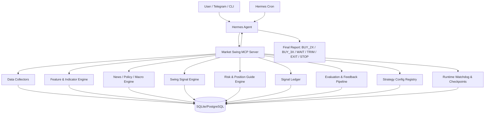

# Hermes Market Swing MCP 개발 계획서

## 1. 개요

이 문서는 Hermes Agent에 연결할 `Market Swing MCP Server`의 개발 계획서다. 목표는 BTC와 미국 지수 2~3배 롱 ETF를 대상으로, 스윙 관점에서 매수 가능 여부, 2배/3배 선택, 손절 조건, 익절 조건, 보유 포지션 관리 가이드를 생성하는 개인용 시장 판단 시스템을 만드는 것이다.

초기 목표는 자동 주문이 아니다. 먼저 데이터 수집, 지표 계산, 뉴스/매크로 해석, 신호 기록, 사후 평가, 텔레그램 리포트까지 구현한다. 주문 연동은 마지막 단계의 선택 사항이며, 기본값은 승인 기반 수동 실행으로 둔다.

주요 대상 상품은 다음과 같다.

| 구분 | 실제 매수 후보 | 판단 기준 |
| --- | --- | --- |
| 나스닥100 | QLD, TQQQ | QQQ, NDX, NQ futures |
| S&P500 | SSO, UPRO | SPY, SPX, ES futures |
| 반도체 | SOXL | SMH, SOXX, SOX, NVDA, AVGO, AMD |
| BTC | BTC coin-m long | BTC spot/futures, funding, OI |

최종 출력은 다음 액션 중 하나다.

```text
BUY_3X       강한 상승 스윙 진입 가능
BUY_2X       상승 스윙 가능하지만 변동성/이벤트 리스크 존재
BUY_WATCH    매수 후보이나 확인 필요
WAIT         관망
TRIM         일부 익절 또는 리스크 축소
EXIT         전량 청산 권고
STOP         진입 논리 무효화
BLOCK        신규 롱 금지
```

## 2. 시스템 정의

### 2.1 시스템의 역할

이 시스템은 Hermes Agent의 MCP 도구 서버로 동작한다. Hermes는 대화, 텔레그램, 크론, 메모리, 멀티모달 판단, 최종 설명 생성을 담당한다. MCP 서버는 데이터 수집, 지표 계산, 스코어링, 라벨링, 백테스트, 피드백 계산을 담당한다.

```text
Hermes Agent:
- Codex OAuth 또는 다른 LLM provider 사용
- 텔레그램/CLI에서 질문 수신
- 크론으로 정기 리포트 실행
- MCP 도구 호출
- 최종 설명과 판단 요약 생성

Market Swing MCP Server:
- 가격/매크로/뉴스/이벤트 데이터 수집
- 지표 계산
- 스윙 신호 계산
- 매수/손절/익절 가이드 생성
- 신호 기록
- 결과 라벨링
- 스코어링 성능 평가
- 개선 후보 제안
```

### 2.2 핵심 원칙

1. 숫자 계산은 코드가 한다.
2. LLM은 자료 해석, 충돌 판단, 설명 생성에 쓴다.
3. 레버리지 ETF는 장기 보유 자산이 아니라 스윙 전술 자산으로 본다.
4. 레버리지 ETF 판단은 ETF 자체보다 기초지수 기준으로 한다.
5. 신호는 반드시 기록하고, 일정 시간이 지난 뒤 실제 결과로 채점한다.
6. 스코어링 변경은 즉시 실전 반영하지 않고 Champion/Challenger 방식으로 검증한다.
7. 자동 주문은 MVP 범위에서 제외한다.
8. 새 기능은 단독 실행 가능한 하네스와 fixture를 우선 설계한다.

### 2.2.1 하네스 엔지니어링 원칙

Halo Swing은 외부 데이터, LLM 해석, 지표 계산, 스코어링이 결합되는 시스템이다. 따라서 기능을 바로 큰 에이전트 흐름에 붙이지 않고, 각 모듈을 작고 재현 가능한 실행 하네스로 감싼다.

```text
목표:
- 다음 LLM/Codex 세션이 안전하게 수정할 수 있는 작업 발판 제공
- live API 없이도 주요 판단 로직 재현
- 스코어링 변경 전후 결과 비교
- LLM prompt/output 변경의 회귀 탐지
```

필수 하네스:

```text
1. tool harness
   - 각 MCP tool을 Hermes 없이 직접 실행
   - 입력 JSON fixture -> 출력 JSON golden 비교

2. data harness
   - market/news/macro 수집기를 live/replay 모드로 분리
   - 외부 API 장애 시 fixture로 테스트 가능

3. indicator harness
   - OHLCV fixture -> RSI/DMI/ADX/MA/ATR expected output

4. scoring harness
   - feature fixture -> score/action/stop/take-profit expected output

5. labeling harness
   - price path fixture -> triple barrier outcome/MFE/MAE expected output

6. report harness
   - MCP structured output -> Hermes-facing report snapshot
```

원칙:

```text
- live API 테스트는 smoke로만 사용한다.
- 핵심 로직 검증은 deterministic fixture를 우선한다.
- LLM 출력은 가능하면 schema로 고정하고 snapshot/golden test를 둔다.
- 하네스가 없는 기능은 완료로 보지 않는다.
```

### 2.2.2 가상 개발팀 게이트

Codex 환경에서 지속형 멀티에이전트 팀이 항상 제공된다고 가정하지 않는다. 대신 각 작업은 아래 역할 관점의 산출물과 체크를 남긴다.

```text
Dev:
- 기능 구현
- 최소 실행 하네스
- 단위 테스트 또는 smoke command

DevOps:
- 로컬 개발 환경과 의존성 관리
- MCP 서버 실행 명령과 smoke command 관리
- Hermes MCP config 예시와 운영 가이드 관리
- secrets/.env 취급 원칙 확인

QC:
- fixture/golden test
- replay/live smoke 분리
- 회귀 가능성 기록

CTO:
- 아키텍처 일관성
- 과최적화/데이터 누수/리스크 예산 검토
- MVP 범위와 자동주문 금지선 확인

Docs Gardener:
- SSOT 변경 여부 확인
- CONTEXT/WORKING 갱신
- 중복 문서와 오래된 링크 제거
```

완료 정의:

```text
작업 완료 = 코드가 돌아감 + DevOps 실행 경로가 있음 + 하네스가 있음 + QC 재현 가능 + CTO 관점 리스크 확인 + 문서 상태 최신
```

### 2.3 주요 질문

시스템은 매번 다음 질문에 답해야 한다.

```text
1. 지금 지수 레버리지 롱을 살 수 있는 구간인가?
2. 산다면 2배가 적절한가, 3배가 적절한가?
3. 진입 논리가 깨지는 손절 조건은 무엇인가?
4. 익절 또는 일부 청산 조건은 무엇인가?
5. 보유 중이라면 유지, 축소, 전량 청산 중 무엇인가?
6. 이번 판단의 신뢰도와 약점은 무엇인가?
7. 과거 비슷한 신호는 실제로 어떻게 됐는가?
```

## 3. 아키텍처

### 3.1 전체 구조



### 3.2 MCP 서버 계층

```text
market_swing_mcp/
  app/
    server.py
    config.py
    schemas.py
    tools/
      market_snapshot.py
      macro_snapshot.py
      event_calendar.py
      news_bundle.py
      indicators.py
      chart_render.py
      swing_score.py
      trade_guide.py
      position_review.py
      feedback.py
    data/
      prices.py
      macro.py
      news.py
      events.py
      filings.py
    engines/
      feature_engine.py
      indicator_engine.py
      scoring_engine.py
      risk_engine.py
      labeler.py
      evaluator.py
      optimizer.py
    storage/
      db.py
      migrations/
    runtime/
      checkpoints.py
      watchdog.py
      journal.py
    reports/
      templates.py
  tests/
  requirements.txt
  .env.example
  README.md
```

### 3.3 MCP 도구 목록

| 도구 | 역할 |
| --- | --- |
| `get_market_snapshot` | QQQ, SPY, SMH, SOXX, BTC 등 가격/추세 요약 |
| `get_macro_snapshot` | VIX, VXN, DXY, 금리, 유가, 금 등 매크로 상태 |
| `get_event_calendar` | FOMC, CPI, PCE, NFP, 실적, 국채입찰 일정 |
| `get_news_bundle` | Fed, Treasury, White House, EIA, Iran, AI/반도체 뉴스 수집 |
| `calculate_indicators` | RSI, DMI/ADX, MA, ATR, gap, support/resistance 계산 |
| `render_chart` | 기초자산 차트 PNG 생성 |
| `score_leverage_swing` | 2배/3배 롱 ETF 매수 가능성 점수화 |
| `generate_trade_guide` | 진입/손절/익절/시간손절 가이드 생성 |
| `evaluate_position` | 보유 포지션의 유지/축소/청산 판단 |
| `record_signal` | 생성된 신호를 ledger에 저장 |
| `label_signal_outcome` | 신호 발생 후 결과 라벨링 |
| `evaluate_score_performance` | 스코어링 성능 리포트 |
| `suggest_weight_update` | 가중치/임계값 개선 후보 제안 |
| `compare_champion_challenger` | 현행 모델과 후보 모델 비교 |

### 3.3.1 설정, 상태, 감시 원칙

스코어링 가중치와 임계값은 코드에 하드코딩하지 않는다. 초기에는 JSON 파일로 시작하고, 운영 이력이 쌓이면 DB의 `strategy_config`/`model_registry`와 연결한다.

```text
원칙:
- 모든 신호는 config_version과 config_hash를 가진다.
- feedback pipeline은 active 설정을 직접 덮어쓰지 않고 candidate/challenger만 만든다.
- active 설정 변경은 명시적 승인 또는 별도 promotion 절차를 거친다.
- JSON 설정은 schema validation, bounds check, sum check를 통과해야 한다.
- 런타임 checkpoint와 재현용 입력 snapshot은 분리해서 저장한다.
- 메모리 덤프, logs, checkpoint, runtime artifact는 git에 커밋하지 않는다.
```

초기 JSON 설정 예시:

```json
{
  "config_id": "leverage_swing_default",
  "version": "0.1.0",
  "status": "champion",
  "target_universe": ["TQQQ", "QLD", "UPRO", "SSO", "SOXL", "BTC"],
  "weights": {
    "trend": 0.25,
    "momentum": 0.20,
    "volatility": 0.20,
    "macro": 0.15,
    "event_risk": 0.10,
    "theme": 0.10
  },
  "thresholds": {
    "buy_3x": 0.68,
    "buy_2x": 0.52,
    "block": 0.30
  },
  "risk": {
    "max_3x_event_risk": 0.35,
    "time_barrier_days": 10
  }
}
```

watchdog는 장기 실행 안정성을 위한 내부 감시 레이어다.

```text
감시 대상:
- memory_rss_mb 또는 프로세스 메모리 사용량
- run queue length / stale job
- 반복 예외와 재시도 폭증
- null/NaN/Inf 비율 증가
- 비정상적으로 큰 evidence bundle 또는 feature payload
- config hash mismatch
- checkpoint 지연 또는 실패

동작:
- warning event 기록
- 현재 run journal에 상태 추가
- 필요 시 checkpoint 저장
- hard limit 초과 시 신규 live 작업 차단 또는 graceful shutdown 요청
```

24/7 운영 안정성은 내부 watchdog와 외부 supervisor를 함께 사용한다. MCP 서버는 가능한 한 얇고 재시작 가능한 프로세스로 유지하고, 장시간 작업은 run journal/checkpoint로 복구 가능하게 만든다.

```text
필수 운영 가드레일:
- process supervisor: launchd/systemd/Hermes runner 등에서 restart policy와 crash-loop backoff 설정
- liveness/readiness: health_check와 runtime status를 분리
- memory budget: soft/hard RSS limit, cache TTL, max in-memory artifact size
- bounded queue: max queue length, stale job timeout, duplicate run lock
- timeout: live API, browser/news/PDF parsing, chart rendering, LLM call 각각에 deadline 설정
- retry policy: exponential backoff + jitter, max retry, provider별 rate limit
- circuit breaker: 외부 API 장애/429/5xx가 반복되면 live call을 임시 차단하고 replay/cache로 degraded mode
- idempotency: cron/report/labeling job은 run_id와 idempotency key로 중복 실행 방지
- atomic persistence: checkpoint와 JSON config는 temp file 작성 후 rename 또는 DB transaction 사용
- disk retention: logs/state/checkpoints/artifacts TTL과 최대 용량 제한
- alerting: critical watchdog_event는 Telegram 또는 운영 채널로 알림
- graceful degradation: 데이터 일부 장애 시 BUY 신호를 강제하지 않고 WAIT/BLOCK 또는 stale-data warning 출력
```

메모리 오버플로우 방지를 위한 기본 설계:

```text
- 뉴스/문서/차트 artifact는 메모리에 오래 들고 있지 않고 file/ref 기반으로 전달
- 대형 PDF/뉴스 번들은 chunk 단위 처리
- LLM/Hermes로 넘기는 context는 evidence card summary 중심으로 제한
- cache는 LRU/TTL과 max_items/max_bytes를 함께 둠
- job 종료 후 큰 객체와 임시 파일을 명시적으로 정리
- watchdog가 memory_rss_mb 증가 추세를 감시하고 soft limit에서는 checkpoint, hard limit에서는 신규 작업 차단
```

### 3.4 저장소 모델

초기에는 SQLite로 시작하고, 데이터가 쌓이면 PostgreSQL로 이전한다.

#### `feature_store`

신호 발생 당시의 모든 입력값을 저장한다.

```text
id
timestamp
symbol
underlying
timeframe
price
returns
rsi
plus_di
minus_di
adx
atr
ma_20
ma_50
ma_200
vix
vxn
dxy
us_2y
us_10y
oil
breadth_score
theme_score
event_risk_score
news_score
raw_features_json
```

#### `signal_ledger`

모든 판단을 기록한다.

```text
id
timestamp
model_version
config_version
config_hash
asset
underlying
action
final_score
p_take_profit
p_stop_loss
expected_r
entry_reference
stop_reference
take_profit_reference
time_barrier_days
component_scores_json
reason_json
guide_json
```

#### `label_store`

신호 이후 실제 결과를 저장한다.

```text
id
signal_id
label_timestamp
outcome
return_1d
return_3d
return_5d
return_10d
mfe
mae
hit_take_profit
hit_stop_loss
hit_time_exit
first_barrier_hit
realized_r
```

#### `model_registry`

스코어링 버전을 관리한다.

```text
model_version
created_at
status              champion / challenger / archived
weights_json
thresholds_json
feature_set_hash
notes
```

#### `strategy_config`

가중치와 임계값 설정을 버전 관리한다. 초기 JSON 파일과 DB 레코드가 같은 hash를 갖도록 관리한다.

```text
config_id
version
status              champion / challenger / archived
created_at
promoted_at
config_hash
target_universe_json
weights_json
thresholds_json
risk_json
validation_status
notes
```

#### `run_journal`

각 실행 단위의 입력, 출력, 오류, 사용 설정을 기록한다.

```text
run_id
started_at
finished_at
run_type            scheduled_report / user_question / labeling / evaluation
status              started / succeeded / failed / cancelled
config_hash
input_refs_json
output_refs_json
error_json
watchdog_summary_json
```

#### `state_checkpoint`

장기 실행 작업의 복구 가능한 중간 상태를 저장한다.

```text
checkpoint_id
run_id
created_at
checkpoint_type     graceful_shutdown / periodic / before_live_call / before_report
state_ref
state_hash
size_bytes
ttl_expires_at
```

#### `watchdog_event`

메모리 한계, 반복 오류, 비정상 값 등을 감시한 결과를 저장한다.

```text
event_id
run_id
timestamp
severity            info / warning / critical
metric_name
metric_value
threshold_value
action_taken
details_json
```

#### `position_journal`

사용자가 실제 진입한 포지션을 수동 또는 반자동으로 기록한다.

```text
id
asset
entry_time
entry_price
size
leverage_type       2x / 3x / btc_coin_m
thesis
stop_plan
take_profit_plan
exit_time
exit_price
exit_reason
notes
```

## 4. 개발 순서

### Phase 0. 프로젝트 초기화

목표: MCP 서버 개발을 위한 기본 구조를 만든다.

결과물:

```text
- Python 프로젝트 생성
- MCP 서버 실행 진입점
- 환경변수 로딩
- SQLite 연결
- 기본 테스트 환경
- Hermes 연결 예시 config
```

### Phase 1. 시장 데이터와 지표 엔진

목표: QQQ, SPY, SMH/SOXX, BTC 가격 데이터를 가져오고 기본 지표를 계산한다.

결과물:

```text
- get_market_snapshot
- calculate_indicators
- RSI, DMI/ADX, MA, ATR 계산
- gap/support/resistance 기본 탐지
- feature_store 저장
```

### Phase 2. 레버리지 ETF 스윙 판단 엔진

목표: 2배/3배 레버리지 ETF의 스윙 매수/관망/청산 가이드를 만든다.

결과물:

```text
- score_leverage_swing
- generate_trade_guide
- strategy_config JSON 로드/검증
- BUY_2X / BUY_3X / WAIT / TRIM / EXIT / STOP 판단
- QQQ/SPY/SOX 기준 진입/손절/익절 조건 생성
```

### Phase 3. 매크로/이벤트 필터

목표: VIX, VXN, DXY, 금리, 유가, 주요 경제 이벤트를 반영한다.

결과물:

```text
- get_macro_snapshot
- get_event_calendar
- event danger window 계산
- CPI/FOMC/NFP/빅테크 실적 전 매수금지 로직
```

### Phase 4. 뉴스/정책/지정학 엔진

목표: Fed, Treasury, White House, EIA, Iran, AI/반도체 뉴스가 스윙 판단에 미치는 영향을 점수화한다.

결과물:

```text
- get_news_bundle
- evidence card 생성
- news_score
- policy_score
- geopolitical_score
- AI/semiconductor theme_score
```

### Phase 5. 신호 기록과 결과 라벨링

목표: 모든 신호를 저장하고, 일정 시간이 지난 뒤 결과를 자동 라벨링한다.

결과물:

```text
- record_signal
- label_signal_outcome
- triple barrier labeling
- MFE/MAE 계산
- stop/take-profit/time-exit 판정
- 신호별 config_version/config_hash 추적
- run_journal 기록
```

### Phase 6. 스코어링 피드백 파이프라인

목표: 스코어링이 실제로 유효했는지 자동 평가한다.

결과물:

```text
- evaluate_score_performance
- score bin calibration
- component attribution
- ablation test
- suggest_weight_update
- compare_champion_challenger
- strategy_config challenger 후보 생성
```

### Phase 7. Hermes 통합

목표: Hermes에서 MCP 서버를 호출하고 텔레그램/크론으로 리포트를 받는다.

결과물:

```text
- ~/.hermes/config.yaml MCP 등록 예시
- 미국장 전/중/후 cron prompt
- 텔레그램 리포트 포맷
- 보유 포지션 리뷰 프롬프트
- periodic checkpoint
- runtime watchdog
```

### Phase 8. 멀티모달 판단 확장

목표: 차트 이미지, PDF, 표, 뉴스 캡처 등 멀티모달 자료를 Hermes 판단에 포함한다.

결과물:

```text
- render_chart
- chart image artifact
- PDF/문서 요약 입력
- evidence card에 modality 저장
- Hermes 최종 멀티모달 리포트
```

### Phase 9. 선택 사항: 주문 연동

목표: 브로커/거래소 연동을 붙이되 기본값은 수동 승인으로 유지한다.

결과물:

```text
- broker/exchange connector
- read-only portfolio sync
- order preview
- approval-required execution
- emergency kill switch
```

## 5. 각 순서에 맞는 상세 개발 계획

### Phase 0 상세 계획: 프로젝트 초기화

작업:

```text
1. `market_swing_mcp` 프로젝트 생성
2. `.venv` 기반 `requirements.txt` 작성
3. MCP 서버 실행 명령 정의
4. `.env.example` 작성
5. 기본 health check 도구 작성
6. MCP tool 직접 실행용 CLI/test harness 작성
7. fixture/golden test 디렉터리 생성
8. DevOps 개발환경/Hermes 설정 가이드 작성
9. P1 storage/schema 설계 범위 확정
```

완료 기준:

```text
- `.venv` 기반 MCP 서버 명령 실행 가능
- Hermes MCP config에 등록 가능
- `health_check` 호출 시 정상 응답
- `health_check`를 Hermes 없이 CLI/test harness로 검증 가능
- `tests/fixtures/`와 golden output 구조 존재
- DevOps 가이드에 로컬 설치, smoke, Hermes MCP 설정 절차가 존재
- SQLite/schema는 P1에서 feature_store, signal_ledger, strategy_config, runtime observability를 함께 보고 설계
```

P0 storage/schema 범위:

```text
P0에서는 SQLite skeleton과 도메인 스키마를 만들지 않는다.
P1 시작 시 storage/schema architecture review를 먼저 수행한다.
이때 feature_store, signal_ledger, label_store, strategy_config, run_journal, checkpoint, watchdog_event를 함께 검토한다.
```

Phase 0 Hermes 설정 예시:

```yaml
mcp_servers:
  market_swing:
    type: stdio
    command: "./.venv/bin/python"
    args: ["-m", "halo_swing_mcp.server"]
    env:
      PYTHONPATH: "src"
    tools:
      include:
        - health_check
    resources: false
```

시장/매크로/뉴스 API key와 추가 도구 등록은 해당 phase 구현 후 DevOps 가이드와 함께 확장한다.

### Phase 1 상세 계획: 시장 데이터와 지표 엔진

작업:

```text
1. OHLCV 수집기 구현
2. QQQ, SPY, SMH, SOXX, BTC 기본 심볼 지원
3. 일봉, 4시간봉, 1시간봉 지원
4. RSI 계산
5. DMI/ADX 계산
6. MA 10/20/50/200 계산
7. ATR 계산
8. gap, previous swing high/low 탐지
9. feature_store 저장
10. OHLCV fixture 기반 indicator harness 작성
```

주의:

```text
- 레버리지 ETF 신호 계산은 TQQQ/QLD 가격보다 QQQ 기준을 우선한다.
- SOXL은 SOXX/SMH/SOX와 주요 반도체 주도주를 함께 본다.
- BTC는 24시간장이므로 미국장 기준 이벤트와 별도 시간축을 둔다.
```

완료 기준:

```text
- `calculate_indicators("QQQ", "1d")` 정상 응답
- `get_market_snapshot(["QQQ", "SPY", "SMH", "BTC"])` 정상 응답
- 지표 계산 테스트 통과
- fixture 기반 indicator golden test 통과
```

### Phase 2 상세 계획: 레버리지 ETF 스윙 판단 엔진

작업:

```text
1. trend_score 계산
2. pullback_score 계산
3. volatility_score 계산
4. breadth_score 계산
5. theme_score 계산
6. event_risk_score 결합
7. strategy_config JSON schema validation
8. config_hash 생성과 score output 연결
9. 최종 swing_score 생성
10. 2배/3배 선택 로직 작성
11. 진입/손절/익절 가이드 생성
```

초기 룰:

```text
BUY_3X:
- trend_score 강함
- volatility_score 양호
- event_risk 낮음
- QQQ/SPY가 50일선 위
- VIX/VXN 하락 또는 안정

BUY_2X:
- 추세는 살아 있으나 변동성 또는 이벤트 리스크가 중간

WAIT:
- 점수 중립 또는 충돌 많음

BLOCK:
- VIX 급등, DXY 급등, 금리 급등, 이벤트 직전, 200일선 하회
```

초기 출력:

```json
{
  "asset": "TQQQ",
  "underlying": "QQQ",
  "config_version": "0.1.0",
  "config_hash": "sha256:...",
  "action": "BUY_2X",
  "score": 0.52,
  "p_take_profit": null,
  "p_stop_loss": null,
  "entry": "QQQ 전일 고점 회복 시 분할 진입",
  "stop": ["QQQ 전저점 이탈", "VIX 재급등", "3거래일 내 반등 실패"],
  "take_profit": ["QQQ 갭 메움", "직전 저항", "RSI 70 이상 + +DI 과열"]
}
```

완료 기준:

```text
- QLD/TQQQ/SSO/UPRO/SOXL에 대한 기본 가이드 생성
- 손절/익절 조건이 반드시 포함됨
- 신호 이유와 약점이 함께 반환됨
- 어떤 strategy_config로 나온 신호인지 재현 가능함
```

### Phase 3 상세 계획: 매크로/이벤트 필터

작업:

```text
1. VIX, VXN, DXY, 2Y, 10Y, oil 데이터 수집
2. 전일 대비/5일 변화율 계산
3. 이벤트 캘린더 구조 생성
4. 이벤트 위험 시간대 계산
5. 매수금지 필터 구현
```

이벤트 위험 시간대:

```text
FOMC:
- 발표 24시간 전 신규 3X 금지
- 발표 4시간 전 신규 2X 금지
- 발표 후 첫 30~60분 관망

CPI/PCE/NFP:
- 발표 전날 종가 이후 신규 3X 금지
- 발표 전 4시간 신규 2X 금지
- 발표 후 변동성 진정 확인

빅테크 실적:
- NVDA, MSFT, AAPL, AMZN, GOOGL, META, AVGO 등 발표 전 관련 상품 리스크 축소
```

완료 기준:

```text
- `get_event_calendar(days=14)` 정상 응답
- `get_macro_snapshot()` 정상 응답
- 이벤트 직전 BUY_3X가 자동 차단됨
```

### Phase 4 상세 계획: 뉴스/정책/지정학 엔진

작업:

```text
1. Fed 공식 RSS/발표 수집
2. Treasury 발표 수집
3. White House 발표 수집
4. EIA 에너지/유가 관련 발표 수집
5. 주요 뉴스 RSS 수집
6. Iran/Hormuz/oil shock 키워드 분류
7. AI/semiconductor leadership 분류
8. Evidence Card 생성
```

Evidence Card 스키마:

```json
{
  "source": "FOMC statement",
  "modality": "text_or_pdf",
  "asset_scope": ["QQQ", "TQQQ", "QLD", "BTC"],
  "time_horizon": "swing",
  "bias": "risk_off",
  "strength": 0.72,
  "confidence": 0.81,
  "summary": "연준 문구가 예상보다 매파적",
  "buy_impact": "block",
  "sell_impact": "trim_or_exit",
  "invalidating_condition": "금리/DXY 하락 전환"
}
```

완료 기준:

```text
- `get_news_bundle(topic="macro")` 정상 응답
- 뉴스별 bias, strength, confidence 반환
- 신호 엔진이 news_score를 사용할 수 있음
```

### Phase 5 상세 계획: 신호 기록과 결과 라벨링

작업:

```text
1. record_signal 구현
2. 신호 발생 당시 feature snapshot 저장
3. signal_ledger에 config_version/config_hash 저장
4. run_journal 저장
5. triple barrier labeler 구현
6. MFE/MAE 계산
7. 1/3/5/10일 결과 업데이트
8. label_store 저장
```

라벨 종류:

```text
TAKE_PROFIT_FIRST
STOP_LOSS_FIRST
TIME_EXIT
NO_DATA
INVALIDATED_BY_EVENT
```

완료 기준:

```text
- 과거 신호 하나를 넣고 outcome 자동 계산 가능
- stop/take-profit/time barrier 중 무엇이 먼저 맞았는지 계산 가능
- 신호와 실행 기록이 config_hash로 재현 가능
```

### Phase 6 상세 계획: 스코어링 피드백 파이프라인

작업:

```text
1. score bin별 성과 계산
2. score calibration 계산
3. component attribution 계산
4. ablation test 구현
5. Champion/Challenger 평가
6. 개선 후보 strategy_config JSON 생성
7. config validation과 bounds check
8. promotion report 생성
```

리포트 예시:

```text
최근 30개 BUY_2X 신호:
- TAKE_PROFIT_FIRST: 18
- STOP_LOSS_FIRST: 7
- TIME_EXIT: 5
- 평균 realized R: 0.42
- 0.60 이상 점수 구간이 0.40~0.60 구간보다 성과 우수

문제:
- theme_score가 높은 구간에서 실제 손절률 증가
- volatility_score 가중치 부족

제안:
- 3X 임계값 0.60 → 0.68
- volatility weight 0.20 → 0.25
- theme weight 0.10 → 0.07
```

완료 기준:

```text
- `evaluate_score_performance(days=90)` 리포트 생성
- `suggest_weight_update()`가 후보를 생성
- 후보는 challenger로만 등록되고 champion은 자동 변경되지 않음
- 후보 JSON은 validation을 통과해야 하며 active 설정을 직접 덮어쓰지 않음
```

### Phase 7 상세 계획: Hermes 통합

작업:

```text
1. Hermes MCP config 작성
2. 텔레그램 gateway 설정
3. 미국장 전 리포트 cron 작성
4. 미국장 중 위험감시 cron 작성
5. 미국장 마감 후 리뷰 cron 작성
6. 포지션 리뷰 프롬프트 작성
7. run journal과 checkpoint 저장 주기 설정
8. watchdog memory/error/stale-job 감시 설정
```

크론 예시:

```text
Every weekday at 8:30am New York time,
use market_swing MCP to check QQQ, SPY, SMH, SOXX, VIX, VXN, DXY, rates, oil,
then send me a leveraged ETF swing guide on Telegram.
Include BUY_2X/BUY_3X/WAIT, stop conditions, take-profit conditions, and key risks.
```

완료 기준:

```text
- 텔레그램으로 장전 리포트 수신
- 수동 질문 "오늘 TQQQ 살 자리야?"에 응답
- 보유 포지션 리뷰 가능
- 장기 실행 중 checkpoint/watchdog event가 기록됨
```

### Phase 8 상세 계획: 멀티모달 확장

작업:

```text
1. chart renderer 구현
2. QQQ/SPY/SOX/BTC 차트 PNG 생성
3. PDF/이미지 파일 경로를 evidence card에 연결
4. Hermes가 차트 이미지를 최종 판단에 포함하도록 프롬프트 작성
5. 차트 이미지 판단과 코드 지표 계산의 충돌 감지
```

주의:

```text
- 차트 이미지에서 지표값을 추정하지 않는다.
- 지표값은 코드 계산값을 사용한다.
- 이미지 분석은 갭, 저항, 추세선, 시각적 맥락 확인에 사용한다.
```

완료 기준:

```text
- `render_chart("QQQ", "1d")`가 PNG 경로 반환
- Hermes 리포트에 차트 이미지와 수치 지표가 함께 반영됨
```

### Phase 9 상세 계획: 주문 연동

작업:

```text
1. 브로커/거래소 read-only 연동
2. 실제 보유 포지션 자동 인식
3. order preview 생성
4. approval-required 주문 실행
5. kill switch 구현
```

초기 제한:

```text
- 자동 신규 주문 금지
- 자동 물타기 금지
- 자동 주문은 사용자가 명시적으로 승인할 때만 가능
- API key는 trade 권한과 withdraw 권한을 분리
```

완료 기준:

```text
- 포지션 조회 가능
- 주문 미리보기 가능
- 승인 없이는 주문 실행 불가
```

## 6. 부록: 계산 관련 근거

### A. RSI

RSI는 평균 상승폭과 평균 하락폭의 비율로 모멘텀 과열/과매도를 측정한다.

```text
RS = average_gain / average_loss
RSI = 100 - 100 / (1 + RS)
```

사용:

```text
RSI 30 이하:
- 과매도 후보
- 단독 매수 신호가 아니라 반등 후보 조건

RSI 65~75 이상:
- 과열 후보
- 단독 매도 신호가 아니라 익절 보조 조건
```

### B. DMI / ADX

DMI는 상승 방향 움직임과 하락 방향 움직임을 비교한다.

```text
up_move = high_t - high_{t-1}
down_move = low_{t-1} - low_t

+DM = up_move if up_move > down_move and up_move > 0 else 0
-DM = down_move if down_move > up_move and down_move > 0 else 0

TR = max(
  high_t - low_t,
  abs(high_t - close_{t-1}),
  abs(low_t - close_{t-1})
)

+DI = 100 * smoothed(+DM) / smoothed(TR)
-DI = 100 * smoothed(-DM) / smoothed(TR)
DX = 100 * abs(+DI - -DI) / (+DI + -DI)
ADX = smoothed(DX)
```

사용:

```text
-DI 급등:
- 하락 압력 강함
- 과매도 클러스터 후보
- 반전 확인 없이 바로 매수하면 위험

+DI 급등:
- 상승 압력 강함
- 보유 롱의 익절 보조 신호
- 강한 추세에서는 조기매도 위험도 존재
```

### C. ATR

ATR은 변동성 기반 손절폭 계산에 사용한다.

```text
ATR = moving_average(TR, n)
```

손절 후보:

```text
stop_price = entry_price - k * ATR
```

레버리지 ETF는 기초자산 기준 손절을 우선한다.

```text
TQQQ 손절 기준:
- TQQQ 가격 자체보다 QQQ 전저점/ATR/MA 이탈 기준 우선
```

### D. 이동평균과 추세 필터

초기 추세 조건:

```text
상승 추세:
- close > MA50
- MA20 slope > 0
- close > MA200

주의 구간:
- close < MA50
- MA20 slope < 0

매수 금지 후보:
- close < MA200
- MA50 < MA200
```

### E. 갭과 저항

갭 메움은 스윙 익절 후보로 사용한다.

```text
gap_up:
previous_high < current_low

gap_down:
previous_low > current_high
```

익절 후보:

```text
- 직전 갭 하단/상단
- 직전 swing high
- 50일선 또는 200일선 재접근
- 이전 대량거래 구간
```

### F. Triple Barrier Labeling

신호의 성공 여부는 단순히 N일 뒤 수익률로 판단하지 않는다. 손절선과 익절선 중 무엇을 먼저 맞았는지 본다.

```text
upper_barrier = entry_price * (1 + take_profit_pct)
lower_barrier = entry_price * (1 - stop_loss_pct)
time_barrier = entry_time + N trading days
```

결과:

```text
TAKE_PROFIT_FIRST:
- upper_barrier를 먼저 터치

STOP_LOSS_FIRST:
- lower_barrier를 먼저 터치

TIME_EXIT:
- 시간 장벽까지 둘 다 미도달
```

이 방식은 스윙 매매의 경로 의존성을 반영한다.

### G. MFE / MAE

MFE는 신호 이후 최대 유리 이동폭, MAE는 최대 불리 이동폭이다.

```text
MFE = max(price_path - entry_price) / entry_price
MAE = min(price_path - entry_price) / entry_price
```

롱 기준:

```text
MFE가 크고 MAE가 작으면 좋은 신호
MFE가 작고 MAE가 크면 나쁜 신호
```

### H. 기대값

R 단위 손익을 사용한다.

```text
R = 손실 위험 1단위
realized_R = realized_pnl / initial_risk
expected_R = p_win * avg_win_R - p_loss * avg_loss_R
```

실행 조건:

```text
expected_R > 0
p_stop_loss가 과도하게 높지 않음
MFE/MAE 비율 양호
```

### I. 점수에서 확률로 전환

초기에는 룰 기반 점수를 사용한다.

```text
raw_score =
  trend_score * w_trend
+ macro_score * w_macro
+ volatility_score * w_volatility
+ breadth_score * w_breadth
+ theme_score * w_theme
+ event_risk_score * w_event
```

이후 데이터가 쌓이면 확률 모델로 전환한다.

```text
p_take_profit = model(features)
p_stop_loss = model(features)
expected_R = p_take_profit * avg_win_R - p_stop_loss * avg_loss_R
```

초기 후보:

```text
- Logistic Regression
- Gradient Boosting
- Random Forest
- XGBoost/LightGBM
```

주의:

```text
- 신호 수가 적을 때 복잡한 모델 금지
- 먼저 룰 기반 + 캘리브레이션 리포트로 시작
```

### J. 스코어 캘리브레이션

점수 구간별 실제 성과를 비교한다.

```text
score 0.30~0.40: 성공률 x%
score 0.40~0.50: 성공률 y%
score 0.50~0.60: 성공률 z%
score 0.60 이상: 성공률 w%
```

좋은 스코어링은 점수가 높을수록 실제 성과도 좋아야 한다.

문제 신호:

```text
0.70 이상 신호가 0.40대 신호보다 성과가 나쁨
→ 가중치 또는 feature 정의 문제
```

### K. Ablation Test

모듈별 기여도를 확인한다.

```text
full_model
minus_trend_score
minus_macro_score
minus_volatility_score
minus_theme_score
minus_event_risk_score
```

해석:

```text
특정 모듈 제거 후 성과가 좋아짐
→ 해당 모듈이 노이즈이거나 가중치 과대

특정 모듈 제거 후 손절률 증가
→ 해당 모듈은 리스크 방어에 기여
```

### L. Champion / Challenger

자동 개선은 실전 모델에 바로 반영하지 않는다.

```text
Champion:
- 현재 실사용 모델

Challenger:
- 새 가중치/임계값 후보

Shadow:
- 실제 알림에는 쓰지 않고 뒤에서만 결과 비교
```

승격 조건 예시:

```text
- 최소 30~100개 신호
- 최소 4~8주 검증
- realized_R 개선
- stop_loss_first 비율 감소
- 3X 신호의 drawdown 악화 없음
```

### M. 레버리지 ETF 복리 효과

2배/3배 ETF는 일일 수익률 배수를 목표로 한다. 보유기간이 길어지면 기초지수의 단순 배수와 달라질 수 있다.

기초지수 일별 수익률이 `r_t`이고 레버리지가 `L`이면 이론상 레버리지 ETF 경로는 다음과 같다.

```text
leveraged_return_path = product(1 + L * r_t) - 1
underlying_simple_multiple = L * (product(1 + r_t) - 1)
```

두 값은 일반적으로 같지 않다. 변동성이 높고 횡보할수록 레버리지 ETF는 불리해질 수 있다.

관련 참고:

```text
- SEC Leveraged and Inverse ETF Bulletin
  https://www.investor.gov/introduction-investing/general-resources/news-alerts/alerts-bulletins/investor-alerts/sec

- FINRA Leveraged and Inverse ETPs
  https://www.finra.org/investors/insights/lowdown-leveraged-and-inverse-exchange-traded-products
```

### N. 2배와 3배 선택 기준

초기 규칙:

```text
BUY_3X:
- trend_score 높음
- volatility_score 양호
- event_risk 낮음
- expected_R 충분히 높음
- 예상 보유기간 짧음

BUY_2X:
- 추세는 양호하지만 변동성 또는 이벤트 리스크 존재
- 예상 보유기간이 더 길 수 있음
- 3X의 MAE가 너무 큼

WAIT:
- expected_R 낮음
- p_stop_loss 높음
- event danger window
```

### O. 리스크 예산

포지션 크기는 신호 강도가 아니라 손실 가능액 기준으로 정한다.

```text
risk_amount = account_equity * risk_budget_pct
position_size = risk_amount / abs(entry_price - stop_price)
```

레버리지 ETF에서는 기초자산 기준 손절폭을 ETF 예상 손실폭으로 변환한다.

```text
estimated_etf_loss_pct ≈ leverage * underlying_stop_pct
```

단, 실제 ETF 가격, 슬리피지, 갭, 변동성 drag를 고려해 보수적으로 잡는다.

### P. 과최적화 방지 근거

백테스트 최적화는 선택 편향과 과최적화 위험이 크다. 특히 여러 파라미터와 여러 전략을 반복 비교하면 우연히 좋아 보이는 조합이 쉽게 나온다.

따라서 다음 원칙을 적용한다.

```text
- 파라미터 변경은 제한적으로
- out-of-sample 성능 우선
- walk-forward 검증
- Champion/Challenger shadow 검증
- Deflated Sharpe Ratio 또는 유사한 보수적 성과 지표 검토
- 단일 장세에서 맞춘 룰을 전체 장세에 적용하지 않음
```

관련 참고:

```text
- Bailey, Borwein, López de Prado, Zhu, The Probability of Backtest Overfitting
  https://papers.ssrn.com/sol3/papers.cfm?abstract_id=2326253

- Bailey, López de Prado, The Deflated Sharpe Ratio
  https://papers.ssrn.com/sol3/papers.cfm?abstract_id=2460551
```

### Q. 초기 스코어링 예시

초기 룰 기반 스코어:

```text
index_swing_score =
  trend_score        * 0.25
+ macro_score        * 0.20
+ volatility_score   * 0.20
+ breadth_score      * 0.15
+ theme_score        * 0.10
+ event_risk_score   * 0.10
```

초기 판단:

```text
score >= 0.60:
  BUY_3X 후보

0.35 <= score < 0.60:
  BUY_2X 후보

0.10 <= score < 0.35:
  BUY_WATCH

-0.10 <= score < 0.10:
  WAIT

score < -0.10:
  BLOCK 또는 EXIT 검토
```

향후 개선:

```text
- score를 확률로 캘리브레이션
- p_take_profit, p_stop_loss, expected_R 중심으로 판단 변경
- 룰 기반 점수는 feature 또는 prior로 사용
```

### R. Hermes 최종 리포트 포맷

```text
대상: QLD / TQQQ
판단: BUY_2X
신뢰도: 중간

근거:
- QQQ 50일선 방어
- VIX 하락 전환
- DXY/금리 급등 진정
- AI/반도체 주도주 회복

진입:
- QQQ가 전일 고점 회복 시 분할 진입

손절:
- QQQ 전저점 이탈
- VIX 재급등
- 진입 후 3거래일 내 반등 실패

익절:
- QQQ 갭 메움
- 직전 저항 도달
- RSI 70 이상 + +DI 과열

주의:
- FOMC/CPI/NFP 이벤트가 가까우면 3X 금지
- 2X 우선, 3X는 변동성 추가 하락 확인 후
```
